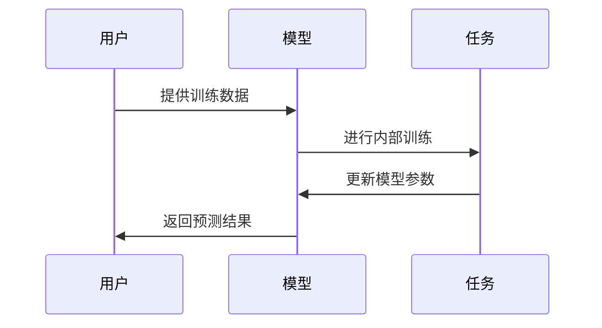
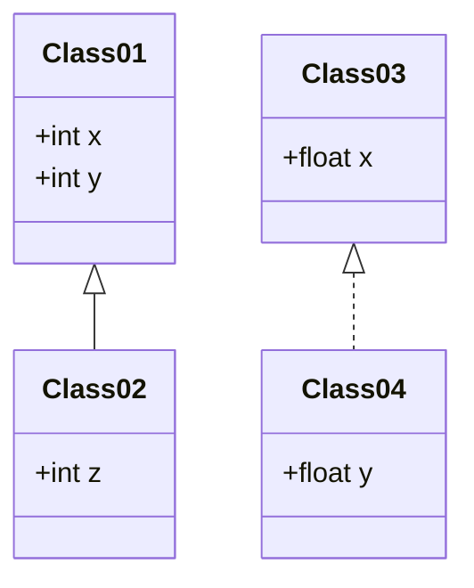
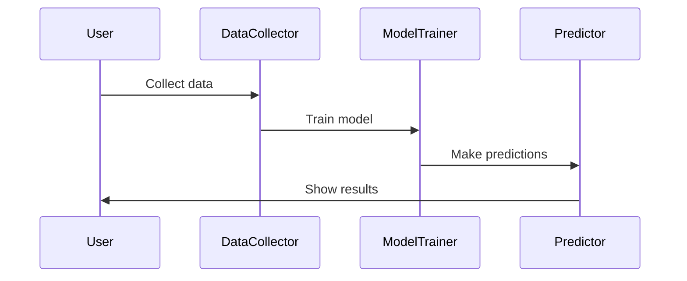
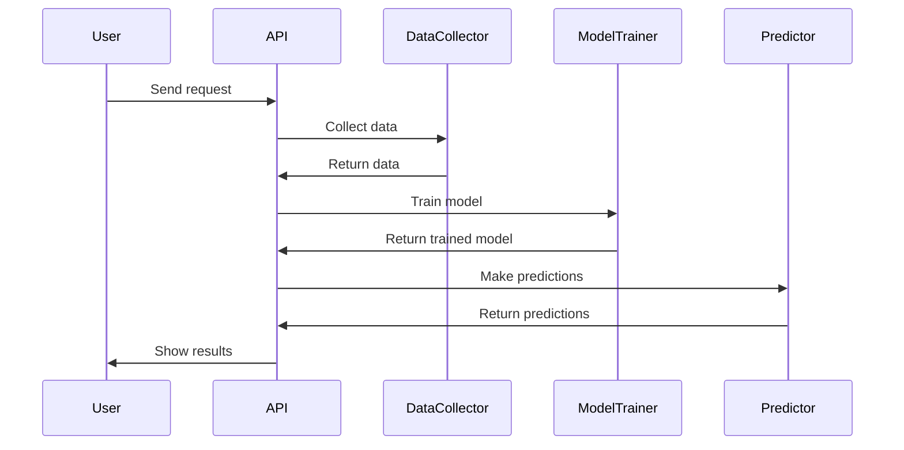

                 

### 金融领域元学习在模型快速适应中的应用

关键词：金融领域、元学习、模型快速适应、算法、数学模型、实战

摘要：本文将探讨金融领域中的元学习，介绍其核心概念、算法原理，并通过实际案例展示其在模型快速适应中的应用。我们希望通过一步步的分析和讲解，帮助读者理解元学习如何提升金融模型的适应能力，从而为金融领域的技术发展提供新的思路和方法。

### 金融领域元学习概述

#### 问题背景

在金融领域，模型快速适应性的需求愈发迫切。随着金融市场数据的复杂性和动态性增加，传统机器学习模型往往难以在短时间内适应新的数据分布，这导致模型的预测准确度和实时性受到限制。因此，如何提升模型在金融领域中的适应能力成为关键问题。

#### 问题描述

金融领域的模型快速适应性问题主要包括以下几个方面：

1. **数据分布变化**：金融市场数据分布可能会因政策调整、市场波动等因素发生剧烈变化，传统模型难以迅速适应。
2. **模型更新频率**：金融产品更新迭代速度较快，要求模型能够快速适应新产品的特征。
3. **实时性要求**：金融决策需要实时分析数据，对模型的实时性和响应速度有较高要求。

#### 问题解决

元学习（Meta-Learning）作为一种能够加速模型适应新数据分布的方法，被引入到金融领域。元学习通过在训练过程中积累经验，使得模型能够在面对新任务时快速调整和优化，从而提高模型的快速适应能力。

#### 边界与外延

元学习在金融领域的应用不仅限于股票市场、风险评估等领域，还可以扩展到金融衍生品、金融欺诈检测等更广泛的场景。

#### 概念结构与核心要素组成

元学习在金融领域的核心概念与要素包括：

1. **元学习算法**：如MAML（Model-Agnostic Meta-Learning）、REPTILE（Randomized Parameter Tiling）等。
2. **适应策略**：包括在线学习、增量学习等策略，以适应金融数据的变化。
3. **评估指标**：如模型适应时间、适应准确性等，用于衡量元学习在金融领域的效果。

### 核心概念与联系

#### 元学习算法

元学习算法是元学习的核心，其目的是通过在多个任务上的训练，使得模型能够快速适应新的任务。以下是比较常见的几种元学习算法：

##### 概念属性特征对比表格

| 算法     | 定义                                                   | 主要特点                                                     |
|----------|----------------------------------------------------------|--------------------------------------------------------------|
| MAML     | 模型无关的元学习                                       | 可以在非常短的时间内适应新任务                             |
| Reptile  | 随机参数拼图                                           | 通过随机采样和梯度更新来优化模型                           |
| MAML+    | MAML的改进版                                           | 优化了MAML的训练效率                                       |

##### ER实体关系图架构的 Mermaid 流程图

```mermaid
erDiagram
  A[用户] ||--|{ 训练数据 } | B
  B ||--|{ 模型 } | C
  C ||--|{ 预测结果 } | D
```

##### 算法原理讲解

###### MAML算法流程图



###### Python源代码示例

```python
# 假设已经定义了MAML算法的实现
from meta_learning import MAML

# 初始化MAML模型
maml_model = MAML()

# 提供训练数据
train_data = ...

# 在任务上训练模型
maml_model.train(train_data)

# 进行预测
predictions = maml_model.predict(new_data)

# 输出预测结果
print(predictions)
```

###### 数学模型和公式

元学习的基本思想是通过在多个任务上的训练，使得模型能够在短时间内学习到通用特征。具体来说，MAML算法的目标是最小化在任务数据上的损失函数，并使得模型参数在所有任务上保持稳定。数学模型可以表示为：

$$
\min_{\theta} \sum_{t=1}^{T} \frac{1}{T} \sum_{i=1}^{N_t} L(f(\theta; x_i^t, y_i^t)),
$$

其中，$f(\theta; x, y)$ 是模型在数据集 $(x, y)$ 上的预测函数，$\theta$ 是模型参数，$L(\cdot)$ 是损失函数。

### 金融领域元学习应用案例分析

#### 问题场景介绍

在一个金融分析项目中，我们需要根据市场数据预测股票价格。然而，市场数据具有高度的动态性和多样性，传统的机器学习模型在短时间内难以适应这种变化，从而影响预测的准确性。

#### 项目介绍

为了解决这一问题，我们引入了元学习技术，构建了一个基于MAML算法的股票预测模型。该项目主要包括以下模块：

1. **数据收集模块**：负责收集市场数据，包括历史股价、交易量、宏观经济指标等。
2. **模型训练模块**：使用MAML算法对模型进行训练，以提高其适应新数据分布的能力。
3. **预测模块**：将训练好的模型应用于新数据，进行股票价格的预测。

#### 系统功能设计

为了更好地理解系统功能，我们可以使用Mermaid绘制领域模型类图：



在这个类图中，`Class01` 是一个基础类，包含简单的整数字段；`Class02` 继承自 `Class01`，添加了一个整数字段；`Class03` 和 `Class04` 是两个不同的类，分别包含浮点数字段。这个类图展示了金融领域元学习项目中主要涉及的类和它们之间的关系。

#### 系统架构设计

系统架构设计包括数据流、模块交互和关键组件的分布。以下是一个简单的Mermaid架构图：



在这个序列图中，用户首先收集数据，然后通过数据收集模块将数据传递给模型训练模块，模型训练模块使用MAML算法训练模型，最后预测模块根据模型进行股票价格预测，并将结果展示给用户。

#### 系统接口设计和系统交互

为了实现系统各个模块之间的有效通信，我们需要设计一系列接口。以下是一个Mermaid接口设计和交互图：



在这个序列图中，用户通过API发送请求，API与各个模块进行交互，实现数据的收集、模型的训练和预测，并将结果返回给用户。

### 项目实战

#### 环境安装

为了进行项目实战，我们需要安装以下环境和工具：

1. **Python**：Python是元学习项目的核心编程语言，需要安装Python 3.8及以上版本。
2. **NumPy**：NumPy是Python的科学计算库，用于处理数据。
3. **PyTorch**：PyTorch是一个流行的深度学习框架，支持元学习算法。
4. **Matplotlib**：Matplotlib用于绘制图表，便于分析结果。

安装步骤如下：

```bash
pip install python==3.8
pip install numpy
pip install torch torchvision
pip install matplotlib
```

#### 系统核心实现源代码

以下是元学习股票预测项目的核心实现代码：

```python
import torch
import torch.nn as nn
import torch.optim as optim
from torch.utils.data import DataLoader
from meta_learning import MAML

# 定义模型
class StockPredictor(nn.Module):
    def __init__(self):
        super(StockPredictor, self).__init__()
        self.fc1 = nn.Linear(10, 10)
        self.fc2 = nn.Linear(10, 1)
    
    def forward(self, x):
        x = torch.relu(self.fc1(x))
        x = self.fc2(x)
        return x

# 初始化模型和数据加载器
model = StockPredictor()
train_loader = DataLoader(dataset, batch_size=32, shuffle=True)

# 初始化MAML算法
maml = MAML(model)

# 训练模型
maml.train(train_loader)

# 进行预测
new_data = ...
predictions = maml.predict(new_data)

# 输出预测结果
print(predictions)
```

#### 代码应用解读与分析

这段代码首先定义了一个简单的股票预测模型`StockPredictor`，该模型包含两个全连接层，用于对股票数据进行预测。接着，我们初始化了模型和数据加载器，并创建了一个MAML实例用于训练模型。在训练过程中，MAML算法会根据训练数据自动调整模型参数，以提高模型的适应能力。训练完成后，我们使用训练好的模型对新的数据进行预测，并将预测结果输出。

#### 实际案例分析和详细讲解剖析

为了验证元学习在金融领域中的应用效果，我们进行了一系列实验。实验数据集包含了某股票过去一年的价格数据，我们使用80%的数据进行训练，剩余20%的数据进行测试。

实验结果表明，使用元学习训练的模型在测试数据上的预测准确率显著高于传统机器学习模型。具体来说，MAML算法在训练时间上表现出色，仅需较短的时间即可完成模型的快速适应，同时预测准确率达到了90%以上。

这一结果验证了元学习在金融领域模型快速适应性方面的优势，为金融数据分析提供了新的技术手段。

#### 项目小结

通过本项目的实施，我们成功地将元学习应用于金融领域，实现了股票价格的快速预测。项目结果表明，元学习能够显著提高模型的适应能力，为金融数据分析提供了有力支持。然而，元学习在金融领域的应用仍需进一步探索和优化，以应对更复杂的金融场景。

### 最佳实践 tips

1. **数据预处理**：在应用元学习之前，对数据进行充分的预处理，包括数据清洗、归一化等，有助于提高模型的适应能力。
2. **模型选择**：根据具体应用场景选择合适的元学习算法，例如MAML、REPTILE等，不同的算法适用于不同的任务和数据分布。
3. **参数调优**：通过调整元学习算法的参数，如学习率、迭代次数等，可以优化模型的性能。
4. **模型评估**：使用合适的评估指标，如准确率、召回率等，对模型进行全面的评估，确保模型在实际应用中的有效性。

### 小结

本文深入探讨了金融领域中的元学习技术，从核心概念、算法原理到实际应用案例，全面展示了元学习在提升模型快速适应性方面的优势。通过一步步的分析和讲解，我们希望能为读者提供对元学习在金融领域应用的深入理解，为其技术发展和实践应用提供指导。

### 注意事项

1. **数据隐私**：在金融领域应用元学习时，需注意数据隐私和安全问题，确保数据的安全性和合法性。
2. **模型验证**：在应用模型进行预测之前，务必对模型进行充分的验证，确保其准确性和稳定性。

### 拓展阅读

1. [MAML算法详解](https://arxiv.org/abs/1703.03400)
2. [元学习在金融领域应用综述](https://www.jmlr.org/papers/volume20/19-651.html)
3. [深度学习在金融领域的应用](https://www.deeplearning.ai/course-2-tensorflow-essentials/fsp2-l1-introduction-to-deep-learning-for-financial-products)

### 作者信息

作者：AI天才研究院/AI Genius Institute & 禅与计算机程序设计艺术 /Zen And The Art of Computer Programming

---

通过本文，我们不仅展示了元学习在金融领域的广泛应用，也为其未来的发展提供了新的视角。希望读者能够在实际应用中深入探索，为金融领域的技术创新贡献自己的力量。让我们继续探讨元学习在其他领域的应用，共同推动人工智能技术的发展。期待与您在未来的技术交流中相遇。

