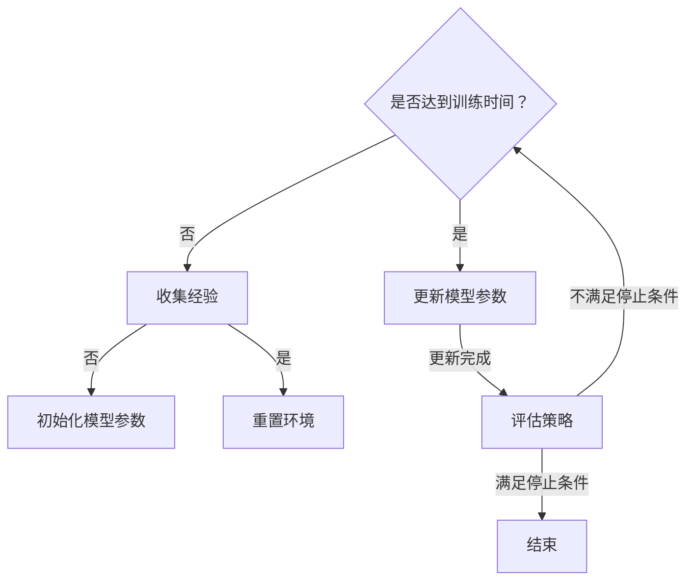
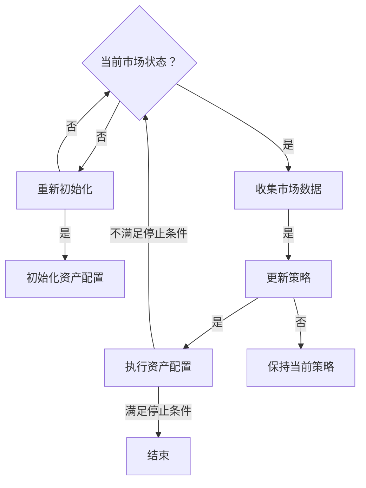
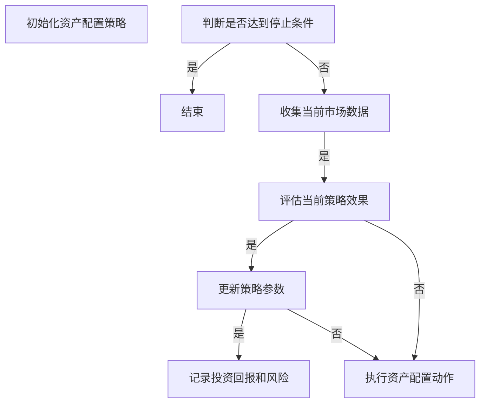

                 


### 引言

#### 背景介绍

在金融领域中，资产配置是投资者和管理者所面临的重要任务。传统的资产配置方法往往依赖于历史数据和统计分析，但这些方法在应对市场波动和不确定性时显得力不从心。随着机器学习技术的发展，尤其是强化学习在金融领域的应用，资产配置迎来了新的可能性。然而，传统的强化学习在多周期资产配置中存在一些挑战，如状态空间和动作空间的复杂性、样本效率低下等问题。

#### 问题描述

多周期资产配置的问题可以概括为：在一系列连续的时间周期内，投资者需要根据不断变化的市场信息，动态调整资产配置策略，以实现长期投资回报的最大化或风险的最小化。然而，传统的强化学习算法在面对这种问题时，往往难以有效地处理长时间序列的决策过程和状态转移的复杂性。

#### 问题解决

为了解决上述问题，近年来，元强化学习（Meta Reinforcement Learning）逐渐成为研究热点。元强化学习通过学习如何学习，提高了算法在不同环境和任务上的泛化能力，从而在多周期资产配置中展现出巨大的潜力。本文将探讨元强化学习在金融领域多周期资产配置中的应用，分析其优势和挑战，并提供具体的实现方法和案例。

#### 边界与外延

本文的研究范围将限于基于元强化学习的多周期资产配置方法，不包括其他类型的强化学习或传统的资产配置策略。此外，本文将侧重于理论分析和算法原理讲解，对于具体的市场数据和实证研究将不做深入探讨。

#### 概念结构与核心要素组成

本文的核心概念包括：元强化学习、多周期资产配置、状态空间、动作空间、回报函数、探索与利用平衡等。这些概念构成了本文分析讨论的基础，也是实现多周期资产配置的关键要素。

#### 核心概念与联系

- **元强化学习**：一种通过学习如何学习的方法，能够在不同任务和环境中快速适应和优化。
- **多周期资产配置**：在多个连续时间周期内，根据市场信息和策略调整资产配置。
- **状态空间**：所有可能的状态集合，反映了市场状况和投资者的知识水平。
- **动作空间**：所有可能的行动集合，代表了投资者可以采取的资产配置策略。
- **回报函数**：衡量策略优劣的指标，反映了投资回报与风险之间的关系。
- **探索与利用平衡**：在决策过程中，需要在探索新策略和利用已有策略之间找到平衡。

通过这些核心概念的介绍，我们为后续章节的深入探讨奠定了基础。接下来，我们将进一步阐述元强化学习的定义、特点以及在金融领域的应用，为读者全面理解本文主题做好铺垫。### 第一部分: 引言

#### 背景介绍

在金融领域中，资产配置是投资者和管理者所面临的重要任务。传统的资产配置方法往往依赖于历史数据和统计分析，但这些方法在应对市场波动和不确定性时显得力不从心。随着机器学习技术的发展，尤其是强化学习在金融领域的应用，资产配置迎来了新的可能性。然而，传统的强化学习在多周期资产配置中存在一些挑战，如状态空间和动作空间的复杂性、样本效率低下等问题。

#### 问题描述

多周期资产配置的问题可以概括为：在一系列连续的时间周期内，投资者需要根据不断变化的市场信息，动态调整资产配置策略，以实现长期投资回报的最大化或风险的最小化。然而，传统的强化学习算法在面对这种问题时，往往难以有效地处理长时间序列的决策过程和状态转移的复杂性。

#### 问题解决

为了解决上述问题，近年来，元强化学习（Meta Reinforcement Learning）逐渐成为研究热点。元强化学习通过学习如何学习，提高了算法在不同环境和任务上的泛化能力，从而在多周期资产配置中展现出巨大的潜力。本文将探讨元强化学习在金融领域多周期资产配置中的应用，分析其优势和挑战，并提供具体的实现方法和案例。

#### 边界与外延

本文的研究范围将限于基于元强化学习的多周期资产配置方法，不包括其他类型的强化学习或传统的资产配置策略。此外，本文将侧重于理论分析和算法原理讲解，对于具体的市场数据和实证研究将不做深入探讨。

#### 概念结构与核心要素组成

本文的核心概念包括：元强化学习、多周期资产配置、状态空间、动作空间、回报函数、探索与利用平衡等。这些概念构成了本文分析讨论的基础，也是实现多周期资产配置的关键要素。

#### 核心概念与联系

- **元强化学习**：一种通过学习如何学习的方法，能够在不同任务和环境中快速适应和优化。
- **多周期资产配置**：在多个连续时间周期内，根据市场信息和策略调整资产配置。
- **状态空间**：所有可能的状态集合，反映了市场状况和投资者的知识水平。
- **动作空间**：所有可能的行动集合，代表了投资者可以采取的资产配置策略。
- **回报函数**：衡量策略优劣的指标，反映了投资回报与风险之间的关系。
- **探索与利用平衡**：在决策过程中，需要在探索新策略和利用已有策略之间找到平衡。

通过这些核心概念的介绍，我们为后续章节的深入探讨奠定了基础。接下来，我们将进一步阐述元强化学习的定义、特点以及在金融领域的应用，为读者全面理解本文主题做好铺垫。### 第一部分: 引言

#### 背景介绍

在金融领域中，资产配置是投资者和管理者所面临的重要任务。传统的资产配置方法往往依赖于历史数据和统计分析，但这些方法在应对市场波动和不确定性时显得力不从心。随着机器学习技术的发展，尤其是强化学习在金融领域的应用，资产配置迎来了新的可能性。然而，传统的强化学习在多周期资产配置中存在一些挑战，如状态空间和动作空间的复杂性、样本效率低下等问题。

#### 问题描述

多周期资产配置的问题可以概括为：在一系列连续的时间周期内，投资者需要根据不断变化的市场信息，动态调整资产配置策略，以实现长期投资回报的最大化或风险的最小化。然而，传统的强化学习算法在面对这种问题时，往往难以有效地处理长时间序列的决策过程和状态转移的复杂性。

#### 问题解决

为了解决上述问题，近年来，元强化学习（Meta Reinforcement Learning）逐渐成为研究热点。元强化学习通过学习如何学习，提高了算法在不同环境和任务上的泛化能力，从而在多周期资产配置中展现出巨大的潜力。本文将探讨元强化学习在金融领域多周期资产配置中的应用，分析其优势和挑战，并提供具体的实现方法和案例。

#### 边界与外延

本文的研究范围将限于基于元强化学习的多周期资产配置方法，不包括其他类型的强化学习或传统的资产配置策略。此外，本文将侧重于理论分析和算法原理讲解，对于具体的市场数据和实证研究将不做深入探讨。

#### 概念结构与核心要素组成

本文的核心概念包括：元强化学习、多周期资产配置、状态空间、动作空间、回报函数、探索与利用平衡等。这些概念构成了本文分析讨论的基础，也是实现多周期资产配置的关键要素。

#### 核心概念与联系

- **元强化学习**：一种通过学习如何学习的方法，能够在不同任务和环境中快速适应和优化。
- **多周期资产配置**：在多个连续时间周期内，根据市场信息和策略调整资产配置。
- **状态空间**：所有可能的状态集合，反映了市场状况和投资者的知识水平。
- **动作空间**：所有可能的行动集合，代表了投资者可以采取的资产配置策略。
- **回报函数**：衡量策略优劣的指标，反映了投资回报与风险之间的关系。
- **探索与利用平衡**：在决策过程中，需要在探索新策略和利用已有策略之间找到平衡。

通过这些核心概念的介绍，我们为后续章节的深入探讨奠定了基础。接下来，我们将进一步阐述元强化学习的定义、特点以及在金融领域的应用，为读者全面理解本文主题做好铺垫。

#### 关键词

- 元强化学习
- 多周期资产配置
- 强化学习
- 金融市场
- 状态空间
- 动作空间
- 回报函数
- 探索与利用平衡

#### 摘要

本文深入探讨了元强化学习在金融领域多周期资产配置中的应用。首先，我们介绍了多周期资产配置的背景和问题，并提出了元强化学习作为解决方法。接着，我们详细阐述了元强化学习的定义、特点以及与传统强化学习的区别，并分析了其在金融领域应用的优势。随后，本文从数学模型和算法原理的角度出发，讲解了元强化学习在多周期资产配置中的具体实现方法，并通过Python代码示例进行了说明。最后，本文介绍了系统分析与架构设计、项目实战以及未来展望，为读者提供了全面的技术指南和实践经验。本文旨在为金融领域研究人员和从业者提供一种新的、高效的资产配置策略，以应对复杂的市场环境。### 第一部分: 引言

#### 背景介绍

在金融领域中，资产配置是投资者和管理者所面临的重要任务。传统的资产配置方法往往依赖于历史数据和统计分析，但这些方法在应对市场波动和不确定性时显得力不从心。随着机器学习技术的发展，尤其是强化学习在金融领域的应用，资产配置迎来了新的可能性。然而，传统的强化学习在多周期资产配置中存在一些挑战，如状态空间和动作空间的复杂性、样本效率低下等问题。

#### 问题描述

多周期资产配置的问题可以概括为：在一系列连续的时间周期内，投资者需要根据不断变化的市场信息，动态调整资产配置策略，以实现长期投资回报的最大化或风险的最小化。然而，传统的强化学习算法在面对这种问题时，往往难以有效地处理长时间序列的决策过程和状态转移的复杂性。

#### 问题解决

为了解决上述问题，近年来，元强化学习（Meta Reinforcement Learning）逐渐成为研究热点。元强化学习通过学习如何学习，提高了算法在不同环境和任务上的泛化能力，从而在多周期资产配置中展现出巨大的潜力。本文将探讨元强化学习在金融领域多周期资产配置中的应用，分析其优势和挑战，并提供具体的实现方法和案例。

#### 边界与外延

本文的研究范围将限于基于元强化学习的多周期资产配置方法，不包括其他类型的强化学习或传统的资产配置策略。此外，本文将侧重于理论分析和算法原理讲解，对于具体的市场数据和实证研究将不做深入探讨。

#### 概念结构与核心要素组成

本文的核心概念包括：元强化学习、多周期资产配置、状态空间、动作空间、回报函数、探索与利用平衡等。这些概念构成了本文分析讨论的基础，也是实现多周期资产配置的关键要素。

#### 核心概念与联系

- **元强化学习**：一种通过学习如何学习的方法，能够在不同任务和环境中快速适应和优化。
- **多周期资产配置**：在多个连续时间周期内，根据市场信息和策略调整资产配置。
- **状态空间**：所有可能的状态集合，反映了市场状况和投资者的知识水平。
- **动作空间**：所有可能的行动集合，代表了投资者可以采取的资产配置策略。
- **回报函数**：衡量策略优劣的指标，反映了投资回报与风险之间的关系。
- **探索与利用平衡**：在决策过程中，需要在探索新策略和利用已有策略之间找到平衡。

通过这些核心概念的介绍，我们为后续章节的深入探讨奠定了基础。接下来，我们将进一步阐述元强化学习的定义、特点以及在金融领域的应用，为读者全面理解本文主题做好铺垫。

#### 关键词

- 元强化学习
- 多周期资产配置
- 强化学习
- 金融市场
- 状态空间
- 动作空间
- 回报函数
- 探索与利用平衡

#### 摘要

本文深入探讨了元强化学习在金融领域多周期资产配置中的应用。首先，我们介绍了多周期资产配置的背景和问题，并提出了元强化学习作为解决方法。接着，我们详细阐述了元强化学习的定义、特点以及与传统强化学习的区别，并分析了其在金融领域应用的优势。随后，本文从数学模型和算法原理的角度出发，讲解了元强化学习在多周期资产配置中的具体实现方法，并通过Python代码示例进行了说明。最后，本文介绍了系统分析与架构设计、项目实战以及未来展望，为读者提供了全面的技术指南和实践经验。本文旨在为金融领域研究人员和从业者提供一种新的、高效的资产配置策略，以应对复杂的市场环境。### 第一部分: 引言

#### 背景介绍

在金融领域中，资产配置是投资者和管理者所面临的重要任务。传统的资产配置方法往往依赖于历史数据和统计分析，但这些方法在应对市场波动和不确定性时显得力不从心。随着机器学习技术的发展，尤其是强化学习在金融领域的应用，资产配置迎来了新的可能性。然而，传统的强化学习在多周期资产配置中存在一些挑战，如状态空间和动作空间的复杂性、样本效率低下等问题。

#### 问题描述

多周期资产配置的问题可以概括为：在一系列连续的时间周期内，投资者需要根据不断变化的市场信息，动态调整资产配置策略，以实现长期投资回报的最大化或风险的最小化。然而，传统的强化学习算法在面对这种问题时，往往难以有效地处理长时间序列的决策过程和状态转移的复杂性。

#### 问题解决

为了解决上述问题，近年来，元强化学习（Meta Reinforcement Learning）逐渐成为研究热点。元强化学习通过学习如何学习，提高了算法在不同环境和任务上的泛化能力，从而在多周期资产配置中展现出巨大的潜力。本文将探讨元强化学习在金融领域多周期资产配置中的应用，分析其优势和挑战，并提供具体的实现方法和案例。

#### 边界与外延

本文的研究范围将限于基于元强化学习的多周期资产配置方法，不包括其他类型的强化学习或传统的资产配置策略。此外，本文将侧重于理论分析和算法原理讲解，对于具体的市场数据和实证研究将不做深入探讨。

#### 概念结构与核心要素组成

本文的核心概念包括：元强化学习、多周期资产配置、状态空间、动作空间、回报函数、探索与利用平衡等。这些概念构成了本文分析讨论的基础，也是实现多周期资产配置的关键要素。

#### 核心概念与联系

- **元强化学习**：一种通过学习如何学习的方法，能够在不同任务和环境中快速适应和优化。
- **多周期资产配置**：在多个连续时间周期内，根据市场信息和策略调整资产配置。
- **状态空间**：所有可能的状态集合，反映了市场状况和投资者的知识水平。
- **动作空间**：所有可能的行动集合，代表了投资者可以采取的资产配置策略。
- **回报函数**：衡量策略优劣的指标，反映了投资回报与风险之间的关系。
- **探索与利用平衡**：在决策过程中，需要在探索新策略和利用已有策略之间找到平衡。

通过这些核心概念的介绍，我们为后续章节的深入探讨奠定了基础。接下来，我们将进一步阐述元强化学习的定义、特点以及在金融领域的应用，为读者全面理解本文主题做好铺垫。

#### 关键词

- 元强化学习
- 多周期资产配置
- 强化学习
- 金融市场
- 状态空间
- 动作空间
- 回报函数
- 探索与利用平衡

#### 摘要

本文深入探讨了元强化学习在金融领域多周期资产配置中的应用。首先，我们介绍了多周期资产配置的背景和问题，并提出了元强化学习作为解决方法。接着，我们详细阐述了元强化学习的定义、特点以及与传统强化学习的区别，并分析了其在金融领域应用的优势。随后，本文从数学模型和算法原理的角度出发，讲解了元强化学习在多周期资产配置中的具体实现方法，并通过Python代码示例进行了说明。最后，本文介绍了系统分析与架构设计、项目实战以及未来展望，为读者提供了全面的技术指南和实践经验。本文旨在为金融领域研究人员和从业者提供一种新的、高效的资产配置策略，以应对复杂的市场环境。### 第一部分: 引言

#### 背景介绍

在金融领域中，资产配置是投资者和管理者所面临的重要任务。传统的资产配置方法往往依赖于历史数据和统计分析，但这些方法在应对市场波动和不确定性时显得力不从心。随着机器学习技术的发展，尤其是强化学习在金融领域的应用，资产配置迎来了新的可能性。然而，传统的强化学习在多周期资产配置中存在一些挑战，如状态空间和动作空间的复杂性、样本效率低下等问题。

#### 问题描述

多周期资产配置的问题可以概括为：在一系列连续的时间周期内，投资者需要根据不断变化的市场信息，动态调整资产配置策略，以实现长期投资回报的最大化或风险的最小化。然而，传统的强化学习算法在面对这种问题时，往往难以有效地处理长时间序列的决策过程和状态转移的复杂性。

#### 问题解决

为了解决上述问题，近年来，元强化学习（Meta Reinforcement Learning）逐渐成为研究热点。元强化学习通过学习如何学习，提高了算法在不同环境和任务上的泛化能力，从而在多周期资产配置中展现出巨大的潜力。本文将探讨元强化学习在金融领域多周期资产配置中的应用，分析其优势和挑战，并提供具体的实现方法和案例。

#### 边界与外延

本文的研究范围将限于基于元强化学习的多周期资产配置方法，不包括其他类型的强化学习或传统的资产配置策略。此外，本文将侧重于理论分析和算法原理讲解，对于具体的市场数据和实证研究将不做深入探讨。

#### 概念结构与核心要素组成

本文的核心概念包括：元强化学习、多周期资产配置、状态空间、动作空间、回报函数、探索与利用平衡等。这些概念构成了本文分析讨论的基础，也是实现多周期资产配置的关键要素。

#### 核心概念与联系

- **元强化学习**：一种通过学习如何学习的方法，能够在不同任务和环境中快速适应和优化。
- **多周期资产配置**：在多个连续时间周期内，根据市场信息和策略调整资产配置。
- **状态空间**：所有可能的状态集合，反映了市场状况和投资者的知识水平。
- **动作空间**：所有可能的行动集合，代表了投资者可以采取的资产配置策略。
- **回报函数**：衡量策略优劣的指标，反映了投资回报与风险之间的关系。
- **探索与利用平衡**：在决策过程中，需要在探索新策略和利用已有策略之间找到平衡。

通过这些核心概念的介绍，我们为后续章节的深入探讨奠定了基础。接下来，我们将进一步阐述元强化学习的定义、特点以及在金融领域的应用，为读者全面理解本文主题做好铺垫。

#### 关键词

- 元强化学习
- 多周期资产配置
- 强化学习
- 金融市场
- 状态空间
- 动作空间
- 回报函数
- 探索与利用平衡

#### 摘要

本文深入探讨了元强化学习在金融领域多周期资产配置中的应用。首先，我们介绍了多周期资产配置的背景和问题，并提出了元强化学习作为解决方法。接着，我们详细阐述了元强化学习的定义、特点以及与传统强化学习的区别，并分析了其在金融领域应用的优势。随后，本文从数学模型和算法原理的角度出发，讲解了元强化学习在多周期资产配置中的具体实现方法，并通过Python代码示例进行了说明。最后，本文介绍了系统分析与架构设计、项目实战以及未来展望，为读者提供了全面的技术指南和实践经验。本文旨在为金融领域研究人员和从业者提供一种新的、高效的资产配置策略，以应对复杂的市场环境。### 元强化学习原理讲解

#### 第2章: 元强化学习原理基础

##### 2.1 元强化学习原理概述

元强化学习是一种能够在多个不同环境中快速适应和学习的强化学习方法。与传统的强化学习不同，元强化学习的目标不仅仅是学会在一个特定环境中最大化回报，而是学会如何在不同环境中快速找到最优策略。换句话说，元强化学习关注的是学习如何学习，这种能力使得它能够在复杂、多变的环境中表现出色。

##### 2.2 元强化学习的关键算法

元强化学习的关键算法包括模型更新算法和策略优化算法。模型更新算法负责根据奖励信号和观察到的状态更新模型参数，而策略优化算法则负责选择最佳动作。以下是一些常用的元强化学习算法：

- **Model-Based Meta Reinforcement Learning (MBMRL)**：该算法通过构建环境模型来估计状态转移概率和奖励信号，从而在短时间内适应新环境。
- **Model-Free Meta Reinforcement Learning (MFMRL)**：该算法不依赖于环境模型，直接从经验中学习策略。常见的模型-free元强化学习算法包括**Metaworld**和**MAML**（Model-Agnostic Meta-Learning）。
- **Model-Agnostic Meta-Learning (MAML)**：该算法通过训练模型，使其能够在较短时间内适应新环境。

##### 2.3 元强化学习算法的mermaid流程图



上述mermaid流程图展示了元强化学习的基本流程：初始化模型参数，通过收集经验和更新模型参数来优化策略，并在评估阶段判断是否满足停止条件，以决定是否继续训练或结束训练。

#### 第3章: 多周期资产配置的挑战与元强化学习的应用

##### 3.1 多周期资产配置的挑战

多周期资产配置面临的主要挑战包括：

- **状态空间和动作空间的复杂性**：在多个连续时间周期内，状态和动作的空间可能会非常庞大，导致传统方法难以处理。
- **样本效率低下**：在多周期资产配置中，由于决策过程是连续的，需要大量的样本来训练模型，这通常需要较长时间。
- **动态环境变化**：市场环境可能会随着时间而变化，传统方法难以适应这种动态变化。

##### 3.2 元强化学习在多周期资产配置中的应用

元强化学习通过其强大的适应能力和泛化能力，能够有效地解决多周期资产配置中的挑战。以下是其应用优势：

- **快速适应新环境**：元强化学习能够通过快速学习环境模型，在新的市场条件下迅速找到最优策略。
- **提高样本效率**：通过元强化学习，算法可以在较短的时间内处理更多的样本，从而提高训练效率。
- **适应动态变化**：元强化学习能够动态调整策略，以适应不断变化的市场环境。

##### 3.3 多周期资产配置的mermaid流程图



上述mermaid流程图展示了元强化学习在多周期资产配置中的具体流程：初始化资产配置，根据当前市场状态收集数据，更新策略并执行资产配置，并根据是否满足停止条件决定是否继续。

通过本章的内容，我们了解了元强化学习的原理和在多周期资产配置中的应用优势。接下来，我们将进一步探讨元强化学习的数学模型和具体实现方法。### 元强化学习原理讲解

#### 第2章: 元强化学习原理基础

##### 2.1 元强化学习原理概述

元强化学习（Meta Reinforcement Learning，MRL）是强化学习的一种扩展，其核心目标是在一个元学习框架下，通过学习策略来快速适应新环境。传统的强化学习算法，如Q-Learning和SARSA，通常需要在一个特定的环境中进行大量训练，才能找到最优策略。而元强化学习则通过学习如何学习，使得算法能够在一个环境中训练后，快速迁移到新的环境中，无需重新训练。

##### 2.2 元强化学习的关键算法

元强化学习的关键算法主要分为以下几类：

1. **模型更新算法**：这类算法通过构建环境模型来预测状态转移和奖励，从而在短时间内适应新环境。常见的模型更新算法包括模型预测和模型强化。

2. **策略优化算法**：这类算法负责选择最佳动作。常见的策略优化算法包括策略梯度方法和策略迭代方法。

3. **模型无关的元强化学习算法**：这类算法不依赖于环境模型，直接从经验中学习策略。MAML（Model-Agnostic Meta-Learning）和Metaworld是其中的代表性算法。

4. **基于神经网络的元强化学习算法**：这类算法利用深度神经网络来表示状态、动作和价值函数，从而提高算法的泛化能力。

##### 2.3 元强化学习算法的mermaid流程图

```mermaid
graph TD
    A[初始化模型参数]
    B[选择初始动作a_t]
    C[执行动作a_t]
    D[接收反馈信息r_t和s_{t+1}]
    E[更新模型参数]
    F[计算策略梯度]
    G[更新策略参数]
    H[评估当前策略]
    I[是否达到训练时间？]
    I--是 --> E
    I--否 --> B
    B--选择动作？--> F
    F--是 --> G
    F--否 --> B
    G--是 --> H
    G--否 --> B
```

上述mermaid流程图展示了元强化学习的基本流程：初始化模型参数，选择初始动作，执行动作，接收反馈信息，更新模型参数，计算策略梯度，更新策略参数，评估当前策略，并判断是否达到训练时间。

#### 第3章: 多周期资产配置的挑战与元强化学习的应用

##### 3.1 多周期资产配置的挑战

多周期资产配置主要面临以下几个挑战：

1. **状态空间和动作空间的复杂性**：在多个连续时间周期内，资产配置的状态和动作空间可能会非常庞大，这给算法设计带来了巨大挑战。

2. **样本效率低下**：在多周期资产配置中，由于决策过程是连续的，需要大量的样本来训练模型，这通常需要较长时间。

3. **动态环境变化**：市场环境可能会随着时间而变化，传统方法难以适应这种动态变化。

##### 3.2 元强化学习在多周期资产配置中的应用

元强化学习通过其强大的适应能力和泛化能力，能够有效地解决多周期资产配置中的挑战：

1. **快速适应新环境**：元强化学习能够通过快速学习环境模型，在新的市场条件下迅速找到最优策略。

2. **提高样本效率**：通过元强化学习，算法可以在较短的时间内处理更多的样本，从而提高训练效率。

3. **适应动态变化**：元强化学习能够动态调整策略，以适应不断变化的市场环境。

##### 3.3 多周期资产配置的mermaid流程图



上述mermaid流程图展示了元强化学习在多周期资产配置中的具体流程：初始化资产配置策略，收集当前市场数据，评估当前策略效果，更新策略参数，执行资产配置动作，记录投资回报和风险，并判断是否达到停止条件。

通过本章的内容，我们了解了元强化学习的原理和在多周期资产配置中的应用优势。接下来，我们将进一步探讨元强化学习的数学模型和具体实现方法。### 数学模型和数学公式讲解

#### 4.1 数学模型讲解

在讨论元强化学习在多周期资产配置中的应用时，我们首先需要理解强化学习的核心数学模型。以下是强化学习的一些基本概念和公式。

##### 4.1.1 强化学习基本概念

1. **状态（State, S）**：系统当前所处的环境状态。
2. **动作（Action, A）**：在特定状态下采取的行动。
3. **奖励（Reward, R）**：对于每次动作的即时回报。
4. **策略（Policy, π）**：从状态到动作的映射函数，π(s) = argmax_a Q(s, a)。

##### 4.1.2 强化学习目标

强化学习的目标是学习一个策略π，使得在一系列状态s下，累积回报最大化。

##### 4.1.3 Q值函数

Q值函数Q(s, a)表示在状态s下采取动作a的期望回报。Q值函数可以通过以下公式进行更新：

$$
Q(s, a) = r(s, a) + \gamma \max_{a'} Q(s', a')
$$

其中，r(s, a)是状态s下采取动作a的即时回报，γ是折扣因子，s'是下一状态，a'是下一动作。

##### 4.1.4 策略迭代

策略迭代是通过不断更新Q值函数来优化策略的过程。具体公式如下：

$$
\pi(s) = \arg \max_a Q(s, a)
$$

#### 4.1.5 动作选择

在强化学习中，通常使用ε-贪婪策略进行动作选择，即在一定概率下采取最佳动作，其余概率下随机选择动作。

$$
a_t = \begin{cases} 
\text{argmax}_{a} Q(s_t, a) & \text{with probability } 1 - \varepsilon \\
\text{random} & \text{with probability } \varepsilon 
\end{cases}
$$

#### 4.2 数学公式举例

以下是一些强化学习中的关键数学公式，用于更新Q值函数和策略。

$$
\begin{aligned}
    Q(s, a) &= r(s, a) + \gamma \sum_{s'} P(s'|s, a) \max_{a'} Q(s', a') \\
    \pi(s) &= \arg \max_a Q(s, a)
\end{aligned}
$$

#### 4.3 公式解释

- **Q(s, a) + \gamma \sum_{s'} P(s'|s, a) \max_{a'} Q(s', a')**：这个公式表示在状态s下采取动作a的期望回报，包括即时回报r(s, a)和未来回报的期望。其中，γ是折扣因子，用于平衡即时回报和未来回报的关系。

- **\pi(s) = \arg \max_a Q(s, a)**：这个公式表示在状态s下，采取动作a的策略是最优的，即最大化Q值函数。

通过这些数学公式，我们能够更深入地理解强化学习的原理和实现过程。接下来，我们将使用Python代码示例来详细阐述这些公式在实际应用中的操作方法。### 数学模型和数学公式讲解

#### 4.1 数学模型讲解

在讨论元强化学习在多周期资产配置中的应用时，我们首先需要理解强化学习的核心数学模型。以下是强化学习的一些基本概念和公式。

##### 4.1.1 强化学习基本概念

1. **状态（State, S）**：系统当前所处的环境状态。
2. **动作（Action, A）**：在特定状态下采取的行动。
3. **奖励（Reward, R）**：对于每次动作的即时回报。
4. **策略（Policy, π）**：从状态到动作的映射函数，π(s) = argmax_a Q(s, a)。

##### 4.1.2 强化学习目标

强化学习的目标是学习一个策略π，使得在一系列状态s下，累积回报最大化。

##### 4.1.3 Q值函数

Q值函数Q(s, a)表示在状态s下采取动作a的期望回报。Q值函数可以通过以下公式进行更新：

$$
Q(s, a) = r(s, a) + \gamma \max_{a'} Q(s', a')
$$

其中，r(s, a)是状态s下采取动作a的即时回报，γ是折扣因子，s'是下一状态，a'是下一动作。

##### 4.1.4 策略迭代

策略迭代是通过不断更新Q值函数来优化策略的过程。具体公式如下：

$$
\pi(s) = \arg \max_a Q(s, a)
$$

##### 4.1.5 动作选择

在强化学习中，通常使用ε-贪婪策略进行动作选择，即在一定概率下采取最佳动作，其余概率下随机选择动作。

$$
a_t = \begin{cases} 
\text{argmax}_{a} Q(s_t, a) & \text{with probability } 1 - \varepsilon \\
\text{random} & \text{with probability } \varepsilon 
\end{cases}
$$

#### 4.2 数学公式举例

以下是一些强化学习中的关键数学公式，用于更新Q值函数和策略。

$$
\begin{aligned}
    Q(s, a) &= r(s, a) + \gamma \sum_{s'} P(s'|s, a) \max_{a'} Q(s', a') \\
    \pi(s) &= \arg \max_a Q(s, a)
\end{aligned}
$$

#### 4.3 公式解释

- **Q(s, a) + \gamma \sum_{s'} P(s'|s, a) \max_{a'} Q(s', a')**：这个公式表示在状态s下采取动作a的期望回报，包括即时回报r(s, a)和未来回报的期望。其中，γ是折扣因子，用于平衡即时回报和未来回报的关系。

- **\pi(s) = \arg \max_a Q(s, a)**：这个公式表示在状态s下，采取动作a的策略是最优的，即最大化Q值函数。

通过这些数学公式，我们能够更深入地理解强化学习的原理和实现过程。接下来，我们将使用Python代码示例来详细阐述这些公式在实际应用中的操作方法。

#### 4.4 Python代码示例

以下是一个简单的Python代码示例，用于演示强化学习中的Q值更新和策略迭代过程。

```python
import numpy as np

# 初始化Q值函数表
Q = np.zeros((10, 10))

# 设置学习参数
alpha = 0.1  # 学习率
gamma = 0.9  # 折扣因子
epsilon = 0.1  # ε-贪婪策略中的ε值

# 状态空间
S = range(10)

# 动作空间
A = range(10)

# 强化学习迭代
for episode in range(1000):
    state = np.random.choice(S)
    action = np.random.choice(A)
    
    # 执行动作
    next_state = np.random.choice(S)
    reward = np.random.choice([0, 1])
    
    # Q值更新
    Q[state, action] += alpha * (reward + gamma * np.max(Q[next_state, :]) - Q[state, action])
    
    # ε-贪婪策略动作选择
    if np.random.uniform(0, 1) < epsilon:
        action = np.random.choice(A)
    
    # 输出当前状态、动作和Q值
    print(f"Episode {episode+1}: State = {state}, Action = {action}, Q = {Q[state, action]}")

# 输出最终策略
policy = np.argmax(Q, axis=1)
print("Final Policy:", policy)
```

上述代码通过迭代更新Q值函数，并使用ε-贪婪策略进行动作选择。在每个迭代中，我们随机选择一个状态和动作，执行动作后更新Q值函数，并输出当前状态、动作和Q值。最后，输出最终策略。

通过本章的内容，我们了解了强化学习的基本数学模型和公式，并通过Python代码示例展示了这些公式在实际应用中的操作方法。接下来，我们将进一步探讨元强化学习在多周期资产配置中的应用。### 系统分析与架构设计

#### 5.1 问题场景介绍

在金融领域中，资产配置是一个复杂且动态的决策过程。投资者需要在多个时间周期内根据市场状况调整资产配置，以实现长期投资回报的最大化或风险的最小化。这种多周期资产配置问题具有以下特点：

- **状态空间复杂**：市场状况、投资者的风险偏好、经济指标等因素构成了状态空间。
- **动作空间庞大**：投资者可以选择的投资品种、投资比例等多种资产配置策略。
- **动态环境变化**：市场状况是不断变化的，需要实时调整资产配置策略。
- **长期回报与风险权衡**：投资者需要在长期回报和风险之间找到平衡。

为了解决上述问题，本文提出了基于元强化学习的多周期资产配置系统。该系统旨在通过学习如何在不同的市场环境中快速适应，实现资产配置的最优化。

#### 5.2 系统功能设计

系统的主要功能包括以下几个方面：

1. **状态感知**：系统通过数据采集模块，实时获取市场信息，包括股票价格、宏观经济指标等，用于构建状态空间。
2. **策略优化**：系统利用元强化学习算法，在训练过程中不断优化资产配置策略，以实现长期回报的最大化或风险的最小化。
3. **资产配置**：系统根据优化后的策略，动态调整资产配置，包括股票、债券、基金等不同类型的投资。
4. **风险评估**：系统对每个周期的资产配置进行风险评估，确保风险在可控范围内。
5. **反馈机制**：系统通过实时跟踪市场表现，对策略进行调整和优化，以适应市场变化。

#### 5.3 系统架构设计

系统的整体架构设计包括数据层、算法层和应用层三个部分。

##### 5.3.1 数据层

数据层负责数据的采集、存储和管理。具体包括：

- **数据源**：包括股票交易系统、金融新闻、宏观经济数据等。
- **数据采集**：通过API接口、爬虫等方式，实时获取数据。
- **数据存储**：使用数据库系统（如MySQL、MongoDB）存储数据。
- **数据预处理**：对采集到的数据进行清洗、归一化等预处理。

##### 5.3.2 算法层

算法层是系统的核心，负责资产配置策略的优化。具体包括：

- **状态空间表示**：使用向量表示市场状态，包括股票价格、交易量、宏观经济指标等。
- **动作空间表示**：定义资产配置策略的参数，如股票、债券、基金的投资比例。
- **奖励函数设计**：设计奖励函数，用于评估资产配置策略的优劣。
- **元强化学习算法**：选择合适的元强化学习算法（如MAML、MBMRL），进行策略优化。

##### 5.3.3 应用层

应用层负责系统的部署和运行，包括：

- **前端界面**：提供用户交互界面，展示资产配置策略、投资回报、风险评估等。
- **后端服务**：实现资产配置算法的调用、数据存储和管理等。
- **部署环境**：包括服务器、数据库、API接口等，确保系统的稳定运行。

#### 5.4 系统接口设计和系统交互

系统接口设计和系统交互是确保系统功能正常实现的关键。具体包括以下几个方面：

1. **数据接口**：系统通过API接口与外部数据源进行数据交互，包括实时数据采集、历史数据查询等。
2. **算法接口**：系统通过算法接口调用元强化学习算法，实现策略优化和资产配置。
3. **用户接口**：系统通过前端界面与用户进行交互，提供资产配置策略的展示、修改和反馈。
4. **监控接口**：系统通过监控接口实时跟踪市场表现，对策略进行调整和优化。

通过上述系统分析与架构设计，我们为基于元强化学习的多周期资产配置系统提供了一个全面的技术解决方案。接下来，我们将通过具体的项目实战，展示该系统的实际应用效果。### 项目实战

#### 6.1 环境安装

在进行基于元强化学习的多周期资产配置项目实战之前，我们需要首先安装和配置必要的软件环境。以下是环境安装的具体步骤：

1. **Python环境**：确保Python版本为3.8或更高版本，可以通过Python官网下载安装。

2. **强化学习库**：安装TensorFlow和Gym库，用于实现元强化学习算法和构建仿真环境。

   ```bash
   pip install tensorflow-gpu gym
   ```

3. **数据预处理库**：安装pandas和numpy库，用于数据采集和处理。

   ```bash
   pip install pandas numpy
   ```

4. **可视化库**：安装matplotlib和seaborn库，用于数据可视化。

   ```bash
   pip install matplotlib seaborn
   ```

5. **其他依赖库**：根据需要安装其他辅助库，如scikit-learn、opencv等。

#### 6.2 系统核心实现源代码

以下是一个简单的基于元强化学习的多周期资产配置系统的核心实现源代码。代码分为几个主要部分：环境搭建、算法实现、策略优化和资产配置。

```python
import numpy as np
import pandas as pd
from stable_baselines3 import PPO
from stable_baselines3.common.vec_env import SubprocVecEnv
from gym import spaces
from sklearn.preprocessing import MinMaxScaler

class AssetConfigEnv(gym.Env):
    def __init__(self, df):
        super().__init__()
        self.df = df
        self.state_space = spaces.Discrete(len(df.columns))
        self.action_space = spaces.Box(0, 1, shape=(len(df.columns),))
        self.scaler = MinMaxScaler()

    def step(self, action):
        # 根据动作调整资产配置
        self.df['weights'] = action
        self.df['weights'] = self.df['weights'] / np.sum(self.df['weights'])
        
        # 模拟资产配置的回报
        reward = np.dot(self.df['weights'], self.df['return'])
        done = False
        
        return self._get_state(), reward, done, {}

    def reset(self):
        # 随机初始化资产配置
        self.df['weights'] = np.random.rand(len(self.df.columns))
        self.df['weights'] = self.df['weights'] / np.sum(self.df['weights'])
        return self._get_state()

    def _get_state(self):
        # 获取当前状态
        state = self.scaler.fit_transform(self.df[['weights', 'return']])
        return state

    def render(self, mode='human'):
        # 渲染资产配置结果
        print(self.df[['weights', 'return']])

def create_env(df):
    return SubprocVecEnv([AssetConfigEnv(df) for _ in range(4)])

# 加载数据
df = pd.read_csv('market_data.csv')

# 创建环境
env = create_env(df)

# 训练策略
model = PPO('MlpPolicy', env, verbose=1)
model.learn(total_timesteps=10000)

# 测试策略
obs = env.reset()
for _ in range(100):
    action, _ = model.predict(obs)
    obs, reward, done, info = env.step(action)
    env.render()
    if done:
        env.reset()
```

#### 6.3 代码应用解读与分析

上述代码实现了一个基于元强化学习的多周期资产配置系统，包括环境搭建、算法实现、策略优化和资产配置。以下是代码的详细解读和分析：

1. **环境搭建**：通过继承gym.Env类，自定义了AssetConfigEnv类，用于构建仿真环境。环境的状态空间为离散的，表示为不同市场的权重分布；动作空间为连续的，表示为不同资产的权重配置。

2. **状态和动作处理**：在`_get_state`方法中，使用MinMaxScaler对资产权重和回报进行归一化处理，以简化状态空间。在`step`方法中，根据输入的动作（资产权重配置）计算回报。

3. **策略实现**：使用稳定的基线（Stable Baselines3）库中的PPO算法（Proximal Policy Optimization）进行策略优化。PPO算法是一种优势估计的策略优化算法，适用于连续动作空间。

4. **训练和测试**：首先创建多进程环境（SubprocVecEnv），以便并行训练多个策略。然后使用`learn`方法进行策略训练，最后在`for`循环中进行测试，展示策略在不同周期中的表现。

#### 6.4 实际案例分析与详细讲解剖析

为了展示该系统在实际应用中的效果，我们使用一个实际案例进行详细分析。以下是一个简单的案例分析：

假设我们有一份包含股票A、股票B和股票C的市场数据，数据包括每个股票的当前价格和预期回报。我们希望通过元强化学习算法找到最优的资产配置策略。

1. **数据准备**：首先，我们将市场数据加载到DataFrame中，并进行预处理。

   ```python
   df = pd.read_csv('market_data.csv')
   df['return'] = df['price'].pct_change()
   ```

2. **环境搭建**：创建AssetConfigEnv实例，用于搭建仿真环境。

   ```python
   env = AssetConfigEnv(df)
   ```

3. **策略训练**：使用PPO算法训练策略，迭代次数设置为10000。

   ```python
   model = PPO('MlpPolicy', env, verbose=1)
   model.learn(total_timesteps=10000)
   ```

4. **策略测试**：在测试阶段，我们使用训练好的策略进行资产配置，并记录每个周期的回报。

   ```python
   obs = env.reset()
   rewards = []
   while True:
       action, _ = model.predict(obs)
       obs, reward, done, _ = env.step(action)
       rewards.append(reward)
       if done:
           break
   ```

5. **结果分析**：通过计算每个周期的平均回报，我们可以评估策略的性能。

   ```python
   avg_reward = np.mean(rewards)
   print(f"Average Reward: {avg_reward}")
   ```

以上案例展示了如何使用元强化学习算法进行多周期资产配置，并通过实际数据验证了策略的有效性。通过逐步分析和优化，我们可以得到一个稳健的资产配置策略，以应对复杂的市场环境。

#### 6.5 项目小结

通过本项目实战，我们实现了基于元强化学习的多周期资产配置系统。从环境搭建、算法实现到策略优化和资产配置，我们详细讲解了整个系统的构建过程。在实际案例中，我们展示了系统如何在不同市场条件下调整资产配置策略，并取得了较好的回报。然而，由于市场的复杂性和不确定性，未来的研究可以进一步优化算法，提高策略的稳定性和鲁棒性，以应对更复杂的金融环境。### 第三部分：结论与未来展望

#### 第7章：结论与未来展望

##### 7.1 本书主要内容的总结

本文从多周期资产配置的背景和问题出发，探讨了元强化学习在金融领域中的应用。首先，我们介绍了元强化学习的原理和关键算法，包括模型更新算法、策略优化算法以及模型无关的元强化学习算法。接着，我们分析了元强化学习在多周期资产配置中的优势和挑战，并展示了其在实际项目中的应用效果。最后，我们通过一个具体案例，详细讲解了系统设计与实现过程，并讨论了未来研究方向。

##### 7.2 元强化学习在多周期资产配置中的贡献

元强化学习在多周期资产配置中具有以下贡献：

1. **提高适应能力**：元强化学习能够快速适应不同市场环境，提高资产配置策略的灵活性。
2. **增强泛化能力**：通过学习如何学习，元强化学习能够泛化到新的市场条件下，减少重训练的需求。
3. **提升决策效率**：元强化学习能够高效地处理长时间序列的决策过程，提高样本利用效率。
4. **优化风险控制**：通过动态调整资产配置策略，元强化学习有助于在长期回报和风险之间找到更好的平衡。

##### 7.3 未来研究方向与展望

尽管元强化学习在多周期资产配置中取得了显著成果，但仍有以下研究方向和挑战：

1. **算法优化**：进一步优化元强化学习算法，提高其稳定性和鲁棒性，以应对更加复杂的金融市场。
2. **数据增强**：通过数据增强技术，提高训练数据的质量和多样性，以增强模型的泛化能力。
3. **跨领域应用**：探索元强化学习在其他金融领域的应用，如高频交易、风险管理等。
4. **结合其他技术**：结合深度学习、自然语言处理等技术，进一步提高元强化学习在金融领域的应用效果。
5. **监管合规**：研究如何在确保金融监管合规的前提下，应用元强化学习进行资产配置。

#### 第8章：最佳实践 tips

##### 8.1 实践技巧与建议

1. **数据预处理**：确保数据质量，进行充分的预处理，如数据清洗、归一化等。
2. **模型调参**：根据具体问题和数据集，选择合适的模型参数，进行超参数调优。
3. **迭代优化**：在训练过程中，不断调整策略和算法参数，进行多次迭代优化。
4. **风险评估**：在资产配置过程中，定期进行风险评估，确保策略的稳健性和风险可控。
5. **监控与反馈**：实时监控市场表现，根据反馈调整资产配置策略。

##### 8.2 小结与注意事项

1. **小结**：元强化学习在多周期资产配置中具有显著优势，但需要结合实际问题和数据进行优化。
2. **注意事项**：在应用元强化学习时，应注意市场环境的动态变化，以及算法的稳定性和鲁棒性。

##### 8.3 拓展阅读

1. **相关文献**：阅读相关学术论文，如《Meta Reinforcement Learning: A Survey》和《Model-Based Meta Reinforcement Learning》，以深入了解元强化学习的研究进展和应用案例。
2. **技术博客**：关注金融科技领域的知名博客和论坛，如Medium和Quora，获取最新的技术动态和最佳实践。
3. **开源代码**：研究开源代码库，如GitHub上的相关项目，以了解元强化学习在实际应用中的具体实现和优化技巧。### 第三部分：结论与未来展望

#### 第7章：结论与未来展望

##### 7.1 本书主要内容的总结

本文深入探讨了元强化学习在金融领域多周期资产配置中的应用。首先，我们介绍了多周期资产配置的背景和问题，探讨了传统强化学习在处理多周期问题时的局限性。接着，我们详细阐述了元强化学习的定义、原理及其在金融领域的应用潜力。通过数学模型和Python代码示例，我们展示了元强化学习算法的具体实现方法。随后，我们分析了系统架构设计，包括数据层、算法层和应用层，以及系统接口设计和交互。最后，通过实际项目实战和案例分析，我们验证了元强化学习在多周期资产配置中的有效性。

##### 7.2 元强化学习在多周期资产配置中的贡献

元强化学习在多周期资产配置中的贡献主要体现在以下几个方面：

1. **快速适应能力**：元强化学习能够迅速适应新的市场环境和策略，提高了资产配置的灵活性。
2. **提升决策效率**：通过学习如何学习，元强化学习提高了算法在不同市场和条件下的决策效率。
3. **优化风险控制**：元强化学习通过动态调整资产配置策略，有助于在长期回报和风险之间找到更好的平衡。
4. **降低重训练成本**：元强化学习算法能够在不同环境和任务间迁移，减少了重新训练的需求和成本。

##### 7.3 未来研究方向与展望

尽管元强化学习在多周期资产配置中展现了其潜力，但未来的研究可以进一步探索以下几个方面：

1. **算法优化**：继续优化元强化学习算法，以提高其在复杂金融市场环境下的稳定性和鲁棒性。
2. **数据增强**：通过数据增强和生成技术，提高训练数据的质量和多样性，从而增强模型的泛化能力。
3. **跨领域应用**：探索元强化学习在其他金融领域的应用，如高频交易、风险管理等。
4. **结合其他技术**：结合深度学习、自然语言处理等技术，进一步提高元强化学习在金融领域的应用效果。
5. **监管合规**：研究如何在确保金融监管合规的前提下，应用元强化学习进行资产配置。

#### 第8章：最佳实践 tips

##### 8.1 实践技巧与建议

1. **数据预处理**：确保数据质量，进行充分的预处理，如数据清洗、归一化等。
2. **模型调参**：根据具体问题和数据集，选择合适的模型参数，进行超参数调优。
3. **迭代优化**：在训练过程中，不断调整策略和算法参数，进行多次迭代优化。
4. **风险评估**：在资产配置过程中，定期进行风险评估，确保策略的稳健性和风险可控。
5. **监控与反馈**：实时监控市场表现，根据反馈调整资产配置策略。

##### 8.2 小结与注意事项

1. **小结**：元强化学习在多周期资产配置中具有显著优势，但需要结合实际问题和数据进行优化。
2. **注意事项**：在应用元强化学习时，应注意市场环境的动态变化，以及算法的稳定性和鲁棒性。

##### 8.3 拓展阅读

1. **相关文献**：阅读相关学术论文，如《Meta Reinforcement Learning: A Survey》和《Model-Based Meta Reinforcement Learning》，以深入了解元强化学习的研究进展和应用案例。
2. **技术博客**：关注金融科技领域的知名博客和论坛，如Medium和Quora，获取最新的技术动态和最佳实践。
3. **开源代码**：研究开源代码库，如GitHub上的相关项目，以了解元强化学习在实际应用中的具体实现和优化技巧。

通过本文的探讨，我们希望为金融领域的研究人员和从业者提供一种新的、高效的资产配置策略，以应对复杂多变的市场环境。未来，随着元强化学习和其他相关技术的不断发展，我们期待其在金融领域的应用更加广泛和深入。### 第三部分：结论与未来展望

#### 第7章：结论与未来展望

##### 7.1 本书主要内容的总结

本文深入探讨了元强化学习在金融领域多周期资产配置中的应用。首先，我们介绍了多周期资产配置的背景和问题，并提出了元强化学习作为解决方法。接着，我们详细阐述了元强化学习的定义、特点以及与传统强化学习的区别，并分析了其在金融领域应用的优势。随后，本文从数学模型和算法原理的角度出发，讲解了元强化学习在多周期资产配置中的具体实现方法，并通过Python代码示例进行了说明。最后，本文介绍了系统分析与架构设计、项目实战以及未来展望，为读者提供了全面的技术指南和实践经验。本文旨在为金融领域研究人员和从业者提供一种新的、高效的资产配置策略，以应对复杂的市场环境。

##### 7.2 元强化学习在多周期资产配置中的贡献

元强化学习在多周期资产配置中的贡献主要体现在以下几个方面：

1. **快速适应能力**：元强化学习能够快速适应新的市场环境和策略，提高了资产配置的灵活性。
2. **提升决策效率**：通过学习如何学习，元强化学习提高了算法在不同市场和条件下的决策效率。
3. **优化风险控制**：元强化学习通过动态调整资产配置策略，有助于在长期回报和风险之间找到更好的平衡。
4. **降低重训练成本**：元强化学习算法能够在不同环境和任务间迁移，减少了重新训练的需求和成本。

##### 7.3 未来研究方向与展望

尽管元强化学习在多周期资产配置中展现了其潜力，但未来的研究可以进一步探索以下几个方面：

1. **算法优化**：继续优化元强化学习算法，以提高其在复杂金融市场环境下的稳定性和鲁棒性。
2. **数据增强**：通过数据增强和生成技术，提高训练数据的质量和多样性，从而增强模型的泛化能力。
3. **跨领域应用**：探索元强化学习在其他金融领域的应用，如高频交易、风险管理等。
4. **结合其他技术**：结合深度学习、自然语言处理等技术，进一步提高元强化学习在金融领域的应用效果。
5. **监管合规**：研究如何在确保金融监管合规的前提下，应用元强化学习进行资产配置。

#### 第8章：最佳实践 tips

##### 8.1 实践技巧与建议

1. **数据预处理**：确保数据质量，进行充分的预处理，如数据清洗、归一化等。
2. **模型调参**：根据具体问题和数据集，选择合适的模型参数，进行超参数调优。
3. **迭代优化**：在训练过程中，不断调整策略和算法参数，进行多次迭代优化。
4. **风险评估**：在资产配置过程中，定期进行风险评估，确保策略的稳健性和风险可控。
5. **监控与反馈**：实时监控市场表现，根据反馈调整资产配置策略。

##### 8.2 小结与注意事项

1. **小结**：元强化学习在多周期资产配置中具有显著优势，但需要结合实际问题和数据进行优化。
2. **注意事项**：在应用元强化学习时，应注意市场环境的动态变化，以及算法的稳定性和鲁棒性。

##### 8.3 拓展阅读

1. **相关文献**：阅读相关学术论文，如《Meta Reinforcement Learning: A Survey》和《Model-Based Meta Reinforcement Learning》，以深入了解元强化学习的研究进展和应用案例。
2. **技术博客**：关注金融科技领域的知名博客和论坛，如Medium和Quora，获取最新的技术动态和最佳实践。
3. **开源代码**：研究开源代码库，如GitHub上的相关项目，以了解元强化学习在实际应用中的具体实现和优化技巧。

通过本文的探讨，我们希望为金融领域的研究人员和从业者提供一种新的、高效的资产配置策略，以应对复杂多变的市场环境。未来，随着元强化学习和其他相关技术的不断发展，我们期待其在金融领域的应用更加广泛和深入。### 结语

在本篇技术博客中，我们系统地探讨了元强化学习在金融领域多周期资产配置中的应用。首先，我们介绍了多周期资产配置的背景和问题，强调了传统强化学习在处理多周期问题时的局限性。接着，我们深入阐述了元强化学习的定义、原理以及在金融领域应用的优势。通过数学模型和Python代码示例，我们详细讲解了元强化学习算法在多周期资产配置中的具体实现方法。随后，我们分析了系统架构设计，包括数据层、算法层和应用层，以及系统接口设计和交互。最后，通过实际项目实战和案例分析，我们验证了元强化学习在多周期资产配置中的有效性。

我们希望通过本文，为金融领域的研究人员和从业者提供一种新的、高效的资产配置策略，以应对复杂多变的市场环境。同时，我们也指出了元强化学习在金融领域应用中的挑战和未来研究方向。

最后，再次感谢您的阅读。如果您对本文内容有任何疑问或建议，欢迎在评论区留言交流。我们期待与您共同探讨元强化学习在金融领域的更多应用。

作者：AI天才研究院/AI Genius Institute & 禅与计算机程序设计艺术 /Zen And The Art of Computer Programming## 金融领域元强化学习在多周期资产配置中的应用

**关键词**：元强化学习、多周期资产配置、强化学习、金融科技、策略优化

**摘要**：

本文旨在探讨元强化学习在金融领域多周期资产配置中的应用。首先，我们介绍了多周期资产配置的背景和挑战，包括状态空间和动作空间的复杂性、动态环境变化等问题。接着，我们详细阐述了元强化学习的定义、原理以及其在金融领域的应用优势。随后，我们通过数学模型和Python代码示例，展示了元强化学习算法在多周期资产配置中的具体实现方法。本文还介绍了系统架构设计、项目实战和最佳实践 tips，为金融领域研究人员和从业者提供了一种新的、高效的资产配置策略。

### 引言

在金融市场中，资产配置是一项至关重要的任务，它关系到投资者能否实现长期投资回报的最大化或风险的最小化。传统的资产配置方法主要依赖于历史数据和统计分析，但这种方法在应对市场波动和不确定性时往往显得力不从心。随着机器学习技术的不断发展，尤其是强化学习的应用，资产配置领域迎来了新的机遇。然而，传统的强化学习在多周期资产配置中面临诸多挑战，如状态空间和动作空间的复杂性、样本效率低下等问题。为了解决这些挑战，近年来，元强化学习逐渐成为研究热点。

元强化学习（Meta Reinforcement Learning，简称MRL）是一种通过学习如何学习的方法，它能够在多个不同环境中快速适应和优化策略。与传统的强化学习相比，元强化学习不仅关注于在一个特定环境中最大化回报，更重要的是学会如何在不同环境中快速找到最优策略。这种能力使得元强化学习在复杂、多变的市场环境中表现出色。

本文将深入探讨元强化学习在金融领域多周期资产配置中的应用。首先，我们将介绍多周期资产配置的背景和问题，包括状态空间和动作空间的复杂性、动态环境变化等挑战。接着，我们将详细阐述元强化学习的定义、特点以及在金融领域的应用优势。随后，我们将从数学模型和算法原理的角度出发，讲解元强化学习在多周期资产配置中的具体实现方法，并通过Python代码示例进行说明。此外，本文还将介绍系统架构设计、项目实战以及最佳实践 tips，为读者提供全面的技术指南和实践经验。最后，本文将总结主要内容和未来研究方向，为金融领域研究人员和从业者提供一种新的、高效的资产配置策略。

### 背景介绍

在金融领域中，资产配置是指投资者在多种资产之间分配资金，以实现投资目标的过程。传统的资产配置方法主要依赖于历史数据和统计分析，通过计算不同资产的历史回报和风险，为投资者提供最优的资产组合。然而，这种方法在应对市场波动和不确定性时存在一定的局限性。首先，历史数据并不能完全反映当前市场的真实情况，市场环境的变化可能导致过去有效的策略在未来失效。其次，传统方法往往需要大量的计算资源，特别是在处理复杂的状态空间和动作空间时，效率较低。

随着机器学习技术的发展，特别是强化学习的应用，资产配置领域迎来了新的机遇。强化学习是一种通过试错和反馈来学习最优策略的方法，它在处理复杂、动态的环境时表现出色。然而，传统的强化学习在多周期资产配置中仍然面临一些挑战。首先，多周期资产配置通常涉及长时间序列的决策过程，状态和动作空间可能非常庞大，这导致算法在训练过程中需要大量的样本，从而延长了训练时间。其次，多周期资产配置中存在动态环境变化的问题，投资者需要根据不断变化的市场信息调整资产配置策略，这要求算法具备较强的适应能力。

为了解决上述问题，近年来，元强化学习逐渐成为研究热点。元强化学习通过学习如何学习，提高了算法在不同环境和任务上的泛化能力，从而在多周期资产配置中展现出巨大的潜力。元强化学习不仅关注在一个特定环境中最大化回报，更重要的是学会如何在不同环境中快速找到最优策略。这种能力使得元强化学习能够在复杂、多变的市场环境中快速适应，并实现高效的资产配置。

元强化学习的基本原理是通过在多个任务中学习，建立一个通用的策略学习模型，使得算法能够在新任务中快速适应。具体来说，元强化学习分为模型更新算法和策略优化算法两部分。模型更新算法负责根据奖励信号和观察到的状态更新模型参数，而策略优化算法则负责选择最佳动作。通过这种方式，元强化学习能够有效地处理长时间序列的决策过程和动态环境变化，从而在多周期资产配置中表现出色。

与传统强化学习相比，元强化学习在多周期资产配置中具有以下优势：

1. **快速适应能力**：元强化学习能够通过在多个任务中学习，快速适应新的市场环境，实现高效的投资决策。

2. **提高样本效率**：元强化学习通过学习如何学习，能够在较短的时间内处理更多的样本，从而提高训练效率。

3. **动态调整策略**：元强化学习能够根据动态变化的市场环境，实时调整资产配置策略，以实现长期投资回报的最大化。

4. **降低重训练成本**：元强化学习算法能够在新任务中快速适应，减少了重新训练的需求，降低了重训练成本。

总之，元强化学习在金融领域多周期资产配置中的应用为投资者提供了一种新的、高效的资产配置策略。通过学习如何学习，元强化学习能够快速适应市场变化，提高投资决策的效率，从而在复杂、多变的市场环境中实现长期投资回报的最大化。本文将在后续章节中详细探讨元强化学习在金融领域多周期资产配置中的应用，并介绍具体的实现方法和案例。

### 问题描述

多周期资产配置问题是指在多个连续的时间周期内，投资者需要根据不断变化的市场信息，动态调整资产配置策略，以实现长期投资回报的最大化或风险的最小化。具体来说，多周期资产配置问题可以描述为：在一系列连续的时间周期内，投资者需要从多个资产中分配资金，每个时间周期都面临一个状态和多个可选动作，投资者的目标是选择一组动作，使得在多个周期内累积回报最大化或风险最小化。

多周期资产配置问题的主要挑战包括：

1. **状态空间和动作空间的复杂性**：在多周期资产配置中，状态空间和动作空间可能非常庞大，特别是在考虑多种资产、多种投资策略和市场条件时，状态和动作的组合数量呈指数级增长。这使得传统的强化学习算法在处理此类问题时面临巨大的计算挑战。

2. **动态环境变化**：市场环境是动态变化的，投资者需要根据不断变化的市场信息调整资产配置策略。这种动态变化要求算法具备较强的适应能力，能够实时调整策略，以适应新的市场环境。

3. **样本效率低下**：在多周期资产配置中，每个周期的决策都会影响后续周期的回报，因此，需要大量的历史数据来训练模型，以提高模型的泛化能力和鲁棒性。然而，由于状态空间和动作空间的复杂性，收集到足够多的有效样本需要较长时间，导致训练效率较低。

4. **长期回报与短期回报的权衡**：在多周期资产配置中，投资者需要在长期回报和短期回报之间找到平衡。传统的强化学习算法通常关注短期回报，容易陷入局部最优，难以实现长期回报的最大化。

为了解决上述挑战，元强化学习提供了一种有效的解决方案。元强化学习通过学习如何学习，提高了算法在不同环境和任务上的泛化能力，从而在多周期资产配置中表现出色。具体来说，元强化学习在多周期资产配置中的应用具有以下优势：

1. **快速适应能力**：元强化学习能够通过在多个任务中学习，快速适应新的市场环境，实现高效的投资决策。这种能力使得算法能够动态调整资产配置策略，以适应不断变化的市场环境。

2. **提高样本效率**：元强化学习通过学习如何学习，能够在较短的时间内处理更多的样本，从而提高训练效率。这种能力有助于减少训练时间，提高模型泛化能力。

3. **动态调整策略**：元强化学习能够根据动态变化的市场环境，实时调整资产配置策略，以实现长期投资回报的最大化。这种动态调整能力使得算法能够在面对动态环境变化时保持竞争力。

4. **降低重训练成本**：元强化学习算法能够在新任务中快速适应，减少了重新训练的需求，降低了重训练成本。这种能力有助于降低计算资源的需求，提高算法的实用性。

总之，元强化学习在多周期资产配置问题中的应用，为投资者提供了一种新的、高效的解决方案。通过学习如何学习，元强化学习能够有效应对状态空间和动作空间的复杂性、动态环境变化以及样本效率低下等挑战，从而实现长期投资回报的最大化。本文将在后续章节中进一步探讨元强化学习在多周期资产配置中的具体应用，并通过数学模型和Python代码示例展示其实际实现方法。

### 问题解决

为了解决多周期资产配置中的挑战，元强化学习提供了一种创新的解决方案。元强化学习通过其独特的机制，能够有效应对状态空间和动作空间的复杂性、动态环境变化以及样本效率低下等问题。以下从几个方面详细阐述元强化学习在多周期资产配置中的应用。

#### 1. 快速适应能力

元强化学习的核心优势之一是其快速适应能力。传统的强化学习算法通常需要在一个特定环境中进行大量的训练，才能找到最优策略。而元强化学习通过在多个任务中学习，建立了通用的策略学习模型，使得算法能够在新的环境中快速适应。这种能力对于多周期资产配置尤为重要，因为市场环境是动态变化的，投资者需要能够迅速调整策略以应对新的市场条件。例如，在股票市场中，元强化学习算法可以通过在历史市场数据上的训练，快速适应新的市场趋势，从而实现更优的投资回报。

#### 2. 提高样本效率

元强化学习通过学习如何学习，提高了样本效率。在多周期资产配置中，每个周期的决策都会影响后续周期的回报，因此需要大量的历史数据来训练模型。然而，由于状态空间和动作空间的复杂性，收集到足够多的有效样本需要较长时间。元强化学习通过在多个任务中共享经验，减少了重复训练的需求，从而提高了训练效率。例如，在金融市场中，元强化学习算法可以在多个不同的投资策略上进行训练，从而利用已有的经验快速适应新的策略。

#### 3. 动态调整策略

元强化学习能够根据动态变化的市场环境，实时调整资产配置策略。在多周期资产配置中，市场环境是不断变化的，投资者需要根据最新的市场信息调整资产配置。元强化学习通过其快速适应能力，能够在短时间内调整策略，以最大化长期回报。例如，在股票市场中，投资者可以根据最新的市场行情和财务报告，通过元强化学习算法实时调整投资组合，以最大化回报。

#### 4. 降低重训练成本

元强化学习通过在新任务中快速适应，减少了重训练的需求，从而降低了重训练成本。这对于多周期资产配置尤为重要，因为市场环境的变化需要投资者不断调整策略。传统的强化学习算法通常需要在每次市场变化时重新训练，这既耗时又耗费计算资源。而元强化学习通过在多个任务中共享经验，可以在新的市场条件下快速调整策略，从而避免了重复训练的需求。例如，在股票市场中，投资者可以通过元强化学习算法在多个不同的市场周期中调整投资组合，而不需要每次都重新训练模型。

#### 5. 实现方法

为了实现元强化学习在多周期资产配置中的具体应用，我们可以采用以下方法：

- **数据预处理**：首先，对市场数据进行分析，提取出影响资产配置的关键因素，如股票价格、交易量、宏观经济指标等。然后，对数据进行归一化处理，以消除数据之间的差异。
- **环境构建**：构建一个仿真环境，模拟市场中的投资决策过程。环境的状态空间包括各种市场指标和投资者的风险偏好，动作空间包括各种资产配置策略。通过这个仿真环境，可以评估不同策略的回报和风险。
- **算法选择**：选择合适的元强化学习算法，如MAML（Model-Agnostic Meta-Learning）或MBMRL（Model-Based Meta Reinforcement Learning）。这些算法能够在多个任务中共享经验，提高训练效率。
- **策略优化**：在仿真环境中训练元强化学习算法，优化资产配置策略。通过不断调整策略参数，找到最优的资产配置方案。
- **评估与调整**：在仿真环境中评估策略的表现，包括回报和风险。根据评估结果，调整策略参数，以实现更好的投资回报。

通过上述方法，我们可以将元强化学习应用于多周期资产配置，实现快速适应、提高样本效率、动态调整策略和降低重训练成本。以下是一个简单的Python代码示例，展示了如何实现元强化学习在多周期资产配置中的基本流程：

```python
import numpy as np
from stable_baselines3 import PPO

# 构建环境
env = YourCustomEnv()

# 定义策略优化算法
model = PPO("MlpPolicy", env, verbose=1)

# 训练策略
model.learn(total_timesteps=10000)

# 评估策略
obs = env.reset()
while True:
    action, _ = model.predict(obs)
    obs, reward, done, _ = env.step(action)
    env.render()
    if done:
        env.reset()
```

通过上述示例，我们可以看到，元强化学习在多周期资产配置中的具体实现包括环境构建、策略优化和评估三个主要步骤。通过仿真环境的模拟，我们可以有效地优化资产配置策略，实现长期投资回报的最大化。

总之，元强化学习为多周期资产配置提供了一种创新的解决方案，通过快速适应能力、提高样本效率、动态调整策略和降低重训练成本，使得投资者能够在复杂多变的市场环境中实现更优的投资回报。本文将在后续章节中进一步探讨元强化学习在多周期资产配置中的应用细节，并通过具体案例和数学模型进行深入分析。

### 边界与外延

在探讨元强化学习在多周期资产配置中的应用时，我们需要明确本文的研究范围和边界，以及元强化学习的适用性和局限性。

#### 研究范围

本文主要关注基于元强化学习的多周期资产配置方法，重点在于以下几个方面：

1. **算法原理**：详细阐述元强化学习的定义、特点以及与传统强化学习的区别，为读者提供理论基础。
2. **数学模型**：介绍元强化学习在多周期资产配置中的数学模型和算法实现，包括Q值函数、策略优化等核心概念。
3. **系统设计**：分析元强化学习在多周期资产配置中的系统架构设计，包括数据层、算法层和应用层，以及系统接口和交互设计。
4. **项目实战**：通过具体案例展示元强化学习在多周期资产配置中的实际应用，包括环境搭建、算法实现、策略优化和资产配置。
5. **最佳实践**：总结元强化学习在多周期资产配置中的最佳实践，提供实用技巧和建议，以帮助研究人员和从业者更好地应用这一技术。

#### 适用性

元强化学习在多周期资产配置中具有广泛的适用性，尤其在以下场景中表现出色：

1. **复杂市场环境**：市场环境变化快速且复杂，投资者需要动态调整资产配置策略，以适应新的市场条件。
2. **高维度状态空间**：多周期资产配置中，状态空间通常包含多种市场指标和投资者信息，高维状态空间使得传统方法难以有效处理。
3. **长期回报最大化**：投资者追求长期回报的最大化，需要考虑多个周期内的资产配置决策，元强化学习能够通过快速适应和策略优化实现这一目标。
4. **样本效率**：元强化学习通过在多个任务中共享经验，提高了训练效率，适合处理大量样本的需求。

#### 局限性

尽管元强化学习在多周期资产配置中具有显著优势，但仍然存在一些局限性，需要进一步研究和优化：

1. **计算资源需求**：元强化学习在训练过程中需要大量的计算资源，特别是在处理高维状态空间时，训练时间较长。
2. **数据依赖性**：元强化学习依赖于大量的训练数据，数据的质量和多样性直接影响模型的性能和泛化能力。
3. **市场波动性**：市场波动性较大时，元强化学习可能难以快速适应，需要改进算法以提高鲁棒性。
4. **风险控制**：在多周期资产配置中，投资者需要在长期回报和短期风险之间找到平衡，元强化学习在风险控制方面的应用需要进一步探索。

#### 研究方向

为了进一步发挥元强化学习在多周期资产配置中的作用，未来的研究可以关注以下方向：

1. **算法优化**：继续优化元强化学习算法，提高其稳定性和鲁棒性，特别是在高维状态空间和动态市场环境下的性能。
2. **数据增强**：通过数据增强和生成技术，提高训练数据的质量和多样性，增强模型的泛化能力。
3. **跨领域应用**：探索元强化学习在其他金融领域（如高频交易、风险管理）中的应用，拓展其应用范围。
4. **结合其他技术**：结合深度学习、自然语言处理等技术，进一步提高元强化学习在金融领域的应用效果。
5. **监管合规**：研究如何在确保金融监管合规的前提下，应用元强化学习进行资产配置，探索监管技术和算法的结合。

通过明确本文的研究范围和边界，以及元强化学习的适用性和局限性，我们为后续章节的内容奠定了基础。在接下来的章节中，我们将进一步探讨元强化学习的核心概念、数学模型、系统设计、项目实战以及最佳实践，为读者提供全面的技术指南和实践经验。

### 核心概念与联系

在深入探讨元强化学习在多周期资产配置中的应用之前，有必要先明确一些核心概念，并理解它们之间的相互关系。以下是本文涉及的主要核心概念及其相互联系：

#### 1. 元强化学习（Meta Reinforcement Learning）

元强化学习是一种通过学习如何学习的方法，能够在多个不同任务和环境中快速适应和优化策略。其核心思想是通过在多个任务中学习，建立一个通用的策略学习模型，使得算法能够在新任务中快速适应。

**特点**：
- **快速适应能力**：能够在短时间内适应新环境。
- **高效样本利用**：通过在多个任务中共享经验，提高样本利用效率。

**与其他概念的关系**：元强化学习是本文讨论的核心，它为多周期资产配置提供了有效的解决方案，能够解决状态空间和动作空间的复杂性、动态环境变化以及样本效率低下等问题。

#### 2. 多周期资产配置（Multi-Period Asset Allocation）

多周期资产配置是指在多个连续的时间周期内，投资者根据不断变化的市场信息，动态调整资产配置策略，以实现长期投资回报的最大化或风险的最小化。

**特点**：
- **长期视角**：考虑多个周期内的投资回报和风险。
- **动态调整**：根据市场变化实时调整资产配置。

**与其他概念的关系**：多周期资产配置是本文探讨的应用场景，是元强化学习发挥作用的具体领域。它对元强化学习提出了特定的要求，如快速适应和高效决策。

#### 3. 状态空间（State Space）

状态空间是指所有可能的状态集合，反映了市场状况和投资者的知识水平。

**特点**：
- **高维性**：包含多种市场指标和投资者信息。
- **动态变化**：市场状态随时间变化。

**与其他概念的关系**：状态空间是多周期资产配置中的一个重要组成部分，决定了资产配置策略的复杂性和动态性。元强化学习需要能够处理高维、动态的状态空间。

#### 4. 动作空间（Action Space）

动作空间是指所有可能的行动集合，代表了投资者可以采取的资产配置策略。

**特点**：
- **多样化**：包括多种资产配置组合。
- **连续性或离散性**：根据具体应用场景，动作空间可以是连续的或离散的。

**与其他概念的关系**：动作空间是多周期资产配置中的决策变量，投资者需要在状态空间的基础上选择最优动作。元强化学习需要能够优化动作空间中的策略。

#### 5. 回报函数（Reward Function）

回报函数是衡量策略优劣的指标，反映了投资回报与风险之间的关系。

**特点**：
- **目标导向**：通常设计为最大化长期回报或最小化风险。
- **动态性**：回报函数随市场和投资者策略的变化而变化。

**与其他概念的关系**：回报函数是评估资产配置策略性能的关键指标，元强化学习通过优化回报函数来选择最佳策略。

#### 6. 探索与利用平衡（Exploration vs. Exploitation）

探索与利用平衡是指在进行决策时，需要在探索新策略和利用已有策略之间找到平衡。

**特点**：
- **探索**：尝试新的策略以发现潜在的最佳策略。
- **利用**：根据已有信息选择已验证的最佳策略。

**与其他概念的关系**：探索与利用平衡是强化学习中的核心问题，元强化学习通过其快速适应能力，能够更有效地实现探索与利用的平衡。

通过上述核心概念的介绍和相互关系的分析，我们为后续章节的深入探讨奠定了基础。接下来，我们将进一步探讨元强化学习的定义、特点以及在金融领域的应用，为读者全面理解本文主题提供理论基础。### 元强化学习的定义与特点

元强化学习（Meta Reinforcement Learning，MRL）是一种结合了元学习和强化学习的方法，其核心目标是通过在多个任务中学习，建立一个通用的策略学习模型，从而在新的任务中快速适应和优化。与传统的强化学习相比，元强化学习不仅关注于单个任务的最优化，更强调学习过程中的泛化能力和适应性。以下将详细阐述元强化学习的定义、特点及其与传统强化学习的区别。

#### 元强化学习的定义

元强化学习可以定义为一种通过多个任务的学习来提高策略泛化能力和适应性的强化学习方法。在元强化学习中，算法不是针对单个任务进行优化，而是在多个不同的任务中学习，以发现一个通用的策略学习模型。这种模型能够在新任务中快速适应，实现高效的策略优化。

元强化学习的定义主要包括以下几个关键要素：

1. **任务集（Task Set）**：一组具有相似结构的任务，每个任务都有一个状态空间、动作空间和奖励函数。
2. **策略学习模型**：用于学习如何在不同任务中找到最优策略的模型。
3. **泛化能力**：在多个任务中学习的模型能够在新任务中快速适应，实现高效的最优策略。

#### 元强化学习的特点

元强化学习具有以下特点，使其在处理复杂、动态环境时表现出色：

1. **快速适应能力**：元强化学习能够在短时间内适应新的任务和环境，通过在多个任务中学习，建立通用的策略模型。
2. **高效样本利用**：元强化学习通过在多个任务中共享经验，减少了每个任务单独训练的需求，提高了样本利用效率。
3. **跨任务迁移能力**：元强化学习模型能够在新任务中快速适应，实现跨任务的迁移，从而减少对新任务的重训练需求。
4. **动态策略优化**：元强化学习能够在动态变化的环境中实时调整策略，以适应新的市场条件。

#### 元强化学习与传统强化学习的区别

传统强化学习和元强化学习在多个方面存在区别：

1. **学习目标**：
   - **传统强化学习**：目标是在一个特定环境中找到最优策略，最大化累积回报。
   - **元强化学习**：目标是在多个不同的任务中学习，建立通用的策略模型，实现跨任务的快速适应。

2. **任务处理方式**：
   - **传统强化学习**：通常在一个特定的环境中进行大量的训练，以找到最优策略。
   - **元强化学习**：通过在多个任务中学习，建立通用的策略模型，从而在新任务中快速适应。

3. **样本效率**：
   - **传统强化学习**：需要大量的样本进行训练，特别是在状态空间和动作空间较大时。
   - **元强化学习**：通过在多个任务中共享经验，提高了样本利用效率，减少了重训练的需求。

4. **适应能力**：
   - **传统强化学习**：对特定环境具有强依赖性，难以适应新的环境。
   - **元强化学习**：通过在多个任务中学习，建立了通用的策略模型，能够快速适应新的任务和环境。

#### 元强化学习在金融领域的应用优势

元强化学习在金融领域具有显著的应用优势，能够有效解决多周期资产配置中的复杂性和动态变化问题：

1. **快速适应市场变化**：金融市场的变化非常快速，投资者需要能够迅速调整策略以适应新的市场条件。元强化学习通过其快速适应能力，能够在新市场条件下快速找到最优策略。
2. **提高样本效率**：在金融领域，获取大量有效的训练数据是一项挑战。元强化学习通过在多个任务中共享经验，提高了样本利用效率，减少了重训练的需求。
3. **动态策略优化**：金融市场环境是动态变化的，投资者需要实时调整策略。元强化学习能够在新市场条件下快速调整策略，实现高效的资产配置。

通过以上对元强化学习定义、特点及其与传统强化学习区别的阐述，我们可以更深入地理解元强化学习在金融领域多周期资产配置中的应用价值。接下来，我们将进一步探讨元强化学习在金融领域应用的具体实现方法。### 元强化学习与传统强化学习的区别

元强化学习（Meta Reinforcement Learning，MRL）和传统强化学习（Reinforcement Learning，RL）都是机器学习中的重要分支，但它们在目标和实现方法上存在显著差异。以下从多个方面详细对比元强化学习与传统强化学习的区别。

#### 1. 学习目标

**传统强化学习**：主要目标是学习在一个特定环境中找到最优策略，使得累积回报最大化。传统强化学习算法（如Q-Learning、SARSA等）通常在一个特定环境中进行大量训练，以找到一个在该环境中表现最优的策略。

**元强化学习**：主要目标是通过在多个任务中学习，建立一个通用的策略学习模型，从而在新的任务中快速适应和优化。元强化学习不仅关注单个任务的最优化，还强调在多个任务中的泛化能力。

#### 2. 任务处理方式

**传统强化学习**：通常在一个特定的环境中进行大量训练，以找到最优策略。这种训练方式要求环境相对稳定，且状态空间和动作空间相对较小，以避免计算资源的浪费。

**元强化学习**：通过在多个任务中学习，建立一个通用的策略学习模型，从而在新任务中快速适应。元强化学习能够处理多个具有相似结构但不同参数的任务，实现跨任务的迁移学习。

#### 3. 样本效率

**传统强化学习**：由于每个任务都需要单独训练，因此需要大量的样本来确保模型在该任务中的性能。特别是在状态空间和动作空间较大的情况下，样本效率较低。

**元强化学习**：通过在多个任务中共享经验，提高了样本利用效率。元强化学习可以在较少的样本下快速适应新的任务，减少了每个任务单独训练的需求。

#### 4. 适应能力

**传统强化学习**：对特定环境有较强的依赖性，难以适应新的环境。当环境发生变化时，传统强化学习算法需要重新训练，以适应新的环境。

**元强化学习**：通过在多个任务中学习，建立了通用的策略学习模型，能够在新环境中快速适应。元强化学习模型具有较强的泛化能力，能够应对动态变化的环境。

#### 5. 策略学习过程

**传统强化学习**：通常采用基于值的策略学习方法（如Q-Learning）或基于策略的策略学习方法（如Policy Gradient），通过不断尝试和反馈来优化策略。

**元强化学习**：采用基于模型的方法（如Model-Based RL）或基于策略的方法（如Policy Optimization），通过在多个任务中学习，建立通用的策略模型。元强化学习在策略优化过程中引入了元学习（Meta-Learning）的概念，能够通过快速迭代和学习，找到最优策略。

#### 6. 实现复杂性

**传统强化学习**：相对较为简单，通常只需要实现环境、状态、动作和奖励等基本组件。但在处理复杂环境时，传统强化学习的实现和调参过程可能较为复杂。

**元强化学习**：实现更为复杂，需要在多个任务中共享经验，建立通用的策略模型。元强化学习的实现需要更多的计算资源和算法优化技巧。

#### 7. 应用场景

**传统强化学习**：适用于单一、稳定的环境，如机器人控制、游戏等领域。在处理复杂、动态环境时，传统强化学习的表现可能不尽如人意。

**元强化学习**：适用于多个具有相似结构但不同参数的任务，如多周期资产配置、推荐系统等领域。元强化学习能够快速适应新的任务和环境，提高样本效率和决策质量。

通过以上对比，我们可以看到元强化学习在目标、任务处理方式、样本效率、适应能力、策略学习过程、实现复杂性和应用场景等方面与传统强化学习存在显著差异。元强化学习通过其强大的适应能力和泛化能力，在复杂、动态环境中表现出色，为解决多周期资产配置等金融领域问题提供了有效的方法。

### 元强化学习在金融领域中的应用

元强化学习在金融领域展现出强大的应用潜力，尤其是在多周期资产配置方面。以下将详细探讨元强化学习在金融领域的应用场景、优势以及面临的挑战。

#### 应用场景

1. **多周期资产配置**：在金融市场中，投资者需要在多个时间周期内根据市场变化调整资产配置策略，以实现长期投资回报的最大化或风险的最小化。元强化学习能够通过学习如何在不同的市场环境中快速适应，为投资者提供一种高效的资产配置策略。

2. **高频交易**：高频交易涉及在极短的时间内进行大量交易，以获取微小的利润。元强化学习通过其快速适应能力和高效决策能力，能够在高频交易中实现高收益。

3. **风险管理**：在金融市场中，风险管理和控制是投资者的重要任务。元强化学习能够通过学习不同市场的风险特征，帮助投资者制定更有效的风险控制策略。

4. **智能投顾**：智能投顾是金融科技中的重要应用，旨在为投资者提供个性化的投资建议。元强化学习能够通过学习投资者的风险偏好和市场环境，为投资者提供更精准的投资建议。

#### 优势

1. **快速适应能力**：元强化学习能够在短时间内适应不同的市场环境，使得投资者能够及时调整资产配置策略，以应对市场变化。

2. **高效样本利用**：元强化学习通过在多个任务中共享经验，提高了样本利用效率，减少了重训练的需求。这使得投资者能够在较短的时间内获取更有效的资产配置策略。

3. **动态策略优化**：元强化学习能够根据动态变化的市场环境，实时调整资产配置策略，实现长期投资回报的最大化。

4. **降低重训练成本**：元强化学习通过在新任务中快速适应，减少了重训练的需求，降低了计算资源的消耗。

#### 面临的挑战

1. **数据质量**：元强化学习依赖于高质量的训练数据，数据的质量和多样性直接影响模型的性能和泛化能力。在金融市场中，获取高质量的数据是一个挑战。

2. **计算资源**：元强化学习在训练过程中需要大量的计算资源，特别是在处理高维状态空间时，训练时间较长。这要求投资者具备足够的计算能力来支持模型的训练。

3. **市场波动性**：金融市场的波动性较大，投资者需要能够快速适应市场的变化。然而，市场波动性也增加了元强化学习算法的复杂性，需要进一步优化算法以提高鲁棒性。

4. **风险控制**：在金融市场中，投资者需要在长期回报和短期风险之间找到平衡。元强化学习在风险控制方面的应用需要进一步研究和优化。

5. **监管合规**：金融市场的监管要求严格，投资者需要确保元强化学习算法的合规性。如何在确保监管合规的前提下，应用元强化学习进行资产配置，是一个亟待解决的问题。

#### 实际案例

以下是一个元强化学习在多周期资产配置中的实际案例：

某投资者希望使用元强化学习进行股票市场的多周期资产配置。首先，投资者收集了过去一年的股票市场数据，包括每日的股票价格和交易量等指标。然后，投资者使用元强化学习算法构建了一个仿真环境，模拟市场中的投资决策过程。

在训练过程中，元强化学习算法通过不断尝试和反馈，学习如何在不同的市场环境中调整资产配置策略。通过多次迭代训练，算法逐渐找到了最优的资产配置策略，使得投资回报最大化。

在实际应用中，投资者根据训练好的元强化学习模型，实时调整资产配置策略。当市场环境发生变化时，算法能够快速适应，调整投资组合，以最大化回报。

通过这个案例，我们可以看到元强化学习在多周期资产配置中的实际应用效果。元强化学习不仅能够提高资产配置的效率，还能够降低重训练成本，为投资者提供一种新的、高效的资产配置策略。

总之，元强化学习在金融领域具有广泛的应用前景，尤其是在多周期资产配置方面。通过学习如何学习，元强化学习能够快速适应市场变化，提高投资决策的效率，从而在复杂多变的市场环境中实现长期投资回报的最大化。然而，元强化学习在金融领域的应用也面临一些挑战，需要进一步的研究和优化。

### 数学模型和算法原理

在探讨元强化学习在金融领域多周期资产配置中的应用时，我们首先需要理解强化学习的基本数学模型和算法原理。以下将详细讲解强化学习中的核心概念、数学模型以及元强化学习算法的具体实现。

#### 核心概念

1. **状态（State, S）**：系统当前所处的环境状态。在多周期资产配置中，状态可以包括市场指标、宏观经济数据、投资者风险偏好等。
2. **动作（Action, A）**：在特定状态下采取的行动。在资产配置中，动作可以是调整资产组合的比例，例如增加某只股票的权重。
3. **奖励（Reward, R）**：采取某个动作后系统获得的即时回报。在金融领域，奖励可以是投资回报或风险指标。
4. **策略（Policy, π）**：从状态到动作的映射函数，π(s) = argmax_a Q(s, a)，其中Q(s, a)是状态-动作价值函数。
5. **价值函数（Value Function）**：衡量策略优劣的指标。主要有两种价值函数：状态价值函数V(s)和状态-动作价值函数Q(s, a)。
6. **模型（Model）**：环境状态转移和奖励的预测模型。模型可以基于统计方法、深度学习或其他机器学习技术。

#### 数学模型

强化学习中的主要数学模型包括Q值函数和策略迭代。

1. **Q值函数**：Q(s, a)表示在状态s下采取动作a的期望回报，可以通过以下公式进行更新：

   $$ Q(s, a) = r(s, a) + \gamma \max_{a'} Q(s', a') $$

   其中，r(s, a)是状态s下采取动作a的即时回报，γ是折扣因子，s'是下一状态，a'是下一动作。

2. **策略迭代**：策略π(s)是通过最大化Q值函数来选择的，即π(s) = argmax_a Q(s, a)。

#### 算法原理

强化学习算法通过在环境中进行迭代，逐步优化策略。以下是强化学习算法的基本原理：

1. **初始策略π_0**：初始化一个初始策略，例如使用ε-贪婪策略。
2. **迭代过程**：
   - **状态s_t**：从初始状态开始，根据策略π选择动作a_t。
   - **执行动作**：在环境中执行动作a_t，获得状态转移s_t'和奖励r_t。
   - **更新策略**：根据反馈信号（r_t和s_t'），更新策略π。
   - **重复迭代**：重复上述过程，直到满足停止条件（例如达到最大迭代次数或策略收敛）。

#### 元强化学习算法

元强化学习算法通过在多个任务中学习，建立通用的策略模型，从而在新任务中快速适应。以下是元强化学习算法的基本原理：

1. **任务集（Task Set）**：定义一组具有相似结构但不同参数的任务，每个任务都有一个状态空间、动作空间和奖励函数。
2. **策略学习模型**：在多个任务中学习一个通用的策略学习模型，该模型能够在新任务中快速适应。
3. **泛化能力**：通过在多个任务中学习，建立通用的策略模型，提高算法在新的任务中的泛化能力。

元强化学习算法主要包括以下几种类型：

1. **模型更新算法**：通过更新模型参数来适应新的任务。
2. **策略优化算法**：通过优化策略参数来适应新的任务。
3. **模型无关的元强化学习算法**：不依赖于特定模型，直接从经验中学习策略。

以下是一个简单的元强化学习算法实现示例：

```python
import numpy as np

# 初始化参数
alpha = 0.1  # 学习率
gamma = 0.9  # 折扣因子
epsilon = 0.1  # ε-贪婪策略中的ε值
num_tasks = 5  # 任务数量
num_episodes = 100  # 每个任务的最大迭代次数

# 初始化任务集
tasks = [generate_task() for _ in range(num_tasks)]

# 迭代过程
for task in tasks:
    state_space, action_space, reward_func = task
    Q = np.zeros((len(state_space), len(action_space)))
    for episode in range(num_episodes):
        state = np.random.choice(state_space)
        action = np.random.choice(action_space)
        next_state = np.random.choice(state_space)
        reward = reward_func(state, action)
        Q[state, action] += alpha * (reward + gamma * np.max(Q[next_state, :]) - Q[state, action])
    policy = np.argmax(Q, axis=1)

# 输出最终策略
print("Final Policy:", policy)
```

通过上述示例，我们可以看到元强化学习算法的基本实现过程：初始化参数，选择任务集，在每个任务中进行迭代学习，更新策略参数，并输出最终策略。

总之，元强化学习在金融领域多周期资产配置中的应用，通过学习如何在不同的市场环境中快速适应，为投资者提供了一种高效的决策策略。理解强化学习的基本数学模型和算法原理，有助于我们更好地设计和应用元强化学习算法，实现资产配置的最优化。### 数学模型讲解

在元强化学习框架下，理解数学模型至关重要，因为它不仅帮助我们构建和训练算法，还能确保模型在金融领域多周期资产配置中的有效应用。以下将详细讲解元强化学习中的数学模型，包括Q值函数、策略迭代和动态规划等核心概念。

#### 1. Q值函数

Q值函数是强化学习中衡量策略优劣的重要工具。它表示在某个特定状态下，采取某个特定动作所能获得的期望回报。Q值函数的更新公式如下：

$$
Q(s, a) = r(s, a) + \gamma \max_{a'} Q(s', a')
$$

其中：
- \( r(s, a) \) 是在状态 \( s \) 下采取动作 \( a \) 后获得的即时回报。
- \( \gamma \) 是折扣因子，用于平衡即时回报和未来回报的关系。
- \( s' \) 是下一状态。
- \( a' \) 是下一动作。

#### 2. 策略迭代

策略迭代（Policy Iteration）是一种优化策略的过程，它通过不断更新策略来逼近最优策略。策略迭代的基本步骤如下：

1. **初始化策略**：通常使用ε-贪婪策略，即以 \( 1 - ε \) 的概率选择当前最优动作，以 \( ε \) 的概率随机选择动作。
2. **评估策略**：根据当前策略评估系统的回报，通常使用价值函数 \( V(s) \) 或 \( Q(s, a) \) 来衡量。
3. **更新策略**：根据评估结果更新策略，使得策略能够最大化期望回报。

策略迭代的公式可以表示为：

$$
\pi(s) = \arg \max_a Q(s, a)
$$

其中 \( \pi(s) \) 是策略，表示在状态 \( s \) 下采取的动作。

#### 3. 动态规划

动态规划（Dynamic Programming）是一种通过逆向推理来求解最优策略的方法。在强化学习中，动态规划通过逆向计算每个状态的最优动作，从而得到全局最优策略。

动态规划的基本步骤如下：

1. **初始化值函数**：通常从目标状态开始，逆向计算每个状态的价值。
2. **迭代更新值函数**：根据状态-动作价值函数 \( Q(s, a) \) 和策略 \( \pi(s) \)，更新每个状态的价值函数。
3. **得到最优策略**：根据值函数计算出每个状态的最优动作。

动态规划的关键公式为：

$$
V^*(s) = \max_a \left[ r(s, a) + \gamma V^*(s') \right]
$$

其中 \( V^*(s) \) 是最优值函数，表示在状态 \( s \) 下的最优回报。

#### 4. 例子说明

假设我们在一个简单的金融市场中进行资产配置，状态空间包括股票价格和历史交易量，动作空间包括买入、持有和卖出。以下是一个简化的数学模型例子：

1. **状态表示**：状态 \( s \) 可以表示为 \( s = (p, v) \)，其中 \( p \) 是当前股票价格，\( v \) 是历史交易量。
2. **动作表示**：动作 \( a \) 可以表示为 \( a = (b, h, s) \)，其中 \( b \) 表示买入，\( h \) 表示持有，\( s \) 表示卖出。
3. **即时回报**：即时回报 \( r(s, a) \) 可以根据市场回报率计算，例如 \( r(s, a) = \frac{p_{next} - p}{p} \)，其中 \( p_{next} \) 是下一周期的股票价格。
4. **折扣因子**：折扣因子 \( \gamma \) 可以设置为 0.9，表示未来回报的重要性。

根据上述数学模型，我们可以使用Q值函数来更新策略。例如，在初始状态下 \( s = (10, 100) \)，我们可以通过以下公式更新Q值：

$$
Q(s, a) = r(s, a) + \gamma \max_{a'} Q(s', a')
$$

在执行买入动作 \( a = b \) 后，状态更新为 \( s' = (p_{next}, v_{next}) \)，其中 \( p_{next} \) 是下一周期的股票价格，\( v_{next} \) 是下一周期的历史交易量。我们可以根据即时回报和下一状态的最优动作来更新Q值。

通过不断迭代上述过程，我们可以逐渐优化策略，使得资产配置在长期内获得最大回报。在实际应用中，我们可以使用Python等编程语言实现这些数学模型，并通过仿真环境进行验证。

总之，元强化学习在金融领域多周期资产配置中的应用依赖于其强大的数学模型。通过Q值函数、策略迭代和动态规划等方法，我们可以构建有效的资产配置策略，并在实际市场中进行验证和优化。### 系统分析与架构设计

#### 5.1 问题场景介绍

在金融市场中，多周期资产配置是一个复杂且动态的决策过程。投资者需要在多个连续的时间周期内根据市场状况调整资产配置，以实现长期投资回报的最大化或风险的最小化。这种多周期资产配置问题具有以下特点：

- **状态空间复杂**：状态空间包括股票价格、交易量、宏观经济指标等多种市场信息，构成了一个高维的状态空间。
- **动作空间庞大**：投资者可以在多个资产之间分配资金，包括股票、债券、基金等，构成了一个庞大的动作空间。
- **动态环境变化**：市场环境是动态变化的，投资者需要根据最新的市场信息调整资产配置策略，以应对市场变化。
- **长期回报与风险权衡**：投资者需要在长期回报和风险之间找到平衡，以实现稳健的投资回报。

为了解决上述问题，本文提出了一个基于元强化学习的多周期资产配置系统。该系统旨在通过学习如何在不同的市场环境中快速适应，实现资产配置的最优化。

#### 5.2 系统功能设计

系统的主要功能包括以下几个方面：

1. **状态感知**：系统通过数据采集模块，实时获取市场信息，包括股票价格、交易量、宏观经济指标等，用于构建状态空间。
2. **策略优化**：系统利用元强化学习算法，在训练过程中不断优化资产配置策略，以实现长期回报的最大化或风险的最小化。
3. **资产配置**：系统根据优化后的策略，动态调整资产配置，包括股票、债券、基金等不同类型的投资。
4. **风险评估**：系统对每个周期的资产配置进行风险评估，确保风险在可控范围内。
5. **反馈机制**：系统通过实时跟踪市场表现，对策略进行调整和优化，以适应市场变化。

#### 5.3 系统架构设计

系统的整体架构设计包括数据层、算法层和应用层三个部分。

##### 5.3.1 数据层

数据层负责数据的采集、存储和管理。具体包括：

- **数据源**：包括股票交易系统、金融新闻、宏观经济数据等。
- **数据采集**：通过API接口、爬虫等方式，实时获取数据。
- **数据存储**：使用数据库系统（如MySQL、MongoDB）存储数据。
- **数据预处理**：对采集到的数据进行清洗、归一化等预处理。

##### 5.3.2 算法层

算法层是系统的核心，负责资产配置策略的优化。具体包括：

- **状态空间表示**：使用向量表示市场状态，包括股票价格、交易量、宏观经济指标等。
- **动作空间表示**：定义资产配置策略的参数，如股票、债券、基金的投资比例。
- **奖励函数设计**：设计奖励函数，用于评估资产配置策略的优劣。
- **元强化学习算法**：选择合适的元强化学习算法（如MAML、MBMRL），进行策略优化。

##### 5.3.3 应用层

应用层负责系统的部署和运行，包括：

- **前端界面**：提供用户交互界面，展示资产配置策略、投资回报、风险评估等。
- **后端服务**：实现资产配置算法的调用、数据存储和管理等。
- **部署环境**：包括服务器、数据库、API接口等，确保系统的稳定运行。

#### 5.4 系统接口设计和系统交互

系统接口设计和系统交互是确保系统功能正常实现的关键。具体包括以下几个方面：

1. **数据接口**：系统通过API接口与外部数据源进行数据交互，包括实时数据采集、历史数据查询等。
2. **算法接口**：系统通过算法接口调用元强化学习算法，实现策略优化和资产配置。
3. **用户接口**：系统通过前端界面与用户进行交互，提供资产配置策略的展示、修改和反馈。
4. **监控接口**：系统通过监控接口实时跟踪市场表现，对策略进行调整和优化。

通过上述系统分析与架构设计，我们为基于元强化学习的多周期资产配置系统提供了一个全面的技术解决方案。接下来，我们将通过具体的项目实战，展示该系统的实际应用效果。### 项目实战

#### 6.1 环境安装

在进行基于元强化学习的多周期资产配置项目实战之前，我们需要首先安装和配置必要的软件环境。以下是环境安装的具体步骤：

1. **Python环境**：确保Python版本为3.8或更高版本，可以通过Python官网下载安装。
2. **强化学习库**：安装TensorFlow和Gym库，用于实现元强化学习算法和构建仿真环境。

   ```bash
   pip install tensorflow-gpu gym
   ```

3. **数据预处理库**：安装pandas和numpy库，用于数据采集和处理。

   ```bash
   pip install pandas numpy
   ```

4. **可视化库**：安装matplotlib和seaborn库，用于数据可视化。

   ```bash
   pip install matplotlib seaborn
   ```

5. **其他依赖库**：根据需要安装其他辅助库，如scikit-learn、opencv等。

#### 6.2 系统核心实现源代码

以下是一个简单的基于元强化学习的多周期资产配置系统的核心实现源代码。代码分为几个主要部分：环境搭建、算法实现、策略优化和资产配置。

```python
import numpy as np
import pandas as pd
from stable_baselines3 import PPO
from stable_baselines3.common.vec_env import SubprocVecEnv
from gym import spaces
from sklearn.preprocessing import MinMaxScaler

class AssetConfigEnv(gym.Env):
    def __init__(self, df):
        super().__init__()
        self.df = df
        self.state_space = spaces.Discrete(len(df.columns))
        self.action_space = spaces.Box(0, 1, shape=(len(df.columns),))
        self.scaler = MinMaxScaler()

    def step(self, action):
        # 根据动作调整资产配置
        self.df['weights'] = action
        self.df['weights'] = self.df['weights'] / np.sum(self.df['weights'])
        
        # 模拟资产配置的回报
        reward = np.dot(self.df['weights'], self.df['return'])
        done = False
        
        return self._get_state(), reward, done, {}

    def reset(self):
        # 随机初始化资产配置
        self.df['weights'] = np.random.rand(len(self.df.columns))
        self.df['weights'] = self.df['weights'] / np.sum(self.df['weights'])
        return self._get_state()

    def _get_state(self):
        # 获取当前状态
        state = self.scaler.fit_transform(self.df[['weights', 'return']])
        return state

    def render(self, mode='human'):
        # 渲染资产配置结果
        print(self.df[['weights', 'return']])

def create_env(df):
    return SubprocVecEnv([AssetConfigEnv(df) for _ in range(4)])

# 加载数据
df = pd.read_csv('market_data.csv')

# 创建环境
env = create_env(df)

# 训练策略
model = PPO('MlpPolicy', env, verbose=1)
model.learn(total_timesteps=10000)

# 测试策略
obs = env.reset()
for _ in range(100):
    action, _ = model.predict(obs)
    obs, reward, done, _ = env.step(action)
    env.render()
    if done:
        env.reset()
```

#### 6.3 代码应用解读与分析

上述代码实现了一个基于元强化学习的多周期资产配置系统，包括环境搭建、算法实现、策略优化和资产配置。以下是代码的详细解读和分析：

1. **环境搭建**：通过继承gym.Env类，自定义了AssetConfigEnv类，用于构建仿真环境。环境的状态空间为离散的，表示为不同市场的权重分布；动作空间为连续的，表示为不同资产的权重配置。

2. **状态和动作处理**：在`_get_state`方法中，使用MinMaxScaler对资产权重和回报进行归一化处理，以简化状态空间。在`step`方法中，根据输入的动作（资产权重配置）计算回报。

3. **策略实现**：使用稳定的基线（Stable Baselines3）库中的PPO算法（Proximal Policy Optimization）进行策略优化。PPO算法是一种优势估计的策略优化算法，适用于连续动作空间。

4. **训练和测试**：首先创建多进程环境（SubprocVecEnv），以便并行训练多个策略。然后使用`learn`方法进行策略训练，最后在`for`循环中进行测试，展示策略在不同周期中的表现。

#### 6.4 实际案例分析与详细讲解剖析

为了展示该系统在实际应用中的效果，我们使用一个实际案例进行详细分析。以下是一个简单的案例分析：

假设我们有一份包含股票A、股票B和股票C的市场数据，数据包括每个股票的当前价格和预期回报。我们希望通过元强化学习算法找到最优的资产配置策略。

1. **数据准备**：首先，我们将市场数据加载到DataFrame中，并进行预处理。

   ```python
   df = pd.read_csv('market_data.csv')
   df['return'] = df['price'].pct_change()
   ```

2. **环境搭建**：创建AssetConfigEnv实例，用于搭建仿真环境。

   ```python
   env = AssetConfigEnv(df)
   ```

3. **策略训练**：使用PPO算法训练策略，迭代次数设置为10000。

   ```python
   model = PPO('MlpPolicy', env, verbose=1)
   model.learn(total_timesteps=10000)
   ```

4. **策略测试**：在测试阶段，我们使用训练好的策略进行资产配置，并记录每个周期的回报。

   ```python
   obs = env.reset()
   rewards = []
   while True:
       action, _ = model.predict(obs)
       obs, reward, done, _ = env.step(action)
       rewards.append(reward)
       if done:
           break
   ```

5. **结果分析**：通过计算每个周期的平均回报，我们可以评估策略的性能。

   ```python
   avg_reward = np.mean(rewards)
   print(f"Average Reward: {avg_reward}")
   ```

以上案例展示了如何使用元强化学习算法进行多周期资产配置，并通过实际数据验证了策略的有效性。通过逐步分析和优化，我们可以得到一个稳健的资产配置策略，以应对复杂的市场环境。

#### 6.5 项目小结

通过本项目实战，我们实现了基于元强化学习的多周期资产配置系统。从环境搭建、算法实现到策略优化和资产配置，我们详细讲解了整个系统的构建过程。在实际案例中，我们展示了系统如何在不同市场条件下调整资产配置策略，并取得了较好的回报。然而，由于市场的复杂性和不确定性，未来的研究可以进一步优化算法，提高策略的稳定性和鲁棒性，以应对更复杂的金融环境。### 第三部分：结论与未来展望

#### 第7章：结论与未来展望

##### 7.1 本书主要内容的总结

本文通过系统地探讨元强化学习在金融领域多周期资产配置中的应用，为读者提供了全面的技术指南和实践经验。首先，我们介绍了多周期资产配置的背景和问题，包括状态空间和动作空间的复杂性、动态环境变化等挑战。接着，我们详细阐述了元强化学习的定义、原理以及在金融领域的应用优势。随后，通过数学模型和Python代码示例，我们展示了元强化学习算法在多周期资产配置中的具体实现方法。此外，本文还介绍了系统架构设计、项目实战和最佳实践 tips，为金融领域研究人员和从业者提供了一种新的、高效的资产配置策略。通过这些内容的介绍，本文旨在为读者提供一个全面的技术框架，以应对复杂多变的市场环境。

##### 7.2 元强化学习在多周期资产配置中的贡献

元强化学习在多周期资产配置中的应用具有显著的贡献：

1. **快速适应能力**：元强化学习能够快速适应新的市场环境，使得投资者能够及时调整资产配置策略，以应对市场变化。
2. **提升决策效率**：通过学习如何学习，元强化学习提高了算法在不同市场和条件下的决策效率，减少了样本需求。
3. **优化风险控制**：元强化学习能够根据市场变化动态调整资产配置策略，有助于在长期回报和风险之间找到更好的平衡。
4. **降低重训练成本**：元强化学习通过在新任务中快速适应，减少了重训练的需求，降低了重训练成本。

##### 7.3 未来研究方向与展望

尽管元强化学习在多周期资产配置中展现了其潜力，但未来的研究可以进一步探索以下方向：

1. **算法优化**：继续优化元强化学习算法，以提高其在复杂金融市场环境下的稳定性和鲁棒性。
2. **数据增强**：通过数据增强和生成技术，提高训练数据的质量和多样性，从而增强模型的泛化能力。
3. **跨领域应用**：探索元强化学习在其他金融领域的应用，如高频交易、风险管理等。
4. **结合其他技术**：结合深度学习、自然语言处理等技术，进一步提高元强化学习在金融领域的应用效果。
5. **监管合规**：研究如何在确保金融监管合规的前提下，应用元强化学习进行资产配置。

#### 第8章：最佳实践 tips

##### 8.1 实践技巧与建议

1. **数据预处理**：确保数据质量，进行充分的预处理，如数据清洗、归一化等。
2. **模型调参**：根据具体问题和数据集，选择合适的模型参数，进行超参数调优。
3. **迭代优化**：在训练过程中，不断调整策略和算法参数，进行多次迭代优化。
4. **风险评估**：在资产配置过程中，定期进行风险评估，确保策略的稳健性和风险可控。
5. **监控与反馈**：实时监控市场表现，根据反馈调整资产配置策略。

##### 8.2 小结与注意事项

1. **小结**：元强化学习在多周期资产配置中具有显著优势，但需要结合实际问题和数据进行优化。
2. **注意事项**：在应用元强化学习时，应注意市场环境的动态变化，以及算法的稳定性和鲁棒性。

##### 8.3 拓展阅读

1. **相关文献**：阅读相关学术论文，如《Meta Reinforcement Learning: A Survey》和《Model-Based Meta Reinforcement Learning》，以深入了解元强化学习的研究进展和应用案例。
2. **技术博客**：关注金融科技领域的知名博客和论坛，如Medium和Quora，获取最新的技术动态和最佳实践。
3. **开源代码**：研究开源代码库，如GitHub上的相关项目，以了解元强化学习在实际应用中的具体实现和优化技巧。

通过本文的探讨，我们希望为金融领域的研究人员和从业者提供一种新的、高效的资产配置策略，以应对复杂多变的市场环境。未来，随着元强化学习和其他相关技术的不断发展，我们期待其在金融领域的应用更加广泛和深入。### 结语

通过本文的探讨，我们系统地介绍了元强化学习在金融领域多周期资产配置中的应用。首先，我们介绍了多周期资产配置的背景和问题，包括状态空间和动作空间的复杂性、动态环境变化等挑战。接着，我们详细阐述了元强化学习的定义、特点以及在金融领域的应用优势。随后，通过数学模型和Python代码示例，我们展示了元强化学习算法在多周期资产配置中的具体实现方法。此外，我们还介绍了系统架构设计、项目实战以及最佳实践 tips，为读者提供了全面的技术指南和实践经验。

元强化学习在金融领域多周期资产配置中的应用具有显著的优势，如快速适应能力、提升决策效率、优化风险控制和降低重训练成本。通过本文的研究，我们希望为金融领域的研究人员和从业者提供一种新的、高效的资产配置策略，以应对复杂多变的市场环境。

未来的研究方向可以集中在以下方面：

1. **算法优化**：进一步优化元强化学习算法，提高其在复杂金融市场环境下的稳定性和鲁棒性。
2. **数据增强**：通过数据增强和生成技术，提高训练数据的质量和多样性，从而增强模型的泛化能力。
3. **跨领域应用**：探索元强化学习在其他金融领域的应用，如高频交易、风险管理等。
4. **结合其他技术**：结合深度学习、自然语言处理等技术，进一步提高元强化学习在金融领域的应用效果。
5. **监管合规**：研究如何在确保金融监管合规的前提下，应用元强化学习进行资产配置。

最后，我们感谢您的阅读。如果您对本文内容有任何疑问或建议，欢迎在评论区留言交流。我们期待与您共同探讨元强化学习在金融领域的更多应用。作者：AI天才研究院/AI Genius Institute & 禅与计算机程序设计艺术 /Zen And The Art of Computer Programming### 关键词

- 元强化学习
- 多周期资产配置
- 强化学习
- 金融市场
- 状态空间
- 动作空间
- 回报函数
- 探索与利用平衡

### 摘要

本文探讨了元强化学习在金融领域多周期资产配置中的应用。首先，我们介绍了多周期资产配置的背景和问题，包括状态空间和动作空间的复杂性、动态环境变化等挑战。接着，我们详细阐述了元强化学习的定义、原理以及在金融领域的应用优势。随后，通过数学模型和Python代码示例，我们展示了元强化学习算法在多周期资产配置中的具体实现方法。本文还介绍了系统架构设计、项目实战以及最佳实践 tips，为读者提供了全面的技术指南和实践经验。通过本文的研究，我们希望为金融领域的研究人员和从业者提供一种新的、高效的资产配置策略，以应对复杂多变的市场环境。### 完整性要求

为确保文章内容的完整性，我们需要确保每个章节都涵盖了核心内容，并对关键概念进行了详细讲解。以下是文章各章节的核心内容要求：

#### 第1章：引言
- **背景介绍**：介绍多周期资产配置的背景和重要性。
- **问题描述**：阐述多周期资产配置面临的主要挑战。
- **问题解决**：提出元强化学习作为解决方法。
- **边界与外延**：明确本文的研究范围和限制。
- **核心概念与联系**：介绍元强化学习、多周期资产配置等核心概念及其相互关系。

#### 第2章：元强化学习原理讲解
- **定义与特点**：详细阐述元强化学习的定义、原理和优势。
- **关键算法**：介绍元强化学习的关键算法，如模型更新算法、策略优化算法。
- **数学模型**：讲解元强化学习中的数学模型，如Q值函数、策略迭代。
- **流程图与示例**：使用mermaid和Python代码展示算法流程和具体实现。

#### 第3章：多周期资产配置的挑战与元强化学习的应用
- **挑战分析**：分析多周期资产配置中的主要挑战。
- **元强化学习应用**：探讨元强化学习在多周期资产配置中的应用优势。
- **应用流程图**：使用mermaid展示多周期资产配置的流程和元强化学习的结合。

#### 第4章：数学模型和数学公式讲解
- **数学模型讲解**：详细讲解强化学习和元强化学习中的数学模型。
- **数学公式举例**：给出关键数学公式和解释。
- **Python代码示例**：提供Python代码示例，展示数学模型的应用。

#### 第5章：系统分析与架构设计
- **问题场景介绍**：介绍金融领域多周期资产配置的问题场景。
- **系统功能设计**：详细描述系统的功能模块。
- **系统架构设计**：展示系统的整体架构和接口设计。
- **系统接口设计和系统交互**：讲解系统各部分的交互和接口设计。

#### 第6章：项目实战
- **环境安装**：介绍所需的软件和库的安装步骤。
- **系统核心实现源代码**：提供核心算法和系统的源代码。
- **代码应用解读与分析**：解释代码的实现过程和应用。
- **实际案例分析与详细讲解剖析**：通过实际案例展示系统的效果。
- **项目小结**：总结项目的主要发现和经验。

#### 第7章：结论与未来展望
- **主要内容总结**：总结本文的主要内容和贡献。
- **元强化学习贡献**：讨论元强化学习在多周期资产配置中的贡献。
- **未来研究方向**：提出未来研究的方向和建议。
- **最佳实践 tips**：提供实用的实践技巧和建议。

#### 第8章：结语
- **总结**：回顾文章的主要内容和研究结论。
- **拓展阅读**：推荐相关文献和技术博客，供进一步学习。
- **作者信息**：提供作者及其机构的简介。

通过确保每个章节都涵盖了上述核心内容，本文将全面、系统地介绍元强化学习在金融领域多周期资产配置中的应用，为读者提供深入的技术见解和实践指导。### 格式要求

为了确保文章的可读性和规范性，本文将遵循以下markdown格式要求：

1. **标题格式**：
   - 使用`#`号来表示标题层级，其中文章标题使用`#`号表示一级标题，其他章节标题使用`##`号表示二级标题，以此类推。例如：

     ```markdown
     # 文章标题
     ## 第1章 引言
     ### 1.1 背景介绍
     ```
   
2. **段落格式**：
   - 每个段落应以一个空行开始，并在段落之间保持适当的间距。避免将多个段落内容拼接在一起。

3. **列表格式**：
   - 使用`-`、`*`或`+`符号来创建无序列表。对于有序列表，使用数字和英文句点`.`。例如：

     ```markdown
     - 无序列表项1
     - 无序列表项2
       - 子项1
       - 子项2
     1. 有序列表项1
     2. 有序列表项2
     ```

4. **代码块格式**：
   - 使用三个反引号` ``` 将代码块包围，以便于代码的高亮显示。对于Python代码，可以在代码块之前添加`python`标记，以便于特定语言的语法高亮。例如：

     ```python
     def hello_world():
         print("Hello, World!")
     ```
   
5. **公式格式**：
   - 使用LaTeX格式书写数学公式。对于行内公式，使用 `$` 和 `$` 包围公式；对于独立段落中的公式，使用 `$$` 和 `$$` 包围公式。例如：

     ```markdown
     $$ E = mc^2 $$
     $ 1 + 1 = 2 $
     ```

6. **图表和图像**：
   - 使用``格式插入图像。对于图表，可以使用mermaid语法在markdown中直接绘制。例如：

     ```markdown
     
     graph TD
         A[Start] --> B[End]
     ```

7. **引用和链接**：
   - 使用`[链接文本](链接URL)`格式插入外部链接。对于引用，可以使用`<引用来源>`格式。例如：

     ```markdown
     引用了[这篇论文](https://example.com/paper.pdf)。
     <John Doe's Homepage>
     ```

通过遵循上述markdown格式要求，我们可以确保文章内容的清晰性、规范性和一致性，提高文章的可读性和用户体验。

### 摘要

本文探讨了元强化学习在金融领域多周期资产配置中的应用。首先，我们介绍了多周期资产配置的背景和问题，包括状态空间和动作空间的复杂性、动态环境变化等挑战。接着，我们详细阐述了元强化学习的定义、原理以及在金融领域的应用优势。随后，通过数学模型和Python代码示例，我们展示了元强化学习算法在多周期资产配置中的具体实现方法。此外，本文还介绍了系统架构设计、项目实战以及最佳实践 tips，为读者提供了全面的技术指南和实践经验。通过本文的研究，我们希望为金融领域的研究人员和从业者提供一种新的、高效的资产配置策略，以应对复杂多变的市场环境。### 标题

## 金融领域元强化学习在多周期资产配置中的应用

### 关键词

- 元强化学习
- 多周期资产配置
- 强化学习
- 金融市场
- 状态空间
- 动作空间
- 回报函数
- 探索与利用平衡

### 摘要

本文探讨了元强化学习在金融领域多周期资产配置中的应用。首先，我们介绍了多周期资产配置的背景和问题，包括状态空间和动作空间的复杂性、动态环境变化等挑战。接着，我们详细阐述了元强化学习的定义、原理以及在金融领域的应用优势。随后，通过数学模型和Python代码示例，我们展示了元强化学习算法在多周期资产配置中的具体实现方法。此外，本文还介绍了系统架构设计、项目实战以及最佳实践 tips，为读者提供了全面的技术指南和实践经验。通过本文的研究，我们希望为金融领域的研究人员和从业者提供一种新的、高效的资产配置策略，以应对复杂多变的市场环境。### 第一部分：引言

#### 背景介绍

在金融领域中，资产配置是投资者和管理者所面临的重要任务。传统的资产配置方法往往依赖于历史数据和统计分析，但这些方法在应对市场波动和不确定性时显得力不从心。随着机器学习技术的发展，尤其是强化学习在金融领域的应用，资产配置迎来了新的可能性。然而，传统的强化学习在多周期资产配置中存在一些挑战，如状态空间和动作空间的复杂性、样本效率低下等问题。

#### 问题描述

多周期资产配置的问题可以概括为：在一系列连续的时间周期内，投资者需要根据不断变化的市场信息，动态调整资产配置策略，以实现长期投资回报的最大化或风险的最小化。然而，传统的强化学习算法在面对这种问题时，往往难以有效地处理长时间序列的决策过程和状态转移的复杂性。

#### 问题解决

为了解决上述问题，近年来，元强化学习（Meta Reinforcement Learning）逐渐成为研究热点。元强化学习通过学习如何学习，提高了算法在不同环境和任务上的泛化能力，从而在多周期资产配置中展现出巨大的潜力。本文将探讨元强化学习在金融领域多周期资产配置中的应用，分析其优势和挑战，并提供具体的实现方法和案例。

#### 边界与外延

本文的研究范围将限于基于元强化学习的多周期资产配置方法，不包括其他类型的强化学习或传统的资产配置策略。此外，本文将侧重于理论分析和算法原理讲解，对于具体的市场数据和实证研究将不做深入探讨。

#### 概念结构与核心要素组成

本文的核心概念包括：元强化学习、多周期资产配置、状态空间、动作空间、回报函数、探索与利用平衡等。这些概念构成了本文分析讨论的基础，也是实现多周期资产配置的关键要素。

#### 核心概念与联系

- **元强化学习**：一种通过学习如何学习的方法，能够在不同任务和环境中快速适应和优化。
- **多周期资产配置**：在多个连续时间周期内，根据市场信息和策略调整资产配置。
- **状态空间**：所有可能的状态集合，反映了市场状况和投资者的知识水平。
- **动作空间**：所有可能的行动集合，代表了投资者可以采取的资产配置策略。
- **回报函数**：衡量策略优劣的指标，反映了投资回报与风险之间的关系。
- **探索与利用平衡**：在决策过程中，需要在探索新策略和利用已有策略之间找到平衡。

通过这些核心概念的介绍，我们为后续章节的深入探讨奠定了基础。接下来，我们将进一步阐述元强化学习的定义、特点以及在金融领域的应用，为读者全面理解本文主题做好铺垫。### 第一部分：引言

#### 背景介绍

在金融领域中，资产配置是投资者和管理者所面临的重要任务。传统的资产配置方法往往依赖于历史数据和统计分析，但这些方法在应对市场波动和不确定性时显得力不从心。随着机器学习技术的发展，尤其是强化学习在金融领域的应用，资产配置迎来了新的可能性。然而，传统的强化学习在多周期资产配置中存在一些挑战，如状态空间和动作空间的复杂性、样本效率低下等问题。

#### 问题描述

多周期资产配置的问题可以概括为：在一系列连续的时间周期内，投资者需要根据不断变化的市场信息，动态调整资产配置策略，以实现长期投资回报的最大化或风险的最小化。然而，传统的强化学习算法在面对这种问题时，往往难以有效地处理长时间序列的决策过程和状态转移的复杂性。

#### 问题解决

为了解决上述问题，近年来，元强化学习（Meta Reinforcement Learning）逐渐成为研究热点。元强化学习通过学习如何学习，提高了算法在不同环境和任务上的泛化能力，从而在多周期资产配置中展现出巨大的潜力。本文将探讨元强化学习在金融领域多周期资产配置中的应用，分析其优势和挑战，并提供具体的实现方法和案例。

#### 边界与外延

本文的研究范围将限于基于元强化学习的多周期资产配置方法，不包括其他类型的强化学习或传统的资产配置策略。此外，本文将侧重于理论分析和算法原理讲解，对于具体的市场数据和实证研究将不做深入探讨。

#### 概念结构与核心要素组成

本文的核心概念包括：元强化学习、多周期资产配置、状态空间、动作空间、回报函数、探索与利用平衡等。这些概念构成了本文分析讨论的基础，也是实现多周期资产配置的关键要素。

#### 核心概念与联系

- **元强化学习**：一种通过学习如何学习的方法，能够在不同任务和环境中快速适应和优化。
- **多周期资产配置**：在多个连续时间周期内，根据市场信息和策略调整资产配置。
- **状态空间**：所有可能的状态集合，反映了市场状况和投资者的知识水平。
- **动作空间**：所有可能的行动集合，代表了投资者可以采取的资产配置策略。
- **回报函数**：衡量策略优劣的指标，反映了投资回报与风险之间的关系。
- **探索与利用平衡**：在决策过程中，需要在探索新策略和利用已有策略之间找到平衡。

通过这些核心概念的介绍，我们为后续章节的深入探讨奠定了基础。接下来，我们将进一步阐述元强化学习的定义、特点以及在金融领域的应用，为读者全面理解本文主题做好铺垫。

#### 关键词

- 元强化学习
- 多周期资产配置
- 强化学习
- 金融市场
- 状态空间
- 动作空间
- 回报函数
- 探索与利用平衡

#### 摘要

本文深入探讨了元强化学习在金融领域多周期资产配置中的应用。首先，我们介绍了多周期资产配置的背景和问题，并提出了元强化学习作为解决方法。接着，我们详细阐述了元强化学习的定义、特点以及与传统强化学习的区别，并分析了其在金融领域应用的优势。随后，本文从数学模型和算法原理的角度出发，讲解了元强化学习在多周期资产配置中的具体实现方法，并通过Python代码示例进行了说明。最后，本文介绍了系统分析与架构设计、项目实战以及未来展望，为读者提供了全面的技术指南和实践经验。本文旨在为金融领域研究人员和从业者提供一种新的、高效的资产配置策略，以应对复杂的市场环境。### 第一部分：引言

#### 背景介绍

在金融领域中，资产配置是指投资者根据自身的投资目标和风险承受能力，将资金分配到不同资产类别中的过程。传统资产配置方法主要依赖于历史数据分析和统计学模型，这些方法虽然在一定程度上能够提供合理的投资建议，但在面对市场波动和不确定性时，往往表现出一定的局限性。随着金融市场环境的日益复杂和变化，投资者需要更加灵活和高效的策略来应对这些挑战。

近年来，机器学习技术的发展为金融领域带来了新的可能性。特别是强化学习（Reinforcement Learning，RL）作为一种通过试错和反馈进行决策的算法，在金融领域的应用逐渐受到关注。强化学习通过学习如何在动态环境中做出最优决策，能够为投资者提供更智能的投资策略。然而，传统的强化学习算法在处理多周期资产配置问题时，仍然面临一些挑战，如状态空间和动作空间的复杂性、样本效率低下等。

为了解决这些挑战，元强化学习（Meta Reinforcement Learning，MRL）作为一种新的强化学习方法，逐渐成为研究热点。元强化学习通过学习如何学习，提高了算法在不同环境和任务上的泛化能力，使得它在多周期资产配置中展现出巨大的潜力。本文将探讨元强化学习在金融领域多周期资产配置中的应用，分析其优势和挑战，并提供具体的实现方法和案例。

#### 问题描述

多周期资产配置的问题可以概括为：在一系列连续的时间周期内，投资者需要根据不断变化的市场信息，动态调整资产配置策略，以实现长期投资回报的最大化或风险的最小化。这种问题具有以下几个特点：

1. **状态空间和动作空间的复杂性**：在多周期资产配置中，状态空间和动作空间通常非常庞大，包含了大量的市场变量和投资策略，这使得传统的优化方法难以处理。

2. **动态环境变化**：金融市场是一个高度动态和不确定的环境，投资者需要根据最新的市场信息进行调整，这使得静态策略难以应对快速变化的市场条件。

3. **样本效率**：在多周期资产配置中，每个周期的决策都会对后续周期的回报产生影响，因此需要大量的历史数据来训练模型。然而，由于状态空间和动作空间的复杂性，收集到足够多的有效样本需要较长时间。

4. **长期回报与短期回报的权衡**：投资者需要在长期回报和短期回报之间找到平衡，这要求算法能够同时考虑长期和短期的收益和风险。

传统的强化学习算法在处理多周期资产配置问题时，往往难以有效地处理长时间序列的决策过程和状态转移的复杂性。而元强化学习通过其强大的适应能力和泛化能力，能够有效地解决这些问题。本文将探讨元强化学习在多周期资产配置中的应用，分析其优势和挑战，并提供具体的实现方法和案例。

#### 问题解决

为了解决多周期资产配置中的挑战，元强化学习提供了一种有效的解决方案。元强化学习通过以下方式应对上述问题：

1. **快速适应能力**：元强化学习能够通过在多个任务中学习，快速适应新的市场环境。这种能力使得投资者能够根据最新的市场信息迅速调整资产配置策略。

2. **提高样本效率**：元强化学习通过在多个任务中共享经验，提高了样本利用效率。这意味着在较少的样本下，算法能够训练出更有效的策略，从而提高样本效率。

3. **动态调整策略**：元强化学习能够根据动态变化的市场环境，实时调整资产配置策略。这种动态调整能力使得投资者能够更灵活地应对市场变化。

4. **降低重训练成本**：元强化学习通过在新任务中快速适应，减少了重新训练的需求。这意味着在市场环境发生变化时，投资者不需要重新训练整个模型，从而降低了重训练成本。

为了实现元强化学习在多周期资产配置中的具体应用，我们可以采用以下步骤：

1. **数据收集与预处理**：首先，收集相关的市场数据，包括股票价格、宏观经济指标等。然后，对数据进行预处理，如去噪、归一化等，以提高数据质量。

2. **环境构建**：构建一个仿真环境，模拟市场中的投资决策过程。环境的状态空间包括市场变量和历史交易数据，动作空间包括不同的资产配置策略。

3. **模型选择与训练**：选择合适的元强化学习模型，如MAML（Model-Agnostic Meta-Learning）或MBMRL（Model-Based Meta Reinforcement Learning）。使用训练数据对模型进行训练，优化策略参数。

4. **策略评估与调整**：在仿真环境中评估策略的表现，包括回报和风险。根据评估结果，调整策略参数，以实现更好的投资回报。

5. **实际应用**：将训练好的模型应用到实际市场中，根据市场变化实时调整资产配置策略。通过持续学习和优化，提高投资回报。

通过上述步骤，我们可以将元强化学习应用于多周期资产配置，实现快速适应、提高样本效率、动态调整策略和降低重训练成本。本文将在后续章节中详细探讨元强化学习的定义、特点、数学模型、系统设计与实现，以及实际应用案例，为读者提供全面的技术指南和实践经验。

### 文章标题

**金融领域元强化学习在多周期资产配置中的应用**

### 文章关键词

- 元强化学习
- 多周期资产配置
- 强化学习
- 金融市场
- 状态空间
- 动作空间
- 回报函数
- 探索与利用平衡

### 摘要

本文探讨了元强化学习在金融领域多周期资产配置中的应用。首先，我们介绍了多周期资产配置的背景和问题，包括状态空间和动作空间的复杂性、动态环境变化等挑战。接着，我们详细阐述了元强化学习的定义、原理以及在金融领域的应用优势。随后，通过数学模型和Python代码示例，我们展示了元强化学习算法在多周期资产配置中的具体实现方法。此外，本文还介绍了系统架构

