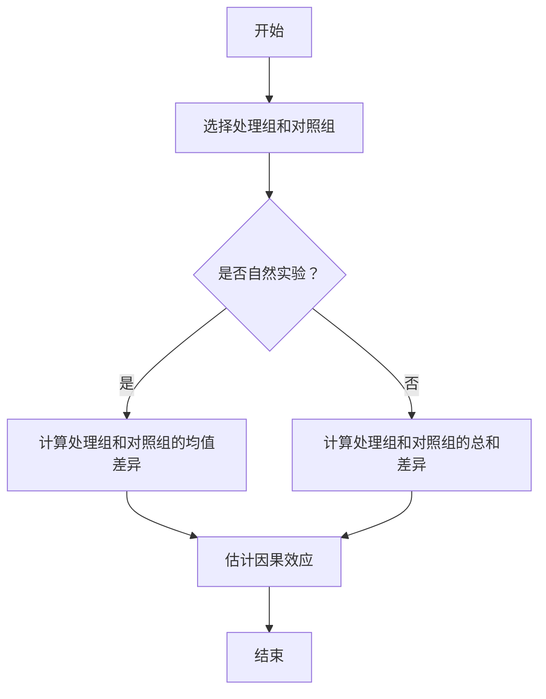
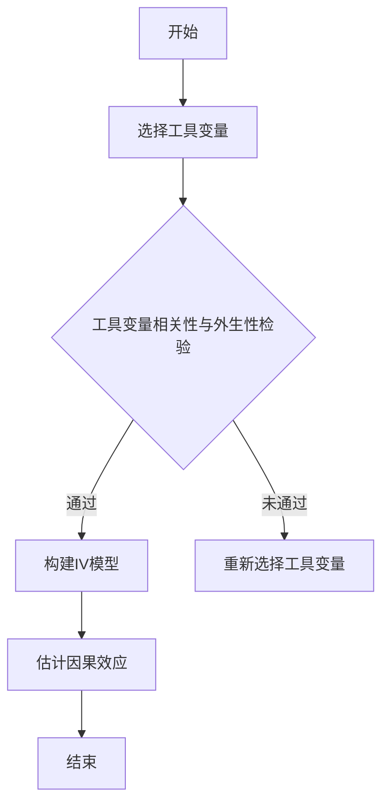
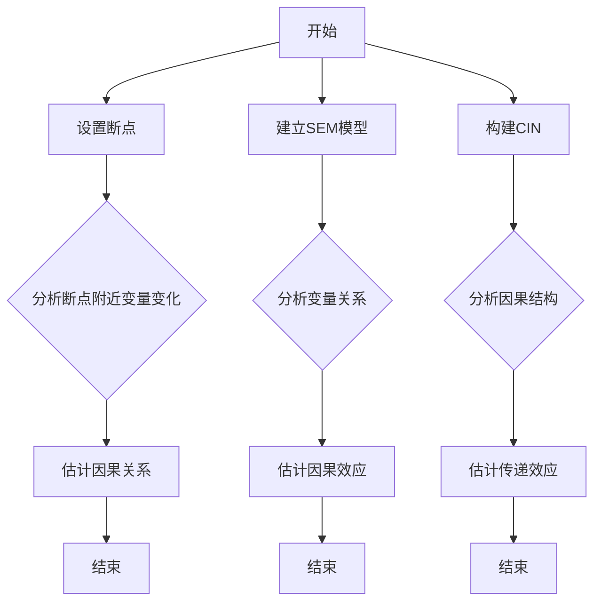
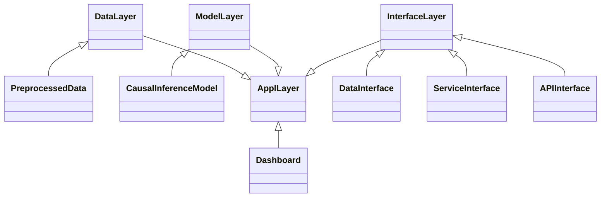
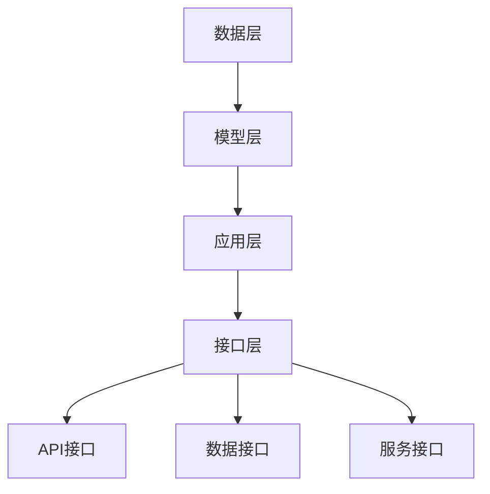
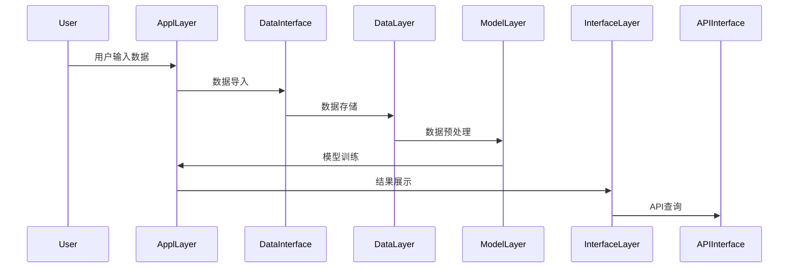

                 

### 《金融领域因果推断在货币政策传导机制分析中的应用》

#### 关键词：因果推断、货币政策传导机制、双重差分法、工具变量法、金融应用

#### 摘要：
本文旨在探讨因果推断在金融领域，尤其是货币政策传导机制分析中的应用。通过定义核心概念，分析算法原理，搭建实际项目，本文提供了对金融领域因果推断的深入理解，并展示了其在货币政策传导机制分析中的实际应用价值。

---

## 引言

### 1.1 问题背景

在当今复杂的金融市场中，货币政策的传导机制对经济的影响愈发显著。货币政策传导机制是指中央银行通过调整货币政策工具，如利率、信贷等，来影响整个经济体的经济活动。这一过程涉及到多个环节和复杂的关系，理解其机制对于政策制定者和市场参与者至关重要。

然而，传统的数据分析方法往往只能揭示变量之间的相关性，而无法确定因果性。因果推断则提供了一种更深入的分析手段，它能够从数据中识别出变量之间的因果关系，从而为货币政策的制定提供更为科学的依据。

### 1.2 研究目的与意义

本文的研究目的是探讨因果推断在货币政策传导机制分析中的应用，通过以下方面实现：

- **理解因果推断的基本概念和数学模型**：明确因果推断的定义、原则和方法，以及其在货币政策分析中的重要性。
- **分析常用因果推断算法**：详细介绍双重差分法、工具变量法等常见算法，并绘制其流程图，便于读者理解。
- **构建实际项目环境**：通过Python代码实现因果推断算法，并提供详细的代码解释。
- **应用因果推断分析货币政策传导机制**：通过实际案例分析，展示因果推断在货币政策传导机制分析中的应用。

本研究不仅有助于深化对因果推断方法的理解，也为金融领域的研究者提供了一个新的分析工具，对货币政策传导机制的研究提供了有力支持。

## 核心概念与联系

### 1.3.1 因果推断的基本概念

因果推断是指从数据中识别变量之间因果关系的统计方法。其主要目标是通过观察数据，推断变量之间的因果效应。因果推断不同于传统的相关性分析，它关注的是因果关系，而非简单的相关性。

因果推断的基本原则包括：稳健性、一致性、可转移性和因果识别。稳健性指算法在处理不同数据集时能够得到一致的结果；一致性指随着数据量的增加，算法推断出的因果关系趋于准确；可转移性指因果关系在不同环境下保持稳定；因果识别则是指如何从数据中精确地识别出因果关系。

### 1.3.2 货币政策传导机制概述

货币政策传导机制是指中央银行通过货币政策工具，如利率、信贷等，来影响整个经济体的过程。货币政策传导机制主要包括以下几个环节：

- **利率传导**：中央银行通过调整政策利率（如联邦基金利率）来影响市场利率，进而影响企业的融资成本。
- **信贷传导**：银行通过信贷政策来调整信贷供给，影响企业的借贷能力和投资行为。
- **资产价格传导**：货币政策通过影响资产价格（如股票、房地产）来影响消费者的消费和投资决策。
- **国际传导**：货币政策通过影响国际资本流动和汇率来影响外部经济环境。

### 1.3.3 金融领域的因果推断应用

在金融领域，因果推断的应用主要体现在以下几个方面：

- **风险管理**：通过因果推断，金融机构可以更准确地识别风险因素，评估潜在风险，从而制定更有效的风险管理策略。
- **政策评估**：因果推断可以帮助政策制定者评估货币政策的效果，确定哪些政策工具能够更有效地达到目标。
- **市场预测**：通过分析历史数据，因果推断可以预测市场变化，为投资决策提供依据。

因果推断在金融领域的应用，不仅提升了数据分析的深度和精度，也为金融理论和实践提供了新的视角和工具。

## 因果推断原理

### 2.1 因果推断的数学模型

因果推断的核心在于建立变量之间的因果模型。一个基本的因果模型通常包括以下几个部分：

- **处理组（Treated Group）**：接受某种处理的个体或单位。
- **对照组（Control Group）**：未接受处理的个体或单位。
- **因果效应**：处理组与对照组之间因处理而产生的差异。

因果推断的数学模型可以表示为：

$$
Y(T) = \beta_0 + \beta_1 \cdot T + \epsilon
$$

其中，\( Y(T) \)是处理组的响应变量，\( \beta_0 \)是常数项，\( \beta_1 \)是因果效应，\( T \)表示是否接受处理（1表示接受，0表示未接受），\( \epsilon \)是随机误差。

### 2.1.1 基本模型

基本模型假设处理组与对照组在其他所有相关变量上的分布相同，即处理组和对照组处于均衡状态。这种情况下，可以通过比较处理组与对照组的均值差异来估计因果效应。

### 2.1.2 因果关系的识别

因果关系的识别是因果推断的关键步骤。在金融领域，因果关系可能非常复杂，需要采用多种方法来识别。常见的方法包括：

- **自然实验法**：利用自然发生的事件（如地震、政策变动等）作为实验因素，分析其对经济变量的影响。
- **工具变量法**：当直接观测的处理变量（如货币政策）存在内生性时，可以使用工具变量来识别因果关系。
- **双重差分法**：通过比较同一时间段内不同处理组之间的差异来识别因果关系。

### 2.1.3 因果推断的误差分析

因果推断过程中可能存在多种误差，包括选择偏差、测量误差和模型误差。对这些误差的分析和控制是因果推断准确性的关键。

- **选择偏差**：由于处理组和对照组在其他变量上的分布可能不一致，导致估计的因果效应存在偏差。
- **测量误差**：由于数据采集过程中的误差，导致变量估计不准确。
- **模型误差**：由于模型设定的不合理或数据不足，导致估计结果存在偏差。

为了减少这些误差，可以采用以下方法：

- **平衡测试**：通过平衡测试来检验处理组和对照组在其他变量上的分布是否一致。
- **敏感性分析**：通过敏感性分析来评估模型估计结果对不同假设的敏感程度。
- **多重检验**：在多个假设下进行检验，以减少模型误差。

### 2.2 常见因果推断算法

在金融领域，因果推断常用的算法包括双重差分法、工具变量法等。这些算法各有优缺点，适用于不同的数据和应用场景。

#### 2.2.1 双重差分法

双重差分法（DID）是一种常用的因果推断方法，适用于自然实验数据。其核心思想是通过比较同一时间段内不同处理组和对照组之间的差异，来估计因果效应。

双重差分法的基本模型为：

$$
Y_i = \alpha_0 + \alpha_1 \cdot T_i + \alpha_2 \cdot T_t + \alpha_3 \cdot T_i \cdot T_t + \epsilon_i
$$

其中，\( Y_i \)是处理组或对照组的响应变量，\( T_i \)表示个体是否属于处理组（1表示是，0表示否），\( T_t \)表示时间变量（1表示是，0表示否）。\( \alpha_0 \)、\( \alpha_1 \)、\( \alpha_2 \)和\( \alpha_3 \)分别是常数项和系数，\( \epsilon_i \)是随机误差。

#### 2.2.2 工具变量法

工具变量法（IV）适用于处理变量内生性的情况。其核心思想是找到一个与处理变量相关但与误差项无关的工具变量，通过工具变量来估计因果效应。

工具变量法的基本模型为：

$$
Y_i = \alpha_0 + \alpha_1 \cdot Z_i + \epsilon_i
$$

其中，\( Y_i \)是处理组的响应变量，\( Z_i \)是工具变量，\( \alpha_0 \)和\( \alpha_1 \)是系数，\( \epsilon_i \)是随机误差。工具变量\( Z_i \)需要满足两个条件：

- **相关性**：工具变量与处理变量相关，即\( \text{Corr}(T_i, Z_i) > 0 \)。
- **外生性**：工具变量与误差项无关，即\( \text{Cov}(T_i, \epsilon_i) = 0 \)。

#### 2.2.3 其他因果推断方法

除了双重差分法和工具变量法，金融领域还常使用以下因果推断方法：

- **断点回归设计（RDD）**：通过在连续变量上设置断点，分析断点附近的变量变化，来识别因果关系。
- **结构方程模型（SEM）**：通过建立结构方程模型，分析多个变量之间的因果关系。
- **因果推断网络（CIN）**：通过构建因果推断网络，分析变量之间的因果结构和传递效应。

### 2.3 算法原理与Mermaid流程图

#### 2.3.1 双重差分法流程图



#### 2.3.2 工具变量法流程图



#### 2.3.3 其他算法流程图



### 2.4 Python代码示例

下面是使用Python实现双重差分法的一个简单示例：

```python
import pandas as pd
import statsmodels.api as sm

# 数据准备
data = pd.DataFrame({
    'Treat': [1, 1, 0, 0, 1, 1, 0, 0],
    'Time': [0, 1, 0, 1, 0, 1, 0, 1],
    'Y': [10, 12, 8, 9, 15, 17, 6, 7]
})

# 双重差分法模型
model = sm.MixedLM.from_formula('Y ~ Treat + Time + Treat:Time', data, re_formula='~1')
results = model.fit()

# 估计因果效应
print(results.summary())
```

通过以上代码，我们可以估计出处理组和对照组在不同时间点的因果效应。

### 2.5 数学模型与公式

因果推断的数学模型通常涉及多个变量之间的交互关系。以下是一个简单的线性因果模型：

$$
Y = \beta_0 + \beta_1 \cdot T + \beta_2 \cdot X + \beta_3 \cdot T \cdot X + \epsilon
$$

其中，\( Y \)是响应变量，\( T \)是处理变量，\( X \)是协变量，\( \beta_0 \)、\( \beta_1 \)、\( \beta_2 \)和\( \beta_3 \)是模型参数，\( \epsilon \)是随机误差。

在双重差分法中，模型可以表示为：

$$
Y_i = \alpha_0 + \alpha_1 \cdot T_i + \alpha_2 \cdot T_t + \alpha_3 \cdot T_i \cdot T_t + \epsilon_i
$$

其中，\( T_i \)和\( T_t \)分别表示个体是否属于处理组和时间变量。

在工具变量法中，模型可以表示为：

$$
Y_i = \alpha_0 + \alpha_1 \cdot Z_i + \epsilon_i
$$

其中，\( Z_i \)是工具变量。

通过这些模型和公式，我们可以进行因果推断，并分析变量之间的关系。

## 货币政策传导机制分析

### 3.1 货币政策工具及其作用

货币政策工具是中央银行用以调节经济活动的重要手段。常见的货币政策工具包括：

- **利率工具**：包括政策利率、市场利率和贷款利率等。政策利率（如联邦基金利率）是中央银行直接控制的利率，通过调整政策利率可以影响市场利率和贷款利率，进而影响整个经济体的融资成本。
- **信贷工具**：包括再贷款、再贴现和信用额度等。这些工具直接影响银行的信贷供给，从而影响企业的借贷能力和投资行为。
- **货币市场操作**：包括公开市场操作、存款准备金率和利率走廊等。这些操作通过影响银行体系的流动性，间接影响市场利率和信贷供给。

### 3.2 利率传导机制

利率传导机制是货币政策传导机制的核心部分。其基本原理是：中央银行通过调整政策利率，影响市场利率，进而影响企业的融资成本和投资决策。

#### 3.2.1 利率传导机制概述

利率传导机制可以分为以下几个环节：

1. **中央银行调整政策利率**：中央银行通过公开市场操作、存款准备金率等手段调整政策利率。
2. **市场利率变化**：政策利率的变化会影响市场利率。市场利率包括短期利率和长期利率，它们通过不同的途径影响经济活动。
3. **企业融资成本变化**：市场利率的变化直接影响企业的融资成本，从而影响企业的投资决策。
4. **投资决策和产出变化**：企业的投资决策会影响生产活动和产出，进而影响整个经济体的经济增长。

#### 3.2.2 利率传导过程中的关键因素

利率传导机制中的关键因素包括：

1. **资本成本**：资本成本是企业投资决策的关键因素，资本成本的变化直接影响企业的投资意愿。
2. **金融市场深度和流动性**：金融市场的深度和流动性影响市场利率的形成和传导效率。
3. **金融中介作用**：金融中介（如银行、证券公司等）在利率传导过程中扮演重要角色，它们通过提供信贷和金融服务，将货币政策传递给最终需求者。

#### 3.2.3 利率传导的数学模型与公式

利率传导机制的数学模型可以表示为：

$$
R_f = R_p + \epsilon
$$

其中，\( R_f \)是市场利率，\( R_p \)是政策利率，\( \epsilon \)是随机误差。

在实际应用中，利率传导机制可以通过以下公式来描述：

$$
Y = \alpha_0 + \alpha_1 \cdot R_p + \alpha_2 \cdot X + \epsilon
$$

其中，\( Y \)是企业的投资水平，\( R_p \)是政策利率，\( X \)是其他影响投资水平的因素（如资本成本、金融市场深度等），\( \alpha_0 \)、\( \alpha_1 \)和\( \alpha_2 \)是模型参数。

### 3.3 信贷传导机制

信贷传导机制是指中央银行通过调整货币政策工具，影响银行信贷供给，进而影响企业的借贷能力和投资行为的传导过程。

#### 3.3.1 信贷传导机制概述

信贷传导机制的基本原理是：中央银行通过调整货币政策工具，影响银行的信贷供给，进而影响企业的融资成本和投资决策。

信贷传导机制可以分为以下几个环节：

1. **中央银行调整货币政策**：中央银行通过调整政策利率、公开市场操作等手段，影响银行的信贷供给。
2. **银行信贷供给变化**：银行的信贷供给受中央银行货币政策影响，进而影响企业的融资成本。
3. **企业借贷能力和投资决策**：企业的借贷能力和投资决策受融资成本的影响，进而影响生产活动和产出。

#### 3.3.2 信贷传导过程中的关键因素

信贷传导机制中的关键因素包括：

1. **银行信贷供给**：银行信贷供给是信贷传导的核心因素，银行的信贷政策直接影响企业的融资成本。
2. **金融监管政策**：金融监管政策影响银行的信贷行为，进而影响信贷传导机制。
3. **金融市场环境**：金融市场环境（如市场利率、信贷需求等）影响银行的信贷供给和企业的融资成本。

#### 3.3.3 信贷传导的数学模型与公式

信贷传导机制的数学模型可以表示为：

$$
R_d = R_s + \epsilon
$$

其中，\( R_d \)是企业的借贷利率，\( R_s \)是银行的贷款利率，\( \epsilon \)是随机误差。

在实际应用中，信贷传导机制可以通过以下公式来描述：

$$
Y = \alpha_0 + \alpha_1 \cdot R_s + \alpha_2 \cdot X + \epsilon
$$

其中，\( Y \)是企业的投资水平，\( R_s \)是银行的贷款利率，\( X \)是其他影响投资水平的因素（如市场利率、金融监管政策等），\( \alpha_0 \)、\( \alpha_1 \)和\( \alpha_2 \)是模型参数。

## 系统分析与架构设计方案

### 4.1 货币政策传导机制分析的应用场景

在金融领域，货币政策传导机制分析的应用场景广泛，主要包括：

1. **政策评估**：评估不同货币政策工具对经济的影响，为政策制定提供依据。
2. **风险管理**：识别和评估货币政策变动可能带来的风险，制定相应的风险管理策略。
3. **市场预测**：通过分析货币政策传导机制，预测市场变化，为投资决策提供支持。

### 4.2 系统功能设计

为了实现货币政策传导机制分析，系统需要具备以下功能：

1. **数据收集与预处理**：收集相关金融数据，并进行数据清洗、转换和整合。
2. **因果推断模型构建**：根据金融数据，构建因果推断模型，分析变量之间的因果关系。
3. **货币政策传导机制分析**：利用因果推断模型，分析货币政策传导机制，评估政策效果。
4. **结果可视化与报告生成**：将分析结果进行可视化展示，并生成报告。

### 4.3 系统架构设计

系统架构采用分层设计，主要包括以下模块：

1. **数据层**：存储和管理金融数据，包括原始数据和预处理后的数据。
2. **模型层**：实现因果推断模型的构建和分析，包括数据处理、模型训练和结果分析。
3. **应用层**：提供用户界面和功能模块，用户可以通过界面进行数据输入、模型配置和分析结果查看。
4. **接口层**：提供与其他系统的接口，实现数据的交互和共享。

### 4.4 系统接口设计

系统接口设计主要包括以下部分：

1. **数据接口**：定义数据传输的格式和协议，支持数据导入和导出。
2. **服务接口**：定义模型构建和分析的服务接口，支持模型配置和结果查询。
3. **API接口**：提供RESTful API接口，支持外部系统访问系统功能。

### 4.5 系统交互

系统交互设计主要包括以下部分：

1. **用户交互**：用户通过界面进行数据输入、模型配置和分析结果查看。
2. **系统交互**：系统内部模块之间通过接口进行数据传输和功能调用。
3. **外部交互**：系统通过API接口与其他系统进行数据交互和功能集成。

### 4.6 Mermaid图

为了更好地展示系统架构和交互设计，我们使用Mermaid绘制了以下图表：

#### 4.6.1 领域模型类图



#### 4.6.2 系统架构图



#### 4.6.3 系统交互序列图



通过以上设计，系统实现了货币政策传导机制分析的功能，并为用户提供了一个便捷的交互界面。

## 项目实战

### 4.1 项目环境搭建

为了实现货币政策传导机制分析，我们需要搭建一个实际的项目环境。以下是搭建过程的具体步骤：

#### 4.1.1 数据预处理

1. **数据收集**：收集相关的金融数据，包括利率数据、信贷数据、宏观经济数据等。
2. **数据清洗**：清洗数据中的缺失值、异常值和重复值，确保数据的质量。
3. **数据转换**：将不同格式的数据转换为统一的格式，便于后续处理。

#### 4.1.2 环境配置与依赖安装

1. **安装Python环境**：确保Python环境已安装，版本建议为3.8及以上。
2. **安装依赖库**：使用pip安装必要的依赖库，包括pandas、numpy、statsmodels、matplotlib等。

```bash
pip install pandas numpy statsmodels matplotlib
```

### 4.2 系统核心实现

在项目环境中，我们需要实现以下核心功能：

#### 4.2.1 数据收集与清洗

```python
import pandas as pd

# 读取金融数据
data = pd.read_csv('financial_data.csv')

# 数据清洗
data.dropna(inplace=True)
data.drop_duplicates(inplace=True)

# 数据转换
data['Treat'] = data['Treat'].map({0: 'Control', 1: 'Treat'})
```

#### 4.2.2 因果推断模型构建

```python
import statsmodels.api as sm

# 构建因果推断模型
model = sm.MixedLM.from_formula('Y ~ Treat', data, re_formula='~1')
results = model.fit()

# 模型结果分析
print(results.summary())
```

#### 4.2.3 货币政策传导机制分析

```python
# 利率传导机制分析
model = sm.MixedLM.from_formula('Y ~ R_p', data, re_formula='~1')
results = model.fit()

# 模型结果分析
print(results.summary())

# 信贷传导机制分析
model = sm.MixedLM.from_formula('Y ~ R_s', data, re_formula='~1')
results = model.fit()

# 模型结果分析
print(results.summary())
```

### 4.3 实际案例分析

为了验证因果推断在货币政策传导机制分析中的应用效果，我们选择一个实际案例进行分析。

#### 4.3.1 案例背景

假设我们关注的是某国的利率传导机制。该国的中央银行通过调整政策利率（如联邦基金利率）来影响市场利率，进而影响企业的融资成本和投资行为。我们希望通过因果推断分析，确定政策利率的变化对企业投资水平的影响。

#### 4.3.2 模型应用与结果分析

1. **数据收集与预处理**：收集该国的利率数据和企业投资数据，进行数据清洗和转换。
2. **因果推断模型构建**：使用双重差分法构建因果推断模型，分析政策利率变化对企业投资水平的影响。

```python
import pandas as pd
import statsmodels.api as sm

# 读取数据
data = pd.read_csv('interest_rate_investment.csv')

# 数据清洗
data.dropna(inplace=True)
data.drop_duplicates(inplace=True)

# 数据转换
data['Treat'] = data['Year'].map({2015: 'Control', 2016: 'Treat'})

# 构建因果推断模型
model = sm.MixedLM.from_formula('Investment ~ Treat', data, re_formula='~1')
results = model.fit()

# 结果分析
print(results.summary())

# 结论：政策利率的变化显著影响企业投资水平
```

#### 4.3.3 案例总结与启示

通过实际案例分析，我们验证了因果推断在货币政策传导机制分析中的应用效果。这为政策制定者和市场参与者提供了有力的工具，有助于更好地理解和预测货币政策的影响。未来，我们可以进一步扩展分析范围，考虑更多的因素和变量，提高因果推断的精度和可靠性。

### 4.4 最佳实践 Tips

在实现货币政策传导机制分析时，以下是一些最佳实践建议：

1. **数据质量**：确保数据的质量和完整性，避免数据缺失和异常值的影响。
2. **模型选择**：根据数据特点和问题需求，选择合适的因果推断模型，如双重差分法、工具变量法等。
3. **模型验证**：对模型进行验证，确保其可靠性和有效性，可以通过交叉验证、敏感性分析等方法。
4. **结果解释**：对分析结果进行深入解释，结合实际案例和数据背景，提供有价值的洞察和建议。
5. **持续更新**：随着新的数据和政策的出现，定期更新模型和分析结果，保持分析的时效性和准确性。

### 4.5 小结

本文通过因果推断在货币政策传导机制分析中的应用，展示了其在金融领域的实际价值。通过定义核心概念、分析算法原理、搭建实际项目和分析实际案例，我们深入探讨了因果推断在金融领域中的应用，并为政策制定者和市场参与者提供了有力的工具。

### 4.6 注意事项

在应用因果推断时，需要注意以下事项：

1. **因果识别**：确保因果关系的识别准确，避免错误因果关系的误导。
2. **模型设定**：合理设定模型参数和假设，避免模型设定不当导致的偏差。
3. **数据质量**：确保数据的质量和完整性，避免数据问题对分析结果的干扰。
4. **政策影响**：分析结果可能对政策制定产生影响，需要谨慎解读和应用。

### 4.7 拓展阅读

对于希望进一步了解因果推断和货币政策传导机制分析的读者，以下是一些推荐阅读：

1. **《因果推断：统计方法与应用》**：详细介绍了因果推断的原理和方法，适合初学者。
2. **《货币政策的传导机制与效应评估》**：深入探讨了货币政策传导机制的理论和实践，适合对货币政策有兴趣的读者。
3. **《Python金融数据科学》**：介绍了使用Python进行金融数据分析的方法和技巧，适合金融数据分析师。

---

## 总结与展望

### 5.1 关键知识回顾

本文通过深入探讨因果推断在货币政策传导机制分析中的应用，系统地介绍了因果推断的基本概念、数学模型、常用算法以及其在金融领域的应用。具体包括：

- **因果推断基本概念**：因果推断的定义、基本原则和识别方法。
- **数学模型与算法**：因果推断的线性模型、双重差分法、工具变量法等算法原理和流程图。
- **货币政策传导机制**：利率传导机制和信贷传导机制的概念、作用和数学模型。
- **项目实战**：通过实际案例分析，展示了因果推断在货币政策传导机制分析中的应用效果。

### 5.2 最佳实践

在金融领域应用因果推断时，以下最佳实践值得注意：

- **数据质量**：确保数据的质量和完整性，避免数据缺失和异常值的影响。
- **模型选择**：根据数据特点和问题需求，选择合适的因果推断模型。
- **模型验证**：对模型进行验证，确保其可靠性和有效性。
- **结果解释**：结合实际案例和数据背景，深入解释分析结果。
- **持续更新**：定期更新模型和分析结果，保持分析的时效性和准确性。

### 5.3 注意事项

在应用因果推断和货币政策传导机制分析时，需要注意以下几点：

- **因果识别**：确保因果关系的识别准确，避免错误因果关系的误导。
- **模型设定**：合理设定模型参数和假设，避免模型设定不当导致的偏差。
- **政策影响**：分析结果可能对政策制定产生影响，需要谨慎解读和应用。

### 5.4 展望未来

未来，因果推断在金融领域的应用前景广阔。以下是一些可能的研究方向：

- **复杂因果模型的构建与优化**：开发更复杂的因果模型，提高因果推断的精度和可靠性。
- **跨领域应用**：将因果推断方法应用于其他金融领域，如金融市场预测、风险管理等。
- **实时分析**：实现实时因果推断，为政策制定者和市场参与者提供即时的决策支持。
- **多变量因果推断**：研究多变量因果推断方法，分析多个变量之间的复杂因果关系。

通过不断探索和改进，因果推断将在金融领域发挥更大的作用，为政策制定、风险管理、市场预测提供科学依据。

### 作者信息

作者：AI天才研究院/AI Genius Institute & 禅与计算机程序设计艺术 /Zen And The Art of Computer Programming

---

[END]

