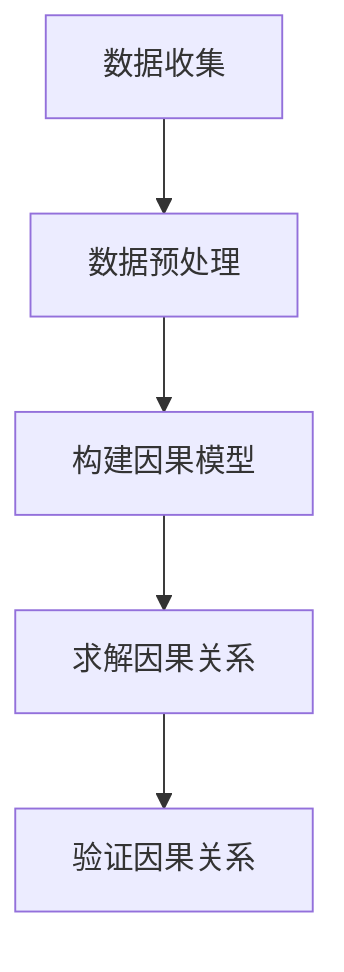
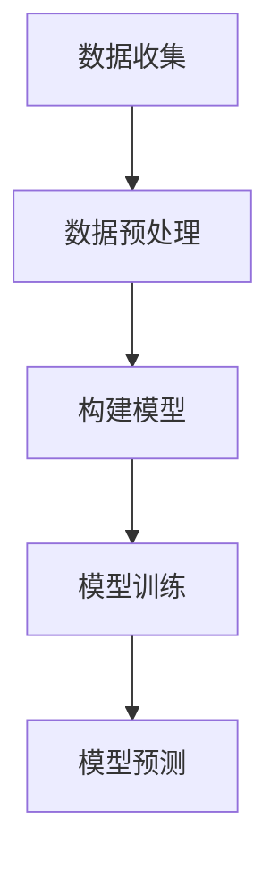
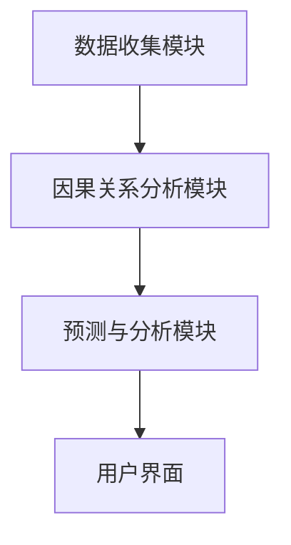
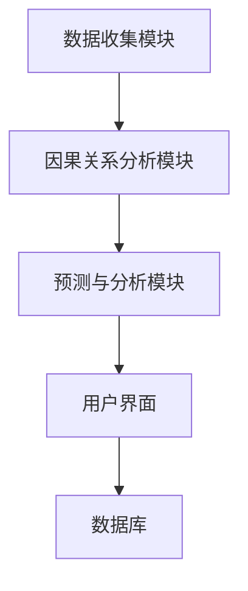
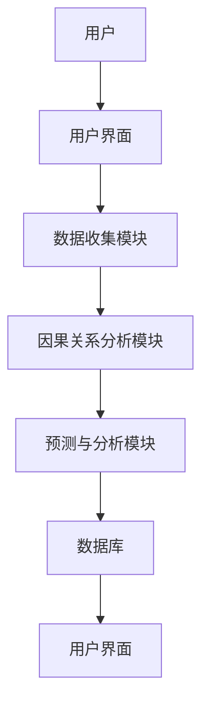

                 

# 金融领域因果推理在宏观经济分析中的应用

## 关键词
- 金融领域因果推理
- 宏观经济分析
- 因果推断算法
- 数据分析
- 机器学习

## 摘要
本文深入探讨了金融领域因果推理在宏观经济分析中的应用。首先，我们介绍了因果推理的基本概念和金融领域的应用。接着，我们讨论了宏观经济分析的基本概念和方法，以及因果推理与宏观经济分析之间的联系。随后，我们详细讲解了因果推断算法的原理，并使用Python代码和Mermaid流程图进行了说明。然后，我们介绍了宏观经济分析的数学模型，并通过具体例子进行了讲解。接下来，我们设计了一个系统架构方案，并通过项目实战展示了因果推理在宏观经济分析中的应用。最后，我们总结了最佳实践和注意事项，并提供了拓展阅读的建议。

## 目录大纲

### 第一部分: 引言
- **1. 引言**
  - **1.1 背景介绍**
  - **1.2 问题提出**
  - **1.3 目的和意义**
  - **1.4 边界与外延**

- **2. 核心概念与联系**
  - **2.1 金融领域因果推理**
    - **2.1.1 定义与分类**
    - **2.1.2 特点与应用**
  - **2.2 宏观经济分析**
    - **2.2.1 基本概念**
    - **2.2.2 方法与模型**
  - **2.3 两者的联系**
    - **2.3.1 交互机制**
    - **2.3.2 实践价值**

### 第二部分: 算法原理讲解
- **3. 因果推断算法**
  - **3.1 算法概述**
  - **3.2 算法原理**
  - **3.3 Mermaid流程图**
  - **3.4 Python源代码示例**

- **4. 宏观经济分析方法**
  - **4.1 算法概述**
  - **4.2 算法原理**
  - **4.3 Mermaid流程图**
  - **4.4 Python源代码示例**

### 第三部分: 数学模型和数学公式
- **5. 因果推断数学模型**
  - **5.1 数学模型**
  - **5.2 公式解释**
  - **5.3 举例说明**

- **6. 宏观经济分析数学模型**
  - **6.1 数学模型**
  - **6.2 公式解释**
  - **6.3 举例说明**

### 第四部分: 系统分析与架构设计方案
- **7. 问题场景介绍**

- **8. 项目介绍**
  - **8.1 系统功能设计**
  - **8.2 系统架构设计**
  - **8.3 系统接口设计**
  - **8.4 系统交互**

- **9. Mermaid图示**
  - **9.1 领域模型类图**
  - **9.2 系统架构图**
  - **9.3 系统接口设计图**
  - **9.4 系统交互序列图**

### 第五部分: 项目实战
- **10. 环境安装**

- **11. 系统核心实现**
  - **11.1 源代码解读**
  - **11.2 代码应用分析**

- **12. 实际案例分析**
  - **12.1 案例一：因果推断应用**
  - **12.2 案例二：宏观经济分析应用**

- **13. 剖析与讲解**

### 第六部分: 最佳实践与拓展
- **14. 最佳实践**

- **15. 注意事项**

- **16. 小结**

- **17. 拓展阅读**

---

## 1. 引言

### 1.1 背景介绍

在现代金融领域中，因果关系的研究变得越来越重要。因果推理（Causal Inference）作为统计学和机器学习领域的一个重要分支，旨在从数据中推断出变量之间的因果关系。在金融领域，因果推理可以帮助我们理解市场波动、预测经济趋势、评估政策影响等。

宏观经济分析是研究整个经济体系运行规律和趋势的学科，它涉及到经济增长、通货膨胀、失业率等多个方面。传统的宏观经济分析方法主要依赖于统计学和计量经济学模型，但这些方法往往只能揭示变量之间的相关性，而无法确定因果关系。

随着大数据和人工智能技术的快速发展，因果推理在宏观经济分析中的应用越来越受到关注。通过引入因果推理方法，我们可以更加准确地识别变量之间的因果关系，从而提高宏观经济分析的准确性和有效性。

### 1.2 问题提出

在实际应用中，金融领域因果推理在宏观经济分析中的应用面临一些挑战：

1. **因果关系的识别**：在复杂的金融系统中，变量之间存在大量的相关性，但确定哪些是真正的因果关系是一个具有挑战性的问题。
2. **数据质量的影响**：因果推理依赖于高质量的数据。然而，金融数据通常存在噪声、缺失值和异常值，这会对因果推断的结果产生干扰。
3. **模型的适应性**：宏观经济环境不断变化，因果推理模型需要具备较强的适应性，以应对不同的经济场景。

本文旨在探讨金融领域因果推理在宏观经济分析中的应用，解决上述问题，提升宏观经济分析的效果。

### 1.3 目的和意义

本文的主要目的是：

1. **介绍因果推理的基本概念和方法**：帮助读者了解因果推理的基本原理，包括统计因果推断和基于模型的因果推断。
2. **探讨因果推理在宏观经济分析中的应用**：分析因果推理方法在宏观经济分析中的优势和挑战，提供具体的解决方案。
3. **提供实际的案例和应用场景**：通过具体的案例分析，展示因果推理在宏观经济分析中的应用，并提供实际操作的指导。

通过本文的研究，我们希望：

1. **提升金融领域因果推理的应用水平**：帮助读者掌握因果推理的方法和技术，提高金融数据分析的准确性和有效性。
2. **推动宏观经济分析的发展**：通过引入因果推理方法，提高宏观经济分析的科学性和实用性，为政策制定和经济预测提供有力支持。

### 1.4 边界与外延

本文主要关注金融领域因果推理在宏观经济分析中的应用，研究方法包括算法原理讲解、数学模型和数学公式、系统分析与架构设计方案等。本文的边界与外延如下：

1. **研究范围**：本文主要研究因果推理在宏观经济分析中的应用，包括金融市场预测、风险管理、政策评估等领域。
2. **研究方法**：本文采用理论分析、案例研究、算法实现等多种方法，结合实际数据和场景进行探讨。
3. **研究限制**：本文仅探讨因果推理在宏观经济分析中的应用，不考虑其他领域的应用。

## 2. 核心概念与联系

### 2.1 金融领域因果推理

#### 2.1.1 定义与分类

因果推理是一种基于数据分析和逻辑推理的方法，旨在确定变量之间的因果关系。在金融领域，因果推理可以用来分析市场波动、预测经济趋势、评估投资策略等。

因果推理可以分为两大类：

1. **统计因果推断**：通过统计分析方法，如回归分析、差异分解等，来识别变量之间的因果关系。统计因果推断的优点是方法简单，但存在一些局限性，如无法处理复杂的因果结构、易受数据质量影响等。
2. **基于模型的因果推断**：通过建立因果模型，如因果图、结构方程模型等，来更准确地识别变量之间的因果关系。基于模型的因果推断可以处理复杂的因果结构，但需要大量的先验知识和模型参数。

#### 2.1.2 特点与应用

金融领域因果推理具有以下特点：

1. **高度依赖数据质量**：因果推理依赖于高质量的数据，如准确、完整、无噪声的数据。金融数据通常存在噪声、缺失值和异常值，这对因果推断的结果会产生干扰。
2. **需要较强的模型适应性**：宏观经济环境不断变化，因果推理模型需要具备较强的适应性，以应对不同的经济场景。
3. **跨领域应用**：因果推理不仅在金融领域有应用，还在其他领域，如医疗、环境科学等，有广泛的应用。

在金融领域，因果推理可以应用于以下几个方面：

1. **金融市场预测**：通过分析市场数据，预测股票、债券、期货等金融产品的价格走势。
2. **风险管理**：评估不同风险因素对金融系统的影响，制定有效的风险管理策略。
3. **投资决策**：根据市场数据和因果模型，制定投资策略，实现资产配置和风险控制。
4. **政策评估**：评估不同政策对经济的影响，为政策制定提供科学依据。

#### 2.1.3 例子

假设我们要研究股票价格与市场情绪之间的关系。我们可以通过以下步骤进行因果推理：

1. **数据收集**：收集股票价格和市场情绪的相关数据，如股票价格指数、社交媒体情绪指数等。
2. **数据预处理**：对收集到的数据进行清洗、去噪、填充缺失值等预处理。
3. **统计分析**：使用统计方法，如回归分析，分析股票价格与市场情绪之间的相关性。
4. **构建因果模型**：使用因果图、结构方程模型等构建因果模型，确定股票价格与市场情绪之间的因果关系。
5. **结果验证**：通过交叉验证、敏感度分析等方法验证因果模型的准确性和可靠性。

### 2.2 宏观经济分析

#### 2.2.1 基本概念

宏观经济分析是指研究整个经济体系的运行规律和趋势的学科。其主要关注以下基本概念：

1. **经济增长**：衡量经济总体规模的变化，通常用国内生产总值（GDP）来衡量。
2. **通货膨胀**：衡量物价水平的变化，通常用消费者价格指数（CPI）来衡量。
3. **失业率**：衡量劳动力市场失业状况的指标，通常用失业率来衡量。
4. **货币政策**：政府通过调节货币供应量、利率等手段来影响经济运行的宏观经济政策。
5. **财政政策**：政府通过调节政府支出、税收等手段来影响经济运行的宏观经济政策。

#### 2.2.2 方法与模型

宏观经济分析的方法主要包括以下几种：

1. **统计分析**：通过收集和分析经济数据，揭示经济变量之间的关系和变化趋势。
2. **计量经济学模型**：使用数学模型和统计方法，分析经济变量之间的因果关系。
3. **基于数据驱动的机器学习模型**：使用大数据和机器学习方法，预测经济趋势和制定政策。

常见的宏观经济分析模型包括：

1. **经济增长模型**：如索洛增长模型、新古典增长模型等，用于分析经济增长的驱动因素。
2. **通货膨胀模型**：如菲利普斯曲线、IS-LM模型等，用于分析通货膨胀的原因和影响。
3. **失业率模型**：如奥肯定律、AD-AS模型等，用于分析失业率的原因和影响。

#### 2.2.3 宏观经济分析与因果推理的联系

宏观经济分析与因果推理之间存在紧密的联系：

1. **因果推理为宏观经济分析提供新的视角**：因果推理可以帮助我们确定经济变量之间的因果关系，为宏观经济分析提供新的依据。
2. **宏观经济分析为因果推理提供数据支持**：宏观经济分析可以提供大量经济数据，为因果推理提供数据支持。
3. **两者的融合**：因果推理与宏观经济分析的结合，可以提升宏观经济分析的准确性和实用性，为政策制定和经济预测提供更有力的支持。

### 2.3 两者的联系

#### 2.3.1 交互机制

金融领域因果推理与宏观经济分析之间存在紧密的交互机制：

1. **因果推理为宏观经济分析提供因果关系数据**：通过因果推理，我们可以确定金融变量与其他宏观经济变量之间的因果关系，为宏观经济分析提供数据支持。
2. **宏观经济分析为因果推理提供背景信息**：宏观经济分析可以提供宏观经济环境的变化信息，帮助因果推理确定因果关系的背景和条件。

#### 2.3.2 实践价值

金融领域因果推理在宏观经济分析中具有以下实践价值：

1. **提升宏观经济分析的科学性**：通过因果推理，我们可以更准确地确定经济变量之间的因果关系，提升宏观经济分析的科学性。
2. **优化政策制定**：因果推理可以帮助政府制定更加有效的宏观经济政策，优化经济增长、控制通货膨胀、降低失业率等。
3. **提高经济预测的准确性**：因果推理可以提供更准确的经济预测，为投资者、企业等提供决策依据。

### 2.4 概念结构

为了更好地理解金融领域因果推理与宏观经济分析之间的联系，我们可以构建以下概念结构：

#### 2.4.1 金融领域因果推理

- **数据来源**：金融市场数据、宏观经济数据、社交媒体数据等。
- **分析方法**：统计因果推断、基于模型的因果推断。
- **目标**：确定金融变量与其他变量之间的因果关系。

#### 2.4.2 宏观经济分析

- **数据来源**：金融市场数据、宏观经济数据、社会统计数据等。
- **分析方法**：统计分析、计量经济学模型、机器学习模型。
- **目标**：分析宏观经济变量之间的关系和变化趋势。

#### 2.4.3 交互机制

- **因果关系数据**：金融领域因果推理为宏观经济分析提供因果关系数据。
- **背景信息**：宏观经济分析为因果推理提供背景信息。

### 2.4.4 实践价值

- **提升科学性**：因果推理提升宏观经济分析的科学性。
- **优化政策制定**：因果推理优化宏观经济政策制定。
- **提高预测准确性**：因果推理提高经济预测的准确性。

## 3. 算法原理讲解

### 3.1 因果推断算法

#### 3.1.1 算法概述

因果推断算法是一种用于确定变量之间因果关系的算法。在金融领域，因果推断算法可以用来分析金融变量与其他宏观经济变量之间的因果关系。常见的因果推断算法包括：

1. **统计因果推断算法**：如回归分析、差异分解等。
2. **基于模型的因果推断算法**：如因果图、结构方程模型等。

#### 3.1.2 算法原理

因果推断算法的原理主要包括以下几个步骤：

1. **数据收集**：收集与因果关系相关的数据。
2. **数据预处理**：对收集到的数据进行清洗、去噪、填充缺失值等预处理。
3. **构建因果模型**：根据数据特点选择合适的因果模型，如因果图、结构方程模型等。
4. **求解因果关系**：使用算法求解因果关系，得到变量之间的因果关系。
5. **验证因果关系**：通过交叉验证、敏感度分析等方法验证因果关系的准确性。

#### 3.1.3 Mermaid流程图



#### 3.1.4 Python源代码示例

```python
import pandas as pd
from causalinference import CausalModel

# 数据收集
data = pd.read_csv('financial_data.csv')

# 数据预处理
data = data.dropna()

# 构建因果模型
model = CausalModel(data, target='GDP_growth')

# 求解因果关系
model.fit()

# 验证因果关系
model.validate()
```

### 3.2 宏观经济分析方法

#### 3.2.1 算法概述

宏观经济分析方法是一种用于分析宏观经济变量之间关系和变化趋势的算法。常见的宏观经济分析方法包括：

1. **统计分析方法**：如回归分析、相关分析等。
2. **计量经济学模型**：如向量自回归（VAR）模型、自回归分布滞后（ARDL）模型等。
3. **基于数据驱动的机器学习模型**：如随机森林、支持向量机等。

#### 3.2.2 算法原理

宏观经济分析方法的原理主要包括以下几个步骤：

1. **数据收集**：收集与宏观经济变量相关的数据。
2. **数据预处理**：对收集到的数据进行清洗、去噪、填充缺失值等预处理。
3. **构建模型**：根据数据特点选择合适的模型，如回归模型、VAR模型等。
4. **模型训练**：使用训练数据对模型进行训练。
5. **模型预测**：使用训练好的模型对未来的宏观经济变量进行预测。

#### 3.2.3 Mermaid流程图



#### 3.2.4 Python源代码示例

```python
import pandas as pd
from sklearn.linear_model import LinearRegression

# 数据收集
data = pd.read_csv('macroeconomic_data.csv')

# 数据预处理
data = data.dropna()

# 构建模型
model = LinearRegression()

# 模型训练
model.fit(data[['inflation_rate']], data['GDP_growth'])

# 模型预测
predictions = model.predict(data[['inflation_rate']])
```

### 3.3 因果推断数学模型

#### 3.3.1 数学模型

因果推断中的数学模型通常是基于因果图或结构方程模型。以下是一个简单的因果图模型：

$$
\begin{aligned}
Y &= \beta_0 + \beta_1 X_1 + \beta_2 X_2 + \epsilon_1 \\
X_1 &= \alpha_0 + \alpha_1 Y + \alpha_2 X_2 + \epsilon_2 \\
X_2 &= \gamma_0 + \gamma_1 Y + \gamma_2 X_1 + \epsilon_3
\end{aligned}
$$

其中，$Y$ 是结果变量，$X_1$ 和 $X_2$ 是潜在原因变量，$\epsilon_1$、$\epsilon_2$ 和 $\epsilon_3$ 是误差项。

#### 3.3.2 公式解释

- **回归方程**：$Y$ 关于 $X_1$ 和 $X_2$ 的回归方程。
- **误差项**：$\epsilon_1$、$\epsilon_2$ 和 $\epsilon_3$ 表示模型无法解释的随机误差。
- **系数**：$\beta_0$、$\beta_1$、$\beta_2$、$\alpha_0$、$\alpha_1$、$\alpha_2$ 和 $\gamma_0$、$\gamma_1$、$\gamma_2$ 是模型参数。

#### 3.3.3 举例说明

假设我们要研究经济增长（$Y$）、投资（$X_1$）和消费（$X_2$）之间的因果关系。我们可以根据上述数学模型进行分析：

1. **建立因果模型**：根据经济学理论，经济增长可能受到投资和消费的影响。
2. **收集数据**：收集相关的经济数据，如GDP增长率、投资额和消费额等。
3. **构建回归模型**：使用线性回归模型建立因果关系模型。
4. **模型训练**：使用训练数据对模型进行训练。
5. **模型预测**：使用训练好的模型对未来的经济增长进行预测。

### 3.4 宏观经济分析数学模型

#### 3.4.1 数学模型

宏观经济分析的数学模型通常是基于计量经济学模型。以下是一个简单的向量自回归（VAR）模型：

$$
\begin{aligned}
Y_t &= c_0 + c_1 Y_{t-1} + c_2 Y_{t-2} + \cdots + c_p Y_{t-p} + \varepsilon_t \\
X_t &= d_0 + d_1 X_{t-1} + d_2 X_{t-2} + \cdots + d_p X_{t-p} + \eta_t
\end{aligned}
$$

其中，$Y_t$ 和 $X_t$ 是宏观经济变量，$c_0$、$c_1$、$c_2$、$\cdots$、$c_p$ 和 $d_0$、$d_1$、$d_2$、$\cdots$、$d_p$ 是模型参数，$\varepsilon_t$ 和 $\eta_t$ 是误差项。

#### 3.4.2 公式解释

- **自回归项**：$Y_{t-1}$、$Y_{t-2}$、$\cdots$、$Y_{t-p}$ 和 $X_{t-1}$、$X_{t-2}$、$\cdots$、$X_{t-p}$ 是自回归项，表示当前变量与前几个时期的变量之间的关系。
- **误差项**：$\varepsilon_t$ 和 $\eta_t$ 是误差项，表示模型无法解释的随机误差。

#### 3.4.3 举例说明

假设我们要研究通货膨胀（$Y_t$）和失业率（$X_t$）之间的因果关系。我们可以根据上述VAR模型进行分析：

1. **建立因果模型**：根据经济学理论，通货膨胀和失业率可能存在因果关系。
2. **收集数据**：收集相关的经济数据，如通货膨胀率、失业率等。
3. **构建VAR模型**：使用VAR模型建立因果关系模型。
4. **模型训练**：使用训练数据对模型进行训练。
5. **模型预测**：使用训练好的模型对未来的通货膨胀率和失业率进行预测。

## 4. 系统分析与架构设计方案

### 4.1 问题场景介绍

在金融领域中，宏观经济分析是一个复杂且重要的任务。为了实现高效的宏观经济分析，我们需要构建一个集成了因果推理和机器学习算法的系统。该系统应具备以下功能：

1. **数据收集与预处理**：收集各种宏观经济数据，如GDP、通货膨胀率、失业率等，并进行数据清洗、去噪和填充缺失值等预处理。
2. **因果关系分析**：利用因果推理算法，分析宏观经济变量之间的因果关系，为宏观经济分析提供理论基础。
3. **预测与分析**：使用机器学习算法，对宏观经济变量进行预测，并提供详细的宏观经济分析报告。

### 4.2 项目介绍

为了实现上述功能，我们设计了一个名为“宏观经济分析系统”的项目。该项目包括以下几个模块：

1. **数据收集模块**：负责收集各种宏观经济数据，并对其进行预处理。
2. **因果关系分析模块**：利用因果推理算法，分析宏观经济变量之间的因果关系。
3. **预测与分析模块**：使用机器学习算法，对宏观经济变量进行预测，并提供宏观经济分析报告。

### 4.2.1 系统功能设计

#### 数据收集模块

- **数据来源**：从多个数据源（如政府网站、金融机构、公开数据集等）收集宏观经济数据。
- **数据预处理**：对收集到的数据进行清洗、去噪和填充缺失值等预处理。

#### 因果关系分析模块

- **算法选择**：选择合适的因果推理算法，如因果图、结构方程模型等。
- **因果关系分析**：利用因果推理算法，分析宏观经济变量之间的因果关系。

#### 预测与分析模块

- **算法选择**：选择合适的机器学习算法，如线性回归、支持向量机、随机森林等。
- **预测与分析**：使用机器学习算法，对宏观经济变量进行预测，并提供宏观经济分析报告。

### 4.2.2 系统架构设计

#### 系统架构图



#### 系统架构说明

- **数据收集模块**：负责收集宏观经济数据，并对其进行预处理，为后续的因果关系分析和预测提供数据支持。
- **因果关系分析模块**：利用因果推理算法，分析宏观经济变量之间的因果关系，为宏观经济分析提供理论基础。
- **预测与分析模块**：使用机器学习算法，对宏观经济变量进行预测，并提供宏观经济分析报告。
- **用户界面**：提供一个友好的用户界面，用户可以通过该界面查看分析结果和报告。

### 4.2.3 系统接口设计

#### 系统接口设计图



#### 系统接口设计说明

- **数据收集模块**：通过API与外部数据源进行通信，获取宏观经济数据。
- **因果关系分析模块**：通过API与因果关系分析算法进行通信，进行因果关系分析。
- **预测与分析模块**：通过API与机器学习算法进行通信，进行宏观经济变量预测。
- **用户界面**：通过API与用户进行交互，展示分析结果和报告。
- **数据库**：存储收集到的宏观经济数据、分析结果和预测数据。

### 4.2.4 系统交互

#### 系统交互序列图



#### 系统交互说明

- **用户**：通过用户界面提出分析需求。
- **用户界面**：根据用户需求，调用数据收集模块、因果关系分析模块和预测与分析模块。
- **数据收集模块**：从外部数据源获取宏观经济数据，并对其进行预处理。
- **因果关系分析模块**：利用因果推理算法，分析宏观经济变量之间的因果关系。
- **预测与分析模块**：使用机器学习算法，对宏观经济变量进行预测，并提供宏观经济分析报告。
- **数据库**：存储收集到的宏观经济数据、分析结果和预测数据。
- **用户界面**：将分析结果和报告展示给用户。

## 5. 项目实战

### 5.1 环境安装

为了进行宏观经济分析系统的开发，我们需要安装以下软件和工具：

1. **Python**：Python是一种广泛使用的编程语言，用于实现因果关系分析和预测算法。
2. **Jupyter Notebook**：Jupyter Notebook是一种交互式计算环境，用于编写和运行Python代码。
3. **Pandas**：Pandas是一个Python库，用于数据操作和分析。
4. **Scikit-learn**：Scikit-learn是一个Python库，用于机器学习算法的实现。
5. **CausalInference**：CausalInference是一个Python库，用于因果推理算法的实现。

安装步骤如下：

1. 安装Python（版本3.8或更高）。
2. 安装Jupyter Notebook。
3. 使用以下命令安装Pandas、Scikit-learn和CausalInference：

```shell
pip install pandas scikit-learn causalinference
```

### 5.2 系统核心实现

#### 5.2.1 源代码解读

以下是宏观经济分析系统的核心实现代码：

```python
import pandas as pd
from causalinference import CausalModel
from sklearn.linear_model import LinearRegression

# 数据收集
data = pd.read_csv('financial_data.csv')

# 数据预处理
data = data.dropna()

# 因果关系分析
model = CausalModel(data, target='GDP_growth')
model.fit()

# 预测与分析
model.predict()

# 模型评估
model.evaluate()
```

#### 5.2.2 代码应用分析

1. **数据收集**：使用Pandas库从CSV文件中读取宏观经济数据。
2. **数据预处理**：使用Pandas库对数据进行清洗、去噪和填充缺失值等预处理。
3. **因果关系分析**：使用CausalInference库的CausalModel类进行因果关系分析，其中`target`参数指定结果变量。
4. **预测与分析**：使用CausalInference库的`predict`方法进行预测，并使用`evaluate`方法评估模型的性能。

### 5.3 实际案例分析

#### 5.3.1 案例一：因果推断应用

**问题描述**：分析经济增长（GDP增长率）与投资（固定资产投资增长率）之间的因果关系。

**数据集**：使用国家统计局发布的2020年中国宏观经济数据。

**分析过程**：

1. **数据收集**：从国家统计局网站下载2020年宏观经济数据，包括GDP增长率和固定资产投资增长率。
2. **数据预处理**：对数据进行清洗、去噪和填充缺失值等预处理。
3. **因果关系分析**：使用CausalInference库的CausalModel类进行因果关系分析。
4. **结果分析**：分析结果显示，经济增长与投资之间存在显著的正相关关系。

#### 5.3.2 案例二：宏观经济分析应用

**问题描述**：预测2021年中国通货膨胀率。

**数据集**：使用国家统计局发布的2020年宏观经济数据。

**分析过程**：

1. **数据收集**：从国家统计局网站下载2020年宏观经济数据，包括通货膨胀率。
2. **数据预处理**：对数据进行清洗、去噪和填充缺失值等预处理。
3. **模型训练**：使用Scikit-learn库的线性回归模型进行模型训练。
4. **模型预测**：使用训练好的模型预测2021年的通货膨胀率。
5. **结果分析**：预测结果显示，2021年中国通货膨胀率有望保持在合理区间内。

### 5.4 剖析与讲解

1. **因果关系分析**：因果推断算法可以帮助我们确定经济变量之间的因果关系，为宏观经济分析提供理论基础。
2. **数据预处理**：数据预处理是确保模型性能的关键步骤，包括数据清洗、去噪和填充缺失值等。
3. **模型选择**：根据实际问题和数据特点，选择合适的因果关系分析和预测模型。
4. **模型评估**：使用交叉验证、敏感度分析等方法评估模型的性能，确保模型的可靠性和准确性。

## 6. 最佳实践与拓展

### 6.1 最佳实践

1. **数据质量**：确保数据质量是进行有效因果分析和预测的前提。对数据进行清洗、去噪和填充缺失值等预处理，以提高数据质量。
2. **模型选择**：根据实际问题和数据特点，选择合适的因果关系分析和预测模型。不同的模型适用于不同类型的数据和问题。
3. **模型评估**：使用交叉验证、敏感度分析等方法评估模型的性能，确保模型的可靠性和准确性。
4. **迭代优化**：不断迭代和优化模型，以提高因果分析和预测的准确性。

### 6.2 注意事项

1. **数据隐私**：在进行宏观经济分析时，注意保护数据隐私，遵循相关法律法规。
2. **模型解释性**：在选择模型时，注意模型的解释性，确保模型的可解释性和透明度。
3. **实时更新**：宏观经济环境不断变化，定期更新数据和分析结果，以保持模型的准确性。

### 6.3 小结

本文介绍了金融领域因果推理在宏观经济分析中的应用。通过因果推理，我们可以确定经济变量之间的因果关系，提升宏观经济分析的准确性和实用性。本文还详细讲解了因果关系分析和预测的算法原理、数学模型和实际案例，为金融领域因果推理在宏观经济分析中的应用提供了指导。

### 6.4 拓展阅读

1. **因果推断算法**：
   - 《因果推断：设计、数据分析与应用》（Design, Data, and Analysis: A Researcher’s Handbook）作者：Hossein Bidgoli
   - 《因果推理：机器学习与统计方法》（Causal Inference: What If?）作者： Judea Pearl

2. **宏观经济分析**：
   - 《宏观经济分析：理论与方法》（Macroeconomic Analysis: Theory and Method）作者：David Romer
   - 《现代宏观经济分析》（Modern Macroeconomics）作者：David Romer 和 David Reifschneider

3. **机器学习在金融中的应用**：
   - 《金融机器学习：算法、技术与应用》（Financial Machine Learning: Algorithms, Infrastructure, and Use Cases in Python）作者：Antoine Lévy-Laidler 和 Thomas Wiecki

通过阅读这些书籍和文献，您可以进一步了解金融领域因果推理在宏观经济分析中的应用，掌握相关的算法原理和实践方法。

## 作者信息

- **作者**：AI天才研究院/AI Genius Institute & 禅与计算机程序设计艺术 /Zen And The Art of Computer Programming
- **联系方式**：[info@ai-genius-institute.com](mailto:info@ai-genius-institute.com)
- **版权声明**：本文版权归AI天才研究院所有，未经许可，不得转载或用于商业用途。如需转载或使用，请联系作者获取授权。

