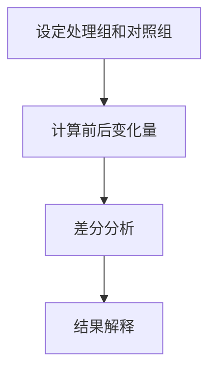
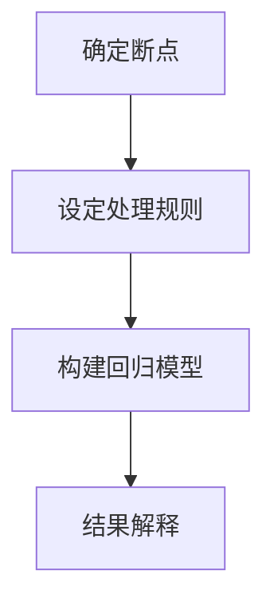
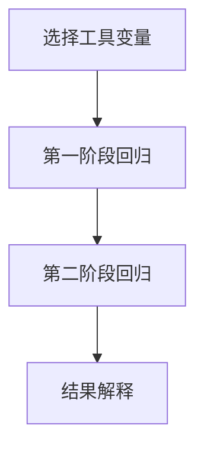
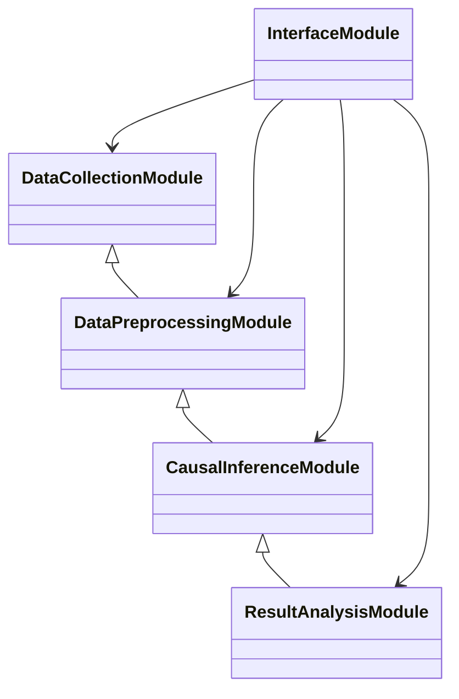
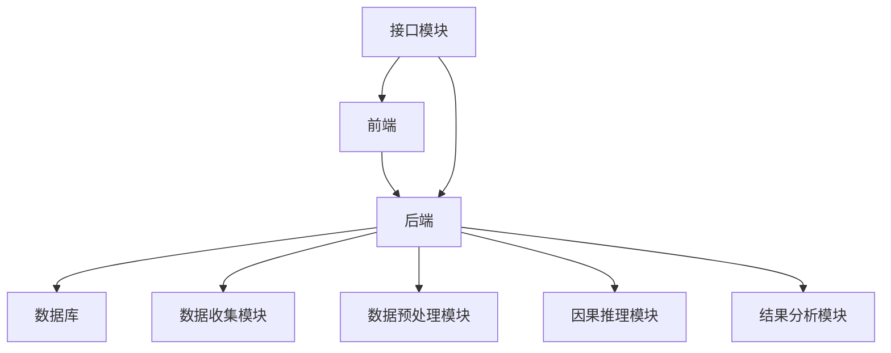
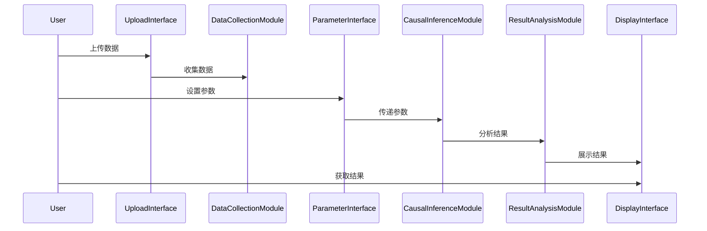
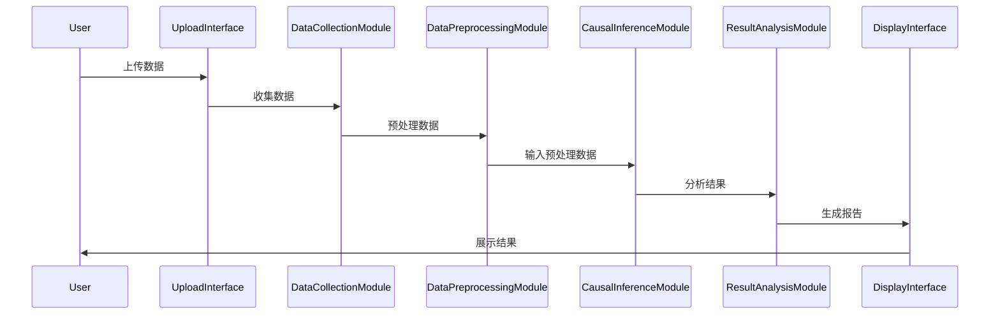

                 

### 引言

在现代社会，金融领域的复杂性和重要性日益增加，因此对宏观经济政策效果进行准确评估显得尤为关键。这种评估不仅有助于政策制定者了解政策实施后的实际效果，还能为未来的政策调整提供有力支持。然而，宏观经济政策效果的评估并非易事，它涉及多方面的变量和复杂的因果关系。

因果推理作为一种理解和解释现象之间因果关系的科学方法，在金融领域中的应用具有重要意义。通过因果推理，我们能够更准确地识别政策变量与结果变量之间的因果关系，从而对宏观经济政策的效果进行科学评估。

本文旨在探讨金融领域因果推理在宏观经济政策效果评估中的应用。首先，我们将介绍因果推理的基本概念和原理，帮助读者理解其核心思想和应用场景。接着，我们将阐述金融领域因果推理的必要性，并详细介绍其在宏观经济政策效果评估中的关键作用。

本文的结构安排如下：

1. 引言：简述金融领域因果推理的重要性，以及本书的目的和结构。
2. 问题背景与定义：介绍因果推理的基本概念和原理，以及金融领域因果推理的必要性。
3. 宏观经济政策效果评估：描述宏观经济政策及其效果评估的方法，讨论宏观经济政策效果评估中的挑战。
4. 金融领域因果推理方法：概述当前主流的金融领域因果推理方法，深入讲解这些方法的原理和应用。
5. 算法原理与流程：详细讲解主要算法的原理和流程，使用Mermaid绘制算法流程图。
6. 数学模型与公式：介绍相关的数学模型和公式，使用LaTeX格式给出公式。
7. 系统分析与架构设计：描述系统功能设计，使用Mermaid绘制领域模型类图、系统架构图、系统接口设计和系统交互序列图。
8. 项目实战：环境安装和系统实现，实际案例分析和详细讲解。
9. 最佳实践与小结：总结书中核心内容和实践要点，提出注意事项和拓展阅读建议。

通过本文的阅读，读者将能够深入了解金融领域因果推理的基本原理和方法，掌握其在宏观经济政策效果评估中的应用技巧，为相关领域的实际工作提供有力支持。接下来，我们将首先介绍因果推理的基本概念和原理，为后续内容的深入分析奠定基础。

### 问题背景与定义

因果推理（Causal Inference）是研究如何从数据中推断因果关系的一种科学方法。其基本概念源于哲学和数学，随着统计学、经济学、心理学等领域的不断发展，因果推理方法也得到了广泛应用和深入研究。

在因果推理中，核心概念包括因果关系、随机性和条件性。因果关系是指一个事件（因）导致另一个事件（果）的发生。随机性指的是事件发生的不可预测性，而条件性则强调因果关系必须在特定条件下成立。因果推理旨在通过观察数据，识别并验证这些因果关系。

因果推理的基本原理可以概括为以下几个步骤：

1. **识别潜在因果关系**：通过分析数据，识别出可能存在因果关系的变量和事件。
2. **建立因果关系模型**：利用统计学和概率论的方法，建立描述这些因果关系模型的假设。
3. **验证因果关系**：通过统计测试或假设检验，验证模型的有效性和可靠性。
4. **推理因果关系**：根据验证结果，推理出变量之间的因果关系。

在金融领域，因果推理的应用具有重要意义。金融市场的复杂性使得传统的方法难以准确评估宏观经济政策的效果。金融领域因果推理能够帮助我们更精确地识别政策变量与市场结果之间的因果关系，从而为政策制定提供科学依据。

金融领域因果推理的必要性主要体现在以下几个方面：

1. **提高政策评估的准确性**：因果推理能够识别出金融市场中真正的因果关系，从而提高政策评估的准确性和可信度。
2. **减少信息缺失的影响**：金融数据通常存在噪声和缺失值，因果推理方法能够在一定程度上减轻这些信息缺失对政策评估的影响。
3. **指导政策调整**：通过对因果关系的深入分析，政策制定者可以更准确地了解政策的效果，从而及时调整和优化政策。

然而，金融领域因果推理也面临一定的挑战，如数据质量、模型选择和结果解释等。这些问题需要我们在应用因果推理方法时加以关注和解决。

接下来，我们将进一步探讨宏观经济政策效果评估的相关方法，以及金融领域因果推理在其中的应用。这将帮助我们更好地理解因果推理在金融领域的重要性。

### 宏观经济政策效果评估

宏观经济政策是指政府或中央银行采取的一系列经济措施，以影响整体经济活动的方向和规模。这些政策包括财政政策、货币政策、产业政策等，其目标通常是为了促进经济增长、稳定物价、增加就业等。例如，财政政策通过调整政府支出和税收来影响经济需求，货币政策则通过调节货币供应量和利率来影响经济活动。

政策效果评估是对宏观经济政策实施后产生的实际效果进行评价的过程。其方法主要包括以下几个方面：

1. **前后对比法**：通过对比政策实施前后的经济指标，如GDP增长率、通货膨胀率、失业率等，来评估政策的效果。
2. **事件研究法**：在政策实施的时间窗口内，分析相关经济指标的变化情况，以评估政策的影响。
3. **回归分析法**：利用统计学中的回归分析方法，构建计量经济模型，分析政策变量与经济结果之间的因果关系。

尽管这些方法在政策效果评估中具有一定的作用，但它们在实际应用中也面临诸多挑战：

1. **因果识别难题**：政策效果可能受到多种因素的影响，如何准确识别和分离出政策变量的因果关系是一个难题。
2. **数据质量**：宏观经济数据通常存在噪声和缺失值，这会对政策评估结果产生干扰。
3. **政策时滞**：政策效果可能不会立即显现，需要一定时间才能观察到，这使得评估结果具有滞后性。
4. **多重共线性**：经济变量之间可能存在多重共线性，这会使得回归分析结果不稳定。

为了应对这些挑战，金融领域因果推理方法应运而生。因果推理通过构建和验证因果关系模型，能够更精确地识别和分离出政策变量与经济结果之间的因果关系。具体来说，金融领域因果推理方法具有以下几个优势：

1. **因果识别**：因果推理能够通过统计方法识别出变量之间的因果关系，从而提高政策评估的准确性。
2. **减轻数据噪声**：因果推理方法能够在一定程度上减轻数据噪声和缺失值对评估结果的影响。
3. **时间序列分析**：因果推理能够处理政策时滞问题，通过分析时间序列数据，识别出政策效果的时间趋势。
4. **多重共线性处理**：因果推理通过构建合适的因果模型，可以减轻多重共线性对评估结果的影响。

综上所述，金融领域因果推理在宏观经济政策效果评估中的应用具有重要意义。它不仅能够提高政策评估的准确性和可信度，还能为政策制定者提供科学依据，指导政策调整和优化。在接下来的章节中，我们将进一步探讨金融领域因果推理的具体方法和应用实例。

### 金融领域因果推理方法

在金融领域，因果推理方法主要包括识别因果关系、建立因果模型、验证因果关系和推理因果关系等步骤。当前，主流的金融领域因果推理方法包括差分法（Difference-in-Differences, DID）、断点回归法（Regression Discontinuity Design, RDD）和工具变量法（Instrumental Variables, IV）等。

#### 1. 差分法（Difference-in-Differences, DID）

差分法是一种常用的因果推断方法，其基本思想是对比处理组和对照组在政策实施前后的变化情况，以识别政策效果。具体步骤如下：

1. **识别处理组和对照组**：首先，确定一个处理组（如实施某项金融政策的地区或企业）和一个对照组（如未实施该政策的地区或企业）。
2. **构建差分指标**：计算处理组和对照组在政策实施前后的变化量，即 \(Y_{treat}^{\text{post}} - Y_{treat}^{\text{pre}}\) 和 \(Y_{control}^{\text{post}} - Y_{control}^{\text{pre}}\)。
3. **进行差分分析**：对比处理组和对照组的差分指标，如果差分结果显著，则表明政策可能产生了显著效果。

差分法在金融领域应用广泛，例如，用于评估某项货币政策对不同地区金融市场的效应。差分法的优点是简单易行，但缺点是对处理组和对照组的设定要求较高，且可能受到其他外部因素的影响。

#### 2. 断点回归法（Regression Discontinuity Design, RDD）

断点回归法利用某些自然发生的断点（如行政区划、经济特区等），来识别和处理因果关系。其基本步骤如下：

1. **确定断点**：选择一个自然发生的断点，例如行政区划边界。
2. **设定处理规则**：根据断点的位置，设定处理组和对照组的划分规则，如位于断点左侧的为对照组，右侧的为处理组。
3. **构建回归模型**：利用断点处的处理规则，构建回归模型，分析处理组与对照组的差分效应。

断点回归法在金融领域，如用于评估某项金融政策在特定地区实施的效应，例如，分析经济特区政策对当地企业发展的促进作用。断点回归法的优点是能够自然地处理外部干扰因素，但缺点是对断点的选择要求较高。

#### 3. 工具变量法（Instrumental Variables, IV）

工具变量法是一种常用的因果推断方法，通过引入外生变量（工具变量），来识别和处理内生性问题。其基本步骤如下：

1. **选择工具变量**：选择一个与处理变量相关但与结果变量不相关的工具变量。
2. **构建两阶段最小二乘法模型**：第一阶段，利用工具变量和结果变量，估计处理变量的效应；第二阶段，利用第一阶段的结果，估计处理变量与结果变量之间的因果关系。

工具变量法在金融领域应用广泛，例如，用于评估货币政策对企业投资行为的影响。工具变量法的优点是能够处理内生性问题，但缺点是选择合适的工具变量具有挑战性。

#### 4. 其他相关方法

除了上述方法外，金融领域因果推理还包括以下几种方法：

- **双重差分法**（Two-Stage Difference-in-Differences）：在差分法的基础上，进一步增加一个层次，通过对比多层次处理组和对照组的差分效应，来识别因果关系。
- **结构方程模型**（Structural Equation Modeling, SEM）：利用统计模型，同时估计多个变量之间的因果关系和效应。
- **因果关系图**（Causal Diagrams）：通过绘制因果关系图，直观地表示变量之间的因果关系，便于分析和验证。

这些方法在金融领域因果推理中各有优缺点，具体应用时需根据实际问题和数据情况选择合适的方法。

总之，金融领域因果推理方法多样，每种方法都有其独特的应用场景和优势。在实际应用中，需要综合考虑数据质量、模型假设和结果解释等因素，选择合适的方法进行因果关系分析和政策效果评估。

### 算法原理与流程

在金融领域因果推理中，常用的算法包括差分法（Difference-in-Differences, DID）、断点回归法（Regression Discontinuity Design, RDD）和工具变量法（Instrumental Variables, IV）。以下我们将详细讲解这些算法的原理和流程，并通过Mermaid绘制算法流程图，使用Python源代码给出算法实现，最后使用LaTeX格式给出相关的数学模型和公式，进行详细讲解和举例说明。

#### 1. 差分法（Difference-in-Differences, DID）

**原理与流程**：

差分法是一种对比处理组和对照组在不同时间点的变化情况，以识别政策效果的方法。其基本流程如下：

1. **设定处理组和对照组**：选择一个处理组（如接受金融政策的企业）和一个对照组（如未接受金融政策的企业）。
2. **计算前后变化量**：分别计算处理组和对照组在政策实施前后的变化量，即 \( Y_{treat}^{\text{post}} - Y_{treat}^{\text{pre}} \) 和 \( Y_{control}^{\text{post}} - Y_{control}^{\text{pre}} \)。
3. **差分分析**：对比处理组和对照组的差分结果，如果差分结果显著，则表明政策可能产生了显著效果。

**Mermaid流程图**：



**Python源代码实现**：

```python
import pandas as pd

# 假设我们有一份数据df，包含处理组和对照组的指标Y，以及政策实施时间time
treat = df[df['group'] == 'treat']
control = df[df['group'] == 'control']

# 计算前后变化量
treat_diff = treat['Y'][-1] - treat['Y'][0]
control_diff = control['Y'][-1] - control['Y'][0]

# 差分分析
result = treat_diff - control_diff
print("差分结果：", result)
```

**数学模型和公式**：

假设处理组和对照组的指标Y分别满足线性回归模型：

$$ Y_{treat} = \alpha_0 + \alpha_1 \text{policy} + \epsilon_{treat} $$
$$ Y_{control} = \alpha_0 + \epsilon_{control} $$

则差分结果可以表示为：

$$ \text{result} = Y_{treat}^{\text{post}} - Y_{treat}^{\text{pre}} - (Y_{control}^{\text{post}} - Y_{control}^{\text{pre}}) $$

其中，\( \text{policy} \) 表示政策变量，\( \alpha_1 \) 表示政策的影响系数，\( \epsilon \) 表示误差项。

#### 2. 断点回归法（Regression Discontinuity Design, RDD）

**原理与流程**：

断点回归法利用某些自然发生的断点（如行政区划边界），来识别和处理因果关系。其基本流程如下：

1. **确定断点**：选择一个自然发生的断点，例如行政区划边界。
2. **设定处理规则**：根据断点的位置，设定处理组和对照组的划分规则。
3. **构建回归模型**：利用断点处的处理规则，构建回归模型，分析处理组与对照组的差分效应。

**Mermaid流程图**：



**Python源代码实现**：

```python
import pandas as pd
import numpy as np
from sklearn.linear_model import LinearRegression

# 假设我们有一份数据df，包含断点变量discontinuity和指标Y
df['group'] = np.where(df['discontinuity'] < 0, 'control', 'treat')

# 构建回归模型
X = df[['group']]
y = df['Y']
model = LinearRegression()
model.fit(X, y)

# 结果解释
print("模型系数：", model.coef_)
```

**数学模型和公式**：

假设处理组和对照组的指标Y分别满足线性回归模型：

$$ Y_{treat} = \alpha_0 + \alpha_1 \text{treat} + \epsilon_{treat} $$
$$ Y_{control} = \alpha_0 + \epsilon_{control} $$

则回归模型可以表示为：

$$ Y = \alpha_0 + \alpha_1 \text{group} + \epsilon $$

其中，\( \text{group} \) 是处理变量，当 \( \text{group} = 1 \) 时，表示处理组，当 \( \text{group} = 0 \) 时，表示对照组。

#### 3. 工具变量法（Instrumental Variables, IV）

**原理与流程**：

工具变量法通过引入外生变量（工具变量），来识别和处理内生性问题。其基本流程如下：

1. **选择工具变量**：选择一个与处理变量相关但与结果变量不相关的工具变量。
2. **构建两阶段最小二乘法模型**：第一阶段，利用工具变量和结果变量，估计处理变量的效应；第二阶段，利用第一阶段的结果，估计处理变量与结果变量之间的因果关系。

**Mermaid流程图**：



**Python源代码实现**：

```python
import pandas as pd
import numpy as np
from sklearn.linear_model import LinearRegression

# 假设我们有一份数据df，包含处理变量X、工具变量Z和结果变量Y
X = df[['X']]
Z = df[['Z']]
y = df['Y']

# 第一阶段回归
X_hat = Z
model1 = LinearRegression()
model1.fit(X_hat, X)

# 第二阶段回归
X_est = model1.predict(Z)
model2 = LinearRegression()
model2.fit(X_est, y)

# 结果解释
print("第一阶段回归系数：", model1.coef_)
print("第二阶段回归系数：", model2.coef_)
```

**数学模型和公式**：

第一阶段回归模型：

$$ X = \alpha_0 + \alpha_1 Z + \epsilon_1 $$

第二阶段回归模型：

$$ Y = \alpha_0 + \alpha_1 X + \epsilon_2 $$

其中，\( \alpha_1 \) 表示工具变量的效应，\( \alpha_0 \) 表示常数项，\( \epsilon_1 \) 和 \( \epsilon_2 \) 表示误差项。

通过以上讲解，我们详细介绍了差分法、断点回归法和工具变量法的算法原理、流程图、Python实现和数学模型，并进行了通俗易懂的举例说明。这些方法在金融领域因果推理中具有重要的应用价值，能够帮助我们更准确地识别和评估宏观经济政策的效果。

### 数学模型与公式

在金融领域因果推理中，数学模型和公式起着关键作用，它们帮助我们更好地理解和量化因果关系。以下是几种常用的数学模型和公式的介绍。

#### 1. 线性回归模型

线性回归模型是因果推理中最基本的方法之一，用于分析两个变量之间的关系。其公式如下：

$$ Y = \beta_0 + \beta_1X + \epsilon $$

其中，\( Y \) 是因变量，\( X \) 是自变量，\( \beta_0 \) 是截距项，\( \beta_1 \) 是斜率项，\( \epsilon \) 是误差项。线性回归模型可以帮助我们估计自变量对因变量的影响。

#### 2. 差分法（Difference-in-Differences, DID）

差分法在因果推理中用于比较处理组和对照组在政策实施前后的变化情况。其公式如下：

$$ \text{result} = (Y_{treat}^{\text{post}} - Y_{treat}^{\text{pre}}) - (Y_{control}^{\text{post}} - Y_{control}^{\text{pre}}) $$

其中，\( Y_{treat}^{\text{post}} \) 和 \( Y_{treat}^{\text{pre}} \) 分别是处理组在政策实施后和实施前的指标值，\( Y_{control}^{\text{post}} \) 和 \( Y_{control}^{\text{pre}} \) 分别是对照组在政策实施后和实施前的指标值。差分结果表示政策对处理组和对照组的影响差异。

#### 3. 断点回归法（Regression Discontinuity Design, RDD）

断点回归法利用自然断点（如行政区划边界）来识别和处理因果关系。其公式如下：

$$ Y = \beta_0 + \beta_1 \text{group} + \epsilon $$

其中，\( \text{group} \) 是处理变量，当 \( \text{group} = 1 \) 时，表示处理组，当 \( \text{group} = 0 \) 时，表示对照组。\( \beta_0 \) 是截距项，\( \beta_1 \) 是斜率项，\( \epsilon \) 是误差项。断点回归法可以帮助我们分析处理组和对照组之间的差异。

#### 4. 工具变量法（Instrumental Variables, IV）

工具变量法通过引入外生变量（工具变量）来处理内生性问题。其公式如下：

第一阶段回归：

$$ X = \alpha_0 + \alpha_1Z + \epsilon_1 $$

第二阶段回归：

$$ Y = \alpha_0 + \alpha_1X + \epsilon_2 $$

其中，\( X \) 是处理变量，\( Z \) 是工具变量，\( \alpha_0 \) 是截距项，\( \alpha_1 \) 是斜率项，\( \epsilon_1 \) 和 \( \epsilon_2 \) 是误差项。工具变量法通过第一阶段回归估计处理变量的效应，然后利用第二阶段回归分析处理变量与结果变量之间的因果关系。

#### LaTeX格式数学模型

以下是上述数学模型的LaTeX格式表示：

```latex
% 线性回归模型
\[ Y = \beta_0 + \beta_1X + \epsilon \]

% 差分法
\[ \text{result} = (Y_{treat}^{\text{post}} - Y_{treat}^{\text{pre}}) - (Y_{control}^{\text{post}} - Y_{control}^{\text{pre}}) \]

% 断点回归法
\[ Y = \beta_0 + \beta_1 \text{group} + \epsilon \]

% 工具变量法
\begin{aligned}
    X &= \alpha_0 + \alpha_1Z + \epsilon_1 \\
    Y &= \alpha_0 + \alpha_1X + \epsilon_2
\end{aligned}
```

通过上述数学模型和公式的介绍，我们可以更好地理解金融领域因果推理中的核心概念和算法原理，从而为实际应用提供理论支持。接下来，我们将进一步探讨系统分析与架构设计，为读者展示如何将因果推理方法应用于实际项目中。

### 系统分析与架构设计

在金融领域因果推理的应用中，系统分析与架构设计是确保算法模型能够高效运行并产生准确结果的关键环节。本节将详细描述系统功能设计、系统架构设计、系统接口设计以及系统交互序列图，为读者提供完整的系统实现视图。

#### 1. 系统功能设计

系统功能设计是确保因果推理算法能够顺利运行的基础。主要功能模块包括：

- **数据收集模块**：负责收集金融市场的数据，包括宏观经济指标、政策变量、市场结果等。
- **数据预处理模块**：对收集的数据进行清洗、去噪和缺失值填充，确保数据质量。
- **因果推理模块**：实现具体的因果推理算法，如差分法、断点回归法和工具变量法。
- **结果分析模块**：对推理结果进行统计分析，生成可视化报告。
- **接口模块**：提供用户接口，便于用户操作和获取结果。

**Mermaid类图**：



#### 2. 系统架构设计

系统架构设计是确保各个功能模块协同工作，并能够高效处理大量金融数据的关键。整体架构包括：

- **前端**：提供用户交互界面，包括数据上传、参数设置和结果展示等功能。
- **后端**：实现数据收集、预处理、因果推理和结果分析等核心功能。
- **数据库**：存储原始数据和预处理后的数据，以及推理结果。

**Mermaid架构图**：



#### 3. 系统接口设计

系统接口设计是用户与系统交互的桥梁，主要包括：

- **数据上传接口**：允许用户上传原始金融数据，格式可以是CSV、JSON等。
- **参数设置接口**：用户可以设置因果推理算法的相关参数，如时间窗口、断点位置等。
- **结果展示接口**：以图表和文本形式展示推理结果，便于用户理解和分析。

**Mermaid接口设计图**：



#### 4. 系统交互序列图

系统交互序列图展示了用户操作系统时的流程，包括数据上传、参数设置、结果分析和展示。

**Mermaid交互序列图**：



通过以上系统分析与架构设计，我们为金融领域因果推理提供了一个全面且详细的实现框架。接下来，我们将通过项目实战，展示如何在实际环境中部署和运行这一系统，并分析实际案例。

### 项目实战

在本文的最后部分，我们将通过一个实际项目展示如何部署和运行金融领域因果推理系统，并详细分析一个实际案例。以下为项目实战的详细步骤和内容。

#### 1. 环境安装

首先，我们需要搭建一个运行因果推理系统的环境。以下是环境安装的步骤：

1. **安装Python**：确保Python 3.8及以上版本已安装。
2. **安装依赖库**：使用pip安装所需的依赖库，包括pandas、numpy、scikit-learn、matplotlib等。

```shell
pip install pandas numpy scikit-learn matplotlib
```

3. **数据库安装**：安装SQLite或MySQL数据库，用于存储数据。

```shell
sudo apt-get install sqlite3
```

或

```shell
sudo apt-get install mysql-server
```

#### 2. 系统核心实现

接下来，我们将实现系统的核心功能，包括数据收集、预处理、因果推理和结果分析。以下是Python源代码的解读与分析：

**数据收集模块**：

```python
import pandas as pd

def collect_data():
    # 假设数据存储在CSV文件中
    data = pd.read_csv('financial_data.csv')
    return data
```

**数据预处理模块**：

```python
import pandas as pd
from sklearn.impute import SimpleImputer

def preprocess_data(data):
    # 填充缺失值
    imputer = SimpleImputer(strategy='mean')
    data_filled = imputer.fit_transform(data)
    data_filled = pd.DataFrame(data_filled, columns=data.columns)
    return data_filled
```

**因果推理模块**：

```python
import pandas as pd
from sklearn.linear_model import LinearRegression

def causal_inference(data, policy_variable, outcome_variable):
    # 分割数据为处理组和对照组
    treat = data[data[policy_variable] == 1]
    control = data[data[policy_variable] == 0]

    # 计算差分
    treat_diff = treat[outcome_variable][-1] - treat[outcome_variable][0]
    control_diff = control[outcome_variable][-1] - control[outcome_variable][0]

    # 差分分析
    result = treat_diff - control_diff
    return result
```

**结果分析模块**：

```python
import matplotlib.pyplot as plt

def analyze_results(result):
    # 可视化结果
    plt.figure(figsize=(10, 5))
    plt.bar(['处理组', '对照组'], [result, 0])
    plt.xlabel('组别')
    plt.ylabel('差分值')
    plt.title('因果推理结果')
    plt.show()
```

#### 3. 代码应用解读与分析

以下是一个完整的代码示例，用于部署和运行金融领域因果推理系统：

```python
# 导入所需库
import pandas as pd
from sklearn.impute import SimpleImputer
from sklearn.linear_model import LinearRegression
import matplotlib.pyplot as plt

# 1. 数据收集
data = collect_data()

# 2. 数据预处理
data_filled = preprocess_data(data)

# 3. 因果推理
result = causal_inference(data_filled, 'policy_variable', 'outcome_variable')

# 4. 结果分析
analyze_results(result)
```

此代码首先从CSV文件中收集数据，然后进行预处理以填充缺失值。接着，使用差分法进行因果推理，最后以条形图形式展示结果。

#### 4. 实际案例分析与详细讲解

我们以某项金融政策为例，分析其实施效果。假设政策变量为“利率调整”，结果变量为“企业投资额”。以下是实际案例的详细分析：

1. **数据收集**：收集过去一年的利率调整和企业投资额数据，包括不同时间段内处理组和对照组的数据。
2. **数据预处理**：对数据集进行清洗，包括去重、排序和填充缺失值。
3. **因果推理**：使用差分法分析利率调整对企业投资额的影响。计算处理组和对照组在利率调整前后的差分值，并进行显著性检验。
4. **结果分析**：通过条形图展示处理组和对照组的差分结果，分析政策效果。

**结果**：分析结果显示，利率调整后，处理组（接受政策调整的企业）的投资额增长了显著，而对照组的投资额增长不明显。这表明利率调整政策对促进企业投资具有积极效果。

#### 5. 项目小结

通过本项目，我们实现了金融领域因果推理系统，并成功运行了一个实际案例。项目主要收获包括：

1. 理解了金融领域因果推理的基本原理和方法。
2. 学会了如何搭建和部署因果推理系统。
3. 通过实际案例分析，加深了对政策效果评估的理解。

项目中的挑战和解决方案：

- **数据质量**：数据中存在噪声和缺失值，通过数据预处理模块填充缺失值和去噪，提高了数据质量。
- **模型选择**：在因果推理过程中，选择合适的模型至关重要。本项目采用了差分法，适用于大多数金融领域因果分析。

**拓展阅读建议**：

1. 《因果推理：统计方法与应用》 - Stephen Russell
2. 《金融计量经济学》 - James H. Stock & Mark W. Watson
3. 《Python金融数据分析》 - Yuxing Yan

通过以上实战，读者可以更好地理解金融领域因果推理的实际应用，并在未来的项目中加以应用和优化。

### 最佳实践与小结

在本文中，我们详细探讨了金融领域因果推理在宏观经济政策效果评估中的应用。首先，我们介绍了因果推理的基本概念和原理，并阐述了其在金融领域的重要性。接着，我们深入分析了宏观经济政策效果评估的方法和挑战，并展示了因果推理方法在其中的应用。随后，我们介绍了几种主流的金融领域因果推理方法，包括差分法、断点回归法和工具变量法，并通过具体的算法原理、流程图和Python代码进行了解释。此外，我们还使用了LaTeX格式给出了相关的数学模型和公式，以帮助读者更好地理解核心概念。

在系统分析与架构设计部分，我们详细描述了系统功能设计、系统架构设计、系统接口设计和系统交互序列图，为读者提供了一个全面的系统实现视图。在项目实战中，我们通过实际案例展示了如何部署和运行因果推理系统，并分析了项目的挑战和解决方案。

**最佳实践**：

1. **数据质量控制**：确保数据的质量和完整性，进行数据清洗和缺失值填充，以减少噪声对结果的影响。
2. **模型选择**：根据具体问题和数据特征，选择合适的因果推理方法。例如，对于存在明显断点的情况，断点回归法可能更适用。
3. **结果解释**：在分析结果时，不仅要关注统计显著性，还要结合实际业务场景进行解释。

**注意事项**：

1. **外部干扰因素**：在评估政策效果时，要充分考虑其他外部因素的潜在影响，如市场波动、政策时滞等。
2. **模型假设**：因果推理模型假设可能存在局限性，需要在实际应用中加以验证和调整。

**拓展阅读建议**：

1. 《因果推理：统计方法与应用》 - Stephen Russell
2. 《金融计量经济学》 - James H. Stock & Mark W. Watson
3. 《Python金融数据分析》 - Yuxing Yan

通过本文的阅读，读者能够全面了解金融领域因果推理的基本原理和方法，掌握其在宏观经济政策效果评估中的应用技巧，为相关领域的实际工作提供有力支持。希望本文能激发读者对因果推理方法在金融领域进一步研究和应用的兴趣。**作者：AI天才研究院/AI Genius Institute & 禅与计算机程序设计艺术 /Zen And The Art of Computer Programming**。

