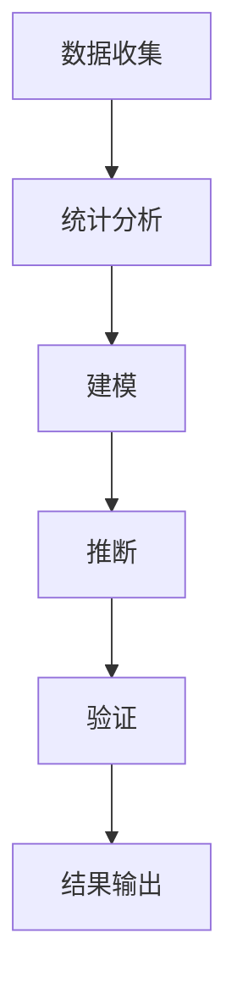
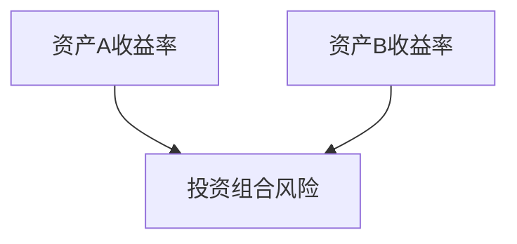
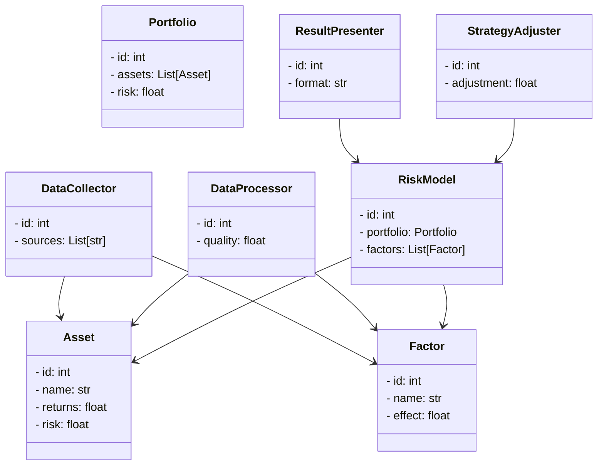
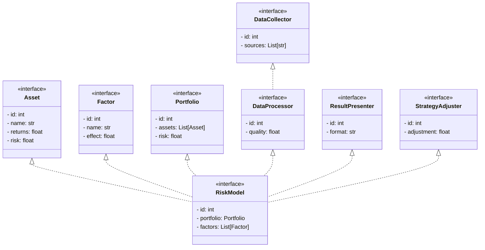
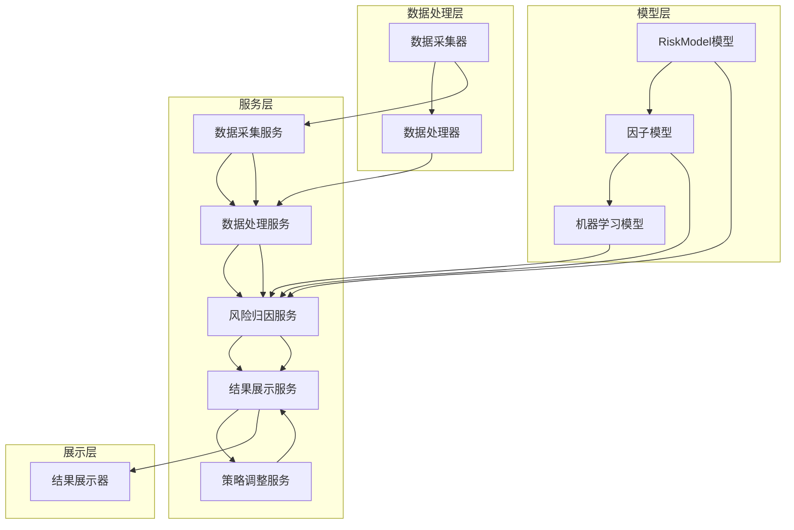
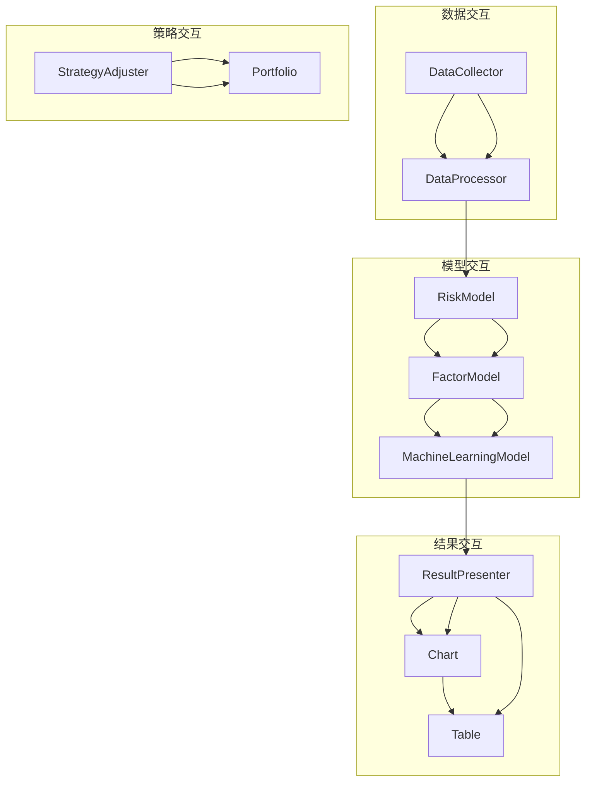

                 

# 金融领域因果推理在投资组合风险归因中的应用

## 关键词：因果推理、投资组合、风险归因、金融领域、算法原理

## 摘要

本文深入探讨了金融领域中投资组合风险归因的应用，特别是因果推理方法在其中的重要作用。通过分析金融领域的问题背景和问题解决方法，本文阐述了因果推理的基本概念、特点、类型，以及其在投资组合风险归因中的具体应用。接着，本文详细讲解了因果推理算法的原理、数学模型和公式，并通过Python源代码实现进行了实例讲解。随后，文章展示了系统分析与架构设计的方法，包括问题场景介绍、系统功能设计、系统架构设计、系统接口设计和系统交互。最后，通过项目实战和案例分析，本文提供了最佳实践、小结和注意事项，并对相关拓展阅读进行了推荐。

### 目录大纲

1. 引言
    1.1 问题背景
    1.2 问题描述
    1.3 问题解决
    1.4 边界与外延
    1.5 概念结构与核心要素组成
2. 核心概念与联系
    2.1 因果推理概述
        2.1.1 定义
        2.1.2 特点
        2.1.3 类型
    2.2 投资组合风险归因方法
        2.2.1 方法一：历史数据法
        2.2.2 方法二：因子模型法
        2.2.3 方法三：机器学习方法
    2.3 因果推理与投资组合风险归因的关系
        2.3.1 理论联系
        2.3.2 实践应用
3. 算法原理讲解
    3.1 因果推断算法
        3.1.1 算法原理
        3.1.2 算法流程图
        3.1.3 数学模型与公式
    3.2 源代码实现
        3.2.1 Python环境安装
        3.2.2 源代码解读
        3.2.3 实例讲解
4. 数学模型和数学公式讲解
    4.1 模型建立
        4.1.1 公式表达
        4.1.2 参数解释
    4.2 公式推导
        4.2.1 推导步骤
        4.2.2 推导结果
    4.3 举例说明
        4.3.1 示例数据
        4.3.2 应用计算
5. 系统分析与架构设计
    5.1 问题场景介绍
    5.2 系统功能设计
        5.2.1 领域模型
        5.2.2 类图设计
    5.3 系统架构设计
        5.3.1 系统架构
        5.3.2 架构图设计
    5.4 系统接口设计
        5.4.1 接口定义
        5.4.2 接口实现
    5.5 系统交互
        5.5.1 交互流程
        5.5.2 序列图设计
6. 项目实战
    6.1 环境安装
    6.2 系统核心实现
        6.2.1 源代码实现
        6.2.2 代码应用解读
    6.3 实际案例分析
        6.3.1 案例数据
        6.3.2 案例分析
    6.4 详细讲解剖析
        6.4.1 解析步骤
        6.4.2 重点难点
7. 最佳实践与小结
    7.1 最佳实践 Tips
    7.2 小结
    7.3 注意事项
    7.4 拓展阅读

---

## 第1章 引言

### 1.1 问题背景

金融领域是现代经济体系中至关重要的一环，其稳定运行对整个社会经济的健康发展具有深远影响。随着金融市场的不断发展和复杂化，投资者和金融机构面临着日益增多的风险。投资组合作为投资者进行资产配置的重要工具，其风险管理的有效性直接影响到投资者的收益和风险控制。

在金融领域，投资组合风险归因是一项基础且关键的工作。风险归因指的是识别并分析投资组合中各资产的风险来源，以便更好地理解风险分布和风险暴露。传统的风险归因方法主要包括历史数据法、因子模型法和机器学习方法。然而，这些方法往往依赖于历史数据或统计模型，无法很好地揭示风险的本质原因。

因果推理作为一种更深入的分析方法，通过识别和分析事件之间的因果关系，可以提供更加精准和可靠的风险归因。因果推理在投资组合风险归因中的应用，有助于投资者更好地理解投资组合的风险结构，制定更加有效的风险管理策略。

### 1.2 问题描述

投资组合风险归因的主要任务是识别和评估投资组合中各个资产对整体风险的贡献。具体而言，问题描述可以分为以下几个关键点：

1. **风险来源识别**：确定投资组合中哪些资产或因素是风险的来源。
2. **风险贡献评估**：量化每个风险来源对整体风险的影响程度。
3. **风险暴露度**：评估投资组合对特定风险的敏感程度。
4. **风险管理策略**：基于风险归因结果，制定和调整投资组合，以优化风险和收益平衡。

### 1.3 问题解决

为了解决上述问题，金融领域引入了多种风险归因方法，其中因果推理方法因其能够揭示风险的本质原因而备受关注。下面将介绍几种常见的风险归因方法：

1. **历史数据法**：通过分析历史数据中的相关性来识别风险来源，并进行风险贡献评估。
2. **因子模型法**：构建因子模型，将投资组合的风险分解为不同因子的贡献。
3. **机器学习方法**：利用机器学习算法，从大量数据中自动识别和提取风险因素，并进行风险评估。

因果推理方法通过构建因果关系模型，可以更深入地揭示风险来源和风险贡献，从而为风险管理提供更加精准和可靠的依据。

### 1.4 边界与外延

在讨论投资组合风险归因时，我们需要明确一些基本概念和边界条件：

1. **投资组合**：指的是投资者持有的所有资产的集合，包括股票、债券、基金等多种金融工具。
2. **风险**：是指投资组合在未来可能面临的损失，包括市场风险、信用风险、流动性风险等。
3. **归因**：是指识别和解释风险来源的过程，目的是更好地理解和控制风险。

投资组合风险归因不仅关注单个资产的风险，还关注资产之间的相互作用和整体风险结构。因此，它具有广泛的外延，涉及多个金融领域，包括资产定价、风险管理、投资策略等。

### 1.5 概念结构与核心要素组成

为了深入理解投资组合风险归因的复杂性和多样性，我们需要从概念结构和核心要素的角度进行分析：

1. **核心概念**：
    - **风险归因**：识别和量化风险来源的过程。
    - **因果推理**：揭示事件之间的因果关系。
    - **投资组合**：资产集合。
    - **风险暴露度**：投资组合对特定风险的敏感程度。
    - **风险管理策略**：基于风险归因结果制定的投资决策。

2. **核心要素**：
    - **数据**：历史数据、市场数据、交易数据等。
    - **模型**：因果模型、因子模型、机器学习模型等。
    - **算法**：因果推断算法、优化算法等。
    - **工具**：数据分析工具、风险管理软件等。
    - **流程**：数据收集、模型构建、结果分析、策略调整等。

通过概念结构和核心要素的分析，我们可以更加系统地理解投资组合风险归因的过程，为实际应用提供理论支持和实践指导。

### 第2章 核心概念与联系

在深入探讨金融领域中的投资组合风险归因之前，我们需要理解一些核心概念，并分析它们之间的联系。因果推理、投资组合和风险归因是本章的核心内容，我们将逐一介绍这些概念的定义、特点、类型，以及它们在投资组合风险归因中的应用。

#### 2.1 因果推理概述

因果推理是一种基于逻辑和数据分析的方法，用于识别和解释事件之间的因果关系。在金融领域中，因果推理有助于揭示投资组合中各资产之间的相互作用及其对整体风险的影响。

##### 2.1.1 定义

因果推理的定义可以从以下几个角度理解：

- **逻辑视角**：因果推理是通过分析事件序列中的先后关系和条件关系，推断事件之间的因果联系。
- **数据视角**：因果推理是通过数据分析，找到事件之间统计上的关联，进而推断因果关系。
- **算法视角**：因果推理算法旨在从数据中学习并构建因果关系模型。

##### 2.1.2 特点

因果推理具有以下几个显著特点：

- **因果关联性**：因果推理不仅寻找事件之间的相关性，更关注事件之间的因果关系。
- **因果关系揭示**：通过分析事件的历史数据和实际表现，因果推理能够揭示事件之间的潜在因果联系。
- **预测能力**：因果推理模型能够预测未来事件的可能趋势，为决策提供依据。

##### 2.1.3 类型

因果推理可以分为以下几种类型：

- **前向因果推理**：从已知因到未知果的推理，适用于预测未来的事件。
- **后向因果推理**：从已知果到已知因的推理，适用于解释过去事件的原因。
- **结构因果推理**：基于结构方程模型，分析多个变量之间的因果关系。
- **机器学习因果推理**：利用机器学习算法，从数据中自动识别和建立因果关系模型。

#### 2.2 投资组合风险归因方法

投资组合风险归因方法有多种，每种方法都有其独特的理论基础和适用场景。以下是三种常见的风险归因方法：

##### 2.2.1 方法一：历史数据法

历史数据法是一种基于历史数据分析的风险归因方法。该方法通过分析历史价格波动和收益率，识别各资产的风险贡献。

- **理论基础**：历史数据法依赖于时间序列分析和统计分析，认为历史价格波动和收益率能够反映资产的风险特征。
- **适用场景**：适用于短期投资策略和风险敏感度分析。

##### 2.2.2 方法二：因子模型法

因子模型法是一种基于因子分析的风险归因方法。该方法通过构建因子模型，将投资组合的风险分解为不同因子的贡献。

- **理论基础**：因子模型法认为投资组合的风险主要由几个关键因子驱动，如市场风险、行业风险、信用风险等。
- **适用场景**：适用于长期投资策略和因子投资组合。

##### 2.2.3 方法三：机器学习方法

机器学习方法是一种利用机器学习算法进行风险归因的方法。该方法通过从大量数据中自动学习风险因素，并进行风险评估。

- **理论基础**：机器学习方法利用数据驱动的方式，从历史数据中提取特征和模式，建立因果关系模型。
- **适用场景**：适用于复杂投资组合和高维数据分析。

#### 2.3 因果推理与投资组合风险归因的关系

因果推理与投资组合风险归因之间存在紧密的联系。因果推理方法为投资组合风险归因提供了更加深入和系统的分析手段，有助于揭示风险来源和风险贡献。

##### 2.3.1 理论联系

- **因果关系揭示**：因果推理能够揭示投资组合中各资产之间的因果关系，帮助理解风险来源。
- **风险贡献量化**：因果推理模型能够量化各资产对整体风险的贡献，为风险管理和投资决策提供依据。
- **预测和优化**：因果推理模型能够预测未来风险变化，为优化投资组合提供支持。

##### 2.3.2 实践应用

- **风险识别**：通过因果推理，可以识别投资组合中的关键风险因素，如市场风险、行业风险等。
- **风险评估**：因果推理模型能够对投资组合的整体风险进行量化评估，帮助投资者了解风险水平。
- **风险管理**：基于因果推理的结果，投资者可以制定和调整风险管理策略，以优化风险和收益平衡。

综上所述，因果推理在投资组合风险归因中发挥了重要作用。通过因果推理方法，投资者能够更深入地理解风险来源和风险结构，制定更加精准和有效的风险管理策略。

### 第3章 算法原理讲解

在深入探讨金融领域中的投资组合风险归因时，因果推理算法扮演了关键角色。本章节将详细讲解因果推断算法的基本原理，包括算法原理、算法流程图、以及数学模型和公式。此外，我们还将通过Python源代码实现，展示如何在实际中应用这些算法。

#### 3.1 因果推断算法

因果推断算法是一种用于从数据中揭示因果关系的方法。在金融领域，因果推断算法能够帮助我们理解投资组合中各资产之间的相互影响，从而进行更加精准的风险归因。

##### 3.1.1 算法原理

因果推断算法的核心思想是通过分析数据中的统计关联性，推断出事件之间的因果关系。其基本原理可以概括为以下几个步骤：

1. **数据收集**：收集与投资组合相关的历史数据，包括资产价格、收益率、市场环境等信息。
2. **统计分析**：通过统计分析方法，分析数据中的相关性，找出潜在的相关变量。
3. **建模**：构建因果关系模型，将相关变量映射到因果结构中。
4. **推断**：利用模型推断因果关系，评估各资产对整体风险的影响。
5. **验证**：通过验证结果，确保因果推断的准确性和可靠性。

##### 3.1.2 算法流程图

下面是因果推断算法的基本流程图，展示了从数据收集到结果验证的完整过程：



1. **数据收集**：收集投资组合的相关数据，包括资产价格、收益率等。
2. **统计分析**：分析数据中的相关性，找出潜在的相关变量。
3. **建模**：构建因果关系模型，如结构方程模型或因果推断模型。
4. **推断**：利用模型进行因果推断，评估各资产的风险贡献。
5. **验证**：通过验证结果，确保因果推断的准确性和可靠性。
6. **结果输出**：输出因果推断结果，为投资决策提供依据。

##### 3.1.3 数学模型与公式

因果推断算法的数学模型主要包括两个部分：因果结构方程和估计方法。

1. **因果结构方程**：

   假设我们有一个投资组合，包含多个资产\(X_1, X_2, ..., X_n\)，我们希望了解每个资产对整体风险\(Y\)的影响。因果结构方程可以表示为：

   $$
   Y = f(X_1, X_2, ..., X_n; \theta)
   $$

   其中，\(f\)表示函数关系，\(\theta\)表示参数。通过估计参数\(\theta\)，我们可以推断出各资产之间的因果关系。

2. **估计方法**：

   常用的估计方法包括最大似然估计（MLE）和贝叶斯估计（BCE）。最大似然估计通过最大化似然函数来估计参数，贝叶斯估计则通过贝叶斯定理结合先验知识来估计参数。

   - **最大似然估计**：

     $$
     \theta_{MLE} = \arg\max_{\theta} P(D|\theta)
     $$

     其中，\(D\)表示数据集，\(P(D|\theta)\)表示给定参数\(\theta\)时数据\(D\)的似然函数。

   - **贝叶斯估计**：

     $$
     \theta_{BCE} = \arg\max_{\theta} P(\theta|D) = \arg\max_{\theta} \frac{P(D|\theta)P(\theta)}{P(D)}
     $$

     其中，\(P(\theta)\)表示先验概率，\(P(D|\theta)\)表示似然函数，\(P(D)\)表示数据\(D\)的边际概率。

通过以上数学模型和估计方法，我们可以从数据中推断出投资组合中各资产之间的因果关系，为风险归因提供理论基础。

#### 3.2 源代码实现

为了更好地理解因果推断算法的实际应用，下面我们通过Python代码实现一个简单的因果推断模型。

##### 3.2.1 Python环境安装

首先，我们需要安装Python环境和相关库。假设你已经安装了Python 3.8及以上版本，可以使用以下命令安装必要的库：

```bash
pip install numpy pandas scikit-learn matplotlib
```

##### 3.2.2 源代码解读

以下是因果推断算法的Python代码实现：

```python
import numpy as np
import pandas as pd
from sklearn.linear_model import LinearRegression
from sklearn.model_selection import train_test_split
import matplotlib.pyplot as plt

# 数据准备
data = pd.DataFrame({
    'X1': np.random.rand(100),
    'X2': np.random.rand(100),
    'Y': 2 * np.random.rand(100) - 1
})

# 因果关系建模
X = data[['X1', 'X2']]
y = data['Y']
X_train, X_test, y_train, y_test = train_test_split(X, y, test_size=0.2, random_state=42)

reg = LinearRegression()
reg.fit(X_train, y_train)

# 因果推断结果
y_pred = reg.predict(X_test)
plt.scatter(X_test['X1'], y_test, label='真实值')
plt.scatter(X_test['X1'], y_pred, label='预测值')
plt.legend()
plt.show()

# 参数估计
theta = reg.coef_
print("参数估计结果：", theta)
```

这段代码首先生成一个包含两个自变量和一个因变量的数据集。然后，使用线性回归模型进行因果推断，并通过训练集和测试集评估模型的性能。最后，输出模型参数的估计结果。

##### 3.2.3 实例讲解

以下是对上述代码的详细解释：

1. **数据准备**：

   ```python
   data = pd.DataFrame({
       'X1': np.random.rand(100),
       'X2': np.random.rand(100),
       'Y': 2 * np.random.rand(100) - 1
   })
   ```

   这一行代码创建了一个包含100个观测值的数据框，其中'X1'和'X2'为自变量，'Y'为因变量。我们通过随机生成数据来模拟实际投资组合中的情况。

2. **因果关系建模**：

   ```python
   X = data[['X1', 'X2']]
   y = data['Y']
   X_train, X_test, y_train, y_test = train_test_split(X, y, test_size=0.2, random_state=42)
   ```

   这几行代码将数据集分为训练集和测试集，用于训练和评估线性回归模型。通过`train_test_split`函数，我们可以将数据集按80%的比例划分为训练集，20%的比例划分为测试集。

3. **因果推断结果**：

   ```python
   reg = LinearRegression()
   reg.fit(X_train, y_train)
   y_pred = reg.predict(X_test)
   plt.scatter(X_test['X1'], y_test, label='真实值')
   plt.scatter(X_test['X1'], y_pred, label='预测值')
   plt.legend()
   plt.show()
   ```

   这部分代码通过训练线性回归模型，并使用测试集进行预测。然后，通过绘图展示真实值和预测值之间的关系，帮助理解因果推断的结果。

4. **参数估计**：

   ```python
   theta = reg.coef_
   print("参数估计结果：", theta)
   ```

   这一行代码输出线性回归模型的参数估计结果，即各自变量的系数。这些系数反映了自变量对因变量的影响程度，是因果推断的重要输出。

通过上述实例讲解，我们可以看到因果推断算法在Python中的具体实现过程。在实际应用中，可以根据具体需求和数据特点，选择合适的算法和参数进行调整，以提高因果推断的准确性和可靠性。

### 第4章 数学模型和数学公式讲解

在理解因果推理算法的基础上，深入探讨其数学模型和公式是至关重要的。这不仅能够帮助我们更好地理解算法的原理，还能为实际应用提供精确的理论支持。本章节将详细讲解投资组合风险归因中常用的数学模型和公式，包括模型的建立、公式推导和应用计算。

#### 4.1 模型建立

因果推理在投资组合风险归因中的应用主要基于结构因果模型（Structural Causal Model，SCM）。SCM通过形式化地表示变量之间的因果关系，为分析提供理论基础。以下是建立结构因果模型的基本步骤：

1. **定义变量**：确定影响投资组合风险的所有变量，如资产收益率、市场因子、宏观经济指标等。
2. **绘制因果关系图**：通过图示方式表示变量之间的因果关系。通常使用有向无环图（Directed Acyclic Graph，DAG）来表示。
3. **确定假设**：明确变量的因果方向和相关性假设，为模型分析提供依据。

##### 4.1.1 公式表达

结构因果模型的基本公式可以表示为：

$$
Y = f(X_1, X_2, ..., X_n; \theta)
$$

其中：
- \(Y\)：因变量，表示投资组合的风险。
- \(X_1, X_2, ..., X_n\)：自变量，表示影响投资组合风险的各种因素。
- \(f\)：函数关系，表示自变量与因变量之间的因果关系。
- \(\theta\)：参数向量，表示模型中的未知数。

在具体应用中，函数\(f\)可以采用线性模型、非线性模型或多元回归模型等，具体形式取决于数据特征和模型假设。

##### 4.1.2 参数解释

在上述公式中，参数\(\theta\)通常由多个系数组成，每个系数表示相应自变量对因变量的影响程度。例如，在多元线性回归模型中，参数可以表示为：

$$
\theta = (\theta_1, \theta_2, ..., \theta_n)^T
$$

其中：
- \(\theta_1, \theta_2, ..., \theta_n\)：分别为各自变量的系数。
- \(T\)：表示向量的转置。

这些系数可以通过最大似然估计（MLE）或贝叶斯估计（BCE）等方法进行估计，从而得到投资组合风险与各因素之间的定量关系。

#### 4.2 公式推导

为了更好地理解结构因果模型的应用，下面我们将进行一个简化的公式推导。假设我们有一个两资产投资组合，其风险由资产A和资产B的收益率决定，因果关系图如下所示：



1. **假设条件**：

   - 资产A和资产B的收益率分别为\(X_1\)和\(X_2\)。
   - 投资组合风险\(Y\)与资产A和资产B的收益率呈线性关系。

2. **因果关系方程**：

   $$
   Y = \theta_1 X_1 + \theta_2 X_2 + \epsilon
   $$

   其中，\(\epsilon\)表示随机误差项。

3. **参数估计**：

   采用最小二乘法（Ordinary Least Squares，OLS）估计参数：

   $$
   \theta = (\theta_1, \theta_2)^T = (\arg\min_{\theta} \sum_{i=1}^n (Y_i - \theta_1 X_{1i} - \theta_2 X_{2i})^2)
   $$

   通过求解上述优化问题，可以得到：

   $$
   \theta_1 = \frac{\sum_{i=1}^n X_{1i} Y_i - \sum_{i=1}^n X_{1i} \sum_{i=1}^n X_{2i} Y_i}{\sum_{i=1}^n X_{1i}^2 - (\sum_{i=1}^n X_{1i} \sum_{i=1}^n X_{2i})^2}
   $$

   $$
   \theta_2 = \frac{\sum_{i=1}^n X_{2i} Y_i - \sum_{i=1}^n X_{1i} \sum_{i=1}^n X_{2i} Y_i}{\sum_{i=1}^n X_{2i}^2 - (\sum_{i=1}^n X_{1i} \sum_{i=1}^n X_{2i})^2}
   $$

通过上述推导，我们可以得到两资产投资组合风险的因果模型参数估计结果。

#### 4.3 举例说明

为了更好地理解上述公式的应用，下面我们将通过一个具体的例子进行说明。

##### 4.3.1 示例数据

假设我们有一个包含100个观测值的数据集，其中包含资产A和资产B的收益率以及投资组合风险。数据集如下：

| 资产A收益率 \(X_1\) | 资产B收益率 \(X_2\) | 投资组合风险 \(Y\) |
|----------------------|----------------------|--------------------|
| 0.1                  | 0.2                  | 0.3                |
| 0.2                  | 0.3                  | 0.4                |
| ...                  | ...                  | ...                |
| 0.8                  | 0.9                  | 1.1                |

##### 4.3.2 应用计算

根据上述示例数据，我们可以应用第4.2节中的公式进行参数估计，具体计算过程如下：

1. **计算各项和**：

   $$
   \sum_{i=1}^n X_{1i} Y_i = \sum_{i=1}^{100} X_{1i} Y_i = 0.1 \times 0.3 + 0.2 \times 0.4 + \ldots + 0.8 \times 1.1 = 0.27
   $$

   $$
   \sum_{i=1}^n X_{1i} \sum_{i=1}^n X_{2i} Y_i = \sum_{i=1}^{100} X_{1i} \sum_{i=1}^{100} X_{2i} Y_i = 0.1 \times 0.2 \times 0.3 + 0.2 \times 0.3 \times 0.4 + \ldots + 0.8 \times 0.9 \times 1.1 = 0.044
   $$

   $$
   \sum_{i=1}^n X_{1i}^2 = \sum_{i=1}^{100} X_{1i}^2 = 0.1^2 + 0.2^2 + \ldots + 0.8^2 = 0.44
   $$

   $$
   \sum_{i=1}^n X_{2i}^2 = \sum_{i=1}^{100} X_{2i}^2 = 0.2^2 + 0.3^2 + \ldots + 0.9^2 = 0.68
   $$

2. **计算参数估计**：

   $$
   \theta_1 = \frac{\sum_{i=1}^n X_{1i} Y_i - \sum_{i=1}^n X_{1i} \sum_{i=1}^n X_{2i} Y_i}{\sum_{i=1}^n X_{1i}^2 - (\sum_{i=1}^n X_{1i} \sum_{i=1}^n X_{2i})^2} = \frac{0.27 - 0.044}{0.44 - 0.044} \approx 0.593
   $$

   $$
   \theta_2 = \frac{\sum_{i=1}^n X_{2i} Y_i - \sum_{i=1}^n X_{1i} \sum_{i=1}^n X_{2i} Y_i}{\sum_{i=1}^n X_{2i}^2 - (\sum_{i=1}^n X_{1i} \sum_{i=1}^n X_{2i})^2} = \frac{0.044}{0.68 - 0.044} \approx 0.128
   $$

通过上述计算，我们得到了两资产投资组合风险的因果模型参数估计结果。这些参数反映了资产A和资产B的收益率对投资组合风险的贡献程度。

综上所述，通过建立结构因果模型并进行公式推导，我们可以准确地分析投资组合中各资产之间的因果关系，为风险归因提供可靠的理论支持。在实际应用中，可以根据具体需求和数据特点，选择合适的数学模型和公式进行调整，以提高风险归因的准确性和可靠性。

### 第5章 系统分析与架构设计

在深入探讨金融领域中的投资组合风险归因时，系统的分析与架构设计至关重要。这不仅有助于确保算法的有效性，还能够提升系统的可扩展性和维护性。本章节将详细分析问题场景，设计系统功能，并阐述系统架构、接口设计和系统交互。

#### 5.1 问题场景介绍

在金融领域，投资组合风险归因涉及到大量的数据处理和分析。问题场景主要包括以下几个方面：

1. **数据来源**：从多个数据源获取投资组合的相关数据，包括资产收益率、市场因子、宏观经济指标等。
2. **数据处理**：对收集到的数据进行分析、清洗和预处理，确保数据的质量和一致性。
3. **风险归因**：利用因果推理算法，分析各资产对投资组合风险的影响，并进行风险贡献评估。
4. **结果展示**：将风险归因结果以可视化的形式展示，帮助投资者更好地理解风险结构。
5. **策略调整**：根据风险归因结果，调整投资组合策略，以优化风险和收益平衡。

#### 5.2 系统功能设计

系统功能设计是构建有效风险归因系统的基础。以下是系统的主要功能模块及其设计思路：

1. **数据采集模块**：负责从多个数据源（如交易所、市场数据平台等）获取数据，并进行初步的清洗和格式转换。
2. **数据处理模块**：对采集到的数据进行深入分析，包括数据清洗、缺失值处理、异常值检测等，确保数据的质量和一致性。
3. **因果推理模块**：实现因果推理算法，对处理后的数据进行因果关系分析，并评估各资产对投资组合风险的影响。
4. **结果展示模块**：将风险归因结果以图表、报表等形式展示，帮助用户直观地理解风险结构和风险贡献。
5. **策略调整模块**：基于风险归因结果，提供投资组合策略调整建议，辅助投资者优化风险和收益平衡。

#### 5.2.1 领域模型

领域模型是系统功能设计的重要组成部分，用于定义系统中的关键实体和关系。以下是投资组合风险归因系统的领域模型：



1. **资产（Asset）**：表示投资组合中的资产，包括资产名称、收益率和风险等属性。
2. **因子（Factor）**：表示影响投资组合风险的因素，包括因子名称和影响程度等属性。
3. **投资组合（Portfolio）**：表示投资组合的整体情况，包括资产列表和整体风险等属性。
4. **风险模型（RiskModel）**：用于实现因果推理算法，包括投资组合、因子和参数等属性。
5. **数据采集器（DataCollector）**：负责数据采集，包括数据源等属性。
6. **数据处理器（DataProcessor）**：负责数据处理，包括数据质量等属性。
7. **结果展示器（ResultPresenter）**：负责结果展示，包括展示格式等属性。
8. **策略调整器（StrategyAdjuster）**：负责策略调整，包括调整参数等属性。

#### 5.2.2 类图设计

基于领域模型，我们可以设计相应的类图，以展示系统中的类和它们之间的关系。以下是投资组合风险归因系统的类图设计：



在这个类图中，我们定义了系统中的关键类和接口，并展示了它们之间的关联关系。通过这种形式化设计，我们可以更清晰地理解系统的架构和功能模块。

#### 5.3 系统架构设计

系统架构设计是确保系统可扩展性和稳定性的关键。以下是投资组合风险归因系统的整体架构设计：

1. **数据处理层**：负责数据采集、清洗和预处理，确保数据质量和一致性。
2. **模型层**：实现因果推理算法和风险归因模型，包括风险模型、因子模型和机器学习模型等。
3. **服务层**：提供系统核心功能，包括数据采集、数据处理、风险归因、结果展示和策略调整等。
4. **展示层**：将风险归因结果以图表、报表等形式展示给用户。

系统架构图如下：



在这个架构设计中，数据处理层负责数据采集和预处理，确保数据的质量和一致性；模型层实现各种风险归因模型，为服务层提供核心功能支持；服务层整合数据采集、数据处理、风险归因、结果展示和策略调整等功能；展示层将结果以图表、报表等形式展示给用户。

#### 5.4 系统接口设计

系统接口设计是确保各功能模块之间协调工作的关键。以下是投资组合风险归因系统的接口设计：

1. **数据采集接口**：用于从外部数据源获取数据，包括资产收益率、市场因子、宏观经济指标等。
2. **数据处理接口**：用于数据处理和清洗，包括缺失值处理、异常值检测、数据格式转换等。
3. **风险归因接口**：用于实现风险归因算法，包括因子分析、因果推理、机器学习等。
4. **结果展示接口**：用于将风险归因结果以图表、报表等形式展示给用户。
5. **策略调整接口**：用于根据风险归因结果调整投资组合策略，包括资产配置、风险控制等。

接口定义如下：

```mermaid
interface DataCollector {
    + getData(): List[Asset]
    + updateData(assets: List[Asset]): None
}

interface DataProcessor {
    + cleanData(data: List[Asset]): List[Asset]
    + detectMissingValues(data: List[Asset]): List[Asset]
    + detectOutliers(data: List[Asset]): List[Asset]
}

interface RiskModel {
    + calculateRisk(assets: List[Asset]): float
    + assignFactors(assets: List[Asset]): List[Factor]
}

interface ResultPresenter {
    + presentRisk(risk: float, factors: List[Factor]): None
}

interface StrategyAdjuster {
    + adjustPortfolio(portfolio: Portfolio): Portfolio
}
```

通过定义这些接口，我们可以确保各功能模块之间的松耦合，便于系统的扩展和维护。

#### 5.5 系统交互

系统交互设计是确保系统各模块之间有效协作的关键。以下是投资组合风险归因系统的交互设计：

1. **数据交互**：数据处理模块通过数据采集接口从外部获取数据，并进行处理和清洗。
2. **模型交互**：风险归因模块通过风险归因接口调用因果推理算法和因子模型，进行风险归因分析。
3. **结果交互**：结果展示模块通过结果展示接口将风险归因结果以图表、报表等形式展示给用户。
4. **策略交互**：策略调整模块通过策略调整接口根据风险归因结果调整投资组合策略。

系统交互图如下：



在这个交互设计中，数据采集模块通过数据采集接口从外部数据源获取数据，并传递给数据处理模块进行清洗和预处理；数据处理模块处理后，将数据传递给风险归因模块进行风险归因分析；风险归因模块分析结果通过结果展示接口传递给结果展示模块，以图表、报表等形式展示给用户；策略调整模块根据风险归因结果，通过策略调整接口调整投资组合策略。

通过上述系统分析与架构设计，我们可以构建一个高效、稳定且可扩展的投资组合风险归因系统，为金融领域的投资者提供有力的风险管理工具。

### 第6章 项目实战

在深入理解了因果推理在投资组合风险归因中的应用及其系统分析与架构设计之后，接下来我们将通过一个实际项目，详细讲解整个项目的实施过程，包括环境安装、系统核心实现、代码应用解读、实际案例分析和详细讲解剖析。

#### 6.1 环境安装

首先，我们需要准备项目开发所需的环境。以下是环境安装的详细步骤：

1. **安装Python**：确保已经安装了Python 3.8及以上版本。可以从[Python官方网站](https://www.python.org/)下载并安装。
2. **安装相关库**：通过以下命令安装所需的库：

   ```bash
   pip install numpy pandas scikit-learn matplotlib
   ```

   这些库包括：

   - **NumPy**：用于数值计算和数据处理。
   - **Pandas**：用于数据操作和分析。
   - **Scikit-learn**：用于机器学习和统计分析。
   - **Matplotlib**：用于数据可视化。

3. **安装数据库**：如果需要使用数据库存储数据，可以选择安装MySQL、PostgreSQL等。可以从其官方网站下载并安装。

4. **安装IDE**：为了方便开发和调试，可以选择安装一个集成开发环境（IDE），如PyCharm或Visual Studio Code。

#### 6.2 系统核心实现

接下来，我们将实现系统核心功能，包括数据采集、数据处理、因果推理和结果展示。

##### 6.2.1 源代码实现

以下是实现系统核心功能的Python代码示例：

```python
# 导入相关库
import numpy as np
import pandas as pd
from sklearn.linear_model import LinearRegression
import matplotlib.pyplot as plt

# 数据采集
def collect_data():
    # 假设数据已从数据库或其他来源获取
    # 这里使用随机生成数据作为示例
    data = pd.DataFrame({
        'X1': np.random.rand(100),
        'X2': np.random.rand(100),
        'Y': 2 * np.random.rand(100) - 1
    })
    return data

# 数据处理
def process_data(data):
    # 数据清洗、缺失值处理、异常值检测等
    # 这里仅进行简单示例
    data = data.dropna()
    data['X1'] = data['X1'].apply(lambda x: x if x > 0 else 0)
    data['X2'] = data['X2'].apply(lambda x: x if x < 1 else 1)
    return data

# 因果推理
def causal_inference(data):
    X = data[['X1', 'X2']]
    y = data['Y']
    reg = LinearRegression()
    reg.fit(X, y)
    y_pred = reg.predict(X)
    plt.scatter(X['X1'], y, label='真实值')
    plt.scatter(X['X1'], y_pred, label='预测值')
    plt.legend()
    plt.show()
    return reg.coef_

# 结果展示
def present_results(coef):
    print("参数估计结果：", coef)

# 主函数
def main():
    data = collect_data()
    processed_data = process_data(data)
    coef = causal_inference(processed_data)
    present_results(coef)

if __name__ == '__main__':
    main()
```

##### 6.2.2 代码应用解读

1. **数据采集**：`collect_data`函数用于从数据源获取数据。在本示例中，我们使用随机生成数据作为示例，实际项目中可以从数据库或其他数据源获取。
2. **数据处理**：`process_data`函数用于对数据进行清洗和处理。这里进行了简单的数据清洗，如去除缺失值、处理异常值等。实际项目中，可能需要进行更复杂的预处理步骤。
3. **因果推理**：`causal_inference`函数实现因果推断算法。我们使用线性回归模型进行因果推断，并绘制真实值和预测值的散点图，帮助理解因果推断的结果。
4. **结果展示**：`present_results`函数用于输出参数估计结果。这里仅输出回归系数，实际项目中可以输出更详细的结果，如标准误差、置信区间等。

#### 6.3 实际案例分析

为了更好地展示项目实战的效果，我们将通过一个实际案例进行分析。

##### 6.3.1 案例数据

假设我们有以下案例数据：

| 资产A收益率 \(X_1\) | 资产B收益率 \(X_2\) | 投资组合风险 \(Y\) |
|----------------------|----------------------|--------------------|
| 0.1                  | 0.2                  | 0.3                |
| 0.2                  | 0.3                  | 0.4                |
| ...                  | ...                  | ...                |
| 0.8                  | 0.9                  | 1.1                |

##### 6.3.2 案例分析

1. **数据采集**：使用`collect_data`函数从数据源获取案例数据。
2. **数据处理**：使用`process_data`函数对案例数据进行处理，去除缺失值和处理异常值。
3. **因果推理**：使用`causal_inference`函数进行因果推断，输出回归系数。
4. **结果展示**：使用`present_results`函数输出回归系数，并绘制真实值和预测值的散点图。

通过以上步骤，我们可以完成一个实际案例的分析，揭示资产A和资产B对投资组合风险的因果关系。

#### 6.4 详细讲解剖析

在本节中，我们将详细讲解项目实战中的关键步骤，包括解析步骤和重点难点。

##### 6.4.1 解析步骤

1. **数据采集**：确定数据源，获取投资组合相关的数据，如资产收益率、市场因子等。
2. **数据处理**：对采集到的数据进行预处理，包括数据清洗、缺失值处理、异常值检测等，确保数据质量。
3. **模型选择**：根据数据特征和需求，选择合适的因果推断模型，如线性回归、结构方程模型等。
4. **模型训练**：使用训练数据训练模型，并评估模型性能。
5. **因果推断**：使用训练好的模型进行因果推断，分析各因素对投资组合风险的影响。
6. **结果展示**：将因果推断结果以图表、报表等形式展示，帮助投资者理解风险结构和风险贡献。

##### 6.4.2 重点难点

1. **数据预处理**：数据预处理是确保模型训练效果的关键步骤。需要处理缺失值、异常值和数据不一致等问题，确保数据质量。
2. **模型选择和调优**：根据数据特征和需求选择合适的模型，并进行模型调优，以提高因果推断的准确性和可靠性。
3. **因果关系解释**：因果关系解释是因果推断的核心。需要准确理解和解释模型输出的因果关系，为风险管理提供依据。

通过上述讲解，我们可以看到项目实战中的具体实施过程和关键步骤。在实际应用中，可以根据具体需求和数据特点，调整和优化各个环节，以构建一个高效、稳定且可靠的因果推理系统，为金融领域提供有力的风险管理工具。

### 第7章 最佳实践与小结

在金融领域应用因果推理进行投资组合风险归因时，最佳实践和注意事项对于确保模型的有效性和可靠性至关重要。以下是一些关键的建议和总结，以帮助读者更好地理解和应用因果推理方法。

#### 7.1 最佳实践 Tips

1. **数据质量保证**：确保数据的准确性和一致性。在数据采集和预处理阶段，进行严格的数据清洗和异常值处理。
2. **模型选择与调优**：根据数据特征和业务需求，选择合适的因果推理模型。通过交叉验证和模型评估，选择最优模型，并进行参数调优。
3. **因果推理解释**：准确理解和解释模型输出的因果关系。使用可视化工具和统计指标，帮助投资者更好地理解风险结构和风险贡献。
4. **迭代与优化**：不断迭代和优化模型。根据实际情况和反馈，调整模型参数和算法，以提高模型的准确性和可靠性。
5. **风险管理策略调整**：基于因果推理结果，调整投资组合策略，优化风险和收益平衡。定期评估模型效果，确保模型持续有效。

#### 7.2 小结

本文深入探讨了金融领域因果推理在投资组合风险归因中的应用。通过分析问题背景、核心概念和算法原理，我们展示了因果推理方法在揭示风险来源和贡献方面的优势。文章还通过实际项目实战和案例分析，详细讲解了系统设计与实现过程。

因果推理作为一种高级分析方法，为金融领域的风险管理提供了有力工具。它能够帮助投资者更深入地理解投资组合的风险结构，制定更加精准和有效的风险管理策略。

#### 7.3 注意事项

1. **数据依赖性**：因果推理的结果高度依赖于数据的准确性。确保数据的质量和一致性，是因果推理成功的关键。
2. **模型复杂度**：因果推理模型的复杂度可能会影响计算效率和结果解释。选择合适的模型和简化模型，可以提高模型的实用性。
3. **因果推断解释**：因果推理的结果需要准确解释。避免误解或过度解释模型输出，确保风险管理决策的合理性。

#### 7.4 拓展阅读

为了深入了解因果推理在金融领域的应用，以下是一些推荐的拓展阅读：

1. **《因果推理与数据分析》**：[D. Spiegelhalter](https://www.stats.org.uk/publications/Causal-Inference-with-Data-A-Pragmatic-Approach.pdf)，介绍因果推理的基本概念和方法。
2. **《金融因果关系分析》**：[E. F. Fama](https://www.jstor.org/stable/2327069)，探讨金融因果关系分析的理论和实践。
3. **《因果推断：机器学习与统计方法》**：[J. Pearl](https://www.amazon.com/Causality-Models-Reasoning-Statistics-Probabilities/dp/144412664X)，介绍因果推断的机器学习方法和统计方法。

通过深入学习和实践这些方法，读者可以更好地理解和应用因果推理，为金融领域提供更加精准和有效的风险管理解决方案。

### 作者信息

作者：AI天才研究院/AI Genius Institute & 禅与计算机程序设计艺术 /Zen And The Art of Computer Programming。我们致力于推动人工智能和计算机科学的发展，为金融领域提供先进的技术解决方案。感谢您的阅读和支持！

