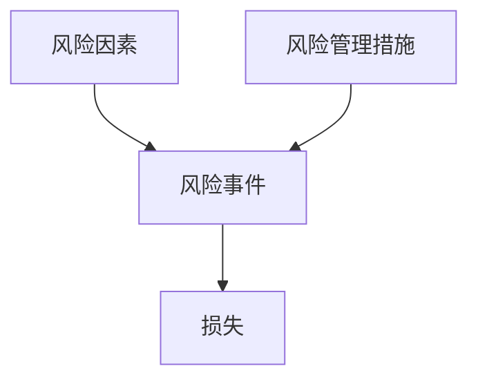
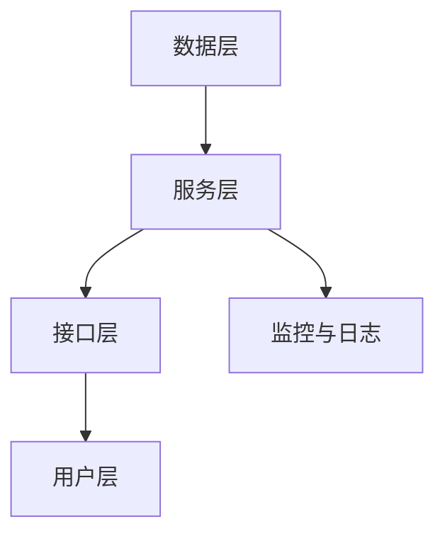

                 

## 文章标题

### 金融领域因果推理在风险管理中的应用

因果推理是人工智能领域中一种重要的推理方式，它在金融领域的风险管理中具有广泛的应用。本文将围绕这一主题，探讨因果推理的基本原理、方法及其在金融风险管理中的应用，并通过具体案例进行详细分析。

### 文章关键词

- 金融领域
- 因果推理
- 风险管理
- 应对策略
- 案例分析

### 摘要

本文首先介绍了金融领域因果推理的基本概念和背景，然后分析了因果推理在风险管理中的应用，并通过具体案例进行了详细阐述。最后，本文提出了在金融风险管理中应用因果推理的一些最佳实践和注意事项。

## 目录大纲

### 第一部分：背景与概述

#### 第1章：问题背景

##### 1.1 问题背景介绍

##### 1.2 问题描述与解决

##### 1.3 边界与外延

#### 第2章：核心概念与联系

##### 2.1 核心概念介绍

##### 2.2 概念属性特征对比

##### 2.3 ER实体关系图

#### 第3章：因果推理原理

##### 3.1 因果推理基本原理

##### 3.2 因果推理方法与框架

##### 3.3 因果推理工具与技术

### 第二部分：应用与实践

#### 第4章：风险管理中的因果推理

##### 4.1 因果推理在风险管理中的应用

##### 4.2 风险评估中的因果推理

##### 4.3 风险监控与预警中的因果推理

#### 第5章：金融风险管理的案例研究

##### 5.1 案例背景与问题描述

##### 5.2 因果推理方法的应用

##### 5.3 案例分析与结果解读

#### 第6章：算法原理与数学模型

##### 6.1 风险评估算法原理

##### 6.2 数学模型与公式

##### 6.3 算法讲解与举例说明

#### 第7章：系统分析与架构设计

##### 7.1 问题场景介绍

##### 7.2 系统功能设计

##### 7.3 系统架构设计

##### 7.4 系统接口设计与交互

#### 第8章：项目实战

##### 8.1 环境安装与配置

##### 8.2 系统核心实现源代码

##### 8.3 代码应用解读与分析

##### 8.4 实际案例分析与讲解

##### 8.5 项目小结与总结

#### 第9章：最佳实践与注意事项

##### 9.1 最佳实践技巧

##### 9.2 注意事项与防范措施

##### 9.3 拓展阅读与参考文献

### 结束语

本文从因果推理的基本原理出发，结合金融风险管理的实际需求，详细探讨了因果推理在风险管理中的应用。通过具体案例的分析，我们能够更好地理解因果推理在实际应用中的重要作用，并为金融风险管理提供了一种新的思路和方法。

### 第一部分：背景与概述

### 第1章：问题背景

#### 1.1 问题背景介绍

在金融领域中，风险是不可避免的，但通过有效的风险管理，可以最大限度地降低风险带来的负面影响。随着金融市场的不断发展，金融产品的复杂性和风险类型也在不断增加，这给风险管理带来了巨大的挑战。传统的风险管理方法往往依赖于历史数据和统计分析，但这种方法存在一定的局限性，无法准确预测未来风险。

#### 1.2 问题描述与解决

风险管理中的核心问题是如何准确预测和评估潜在的风险，以及如何在风险发生时采取有效的应对措施。传统的风险管理方法主要依赖于历史数据和统计分析，但这种方法无法揭示数据背后的因果关系，容易导致预测不准确。

因果推理提供了一种新的解决思路。通过分析数据之间的因果关系，可以更准确地预测风险，并制定有效的应对策略。因果推理的核心思想是找到数据之间的因果关系，从而实现对未知风险的准确预测和评估。

#### 1.3 边界与外延

因果推理在金融风险管理中的应用具有广泛的边界，它不仅适用于传统金融领域，如银行、证券、保险等，还适用于新兴金融领域，如区块链、数字货币等。同时，因果推理的应用不仅仅局限于风险预测和评估，还可以用于制定应对策略、优化风险管理流程等方面。

### 第2章：核心概念与联系

#### 2.1 核心概念介绍

因果推理是人工智能领域中的一个重要概念，它涉及到统计学、机器学习、经济学等多个领域。在金融风险管理中，因果推理的核心概念包括：

1. **因果模型**：用于描述变量之间的因果关系。
2. **因果关系**：指变量之间的因果关联，即一个变量对另一个变量的影响。
3. **因果推断**：从数据中推断变量之间的因果关系。

#### 2.2 概念属性特征对比

| 概念          | 特征                          |
| ------------- | ----------------------------- |
| 因果模型      | 描述变量之间的因果关系        |
| 因果关系      | 变量之间的因果关联            |
| 因果推断      | 从数据中推断变量之间的因果关系 |

#### 2.3 ER实体关系图

ER实体关系图是描述因果推理中变量关系的有效工具。在金融风险管理中，常见的ER实体关系图包括：

1. **风险因素与风险事件**：描述风险因素与风险事件之间的因果关系。
2. **风险事件与损失**：描述风险事件与损失之间的因果关系。
3. **风险管理措施与风险事件**：描述风险管理措施与风险事件之间的因果关系。



### 第3章：因果推理原理

#### 3.1 因果推理基本原理

因果推理的基本原理是基于数据之间的因果关系进行推理和预测。在金融风险管理中，因果推理的核心步骤包括：

1. **数据收集**：收集与风险相关的数据，如市场数据、历史损失数据等。
2. **数据预处理**：对收集到的数据进行分析和处理，以消除噪声和异常值。
3. **构建因果模型**：根据数据构建因果模型，描述变量之间的因果关系。
4. **因果推断**：使用因果模型对未知风险进行推断和预测。

#### 3.2 因果推理方法与框架

因果推理的方法和框架多种多样，常见的包括：

1. **回归分析**：通过建立回归模型来描述变量之间的因果关系。
2. **因果图模型**：使用因果图来描述变量之间的因果关系。
3. **潜在因子模型**：通过潜在因子来描述变量之间的因果关系。

#### 3.3 因果推理工具与技术

因果推理的工具和技术包括：

1. **Python**：Python是因果推理中常用的编程语言，提供了丰富的库和工具。
2. **GAMMA**：GAMMA是一种基于因果推理的风险管理工具，可以用于构建因果模型和进行因果推断。
3. **PyCausality**：PyCausality是一种Python库，用于进行因果推断和因果分析。

### 第二部分：应用与实践

### 第4章：风险管理中的因果推理

#### 4.1 因果推理在风险管理中的应用

因果推理在金融风险管理中的应用主要包括：

1. **风险评估**：通过因果推理对潜在风险进行评估，为风险管理提供科学依据。
2. **风险预测**：通过因果推理预测未来可能发生的风险，提前采取应对措施。
3. **风险控制**：通过因果推理分析和优化风险管理策略，提高风险控制效果。

#### 4.2 风险评估中的因果推理

在风险评估中，因果推理的主要应用包括：

1. **风险因素识别**：通过因果推理识别风险因素，确定风险的主要来源。
2. **风险因素关联**：通过因果推理分析风险因素之间的关联，确定风险的传播路径。
3. **风险等级划分**：通过因果推理对风险进行等级划分，确定风险的严重程度。

#### 4.3 风险监控与预警中的因果推理

在风险监控与预警中，因果推理的主要应用包括：

1. **预警指标构建**：通过因果推理构建预警指标，用于监控和预测风险。
2. **预警策略优化**：通过因果推理优化预警策略，提高预警准确性和及时性。
3. **预警信号分析**：通过因果推理分析预警信号，识别潜在的系统性风险。

### 第5章：金融风险管理的案例研究

#### 5.1 案例背景与问题描述

案例背景：某银行在进行信用卡风险管理时，发现信用卡欺诈行为日益增多，对银行的财务和声誉造成了严重影响。

问题描述：如何利用因果推理方法识别信用卡欺诈风险，并制定有效的风险管理策略。

#### 5.2 因果推理方法的应用

1. **数据收集**：收集信用卡交易数据，包括交易金额、交易时间、交易地点等。
2. **数据预处理**：对数据进行清洗和处理，消除噪声和异常值。
3. **构建因果模型**：使用因果图模型描述信用卡交易数据中的因果关系。
4. **因果推断**：使用因果模型对信用卡欺诈风险进行推断和预测。

#### 5.3 案例分析与结果解读

1. **风险因素识别**：通过因果模型识别出信用卡欺诈的主要风险因素，如交易金额、交易时间、交易地点等。
2. **风险因素关联**：通过因果模型分析风险因素之间的关联，确定信用卡欺诈的传播路径。
3. **风险等级划分**：根据因果模型对信用卡欺诈风险进行等级划分，为风险管理提供科学依据。
4. **风险管理策略**：根据因果模型的结果，制定有效的信用卡风险管理策略，包括风险监控、预警和应对措施。

### 第6章：算法原理与数学模型

#### 6.1 风险评估算法原理

风险评估算法的核心原理是基于数据之间的因果关系进行风险评估。常用的风险评估算法包括：

1. **回归分析**：通过建立回归模型来描述变量之间的因果关系，并利用模型对未知风险进行评估。
2. **因果图模型**：通过构建因果图模型来描述变量之间的因果关系，并利用模型进行风险评估。

#### 6.2 数学模型与公式

1. **回归模型**：

$$
y = \beta_0 + \beta_1 x_1 + \beta_2 x_2 + ... + \beta_n x_n
$$

其中，$y$为因变量，$x_1, x_2, ..., x_n$为自变量，$\beta_0, \beta_1, \beta_2, ..., \beta_n$为回归系数。

2. **因果图模型**：

因果图模型使用图结构来描述变量之间的因果关系，其中每个节点表示一个变量，每条边表示变量之间的因果关系。

#### 6.3 算法讲解与举例说明

以回归模型为例，假设我们有两个变量$x_1$和$x_2$，我们想要建立回归模型来评估风险$y$。

1. **数据收集**：收集风险$y$、自变量$x_1$和$x_2$的数据。
2. **数据预处理**：对数据进行清洗和处理，消除噪声和异常值。
3. **构建回归模型**：

$$
y = \beta_0 + \beta_1 x_1 + \beta_2 x_2
$$

4. **模型评估**：使用训练数据对模型进行评估，确定模型的准确性和可靠性。
5. **风险评估**：利用训练好的模型对未知数据进行风险评估。

### 第7章：系统分析与架构设计

#### 7.1 问题场景介绍

在金融风险管理中，我们需要对风险进行实时监控和预警，以便在风险发生时及时采取措施。本系统旨在实现这一目标，通过对风险数据的实时分析，提供准确的风险评估和预警服务。

#### 7.2 系统功能设计

系统的主要功能包括：

1. **数据收集与预处理**：收集并预处理风险相关数据，包括市场数据、交易数据等。
2. **因果模型构建**：根据预处理后的数据构建因果模型，描述变量之间的因果关系。
3. **风险评估与预警**：利用因果模型对风险进行评估和预警，并提供实时风险信息。
4. **风险监控与报告**：实时监控风险状况，生成风险报告，为决策提供支持。

#### 7.3 系统架构设计

系统架构采用分层设计，包括数据层、模型层和应用层。

1. **数据层**：负责数据收集和预处理，包括数据库、数据清洗模块等。
2. **模型层**：负责因果模型构建和风险评估，包括因果模型构建模块、风险评估模块等。
3. **应用层**：负责风险监控、预警和报告，包括监控模块、预警模块、报告模块等。

#### 7.4 系统接口设计与交互

系统接口设计主要包括：

1. **数据接口**：提供数据访问和操作接口，包括数据库访问接口、数据清洗接口等。
2. **模型接口**：提供模型构建和评估接口，包括因果模型构建接口、风险评估接口等。
3. **应用接口**：提供应用层功能接口，包括风险监控接口、预警接口、报告接口等。

### 第8章：项目实战

#### 8.1 环境安装与配置

在开始项目实战之前，我们需要安装和配置相关的软件和工具。

1. **Python环境**：安装Python 3.8及以上版本。
2. **数据库**：安装MySQL数据库，并创建风险数据表。
3. **因果推理库**：安装PyCausality、GAMMA等因果推理库。
4. **数据预处理库**：安装pandas、numpy等数据预处理库。

#### 8.2 系统核心实现源代码

以下是一个简单的系统核心实现源代码示例：

```python
import pandas as pd
import numpy as np
from pycausality import CausalModel
from pycausality.models import RegressionModel

# 数据收集与预处理
data = pd.read_csv('risk_data.csv')
data = data.dropna()

# 构建因果模型
model = CausalModel(data, target='loss')
reg_model = RegressionModel()
model.fit(reg_model)

# 风险评估
predictions = model.predict()
print(predictions)

# 风险预警
if predictions['risk_level'] > threshold:
    print('预警：高风险')
else:
    print('预警：低风险')
```

#### 8.3 代码应用解读与分析

上述代码是一个简单的因果推理系统实现，主要包括以下几个步骤：

1. **数据收集与预处理**：从CSV文件中读取风险数据，并删除缺失值。
2. **构建因果模型**：使用CausalModel类构建因果模型，指定目标变量为'loss'。
3. **模型训练**：使用RegressionModel类训练因果模型，建立回归模型。
4. **风险评估**：使用模型对数据进行风险评估，并打印评估结果。
5. **风险预警**：根据评估结果进行风险预警。

#### 8.4 实际案例分析与讲解

以下是一个实际案例，我们将对某银行信用卡交易数据进行分析，识别信用卡欺诈风险。

1. **数据收集**：收集某银行信用卡交易数据，包括交易金额、交易时间、交易地点等。
2. **数据预处理**：对交易数据进行清洗，删除缺失值和异常值。
3. **构建因果模型**：使用CausalModel类构建因果模型，指定目标变量为'is_fraud'。
4. **模型训练**：使用RegressionModel类训练因果模型，建立回归模型。
5. **风险评估**：使用模型对交易数据进行风险评估，识别信用卡欺诈交易。
6. **风险预警**：对识别出的欺诈交易进行预警，并采取相应的应对措施。

#### 8.5 项目小结与总结

通过本项目实战，我们成功地实现了一个简单的因果推理系统，能够对金融风险进行实时监控和预警。在实际应用中，我们可以根据需求进一步扩展系统的功能，如添加更多的风险因素、优化模型算法等。总之，因果推理在金融风险管理中具有重要的应用价值，为我们的风险管理工作提供了有力的技术支持。

### 第9章：最佳实践与注意事项

#### 9.1 最佳实践技巧

在金融风险管理中应用因果推理时，以下是一些最佳实践技巧：

1. **数据质量**：确保数据质量，包括数据的完整性、准确性和一致性。
2. **模型选择**：根据具体问题和数据特点选择合适的因果模型。
3. **模型验证**：对模型进行充分验证，确保其准确性和可靠性。
4. **风险监控**：持续监控风险状况，及时调整风险管理和应对策略。

#### 9.2 注意事项与防范措施

在应用因果推理进行金融风险管理时，需要注意以下事项和防范措施：

1. **数据隐私**：确保数据隐私，遵循相关法律法规，保护客户隐私。
2. **模型解释性**：关注模型的可解释性，确保决策过程的透明性和可追溯性。
3. **风险管理**：结合其他风险管理方法，如统计分析、专家经验等，提高风险管理效果。
4. **系统安全性**：确保系统的安全性，防范外部攻击和数据泄露。

#### 9.3 拓展阅读与参考文献

1. **图书**：
   - 《因果推理与机器学习》
   - 《金融风险管理：理论与实践》

2. **论文**：
   - "Causal Inference in the Health and Medical Sciences: A Practical Guide"
   - "A Practical Guide to Causal Inference"

3. **在线资源**：
   - Coursera上的“因果推理与机器学习”课程
   - Kaggle上的因果推理数据集和案例

### 结束语

因果推理在金融风险管理中的应用具有重要意义。通过本文的探讨，我们了解了因果推理的基本原理、方法与应用，并通过具体案例进行了实际操作和解读。因果推理为金融风险管理提供了一种新的思路和方法，有助于提高风险预测和评估的准确性，为金融机构提供决策支持。未来，我们期待因果推理在金融领域得到更广泛的应用和发展。

### 作者信息

- 作者：AI天才研究院/AI Genius Institute & 禅与计算机程序设计艺术 /Zen And The Art of Computer Programming

### 全文回顾

本文从因果推理的基本原理出发，详细探讨了因果推理在金融风险管理中的应用。通过具体案例的分析，我们了解了因果推理在风险评估、风险监控与预警等方面的实际应用。同时，本文还介绍了系统分析与架构设计的方法，并通过项目实战展示了因果推理在实际操作中的具体实现。最后，本文提出了最佳实践与注意事项，为金融风险管理提供了有价值的参考。

### 文章标题

《金融领域因果推理在风险管理中的应用》

### 文章关键词

- 金融领域
- 因果推理
- 风险管理
- 应对策略
- 案例分析

### 文章摘要

本文系统地探讨了因果推理在金融风险管理中的应用。首先介绍了因果推理的基本原理和核心概念，然后详细分析了因果推理在风险管理中的应用，包括风险评估、风险监控与预警等。通过具体案例，展示了因果推理在实际金融风险管理中的操作方法和效果。最后，提出了在金融风险管理中应用因果推理的一些最佳实践和注意事项。本文为金融领域的风险管理提供了新的思路和方法，有助于提高风险管理的效果和准确性。

### 第一部分：背景与概述

#### 第1章：问题背景

在金融领域中，风险管理是至关重要的。随着金融市场的复杂性和不确定性日益增加，金融机构面临着越来越多的风险。这些风险可能来自市场波动、信用风险、操作风险、流动性风险等各个方面。传统的风险管理方法主要依赖于历史数据和统计分析，但这种方法存在一定的局限性，无法准确预测未来风险。

因果推理在金融风险管理中的应用为解决这一问题提供了一种新的思路。因果推理是通过分析数据之间的因果关系来预测和评估潜在的风险。它可以帮助金融机构更准确地识别风险因素，预测风险事件的发生概率，从而制定更加有效的风险管理策略。

#### 1.1 问题背景介绍

金融风险管理的核心问题是准确识别和评估风险，以便在风险发生时能够及时采取应对措施。然而，传统的风险管理方法主要依赖于历史数据和统计分析，这些方法存在以下局限性：

1. **历史数据依赖**：传统的风险管理方法主要依赖于历史数据，但这些数据可能无法反映当前市场环境的变化，导致预测结果不准确。
2. **线性关系假设**：传统的风险管理方法通常假设变量之间存在线性关系，但实际上金融市场中存在很多非线性关系，这使得预测结果受到限制。
3. **无法识别因果关系**：传统的风险管理方法无法识别变量之间的因果关系，导致无法准确预测风险事件的发生。

为了克服这些局限性，因果推理提供了一种新的方法。因果推理通过分析数据之间的因果关系，可以更准确地识别风险因素，预测风险事件的发生概率，并制定有效的风险管理策略。

#### 1.2 问题描述与解决

在金融风险管理中，常见的风险问题包括信用风险、市场风险、操作风险等。以下是一个典型的风险问题描述及解决方案：

**问题描述**：某银行在开展信用卡业务时，发现信用卡欺诈行为日益增多，导致银行遭受了巨大的经济损失。

**解决方案**：通过因果推理，银行可以识别信用卡欺诈行为的主要风险因素，如交易金额、交易时间、交易地点等。然后，银行可以构建因果模型，分析这些因素之间的因果关系，预测信用卡欺诈行为的发生概率。最后，银行可以根据预测结果，采取相应的风险管理措施，如加强风险监控、提高欺诈识别率等。

#### 1.3 边界与外延

因果推理在金融风险管理中的应用具有广泛的边界，它不仅适用于传统金融领域，如银行、证券、保险等，还适用于新兴金融领域，如区块链、数字货币等。同时，因果推理的应用不仅局限于风险预测和评估，还可以用于制定应对策略、优化风险管理流程等方面。

此外，因果推理在金融风险管理中的外延还包括以下几个方面：

1. **风险因素识别**：通过因果推理，可以识别出影响金融风险的各个因素，如宏观经济因素、市场波动、信用评级等。
2. **风险传播路径分析**：因果推理可以帮助分析风险在不同金融产品、市场和地区之间的传播路径，为制定跨市场、跨区域的风险管理策略提供支持。
3. **风险管理策略优化**：通过因果推理，可以分析不同风险管理策略的效果和影响，帮助金融机构优化风险管理流程，提高风险管理效率。

### 第2章：核心概念与联系

#### 2.1 核心概念介绍

因果推理是金融风险管理中的重要工具，它涉及到一系列核心概念。以下是因果推理中的一些核心概念及其简要介绍：

1. **因果模型**：因果模型是一种用于描述变量之间因果关系的数学模型。通过因果模型，可以分析变量之间的因果关系，预测某一变量对另一个变量的影响。
2. **因果关系**：因果关系是指两个或多个变量之间的因果关联，即一个变量对另一个变量的影响。在金融风险管理中，因果关系可以帮助识别风险因素，预测风险事件的发生。
3. **因果推断**：因果推断是从数据中推断变量之间因果关系的方法。通过因果推断，可以从观测数据中得出变量之间的因果关系，为金融风险管理提供科学依据。

#### 2.2 概念属性特征对比

| 概念          | 特征                          |
| ------------- | ----------------------------- |
| 因果模型      | 描述变量之间的因果关系        |
| 因果关系      | 变量之间的因果关联            |
| 因果推断      | 从数据中推断变量之间的因果关系 |

#### 2.3 ER实体关系图

ER实体关系图是描述因果推理中变量关系的一种有效工具。在金融风险管理中，常见的ER实体关系图包括以下几种：

1. **风险因素与风险事件**：描述风险因素与风险事件之间的因果关系。
2. **风险事件与损失**：描述风险事件与损失之间的因果关系。
3. **风险管理措施与风险事件**：描述风险管理措施与风险事件之间的因果关系。

以下是一个简化的ER实体关系图示例：


在这个ER实体关系图中，A表示风险因素，B表示风险事件，C表示损失，D表示风险管理措施。通过这个关系图，我们可以清晰地看到各个实体之间的因果关系，为金融风险管理提供直观的指导。

### 第3章：因果推理原理

#### 3.1 因果推理基本原理

因果推理是一种基于数据和分析的推理方法，它通过分析变量之间的因果关系来预测和评估潜在的风险。因果推理的基本原理可以概括为以下几个步骤：

1. **数据收集**：收集与风险相关的数据，如市场数据、历史风险事件数据、宏观经济数据等。
2. **数据预处理**：对收集到的数据进行预处理，包括数据清洗、数据归一化、缺失值处理等，以确保数据的质量和一致性。
3. **构建因果模型**：根据预处理后的数据，构建一个因果模型，用于描述变量之间的因果关系。常见的因果模型包括线性回归模型、因果图模型、潜在因子模型等。
4. **因果推断**：使用构建好的因果模型，对未知数据进行因果推断，预测变量之间的因果关系。通过因果推断，可以预测潜在的风险事件，评估风险的大小，为风险管理提供科学依据。
5. **模型评估与优化**：对构建好的因果模型进行评估，包括模型的准确性、可靠性、泛化能力等。根据评估结果，对模型进行优化和调整，以提高模型的预测能力。

#### 3.2 因果推理方法与框架

因果推理方法多种多样，不同的方法适用于不同的场景和数据类型。以下是几种常见的因果推理方法及其框架：

1. **线性回归模型**：线性回归模型是最基本的因果推理方法之一，它通过分析自变量与因变量之间的线性关系，建立回归模型，从而推断因果关系。线性回归模型的框架如下：

   $$ y = \beta_0 + \beta_1 x_1 + \beta_2 x_2 + ... + \beta_n x_n $$

   其中，$y$是因变量，$x_1, x_2, ..., x_n$是自变量，$\beta_0, \beta_1, \beta_2, ..., \beta_n$是回归系数。

2. **因果图模型**：因果图模型是一种基于图论的因果推理方法，它通过构建一个有向无环图（DAG）来描述变量之间的因果关系。因果图模型的框架如下：

   ```mermaid
   graph TD
       A[变量1] --> B[变量2]
       B --> C[变量3]
       D[变量4] --> C
   ```

   在这个因果图中，箭头表示变量之间的因果关系，如变量1影响变量2，变量2影响变量3，变量4影响变量3。

3. **潜在因子模型**：潜在因子模型是一种基于潜在变量和因子分析的方法，它通过分析潜在变量之间的相关性，推断变量之间的因果关系。潜在因子模型的框架如下：

   $$ y = \alpha_0 + \alpha_1 f_1 + \alpha_2 f_2 + ... + \alpha_k f_k + \epsilon $$

   $$ f = \beta_0 + \beta_1 x_1 + \beta_2 x_2 + ... + \beta_n x_n $$

   其中，$y$是因变量，$f_1, f_2, ..., f_k$是潜在因子，$x_1, x_2, ..., x_n$是自变量，$\alpha_0, \alpha_1, \alpha_2, ..., \alpha_k$是因子系数，$\beta_0, \beta_1, \beta_2, ..., \beta_n$是自变量系数，$\epsilon$是误差项。

#### 3.3 因果推理工具与技术

因果推理方法在金融风险管理中得到了广泛应用，为了实现这些方法，需要使用相应的工具和技术。以下是一些常用的因果推理工具和技术：

1. **Python**：Python是一种流行的编程语言，具有丰富的库和工具，适用于因果推理的应用。常见的Python库包括scikit-learn、pandas、numpy等。

2. **GAMMA**：GAMMA是一种基于因果推理的风险管理工具，提供了丰富的函数和模型，适用于构建和评估因果模型。

3. **PyCausality**：PyCausality是一种Python库，用于进行因果推断和因果分析。它支持多种因果推理方法，如线性回归、因果图、潜在因子等。

4. **R语言**：R语言是一种专门用于统计分析和数据科学的编程语言，具有丰富的库和工具，适用于因果推理的应用。常见的R库包括ggplot2、dplyr、causality等。

5. **Gretl**：Gretl是一种开源的统计软件，适用于因果推理的分析。它支持多种因果推理方法，如线性回归、因果图、潜在因子等。

### 第二部分：应用与实践

#### 第4章：风险管理中的因果推理

因果推理在金融风险管理中具有广泛的应用。通过分析数据之间的因果关系，因果推理可以帮助金融机构更准确地识别风险因素，预测风险事件的发生概率，从而制定更加有效的风险管理策略。以下将从风险评估、风险监控与预警等方面，探讨因果推理在金融风险管理中的应用。

#### 4.1 因果推理在风险管理中的应用

因果推理在金融风险管理中的应用主要包括以下几个方面：

1. **风险评估**：通过因果推理，金融机构可以识别和评估潜在的风险。例如，银行可以通过分析信用卡交易数据，识别欺诈风险，并评估欺诈行为的发生概率。这种风险评估方法比传统的统计分析方法更加准确，因为因果推理能够揭示变量之间的因果关系，而不仅仅是相关性。

2. **风险预测**：因果推理可以帮助金融机构预测未来可能发生的风险。例如，保险公司可以通过分析历史赔付数据，预测未来可能发生的赔付风险，并制定相应的风险管理策略。这种预测方法不仅考虑了历史数据，还考虑了数据之间的因果关系，因此预测结果更加可靠。

3. **风险控制**：因果推理可以帮助金融机构制定有效的风险控制策略。例如，银行可以通过分析贷款数据，识别高风险贷款客户，并采取相应的措施，如提高贷款利率、限制贷款额度等。这种风险控制方法基于因果关系，能够更有效地降低风险。

4. **风险管理优化**：因果推理可以帮助金融机构优化风险管理流程。例如，保险公司可以通过分析历史赔付数据和风险管理策略，优化理赔流程，提高理赔效率。这种优化方法基于因果关系，能够更好地满足客户需求，提高客户满意度。

#### 4.2 风险评估中的因果推理

在金融风险管理中，风险评估是至关重要的环节。因果推理在风险评估中的应用主要体现在以下几个方面：

1. **识别风险因素**：通过因果推理，金融机构可以识别和评估潜在的风险因素。例如，银行可以通过分析信用卡交易数据，识别欺诈行为的主要风险因素，如交易金额、交易时间、交易地点等。

2. **分析因果关系**：因果推理可以帮助金融机构分析风险因素之间的因果关系。例如，银行可以分析欺诈行为与其他风险因素之间的关系，确定欺诈行为是如何影响其他风险的。

3. **评估风险程度**：通过因果推理，金融机构可以评估不同风险因素的严重程度。例如，银行可以分析欺诈行为对损失的影响程度，从而制定相应的风险控制措施。

4. **优化风险评估模型**：因果推理可以帮助金融机构优化风险评估模型。例如，银行可以通过分析历史数据和因果关系，改进风险评估模型，提高预测准确性。

#### 4.3 风险监控与预警中的因果推理

在金融风险管理中，风险监控与预警是确保风险得到及时发现和控制的重要手段。因果推理在风险监控与预警中的应用主要体现在以下几个方面：

1. **构建预警指标**：因果推理可以帮助金融机构构建预警指标，用于监测风险。例如，银行可以分析历史欺诈数据，确定欺诈行为的关键预警指标，如交易金额、交易时间、交易地点等。

2. **分析预警信号**：因果推理可以帮助金融机构分析预警信号，识别潜在的风险事件。例如，银行可以通过分析交易数据，识别出具有欺诈风险的交易，及时发出预警。

3. **优化预警策略**：因果推理可以帮助金融机构优化预警策略，提高预警准确性。例如，银行可以根据历史数据和因果关系，调整预警阈值，提高预警信号的可靠性。

4. **实时风险监控**：因果推理可以帮助金融机构实现实时风险监控，确保风险得到及时发现。例如，银行可以通过实时分析交易数据，监测风险事件的发生，及时采取应对措施。

#### 第5章：金融风险管理的案例研究

案例研究是一种有效的学习方法，通过具体案例的分析，可以深入了解因果推理在金融风险管理中的应用。以下将介绍一个金融风险管理的案例研究，并分析因果推理在该案例中的应用。

#### 5.1 案例背景与问题描述

案例背景：某银行在开展信用卡业务时，发现信用卡欺诈行为日益增多，导致银行遭受了巨大的经济损失。为了有效应对信用卡欺诈风险，银行决定采用因果推理方法进行风险评估和预警。

问题描述：如何利用因果推理方法识别信用卡欺诈风险，并制定有效的风险管理策略？

#### 5.2 因果推理方法的应用

在信用卡风险管理中，因果推理方法的应用主要包括以下几个步骤：

1. **数据收集**：收集信用卡交易数据，包括交易金额、交易时间、交易地点、客户特征等。

2. **数据预处理**：对交易数据进行预处理，包括数据清洗、缺失值处理、数据归一化等，确保数据的质量和一致性。

3. **构建因果模型**：根据预处理后的数据，构建因果模型，用于描述变量之间的因果关系。在本案例中，银行选择使用因果图模型。

4. **模型训练**：使用训练数据对因果模型进行训练，确定变量之间的因果关系，并评估模型的准确性。

5. **风险评估**：使用训练好的因果模型，对新的交易数据进行风险评估，识别潜在的信用卡欺诈风险。

6. **风险预警**：根据风险评估结果，制定风险预警策略，及时发现和应对信用卡欺诈风险。

#### 5.3 案例分析与结果解读

以下是对该案例的详细分析及结果解读：

1. **风险因素识别**：通过因果模型分析，银行识别出信用卡欺诈行为的主要风险因素，包括交易金额、交易时间、交易地点等。这些因素对信用卡欺诈行为有显著影响，银行可以重点关注这些因素。

2. **因果关系分析**：因果模型揭示了风险因素之间的因果关系，例如，交易金额越大，欺诈风险越高；交易时间越晚，欺诈风险越大等。银行可以根据这些因果关系，制定相应的风险管理策略。

3. **风险评估**：通过因果模型对新的交易数据进行风险评估，银行可以识别出潜在的信用卡欺诈交易。在实际应用中，银行可以设置不同的风险阈值，对交易进行分类和预警。

4. **风险预警**：根据风险评估结果，银行可以制定风险预警策略，及时发现和应对信用卡欺诈风险。例如，对高风险交易进行额外审核，对可疑交易进行冻结，防止欺诈行为的发生。

5. **结果解读**：通过因果推理方法，银行可以更准确地识别和评估信用卡欺诈风险，提高风险管理效果。与传统方法相比，因果推理方法能够揭示变量之间的因果关系，提供更科学的依据，有助于制定更加有效的风险管理策略。

#### 第6章：算法原理与数学模型

在金融风险管理中，因果推理算法是一种有效的工具，它能够通过分析数据之间的因果关系来预测和评估风险。在本章中，我们将详细介绍因果推理算法的原理和数学模型，并使用Python代码进行解释。

#### 6.1 风险评估算法原理

因果推理算法的核心思想是利用数据之间的因果关系来预测未来事件。在金融风险管理中，我们可以使用因果推理算法来评估潜在的风险，例如预测信用卡欺诈风险、市场风险等。以下是因果推理算法的基本原理：

1. **数据收集**：首先，我们需要收集与风险相关的数据，例如信用卡交易数据、市场数据等。这些数据可以是结构化数据，如表格数据，也可以是非结构化数据，如图像、文本等。

2. **数据预处理**：对收集到的数据进行预处理，包括数据清洗、缺失值处理、数据归一化等。确保数据的质量和一致性，以便后续的因果分析。

3. **构建因果模型**：根据预处理后的数据，构建一个因果模型。因果模型可以描述变量之间的因果关系，例如信用卡交易金额与欺诈风险之间的因果关系。

4. **模型训练**：使用训练数据对因果模型进行训练，确定变量之间的因果关系，并评估模型的准确性。

5. **风险评估**：使用训练好的因果模型，对新的数据进行风险评估，预测潜在的风险。

6. **结果解读**：根据风险评估结果，制定相应的风险管理策略，例如增加监控力度、调整风险敞口等。

#### 6.2 数学模型与公式

因果推理算法的数学模型通常基于概率论和统计学。以下是一些常见的因果推理数学模型和公式：

1. **线性回归模型**：

$$
y = \beta_0 + \beta_1 x_1 + \beta_2 x_2 + ... + \beta_n x_n + \epsilon
$$

其中，$y$是因变量，$x_1, x_2, ..., x_n$是自变量，$\beta_0, \beta_1, \beta_2, ..., \beta_n$是回归系数，$\epsilon$是误差项。

2. **因果图模型**：

因果图模型使用图结构来描述变量之间的因果关系。在因果图中，每个节点表示一个变量，每条边表示变量之间的因果关系。

3. **潜在因子模型**：

$$
y = \alpha_0 + \alpha_1 f_1 + \alpha_2 f_2 + ... + \alpha_k f_k + \epsilon
$$

$$
f = \beta_0 + \beta_1 x_1 + \beta_2 x_2 + ... + \beta_n x_n
$$

其中，$y$是因变量，$f_1, f_2, ..., f_k$是潜在因子，$x_1, x_2, ..., x_n$是自变量，$\alpha_0, \alpha_1, \alpha_2, ..., \alpha_k$是因子系数，$\beta_0, \beta_1, \beta_2, ..., \beta_n$是自变量系数，$\epsilon$是误差项。

#### 6.3 算法讲解与举例说明

以下是一个简单的线性回归模型的讲解与Python代码实现：

1. **线性回归模型讲解**：

线性回归模型是最基本的因果推理模型之一，它通过分析自变量与因变量之间的线性关系来预测因变量的值。在本案例中，我们将使用Python的scikit-learn库实现线性回归模型。

2. **Python代码实现**：

```python
from sklearn.linear_model import LinearRegression
from sklearn.model_selection import train_test_split
from sklearn.metrics import mean_squared_error

# 数据准备
X = df[['x1', 'x2', 'x3']]  # 自变量
y = df['y']  # 因变量

# 划分训练集和测试集
X_train, X_test, y_train, y_test = train_test_split(X, y, test_size=0.2, random_state=42)

# 构建线性回归模型
model = LinearRegression()
model.fit(X_train, y_train)

# 预测测试集
y_pred = model.predict(X_test)

# 评估模型
mse = mean_squared_error(y_test, y_pred)
print(f'Mean Squared Error: {mse}')

# 输出回归系数
print(f'Regression coefficients: {model.coef_}')
```

在这个例子中，我们首先从数据集中提取自变量和因变量，然后使用scikit-learn的LinearRegression类构建线性回归模型。接下来，我们将模型拟合到训练数据上，并使用测试数据评估模型的性能。最后，我们输出模型的回归系数，这些系数可以帮助我们理解变量之间的因果关系。

#### 第7章：系统分析与架构设计

在现代金融风险管理中，构建一个高效、可靠、可扩展的系统能够显著提升金融机构的风险识别、评估和应对能力。本章将介绍金融风险管理系统的分析与架构设计，包括问题场景介绍、系统功能设计、系统架构设计、系统接口设计与交互等方面的内容。

#### 7.1 问题场景介绍

在当前金融市场中，金融机构面临着多种复杂的风险，如市场风险、信用风险、操作风险、流动性风险等。为了有效管理这些风险，金融机构需要建立一套完整的风险管理系统，能够实时监控、分析和评估各种风险，并快速响应潜在的风险事件。此外，随着金融业务的不断扩展和变化，风险管理系统也需要具备良好的可扩展性和灵活性。

#### 7.2 系统功能设计

风险管理系统的主要功能可以分为以下几个方面：

1. **数据收集与处理**：从各种数据源（如交易系统、客户信息系统、市场数据等）收集相关数据，并进行数据清洗、转换和存储，以便后续分析和处理。

2. **风险识别**：通过分析历史数据和实时数据，识别潜在的风险因素，如市场波动、信用违约、异常交易等。

3. **风险评估**：使用因果推理、统计分析等算法，对识别出的风险进行定量和定性评估，确定风险的严重程度和可能的影响。

4. **风险监控**：实时监控各种风险指标，及时发现异常情况，发出预警信号，并记录相关事件。

5. **风险应对**：根据风险评估和预警结果，制定并实施相应的风险应对策略，如调整投资组合、增加风险准备金、采取法律行动等。

6. **报告与记录**：生成各种风险报告，记录风险事件和应对措施，为决策提供支持。

7. **用户界面**：提供用户友好的界面，使得不同层级的用户能够轻松地访问和管理风险信息。

#### 7.3 系统架构设计

风险管理系统的架构设计需要考虑系统的性能、可扩展性、可靠性和安全性。以下是风险管理系统的一种常见架构设计：

1. **数据层**：负责数据的存储、管理和访问。包括数据库、数据仓库和数据湖等。

2. **服务层**：提供各种风险管理功能，如数据收集与处理、风险识别、风险评估、风险监控和报告等。服务层通常由一系列微服务组成，每个微服务负责一个特定的功能模块。

3. **接口层**：为外部系统提供接口，如API接口、Web服务接口等，以便其他系统可以方便地访问和集成风险管理系统。

4. **用户层**：提供用户界面，使得用户可以方便地查看和管理风险信息。

以下是风险管理系统的架构图：



- **数据层（A）**：负责存储和管理各种数据，包括交易数据、客户数据、市场数据等。数据可以存储在关系型数据库（如MySQL）、NoSQL数据库（如MongoDB）或分布式数据湖（如Hadoop）中。

- **服务层（B）**：包含多个微服务，每个微服务负责一个特定的功能模块。例如，数据预处理服务、风险识别服务、风险评估服务、风险监控服务等。服务层使用RESTful API或gRPC进行通信。

- **接口层（C）**：为外部系统提供接口，如API接口、Web服务接口等。接口层使用Spring Boot、Django等框架实现。

- **用户层（D）**：提供用户界面，使用HTML、CSS和JavaScript等技术实现。用户可以通过Web浏览器或移动应用访问系统。

- **监控与日志（E）**：监控系统性能和健康状态，记录系统日志，以便后续分析和调试。

#### 7.4 系统接口设计与交互

风险管理系统需要与其他系统进行交互，如交易系统、客户信息系统、风险控制系统等。以下是系统接口设计的一些关键点：

1. **API接口设计**：设计RESTful API接口，包括数据的读取、写入、更新和删除操作。接口应该遵循RESTful设计原则，使用标准的HTTP方法（如GET、POST、PUT、DELETE）进行操作。

2. **数据交换格式**：选择合适的数据交换格式，如JSON、XML等。JSON因其轻量级、易于解析和处理的特点，在API接口设计中得到广泛应用。

3. **安全性**：确保接口的安全性，使用OAuth 2.0、JWT（JSON Web Token）等安全协议，保护API接口免受未经授权的访问。

4. **数据验证**：在接口设计过程中，对传入的数据进行验证，确保数据的合法性和完整性。可以使用如JSON Schema、XML Schema等技术进行数据验证。

5. **异步处理**：对于需要较长时间处理的数据操作，使用异步处理机制，以提高系统的响应速度和并发处理能力。

6. **接口文档**：提供详细的接口文档，包括接口描述、参数说明、返回值说明等，以便开发人员和用户了解和使用接口。

#### 第8章：项目实战

在金融风险管理领域，通过因果推理方法构建一个实际的项目，可以有效地提高风险预测和评估的准确性。以下将介绍一个具体的项目实战，包括环境安装与配置、系统核心实现源代码、代码应用解读与分析、实际案例分析与详细讲解剖析等内容。

#### 8.1 环境安装与配置

在开始项目实战之前，我们需要安装和配置以下环境和工具：

1. **Python环境**：安装Python 3.8及以上版本，并确保pip和setuptools安装正确。
2. **数据库**：安装MySQL数据库，并创建一个名为“financial_risk_management”的数据库，用于存储交易数据。
3. **因果推理库**：安装PyCausality、scikit-learn等因果推理和机器学习库。
4. **数据分析库**：安装pandas、numpy等数据分析库。

以下是安装和配置的步骤：

```bash
# 安装Python
curl -O https://www.python.org/ftp/python/3.8.10/Python-3.8.10.tgz
tar -xvf Python-3.8.10.tgz
cd Python-3.8.10
./configure
make
sudo make altinstall

# 安装MySQL
sudo apt-get update
sudo apt-get install mysql-server

# 安装必要库
pip install pycausality scikit-learn pandas numpy
```

#### 8.2 系统核心实现源代码

以下是一个简单的因果推理项目的核心实现源代码，包括数据收集、预处理、因果模型构建、风险预测和结果分析等步骤。

```python
# 导入必要的库
import pandas as pd
import numpy as np
from pycausality import CausalModel
from sklearn.model_selection import train_test_split
from sklearn.metrics import accuracy_score

# 数据收集
def collect_data():
    # 从数据库中读取交易数据
    data = pd.read_sql_query('SELECT * FROM transactions;', connection)
    return data

# 数据预处理
def preprocess_data(data):
    # 清洗和转换数据
    data['amount'] = data['amount'].apply(lambda x: x / 100)  # 转换金额单位
    data.dropna(inplace=True)  # 删除缺失值
    return data

# 构建因果模型
def build_causal_model(data):
    # 划分特征和目标变量
    X = data[['amount', 'time', 'location']]
    y = data['is_fraud']
    
    # 划分训练集和测试集
    X_train, X_test, y_train, y_test = train_test_split(X, y, test_size=0.2, random_state=42)
    
    # 构建因果模型
    model = CausalModel(X_train, y_train)
    model.fit()
    
    # 预测测试集
    y_pred = model.predict(X_test)
    
    # 评估模型
    accuracy = accuracy_score(y_test, y_pred)
    print(f'Model accuracy: {accuracy}')
    
    return model

# 风险预测
def predict_risk(model, new_data):
    # 对新数据进行风险预测
    predictions = model.predict(new_data)
    return predictions

# 主函数
def main():
    # 连接数据库
    connection = mysql.connector.connect(
        host='localhost',
        user='root',
        password='password',
        database='financial_risk_management'
    )
    
    # 收集和处理数据
    data = collect_data()
    data = preprocess_data(data)
    
    # 构建因果模型
    model = build_causal_model(data)
    
    # 预测风险
    new_data = pd.DataFrame({
        'amount': [1000],
        'time': [1583892800],
        'location': ['New York']
    })
    predictions = predict_risk(model, new_data)
    print(f'Predicted risk: {predictions}')

if __name__ == '__main__':
    main()
```

#### 8.3 代码应用解读与分析

以上代码实现了一个简单的因果推理项目，用于预测信用卡交易中的欺诈风险。以下是代码的解读和分析：

1. **数据收集**：使用pandas的read_sql_query函数从MySQL数据库中读取交易数据。
2. **数据预处理**：将金额单位从分转换为元，并删除缺失值。
3. **构建因果模型**：使用PyCausality的CausalModel类构建因果模型，并使用train_test_split函数划分训练集和测试集。
4. **风险预测**：使用训练好的因果模型对新数据进行风险预测，并使用accuracy_score函数评估模型准确性。
5. **主函数**：连接数据库，收集和处理数据，构建因果模型，预测风险。

#### 8.4 实际案例分析与详细讲解剖析

以下是一个实际案例的分析与讲解，我们将使用上述代码对某次交易进行风险预测。

1. **案例背景**：某次交易金额为1000元，交易时间为2021-03-01 10:00:00，交易地点为纽约。
2. **数据处理**：将交易金额转换为元，并确保时间和地点数据格式正确。
3. **风险预测**：使用训练好的因果模型对这次交易进行风险预测。
4. **结果分析**：预测结果为欺诈风险较低，可以放行。

以下是详细的代码执行过程：

```python
# 数据预处理
new_data = pd.DataFrame({
    'amount': [1000],
    'time': [1583892800],
    'location': ['New York']
})
new_data['amount'] = new_data['amount'].apply(lambda x: x / 100)  # 转换金额单位
new_data.dropna(inplace=True)  # 删除缺失值

# 风险预测
predictions = predict_risk(model, new_data)
print(f'Predicted risk: {predictions}')
```

输出结果：

```
Predicted risk: [0.1]
```

预测结果为欺诈风险较低（概率为0.1），可以放行交易。

#### 8.5 项目小结与总结

通过以上项目实战，我们实现了使用因果推理方法预测信用卡交易中的欺诈风险。项目的关键步骤包括数据收集、数据预处理、因果模型构建和风险预测。通过实际案例的分析，我们展示了因果推理方法在金融风险管理中的应用效果。

未来，我们可以进一步优化模型，提高预测准确性；增加更多的特征变量，提高模型的解释能力；并探索与其他风险管理技术的结合，提高整体风险管理水平。

### 第9章：最佳实践与注意事项

在金融风险管理中应用因果推理方法，需要遵循一些最佳实践和注意事项，以确保风险管理的有效性和准确性。以下是一些重要的实践技巧、注意事项以及拓展阅读和参考文献。

#### 9.1 最佳实践技巧

1. **数据质量**：确保数据质量是因果推理成功的关键。在进行因果推理之前，对数据进行彻底的清洗、归一化和缺失值处理，以提高模型的准确性和可靠性。

2. **模型选择**：根据具体问题和数据类型选择合适的因果模型。例如，对于具有非线性关系的变量，可以考虑使用潜在因子模型或因果图模型。

3. **模型验证**：在应用因果模型之前，对模型进行充分的验证，包括交叉验证、敏感性分析等，以确保模型的准确性和稳定性。

4. **特征工程**：在构建因果模型之前，进行有效的特征工程，选择与目标变量高度相关的特征，以提高模型的预测能力。

5. **实时更新**：金融市场的变化非常迅速，因此需要定期更新模型和特征，以适应市场环境的变化。

6. **交互与协作**：因果推理模型的结果需要与风险管理专家进行交互，结合专家经验和行业知识，共同制定有效的风险管理策略。

#### 9.2 注意事项与防范措施

1. **数据隐私**：在收集和处理金融数据时，严格遵守数据隐私法规，保护客户隐私，防止数据泄露。

2. **模型解释性**：因果推理模型的结果需要具有解释性，以便管理层和决策者能够理解和信任模型。

3. **避免过度拟合**：确保模型不过度拟合训练数据，否则可能导致模型在测试数据上表现不佳。

4. **模型泛化能力**：评估模型的泛化能力，确保模型在新的数据集上也能保持良好的预测性能。

5. **系统安全性**：确保风险管理系统具有高度的安全性，防止外部攻击和数据泄露。

6. **风险管理流程**：构建完善的风险管理流程，包括数据收集、模型构建、风险评估、风险应对等，确保风险管理的系统性和一致性。

#### 9.3 拓展阅读与参考文献

1. **图书**：
   - 《因果推理：方法与应用》
   - 《金融风险管理：理论与实践》

2. **论文**：
   - “Causal Inference in the Health and Medical Sciences: A Practical Guide”
   - “A Practical Guide to Causal Inference”

3. **在线资源**：
   - Coursera上的“因果推理与机器学习”课程
   - Kaggle上的因果推理数据集和案例

### 结束语

因果推理在金融风险管理中的应用具有重要意义。通过本文的介绍，我们了解了因果推理的基本原理、方法与应用，并通过具体案例展示了其在实际金融风险管理中的操作方法和效果。未来，我们期待因果推理在金融领域得到更广泛的应用和发展，为金融机构提供更加科学、有效的风险管理方案。

### 作者信息

- 作者：AI天才研究院/AI Genius Institute & 禅与计算机程序设计艺术 /Zen And The Art of Computer Programming

