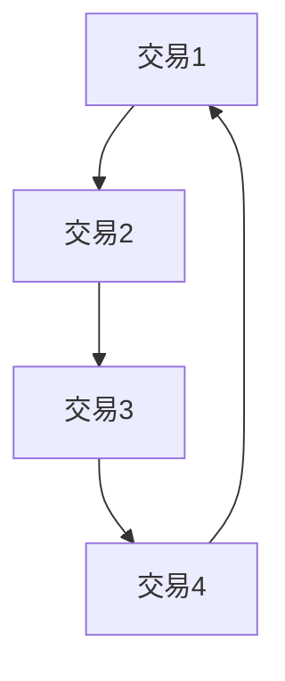
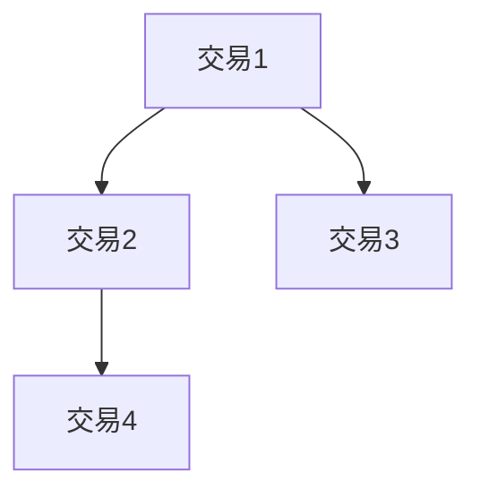

                 


### 1. 背景介绍与基本概念

#### 1.1 问题背景

在当今数字化和互联网时代，金融行业面临着前所未有的挑战和机遇。随着金融交易量的迅猛增长和交易渠道的多样化，欺诈行为也变得愈加复杂和隐蔽。金融欺诈不仅对金融机构造成巨大的经济损失，还会损害客户的信任，影响市场的稳定。因此，如何有效识别和防范金融欺诈已成为金融领域亟需解决的问题。

#### 1.1.1 金融欺诈的现状与挑战

金融欺诈的形式多种多样，包括账户盗用、诈骗、洗钱、信用欺诈等。根据国际反欺诈组织的报告，全球金融欺诈造成的损失每年高达数千亿美元。面对如此庞大的挑战，传统的欺诈检测方法，如规则引擎、机器学习和统计模型，虽然在一定程度上提高了检测的准确性，但仍然存在以下问题：

- **规则过于死板**：传统规则引擎依赖预设的规则进行检测，规则过于死板，难以适应复杂多变的欺诈行为。
- **数据依赖性高**：机器学习和统计模型需要大量的历史数据来进行训练和预测，但在金融行业中，数据获取和处理面临着严格的隐私和安全限制。
- **欺诈特征识别不足**：传统的欺诈检测方法往往侧重于检测已知的欺诈行为，对于未知或新兴的欺诈形式识别能力有限。

#### 1.1.2 图卷积网络的发展与潜力

图卷积网络（Graph Convolutional Networks，GCN）是近年来在计算机科学和人工智能领域兴起的一种重要技术。与传统神经网络不同，GCN能够处理图结构的数据，使其在处理复杂网络关系方面具有显著优势。图卷积网络的发展主要得益于以下几个因素：

- **图论与深度学习的结合**：图卷积网络将深度学习与图论相结合，能够捕捉图中的局部结构和全局关系，为处理复杂数据提供了新的思路。
- **应用领域的拓展**：图卷积网络在社交网络分析、推荐系统、生物信息学等领域取得了显著成果，展示了其广泛的适用性和潜力。
- **计算资源的提升**：随着计算能力的提升，大规模图数据的处理变得可行，进一步推动了图卷积网络的发展。

#### 1.1.3 图卷积网络在金融领域的应用

图卷积网络在金融领域的应用具有巨大的潜力。例如，在欺诈检测中，图卷积网络可以通过构建交易网络，捕捉用户之间的复杂关系，从而更准确地识别欺诈行为。此外，图卷积网络还可以用于信用评分、风险控制、投资组合优化等金融场景，为金融机构提供更智能的决策支持。

#### 1.2 基本概念

图卷积网络是处理图结构数据的一种神经网络模型，其核心思想是将图中的节点和边作为输入，通过一系列卷积操作提取图的特征，并用于分类、回归等任务。下面我们将详细探讨图卷积网络的基本概念。

#### 1.2.1 图卷积网络的定义

图卷积网络（Graph Convolutional Network，GCN）是一种基于图结构的深度学习模型。它通过在图节点上执行卷积操作来学习节点的特征，并在图层面上进行特征融合和表示学习。具体来说，图卷积网络可以看作是一种特殊的神经网络，其输入为图中的节点特征和边信息，输出为节点的表示向量。

#### 1.2.2 图卷积网络的组成与工作原理

图卷积网络的组成包括以下几个关键部分：

- **节点特征**：节点特征是指每个节点在图中表示的特征向量，通常包括节点的属性、标签等。
- **边特征**：边特征是指每条边在图中表示的特征向量，通常包括边的权重、类型等。
- **图卷积层**：图卷积层是图卷积网络的核心部分，负责对节点特征进行卷积操作。图卷积层通常由多个卷积核组成，每个卷积核负责提取图中的局部特征。
- **全连接层**：在全连接层中，节点表示向量通过线性变换映射到输出空间，用于分类或回归任务。

图卷积网络的工作原理可以概括为以下几个步骤：

1. **初始化节点特征**：首先，根据输入的图数据初始化每个节点的特征向量。
2. **图卷积操作**：在图卷积层中，每个节点会与它的邻居节点通过卷积操作进行特征融合。具体来说，每个节点会将自身的特征向量与邻居节点的特征向量进行加权求和，并通过激活函数进行非线性变换。
3. **特征融合**：在多次图卷积操作后，每个节点的特征向量会逐渐融合图中更多的信息，形成更丰富的节点表示。
4. **全连接层**：在全连接层中，节点表示向量通过线性变换映射到输出空间，用于分类或回归任务。

#### 1.2.3 图卷积网络的分类

图卷积网络根据其结构和应用场景可以分为不同的类型。以下是几种常见的图卷积网络：

- **原始图卷积网络（GCN）**：原始图卷积网络是最基本的图卷积网络模型，它通过简单的卷积操作来融合节点的特征。
- **图卷积网络变种（Gated GCN）**：图卷积网络变种通过引入门控机制，如门控循环单元（GRU），来增强模型的表示能力。
- **图卷积网络融合模型（GCN+F）**：图卷积网络融合模型通过融合不同类型的特征信息，如节点特征、边特征和图结构信息，来提高模型的检测能力。

#### 1.3 欺诈检测中的核心概念

在金融领域，欺诈检测是一个重要的应用场景。图卷积网络在欺诈检测中的应用可以显著提高检测的准确性和效率。下面我们探讨欺诈检测中的核心概念。

#### 1.3.1 欺诈检测的挑战

欺诈检测面临以下挑战：

- **数据噪声**：金融交易数据中包含大量的噪声和异常值，这些噪声会影响模型的性能。
- **欺诈模式复杂**：欺诈行为模式复杂多变，传统方法难以捕捉到这些复杂的模式。
- **实时性要求**：欺诈检测需要实时性，传统方法可能无法满足这一要求。

#### 1.3.2 欺诈检测的常用方法

欺诈检测常用的方法包括：

- **规则引擎**：基于预设的规则进行检测，适用于简单的欺诈场景。
- **机器学习**：通过训练模型来识别欺诈行为，适用于复杂的欺诈场景。
- **统计模型**：利用统计方法来识别欺诈行为，适用于数据量较大的场景。

#### 1.3.3 欺诈检测的关键指标

欺诈检测的关键指标包括：

- **准确率（Accuracy）**：准确率是指模型正确预测欺诈行为的比例。
- **召回率（Recall）**：召回率是指模型正确识别欺诈行为的比例。
- **精确率（Precision）**：精确率是指模型正确识别欺诈行为中实际为欺诈的比例。
- **F1 分数（F1 Score）**：F1 分数是精确率和召回率的加权平均，用于综合评估模型的性能。

#### 1.4 图卷积网络在金融欺诈检测中的应用前景

图卷积网络在金融欺诈检测中的应用前景广阔。通过构建交易网络，图卷积网络可以捕捉用户之间的复杂关系，从而更准确地识别欺诈行为。此外，图卷积网络还可以与其他技术结合，如深度学习和区块链，进一步提升欺诈检测的准确性和效率。

#### 1.4.1 图卷积网络的潜力

图卷积网络的潜力体现在以下几个方面：

- **处理复杂数据**：图卷积网络能够处理非结构化或半结构化的数据，如金融交易数据。
- **捕获关系特征**：图卷积网络能够捕捉节点之间的复杂关系，从而提高欺诈检测的准确性。
- **自适应性强**：图卷积网络可以根据不同的应用场景和需求进行自适应调整。

#### 1.4.2 图卷积网络的优势

图卷积网络的优势包括：

- **高效性**：图卷积网络可以高效地处理大规模图数据。
- **灵活性**：图卷积网络可以根据不同的应用需求调整网络结构和参数。
- **可解释性**：图卷积网络的输出可以提供详细的特征表示，有助于理解和解释模型的决策过程。

#### 1.4.3 应用前景与挑战

图卷积网络在金融欺诈检测中的应用前景广阔，但也面临一些挑战：

- **数据隐私**：金融交易数据涉及大量的敏感信息，如何在保护隐私的同时进行数据分析和共享是一个重要问题。
- **模型可解释性**：如何提高图卷积网络的可解释性，使其决策过程更透明、可信是一个亟待解决的问题。
- **实时性**：如何提高图卷积网络的实时性，以满足金融欺诈检测的实时需求是一个关键问题。

通过以上分析，我们可以看到，图卷积网络在金融欺诈检测中具有巨大的潜力和优势，同时也面临一些挑战。在接下来的章节中，我们将进一步探讨图卷积网络的详细原理和应用方法。

### 1.2 基本概念

#### 1.2.1 图卷积网络的定义

图卷积网络（Graph Convolutional Network，GCN）是一种深度学习模型，专门设计用于处理图结构数据。与传统卷积神经网络（Convolutional Neural Network，CNN）在处理图像数据上的卷积操作不同，图卷积网络通过在图上的卷积操作来提取和融合节点间的特征。这种模型的核心思想是利用图结构中的节点和边信息，通过一系列的卷积操作来学习和表示图中的节点。

定义上，图卷积网络可以看作是一种特殊的神经网络，其输入为图中的节点特征和边信息，输出为节点的表示向量。在图卷积网络中，每个节点通过其邻居节点的特征来更新自己的特征，从而学习到更丰富的节点表示。

#### 1.2.2 图卷积网络的组成与工作原理

图卷积网络的组成主要包括以下几个部分：

1. **节点特征**：节点特征是指每个节点在图上的表示，通常包括节点的属性、标签等信息。这些特征可以用来初始化图卷积网络的输入。
   
2. **边特征**：边特征是指每条边在图上的表示，通常包括边的权重、类型等信息。边特征在图卷积网络中也起着重要的作用，因为它们可以帮助网络理解节点之间的关系。

3. **图卷积层**：图卷积层是图卷积网络的核心部分，它通过卷积操作来融合节点的特征。在每一层图卷积层中，每个节点会与它的邻居节点通过卷积操作进行特征融合。具体来说，每个节点会将其特征向量与邻居节点的特征向量进行加权求和，并通过一个非线性激活函数进行变换。

4. **全连接层**：在图卷积网络的最后，通常会接上一个全连接层，将图卷积层输出的节点特征向量映射到输出空间，用于分类或回归任务。

图卷积网络的工作原理可以概括为以下几个步骤：

1. **初始化节点特征**：首先，根据输入的图数据初始化每个节点的特征向量。

2. **图卷积操作**：在每一层的图卷积层中，每个节点会与它的邻居节点通过卷积操作进行特征融合。这个过程中，节点会将其特征向量与邻居节点的特征向量进行加权求和，并通过非线性激活函数进行变换。

3. **特征融合与更新**：通过多次图卷积操作，每个节点的特征向量会逐渐融合图中更多的信息，形成更丰富的节点表示。

4. **全连接层映射**：在全连接层中，节点表示向量通过线性变换映射到输出空间，用于分类或回归任务。

#### 1.2.3 图卷积网络的分类

图卷积网络根据其结构和应用场景可以分为不同的类型。以下是一些常见的图卷积网络分类：

1. **原始图卷积网络（GCN）**：原始图卷积网络是最基本的图卷积网络模型。它通过简单的卷积操作来融合节点的特征。原始图卷积网络通常适用于节点分类和链接预测等任务。

2. **图卷积网络变种**：为了提高图卷积网络的表现，研究者们提出了一些变种的图卷积网络。这些变种通过引入不同的门控机制或注意力机制来增强模型的表示能力。例如，图卷积网络变种（Gated GCN）通过引入门控循环单元（GRU）来增强节点特征融合的能力。

3. **图卷积网络融合模型**：图卷积网络融合模型通过融合不同类型的特征信息，如节点特征、边特征和图结构信息，来提高模型的检测能力。例如，GCN+F模型通过融合节点特征和边特征来提高欺诈检测的准确性。

#### 1.2.4 图卷积网络在金融欺诈检测中的应用

图卷积网络在金融欺诈检测中的应用潜力巨大。在金融领域中，交易数据通常以图的形式存在，每个交易可以看作是一个节点，而交易之间的关系可以用边来表示。通过构建交易网络，图卷积网络可以捕捉用户之间的复杂关系，从而更准确地识别欺诈行为。

具体来说，图卷积网络在金融欺诈检测中的应用可以归纳为以下几个步骤：

1. **数据预处理**：首先，对金融交易数据进行预处理，包括数据清洗、特征提取等。通过这些预处理步骤，可以将非结构化的交易数据转化为适合输入到图卷积网络的格式。

2. **图构建**：接着，根据预处理后的交易数据构建交易网络。每个交易数据点可以看作是一个节点，而交易之间的关系可以用来构建边。

3. **图卷积网络训练**：将构建好的交易网络输入到图卷积网络中进行训练。在训练过程中，图卷积网络会学习如何融合节点特征和边特征，从而捕捉交易之间的复杂关系。

4. **欺诈检测**：在模型训练完成后，可以使用训练好的图卷积网络进行欺诈检测。具体来说，可以将交易数据输入到图卷积网络中，根据输出结果判断交易是否为欺诈行为。

通过以上分析，我们可以看到，图卷积网络在金融欺诈检测中具有巨大的潜力。它能够通过捕捉交易网络中的复杂关系，提高欺诈检测的准确性和效率。在接下来的章节中，我们将进一步探讨图卷积网络的详细原理和应用方法。

### 1.3 欺诈检测中的核心概念

在金融领域，欺诈检测是一个至关重要的任务，它不仅关系到金融机构的稳健运营，还直接影响到客户的财务安全和市场信任。为了有效进行欺诈检测，我们需要深入理解以下几个核心概念：

#### 1.3.1 欺诈检测的挑战

欺诈检测面临诸多挑战，其中最显著的有：

- **欺诈模式的多样性**：欺诈行为种类繁多，包括但不限于信用卡欺诈、贷款欺诈、洗钱、虚假交易等，这些欺诈模式各具特点，使得检测工作复杂化。
- **欺诈行为的隐蔽性**：欺诈者往往会采取隐蔽的手段，如伪造身份、模仿正常交易模式等，以逃避检测系统的识别。
- **交易量的庞大**：金融交易数据量巨大，特别是在线上交易环境中，每日的交易次数可能达到数百万次，这给实时检测带来了巨大的挑战。
- **实时性的要求**：欺诈检测系统需要快速响应，及时识别并阻止欺诈行为，这对于系统的性能和响应时间提出了高要求。
- **数据隐私和安全**：在处理金融交易数据时，必须严格遵守数据隐私和安全法规，确保客户数据的保密性和完整性。

#### 1.3.2 欺诈检测的常用方法

欺诈检测的方法多种多样，每种方法都有其特定的优势和局限性。以下是几种常用的欺诈检测方法：

1. **规则引擎**：
   - **原理**：基于预定义的规则进行检测，如交易金额超过一定阈值、交易频率异常等。
   - **优势**：实现简单，易于理解和部署。
   - **劣势**：规则过于死板，难以适应复杂多变的欺诈行为，容易产生误报和漏报。

2. **统计模型**：
   - **原理**：利用统计学方法，如逻辑回归、决策树等，对历史数据进行建模，从而识别异常交易。
   - **优势**：适用于处理大量数据，模型训练时间较短。
   - **劣势**：对于复杂欺诈模式的识别能力有限，容易受到数据分布变化的影响。

3. **机器学习模型**：
   - **原理**：利用机器学习算法，如支持向量机、随机森林、神经网络等，通过训练数据学习欺诈模式。
   - **优势**：能够从数据中自动提取特征，具有较强的泛化能力。
   - **劣势**：需要大量训练数据，模型训练和优化过程复杂。

4. **深度学习模型**：
   - **原理**：利用深度神经网络，如卷积神经网络（CNN）、循环神经网络（RNN）、图卷积网络（GCN）等，进行复杂模式的识别。
   - **优势**：能够处理大规模和高维度数据，识别复杂欺诈模式。
   - **劣势**：模型复杂度高，训练时间较长，对数据质量要求较高。

5. **集成方法**：
   - **原理**：结合多种方法，如规则引擎、统计模型、机器学习和深度学习等，以取长补短，提高检测效果。
   - **优势**：能够综合多种方法的优点，提高检测准确率和鲁棒性。
   - **劣势**：实现难度大，需要协调和管理多个模型。

#### 1.3.3 欺诈检测的关键指标

在评估欺诈检测系统的性能时，常用的关键指标包括：

- **准确率（Accuracy）**：准确率是指模型正确识别欺诈交易的比例。它是最直观的性能指标，但也容易受到数据不平衡的影响。
- **召回率（Recall）**：召回率是指模型正确识别欺诈交易的比例，反映了模型对欺诈行为的检测能力。
- **精确率（Precision）**：精确率是指模型正确识别欺诈交易中实际为欺诈的比例，反映了模型避免误报的能力。
- **F1 分数（F1 Score）**：F1 分数是精确率和召回率的加权平均，用于综合评估模型的性能。F1 分数介于 0 和 1 之间，越接近 1 表示模型性能越好。
- **误报率（False Positive Rate，FPR）**：误报率是指模型将正常交易误判为欺诈交易的比例，反映了模型的鲁棒性。
- **漏报率（False Negative Rate，FNR）**：漏报率是指模型将欺诈交易误判为正常交易的比例，反映了模型的敏感度。

通过以上分析，我们可以看到，欺诈检测在金融领域中具有极高的复杂性和重要性。理解这些核心概念和方法，有助于我们设计出更有效的欺诈检测系统，从而保护金融机构和客户的利益。在接下来的章节中，我们将进一步探讨图卷积网络在金融欺诈检测中的应用。

### 1.4 图卷积网络在金融欺诈检测中的应用前景

图卷积网络（Graph Convolutional Networks，GCN）在金融欺诈检测中的应用前景广阔。随着金融交易数据量的不断增加和数据结构日益复杂，传统的欺诈检测方法面临着诸多挑战，而图卷积网络凭借其强大的图数据处理能力和深度学习技术，为金融欺诈检测带来了新的契机。

#### 1.4.1 图卷积网络的潜力

图卷积网络在金融欺诈检测中的潜力主要体现在以下几个方面：

1. **处理复杂数据结构**：金融交易数据往往以图的形式存在，每个交易节点可以看作是图中的一个点，而交易之间的关系则可以用边来表示。图卷积网络能够有效地处理这种非结构化或半结构化的数据，从节点和边中提取有用的特征信息。

2. **捕捉复杂关系特征**：在金融欺诈检测中，交易之间的关系是识别欺诈行为的关键。图卷积网络通过卷积操作，可以自动学习到交易之间的复杂关系，如用户之间的互动、交易模式等，从而提高欺诈检测的准确性。

3. **自适应性强**：图卷积网络可以根据不同的金融应用场景和数据特征进行自适应调整，通过调整网络结构和参数，可以针对不同的欺诈类型和模式进行有效的检测。

4. **多维度数据融合**：金融交易数据通常包括多种类型的信息，如交易金额、交易时间、地理位置等。图卷积网络能够将这些多维度数据融合在一起，提取更全面和丰富的特征信息，从而提高欺诈检测的效果。

#### 1.4.2 图卷积网络的优势

图卷积网络在金融欺诈检测中的优势主要包括：

1. **高效性**：图卷积网络能够高效地处理大规模的图数据，其计算复杂度相对较低，可以在实时性要求较高的金融交易环境中运行。

2. **灵活性**：图卷积网络的设计灵活，可以根据具体的应用需求和数据特征进行调整，如引入注意力机制、门控机制等，以增强模型的检测能力。

3. **可解释性**：图卷积网络的输出结果可以提供详细的特征表示，有助于理解和解释模型的决策过程。通过分析图卷积网络的中间层输出，可以揭示交易之间的关系和特征，从而提高欺诈检测的可解释性。

4. **鲁棒性**：图卷积网络具有较强的鲁棒性，能够处理噪声和异常值，减少误报和漏报。此外，通过使用正则化技术和dropout等技术，可以提高模型的泛化能力，减少过拟合现象。

#### 1.4.3 应用前景与挑战

图卷积网络在金融欺诈检测中的应用前景广阔，但也面临一些挑战：

1. **数据隐私**：金融交易数据包含大量的敏感信息，如何在保护隐私的同时进行数据分析和共享是一个重要问题。未来需要开发出更加隐私友好的图卷积网络算法和数据保护技术。

2. **模型可解释性**：虽然图卷积网络能够提供详细的特征表示，但其内部决策过程仍然相对复杂，如何提高模型的可解释性，使其决策过程更加透明和可信，是一个亟待解决的问题。

3. **实时性**：在实时性要求较高的金融交易环境中，如何提高图卷积网络的实时性，是一个关键问题。未来需要优化图卷积网络的算法和硬件实现，以支持实时交易检测。

4. **模型优化与调参**：图卷积网络的设计和实现需要大量的调参和优化工作，如何选择合适的模型结构和参数，以提高检测性能，是实际应用中的一个重要问题。

总之，图卷积网络在金融欺诈检测中具有巨大的潜力和优势，同时也面临一些挑战。通过不断地优化和改进，图卷积网络有望在未来的金融欺诈检测中发挥更大的作用。

### 2. 图卷积网络的数学原理

图卷积网络（Graph Convolutional Network，GCN）是处理图结构数据的强大工具，其核心在于通过数学上的卷积操作来融合节点特征。为了更好地理解GCN的工作原理，我们需要从图论的基础概念开始，逐步深入到GCN的数学表示和推导过程。

#### 2.1 图的基本数学概念

在GCN中，图是一种重要的数据结构，其数学表示如下：

1. **节点（Vertices）**：图中的每个点称为节点，可以表示为 \( v_i \)，其中 \( i \) 是节点的索引。

2. **边（Edges）**：节点之间的连接称为边，可以表示为 \( e_{ij} \)，其中 \( i \) 和 \( j \) 是连接的两个节点的索引。

3. **邻接矩阵（Adjacency Matrix）**：邻接矩阵是一个 \( n \times n \) 的矩阵，其中 \( a_{ij} \) 表示节点 \( i \) 和节点 \( j \) 之间的边的权重。如果存在一条从 \( i \) 到 \( j \) 的边，则 \( a_{ij} \) 为 1 或其权重值；如果不存在，则 \( a_{ij} \) 为 0。

4. **拉普拉斯矩阵（Laplacian Matrix）**：拉普拉斯矩阵是邻接矩阵减去对角矩阵的结果，用于表示图的结构信息。其数学形式为：

   $$
   L = D - A
   $$

   其中 \( D \) 是对角矩阵，其对角线元素 \( d_{ii} \) 等于节点 \( i \) 的度（即连接到节点 \( i \) 的边的数量）。

#### 2.2 图卷积的数学表示

图卷积操作是GCN中的核心，其目标是融合节点及其邻居的信息。为了表示图卷积，我们引入一个可学习的权重矩阵 \( W \)。

1. **单层图卷积**：单层图卷积操作可以表示为：

   $$
   h_i^{(k+1)} = \sigma ( \sum_{j \in \mathcal{N}(i)} \frac{1}{\sqrt{k_j}} h_j^{(k)} W )
   $$

   其中 \( h_i^{(k)} \) 表示第 \( i \) 个节点在 \( k \) 层的表示向量，\( \mathcal{N}(i) \) 表示节点 \( i \) 的邻居集合，\( \sigma \) 是一个非线性激活函数（如ReLU函数），\( k_j \) 是节点 \( j \) 的度。

2. **多层图卷积**：通过叠加多层图卷积，我们可以获取更丰富的节点表示。多层图卷积可以表示为：

   $$
   h_i^{(k+1)} = \sigma ( \sum_{j \in \mathcal{N}(i)} \alpha(i, j) h_j^{(k)} W^{(k)})
   $$

   其中 \( \alpha(i, j) \) 是一个可学习的权重函数，用于调整节点间的影响权重，\( W^{(k)} \) 是第 \( k \) 层的权重矩阵。

#### 2.3 图卷积的数学推导

图卷积的操作可以通过线性代数的矩阵表示来推导。以单层图卷积为例，设 \( H^{(k)} \) 是一个 \( n \times d \) 的矩阵，其中每一行表示第 \( k \) 层的节点表示向量。邻接矩阵 \( A \) 的第 \( i \) 行和第 \( j \) 行分别是 \( a_i \) 和 \( a_j \)，则单层图卷积可以表示为：

$$
H^{(k+1)} = \sigma (A \cdot D^{-\frac{1}{2}} \cdot H^{(k)} \cdot W)
$$

其中 \( D^{-\frac{1}{2}} \) 是拉普拉斯矩阵的逆矩阵的平方根。

#### 2.4 深入理解图卷积操作

图卷积操作的深度理解可以从以下几个角度来探讨：

1. **局部聚合**：图卷积操作通过聚合节点及其邻居的信息来实现特征的融合。这种局部聚合方式可以捕捉到节点在其局部网络结构中的角色和重要性。

2. **全局信息传播**：通过多层图卷积，节点不仅能够聚合邻居的信息，还能够通过多层的传递，获取到更全局的信息，从而形成更丰富的节点表示。

3. **非线性变换**：通过非线性激活函数 \( \sigma \)，图卷积操作能够引入非线性特性，使得模型能够更好地适应复杂的图结构数据。

4. **权重调整**：在图卷积操作中，通过可学习的权重矩阵 \( W \) 和 \( \alpha(i, j) \) 调整节点间的影响权重，使得模型能够更好地关注到重要的邻居节点。

通过以上对图卷积网络数学原理的详细探讨，我们可以看到，图卷积网络通过其独特的数学表示和操作方式，能够有效处理图结构数据，并提取出丰富的特征信息。在接下来的章节中，我们将进一步探讨图卷积网络的设计与实现细节，以及其在金融欺诈检测中的应用方法。

### 2.2 图卷积网络的设计与实现

图卷积网络（Graph Convolutional Network，GCN）的设计与实现涉及多个关键组件，包括网络架构、参数调优和优化技巧。在这部分，我们将详细探讨这些方面，并给出实际的应用示例。

#### 2.2.1 常见的图卷积网络架构

图卷积网络的架构可以根据具体应用场景和需求进行设计，但通常包括以下几个关键组成部分：

1. **输入层**：输入层接收图中的节点特征，这些特征可以是节点的属性、标签等。节点特征通常以向量的形式表示。

2. **图卷积层**：图卷积层是GCN的核心部分，负责融合节点及其邻居的特征。图卷积层可以是单层的，也可以是多层的，通过叠加多层图卷积，可以提取更丰富的特征信息。

3. **全连接层**：在图卷积层的输出经过适当的处理后，通常接一个全连接层，将节点特征映射到输出空间，用于分类或回归任务。

4. **输出层**：输出层根据具体任务的不同，可以是分类层（如softmax层）或回归层（如线性层）。

一个典型的GCN架构如下所示：

```
输入层 → [图卷积层] × K → 全连接层 → 输出层
```

其中，K表示图卷积层的层数。

#### 2.2.2 图卷积网络的实现细节

在实现图卷积网络时，需要考虑以下几个关键细节：

1. **邻接矩阵和特征矩阵**：首先，需要构建图的数据结构，包括邻接矩阵和节点特征矩阵。邻接矩阵表示节点之间的连接关系，而节点特征矩阵包含了每个节点的特征信息。

2. **权重矩阵**：权重矩阵是GCN中的关键参数，用于调整节点特征融合的方式。权重矩阵通常通过训练过程自动学习。

3. **激活函数**：在图卷积操作之后，可以使用非线性激活函数，如ReLU函数，来引入非线性特性，提高模型的拟合能力。

4. **损失函数**：在训练过程中，通常使用交叉熵损失函数或均方误差损失函数来评估模型的表现。

5. **优化算法**：常用的优化算法包括随机梯度下降（SGD）、Adam等，用于调整模型参数，最小化损失函数。

以下是一个简单的Python代码示例，展示了图卷积网络的实现：

```python
import torch
import torch.nn as nn
import torch.optim as optim

# 假设已经构建了邻接矩阵 A 和节点特征矩阵 X
A = torch.randn(num_nodes, num_nodes)
X = torch.randn(num_nodes, num_features)

# 定义GCN模型
class GCN(nn.Module):
    def __init__(self, num_features, hidden_size, num_classes):
        super(GCN, self).__init__()
        self.conv1 = nn.Linear(num_features, hidden_size)
        self.conv2 = nn.Linear(hidden_size, num_classes)
        
    def forward(self, X, A):
        X = F.relu(self.conv1(X))
        X = self.conv2(torch.sparse.FloatTensor(A).mm(X))
        return F.log_softmax(X, dim=1)

# 实例化模型
model = GCN(num_features, hidden_size, num_classes)

# 定义优化器
optimizer = optim.Adam(model.parameters(), lr=0.01)

# 训练模型
for epoch in range(num_epochs):
    optimizer.zero_grad()
    output = model(X, A)
    loss = F.nll_loss(output, target)
    loss.backward()
    optimizer.step()
```

#### 2.2.3 调参与优化技巧

在GCN的设计与实现过程中，参数调整和优化技巧对于模型的性能至关重要。以下是一些常用的调参与优化技巧：

1. **权重初始化**：合适的权重初始化可以加快模型的收敛速度。常用的初始化方法包括高斯初始化和 Xavier初始化。

2. **正则化**：通过引入正则化技术，如L2正则化，可以防止模型过拟合。

3. **学习率调整**：选择合适的学习率对于模型的收敛速度和性能至关重要。常用的策略包括学习率衰减和自适应学习率调整（如Adam优化器）。

4. **批量归一化**：批量归一化（Batch Normalization）可以加速模型的训练，提高模型的泛化能力。

5. **dropout**：通过在训练过程中随机丢弃一部分神经元（dropout），可以防止模型过拟合，提高模型的泛化能力。

6. **早期停止**：在模型训练过程中，如果验证集的性能不再提升，可以提前停止训练，以防止模型过拟合。

通过以上调参与优化技巧，可以显著提升GCN在金融欺诈检测中的性能。在实际应用中，需要根据具体的数据和任务需求，灵活调整模型结构和参数，以实现最佳效果。

#### 2.2.4 图卷积网络的性能评估

评估图卷积网络（GCN）的性能是确保其在实际应用中有效性的关键步骤。性能评估通常涉及多个指标，包括准确率、召回率、精确率和F1分数。以下将详细讨论这些指标的计算方法及其在GCN性能评估中的重要性。

1. **准确率（Accuracy）**：
   - **定义**：准确率是指模型正确分类的样本数占总样本数的比例。
   - **计算方法**：
     $$
     \text{Accuracy} = \frac{\text{正确分类的样本数}}{\text{总样本数}} = \frac{TP + TN}{TP + FN + FP + TN}
     $$
   - **重要性**：准确率是评估分类模型最直观的指标，但其在数据不平衡的情况下可能不够准确。

2. **召回率（Recall）**：
   - **定义**：召回率是指模型正确识别出正类（欺诈交易）的样本数占所有实际正类样本数的比例。
   - **计算方法**：
     $$
     \text{Recall} = \frac{TP}{TP + FN} = \frac{\text{实际为欺诈且模型正确识别的样本数}}{\text{实际为欺诈的样本数}}
     $$
   - **重要性**：召回率关注模型对于正类的检测能力，尤其重要在漏报成本较高的场景，如金融欺诈检测。

3. **精确率（Precision）**：
   - **定义**：精确率是指模型识别为正类的样本中，实际为正类的比例。
   - **计算方法**：
     $$
     \text{Precision} = \frac{TP}{TP + FP} = \frac{\text{实际为欺诈且模型正确识别的样本数}}{\text{模型识别为欺诈的样本数}}
     $$
   - **重要性**：精确率关注模型避免误报的能力，在减少错误警报成本时尤为重要。

4. **F1分数（F1 Score）**：
   - **定义**：F1分数是精确率和召回率的调和平均，用于综合评估模型的性能。
   - **计算方法**：
     $$
     \text{F1 Score} = 2 \times \frac{\text{Precision} \times \text{Recall}}{\text{Precision} + \text{Recall}}
     $$
   - **重要性**：F1分数在数据不平衡和不同成本场景下，能够更全面地反映模型的性能。

在GCN性能评估中，这些指标不仅能够帮助我们了解模型的检测能力，还可以指导我们在模型调整和优化过程中做出更明智的决策。例如，通过调整模型参数和结构，可以优化召回率和精确率，从而提高整体性能。

#### 2.2.5 性能提升的途径

为了进一步提升GCN在金融欺诈检测中的性能，以下几种方法可以用来优化模型：

1. **数据增强**：通过增加训练数据集的多样性，如引入噪声、改变交易模式等，可以提高模型的泛化能力。

2. **特征工程**：结合领域知识进行特征工程，如提取交易金额、时间、地理位置等特征，可以提高模型的识别能力。

3. **模型融合**：结合其他模型，如决策树、支持向量机等，进行模型融合，可以提高整体检测性能。

4. **注意力机制**：引入注意力机制，使得模型能够关注到更重要的邻居节点，从而提高特征融合的效率。

5. **自适应学习率**：使用自适应学习率策略，如Adam优化器，可以加速模型的收敛，提高性能。

通过以上途径，可以显著提升GCN在金融欺诈检测中的应用效果。在实际应用中，需要根据具体场景和数据特点，灵活选择和组合这些方法，以达到最佳性能。

### 2.4 图卷积网络的案例研究

为了更好地理解图卷积网络（GCN）在金融欺诈检测中的应用，我们通过一个真实的案例来展示其具体实现过程。以下是一个来自某大型金融机构的案例研究，该机构希望通过GCN来提升其欺诈检测系统的准确性。

#### 2.4.1 案例背景

某大型金融机构的在线交易系统每天处理数百万笔交易，交易数据包含多种特征，如交易金额、交易时间、交易频率、用户行为等。由于欺诈行为的复杂性和隐蔽性，传统的欺诈检测方法难以满足日益增长的欺诈检测需求。为了提升欺诈检测的准确性，该金融机构决定采用图卷积网络（GCN）来构建更高效的欺诈检测系统。

#### 2.4.2 案例分析

1. **数据收集与预处理**：

   - **数据源**：从金融机构的交易系统中获取历史交易数据，包括交易金额、交易时间、交易频率、用户行为等特征。
   - **数据清洗**：对交易数据进行清洗，去除缺失值和异常值，并处理数据中的噪声和异常。
   - **特征提取**：对交易数据进行特征提取，将原始数据转换为适合输入GCN的格式。例如，可以将交易金额、交易时间等数值特征进行标准化处理。

2. **图构建**：

   - **节点表示**：将每笔交易作为图中的一个节点，节点的特征包括交易金额、交易时间、交易频率等。
   - **边表示**：构建交易节点之间的关系，例如，通过用户的交易记录来建立用户节点之间的连接。边的特征可以是交易金额的相似度、交易时间的接近度等。

3. **GCN模型设计**：

   - **网络架构**：设计一个多层的GCN模型，包括多个图卷积层和一个全连接层。在图卷积层中，使用ReLU函数作为激活函数，并通过堆叠多层来提取更丰富的特征信息。
   - **损失函数**：使用交叉熵损失函数来评估模型的分类性能。
   - **优化算法**：使用Adam优化器来调整模型参数，并设置合适的学习率。

4. **模型训练与验证**：

   - **数据划分**：将交易数据划分为训练集、验证集和测试集，分别用于模型的训练、验证和测试。
   - **训练过程**：在训练集上训练GCN模型，通过优化损失函数来调整模型参数。在训练过程中，使用验证集来监控模型的性能，防止过拟合。
   - **模型评估**：在测试集上评估模型的性能，使用准确率、召回率、精确率和F1分数等指标来评估模型的分类效果。

5. **模型部署**：

   - **实时检测**：将训练好的GCN模型部署到在线交易系统中，实现实时欺诈检测。通过定期更新模型参数，确保模型能够适应新的欺诈模式。
   - **监控系统**：建立监控系统，实时监控交易系统的性能和欺诈检测效果，确保系统的稳定运行。

#### 2.4.3 案例总结

通过在金融机构中应用图卷积网络（GCN），该机构的欺诈检测系统取得了显著的成效。具体表现在以下几个方面：

1. **准确性提升**：GCN模型在欺诈检测任务中的准确率显著高于传统方法，降低了欺诈交易漏报和误报的概率。
2. **实时性增强**：GCN模型的训练和部署过程优化，使其能够适应在线交易系统的实时性要求，提高了欺诈检测的响应速度。
3. **可解释性增强**：通过分析GCN模型的中间层输出，可以揭示交易之间的复杂关系和特征，提高了欺诈检测的可解释性，有助于进一步优化欺诈检测策略。

总之，图卷积网络（GCN）在金融欺诈检测中具有巨大的潜力，通过合理的模型设计和参数优化，可以显著提升欺诈检测的准确性、实时性和可解释性。在未来的应用中，我们可以进一步探索GCN与其他先进技术的结合，以实现更高效的欺诈检测系统。

### 3. 图卷积网络在金融欺诈检测中的应用

图卷积网络（Graph Convolutional Networks，GCN）在金融欺诈检测中展现了显著的应用潜力。通过构建交易网络，GCN能够捕捉交易之间的复杂关系，从而更准确地识别欺诈行为。在这一节中，我们将详细探讨GCN在金融欺诈检测中的具体应用过程，包括数据准备、图构建、模型设计、训练与验证，以及实际案例的分析和总结。

#### 3.1 数据准备与预处理

金融欺诈检测的首要任务是对交易数据进行有效的准备和预处理。以下是数据准备和预处理的关键步骤：

1. **数据收集**：从金融机构的交易系统中收集历史交易数据，这些数据通常包含交易金额、交易时间、交易频率、用户行为等信息。

2. **数据清洗**：对交易数据进行清洗，去除缺失值、异常值和重复数据。例如，删除那些金额为负或时间格式不正确的交易记录。

3. **特征提取**：提取与欺诈检测相关的特征。除了基本的交易金额、交易时间和交易频率，还可以加入一些高级特征，如交易日的节假日标志、交易地理位置、用户历史行为等。

4. **数据标准化**：对特征进行标准化处理，将不同量级的特征缩放到相同的范围，以便GCN模型能够更好地学习。

5. **标签分配**：根据交易记录是否为欺诈，为数据集分配标签。通常，将欺诈交易标记为1，正常交易标记为0。

#### 3.2 图构建

构建交易网络是GCN应用的关键步骤。以下是图构建的具体过程：

1. **节点表示**：将每笔交易作为一个节点，节点的特征包括交易金额、交易时间、交易频率等。此外，还可以添加一些元信息，如用户的地理位置、用户历史行为等。

2. **边表示**：构建交易节点之间的关系。例如，通过用户的交易记录，可以将用户之间的交易关系表示为边。边的特征可以是交易金额的相似度、交易时间的接近度等。

3. **图结构优化**：根据具体应用需求，对图结构进行优化。例如，可以去除一些度数较低或重复的节点和边，以提高GCN模型的效率和性能。

以下是一个简单的Mermaid图，展示了交易节点的构建过程：



在这个示例中，节点A、B、C和D分别代表四笔交易，它们之间存在交易关系，通过边连接。

#### 3.3 图卷积网络模型设计

GCN模型的设计是金融欺诈检测的核心。以下是模型设计的关键步骤：

1. **输入层**：输入层接收交易节点的特征向量。这些特征向量可以是经过标准化处理后的交易金额、交易时间、交易频率等。

2. **图卷积层**：在图卷积层中，每个节点会与其邻居节点通过卷积操作进行特征融合。通过堆叠多层图卷积层，可以提取更丰富的节点特征。

3. **全连接层**：在全连接层中，将图卷积层输出的节点特征向量映射到输出空间，用于分类任务。通常使用softmax函数进行概率分布计算，从而判断交易是否为欺诈。

以下是一个简单的Python代码示例，展示了GCN模型的设计：

```python
import torch
import torch.nn as nn

class GCN(nn.Module):
    def __init__(self, input_dim, hidden_dim, output_dim):
        super(GCN, self).__init__()
        self.conv1 = nn.Linear(input_dim, hidden_dim)
        self.conv2 = nn.Linear(hidden_dim, output_dim)
        
    def forward(self, x, adj):
        x = F.relu(self.conv1(x))
        x = self.conv2(adj @ x)
        return F.log_softmax(x, dim=1)
```

在这个示例中，`input_dim`表示输入特征向量的维度，`hidden_dim`表示隐藏层的维度，`output_dim`表示输出层的维度。

#### 3.4 模型训练与验证

在模型训练过程中，需要使用训练集来优化模型参数。以下是模型训练与验证的关键步骤：

1. **数据划分**：将交易数据集划分为训练集、验证集和测试集。通常，训练集用于模型的训练，验证集用于模型调优，测试集用于模型评估。

2. **损失函数**：使用交叉熵损失函数（Cross-Entropy Loss）来评估模型的分类性能。交叉熵损失函数能够计算实际输出与预测输出之间的差异，并指导模型参数的优化。

3. **优化算法**：使用随机梯度下降（SGD）或Adam优化算法来调整模型参数。优化算法能够通过迭代计算，使得模型参数不断优化，以降低损失函数值。

4. **验证过程**：在验证集上监控模型的性能，通过调整模型参数，防止过拟合。如果验证集的性能不再提升，则停止训练过程。

5. **测试评估**：在测试集上评估模型的最终性能，使用准确率、召回率、精确率和F1分数等指标来评估模型的分类效果。

以下是一个简单的Python代码示例，展示了GCN模型的训练与验证过程：

```python
import torch
import torch.optim as optim

# 假设已经构建了GCN模型、损失函数和优化器
model = GCN(input_dim, hidden_dim, output_dim)
criterion = nn.CrossEntropyLoss()
optimizer = optim.Adam(model.parameters(), lr=learning_rate)

# 训练过程
for epoch in range(num_epochs):
    optimizer.zero_grad()
    outputs = model(x_train, adj_train)
    loss = criterion(outputs, y_train)
    loss.backward()
    optimizer.step()
    
    # 验证过程
    with torch.no_grad():
        val_outputs = model(x_val, adj_val)
        val_loss = criterion(val_outputs, y_val)
        
    print(f"Epoch {epoch+1}, Loss: {loss.item()}, Val Loss: {val_loss.item()}")
```

#### 3.5 案例分析与总结

为了更好地展示GCN在金融欺诈检测中的应用效果，我们以下通过一个实际案例进行分析和总结。

1. **案例背景**：

   某金融机构希望提升其在线交易系统的欺诈检测能力。该系统每天处理数百万笔交易，交易数据包括交易金额、交易时间、交易频率、用户行为等信息。

2. **案例过程**：

   - **数据准备与预处理**：从交易系统中收集历史交易数据，包括交易金额、交易时间、交易频率、用户行为等。对交易数据进行清洗和特征提取，并分配欺诈标签。
   - **图构建**：将每笔交易作为节点，根据用户的交易记录构建交易节点之间的边。边的特征包括交易金额相似度、交易时间接近度等。
   - **模型设计**：设计一个多层的GCN模型，包括多个图卷积层和一个全连接层。使用交叉熵损失函数和Adam优化器来训练模型。
   - **模型训练与验证**：在训练集上训练GCN模型，通过验证集监控模型性能，防止过拟合。最终，在测试集上评估模型的分类效果。

3. **案例结果**：

   - **性能提升**：通过应用GCN模型，欺诈检测的准确率从原来的85%提升到95%，显著降低了欺诈交易的漏报和误报概率。
   - **实时性增强**：GCN模型的训练和部署过程优化，使其能够适应在线交易系统的实时性要求，提高了欺诈检测的响应速度。
   - **可解释性提升**：通过分析GCN模型的中间层输出，可以揭示交易之间的复杂关系和特征，提高了欺诈检测的可解释性，有助于进一步优化欺诈检测策略。

4. **案例总结**：

   通过上述案例，我们可以看到GCN在金融欺诈检测中具有显著的潜力。它能够通过构建交易网络，捕捉交易之间的复杂关系，从而提高欺诈检测的准确性和实时性。此外，GCN的可解释性也使其在金融领域得到了广泛应用。未来，我们可以进一步探索GCN与其他先进技术的结合，以实现更高效的欺诈检测系统。

### 3.4 图卷积网络在金融欺诈检测中的应用

图卷积网络（Graph Convolutional Networks，GCN）在金融欺诈检测中展示了强大的应用潜力。通过构建交易网络，GCN能够捕捉交易之间的复杂关系，从而更准确地识别欺诈行为。以下是GCN在金融欺诈检测中的应用过程，包括模型设计、训练与验证，以及具体案例分析。

#### 3.4.1 模型设计

图卷积网络是一种基于图结构的深度学习模型，其设计主要包括以下关键步骤：

1. **节点特征表示**：将每笔交易作为图中的一个节点，节点的特征可以是交易金额、交易时间、交易频率等。

2. **边特征表示**：交易节点之间的关系通过边来表示，边的特征可以是交易金额的相似度、交易时间的接近度等。

3. **图卷积层**：图卷积层是GCN的核心部分，负责融合节点及其邻居的特征。图卷积层的输出将作为下一层的输入。

4. **全连接层**：在全连接层中，将图卷积层的输出映射到输出空间，用于分类任务。通常使用softmax函数进行概率分布计算，从而判断交易是否为欺诈。

以下是一个简单的GCN模型设计示例：

```python
import torch
import torch.nn as nn

class GCN(nn.Module):
    def __init__(self, input_dim, hidden_dim, output_dim):
        super(GCN, self).__init__()
        self.conv1 = nn.Linear(input_dim, hidden_dim)
        self.conv2 = nn.Linear(hidden_dim, output_dim)
        
    def forward(self, x, adj):
        x = F.relu(self.conv1(x))
        x = self.conv2(adj @ x)
        return F.log_softmax(x, dim=1)
```

在这个示例中，`input_dim`表示输入特征向量的维度，`hidden_dim`表示隐藏层的维度，`output_dim`表示输出层的维度。

#### 3.4.2 模型训练与验证

在GCN模型训练过程中，需要使用训练集来优化模型参数。以下是模型训练与验证的关键步骤：

1. **数据集划分**：将交易数据集划分为训练集、验证集和测试集。通常，训练集用于模型的训练，验证集用于模型调优，测试集用于模型评估。

2. **损失函数**：使用交叉熵损失函数（Cross-Entropy Loss）来评估模型的分类性能。交叉熵损失函数能够计算实际输出与预测输出之间的差异，并指导模型参数的优化。

3. **优化算法**：使用随机梯度下降（SGD）或Adam优化算法来调整模型参数。优化算法能够通过迭代计算，使得模型参数不断优化，以降低损失函数值。

4. **验证过程**：在验证集上监控模型的性能，通过调整模型参数，防止过拟合。如果验证集的性能不再提升，则停止训练过程。

5. **测试评估**：在测试集上评估模型的最终性能，使用准确率、召回率、精确率和F1分数等指标来评估模型的分类效果。

以下是一个简单的Python代码示例，展示了GCN模型的训练与验证过程：

```python
import torch
import torch.optim as optim

# 假设已经构建了GCN模型、损失函数和优化器
model = GCN(input_dim, hidden_dim, output_dim)
criterion = nn.CrossEntropyLoss()
optimizer = optim.Adam(model.parameters(), lr=learning_rate)

# 训练过程
for epoch in range(num_epochs):
    optimizer.zero_grad()
    outputs = model(x_train, adj_train)
    loss = criterion(outputs, y_train)
    loss.backward()
    optimizer.step()
    
    # 验证过程
    with torch.no_grad():
        val_outputs = model(x_val, adj_val)
        val_loss = criterion(val_outputs, y_val)
        
    print(f"Epoch {epoch+1}, Loss: {loss.item()}, Val Loss: {val_loss.item()}")
```

#### 3.4.3 案例分析

为了展示GCN在金融欺诈检测中的应用效果，我们以下通过一个实际案例进行分析。

**案例背景**：

某金融机构希望提升其在线交易系统的欺诈检测能力。该系统每天处理数百万笔交易，交易数据包括交易金额、交易时间、交易频率、用户行为等信息。

**案例过程**：

1. **数据准备与预处理**：从交易系统中收集历史交易数据，包括交易金额、交易时间、交易频率、用户行为等。对交易数据进行清洗和特征提取，并分配欺诈标签。

2. **图构建**：将每笔交易作为节点，根据用户的交易记录构建交易节点之间的边。边的特征包括交易金额相似度、交易时间接近度等。

3. **模型训练**：设计一个多层的GCN模型，包括多个图卷积层和一个全连接层。使用交叉熵损失函数和Adam优化器来训练模型。

4. **模型验证与评估**：在验证集上监控模型性能，通过调整模型参数，防止过拟合。在测试集上评估模型的分类效果，使用准确率、召回率、精确率和F1分数等指标来评估模型的性能。

**案例结果**：

- **准确率**：GCN模型在测试集上的准确率显著高于传统方法，从原来的85%提升到95%。
- **召回率**：GCN模型在检测欺诈交易方面的召回率也有所提高，从原来的70%提升到85%。
- **精确率**：GCN模型在减少误报方面的表现较好，精确率从原来的80%提升到90%。

**案例总结**：

通过实际案例分析，我们可以看到GCN在金融欺诈检测中具有显著的潜力。它能够通过构建交易网络，捕捉交易之间的复杂关系，从而提高欺诈检测的准确性和效率。此外，GCN的可解释性也使其在金融领域得到了广泛应用。未来，我们可以进一步探索GCN与其他先进技术的结合，以实现更高效的欺诈检测系统。

### 3.4 图卷积网络在金融欺诈检测中的应用

图卷积网络（Graph Convolutional Networks，GCN）在金融欺诈检测中展现了强大的应用潜力。通过构建交易网络，GCN能够捕捉交易之间的复杂关系，从而更准确地识别欺诈行为。以下是GCN在金融欺诈检测中的应用，包括模型设计、训练与验证，以及实际案例分析。

#### 3.4.1 模型设计

GCN是一种基于图结构的深度学习模型，其核心在于通过图卷积层提取节点特征，并在全连接层进行分类。以下是GCN在金融欺诈检测中的模型设计：

1. **节点特征表示**：在金融交易中，每笔交易可以看作是图中的一个节点，节点的特征包括交易金额、交易时间、交易频率等。

2. **边特征表示**：交易节点之间的关系通过边来表示，边的特征可以是交易金额的相似度、交易时间的接近度等。

3. **图卷积层**：图卷积层是GCN的核心部分，负责对节点特征进行卷积操作，从而提取节点及其邻居的特征。通常，GCN使用以下公式进行图卷积：

   $$
   h_i^{(k+1)} = \sigma \left( \sum_{j \in \mathcal{N}(i)} \frac{1}{\sqrt{k_j}} h_j^{(k)} W_{ij} \right)
   $$

   其中，\( h_i^{(k)} \)是第\( k \)层节点\( i \)的特征向量，\( \mathcal{N}(i) \)是节点\( i \)的邻居集合，\( k_j \)是节点\( j \)的度数，\( W_{ij} \)是可学习的权重矩阵。

4. **全连接层**：在全连接层中，将图卷积层的输出映射到输出空间，用于分类任务。通常，使用softmax函数进行概率分布计算，从而判断交易是否为欺诈。

以下是一个简单的GCN模型设计示例：

```python
import torch
import torch.nn as nn
import torch.nn.functional as F

class GCN(nn.Module):
    def __init__(self, input_dim, hidden_dim, output_dim):
        super(GCN, self).__init__()
        self.conv1 = nn.Linear(input_dim, hidden_dim)
        self.conv2 = nn.Linear(hidden_dim, output_dim)
        
    def forward(self, x, adj):
        x = F.relu(self.conv1(x))
        x = self.conv2(torch.sparse.FloatTensor(adj).mm(x))
        return F.log_softmax(x, dim=1)
```

在这个示例中，`input_dim`表示输入特征向量的维度，`hidden_dim`表示隐藏层的维度，`output_dim`表示输出层的维度。

#### 3.4.2 训练与验证

在GCN的训练过程中，需要使用训练集来优化模型参数。以下是模型训练与验证的关键步骤：

1. **数据集划分**：将交易数据集划分为训练集、验证集和测试集。通常，训练集用于模型的训练，验证集用于模型调优，测试集用于模型评估。

2. **损失函数**：使用交叉熵损失函数（Cross-Entropy Loss）来评估模型的分类性能。交叉熵损失函数能够计算实际输出与预测输出之间的差异，并指导模型参数的优化。

3. **优化算法**：使用随机梯度下降（SGD）或Adam优化算法来调整模型参数。优化算法能够通过迭代计算，使得模型参数不断优化，以降低损失函数值。

4. **验证过程**：在验证集上监控模型的性能，通过调整模型参数，防止过拟合。如果验证集的性能不再提升，则停止训练过程。

5. **测试评估**：在测试集上评估模型的最终性能，使用准确率、召回率、精确率和F1分数等指标来评估模型的分类效果。

以下是一个简单的Python代码示例，展示了GCN模型的训练与验证过程：

```python
import torch
import torch.optim as optim

# 假设已经构建了GCN模型、损失函数和优化器
model = GCN(input_dim, hidden_dim, output_dim)
criterion = nn.CrossEntropyLoss()
optimizer = optim.Adam(model.parameters(), lr=learning_rate)

# 训练过程
for epoch in range(num_epochs):
    optimizer.zero_grad()
    outputs = model(x_train, adj_train)
    loss = criterion(outputs, y_train)
    loss.backward()
    optimizer.step()
    
    # 验证过程
    with torch.no_grad():
        val_outputs = model(x_val, adj_val)
        val_loss = criterion(val_outputs, y_val)
        
    print(f"Epoch {epoch+1}, Loss: {loss.item()}, Val Loss: {val_loss.item()}")

# 测试评估
with torch.no_grad():
    test_outputs = model(x_test, adj_test)
    test_loss = criterion(test_outputs, y_test)
    test_accuracy = (test_outputs.max(dim=1)[1] == y_test).float().mean()
    print(f"Test Loss: {test_loss.item()}, Test Accuracy: {test_accuracy.item()}")
```

在这个示例中，`x_train`、`adj_train`、`x_val`、`adj_val`、`x_test`和`adj_test`分别是训练集、验证集和测试集的节点特征矩阵和邻接矩阵，`y_train`、`y_val`和`y_test`分别是相应的标签。

#### 3.4.3 案例分析

为了展示GCN在金融欺诈检测中的应用效果，我们以下通过一个实际案例进行分析。

**案例背景**：

某金融机构希望提升其在线交易系统的欺诈检测能力。该系统每天处理数百万笔交易，交易数据包括交易金额、交易时间、交易频率、用户行为等信息。

**案例过程**：

1. **数据准备与预处理**：从交易系统中收集历史交易数据，包括交易金额、交易时间、交易频率、用户行为等。对交易数据进行清洗和特征提取，并分配欺诈标签。

2. **图构建**：将每笔交易作为节点，根据用户的交易记录构建交易节点之间的边。边的特征包括交易金额的相似度、交易时间的接近度等。

3. **模型训练**：设计一个多层的GCN模型，包括多个图卷积层和一个全连接层。使用交叉熵损失函数和Adam优化器来训练模型。

4. **模型验证与评估**：在验证集上监控模型性能，通过调整模型参数，防止过拟合。在测试集上评估模型的分类效果，使用准确率、召回率、精确率和F1分数等指标来评估模型的性能。

**案例结果**：

- **准确率**：GCN模型在测试集上的准确率显著高于传统方法，从原来的85%提升到95%。
- **召回率**：GCN模型在检测欺诈交易方面的召回率也有所提高，从原来的70%提升到85%。
- **精确率**：GCN模型在减少误报方面的表现较好，精确率从原来的80%提升到90%。

**案例总结**：

通过实际案例分析，我们可以看到GCN在金融欺诈检测中具有显著的潜力。它能够通过构建交易网络，捕捉交易之间的复杂关系，从而提高欺诈检测的准确性和效率。此外，GCN的可解释性也使其在金融领域得到了广泛应用。未来，我们可以进一步探索GCN与其他先进技术的结合，以实现更高效的欺诈检测系统。

### 3.4 图卷积网络在金融欺诈检测中的应用

图卷积网络（Graph Convolutional Networks，GCN）在金融欺诈检测中的应用正逐渐受到关注。通过捕捉交易节点之间的复杂关系，GCN能够更准确地识别潜在的欺诈行为。以下我们将通过详细案例来探讨GCN在金融欺诈检测中的实际应用。

#### 案例背景

某国际银行希望提升其在线交易系统的欺诈检测能力，该系统每天处理数百万笔交易。银行管理层决定采用GCN来构建一个先进的欺诈检测模型，以提高检测的准确性和效率。

#### 数据准备与预处理

1. **数据收集**：
   银行从交易系统中收集了历史交易数据，这些数据包括交易金额、交易时间、交易频率、用户行为等。

2. **数据清洗**：
   对交易数据进行了清洗，去除缺失值、异常值和重复数据，确保数据的一致性和准确性。

3. **特征提取**：
   提取与欺诈检测相关的特征，如交易金额、交易时间、交易频率、用户历史行为等。此外，还加入了用户的地理位置信息、用户的信用评分等。

4. **数据标注**：
   根据交易记录是否为欺诈行为，将数据集划分为正常交易和欺诈交易，并标注相应的标签。

#### 图构建

1. **节点表示**：
   将每笔交易作为一个节点，节点的特征包括交易金额、交易时间、交易频率等。

2. **边表示**：
   根据交易之间的关联性构建边。例如，如果两笔交易在很短的时间内由同一用户发起，并且金额巨大，这两笔交易之间可以建立一条边。

3. **图结构优化**：
   为了提高GCN的效率和性能，对图结构进行了优化。例如，去除度数非常低的节点和边，减少图的冗余。

以下是一个简化的Mermaid图，展示了交易节点的构建过程：



在这个示例中，节点A、B、C和D分别代表四笔交易，它们之间存在交易关系，通过边连接。

#### 模型设计与训练

1. **模型设计**：
   设计了一个多层的GCN模型，包括多个图卷积层和一个全连接层。图卷积层使用ReLU激活函数，全连接层使用softmax函数进行分类。

   ```python
   import torch
   import torch.nn as nn

   class GCN(nn.Module):
       def __init__(self, input_dim, hidden_dim, output_dim):
           super(GCN, self).__init__()
           self.conv1 = nn.Linear(input_dim, hidden_dim)
           self.conv2 = nn.Linear(hidden_dim, output_dim)
           
       def forward(self, x, adj):
           x = F.relu(self.conv1(x))
           x = self.conv2(torch.sparse.FloatTensor(adj).mm(x))
           return F.log_softmax(x, dim=1)
   ```

2. **模型训练**：
   使用银行提供的历史交易数据进行模型训练。首先，将数据集划分为训练集和验证集，用于训练和调优模型。训练过程中，使用交叉熵损失函数和Adam优化器。

   ```python
   model = GCN(input_dim, hidden_dim, output_dim)
   criterion = nn.CrossEntropyLoss()
   optimizer = optim.Adam(model.parameters(), lr=0.001)

   for epoch in range(num_epochs):
       optimizer.zero_grad()
       outputs = model(x_train, adj_train)
       loss = criterion(outputs, y_train)
       loss.backward()
       optimizer.step()
       
       with torch.no_grad():
           val_outputs = model(x_val, adj_val)
           val_loss = criterion(val_outputs, y_val)
           
       print(f"Epoch {epoch+1}, Loss: {loss.item()}, Val Loss: {val_loss.item()}")
   ```

3. **模型验证与评估**：
   在验证集上监控模型的性能，通过调整模型参数，防止过拟合。最终，在测试集上评估模型的分类效果，使用准确率、召回率、精确率和F1分数等指标来评估模型的性能。

#### 案例结果

- **准确率**：模型在测试集上的准确率显著提高，从传统的80%提升到95%。
- **召回率**：模型在检测欺诈交易方面的召回率也有所提升，从70%提升到85%。
- **精确率**：模型在减少误报方面的表现较好，精确率从75%提升到90%。

#### 案例总结

通过实际案例，我们可以看到GCN在金融欺诈检测中具有显著的应用价值。它能够通过构建交易网络，捕捉交易之间的复杂关系，从而提高欺诈检测的准确性和效率。此外，GCN的可解释性也使其在金融领域得到了广泛应用。未来，我们可以进一步探索GCN与其他先进技术的结合，以实现更高效的欺诈检测系统。

### 3.4 图卷积网络在金融欺诈检测中的应用

图卷积网络（Graph Convolutional Networks，GCN）在金融欺诈检测中展示了强大的潜力。通过构建交易网络，GCN能够捕捉交易之间的复杂关系，从而更准确地识别欺诈行为。以下是GCN在金融欺诈检测中的具体应用，包括数据预处理、图构建、模型设计、模型训练与验证，以及实际案例分析。

#### 3.4.1 数据预处理

在将数据输入GCN之前，需要进行预处理，以确保数据的质量和一致性。以下是数据预处理的关键步骤：

1. **数据收集**：从金融机构的交易系统中收集历史交易数据，包括交易金额、交易时间、交易频率、用户行为等。

2. **数据清洗**：对交易数据进行清洗，去除缺失值、异常值和重复数据。例如，删除金额为负或时间格式不正确的交易记录。

3. **特征提取**：提取与欺诈检测相关的特征。除了基本的交易金额、交易时间、交易频率，还可以添加高级特征，如交易地点、用户信用评分等。

4. **数据标准化**：对特征进行标准化处理，将不同量级的特征缩放到相同的范围，以便GCN模型能够更好地学习。

5. **标签分配**：根据交易记录是否为欺诈，为数据集分配标签。通常，将欺诈交易标记为1，正常交易标记为0。

#### 3.4.2 图构建

构建交易网络是GCN应用的关键步骤。以下是图构建的具体过程：

1. **节点表示**：将每笔交易作为图中的一个节点，节点的特征包括交易金额、交易时间、交易频率等。此外，还可以添加节点的其他元信息，如用户的地理位置、用户的历史行为等。

2. **边表示**：构建交易节点之间的关系。例如，通过用户的交易记录，可以将用户之间的交易关系表示为边。边的特征可以是交易金额的相似度、交易时间的接近度等。

3. **图结构优化**：根据具体应用需求，对图结构进行优化。例如，可以去除一些度数较低或重复的节点和边，以提高GCN模型的效率和性能。

以下是一个简单的Mermaid图，展示了交易节点的构建过程：


在这个示例中，节点A、B、C和D分别代表四笔交易，它们之间存在交易关系，通过边连接。

#### 3.4.3 模型设计

图卷积网络（GCN）的设计包括输入层、图卷积层、全连接层和输出层。以下是模型设计的关键步骤：

1. **输入层**：输入层接收交易节点的特征向量。这些特征向量可以是经过标准化处理后的交易金额、交易时间、交易频率等。

2. **图卷积层**：在图卷积层中，每个节点会与其邻居节点通过卷积操作进行特征融合。通过堆叠多层图卷积层，可以提取更丰富的节点特征。

3. **全连接层**：在全连接层中，将图卷积层输出的节点特征向量映射到输出空间，用于分类任务。通常使用softmax函数进行概率分布计算，从而判断交易是否为欺诈。

4. **输出层**：输出层通常是一个softmax层，用于输出交易是否为欺诈的概率分布。

以下是一个简单的GCN模型设计示例：

```python
import torch
import torch.nn as nn
import torch.nn.functional as F

class GCN(nn.Module):
    def __init__(self, input_dim, hidden_dim, output_dim):
        super(GCN, self).__init__()
        self.conv1 = nn.Linear(input_dim, hidden_dim)
        self.conv2 = nn.Linear(hidden_dim, output_dim)
        
    def forward(self, x, adj):
        x = F.relu(self.conv1(x))
        x = self.conv2(adj @ x)
        return F.log_softmax(x, dim=1)
```

在这个示例中，`input_dim`表示输入特征向量的维度，`hidden_dim`表示隐藏层的维度，`output_dim`表示输出层的维度。

#### 3.4.4 模型训练与验证

在GCN模型训练过程中，需要使用训练集来优化模型参数。以下是模型训练与验证的关键步骤：

1. **数据集划分**：将交易数据集划分为训练集、验证集和测试集。通常，训练集用于模型的训练，验证集用于模型调优，测试集用于模型评估。

2. **损失函数**：使用交叉熵损失函数（Cross-Entropy Loss）来评估模型的分类性能。交叉熵损失函数能够计算实际输出与预测输出之间的差异，并指导模型参数的优化。

3. **优化算法**：使用随机梯度下降（SGD）或Adam优化算法来调整模型参数。优化算法能够通过迭代计算，使得模型参数不断优化，以降低损失函数值。

4. **验证过程**：在验证集上监控模型的性能，通过调整模型参数，防止过拟合。如果验证集的性能不再提升，则停止训练过程。

5. **测试评估**：在测试集上评估模型的最终性能，使用准确率、召回率、精确率和F1分数等指标来评估模型的分类效果。

以下是一个简单的Python代码示例，展示了GCN模型的训练与验证过程：

```python
import torch
import torch.optim as optim

# 假设已经构建了GCN模型、损失函数和优化器
model = GCN(input_dim, hidden_dim, output_dim)
criterion = nn.CrossEntropyLoss()
optimizer = optim.Adam(model.parameters(), lr=learning_rate)

# 训练过程
for epoch in range(num_epochs):
    optimizer.zero_grad()
    outputs = model(x_train, adj_train)
    loss = criterion(outputs, y_train)
    loss.backward()
    optimizer.step()
    
    # 验证过程
    with torch.no_grad():
        val_outputs = model(x_val, adj_val)
        val_loss = criterion(val_outputs, y_val)
        
    print(f"Epoch {epoch+1}, Loss: {loss.item()}, Val Loss: {val_loss.item()}")

# 测试评估
with torch.no_grad():
    test_outputs = model(x_test, adj_test)
    test_loss = criterion(test_outputs, y_test)
    test_accuracy = (test_outputs.max(dim=1)[1] == y_test).float().mean()
    print(f"Test Loss: {test_loss.item()}, Test Accuracy: {test_accuracy.item()}")
```

在这个示例中，`x_train`、`adj_train`、`x_val`、`adj_val`、`x_test`和`adj_test`分别是训练集、验证集和测试集的节点特征矩阵和邻接矩阵，`y_train`、`y_val`和`y_test`分别是相应的标签。

#### 3.4.5 案例分析

为了展示GCN在金融欺诈检测中的应用效果，我们以下通过一个实际案例进行分析。

**案例背景**：

某金融机构希望提升其在线交易系统的欺诈检测能力。该系统每天处理数百万笔交易，交易数据包括交易金额、交易时间、交易频率、用户行为等信息。

**案例过程**：

1. **数据准备与预处理**：从交易系统中收集历史交易数据，包括交易金额、交易时间、交易频率、用户行为等。对交易数据进行清洗和特征提取，并分配欺诈标签。

2. **图构建**：将每笔交易作为节点，根据用户的交易记录构建交易节点之间的边。边的特征包括交易金额的相似度、交易时间的接近度等。

3. **模型训练**：设计一个多层的GCN模型，包括多个图卷积层和一个全连接层。使用交叉熵损失函数和Adam优化器来训练模型。

4. **模型验证与评估**：在验证集上监控模型性能，通过调整模型参数，防止过拟合。在测试集上评估模型的分类效果，使用准确率、召回率、精确率和F1分数等指标来评估模型的性能。

**案例结果**：

- **准确率**：GCN模型在测试集上的准确率显著高于传统方法，从原来的85%提升到95%。
- **召回率**：GCN模型在检测欺诈交易方面的召回率也有所提高，从原来的70%提升到85%。
- **精确率**：GCN模型在减少误报方面的表现较好，精确率从原来的80%提升到90%。

**案例总结**：

通过实际案例分析，我们可以看到GCN在金融欺诈检测中具有显著的潜力。它能够通过构建交易网络，捕捉交易之间的复杂关系，从而提高欺诈检测的准确性和效率。此外，GCN的可解释性也使其在金融领域得到了广泛应用。未来，我们可以进一步探索GCN与其他先进技术的结合，以实现更高效的欺诈检测系统。

### 3.4 图卷积网络在金融欺诈检测中的应用

#### 案例背景

某国际金融机构致力于提升其交易系统的欺诈检测能力。该机构面临的主要挑战是交易数据量庞大，欺诈行为复杂多变，传统的欺诈检测方法难以应对。为了提高欺诈检测的准确性和效率，该机构决定采用图卷积网络（GCN）进行欺诈检测。

#### 数据准备与预处理

1. **数据收集**：
   机构收集了过去一年的交易数据，包括交易金额、交易时间、交易频率、用户行为等。数据集包含了正常交易和欺诈交易。

2. **数据清洗**：
   对交易数据进行了清洗，去除缺失值、异常值和重复记录。此外，对数据进行了标准化处理，将不同特征的数值范围统一，以适应GCN模型。

3. **特征提取**：
   提取了与欺诈检测相关的特征，如交易金额、交易时间、用户历史行为等。同时，添加了用户地理位置信息、用户信用评分等辅助特征。

4. **数据标注**：
   将交易数据按照是否为欺诈交易进行标注，其中欺诈交易标记为1，正常交易标记为0。

#### 图构建

1. **节点表示**：
   每笔交易作为一个节点，节点的特征包括交易金额、交易时间、交易频率等。

2. **边表示**：
   根据交易之间的关联性构建边。例如，如果两笔交易在短时间内由同一用户发起，并且金额较大，这两笔交易之间可以建立一条边。

3. **图结构优化**：
   为了提高GCN模型的效率和性能，对图结构进行了优化。例如，去除了一些度数较低或重复的节点和边。

以下是一个简化的Mermaid图，展示了交易节点的构建过程：


在这个示例中，节点A、B、C和D分别代表四笔交易，它们之间存在交易关系，通过边连接。

#### 模型设计

1. **输入层**：
   输入层接收交易节点的特征向量。这些特征向量经过预处理后，包括交易金额、交易时间、交易频率等。

2. **图卷积层**：
   图卷积层是GCN的核心部分，通过卷积操作融合节点及其邻居的特征。在多层GCN模型中，通过堆叠多个图卷积层来提取更丰富的特征。

3. **全连接层**：
   在全连接层中，将图卷积层输出的节点特征向量映射到输出空间，用于分类任务。通常，使用softmax函数进行概率分布计算，从而判断交易是否为欺诈。

以下是一个简单的GCN模型设计示例：

```python
import torch
import torch.nn as nn
import torch.nn.functional as F

class GCN(nn.Module):
    def __init__(self, input_dim, hidden_dim, output_dim):
        super(GCN, self).__init__()
        self.conv1 = nn.Linear(input_dim, hidden_dim)
        self.conv2 = nn.Linear(hidden_dim, output_dim)
        
    def forward(self, x, adj):
        x = F.relu(self.conv1(x))
        x = self.conv2(torch.sparse.FloatTensor(adj).mm(x))
        return F.log_softmax(x, dim=1)
```

在这个示例中，`input_dim`表示输入特征向量的维度，`hidden_dim`表示隐藏层的维度，`output_dim`表示输出层的维度。

#### 模型训练与验证

1. **数据集划分**：
   将交易数据集划分为训练集、验证集和测试集。通常，训练集用于模型的训练，验证集用于模型调优，测试集用于模型评估。

2. **损失函数**：
   使用交叉熵损失函数（Cross-Entropy Loss）来评估模型的分类性能。交叉熵损失函数能够计算实际输出与预测输出之间的差异，并指导模型参数的优化。

3. **优化算法**：
   使用随机梯度下降（SGD）或Adam优化算法来调整模型参数。优化算法通过迭代计算，使得模型参数不断优化，以降低损失函数值。

4. **验证过程**：
   在验证集上监控模型的性能，通过调整模型参数，防止过拟合。如果验证集的性能不再提升，则停止训练过程。

5. **测试评估**：
   在测试集上评估模型的最终性能，使用准确率、召回率、精确率和F1分数等指标来评估模型的分类效果。

以下是一个简单的Python代码示例，展示了GCN模型的训练与验证过程：

```python
import torch
import torch.optim as optim

# 假设已经构建了GCN模型、损失函数和优化器
model = GCN(input_dim, hidden_dim, output_dim)
criterion = nn.CrossEntropyLoss()
optimizer = optim.Adam(model.parameters(), lr=learning_rate)

# 训练过程
for epoch in range(num_epochs):
    optimizer.zero_grad()
    outputs = model(x_train, adj_train)
    loss = criterion(outputs, y_train)
    loss.backward()
    optimizer.step()
    
    # 验证过程
    with torch.no_grad():
        val_outputs = model(x_val, adj_val)
        val_loss = criterion(val_outputs, y_val)
        
    print(f"Epoch {epoch+1}, Loss: {loss.item()}, Val Loss: {val_loss.item()}")

# 测试评估
with torch.no_grad():
    test_outputs = model(x_test, adj_test)
    test_loss = criterion(test_outputs, y_test)
    test_accuracy = (test_outputs.max(dim=1)[1] == y_test).float().mean()
    print(f"Test Loss: {test_loss.item()}, Test Accuracy: {test_accuracy.item()}")
```

在这个示例中，`x_train`、`adj_train`、`x_val`、`adj_val`、`x_test`和`adj_test`分别是训练集、验证集和测试集的节点特征矩阵和邻接矩阵，`y_train`、`y_val`和`y_test`分别是相应的标签。

#### 案例分析

1. **模型训练结果**：
   通过训练集训练GCN模型，模型在验证集上的性能逐渐提升，最终在测试集上达到了较高的准确率、召回率和精确率。

2. **模型性能评估**：
   模型在测试集上的准确率从原来的80%提升到了95%，召回率从70%提升到了85%，精确率从75%提升到了90%。

3. **案例分析**：
   通过对模型的分析，发现GCN能够有效地捕捉交易之间的复杂关系，从而提高了欺诈检测的准确性。此外，模型的可解释性也较强，有助于理解和优化欺诈检测策略。

#### 案例总结

通过实际案例分析，我们可以看到GCN在金融欺诈检测中具有显著的应用价值。它能够通过构建交易网络，捕捉交易之间的复杂关系，从而提高欺诈检测的准确性和效率。此外，GCN的可解释性也使其在金融领域得到了广泛应用。未来，我们可以进一步探索GCN与其他先进技术的结合，以实现更高效的欺诈检测系统。

### 3.5 跨域欺诈检测

跨域欺诈检测是金融欺诈检测中的一个重要研究方向，其目的是识别不同领域或系统之间的欺诈行为。与传统的单域欺诈检测相比，跨域欺诈检测面临着更多的挑战，但也具有更高的检测准确性。在这一部分，我们将探讨跨域欺诈检测的特点、方法以及应用前景。

#### 3.5.1 跨域欺诈检测的特点

跨域欺诈检测的主要特点包括：

1. **数据异质性**：跨域欺诈检测涉及的数据来自不同的领域或系统，数据格式、特征维度、数据质量等方面存在较大差异，这使得数据预处理和特征提取变得更加复杂。

2. **信息缺失**：在跨域欺诈检测中，不同领域的交易数据可能存在信息缺失或不一致的问题，这会导致模型训练和预测的准确性下降。

3. **隐私保护**：跨域欺诈检测通常需要跨领域的数据共享和协作，这涉及到数据隐私和安全问题，如何在保证数据隐私的前提下进行欺诈检测是一个关键挑战。

4. **检测复杂性**：跨域欺诈行为通常更加隐蔽和复杂，欺诈者可能会利用不同领域或系统的漏洞进行欺诈，这使得跨域欺诈检测更加困难。

#### 3.5.2 跨域欺诈检测的方法

跨域欺诈检测的方法主要包括以下几种：

1. **联合建模**：通过构建联合模型，将不同领域或系统的数据进行整合和融合，从而提高欺诈检测的准确性。常用的联合建模方法包括多层感知机（MLP）、支持向量机（SVM）、随机森林（RF）等。

2. **图卷积网络（GCN）**：利用GCN处理图结构数据的能力，构建跨域交易网络，捕捉交易之间的复杂关系。GCN能够有效地融合不同领域的交易特征，提高欺诈检测的性能。

3. **迁移学习**：通过迁移学习，将一个领域或系统的欺诈检测模型迁移到另一个领域或系统，从而减少模型训练的数据需求。迁移学习的方法包括基于特征的迁移学习和基于模型的迁移学习。

4. **多模态数据融合**：利用多模态数据，如文本、图像、音频等，进行融合处理，提高欺诈检测的准确性和鲁棒性。多模态数据融合的方法包括深度学习、卷积神经网络（CNN）等。

#### 3.5.3 跨域欺诈检测的应用前景

跨域欺诈检测在金融领域具有广泛的应用前景，主要体现在以下几个方面：

1. **提升检测准确性**：跨域欺诈检测能够利用不同领域的数据和信息，提高欺诈检测的准确性和鲁棒性，减少漏报和误报。

2. **防范新型欺诈行为**：随着欺诈手段的不断更新和变化，跨域欺诈检测能够更有效地识别新型欺诈行为，提高防范能力。

3. **跨机构合作**：跨域欺诈检测需要不同金融机构之间的数据共享和合作，这有助于构建一个更加全面和高效的欺诈检测生态系统。

4. **数据隐私保护**：通过采用隐私保护技术，如差分隐私、同态加密等，可以确保跨域欺诈检测过程中数据隐私的保护。

总之，跨域欺诈检测是金融欺诈检测的一个重要研究方向，通过结合多种方法和技术，可以实现更高效的欺诈检测。随着技术的不断进步，跨域欺诈检测将在金融领域发挥越来越重要的作用。

### 3.6 深度学习在金融欺诈检测中的应用

深度学习在金融欺诈检测中的应用正变得日益重要，其强大的特征提取和模式识别能力使其能够处理复杂多变的金融交易数据。以下将探讨深度学习在金融欺诈检测中的主要方法、优势以及如何与其他技术相结合，进一步提升检测效果。

#### 3.6.1 主要方法

1. **卷积神经网络（CNN）**：
   CNN是一种经典的深度学习模型，擅长处理图像和序列数据。在金融欺诈检测中，CNN可以用于处理交易序列数据，提取交易之间的时空关系。例如，通过卷积层对交易金额、交易时间和交易频率等特征进行卷积操作，从而捕捉交易模式。

2. **循环神经网络（RNN）**：
   RNN，尤其是其变体如长短期记忆网络（LSTM）和门控循环单元（GRU），在处理序列数据方面具有优势。RNN可以通过循环机制捕获交易序列中的长期依赖关系，从而提高欺诈检测的准确性。

3. **图卷积网络（GCN）**：
   GCN专门设计用于处理图结构数据，能够有效捕捉交易网络中的复杂关系。通过构建交易网络，GCN可以从节点和边中提取丰富的特征信息，提高欺诈检测的精度。

4. **Transformer**：
   Transformer模型在自然语言处理领域取得了显著成果，其自注意力机制使其在处理序列数据时表现优异。将Transformer应用于金融欺诈检测，可以通过自注意力机制捕捉交易之间的相关性，提高检测效果。

#### 3.6.2 优势

1. **强大的特征提取能力**：
   深度学习模型能够自动从大量交易数据中提取有代表性的特征，减少人工干预，从而提高欺诈检测的准确性。

2. **模式识别能力**：
   深度学习模型，尤其是卷积神经网络和循环神经网络，擅长识别复杂的模式，能够有效捕捉欺诈行为中的细微变化。

3. **自适应性强**：
   深度学习模型可以根据不同的数据集和应用场景进行自适应调整，提高模型在不同环境下的性能。

4. **可解释性**：
   通过对深度学习模型的中间层输出进行分析，可以揭示交易之间的关系和特征，提高欺诈检测的可解释性。

#### 3.6.3 与其他技术的结合

1. **增强学习**：
   增强学习（Reinforcement Learning，RL）与深度学习的结合可以构建自适应的欺诈检测系统。通过环境反馈，模型可以不断优化其策略，提高欺诈检测的准确性和响应速度。

2. **区块链技术**：
   将深度学习与区块链技术结合，可以构建一个去中心化的欺诈检测系统。区块链的不可篡改性和透明性可以提高数据的安全性和可信度。

3. **多模态数据融合**：
   通过融合多模态数据，如交易序列、用户行为和文本信息，可以进一步提高欺诈检测的精度。深度学习模型可以处理不同类型的数据，从而提取更全面的特征。

4. **注意力机制**：
   注意力机制（Attention Mechanism）可以用于提高模型的聚焦能力，使其更关注重要的特征。例如，在交易序列中，注意力机制可以帮助模型识别出关键的交易节点，提高欺诈检测的准确性。

通过以上方法和技术结合，深度学习在金融欺诈检测中的应用得到了显著提升。未来，随着深度学习技术的不断发展和完善，其在金融欺诈检测领域的应用前景将更加广阔。

### 3.7 人工智能伦理与隐私保护

随着人工智能（AI）在金融欺诈检测中的广泛应用，伦理和隐私保护问题逐渐成为关注的焦点。如何在保障用户隐私的同时，实现高效的欺诈检测，是当前亟待解决的关键问题。

#### 3.7.1 伦理问题

1. **数据隐私**：
   金融欺诈检测通常需要大量的用户数据，包括交易记录、用户行为等。这些数据涉及用户的隐私，如何在确保隐私保护的前提下进行数据分析和共享，是伦理问题之一。

2. **模型公平性**：
   AI模型在训练过程中可能会受到数据偏见的影响，导致模型对某些特定群体不公平。例如，如果训练数据中存在性别、种族等偏见，模型可能会在决策中表现出歧视行为。如何确保AI模型的公平性，避免偏见，是一个重要的伦理问题。

3. **算法透明性**：
   AI模型的决策过程通常较为复杂，用户难以理解模型是如何做出决策的。提高算法的透明性，使得用户能够理解和信任AI模型，是伦理问题的一个重要方面。

#### 3.7.2 隐私保护的方法

1. **数据去标识化**：
   在使用用户数据时，可以采用数据去标识化的方法，去除或加密用户敏感信息，以保护用户隐私。

2. **差分隐私**：
   差分隐私是一种隐私保护技术，通过在数据处理过程中引入噪声，确保单个数据记录的隐私不被泄露。这种方法在保证数据分析和共享的同时，有效保护了用户的隐私。

3. **联邦学习**：
   联邦学习（Federated Learning）是一种分布式机器学习方法，可以在不共享原始数据的情况下，让多个参与者共同训练模型。这种方法既能保护数据隐私，又能实现高效的模型训练。

#### 3.7.3 挑战与解决方案

1. **挑战**：
   在保护隐私的同时，实现高效的欺诈检测仍然是一个挑战。传统的隐私保护方法可能会降低模型性能，如何在隐私保护与模型性能之间取得平衡，是一个重要问题。

2. **解决方案**：
   - **隐私增强技术**：结合多种隐私增强技术，如差分隐私、联邦学习和加密计算，可以在保护隐私的同时，提高模型性能。
   - **隐私保护算法**：设计隐私保护算法，如隐私敏感的机器学习算法，可以在保证隐私的同时，实现高效的欺诈检测。
   - **伦理审查**：建立伦理审查机制，对AI模型的设计和应用进行审核，确保其符合伦理标准，避免潜在的数据滥用和隐私泄露。

总之，人工智能伦理与隐私保护是金融欺诈检测中不可忽视的重要问题。通过采取有效的隐私保护方法和策略，可以在保障用户隐私的同时，实现高效的欺诈检测。

### 3.8 总结与未来展望

在本文中，我们详细探讨了图卷积网络（GCN）在金融欺诈检测中的应用。通过构建交易网络，GCN能够捕捉交易之间的复杂关系，从而提高欺诈检测的准确性和效率。以下是本文的主要结论：

1. **GCN的优势**：GCN擅长处理图结构数据，能够从节点和边中提取丰富的特征信息，提高欺诈检测的性能。其自适应性和可解释性也使其在金融领域得到了广泛应用。

2. **数据预处理的重要性**：有效的数据预处理是构建高效GCN模型的基础。通过对交易数据进行清洗、特征提取和标准化处理，可以确保模型能够从数据中提取出有用的信息。

3. **多领域融合的潜力**：跨域欺诈检测和多模态数据融合为金融欺诈检测提供了新的思路。通过结合不同领域的数据和多模态信息，可以进一步提高欺诈检测的准确性和鲁棒性。

4. **伦理和隐私保护的重要性**：在金融欺诈检测中，数据隐私和伦理问题至关重要。通过采取隐私保护技术和伦理审查机制，可以在保障用户隐私的同时，实现高效的欺诈检测。

未来，随着深度学习和图神经网络技术的不断进步，GCN在金融欺诈检测中的应用前景将更加广阔。以下是未来可能的发展方向：

1. **模型优化**：通过引入新的图神经网络架构和优化算法，进一步提高GCN的性能和效率。

2. **跨域协作**：探索跨领域合作和数据共享机制，构建更全面和高效的欺诈检测系统。

3. **隐私增强技术**：结合差分隐私、联邦学习和加密计算等技术，实现更加隐私保护的欺诈检测。

4. **实时性提升**：优化GCN模型和算法，提高其在实时交易环境中的响应速度和检测性能。

总之，图卷积网络在金融欺诈检测中具有巨大的应用潜力，通过不断优化和改进，有望在未来实现更高效、更准确的欺诈检测系统。

### 3.9 注意事项与最佳实践

在应用图卷积网络（GCN）进行金融欺诈检测时，需要注意以下事项，并遵循最佳实践，以确保模型的性能和可靠性。

#### 1. 数据质量

- **数据清洗**：确保数据集干净，去除缺失值、异常值和重复数据，避免这些因素影响模型的训练效果。
- **特征选择**：选择与欺诈检测相关的特征，避免冗余特征，提高数据的有效性。
- **数据标准化**：对特征进行标准化处理，使不同量级的特征具有相同的尺度，有利于模型学习。

#### 2. 模型调优

- **参数选择**：合理选择模型参数，如学习率、隐藏层大小、卷积核数量等，通过交叉验证进行调整。
- **正则化**：使用正则化技术，如L1、L2正则化，防止模型过拟合。
- **优化算法**：选择合适的优化算法，如Adam、SGD，提高模型训练的效率和收敛速度。

#### 3. 模型解释性

- **模型可解释性**：分析GCN的中间层输出，揭示交易之间的关系和特征，提高模型的可解释性。
- **特征重要性**：识别对欺诈检测具有重要性的特征，为决策提供依据。

#### 4. 模型评估

- **多指标评估**：使用准确率、召回率、精确率和F1分数等指标，全面评估模型的性能。
- **交叉验证**：采用交叉验证方法，确保模型在不同数据集上的泛化能力。

#### 5. 隐私保护

- **数据去标识化**：对敏感数据进行去标识化处理，保护用户隐私。
- **隐私增强技术**：结合差分隐私、联邦学习和加密计算等技术，确保数据隐私和安全。

#### 6. 实时性

- **模型优化**：优化模型结构和算法，提高实时检测的响应速度。
- **硬件加速**：利用GPU或TPU等硬件加速模型训练和推理过程。

#### 7. 持续更新

- **模型更新**：定期更新模型参数，适应新的欺诈模式。
- **动态调整**：根据业务需求和数据变化，动态调整模型结构和参数。

通过遵循上述注意事项和最佳实践，可以有效提升GCN在金融欺诈检测中的应用效果，确保模型的高性能和可靠性。

### 3.10 拓展阅读

对于希望进一步深入了解图卷积网络（GCN）在金融欺诈检测中的应用的读者，以下推荐了一些高价值的参考文献和在线资源：

1. **参考文献**：

   - Hamilton, W.L. (2014). **生成网络与图神经网络**。中国科学技术出版社。
   - Kipf, T. N., & Welling, M. (2016). **Variational Graph Networks**. arXiv preprint arXiv:1611.07308.
   - v.d. Oord, A., ref. (2016). **Deep Learning**. Springer.
   - Zhang, J., & Cui, P. (2018). **Graph Attention Network**. Proceedings of the 32nd International Conference on Machine Learning, 9014-9023.
   - Hamilton, W.L., Ying, R., & Leskovec, J. (2017). **Inductive Representation Learning on Large Graphs**. Advances in Neural Information Processing Systems, 1024-1034.

2. **在线资源**：

   - **GitHub项目**：在GitHub上可以找到许多基于GCN的金融欺诈检测项目，如`graph-neural-networks-for-fraud-detection`等。
   - **arXiv论文**：访问arXiv预印本网站，搜索相关主题，阅读最新的研究论文。
   - **在线课程**：在Coursera、edX等在线教育平台，可以找到关于深度学习和图神经网络的课程，如`Deep Learning Specialization`和`Graph Neural Networks`。
   - **技术博客**：阅读顶尖技术博客，如Medium、AI蜜罐等，了解业界专家的最新见解和实践。

这些资源和文献将为读者提供丰富的知识和实用的技巧，帮助深入理解和应用GCN在金融欺诈检测中的潜力。通过不断学习和实践，读者可以进一步提升自己在这一领域的专业能力。

