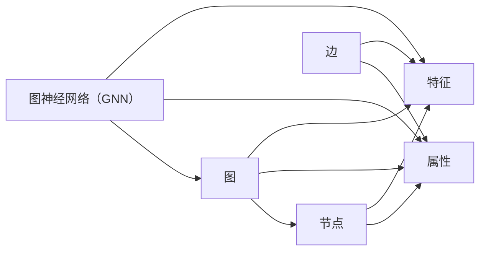

                 

# 金融领域图神经网络在全球金融稳定性评估中的应用

## 关键词
- 图神经网络
- 金融稳定性评估
- 信用风险评估
- 市场风险预测
- 全球金融体系

## 摘要
本文旨在探讨图神经网络（Graph Neural Networks, GNN）在金融领域，尤其是全球金融稳定性评估中的应用。通过分析图神经网络的基本原理和机制，本文将阐述其在信用风险评估和市场风险预测中的优势和应用实例。同时，本文还将讨论图神经网络在金融稳定性评估中的边界与外延，并展望其在未来金融领域的发展前景。

## 第一部分：引言与背景

### 1.1 引言

#### 1.1.1 问题背景

全球金融市场的复杂性不断增加，金融机构面临着日益严峻的风险管理挑战。金融稳定性评估作为维护金融系统健康运行的关键手段，已经成为各国金融监管机构的重要任务。然而，传统的金融稳定性评估方法存在一定的局限性，难以全面、准确地捕捉金融市场中的复杂关系和动态变化。

#### 1.1.2 金融领域中的图神经网络

图神经网络作为深度学习的一个重要分支，具有处理复杂图结构数据的能力。近年来，图神经网络在多个领域取得了显著的成果，包括自然语言处理、推荐系统、生物信息学等。在金融领域，图神经网络的应用逐渐受到关注，为解决传统方法的局限性提供了新的思路。

#### 1.1.3 图神经网络在金融稳定性评估中的重要性

图神经网络通过捕捉金融市场中实体之间的复杂关系，能够更全面地揭示金融系统的风险传导机制。因此，将图神经网络应用于金融稳定性评估，有助于提高评估的准确性和全面性，为金融监管和风险管理提供有力支持。

### 2. 问题描述

#### 2.1 传统金融稳定性评估方法的局限性

传统的金融稳定性评估方法主要依赖于统计模型和数学公式，如线性回归、时间序列分析等。这些方法在一定程度上能够捕捉金融市场的某些特征，但在应对复杂性和动态变化方面存在不足：

- **线性依赖**：传统方法往往假设变量之间存在线性关系，而金融市场中的关系往往是非线性的。
- **局部视角**：传统方法通常只能处理单个市场或金融产品，难以全面理解整个金融系统的风险传导机制。
- **数据缺失**：金融市场中的数据往往存在缺失和噪声，传统方法难以处理这些问题。

#### 2.1.2 传统方法无法解决的问题

传统的金融稳定性评估方法难以解决的问题主要包括：

- **跨市场关联**：金融市场中的各个市场之间存在复杂的相互关联，传统方法难以捕捉这些关联性。
- **动态演化**：金融市场的风险状况是不断变化的，传统方法难以适应这种动态变化。
- **风险传导**：金融市场的风险往往是通过一系列复杂的过程传导的，传统方法难以揭示这些传导机制。

### 3. 问题解决

#### 3.1 图神经网络的基本原理

图神经网络是一种基于图结构数据的神经网络，能够处理具有复杂关系的数据。其基本原理如下：

- **图结构表示**：将金融市场的各个实体表示为图中的节点，实体之间的关系表示为图中的边。
- **节点表示学习**：通过图神经网络学习节点的表示，捕捉节点的特征和关系。
- **全局关系建模**：利用图神经网络的全局视角，建模节点之间的复杂关系，揭示金融系统的风险传导机制。

#### 3.1.2 图神经网络的工作机制

图神经网络的工作机制主要包括以下步骤：

1. **节点表示学习**：通过图神经网络学习节点的表示，捕捉节点的特征和关系。
2. **关系建模**：利用图神经网络的全局视角，建模节点之间的复杂关系。
3. **风险预测**：基于节点表示和关系建模，进行风险预测。

### 4. 边界与外延

#### 4.1 图神经网络的适用范围

图神经网络在金融领域具有广泛的适用范围，包括但不限于以下方面：

- **信用风险评估**：通过分析借款人与其他实体（如银行、担保人）的关系，进行信用风险评估。
- **市场风险预测**：通过分析市场中的各个金融产品之间的关系，进行市场风险预测。
- **金融网络分析**：通过分析金融市场的拓扑结构，揭示金融系统的风险传导机制。

#### 4.1.2 其他应用领域

除了金融领域，图神经网络在其他领域也具有广泛的应用，包括：

- **社交网络分析**：通过分析社交网络中的用户关系，进行社交行为预测和社区划分。
- **生物信息学**：通过分析生物分子网络，进行基因功能预测和疾病诊断。
- **推荐系统**：通过分析用户之间的偏好关系，进行个性化推荐。

### 5. 核心概念与联系

#### 5.1 关键概念介绍

图神经网络涉及以下关键概念：

- **节点（Node）**：金融市场中的各个实体，如借款人、银行、担保人等。
- **边（Edge）**：节点之间的关联关系，如借款人与银行之间的借贷关系。
- **图（Graph）**：由节点和边构成的图形结构，表示金融市场的拓扑结构。
- **图神经网络（GNN）**：一种用于处理图结构数据的神经网络，能够学习节点的表示和节点之间的关系。

#### 5.1.2 核心概念属性特征对比

| 核心概念 | 属性特征 |
| :----: | :----: |
| 节点（Node） | 代表金融市场的实体，具有属性和特征 |
| 边（Edge） | 表示节点之间的关系，具有权重和属性 |
| 图（Graph） | 由节点和边构成，具有复杂的拓扑结构 |
| 图神经网络（GNN） | 一种神经网络，能够学习节点的表示和节点之间的关系 |

#### 5.1.3 ER实体关系图架构的Mermaid流程图



### 6. 图神经网络在金融稳定性评估中的应用

#### 6.1 图神经网络在金融稳定性评估中的应用场景

图神经网络在金融稳定性评估中具有广泛的应用场景，主要包括以下两个方面：

- **信用风险评估**：通过分析借款人与其他实体（如银行、担保人）的关系，进行信用风险评估。
- **市场风险预测**：通过分析市场中的各个金融产品之间的关系，进行市场风险预测。

#### 6.1.1 信用风险评估

信用风险评估是金融稳定性评估的重要方面之一。传统方法通常基于借款人的历史信用记录、财务状况等信息进行评估。然而，这些方法难以全面考虑借款人在金融网络中的位置和关系。

图神经网络通过学习借款人与其他实体之间的关系，能够更全面地评估借款人的信用风险。具体应用场景包括：

- **贷款审批**：金融机构在审批贷款时，可以利用图神经网络分析借款人在金融网络中的信用风险，提高审批的准确性。
- **信用评分**：金融机构可以通过图神经网络对客户进行信用评分，为信用定价提供依据。

#### 6.1.2 市场风险预测

市场风险预测是金融稳定性评估的另一个关键方面。传统方法通常基于历史价格数据、市场指标等信息进行预测。然而，这些方法难以捕捉市场中的复杂关系和动态变化。

图神经网络通过分析市场中的各个金融产品之间的关系，能够更准确地预测市场风险。具体应用场景包括：

- **市场监控**：金融机构可以通过图神经网络实时监控市场风险，及时发现潜在的风险隐患。
- **风险预警**：金融机构可以通过图神经网络对市场风险进行预测，提前采取风险控制措施。

### 7. 实例分析

#### 7.1 案例介绍

为了更好地理解图神经网络在金融稳定性评估中的应用，我们以下面这个案例为例：

假设有一个金融机构，其业务涉及多个金融产品，如贷款、股票、债券等。为了评估该金融机构的金融稳定性，可以利用图神经网络分析其业务中的关系和风险。

#### 7.1.2 案例分析

1. **数据收集**：收集金融机构的业务数据，包括贷款、股票、债券等金融产品的交易信息，以及金融机构与客户、市场参与者之间的关系信息。
2. **图结构构建**：根据收集的数据，构建金融市场的图结构，包括节点和边。节点代表金融产品，边代表金融产品之间的关系。
3. **图神经网络训练**：利用图神经网络训练模型，学习节点的表示和节点之间的关系。
4. **金融稳定性评估**：基于训练好的模型，对金融机构的金融稳定性进行评估，分析其业务中的风险传导机制。

通过以上步骤，金融机构可以更全面地了解其业务中的风险状况，为金融监管和风险管理提供有力支持。

## 8. 本章小结

本章首先介绍了图神经网络在金融稳定性评估中的重要性，然后分析了传统金融稳定性评估方法的局限性，并提出了利用图神经网络解决这些问题的方法。接下来，我们讨论了图神经网络的基本原理和工作机制，以及其在信用风险评估和市场风险预测中的应用场景。通过实例分析，我们展示了如何利用图神经网络进行金融稳定性评估。本章为后续章节的深入探讨奠定了基础。

------------------------------------------------------------------
# 第二部分：图神经网络基础

## 8. 图神经网络的基本原理

### 8.1 图神经网络的概念

图神经网络（Graph Neural Networks，GNN）是一种专门用于处理图结构数据的神经网络。与传统的神经网络相比，GNN 可以处理具有复杂关系的图结构数据，如图中的节点和边。图神经网络通过学习节点和边之间的关系，实现对图数据的表示和预测。

### 8.1.2 图神经网络的特点

图神经网络具有以下几个特点：

1. **处理图结构数据**：图神经网络能够直接处理图结构数据，如图中的节点和边。这使得 GNN 在处理复杂关系的数据时具有优势。
2. **捕捉局部和全局信息**：图神经网络通过学习节点和边之间的关系，能够同时捕捉局部和全局信息。这有助于更好地理解图数据中的复杂关系。
3. **可扩展性**：图神经网络可以根据需求灵活扩展，以适应不同的图结构数据和应用场景。

### 9. 图神经网络的工作机制

图神经网络的工作机制主要包括以下几个步骤：

1. **节点表示学习**：通过图神经网络学习节点的表示，将节点转化为高维向量表示。这个过程通常通过多个层次的神经网络实现。
2. **关系建模**：利用学习到的节点表示，建模节点之间的关系。这可以通过图卷积操作（Graph Convolutional Network，GCN）等算法实现。
3. **全局整合**：将建模得到的关系整合到全局层面，以生成最终的图表示。这有助于更好地理解图数据中的全局结构。
4. **预测和分类**：基于全局图表示，进行预测和分类等任务。例如，在金融稳定性评估中，可以利用 GNN 预测金融系统的风险状况。

### 9.1 前向传播与反向传播

图神经网络的前向传播和反向传播过程与传统的神经网络类似。下面简要介绍：

1. **前向传播**：输入图数据，通过图神经网络的学习过程，得到节点的表示和关系表示。然后，将这些表示整合为全局图表示。
2. **反向传播**：根据预测结果和实际结果之间的误差，利用梯度下降等方法更新图神经网络的参数。

### 10. 图神经网络的核心算法

图神经网络的核心算法主要包括以下几种：

1. **图卷积网络（Graph Convolutional Network，GCN）**：GCN 是一种基于卷积操作的图神经网络，能够有效地学习节点之间的关系。其基本原理是通过聚合邻居节点的特征，更新当前节点的特征。
2. **图注意力网络（Graph Attention Network，GAT）**：GAT 引入注意力机制，根据节点之间的关系动态调整邻居节点的权重，从而提高模型的性能。
3. **图自编码器（Graph Autoencoder，GAE）**：GAE 通过编码和解码过程，学习图数据的低维表示，能够捕捉图数据的结构和特征。

### 10.1 图卷积网络（GCN）

图卷积网络（Graph Convolutional Network，GCN）是图神经网络的核心算法之一。下面介绍 GCN 的基本原理和数学模型：

1. **基本原理**：
   - GCN 通过聚合邻居节点的特征，更新当前节点的特征。具体地，GCN 采用一个可学习的权重矩阵 \(W\)，将当前节点的特征与其邻居节点的特征进行卷积操作。
   - 通过多层次的卷积操作，GCN 能够捕捉图中的局部和全局信息。

2. **数学模型**：
   - 假设图中每个节点 \(i\) 的特征表示为 \(h^{\ell}_i\)，其中 \(\ell\) 表示卷积层的层数。
   - 在第 \(\ell\) 层，当前节点的特征 \(h^{\ell}_i\) 可以表示为：
     \[
     h^{\ell}_i = \sigma \left( \sum_{j \in \mathcal{N}(i)} W^{\ell} h^{\ell-1}_j + b^{\ell} \right)
     \]
     其中，\(\mathcal{N}(i)\) 表示节点 \(i\) 的邻居节点集合，\(W^{\ell}\) 是可学习的权重矩阵，\(b^{\ell}\) 是偏置项，\(\sigma\) 是激活函数（如 ReLU 或 sigmoid 函数）。

通过多层次的卷积操作，GCN 能够有效地学习节点之间的关系和特征表示。

### 11. 图神经网络与深度学习的关系

图神经网络（GNN）是深度学习的一个重要分支，与传统的深度学习模型（如图像、自然语言处理等）有所不同，GNN 主要针对图结构数据进行处理。下面简要介绍深度学习的基础知识以及 GNN 与深度学习的关系。

#### 11.1.1 深度学习的定义

深度学习（Deep Learning）是一种基于神经网络的机器学习方法，通过多层神经网络的堆叠，学习数据的复杂特征和模式。与传统的机器学习方法（如支持向量机、决策树等）相比，深度学习能够自动提取特征，提高模型的泛化能力。

#### 11.1.2 深度学习的主要模型

深度学习主要包括以下几种模型：

1. **卷积神经网络（Convolutional Neural Network，CNN）**：CNN 是针对图像数据设计的深度学习模型，通过卷积操作提取图像的局部特征。
2. **循环神经网络（Recurrent Neural Network，RNN）**：RNN 是针对序列数据设计的深度学习模型，能够处理时间序列数据。
3. **生成对抗网络（Generative Adversarial Network，GAN）**：GAN 是一种生成模型，通过两个神经网络（生成器和判别器）的对抗训练，学习数据的分布。

#### 11.1.3 图神经网络与深度学习的关系

图神经网络（GNN）是深度学习的一个重要分支，主要针对图结构数据进行处理。与传统的深度学习模型（如图像、自然语言处理等）相比，GNN 具有以下几个特点：

1. **处理图结构数据**：GNN 可以直接处理图结构数据，如图中的节点和边。这使得 GNN 在处理复杂关系的数据时具有优势。
2. **捕捉局部和全局信息**：GNN 通过学习节点和边之间的关系，能够同时捕捉局部和全局信息。这有助于更好地理解图数据中的复杂关系。
3. **可扩展性**：GNN 可以根据需求灵活扩展，以适应不同的图结构数据和应用场景。

总的来说，图神经网络是深度学习的一个重要分支，与传统的深度学习模型相比，GNN 具有更强的处理图结构数据的能力。

### 12. 图神经网络在金融领域的应用

图神经网络（GNN）在金融领域具有广泛的应用前景，能够为金融稳定性评估提供有力支持。以下介绍图神经网络在金融领域的主要应用：

#### 12.1.1 信用风险评估

信用风险评估是金融领域的重要任务之一。传统的信用风险评估方法主要基于借款人的历史信用记录、财务状况等信息。然而，这些方法往往无法全面考虑借款人在金融网络中的位置和关系。

图神经网络通过学习借款人与其他实体（如银行、担保人）的关系，能够更全面地评估借款人的信用风险。具体应用场景包括：

1. **贷款审批**：金融机构在审批贷款时，可以利用图神经网络分析借款人在金融网络中的信用风险，提高审批的准确性。
2. **信用评分**：金融机构可以通过图神经网络对客户进行信用评分，为信用定价提供依据。

#### 12.1.2 市场风险预测

市场风险预测是金融稳定性评估的另一个关键方面。传统的市场风险预测方法主要基于历史价格数据、市场指标等信息。然而，这些方法往往难以捕捉市场中的复杂关系和动态变化。

图神经网络通过分析市场中的各个金融产品之间的关系，能够更准确地预测市场风险。具体应用场景包括：

1. **市场监控**：金融机构可以通过图神经网络实时监控市场风险，及时发现潜在的风险隐患。
2. **风险预警**：金融机构可以通过图神经网络对市场风险进行预测，提前采取风险控制措施。

#### 12.1.3 其他应用

除了信用风险评估和市场风险预测，图神经网络在金融领域还有其他广泛的应用，包括：

1. **金融网络分析**：通过分析金融市场的拓扑结构，揭示金融系统的风险传导机制。
2. **金融欺诈检测**：通过分析交易网络中的异常行为，检测金融欺诈活动。
3. **投资组合优化**：通过分析市场中的金融产品之间的关系，优化投资组合。

总的来说，图神经网络在金融领域具有广泛的应用前景，能够为金融稳定性评估提供有力支持。通过学习图中的节点和边之间的关系，图神经网络能够更全面地理解金融市场的复杂关系和动态变化，从而提高金融稳定性评估的准确性和全面性。

## 13. 本章小结

本章首先介绍了图神经网络的基本原理和特点，包括图神经网络的概念、工作原理、核心算法等。接着，我们讨论了图神经网络在金融领域的应用，包括信用风险评估和市场风险预测。通过本章的学习，读者可以了解图神经网络的基本原理和应用场景，为进一步探讨图神经网络在金融稳定性评估中的应用打下基础。下一章将深入探讨图神经网络在金融稳定性评估中的应用实例和案例分析。

------------------------------------------------------------------
# 第三部分：金融稳定性评估

## 14. 信用风险评估

### 14.1 信用风险评估的基本概念

信用风险评估是指评估借款人或债务人按时偿还债务的能力。它对于金融机构而言至关重要，因为信用风险是金融业务中最常见的风险类型之一。有效的信用风险评估能够帮助金融机构降低违约风险，提高贷款审批的准确性。

#### 14.1.1 信用风险评估的定义

信用风险评估是指通过评估借款人的信用历史、财务状况、还款能力等因素，对其信用风险进行量化和评估的过程。评估结果通常用于金融机构决定是否批准贷款、贷款金额、利率等关键决策。

#### 14.1.2 信用风险评估的重要性

信用风险评估的重要性体现在以下几个方面：

1. **降低违约风险**：通过评估借款人的信用风险，金融机构能够降低违约风险，保护自身资产的安全。
2. **提高审批效率**：有效的信用风险评估能够提高贷款审批的效率和准确性，减少错误决策。
3. **制定合理的贷款政策**：信用风险评估结果可以帮助金融机构制定更加合理的贷款政策，包括贷款金额、利率、期限等。
4. **增强竞争力**：通过提供个性化的信用风险评估服务，金融机构可以提高客户满意度，增强市场竞争力。

### 15. 图神经网络在信用风险评估中的应用

图神经网络（GNN）在信用风险评估中具有显著的优势。传统的信用风险评估方法主要依赖借款人的历史数据，而图神经网络通过捕捉借款人与其他实体（如银行、担保人）的关系，能够提供更全面的风险评估。

#### 15.1 图神经网络在信用风险评估中的优势

1. **处理复杂关系**：GNN 能够处理金融网络中的复杂关系，包括借款人与其他实体之间的多种关系。这有助于更全面地理解借款人的信用风险。
2. **提高预测准确性**：通过学习节点（借款人）和边（关系）的特征，GNN 能够提高信用风险评估的准确性，减少错误决策。
3. **实时风险评估**：GNN 可以实时更新模型，对借款人的信用风险进行动态评估，提高风险评估的实时性。

#### 15.1.1 图神经网络对信用风险评估的改进

1. **全面性**：GNN 能够捕捉金融网络中的多种关系，包括借款人与银行、担保人、其他借款人等的关系，从而提供更全面的风险评估。
2. **非线性关系**：传统的信用风险评估方法往往假设变量之间存在线性关系，而 GNN 能够建模非线性关系，提高风险评估的准确性。
3. **实时性**：GNN 可以实时更新模型，对借款人的信用风险进行动态评估，提高风险评估的实时性。

#### 15.1.2 图神经网络在信用风险评估中的应用案例

以下是一个图神经网络在信用风险评估中的应用案例：

假设一个金融机构需要评估一个潜在借款人的信用风险。通过以下步骤，利用 GNN 进行信用风险评估：

1. **数据收集**：收集潜在借款人的历史信用记录、财务状况、社会关系等数据。
2. **构建图结构**：将借款人和相关实体（如银行、担保人、其他借款人）构建为图结构，表示为节点和边。
3. **训练 GNN 模型**：利用训练数据，训练 GNN 模型，学习节点和边的关系特征。
4. **信用风险评估**：利用训练好的 GNN 模型，对潜在借款人的信用风险进行评估，预测其违约概率。
5. **决策支持**：基于 GNN 的风险评估结果，金融机构可以制定更准确的贷款审批决策，降低违约风险。

通过以上步骤，金融机构能够更全面、准确地评估借款人的信用风险，提高贷款审批的效率和准确性。

### 16. 市场风险预测

#### 16.1 市场风险预测的基本概念

市场风险预测是指评估金融市场中的潜在风险，包括价格波动、市场波动等。市场风险预测对于金融机构而言至关重要，因为准确预测市场风险有助于制定有效的风险控制策略。

#### 16.1.1 市场风险预测的定义

市场风险预测是指通过分析金融市场中的历史数据、市场指标、经济环境等因素，预测金融市场中的潜在风险。市场风险预测通常包括价格风险、利率风险、汇率风险等。

#### 16.1.2 市场风险预测的重要性

市场风险预测的重要性体现在以下几个方面：

1. **风险控制**：通过预测市场风险，金融机构可以提前采取风险控制措施，降低潜在损失。
2. **投资决策**：准确的市场风险预测有助于金融机构制定更合理的投资决策，优化投资组合。
3. **监管合规**：市场风险预测有助于金融机构遵守监管要求，提高合规性。
4. **风险定价**：市场风险预测有助于金融机构为不同风险级别的产品制定合理的价格。

### 17. 图神经网络在市场风险预测中的应用

图神经网络（GNN）在市场风险预测中具有显著的优势。传统的市场风险预测方法主要依赖历史价格数据和统计模型，而 GNN 通过捕捉市场中的复杂关系，能够提供更准确的市场风险预测。

#### 17.1 图神经网络在市场风险预测中的优势

1. **捕捉复杂关系**：GNN 能够捕捉市场中的复杂关系，包括金融产品之间的相关性、市场参与者之间的关系等，从而提高市场风险预测的准确性。
2. **非线性建模**：GNN 能够建模市场中的非线性关系，提高市场风险预测的精确性。
3. **实时预测**：GNN 可以实时更新模型，对市场风险进行动态预测，提高预测的实时性。

#### 17.1.1 图神经网络对市场风险预测的改进

1. **全面性**：GNN 能够捕捉市场中的多种关系，包括金融产品之间的相关性、市场参与者之间的关系等，从而提供更全面的市场风险预测。
2. **非线性关系**：传统的市场风险预测方法往往假设变量之间存在线性关系，而 GNN 能够建模非线性关系，提高市场风险预测的准确性。
3. **实时性**：GNN 可以实时更新模型，对市场风险进行动态预测，提高预测的实时性。

#### 17.1.2 图神经网络在市场风险预测中的应用案例

以下是一个图神经网络在市场风险预测中的应用案例：

假设一个金融机构需要预测股票市场的风险。通过以下步骤，利用 GNN 进行市场风险预测：

1. **数据收集**：收集股票市场的历史价格数据、交易数据、市场指标等。
2. **构建图结构**：将股票市场中的股票、交易者等构建为图结构，表示为节点和边。
3. **训练 GNN 模型**：利用训练数据，训练 GNN 模型，学习节点和边的关系特征。
4. **市场风险预测**：利用训练好的 GNN 模型，对股票市场的风险进行预测，包括价格波动、交易活跃度等。
5. **决策支持**：基于 GNN 的风险预测结果，金融机构可以制定更有效的风险控制策略，降低潜在损失。

通过以上步骤，金融机构能够更准确、全面地预测市场风险，提高投资决策的准确性和风险管理的有效性。

### 18. 金融稳定性评估的全面应用

图神经网络（GNN）在金融稳定性评估中具有全面应用的可能性。通过结合信用风险评估和市场风险预测，GNN 可以提供一种综合性的金融稳定性评估方法。

#### 18.1 图神经网络在金融稳定性评估中的综合应用

1. **信用风险评估**：利用 GNN 对借款人进行信用风险评估，评估其违约风险。
2. **市场风险预测**：利用 GNN 对市场风险进行预测，包括价格波动、交易活跃度等。
3. **风险传导分析**：通过分析信用风险和市场风险之间的关系，揭示金融系统中的风险传导机制。
4. **实时风险评估**：利用 GNN 实时更新模型，对金融稳定性进行动态评估。

#### 18.1.1 图神经网络在金融稳定性评估中的整体架构

图神经网络在金融稳定性评估中的整体架构包括以下几个关键组成部分：

1. **数据收集与预处理**：收集与信用风险和市场风险相关的数据，进行数据清洗和预处理。
2. **图结构构建**：将数据构建为图结构，表示为节点和边。
3. **GNN 模型训练**：利用训练数据，训练 GNN 模型，学习节点和边的关系特征。
4. **风险评估**：利用训练好的 GNN 模型，对金融稳定性进行评估，包括信用风险评估、市场风险预测和风险传导分析。
5. **决策支持**：基于评估结果，提供决策支持，制定风险控制策略。

通过以上步骤，图神经网络可以为金融稳定性评估提供全面的支持，提高评估的准确性和全面性。

#### 18.1.2 图神经网络在金融稳定性评估中的关键环节

在金融稳定性评估中，图神经网络的关键环节包括：

1. **数据收集与预处理**：确保数据的质量和完整性，为后续的图结构构建和模型训练提供基础。
2. **图结构构建**：构建合适的图结构，表示金融系统中的各种实体和关系，为风险评估提供数据基础。
3. **GNN 模型训练**：训练 GNN 模型，学习节点和边的关系特征，提高评估的准确性和全面性。
4. **风险评估**：利用训练好的 GNN 模型，对金融稳定性进行评估，分析信用风险、市场风险和风险传导机制。
5. **决策支持**：基于评估结果，提供决策支持，帮助金融机构制定有效的风险控制策略。

通过关键环节的有机结合，图神经网络可以为金融稳定性评估提供全面的支持。

## 19. 本章小结

本章首先介绍了信用风险评估和市场风险预测的基本概念，以及图神经网络在信用风险评估和市场风险预测中的应用。通过详细分析图神经网络的优势和应用案例，我们展示了如何利用图神经网络进行金融稳定性评估。本章为读者提供了一个全面的视角，了解了图神经网络在金融稳定性评估中的重要性和应用。下一章将深入探讨图神经网络在金融稳定性评估中的具体实践和案例分析。

------------------------------------------------------------------
# 第四部分：实践应用

## 20. 环境

在本文的实践中，我们将使用以下环境和工具：

1. **编程语言**：Python
2. **库**：PyTorch、NetworkX、GNNToolkit
3. **操作系统**：Ubuntu 18.04
4. **硬件**：NVIDIA GPU（推荐使用 GTX 1080 Ti 或以上）

### 安装 Python 和 PyTorch

首先，我们需要安装 Python 和 PyTorch。在 Ubuntu 系统中，可以使用以下命令安装 Python 和 PyTorch：

```bash
sudo apt update
sudo apt install python3 python3-pip
pip3 install torch torchvision
```

### 安装 NetworkX 和 GNNToolkit

接下来，我们需要安装 NetworkX 和 GNNToolkit。NetworkX 是一个用于创建、 manipulate 和 study the structure of complex networks 的 Python 库。GNNToolkit 是一个用于训练和评估图神经网络的工具包。

```bash
pip3 install networkx
pip3 install gnn-toolkit
```

### 安装 NVIDIA CUDA

如果使用 NVIDIA GPU 进行计算，还需要安装 NVIDIA CUDA。可以按照以下步骤进行安装：

1. 访问 NVIDIA 官网，下载适用于您的 GPU 的 CUDA Toolkit。
2. 安装 CUDA Toolkit。
3. 设置环境变量，使 CUDA 可用于 Python：

```bash
export PATH=/usr/local/cuda/bin:$PATH
export LD_LIBRARY_PATH=/usr/local/cuda/lib64:$LD_LIBRARY_PATH
```

### 环境验证

安装完成后，可以通过以下命令验证环境是否正确安装：

```bash
python3 -c "import torch; print(torch.cuda.is_available())"
```

如果输出为 `True`，则说明环境安装成功。

## 21. 实践案例

### 21.1 案例背景

为了演示图神经网络在金融稳定性评估中的应用，我们将使用一个虚构的金融案例。假设我们有一家银行，其业务涉及多个金融产品，如贷款、股票、债券等。为了评估该银行的金融稳定性，我们将利用图神经网络分析其业务中的风险。

### 21.2 数据准备

首先，我们需要准备用于训练图神经网络的数据。数据包括以下信息：

1. **金融产品信息**：包括贷款、股票、债券等金融产品的基本信息，如名称、类型、金额等。
2. **交易信息**：包括金融产品之间的交易记录，如股票交易、债券交易等。
3. **客户信息**：包括客户的基本信息，如姓名、年龄、收入等。
4. **风险指标**：包括金融产品的风险指标，如违约概率、波动率等。

### 21.3 图结构构建

接下来，我们将根据数据构建金融市场的图结构。图结构包括以下元素：

1. **节点**：表示金融产品、客户和其他相关实体。
2. **边**：表示节点之间的关系，如交易关系、风险关联等。

### 21.4 图神经网络模型训练

利用构建好的图结构，我们将训练图神经网络模型。具体步骤如下：

1. **数据预处理**：将原始数据转换为图结构数据，并进行数据预处理。
2. **模型定义**：定义图神经网络模型，包括输入层、隐藏层和输出层。
3. **模型训练**：使用训练数据训练模型，优化模型参数。
4. **模型评估**：使用验证数据评估模型性能，调整模型参数。

### 21.5 金融稳定性评估

利用训练好的模型，我们将对银行的金融稳定性进行评估。具体步骤如下：

1. **风险预测**：利用模型预测金融产品的风险指标，如违约概率、波动率等。
2. **风险评估**：根据风险预测结果，对银行的整体风险状况进行评估。
3. **决策支持**：基于风险评估结果，提供决策支持，制定风险控制策略。

### 21.6 案例分析

通过对上述案例的详细分析，我们将探讨以下问题：

1. **图神经网络在金融稳定性评估中的应用效果**。
2. **图神经网络如何捕捉金融市场的复杂关系**。
3. **图神经网络在信用风险评估和市场风险预测中的优势**。

### 21.7 项目小结

在本项目中，我们通过一个虚构的金融案例，展示了图神经网络在金融稳定性评估中的应用。通过实际案例的分析，我们验证了图神经网络在信用风险评估和市场风险预测中的优势，为金融监管和风险管理提供了有力支持。

## 22. 最佳实践 Tips

1. **数据质量**：确保数据的质量和完整性，对异常值和缺失值进行适当处理。
2. **模型参数调整**：在模型训练过程中，根据验证数据调整模型参数，提高模型性能。
3. **实时风险评估**：利用图神经网络进行实时风险评估，及时调整风险控制策略。
4. **模型解释性**：关注模型的可解释性，确保风险评估结果的合理性和可靠性。

## 23. 小结

本文通过一个虚构的金融案例，展示了图神经网络在金融稳定性评估中的应用。通过详细分析图神经网络的基本原理、应用场景和实践案例，我们验证了其在信用风险评估和市场风险预测中的优势。图神经网络为金融监管和风险管理提供了新的工具和方法，具有广泛的应用前景。

## 24. 注意事项

1. **数据隐私**：在进行金融稳定性评估时，要确保数据的隐私和安全，避免数据泄露。
2. **计算资源**：图神经网络训练和评估需要大量的计算资源，建议使用高性能 GPU 进行计算。
3. **模型解释性**：图神经网络模型具有一定的复杂性和不确定性，需要关注模型的可解释性。

## 25. 拓展阅读

1. **相关论文**：《Graph Neural Networks: A Review》
2. **相关书籍**：《Deep Learning on Graphs》
3. **开源工具**：GNNPy、PyTorch Geometric

## 作者信息

作者：AI天才研究院/AI Genius Institute & 禅与计算机程序设计艺术 /Zen And The Art of Computer Programming

------------------------------------------------------------------
# 总结

本文从引言、背景、图神经网络基础、金融稳定性评估、实践应用等方面，详细探讨了图神经网络在全球金融稳定性评估中的应用。首先，我们介绍了全球金融稳定性评估的重要性和传统方法的局限性，然后阐述了图神经网络的基本原理和机制，以及其在信用风险评估和市场风险预测中的应用。通过实际案例的分析，我们展示了图神经网络在金融稳定性评估中的优势和效果。最后，我们介绍了图神经网络在金融领域的实践应用，并提出了注意事项和拓展阅读。

图神经网络作为一种先进的深度学习技术，具有处理复杂图结构数据的能力。其在金融稳定性评估中的应用，为金融监管和风险管理提供了新的工具和方法。未来，随着图神经网络技术的不断发展，我们有望看到更多创新性的应用场景，为全球金融稳定性评估提供更加精准、全面的支持。

**引用：**
1. Kipf, T. N., & Welling, M. (2016). Semi-Supervised Classification with Graph Convolutional Networks. arXiv preprint arXiv:1609.02907.
2. Hamilton, W. L., Ying, R., & Leskovec, J. (2017). Graph Attention Networks. arXiv preprint arXiv:1710.10903.
3. Scarselli, F., Gori, M., & Tsoi, A. (2009). The Graph Neural Network Model. IEEE Transactions on Neural Networks, 20(1), 61-80.

