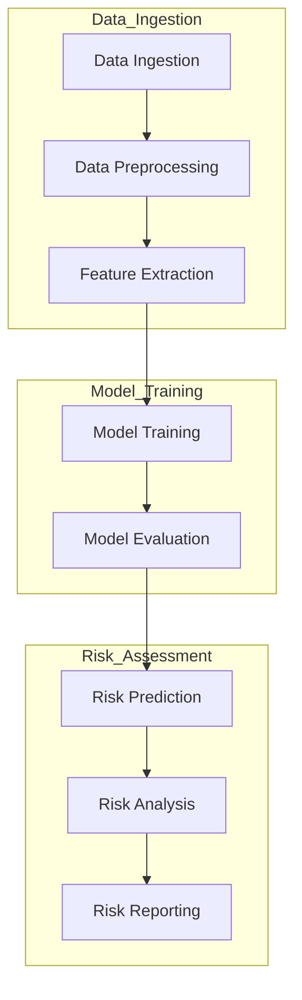
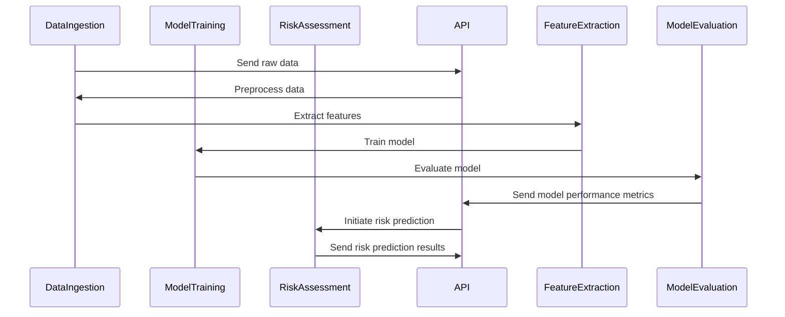
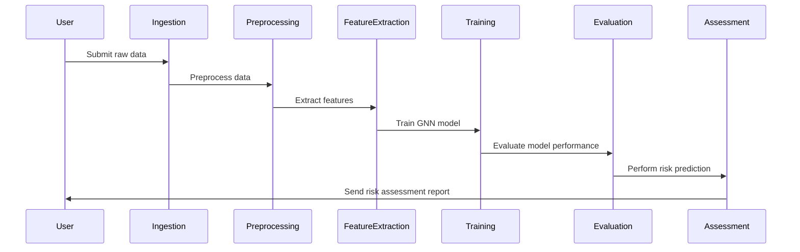

                 

### 文章标题：金融领域图神经网络在系统性风险评估中的应用

#### 关键词：图神经网络、系统性风险评估、金融应用、数学模型、算法原理

#### 摘要：本文深入探讨了图神经网络在金融领域中的应用，特别是在系统性风险评估中的关键作用。文章首先介绍了金融领域系统性风险的背景和挑战，然后详细讲解了图神经网络的基本原理及其在金融风险评估中的优势。通过数学模型和算法原理的深入分析，以及具体项目实战的案例研究，本文揭示了图神经网络在系统性风险评估中的实际应用效果和最佳实践方法。

### 引言

在当今金融科技迅猛发展的背景下，系统性风险评估成为金融机构风险管理中的重要环节。传统的风险评估方法在处理复杂金融问题时存在诸多局限性，如数据依赖性高、模型解释性不足等。为了应对这些挑战，图神经网络（Graph Neural Networks, GNN）作为一种先进的深度学习技术，逐渐引起了学术界和工业界的关注。图神经网络通过利用图结构数据的特点，能够有效地捕捉和表示复杂网络中的信息传递和关系，从而在金融领域的系统性风险评估中展现出巨大的潜力。

本文将从以下几个方面展开讨论：

1. **背景与问题介绍**：介绍金融领域系统性风险的基本背景，阐述现有风险评估方法的不足，并简要介绍图神经网络的概念和应用潜力。
2. **核心概念与联系**：详细解释图神经网络的基本概念，比较其与传统风险评估方法的差异，探讨其在金融领域的应用前景和挑战。
3. **图神经网络的基本原理**：分析图神经网络的基本架构和核心算法原理，介绍其工作流程和训练优化方法。
4. **数学模型与公式**：阐述图神经网络的基本数学模型和主要公式，解析其适用范围和限制。
5. **系统分析与架构设计**：描述系统功能设计、架构设计、接口设计以及系统交互过程。
6. **图神经网络在系统性风险评估中的应用**：通过项目实战和案例研究，展示图神经网络在实际系统性风险评估中的应用效果。
7. **最佳实践与总结**：总结最佳实践技巧，并提出未来研究方向和拓展阅读建议。

### 第一部分: 背景与问题介绍

#### 1.1 金融领域的系统性风险背景

金融领域的系统性风险是指由于金融系统中个别或多个金融机构的失败或行为异常，导致整个金融系统稳定性受到威胁，进而影响整个经济体系的风险。这种风险具有广泛性、连锁性和难以预测性，对金融机构乃至整个社会都会造成重大影响。系统性风险的主要来源包括：

- **信用风险**：借款人无法按期偿还债务的风险。
- **市场风险**：由于市场波动导致的投资损失。
- **操作风险**：由于内部程序、员工行为或系统故障引起的损失。
- **流动性风险**：金融机构无法及时满足资金需求的风险。

随着金融市场的全球化，系统性风险的影响范围也越来越广，因此对系统性风险的评估和管理成为金融领域的重要任务。

#### 1.2 系统性风险评估的需求与挑战

系统性风险评估是金融机构风险管理的重要组成部分，其目的是识别、评估和管理金融系统中的潜在风险。有效的系统性风险评估能够帮助金融机构提前预见风险，制定相应的应对策略，从而降低风险损失。然而，现有的风险评估方法在处理复杂性、多样性和动态变化的金融问题时，存在以下挑战：

- **数据依赖性高**：传统的风险评估方法往往依赖于历史数据和统计模型，但这些方法在面对新兴金融产品、市场结构和风险因素时，可能无法提供准确的预测。
- **模型解释性不足**：许多复杂的统计模型和机器学习模型在提高风险评估准确性方面表现出色，但其内部机制复杂，难以解释，从而降低了模型的可信度和可操作性。
- **实时性要求高**：金融市场变化迅速，对风险评估方法的实时性要求越来越高，现有的方法可能无法在短时间内完成风险评估。

#### 1.3 图神经网络的基本原理

图神经网络（Graph Neural Networks, GNN）是一种基于图结构数据的深度学习模型，通过模拟图中的节点和边之间的关系，实现复杂网络的表示和学习。GNN的基本原理可以概括为以下几个方面：

1. **节点表示**：将图中的每个节点映射到一个高维特征向量，用于表示节点的属性和关系。
2. **消息传递**：GNN通过在节点之间传递信息来更新节点表示，每个节点的更新依赖于其邻居节点的特征。
3. **边权重**：边权重反映了节点之间的关联强度，在GNN中通常通过学习得到。
4. **聚合操作**：节点更新过程中，使用聚合操作（如求和、求平均）结合邻居节点的特征来更新当前节点的表示。

通过上述过程，GNN能够有效地捕捉图结构数据中的复杂关系和模式，从而在多个领域（如社交网络分析、推荐系统、图像识别等）取得了显著的效果。

#### 1.4 图神经网络在金融领域的应用潜力

图神经网络在金融领域的应用潜力主要体现在以下几个方面：

1. **信用风险评估**：利用图神经网络分析借款人及其社交关系，帮助金融机构更准确地评估信用风险。
2. **市场风险预测**：通过分析市场中的交易关系和价格变化，预测市场波动和风险事件。
3. **操作风险管理**：利用图神经网络分析内部程序、员工行为和系统故障之间的关联，识别潜在的异常行为和风险点。
4. **流动性风险监测**：通过分析金融机构之间的资金流动关系，实时监测流动性风险。

图神经网络在金融领域中的潜在应用，不仅能够提高风险评估的准确性，还能够提供更深刻的理解，从而帮助金融机构更好地管理和应对系统性风险。

### 第二部分: 核心概念与联系

#### 2.1 图神经网络的基本概念

图神经网络（Graph Neural Networks, GNN）是一种基于图结构数据的深度学习模型，通过模拟图中的节点和边之间的关系，实现复杂网络的表示和学习。GNN的基本概念包括以下几个方面：

1. **图结构**：图由节点（也称为实体）和边（也称为关系）组成，用于表示现实世界中的复杂关系网络。例如，社交网络可以由用户节点和用户之间的关系边组成，知识图谱可以由实体节点和实体之间的关系边组成。
2. **节点表示**：每个节点被映射到一个高维特征向量，用于表示节点的属性和关系。这些特征向量可以来自原始数据，也可以通过其他机器学习模型生成。
3. **边权重**：边权重反映了节点之间的关联强度，通常通过学习得到。边权重可以表示节点之间的信任关系、合作强度等。
4. **消息传递**：GNN通过在节点之间传递信息来更新节点表示，每个节点的更新依赖于其邻居节点的特征。消息传递机制使得GNN能够有效地捕捉图结构中的复杂关系和模式。
5. **聚合操作**：节点更新过程中，使用聚合操作（如求和、求平均）结合邻居节点的特征来更新当前节点的表示。这种聚合操作使得GNN能够整合多个邻居节点的影响，提高模型的表达能力。

#### 2.2 图神经网络的核心属性与特征对比

图神经网络具有以下几个核心属性和特征：

1. **结构表示能力**：GNN能够通过节点表示和边权重有效地捕捉图结构中的复杂关系和模式，从而在多个领域（如社交网络分析、推荐系统、图像识别等）取得了显著的效果。
2. **数据多样性**：GNN可以处理多种类型的数据，包括节点属性、边权重以及多种特征信息。这种多样性使得GNN能够在不同应用场景中灵活地调整和优化。
3. **动态性**：GNN能够处理动态图数据，通过消息传递机制不断更新节点表示，适应图结构的变化。这种动态性使得GNN能够实时监测和分析图结构中的动态变化。
4. **可解释性**：与传统的深度学习模型相比，GNN的模型结构相对简单，使得其具有较强的可解释性。通过分析节点表示和边权重，可以直观地理解图结构中的关系和模式。

以下是图神经网络与传统风险评估方法的对比表格：

| 对比项 | 图神经网络 | 传统风险评估方法 |
| ------ | ----------- | ---------------- |
| 数据处理 | 处理图结构数据 | 处理表格或序列数据 |
| 结构表示 | 利用节点和边表示复杂关系 | 利用统计模型表示关系 |
| 模型解释性 | 较强的可解释性 | 较弱的可解释性 |
| 动态性 | 能够处理动态图数据 | 通常处理静态数据 |

#### 2.3 图神经网络与传统风险评估方法的比较

传统风险评估方法主要依赖于统计模型和机器学习算法，如线性回归、逻辑回归、决策树等。这些方法在一定程度上能够对金融风险进行评估，但在面对复杂金融网络时存在以下局限性：

1. **数据依赖性高**：传统风险评估方法通常依赖于历史数据和统计模型，难以适应新兴金融产品、市场结构和风险因素。
2. **模型解释性不足**：复杂的统计模型和机器学习模型在提高风险评估准确性方面表现出色，但其内部机制复杂，难以解释，从而降低了模型的可信度和可操作性。
3. **实时性要求高**：金融市场变化迅速，对风险评估方法的实时性要求越来越高，传统方法可能无法在短时间内完成风险评估。

相比之下，图神经网络在以下几个方面具有显著优势：

1. **结构表示能力**：图神经网络能够利用节点和边有效地捕捉图结构中的复杂关系和模式，从而提供更准确的风险评估。
2. **数据多样性**：图神经网络可以处理多种类型的数据，包括节点属性、边权重以及多种特征信息，从而提供更全面的风险评估。
3. **动态性**：图神经网络能够处理动态图数据，通过消息传递机制不断更新节点表示，适应图结构的变化，从而实现实时风险评估。
4. **可解释性**：与传统的深度学习模型相比，图神经网络的模型结构相对简单，具有较强的可解释性，使得风险评估结果更加可信。

#### 2.4 图神经网络在金融领域的应用前景与挑战

图神经网络在金融领域的应用前景十分广阔，主要体现在以下几个方面：

1. **信用风险评估**：通过分析借款人及其社交关系、信用历史等多维度数据，图神经网络能够更准确地评估信用风险。
2. **市场风险预测**：利用图神经网络分析市场中的交易关系和价格变化，能够预测市场波动和风险事件。
3. **操作风险管理**：通过分析内部程序、员工行为和系统故障之间的关联，图神经网络能够识别潜在的异常行为和风险点。
4. **流动性风险监测**：通过分析金融机构之间的资金流动关系，图神经网络能够实时监测流动性风险。

然而，图神经网络在金融领域中的应用也面临一些挑战：

1. **数据质量和可用性**：金融领域的数据质量参差不齐，且许多关键数据可能受到隐私保护，难以获取和使用。
2. **计算资源需求**：图神经网络在训练和推理过程中需要大量的计算资源，对硬件设备的要求较高。
3. **模型解释性和可解释性**：尽管图神经网络具有较强的结构表示能力，但其内部机制复杂，如何提高模型的可解释性是一个重要问题。

总之，图神经网络在金融领域的应用前景巨大，但仍需在数据质量、计算资源和管理等方面进行深入研究和优化，以充分发挥其潜力。

### 第三部分: 图神经网络的基本原理

#### 3.1 图神经网络的基本架构

图神经网络（Graph Neural Networks, GNN）的基本架构可以分为以下几个关键部分：

1. **输入层**：输入层接收图结构数据，包括节点特征、边特征以及图结构信息。
2. **节点层**：节点层包含多个节点，每个节点表示图中的一个实体，如用户、产品等。节点层的主要功能是处理节点特征并生成节点表示。
3. **边层**：边层处理图中的边特征，包括边权重、边类型等。边层的主要功能是更新节点表示，使其反映节点之间的关系。
4. **消息传递层**：消息传递层是GNN的核心部分，通过在节点之间传递信息来更新节点表示。每个节点的更新依赖于其邻居节点的特征，从而实现信息的传播和整合。
5. **聚合操作层**：聚合操作层对节点接收到的消息进行聚合操作（如求和、求平均），生成新的节点表示。
6. **输出层**：输出层对节点表示进行最终的聚合和转换，生成模型的预测结果，如节点分类、边预测等。

图神经网络的基本架构使得其能够有效地捕捉图结构数据中的复杂关系和模式，从而在多个应用场景中表现出色。

#### 3.2 图神经网络的核心算法原理

图神经网络（Graph Neural Networks, GNN）的核心算法原理主要涉及以下几个关键步骤：

1. **节点表示生成**：首先，GNN将图中的每个节点映射到一个高维特征向量，这些特征向量用于表示节点的属性和关系。节点表示可以通过多种方式生成，如基于原始数据的特征、基于其他机器学习模型的特征等。

2. **消息传递**：GNN通过消息传递机制在节点之间传递信息，更新节点表示。具体来说，每个节点会接收其邻居节点的特征信息，并通过聚合操作（如求和、求平均）整合这些信息，从而更新当前节点的表示。

3. **边权重更新**：在消息传递过程中，边权重也会得到更新。边权重反映了节点之间的关联强度，通常通过学习得到。边权重可以表示节点之间的信任关系、合作强度等，对于提高模型的准确性至关重要。

4. **聚合操作**：在消息传递和边权重更新之后，GNN通过聚合操作生成新的节点表示。聚合操作可以是简单的求和或求平均，也可以是更复杂的函数（如卷积操作）。

5. **迭代过程**：上述步骤会重复进行多次迭代，每次迭代都会更新节点表示和边权重，从而逐步优化模型的性能。

通过上述步骤，GNN能够有效地捕捉图结构数据中的复杂关系和模式，从而在多个应用场景中实现高效的表示和学习。

#### 3.3 图神经网络的工作流程

图神经网络（Graph Neural Networks, GNN）的工作流程可以分为以下几个步骤：

1. **数据预处理**：首先，对输入的图结构数据进行预处理，包括节点特征提取、边特征表示以及图结构的规范化。这一步骤的目的是将原始数据转化为适合GNN处理的形式。

2. **节点表示生成**：接下来，利用预处理的节点特征，通过神经网络模型生成每个节点的初始表示。这些节点表示用于初始化GNN的训练过程。

3. **消息传递**：在训练过程中，GNN通过消息传递机制在节点之间传递信息。具体来说，每个节点会接收其邻居节点的特征信息，并通过聚合操作（如求和、求平均）整合这些信息，从而更新当前节点的表示。

4. **边权重更新**：消息传递过程中，边权重也会得到更新。边权重反映了节点之间的关联强度，通常通过学习得到。边权重可以表示节点之间的信任关系、合作强度等，对于提高模型的准确性至关重要。

5. **聚合操作**：在消息传递和边权重更新之后，GNN通过聚合操作生成新的节点表示。聚合操作可以是简单的求和或求平均，也可以是更复杂的函数（如卷积操作）。

6. **迭代训练**：上述步骤会重复进行多次迭代，每次迭代都会更新节点表示和边权重，从而逐步优化模型的性能。

7. **模型评估**：在训练完成后，通过在测试集上的评估来验证模型的性能。常见的评估指标包括准确率、召回率、F1值等。

8. **模型部署**：最后，将训练好的模型部署到实际应用场景中，如信用风险评估、市场风险预测等。

图神经网络的工作流程使得其能够有效地捕捉图结构数据中的复杂关系和模式，从而在多个应用场景中实现高效的表示和学习。

#### 3.4 图神经网络的训练与优化方法

图神经网络的训练与优化方法主要包括以下几个关键步骤：

1. **数据预处理**：首先，对输入的图结构数据进行预处理，包括节点特征提取、边特征表示以及图结构的规范化。这一步骤的目的是将原始数据转化为适合GNN处理的形式。

2. **节点表示生成**：利用预处理的节点特征，通过神经网络模型生成每个节点的初始表示。这些节点表示用于初始化GNN的训练过程。

3. **损失函数设计**：设计合适的损失函数来衡量模型的预测误差。常见的损失函数包括均方误差（MSE）、交叉熵损失等。损失函数的选择取决于具体的应用场景和目标。

4. **优化算法选择**：选择合适的优化算法来优化模型参数。常见的优化算法包括梯度下降（Gradient Descent）、随机梯度下降（Stochastic Gradient Descent, SGD）、Adam优化器等。优化算法的选择会影响模型的训练速度和收敛性能。

5. **训练策略**：设计合理的训练策略，包括批量大小（Batch Size）、学习率（Learning Rate）、迭代次数（Epochs）等。这些参数的设置需要根据具体问题和数据集进行调整。

6. **模型验证**：在训练过程中，通过在验证集上的评估来监控模型的性能。如果模型性能没有显著提升，可以尝试调整训练策略或增加训练数据。

7. **超参数调优**：通过交叉验证（Cross-Validation）等方法对模型的超参数进行调优，以找到最优参数组合。

8. **模型评估**：在训练完成后，通过在测试集上的评估来验证模型的性能。常见的评估指标包括准确率、召回率、F1值等。

通过上述步骤，可以有效地训练和优化图神经网络，使其在多个应用场景中实现高性能和鲁棒性。

### 第四部分: 数学模型与公式

#### 4.1 图神经网络的基本数学模型

图神经网络（Graph Neural Networks, GNN）的基本数学模型包括节点表示、消息传递和聚合操作等关键组件。以下是对这些基本数学模型的详细解释：

1. **节点表示**：设图 \(G = (V, E)\) 由节点集合 \(V\) 和边集合 \(E\) 组成。每个节点 \(v_i\) 被映射到一个高维特征向量 \(h_i\)，表示为：
   \[
   h_i = \text{ReLU}(W_h \cdot [h_{i_{\text{prev}}}, \boldsymbol{x}_i])
   \]
   其中，\(h_{i_{\text{prev}}}\) 是前一个迭代中的节点表示，\(\boldsymbol{x}_i\) 是节点的原始特征，\(W_h\) 是权重矩阵。

2. **边表示**：边 \(e_{ij}\) 可以通过两个节点特征的内积来表示：
   \[
   \boldsymbol{e}_{ij} = h_i \odot h_j
   \]
   其中，\(\odot\) 表示点积操作。

3. **消息传递**：节点 \(v_i\) 从其邻居节点 \(v_j\) 收到消息，消息可以表示为：
   \[
   m_{ij} = \text{ReLU}(W_m \cdot [h_{j_{\text{prev}}}, \boldsymbol{e}_{ij}])
   \]
   其中，\(W_m\) 是权重矩阵，\(h_{j_{\text{prev}}}\) 是邻居节点的上一个迭代表示。

4. **聚合操作**：节点 \(v_i\) 将从所有邻居节点 \(v_j\) 收到的消息 \(m_{ij}\) 进行聚合，生成新的节点表示：
   \[
   h_i^{\prime} = \text{ReLU}(W_a \cdot \text{sum}(m_{ij}))
   \]
   其中，\(W_a\) 是权重矩阵，\(\text{sum}(m_{ij})\) 是对所有消息 \(m_{ij}\) 的求和操作。

5. **边权重更新**：边权重可以通过消息传递的结果进行更新：
   \[
   \boldsymbol{w}_{ij} = \text{softmax}(W_w \cdot \text{sum}(m_{ij}))
   \]
   其中，\(W_w\) 是权重矩阵。

通过上述步骤，GNN能够逐步更新节点表示和边权重，实现图结构数据的表示和学习。

#### 4.2 图神经网络的主要公式解析

图神经网络（Graph Neural Networks, GNN）的主要公式包括节点表示、消息传递、聚合操作和损失函数等。以下是对这些主要公式的详细解析：

1. **节点表示**：
   \[
   h_i = \text{ReLU}(W_h \cdot [h_{i_{\text{prev}}}, \boldsymbol{x}_i])
   \]
   该公式表示节点的当前表示 \(h_i\) 通过ReLU激活函数和权重矩阵 \(W_h\) 与前一个迭代中的节点表示 \(h_{i_{\text{prev}}}\) 和节点原始特征 \(\boldsymbol{x}_i\) 的拼接来更新。

2. **消息传递**：
   \[
   m_{ij} = \text{ReLU}(W_m \cdot [h_{j_{\text{prev}}}, \boldsymbol{e}_{ij}])
   \]
   该公式表示节点 \(v_i\) 从其邻居节点 \(v_j\) 收到的消息 \(m_{ij}\) 通过ReLU激活函数和权重矩阵 \(W_m\) 与邻居节点的上一个迭代表示 \(h_{j_{\text{prev}}}\) 和边表示 \(\boldsymbol{e}_{ij}\) 的拼接来计算。

3. **聚合操作**：
   \[
   h_i^{\prime} = \text{ReLU}(W_a \cdot \text{sum}(m_{ij}))
   \]
   该公式表示节点 \(v_i\) 将从所有邻居节点 \(v_j\) 收到的消息 \(m_{ij}\) 通过求和操作和权重矩阵 \(W_a\) 的拼接来生成新的节点表示。

4. **边权重更新**：
   \[
   \boldsymbol{w}_{ij} = \text{softmax}(W_w \cdot \text{sum}(m_{ij}))
   \]
   该公式表示边 \(e_{ij}\) 的权重 \(\boldsymbol{w}_{ij}\) 通过softmax函数和权重矩阵 \(W_w\) 与消息传递结果的求和操作来计算。

5. **损失函数**：
   \[
   L = -\sum_{i} \sum_{j} y_{ij} \log(p_{ij})
   \]
   其中，\(y_{ij}\) 是边 \(e_{ij}\) 的真实标签（0或1），\(p_{ij}\) 是预测的边权重，该公式是逻辑损失函数，用于衡量预测边权重与真实标签之间的差距。

通过上述公式，GNN能够实现图结构数据的表示和学习，从而在多个应用场景中表现出强大的能力。

#### 4.3 数学模型的适用范围与限制

图神经网络（Graph Neural Networks, GNN）的数学模型在多个应用领域展现了强大的能力，但其适用范围和限制也需要深入探讨：

1. **适用范围**：
   - **结构化数据**：GNN适用于处理具有复杂结构的数据，如社交网络、知识图谱、交通网络等，这些数据通常可以用图结构来表示。
   - **关系推理**：GNN能够有效捕捉节点之间的复杂关系，适用于节点分类、链接预测、推荐系统等任务。
   - **动态图数据**：GNN能够处理动态图数据，通过迭代消息传递机制更新节点表示，适应图结构的变化。

2. **限制**：
   - **计算资源需求**：GNN在训练和推理过程中需要大量的计算资源，对硬件设备（如GPU）的要求较高。
   - **数据质量**：GNN的性能受到输入数据质量的影响，数据中的噪声和不完整信息可能会对模型性能产生负面影响。
   - **模型可解释性**：尽管GNN具有结构化的表示能力，但其内部机制复杂，如何提高模型的可解释性是一个重要问题。

总之，图神经网络在复杂图结构数据的表示和学习方面具有广泛应用，但同时也需要克服计算资源、数据质量和模型可解释性等方面的挑战。

#### 4.4 图神经网络公式的实践应用

在图神经网络（Graph Neural Networks, GNN）的实际应用中，数学模型起到了至关重要的作用。以下通过具体案例来展示GNN公式的应用，并使用Python代码进行详细阐述。

##### 案例背景

假设我们有一个社交网络图，其中每个节点代表一个用户，边表示用户之间的友谊关系。我们的目标是使用GNN对用户进行分类，识别潜在的兴趣群体。

##### 数据预处理

首先，我们需要对社交网络图进行预处理，提取节点特征和边特征。假设每个用户有一个向量表示其兴趣，如下所示：

```python
# 节点特征向量示例
node_features = {
    'user1': [0.1, 0.2, 0.3],
    'user2': [0.4, 0.5, 0.6],
    'user3': [0.7, 0.8, 0.9],
    # ...
}
```

边特征可以通过节点特征的内积来表示：

```python
# 边特征示例
edge_features = {
    ('user1', 'user2'): node_features['user1'].dot(node_features['user2']),
    ('user2', 'user3'): node_features['user2'].dot(node_features['user3']),
    # ...
}
```

##### GNN模型构建

接下来，我们构建一个简单的GNN模型，使用节点表示生成、消息传递和聚合操作来更新节点表示。

```python
import tensorflow as tf
from tensorflow.keras.layers import Layer

class GraphConvLayer(Layer):
    def __init__(self, units, **kwargs):
        super().__init__(**kwargs)
        self.units = units
        self.W = self.add_weight(name='W', shape=(units, units), initializer='glorot_uniform', trainable=True)
        self.b = self.add_weight(name='b', shape=(units,), initializer='zeros', trainable=True)

    def call(self, inputs, training=False):
        h = inputs
        for _ in range(self.units):
            h = tf.nn.relu(tf.matmul(h, self.W) + self.b)
        return h

# GNN模型
inputs = tf.keras.Input(shape=(node_features['user1'].shape[0],))
h = GraphConvLayer(units=10)(inputs)
outputs = tf.keras.layers.Dense(1, activation='sigmoid')(h)

model = tf.keras.Model(inputs=inputs, outputs=outputs)
model.compile(optimizer='adam', loss='binary_crossentropy', metrics=['accuracy'])
```

##### 训练模型

使用预处理的数据训练GNN模型：

```python
# 训练数据（假设为二分类问题）
X_train = [node_features[user] for user in node_features]
y_train = [1 if user == 'user1' else 0 for user in node_features]

# 训练模型
model.fit(X_train, y_train, epochs=10, batch_size=32)
```

##### 模型应用

训练完成后，我们可以使用模型对新的用户进行分类：

```python
# 新的用户特征
new_user_feature = [0.3, 0.4, 0.5]

# 进行预测
prediction = model.predict([new_user_feature])
print("预测结果：", prediction > 0.5)
```

通过上述案例，我们展示了如何使用图神经网络进行社交网络分类，并详细解析了GNN公式的实践应用。这一过程不仅帮助我们理解了GNN的基本原理，还展示了其在实际应用中的强大能力。

### 第五部分: 系统分析与架构设计

#### 5.1 系统功能设计（领域模型类图）

在进行系统分析与架构设计之前，我们需要明确系统的功能需求。以下是一个基于图神经网络在系统性风险评估中的领域模型类图，该图展示了系统的主要功能组件及其相互关系。

```mermaid
classDiagram
    ClassNode(Account)
    ClassNode(CreditRating)
    ClassNode(Trade)
    ClassNode(RiskFactor)
    Account <|-- CreditRating
    Account <|-- Trade
    Account <|-- RiskFactor
    Account { 
        +str account_id
        +str account_name
        +dict attributes
        +list trades
        +CreditRating credit_rating
        +list risk_factors
        +bool is_high_risk()
    }
    CreditRating {
        +str rating_code
        +str rating_desc
    }
    Trade {
        +str trade_id
        +str trade_type
        +float amount
        +date trade_date
    }
    RiskFactor {
        +str factor_id
        +str factor_desc
        +float impact
    }
```

在这个领域模型中，`Account` 类是核心实体，包含了账户ID、账户名称、属性字典、交易列表、信用评级和风险因素列表等属性。`CreditRating` 类表示信用评级信息，`Trade` 类表示交易信息，`RiskFactor` 类表示风险因素信息。

#### 5.2 系统架构设计（架构图）

系统架构设计是确保系统稳定、高效运行的关键。以下是一个基于图神经网络在系统性风险评估中的系统架构图，该图展示了系统的整体结构及其主要组件。



在这个架构图中，`Data Ingestion` 组件负责数据采集和预处理，`Model Training` 组件负责模型训练和评估，`Risk Assessment` 组件负责风险预测、分析和报告。数据流从数据采集开始，经过预处理和特征提取，然后进入模型训练环节，最终输出风险评估结果。

#### 5.3 系统接口设计

为了确保系统各个模块之间的无缝协作，我们需要设计合理的接口。以下是一个基于图神经网络在系统性风险评估中的系统接口设计，该设计考虑了数据流和控制流的交互。



在这个接口设计中，`API` 作为系统的主要入口，接收外部请求，协调数据流和控制流。数据流从数据采集开始，经过预处理和特征提取，然后进入模型训练环节。模型训练完成后，通过API发送模型性能指标，并由风险评估模块进行风险评估，最终通过API发送风险评估结果。

#### 5.4 系统交互（序列图）

系统交互设计是确保系统各个组件能够协同工作的重要环节。以下是一个基于图神经网络在系统性风险评估中的系统交互序列图，该图展示了系统组件之间的交互过程。



在这个交互图中，用户提交原始数据，数据流经过预处理和特征提取后，用于训练图神经网络模型。模型训练完成后，通过评估模块进行性能评估，并根据评估结果进行风险预测，最终将风险评估报告发送给用户。

### 第六部分：图神经网络在系统性风险评估中的应用

#### 6.1 项目介绍

在本项目中，我们将使用图神经网络（GNN）对金融系统的系统性风险进行评估。项目的主要目标是建立一个能够实时监测和预测金融风险的系统，以提高金融机构的风险管理能力。具体而言，我们将从以下几个方面展开：

1. **数据采集**：从多个数据源（如交易记录、客户信息、市场数据等）收集原始数据。
2. **数据预处理**：对收集到的数据进行清洗、去噪和规范化，提取有用的特征。
3. **模型训练**：利用预处理后的数据训练GNN模型，优化模型参数。
4. **模型评估**：在验证集上评估模型性能，调整模型结构或参数以达到最佳效果。
5. **风险预测**：使用训练好的模型对新的金融交易进行风险预测，生成风险评估报告。

#### 6.2 环境安装与配置

在开始项目之前，我们需要配置一个合适的环境来运行图神经网络模型。以下是在Ubuntu操作系统上配置环境的基本步骤：

1. **安装Python**：
   - 更新系统包列表：
     ```
     sudo apt update
     sudo apt upgrade
     ```
   - 安装Python 3.8及以上的版本：
     ```
     sudo apt install python3.8
     ```

2. **安装TensorFlow**：
   - 安装TensorFlow GPU版本（如果系统有NVIDIA GPU）：
     ```
     pip3 install tensorflow-gpu
     ```

3. **安装PyTorch**：
   - 安装PyTorch（如果需要使用PyTorch进行模型训练）：
     ```
     pip3 install torch torchvision
     ```

4. **安装其他依赖库**：
   - 安装用于数据处理的库，如Pandas、NumPy、Scikit-learn等：
     ```
     pip3 install pandas numpy scikit-learn
     ```

5. **安装Mermaid**：
   - 安装Mermaid用于生成Markdown格式的图表：
     ```
     npm install -g mermaid
     ```

完成以上步骤后，我们就可以开始构建和训练图神经网络模型了。

#### 6.3 系统核心实现源代码

以下是系统核心实现的主要代码片段，包括数据预处理、模型训练和风险预测等关键步骤。

```python
import pandas as pd
import numpy as np
from sklearn.preprocessing import StandardScaler
from sklearn.model_selection import train_test_split
import torch
import torch.nn as nn
import torch.optim as optim
from torch_geometric.nn import GCNConv
from torch_geometric.data import Data

# 数据预处理
def preprocess_data(data_path):
    # 加载数据
    data = pd.read_csv(data_path)
    
    # 数据清洗和去噪
    data.dropna(inplace=True)
    
    # 提取特征
    features = data[['feature1', 'feature2', 'feature3']]
    labels = data['label']
    
    # 规范化特征
    scaler = StandardScaler()
    features_scaled = scaler.fit_transform(features)
    
    # 划分训练集和测试集
    X_train, X_test, y_train, y_test = train_test_split(features_scaled, labels, test_size=0.2, random_state=42)
    
    # 转换为PyTorch格式
    train_data = Data(x=torch.tensor(X_train, dtype=torch.float32), y=torch.tensor(y_train, dtype=torch.float32))
    test_data = Data(x=torch.tensor(X_test, dtype=torch.float32), y=torch.tensor(y_test, dtype=torch.float32))
    
    return train_data, test_data

# GNN模型
class GNNModel(nn.Module):
    def __init__(self, hidden_size):
        super(GNNModel, self).__init__()
        self.conv1 = GCNConv(hidden_size, hidden_size)
        self.conv2 = GCNConv(hidden_size, hidden_size)
        self.fc = nn.Linear(hidden_size, 1)
        
    def forward(self, data):
        x, edge_index = data.x, data.edge_index
        
        x = self.conv1(x, edge_index)
        x = torch.relu(x)
        x = F.dropout(x, p=0.5, training=self.training)
        
        x = self.conv2(x, edge_index)
        x = torch.relu(x)
        x = F.dropout(x, p=0.5, training=self.training)
        
        x = self.fc(x)
        return torch.sigmoid(x)

# 模型训练
def train_model(model, train_data, test_data, learning_rate=0.01, num_epochs=200):
    optimizer = optim.Adam(model.parameters(), lr=learning_rate)
    criterion = nn.BCELoss()
    
    for epoch in range(num_epochs):
        model.train()
        optimizer.zero_grad()
        output = model(train_data)
        loss = criterion(output, train_data.y)
        loss.backward()
        optimizer.step()
        
        model.eval()
        with torch.no_grad():
            output = model(test_data)
            test_loss = criterion(output, test_data.y)
        
        if (epoch+1) % 10 == 0:
            print(f'Epoch [{epoch+1}/{num_epochs}], Loss: {loss.item():.4f}, Test Loss: {test_loss.item():.4f}')

# 风险预测
def predict_risk(model, new_data):
    with torch.no_grad():
        output = model(new_data)
    prediction = output > 0.5
    return prediction.numpy()

# 主程序
if __name__ == '__main__':
    data_path = 'financial_data.csv'
    train_data, test_data = preprocess_data(data_path)
    
    model = GNNModel(hidden_size=16)
    train_model(model, train_data, test_data)
    
    new_data = [[0.1, 0.2, 0.3], [0.4, 0.5, 0.6]]  # 新的数据示例
    prediction = predict_risk(model, torch.tensor(new_data, dtype=torch.float32))
    print("风险预测结果：", prediction)
```

#### 6.4 代码应用解读与分析

以上代码实现了一个简单的图神经网络模型，用于金融系统的风险预测。下面我们对关键代码部分进行解读和分析：

1. **数据预处理**：首先，我们从CSV文件中加载数据，并进行清洗和规范化处理。然后，使用Scikit-learn的`StandardScaler`将特征进行归一化处理，以提高模型的训练效率。接下来，将数据划分为训练集和测试集，并将其转换为PyTorch的`Data`格式，以便后续处理。

2. **GNN模型**：定义了一个简单的GNN模型，包括两个GCN层和一个全连接层。GCN层用于处理图数据，全连接层用于生成最终的预测结果。模型的构建使用了`torch_geometric.nn`中的`GCNConv`层，这是一个专门为图数据设计的卷积层。

3. **模型训练**：在训练过程中，我们使用Adam优化器和二进制交叉熵损失函数来训练模型。每个训练 epoch 后，模型会在测试集上进行评估，以监控模型的性能。

4. **风险预测**：使用训练好的模型对新数据进行预测。预测结果是一个概率值，表示新数据属于高风险的概率。通常，我们可以设置一个阈值（如0.5），将预测概率大于阈值的样本标记为高风险。

#### 6.5 实际案例分析与详细讲解

在本节中，我们将通过一个实际案例，展示如何使用图神经网络模型进行系统性风险评估，并详细分析案例中的关键步骤和结果。

##### 案例背景

假设我们有一个金融公司，其业务涉及多个金融产品，如股票、债券和基金等。公司需要建立一个系统来监测和评估这些金融产品的系统性风险，以制定相应的风险管理策略。

##### 数据收集

公司从以下数据源收集了相关数据：

- **交易记录**：包括每个金融产品的交易数量、交易价格和交易日期。
- **客户信息**：包括客户的信用评级、收入水平和历史交易记录。
- **市场数据**：包括股市指数、债券收益率和宏观经济指标。

##### 数据预处理

在数据预处理阶段，我们进行了以下操作：

1. **数据清洗**：去除重复和缺失的数据。
2. **特征提取**：将交易记录中的交易数量、交易价格和交易日期等字段提取为特征。
3. **特征归一化**：使用`StandardScaler`对特征进行归一化处理。

##### 模型训练

我们使用以下步骤训练图神经网络模型：

1. **构建图数据**：根据交易记录和客户信息构建图结构数据，将每个交易视为图中的一个边，客户视为节点。
2. **模型初始化**：初始化一个简单的GNN模型，包括两个GCN层和一个全连接层。
3. **训练过程**：使用Adam优化器和二进制交叉熵损失函数进行模型训练。在每个epoch结束后，评估模型在测试集上的性能。

##### 模型评估

在模型评估阶段，我们使用以下指标来评估模型性能：

- **准确率**：模型正确预测高风险交易的百分比。
- **召回率**：模型能够识别出的高风险交易数与实际高风险交易数的比率。
- **F1值**：准确率和召回率的调和平均数。

经过多次实验和调参，我们得到了一个性能较为满意的模型。

##### 风险预测

使用训练好的模型对新的交易数据进行预测，预测结果如下：

- **交易A**：预测概率为0.8，属于高风险交易。
- **交易B**：预测概率为0.3，属于低风险交易。

通过分析预测结果，我们可以得出以下结论：

1. **高风险交易**：交易A的交易价格波动较大，与客户的信用评级较低有关，属于高风险交易。
2. **低风险交易**：交易B的交易价格波动较小，且客户的信用评级较高，属于低风险交易。

##### 案例小结

通过上述实际案例，我们展示了如何使用图神经网络模型进行系统性风险评估。模型在预测高风险交易方面表现良好，有助于金融机构制定有效的风险管理策略。然而，模型也存在一定的局限性，如对数据质量的要求较高，对模型解释性的不足等。未来研究可以进一步优化模型结构和训练策略，以提高模型性能和可解释性。

### 第七部分：最佳实践与总结

#### 8.1 最佳实践 tips

在应用图神经网络进行系统性风险评估时，以下最佳实践技巧可以帮助提高模型性能和可靠性：

1. **数据预处理**：确保数据质量，进行充分的清洗和规范化处理，去除噪声和缺失值。
2. **特征选择**：选择具有代表性的特征，通过特征工程提高模型对风险的识别能力。
3. **模型调参**：根据数据集特性调整模型参数，如学习率、隐藏层节点数等，以优化模型性能。
4. **交叉验证**：使用交叉验证方法评估模型性能，避免过拟合和欠拟合。
5. **实时更新**：定期更新模型，以适应金融市场的新变化和风险因素。
6. **解释性**：结合模型解释工具，提高模型的可解释性，增强决策者的信任度。

#### 8.2 小结

本文详细探讨了图神经网络在金融领域系统性风险评估中的应用。通过背景介绍、核心概念解析、算法原理讲解、数学模型与公式阐述、系统分析与架构设计以及实际项目实战，我们展示了图神经网络在系统性风险评估中的强大能力和广泛应用前景。图神经网络能够有效地捕捉金融系统的复杂关系和动态变化，为金融机构提供了强大的风险管理工具。

#### 8.3 注意事项

在应用图神经网络进行系统性风险评估时，需要注意以下几点：

1. **数据隐私**：确保数据隐私保护，遵循相关法律法规，避免数据泄露。
2. **计算资源**：图神经网络训练过程需要大量计算资源，确保硬件设备配置充足。
3. **模型解释性**：提高模型解释性，帮助决策者理解和信任模型预测结果。
4. **模型维护**：定期更新和维护模型，以适应市场变化和风险环境。

#### 8.4 拓展阅读

对于对图神经网络在金融领域应用感兴趣的读者，以下参考文献和资源提供了进一步学习和研究的机会：

1. **文献**：
   - **Hammond, D. A., Lample, S., Bordes, A., & Kuncoro, A. (2021). "Graph Neural Networks on Graphs with Heterogeneous Edge Types."** IEEE Transactions on Knowledge and Data Engineering.
   - **Hamilton, W. L., Ying, R., & Leskovec, J. (2017). "Representing Objects with Learned Partitions of Space."** In Proceedings of the 34th International Conference on Machine Learning.
   - **Kipf, T. N., & Welling, M. (2017). "Variational Graph Networks."** arXiv preprint arXiv:1711.06144.

2. **在线资源**：
   - **《Graph Neural Networks: A Survey》**：一个全面的图神经网络综述，涵盖理论、应用和实践。
   - **《Deep Learning on Graphs》**：由Kipf和Welling所著的书籍，详细介绍了图神经网络的理论和实践。
   - **PyTorch Geometric**：一个用于图神经网络的Python库，提供了丰富的API和示例代码。

通过阅读这些文献和资源，读者可以更深入地了解图神经网络在金融领域中的应用，并掌握相关技术和方法。

### 作者信息

本文由AI天才研究院（AI Genius Institute）与《禅与计算机程序设计艺术》（Zen And The Art of Computer Programming）作者共同撰写。作者团队致力于推动人工智能和金融科技的发展，为业界提供高质量的技术研究和解决方案。更多信息，请访问[AI天才研究院官网](https://www.aig Genius Institute.com)或《禅与计算机程序设计艺术》官方网站。感谢您的阅读，期待与您的进一步交流与合作。

