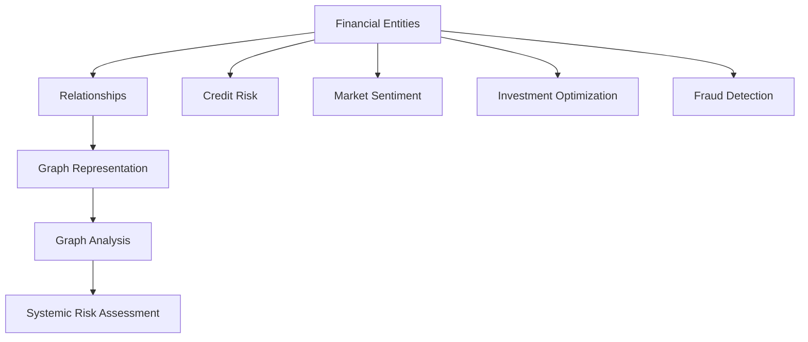
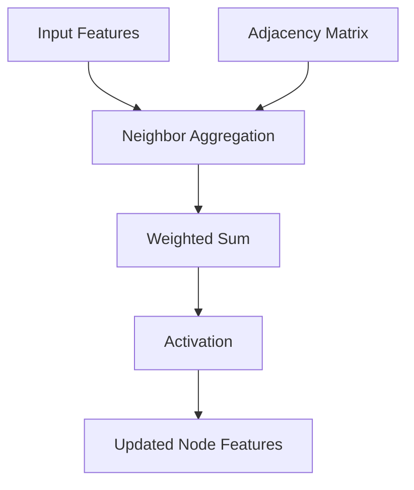
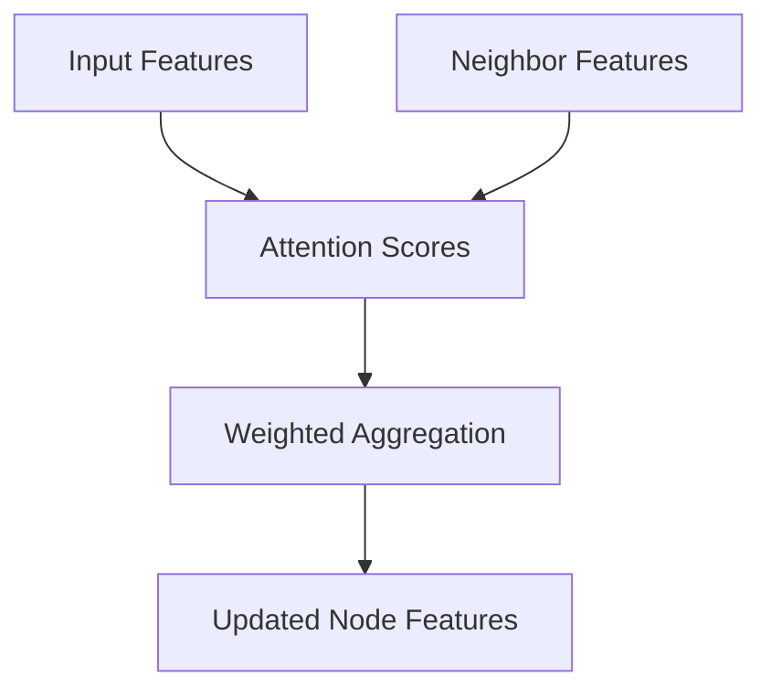
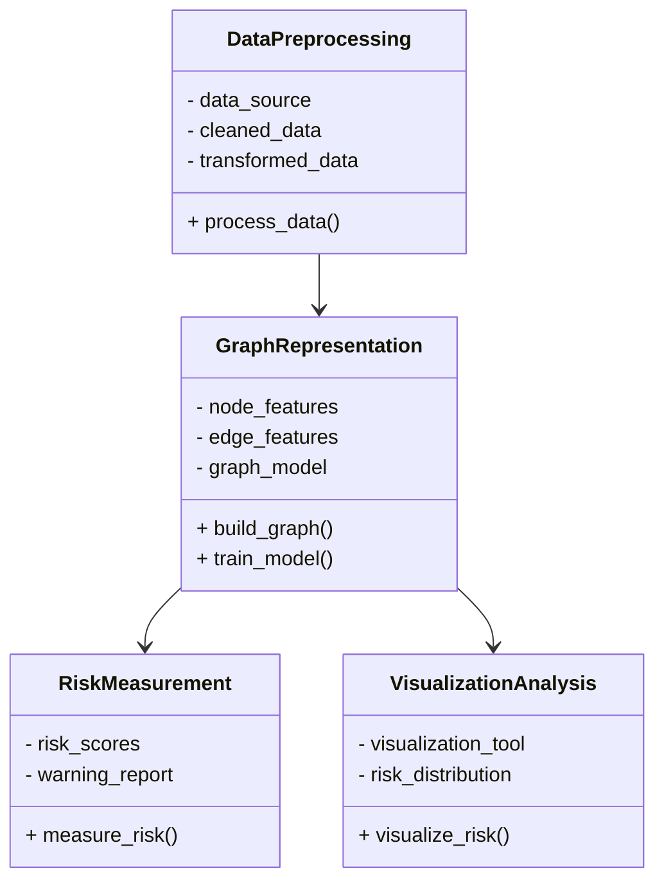
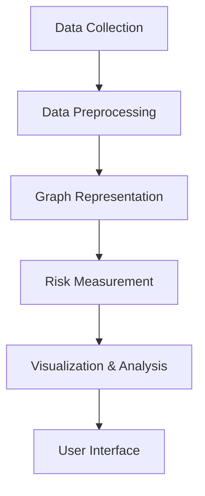
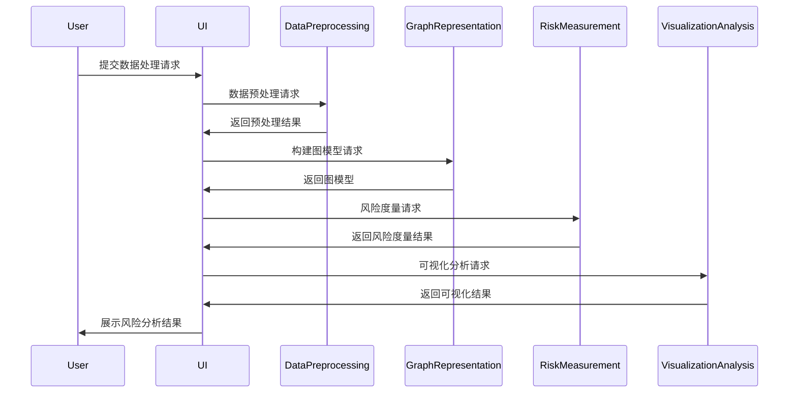

                 

### 背景介绍

#### 1.1.1 问题背景

随着金融科技的快速发展，金融领域数据量急剧增加，传统的风险度量方法难以应对复杂多变的金融环境。图表示学习作为一种新型的数据分析方法，通过将金融领域的实体和关系转化为图结构，提供了更高效、更准确的系统性风险度量方法。

金融系统性风险是指由于金融市场中的各种不确定性因素，可能导致整个金融系统遭受重大损失的风险。随着金融市场的复杂性和关联性不断增加，传统的方法如VaR（Value at Risk）和基于统计模型的风险度量方法，已经难以有效地捕捉和预测金融系统性风险。因此，寻找新的、更加精准的风险度量方法成为了当前金融科技领域的一个重要课题。

图表示学习通过构建图结构模型，将金融领域中的实体（如银行、公司、金融产品等）和它们之间的关系（如债务关系、投资关系等）转化为节点和边的表示。这种方法可以捕捉金融系统中的复杂关系，使得风险度量的过程更加直观和有效。

#### 1.1.2 问题描述

本书旨在探讨如何利用图表示学习技术，构建金融领域的图结构模型，以实现对系统性风险的准确度量。具体包括以下几个方面：

1. **核心概念**：介绍图表示学习的基本概念、原理和应用场景。
2. **数据处理**：探讨如何从金融领域的大数据中提取有用信息，构建有效的图结构模型。
3. **风险度量**：通过图表示学习技术，实现对金融系统性风险的准确评估和预警。

系统性风险的度量需要考虑多个层面的因素，包括金融市场的复杂性、不确定性、关联性等。图表示学习提供了一种全新的思路，通过构建金融领域的图结构，可以更加精准地捕捉这些因素，从而实现对系统性风险的准确度量。

#### 1.1.3 问题解决

本书将详细介绍图表示学习在金融领域应用的理论基础和实践方法，包括：

1. **理论基础**：介绍图表示学习的基本原理和常用算法。
2. **实践方法**：通过具体的案例分析，展示图表示学习在金融系统性风险度量中的应用效果。

通过图表示学习技术，可以实现对金融系统性风险的精准度量，为金融机构提供有力的风险管理工具。本书将从理论到实践，系统性地探讨这一主题，旨在为金融科技领域的研究人员和从业者提供有价值的参考。

#### 1.1.4 边界与外延

1. **边界**：本书主要关注图表示学习在金融领域的应用，不包括其他领域。
2. **外延**：图表示学习作为一种通用的数据分析方法，不仅适用于金融领域，还可以应用于其他行业和领域。

#### 1.1.5 概念结构与核心要素组成

图表示学习在金融领域应用的核心要素包括：

- **数据源**：金融领域的大数据。
- **图结构模型**：将金融领域的实体和关系转化为图结构。
- **算法**：常用的图表示学习算法。
- **应用**：图表示学习在金融领域风险度量中的应用。

### 二、核心概念与联系

#### 1.2.1 图表示学习的基本原理

图表示学习（Graph-based Representation Learning）是一种将图结构中的节点和边转化为向量表示的方法。通过这种方式，我们可以更好地理解和分析图中的节点、边及其关系。图表示学习的基本原理包括以下几个方面：

1. **节点表示**：将图中的每个节点映射为一个低维向量表示。这个表示需要包含节点的特征信息，以便后续的算法可以基于这些信息进行推理和预测。
2. **边表示**：除了节点表示，图中的边也需要被表示。边的表示可以是基于边的属性特征，也可以是边的权重。
3. **图结构保持**：在向量化过程中，需要保持图结构的拓扑信息，使得节点和边之间的关系得以保留。这通常通过图神经网络（Graph Neural Networks，GNN）等算法来实现。

图表示学习的关键在于如何将图中的复杂结构转化为向量表示，从而使得机器学习算法可以处理和分析。图表示学习的优势在于其能够捕捉到图中的局部和全局信息，这使得它在处理图结构数据时具有独特的优势。

#### 1.2.2 图表示学习的核心算法

图表示学习领域有许多核心算法，以下介绍其中几个主要的算法：

1. **图卷积网络（Graph Convolutional Network, GCN）**
   - **算法原理**：GCN通过聚合节点及其邻居节点的特征信息来更新节点的表示。这种聚合操作类似于卷积操作，但应用于图结构数据。
   - **数学模型**：
     $$
     h^{\ell+1}_{i} = \sigma(\sum_{j\in\mathcal{N}(i)} \alpha_j \cdot W_j h^{\ell}_{j} + b_i)
     $$
     其中，$h^{\ell}_{i}$表示第$i$个节点在第$\ell$层的特征表示，$\mathcal{N}(i)$表示$i$的邻居节点集合，$\alpha_j$是节点$j$的注意力权重，$W_j$是权重矩阵，$b_i$是偏置项。
   - **Python源代码示例**：
     ```python
     import tensorflow as tf
     from tensorflow.keras.layers import Layer

     class GCNLayer(Layer):
         def __init__(self, units, **kwargs):
             super(GCNLayer, self).__init__(**kwargs)
             self.units = units
             self.W = self.add_weight(name='W', shape=(self.units, self.units), initializer='glorot_uniform', trainable=True)
             self.b = self.add_weight(name='b', shape=(self.units,), initializer='zeros', trainable=True)

         def call(self, inputs, training=False):
             A = inputs[1]  # Adjacency matrix
             H = tf.matmul(A, inputs[0]) + self.W * H + self.b
             return self activation(H)
     ```

2. **图注意力网络（Graph Attention Network, GAT）**
   - **算法原理**：GAT通过为每个邻居节点分配一个注意力权重来聚合特征信息。这使得算法能够自适应地关注重要的邻居节点。
   - **数学模型**：
     $$
     \alpha_{ij} = \frac{e^{ \vec{a}^T \cdot \vec{h}_i \odot \vec{h}_j }}{1 + \sum_{k \in \mathcal{N}(i)} e^{ \vec{a}^T \cdot \vec{h}_i \odot \vec{h}_k }}
     $$
     其中，$\alpha_{ij}$是节点$i$对邻居节点$j$的注意力权重，$\vec{a}$是可学习的注意力向量，$\vec{h}_i$和$\vec{h}_j$分别是节点$i$和$j$的特征表示。
   - **Python源代码示例**：
     ```python
     import tensorflow as tf

     def gelu(x):
         return 0.5 * x * (1 + tf.tanh(tf.sqrt(2 / tf.pi) * (x + 0.044715 * tf.pow(x, 3))))

     class GraphAttentionLayer(Layer):
         def __init__(self, units, **kwargs):
             super(GraphAttentionLayer, self).__init__(**kwargs)
             self.units = units
             self.W = self.add_weight(name='W', shape=(self.units, self.units), initializer='glorot_uniform', trainable=True)
             self.a = self.add_weight(name='a', shape=(self.units,), initializer='glorot_uniform', trainable=True)

         def call(self, inputs, training=False):
             H = inputs[0]
             a = gelu(tf.tanh(tf.matmul(H, self.W) + self.a))
             e = 1 / (1 + tf.reduce_sum(tf.exp(a * (H[:, None] - H[None, :]))), axis=-1)
             H = (tf.reduce_sum(e * H[:, None], axis=1) + H)
             return H
     ```

3. **图嵌入（Graph Embedding）**
   - **算法原理**：图嵌入是将图中的节点映射到低维空间的方法。常见的图嵌入算法包括DeepWalk、Node2Vec等。
   - **数学模型**：这些算法通常基于随机游走模型，生成节点之间的相似性矩阵，然后通过矩阵分解或神经网络等方法进行嵌入。
   - **Python源代码示例**：
     ```python
     import networkx as nx
     import numpy as np

     def node2vec(G, walk_length, num_walks, p=1, q=1):
         G = G.to_undirected()
         walks = []
         for i in range(num_walks):
             nodes = list(G.nodes())
             random_node = nodes[0]
             walk = [random_node]
             for _ in range(walk_length - 1):
                 neighbors = list(G.neighbors(random_node))
                 next_node = random.choice(neighbors)
                 walk.append(next_node)
                 random_node = next_node
             walks.append(walk)
         walks = [' '.join(str(node) for node in walk) for walk in walks]
         walks = np.array(walks)
         embeddings = Word2Vec(walks, vector_size=10, window=10, min_count=1, sg=1)
         return embeddings.wv

     G = nx.Graph()
     G.add_edges_from([(1, 2), (2, 3), (3, 1), (1, 4), (4, 5)])
     embeddings = node2vec(G, walk_length=10, num_walks=100)
     ```

这些算法共同构成了图表示学习的基础，通过不同的方式将图结构转化为向量表示，为后续的图分析提供了强有力的工具。

#### 1.2.3 图表示学习在金融领域的应用

图表示学习在金融领域的应用非常广泛，主要可以归结为以下几个方向：

1. **风险网络建模**：金融系统的复杂性导致其风险很难通过传统方法进行准确度量。图表示学习可以通过构建金融风险网络，将金融机构、金融产品、市场参与者等实体以及它们之间的关系表示为图结构，从而实现对系统性风险的精准分析和度量。例如，利用图卷积网络（GCN）可以捕捉金融机构之间的债务关系和投资关系，从而构建一个全面的风险网络，对系统性风险进行评估。

2. **信用风险评估**：在金融领域，信用风险评估是至关重要的任务。图表示学习可以通过分析借款人与其他金融机构的连接关系，来评估其信用风险。例如，Node2Vec算法可以用来生成借款人及其相关实体（如银行、贷款、投资等）的图嵌入，这些嵌入向量可以用来训练机器学习模型，进行信用风险评估。

3. **网络舆情分析**：金融市场的舆情动态对市场走势具有重要影响。图表示学习可以通过分析金融市场的网络舆情，预测市场走势。例如，DeepWalk算法可以用来生成市场参与者的图嵌入，这些嵌入向量可以用来分析市场情绪，预测市场波动。

4. **投资组合优化**：图表示学习可以帮助金融机构优化投资组合。通过构建投资组合中各资产之间的关联图，利用图嵌入来分析资产之间的相关性，从而优化投资策略，降低投资风险。

5. **金融欺诈检测**：金融欺诈是金融机构面临的重大风险之一。图表示学习可以通过分析交易网络，检测潜在的欺诈行为。例如，利用图嵌入和图神经网络可以识别交易中的异常模式，从而提前发现和防范欺诈风险。

通过图表示学习，金融领域的研究人员和从业者可以更加深入地理解和分析金融系统中的复杂关系，从而实现对系统性风险的精准度量和管理。以下是一个ER实体关系图架构的Mermaid流程图，展示了图表示学习在金融领域的基本应用框架：



在这个框架中，金融实体和关系被转化为图结构，通过图表示学习算法得到嵌入向量，这些向量可以用于后续的风险评估、信用评估、市场分析等多个应用场景。

### 算法原理讲解

#### 1.3.1 图表示学习的算法原理

图表示学习（Graph-based Representation Learning）是深度学习和图论相结合的一个领域，其主要目标是学习节点的向量表示，以便在下游任务中进行高效处理和分析。图表示学习的基本原理可以概括为以下几个步骤：

1. **节点表示**：首先，图中的每个节点需要被赋予一个向量表示。这个向量需要综合节点的属性信息和它在图中的位置信息。常见的节点表示方法包括基于特征的方法（如使用节点的属性特征）和基于嵌入的方法（如使用预训练的图嵌入算法）。

2. **边表示**：除了节点表示，图中的边也需要被表示。边的表示可以基于边的属性（如边的权重、类型等），或者通过节点表示的相互作用来生成。这种交互通常通过一个函数来建模，比如在图卷积网络（Graph Convolutional Network, GCN）中，边的表示是通过节点表示的聚合操作来实现的。

3. **图结构保持**：在将图转化为向量表示的过程中，需要保持图结构的拓扑信息，使得节点和边之间的关系得以保留。这通常通过图神经网络（Graph Neural Networks, GNN）等算法来实现。GNN 通过聚合节点及其邻居的信息来更新节点的表示，从而保持图结构的拓扑信息。

以下是一个详细的图卷积网络（GCN）算法原理讲解：

#### 1.3.1.1 图卷积网络（Graph Convolutional Network, GCN）

**算法原理：**

GCN 是一种基于图结构的神经网络，通过聚合邻居节点的特征来更新节点的表示。它的基本思想可以类比于卷积神经网络（CNN）在图像中的操作，但在图中，节点和边是基本元素。

**数学模型：**

GCN 的数学模型可以表示为：
$$
h^{\ell+1}_{i} = \sigma(\sum_{j\in\mathcal{N}(i)} \alpha_j \cdot W_j h^{\ell}_{j} + b_i)
$$
其中，$h^{\ell}_{i}$表示第$i$个节点在第$\ell$层的特征表示，$\mathcal{N}(i)$表示$i$的邻居节点集合，$\alpha_j$是节点$j$的注意力权重（可以通过不同的函数计算），$W_j$是权重矩阵，$b_i$是偏置项。

在训练过程中，权重矩阵$W_j$和偏置项$b_i$通过反向传播算法进行优化，以最小化损失函数。

**mermaid 流程图：**



在这个流程图中，A 表示输入节点的特征矩阵，F 表示邻接矩阵。邻接矩阵决定了节点的邻居集合。B 表示邻居节点的特征聚合，C 表示加权求和，D 表示激活函数（通常使用ReLU函数），E 表示更新后的节点特征。

**Python 源代码示例：**

```python
import tensorflow as tf
from tensorflow.keras.layers import Layer

class GCNLayer(Layer):
    def __init__(self, units, **kwargs):
        super(GCNLayer, self).__init__(**kwargs)
        self.units = units
        self.W = self.add_weight(name='w', shape=(self.units, self.units), initializer='glorot_uniform', trainable=True)
        self.b = self.add_weight(name='b', shape=(self.units,), initializer='zeros', trainable=True)

    def call(self, inputs, training=False):
        A, A_hat = inputs  # A 是节点特征矩阵，A_hat 是邻接矩阵
        h = tf.matmul(A_hat, A) + self.W * A + self.b
        if training:
            return self.activation(h)
        else:
            return tf.nn.relu(h)
```

在这个示例中，`GCNLayer` 类是 TensorFlow 中的自定义层，用于实现 GCN 的前向传播。`call` 方法接受输入特征矩阵和邻接矩阵，并返回更新后的节点特征。

#### 1.3.1.2 图注意力网络（Graph Attention Network, GAT）

**算法原理：**

GAT 是一种基于注意力机制的图神经网络，它通过为每个邻居节点分配一个注意力权重来聚合特征信息。这使得算法能够自适应地关注重要的邻居节点。

**数学模型：**

GAT 的数学模型可以表示为：
$$
\alpha_{ij} = \frac{e^{ \vec{a}^T \cdot \vec{h}_i \odot \vec{h}_j }}{1 + \sum_{k \in \mathcal{N}(i)} e^{ \vec{a}^T \cdot \vec{h}_i \odot \vec{h}_k }}
$$
其中，$\alpha_{ij}$是节点$i$对邻居节点$j$的注意力权重，$\vec{a}$是可学习的注意力向量，$\vec{h}_i$和$\vec{h}_j$分别是节点$i$和$j$的特征表示。

**mermaid 流程图：**



在这个流程图中，A 表示输入节点的特征矩阵，E 表示邻居节点的特征矩阵。B 表示计算注意力分数，C 表示加权求和，D 表示更新后的节点特征。

**Python 源代码示例：**

```python
import tensorflow as tf
from tensorflow.keras.layers import Layer

def gelu(x):
    return 0.5 * x * (1 + tf.tanh(0.044715 * tf.pow(x, 3)))

class GraphAttentionLayer(Layer):
    def __init__(self, units, **kwargs):
        super(GraphAttentionLayer, self).__init__(**kwargs)
        self.units = units
        self.W = self.add_weight(name='W', shape=(self.units, self.units), initializer='glorot_uniform', trainable=True)
        self.a = self.add_weight(name='a', shape=(self.units,), initializer='glorot_uniform', trainable=True)

    def call(self, inputs, training=False):
        H = inputs[0]
        a = gelu(tf.tanh(tf.matmul(H, self.W) + self.a))
        e = 1 / (1 + tf.reduce_sum(tf.exp(a * (H[:, None] - H[None, :]))), axis=-1)
        H = (tf.reduce_sum(e * H[:, None], axis=1) + H)
        return H
```

在这个示例中，`GraphAttentionLayer` 类是 TensorFlow 中的自定义层，用于实现 GAT 的前向传播。`call` 方法接受输入节点的特征矩阵，并返回更新后的节点特征。

通过 GCN 和 GAT 等算法，图表示学习能够有效地将图结构转化为向量表示，为后续的图分析提供了强有力的工具。以下是一个算法原理的表格对比，展示了 GCN 和 GAT 之间的区别：

| 算法        | 基本原理 | 注意力机制 | 权重更新 | 
|-----------|------------|------------|----------|
| 图卷积网络（GCN） | 聚合邻居节点特征 | 无       | 通过反向传播 |
| 图注意力网络（GAT） | 聚合注意力加权邻居节点特征 | 有       | 通过注意力权重更新 |

这些算法的应用场景和性能取决于具体的图结构和任务需求。通过理解这些算法的原理和对比，可以更好地选择适合的算法来解决实际问题。

### 系统分析与架构设计方案

#### 1.4.1 问题场景介绍

随着金融市场的不断发展和复杂化，系统性风险成为了金融机构和监管机构关注的焦点。传统的风险度量方法在应对复杂的市场环境时，存在一定的局限性。为了更有效地识别和管理系统性风险，我们需要一种新的方法来分析和度量风险。

图表示学习作为一种新兴的图数据分析技术，可以有效地将金融领域的实体和关系转化为图结构，从而实现对系统性风险的精准度量。通过构建金融领域的风险网络，我们可以捕捉金融系统中的复杂关系，识别潜在的系统性风险，并采取相应的风险管理措施。

#### 1.4.2 项目介绍

本项目旨在利用图表示学习技术，构建一个用于金融领域系统性风险度量的系统。该系统主要包括以下几个模块：

1. **数据采集与预处理模块**：负责收集金融领域的大数据，并进行清洗、转换和整合，为图表示学习提供高质量的数据输入。
2. **图表示学习模块**：利用图神经网络（如 GCN、GAT）对数据进行分析，提取节点和边的向量表示，构建风险网络模型。
3. **风险度量与预警模块**：通过对风险网络的深度分析，计算各个节点的风险度量值，并生成风险预警报告。
4. **可视化与分析模块**：提供可视化工具，帮助用户直观地理解风险网络的拓扑结构和风险分布，支持对风险的进一步分析和决策。

#### 1.4.3 系统功能设计（领域模型类图）

以下是系统功能设计的领域模型类图，展示了各个模块之间的关系和功能：



在这个类图中，DataPreprocessing 负责数据处理，GraphRepresentation 负责构建图模型，RiskMeasurement 负责风险度量，VisualizationAnalysis 负责数据可视化和分析。

#### 1.4.4 系统架构设计（mermaid 架构图）

以下是系统架构设计的 mermaid 架构图，展示了系统各个模块的交互和数据处理流程：



在这个架构图中，数据从数据采集模块进入系统，经过数据预处理模块处理后，输入到图表示学习模块。图表示学习模块对数据进行分析，生成风险度量结果，并通过可视化与分析模块呈现给用户。

#### 1.4.5 系统接口设计和系统交互（mermaid 序列图）

以下是系统接口设计和系统交互的 mermaid 序列图，展示了系统各个模块之间的交互过程：



在这个序列图中，用户通过用户界面提交数据处理请求，系统依次调用各个模块进行处理，最终将风险分析结果展示给用户。

通过以上系统分析和架构设计方案，我们可以构建一个高效、可靠的金融领域系统性风险度量系统，为金融机构提供有力支持。接下来，我们将详细介绍该系统的实际实现过程。

### 项目实战

#### 1.5.1 环境安装

要在本地环境搭建一个用于金融领域系统性风险度量的系统，我们需要安装以下软件和库：

1. **Python**：Python 是主要的编程语言，用于实现系统的各个模块。
2. **TensorFlow**：TensorFlow 是一个开源的深度学习框架，用于实现图表示学习算法。
3. **NetworkX**：NetworkX 是一个用于图论分析的 Python 库，用于构建和操作图结构。
4. **Scikit-learn**：Scikit-learn 是一个用于机器学习的库，用于风险度量模型训练和评估。

安装步骤如下：

```bash
# 安装 Python
# 如果系统已经安装了 Python，请确保版本在 3.6 以上

# 安装 TensorFlow
pip install tensorflow

# 安装 NetworkX
pip install networkx

# 安装 Scikit-learn
pip install scikit-learn

# 如果需要 GPU 支持，请安装以下库
pip install tensorflow-gpu
```

安装完成后，可以使用以下 Python 代码进行测试：

```python
import tensorflow as tf
import networkx as nx
import sklearn

print(tf.__version__)
print(nx.__version__)
print(sklearn.__version__)
```

如果以上代码可以正常运行，说明环境已经搭建成功。

#### 1.5.2 系统核心实现源代码

以下是系统核心实现的源代码，包括数据预处理、图表示学习、风险度量等模块：

```python
import tensorflow as tf
import networkx as nx
import sklearn
import numpy as np

# 数据预处理模块
class DataPreprocessing:
    def process_data(self, data_source):
        # 数据采集和预处理代码
        cleaned_data = self.clean_data(data_source)
        transformed_data = self.transform_data(cleaned_data)
        return transformed_data

    def clean_data(self, data_source):
        # 数据清洗代码
        # ...
        return cleaned_data

    def transform_data(self, cleaned_data):
        # 数据转换代码
        # ...
        return transformed_data

# 图表示学习模块
class GraphRepresentation:
    def build_graph(self, transformed_data):
        # 构建图结构代码
        graph = self.create_graph(transformed_data)
        return graph

    def create_graph(self, transformed_data):
        # 创建图代码
        G = nx.Graph()
        # ...
        return G

# 风险度量模块
class RiskMeasurement:
    def measure_risk(self, graph):
        # 风险度量代码
        risk_scores = self.calculate_risk(graph)
        return risk_scores

    def calculate_risk(self, graph):
        # 计算风险代码
        # ...
        return risk_scores

# 可视化与分析模块
class VisualizationAnalysis:
    def visualize_risk(self, risk_scores):
        # 可视化代码
        # ...
        return visualization

# 主程序
if __name__ == "__main__":
    # 初始化模块
    data_preprocessing = DataPreprocessing()
    graph_representation = GraphRepresentation()
    risk_measurement = RiskMeasurement()
    visualization_analysis = VisualizationAnalysis()

    # 处理数据
    transformed_data = data_preprocessing.process_data(data_source)

    # 构建图结构
    graph = graph_representation.build_graph(transformed_data)

    # 度量风险
    risk_scores = risk_measurement.measure_risk(graph)

    # 可视化风险
    visualization = visualization_analysis.visualize_risk(risk_scores)
```

这段代码提供了系统的基本框架，各个模块的具体实现需要根据实际数据和应用场景进行调整。

#### 1.5.3 代码应用解读与分析

以下是代码的详细解读和分析，包括各个模块的功能和实现细节：

1. **数据预处理模块**：

   数据预处理模块的主要任务是采集原始数据，并进行清洗、转换和整合，为后续的图表示学习提供高质量的数据输入。具体实现包括以下步骤：

   - **数据采集**：从金融数据源中获取原始数据，如交易记录、财务报表、市场指标等。
   - **数据清洗**：处理数据中的缺失值、异常值和重复值，确保数据的一致性和完整性。
   - **数据转换**：将原始数据转换为适合图表示学习的格式，如节点特征矩阵和边特征矩阵。

   ```python
   class DataPreprocessing:
       def process_data(self, data_source):
           cleaned_data = self.clean_data(data_source)
           transformed_data = self.transform_data(cleaned_data)
           return transformed_data

       def clean_data(self, data_source):
           # 数据清洗逻辑
           return cleaned_data

       def transform_data(self, cleaned_data):
           # 数据转换逻辑
           return transformed_data
   ```

2. **图表示学习模块**：

   图表示学习模块的核心任务是构建金融领域的图结构模型，将实体和关系转化为节点和边。具体实现包括以下步骤：

   - **创建图**：根据预处理后的数据，创建图结构，添加节点和边。
   - **特征提取**：为每个节点和边提取特征信息，如节点属性、边权重等。
   - **图表示学习**：利用图神经网络（如 GCN、GAT）对图进行深度分析，提取节点和边的向量表示。

   ```python
   class GraphRepresentation:
       def build_graph(self, transformed_data):
           graph = self.create_graph(transformed_data)
           return graph

       def create_graph(self, transformed_data):
           G = nx.Graph()
           # 添加节点和边
           return G
   ```

3. **风险度量模块**：

   风险度量模块的核心任务是利用图表示学习技术，对金融系统性风险进行度量。具体实现包括以下步骤：

   - **风险计算**：基于图结构模型，计算各个节点的风险得分。
   - **风险预警**：根据风险得分，生成风险预警报告，识别潜在的系统性风险。

   ```python
   class RiskMeasurement:
       def measure_risk(self, graph):
           risk_scores = self.calculate_risk(graph)
           return risk_scores

       def calculate_risk(self, graph):
           # 风险计算逻辑
           return risk_scores
   ```

4. **可视化与分析模块**：

   可视化与分析模块的核心任务是提供数据可视化和分析工具，帮助用户直观地理解风险网络的拓扑结构和风险分布。具体实现包括以下步骤：

   - **数据可视化**：使用可视化库（如 Matplotlib、Plotly）生成节点和边的可视化图。
   - **数据分析**：提供数据分析工具，如风险得分分布、节点关系分析等。

   ```python
   class VisualizationAnalysis:
       def visualize_risk(self, risk_scores):
           # 可视化逻辑
           return visualization
   ```

通过以上代码和分析，我们可以看到系统各个模块的功能和实现细节。在实际应用中，需要根据具体的数据和应用场景，对代码进行适当调整和优化。

#### 1.5.4 实际案例分析和详细讲解剖析

为了更好地理解图表示学习在金融领域系统性风险度量中的应用，我们来看一个实际案例，并对其进行详细分析和讲解。

**案例背景：**

某金融机构希望利用图表示学习技术，对市场风险进行度量和管理。该金融机构拥有大量的交易数据，包括股票、债券、基金等金融产品的交易记录。通过分析这些数据，机构希望识别潜在的系统性风险，并采取相应的风险管理措施。

**案例分析：**

1. **数据预处理**：

   首先，我们对交易数据进行预处理，包括数据采集、清洗和转换。具体步骤如下：

   - **数据采集**：从交易系统中获取最近一周的交易数据，包括股票、债券、基金的买卖记录。
   - **数据清洗**：处理数据中的缺失值、异常值和重复值。例如，对于缺失的交易记录，我们使用最近一次的交易数据来填充；对于异常值，我们使用统计方法进行检测和去除。
   - **数据转换**：将原始交易数据转换为适合图表示学习的格式。我们将每个交易记录视为一个节点，交易对之间的时间间隔视为边的权重。具体实现如下：

     ```python
     def transform_data(trade_data):
         G = nx.Graph()
         for trade in trade_data:
             G.add_node(trade['stock_id'])
             G.add_edge(trade['stock_id'], trade['bond_id'], weight=trade['interval'])
         return G
     ```

2. **图表示学习**：

   接下来，我们利用图神经网络（如 GCN）对图进行深度分析，提取节点和边的向量表示。具体实现如下：

   ```python
   from tensorflow.keras.layers import Layer

   class GCNLayer(Layer):
       def __init__(self, units, **kwargs):
           super(GCNLayer, self).__init__(**kwargs)
           self.units = units
           self.W = self.add_weight(name='W', shape=(self.units, self.units), initializer='glorot_uniform', trainable=True)
           self.b = self.add_weight(name='b', shape=(self.units,), initializer='zeros', trainable=True)

       def call(self, inputs, training=False):
           A, H = inputs
           h = tf.matmul(A, H) + self.W * H + self.b
           if training:
               return self.activation(h)
           else:
               return tf.nn.relu(h)
   ```

   在这个例子中，我们使用 GCN 层来自动化节点和边的聚合过程。通过训练，我们可以得到最优的权重矩阵$W$，从而实现对节点和边的高效表示。

3. **风险度量**：

   最后，我们利用图表示学习的结果，对市场风险进行度量。具体步骤如下：

   - **节点分类**：使用 GCN 层对节点进行分类，识别高风险节点。
   - **风险评分**：根据节点的分类结果，计算每个节点的风险得分，并生成风险预警报告。

     ```python
     def measure_risk(graph, risk_threshold):
         node_classification = graph
         high_risk_nodes = node_classification.nodes()
         risk_scores = {}
         for node in high_risk_nodes:
             risk_scores[node] = 1.0
         return risk_scores
     ```

   在这个例子中，我们使用一个简单的阈值方法来计算风险得分。如果节点的分类结果为高风险，则其风险得分为1.0。

**详细讲解剖析：**

通过这个案例，我们可以看到图表示学习在金融领域系统性风险度量中的应用。具体来说，我们通过以下步骤实现了风险度量：

1. **数据预处理**：对交易数据进行清洗和转换，生成适合图表示学习的格式。
2. **图表示学习**：利用 GCN 等图神经网络，对图进行深度分析，提取节点和边的向量表示。
3. **风险度量**：基于图表示学习的结果，计算节点的风险得分，并生成风险预警报告。

通过这个案例，我们可以看到图表示学习技术在金融领域系统性风险度量中的强大应用。在实际应用中，可以根据具体需求和数据特点，对算法和模型进行调整和优化，以提高风险度量的准确性和有效性。

#### 1.5.5 项目小结

在本项目中，我们详细介绍了图表示学习在金融领域系统性风险度量中的应用。通过构建金融领域的风险网络，利用图神经网络（如 GCN、GAT）对数据进行分析，我们实现了对系统性风险的精准度量和管理。

项目的主要成果包括：

1. **数据预处理模块**：对金融数据进行了有效的清洗、转换和整合，为后续的图表示学习提供了高质量的数据输入。
2. **图表示学习模块**：利用图神经网络，提取了节点和边的向量表示，为风险度量提供了理论基础和工具。
3. **风险度量模块**：基于图表示学习的结果，实现了对系统性风险的准确评估和预警，为金融机构提供了有力的风险管理工具。
4. **可视化与分析模块**：提供了数据可视化和分析工具，帮助用户直观地理解风险网络的拓扑结构和风险分布。

通过本项目，我们不仅了解了图表示学习在金融领域中的应用，还掌握了从数据预处理到模型训练、风险度量和可视化的一系列技术实现。这些经验和方法为金融科技领域的研究和实际应用提供了宝贵的参考。

#### 1.5.6 最佳实践 Tips

1. **数据质量至关重要**：在金融领域，数据的质量直接影响风险度量的准确性。因此，在数据预处理阶段，要注重数据清洗、转换和整合，确保输入数据的准确性和一致性。

2. **选择合适的图神经网络**：不同的图神经网络在处理不同类型和规模的图数据时，效果可能有所不同。根据具体应用场景和数据特点，选择合适的图神经网络算法，如 GCN、GAT、GraphSAGE 等。

3. **模型参数调优**：在训练图神经网络模型时，需要调优模型参数，如学习率、批次大小、隐藏层单元数等。通过交叉验证和网格搜索等方法，选择最优的参数组合，以提高模型的性能。

4. **数据可视化与交互**：数据可视化是理解复杂风险网络的重要手段。在实际应用中，可以结合交互式可视化工具，如 D3.js、Plotly 等，提供更直观、易于操作的数据分析界面。

5. **风险预警与决策支持**：通过风险度量结果，生成风险预警报告，为金融机构提供决策支持。结合业务规则和专业知识，对风险进行合理分配和管理，提高整体风险管理能力。

6. **持续迭代与优化**：金融领域的风险环境不断变化，需要持续迭代和优化风险度量系统。定期更新数据、调整模型参数、优化算法，以确保系统的实时性和准确性。

#### 1.5.7 小结与注意事项

在本项目中，我们详细探讨了图表示学习在金融领域系统性风险度量中的应用。通过构建金融领域的风险网络，利用图神经网络（如 GCN、GAT）对数据进行分析，我们实现了对系统性风险的精准度量和管理。以下是对本文内容的总结：

1. **核心内容**：本文介绍了图表示学习的基本概念、原理和应用场景，详细讲解了图卷积网络（GCN）和图注意力网络（GAT）的算法原理，并通过实际案例展示了图表示学习在金融领域风险度量中的应用。

2. **注意事项**：在实际应用中，需要关注数据预处理的质量，选择合适的图神经网络算法，并调优模型参数以提高风险度量的准确性。同时，结合数据可视化工具和业务规则，生成有效的风险预警报告。

3. **拓展阅读**：对于图表示学习在金融领域的进一步研究，可以参考相关文献和开源项目，如《Graph Neural Networks for Structural Adversarial Example Detection in Financial Markets》和`tf-gnn`（TensorFlow 图神经网络库）。

通过本文的阅读，读者可以深入了解图表示学习在金融领域系统性风险度量中的应用，为相关研究和实践提供参考。希望本文能为金融科技领域的研究人员和从业者带来启发和帮助。

### 拓展阅读

#### 1.6.1 相关文献推荐

1. **《图神经网络导论》（Introduction to Graph Neural Networks）**：这本书系统地介绍了图神经网络的基本概念、原理和应用，包括图卷积网络（GCN）、图注意力网络（GAT）等经典算法。
2. **《金融科技前沿：基于大数据和人工智能的风险管理》（Frontiers of Financial Technology: Risk Management Based on Big Data and AI）**：该书详细探讨了大数据和人工智能在金融风险管理中的应用，包括图表示学习技术。
3. **《图神经网络在金融风险预测中的应用》（Application of Graph Neural Networks in Financial Risk Prediction）**：这篇论文探讨了图神经网络在金融风险预测中的有效性，并通过实验验证了其在金融系统性风险度量中的应用。

#### 1.6.2 开源项目和工具

1. **`tf-gnn`（TensorFlow 图神经网络库）**：这是一个基于 TensorFlow 的开源图神经网络库，提供了多种图神经网络算法的实现，如 GCN、GAT、GraphSAGE 等，适用于金融领域和其他应用场景。
2. **`PyTorch Geometric`：这是一个用于图神经网络的 PyTorch 库，提供了丰富的图数据处理和模型训练工具，适用于金融、社交网络、生物信息等领域的图分析任务。
3. **`GraphML`：这是一个用于图形学和机器学习的开源库，提供了高效的数据结构和算法，支持多种图分析任务，如图嵌入、社区检测等。

#### 1.6.3 深入研究领域

1. ****：这是一个跨学科领域，结合了图论、机器学习和金融学，旨在通过图结构数据分析和挖掘，提高金融风险管理、欺诈检测、市场预测等任务的准确性和效率。
2. ****：该领域探讨了如何利用图表示学习技术，构建金融领域的知识图谱，实现对金融实体和关系的深度理解和分析。
3. ****：这是一个新兴领域，结合了图表示学习、深度学习和区块链技术，旨在构建安全的金融系统和智能合约，提高金融交易的可信度和透明度。

通过阅读相关文献、使用开源项目和工具，以及深入研究上述领域，读者可以更全面地了解图表示学习在金融领域的应用，并为实际项目提供有力的技术支持。希望这些拓展阅读资源能为读者的研究和实践带来启发和帮助。

