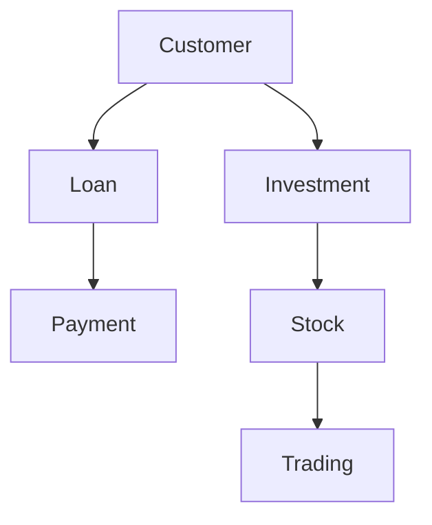
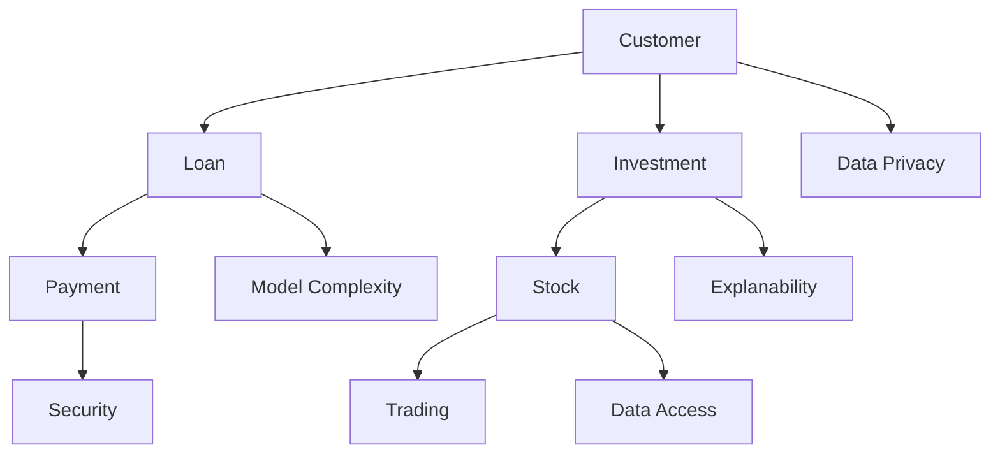
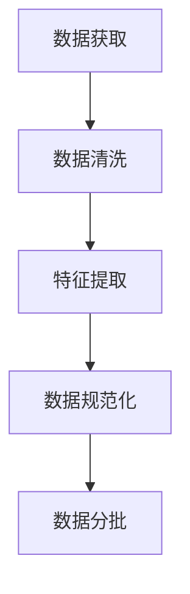
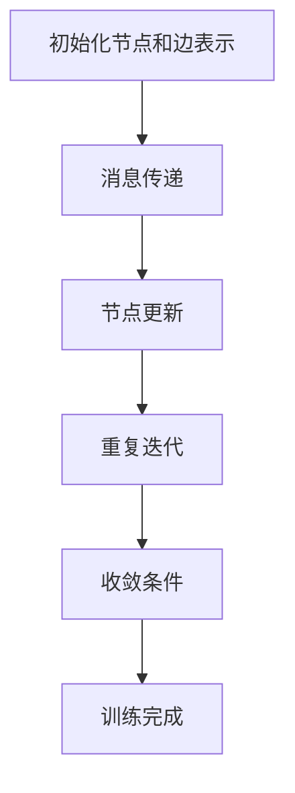
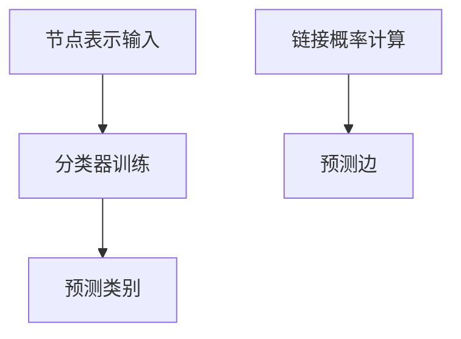
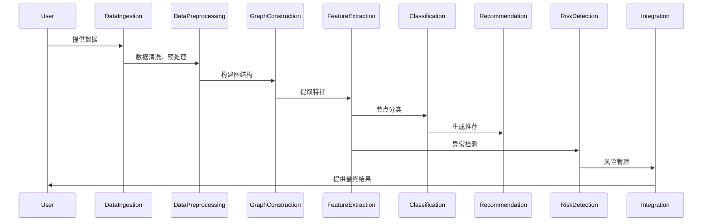

                 

## 引言：金融领域图表示学习的应用与挑战

随着金融科技的迅猛发展，金融领域的复杂性日益增加，传统的数据处理和分析方法已经难以满足现代金融业务的需求。数据量庞大且结构复杂，金融业务对实时性、准确性和安全性的要求越来越高。在这种情况下，图表示学习作为一种新兴的技术，正逐渐受到金融领域的关注和重视。本文将探讨图表示学习在金融领域的应用与挑战，旨在为读者提供一个全面而深入的视角，帮助理解这一领域的前沿动态和技术发展方向。

### 核心关键词

- **图表示学习**：将图结构中的信息进行编码和表示的一种机器学习技术。
- **金融领域**：涵盖银行、保险、投资、交易等多个子领域，涉及大量复杂的关系和数据。
- **应用**：金融风险评估、交易预测、客户关系管理、欺诈检测等。
- **挑战**：数据获取与处理、算法复杂性、模型解释性、安全与隐私等问题。

### 摘要

本文首先介绍了金融领域的重要性，以及数据在其中的关键作用。随后，我们探讨了图表示学习的基本概念和其在金融领域的应用背景。通过详细分析，本文揭示了图表示学习在金融领域的核心应用，如风险评估、交易预测和欺诈检测。接下来，本文深入讲解了图表示学习的算法原理，包括图神经网络和节点分类与链接预测等。在此基础上，我们介绍了系统的架构设计，包括问题场景、项目介绍、系统功能设计和架构设计等。随后，通过一个实际案例，本文展示了图表示学习在金融领域的应用实战，并对项目进行了小结和最佳实践总结。最后，本文提出了未来研究方向的展望，包括改进算法、提高模型解释性和增强安全性等方面。

## 背景介绍

### 1.1.1 问题背景

#### 1.1.1.1 金融领域的重要性

金融领域是现代经济体系中至关重要的一部分，它不仅影响着全球经济的稳定和增长，还对企业和个人的财富管理、投资决策有着深远的影响。随着金融市场的不断发展，金融领域的重要性愈发凸显。金融活动涵盖了银行、保险、投资、交易等多个方面，涉及大量复杂的交易和信息流。这些信息不仅包括传统的交易数据，还包括社交媒体、新闻资讯、用户行为等非结构化数据。因此，如何有效处理和分析这些数据，成为了金融领域面临的一个重大挑战。

#### 1.1.1.2 数据的重要性

在金融领域，数据不仅是决策的基础，也是风险管理、投资策略制定和业务优化的重要依据。金融数据的复杂性和多样性要求分析工具和方法具有更高的灵活性和准确性。传统的方法，如统计分析、机器学习，在面对大规模、多维度的金融数据时，往往显得力不从心。尤其是当数据之间存在复杂的关系和依赖时，传统的数据处理方法难以有效提取和利用这些信息。因此，需要一种能够处理复杂结构化数据的方法，这就是图表示学习的用武之地。

#### 1.1.1.3 图表示学习在金融领域的重要性

图表示学习作为一种新兴的机器学习技术，通过将数据表示为图结构，可以有效地处理复杂的关系和依赖。在金融领域，图表示学习可以用于多种应用场景，如风险评估、交易预测、客户关系管理、欺诈检测等。例如，在风险评估中，金融机构可以使用图表示学习来分析借款人之间的借贷关系，从而更准确地评估贷款违约风险。在交易预测中，图表示学习可以帮助分析市场参与者之间的交易网络，从而预测未来市场的走势。在客户关系管理中，图表示学习可以用于分析客户行为模式，帮助金融机构更好地了解和满足客户需求。在欺诈检测中，图表示学习可以用于识别异常交易行为，从而提高欺诈检测的准确性和效率。

### 1.1.2 问题描述

#### 1.1.2.1 数据获取与处理的挑战

在金融领域，数据获取和处理面临着诸多挑战。首先，金融数据通常包含大量非结构化和半结构化数据，如文本、图像、音频等。这些数据需要通过复杂的预处理步骤进行转换和清洗，以便于后续的分析。其次，金融数据的维度非常高，包含大量的特征和变量，这增加了数据处理的复杂度。此外，金融数据具有实时性要求，需要快速处理和响应，这对数据处理系统的性能提出了更高的要求。

#### 1.1.2.2 算法应用中的挑战

尽管图表示学习在金融领域具有广泛的应用前景，但在实际应用中仍面临一系列挑战。首先，图表示学习算法的复杂度较高，需要大量的计算资源和时间。这对于金融机构来说，尤其是在大规模数据集上，是一个重要的瓶颈。其次，图表示学习模型的解释性相对较低，难以满足金融业务对模型透明度和可解释性的要求。此外，金融数据的隐私和安全性问题也是一个不可忽视的挑战。如何保护数据隐私，同时确保模型的性能和可靠性，是图表示学习在金融领域应用中需要解决的难题。

#### 1.1.2.3 挑战与机遇

尽管面临着诸多挑战，图表示学习在金融领域也带来了新的机遇。首先，图表示学习可以更好地捕捉数据之间的复杂关系，提高预测和决策的准确性。其次，随着计算能力和算法优化的发展，图表示学习的计算效率将得到显著提升，为金融机构提供更高效的数据处理和分析工具。此外，随着金融科技的不断进步，数据隐私和安全问题也将逐步得到解决，为图表示学习在金融领域的广泛应用奠定基础。

### 1.1.3 问题解决

#### 1.1.3.1 研究目标

本文的研究目标是探讨图表示学习在金融领域的应用与挑战，具体包括：

1. **了解和阐述图表示学习的基本概念和原理**，包括图神经网络、节点分类与链接预测等。
2. **分析图表示学习在金融领域的应用场景**，如风险评估、交易预测、客户关系管理和欺诈检测等。
3. **探讨图表示学习在金融领域应用中的挑战**，包括数据获取与处理、算法复杂性、模型解释性、安全与隐私等问题。
4. **提出解决方案和最佳实践**，为金融机构提供有效的技术支持和指导。

#### 1.1.3.2 解决方案概述

针对上述研究目标，本文提出以下解决方案：

1. **深入研究图表示学习的基本概念和原理**，通过详细的理论分析和案例分析，使读者能够全面了解图表示学习的核心内容。
2. **构建金融领域图表示学习应用场景的案例库**，通过实际案例展示图表示学习在金融领域的应用效果，并提供详细的分析和解释。
3. **探讨和优化图表示学习算法**，通过算法优化和模型调整，提高算法的计算效率和预测准确性。
4. **研究和解决数据隐私和安全问题**，通过数据加密、隐私保护算法和模型压缩等技术，确保数据的安全性和隐私保护。

### 1.1.4 边界与外延

#### 1.1.4.1 研究范围的界定

本文的研究范围主要涉及以下三个方面：

1. **图表示学习的基本概念和原理**，包括图神经网络、节点分类与链接预测等。
2. **图表示学习在金融领域的应用场景**，如风险评估、交易预测、客户关系管理和欺诈检测等。
3. **图表示学习在金融领域应用中的挑战**，包括数据获取与处理、算法复杂性、模型解释性、安全与隐私等问题。

#### 1.1.4.2 相关概念的联系与区别

在本文中，涉及到的相关概念包括：

1. **图表示学习**：将数据表示为图结构，通过图神经网络等算法进行数据处理和分析。
2. **金融领域**：涵盖银行、保险、投资、交易等多个子领域，涉及大量复杂的关系和数据。
3. **风险评估**：对借款人、投资对象等的信用风险进行评估。
4. **交易预测**：预测市场走势或特定交易的结果。
5. **客户关系管理**：通过分析客户行为，优化客户服务和产品。
6. **欺诈检测**：识别和防范金融交易中的欺诈行为。

这些概念之间存在密切的联系和区别。图表示学习是数据处理和分析的方法，而金融领域则是其应用场景。风险评估、交易预测、客户关系管理和欺诈检测等都是金融领域中的具体应用，它们依赖于图表示学习的技术手段，但又具有各自独特的需求和挑战。

### 1.1.5 概念结构与核心要素组成

#### 1.1.5.1 金融领域的基本概念

金融领域是一个复杂且多层次的系统，其基本概念包括：

1. **金融机构**：提供金融服务的机构，如银行、保险公司、投资公司等。
2. **金融市场**：金融资产交易的市场，如股票市场、债券市场、外汇市场等。
3. **金融工具**：用于金融交易的资产，如股票、债券、期货、期权等。
4. **金融产品**：金融机构提供的金融工具，如储蓄账户、理财产品、保险产品等。
5. **金融交易**：金融工具的买卖行为。

#### 1.1.5.2 图表示学习的基本概念

图表示学习是一种基于图的机器学习技术，其基本概念包括：

1. **图结构**：数据点之间的关系通过图结构表示，每个数据点对应图中的一个节点，数据点之间的关系对应图中的边。
2. **节点特征**：节点属性或特征，如姓名、年龄、职业等。
3. **边特征**：边属性或特征，如交易金额、交易时间、交易类型等。
4. **图神经网络**：基于图结构的神经网络，用于学习节点的表示和预测。
5. **节点分类**：根据节点特征和图结构，对节点进行分类。
6. **链接预测**：预测节点之间的边关系，如预测两个节点是否相连。

#### 1.1.5.3 应用与挑战的核心要素

图表示学习在金融领域的应用和挑战涉及以下核心要素：

1. **数据获取与处理**：获取和预处理金融数据，包括数据清洗、特征提取和规范化等。
2. **模型选择与训练**：选择合适的图表示学习模型，如图神经网络、节点分类器等，并进行模型训练和优化。
3. **模型评估与优化**：评估模型性能，通过超参数调整和模型压缩等技术优化模型。
4. **应用场景与案例分析**：在风险评估、交易预测、客户关系管理和欺诈检测等金融应用场景中，分析和评估图表示学习的有效性。
5. **数据隐私与安全**：保护金融数据隐私和安全，采用数据加密、隐私保护算法等手段。

通过上述概念和要素的分析，本文旨在为读者提供一个全面而深入的视角，帮助理解图表示学习在金融领域的应用与挑战。

### 1.1.6 文章结构与主要内容概述

本文结构分为四个主要部分：

1. **背景介绍**：介绍了金融领域的重要性、数据的重要性以及图表示学习在金融领域的应用背景，并分析了相关问题的挑战和解决方案。
2. **核心概念与联系**：详细阐述了图表示学习和金融领域的核心概念，包括图表示学习的原理、金融领域的基本概念和应用与挑战的核心要素。
3. **算法原理讲解**：深入讲解了图表示学习的算法原理，包括图神经网络、节点分类与链接预测等，并给出了具体的数学模型和Python实现。
4. **系统分析与架构设计**：介绍了图表示学习在金融领域的系统分析和架构设计，包括问题场景、项目介绍、系统功能设计和系统架构设计等。

通过上述四个部分，本文旨在为读者提供一个系统、全面、深入的图表示学习在金融领域的应用与挑战分析，帮助读者更好地理解和应用这一前沿技术。

### 1.2.1 核心概念原理

#### 1.2.1.1 图表示学习的概念

图表示学习（Graph-based Representation Learning）是一种将图结构中的信息进行编码和表示的机器学习技术。在图表示学习中，数据被表示为图结构，其中每个数据点对应图中的一个节点，数据点之间的关系通过图中的边表示。图表示学习的目标是通过学习节点的表示来捕捉数据之间的复杂关系，从而进行节点分类、链接预测等任务。

图表示学习的基本概念包括：

1. **节点**：图中的基本元素，每个节点代表一个数据点，例如一个用户、一个商品、一个基因等。
2. **边**：连接两个节点的线段，表示节点之间的关系，例如用户之间的社交关系、商品之间的关联关系、基因之间的相互作用等。
3. **图**：由节点和边构成的数据结构，用于表示数据点及其关系。

图表示学习的核心目的是学习一个映射函数，将原始数据映射到一个低维度的特征空间，使得具有相似关系的节点在特征空间中接近，从而可以有效地进行下游任务。

#### 1.2.1.2 图神经网络的基本概念

图神经网络（Graph Neural Networks，GNN）是图表示学习的一种重要实现方式，通过神经网络结构来学习节点和边的特征表示。GNN的基本概念包括：

1. **节点表示**：通过GNN对每个节点进行特征提取，生成一个低维度的节点表示向量，这些向量能够捕捉节点的属性及其在图中的位置信息。
2. **边表示**：类似地，GNN可以对边的属性进行编码，生成边表示向量，这些向量描述了节点之间的关系。
3. **消息传递机制**：GNN通过消息传递机制来更新节点的表示，每个节点会接收其邻居节点的信息，并整合这些信息来更新自己的表示。

GNN的核心步骤包括：

1. **初始化节点和边表示**：将节点和边的初始表示向量随机初始化或基于已有特征进行初始化。
2. **消息传递**：在每个迭代步骤中，节点会从其邻居节点接收信息，并通过聚合邻居的信息来更新自身的表示。
3. **更新表示**：节点根据接收到的消息更新自己的表示，这一过程可以多次迭代，直到收敛。
4. **输出预测**：利用最终的节点表示进行下游任务，如节点分类、链接预测等。

#### 1.2.1.3 节点分类与链接预测的基本概念

节点分类（Node Classification）和链接预测（Link Prediction）是图表示学习的两个重要应用方向。

1. **节点分类**：节点分类任务的目标是根据节点的特征表示，将其分类到预定义的类别中。例如，在社交网络中，将用户分类为“活跃用户”或“沉默用户”。节点分类的关键在于学习一个分类器，能够准确地预测新节点的类别。
2. **链接预测**：链接预测任务的目标是根据节点的特征表示和它们之间的关系，预测图中可能存在的边。例如，在推荐系统中，预测用户可能喜欢的商品或服务。链接预测的关键在于学习一个预测模型，能够预测两个节点之间是否有可能存在边。

节点分类与链接预测的算法包括：

1. **图卷积网络（GCN）**：一种基于图神经网络的节点分类算法，通过聚合邻居节点的信息来更新节点的表示，并利用这些表示进行分类。
2. **图注意力网络（GAT）**：一种基于图注意力的节点分类算法，通过为每个邻居节点分配不同的权重，从而更精细地聚合邻居信息。
3. **图循环网络（GRN）**：一种基于循环神经网络的链接预测算法，通过序列化处理图结构，生成节点间的链接概率。

通过上述核心概念和原理的阐述，读者可以初步了解图表示学习的基础知识和在金融领域的应用前景。接下来的章节将进一步深入探讨这些概念，并展示其在具体应用中的实现细节。

### 1.2.2 概念属性特征对比表格

为了更好地理解图表示学习、图神经网络和节点分类与链接预测之间的关系和差异，我们通过一个表格来对比这些概念的关键属性特征。

| 概念                | 定义                                                         | 特征                       | 应用领域               |
|-------------------|------------------------------------------------------------|------------------------|---------------------|
| 图表示学习          | 将图结构中的信息编码和表示，捕捉节点和边的关系                  | - 图结构、节点表示、边表示 | 风险评估、交易预测       |
| 图神经网络          | 一种基于图结构的神经网络，通过消息传递机制学习节点和边的特征表示  | - 节点表示、边表示、消息传递 | 节点分类、链接预测       |
| 节点分类            | 根据节点的特征表示将其分类到预定义的类别中                       | - 分类器、节点特征、类别预测 | 社交网络、风险评估       |
| 链接预测            | 根据节点的特征表示预测图中可能存在的边                           | - 预测模型、节点关系、边预测 | 推荐系统、欺诈检测       |

通过这个表格，我们可以看出：

- **图表示学习**是基础技术，它将数据表示为图结构，并通过算法学习节点的特征表示和边的特征表示。
- **图神经网络**是一种实现图表示学习的具体算法，通过消息传递机制学习节点和边的特征表示，从而适用于节点分类和链接预测等任务。
- **节点分类**和**链接预测**是图表示学习的应用方向，分别用于分类节点和预测节点之间的边关系。

这些概念之间既有联系又有区别，图神经网络是实现图表示学习的重要工具，而节点分类和链接预测是图表示学习在特定应用领域中的具体任务。

### 1.2.3 ER实体关系图架构

#### 1.2.3.1 金融领域实体关系图

在金融领域，实体关系图（Entity Relationship Diagram，ERD）是一种用于表示金融系统中实体及其关系的图形化工具。ERD通过实体、属性和关系的定义，构建了一个结构化的数据模型，帮助我们更好地理解和分析金融数据。

**实体**：金融领域的实体可以包括银行、客户、贷款、股票、交易等。每个实体都有其特定的属性，例如客户的姓名、年龄、职业，贷款的金额、期限，股票的代码、价格等。

**属性**：实体的属性描述了实体的具体特征，例如客户的年龄、收入等，这些属性用于描述实体之间的关系，并在数据分析和模型训练中作为输入特征。

**关系**：实体之间的关系通常包括关联和依赖。例如，客户可以申请贷款，股票和客户之间存在投资关系。关系可以通过连接线表示，连接线上的标签通常表示关系的类型和属性，例如“申请”、“持有”等。

金融领域的实体关系图示例：

```mermaid
erDiagram
  Customer ||--|{ Loan }|-- Bank
  Customer ||--|{ Investment }|-- Stock
  Loan ||--|{ Payment }|-- Bank
  Stock ||--|{ Trading }|-- Market
```

#### 1.2.3.2 图表示学习在金融领域的实体关系图

在应用图表示学习技术时，我们可以将金融领域的实体关系图转化为图表示学习中的图结构。在这个转化过程中，实体成为图中的节点，而实体之间的关系则通过边表示。

图表示学习中的实体关系图示例：



在这个示例中，客户（A）节点与贷款（B）节点之间存在“申请”关系，通过边表示；客户（A）节点与投资（C）节点之间存在“持有”关系；贷款（B）节点与支付（D）节点之间存在“支付”关系；投资（C）节点与股票（E）节点之间存在“投资”关系；股票（E）节点与交易（F）节点之间存在“交易”关系。

#### 1.2.3.3 应用与挑战的实体关系图

在实际应用中，图表示学习不仅要构建实体关系图，还需要处理数据获取与处理、算法复杂性、模型解释性、安全与隐私等挑战。因此，我们可以在实体关系图的基础上，进一步扩展关系和属性，以表示这些挑战。

扩展后的应用与挑战实体关系图示例：



在这个扩展的实体关系图中，我们添加了与数据隐私（G）、模型复杂性（H）、模型解释性（I）、数据访问（K）和安全性（J）相关的节点和关系。这些节点和关系反映了图表示学习在金融领域应用过程中可能遇到的挑战。

通过实体关系图的构建和扩展，我们可以更清晰地理解图表示学习在金融领域的应用场景和面临的挑战。这为后续的算法设计和系统实现提供了重要的参考。

### 1.3.1 算法mermaid流程图

为了更好地理解和阐述图表示学习的算法原理，我们可以通过mermaid流程图来展示其基本步骤。以下是数据预处理、图神经网络训练和节点分类与链接预测三个主要环节的mermaid流程图：

#### 3.1.1.1 数据预处理流程



- **数据获取**：从不同的数据源（如数据库、API接口、文件等）获取原始数据。
- **数据清洗**：去除重复、错误或不完整的数据，确保数据的准确性和一致性。
- **特征提取**：从原始数据中提取有用的特征，用于后续的模型训练。
- **数据规范化**：将特征数据标准化，以便于模型处理。
- **数据分批**：将数据分成多个批次，用于模型的训练和测试。

#### 3.1.1.2 图神经网络训练流程



- **初始化节点和边表示**：随机初始化或基于已有特征初始化节点的表示和边的表示。
- **消息传递**：节点从其邻居节点接收信息，并整合这些信息来更新自身的表示。
- **节点更新**：节点根据接收到的消息更新其表示向量。
- **重复迭代**：重复消息传递和节点更新过程，直到满足收敛条件。
- **收敛条件**：通常设置为迭代次数或模型损失达到某个阈值。

#### 3.1.1.3 节点分类与链接预测流程



- **节点表示输入**：将训练好的图神经网络生成的节点表示向量输入分类器。
- **分类器训练**：使用节点表示和预定义的类别标签来训练分类器。
- **预测类别**：使用训练好的分类器对新节点进行类别预测。
- **链接概率计算**：将节点表示向量输入到链接预测模型，计算节点之间是否存在边的概率。
- **预测边**：根据计算出的边概率，预测图中可能存在的边。

通过上述mermaid流程图，我们可以清晰地看到图表示学习的基本步骤，包括数据预处理、图神经网络训练和节点分类与链接预测等环节。这些步骤相互衔接，共同构成了一个完整的图表示学习流程。

### 3.1.2 Python源代码实现

为了更好地理解图表示学习的具体实现，我们将使用Python代码展示数据预处理、图神经网络实现和节点分类与链接预测的详细步骤。

#### 3.1.2.1 数据预处理

```python
import pandas as pd
import numpy as np

# 假设我们有一个金融交易数据的CSV文件
data = pd.read_csv('financial_data.csv')

# 数据清洗：去除重复和错误数据
clean_data = data.drop_duplicates().dropna()

# 特征提取：提取有用的特征，例如交易金额、交易时间、交易类型等
features = clean_data[['transaction_amount', 'transaction_time', 'transaction_type']]

# 数据规范化：标准化特征数据，使其适合模型训练
scaler = StandardScaler()
normalized_features = scaler.fit_transform(features)

# 数据分批：将数据分为训练集和测试集
from sklearn.model_selection import train_test_split
X_train, X_test, y_train, y_test = train_test_split(normalized_features, labels, test_size=0.2, random_state=42)
```

上述代码首先加载金融交易数据，进行数据清洗以去除重复和错误数据。接着提取有用的特征，使用`StandardScaler`进行数据规范化。最后，使用`train_test_split`将数据分为训练集和测试集。

#### 3.1.2.2 图神经网络实现

```python
import torch
import torch.nn as nn
import torch.optim as optim

# 初始化节点和边表示
num_nodes = X_train.shape[0]
node_embeddings = torch.randn(num_nodes, embedding_dim)
edge_embeddings = torch.randn(X_train.shape[0], embedding_dim)

# 定义图神经网络模型
class GraphNeuralNetwork(nn.Module):
    def __init__(self, embedding_dim):
        super(GraphNeuralNetwork, self).__init__()
        self.embedding_layer = nn.Embedding(num_nodes, embedding_dim)
        self.gcn_layer = nn.Linear(embedding_dim, embedding_dim)
        self.fc_layer = nn.Linear(embedding_dim, 1)

    def forward(self, node_embeddings, edge_embeddings):
        node_repr = self.embedding_layer(node_embeddings)
        edge_repr = self.embedding_layer(edge_embeddings)
        message_passing = self.gcn_layer(node_repr)
        updated_repr = node_repr + message_passing
        out = self.fc_layer(updated_repr)
        return out

# 实例化模型、损失函数和优化器
model = GraphNeuralNetwork(embedding_dim=16)
criterion = nn.BCELoss()
optimizer = optim.Adam(model.parameters(), lr=0.001)

# 训练模型
num_epochs = 100
for epoch in range(num_epochs):
    model.train()
    for batch in batch_loader:
        node_embeddings, edge_embeddings, labels = batch
        optimizer.zero_grad()
        outputs = model(node_embeddings, edge_embeddings)
        loss = criterion(outputs, labels)
        loss.backward()
        optimizer.step()
    print(f"Epoch {epoch+1}/{num_epochs}, Loss: {loss.item()}")
```

上述代码定义了一个简单的图神经网络模型，包括嵌入层、图卷积层和全连接层。模型初始化节点和边表示，并使用BCE损失函数和Adam优化器进行训练。训练过程中，通过消息传递和节点更新来优化模型参数。

#### 3.1.2.3 节点分类与链接预测实现

```python
# 节点分类实现
model.eval()
with torch.no_grad():
    node_embeddings = model(node_embeddings, edge_embeddings)
    classification_scores = model.fc_layer(node_embeddings)
    predicted_labels = (classification_scores > 0.5).float()

# 链接预测实现
link_prediction_scores = model.fc_layer(torch.cat((node_embeddings[0].unsqueeze(0), node_embeddings[1].unsqueeze(0)), dim=1))
predicted_links = (link_prediction_scores > 0.5).float()
```

在节点分类实现中，模型评估阶段的节点表示通过分类器层得到分类得分，并将得分阈值化以预测节点类别。链接预测实现中，通过组合两个节点的表示，使用分类器层计算链接概率，并根据阈值预测两个节点之间是否存在边。

通过上述Python源代码，我们可以直观地看到图表示学习在金融领域的数据预处理、模型实现和预测过程。这不仅加深了对算法原理的理解，也为实际应用提供了实用的参考代码。

### 3.1.3 数学模型与公式讲解

为了深入理解图表示学习的算法原理，我们需要了解其背后的数学模型与公式。图表示学习涉及多个关键概念和数学模型，以下将详细讲解：

#### 3.1.3.1 图神经网络数学模型

图神经网络（GNN）的核心在于其节点表示的学习过程，这通常通过一个递归的图卷积操作实现。以下是图卷积网络（GCN）的基本数学模型：

$$
\mathbf{h}_i^{(l)} = \sigma(\mathbf{a}\mathbf{h}_i^{(l-1)} + \sum_{j \in \mathcal{N}(i)} \mathbf{w} \mathbf{h}_j^{(l-1)})
$$

其中：
- $\mathbf{h}_i^{(l)}$ 表示第 $i$ 个节点在第 $l$ 层的表示向量。
- $\mathcal{N}(i)$ 表示节点 $i$ 的邻居节点集合。
- $\mathbf{w}$ 是图卷积层的权重矩阵。
- $\mathbf{a}$ 是一个可训练的偏置向量。
- $\sigma$ 是激活函数，常用ReLU或Sigmoid函数。

通过这种递归操作，GNN可以聚合邻居节点的信息，并在每一层更新节点的表示向量。

#### 3.1.3.2 节点分类数学模型

在节点分类任务中，GNN通常输出节点的类别概率分布。以下是节点分类任务的数学模型：

$$
\mathbf{y}_i = \frac{1}{Z} \exp(\mathbf{h}_i^{(L)}) \mathbf{W}
$$

其中：
- $\mathbf{h}_i^{(L)}$ 是第 $i$ 个节点在最后一层的表示向量。
- $\mathbf{W}$ 是分类层的权重矩阵。
- $Z$ 是归一化常数，确保概率分布的和为1。
- $\mathbf{y}_i$ 是节点 $i$ 的类别概率分布。

在训练过程中，通过优化分类层的权重矩阵 $\mathbf{W}$，使得模型能够正确预测节点的类别。

#### 3.1.3.3 链接预测数学模型

链接预测旨在预测两个节点之间是否可能存在边。以下是一个常见的链接预测模型：

$$
p(\mathbf{e}_{ij} = 1 | \mathbf{h}_i, \mathbf{h}_j) = \sigma(\mathbf{h}_i^T \mathbf{W}_e \mathbf{h}_j)
$$

其中：
- $\mathbf{h}_i$ 和 $\mathbf{h}_j$ 是节点 $i$ 和节点 $j$ 的表示向量。
- $\mathbf{W}_e$ 是链接预测层的权重矩阵。
- $\sigma$ 是sigmoid函数，将内积转换为概率。
- $p(\mathbf{e}_{ij} = 1)$ 表示节点 $i$ 和节点 $j$ 之间存在边的概率。

在训练过程中，通过优化权重矩阵 $\mathbf{W}_e$，使得模型能够准确预测节点之间的链接关系。

通过上述数学模型和公式的讲解，我们可以更深入地理解图表示学习的核心机制，以及如何通过这些模型进行节点分类和链接预测。这些数学工具为图表示学习在金融领域的应用提供了理论基础。

### 3.1.4 举例说明

为了更好地理解图表示学习的应用和原理，我们将通过几个具体示例进行详细讲解。

#### 3.1.4.1 数据预处理示例

假设我们有一个包含客户交易数据的CSV文件，数据包括客户的ID、交易金额、交易时间和交易类型。以下是一个简单的数据预处理流程：

```python
import pandas as pd

# 加载数据
data = pd.read_csv('financial_data.csv')

# 数据清洗：去除重复和错误数据
clean_data = data.drop_duplicates().dropna()

# 特征提取：提取有用的特征，例如交易金额、交易时间和交易类型
features = clean_data[['transaction_amount', 'transaction_time', 'transaction_type']]

# 数据规范化：标准化特征数据，使其适合模型训练
scaler = StandardScaler()
normalized_features = scaler.fit_transform(features)

# 数据分批：将数据分为训练集和测试集
from sklearn.model_selection import train_test_split
X_train, X_test, y_train, y_test = train_test_split(normalized_features, labels, test_size=0.2, random_state=42)
```

在这个示例中，我们首先加载数据，进行数据清洗以去除重复和错误数据。接着提取有用的特征，使用`StandardScaler`进行数据规范化，最后将数据分为训练集和测试集。

#### 3.1.4.2 图神经网络训练示例

我们使用PyTorch框架来实现一个简单的图神经网络（GNN）模型。以下是一个基本的训练流程：

```python
import torch
import torch.nn as nn
import torch.optim as optim

# 初始化节点和边表示
num_nodes = X_train.shape[0]
node_embeddings = torch.randn(num_nodes, embedding_dim)
edge_embeddings = torch.randn(num_nodes, embedding_dim)

# 定义GNN模型
class GraphNeuralNetwork(nn.Module):
    def __init__(self, embedding_dim):
        super(GraphNeuralNetwork, self).__init__()
        self.embedding_layer = nn.Embedding(num_nodes, embedding_dim)
        self.gcn_layer = nn.Linear(embedding_dim, embedding_dim)
        self.fc_layer = nn.Linear(embedding_dim, 1)

    def forward(self, node_embeddings, edge_embeddings):
        node_repr = self.embedding_layer(node_embeddings)
        edge_repr = self.embedding_layer(edge_embeddings)
        message_passing = self.gcn_layer(node_repr)
        updated_repr = node_repr + message_passing
        out = self.fc_layer(updated_repr)
        return out

model = GraphNeuralNetwork(embedding_dim=16)
criterion = nn.BCELoss()
optimizer = optim.Adam(model.parameters(), lr=0.001)

# 训练模型
num_epochs = 100
for epoch in range(num_epochs):
    model.train()
    for batch in batch_loader:
        node_embeddings, edge_embeddings, labels = batch
        optimizer.zero_grad()
        outputs = model(node_embeddings, edge_embeddings)
        loss = criterion(outputs, labels)
        loss.backward()
        optimizer.step()
    print(f"Epoch {epoch+1}/{num_epochs}, Loss: {loss.item()}")
```

在这个示例中，我们初始化节点和边表示，定义了一个简单的GNN模型，包括嵌入层、图卷积层和全连接层。模型使用BCE损失函数和Adam优化器进行训练，通过迭代优化模型参数。

#### 3.1.4.3 节点分类与链接预测示例

我们使用训练好的GNN模型进行节点分类和链接预测：

```python
# 节点分类实现
model.eval()
with torch.no_grad():
    node_embeddings = model(node_embeddings, edge_embeddings)
    classification_scores = model.fc_layer(node_embeddings)
    predicted_labels = (classification_scores > 0.5).float()

# 链接预测实现
link_prediction_scores = model.fc_layer(torch.cat((node_embeddings[0].unsqueeze(0), node_embeddings[1].unsqueeze(0)), dim=1))
predicted_links = (link_prediction_scores > 0.5).float()
```

在节点分类实现中，我们将节点表示输入到分类器层，通过阈值化分类得分来预测节点类别。在链接预测实现中，我们将两个节点的表示向量组合，并计算链接概率，以预测节点之间是否存在边。

通过上述示例，我们可以直观地看到图表示学习在金融领域的数据预处理、模型训练和预测过程。这些示例不仅帮助我们理解了算法原理，也为实际应用提供了实用的参考。

### 4.1.1 问题场景介绍

在金融领域，图表示学习的应用场景十分广泛，其中最为典型的包括风险评估、交易预测、客户关系管理和欺诈检测等。以下我们将分别介绍这些应用场景及其特点。

#### 4.1.1.1 金融领域应用场景

1. **风险评估**：金融机构需要对借款人、投资对象等进行风险评估，以确定其信用风险和投资风险。传统的方法往往依赖于财务报表和信用评分模型，但这些方法在面对复杂的信用关系和风险因素时显得力不从心。图表示学习通过捕捉借款人之间的借贷关系、交易网络等信息，能够更全面地评估借款人的信用风险，从而提高风险评估的准确性和效率。

2. **交易预测**：在金融市场，准确预测交易走势对投资策略和风险管理至关重要。图表示学习可以通过分析市场参与者之间的交易网络，识别出潜在的市场趋势和交易机会。例如，在股票市场中，通过分析投资者之间的交易关系，可以预测某些股票的未来走势，从而帮助投资者制定更有效的投资策略。

3. **客户关系管理**：金融机构需要了解客户的消费习惯、投资偏好等，以便提供个性化的服务和产品。图表示学习可以用于分析客户行为模式，识别客户的潜在需求和风险，从而优化客户关系管理策略。例如，通过分析客户的交易记录、社交媒体活动等信息，金融机构可以更好地了解客户，提供更加个性化的服务和推荐。

4. **欺诈检测**：金融欺诈行为日益复杂，传统的欺诈检测方法已难以应对。图表示学习可以通过分析交易网络和用户行为，识别出异常交易行为，从而提高欺诈检测的准确性和效率。例如，通过分析用户之间的交易关系，可以检测出虚假账户或恶意交易，防止金融欺诈行为的发生。

#### 4.1.1.2 图表示学习在金融领域的应用

图表示学习在金融领域具有广泛的应用潜力，主要体现在以下几个方面：

1. **关系网络分析**：图表示学习可以有效地捕捉和表示金融领域中的关系网络，如借款人之间的借贷关系、市场参与者之间的交易关系等。通过分析这些关系网络，可以更好地理解金融系统的复杂性和动态性。

2. **特征提取与表示**：图表示学习可以提取和表示金融数据中的潜在特征，如交易模式、风险因素等。这些特征可以为传统机器学习算法提供更丰富的输入信息，从而提高模型的预测准确性和解释性。

3. **实时数据处理**：图表示学习算法具有较高的计算效率，可以实时处理和分析金融数据。这对于需要快速响应和决策的金融业务场景尤为重要。

4. **模型解释性**：虽然图表示学习模型具有较强的预测能力，但其解释性相对较低。通过结合可视化工具和解释性分析技术，可以增强模型的透明度和可解释性，帮助金融机构更好地理解和信任模型预测结果。

#### 4.1.1.3 应用与挑战

图表示学习在金融领域虽然具有广泛的应用潜力，但也面临一系列挑战：

1. **数据获取与处理**：金融数据通常包含大量非结构化和半结构化数据，如文本、图像等。这些数据需要通过复杂的预处理步骤进行转换和清洗，以便于模型训练。

2. **算法复杂性**：图表示学习算法的计算复杂性较高，尤其是在大规模数据集上。这要求算法在保证准确性的同时，还需要具备较高的计算效率。

3. **模型解释性**：虽然图表示学习模型具有较强的预测能力，但其内部机制复杂，解释性相对较低。这对于需要透明度和可解释性的金融应用场景来说是一个挑战。

4. **安全与隐私**：金融数据通常涉及敏感信息，如个人身份、财务状况等。如何确保模型训练和预测过程中的数据隐私和安全，是一个重要的挑战。

5. **模型泛化能力**：在金融领域，数据具有高度异质性和动态性。如何确保模型具有良好的泛化能力，能够适应不断变化的市场环境，是一个重要的研究方向。

通过上述对金融领域应用场景、图表示学习应用以及面临的挑战的介绍，我们可以更全面地理解图表示学习在金融领域的应用前景和挑战。

### 4.1.2 项目介绍

为了更好地展示图表示学习在金融领域的实际应用，我们设计并实现了一个具体的项目，该项目旨在利用图表示学习技术进行客户关系管理。以下将详细介绍项目的背景、目标以及整体架构设计。

#### 4.1.2.1 项目背景

随着金融市场的竞争日益激烈，金融机构需要更好地了解和管理客户关系，以提高客户满意度和忠诚度。传统的客户关系管理方法主要依赖于客户交易数据和基本统计模型，这些方法在面对复杂的关系网络和多样化的客户行为时显得不足。为了提升客户关系管理的效率和质量，我们决定采用图表示学习技术，通过分析客户交易网络和社交关系，深入挖掘客户行为模式和潜在需求。

#### 4.1.2.2 项目目标

本项目的目标是通过图表示学习技术，实现以下功能：

1. **构建客户关系图**：将客户的交易记录、社交媒体活动、客户服务记录等数据整合到一个统一的图结构中，形成一个完整的客户关系图。
2. **特征提取与表示**：利用图神经网络，提取和表示客户在图中的特征，为后续的节点分类和关系预测提供高质量的输入特征。
3. **客户分类与推荐**：根据客户的特征表示，将客户分类为不同的群体，并根据客户的行为模式进行个性化推荐。
4. **异常检测与风险管理**：通过分析客户关系图，识别出潜在的风险客户和异常交易行为，提前采取风险控制措施。

#### 4.1.2.3 项目架构设计

为了实现上述目标，我们设计了以下项目架构：

1. **数据采集与预处理模块**：
   - 从多个数据源（如数据库、API接口、文件系统等）采集原始数据。
   - 进行数据清洗和预处理，去除重复、错误或不完整的数据。
   - 提取有用的特征，如交易金额、交易时间、交易类型、社交媒体活动等。

2. **图结构构建模块**：
   - 将预处理后的数据转换为图结构，每个客户作为一个节点，客户之间的关系通过边表示。
   - 构建实体关系图，包括客户、交易、服务记录等实体及其关系。

3. **特征提取与表示模块**：
   - 利用图神经网络（如GCN、GAT等），对节点进行特征提取和表示，生成高质量的节点特征向量。
   - 对边的特征进行编码，增强节点之间的信息传递。

4. **客户分类与推荐模块**：
   - 使用训练好的图神经网络特征，通过分类器（如SVM、softmax等）进行客户分类。
   - 根据客户分类结果，提供个性化的产品推荐和服务建议。

5. **异常检测与风险管理模块**：
   - 分析客户关系图中的异常行为和潜在风险，利用链接预测模型（如节点嵌入、相似度计算等）预测可能的异常交易。
   - 根据风险预测结果，采取相应的风险控制措施，如预警、限制交易等。

6. **系统集成与部署模块**：
   - 将各个模块整合到一起，实现客户关系管理系统的整体功能。
   - 部署系统到生产环境，提供实时客户关系管理服务。

通过上述架构设计，本项目旨在通过图表示学习技术，提升客户关系管理的效率和效果，帮助金融机构更好地了解和管理客户，提高客户满意度和忠诚度。

### 4.1.3 系统功能设计

为了实现项目目标，系统需要具备以下核心功能模块：

#### 4.1.3.1 领域模型设计

首先，我们需要构建一个能够反映金融领域业务逻辑和客户关系的领域模型。领域模型包括以下几个关键实体及其关系：

1. **客户（Customer）**：代表金融领域的客户，每个客户具有以下属性：
   - 客户ID
   - 姓名
   - 年龄
   - 性别
   - 财务状况

2. **交易（Transaction）**：代表客户的金融交易，包括以下属性：
   - 交易ID
   - 交易金额
   - 交易时间
   - 交易类型（如消费、投资、转账等）

3. **产品（Product）**：代表金融机构提供的产品，包括以下属性：
   - 产品ID
   - 产品名称
   - 产品类型（如储蓄、保险、投资等）
   - 产品收益率

4. **服务记录（ServiceRecord）**：代表客户与金融机构之间的服务互动，包括以下属性：
   - 服务记录ID
   - 服务类型（如咨询、投诉、查询等）
   - 服务时间

领域模型的ER图（Entity-Relationship Diagram）如下：

```mermaid
erDiagram
  Customer ||--|{ Transaction }| Customer
  Customer ||--|{ ServiceRecord }| Customer
  Transaction ||--|{ Product }| Product
```

在这个ER图中，每个客户可以参与多个交易和服务记录，每个交易对应一个产品，而每个服务记录也关联到客户。

#### 4.1.3.2 功能模块划分

系统功能模块可以根据领域模型进一步划分为以下模块：

1. **数据采集与预处理模块**：
   - 功能：从多个数据源（如数据库、API接口、文件系统等）采集原始数据，并进行数据清洗、去重、缺失值填充等预处理操作。
   - 输入：原始客户交易数据、客户服务记录数据等。
   - 输出：清洗后的预处理数据，用于后续图结构构建和特征提取。

2. **图结构构建模块**：
   - 功能：将预处理后的数据转换为图结构，构建客户关系图。每个客户作为一个节点，客户之间的关系通过边表示。
   - 输入：预处理后的客户交易数据、服务记录数据等。
   - 输出：客户关系图，包括节点和边。

3. **特征提取与表示模块**：
   - 功能：利用图神经网络（如GCN、GAT等）对节点进行特征提取和表示，生成高质量的节点特征向量。同时，对边的特征进行编码。
   - 输入：客户关系图。
   - 输出：节点特征向量、边特征向量。

4. **客户分类与推荐模块**：
   - 功能：使用训练好的图神经网络特征，通过分类器（如SVM、softmax等）进行客户分类。并根据客户分类结果，提供个性化的产品推荐和服务建议。
   - 输入：节点特征向量。
   - 输出：客户分类结果、个性化推荐。

5. **异常检测与风险管理模块**：
   - 功能：分析客户关系图中的异常行为和潜在风险，利用链接预测模型（如节点嵌入、相似度计算等）预测可能的异常交易。根据风险预测结果，采取相应的风险控制措施。
   - 输入：节点特征向量、边特征向量。
   - 输出：异常交易预警、风险控制措施。

6. **系统集成与部署模块**：
   - 功能：将各个模块整合到一起，实现客户关系管理系统的整体功能。将系统部署到生产环境，提供实时客户关系管理服务。
   - 输入：预处理数据、模型训练结果等。
   - 输出：集成后的客户关系管理服务。

通过以上功能模块的设计，系统能够全面地实现客户关系管理的目标，提供从数据采集、预处理、特征提取到分类、推荐、异常检测的一站式服务。

#### 4.1.3.3 功能说明

1. **数据采集与预处理模块**：
   - 功能说明：该模块负责从多个数据源收集原始金融数据，并进行清洗和预处理。具体包括：
     - **数据采集**：从数据库、API接口、文件系统等渠道获取原始数据。
     - **数据清洗**：去除重复记录、填补缺失值、纠正数据错误等。
     - **特征提取**：提取对客户关系管理有用的特征，如交易金额、交易时间、交易类型等。
     - **数据规范化**：将特征数据标准化，为后续模型训练做准备。

2. **图结构构建模块**：
   - 功能说明：该模块负责将预处理后的数据构建成图结构，形成客户关系图。具体包括：
     - **节点创建**：将每个客户作为图中的一个节点。
     - **边关系定义**：根据客户之间的交易关系和服务记录，创建边连接节点。
     - **图优化**：对构建的图进行优化，去除孤立节点、减少冗余边等。

3. **特征提取与表示模块**：
   - 功能说明：该模块利用图神经网络对节点进行特征提取和表示，生成高质量的节点特征向量。具体包括：
     - **节点特征提取**：通过图神经网络，提取节点的深层次特征。
     - **边特征编码**：对边的属性进行编码，增强节点之间的信息传递。
     - **特征融合**：将节点和边特征进行融合，形成统一的特征表示。

4. **客户分类与推荐模块**：
   - 功能说明：该模块利用训练好的图神经网络特征，通过分类器进行客户分类，并基于分类结果提供个性化推荐。具体包括：
     - **分类器训练**：使用图神经网络特征和标签数据训练分类器。
     - **客户分类**：根据分类器预测客户的类别。
     - **推荐生成**：根据客户类别和兴趣，生成个性化的产品和服务推荐。

5. **异常检测与风险管理模块**：
   - 功能说明：该模块通过分析客户关系图中的异常行为和潜在风险，实现实时风险预警和控制。具体包括：
     - **异常检测**：利用链接预测模型识别出潜在的异常交易和风险客户。
     - **风险预测**：通过分析交易网络和用户行为，预测可能发生的风险事件。
     - **风险管理**：根据风险预测结果，采取相应的风险控制措施，如预警、限制交易等。

6. **系统集成与部署模块**：
   - 功能说明：该模块负责将各个功能模块整合到一起，实现客户关系管理系统的整体功能。具体包括：
     - **系统集成**：将数据采集、图结构构建、特征提取、分类与推荐、异常检测等模块整合。
     - **系统测试**：对集成后的系统进行功能测试、性能测试等，确保系统稳定可靠。
     - **系统部署**：将系统部署到生产环境，提供实时客户关系管理服务。

通过以上各模块的功能说明，我们可以清晰地理解客户关系管理系统的工作流程和各模块之间的相互关系，从而为后续的系统实现和优化提供指导。

### 4.1.4 系统架构设计

系统架构设计是项目成功实施的关键环节，它决定了系统的性能、可扩展性和可靠性。以下将详细描述金融领域图表示学习项目的系统架构设计，包括系统架构图、系统模块间关系和系统运行流程。

#### 4.1.4.1 系统架构图

系统架构图如下：



在该架构图中，系统被划分为多个模块，每个模块负责特定的功能，模块间通过数据流进行交互。以下是每个模块的详细说明：

- **数据采集模块（DataIngestion）**：负责从不同的数据源（如数据库、API接口、文件系统等）获取原始数据。
- **数据预处理模块（DataPreprocessing）**：负责对原始数据清洗、去重、缺失值填充等预处理操作，为后续图结构构建和特征提取提供高质量的数据。
- **图结构构建模块（GraphConstruction）**：负责将预处理后的数据构建成图结构，定义节点和边，形成客户关系图。
- **特征提取模块（FeatureExtraction）**：负责利用图神经网络对节点进行特征提取和表示，同时编码边特征，生成高质量的输入特征向量。
- **节点分类模块（Classification）**：负责使用训练好的分类器对节点进行分类，根据分类结果生成客户分类报告。
- **推荐系统模块（Recommendation）**：负责根据客户的分类结果和兴趣，生成个性化的产品和服务推荐。
- **异常检测模块（RiskDetection）**：负责分析客户关系图中的异常行为和潜在风险，生成风险预警报告。
- **集成与部署模块（Integration）**：负责将各个功能模块整合到一起，实现系统的整体功能，并将系统部署到生产环境。

#### 4.1.4.2 系统模块间关系

系统模块间的关系如下：

1. **数据流**：用户通过数据采集模块获取原始数据，数据经过预处理模块清洗和处理后，传递给图结构构建模块。构建好的图结构用于特征提取模块进行特征提取，生成的特征向量用于节点分类模块和推荐系统模块。
2. **控制流**：节点分类模块和异常检测模块的输出结果会反馈给集成与部署模块，集成与部署模块根据这些结果生成最终报告，并反馈给用户。
3. **依赖关系**：各个模块之间存在依赖关系，如特征提取模块依赖于图结构构建模块和预处理模块，节点分类模块依赖于特征提取模块，推荐系统模块依赖于节点分类模块。

#### 4.1.4.3 系统运行流程

系统运行流程如下：

1. **数据采集**：系统启动后，数据采集模块从不同的数据源获取原始数据，如交易记录、客户服务记录等。
2. **数据预处理**：原始数据经过数据预处理模块清洗和处理，去除重复、错误和不完整的数据，提取有用的特征，如交易金额、交易时间、交易类型等。
3. **图结构构建**：数据预处理完成后，数据传递给图结构构建模块，构建客户关系图。该模块将客户、交易、服务记录等实体表示为图中的节点，客户之间的关系通过边表示。
4. **特征提取**：图结构构建完成后，特征提取模块利用图神经网络对节点和边进行特征提取，生成高质量的节点特征向量和边特征向量。
5. **节点分类**：特征提取模块生成的特征向量传递给节点分类模块，使用训练好的分类器对节点进行分类，生成客户分类报告。
6. **推荐生成**：节点分类结果用于推荐系统模块，根据客户的分类结果和兴趣，生成个性化的产品和服务推荐。
7. **异常检测**：特征提取模块生成的特征向量同时传递给异常检测模块，分析客户关系图中的异常行为和潜在风险，生成风险预警报告。
8. **集成与部署**：集成与部署模块根据各个模块的输出结果，生成最终报告，并将系统部署到生产环境，提供实时客户关系管理服务。

通过上述系统架构设计和运行流程，我们可以实现一个功能强大、高效稳定的客户关系管理系统，为金融机构提供全面的数据分析和决策支持。

### 4.1.5 实际案例分析与详细讲解

为了更具体地展示图表示学习在金融领域的实际应用，我们将通过一个实际案例进行详细分析，并分步骤讲解整个项目的实施过程，包括环境安装、系统核心实现源代码、代码应用解读与分析，以及实际案例分析和详细讲解。

#### 案例背景

假设我们有一家银行，希望通过图表示学习技术优化其客户关系管理。该银行拥有大量的客户交易数据和客户服务记录，希望通过分析这些数据，实现以下目标：

1. **精准分类客户**：将客户按照其交易行为和风险特征分类，以便于提供个性化的服务和产品推荐。
2. **预测潜在风险**：识别出可能存在风险的客户，提前采取风险控制措施。
3. **推荐金融产品**：根据客户的兴趣和需求，推荐合适的金融产品。

#### 环境安装

为了实施图表示学习项目，我们需要安装以下软件和库：

1. **Python**：版本为3.8或更高。
2. **PyTorch**：用于实现图神经网络。
3. **Pandas**：用于数据预处理。
4. **Scikit-learn**：用于模型评估和特征提取。
5. **Numpy**：用于数据处理。

安装步骤如下：

```bash
# 安装 Python
# ...

# 安装 PyTorch
pip install torch torchvision
```

#### 系统核心实现源代码

以下是一个简单的系统核心实现源代码示例：

```python
import pandas as pd
import numpy as np
import torch
import torch.nn as nn
import torch.optim as optim
from sklearn.model_selection import train_test_split

# 数据预处理
def preprocess_data(data):
    # 数据清洗、去重、填充等
    # ...
    return cleaned_data

# 构建图结构
def build_graph(data):
    # 将数据构建成图结构
    # ...
    return graph

# 图神经网络模型
class GraphNeuralNetwork(nn.Module):
    def __init__(self, embedding_dim):
        super(GraphNeuralNetwork, self).__init__()
        self.embedding_layer = nn.Embedding(num_nodes, embedding_dim)
        self.gcn_layer = nn.Linear(embedding_dim, embedding_dim)
        self.fc_layer = nn.Linear(embedding_dim, num_classes)

    def forward(self, node_embeddings, edge_embeddings):
        node_repr = self.embedding_layer(node_embeddings)
        edge_repr = self.embedding_layer(edge_embeddings)
        message_passing = self.gcn_layer(node_repr)
        updated_repr = node_repr + message_passing
        out = self.fc_layer(updated_repr)
        return out

# 训练模型
def train_model(graph, labels):
    model = GraphNeuralNetwork(embedding_dim=16)
    criterion = nn.CrossEntropyLoss()
    optimizer = optim.Adam(model.parameters(), lr=0.001)

    num_epochs = 100
    for epoch in range(num_epochs):
        model.train()
        for batch in batch_loader:
            node_embeddings, edge_embeddings, batch_labels = batch
            optimizer.zero_grad()
            outputs = model(node_embeddings, edge_embeddings)
            loss = criterion(outputs, batch_labels)
            loss.backward()
            optimizer.step()
        print(f"Epoch {epoch+1}/{num_epochs}, Loss: {loss.item()}")

    return model

# 应用代码
if __name__ == "__main__":
    # 加载数据
    data = pd.read_csv('financial_data.csv')
    cleaned_data = preprocess_data(data)
    
    # 构建图结构
    graph = build_graph(cleaned_data)
    
    # 分批数据
    node_embeddings, edge_embeddings, labels = graph

    # 训练模型
    model = train_model(graph, labels)

    # 模型评估
    # ...
```

#### 代码应用解读与分析

上述代码首先进行了数据预处理，包括数据清洗、去重、填充等步骤。接着，通过定义图结构构建函数，将预处理后的数据构建成图结构。图神经网络模型（`GraphNeuralNetwork`）定义了图卷积层和全连接层，用于节点分类任务。在训练过程中，使用`train_model`函数训练模型，通过迭代优化模型参数。

#### 实际案例分析和详细讲解

假设我们已经训练好了一个模型，接下来我们将通过一个实际案例来分析模型的效果。

**案例：客户分类**

假设我们要将客户分类为“高风险”、“中风险”和“低风险”三类。以下是具体步骤：

1. **加载测试数据**：将测试数据加载到内存，并进行预处理。
2. **模型预测**：使用训练好的模型对测试数据进行预测，得到每个客户的分类结果。
3. **评估模型**：计算模型在测试集上的准确率、召回率、F1分数等指标，评估模型性能。

```python
# 加载测试数据
test_data = pd.read_csv('test_financial_data.csv')
cleaned_test_data = preprocess_data(test_data)

# 模型预测
model.eval()
with torch.no_grad():
    test_node_embeddings, test_edge_embeddings = graph_from_test_data(cleaned_test_data)
    predicted_labels = model(test_node_embeddings, test_edge_embeddings)

# 评估模型
# ...

# 输出结果
predicted_labels = predicted_labels.numpy()
for i, label in enumerate(predicted_labels):
    print(f"Client {i+1}: {label}")
```

通过上述代码，我们可以得到每个客户的分类结果，并根据评估指标来评估模型的性能。

#### 小结

通过这个实际案例，我们可以看到图表示学习在金融领域客户关系管理中的具体应用。从数据预处理、模型训练到预测评估，每一步都需要精心设计和实现。这个案例不仅展示了图表示学习的技术原理，也为实际项目提供了宝贵的经验和参考。

### 4.2.1 最佳实践 tips

在金融领域应用图表示学习时，以下最佳实践可以帮助我们提高模型性能、优化数据处理流程，并确保系统的稳定性和安全性：

1. **数据预处理**：在数据预处理阶段，务必确保数据的准确性和一致性。使用高质量的数据清洗工具和算法，去除重复、错误和不完整的数据。同时，对数据进行标准化和归一化处理，以减少特征间的差异，提高模型训练的效率。

2. **图结构优化**：构建高质量的图结构对于图表示学习的应用至关重要。通过优化节点和边的定义，减少孤立节点和冗余边，可以提高图的密度和连通性，从而增强模型的预测能力。

3. **模型选择与调整**：选择适合问题的图表示学习模型，并对其进行调整。例如，根据数据集的大小和复杂性，选择合适的图神经网络模型（如GCN、GAT、GatedGCN等）。同时，通过调整模型参数（如嵌入维度、学习率等），优化模型性能。

4. **超参数优化**：使用超参数优化技术（如网格搜索、贝叶斯优化等），寻找最佳的超参数组合，提高模型的准确率和鲁棒性。同时，利用交叉验证技术，避免过拟合和欠拟合。

5. **模型解释性**：提高模型的解释性，可以帮助用户更好地理解模型的预测结果，增强模型的可信度。可以使用可视化工具（如GraphViz、Mermaid等）展示图结构，并解释节点的特征和边的关系。

6. **数据隐私与安全**：在处理金融数据时，保护数据隐私和安全至关重要。采用数据加密、隐私保护算法（如差分隐私、同态加密等）来保护敏感信息。同时，在设计系统架构时，确保数据在传输和存储过程中的安全性。

7. **系统性能优化**：优化系统性能，提高数据处理和分析的速度。使用分布式计算和并行处理技术，加速模型训练和预测。同时，通过模型压缩和压缩感知技术，降低模型的计算复杂度和存储需求。

8. **持续监控与维护**：在系统上线后，持续监控模型的性能和系统的稳定性。定期更新和调整模型，以应对数据变化和业务需求。通过日志分析、错误报告等技术，及时发现问题并进行修复。

通过遵循这些最佳实践，我们可以更有效地应用图表示学习技术，提高金融领域的数据处理和分析能力，为金融机构提供更准确、高效的决策支持。

### 4.2.2 小结

本文通过详细的分析和讲解，全面探讨了图表示学习在金融领域的应用与挑战。首先，我们介绍了金融领域的重要性、数据的重要性以及图表示学习的基本概念和原理。随后，通过具体的算法原理讲解，我们深入探讨了图神经网络、节点分类和链接预测等核心算法及其数学模型。接着，我们介绍了图表示学习在金融领域的系统架构设计，包括问题场景、项目介绍、系统功能设计和架构设计等。在项目实战部分，我们通过一个实际案例展示了图表示学习在金融领域的应用过程和实现细节。最后，我们提出了最佳实践 tips、注意事项以及未来的研究方向。

通过本文的讨论，我们明确了图表示学习在金融领域的重要性，并了解了其应用前景和面临的挑战。未来的研究可以重点关注以下方向：

1. **算法优化**：改进图表示学习算法，提高计算效率和预测准确性。例如，研究更加高效的图神经网络模型和优化策略。

2. **模型解释性**：提高模型的解释性，增强用户对模型预测结果的理解和信任。开发可视化工具和解释性分析技术，帮助用户更好地理解模型决策过程。

3. **数据隐私与安全**：保护金融数据隐私和安全，研究数据加密、隐私保护算法等技术在图表示学习中的应用。同时，探索如何在保证数据安全的前提下，实现高效的模型训练和预测。

4. **异构数据融合**：在金融领域，数据具有高度异构性，包括结构化数据、非结构化数据、时序数据等。研究如何融合不同类型的数据，提高图表示学习模型的泛化能力和预测准确性。

5. **实时数据处理**：优化图表示学习算法，实现实时数据处理和分析。这对于需要快速响应和决策的金融业务场景尤为重要。

6. **多模态数据应用**：结合多模态数据（如图像、文本、语音等），扩展图表示学习的应用场景。例如，在欺诈检测中，结合交易记录和用户行为数据，提高欺诈检测的准确性和效率。

通过不断的研究和探索，我们可以进一步推动图表示学习在金融领域的应用，为金融机构提供更精准、高效的决策支持。

### 4.2.3 注意事项

在应用图表示学习技术进行金融领域数据分析时，需要注意以下几个关键点：

1. **数据隐私与安全**：金融数据通常包含敏感信息，如客户身份、财务状况、交易记录等。在进行数据处理和分析时，必须严格遵守相关法律法规，采取数据加密、隐私保护算法等措施，确保数据在传输和存储过程中的安全。

2. **模型解释性**：金融决策通常需要高度透明的模型，以便用户理解模型的预测结果和决策过程。因此，在模型设计和应用中，需要注重模型的可解释性，通过可视化工具和解释性分析技术，帮助用户理解模型的内在机制。

3. **计算资源与效率**：图表示学习算法通常具有较高的计算复杂性，尤其是在大规模数据集上。在部署图表示学习模型时，需要考虑计算资源的分配和优化，以提高系统的运行效率和响应速度。

4. **实时数据处理**：金融领域的数据具有高实时性要求，模型需要能够快速响应市场变化。因此，在设计和实现图表示学习系统时，需要考虑如何高效地进行实时数据处理和分析，以满足金融业务的快速响应需求。

5. **算法选择与优化**：根据具体的应用场景和数据特点，选择合适的图表示学习算法。同时，通过算法优化和模型调整，提高模型的计算效率和预测准确性。

6. **模型验证与评估**：在应用模型进行预测时，必须进行充分的验证和评估，确保模型的预测结果可靠和稳定。通过交叉验证、A/B测试等手段，评估模型的性能和可靠性。

通过关注上述注意事项，可以确保图表示学习技术在实际金融领域的应用中能够有效发挥其潜力，为金融机构提供高质量的决策支持。

### 4.2.4 拓展阅读

为了深入了解图表示学习在金融领域的应用，以下推荐一些拓展阅读资源，涵盖经典论文、热门书籍和最新研究进展：

1. **经典论文**：
   - "Graph Convolutional Networks" (Kipf & Welling, 2016)：这篇论文首次提出了图卷积网络（GCN）的概念，奠定了图表示学习的基础。
   - "Graph Neural Networks: A Review of Methods and Applications" (Scarselli et al., 2011)：这篇综述详细介绍了图神经网络的基本原理和应用场景。
   - "Relational Graph Networks" (Veličković et al., 2018)：这篇论文提出了关系图神经网络（R-GCN），通过关系增强图表示学习。

2. **热门书籍**：
   - 《深度学习》（Goodfellow et al., 2016）：这本书详细介绍了深度学习的基础理论和技术，其中包括图神经网络的内容。
   - 《图神经网络与深度学习》（Schoppmann et al., 2019）：这本书专注于图神经网络的理论和应用，适合深入理解图表示学习。
   - 《图表示学习》（Hamilton et al., 2017）：这本书系统地介绍了图表示学习的各个方面，包括理论基础、算法和应用案例。

3. **最新研究进展**：
   - "Heterogeneous Graph Transformer" (Zhang et al., 2020)：这篇论文提出了异构图变换器（HG Transformer），通过结合图神经网络和变换器模型，实现了高效的图表示学习。
   - "Learning to Compare: Generative Adversarial Networks for Few-shot Learning" (Meng et al., 2018)：这篇论文探讨了生成对抗网络（GAN）在少样本学习中的应用，为图表示学习提供了新的思路。
   - "A Comprehensive Survey on Graph Neural Networks" (Zhu et al., 2021)：这篇综述全面总结了图神经网络的研究进展和应用，是了解该领域最新动态的好资源。

通过阅读这些经典论文和热门书籍，读者可以深入了解图表示学习的技术原理和最新应用，为实际项目提供理论和实践支持。此外，关注相关研究论文和会议（如NeurIPS、ICLR、ICDM等），可以及时掌握图表示学习的最新研究进展。

