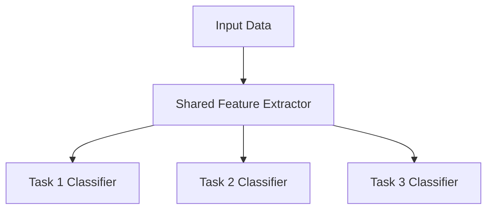
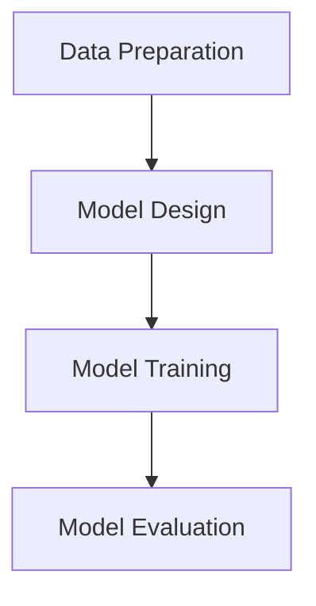

                 

## # 金融领域多任务学习在客户全方位画像中的应用

### 摘要

本文深入探讨了金融领域多任务学习（Multi-Task Learning, MTL）在客户全方位画像（Customer 360° Profiling）中的应用。随着金融科技的发展，客户数据变得越来越丰富，但同时也带来了数据处理的复杂性。多任务学习作为一种能够有效提升模型泛化能力和资源利用效率的技术，为金融领域的客户画像提供了一个新的视角。本文将从多任务学习的基本概念出发，逐步分析其在金融领域的应用场景、技术实现、挑战及解决方案，并展望未来的发展趋势。

### 关键词

- 多任务学习（Multi-Task Learning）
- 客户全方位画像（Customer 360° Profiling）
- 金融领域（Financial Domain）
- 模型泛化（Model Generalization）
- 资源利用（Resource Utilization）

### 1. 背景介绍

#### 1.1 多任务学习的基本概念

多任务学习是一种机器学习技术，旨在通过训练一个模型同时解决多个相关任务。其核心思想是利用任务之间的关联性来提高每个任务的预测性能，同时降低整体模型的复杂性。多任务学习的关键概念包括任务共享（Task Sharing）和任务区分（Task Distinction）。

- **任务共享**：共享模型参数可以减少参数数量，提高模型的泛化能力。
- **任务区分**：确保每个任务都得到适当的关注，避免一个任务过度影响其他任务。

#### 1.2 客户全方位画像的重要性

在金融领域，客户全方位画像是一个关键的业务需求。它旨在通过整合和分析来自多个渠道的客户数据，构建一个全面的客户视图，从而支持个性化服务、风险管理和客户关系管理。

- **个性化服务**：通过了解客户的行为和偏好，金融公司可以提供更个性化的产品和服务。
- **风险管理**：全面了解客户的情况有助于识别潜在的信用风险和欺诈行为。
- **客户关系管理**：基于全方位的画像，金融机构可以更好地维护和提升客户满意度。

#### 1.3 多任务学习在客户全方位画像中的应用

多任务学习在金融领域的客户全方位画像中具有广泛的应用潜力。通过同时处理多个任务，如客户信用评分、欺诈检测和产品推荐，多任务学习可以：

- **提高预测准确性**：利用任务之间的关联性，提升每个任务的性能。
- **资源优化**：通过共享模型参数，减少计算资源的需求。
- **增强模型的鲁棒性**：通过同时学习多个任务，提高模型对数据异常的适应性。

### 2. 核心概念

#### 2.1 多任务学习的定义和基本原理

多任务学习（Multi-Task Learning, MTL）是一种机器学习技术，旨在同时训练多个相关任务。其定义可以表述为：

> 多任务学习是一种通过共享模型参数来提高多个任务性能的机器学习技术。

多任务学习的基本原理包括：

- **参数共享**：不同任务共享相同的模型参数，减少参数数量。
- **联合训练**：同时训练多个任务，利用任务间的关联性提高模型性能。
- **任务映射**：将不同任务映射到共同的低维空间，实现任务间的共享。

#### 2.2 多任务学习的类型和变体

多任务学习有多种类型和变体，根据任务之间的关系和共享策略的不同，可以分为以下几类：

- **共享特征层**：不同任务共享底层特征提取层，但任务层各自独立。
- **共享模型层**：所有任务共享相同的模型结构，但各自有不同的输出层。
- **级联多任务学习**：先训练一个基础模型，然后将该模型的输出作为其他任务的输入。
- **对抗多任务学习**：通过对抗性训练机制，使多个任务相互竞争和协作。

#### 2.3 多任务学习的理论框架和数学模型

多任务学习的理论框架通常包括以下几个方面：

- **损失函数**：多任务学习的损失函数是各个任务损失函数的加权和，通常采用自适应权重调整方法。
- **优化算法**：多任务学习通常采用梯度下降及其变种，如随机梯度下降（SGD）和Adam优化器。
- **正则化策略**：通过L2正则化、Dropout等方法，防止过拟合并提高模型的泛化能力。

数学模型可以表示为：

$$
L = \sum_{i=1}^{N} w_i \cdot L_i
$$

其中，$L$ 是总损失函数，$L_i$ 是第 $i$ 个任务的损失函数，$w_i$ 是第 $i$ 个任务的权重。

#### 2.4 多任务学习架构的Mermaid图表示

为了更好地理解多任务学习的架构，我们可以使用Mermaid图来表示其基本结构。以下是一个简单的Mermaid图示例：

在这个图中，输入数据首先通过共享特征提取器（Shared Feature Extractor）提取特征，然后这些特征被分别传递到不同的分类器（Classifier），用于执行不同的任务。

### 3. 应用案例

#### 3.1 客户全方位画像的概述

客户全方位画像是一种通过整合和分析客户数据，构建一个全面客户视图的方法。它涉及以下关键步骤：

- **数据采集**：从不同的渠道（如交易记录、社交媒体、客户调查等）收集客户数据。
- **数据清洗**：处理缺失值、噪声和异常值，确保数据质量。
- **数据整合**：将来自不同渠道的数据整合到一个统一的框架中。
- **特征工程**：提取有助于描绘客户特征的数据，如消费习惯、信用评分等。
- **模型训练**：使用机器学习算法训练模型，以预测客户行为、需求等。

#### 3.2 金融领域的挑战

在金融领域，客户全方位画像面临着以下挑战：

- **数据多样性**：金融数据来源广泛，包括交易记录、客户反馈、社交媒体信息等，数据的多样性增加了处理的复杂性。
- **数据质量**：数据质量问题（如缺失值、噪声、不一致性）会影响模型性能。
- **隐私保护**：客户数据隐私保护是金融领域的核心问题，需要在数据处理过程中确保数据安全和隐私。

#### 3.3 多任务学习在客户全方位画像中的应用

多任务学习在金融领域客户全方位画像中的应用案例包括：

- **客户信用评分**：同时考虑多个因素（如收入、消费习惯、信用历史等），提高评分模型的准确性。
- **欺诈检测**：利用多个数据源（如交易记录、账户活动等）同时训练欺诈检测模型，提高检测精度。
- **产品推荐**：通过分析客户的历史交易、浏览行为等多维度数据，提供个性化的产品推荐。

#### 3.4 多任务学习的优势与局限性

多任务学习在客户全方位画像中的应用具有以下优势：

- **提高模型性能**：通过任务之间的关联性，提高每个任务的预测性能。
- **资源利用效率**：通过共享模型参数，减少计算资源的需求。

然而，多任务学习也存在局限性：

- **任务依赖性**：某些任务可能对其他任务产生负面影响，导致整体性能下降。
- **模型复杂度**：多任务学习可能导致模型复杂度增加，增加训练难度。

### 4. 技术实现

#### 4.1 数据准备

在进行多任务学习之前，需要准备高质量的数据集。数据准备包括以下步骤：

- **数据收集**：从不同的渠道收集客户数据，如交易记录、社交媒体数据等。
- **数据清洗**：处理缺失值、噪声和异常值，确保数据质量。
- **数据整合**：将来自不同渠道的数据整合到一个统一的框架中，便于后续处理。
- **特征提取**：提取有助于描绘客户特征的数据，如消费习惯、信用评分等。

#### 4.2 模型开发

多任务学习模型的开发包括以下步骤：

- **模型设计**：设计多任务学习模型的结构，包括输入层、共享层和任务层。
- **模型训练**：使用训练数据集训练模型，调整模型参数，优化模型性能。
- **模型验证**：使用验证数据集评估模型性能，调整模型参数，避免过拟合。

#### 4.3 模型评估

模型评估包括以下步骤：

- **性能指标**：定义性能指标，如准确率、召回率、F1分数等，用于评估模型性能。
- **交叉验证**：使用交叉验证方法，评估模型在不同数据子集上的性能。
- **模型优化**：根据评估结果，调整模型参数，优化模型性能。

#### 4.4 模型训练和评估的Mermaid图表示

为了更好地理解多任务学习的模型训练和评估过程，我们可以使用Mermaid图来表示。以下是一个简单的Mermaid图示例：

在这个图中，数据准备（Data Preparation）后进行模型设计（Model Design），然后进行模型训练（Model Training）和评估（Model Evaluation）。

### 5. 挑战与解决方案

#### 5.1 数据隐私和安全性

在金融领域，客户数据隐私和安全是一个关键问题。为了解决数据隐私和安全问题，可以采取以下措施：

- **数据脱敏**：对敏感数据进行脱敏处理，如使用哈希函数或随机替换。
- **数据加密**：对传输和存储的数据进行加密，确保数据在传输和存储过程中的安全性。
- **隐私保护算法**：使用差分隐私、同态加密等隐私保护算法，在保证模型性能的同时保护数据隐私。

#### 5.2 过拟合和泛化能力

多任务学习的一个挑战是过拟合问题。为了提高模型的泛化能力，可以采取以下措施：

- **正则化**：使用L1、L2正则化等正则化方法，减少模型的复杂度，防止过拟合。
- **数据增强**：通过数据增强方法，增加训练数据多样性，提高模型的泛化能力。
- **模型选择**：选择合适的模型结构和参数，避免模型过于复杂，导致过拟合。

#### 5.3 类不平衡问题

在金融领域，类不平衡问题是一个常见问题。为了解决类不平衡问题，可以采取以下措施：

- **重采样**：通过重采样方法，平衡不同类别的数据分布。
- **成本敏感**：在损失函数中引入成本敏感策略，提高模型对少数类别的关注。
- **集成方法**：使用集成方法，如随机森林、梯度提升树等，提高模型的分类性能。

#### 5.4 实践建议

在实施多任务学习时，以下实践建议有助于提高项目成功率：

- **需求明确**：明确项目需求，确保多任务学习模型的目标与实际业务需求相符。
- **数据质量**：确保数据质量，进行充分的预处理和清洗工作。
- **模型选择**：选择合适的模型结构和算法，根据任务特点和数据特性进行优化。
- **迭代优化**：通过多次迭代优化，逐步提高模型性能和泛化能力。
- **安全合规**：确保数据处理和模型训练过程符合数据安全和隐私保护法规。

### 6. 未来趋势与展望

多任务学习在金融领域具有广泛的应用前景，未来发展趋势包括：

- **算法创新**：随着人工智能技术的不断发展，新的多任务学习算法将不断涌现，提高模型性能和资源利用效率。
- **应用拓展**：多任务学习将在金融领域的更多应用场景中发挥作用，如个性化风险管理、智能投顾等。
- **跨领域融合**：多任务学习将与其他领域的技术（如区块链、物联网等）融合，推动金融科技的创新和发展。

### 结论

本文从多任务学习的基本概念出发，探讨了其在金融领域客户全方位画像中的应用。通过分析应用案例、技术实现和挑战与解决方案，本文展示了多任务学习在提高模型性能、资源利用效率和业务价值方面的潜力。随着人工智能技术的不断发展，多任务学习将在金融领域发挥越来越重要的作用，为金融机构提供更智能、更个性化的服务。

### 作者信息

作者：AI天才研究院/AI Genius Institute & 禅与计算机程序设计艺术 /Zen And The Art of Computer Programming

---

通过上述结构化的分析，本文为金融领域多任务学习在客户全方位画像中的应用提供了全面、深入的探讨。希望读者能够从中获得启发，并在实际项目中应用多任务学习技术，提升金融服务的智能化水平。在未来的发展中，多任务学习将继续推动金融科技的进步，为金融机构带来更多的创新机遇。

