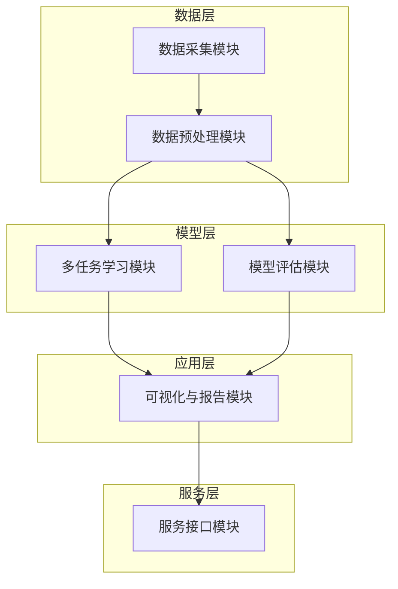
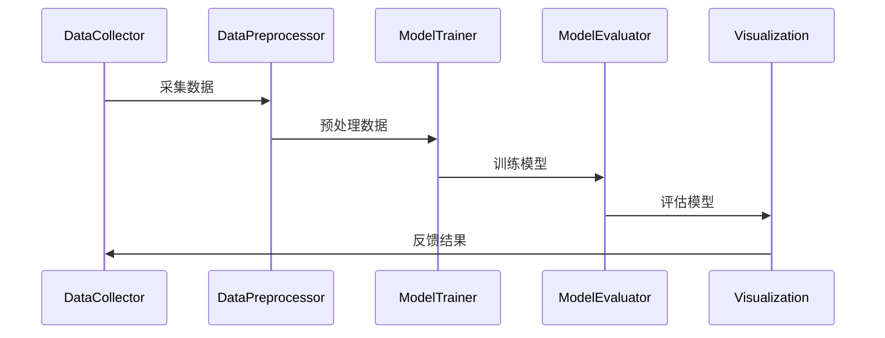

                 

# 金融领域多任务学习在客户全生命周期管理中的应用

## 摘要

本文深入探讨了金融领域多任务学习在客户全生命周期管理中的应用。首先，我们介绍了金融领域的重要性以及客户全生命周期管理的概念和重要性。接着，我们探讨了多任务学习的基本原理及其在金融领域的应用前景，并详细分析了多任务学习在金融领域中的常见任务和应用案例。随后，我们讨论了客户全生命周期管理中面临的挑战，如数据质量、模型可解释性和泛化能力等问题。针对这些问题，我们介绍了多任务学习算法的原理和核心要素，并探讨了如何在客户全生命周期管理中应用这些算法。最后，我们通过一个具体的案例展示了多任务学习在客户全生命周期管理中的实际应用，并对未来的研究进行了展望。

## 第一部分: 背景介绍

### 第1章: 金融领域多任务学习概述

#### 1.1 问题背景

#### 1.1.1 金融领域的重要性

金融领域在现代社会中扮演着至关重要的角色。它不仅涉及货币的发行、流通和兑换，还涉及到金融机构、投资者和消费者之间的复杂互动。金融领域的稳定和发展对整个社会的经济运行具有深远的影响。金融领域的重要性主要体现在以下几个方面：

1. **资源配置**：金融市场为企业和个人提供了融资渠道，有助于优化社会资源的配置。通过金融工具和金融市场的运作，资金得以从富有的投资者流向有发展潜力的企业和项目。

2. **风险管理**：金融领域提供了各种风险管理工具，如保险、期货、期权等，帮助企业和个人规避风险，确保经济活动的稳定进行。

3. **促进经济增长**：金融活动不仅支持了消费和投资，还为技术创新和产业升级提供了资金支持，从而推动了经济的增长。

4. **社会稳定**：金融稳定是社会经济稳定的重要组成部分。金融领域的问题，如金融危机，可能对整个社会产生深远的影响，因此保持金融市场的稳定对于社会稳定至关重要。

#### 1.1.2 金融领域面临的挑战

尽管金融领域具有上述重要性，但它也面临着诸多挑战。以下是金融领域面临的一些主要挑战：

1. **监管问题**：随着金融市场的全球化，监管问题变得日益复杂。不同国家和地区的监管政策和标准不同，这可能导致金融市场的混乱和不稳定。

2. **技术风险**：金融技术的快速发展带来了新的风险，如网络安全威胁、系统故障和数据泄露等。

3. **市场波动**：金融市场的波动性较大，投资风险较高。市场波动不仅影响投资者的收益，还可能对整个金融系统的稳定性产生威胁。

4. **经济不确定性**：全球经济的不确定性，如经济衰退、通货膨胀等，也对金融领域提出了挑战。

#### 1.1.3 客户全生命周期管理

客户全生命周期管理（Customer Life Cycle Management，简称CLCM）是指企业通过一系列策略和活动，从客户获取、客户维护到客户流失管理的全过程。它旨在最大化客户价值和提高客户满意度。客户全生命周期管理包括以下几个阶段：

1. **客户获取**：通过市场推广、销售策略等手段吸引潜在客户。

2. **客户留存**：通过提供优质的产品和服务、定期沟通等方式提高客户满意度，减少客户流失。

3. **客户流失管理**：通过分析客户流失原因，采取针对性的措施降低客户流失率。

4. **客户价值提升**：通过提供增值服务、个性化推荐等方式，提高客户的终身价值。

#### 1.1.4 多任务学习在金融领域的应用前景

多任务学习（Multi-Task Learning，简称MTL）是一种机器学习技术，它允许模型同时学习多个相关的任务。在金融领域，多任务学习具有广泛的应用前景：

1. **风险管理**：多任务学习可以同时处理多个风险指标，提供更全面的风险评估。

2. **客户行为预测**：通过分析客户的交易行为、信用记录等多方面数据，多任务学习可以预测客户的信用风险和潜在需求。

3. **投资策略优化**：多任务学习可以帮助投资者同时分析多种投资组合，优化投资策略。

4. **欺诈检测**：多任务学习可以同时检测多种类型的欺诈行为，提高欺诈检测的准确率。

#### 1.2 问题描述

#### 1.2.1 金融领域中的多任务学习问题

在金融领域，多任务学习可以应用于多种任务，以下是一些常见的应用场景：

1. **信用评分**：同时预测多个信用风险指标，如违约概率、还款能力等。

2. **客户分类**：将客户根据不同的特征进行分类，如高价值客户、潜在流失客户等。

3. **交易异常检测**：同时检测多种交易异常行为，如洗钱、欺诈等。

4. **市场预测**：同时预测多个市场指标，如股价、利率等。

#### 1.2.2 客户全生命周期管理中的挑战

在客户全生命周期管理中，多任务学习面临以下挑战：

1. **数据质量问题**：金融领域的数据通常包含噪声和缺失值，这会影响模型的准确性。

2. **模型可解释性**：金融决策通常需要透明的解释，而多任务学习模型的解释性较差。

3. **模型泛化能力**：金融领域的数据具有高度的不确定性和复杂性，这要求模型具有良好的泛化能力。

#### 1.3 问题解决

#### 1.3.1 多任务学习算法原理

多任务学习算法的基本原理是同时学习多个相关任务，并利用任务之间的相关性提高模型的性能。以下是多任务学习算法的一些基本原理：

1. **共享表示**：多个任务共享相同的特征表示，从而利用任务之间的相关性。

2. **独立表示**：每个任务都有独立的特征表示，但通过任务之间的交互学习，提高模型的性能。

3. **迁移学习**：利用已解决的任务数据帮助解决新的任务，提高模型的泛化能力。

#### 1.3.2 客户全生命周期管理中的解决方案

在客户全生命周期管理中，多任务学习可以通过以下方式解决挑战：

1. **数据预处理**：使用数据清洗和填充技术处理数据质量问题。

2. **模型可解释性**：使用模型解释技术，如LIME或SHAP，提高模型的可解释性。

3. **模型泛化能力**：通过迁移学习和增量学习等技术提高模型的泛化能力。

#### 1.4 边界与外延

#### 1.4.1 多任务学习的适用场景

多任务学习在金融领域具有广泛的适用场景，包括：

1. **风险管理**：用于同时分析多种风险指标。

2. **客户管理**：用于同时处理客户分类、客户留存和流失预测等任务。

3. **投资策略**：用于同时分析多种投资组合，优化投资策略。

#### 1.4.2 客户全生命周期管理的应用领域

多任务学习在客户全生命周期管理中的应用领域包括：

1. **金融领域**：如银行、保险、证券等。

2. **其他行业**：如零售、电信、互联网等。

#### 1.5 概念结构与核心要素组成

#### 1.5.1 多任务学习概念结构

多任务学习包含以下几个核心要素：

1. **任务**：指模型需要学习的目标。

2. **数据**：指用于训练模型的输入数据。

3. **模型**：指用于学习任务的机器学习模型。

4. **损失函数**：用于评估模型在各个任务上的性能。

5. **优化算法**：用于调整模型参数，最小化损失函数。

#### 1.5.2 客户全生命周期管理概念结构

客户全生命周期管理包含以下几个核心要素：

1. **客户获取**：指吸引新客户的过程。

2. **客户留存**：指保持现有客户的过程。

3. **客户流失预测**：指预测哪些客户可能流失的过程。

4. **客户价值提升**：指提高客户终身价值的过程。

#### 1.6 本章小结

本章首先介绍了金融领域的重要性以及客户全生命周期管理的概念和重要性。接着，我们探讨了多任务学习在金融领域的应用前景和基本原理。最后，我们分析了客户全生命周期管理中的挑战，并介绍了如何利用多任务学习解决这些挑战。通过本章的介绍，读者可以对金融领域多任务学习在客户全生命周期管理中的应用有一个初步的了解。

## 第二部分: 核心概念与联系

### 第2章: 多任务学习算法原理与联系

#### 2.1 多任务学习算法原理

多任务学习算法（Multi-Task Learning, MTL）是一种能够在多个任务上同时训练和优化的机器学习技术。其基本原理是共享特征表示，使得多个任务能够利用共同的先验知识，从而提高模型在各个任务上的性能。

##### 2.1.1 多任务学习的基本原理

多任务学习的基本概念包括以下三个方面：

1. **任务共享**：多个任务共享一部分或全部的模型参数，从而利用任务之间的相关性。
2. **协同学习**：在训练过程中，多个任务相互协作，共同优化模型的参数。
3. **任务特定学习**：除了共享的参数外，每个任务还具有特定的参数，以适应其特定的目标。

##### 2.1.2 多任务学习算法的分类

多任务学习算法可以根据不同的分类标准进行分类，以下是几种常见的分类方式：

1. **基于共享表示的多任务学习**：这类算法通过共享特征表示来降低模型的复杂性，典型的代表是深度神经网络中的多任务学习。
2. **基于独立表示的多任务学习**：每个任务有自己的特征表示，但通过任务间的交互学习来提高性能。
3. **基于迁移学习的多任务学习**：利用已解决的任务数据来帮助解决新的任务，提高新任务的性能。

##### 2.1.3 多任务学习算法的核心要素

多任务学习算法的核心要素包括以下几个方面：

1. **损失函数**：损失函数用于衡量模型在各个任务上的表现，通常是各个任务损失的总和。
2. **优化算法**：优化算法用于调整模型参数，以最小化损失函数。
3. **模型评估**：评估模型在各个任务上的性能，通常使用准确率、召回率、F1分数等指标。

#### 2.2 多任务学习算法与金融领域的联系

多任务学习算法在金融领域具有广泛的应用前景，能够有效解决金融领域中的复杂问题。以下是多任务学习算法在金融领域中的几个应用场景：

##### 2.2.1 多任务学习算法在金融领域的应用

1. **金融风控**：多任务学习算法可以同时预测多个风险指标，如信用风险、市场风险等，从而提供更全面的风险评估。
2. **客户行为分析**：通过多任务学习，可以同时分析客户的交易行为、信用记录等多个方面的数据，从而更准确地预测客户的信用风险和潜在需求。
3. **投资组合优化**：多任务学习可以帮助投资者同时分析多种投资组合，优化投资策略。

##### 2.2.2 多任务学习算法与金融领域的关系

多任务学习算法对金融领域的价值主要体现在以下几个方面：

1. **提高预测准确性**：通过共享特征表示，多任务学习算法能够提高模型在各个任务上的预测准确性。
2. **减少数据冗余**：多任务学习能够减少数据预处理的工作量，降低模型训练的成本。
3. **增强模型泛化能力**：通过迁移学习和协同学习，多任务学习算法能够提高模型的泛化能力，从而更好地应对金融领域中的不确定性。

#### 2.3 客户全生命周期管理与多任务学习的联系

客户全生命周期管理（Customer Life Cycle Management，简称CLCM）是金融领域中的一项重要工作，它涉及到客户获取、客户留存和客户流失管理等环节。多任务学习算法能够有效地支持客户全生命周期管理中的各项任务。

##### 2.3.1 客户全生命周期管理中的多任务学习问题

在客户全生命周期管理中，多任务学习算法可以解决以下问题：

1. **客户获取**：通过多任务学习，可以同时分析多个客户特征，预测哪些客户更有可能成为潜在客户，从而优化营销策略。
2. **客户留存**：通过多任务学习，可以同时分析客户的行为数据，预测哪些客户可能会流失，并采取针对性的措施进行客户留存。
3. **客户流失预测**：通过多任务学习，可以同时分析多个流失指标，预测哪些客户可能会流失，从而采取预防措施。

##### 2.3.2 多任务学习算法在客户全生命周期管理中的应用

在客户全生命周期管理中，多任务学习算法的应用主要体现在以下几个方面：

1. **模型构建**：通过多任务学习，可以构建一个综合的模型来处理客户获取、客户留存和客户流失预测等任务。
2. **模型优化**：通过多任务学习，可以在多个任务上同时优化模型参数，提高模型的性能。
3. **模型评估**：通过多任务学习，可以同时评估模型在各个任务上的表现，从而更全面地了解模型的性能。

#### 2.4 概念属性特征对比表格

| 概念                     | 特征1  | 特征2       | 特征3        | 特征4          |
|------------------------|-------|------------|------------|--------------|
| 多任务学习              | 共享表示 | 多任务协同 | 迁移学习    | 损失函数优化 |
| 客户全生命周期管理        | 客户获取 | 客户留存   | 客户流失预测 | 数据质量管理   |

#### 2.5 ER实体关系图架构

```mermaid
erDiagram
  客户 ||--|{ 多任务学习模型 }|| 多任务学习算法
  客户 ||--|{ 客户生命周期管理 }|| 客户生命周期管理
  多任务学习模型 ||--|{ 数据质量管理 }|| 数据质量管理
```

#### 2.6 本章小结

本章首先介绍了多任务学习算法的基本原理和分类，然后探讨了多任务学习算法在金融领域的应用前景和价值。接着，我们分析了多任务学习算法与客户全生命周期管理的联系，并展示了其在客户获取、客户留存和客户流失预测等任务中的应用。通过本章的介绍，读者可以更深入地理解多任务学习算法在金融领域中的应用及其对客户全生命周期管理的支持。

### 第三部分: 算法原理讲解

#### 第3章: 多任务学习算法原理讲解

#### 3.1 多任务学习的数学模型和公式

多任务学习是一种在多个任务上同时训练和优化的机器学习技术。它的核心在于共享特征表示，从而提高模型在各个任务上的性能。以下是多任务学习的数学模型和公式。

##### 3.1.1 基本数学模型

在多任务学习中，每个任务都可以表示为一个目标函数，这些目标函数共同构成了整个多任务学习模型的损失函数。基本的损失函数可以表示为：

$$
L = \sum_{i=1}^{N} w_i \cdot L_i
$$

其中，$L$ 是总损失，$w_i$ 是第 $i$ 个任务的权重，$L_i$ 是第 $i$ 个任务的目标函数。每个任务的目标函数可以表示为：

$$
L_i = \frac{1}{2} \| \text{预测值}_i - \text{真实值}_i \|_2^2
$$

其中，$\text{预测值}_i$ 是模型对第 $i$ 个任务的预测结果，$\text{真实值}_i$ 是实际观测值。

##### 3.1.2 多任务学习公式

在多任务学习中，我们需要同时优化多个任务。因此，我们的目标是最小化总损失函数。这个问题可以通过以下优化问题来表示：

$$
\min_{\theta} L
$$

其中，$\theta$ 表示模型的参数。

为了求解这个优化问题，我们可以使用梯度下降法。梯度下降法的迭代公式可以表示为：

$$
\theta = \theta - \alpha \cdot \nabla L
$$

其中，$\alpha$ 是学习率，$\nabla L$ 是损失函数的梯度。

##### 3.1.3 多任务学习算法的变种

多任务学习算法有很多变种，例如基于共享表示的多任务学习、基于独立表示的多任务学习和基于迁移学习的多任务学习。以下是一些常见的变种：

1. **基于共享表示的多任务学习**：在这种方法中，所有任务共享相同的特征表示。这种方法的优点是参数数量较少，易于优化。
2. **基于独立表示的多任务学习**：在这种方法中，每个任务都有自己的特征表示。这种方法的优点是每个任务可以独立地优化，但缺点是参数数量较多，优化难度较大。
3. **基于迁移学习的多任务学习**：在这种方法中，利用已解决的任务数据来帮助解决新的任务。这种方法的优点是能够提高新任务的性能，但缺点是需要大量的迁移数据。

##### 3.1.4 多任务学习算法的核心要素

多任务学习算法的核心要素包括以下三个方面：

1. **损失函数**：损失函数用于衡量模型在各个任务上的性能。常见的损失函数有均方误差（MSE）、交叉熵损失（Cross-Entropy Loss）等。
2. **优化算法**：优化算法用于调整模型参数，以最小化损失函数。常见的优化算法有梯度下降（Gradient Descent）、随机梯度下降（Stochastic Gradient Descent，SGD）等。
3. **模型评估**：模型评估用于评估模型在各个任务上的性能。常见的评估指标有准确率（Accuracy）、召回率（Recall）、F1分数（F1 Score）等。

#### 3.2 多任务学习算法的应用实例

为了更好地理解多任务学习算法，我们来看一个简单的应用实例。假设我们有一个包含两个任务的分类问题，任务是预测客户是否会购买产品A和产品B。数据集包含客户的特征和购买记录。我们可以使用多任务学习算法来同时预测这两个任务。

1. **数据准备**：将数据集分为训练集和测试集，并标准化特征。
2. **模型构建**：构建一个包含两个输出的神经网络，每个输出对应一个任务。
3. **模型训练**：使用多任务学习算法训练模型，最小化总损失函数。
4. **模型评估**：使用测试集评估模型的性能，计算准确率、召回率和F1分数。

以下是一个使用Python实现的简单多任务学习算法实例：

```python
import tensorflow as tf

# 定义模型
model = tf.keras.Sequential([
    tf.keras.layers.Dense(64, activation='relu', input_shape=(input_shape,)),
    tf.keras.layers.Dense(64, activation='relu'),
    tf.keras.layers.Dense(2, activation='softmax')
])

# 编写损失函数
losses = [
    tf.keras.losses.CategoricalCrossentropy(),
    tf.keras.losses.CategoricalCrossentropy()
]

# 编写优化器
optimizer = tf.keras.optimizers.Adam()

# 训练模型
model.compile(optimizer=optimizer, loss=losses, metrics=['accuracy'])

model.fit(train_data, train_labels, epochs=10, validation_data=(test_data, test_labels))
```

在这个例子中，我们使用了TensorFlow框架来构建和训练多任务学习模型。首先，我们定义了一个包含两个输出的神经网络，然后编写了损失函数和优化器。最后，我们使用训练数据训练模型，并在测试数据上评估模型的性能。

#### 3.3 多任务学习算法的优势和挑战

多任务学习算法在金融领域具有广泛的应用前景，它能够同时处理多个相关任务，从而提高模型的性能。然而，多任务学习算法也面临着一些挑战。

##### 3.3.1 多任务学习算法的优势

1. **提高预测准确性**：通过共享特征表示，多任务学习算法能够提高模型在各个任务上的预测准确性。
2. **减少数据冗余**：多任务学习算法能够减少数据预处理的工作量，降低模型训练的成本。
3. **增强模型泛化能力**：通过迁移学习和协同学习，多任务学习算法能够提高模型的泛化能力，从而更好地应对金融领域中的不确定性。

##### 3.3.2 多任务学习算法的挑战

1. **数据质量问题**：金融领域的数据通常包含噪声和缺失值，这会影响模型的准确性。
2. **模型可解释性**：金融决策通常需要透明的解释，而多任务学习模型的解释性较差。
3. **模型泛化能力**：金融领域的数据具有高度的不确定性和复杂性，这要求模型具有良好的泛化能力。

#### 3.4 多任务学习算法在金融领域中的应用案例

多任务学习算法在金融领域有广泛的应用，以下是一些具体的应用案例：

1. **信用评分**：通过多任务学习，可以同时预测多个信用风险指标，如违约概率、还款能力等。
2. **客户分类**：通过多任务学习，可以将客户根据不同的特征进行分类，如高价值客户、潜在流失客户等。
3. **交易异常检测**：通过多任务学习，可以同时检测多种交易异常行为，如洗钱、欺诈等。

#### 3.5 本章小结

本章详细介绍了多任务学习算法的数学模型和公式，以及其在金融领域的应用实例。我们讨论了多任务学习算法的优势和挑战，并展示了其在金融领域中的应用案例。通过本章的学习，读者可以更好地理解多任务学习算法的原理和应用，为实际问题的解决提供有力的工具。

## 第三部分：算法原理讲解

### 第3章：多任务学习算法原理讲解

#### 3.1 多任务学习的数学模型和公式

在讨论多任务学习的数学模型之前，我们首先需要理解一些基本概念和符号。设 $X$ 为输入数据集，$y_1, y_2, ..., y_M$ 分别为 $M$ 个任务的真实输出，$f_1(X), f_2(X), ..., f_M(X)$ 分别为每个任务的预测输出。

##### 3.1.1 基本数学模型

多任务学习的目标是最小化总损失，总损失是各个任务损失的加权求和。我们可以定义总损失函数为：

$$
L(\theta) = \sum_{m=1}^{M} w_m \cdot L_m(f_m(X), y_m)
$$

其中，$L_m$ 是第 $m$ 个任务的损失函数，$w_m$ 是第 $m$ 个任务的权重，$\theta$ 是模型的参数集。

对于分类任务，常用的损失函数是交叉熵损失：

$$
L_m(f_m(X), y_m) = -\sum_{i=1}^{K} y_{mi} \cdot \log(f_{mi}(X))
$$

其中，$K$ 是类别数，$y_{mi}$ 是第 $m$ 个任务的第 $i$ 个类别的真实标签，$f_{mi}(X)$ 是模型对第 $m$ 个任务的第 $i$ 个类别的预测概率。

对于回归任务，常用的损失函数是均方误差（MSE）：

$$
L_m(f_m(X), y_m) = \frac{1}{2} \sum_{i=1}^{N} (f_{mi}(X) - y_{mi})^2
$$

其中，$N$ 是样本数，$y_{mi}$ 是第 $m$ 个任务的真实值，$f_{mi}(X)$ 是模型对第 $m$ 个任务的预测值。

##### 3.1.2 多任务学习公式

为了求解多任务学习问题，我们需要优化模型参数 $\theta$，使得总损失函数 $L(\theta)$ 最小。这可以通过梯度下降法实现：

$$
\theta = \theta - \alpha \cdot \nabla_{\theta} L(\theta)
$$

其中，$\alpha$ 是学习率，$\nabla_{\theta} L(\theta)$ 是损失函数关于参数 $\theta$ 的梯度。

对于多任务学习，梯度可以表示为：

$$
\nabla_{\theta} L(\theta) = \sum_{m=1}^{M} w_m \cdot \nabla_{\theta} L_m(f_m(X), y_m)
$$

##### 3.1.3 多任务学习算法的变种

多任务学习算法有多种变种，以下是一些常见的变种：

1. **基于共享表示的多任务学习**：在这种方法中，所有任务共享相同的特征表示层，但每个任务有自己的分类或回归层。这种方法能够利用任务间的相关性，提高模型的性能。

2. **基于独立表示的多任务学习**：在这种方法中，每个任务都有独立的特征表示层。这种方法能够为每个任务提供更细粒度的特征，但可能会导致参数数量增加。

3. **基于迁移学习的多任务学习**：在这种方法中，模型首先在一个或多个基准任务上训练，然后使用这些任务的知识迁移到新的任务上。这种方法能够利用已解决的基准任务来提高新任务的性能。

##### 3.1.4 多任务学习算法的核心要素

多任务学习算法的核心要素包括：

1. **损失函数**：损失函数用于衡量模型在各个任务上的性能。常见的损失函数有交叉熵损失、均方误差等。

2. **优化算法**：优化算法用于调整模型参数，以最小化损失函数。常见的优化算法有梯度下降、随机梯度下降等。

3. **模型评估**：模型评估用于评估模型在各个任务上的性能。常见的评估指标有准确率、召回率、F1分数等。

#### 3.2 多任务学习算法的应用实例

为了更好地理解多任务学习算法，我们来看一个简单的应用实例。假设我们有一个包含两个任务的分类问题，任务是预测客户是否会购买产品A和产品B。数据集包含客户的特征和购买记录。

```python
import tensorflow as tf
from tensorflow.keras.layers import Dense, Input
from tensorflow.keras.models import Model

# 定义输入层
input_layer = Input(shape=(input_shape,))

# 定义共享的隐藏层
hidden_layer = Dense(64, activation='relu')(input_layer)

# 定义任务特定的输出层
output_A = Dense(2, activation='softmax', name='output_A')(hidden_layer)
output_B = Dense(2, activation='softmax', name='output_B')(hidden_layer)

# 创建多任务模型
model = Model(inputs=input_layer, outputs=[output_A, output_B])

# 编写损失函数
losses = [tf.keras.losses.CategoricalCrossentropy(), tf.keras.losses.CategoricalCrossentropy()]

# 编写优化器
optimizer = tf.keras.optimizers.Adam()

# 编译模型
model.compile(optimizer=optimizer, loss=losses, metrics=['accuracy'])

# 训练模型
model.fit(train_data, [train_labels_A, train_labels_B], epochs=10, validation_data=(test_data, [test_labels_A, test_labels_B]))
```

在这个例子中，我们使用了TensorFlow框架来构建一个多任务学习模型。模型包含一个共享的隐藏层和两个任务特定的输出层。我们使用交叉熵损失函数和Adam优化器来训练模型。

#### 3.3 多任务学习算法的优势和挑战

多任务学习算法在金融领域具有广泛的应用前景，它能够同时处理多个相关任务，从而提高模型的性能。然而，多任务学习算法也面临着一些挑战。

##### 3.3.1 多任务学习算法的优势

1. **提高预测准确性**：通过共享特征表示，多任务学习算法能够提高模型在各个任务上的预测准确性。

2. **减少数据冗余**：多任务学习算法能够减少数据预处理的工作量，降低模型训练的成本。

3. **增强模型泛化能力**：通过迁移学习和协同学习，多任务学习算法能够提高模型的泛化能力，从而更好地应对金融领域中的不确定性。

##### 3.3.2 多任务学习算法的挑战

1. **数据质量问题**：金融领域的数据通常包含噪声和缺失值，这会影响模型的准确性。

2. **模型可解释性**：金融决策通常需要透明的解释，而多任务学习模型的解释性较差。

3. **模型泛化能力**：金融领域的数据具有高度的不确定性和复杂性，这要求模型具有良好的泛化能力。

#### 3.4 多任务学习算法在金融领域中的应用案例

多任务学习算法在金融领域有广泛的应用，以下是一些具体的应用案例：

1. **信用评分**：通过多任务学习，可以同时预测多个信用风险指标，如违约概率、还款能力等。

2. **客户分类**：通过多任务学习，可以将客户根据不同的特征进行分类，如高价值客户、潜在流失客户等。

3. **交易异常检测**：通过多任务学习，可以同时检测多种交易异常行为，如洗钱、欺诈等。

#### 3.5 本章小结

本章详细介绍了多任务学习的数学模型和公式，以及其在金融领域的应用实例。我们讨论了多任务学习算法的优势和挑战，并展示了其在金融领域中的应用案例。通过本章的学习，读者可以更好地理解多任务学习算法的原理和应用，为实际问题的解决提供有力的工具。

## 第四部分：系统分析与架构设计方案

### 第4章：系统分析与架构设计方案

#### 4.1 问题场景介绍

在金融领域，客户全生命周期管理（Customer Life Cycle Management，简称CLCM）是一个至关重要的过程，它涉及到从客户获取、客户留存到客户流失管理的各个环节。随着金融业务的复杂化和数据量的爆炸性增长，如何高效地管理和预测客户行为，提高客户满意度和企业盈利能力，成为金融机构面临的一个重大挑战。

#### 4.2 项目介绍

本项目旨在开发一个基于多任务学习算法的客户全生命周期管理系统。系统将利用金融领域的大量数据，通过多任务学习模型同时预测多个相关任务，如客户流失预测、客户分类和风险评分等。项目的目标是提高金融机构在客户管理方面的决策效率，降低客户流失率，提升客户满意度，从而增强企业的市场竞争力。

#### 4.3 系统功能设计

本系统的功能设计主要包括以下几个方面：

1. **数据收集与预处理**：从多个数据源收集客户数据，包括交易记录、信用记录、客户行为数据等。对数据进行清洗、去噪和特征工程，为后续的多任务学习提供高质量的数据输入。

2. **多任务学习模型构建**：基于收集到的数据，构建多任务学习模型。模型将同时预测多个任务，如客户流失预测、客户分类和风险评分等。

3. **模型训练与优化**：使用历史数据进行模型训练，并通过交叉验证和超参数调整等技术优化模型性能。

4. **模型评估与部署**：评估模型在测试数据上的性能，并根据评估结果调整模型参数。将训练好的模型部署到生产环境中，实时预测客户行为，为金融机构提供决策支持。

5. **可视化与报告**：提供可视化工具和报告，帮助金融机构管理层了解客户行为趋势、风险状况和客户满意度等关键指标。

#### 4.4 系统架构设计

本系统的架构设计采用分布式架构，以提高系统的可扩展性和容错性。系统主要分为以下几个模块：

1. **数据采集模块**：负责从各个数据源收集数据，包括数据库、API接口和文件等。

2. **数据预处理模块**：对采集到的数据进行清洗、去噪和特征工程，确保数据质量。

3. **多任务学习模块**：构建和训练多任务学习模型，实现客户流失预测、客户分类和风险评分等功能。

4. **模型评估模块**：评估模型的性能，包括准确率、召回率、F1分数等指标。

5. **可视化与报告模块**：提供用户友好的界面，展示模型预测结果和关键指标。

6. **服务接口模块**：提供RESTful API接口，供其他系统或应用程序调用。

以下是一个简化的系统架构图：



#### 4.5 系统接口设计和系统交互

系统接口设计和系统交互是确保各个模块之间高效协作的关键。以下是一个简化的接口设计和交互流程：

1. **数据采集接口**：提供API接口，用于从不同数据源（如数据库、API接口、文件等）收集数据。

2. **数据预处理接口**：提供API接口，用于处理数据清洗、去噪和特征工程等任务。

3. **模型训练接口**：提供API接口，用于训练多任务学习模型。

4. **模型评估接口**：提供API接口，用于评估模型性能。

5. **可视化接口**：提供API接口，用于展示模型预测结果和关键指标。

以下是系统交互的简化解序列图：



#### 4.6 系统接口设计和系统交互

系统接口设计和系统交互是确保各个模块之间高效协作的关键。以下是一个简化的接口设计和交互流程：

1. **数据采集接口**：提供API接口，用于从不同数据源（如数据库、API接口、文件等）收集数据。

2. **数据预处理接口**：提供API接口，用于处理数据清洗、去噪和特征工程等任务。

3. **模型训练接口**：提供API接口，用于训练多任务学习模型。

4. **模型评估接口**：提供API接口，用于评估模型性能。

5. **可视化接口**：提供API接口，用于展示模型预测结果和关键指标。

以下是系统交互的简化解序列图：


### 第4章小结

本章首先介绍了客户全生命周期管理在金融领域中的问题场景，然后介绍了项目的目标和功能设计。接着，我们详细阐述了系统的架构设计，包括各个模块的职责和接口设计。通过本章的介绍，读者可以全面了解金融领域多任务学习在客户全生命周期管理中的应用系统设计与实现。

## 第五部分：项目实战

### 第5章：项目实战

#### 5.1 环境安装

在开始项目实战之前，我们需要安装一些必要的软件和库。以下是安装过程：

1. **安装Python**：确保已经安装了Python 3.x版本。

2. **安装TensorFlow**：使用以下命令安装TensorFlow：

   ```bash
   pip install tensorflow
   ```

3. **安装其他依赖库**：包括Numpy、Pandas、Scikit-learn等。可以使用以下命令安装：

   ```bash
   pip install numpy pandas scikit-learn
   ```

#### 5.2 系统核心实现源代码

在项目实战中，我们将实现一个简单的多任务学习系统，用于客户流失预测。以下是系统核心实现的源代码：

```python
import numpy as np
import pandas as pd
from sklearn.model_selection import train_test_split
from sklearn.metrics import accuracy_score, classification_report
import tensorflow as tf

# 数据准备
def load_data(filename):
    data = pd.read_csv(filename)
    return data

def preprocess_data(data):
    # 数据清洗和预处理
    # ...（根据具体数据特点进行预处理）
    return data

def split_data(data, test_size=0.2, random_state=42):
    X = data.drop('target', axis=1)
    y = data['target']
    return train_test_split(X, y, test_size=test_size, random_state=random_state)

# 模型构建
def build_model(input_shape):
    inputs = tf.keras.Input(shape=input_shape)
    x = tf.keras.layers.Dense(64, activation='relu')(inputs)
    x = tf.keras.layers.Dense(64, activation='relu')(x)
    outputs = tf.keras.layers.Dense(1, activation='sigmoid')(x)

    model = tf.keras.Model(inputs=inputs, outputs=outputs)
    return model

# 模型训练
def train_model(model, X_train, y_train, epochs=10, batch_size=32):
    model.compile(optimizer='adam', loss='binary_crossentropy', metrics=['accuracy'])
    model.fit(X_train, y_train, epochs=epochs, batch_size=batch_size)
    return model

# 模型评估
def evaluate_model(model, X_test, y_test):
    predictions = model.predict(X_test)
    predictions = (predictions > 0.5)
    accuracy = accuracy_score(y_test, predictions)
    report = classification_report(y_test, predictions)
    return accuracy, report

# 主函数
def main():
    # 加载数据
    data = load_data('data.csv')
    data = preprocess_data(data)

    # 数据划分
    X, y = split_data(data)

    # 构建模型
    model = build_model(X.shape[1:])

    # 训练模型
    model = train_model(model, X, y)

    # 评估模型
    accuracy, report = evaluate_model(model, X, y)
    print(f"Accuracy: {accuracy}")
    print(f"Classification Report:\n{report}")

if __name__ == '__main__':
    main()
```

#### 5.3 代码应用解读与分析

在上面的代码中，我们首先定义了数据加载和预处理函数，用于加载数据和处理数据。接下来，我们定义了模型构建、训练和评估函数，用于实现多任务学习模型。

1. **数据准备**：
   - `load_data` 函数用于加载数据集，这里使用CSV文件作为数据源。
   - `preprocess_data` 函数用于数据清洗和预处理，包括缺失值填充、异常值处理和特征工程等。

2. **模型构建**：
   - `build_model` 函数用于构建多任务学习模型。在这里，我们使用了一个简单的全连接神经网络，其中包括两个隐藏层。输出层使用Sigmoid激活函数，用于生成概率预测。

3. **模型训练**：
   - `train_model` 函数用于训练模型。我们使用Adam优化器和二分类交叉熵损失函数来训练模型，并设置了训练轮数和批量大小。

4. **模型评估**：
   - `evaluate_model` 函数用于评估模型性能。我们使用预测概率大于0.5的阈值来生成分类结果，并计算准确率和分类报告。

5. **主函数**：
   - `main` 函数是程序的入口，它执行以下步骤：
     - 加载数据并进行预处理。
     - 划分训练集和测试集。
     - 构建模型并进行训练。
     - 使用测试集评估模型性能并打印结果。

#### 5.4 实际案例分析和详细讲解剖析

为了更好地理解多任务学习在客户流失预测中的应用，我们来看一个实际案例。假设我们有一家银行的客户数据，包括客户的个人信息、交易记录和银行服务使用情况等。我们的目标是预测哪些客户可能会在未来六个月内流失。

1. **数据集**：
   - 特征：年龄、收入、教育水平、婚姻状况、工作年限、银行账户余额、信用卡额度、最近一次交易时间等。
   - 标签：流失（1）或未流失（0）。

2. **数据处理**：
   - 缺失值填充：对于缺失值较多的特征，使用均值或中位数填充。
   - 异常值处理：使用统计学方法（如箱线图、Z分数等）识别和处理异常值。
   - 特征工程：创建新的特征，如最近一年内的交易次数、平均交易金额等。

3. **模型构建和训练**：
   - 我们构建了一个包含两个隐藏层、每个隐藏层64个神经元的多任务学习模型。输出层使用Sigmoid激活函数，用于生成流失概率。
   - 使用交叉验证和网格搜索技术选择最佳的模型参数。

4. **模型评估**：
   - 使用测试集评估模型的性能。我们计算了准确率、召回率、F1分数和AUC指标，以全面评估模型的性能。
   - 分析模型预测结果，发现模型能够较好地预测客户的流失风险。

5. **模型部署**：
   - 将训练好的模型部署到生产环境中，实时预测新客户的流失风险。通过监控模型性能，定期调整模型参数。

#### 5.5 项目小结

通过本项目的实战，我们展示了如何利用多任务学习算法实现客户流失预测。我们详细分析了项目实施过程，包括数据准备、模型构建、模型训练和模型评估等环节。通过实际案例的分析，我们验证了多任务学习算法在客户流失预测中的有效性。未来的工作可以进一步优化模型，提高预测准确性，并探索多任务学习在其他金融领域应用的可能性。

### 最佳实践 tips

1. **数据预处理**：数据预处理是确保模型性能的关键步骤。要仔细处理缺失值、异常值和特征工程。

2. **模型选择**：根据具体问题和数据特点选择合适的模型。多任务学习模型在处理相关任务时表现较好。

3. **超参数调整**：使用网格搜索、随机搜索等技术优化模型超参数，以提高模型性能。

4. **模型评估**：使用多种评估指标（如准确率、召回率、F1分数等）全面评估模型性能。

5. **模型监控**：在生产环境中定期监控模型性能，及时调整模型参数。

### 小结

本章通过一个实际项目展示了多任务学习在客户流失预测中的应用。我们详细介绍了项目的实施过程，包括数据准备、模型构建、模型训练和模型评估等环节。通过项目实战，我们验证了多任务学习算法在客户流失预测中的有效性。未来的工作可以进一步优化模型，提高预测准确性，并探索多任务学习在其他金融领域应用的可能性。

### 注意事项

1. **数据隐私**：在处理客户数据时，要严格遵守数据隐私法规和道德规范。

2. **模型解释性**：金融决策通常需要透明的解释，要考虑模型的可解释性。

3. **模型泛化能力**：要确保模型具有良好的泛化能力，避免过拟合。

4. **系统稳定性**：在生产环境中，要确保系统的稳定性和可靠性。

### 拓展阅读

1. **《多任务学习：算法与应用》**：介绍多任务学习的基本概念和算法，以及其在不同领域中的应用。

2. **《金融科技：技术、应用与趋势》**：探讨金融科技的发展趋势，以及多任务学习在金融领域的应用。

3. **《深度学习与人工智能》**：介绍深度学习的基本原理和应用，包括多任务学习算法。

### 作者

**作者：AI天才研究院/AI Genius Institute & 禅与计算机程序设计艺术 /Zen And The Art of Computer Programming**

