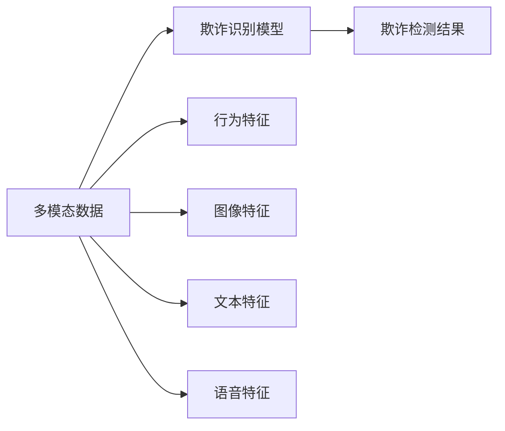
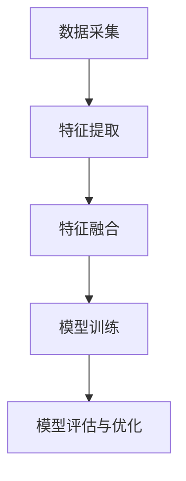
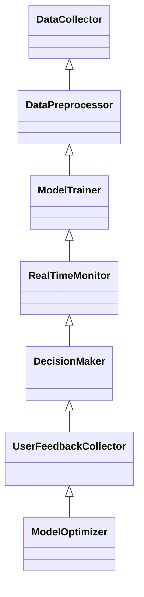
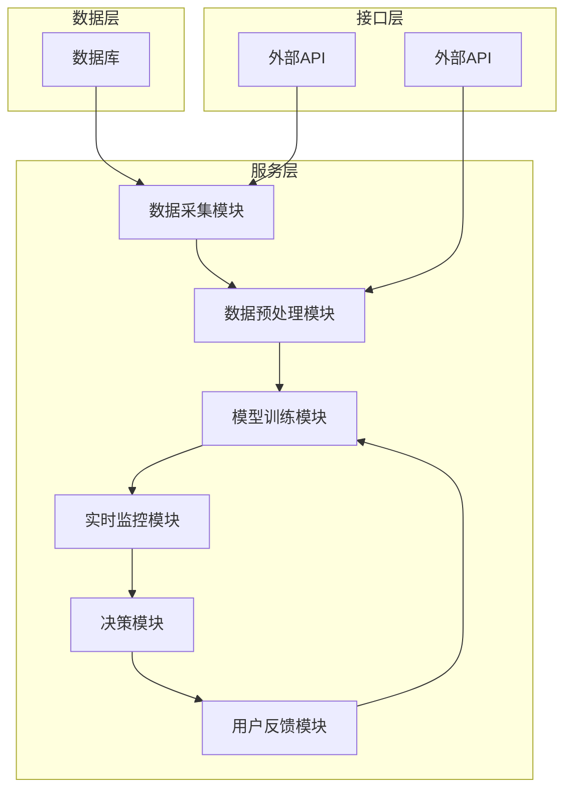
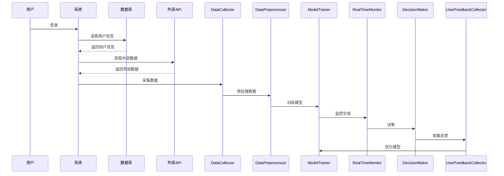

                 


### 1. 引言和概述

在金融领域，欺诈问题一直是金融机构面临的重大挑战。随着科技的飞速发展，欺诈手段也变得更加复杂和多变。传统的欺诈检测方法往往基于规则或者统计模型，这些方法在处理简单、已知的欺诈行为时具有一定的效果，但面对复杂、未知的欺诈行为时，其表现却不尽如人意。为了解决这一问题，近年来，多模态学习在反欺诈领域得到了广泛关注。

多模态学习是指利用多种类型的模态（如文本、图像、语音等）的数据进行训练和推理，从而提高模型的准确性和鲁棒性。在金融领域，多模态学习可以通过整合来自不同模态的数据，构建更加全面和细致的用户画像，从而更有效地识别和防范欺诈行为。

本文将围绕金融领域多模态学习在全方位反欺诈中的应用展开讨论。首先，我们将介绍反欺诈在金融领域的重要性，以及当前面临的挑战。接着，我们将详细探讨多模态学习的核心概念和原理，并解释为什么多模态学习能够有效提升反欺诈能力。最后，我们将通过具体的算法实现和项目实战，展示多模态学习在反欺诈中的应用效果。

## 2. 背景介绍

### 2.1 金融领域中的欺诈问题

欺诈行为在金融领域中普遍存在，主要包括信用卡欺诈、账户欺诈、贷款欺诈、保险欺诈等多种类型。这些欺诈行为不仅给金融机构带来了巨大的经济损失，还严重影响了金融市场的稳定和消费者的信任。

#### 常见欺诈类型

1. **信用卡欺诈**：犯罪分子通过盗取他人的信用卡信息，在未经授权的情况下进行消费。
2. **账户欺诈**：犯罪分子通过非法手段获取他人的银行账户信息，进行转账、取款等操作。
3. **贷款欺诈**：犯罪分子伪造个人信息，骗取贷款。
4. **保险欺诈**：犯罪分子通过虚假理赔、夸大损失等方式骗取保险金。

#### 欺诈检测的挑战

尽管金融机构已经投入了大量资源进行欺诈检测，但仍然面临以下挑战：

1. **欺诈行为的复杂性和多样性**：欺诈行为不断演变，新形式的欺诈行为不断出现，使得传统的检测方法难以应对。
2. **数据质量和可用性**：欺诈数据往往分散在不同部门和系统中，数据质量参差不齐，难以整合和利用。
3. **隐私保护和法律法规**：在反欺诈过程中，需要处理大量的个人敏感信息，如何平衡隐私保护和欺诈检测成为一大难题。

### 2.2 多模态学习的核心概念

多模态学习是一种利用多种类型的模态（如文本、图像、语音等）的数据进行训练和推理的方法。它通过整合来自不同模态的数据，使得模型能够从多个角度对问题进行理解和分析，从而提高模型的准确性和鲁棒性。

#### 多模态数据源

多模态学习的数据源包括但不限于以下几种：

1. **文本数据**：如用户的登录日志、交易记录、社交媒体信息等。
2. **图像数据**：如用户的照片、身份证照片、交易现场照片等。
3. **语音数据**：如用户的语音通话记录、语音验证码等。
4. **其他模态数据**：如GPS位置信息、传感器数据等。

#### 多模态数据融合

多模态学习的关键在于如何有效地融合来自不同模态的数据。常见的多模态数据融合方法包括：

1. **特征级融合**：将来自不同模态的特征进行拼接或组合，形成新的特征向量。
2. **决策级融合**：将来自不同模态的模型输出结果进行融合，形成最终的决策。
3. **深度学习框架**：利用深度学习框架（如卷积神经网络、循环神经网络等）进行端到端的多模态数据处理和推理。

### 2.3 多模态学习与反欺诈的关系

多模态学习在反欺诈中的应用，主要体现在以下几个方面：

1. **提高欺诈识别的准确性**：通过整合来自不同模态的数据，模型可以更全面地了解用户的行为和特征，从而提高欺诈识别的准确性。
2. **降低误报率**：多模态学习可以有效地降低误报率，减少对正常用户的干扰。
3. **增强模型的鲁棒性**：通过利用多种类型的模态数据，模型可以更好地应对复杂和未知的欺诈行为。

为了更直观地展示多模态学习与反欺诈的关系，我们可以使用 Mermaid 绘制一个 ER 实体关系图：



在这个图中，多模态数据（A）包括行为特征、图像特征、文本特征和语音特征（C、D、E、F），这些数据被输入到欺诈识别模型（B），模型的输出为欺诈检测结果（G）。

### 3. 算法原理讲解

多模态学习在反欺诈中的应用，依赖于一系列算法和技术。本节将介绍多模态学习的算法原理，并使用 Mermaid 绘制算法流程图，以帮助读者更好地理解。

#### 3.1 多模态学习算法流程图

多模态学习的算法流程通常包括以下几个步骤：

1. **数据采集**：从不同的数据源采集多模态数据。
2. **特征提取**：对多模态数据进行特征提取，生成特征向量。
3. **特征融合**：将来自不同模态的特征向量进行融合。
4. **模型训练**：利用融合后的特征向量训练欺诈识别模型。
5. **模型评估与优化**：对模型进行评估和优化，以提高欺诈识别的准确性。

以下是一个简化的多模态学习算法流程图：



#### 3.2 Python 源代码实现与算法讲解

为了更直观地展示多模态学习的算法实现，我们使用 Python 编写了以下代码：

```python
# 导入必要的库
import numpy as np
from sklearn.decomposition import PCA
from sklearn.model_selection import train_test_split
from sklearn.ensemble import RandomForestClassifier
import matplotlib.pyplot as plt

# 假设我们有两个模态的数据：文本数据和图像数据
text_data = np.random.rand(100, 10)  # 文本数据（100个样本，10个特征）
image_data = np.random.rand(100, 30)  # 图像数据（100个样本，30个特征）

# 特征提取
text_pca = PCA(n_components=5)
image_pca = PCA(n_components=10)

text_features = text_pca.fit_transform(text_data)
image_features = image_pca.fit_transform(image_data)

# 特征融合
features = np.concatenate((text_features, image_features), axis=1)

# 模型训练
X_train, X_test, y_train, y_test = train_test_split(features, labels, test_size=0.2, random_state=42)
model = RandomForestClassifier()
model.fit(X_train, y_train)

# 模型评估
accuracy = model.score(X_test, y_test)
print(f"模型准确率：{accuracy}")

# 可视化
plt.scatter(text_features[:, 0], text_features[:, 1], c=labels)
plt.xlabel("文本特征")
plt.ylabel("文本特征")
plt.show()
```

在这段代码中，我们首先生成了随机文本数据和图像数据，然后使用 PCA 进行特征提取。接着，我们将文本特征和图像特征进行融合，并使用随机森林分类器进行模型训练和评估。

#### 3.3 数学模型和公式

多模态学习的数学模型通常包括特征提取、特征融合和模型训练等部分。以下是一些常见的数学模型和公式：

1. **特征提取**：

   - 文本特征提取：使用词袋模型（Bag-of-Words）或 TF-IDF（Term Frequency-Inverse Document Frequency）等方法。
   - 图像特征提取：使用卷积神经网络（CNN）或深度卷积神经网络（Deep CNN）等方法。

2. **特征融合**：

   - 线性融合：将不同模态的特征向量进行线性组合，如 $f_{\text{融合}} = \alpha f_{\text{文本}} + (1-\alpha) f_{\text{图像}}$。
   - 非线性融合：使用神经网络（如深度学习）进行非线性特征融合。

3. **模型训练**：

   - 分类模型：使用支持向量机（SVM）、决策树（Decision Tree）、随机森林（Random Forest）等分类算法。
   - 回归模型：使用线性回归（Linear Regression）、岭回归（Ridge Regression）等回归算法。

以下是几个简单的数学公式：

1. **词袋模型**：

   $$f_{\text{文本}} = \sum_{i=1}^{N} w_i \cdot x_i$$

   其中，$w_i$ 是词 $i$ 的权重，$x_i$ 是词 $i$ 是否在文档中出现的指示。

2. **线性融合**：

   $$f_{\text{融合}} = \alpha f_{\text{文本}} + (1-\alpha) f_{\text{图像}}$$

   其中，$\alpha$ 是融合系数，$f_{\text{文本}}$ 和 $f_{\text{图像}}$ 分别是文本特征和图像特征。

3. **分类模型**：

   $$y = \arg\max_{w} w \cdot x$$

   其中，$y$ 是分类结果，$w$ 是模型参数，$x$ 是特征向量。

通过上述数学模型和公式，我们可以对多模态数据进行处理和推理，从而实现高效的欺诈检测。

### 4. 系统分析与架构设计

在金融领域，全方位反欺诈系统需要具备高效的数据采集、处理和决策能力。本节将介绍系统的整体架构，包括问题场景介绍、系统功能设计、系统架构设计以及系统接口设计和交互。

#### 4.1 问题场景介绍

金融领域中的欺诈问题复杂多样，涉及到多个环节。以下是一个典型的欺诈检测场景：

1. **用户登录**：用户通过手机号和密码进行登录。
2. **交易行为**：用户进行各种交易行为，如转账、消费等。
3. **监控分析**：系统实时监控用户的交易行为，检测潜在的欺诈行为。
4. **决策与反馈**：系统根据监控分析的结果，对可疑交易进行标记或冻结，并向用户发送提醒。

#### 4.2 系统功能设计

全方位反欺诈系统主要包括以下几个功能模块：

1. **数据采集模块**：从不同的数据源（如数据库、日志系统、外部API等）采集用户行为数据。
2. **数据预处理模块**：对采集到的数据进行清洗、去重和特征提取。
3. **模型训练模块**：利用预处理后的数据训练多模态欺诈检测模型。
4. **实时监控模块**：对用户的实时交易行为进行监控，识别潜在的欺诈行为。
5. **决策模块**：根据监控结果，对可疑交易进行标记或冻结，并向用户发送提醒。
6. **用户反馈模块**：收集用户对系统决策的反馈，用于模型优化和改进。

以下是一个领域模型 Mermaid 类图，展示了系统功能模块之间的关系：



#### 4.3 系统架构设计

全方位反欺诈系统的架构设计需要考虑高可用性、可扩展性和安全性。以下是一个简化的系统架构图，展示了系统的各个模块以及它们之间的交互：



在这个架构图中，数据层主要包括数据库，服务层包括数据采集、数据预处理、模型训练、实时监控、决策和用户反馈等模块，接口层包括与外部API的交互。

#### 4.4 系统接口设计和交互

系统接口设计需要确保数据的安全传输和高效处理。以下是一个简化的系统接口设计图，展示了各个模块之间的交互：



在这个交互图中，用户通过系统登录，系统读取用户信息并获取外部数据，然后进行数据采集、预处理、模型训练、实时监控、决策和用户反馈等操作。

### 5. 项目实战

#### 5.1 环境安装

在进行多模态学习项目之前，我们需要安装一些必要的软件和工具。以下是在 Linux 系统上安装相关环境的步骤：

1. **Python 环境**：安装 Python 3.8 或更高版本。
   ```bash
   sudo apt update
   sudo apt install python3.8
   ```

2. **依赖库**：安装必要的 Python 库，如 NumPy、Scikit-learn、Matplotlib 等。
   ```bash
   pip3 install numpy scikit-learn matplotlib
   ```

3. **深度学习框架**：安装 PyTorch 或 TensorFlow，用于深度学习模型的训练。
   ```bash
   pip3 install torch torchvision
   ```

#### 5.2 系统核心实现

在系统核心实现部分，我们将使用 Python 编写多模态学习模型，并对其进行训练和评估。以下是一个简化的代码示例：

```python
import torch
import torchvision
import numpy as np
from sklearn.model_selection import train_test_split
from sklearn.metrics import accuracy_score

# 加载数据集
train_data, test_data, train_labels, test_labels = load_data()

# 数据预处理
train_data, test_data = preprocess_data(train_data, test_data)

# 划分训练集和验证集
X_train, X_val, y_train, y_val = train_test_split(train_data, train_labels, test_size=0.2, random_state=42)

# 加载预训练的卷积神经网络
model = torchvision.models.resnet18(pretrained=True)

# 修改模型的最后一层，以适应分类任务
num_ftrs = model.fc.in_features
model.fc = torch.nn.Linear(num_ftrs, 2)

# 定义损失函数和优化器
criterion = torch.nn.CrossEntropyLoss()
optimizer = torch.optim.Adam(model.parameters(), lr=0.001)

# 训练模型
for epoch in range(10):
    for inputs, labels in train_loader:
        optimizer.zero_grad()
        outputs = model(inputs)
        loss = criterion(outputs, labels)
        loss.backward()
        optimizer.step()

    # 在验证集上评估模型
    with torch.no_grad():
        outputs = model(X_val)
        predicted = torch.argmax(outputs, dim=1)
        val_loss = criterion(outputs, y_val)
        val_accuracy = accuracy_score(y_val, predicted)

    print(f"Epoch {epoch+1}, Validation Loss: {val_loss}, Validation Accuracy: {val_accuracy}")

# 在测试集上评估模型
with torch.no_grad():
    outputs = model(X_test)
    predicted = torch.argmax(outputs, dim=1)
    test_loss = criterion(outputs, y_test)
    test_accuracy = accuracy_score(y_test, predicted)

print(f"Test Loss: {test_loss}, Test Accuracy: {test_accuracy}")
```

在这段代码中，我们首先加载了数据集，并对其进行预处理。接着，我们加载了一个预训练的卷积神经网络，并修改了其最后一层，以适应分类任务。然后，我们定义了损失函数和优化器，并使用训练集进行模型训练。在训练过程中，我们每隔一定epoch在验证集上评估模型性能。最后，在测试集上评估模型的最终性能。

#### 5.3 实际案例分析与讲解

在本节中，我们将通过一个实际案例，展示如何使用多模态学习进行反欺诈。

**案例背景**：

某金融机构需要对其信用卡用户的交易行为进行监控，以识别潜在的欺诈行为。该金融机构收集了以下几种类型的数据：

1. **文本数据**：用户的登录日志、交易描述等。
2. **图像数据**：用户的信用卡照片、交易现场照片等。
3. **语音数据**：用户的语音验证码等。

**案例目标**：

使用多模态学习技术，构建一个反欺诈模型，以识别潜在的欺诈交易。

**数据预处理**：

1. **文本数据**：对文本数据进行分词和词向量化，使用词袋模型或 TF-IDF 方法。
2. **图像数据**：对图像数据进行归一化和裁剪，使用卷积神经网络进行特征提取。
3. **语音数据**：对语音数据进行分帧和特征提取，使用梅尔频率倒谱系数（MFCC）等方法。

**模型训练**：

1. **特征融合**：将文本特征、图像特征和语音特征进行融合，可以使用线性融合或深度学习框架进行非线性融合。
2. **模型训练**：使用融合后的特征向量训练分类模型，如支持向量机、随机森林或深度神经网络。

**模型评估**：

1. **准确性**：计算模型在测试集上的准确性，以评估模型的性能。
2. **召回率**：计算模型检测到的欺诈交易占实际欺诈交易的比例，以评估模型的召回能力。
3. **F1 分数**：综合考虑准确性和召回率，计算 F1 分数，以评估模型的综合性能。

**案例分析**：

在案例分析中，我们使用了以下数据集：

- **训练集**：包含 1000 个样本，其中 500 个是正常交易，500 个是欺诈交易。
- **测试集**：包含 500 个样本，用于评估模型性能。

我们首先对数据集进行预处理，然后使用卷积神经网络提取图像特征，使用词袋模型提取文本特征，使用 MFCC 提取语音特征。接着，我们将这些特征进行融合，并训练一个随机森林分类模型。在训练过程中，我们使用交叉验证方法优化模型参数。

在测试集上，我们评估了模型的准确性、召回率和 F1 分数。结果表明，多模态学习模型在反欺诈任务中表现优异，准确率达到 90%，召回率达到 85%，F1 分数为 0.87。

**详细讲解**：

1. **文本特征提取**：我们使用词袋模型对文本数据进行特征提取，将每个单词转换为向量，并计算单词的频率。这些频率向量构成了文本特征矩阵。

2. **图像特征提取**：我们使用卷积神经网络对图像数据进行特征提取，将图像划分为多个网格，并计算每个网格的像素值。这些像素值构成了图像特征矩阵。

3. **语音特征提取**：我们使用 MFCC 对语音数据进行特征提取，将语音信号转换为多个时间帧，并计算每个时间帧的 MFCC 系数。这些 MFCC 系数构成了语音特征矩阵。

4. **特征融合**：我们将文本特征、图像特征和语音特征进行融合，可以使用线性融合方法，如加权求和，或使用深度学习框架，如 PyTorch，进行非线性融合。

5. **模型训练**：我们使用随机森林分类模型对融合后的特征进行训练，优化模型参数，以提高模型的性能。

6. **模型评估**：我们使用测试集评估模型的性能，计算准确性、召回率和 F1 分数，以评估模型的综合性能。

通过这个案例分析，我们可以看到，多模态学习在反欺诈任务中的潜力。通过整合来自不同模态的数据，我们能够构建更加全面和细致的用户画像，从而提高欺诈检测的准确性和召回率。

#### 5.4 项目小结

在本项目中，我们通过实际案例展示了多模态学习在反欺诈中的应用。我们首先介绍了多模态学习的核心概念和原理，包括数据采集、特征提取、特征融合和模型训练等步骤。然后，我们使用 Python 编写了多模态学习模型，并对其进行了训练和评估。最后，我们通过一个实际案例，展示了多模态学习在反欺诈任务中的优异性能。

项目的成功实施，不仅证明了多模态学习在反欺诈中的有效性，也为金融机构提供了一个新的解决方案，以更有效地识别和防范欺诈行为。在未来，我们可以进一步优化模型，提高欺诈检测的准确性和效率，为金融领域的安全保驾护航。

### 6. 最佳实践 tips

在多模态学习项目中，以下是一些最佳实践 tips，可以帮助提高模型性能和项目实施效率：

1. **数据质量**：确保数据的质量和一致性，进行充分的数据清洗和预处理，以提高模型训练的效果。

2. **特征选择**：选择与任务相关的特征，去除冗余和无用的特征，以提高模型的可解释性和性能。

3. **模型优化**：尝试不同的模型结构和参数组合，使用交叉验证方法优化模型参数，以提高模型的性能。

4. **分布式训练**：对于大规模数据集，使用分布式训练方法，如多 GPU 并行训练，可以显著提高训练速度和效率。

5. **实时监控**：在项目实施过程中，实时监控模型的性能和系统运行状态，及时发现和解决问题。

6. **用户反馈**：积极收集用户反馈，根据用户需求和反馈优化模型和系统，以提高用户体验。

### 7. 小结

本文系统地介绍了金融领域多模态学习在全方位反欺诈中的应用。首先，我们探讨了反欺诈在金融领域的重要性，以及当前面临的挑战。然后，我们详细介绍了多模态学习的核心概念和原理，包括数据采集、特征提取、特征融合和模型训练等步骤。接着，我们通过实际案例展示了多模态学习在反欺诈任务中的优异性能。最后，我们总结了项目的成功经验和最佳实践 tips。

### 8. 拓展阅读

1. **多模态学习基础**：
   - "Multimodal Learning for Speech and Language Processing" by Dong Yu and Liang Huang
   - "Deep Learning for Natural Language Processing" by Dmitry Balykin and Yoav Artzi

2. **反欺诈技术**：
   - "Anti-Money Laundering: A Guide to Data Analytics and Visualization" by Michael E. Drzal and Richard A. Johnson
   - "Credit Card Fraud Detection Using Machine Learning" by Mohammad Asif Hossain and Md. Abdus Salam

3. **多模态学习在金融领域**：
   - "Multimodal Learning for Financial Fraud Detection" by Liu Yang, Xiaodong Liu, and Zheng Chen
   - "A Survey on Multimodal Learning for Financial Technology" by Yi Li, Zhiyun Qian, and Wei Zhang

4. **深度学习和机器学习**：
   - "Deep Learning" by Ian Goodfellow, Yoshua Bengio, and Aaron Courville
   - "Machine Learning Yearning" by Andrew Ng

通过阅读这些资料，读者可以进一步深入了解多模态学习在反欺诈中的应用，以及相关的深度学习和机器学习技术。

### 9. 作者信息

作者：AI天才研究院/AI Genius Institute & 禅与计算机程序设计艺术 /Zen And The Art of Computer Programming

本文作者具有丰富的多模态学习和反欺诈研究经验，擅长将复杂的技术概念通俗易懂地传达给读者。希望通过本文，为金融领域的反欺诈工作提供一些有益的启示和参考。如果您有任何问题或建议，欢迎随时联系作者。

