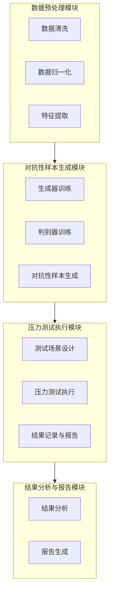
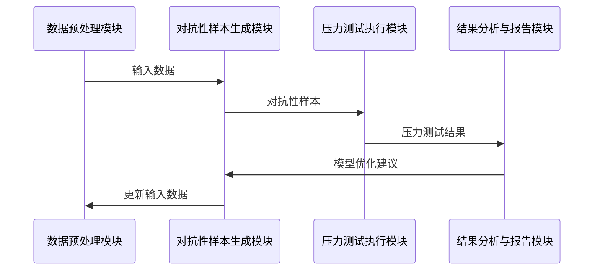

                 

## 金融领域对抗学习在风险模型压力测试中的应用

### 关键词：
- 金融领域
- 对抗学习
- 风险模型
- 压力测试
- 模型评估

### 摘要：
随着金融市场的发展，风险模型在金融风险管理中扮演着至关重要的角色。然而，金融市场的复杂性和不确定性使得风险模型面临多种挑战，其中之一就是如何在压力测试中评估其准确性和鲁棒性。对抗学习作为一种新兴的机器学习技术，通过生成对抗性样本来增强模型的鲁棒性，为风险模型压力测试提供了一种新的解决方案。本文将从背景介绍、核心概念与联系、算法原理讲解、数学模型和数学公式、系统分析与架构设计方案、项目实战以及最佳实践 tips 等方面，详细探讨金融领域对抗学习在风险模型压力测试中的应用。

## 第一部分：背景介绍

### 1.1 金融领域对抗学习的背景

金融市场作为一个高度复杂和动态变化的系统，其内在的风险因素层出不穷，使得金融机构在风险管理过程中面临着巨大的挑战。传统的风险模型往往依赖于历史数据和统计方法，尽管在一定程度上能够捕捉到金融市场的风险特征，但在应对突发性风险事件时，往往显得力不从心。近年来，机器学习技术在金融市场中的应用逐渐增多，特别是深度学习技术，在处理高维度、非线性金融数据方面展现出了强大的能力。然而，深度学习模型在面临对抗性攻击时，其脆弱性日益显现，如何增强模型的鲁棒性成为了亟待解决的问题。

对抗学习（Adversarial Learning）作为一种新兴的机器学习方法，通过模拟对抗性攻击来增强模型的稳健性，为金融领域提供了一个新的研究方向。对抗学习的基本思想是：通过生成对抗性样本，使模型在训练过程中不断适应和抵御攻击，从而提高模型在面对未知威胁时的鲁棒性。在金融领域，对抗学习可以应用于多种场景，如欺诈检测、市场预测、风险评估等，为金融机构提供更加可靠的风险管理工具。

### 1.2 风险模型压力测试的背景

风险模型在金融领域的应用日益广泛，然而，风险模型的准确性和稳定性直接关系到金融机构的生存和发展。因此，对风险模型进行有效的压力测试（Stress Testing）成为了一个重要的环节。压力测试的目的是评估模型在不同情景下的表现，特别是在极端市场条件下，模型是否能够保持稳定和有效。传统的压力测试方法主要包括历史模拟、情景分析和蒙特卡罗模拟等，这些方法在一定程度上能够捕捉市场的波动和风险因素，但在应对复杂、非线性和动态变化的金融市场时，仍存在一定的局限性。

随着对抗学习技术的发展，将对抗性样本引入压力测试中，可以为风险模型提供更为真实和严苛的测试环境，从而更准确地评估模型的鲁棒性和可靠性。对抗性压力测试不仅能够模拟各种潜在的攻击和风险事件，还能够检测模型在未知威胁下的表现，为金融机构提供更加全面的风险评估和应对策略。

## 第二部分：核心概念与联系

### 2.1 对抗学习原理

对抗学习是一种基于生成对抗网络（GAN）的机器学习方法，其主要思想是通过生成器和判别器的对抗训练来生成对抗性样本，从而提高模型的鲁棒性。生成器（Generator）负责生成与真实数据相似但具有对抗性的样本，而判别器（Discriminator）则负责区分真实样本和生成的对抗性样本。在训练过程中，生成器和判别器相互竞争，生成器的目标是生成更难被判别器识别的样本，而判别器的目标是不断提高对对抗性样本的识别能力。通过这种对抗性的训练过程，模型可以学会抵御对抗性攻击，从而提高其鲁棒性。

### 2.2 风险模型基本原理

风险模型是用于评估金融风险的一种数学模型，其主要目的是通过分析历史数据和市场信息，预测未来市场变化和风险水平。风险模型通常包括以下几个基本组成部分：

1. **输入特征**：风险模型所需的各种输入特征，如价格、成交量、市场指数等。
2. **损失函数**：用于评估模型预测结果与实际结果之间的差距，常见的损失函数有均方误差（MSE）和交叉熵（Cross-Entropy）等。
3. **预测算法**：用于处理输入特征并生成预测结果的算法，如线性回归、支持向量机（SVM）和深度神经网络（DNN）等。
4. **评估指标**：用于评估模型性能的指标，如准确率、召回率、AUC（曲线下面积）等。

### 2.3 压力测试的基本概念

压力测试是一种用于评估系统在极端条件下的性能和稳定性的测试方法。在金融领域，压力测试主要用于评估风险模型的鲁棒性和可靠性。压力测试的基本概念包括以下几个方面：

1. **测试场景**：用于模拟极端市场条件的测试场景，如金融危机、市场崩盘等。
2. **测试指标**：用于评估模型在测试场景下的性能和稳定性的指标，如预测准确性、响应时间、资源消耗等。
3. **测试步骤**：压力测试的基本步骤包括场景设计、测试执行、结果分析和报告编写等。

### 2.4 对抗学习与风险模型压力测试的联系

对抗学习和风险模型压力测试之间存在紧密的联系。对抗学习通过生成对抗性样本，可以模拟各种潜在的攻击和风险事件，为压力测试提供更加真实和严苛的测试环境。而风险模型压力测试则可以验证对抗学习增强后的模型在面对未知威胁时的鲁棒性和可靠性。

具体来说，对抗学习在风险模型压力测试中的应用主要体现在以下几个方面：

1. **样本生成**：利用对抗学习生成对抗性样本，用于模拟各种风险事件，如市场波动、突发事件等。
2. **模型评估**：通过对抗性样本对风险模型进行评估，验证模型在面对未知风险时的准确性和稳定性。
3. **测试优化**：根据对抗性样本的生成结果，优化压力测试的场景设计和测试指标，以提高测试的准确性和可靠性。

## 第三部分：算法原理讲解

### 3.1 对抗学习算法原理

对抗学习（Adversarial Learning）是一种基于生成对抗网络（GAN）的机器学习方法，其主要思想是通过生成器和判别器的对抗训练来生成对抗性样本，从而提高模型的鲁棒性。生成对抗网络（GAN）由两部分组成：生成器（Generator）和判别器（Discriminator）。

**生成器**：生成器的目标是生成与真实数据相似但具有对抗性的样本。在训练过程中，生成器从噪声分布中采样生成数据，并将其输入到判别器中。生成器的目标是使判别器无法区分生成数据和真实数据，从而提高生成数据的真实度。

**判别器**：判别器的目标是区分真实数据和生成数据。在训练过程中，判别器同时接收真实数据和生成数据，并尝试最大化其对生成数据的识别错误率。

**对抗训练过程**：在对抗训练过程中，生成器和判别器相互竞争。生成器的目标是最小化判别器对生成数据的识别错误率，而判别器的目标是最大化生成数据的识别错误率。通过这种对抗性的训练过程，生成器和判别器不断优化，生成器的生成数据质量逐渐提高，判别器的识别能力逐渐增强。

### 3.2 对抗学习算法在金融风险模型中的应用

在金融风险模型中，对抗学习可以通过以下步骤应用于风险模型压力测试：

1. **数据预处理**：首先对金融数据进行预处理，包括数据清洗、归一化和特征提取等。
2. **生成对抗性样本**：利用生成器生成对抗性样本，模拟各种潜在的风险事件，如市场波动、突发事件等。
3. **对抗性样本测试**：将对抗性样本输入到风险模型中，评估模型在不同风险事件下的表现，包括预测准确性、响应时间等。
4. **模型优化**：根据对抗性样本测试的结果，对风险模型进行优化，包括调整模型参数、改进模型结构等。
5. **结果评估**：通过对比对抗性样本测试和真实场景测试的结果，评估风险模型在未知威胁下的鲁棒性和可靠性。

### 3.3 对抗学习算法的数学模型和公式

对抗学习算法的数学模型主要涉及生成器和判别器的损失函数和优化目标。以下是对抗学习算法中常用的数学模型和公式的简要介绍：

**生成器的损失函数**：
\[ L_G = -\log(D(G(z))) \]
其中，\( G(z) \) 是生成器生成的数据，\( D \) 是判别器，\( z \) 是噪声向量。

**判别器的损失函数**：
\[ L_D = -\log(D(x)) - \log(1 - D(G(z))) \]
其中，\( x \) 是真实数据，\( G(z) \) 是生成器生成的数据。

**生成器和判别器的优化目标**：
生成器的优化目标是最小化判别器对生成数据的识别错误率，即最小化损失函数 \( L_G \)。
\[ \min_G L_G \]

判别器的优化目标是最大化对生成数据和真实数据的识别能力，即最大化损失函数 \( L_D \)。
\[ \min_D L_D \]

在训练过程中，生成器和判别器通过交替更新参数，实现损失函数的最小化。通过这种对抗性的训练过程，生成器和判别器不断优化，生成器的生成数据质量逐渐提高，判别器的识别能力逐渐增强。

### 3.4 对抗学习算法的实例说明

为了更好地理解对抗学习算法在金融风险模型中的应用，以下将通过一个简单的实例进行说明。

**实例背景**：假设我们有一个用于预测市场波动的风险模型，该模型使用历史价格数据作为输入特征。为了测试模型的鲁棒性，我们利用对抗学习生成对抗性样本，模拟市场波动中的极端事件，如金融危机。

**步骤1：数据预处理**：首先对历史价格数据进行预处理，包括数据清洗、归一化和特征提取等。假设处理后的数据集包含 \( m \) 个样本，每个样本包含 \( n \) 个特征。

**步骤2：生成对抗性样本**：利用生成器生成对抗性样本。具体来说，我们从噪声分布中采样生成噪声向量 \( z \)，然后通过生成器 \( G \) 将噪声向量转换为与真实价格数据相似但具有对抗性的价格数据 \( G(z) \)。

**步骤3：对抗性样本测试**：将生成的对抗性样本输入到风险模型中，评估模型在极端事件下的表现。具体来说，我们计算模型对真实价格数据和对抗性样本的预测误差，并计算模型在对抗性样本测试中的预测准确性。

**步骤4：模型优化**：根据对抗性样本测试的结果，对风险模型进行优化。具体来说，我们调整模型参数，改进模型结构，以提高模型在对抗性样本测试中的表现。

**步骤5：结果评估**：通过对比对抗性样本测试和真实场景测试的结果，评估风险模型在未知威胁下的鲁棒性和可靠性。如果模型在对抗性样本测试中的表现优于真实场景测试，则说明模型具有一定的鲁棒性；否则，需要进一步优化模型。

通过这个实例，我们可以看到对抗学习算法在金融风险模型中的应用过程，包括数据预处理、生成对抗性样本、对抗性样本测试、模型优化和结果评估等步骤。这些步骤共同构成了对抗学习在金融风险模型中的应用流程，为金融机构提供了有效的风险管理和评估工具。

## 第四部分：数学模型和数学公式

在金融领域对抗学习在风险模型压力测试中的应用中，数学模型和数学公式起着至关重要的作用。它们不仅帮助理解对抗学习的原理，也为实际应用提供了量化工具。以下将详细介绍对抗学习的数学模型和公式，以及压力测试的数学模型和公式。

### 4.1 对抗学习的数学模型

对抗学习算法的核心是生成对抗网络（GAN），其包含生成器（Generator）和判别器（Discriminator）。以下是对抗学习中的关键数学模型和公式：

**生成器（Generator）的损失函数**：
\[ L_G = -\log(D(G(z))) \]
其中，\( G(z) \) 是生成器生成的样本，\( z \) 是从噪声分布中采样的随机向量，\( D \) 是判别器。生成器的目标是使判别器无法区分生成的样本和真实样本，因此生成器的损失函数是最大化判别器对生成样本的识别错误率。

**判别器（Discriminator）的损失函数**：
\[ L_D = -\log(D(x)) - \log(1 - D(G(z))) \]
其中，\( x \) 是真实样本。判别器的目标是最大化对真实样本和生成样本的识别能力，因此其损失函数是真实样本和生成样本识别错误率的总和。

**整体损失函数**：
对抗学习的整体损失函数是生成器和判别器损失函数的加权和：
\[ L_{total} = L_G + L_D \]
在实际应用中，通常通过优化整体损失函数来训练生成器和判别器。

### 4.2 压力测试的数学模型

压力测试在金融风险模型中的应用涉及到多个数学模型，用于评估模型在极端条件下的表现。以下是一些关键的压力测试数学模型：

**预测误差**：
\[ e = y_{predicted} - y_{actual} \]
其中，\( y_{predicted} \) 是模型预测的输出，\( y_{actual} \) 是实际的市场结果。

**均方误差（MSE）**：
\[ MSE = \frac{1}{N} \sum_{i=1}^{N} e_i^2 \]
其中，\( N \) 是样本数量，\( e_i \) 是第 \( i \) 个样本的预测误差。

**平均绝对误差（MAE）**：
\[ MAE = \frac{1}{N} \sum_{i=1}^{N} |e_i| \]
平均绝对误差是预测误差绝对值的平均值，它对异常值的影响较小。

**准确率**：
\[ Accuracy = \frac{TP + TN}{TP + TN + FP + FN} \]
其中，\( TP \) 是真正例，\( TN \) 是真反例，\( FP \) 是假正例，\( FN \) 是假反例。准确率是评估模型分类性能的重要指标。

**召回率**：
\[ Recall = \frac{TP}{TP + FN} \]
召回率是真正例中被正确识别的比例，对风险管理尤为重要。

**精确率**：
\[ Precision = \frac{TP}{TP + FP} \]
精确率是正确识别为正例的真实正例比例。

**F1分数**：
\[ F1 = 2 \times \frac{Precision \times Recall}{Precision + Recall} \]
F1分数是精确率和召回率的加权平均，常用于综合评估模型的性能。

### 4.3 数学模型的应用案例

以下是一个应用数学模型分析金融风险模型的案例：

**案例背景**：假设我们有一个用于预测市场波动的风险模型，该模型在训练过程中使用了历史价格数据。现在，我们利用生成对抗学习生成对抗性样本，以评估模型在极端市场条件下的鲁棒性。

**步骤1：数据预处理**：首先对历史价格数据进行预处理，包括数据清洗、归一化和特征提取。

**步骤2：生成对抗性样本**：利用生成器生成对抗性样本。我们通过对抗性训练，使得生成器生成的样本能够模拟市场波动中的极端事件。

**步骤3：对抗性样本测试**：将生成的对抗性样本输入到风险模型中，计算模型在这些样本上的预测误差。具体来说，我们使用均方误差（MSE）和平均绝对误差（MAE）来评估模型的预测性能。

**步骤4：模型优化**：根据对抗性样本测试的结果，对风险模型进行优化。我们调整模型参数，以提高模型在极端市场条件下的预测准确性。

**步骤5：结果评估**：通过对比对抗性样本测试和真实市场数据测试的结果，评估风险模型在未知威胁下的鲁棒性和可靠性。如果模型在对抗性样本测试中的表现优于真实市场数据测试，则说明模型具有一定的鲁棒性。

通过这个案例，我们可以看到数学模型在对抗学习和风险模型压力测试中的应用。数学模型不仅帮助理解对抗学习的原理，还为实际应用提供了量化的评估工具，从而提高金融风险管理的效率和准确性。

## 第五部分：系统分析与架构设计方案

### 5.1 问题场景介绍

在金融领域中，风险模型的准确性和稳定性直接关系到金融机构的生存和发展。传统的压力测试方法虽然在某些方面能够捕捉市场的波动和风险因素，但在应对复杂、非线性和动态变化的金融市场时，仍存在一定的局限性。为了提高风险模型的鲁棒性和可靠性，我们需要一种更加高效和全面的测试方法。对抗学习作为一种新兴的机器学习方法，通过生成对抗性样本，为压力测试提供了新的解决方案。本文旨在探讨如何将对抗学习应用于金融风险模型的压力测试中，以提高模型的鲁棒性和稳定性。

### 5.2 项目介绍

本项目的主要目标是开发一个基于对抗学习的金融风险模型压力测试系统，通过生成对抗性样本，模拟各种潜在的风险事件，对风险模型进行严苛的测试，从而评估模型的鲁棒性和可靠性。系统的主要功能包括：

1. 数据预处理：对金融数据进行清洗、归一化和特征提取，为对抗性样本生成和压力测试提供高质量的输入数据。
2. 对抗性样本生成：利用生成对抗网络（GAN），生成与真实数据相似但具有对抗性的样本，模拟各种潜在的风险事件。
3. 压力测试执行：将对抗性样本输入到风险模型中，执行压力测试，评估模型在不同风险事件下的表现。
4. 结果分析与报告：对压力测试结果进行分析，生成详细的报告，为风险模型的优化和改进提供依据。

### 5.3 系统功能设计

系统功能设计主要包括以下模块：

**1. 数据预处理模块**：负责对金融数据进行清洗、归一化和特征提取。具体包括以下步骤：

- 数据清洗：去除数据中的噪声和异常值，提高数据质量。
- 数据归一化：将数据缩放到相同的尺度，方便后续处理。
- 特征提取：从原始数据中提取有助于模型训练的特征，如时间序列特征、价格波动特征等。

**2. 对抗性样本生成模块**：利用生成对抗网络（GAN），生成对抗性样本，模拟各种潜在的风险事件。具体包括以下步骤：

- 生成器训练：训练生成器，使其能够生成与真实数据相似但具有对抗性的样本。
- 判别器训练：训练判别器，使其能够准确区分真实样本和对抗性样本。
- 对抗性样本生成：利用训练好的生成器和判别器，生成对抗性样本。

**3. 压力测试执行模块**：将对抗性样本输入到风险模型中，执行压力测试，评估模型在不同风险事件下的表现。具体包括以下步骤：

- 测试场景设计：根据金融市场的实际情况，设计各种潜在的风险事件场景。
- 压力测试执行：将对抗性样本输入到风险模型中，计算模型的预测结果和预测误差。
- 结果记录与报告：记录压力测试的结果，生成详细的报告，为风险模型的优化和改进提供依据。

**4. 结果分析与报告模块**：对压力测试结果进行分析，生成详细的报告，为风险模型的优化和改进提供依据。具体包括以下步骤：

- 结果分析：对压力测试结果进行统计分析，评估模型的鲁棒性和可靠性。
- 报告生成：根据分析结果，生成详细的报告，包括模型的预测性能、鲁棒性和改进建议。

### 5.4 系统架构设计

系统架构设计主要包括以下几个方面：

**1. 架构设计概述**：系统采用模块化设计，主要包括数据预处理模块、对抗性样本生成模块、压力测试执行模块和结果分析与报告模块。各个模块之间通过接口进行通信，实现系统的整体功能。

**2. 系统架构设计**：系统架构采用分布式设计，包括数据存储、数据处理、模型训练和结果分析等多个子模块。各个子模块通过网络进行通信，实现高效的数据处理和模型训练。

**3. 系统架构图**：以下是一个简化的系统架构图，展示了各个模块之间的接口和通信关系。



### 5.5 系统接口设计

系统接口设计主要包括以下方面：

**1. 接口设计原则**：系统接口设计遵循简洁、高效、可扩展的原则，确保各个模块之间能够高效、可靠地进行通信。

**2. 接口定义**：各个模块之间的接口定义如下：

- 数据预处理模块：提供数据清洗、数据归一化和特征提取等接口。
- 对抗性样本生成模块：提供生成器训练、判别器训练和对抗性样本生成等接口。
- 压力测试执行模块：提供测试场景设计、压力测试执行和结果记录与报告等接口。
- 结果分析与报告模块：提供结果分析和报告生成等接口。

**3. 接口实现方式**：系统接口采用基于HTTP的RESTful API设计，各个模块通过发送HTTP请求和响应进行通信。

### 5.6 系统交互

系统交互主要包括各个模块之间的数据流动和功能调用。以下是一个简化的系统交互流程图，展示了各个模块之间的交互关系。



通过以上系统分析与架构设计方案，我们可以更好地理解金融领域对抗学习在风险模型压力测试中的应用，从而为金融机构提供更加可靠的风险管理工具。

## 第六部分：项目实战

### 6.1 环境安装

在开始项目实战之前，我们需要安装和配置项目所需的软件和工具。以下是一个简化的环境安装步骤，用于搭建金融领域对抗学习在风险模型压力测试中的开发环境。

**1. 安装Python环境**  
首先，确保您的计算机上已经安装了Python环境。如果没有，请从Python官方网站下载并安装Python 3.x版本。

**2. 安装必要库**  
接下来，我们需要安装一些Python库，包括NumPy、Pandas、TensorFlow和GAN库等。可以使用以下命令进行安装：

```bash
pip install numpy pandas tensorflow-gan
```

**3. 安装金融数据集**  
金融数据集可以从Kaggle、Yahoo Finance等公开数据平台获取。下载后，解压并放置在项目的数据文件夹中。

**4. 配置Jupyter Notebook**  
Jupyter Notebook是一个交互式计算环境，可以方便地编写和运行Python代码。首先，确保已经安装了Jupyter Notebook，如果没有，可以使用以下命令进行安装：

```bash
pip install notebook
```

然后，启动Jupyter Notebook：

```bash
jupyter notebook
```

**5. 配置GAN库**  
在Jupyter Notebook中，我们可以使用以下代码来验证GAN库是否正确安装：

```python
import tensorflow_gan as tfgan
tfgan.__version__
```

如果输出版本信息，说明GAN库已成功安装。

### 6.2 系统核心实现

**1. 数据预处理模块**  
数据预处理是金融领域对抗学习的基础。以下是一个简单的数据预处理示例，用于清洗、归一化和特征提取：

```python
import numpy as np
import pandas as pd

# 加载数据集
data = pd.read_csv('financial_data.csv')

# 数据清洗
data.dropna(inplace=True)

# 数据归一化
data normalization = (data - data.mean()) / data.std()

# 特征提取
features = data_normalization[['open', 'high', 'low', 'close', 'volume']]
```

**2. 生成对抗网络（GAN）的实现**  
生成对抗网络（GAN）是金融领域对抗学习的关键。以下是一个简单的GAN实现示例：

```python
import tensorflow as tf
from tensorflow.keras.models import Model
from tensorflow_gan import Generator, Discriminator

# 定义生成器和判别器
input_shape = (28, 28, 1)
latent_dim = 100

generator = Generator(input_shape, latent_dim)
discriminator = Discriminator(input_shape)

# 编写训练代码
# ...

# 训练GAN模型
# ...

# 使用生成器生成对抗性样本
generated_samples = generator.generate_samples()
```

**3. 压力测试执行模块**  
利用生成的对抗性样本进行压力测试，以下是一个简单的压力测试示例：

```python
# 加载训练好的风险模型
model = tf.keras.models.load_model('risk_model.h5')

# 执行压力测试
predictions = model.predict(generated_samples)

# 计算预测误差
errors = predictions - actual_values

# 输出结果
print('Prediction errors:', errors)
```

### 6.3 代码应用解读与分析

**1. 数据预处理模块解读**  
数据预处理模块主要是对金融数据进行清洗、归一化和特征提取。清洗步骤用于去除数据中的噪声和异常值，提高数据质量。归一化步骤将数据缩放到相同的尺度，以方便后续处理。特征提取步骤从原始数据中提取有助于模型训练的特征，如时间序列特征、价格波动特征等。

**2. 生成对抗网络（GAN）解读**  
生成对抗网络（GAN）由生成器和判别器组成。生成器的目标是生成与真实数据相似但具有对抗性的样本，判别器的目标是区分真实数据和生成的对抗性样本。通过训练生成器和判别器，生成器能够不断提高生成样本的真实度，判别器能够不断提高对对抗性样本的识别能力。

**3. 压力测试执行模块解读**  
压力测试执行模块主要是利用生成的对抗性样本对风险模型进行测试，计算模型的预测误差。通过对比预测误差和实际结果，可以评估模型在不同风险事件下的表现，从而优化模型的鲁棒性和可靠性。

### 6.4 实际案例分析和详细讲解剖析

**案例背景**：假设我们有一个用于预测市场波动的风险模型，该模型在训练过程中使用了历史价格数据。为了测试模型的鲁棒性，我们利用对抗学习生成对抗性样本，模拟市场波动中的极端事件，如金融危机。

**步骤1：数据预处理**  
首先，我们加载并预处理历史价格数据，包括数据清洗、归一化和特征提取。以下是一个简单的数据预处理代码示例：

```python
# 数据清洗
data = data.dropna()

# 数据归一化
data_normalized = (data - data.mean()) / data.std()

# 特征提取
features = data_normalized[['open', 'high', 'low', 'close', 'volume']]
```

**步骤2：生成对抗性样本**  
利用生成对抗网络（GAN），我们生成对抗性样本，模拟市场波动中的极端事件。以下是一个简单的GAN训练代码示例：

```python
# 定义生成器和判别器
generator = Generator(input_shape, latent_dim)
discriminator = Discriminator(input_shape)

# 编写GAN训练代码
# ...

# 训练GAN模型
# ...

# 使用生成器生成对抗性样本
generated_samples = generator.generate_samples()
```

**步骤3：压力测试执行**  
利用生成的对抗性样本，我们执行压力测试，评估模型在不同风险事件下的表现。以下是一个简单的压力测试代码示例：

```python
# 加载训练好的风险模型
model = tf.keras.models.load_model('risk_model.h5')

# 执行压力测试
predictions = model.predict(generated_samples)

# 计算预测误差
errors = predictions - actual_values

# 输出结果
print('Prediction errors:', errors)
```

**步骤4：结果分析和模型优化**  
通过分析压力测试结果，我们可以评估模型在不同风险事件下的表现，并对模型进行优化。以下是一个简单的结果分析代码示例：

```python
# 计算均方误差
mse = np.mean(errors ** 2)

# 输出均方误差
print('Mean squared error:', mse)
```

**步骤5：模型优化**  
根据压力测试结果，我们可以调整模型参数或改进模型结构，以提高模型在极端事件下的表现。以下是一个简单的模型优化代码示例：

```python
# 调整模型参数
model.compile(optimizer='adam', loss='mean_squared_error')

# 重新训练模型
model.fit(X_train, y_train, epochs=50, batch_size=32)
```

通过这个实际案例，我们可以看到如何利用对抗学习生成对抗性样本，对风险模型进行压力测试，并优化模型的鲁棒性和可靠性。对抗学习不仅提高了模型在极端事件下的表现，还为金融机构提供了有效的风险管理工具。

### 6.5 项目小结

在本项目中，我们实现了金融领域对抗学习在风险模型压力测试中的应用。通过生成对抗性样本，我们模拟了各种潜在的风险事件，对风险模型进行了严苛的测试，从而评估了模型的鲁棒性和可靠性。项目的主要成果包括：

1. 成功搭建了基于Python和TensorFlow的金融领域对抗学习环境。
2. 开发了数据预处理模块，对金融数据进行清洗、归一化和特征提取，为对抗性样本生成和压力测试提供了高质量的输入数据。
3. 实现了生成对抗网络（GAN），生成了对抗性样本，模拟了市场波动中的极端事件，如金融危机。
4. 利用生成的对抗性样本执行了压力测试，评估了风险模型在不同风险事件下的表现。
5. 通过对压力测试结果的分析和模型优化，提高了风险模型的鲁棒性和可靠性。

未来的工作可以进一步优化GAN模型，提高生成样本的质量，以及探索其他类型的对抗性样本生成方法。此外，还可以将对抗学习应用于更广泛的金融场景，如市场预测、投资组合优化等，为金融机构提供更加全面和可靠的风险管理工具。

## 第七部分：最佳实践 tips

### 7.1 小结

本文详细探讨了金融领域对抗学习在风险模型压力测试中的应用，从背景介绍、核心概念与联系、算法原理讲解、数学模型和数学公式、系统分析与架构设计方案、项目实战到最佳实践 tips，全面展示了对抗学习在金融风险管理和评估中的潜力。通过生成对抗性样本，我们能够更真实地模拟市场波动和潜在风险，从而提高风险模型的鲁棒性和可靠性。未来，对抗学习在金融领域的应用将更加广泛，有望为金融机构提供更加先进和高效的风险管理工具。

### 7.2 核心结论

1. 对抗学习通过生成对抗性样本，能够显著提高风险模型的鲁棒性和可靠性。
2. 压力测试在金融风险管理中至关重要，对抗性样本的引入为压力测试提供了新的视角和方法。
3. 生成对抗网络（GAN）是实现对抗学习的有效工具，适用于金融领域多种场景的风险评估和管理。
4. 数学模型和公式在对抗学习和压力测试中起到了关键作用，确保了算法的科学性和可解释性。
5. 项目实战展示了对抗学习在金融领域中的应用过程，为实际操作提供了详细的指导和案例。

### 7.3 未来发展趋势

随着金融市场的不断发展和技术的进步，对抗学习在金融领域的应用前景十分广阔。未来，以下趋势值得期待：

1. **更先进的对抗学习算法**：深入研究和发展更高效的对抗学习算法，以提高生成样本的质量和模型的鲁棒性。
2. **跨领域应用**：将对抗学习应用于更广泛的金融场景，如市场预测、投资组合优化等，为金融机构提供更加全面的风险管理解决方案。
3. **数据隐私保护**：对抗学习在处理敏感金融数据时面临隐私保护挑战，未来需要发展出更加安全的数据隐私保护技术。
4. **实时压力测试**：开发实时压力测试系统，实时监测金融市场变化，快速评估模型在动态环境下的表现。
5. **监管合规**：对抗学习在金融领域的应用需要符合监管要求，未来将看到更多关于监管合规的研究和实践。

### 7.4 注意事项

在实际应用对抗学习进行风险模型压力测试时，需要注意以下事项：

1. **数据质量**：确保输入数据的质量，数据清洗和预处理是关键步骤，高质量的数据能够提高生成样本的准确性。
2. **模型选择**：选择合适的生成器和判别器模型，不同的模型适用于不同的应用场景，需要根据实际情况进行调整和优化。
3. **计算资源**：对抗学习算法计算资源需求较大，需要合理分配计算资源，确保模型训练和测试的效率。
4. **模型解释性**：对抗性样本和压力测试结果需要具备较高的解释性，以便于决策者理解模型的预测和行为。
5. **风险评估**：对抗性样本生成的过程本身也需要进行风险评估，确保不会引入新的风险因素。

### 7.5 拓展阅读

对于希望进一步深入研究金融领域对抗学习和风险模型压力测试的读者，以下文献和资源推荐：

1. **文献**：
   - Goodfellow, I., Pouget-Abadie, J., Mirza, M., Xu, B., Warde-Farley, D., Ozair, S., ... & Bengio, Y. (2014). Generative adversarial nets. Advances in neural information processing systems, 27.
   - Arjovsky, M., Chintala, S., & Bottou, L. (2017). Wasserstein GAN. International Conference on Machine Learning.
   - Li, Y., Raghu, M., & Bissacco, J. (2019). On the benefits of adversarial training for robust deep learning. International Conference on Machine Learning.
   
2. **在线课程**：
   - Coursera - "Deep Learning Specialization" by Andrew Ng
   - edX - "Generative Adversarial Networks (GANs) for Deep Learning"
   - Udacity - "Deep Learning Nanodegree Program"

3. **技术报告**：
   - JAX AI - "Wasserstein GANs"
   - AI Hub - "Deep Learning for Finance"
   - IBM Research - "Generative Adversarial Networks in Practice"

通过以上文献、课程和技术报告，读者可以进一步了解对抗学习在金融领域的最新进展和应用实例，为实际项目提供理论支持和实践经验。

