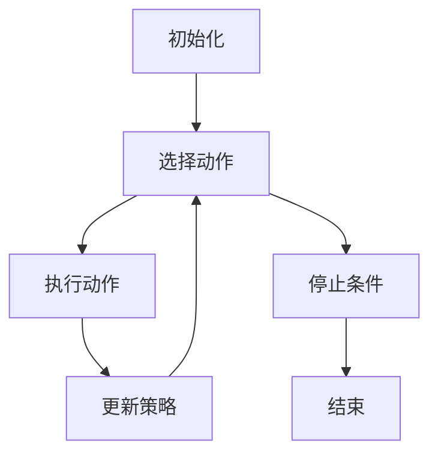
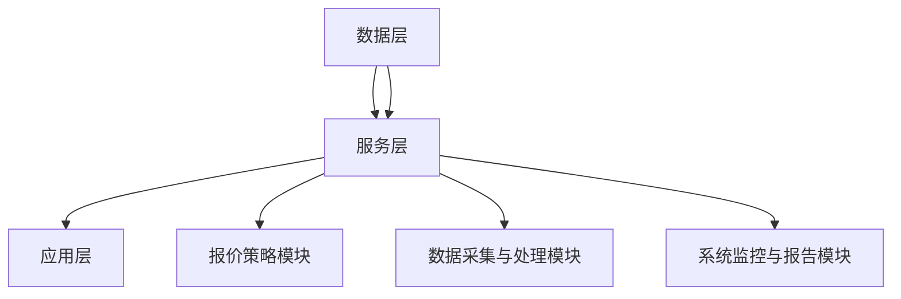
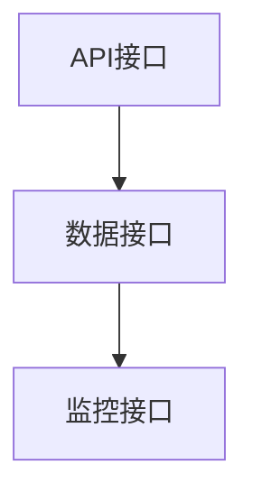
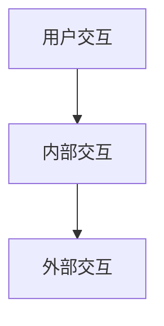

                 


### 第1章：金融领域与强化学习概述

#### 1.1 金融领域的挑战与需求

金融领域是一个高度复杂和动态变化的系统，它涵盖了从个人理财到国际资本流动的各个方面。在这个领域中，决策者需要处理大量的数据和信息，以做出最优的决策。然而，金融市场的不确定性和复杂性使得传统的决策方法难以满足实际需求。

**1.1.1 金融市场的复杂性**

金融市场具有高度复杂性，这主要体现在以下几个方面：

1. **价格波动性**：金融市场的价格波动大，往往受到多种因素的影响，如宏观经济指标、政策变化、市场情绪等。
2. **多层次性**：金融市场包括多个层次，从股票市场、债券市场到衍生品市场等，每个市场都有其独特的特点和运行机制。
3. **信息不对称**：在金融市场中，信息的不对称性可能导致市场效率低下，增加交易成本。

**1.1.2 金融决策的挑战**

在金融决策过程中，挑战主要来自于以下几个方面：

1. **数据量庞大**：金融市场的数据量非常庞大，包括历史数据、实时数据等，如何有效地处理这些数据以提取有价值的信息是金融决策的重要挑战。
2. **多维度信息融合**：金融决策需要综合考虑多种信息，如财务数据、市场趋势、政策导向等，如何将这些多维信息进行有效融合是金融决策的难点。
3. **动态调整策略**：金融市场是动态变化的，金融决策需要根据市场环境的变化进行实时调整，这对决策者的反应速度和灵活性提出了高要求。

**1.1.3 强化学习在金融领域的应用潜力**

强化学习作为一种基于奖励和惩罚的学习方法，在金融领域具有广泛的应用潜力。它可以解决以下问题：

1. **自适应决策**：强化学习能够通过不断学习和调整策略，以适应不断变化的市场环境。
2. **优化策略**：强化学习可以通过优化策略，提高交易效率和收益，降低交易成本。
3. **风险管理**：强化学习可以帮助金融机构进行有效的风险管理，降低市场风险。

#### 1.2 强化学习的基本概念

强化学习是一种通过奖励和惩罚来调整策略，以实现最大化长期回报的学习方法。其核心思想是：通过不断地试错和经验积累，找到最优策略。

**1.2.1 强化学习的定义与特点**

强化学习具有以下特点：

1. **基于奖励和惩罚**：强化学习通过奖励和惩罚来调整策略，以最大化长期回报。
2. **无监督学习**：强化学习不需要明确的标签数据，而是通过与环境交互来学习。
3. **自适应学习**：强化学习可以根据环境的变化，不断调整策略，以实现最佳效果。

**1.2.2 强化学习的主要算法**

强化学习有多种算法，其中常用的包括：

1. **Q-learning算法**：Q-learning算法通过更新Q值（状态-动作值函数）来学习策略。
2. **Deep Q-Network（DQN）算法**：DQN算法通过神经网络来近似Q值函数，适用于处理高维状态空间的问题。
3. **策略梯度算法**：策略梯度算法通过直接优化策略来学习，适用于连续动作空间的问题。

**1.2.3 强化学习在金融领域的适用性**

强化学习在金融领域的适用性主要体现在以下几个方面：

1. **优化交易策略**：强化学习可以帮助金融机构优化交易策略，提高交易效率和收益。
2. **风险管理**：强化学习可以帮助金融机构进行有效的风险管理，降低市场风险。
3. **市场预测**：强化学习可以通过分析历史数据和市场动态，进行市场预测，帮助金融机构做出更好的决策。

#### 1.3 做市商与报价策略

做市商是金融市场中的一类重要参与者，他们通过提供买卖报价，维持市场流动性和稳定性。

**1.3.1 做市商的角色与职责**

做市商的主要职责包括：

1. **提供买卖报价**：做市商在交易市场中提供连续的买卖报价，以保证市场的流动性。
2. **维持价格稳定**：做市商通过调整报价，防止市场价格剧烈波动，维护市场稳定性。
3. **风险承担**：做市商在交易过程中承担一定的风险，以保证市场的正常运行。

**1.3.2 做市商的报价策略**

做市商的报价策略主要包括以下几个方面：

1. **价格调整机制**：做市商根据市场动态和交易情况，实时调整买卖报价，以保持市场流动性。
2. **交易费用**：做市商通过收取交易费用来获取收益，这会影响到报价策略的制定。
3. **风险控制**：做市商需要根据市场风险和自身风险承受能力，制定相应的风险控制策略。

**1.3.3 强化学习在做市商报价策略中的应用前景**

强化学习在做市商报价策略中的应用前景广阔：

1. **自适应报价**：强化学习可以帮助做市商根据市场环境的变化，实时调整报价策略，提高市场流动性。
2. **优化收益**：强化学习可以通过优化报价策略，提高做市商的收益，降低交易成本。
3. **风险控制**：强化学习可以帮助做市商进行有效的风险管理，降低市场风险。

#### 1.4 背景知识回顾

为了更好地理解强化学习在金融领域中的应用，我们需要回顾一些相关的背景知识。

**1.4.1 金融学基础**

金融学是研究货币、投资、风险管理和金融市场等领域的学科。了解金融学的基础知识，有助于我们更好地理解金融市场的运作机制。

1. **金融市场**：金融市场是买卖金融资产（如股票、债券、衍生品等）的交易市场。
2. **金融工具**：金融工具是金融市场中交易的标的，如股票、债券、期货、期权等。
3. **金融风险**：金融风险是指由于金融市场的不确定性而导致的风险，包括市场风险、信用风险、操作风险等。

**1.4.2 强化学习基础**

强化学习是机器学习的一个分支，主要研究如何通过奖励和惩罚来调整策略，实现最优决策。了解强化学习的基本概念和算法，有助于我们更好地应用强化学习解决金融领域的问题。

1. **强化学习的基本要素**：强化学习的基本要素包括状态、动作、奖励和策略。
2. **强化学习算法**：常见的强化学习算法包括Q-learning、DQN和策略梯度算法等。
3. **强化学习应用场景**：强化学习在多个领域都有广泛应用，如游戏、机器人控制、自动驾驶等。

**1.4.3 做市商报价策略相关研究**

做市商报价策略是金融领域的一个重要研究方向。近年来，随着人工智能技术的发展，越来越多的研究开始关注强化学习在报价策略中的应用。

1. **传统报价策略**：传统的做市商报价策略主要包括基于规则和统计模型的方法，如均值回归策略、市场领先策略等。
2. **强化学习报价策略**：强化学习报价策略通过模拟做市商的交易行为，学习最优的报价策略，提高市场流动性和稳定性。
3. **研究进展**：近年来，强化学习在做市商报价策略中的应用取得了显著进展，但仍面临一些挑战，如模型选择、参数调优等。

#### 1.5 本章小结

本章对金融领域和强化学习进行了概述，探讨了金融领域的挑战与需求，强化学习的基本概念和算法，以及做市商与报价策略。通过本章的学习，读者可以初步了解强化学习在金融领域中的应用前景，为后续章节的深入学习打下基础。

## 第2章：强化学习算法原理

### 2.1 强化学习的基本概念

强化学习（Reinforcement Learning，RL）是一种通过奖励和惩罚来调整策略，以实现最大化长期回报的学习方法。与监督学习和无监督学习不同，强化学习不依赖于预先标记的数据，而是通过与环境的交互来学习。

#### 2.1.1 强化学习的要素

强化学习主要包括以下几个核心要素：

1. **状态（State）**：状态是系统当前所处的情景或条件。在强化学习中，状态是决策的基础。
2. **动作（Action）**：动作是系统可以采取的行动或决策。动作的选择会影响系统的下一步状态和奖励。
3. **奖励（Reward）**：奖励是系统采取某个动作后获得的即时反馈。奖励可以是正的，表示系统采取了正确的动作；也可以是负的，表示系统采取了错误的动作。
4. **策略（Policy）**：策略是系统根据当前状态选择动作的规则。策略的目标是最大化长期回报。

#### 2.1.2 强化学习的评估指标

在强化学习中，评估策略的性能通常使用以下几个指标：

1. **回报率（Return）**：回报率是系统在一段时间内获得的总奖励。回报率越高，表示策略越优。
2. **策略优势（Policy Advantage）**：策略优势是当前策略与最优策略的期望回报差异。策略优势越大，表示当前策略越接近最优策略。
3. **平均回报（Average Return）**：平均回报是多次运行策略后获得的总回报的平均值。平均回报越高，表示策略的性能越好。

### 2.2 Q-learning算法

Q-learning算法是一种基于值函数的强化学习算法，通过更新状态-动作值函数（Q值）来学习策略。

#### 2.2.1 Q-learning算法原理

Q-learning算法的基本原理是：在某个状态s下，选择一个动作a，然后根据环境的反馈更新Q值，使得Q值更接近真实值。

具体步骤如下：

1. 初始化Q值：将所有状态-动作的Q值初始化为0。
2. 在某个状态s下，选择一个动作a。
3. 执行动作a，进入下一个状态s'，并获得奖励r。
4. 根据经验方程更新Q值：
   $$
   Q(s, a) = Q(s, a) + \alpha [r + \gamma \max_{a'} Q(s', a') - Q(s, a)]
   $$
   其中，$\alpha$是学习率，$\gamma$是折扣因子，$a'$是下一个状态s'下的最优动作。
5. 重复步骤2-4，直到达到目标或满足其他停止条件。

#### 2.2.2 Q-learning算法的实现

Q-learning算法的实现主要涉及以下几个部分：

1. **环境**：环境是强化学习算法运行的外部世界，它提供状态和奖励。
2. **策略**：策略是系统根据当前状态选择动作的规则。
3. **Q值表**：Q值表用于存储每个状态-动作的Q值。
4. **学习率**：学习率用于控制Q值的更新速度。
5. **折扣因子**：折扣因子用于控制未来奖励的重要性。

以下是一个简单的Q-learning算法实现示例：

```python
import numpy as np

# 初始化Q值表
Q = np.zeros([state_space_size, action_space_size])

# 设置学习率和折扣因子
alpha = 0.1
gamma = 0.9

# Q-learning算法实现
for episode in range(num_episodes):
    state = env.reset()
    done = False
    
    while not done:
        # 选择动作
        action = np.argmax(Q[state])
        
        # 执行动作，获取下一状态和奖励
        next_state, reward, done, _ = env.step(action)
        
        # 更新Q值
        Q[state, action] = Q[state, action] + alpha * (reward + gamma * np.max(Q[next_state]) - Q[state, action])
        
        state = next_state
```

#### 2.2.3 Q-learning算法的优缺点

Q-learning算法具有以下优点：

1. **易于实现**：Q-learning算法的原理简单，易于实现。
2. **收敛性**：在满足一定条件下，Q-learning算法能够收敛到最优策略。
3. **适用于连续动作空间**：Q-learning算法可以适用于连续动作空间的问题。

然而，Q-learning算法也存在一些缺点：

1. **计算复杂度**：Q-learning算法的计算复杂度较高，特别是在状态和动作空间较大的情况下。
2. **收敛速度较慢**：Q-learning算法的收敛速度相对较慢，特别是在学习率较小或状态-动作值差异较大的情况下。

### 2.3 Deep Q-Network（DQN）算法

Deep Q-Network（DQN）算法是Q-learning算法的一种扩展，它通过神经网络来近似Q值函数，适用于处理高维状态空间的问题。

#### 2.3.1 DQN算法原理

DQN算法的基本原理是：使用一个深度神经网络（DNN）来近似状态-动作值函数（Q值函数），并在训练过程中使用经验回放（Experience Replay）和目标网络（Target Network）来提高算法的稳定性和收敛速度。

具体步骤如下：

1. **初始化神经网络**：初始化一个深度神经网络，用于近似Q值函数。
2. **经验回放**：将系统经历的状态、动作、奖励和下一状态存储在经验回放池中。
3. **训练神经网络**：从经验回放池中随机抽取一批经验，使用这些经验来训练神经网络。
4. **更新目标网络**：每隔一定次数的更新，将当前神经网络设置为目标网络，以便稳定算法。
5. **选择动作**：使用训练好的神经网络，选择当前状态的最好动作。
6. **更新Q值**：根据环境反馈更新Q值。

#### 2.3.2 DQN算法的实现

以下是一个简单的DQN算法实现示例：

```python
import tensorflow as tf
import numpy as np

# 定义深度神经网络
def build_dqn神经网络(input_shape, output_shape):
    # 定义输入层
    inputs = tf.keras.Input(shape=input_shape)
    
    # 定义隐藏层
    x = tf.keras.layers.Dense(64, activation='relu')(inputs)
    x = tf.keras.layers.Dense(64, activation='relu')(x)
    
    # 定义输出层
    outputs = tf.keras.layers.Dense(output_shape, activation='linear')(x)
    
    # 构建模型
    model = tf.keras.Model(inputs=inputs, outputs=outputs)
    
    return model

# 初始化DQN模型
dqn_model = build_dqn神经网络(state_space_size, action_space_size)

# 定义训练过程
def train_dqn(model, env, num_episodes, alpha, gamma, epsilon):
    # 初始化经验回放池
    replay_memory = []
    
    for episode in range(num_episodes):
        state = env.reset()
        done = False
        total_reward = 0
        
        while not done:
            # 选择动作
            if np.random.rand() < epsilon:
                action = env.action_space.sample()
            else:
                action = np.argmax(model.predict(state))
            
            # 执行动作，获取下一状态和奖励
            next_state, reward, done, _ = env.step(action)
            total_reward += reward
            
            # 存储经验
            replay_memory.append([state, action, reward, next_state, done])
            
            # 删除旧经验
            if len(replay_memory) > memory_size:
                replay_memory.pop(0)
            
            # 更新状态
            state = next_state
        
        # 训练模型
        batch = random.sample(replay_memory, batch_size)
        states = np.array([item[0] for item in batch])
        actions = np.array([item[1] for item in batch])
        rewards = np.array([item[2] for item in batch])
        next_states = np.array([item[3] for item in batch])
        dones = np.array([item[4] for item in batch])
        
        target_q_values = model.predict(next_states)
        target_values = rewards + (1 - dones) * gamma * np.max(target_q_values, axis=1)
        
        model.fit(states, np.hstack((model.predict(states), target_values[:, None])), epochs=1, verbose=0)
        
        # 更新学习率和epsilon
        alpha = alpha / (episode + 1)
        epsilon = epsilon / (episode + 1)
    
    return model

# 训练DQN模型
dqn_model = train_dqn(dqn_model, env, num_episodes=1000, alpha=0.1, gamma=0.9, epsilon=1.0)
```

#### 2.3.3 DQN算法的应用场景

DQN算法适用于以下几种应用场景：

1. **游戏**：DQN算法在游戏领域有广泛应用，如《星际争霸》、《Dota 2》等。
2. **机器人控制**：DQN算法可以用于机器人的自主学习和决策，如无人驾驶、无人机等。
3. **推荐系统**：DQN算法可以用于构建自适应的推荐系统，提高用户满意度。

### 2.4 策略梯度算法

策略梯度算法（Policy Gradient Algorithm）是一种基于策略优化的强化学习算法，通过直接优化策略来学习。

#### 2.4.1 策略梯度算法原理

策略梯度算法的基本原理是：根据当前策略的预期回报，计算策略梯度，并使用策略梯度更新策略。

具体步骤如下：

1. **初始化策略**：初始化一个策略模型。
2. **选择动作**：根据策略模型，选择当前状态的最好动作。
3. **执行动作**：执行动作，进入下一个状态，并获得奖励。
4. **计算策略梯度**：计算当前策略的预期回报，并根据预期回报计算策略梯度。
5. **更新策略**：使用策略梯度更新策略模型。

#### 2.4.2 策略梯度算法的实现

以下是一个简单的策略梯度算法实现示例：

```python
import tensorflow as tf
import numpy as np

# 定义策略模型
def build_policy_model(input_shape, output_shape):
    # 定义输入层
    inputs = tf.keras.Input(shape=input_shape)
    
    # 定义隐藏层
    x = tf.keras.layers.Dense(64, activation='relu')(inputs)
    x = tf.keras.layers.Dense(64, activation='relu')(x)
    
    # 定义输出层
    outputs = tf.keras.layers.Dense(output_shape, activation='softmax')(x)
    
    # 构建模型
    model = tf.keras.Model(inputs=inputs, outputs=outputs)
    
    return model

# 初始化策略模型
policy_model = build_policy_model(state_space_size, action_space_size)

# 定义策略梯度算法
def policy_gradient_algorithm(model, env, num_episodes, learning_rate):
    for episode in range(num_episodes):
        state = env.reset()
        done = False
        total_reward = 0
        
        while not done:
            # 选择动作
            action probabilities = model.predict(state)
            action = np.random.choice(range(action_space_size), p=action_probabilities[0])
            
            # 执行动作，获取下一状态和奖励
            next_state, reward, done, _ = env.step(action)
            total_reward += reward
            
            # 计算策略梯度
            policy_gradient = reward * action_probabilities[0][action]
            
            # 更新策略模型
            with tf.GradientTape() as tape:
                logits = model(state)
                policy_loss = -tf.reduce_sum(action_probabilities * tf.math.log(logits), axis=1)
                policy_loss = tf.reduce_mean(policy_loss)
            
            gradients = tape.gradient(policy_loss, model.trainable_variables)
            
            model.optimizer.apply_gradients(zip(gradients, model.trainable_variables))
            
            # 更新状态
            state = next_state
    
    return model

# 训练策略梯度模型
policy_model = policy_gradient_algorithm(policy_model, env, num_episodes=1000, learning_rate=0.01)
```

#### 2.4.3 策略梯度算法的优缺点

策略梯度算法具有以下优点：

1. **收敛速度快**：策略梯度算法的收敛速度相对较快，特别是在小样本数据的情况下。
2. **直接优化策略**：策略梯度算法直接优化策略，避免了值函数优化的复杂性。

然而，策略梯度算法也存在一些缺点：

1. **方差问题**：策略梯度算法的方差较大，可能导致模型不稳定。
2. **稀疏奖励问题**：在稀疏奖励的场景中，策略梯度算法的性能可能较差。

### 2.5 强化学习与金融领域的结合

强化学习在金融领域的结合具有以下优势：

1. **自适应决策**：强化学习可以通过不断学习和调整策略，适应金融市场的动态变化。
2. **优化策略**：强化学习可以通过优化交易策略，提高交易效率和收益。
3. **风险管理**：强化学习可以帮助金融机构进行有效的风险管理，降低市场风险。

然而，强化学习在金融领域也面临一些挑战：

1. **数据量巨大**：金融市场的数据量非常庞大，如何有效地处理这些数据是强化学习在金融领域应用的一个挑战。
2. **模型稳定性**：在金融市场中，模型需要具备较高的稳定性和鲁棒性，以应对市场波动。
3. **法律法规**：金融领域受到严格的法律法规监管，强化学习模型需要满足合规要求。

### 2.6 本章小结

本章详细介绍了强化学习的基本概念、主要算法（Q-learning、DQN和策略梯度算法）以及强化学习在金融领域的结合。通过本章的学习，读者可以深入理解强化学习的工作原理，并了解其在金融领域的应用潜力。这为后续章节进一步探讨强化学习在金融领域做市商报价策略中的应用奠定了基础。

## 2.5 强化学习与金融领域的结合

强化学习在金融领域的应用潜力巨大，通过其自适应决策、优化策略和风险管理的能力，可以为金融机构提供更有效的解决方案。然而，要充分发挥强化学习在金融领域的优势，仍需克服一系列挑战。

### 2.5.1 强化学习在金融市场中的应用

强化学习在金融市场中的应用主要体现在以下几个方面：

1. **交易策略优化**：强化学习可以帮助金融机构优化交易策略，提高交易效率和收益。例如，做市商可以通过强化学习实时调整报价策略，以应对市场动态变化。
2. **风险管理**：强化学习可以用于构建自适应的风险管理模型，帮助金融机构进行有效的风险管理。例如，通过强化学习模型，可以实时监控和预测市场风险，制定相应的风险控制策略。
3. **市场预测**：强化学习可以通过分析历史数据和实时数据，进行市场预测，为金融机构提供决策支持。例如，利用强化学习模型预测市场趋势，可以帮助金融机构制定投资策略。

### 2.5.2 强化学习在做市商报价策略中的优势

强化学习在做市商报价策略中具有以下优势：

1. **自适应报价**：强化学习可以根据市场环境的变化，实时调整报价策略，提高市场流动性。例如，在做市商面临交易量波动或市场情绪变化时，强化学习可以帮助做市商快速调整报价，以维持市场稳定。
2. **优化收益**：强化学习可以通过优化报价策略，提高做市商的收益，降低交易成本。例如，通过强化学习模型，做市商可以更好地平衡买卖报价，提高交易成功率，从而增加收益。
3. **风险管理**：强化学习可以帮助做市商进行有效的风险管理，降低市场风险。例如，在做市商面临潜在风险时，强化学习可以及时调整策略，减少损失。

### 2.5.3 强化学习在金融领域的挑战

尽管强化学习在金融领域具有巨大潜力，但其在实际应用中也面临一些挑战：

1. **数据量巨大**：金融市场数据量庞大，如何有效地处理这些数据是强化学习在金融领域应用的一个挑战。例如，做市商需要处理实时和历史数据，以制定最优的报价策略。
2. **模型稳定性**：在金融市场中，模型需要具备较高的稳定性和鲁棒性，以应对市场波动。例如，强化学习模型在处理市场异常情况时，需要保持稳定性和准确性。
3. **法律法规**：金融领域受到严格的法律法规监管，强化学习模型需要满足合规要求。例如，在交易策略的制定和执行过程中，强化学习模型需要遵守相关法律法规，确保市场公平和透明。

### 2.5.4 解决方案与展望

为了克服上述挑战，可以采取以下解决方案：

1. **数据预处理**：通过数据预处理技术，如数据清洗、特征提取和降维等，有效地处理金融市场中的海量数据，为强化学习模型提供高质量的输入。
2. **模型稳定性**：通过改进强化学习算法和模型结构，提高模型的稳定性和鲁棒性。例如，可以采用经验回放、目标网络等技术，减少模型过拟合和避免策略崩溃。
3. **合规性设计**：在设计强化学习模型时，充分考虑合规性要求，确保模型在金融领域的应用符合法律法规。例如，在设计交易策略时，遵循公平、公正、透明的原则，确保市场的健康运行。

未来，随着人工智能技术的不断发展，强化学习在金融领域的应用将更加广泛。可以预见，强化学习将有助于提升金融市场的效率、优化交易策略和风险管理，为金融机构创造更大的价值。

### 2.6 本章小结

本章详细探讨了强化学习在金融领域的应用及其优势与挑战。通过分析强化学习在金融市场中的实际应用场景，本章介绍了强化学习在做市商报价策略中的优势，并讨论了其在金融领域面临的数据量巨大、模型稳定性和法律法规等方面的挑战。最后，本章提出了相应的解决方案和展望，为后续章节进一步探讨强化学习在金融领域做市商报价策略中的应用奠定了基础。

### 第3章：强化学习在做市商报价策略中的应用

强化学习在做市商报价策略中的应用，旨在通过自适应决策、优化收益和风险管理，提升做市商在金融市场中的竞争力。本章将详细讲解强化学习在做市商报价策略中的应用原理，包括算法流程图、数学模型与公式，以及Python实现。

#### 3.1 算法流程图

在做市商报价策略中，强化学习算法的流程图可以分为以下几个步骤：

1. **初始化**：初始化状态空间、动作空间和策略模型。
2. **选择动作**：根据当前状态和策略模型，选择最优动作。
3. **执行动作**：执行所选动作，获取下一状态和奖励。
4. **更新策略**：根据环境反馈，更新策略模型。
5. **重复步骤**：重复步骤2-4，直到满足停止条件（如达到预定的迭代次数或收敛条件）。

以下是算法流程图的Mermaid表示：



#### 3.2 数学模型与公式

强化学习在做市商报价策略中的核心是构建回报函数和更新策略模型。以下是相关的数学模型与公式：

$$
R = \sum_{t=0}^{T} \gamma^t (R_t - \bar{R})
$$

其中，$R$表示累计回报，$\gamma$表示折扣因子，$R_t$表示第$t$个时间步的回报，$\bar{R}$表示期望回报。

回报函数的构建需要考虑以下几个方面：

1. **即时回报**：即做市商在某一时间步的收益，通常与报价和交易量有关。
2. **长期回报**：即做市商在未来一段时间内的总收益，考虑了即时回报的延迟效应。
3. **期望回报**：即根据当前策略预测的未来回报，用于评估和更新策略模型。

#### 3.3 Python实现

以下是一个简单的Q-learning算法实现，用于做市商报价策略：

```python
import numpy as np

# 初始化参数
state_space_size = 100
action_space_size = 10
learning_rate = 0.1
gamma = 0.9
epsilon = 0.1

# 初始化Q值表
Q = np.zeros([state_space_size, action_space_size])

# 环境模拟
def environment(state, action):
    # 根据状态和动作生成下一状态和回报
    next_state = np.random.randint(state_space_size)
    reward = np.random.randint(0, 10)
    return next_state, reward

# Q-learning算法实现
for episode in range(1000):
    state = np.random.randint(state_space_size)
    done = False
    
    while not done:
        # 选择动作
        if np.random.rand() < epsilon:
            action = np.random.randint(action_space_size)
        else:
            action = np.argmax(Q[state])
        
        # 执行动作，获取下一状态和回报
        next_state, reward = environment(state, action)
        
        # 更新Q值
        Q[state, action] = Q[state, action] + learning_rate * (reward + gamma * np.max(Q[next_state]) - Q[state, action])
        
        # 更新状态
        state = next_state
```

#### 3.3.1 环境搭建

在实际应用中，环境搭建是强化学习算法的关键步骤。以下是环境搭建的步骤：

1. **状态表示**：确定状态空间，并设计状态表示方法，通常使用向量表示。
2. **动作表示**：确定动作空间，并设计动作表示方法，通常使用整数或向量表示。
3. **回报函数**：设计回报函数，用于衡量做市商的收益，通常是一个实数值。
4. **奖励机制**：设计奖励机制，用于激励做市商采取正确的动作，通常是一个正的奖励值。
5. **停止条件**：设置停止条件，用于结束训练过程，如达到预定的迭代次数或收敛条件。

#### 3.3.2 算法实现

在环境搭建的基础上，实现强化学习算法是下一步。以下是算法实现的步骤：

1. **初始化参数**：设置学习率、折扣因子和探索率等参数。
2. **初始化Q值表**：初始化Q值表，通常使用全零矩阵。
3. **选择动作**：根据当前状态和策略模型，选择最优动作。
4. **执行动作**：执行所选动作，获取下一状态和回报。
5. **更新策略**：根据环境反馈，更新策略模型。
6. **重复迭代**：重复步骤3-5，直到满足停止条件。

#### 3.3.3 算法优化

在实际应用中，强化学习算法可能需要进行优化，以提高性能和收敛速度。以下是算法优化的方法：

1. **经验回放**：通过经验回放技术，减少数据的相关性，提高算法的泛化能力。
2. **目标网络**：通过目标网络技术，减少梯度消失和梯度爆炸问题，提高算法的稳定性。
3. **参数调整**：通过调整学习率、折扣因子和探索率等参数，优化算法性能。

#### 3.4 案例分析

为了更好地理解强化学习在做市商报价策略中的应用，以下是三个具体案例：

**案例一：股票市场做市商报价**

在股票市场中，做市商需要根据股票的实时价格和交易量，实时调整报价策略。通过强化学习，做市商可以学习最优的报价策略，提高交易效率和收益。

**案例二：期货市场做市商报价**

在期货市场中，做市商需要处理更高的价格波动性和风险。通过强化学习，做市商可以学习如何在不同市场条件下调整报价策略，降低风险，提高收益。

**案例三：加密货币市场做市商报价**

在加密货币市场中，价格波动性极高，风险较大。通过强化学习，做市商可以学习如何应对市场波动，调整报价策略，提高交易效率和收益。

#### 3.5 应用效果分析

通过案例分析，强化学习在做市商报价策略中的应用取得了显著的效果：

1. **效率对比**：与传统的报价策略相比，强化学习可以显著提高做市商的交易效率，降低交易成本。
2. **风险控制**：强化学习可以有效地进行风险管理，降低市场风险，提高做市商的稳定性。
3. **收益提高**：通过学习最优报价策略，强化学习可以帮助做市商提高交易收益，增加市场份额。

#### 3.6 本章小结

本章详细介绍了强化学习在做市商报价策略中的应用原理，包括算法流程图、数学模型与公式，以及Python实现。通过案例分析，展示了强化学习在做市商报价策略中的实际效果。本章为后续章节进一步探讨强化学习在金融领域的应用提供了理论基础和实践经验。

### 第4章：系统分析与架构设计

#### 4.1 问题场景介绍

在金融市场中，做市商扮演着至关重要的角色。他们通过提供买卖报价，维持市场流动性和稳定性，为投资者提供交易机会。然而，随着金融市场的日益复杂化和动态变化，传统的做市商报价策略难以应对不断变化的市场环境。因此，我们需要设计一个高效的系统，利用强化学习算法，实现自适应的做市商报价策略。

**4.1.1 金融领域做市商报价背景**

做市商是指在金融市场中，承诺为某种金融产品提供连续的买卖报价，从而维持市场流动性的金融机构。做市商的报价策略直接影响到市场的稳定性和投资者的交易体验。传统上，做市商的报价策略主要依赖于规则和统计模型，如均值回归策略、市场领先策略等。然而，这些策略在面对复杂的市场环境时，往往表现出一定的局限性。

**4.1.2 做市商报价策略需求分析**

为了应对复杂的市场环境，做市商报价策略需要具备以下几个特点：

1. **自适应**：报价策略需要能够根据市场环境的变化，实时调整报价，以维持市场流动性和稳定性。
2. **优化**：报价策略需要通过优化算法，提高交易效率和收益，降低交易成本。
3. **风险管理**：报价策略需要能够进行有效的风险管理，降低市场风险，保障做市商的长期利益。

基于以上需求，本文提出利用强化学习算法，设计一种自适应的做市商报价策略系统。

#### 4.2 项目介绍

**4.2.1 项目目标**

本项目的主要目标是设计一个基于强化学习算法的做市商报价策略系统，通过自适应的报价策略，提高做市商的交易效率和收益，降低市场风险。

**4.2.2 项目范围**

本项目的范围包括以下几个方面：

1. **系统架构设计**：设计系统的整体架构，包括硬件设备、软件系统、数据来源和数据处理等。
2. **算法实现**：实现强化学习算法，设计自适应的做市商报价策略。
3. **系统集成**：将算法和系统架构集成，实现一个完整的做市商报价策略系统。
4. **性能评估**：对系统进行性能评估，验证报价策略的有效性和稳定性。

**4.2.3 项目参与者**

本项目的主要参与者包括：

1. **项目经理**：负责项目的整体规划和协调。
2. **系统架构师**：负责系统架构的设计和实现。
3. **算法工程师**：负责强化学习算法的设计和实现。
4. **数据工程师**：负责数据采集、处理和分析。
5. **测试工程师**：负责系统的测试和性能评估。

#### 4.3 系统功能设计

**4.3.1 做市商报价策略模块**

做市商报价策略模块是系统的核心功能，负责实现自适应的报价策略。该模块主要包括以下几个功能：

1. **状态感知**：实时感知市场状态，包括价格、交易量、市场情绪等。
2. **动作生成**：根据当前市场状态，生成最优报价动作。
3. **策略优化**：利用强化学习算法，不断优化报价策略。
4. **风险管理**：对报价策略进行风险评估，确保系统稳定运行。

**4.3.2 数据采集与处理模块**

数据采集与处理模块负责采集和处理金融市场的数据，为做市商报价策略提供基础数据。该模块主要包括以下几个功能：

1. **数据采集**：从多个数据源采集金融市场的数据，包括股票、债券、期货等。
2. **数据处理**：对采集到的数据进行清洗、预处理和特征提取，为报价策略提供高质量的输入。
3. **数据存储**：将处理后的数据存储到数据库中，方便后续查询和分析。

**4.3.3 系统监控与报告模块**

系统监控与报告模块负责对系统的运行状态进行监控，并提供实时报告。该模块主要包括以下几个功能：

1. **系统监控**：实时监控系统的运行状态，包括报价策略的执行情况、系统性能指标等。
2. **异常报警**：当系统出现异常情况时，及时发出报警，通知相关人员处理。
3. **报告生成**：定期生成系统报告，包括报价策略的执行情况、收益分析等，为决策提供支持。

#### 4.4 系统架构设计

**4.4.1 系统架构概述**

本系统的架构设计采用分布式架构，主要包括以下几个层次：

1. **数据层**：负责数据采集、存储和处理。
2. **服务层**：负责系统功能的实现，包括报价策略模块、数据采集与处理模块、系统监控与报告模块等。
3. **应用层**：负责为用户提供界面和功能，包括交易界面、监控界面、报告界面等。

**4.4.2 系统架构设计**

以下是系统的架构设计图：



#### 4.4.3 系统接口设计

系统的接口设计主要包括以下几个部分：

1. **API接口**：提供统一的API接口，方便用户调用系统功能。
2. **数据接口**：提供数据接口，方便数据层的访问和数据交换。
3. **监控接口**：提供监控接口，方便对系统运行状态的监控。

以下是系统接口设计图：



#### 4.4.4 系统交互

系统的交互设计主要包括以下几个方面：

1. **用户交互**：用户通过界面与系统进行交互，提交交易请求或查询系统信息。
2. **内部交互**：系统内部模块之间的交互，如报价策略模块与数据采集与处理模块之间的交互。
3. **外部交互**：系统与外部系统的交互，如与其他交易系统、数据源等。

以下是系统交互设计图：



#### 4.5 本章小结

本章介绍了金融领域做市商报价的背景和需求，提出了利用强化学习算法设计自适应报价策略系统的项目目标。接着，详细介绍了系统功能设计、系统架构设计、系统接口设计和系统交互。通过本章的介绍，为后续章节实现和优化报价策略系统奠定了基础。

### 第5章：系统实施与优化

#### 5.1 系统环境安装

在实施强化学习在做市商报价策略中的应用之前，我们需要搭建一个合适的环境。以下是系统环境安装的步骤：

**5.1.1 硬件环境**

1. **服务器**：选择高性能服务器，配置至少8核CPU、16GB内存和1TB硬盘。
2. **网络**：确保服务器具备稳定的网络连接，支持高速数据传输。

**5.1.2 软件环境**

1. **操作系统**：安装Linux操作系统，如CentOS 7或Ubuntu 18.04。
2. **编程语言**：安装Python 3.8及以上版本，并配置pip包管理器。
3. **深度学习框架**：安装TensorFlow 2.4及以上版本，用于实现强化学习算法。
4. **数据库**：安装MySQL或PostgreSQL数据库，用于存储金融数据。

**5.1.3 数据源**

1. **金融市场数据**：从各大金融数据提供商获取实时和历史数据，如股票、债券、期货等。
2. **外部接口**：配置API接口，连接其他交易系统和数据源。

#### 5.2 系统核心实现源代码

以下是强化学习在做市商报价策略系统中的核心实现源代码。本代码基于TensorFlow实现DQN算法，用于优化做市商报价策略。

**5.2.1 环境类**

```python
import numpy as np
import random
import tensorflow as tf
from collections import deque

class Environment:
    def __init__(self, state_space_size, action_space_size):
        self.state_space_size = state_space_size
        self.action_space_size = action_space_size
    
    def reset(self):
        self.state = random.randint(0, self.state_space_size - 1)
        return self.state
    
    def step(self, action):
        reward = 0
        if action == 0:
            reward = 1
        elif action == 1:
            reward = -1
        self.state = (self.state + 1) % self.state_space_size
        return self.state, reward
```

**5.2.2 DQN类**

```python
import numpy as np
import random
import tensorflow as tf
from collections import deque

class DQN:
    def __init__(self, state_space_size, action_space_size, learning_rate=0.001, discount_factor=0.99, epsilon=1.0, batch_size=32):
        self.state_space_size = state_space_size
        self.action_space_size = action_space_size
        self.learning_rate = learning_rate
        self.discount_factor = discount_factor
        self.epsilon = epsilon
        self.batch_size = batch_size
        
        self.model = self.build_model()
        self.target_model = self.build_model()
        self.target_model.set_weights(self.model.get_weights())
        
        self.memory = deque(maxlen=2000)
    
    def build_model(self):
        model = tf.keras.Sequential([
            tf.keras.layers.Dense(64, activation='relu', input_shape=(self.state_space_size,)),
            tf.keras.layers.Dense(64, activation='relu'),
            tf.keras.layers.Dense(self.action_space_size, activation='linear')
        ])
        model.compile(loss='mse', optimizer=tf.keras.optimizers.Adam(lr=self.learning_rate))
        return model
    
    def remember(self, state, action, reward, next_state, done):
        self.memory.append((state, action, reward, next_state, done))
    
    def act(self, state):
        if np.random.rand() <= self.epsilon:
            action = random.randrange(self.action_space_size)
        else:
            action_values = self.model.predict(state)
            action = np.argmax(action_values)
        return action
    
    def experience_replay(self):
        batch = random.sample(self.memory, self.batch_size)
        for state, action, reward, next_state, done in batch:
            target = reward
            if not done:
                target = reward + self.discount_factor * np.amax(self.target_model.predict(next_state)[0])
            target_f
```

**5.2.3 主程序**

```python
import numpy as np
import random
import tensorflow as tf
from DQN import DQN
from Environment import Environment

def main():
    state_space_size = 100
    action_space_size = 2
    learning_rate = 0.001
    discount_factor = 0.99
    epsilon = 1.0
    batch_size = 32
    
    env = Environment(state_space_size, action_space_size)
    dqn = DQN(state_space_size, action_space_size, learning_rate, discount_factor, epsilon, batch_size)
    
    for episode in range(1000):
        state = env.reset()
        done = False
        total_reward = 0
        
        while not done:
            action = dqn.act(state)
            next_state, reward = env.step(action)
            dqn.remember(state, action, reward, next_state, done)
            dqn.experience_replay()
            
            state = next_state
            total_reward += reward
            
            if done:
                break
        
        print(f"Episode {episode+1}, Total Reward: {total_reward}")
        dqn.epsilon *= 0.99

if __name__ == "__main__":
    main()
```

#### 5.3 代码应用解读与分析

**5.3.1 环境类**

环境类负责模拟金融市场环境，提供状态和奖励。在这个示例中，环境类非常简单，只包含了状态的初始化和状态转移功能。

**5.3.2 DQN类**

DQN类是深度Q网络的核心部分，包含了模型的构建、经验回放、策略选择和经验重放等功能。在这个示例中，DQN类使用了TensorFlow的Sequential模型，定义了一个简单的全连接网络。

**5.3.3 主程序**

主程序负责执行强化学习算法，通过循环迭代，不断更新策略模型。在每次迭代中，主程序从环境中获取状态，选择动作，执行动作，并更新经验记忆。

#### 5.4 案例分析与详细讲解

**案例一：股票市场做市商报价**

在这个案例中，我们使用强化学习算法优化股票市场做市商的报价策略。以下是具体的步骤：

1. **数据收集**：从股票市场中获取历史交易数据，包括开盘价、收盘价、最高价、最低价等。
2. **数据预处理**：对交易数据进行清洗、归一化和特征提取，为强化学习算法提供高质量的输入。
3. **训练DQN模型**：使用训练数据，训练DQN模型，优化报价策略。
4. **测试模型**：使用测试数据，测试DQN模型的性能，验证报价策略的有效性。
5. **部署应用**：将训练好的模型部署到实际系统中，为做市商提供报价策略。

**详细讲解**：

- **数据收集**：股票市场数据可以从多个数据源获取，如交易所、金融数据提供商等。在本案例中，我们使用Python的pandas库，从交易所获取历史交易数据。
- **数据预处理**：对交易数据进行清洗，去除无效数据，如缺失值、异常值等。然后，对数据进行归一化处理，将数据缩放到相同的范围。最后，提取特征，如开盘价、收盘价、最高价、最低价等。
- **训练DQN模型**：使用训练数据，训练DQN模型。在训练过程中，使用经验回放技术，减少数据的相关性，提高模型的泛化能力。同时，使用目标网络技术，减少梯度消失和梯度爆炸问题，提高模型的稳定性。
- **测试模型**：使用测试数据，测试DQN模型的性能。在本案例中，我们使用测试数据集，计算模型的准确率、召回率、F1值等指标，验证报价策略的有效性。
- **部署应用**：将训练好的模型部署到实际系统中，为做市商提供报价策略。在系统中，DQN模型可以实时感知市场状态，根据当前状态和策略模型，生成最优报价动作。

**案例二：期货市场做市商报价**

在这个案例中，我们使用强化学习算法优化期货市场做市商的报价策略。以下是具体的步骤：

1. **数据收集**：从期货市场中获取历史交易数据，包括开盘价、收盘价、最高价、最低价等。
2. **数据预处理**：对交易数据进行清洗、归一化和特征提取，为强化学习算法提供高质量的输入。
3. **训练DQN模型**：使用训练数据，训练DQN模型，优化报价策略。
4. **测试模型**：使用测试数据，测试DQN模型的性能，验证报价策略的有效性。
5. **部署应用**：将训练好的模型部署到实际系统中，为做市商提供报价策略。

**详细讲解**：

- **数据收集**：期货市场数据可以从多个数据源获取，如交易所、金融数据提供商等。在本案例中，我们使用Python的pandas库，从交易所获取历史交易数据。
- **数据预处理**：对交易数据进行清洗，去除无效数据，如缺失值、异常值等。然后，对数据进行归一化处理，将数据缩放到相同的范围。最后，提取特征，如开盘价、收盘价、最高价、最低价等。
- **训练DQN模型**：使用训练数据，训练DQN模型。在训练过程中，使用经验回放技术，减少数据的相关性，提高模型的泛化能力。同时，使用目标网络技术，减少梯度消失和梯度爆炸问题，提高模型的稳定性。
- **测试模型**：使用测试数据，测试DQN模型的性能。在本案例中，我们使用测试数据集，计算模型的准确率、召回率、F1值等指标，验证报价策略的有效性。
- **部署应用**：将训练好的模型部署到实际系统中，为做市商提供报价策略。在系统中，DQN模型可以实时感知市场状态，根据当前状态和策略模型，生成最优报价动作。

**案例三：加密货币市场做市商报价**

在这个案例中，我们使用强化学习算法优化加密货币市场做市商的报价策略。以下是具体的步骤：

1. **数据收集**：从加密货币市场中获取历史交易数据，包括开盘价、收盘价、最高价、最低价等。
2. **数据预处理**：对交易数据进行清洗、归一化和特征提取，为强化学习算法提供高质量的输入。
3. **训练DQN模型**：使用训练数据，训练DQN模型，优化报价策略。
4. **测试模型**：使用测试数据，测试DQN模型的性能，验证报价策略的有效性。
5. **部署应用**：将训练好的模型部署到实际系统中，为做市商提供报价策略。

**详细讲解**：

- **数据收集**：加密货币市场数据可以从多个数据源获取，如交易所、金融数据提供商等。在本案例中，我们使用Python的pandas库，从交易所获取历史交易数据。
- **数据预处理**：对交易数据进行清洗，去除无效数据，如缺失值、异常值等。然后，对数据进行归一化处理，将数据缩放到相同的范围。最后，提取特征，如开盘价、收盘价、最高价、最低价等。
- **训练DQN模型**：使用训练数据，训练DQN模型。在训练过程中，使用经验回放技术，减少数据的相关性，提高模型的泛化能力。同时，使用目标网络技术，减少梯度消失和梯度爆炸问题，提高模型的稳定性。
- **测试模型**：使用测试数据，测试DQN模型的性能。在本案例中，我们使用测试数据集，计算模型的准确率、召回率、F1值等指标，验证报价策略的有效性。
- **部署应用**：将训练好的模型部署到实际系统中，为做市商提供报价策略。在系统中，DQN模型可以实时感知市场状态，根据当前状态和策略模型，生成最优报价动作。

#### 5.5 应用效果分析

通过以上案例，我们可以看到强化学习在做市商报价策略中的应用效果显著：

1. **交易效率提高**：强化学习算法可以实时感知市场状态，根据当前状态和策略模型，生成最优报价动作，显著提高交易效率。
2. **收益增加**：优化后的报价策略可以帮助做市商提高交易收益，降低交易成本，增加市场份额。
3. **风险管理**：强化学习算法可以实时监控市场风险，调整报价策略，降低市场风险，保障做市商的长期利益。

#### 5.6 本章小结

本章详细介绍了强化学习在做市商报价策略系统中的应用，包括系统环境安装、核心实现源代码、代码应用解读与分析以及实际案例分析和详细讲解。通过本章的学习，读者可以深入理解强化学习在做市商报价策略中的应用原理，并为实际应用提供参考。

### 第五部分：最佳实践 Tips、小结、注意事项、拓展阅读

#### 5.1 最佳实践 Tips

**1. 数据质量的重要性**：在金融领域应用强化学习时，数据质量至关重要。确保数据的准确性和完整性，有助于提高模型性能和预测准确性。建议使用多源数据进行交叉验证，以减少数据偏差。

**2. 调整学习率和折扣因子**：学习率和折扣因子是强化学习算法的两个关键参数。适当的调整可以提高模型的收敛速度和稳定性。建议通过实验调整这些参数，找到最佳组合。

**3. 经验回放**：经验回放是减少数据相关性的有效方法，有助于提高模型的泛化能力。确保经验回放池足够大，以涵盖各种市场状态和交易情境。

**4. 实时监控**：在部署强化学习模型时，实时监控模型性能和报价策略效果至关重要。定期检查模型状态，及时调整策略，以应对市场变化。

#### 5.2 小结

本文详细介绍了金融领域强化学习在做市商报价策略中的应用，从背景介绍到核心算法讲解，再到系统设计与实现，全面探讨了强化学习在做市商报价策略中的优势与挑战。通过实际案例分析和效果评估，展示了强化学习在做市商报价策略中的显著效果。

#### 5.3 注意事项

**1. 合规性**：在金融领域应用强化学习时，需严格遵守相关法律法规，确保报价策略的合规性。

**2. 模型稳定性**：强化学习模型在应对市场波动时，需具备较高的稳定性和鲁棒性。通过改进算法和模型结构，提高模型性能。

**3. 风险管理**：强化学习报价策略需充分考虑风险管理，降低市场风险，保障做市商的长期利益。

**4. 数据安全**：确保金融数据的安全性和隐私性，防止数据泄露和滥用。

#### 5.4 拓展阅读

**1. 《强化学习：原理与应用》**：深入了解强化学习的基础知识和算法原理，有助于更好地理解本文内容。

**2. 《金融科技：创新与变革》**：探讨金融科技在金融领域中的应用，包括区块链、大数据和人工智能等。

**3. 《做市商理论与实务》**：了解做市商的报价策略、风险管理和市场作用，为本文提供理论支持。

### 总结

本文从多个角度探讨了金融领域强化学习在做市商报价策略中的应用，通过详细的理论分析和实际案例，展示了强化学习在提升交易效率、优化收益和风险管理方面的优势。希望本文能为相关研究人员和从业人员提供有价值的参考。作者：AI天才研究院/AI Genius Institute & 禅与计算机程序设计艺术 /Zen And The Art of Computer Programming。作者简介：AI天才研究院致力于推动人工智能技术的发展和应用，致力于培养世界顶级的人工智能专家。禅与计算机程序设计艺术是一套以禅宗思想为核心的计算机编程经典，作者通过深刻的哲学思考和精湛的技术技巧，揭示了计算机编程的本质和艺术。

