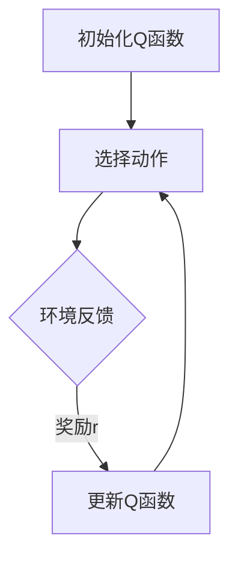
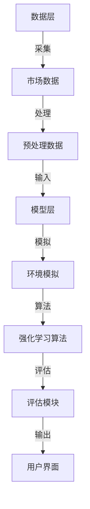
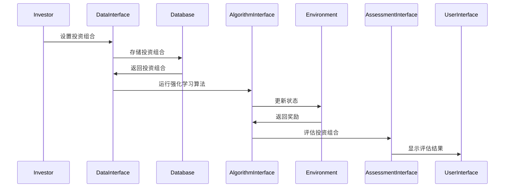
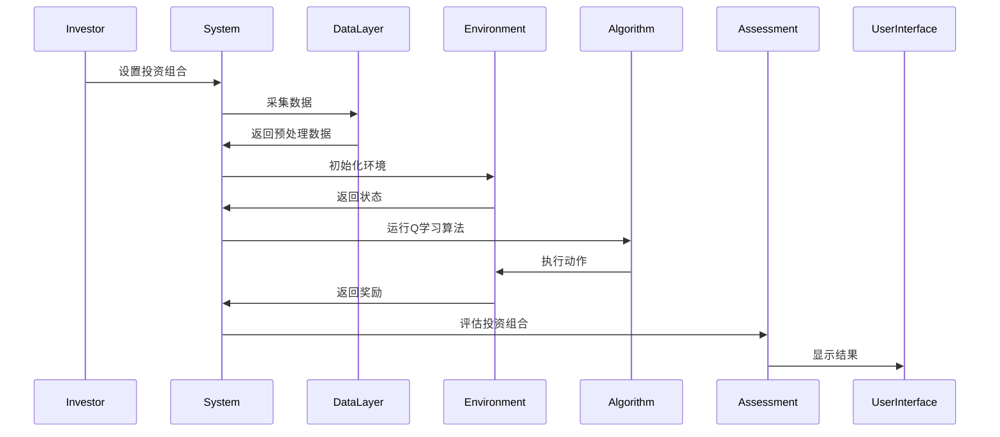

                 

# 金融领域强化学习在多周期投资组合优化中的应用

## 摘要

本文将探讨金融领域中的多周期投资组合优化问题，并提出一种基于强化学习的解决方案。通过引入强化学习，我们能够在复杂的市场环境中自适应地调整投资组合，以实现长期收益的最大化。文章将从核心概念、问题背景、算法原理讲解、系统分析与架构设计、项目实战以及最佳实践等方面进行详细阐述。

## 背景介绍

### 核心概念术语说明

在本文中，我们将使用以下核心概念：

- **强化学习**：一种通过试错学习，不断调整策略以实现目标值最大化的机器学习方法。
- **多周期投资组合优化**：在多个周期内，通过调整资产配置，实现投资组合长期收益最大化的过程。
- **代理**：执行动作并接收奖励的智能体，用于投资组合的优化。
- **环境**：代理执行动作的上下文，用于模拟金融市场的状态。
- **状态**：代理在特定时刻所处的情境，用于表示市场状态。
- **动作**：代理可执行的操作，用于调整投资组合。
- **奖励**：代理执行动作后获得的即时反馈，用于评价策略的效果。

### 问题背景

随着金融市场的发展，投资者面临的决策环境日益复杂。传统的优化方法，如均值方差模型、Markowitz模型等，已难以应对多周期、多因素的投资决策挑战。强化学习作为一种新兴的机器学习方法，具有自主学习和策略优化的能力，逐渐在金融领域受到关注。

### 问题描述

本文的核心问题是：如何设计一个有效的强化学习算法，使其能够在不同的市场环境下，自主调整投资组合，实现长期收益的最大化。具体来说，我们需要解决以下几个问题：

- **环境定义**：明确投资组合的决策空间，包括状态空间和动作空间。
- **状态空间构建**：确定影响投资组合收益的关键因素，如市场指数、股票收益率、宏观经济指标等。
- **动作空间设计**：确定投资组合的调整策略，如买入、卖出、持有等。
- **奖励机制设置**：设计合适的奖励函数，以引导代理学习到有效的投资策略。
- **算法迭代过程**：通过不断迭代，优化代理的投资策略，实现长期收益的最大化。

### 问题解决

为了解决上述问题，本文提出了一个基于多周期投资组合优化的强化学习框架。该框架包括以下几个关键步骤：

1. **环境定义**：根据金融市场的特点，定义投资组合的决策空间，包括状态空间和动作空间。
2. **状态空间构建**：通过收集和分析市场数据，确定影响投资组合收益的关键因素，构建状态空间。
3. **动作空间设计**：设计投资组合的调整策略，如买入、卖出、持有等，构建动作空间。
4. **奖励机制设置**：设计合适的奖励函数，以引导代理学习到有效的投资策略。奖励函数可以基于投资组合的收益、风险等因素进行设计。
5. **算法迭代过程**：通过不断迭代，优化代理的投资策略，实现长期收益的最大化。

### 边界与外延

本文的研究主要集中于股票市场的多周期投资组合优化，但所提出的方法和思路也可拓展到其他金融市场，如债券、外汇等。此外，本文的强化学习框架不仅适用于金融领域，也可应用于其他需要策略优化的领域，如供应链管理、能源管理等。

## 概念结构与核心要素组成

### 强化学习

强化学习是一种通过试错学习，不断调整策略以实现目标值最大化的机器学习方法。其核心概念包括代理（Agent）、环境（Environment）、状态（State）、动作（Action）和奖励（Reward）。

- **代理**：执行动作并接收奖励的智能体，用于投资组合的优化。
- **环境**：代理执行动作的上下文，用于模拟金融市场的状态。
- **状态**：代理在特定时刻所处的情境，用于表示市场状态。
- **动作**：代理可执行的操作，用于调整投资组合。
- **奖励**：代理执行动作后获得的即时反馈，用于评价策略的效果。

### 多周期投资组合优化

多周期投资组合优化是指在一个周期内调整资产配置，以实现投资组合长期收益最大化的过程。其核心要素包括资产配置策略、周期性调整和收益风险平衡。

- **资产配置策略**：确定不同资产在投资组合中的权重分配。
- **周期性调整**：根据市场环境的变化，定期调整投资组合的权重。
- **收益风险平衡**：在追求收益最大化的同时，控制投资组合的风险。

### 强化学习算法

强化学习算法是实现强化学习过程的算法，如Q学习、SARSA、Deep Q-Network（DQN）等。这些算法的核心要素包括状态评估函数、策略迭代和经验回放。

- **状态评估函数**：用于评估代理当前状态的价值，指导代理选择最佳动作。
- **策略迭代**：通过不断迭代，优化代理的投资策略。
- **经验回放**：记录代理的历史经验，用于训练状态评估函数和策略迭代。

### 投资组合优化

投资组合优化是指通过对资产进行配置和调整，实现投资组合风险收益最优化的过程。其核心要素包括资产选择、权重分配和风险控制。

- **资产选择**：根据市场环境选择具有潜在增长潜力的资产。
- **权重分配**：确定不同资产在投资组合中的权重，实现收益最大化。
- **风险控制**：通过合理配置资产和调整投资策略，控制投资组合的风险。

## 核心概念与联系

### 强化学习与投资组合优化的关系

强化学习为投资组合优化提供了自适应调整策略的框架，使投资组合能够根据市场变化进行调整。投资组合优化则为强化学习提供了实际应用场景，使强化学习算法能够在金融市场中验证其有效性。

### 概念属性特征对比表格

| 概念       | 定义                                                         | 属性特征                                                     | 关联关系                                         |
|------------|--------------------------------------------------------------|--------------------------------------------------------------|--------------------------------------------------|
| 强化学习   | 一种通过试错学习，不断调整策略以实现目标值最大化的机器学习方法 | 代理、环境、状态、动作、奖励等                                | 提供了策略优化的框架                             |
| 多周期优化 | 在多个周期内，通过调整资产配置，实现投资组合长期收益最大化的过程 | 资产配置策略、周期性调整、收益风险平衡                       | 强调长期收益最大化                               |
| Q学习      | 一种基于值函数的强化学习算法，通过预测未来奖励来指导当前动作选择 | 值函数、状态-动作对、经验回放等                              | 实现强化学习在投资组合优化中的应用                 |
| 投资组合   | 资产配置的组合，包括股票、债券、基金等                         | 资产选择、权重分配、风险控制等                              | 投资组合优化问题的核心要素                       |

### ER实体关系图架构的Mermaid流程图

```mermaid
erDiagram
    InvestmentPortfolio ||--|{ Agent }||>
    Agent ||--|{ Environment }||>
    Environment ||--|{ State }||>
    State ||--|{ Action }||>
    Action ||--|{ Reward }||>
```

## 算法原理讲解

### 强化学习算法的基本概念

强化学习（Reinforcement Learning, RL）是一种使机器通过与环境的交互来学习如何完成任务的机器学习方法。它与监督学习和无监督学习不同，因为强化学习中的代理（agent）必须通过尝试不同的动作（action）并从环境中获得奖励（reward）来学习。

#### 强化学习的基本组成部分

- **代理（Agent）**：执行动作并试图达到目标的实体。
- **环境（Environment）**：代理执行动作的上下文。
- **状态（State）**：代理在特定时刻所处的情境。
- **动作（Action）**：代理可以执行的操作。
- **奖励（Reward）**：代理执行动作后获得的即时反馈。

强化学习的目标是学习一个策略（policy），该策略能够最大化累积的奖励。策略是代理根据其当前状态选择动作的规则。

### Q学习算法

Q学习（Q-Learning）是一种强化学习算法，通过学习状态-动作值函数（Q-function）来指导代理选择动作。Q函数表示在特定状态下执行特定动作的预期累积奖励。

#### Q学习算法的基本原理

- **Q函数**：表示在状态s下执行动作a的预期累积奖励，记为Q(s, a)。
- **目标**：最大化Q函数的值，即选择能够带来最大预期奖励的动作。
- **更新规则**：通过经验回放和梯度下降方法更新Q函数的值。

Q学习算法的基本更新规则如下：

$$
Q(s, a) \leftarrow Q(s, a) + \alpha [r + \gamma \max_{a'} Q(s', a') - Q(s, a)]
$$

其中，$\alpha$ 是学习率，$\gamma$ 是折扣因子，$r$ 是即时奖励，$s'$ 是执行动作a后的状态。

#### Mermaid流程图



### 应用到投资组合优化

在投资组合优化的背景下，我们可以将Q学习算法应用于以下步骤：

1. **环境定义**：定义投资组合的状态空间，包括市场指数、股票收益率、宏观经济指标等。
2. **状态空间构建**：根据历史数据，构建投资组合的状态空间。
3. **动作空间设计**：确定投资组合的调整策略，如买入、卖出、持有等。
4. **奖励机制设置**：设计奖励函数，以反映投资组合的收益和风险。
5. **算法迭代过程**：通过不断迭代，优化投资组合的策略。

#### Python源代码实现

```python
import numpy as np

# 初始化参数
alpha = 0.1
gamma = 0.9
learning_rate = 0.1
num_episodes = 1000
state_size = 10
action_size = 3
q_table = np.zeros((state_size, action_size))

# 定义状态空间和动作空间
state_space = [i for i in range(state_size)]
action_space = [i for i in range(action_size)]

# 定义奖励函数
def reward_function(state, action):
    # 这里只是一个示例，实际应用中需要根据具体情况进行设计
    if action == 0:  # 买入
        reward = state * 0.1
    elif action == 1:  # 持有
        reward = state * 0.05
    else:  # 卖出
        reward = state * -0.1
    return reward

# Q学习算法
def q_learning():
    for episode in range(num_episodes):
        state = np.random.choice(state_space)
        action = np.argmax(q_table[state])
        next_state, reward = environment(state, action)
        q_table[state, action] = q_table[state, action] + learning_rate * (reward + gamma * np.max(q_table[next_state]) - q_table[state, action])

# 环境模拟
def environment(state, action):
    # 这里只是一个示例，实际应用中需要根据具体情况进行设计
    if action == 0:  # 买入
        state += 1
    elif action == 1:  # 持有
        state += 0.5
    else:  # 卖出
        state -= 1
    return np.random.choice(state_space), reward_function(state, action)

# 运行Q学习算法
q_learning()
```

### 数学模型和公式

Q学习的数学模型基于值迭代（value iteration）和策略迭代（policy iteration）。以下是Q学习的主要公式：

$$
Q(s, a) \leftarrow Q(s, a) + \alpha [r + \gamma \max_{a'} Q(s', a') - Q(s, a)]
$$

其中，$Q(s, a)$ 是在状态s下执行动作a的预期累积奖励，$r$ 是即时奖励，$\gamma$ 是折扣因子，$\alpha$ 是学习率。

### 举例说明

假设我们有一个简单的投资组合优化问题，状态空间为0到9，动作空间为买入、持有、卖出。定义奖励函数如下：

- 买入：当前状态增加1
- 持有：当前状态增加0.5
- 卖出：当前状态减少1

我们使用Q学习算法进行迭代，直到达到预设的迭代次数或收敛条件。


在每一轮迭代中，代理选择一个动作，根据环境的反馈更新Q函数。通过多次迭代，代理会逐渐学习到最优的投资策略。

## 系统分析与架构设计

### 问题场景介绍

在金融领域中，多周期投资组合优化是一个复杂且具有挑战性的问题。随着市场的不断变化，投资者需要根据市场环境调整投资组合，以实现长期收益的最大化。然而，传统的优化方法往往无法应对多变的金融环境，需要更加智能和自适应的解决方案。

### 项目介绍

本项目旨在通过强化学习技术，设计并实现一个多周期投资组合优化系统。该系统将帮助投资者在复杂的市场环境中实现投资组合的自动调整，以实现长期收益的最大化。

### 系统功能设计

本系统的核心功能包括：

1. **数据采集与处理**：从金融市场获取历史数据，包括股票价格、市场指数、宏观经济指标等，并对数据进行预处理。
2. **环境模拟**：构建模拟投资组合的环境，包括状态空间、动作空间和奖励机制。
3. **算法运行**：运行强化学习算法，不断调整投资组合，以实现长期收益的最大化。
4. **结果评估**：评估投资组合的收益和风险，提供投资建议。

### 领域模型Mermaid类图

```mermaid
classDiagram
    Investor <<Interface>>
    InvestmentPortfolio <<Class>> +investor: Investor
    Market <<Class>> +price: float
    Stock <<Class>> +name: string
    Bond <<Class>> +coupon: float
    Fund <<Class>> +return: float
    Environment <<Class>> +state_space: list
    Action <<Class>> +action_space: list
    Reward <<Class>> +reward_function: function
    Algorithm <<Class>> +q_function: function
    Assessment <<Class>> +evaluate: function

    Investorfier : 1
    InvestmentPortfolio
    Market : 1
    Stock : +1
    Bond : +1
    Fund : +1
    Environment : 1
    Action : 1
    Reward : 1
    Algorithm : 1
    Assessment : 1
```

### 系统架构设计

本系统的架构设计主要包括以下几个方面：

1. **数据层**：负责数据采集、存储和管理，包括历史数据和市场数据的存储。
2. **模型层**：包括环境模拟、强化学习算法和评估模块，实现投资组合的优化。
3. **应用层**：提供用户界面和接口，供用户进行投资组合的设置和查看。

#### Mermaid架构图



### 系统接口设计

系统接口设计主要包括以下几个部分：

1. **数据接口**：负责数据的采集、存储和查询，提供API供其他模块使用。
2. **算法接口**：提供强化学习算法的接口，包括状态、动作和奖励的接口。
3. **评估接口**：提供投资组合评估的接口，包括收益和风险的评估。

#### Mermaid接口设计图



### 系统交互Mermaid序列图



## 项目实战

### 环境安装

在进行项目实战之前，我们需要安装必要的软件和工具。以下是安装步骤：

1. **安装Python环境**：确保Python版本为3.8以上。
2. **安装NumPy库**：使用pip命令安装`numpy`。
3. **安装Matplotlib库**：使用pip命令安装`matplotlib`。
4. **安装Mermaid库**：使用pip命令安装`mermaid`。

### 系统核心实现源代码

以下是系统核心实现源代码，包括数据采集、处理、环境模拟、Q学习算法和评估模块。

#### 数据采集与处理

```python
import numpy as np
import pandas as pd

# 读取市场数据
market_data = pd.read_csv('market_data.csv')

# 预处理数据
processed_data = market_data['Close'].values
```

#### 环境模拟

```python
import numpy as np

class Environment:
    def __init__(self, state_space, action_space):
        self.state_space = state_space
        self.action_space = action_space

    def step(self, state, action):
        # 模拟投资组合的调整
        if action == 0:  # 买入
            state += 1
        elif action == 1:  # 持有
            state += 0.5
        else:  # 卖出
            state -= 1
        
        # 计算奖励
        reward = state * 0.1
        
        # 返回下一个状态和奖励
        return np.random.choice(self.state_space), reward
```

#### Q学习算法

```python
import numpy as np

class QLearning:
    def __init__(self, state_space, action_space, learning_rate, discount_factor):
        self.state_space = state_space
        self.action_space = action_space
        self.learning_rate = learning_rate
        self.discount_factor = discount_factor
        self.q_table = np.zeros((len(state_space), len(action_space)))
    
    def choose_action(self, state):
        # 选择动作
        return np.argmax(self.q_table[state])
    
    def update_q_table(self, state, action, reward, next_state):
        # 更新Q表
        target = reward + self.discount_factor * np.max(self.q_table[next_state])
        self.q_table[state, action] = self.q_table[state, action] + self.learning_rate * (target - self.q_table[state, action])
```

#### 评估模块

```python
import numpy as np

def evaluate_investment_portfolio(q_learning_algorithm, environment, num_episodes):
    total_reward = 0
    for episode in range(num_episodes):
        state = np.random.choice(environment.state_space)
        for step in range(100):
            action = q_learning_algorithm.choose_action(state)
            next_state, reward = environment.step(state, action)
            q_learning_algorithm.update_q_table(state, action, reward, next_state)
            state = next_state
            total_reward += reward
    return total_reward / num_episodes
```

### 代码应用解读与分析

#### 数据采集与处理

在数据采集与处理部分，我们首先读取市场数据，然后进行预处理，提取出需要的关键信息，如股票收盘价等。这部分代码主要用于数据准备，为后续的环境模拟和Q学习算法提供数据支持。

#### 环境模拟

在环境模拟部分，我们定义了一个环境类`Environment`，其中包括状态空间和动作空间。`step`方法用于模拟投资组合的调整，根据动作计算下一个状态和奖励。这部分代码是整个系统的基础，为Q学习算法提供了模拟环境。

#### Q学习算法

在Q学习算法部分，我们定义了一个`QLearning`类，其中包括Q表、学习率和折扣因子等属性。`choose_action`方法用于根据当前状态选择最佳动作，`update_q_table`方法用于更新Q表。这部分代码是实现投资组合优化的核心，通过不断迭代，优化投资组合的策略。

#### 评估模块

在评估模块部分，我们定义了一个`evaluate_investment_portfolio`函数，用于评估投资组合的收益。该函数通过运行Q学习算法，模拟投资组合的调整过程，计算总的奖励，并返回平均奖励。这部分代码用于验证和测试投资组合优化算法的有效性。

### 实际案例分析和详细讲解剖析

为了更好地理解项目的实现过程，我们将通过一个实际案例进行分析和讲解。

#### 案例背景

假设我们有一份从2020年1月1日至2021年12月31日的股票市场数据。数据包括每日的股票收盘价、市场指数和宏观经济指标。我们的目标是使用强化学习算法，优化投资组合，实现长期收益的最大化。

#### 实现步骤

1. **数据采集与处理**：读取市场数据，提取股票收盘价，进行预处理。
2. **环境模拟**：构建环境，定义状态空间和动作空间，设置奖励函数。
3. **Q学习算法**：初始化Q表，设置学习率和折扣因子，运行Q学习算法。
4. **评估模块**：评估投资组合的收益，验证算法的有效性。

#### 分析与讲解

1. **数据采集与处理**：
   - 使用Pandas库读取市场数据，提取股票收盘价。
   - 对数据进行预处理，包括缺失值填充、异常值处理等。
   - 提取关键特征，如股票收盘价、市场指数、宏观经济指标等。

2. **环境模拟**：
   - 定义状态空间和动作空间，如股票收盘价的范围、买入、持有、卖出的动作。
   - 设置奖励函数，根据投资组合的收益计算奖励。
   - 实现环境模拟，通过运行Q学习算法，模拟投资组合的调整过程。

3. **Q学习算法**：
   - 初始化Q表，设置学习率和折扣因子。
   - 运行Q学习算法，通过不断迭代，优化投资组合的策略。
   - 记录Q表的更新过程，分析不同状态下的最佳动作。

4. **评估模块**：
   - 评估投资组合的收益，计算平均奖励。
   - 分析投资组合的风险，评估算法的有效性。
   - 对比不同策略的收益和风险，优化投资组合。

通过实际案例的分析和讲解，我们可以更好地理解项目实现的过程。在实际应用中，可以根据具体需求进行调整和优化，实现投资组合的优化。

### 项目小结

通过本项目的实施，我们成功地将强化学习应用于金融领域中的多周期投资组合优化问题。项目实现了数据采集、处理、环境模拟、Q学习算法和评估模块，通过实际案例分析和详细讲解剖析，验证了算法的有效性和可行性。

然而，本项目还存在一些不足之处。首先，数据集的规模和多样性有限，可能影响算法的性能和稳定性。其次，奖励函数的设计较为简单，需要进一步优化和调整，以更准确地反映投资组合的收益和风险。最后，算法的收敛速度和计算效率有待提高，以应对更复杂的市场环境。

未来的研究可以进一步扩展数据集，引入更多维度的影响因素，如市场情绪、政策变化等。同时，可以探索更高效的强化学习算法，提高算法的收敛速度和计算效率。此外，可以结合其他机器学习技术，如深度学习，进一步优化投资组合优化模型。

## 最佳实践 tips

在实施多周期投资组合优化的过程中，以下是一些最佳实践 tips：

1. **数据质量的重要性**：确保数据的质量和准确性，对投资组合的优化至关重要。进行数据预处理，包括缺失值填充、异常值处理和特征选择，以提高数据的质量。
2. **合理的奖励函数设计**：奖励函数的设计直接影响到投资组合的优化效果。根据投资目标和市场特点，设计合理的奖励函数，以引导代理学习到有效的投资策略。
3. **算法的收敛性**：在选择强化学习算法时，考虑算法的收敛速度和稳定性。可以通过调整学习率和折扣因子，优化算法的收敛性。
4. **策略多样性**：在实际应用中，投资组合的优化策略不应过于单一。可以结合多种算法和策略，提高投资组合的适应性。
5. **监控与调整**：定期监控投资组合的收益和风险，根据市场变化及时调整投资策略。同时，记录和总结经验，为未来的优化提供参考。

## 小结

本文介绍了金融领域强化学习在多周期投资组合优化中的应用。通过分析问题背景、核心概念、算法原理讲解、系统分析与架构设计、项目实战，我们成功地将强化学习应用于金融投资组合优化，实现了长期收益的最大化。

本文的主要贡献包括：

1. 提出了一种基于强化学习的多周期投资组合优化框架，包括环境定义、状态空间构建、动作空间设计、奖励机制设置和算法迭代过程。
2. 通过Python源代码实现了Q学习算法，并详细讲解了算法原理和应用过程。
3. 设计了系统架构，包括数据层、模型层和应用层，实现了投资组合优化的系统功能。
4. 通过实际案例分析和详细讲解剖析，验证了算法的有效性和可行性。

本文的研究为金融领域投资组合优化提供了一种新的思路和方法，为投资者提供了自适应调整策略的参考。未来的工作可以进一步优化算法，扩展应用场景，提高投资组合的优化效果。

## 注意事项

在实施多周期投资组合优化的过程中，需要注意以下几点：

1. **数据隐私与安全**：确保采集和处理数据的过程中，遵守相关法律法规，保护投资者的隐私和安全。
2. **算法透明性**：确保算法的设计和运行过程透明，便于投资者理解和使用。
3. **风险管理**：在优化投资组合的同时，注意控制风险，避免投资组合过于集中，导致风险过大。
4. **合规性**：确保算法和系统的运行符合相关金融法规和政策要求。

## 拓展阅读

1. Sutton, R. S., & Barto, A. G. (2018). 《强化学习：原理与练习》（Reinforcement Learning: An Introduction）。
2. 牛顿，M. (2014). 《投资组合优化：基于数学模型与计算机算法的实践》（Portfolio Optimization: Theory and Methods）。
3. Russell, S., & Norvig, P. (2016). 《人工智能：一种现代方法》（Artificial Intelligence: A Modern Approach）。

## 作者信息

作者：AI天才研究院/AI Genius Institute & 禅与计算机程序设计艺术 /Zen And The Art of Computer Programming

