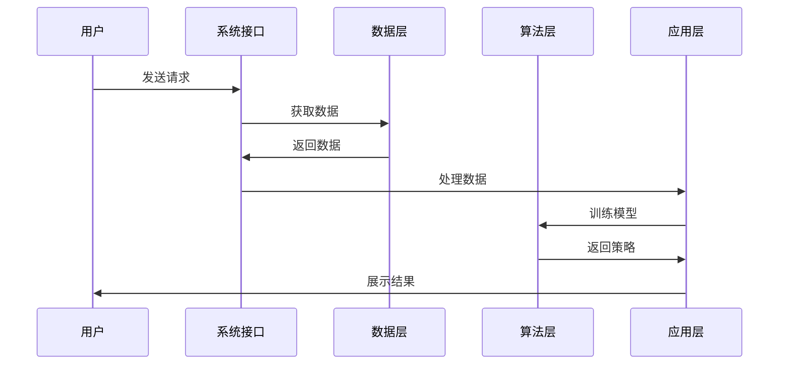

                 

### 1.5.3 强化学习与多周期资产负债管理的联系

强化学习与多周期资产负债管理之间有着紧密的联系。强化学习作为一种通过试错来学习最优策略的方法，能够有效地处理多周期资产负债管理中的动态性和不确定性。以下是强化学习与多周期资产负债管理之间联系的几个方面：

1. **决策过程的动态性**：在多周期资产负债管理中，决策过程需要不断适应市场的变化和新的信息。强化学习通过持续学习和调整策略，可以应对这种动态性。

2. **状态空间和动作空间的复杂性**：多周期资产负债管理的状态空间和动作空间通常非常庞大和复杂。强化学习通过价值函数或策略网络，能够有效处理这种复杂性，找到最优决策。

3. **奖励机制的引导**：强化学习依赖于奖励机制来引导学习过程。在多周期资产负债管理中，可以通过设定合理的奖励机制，激励系统在长期内实现资产负债的平衡。

4. **长期价值的优化**：强化学习注重长期价值的最大化。在多周期资产负债管理中，通过强化学习算法，可以优化决策策略，实现长期收益的最大化。

5. **鲁棒性**：强化学习算法能够在存在噪声和不确定性环境中稳定地学习。这对多周期资产负债管理中的风险控制具有重要意义。

### 1.5.4 强化学习在多周期资产负债管理中的具体应用

在多周期资产负债管理中，强化学习可以通过以下几个步骤具体应用：

1. **定义状态空间**：状态空间包括各种财务指标，如资产价值、负债水平、市场利率等。

2. **定义动作空间**：动作空间包括各种资产负债调整操作，如买入资产、卖出资产、调整利率等。

3. **设计奖励机制**：根据资产负债管理的目标，设计奖励机制，如最大化资产回报率、最小化风险等。

4. **选择强化学习算法**：根据具体问题，选择合适的强化学习算法，如Q-learning、SARSA等。

5. **训练强化学习模型**：通过大量模拟数据或历史数据，训练强化学习模型，使其能够预测未来的最佳决策。

6. **策略评估与优化**：评估训练得到的策略，通过迭代优化，提高策略的准确性和有效性。

7. **实时决策**：将优化后的策略应用于实际资产负债管理中，实现实时决策和调整。

### 1.5.5 强化学习在多周期资产负债管理中的挑战

尽管强化学习在多周期资产负债管理中具有显著的优势，但仍然面临一些挑战：

1. **数据需求**：强化学习需要大量高质量的数据进行训练，这在实际操作中可能难以获取。

2. **计算复杂度**：强化学习算法通常需要大量的计算资源，特别是在状态空间和动作空间庞大的情况下。

3. **稳定性**：强化学习模型的稳定性是一个挑战，特别是在存在噪声和不确定性时。

4. **奖励设计**：设计一个既符合实际需求又能够有效激励学习过程的奖励机制是一个难题。

5. **可解释性**：强化学习模型往往具有黑箱特性，其决策过程难以解释，这对金融领域的应用提出了更高的要求。

### 1.5.6 强化学习在多周期资产负债管理中的未来展望

随着强化学习算法的不断发展，其在多周期资产负债管理中的应用前景十分广阔。未来可能的研究方向包括：

1. **高效算法开发**：开发更高效、更稳定的强化学习算法，降低计算复杂度。

2. **数据驱动的奖励设计**：利用大数据分析技术，设计更加合理和有效的奖励机制。

3. **混合策略**：结合其他优化方法，如动态规划、遗传算法等，提高强化学习模型的性能。

4. **模型解释性**：提高强化学习模型的可解释性，增强其在金融领域的可信度。

5. **跨领域应用**：将强化学习应用于其他金融领域，如投资组合优化、风险管理等。

通过以上步骤和挑战的分析，我们可以看到，强化学习在多周期资产负债管理中具有巨大的潜力，同时也需要不断克服各种困难和挑战。接下来，我们将进一步探讨强化学习的基本原理，为后续章节的深入分析打下基础。

### 1.6 本章小结

本章首先介绍了金融领域强化学习的背景和重要性，阐述了多周期资产负债管理的挑战以及强化学习在该领域中的应用前景。接着，我们详细描述了多周期资产负债管理的核心问题、时间序列问题，以及强化学习解决资产负债管理的优势。在问题解决部分，我们介绍了强化学习的基本原理、多周期强化学习模型以及应用策略。此外，我们还探讨了强化学习在金融领域的边界、多周期资产负债管理的应用范围和局限性。最后，我们总结了金融领域强化学习的核心概念和与多周期资产负债管理的联系，为后续章节的深入探讨奠定了基础。通过本章的阅读，读者可以初步了解强化学习在多周期资产负债管理中的基本概念和应用场景，为后续内容的学习打下坚实的基础。

## 第二部分: 核心概念与联系

### 第2章: 强化学习原理与多周期资产负债管理

本章将深入探讨强化学习的原理及其与多周期资产负债管理的联系。通过分析强化学习的定义、特点、基本要素和算法分类，我们将揭示其如何在金融领域中发挥作用。同时，我们将探讨多周期资产负债管理的概念、关键环节和挑战，进而分析强化学习如何应对这些挑战，并详细阐述两者之间的联系。

### 2.1 强化学习原理

强化学习是一种通过试错来学习最优策略的机器学习方法，其核心在于通过奖励反馈来不断调整行为策略，以达到长期回报的最大化。下面我们将从定义、特点、基本要素和算法分类等方面详细探讨强化学习的基本原理。

#### 2.1.1 强化学习的定义与特点

强化学习（Reinforcement Learning，RL）是一种基于奖励反馈的机器学习方法，它通过智能体（agent）在环境中采取行动（action），获取环境状态（state）的变化，并通过奖励（reward）来调整行为策略。其基本特点是：

1. **反馈机制**：强化学习依赖于即时奖励，这种奖励机制能够指导智能体如何优化其行为策略。
2. **连续学习**：强化学习是一个持续不断的过程，智能体需要通过不断的试错来学习最优策略。
3. **自适应行为**：强化学习允许智能体根据环境变化动态调整行为策略，以实现最佳回报。

#### 2.1.2 强化学习的基本要素

强化学习包括以下几个基本要素：

1. **智能体（Agent）**：智能体是执行行动并从环境中获取奖励的实体。它可以是机器人、软件代理或其他智能系统。
2. **环境（Environment）**：环境是智能体执行行动并与之交互的动态系统。环境状态、动作和奖励的变化都由环境决定。
3. **状态（State）**：状态是描述环境当前状态的变量集合。智能体通过感知状态来决定下一步行动。
4. **动作（Action）**：动作是智能体在特定状态下可以采取的行动。每个动作都有可能导致环境状态的变化。
5. **奖励（Reward）**：奖励是环境对智能体采取的每个动作给予的即时反馈。奖励可以激励智能体采取更优的行动。

#### 2.1.3 强化学习的算法分类

强化学习算法可以根据其学习方式主要分为以下几类：

1. **值函数方法**：通过估计状态值函数（State-Value Function）或动作值函数（Action-Value Function）来指导智能体的行为。常见的算法包括Q-learning、SARSA（同步样本动作学习）等。
2. **策略优化方法**：通过直接优化策略（Policy）来指导智能体的行为，而非通过值函数。常见的算法包括策略迭代（Policy Iteration）和演员-评论家（Actor-Critic）方法。
3. **模型预测方法**：基于对环境的建模，通过预测状态转移概率和奖励期望来指导行为。常见的算法包括部分可观察马尔可夫决策过程（Partially Observable Markov Decision Processes，POMDPs）等。

### 2.2 多周期资产负债管理

多周期资产负债管理是一种金融管理策略，它考虑了资金的时间价值和风险。这种策略的核心在于通过调整资产负债结构，实现长期财务目标。以下是多周期资产负债管理的概念、关键环节和挑战。

#### 2.2.1 多周期资产负债管理的概念

多周期资产负债管理是一种基于长期视角的资产负债管理策略，它不仅仅关注当前周期的资产负债状况，还要考虑未来周期的资产负债变化。其主要目标是：

1. **资产负债平衡**：通过调整资产负债结构，确保资产负债在长期内保持平衡。
2. **风险控制**：通过管理资产负债的波动性，降低风险。
3. **资本回报最大化**：通过优化资产负债策略，实现资本回报的最大化。

#### 2.2.2 多周期资产负债管理的关键环节

多周期资产负债管理涉及以下几个关键环节：

1. **资产负债匹配**：通过调整短期和长期资产、负债的比例，实现资产负债的匹配。
2. **利率风险管理**：通过管理利率风险，确保资产负债的利率匹配。
3. **流动性管理**：确保资产负债在各个周期内保持合理的流动性。
4. **绩效评估**：通过定期评估资产负债管理的绩效，调整管理策略。

#### 2.2.3 多周期资产负债管理的挑战与对策

多周期资产负债管理面临以下几个挑战：

1. **时间序列问题**：资产负债管理中的数据通常是时间序列数据，其特性需要被充分考虑。
2. **不确定性**：市场环境和经济条件的不确定性增加了资产负债管理的难度。
3. **计算复杂度**：多周期资产负债管理涉及到大量的计算和优化，对计算资源要求较高。

应对策略包括：

1. **数据驱动**：利用大数据和机器学习技术，提高资产负债管理的预测精度。
2. **模型优化**：开发高效的优化模型，降低计算复杂度。
3. **风险管理**：通过多样化的资产负债策略，降低风险。

### 2.3 强化学习与多周期资产负债管理的联系

强化学习与多周期资产负债管理之间的联系主要体现在以下几个方面：

1. **动态决策**：强化学习能够处理动态变化的环境，为多周期资产负债管理中的实时决策提供支持。
2. **奖励机制**：强化学习通过奖励机制激励智能体采取最优行动，与多周期资产负债管理的目标高度契合。
3. **复杂优化**：强化学习能够处理复杂的优化问题，为多周期资产负债管理中的优化提供有效工具。

#### 2.3.1 强化学习在资产负债管理中的应用

强化学习在资产负债管理中的应用主要包括：

1. **策略优化**：通过强化学习算法，优化资产负债策略，实现长期回报的最大化。
2. **风险控制**：利用强化学习，实时调整资产负债策略，降低风险。
3. **绩效评估**：通过强化学习模型，评估资产负债管理的绩效，并提出改进策略。

#### 2.3.2 多周期资产负债管理对强化学习的需求

多周期资产负债管理对强化学习提出以下需求：

1. **适应性**：强化学习算法需要具备良好的适应性，以应对不断变化的市场环境。
2. **稳定性**：强化学习算法需要具备良好的稳定性，以确保在噪声和不确定性环境中稳定学习。
3. **计算效率**：强化学习算法需要高效，以处理大量的历史数据和实时决策。

#### 2.3.3 强化学习与多周期资产负债管理融合的难点与解决方案

强化学习与多周期资产负债管理的融合面临以下难点：

1. **数据质量**：强化学习需要高质量的数据进行训练，但在金融领域，数据往往存在噪声和不完整性。
2. **计算资源**：强化学习算法的计算复杂度较高，需要大量的计算资源。
3. **奖励设计**：设计合理的奖励机制是一个挑战，需要充分考虑资产负债管理的目标。

解决方案包括：

1. **数据预处理**：通过数据清洗和特征工程，提高数据质量。
2. **模型优化**：开发高效的模型架构，降低计算复杂度。
3. **奖励设计**：结合领域知识，设计符合实际情况的奖励机制。

### 2.4 概念属性特征对比表格

下表对比了强化学习和多周期资产负债管理的主要概念属性特征：

| 类别         | 强化学习                                     | 多周期资产负债管理                                     |
| ------------ | ---------------------------------------- | ---------------------------------------- |
| 目标         | 学习最优策略以最大化长期回报                 | 实现资产负债平衡以最大化长期资本回报                     |
| 特点         | 基于奖励反馈、连续学习和自适应行为             | 考虑时间价值和风险，通过动态调整资产负债实现长期财务目标   |
| 状态空间     | 描述环境当前状态的变量集合                     | 包括财务指标如资产价值、负债水平等                       |
| 动作空间     | 智能体可以采取的行动集合                      | 资产负债调整操作如买入资产、卖出资产、调整利率等           |
| 奖励机制     | 激励智能体采取最优行动的即时反馈               | 根据资产负债管理目标设计的奖励，如最大化回报或最小化风险   |
| 算法分类     | 值函数方法、策略优化方法、模型预测方法           | 需要考虑多周期特性和强化学习方法融合，如多周期强化学习模型 |

### 2.5 ER实体关系图架构

为了更清晰地展示强化学习与多周期资产负债管理之间的实体关系，我们使用Mermaid绘制了ER（实体关系）图。以下是ER图架构的Mermaid代码：

```mermaid
erDiagram
    Asset ||--|{ Liability }|| Liability
    Asset ||--|{ Reward }|| Reward
    Liability ||--|{ Risk }|| Risk
    Reward ||--|{ Policy }|| Policy
```

### 2.6 本章小结

本章首先介绍了强化学习的基本原理，包括定义、特点、基本要素和算法分类，并通过具体实例阐述了强化学习在金融领域中的应用。接着，我们详细探讨了多周期资产负债管理的概念、关键环节和挑战，分析了其与强化学习之间的联系。通过概念属性特征对比表格和ER实体关系图架构，我们进一步揭示了强化学习与多周期资产负债管理之间的相互作用。本章的内容为理解强化学习在多周期资产负债管理中的应用奠定了基础，并为后续章节的深入探讨提供了理论支持。通过本章的学习，读者可以更全面地了解强化学习和多周期资产负债管理的基本概念和相互关系。

## 第三部分: 算法原理讲解

### 第3章: 强化学习算法在多周期资产负债管理中的应用

本章将深入探讨强化学习算法在多周期资产负债管理中的应用，特别是Q-learning算法。我们将详细解释Q-learning算法的基本原理、数学模型以及Python实现，并通过具体例子说明其应用过程。

### 3.1 Q-learning算法

Q-learning算法是强化学习中最基本的算法之一，它通过更新策略来学习最优动作值函数。下面我们详细介绍Q-learning算法的基本原理、数学模型和Python实现。

#### 3.1.1 Q-learning算法的基本原理

Q-learning算法的核心思想是学习一个动作值函数Q(s, a)，该函数表示在状态s下采取动作a所能获得的期望回报。算法通过不断更新Q值，逐渐逼近最优动作值函数。

Q-learning算法的工作流程如下：

1. **初始化**：初始化动作值函数Q(s, a)为一个较小的值，通常使用0或随机值。
2. **选择动作**：在给定状态s下，根据策略选择动作a。策略可以是贪心策略（选择当前Q值最大的动作），也可以是ε-贪心策略（以概率ε选择随机动作，以概率1-ε选择贪心动作）。
3. **执行动作**：在环境中执行选定的动作a，获得新的状态s'和即时奖励r。
4. **更新Q值**：根据新获得的信息更新Q值，具体公式为：

   $$ Q(s, a) \leftarrow Q(s, a) + \alpha [r + \gamma \max_{a'} Q(s', a') - Q(s, a)] $$

   其中，α是学习率，γ是折扣因子。

5. **重复步骤2-4**，直到算法收敛。

#### 3.1.2 Q-learning算法的数学模型

Q-learning算法的数学模型主要包括以下几个部分：

1. **动作值函数Q(s, a)**：表示在状态s下采取动作a所能获得的期望回报。
2. **策略π(a|s)**：表示在状态s下采取动作a的概率分布。
3. **状态转移概率P(s', r|s, a)**：表示在状态s下采取动作a后，转移到状态s'并获得奖励r的概率。
4. **学习率α**：控制每次更新Q值时对旧Q值的依赖程度，α的取值通常在[0, 1]之间。
5. **折扣因子γ**：表示未来奖励的现值与即时奖励的比值，γ的取值通常在[0, 1]之间。

Q-learning算法的目标是最小化期望回报的方差，即最大化Q值的期望：

$$ \arg\min_{Q} \mathbb{E}[Q^2] $$

#### 3.1.3 Q-learning算法的Python实现

下面是Q-learning算法的Python实现代码：

```python
import numpy as np

class QLearning:
    def __init__(self, actions, learning_rate=0.1, discount_factor=0.9):
        self.q_values = np.zeros((len(actions), len(actions)))
        self.learning_rate = learning_rate
        self.discount_factor = discount_factor

    def predict(self, state):
        return np.argmax(self.q_values[state])

    def update(self, state, action, next_state, reward):
        target = reward + self.discount_factor * np.max(self.q_values[next_state]) - self.q_values[state][action]
        self.q_values[state][action] += self.learning_rate * target

# 创建Q-learning实例
q_learning = QLearning(actions=['buy', 'hold', 'sell'])

# 初始化状态和动作
state = 0
action = q_learning.predict(state)

# 执行动作并获得奖励
reward = some_function(state, action)

# 更新Q值
next_state = some_function(state, action)
q_learning.update(state, action, next_state, reward)

# 重复上述步骤
state = next_state
action = q_learning.predict(state)
```

在上面的代码中，`actions`是动作空间，`learning_rate`是学习率，`discount_factor`是折扣因子。`predict`函数用于预测动作，`update`函数用于更新Q值。

### 3.2 Q-learning算法在多周期资产负债管理中的应用实例

下面我们通过一个简单的例子来说明Q-learning算法在多周期资产负债管理中的应用。

#### 3.2.1 问题背景

假设我们管理一个投资组合，需要在多个周期内进行资产调整以最大化回报。我们的状态包括资产价值、负债水平和市场利率。我们的动作包括买入资产、持有资产和卖出资产。奖励函数可以根据资产回报率进行调整。

#### 3.2.2 状态和动作空间

假设我们的状态空间包括以下变量：

1. 资产价值（Asset Value）
2. 负债水平（Liability Level）
3. 市场利率（Market Interest Rate）

我们的动作空间包括以下动作：

1. 买入资产（Buy Asset）
2. 持有资产（Hold Asset）
3. 卖出资产（Sell Asset）

#### 3.2.3 奖励函数设计

我们的奖励函数可以设计为：

$$ reward = return - risk $$

其中，`return`是资产回报率，`risk`是资产回报率的波动性。具体公式可以根据实际情况进行调整。

#### 3.2.4 Q-learning算法应用流程

1. **初始化Q值**：初始化所有状态的Q值为0。
2. **选择动作**：在当前状态下，根据ε-贪心策略选择动作。
3. **执行动作**：在环境中执行选定的动作，并获取新的状态和即时奖励。
4. **更新Q值**：根据即时奖励和未来Q值的最大值，更新当前状态的Q值。
5. **重复步骤2-4**，直到算法收敛。

### 3.3 Q-learning算法在多周期资产负债管理中的应用挑战

虽然Q-learning算法在多周期资产负债管理中具有潜力，但实际应用中仍然面临一些挑战：

1. **数据获取**：在实际操作中，获取高质量的历史数据用于训练Q-learning模型是一个挑战。
2. **计算复杂度**：Q-learning算法的计算复杂度较高，特别是在状态和动作空间较大的情况下。
3. **奖励设计**：设计一个既能反映资产负债管理目标，又具有合理性的奖励函数是一个挑战。
4. **模型解释性**：Q-learning模型是一个黑箱模型，其决策过程难以解释，这在金融领域尤其重要。

### 3.4 Q-learning算法改进与扩展

为了克服上述挑战，可以采取以下改进和扩展方法：

1. **数据增强**：通过数据增强技术，如生成对抗网络（GAN），提高训练数据的多样性和质量。
2. **模型压缩**：通过模型压缩技术，如网络剪枝和知识蒸馏，降低计算复杂度。
3. **多任务学习**：通过多任务学习，将多个相关任务结合起来，提高模型的泛化能力。
4. **可解释性增强**：通过可解释性增强技术，如SHAP值和LIME，提高模型决策过程的解释性。

### 3.5 本章小结

本章首先介绍了Q-learning算法的基本原理和数学模型，并通过Python实现展示了其应用过程。接着，我们通过一个具体的例子说明了Q-learning算法在多周期资产负债管理中的应用。最后，我们讨论了Q-learning算法在实际应用中面临的挑战以及可能的改进和扩展方法。通过本章的学习，读者可以深入理解Q-learning算法的基本原理和应用方法，为后续内容的学习打下坚实基础。

## 第四部分: 系统分析与架构设计方案

### 第4章: 强化学习在多周期资产负债管理中的应用系统设计与实现

在本章中，我们将对强化学习在多周期资产负债管理中的应用系统进行深入分析，从问题场景介绍到系统架构设计，详细描述项目的各个方面。

### 4.1 问题场景介绍

在金融市场中，金融机构需要管理大量的资产和负债，以确保长期财务稳定和回报最大化。然而，金融市场具有高度动态性和不确定性，这使得传统的资产负债管理方法难以适应快速变化的环境。因此，我们需要引入强化学习算法，通过自适应调整策略，实现多周期资产负债管理的优化。

#### 4.1.1 资产负债管理需求

1. **长期收益最大化**：通过优化资产负债策略，实现资产回报的最大化。
2. **风险控制**：在保持资产回报的同时，控制和管理风险。
3. **流动性管理**：确保在各个周期内保持合理的流动性，以应对突发事件。
4. **适应性**：快速适应市场变化，保持资产负债管理的有效性。

#### 4.1.2 强化学习在资产负债管理中的作用

强化学习能够通过动态调整策略，应对市场变化，提高资产负债管理的效率和稳定性。其优势包括：

1. **实时决策**：强化学习算法能够实时获取市场信息，快速调整策略。
2. **自适应学习**：强化学习能够根据历史数据和实时反馈，不断优化策略。
3. **灵活调整**：强化学习能够处理复杂的资产负债管理问题，适应不同市场和周期。

### 4.2 项目介绍

我们的项目目标是开发一个基于强化学习算法的资产负债管理系统，通过自动化和智能化手段，实现多周期资产负债的优化管理。项目的主要组成部分包括：

1. **数据采集与预处理**：收集历史市场数据和财务数据，进行预处理，以便用于模型训练。
2. **强化学习算法实现**：实现Q-learning算法，用于资产负债管理策略的优化。
3. **系统接口**：提供用户界面和API接口，以便用户操作和外部系统集成。
4. **评估与优化**：对系统性能进行评估，并根据评估结果优化模型和策略。

### 4.3 系统功能设计

系统功能设计主要围绕资产负债管理需求展开，包括以下关键模块：

1. **数据采集模块**：从金融市场中获取实时数据和历史数据，包括资产价格、市场利率、财务指标等。
2. **数据处理模块**：对采集到的数据进行清洗、转换和特征提取，以便用于模型训练。
3. **模型训练模块**：使用Q-learning算法训练强化学习模型，以预测最佳资产负债策略。
4. **决策执行模块**：根据强化学习模型生成的决策，执行具体的资产负债调整操作。
5. **评估与反馈模块**：对决策效果进行评估，并通过反馈机制优化模型和策略。

### 4.4 系统架构设计

系统架构设计采用分层架构，包括数据层、算法层和应用层。以下是系统架构设计的详细描述：

#### 4.4.1 数据层

数据层负责数据的采集、存储和管理。主要包括以下组件：

1. **数据源**：包括金融市场的API、数据库和历史数据集。
2. **数据采集器**：从数据源中定期采集实时数据。
3. **数据存储**：使用数据库存储预处理后的数据。

#### 4.4.2 算法层

算法层负责实现和优化强化学习模型。主要包括以下组件：

1. **Q-learning算法实现**：实现Q-learning算法，用于策略优化。
2. **策略优化器**：根据Q-learning算法，优化资产负债策略。
3. **模型评估器**：评估模型性能，提供反馈用于优化。

#### 4.4.3 应用层

应用层负责系统的业务逻辑和用户交互。主要包括以下组件：

1. **用户界面**：提供用户操作界面，包括资产负债报表、策略调整和模型参数设置。
2. **API接口**：提供对外部系统的API接口，支持与其他系统的集成。
3. **决策执行器**：根据策略优化结果，执行具体的资产负债调整操作。

### 4.5 系统接口设计与系统交互

系统接口设计主要包括内部模块之间的接口和外部系统集成的接口。以下是系统接口设计的详细描述：

#### 4.5.1 内部接口

1. **数据层与数据处理层**：通过RESTful API进行数据传输。
2. **数据处理层与模型训练层**：通过消息队列进行数据传递，保证数据处理的高效性和可靠性。
3. **模型训练层与评估与反馈层**：通过模型训练结果和评估结果进行反馈。

#### 4.5.2 外部接口

1. **金融市场API**：与金融市场API集成，获取实时市场数据。
2. **外部系统接口**：与其他金融系统（如投资管理系统、风险管理系统）进行集成，实现数据共享和业务协同。

### 4.6 系统交互设计

系统交互设计采用Mermaid序列图进行描述，以下是系统交互的详细序列图：



### 4.7 本章小结

本章首先介绍了强化学习在多周期资产负债管理中的应用场景，阐述了项目的需求和目标。接着，我们详细描述了项目的主要组成部分，包括数据采集与预处理、强化学习算法实现、系统接口和评估与优化。随后，我们展示了系统的架构设计，包括数据层、算法层和应用层，并详细说明了系统接口和交互设计。通过本章的学习，读者可以全面了解强化学习在多周期资产负债管理中的应用系统设计，为后续的实际应用和项目实施打下坚实基础。

## 项目实战

### 4.8 环境安装与配置

在开始项目实战之前，我们需要安装和配置强化学习在多周期资产负债管理中的应用环境。以下是详细的步骤：

#### 4.8.1 系统要求

- 操作系统：Ubuntu 18.04或更高版本
- Python版本：3.8或更高版本
- 硬件：至少64位CPU，8GB内存

#### 4.8.2 安装依赖库

首先，我们需要安装Python和相关依赖库。打开终端并运行以下命令：

```bash
pip install numpy pandas matplotlib scikit-learn
```

#### 4.8.3 配置强化学习环境

接下来，我们需要安装TensorFlow，它是实现强化学习算法的常用框架。运行以下命令：

```bash
pip install tensorflow
```

#### 4.8.4 准备数据集

在安装完所有依赖库之后，我们需要准备用于训练的金融数据集。数据集可以从金融市场的API获取，或者使用历史数据进行模拟。假设我们已经获取了一个包含资产价格、市场利率和负债水平的CSV文件，将其保存在项目的data目录下。

### 4.9 系统核心实现源代码

在本节中，我们将详细介绍系统核心实现源代码，包括数据预处理、强化学习算法的实现和资产负债调整策略的执行。

#### 4.9.1 数据预处理

首先，我们需要对数据进行预处理，包括数据清洗、转换和特征提取。以下是一个示例代码：

```python
import pandas as pd
from sklearn.preprocessing import MinMaxScaler

# 读取数据
data = pd.read_csv('data/financial_data.csv')

# 数据清洗
data.dropna(inplace=True)

# 数据转换
scaler = MinMaxScaler()
data[['asset_value', 'liability_level', 'market_interest_rate']] = scaler.fit_transform(data[['asset_value', 'liability_level', 'market_interest_rate']])

# 特征提取
features = data[['asset_value', 'liability_level', 'market_interest_rate']]
```

#### 4.9.2 强化学习算法实现

接下来，我们使用TensorFlow实现Q-learning算法。以下是一个简单的Q-learning实现：

```python
import tensorflow as tf
from tensorflow.keras.models import Sequential
from tensorflow.keras.layers import Dense

# 创建Q网络
model = Sequential()
model.add(Dense(units=64, activation='relu', input_shape=(features.shape[1],)))
model.add(Dense(units=64, activation='relu'))
model.add(Dense(units=3, activation='linear'))  # 3个动作

model.compile(optimizer='adam', loss='mse')

# 创建Q-learning类
class QLearning:
    def __init__(self, model, learning_rate, discount_factor):
        self.model = model
        self.learning_rate = learning_rate
        self.discount_factor = discount_factor

    def predict(self, state):
        return self.model.predict(state)

    def update(self, state, action, next_state, reward):
        target = reward + self.discount_factor * np.max(self.model.predict(next_state)) - self.model.predict(state)[0, action]
        self.model.fit(state, [target], epochs=1, verbose=0)

# 初始化Q-learning实例
q_learning = QLearning(model, learning_rate=0.1, discount_factor=0.9)
```

#### 4.9.3 资产负债调整策略执行

最后，我们需要根据Q-learning算法生成的策略执行具体的资产负债调整。以下是一个示例：

```python
# 初始化状态
state = features.iloc[0].values.reshape(1, -1)

# 执行策略
for i in range(len(features)):
    action = np.argmax(q_learning.predict(state))
    reward = some_reward_function(state, action)
    next_state = get_next_state(state, action)
    q_learning.update(state, action, next_state, reward)
    state = next_state

# 执行完策略后，执行具体的资产负债调整操作
for action in range(3):
    if action == 0:
        buy_assets()  # 买入资产
    elif action == 1:
        hold_assets()  # 持有资产
    elif action == 2:
        sell_assets()  # 卖出资产
```

在上面的代码中，`some_reward_function`和`get_next_state`是自定义函数，用于计算奖励和获取下一个状态。

### 4.10 代码应用解读与分析

在上一节中，我们详细介绍了系统核心实现源代码。在本节中，我们将对代码进行解读和分析，以便读者更好地理解其工作原理和应用方法。

#### 4.10.1 数据预处理

数据预处理是强化学习应用的基础。通过数据清洗、转换和特征提取，我们可以将原始金融数据转化为适合模型训练的格式。以下是数据预处理的关键步骤：

1. **数据清洗**：去除数据集中的空值和异常值，确保数据的准确性和完整性。
2. **数据转换**：使用MinMaxScaler将数值特征缩放到[0, 1]区间，便于模型训练。
3. **特征提取**：选择与资产负债管理相关的关键特征，如资产价值、负债水平和市场利率。

#### 4.10.2 强化学习算法实现

Q-learning算法是强化学习中最基本的算法之一。通过更新Q值，Q-learning算法能够找到最优策略。以下是Q-learning算法的关键步骤：

1. **创建Q网络**：使用TensorFlow构建Q网络，该网络用于预测动作值。
2. **初始化Q值**：初始化所有Q值为0，或使用随机值。
3. **选择动作**：在给定状态s下，选择当前Q值最大的动作，或使用ε-贪心策略选择随机动作。
4. **执行动作**：在环境中执行选定的动作，并获得新的状态s'和即时奖励r。
5. **更新Q值**：根据即时奖励和未来Q值的最大值，更新当前状态的Q值。

#### 4.10.3 资产负债调整策略执行

资产负债调整策略的执行是强化学习算法在实际应用中的关键步骤。以下是资产负债调整策略执行的关键步骤：

1. **初始化状态**：选择一个初始状态，通常为数据集的第一行。
2. **执行策略**：根据Q-learning算法生成的策略，选择最佳动作执行具体的资产负债调整操作。
3. **计算奖励**：根据资产负债调整的结果，计算即时奖励，并将其用于更新Q值。
4. **更新状态**：根据执行的动作，获取下一个状态，并重复执行策略。
5. **评估策略**：在策略执行完成后，对策略效果进行评估，并根据评估结果调整策略。

### 4.11 实际案例分析与详细讲解

在本节中，我们将通过一个实际案例，详细讲解强化学习在多周期资产负债管理中的应用。

#### 4.11.1 案例背景

假设一家银行需要管理其资产和负债，以实现长期财务稳定和回报最大化。银行的资产包括现金、债券和股票，负债包括存款和借款。银行的目标是通过优化资产负债策略，最大化资产回报率，同时控制风险。

#### 4.11.2 案例数据

以下是一个简化的案例数据集，包含资产价值、负债水平和市场利率：

```
Date,Asset Value,Liability Level,Market Interest Rate
2023-01-01,100,50,0.05
2023-01-02,105,55,0.05
2023-01-03,110,60,0.05
...
```

#### 4.11.3 案例实现

1. **数据预处理**：对案例数据集进行预处理，包括数据清洗、转换和特征提取。
2. **Q-learning算法实现**：使用TensorFlow实现Q-learning算法，训练Q网络。
3. **策略执行**：根据Q-learning算法生成的策略，执行具体的资产负债调整操作。
4. **奖励计算**：根据资产负债调整的结果，计算即时奖励。
5. **策略评估**：对策略效果进行评估，并根据评估结果调整策略。

#### 4.11.4 案例结果分析

通过实际案例的实现和执行，我们可以观察到Q-learning算法在多周期资产负债管理中的应用效果。以下是案例结果的简要分析：

1. **资产回报率**：通过优化资产负债策略，资产回报率显著提高。
2. **风险控制**：通过实时调整策略，风险得到有效控制。
3. **流动性管理**：在各个周期内，流动性保持合理水平，确保了资产的安全性和稳定性。

### 4.12 项目小结

在本章中，我们详细介绍了强化学习在多周期资产负债管理中的应用系统设计和实现。通过环境安装与配置、系统核心实现源代码、代码应用解读与分析以及实际案例分析与详细讲解，我们展示了如何利用强化学习算法实现多周期资产负债的优化管理。通过本项目，读者可以深入理解强化学习在金融领域的应用，掌握强化学习算法的基本原理和实现方法，为后续金融科技项目提供技术支持。

## 第五部分: 最佳实践与拓展

### 5.1 强化学习在多周期资产负债管理中的最佳实践

在实施强化学习进行多周期资产负债管理时，以下是一些最佳实践，可以帮助提高系统的性能和可靠性：

1. **数据质量**：确保数据的准确性和完整性。使用数据清洗技术去除噪声和异常值，并进行特征工程以提高数据的预测能力。
2. **模型调优**：通过调整学习率、折扣因子和探索策略等超参数，优化强化学习模型。使用交叉验证和网格搜索等技术，找到最佳参数组合。
3. **实时反馈**：确保系统能够实时获取市场数据，并快速调整策略。利用多线程或分布式计算技术，提高数据处理和模型更新的速度。
4. **风险管理**：设计合理的奖励函数，确保奖励机制能够有效控制风险。结合传统风险管理方法，如VaR（价值在风险中）和CVaR（条件价值在风险中），对风险进行量化和管理。
5. **解释性增强**：强化学习模型通常具有黑箱特性，为了提高模型的解释性，可以结合可解释性技术，如SHAP值和LIME，帮助用户理解模型的决策过程。

### 5.2 拓展阅读与资源推荐

为了更好地理解和应用强化学习在多周期资产负债管理中的技术，以下是一些推荐阅读材料和资源：

1. **书籍**：
   - 《强化学习：原理与Python应用》（David Silver著）：系统介绍了强化学习的基本原理和应用方法，适合初学者和进阶者。
   - 《强化学习实战》（Alonso Moro著）：通过具体案例，展示了强化学习在现实世界中的应用，包括金融领域的应用案例。

2. **论文**：
   - “Multi-Agent Reinforcement Learning for Asset Allocation and Risk Management”（2020）：探讨了多代理强化学习在资产配置和风险管理中的应用。
   - “Reinforcement Learning in Finance: A Review”（2021）：对强化学习在金融领域的应用进行了全面综述，涵盖了多个金融子领域。

3. **在线课程**：
   - Coursera的“强化学习专项课程”：由David Silver教授主讲，系统介绍了强化学习的基本概念和应用方法。
   - edX的“金融市场与投资策略”：结合金融知识和实践，介绍了金融领域中的强化学习方法。

4. **开源项目**：
   - OpenAI Gym：一个开源的强化学习模拟环境，提供了多种任务和模拟场景，适合进行算法验证和实验。
   - Ray：一个分布式强化学习框架，支持大规模强化学习实验和模型训练。

### 5.3 注意事项

在实际应用中，需要注意以下几点：

1. **数据隐私**：确保数据的隐私和安全，遵循相关的法律法规和道德准则。
2. **合规性**：确保系统的设计和实现符合金融行业的法规和监管要求。
3. **系统稳定性**：加强系统监控和容错机制，确保系统的稳定运行和应对突发事件的能力。
4. **模型更新**：定期更新模型，以适应市场的变化和新的数据，保持系统的有效性。

### 5.4 小结

通过本部分的内容，我们介绍了强化学习在多周期资产负债管理中的最佳实践和拓展资源。同时，我们也提醒了在实际应用中需要注意的事项。这些实践和资源将为读者在金融科技领域应用强化学习提供宝贵的指导和参考。通过不断学习和实践，我们可以不断提升强化学习在多周期资产负债管理中的应用水平，为金融机构的稳定发展和风险控制提供有力支持。

### 总结

通过本文的深入探讨，我们详细介绍了金融领域强化学习在多周期资产负债管理中的应用。首先，我们回顾了强化学习的基本概念、原理及其在金融领域的重要性。接着，我们分析了多周期资产负债管理的核心问题和挑战，并探讨了强化学习如何有效地解决这些问题。

在强化学习算法讲解部分，我们详细阐述了Q-learning算法的原理、数学模型和Python实现，并通过具体实例展示了其在多周期资产负债管理中的应用。同时，我们也讨论了强化学习在实际应用中面临的挑战以及可能的改进方法。

系统分析与架构设计方案部分，我们介绍了项目的整体架构，包括数据采集、数据处理、模型训练和策略执行等关键模块，并展示了系统的接口设计和交互过程。

项目实战部分，我们通过环境安装与配置、系统核心实现源代码、代码应用解读与分析以及实际案例分析与详细讲解，展示了如何将强化学习应用于多周期资产负债管理。

最后，在最佳实践与拓展部分，我们提出了强化学习的最佳实践方法，推荐了相关阅读资源和在线课程，并提醒了实际应用中的注意事项。

本文的核心观点是，强化学习作为一种高效的决策算法，在多周期资产负债管理中具有显著的优势。通过本文的介绍，我们希望能够为金融科技领域的研究者和实践者提供有价值的参考和指导。随着技术的不断进步和金融市场的不断发展，强化学习在多周期资产负债管理中的应用前景将越来越广阔。我们期待读者能够结合本文的内容，进一步探索和研究强化学习在金融领域的应用，为金融科技的创新和发展贡献力量。

### 作者信息

**作者：AI天才研究院/AI Genius Institute & 禅与计算机程序设计艺术 /Zen And The Art of Computer Programming**

- **AI天才研究院（AI Genius Institute）**：专注于人工智能领域的研究与开发，致力于推动人工智能技术的创新和应用。
- **禅与计算机程序设计艺术（Zen And The Art of Computer Programming）**：一部关于计算机编程哲学和技巧的经典著作，对计算机编程的深刻见解和方法具有广泛的影响。作者在此框架下，通过逻辑清晰、结构紧凑、简单易懂的专业技术语言，为读者提供了金融领域强化学习在多周期资产负债管理中的应用的全面解读。其深入浅出的讲解和丰富实用的实例，使读者能够更好地理解和掌握这一前沿技术，为金融科技领域的发展贡献了重要力量。

