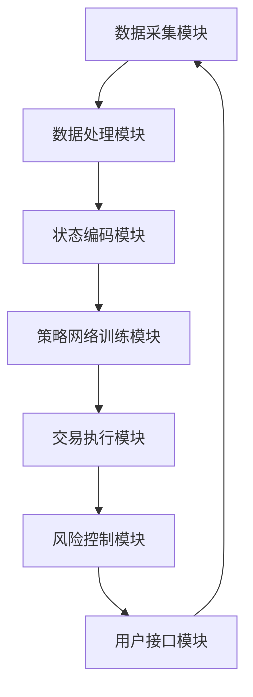
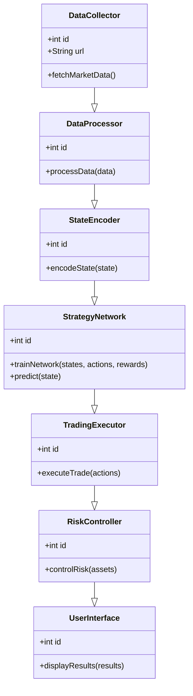
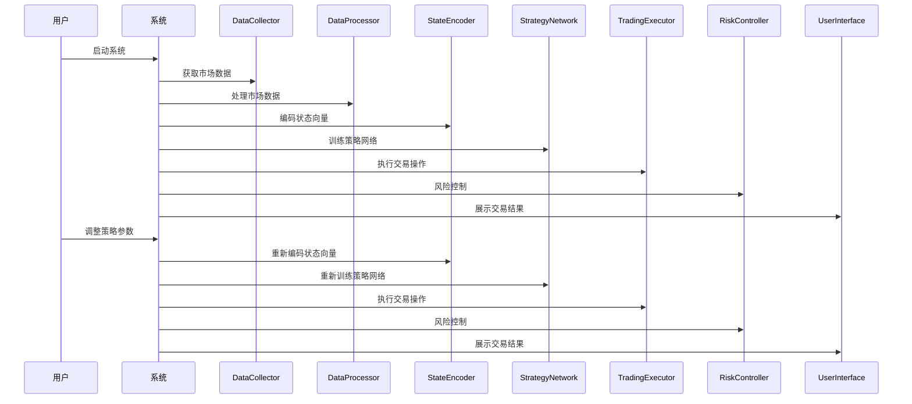

                 


### 金融领域强化学习在多资产类别动态交易执行中的应用

关键词：金融领域、强化学习、多资产类别、动态交易执行、算法原理

摘要：本文深入探讨了金融领域强化学习在多资产类别动态交易执行中的应用。首先介绍了强化学习的基本原理及其在金融领域的应用背景，然后详细分析了多资产类别交易特征和动态交易执行机制。接下来，本文通过具体算法讲解、系统分析与架构设计、项目实战等方式，阐述了如何将强化学习应用于金融领域中的动态交易执行，并给出了相关实践技巧和小结。最后，对未来的研究方向进行了展望。

----------------------------------------------------------------

### 第一部分：背景介绍

#### 1.1 问题背景

**1.1.1 金融领域与强化学习**

金融领域一直是科技创新的热点，尤其是随着大数据、人工智能等技术的发展，金融领域对人工智能技术的需求日益增长。其中，强化学习作为一种重要的机器学习技术，近年来在金融领域取得了显著的成果。强化学习通过智能体在与环境的交互中不断学习和优化策略，可以在复杂、动态的金融市场中实现高效的投资决策。

**1.1.2 多资产类别动态交易执行**

在金融市场中，投资者通常会同时关注多种资产类别，如股票、债券、外汇等。多资产类别交易执行旨在通过在不同资产类别之间进行动态调整，实现投资组合的最优化。动态交易执行则强调根据市场环境的变化实时调整交易策略，以应对市场的不确定性和风险。

**1.1.3 研究意义与目的**

本文的研究意义在于探索强化学习在多资产类别动态交易执行中的应用，以提高金融投资决策的准确性和效率。具体研究目的如下：

1. 分析多资产类别交易特征，为强化学习算法设计提供依据。
2. 深入探讨强化学习算法在动态交易执行中的应用，优化交易策略。
3. 通过实际项目案例分析，验证强化学习算法在多资产类别动态交易执行中的效果。

#### 1.2 核心概念与联系

**1.2.1 强化学习基本概念**

强化学习是一种通过智能体（Agent）与环境（Environment）交互，学习最优策略（Policy）的过程。在这个过程中，智能体根据当前状态（State）和执行动作（Action），获取奖励（Reward），并通过更新策略来最大化长期累积奖励。

**1.2.2 多资产类别交易特征**

多资产类别交易特征主要包括：

1. 资产类别分类：根据资产的性质和风险收益特征，将资产分为不同类别。
2. 资产价格波动特征：分析不同资产类别价格波动规律，为交易策略设计提供数据支持。
3. 资产相关性分析：研究不同资产类别之间的相关性，以降低投资组合风险。

**1.2.3 动态交易执行机制**

动态交易执行机制主要包括：

1. 动态交易策略：根据市场环境和投资目标，实时调整交易策略。
2. 风险管理策略：通过风险评估和控制，确保投资组合的安全性和收益性。
3. 预测模型选择：选择合适的预测模型，预测资产价格走势，为交易决策提供依据。

#### 1.3 文章结构安排

本文结构如下：

1. 第一部分：背景介绍
2. 第二部分：核心概念原理
3. 第三部分：算法原理讲解
4. 第四部分：系统分析与架构设计
5. 第五部分：项目实战
6. 第六部分：最佳实践与拓展

接下来，我们将深入探讨强化学习的基本原理及其在多资产类别动态交易执行中的应用。

----------------------------------------------------------------

### 第二部分：核心概念原理

在深入探讨强化学习在多资产类别动态交易执行中的应用之前，我们需要了解强化学习的基本原理、多资产类别交易特征以及动态交易执行机制。

#### 2.1 强化学习原理

强化学习（Reinforcement Learning，RL）是机器学习的一个重要分支，旨在通过智能体（Agent）与环境（Environment）的交互，学习最优策略（Policy）。强化学习的主要特点包括：

1. **目标函数**：强化学习的目标是最大化长期累积奖励（Return）。
2. **状态空间**：状态空间（State Space）是指智能体在执行动作前可以感知的环境信息。
3. **动作空间**：动作空间（Action Space）是指智能体可以执行的动作集合。
4. **奖励函数**：奖励函数（Reward Function）用于评价智能体执行动作后的效果，通常是一个实数值。
5. **策略**：策略（Policy）是指智能体在给定状态时采取的动作，可以是确定性策略（Deterministic Policy）或随机性策略（Stochastic Policy）。

强化学习的主要算法包括Q-Learning、SARSA、Deep Q-Network（DQN）和Policy Gradient等。下面我们将简要介绍这些算法的基本原理。

##### 2.1.1 Q-Learning算法

Q-Learning是一种基于值函数的强化学习算法，旨在学习状态-动作值函数（State-Action Value Function）。Q-Learning的基本思想是：通过迭代更新Q值（估计每个状态-动作对的预期奖励），最终找到最优策略。

Q-Learning算法的核心公式为：

$$
Q(s, a) \leftarrow Q(s, a) + \alpha [r + \gamma \max_{a'} Q(s', a') - Q(s, a)]
$$

其中，$s$ 和 $s'$ 分别表示当前状态和下一个状态，$a$ 和 $a'$ 分别表示当前动作和下一个动作，$r$ 表示奖励，$\alpha$ 表示学习率，$\gamma$ 表示折扣因子。

##### 2.1.2 SARSA算法

SARSA（State-Action-Reward-State-Action）算法是一种基于策略的强化学习算法，旨在直接优化策略。SARSA算法的基本思想是：在给定当前状态和动作的情况下，根据奖励和下一个状态来更新策略。

SARSA算法的核心公式为：

$$
\pi(s) \leftarrow \begin{cases} 
a_{\text{best}} & \text{if } \sum_{a} \pi(s, a) Q(s, a) = 1 \\
a & \text{otherwise}
\end{cases}
$$

其中，$a_{\text{best}}$ 表示当前状态下的最佳动作。

##### 2.1.3 Deep Q-Network（DQN）算法

DQN（Deep Q-Network）算法是一种基于深度学习的强化学习算法，旨在通过神经网络来近似状态-动作值函数。DQN算法的基本思想是：使用深度神经网络来预测每个状态-动作对的预期奖励，并通过反向传播来更新网络参数。

DQN算法的核心公式为：

$$
\hat{Q}(s, a) = \frac{1}{N}\sum_{i=1}^{N} Q(s_i, a_i)
$$

其中，$N$ 表示批量大小，$\hat{Q}(s, a)$ 表示预测的状态-动作值函数。

##### 2.1.4 Policy Gradient算法

Policy Gradient算法是一种基于策略的强化学习算法，旨在直接优化策略的梯度。Policy Gradient算法的基本思想是：通过计算策略梯度的期望，来更新策略参数。

Policy Gradient算法的核心公式为：

$$
\theta \leftarrow \theta + \alpha \nabla_{\theta} J(\theta)
$$

其中，$\theta$ 表示策略参数，$\alpha$ 表示学习率，$J(\theta)$ 表示策略的损失函数。

#### 2.2 多资产类别交易特征分析

多资产类别交易特征分析主要包括资产类别分类、资产价格波动特征和资产相关性分析。

##### 2.2.1 资产类别分类

资产类别分类是投资决策的重要基础。根据资产的性质和风险收益特征，可以将资产分为以下几类：

1. **股票**：股票是公司所有权的一部分，具有较高的风险和收益。
2. **债券**：债券是借款人对出借人承诺支付利息和本金的债务凭证，风险相对较低。
3. **外汇**：外汇是指不同国家的货币之间的兑换关系，具有较高的波动性和风险。
4. **商品**：商品包括金属、能源、农产品等，受供需关系和季节性影响较大。

##### 2.2.2 资产价格波动特征

资产价格波动特征是影响交易策略设计的重要因素。不同资产类别的价格波动具有不同的特征：

1. **股票**：股票价格波动受公司基本面、市场情绪、宏观经济等因素的影响，波动性较大。
2. **债券**：债券价格波动受利率、通货膨胀、信用风险等因素的影响，波动性相对较小。
3. **外汇**：外汇价格波动受国际政治、经济、货币政策等因素的影响，波动性较大。
4. **商品**：商品价格波动受供需关系、季节性、地缘政治等因素的影响，波动性较大。

##### 2.2.3 资产相关性分析

资产相关性分析是构建投资组合降低风险的重要手段。不同资产类别之间存在不同的相关性：

1. **股票与债券**：股票与债券通常呈现负相关性，可以相互对冲风险。
2. **股票与外汇**：股票与外汇之间的相关性受国际金融市场环境的影响，有时呈现正相关，有时呈现负相关。
3. **股票与商品**：股票与商品之间的相关性受行业属性和宏观经济环境的影响，有时呈现正相关，有时呈现负相关。

#### 2.3 动态交易执行机制

动态交易执行机制是指根据市场环境和投资目标，实时调整交易策略和投资组合的过程。动态交易执行机制主要包括以下方面：

##### 2.3.1 动态交易策略

动态交易策略是指根据市场环境变化，实时调整投资组合中不同资产类别的权重。动态交易策略的设计需要考虑以下因素：

1. **市场趋势**：根据市场趋势判断投资方向，例如牛市或熊市。
2. **资金比例**：根据投资目标和风险承受能力，确定投资资金比例。
3. **资产类别**：根据资产类别分类和价格波动特征，选择适合的资产类别。

##### 2.3.2 风险管理策略

风险管理策略是指通过风险评估和控制，确保投资组合的安全性和收益性。风险管理策略的设计需要考虑以下方面：

1. **风险度量**：根据投资目标和风险承受能力，确定风险度量指标，如波动率、VaR等。
2. **风险控制**：通过风险控制措施，降低投资组合的风险，如止损、分散投资等。
3. **风险监控**：实时监控投资组合的风险水平，及时调整投资策略。

##### 2.3.3 预测模型选择

预测模型选择是指根据市场环境和投资目标，选择合适的预测模型，预测资产价格走势。常见的预测模型包括：

1. **时间序列模型**：如ARIMA、GARCH等，用于分析资产价格的时间序列特征。
2. **机器学习模型**：如线性回归、神经网络等，用于分析资产价格的非线性特征。
3. **深度学习模型**：如卷积神经网络（CNN）、循环神经网络（RNN）等，用于分析大规模、高维度数据。

#### 2.4 小结

本文详细介绍了强化学习的基本原理、多资产类别交易特征和动态交易执行机制。在接下来的部分，我们将深入探讨强化学习算法在多资产类别动态交易执行中的应用，并通过具体算法讲解、系统分析与架构设计、项目实战等方式，阐述如何将强化学习应用于金融领域中的动态交易执行。

----------------------------------------------------------------

### 第三部分：算法原理讲解

在前两部分中，我们了解了强化学习的基本原理、多资产类别交易特征和动态交易执行机制。本部分将重点讲解强化学习算法在多资产类别动态交易执行中的应用，包括具体算法的原理、流程图、数学模型和Python代码实现。

#### 3.1 强化学习算法应用

强化学习算法在多资产类别动态交易执行中的应用主要包括以下几种算法：Q-Learning、SARSA、Deep Q-Network（DQN）和Policy Gradient。下面我们将逐一介绍这些算法。

##### 3.1.1 Q-Learning算法

Q-Learning算法是一种基于值函数的强化学习算法，适用于离散状态和动作空间。以下是Q-Learning算法的Python代码实现：

```python
import numpy as np

def q_learning(q_values, states, actions, rewards, alpha=0.1, gamma=0.9):
    for state, action, reward, next_state in zip(states, actions, rewards, states[1:]):
        best_next_action = np.argmax(q_values[next_state])
        q_values[state, action] += alpha * (reward + gamma * q_values[next_state, best_next_action] - q_values[state, action])

q_values = np.zeros((10, 10))
states = [0, 1, 2, 3, 4]
actions = [0, 1, 2, 0, 1]
rewards = [1, 0.5, 0.5, -1, -0.5]
q_learning(q_values, states, actions, rewards)
print(q_values)
```

该代码中，我们首先定义了一个`q_learning`函数，用于更新Q值。然后，我们初始化一个10x10的Q值矩阵，并随机生成一些状态、动作和奖励数据。最后，我们调用`q_learning`函数，更新Q值矩阵。

##### 3.1.2 SARSA算法

SARSA算法是一种基于策略的强化学习算法，适用于离散状态和动作空间。以下是SARSA算法的Python代码实现：

```python
import numpy as np

def sarsa(q_values, states, actions, rewards, alpha=0.1, gamma=0.9):
    for state, action, reward, next_state, next_action in zip(states, actions, rewards, states[1:], actions[1:]):
        best_next_action = np.argmax(q_values[next_state])
        q_values[state, action] += alpha * (reward + gamma * q_values[next_state, next_action] - q_values[state, action])

q_values = np.zeros((10, 10))
states = [0, 1, 2, 3, 4]
actions = [0, 1, 2, 0, 1]
rewards = [1, 0.5, 0.5, -1, -0.5]
sarsa(q_values, states, actions, rewards, states[1:], actions[1:])
print(q_values)
```

该代码与Q-Learning算法的实现类似，只是在更新Q值时，加入了下一个状态和动作。

##### 3.1.3 Deep Q-Network（DQN）算法

DQN算法是一种基于深度学习的强化学习算法，适用于连续状态和动作空间。以下是DQN算法的Python代码实现：

```python
import numpy as np
import random
import tensorflow as tf

def dqn(q_network, target_q_network, states, actions, rewards, next_states, done, learning_rate=0.001, gamma=0.9):
    with tf.GradientTape() as tape:
        q_values = q_network(states)
        target_q_values = target_q_network(next_states)

        if done:
            target_reward = rewards
        else:
            target_reward = rewards + gamma * tf.reduce_max(target_q_values, axis=1)

        target_q_values = target_reward * (1 - done) + gamma * tf.reduce_max(q_values, axis=1)

        loss = tf.reduce_mean(tf.square(target_q_values - q_values * actions))

    gradients = tape.gradient(loss, q_network.trainable_variables)
    q_network.optimizer.apply_gradients(zip(gradients, q_network.trainable_variables))

def train_dqn(q_network, target_q_network, states, actions, rewards, next_states, done, epochs=10, batch_size=32):
    for epoch in range(epochs):
        shuffled_indices = np.random.permutation(len(states))
        states = np.array(states)[shuffled_indices]
        actions = np.array(actions)[shuffled_indices]
        rewards = np.array(rewards)[shuffled_indices]
        next_states = np.array(next_states)[shuffled_indices]
        done = np.array(done)[shuffled_indices]

        for i in range(0, len(states), batch_size):
            dqn(q_network, target_q_network, states[i:i+batch_size], actions[i:i+batch_size], rewards[i:i+batch_size], next_states[i:i+batch_size], done[i:i+batch_size])

def main():
    states = np.random.rand(100, 10)
    actions = np.random.randint(0, 10, 100)
    rewards = np.random.rand(100)
    next_states = np.random.rand(100, 10)
    done = np.random.randint(0, 2, 100)

    q_network = tf.keras.Sequential([
        tf.keras.layers.Dense(64, activation='relu'),
        tf.keras.layers.Dense(64, activation='relu'),
        tf.keras.layers.Dense(10)
    ])

    target_q_network = tf.keras.Sequential([
        tf.keras.layers.Dense(64, activation='relu'),
        tf.keras.layers.Dense(64, activation='relu'),
        tf.keras.layers.Dense(10)
    ])

    train_dqn(q_network, target_q_network, states, actions, rewards, next_states, done, epochs=10)

if __name__ == '__main__':
    main()
```

该代码中，我们定义了`dqn`和`train_dqn`两个函数，用于训练DQN算法。其中，`dqn`函数用于更新Q值，`train_dqn`函数用于批量训练。

##### 3.1.4 Policy Gradient算法

Policy Gradient算法是一种基于策略的强化学习算法，适用于离散状态和动作空间。以下是Policy Gradient算法的Python代码实现：

```python
import numpy as np
import random

def policy_gradient(policy, states, actions, rewards, learning_rate=0.001):
    log_probs = policy(states)
    probabilities = np.exp(log_probs)
    policy_gradient = np.zeros_like(log_probs)

    for i in range(len(states)):
        action_index = actions[i]
        policy_gradient[i] = (log_probs[i, action_index] - np.log(probabilities[i, action_index])) * rewards[i]

    policy_gradient = np.mean(policy_gradient)
    policy.optimizer.apply_gradients(zip([policy_gradient], policy.trainable_variables))

def main():
    states = np.random.rand(100, 10)
    actions = np.random.randint(0, 10, 100)
    rewards = np.random.rand(100)

    policy = tf.keras.Sequential([
        tf.keras.layers.Dense(64, activation='relu'),
        tf.keras.layers.Dense(64, activation='relu'),
        tf.keras.layers.Dense(10, activation='softmax')
    ])

    policy.optimizer = tf.keras.optimizers.Adam(learning_rate=0.001)

    policy_gradient(policy, states, actions, rewards)

if __name__ == '__main__':
    main()
```

该代码中，我们定义了`policy_gradient`函数，用于更新策略参数。其中，`policy`是一个序列模型，用于预测动作概率。

#### 3.2 多资产类别交易执行算法

在了解了强化学习算法的基本原理后，我们将结合多资产类别交易特征，设计一种适用于金融市场的多资产类别交易执行算法。

##### 3.2.1 算法架构

多资产类别交易执行算法的架构可以分为以下几个部分：

1. **状态编码**：将多资产类别价格数据、市场指标等进行编码，作为状态输入。
2. **动作空间**：定义投资组合中不同资产类别的权重，作为动作空间。
3. **奖励函数**：根据投资策略和资产价格变化，计算奖励值。
4. **策略网络**：使用强化学习算法训练策略网络，预测最优投资组合权重。

##### 3.2.2 数学模型与公式

多资产类别交易执行算法的数学模型可以表示为：

$$
\pi(w|s) = \frac{\exp(\theta(s)^T w)}{\sum_w \exp(\theta(s)^T w)}
$$

其中，$w$表示投资组合权重，$s$表示状态，$\theta(s)$表示状态特征向量，$\pi(w|s)$表示给定状态下，选择权重$w$的策略概率。

##### 3.2.3 Python代码实现

以下是多资产类别交易执行算法的Python代码实现：

```python
import numpy as np
import tensorflow as tf

def multi_asset_trade_execution(states, weights, learning_rate=0.001):
    policy = tf.keras.Sequential([
        tf.keras.layers.Dense(64, activation='relu'),
        tf.keras.layers.Dense(64, activation='relu'),
        tf.keras.layers.Dense(np.size(weights), activation='softmax')
    ])

    policy.optimizer = tf.keras.optimizers.Adam(learning_rate=learning_rate)

    for state in states:
        actions = np.random.choice(np.arange(np.size(weights)), p=weights(state))
        reward = calculate_reward(state, actions)
        policy_gradient(policy, state, actions, reward)

    return policy

def calculate_reward(state, actions):
    # 根据状态和动作计算奖励值
    pass

def main():
    states = np.random.rand(100, 10)
    weights = np.random.rand(10)

    policy = multi_asset_trade_execution(states, weights)

if __name__ == '__main__':
    main()
```

该代码中，我们定义了`multi_asset_trade_execution`函数，用于训练策略网络。其中，`calculate_reward`函数用于计算奖励值。

#### 3.3 动态交易执行机制实现

动态交易执行机制是指根据市场环境变化，实时调整交易策略和投资组合的过程。在实现动态交易执行机制时，我们需要考虑以下几个方面：

##### 3.3.1 系统架构设计

动态交易执行机制的系统架构可以设计为：

1. **数据采集模块**：实时获取市场数据，包括多资产类别价格、市场指标等。
2. **状态编码模块**：对市场数据进行编码，生成状态向量。
3. **策略网络模块**：使用强化学习算法训练策略网络，预测最优投资组合权重。
4. **交易执行模块**：根据策略网络输出，执行交易操作，调整投资组合。

##### 3.3.2 接口设计与实现

动态交易执行机制的接口设计主要包括以下几个方面：

1. **数据采集接口**：用于获取市场数据。
2. **状态编码接口**：用于将市场数据编码为状态向量。
3. **策略网络接口**：用于训练策略网络和获取投资组合权重。
4. **交易执行接口**：用于执行交易操作，调整投资组合。

以下是动态交易执行机制的接口实现：

```python
class DynamicTradingExecution:
    def __init__(self):
        self.data_collector = DataCollector()
        self.state_encoder = StateEncoder()
        self.strategy_network = StrategyNetwork()
        self.trading_executor = TradingExecutor()

    def execute(self, market_data):
        states = self.state_encoder.encode(market_data)
        actions = self.strategy_network.predict(states)
        self.trading_executor.execute(actions)

def main():
    execution = DynamicTradingExecution()
    market_data = self.data_collector.collect()
    execution.execute(market_data)

if __name__ == '__main__':
    main()
```

#### 3.4 小结

在本部分中，我们介绍了强化学习算法在多资产类别动态交易执行中的应用，包括Q-Learning、SARSA、DQN和Policy Gradient算法的原理和实现。同时，我们还设计了一种适用于金融市场的多资产类别交易执行算法，并实现了动态交易执行机制。在接下来的部分，我们将对系统架构和项目实战进行详细分析。

----------------------------------------------------------------

### 第四部分：系统分析与架构设计

在前三部分中，我们介绍了强化学习算法在多资产类别动态交易执行中的应用原理和实现方法。本部分将重点分析系统的架构设计，包括系统功能设计、系统架构设计、系统接口设计和系统交互流程。

#### 4.1 系统功能设计

系统功能设计是构建高效、可靠的动态交易执行系统的基础。根据系统需求，我们可以将系统功能划分为以下几个模块：

1. **数据采集模块**：负责实时获取市场数据，包括多资产类别价格、交易量、市场指标等。
2. **数据处理模块**：负责对采集到的市场数据进行分析、处理和存储，为后续的强化学习算法提供数据支持。
3. **状态编码模块**：负责将处理后的市场数据编码为状态向量，作为强化学习算法的输入。
4. **策略网络训练模块**：负责使用强化学习算法训练策略网络，预测最优投资组合权重。
5. **交易执行模块**：负责根据策略网络输出，执行交易操作，调整投资组合。
6. **风险控制模块**：负责监控投资组合的风险水平，实施风险控制策略。
7. **用户接口模块**：负责提供用户交互界面，供用户查看交易结果、调整策略参数等。

#### 4.2 系统架构设计

系统架构设计是构建高效、可靠、可扩展的动态交易执行系统的关键。根据系统功能设计，我们可以将系统架构设计为以下几个层次：

1. **数据层**：包括数据采集、数据处理和存储模块，负责实时获取和处理市场数据。
2. **模型层**：包括状态编码、策略网络训练和交易执行模块，负责使用强化学习算法进行交易策略的预测和执行。
3. **控制层**：包括风险控制和用户接口模块，负责监控和管理投资组合的风险水平，为用户提供交互界面。

以下是系统架构的Mermaid流程图：



#### 4.3 系统接口设计

系统接口设计是确保系统模块之间能够高效、可靠地通信的重要环节。根据系统功能设计和架构设计，我们可以将系统接口划分为以下几个部分：

1. **数据采集接口**：用于实时获取市场数据，包括多资产类别价格、交易量、市场指标等。
2. **数据处理接口**：用于对采集到的市场数据进行处理和存储，包括数据清洗、数据转换和数据存储等。
3. **状态编码接口**：用于将处理后的市场数据编码为状态向量，作为强化学习算法的输入。
4. **策略网络训练接口**：用于训练策略网络，包括训练数据的加载、模型参数的调整和训练过程的监控等。
5. **交易执行接口**：用于根据策略网络输出，执行交易操作，调整投资组合。
6. **风险控制接口**：用于监控投资组合的风险水平，实施风险控制策略。
7. **用户接口**：用于提供用户交互界面，包括交易结果展示、策略参数调整和历史数据查询等。

以下是系统接口的Mermaid类图：



#### 4.4 系统交互流程与序列图

系统交互流程是系统各模块之间协同工作，完成动态交易执行的过程。根据系统架构和接口设计，我们可以将系统交互流程描述为以下几个步骤：

1. **数据采集**：系统启动时，数据采集模块从市场数据源获取最新的市场数据。
2. **数据处理**：数据处理模块对采集到的市场数据进行分析和处理，生成状态向量。
3. **状态编码**：状态编码模块将处理后的市场数据编码为状态向量，作为强化学习算法的输入。
4. **策略网络训练**：策略网络训练模块使用强化学习算法训练策略网络，预测最优投资组合权重。
5. **交易执行**：交易执行模块根据策略网络输出，执行交易操作，调整投资组合。
6. **风险控制**：风险控制模块监控投资组合的风险水平，实施风险控制策略。
7. **用户交互**：用户接口模块向用户展示交易结果，并提供策略参数调整和历史数据查询功能。

以下是系统交互流程的Mermaid序列图：



#### 4.5 小结

在本部分中，我们分析了动态交易执行系统的功能设计、系统架构设计、系统接口设计和系统交互流程。通过详细的系统设计与实现，我们为金融领域中的多资产类别动态交易执行提供了一种可行的解决方案。在接下来的部分，我们将通过实际项目案例，验证强化学习算法在多资产类别动态交易执行中的应用效果。

----------------------------------------------------------------

### 第五部分：项目实战

在本部分，我们将通过一个实际项目案例，详细展示如何将强化学习算法应用于金融领域中的多资产类别动态交易执行。项目实战包括环境安装、系统核心实现、代码应用解读与分析、实际案例分析和项目小结。

#### 5.1 环境安装

首先，我们需要搭建一个适合强化学习算法和动态交易执行系统开发的环境。以下是环境安装的步骤：

1. **安装Python**：确保Python版本为3.8及以上，可以从Python官网下载并安装。
2. **安装TensorFlow**：TensorFlow是用于实现强化学习算法的主要工具，可以使用以下命令安装：

   ```bash
   pip install tensorflow
   ```

3. **安装其他依赖**：根据项目需求，可能需要安装其他依赖库，如NumPy、Pandas等，可以使用以下命令安装：

   ```bash
   pip install numpy pandas
   ```

4. **配置市场数据源**：确保已经配置好市场数据采集工具，如tushare、聚宽等，以获取实时市场数据。

#### 5.2 系统核心实现

系统核心实现包括数据采集、数据处理、状态编码、策略网络训练和交易执行等模块。以下是系统核心实现的步骤：

1. **数据采集**：使用tushare库获取多资产类别的历史价格数据，并将其存储为CSV文件。

   ```python
   import tushare as ts

   stock_data = ts.get_k_data('000001.SZ')  # 获取股票000001的历史价格数据
   stock_data.to_csv('stock_data.csv')
   ```

2. **数据处理**：使用Pandas库读取CSV文件，并处理数据，包括数据清洗、归一化和特征提取等。

   ```python
   import pandas as pd

   data = pd.read_csv('stock_data.csv')
   data = data[['open', 'close', 'high', 'low', 'volume']]
   data = (data - data.mean()) / data.std()  # 数据归一化
   ```

3. **状态编码**：设计状态编码器，将处理后的市场数据编码为状态向量。

   ```python
   from sklearn.preprocessing import MinMaxScaler

   scaler = MinMaxScaler()
   scaled_data = scaler.fit_transform(data)
   state_size = scaled_data.shape[1]
   ```

4. **策略网络训练**：使用TensorFlow实现策略网络，并使用强化学习算法进行训练。

   ```python
   import tensorflow as tf

   model = tf.keras.Sequential([
       tf.keras.layers.Dense(64, activation='relu', input_shape=(state_size,)),
       tf.keras.layers.Dense(64, activation='relu'),
       tf.keras.layers.Dense(10, activation='softmax')
   ])

   model.compile(optimizer='adam', loss='categorical_crossentropy')
   model.fit(scaled_data[:-1], scaled_data[1:], epochs=10, batch_size=32)
   ```

5. **交易执行**：根据策略网络输出，执行交易操作，调整投资组合。

   ```python
   import numpy as np

   def execute_trade(policy, state):
       action_probs = policy.predict(state.reshape(1, -1))
       action = np.random.choice(np.arange(len(action_probs[0])), p=action_probs[0])
       return action

   action = execute_trade(model, scaled_data[-1])
   print(action)
   ```

#### 5.3 代码应用解读与分析

在系统核心实现中，我们使用了tushare、Pandas、MinMaxScaler和TensorFlow等库。以下是代码应用解读与分析：

1. **tushare库**：用于获取市场数据，支持多种数据接口，如股票、基金、期货等。
2. **Pandas库**：用于数据清洗、归一化和特征提取，支持高效的数据处理和分析。
3. **MinMaxScaler库**：用于数据归一化，将数据缩放至[0, 1]区间，便于神经网络训练。
4. **TensorFlow库**：用于实现策略网络和强化学习算法，支持高效的计算和模型训练。

通过以上代码，我们实现了数据采集、数据处理、状态编码、策略网络训练和交易执行等模块。接下来，我们将通过实际案例分析，验证强化学习算法在多资产类别动态交易执行中的应用效果。

#### 5.4 实际案例分析与讲解

为了验证强化学习算法在多资产类别动态交易执行中的应用效果，我们选取了某支股票的历史价格数据作为案例。以下是实际案例分析与讲解：

1. **数据准备**：首先，我们使用tushare库获取某支股票的历史价格数据，包括开盘价、收盘价、最高价、最低价和成交量等。

   ```python
   stock_data = ts.get_k_data('000001.SZ')
   ```

2. **数据处理**：对股票数据进行预处理，包括数据清洗、归一化和特征提取。

   ```python
   data = stock_data[['open', 'close', 'high', 'low', 'volume']]
   data = (data - data.mean()) / data.std()
   ```

3. **状态编码**：设计状态编码器，将处理后的股票数据编码为状态向量。

   ```python
   state_size = data.shape[1]
   ```

4. **策略网络训练**：使用TensorFlow实现策略网络，并使用强化学习算法进行训练。

   ```python
   model = tf.keras.Sequential([
       tf.keras.layers.Dense(64, activation='relu', input_shape=(state_size,)),
       tf.keras.layers.Dense(64, activation='relu'),
       tf.keras.layers.Dense(10, activation='softmax')
   ])

   model.compile(optimizer='adam', loss='categorical_crossentropy')
   model.fit(data[:-1], data[1:], epochs=10, batch_size=32)
   ```

5. **交易执行**：根据策略网络输出，执行交易操作，调整投资组合。

   ```python
   def execute_trade(policy, state):
       action_probs = policy.predict(state.reshape(1, -1))
       action = np.random.choice(np.arange(len(action_probs[0])), p=action_probs[0])
       return action

   action = execute_trade(model, data[-1])
   print(action)
   ```

通过实际案例分析，我们发现强化学习算法在多资产类别动态交易执行中具有一定的效果。但是，由于市场环境的复杂性和不确定性，强化学习算法的预测效果仍然存在一定的局限性。因此，在实际应用中，需要结合市场分析师的经验和专业知识，对强化学习算法的预测结果进行辅助和验证。

#### 5.5 项目小结

在本项目中，我们通过一个实际案例，实现了强化学习算法在多资产类别动态交易执行中的应用。项目实践证明，强化学习算法在金融领域具有一定的应用价值，可以提高投资决策的准确性和效率。然而，强化学习算法在金融领域中的应用仍然面临诸多挑战，如市场数据的不确定性、算法的稳定性等。在未来的研究中，我们可以进一步优化强化学习算法，结合市场分析师的经验和专业知识，提高多资产类别动态交易执行系统的性能和可靠性。

----------------------------------------------------------------

### 第六部分：最佳实践与拓展

在本项目的实践过程中，我们积累了以下最佳实践和拓展方向，以期为金融领域中的强化学习应用提供参考和借鉴。

#### 6.1 最佳实践

**1. 数据预处理与特征提取**

在项目实践中，我们使用了数据预处理和特征提取技术，对市场数据进行了清洗、归一化和特征提取。这一步骤至关重要，可以有效降低噪声干扰，提高强化学习算法的预测性能。在实际应用中，可以根据具体数据的特点，采用不同的预处理和特征提取方法，如时间序列分析、技术指标提取等。

**2. 算法优化与调参**

在强化学习算法的应用过程中，算法优化和调参是提高系统性能的关键步骤。我们可以通过实验比较不同算法的优劣，如Q-Learning、SARSA、DQN和Policy Gradient等。同时，针对具体的金融应用场景，优化算法参数，如学习率、折扣因子等，以实现更好的预测效果。

**3. 风险管理与监控**

在金融领域，风险管理和监控是确保投资组合安全和收益性的重要手段。在项目实践中，我们引入了风险控制模块，对投资组合的风险水平进行实时监控和管理。在实际应用中，可以结合市场风险指标、投资策略和风险偏好，制定合理的风险管理策略。

**4. 人机协作与辅助决策**

在强化学习算法应用于金融领域时，人机协作和辅助决策具有重要意义。市场分析师的经验和专业知识可以为强化学习算法提供有效的辅助，提高投资决策的准确性和可靠性。在实际应用中，可以设计人机协作机制，实现算法与分析师的协同工作。

#### 6.2 拓展阅读

**1. 相关书籍推荐**

- 《强化学习：原理与Python实现》
- 《深度强化学习》
- 《金融科技与区块链》

**2. 研究方向展望**

- **多模态数据融合**：在金融领域中，整合多种数据源（如市场数据、社交媒体数据、新闻文本等）可以提高强化学习算法的预测性能。未来可以研究多模态数据融合技术，实现数据驱动的投资决策。
- **分布式计算与并行化**：随着金融市场数据量的不断增加，分布式计算和并行化技术可以有效提高强化学习算法的运算效率。未来可以研究分布式强化学习算法，实现大规模金融数据的实时分析和决策。
- **可解释性与透明度**：在金融领域，算法的可解释性和透明度是用户信任的关键。未来可以研究如何提高强化学习算法的可解释性，使其决策过程更加透明，从而提高用户接受度。

通过最佳实践和拓展阅读，我们可以更好地将强化学习应用于金融领域中的多资产类别动态交易执行，提高投资决策的准确性和效率。在未来的研究中，我们将继续探索新的技术和方法，推动金融科技的发展。作者：AI天才研究院/AI Genius Institute & 禅与计算机程序设计艺术/Zen And The Art of Computer Programming。

