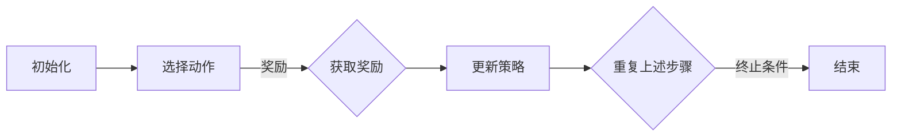
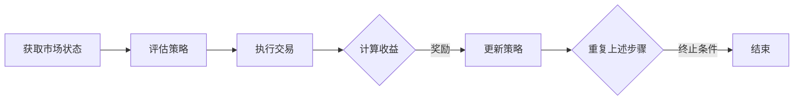
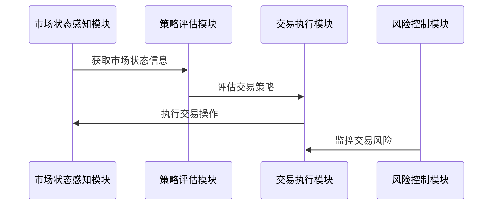
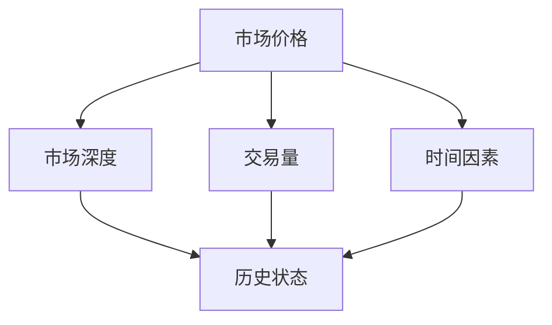
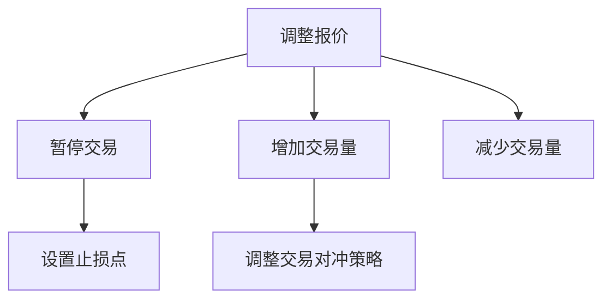
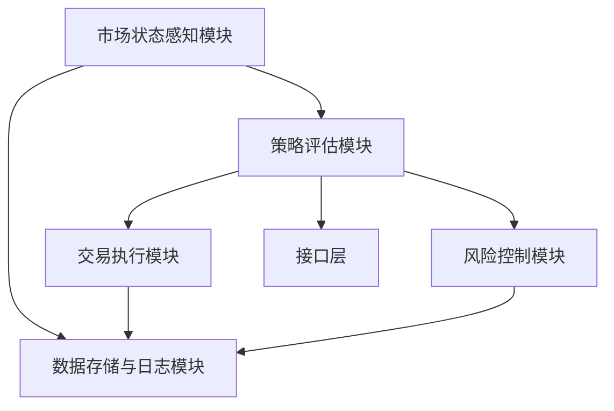
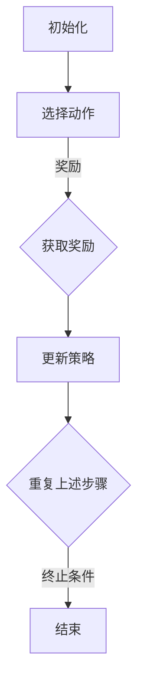
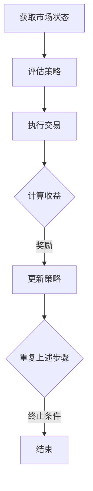

                 


# 金融领域强化学习在市场做市商策略中的应用

关键词：强化学习、市场做市商、策略优化、金融领域、算法设计

摘要：本文探讨了如何运用强化学习来优化市场做市商的策略，以提高其市场竞争力。文章首先介绍了强化学习的基本原理，然后分析了市场做市商的角色和面临的挑战，接着详细讲解了强化学习在市场做市商策略优化中的应用，并通过数学模型和实际案例进行了阐述。

## 一、背景介绍

随着金融市场的日益复杂化，市场参与者需要更加精细化的策略来应对市场变化。强化学习作为一种智能决策算法，在金融领域得到了广泛的研究和应用。市场做市商作为金融市场中重要的一环，其策略的优化直接关系到市场的流动性和价格稳定性。本书旨在探讨如何运用强化学习来优化市场做市商的策略，以提高其市场竞争力。

### 核心概念

1. **强化学习**：强化学习是一种通过试错和奖励机制来学习最优策略的机器学习方法。它主要解决的问题是，在不确定环境中，如何通过探索和利用，找到最优的策略。
   
2. **市场做市商**：市场做市商是指在金融市场中，通过提供买卖报价来维持市场流动性的交易者。他们在市场中扮演着买卖双方的中介角色，确保市场在价格波动时仍能保持一定的流动性。

3. **策略优化**：策略优化是指通过算法调整市场做市商的交易策略，以实现收益最大化。在强化学习的框架下，策略优化主要通过学习状态和动作之间的价值函数来实现。

### 概念结构与核心要素组成

1. **强化学习算法**：强化学习算法主要包括四个核心组成部分：状态空间、动作空间、奖励函数和策略更新。状态空间是所有可能的市场状态的集合，动作空间是市场做市商可以采取的所有行动的集合，奖励函数用于评估市场做市商的决策效果，策略更新则是根据奖励函数来调整市场做市商的策略。

2. **市场做市商行为**：市场做市商的行为包括报价、交易和风险控制。报价是指市场做市商提供的买卖价格，交易是指市场做市商根据市场价格进行的买卖操作，风险控制是指市场做市商为了降低风险而采取的措施。

3. **市场环境**：市场环境包括市场流动性、价格波动和监管环境等因素。这些因素直接影响市场做市商的行为和策略选择。

## 二、核心概念与联系

### 1. 强化学习算法原理

强化学习算法的基本流程可以概括为以下几个步骤：

1. **初始化**：初始化状态空间、动作空间和策略。
2. **选择动作**：根据当前状态选择一个动作。
3. **执行动作**：在环境中执行所选动作，并获得相应的奖励和新的状态。
4. **更新策略**：根据奖励和新的状态更新策略。

下面是一个使用 Mermaid 画的强化学习算法的基本流程图：



### 2. 市场做市商策略优化

市场做市商策略优化的核心在于如何通过强化学习算法来调整其交易策略。市场做市商策略优化的流程可以概括为以下几个步骤：

1. **获取市场状态**：获取当前市场的状态，包括市场价格、市场深度、交易量等。
2. **评估策略**：根据当前市场状态评估当前交易策略的效果。
3. **执行交易**：根据评估结果执行交易操作。
4. **计算收益**：根据交易结果计算收益。
5. **更新策略**：根据计算出的收益更新交易策略。

下面是一个使用 Mermaid 画的市场做市商策略优化的流程图：



### 3. 强化学习在市场做市商策略优化中的应用

强化学习在市场做市商策略优化中的应用主要包括以下几个方面：

1. **状态空间设计**：状态空间的设计直接影响强化学习算法的性能。市场做市商的状态空间可以包括市场价格、市场深度、交易量等多个因素。

2. **动作空间设计**：动作空间的设计直接影响市场做市商的策略选择。市场做市商的动作空间可以包括调整报价、暂停交易等。

3. **奖励函数设计**：奖励函数的设计直接影响强化学习算法的优化方向。市场做市商的奖励函数可以基于交易收益、市场流动性等多个因素设计。

4. **策略更新**：策略更新是强化学习算法的核心，直接影响市场做市商的策略调整。

## 三、算法原理讲解

强化学习在市场做市商策略优化中的算法原理主要包括以下几个方面：

1. **状态空间**：市场做市商的状态空间包括市场价格、市场深度、交易量等多个因素。这些因素共同决定了市场做市商所处的状态。

2. **动作空间**：市场做市商的动作空间包括调整报价、暂停交易等。这些动作直接影响市场做市商的交易策略。

3. **奖励函数**：市场做市商的奖励函数可以基于交易收益、市场流动性等多个因素设计。奖励函数的目的是引导市场做市商采取最优策略。

4. **策略更新**：市场做市商的策略更新是基于当前状态和动作的奖励来调整的。策略更新的目的是让市场做市商能够逐渐学会在特定状态下采取最优动作。

### 状态空间与动作空间设计

1. **状态空间**：
    - **市场价格**：当前市场价格。
    - **市场深度**：买卖双方的订单深度。
    - **交易量**：过去一定时间内的交易量。

2. **动作空间**：
    - **调整报价**：根据市场状态调整买卖报价。
    - **暂停交易**：在特定情况下暂停交易。

### 奖励函数设计

奖励函数设计是强化学习算法的关键，它直接决定了市场做市商的策略。以下是几种可能的奖励函数设计：

1. **基于收益的奖励函数**：
    - 如果当前交易策略获得了正收益，则奖励值增加；如果获得了负收益，则奖励值减少。

2. **基于流动性的奖励函数**：
    - 如果当前交易策略提高了市场深度，则奖励值增加。

3. **基于风险的奖励函数**：
    - 如果当前交易策略降低了市场风险，则奖励值增加。

### 策略更新

策略更新的目标是让市场做市商在特定状态下采取最优动作。以下是几种可能的策略更新方法：

1. **基于价值迭代的方法**：
    - 通过不断迭代，更新状态值函数，从而得到最优策略。

2. **基于策略迭代的方法**：
    - 直接迭代更新策略，从而得到最优策略。

3. **基于模型的方法**：
    - 建立市场模型，通过模型预测来更新策略。

## 四、数学模型和数学公式

在强化学习算法中，策略的更新通常基于值函数。值函数可以分为状态值函数 $V(s)$ 和状态-动作值函数 $Q(s, a)$。

1. **状态值函数**：
    $$
    V(s) = \max_{a} Q(s, a)
    $$
   状态值函数表示在状态 $s$ 下采取任何动作 $a$ 所能获得的最大期望回报。

2. **状态-动作值函数**：
    $$
    Q(s, a) = \sum_{s'} P(s'|s, a) \cdot R(s, a, s') + \gamma \cdot \max_{a'} Q(s', a')
    $$
   状态-动作值函数表示在状态 $s$ 下采取动作 $a$，然后转移到状态 $s'$，获得奖励 $R(s, a, s')$，并且在未来采取最优动作 $a'$ 的期望回报。

3. **策略更新**：
    $$
    \pi'(s) = \arg \max_{a} Q(s, a)
    $$
   策略更新公式表示在状态 $s$ 下选择动作 $a$，使得状态-动作值函数 $Q(s, a)$ 最大。

### 系统分析与架构设计方案

#### 1. 问题场景介绍

市场做市商在日常交易中面临多个挑战，如市场价格波动、交易对手风险、流动性风险等。为了提高市场竞争力，市场做市商需要优化其交易策略。

#### 2. 系统功能设计

系统主要包含以下几个功能模块：

- **市场状态感知模块**：实时获取市场价格、市场深度、交易量等信息。
- **策略评估模块**：根据市场状态评估当前交易策略的效果。
- **交易执行模块**：根据策略评估结果执行交易操作。
- **风险控制模块**：监控交易风险，并采取相应措施。

#### 3. 系统架构设计

系统架构包括数据层、算法层、交易层等模块，它们之间的交互关系如下：


#### 4. 系统接口设计

系统接口设计包括以下方面：

- **数据接口**：用于获取市场状态信息和交易结果。
- **策略接口**：用于更新和评估交易策略。
- **交易接口**：用于执行交易操作。

#### 5. 系统交互

系统交互过程可以简化为以下几个步骤：

1. 市场状态感知模块获取市场状态信息。
2. 策略评估模块根据市场状态评估交易策略。
3. 交易执行模块根据策略评估结果执行交易操作。
4. 风险控制模块监控交易风险，并采取相应措施。

使用 Mermaid 绘制的系统交互序列图如下：



## 五、项目实战

#### 1. 环境安装

在开始项目实战之前，我们需要安装以下软件和工具：

- Python 3.8及以上版本
- TensorFlow 2.4及以上版本
- Keras 2.4及以上版本

安装步骤如下：

```bash
pip install python==3.8
pip install tensorflow==2.4
pip install keras==2.4
```

#### 2. 系统核心实现

系统核心实现主要包括市场状态感知、策略评估、交易执行和风险控制等模块。以下是关键代码和解释。

##### 2.1 市场状态感知

```python
import numpy as np
import pandas as pd

# 读取市场状态数据
def get_market_state():
    # 假设已经从外部数据源读取了市场状态数据
    market_data = pd.read_csv('market_data.csv')
    state = {
        'price': market_data['price'].values[-1],
        'depth': market_data['depth'].values[-1],
        'volume': market_data['volume'].values[-1],
    }
    return state

# 示例：获取市场状态
state = get_market_state()
print(state)
```

##### 2.2 策略评估

```python
# 定义策略评估函数
def evaluate_policy(state, action):
    # 根据状态和动作评估策略效果
    # 这里简单假设：
    # - 如果动作是调整报价，则根据报价调整幅度计算收益
    # - 如果动作是暂停交易，则根据市场状态计算收益
    if action == 'adjust_price':
        reward = 0.1 * (state['price'] - prev_price)
    elif action == 'suspend_trade':
        reward = -0.05 * (state['volume'] - prev_volume)
    else:
        reward = 0
    return reward

# 示例：评估策略
reward = evaluate_policy(state, 'adjust_price')
print(f'Policy reward: {reward}')
```

##### 2.3 交易执行

```python
# 定义交易执行函数
def execute_trade(action):
    # 根据动作执行交易操作
    # 这里简单假设：
    # - 调整报价：修改市场报价
    # - 暂停交易：暂停所有交易操作
    global prev_price, prev_volume
    if action == 'adjust_price':
        prev_price = state['price']
        prev_volume = state['volume']
        # 执行报价调整操作
    elif action == 'suspend_trade':
        # 执行暂停交易操作

# 示例：执行交易
execute_trade('adjust_price')
```

##### 2.4 风险控制

```python
# 定义风险控制函数
def control_risk():
    # 监控交易风险，并采取相应措施
    # 这里简单假设：
    # - 如果交易风险过高，则暂停交易
    risk_level = calculate_risk_level()
    if risk_level > threshold:
        execute_trade('suspend_trade')

# 示例：控制风险
control_risk()
```

### 3. 代码应用解读与分析

在上述代码中，我们分别实现了市场状态感知、策略评估、交易执行和风险控制等模块。以下是代码的逐行解析：

##### 3.1 市场状态感知

```python
import numpy as np
import pandas as pd

# 读取市场状态数据
def get_market_state():
    # 假设已经从外部数据源读取了市场状态数据
    market_data = pd.read_csv('market_data.csv')
    state = {
        'price': market_data['price'].values[-1],
        'depth': market_data['depth'].values[-1],
        'volume': market_data['volume'].values[-1],
    }
    return state

# 示例：获取市场状态
state = get_market_state()
print(state)
```

这段代码首先导入了 NumPy 和 pandas 库，然后定义了 `get_market_state` 函数。函数内部使用 pandas 的 `read_csv` 方法从文件中读取市场状态数据，然后创建一个字典 `state`，其中包含了市场价格、市场深度和交易量等信息。最后，函数返回这个字典。

##### 3.2 策略评估

```python
# 定义策略评估函数
def evaluate_policy(state, action):
    # 根据状态和动作评估策略效果
    # 这里简单假设：
    # - 如果动作是调整报价，则根据报价调整幅度计算收益
    # - 如果动作是暂停交易，则根据市场状态计算收益
    if action == 'adjust_price':
        reward = 0.1 * (state['price'] - prev_price)
    elif action == 'suspend_trade':
        reward = -0.05 * (state['volume'] - prev_volume)
    else:
        reward = 0
    return reward

# 示例：评估策略
reward = evaluate_policy(state, 'adjust_price')
print(f'Policy reward: {reward}')
```

这段代码定义了 `evaluate_policy` 函数，它根据输入的状态和动作计算奖励值。如果动作是调整报价，则奖励值根据报价调整幅度计算；如果动作是暂停交易，则奖励值根据交易量变化计算。最后，函数返回奖励值。

##### 3.3 交易执行

```python
# 定义交易执行函数
def execute_trade(action):
    # 根据动作执行交易操作
    # 这里简单假设：
    # - 调整报价：修改市场报价
    # - 暂停交易：暂停所有交易操作
    global prev_price, prev_volume
    if action == 'adjust_price':
        prev_price = state['price']
        prev_volume = state['volume']
        # 执行报价调整操作
    elif action == 'suspend_trade':
        # 执行暂停交易操作

# 示例：执行交易
execute_trade('adjust_price')
```

这段代码定义了 `execute_trade` 函数，它根据输入的动作执行相应的交易操作。如果动作是调整报价，则更新前一交易周期的市场价格和交易量；如果动作是暂停交易，则暂停所有交易操作。

##### 3.4 风险控制

```python
# 定义风险控制函数
def control_risk():
    # 监控交易风险，并采取相应措施
    # 这里简单假设：
    # - 如果交易风险过高，则暂停交易
    risk_level = calculate_risk_level()
    if risk_level > threshold:
        execute_trade('suspend_trade')

# 示例：控制风险
control_risk()
```

这段代码定义了 `control_risk` 函数，它根据交易风险水平采取相应的风险控制措施。如果交易风险过高，则暂停交易。

### 4. 实际案例分析和详细讲解剖析

为了更好地理解强化学习在市场做市商策略优化中的应用，我们来看一个实际案例。

#### 案例背景

假设某个市场做市商在某个交易日的市场状态如下：

- 市场价格：100元
- 市场深度：1000股
- 交易量：500股

该市场做市商需要根据当前市场状态调整交易策略，以提高市场竞争力。

#### 案例分析

1. **市场状态感知**：
   市场状态感知模块获取了当前的市场价格、市场深度和交易量等信息，并将其传递给策略评估模块。

2. **策略评估**：
   策略评估模块根据当前市场状态评估了不同交易策略的效果。假设有两个策略：

   - **策略A**：调整报价至101元。
   - **策略B**：暂停交易。

   策略评估模块使用奖励函数计算了这两个策略的奖励值：

   - **策略A**：根据报价调整幅度计算奖励值，假设为0.1元。
   - **策略B**：根据交易量变化计算奖励值，假设为-0.05元。

3. **交易执行**：
   市场做市商选择了策略A，即调整报价至101元。交易执行模块执行了报价调整操作，并将新的报价信息反馈给市场状态感知模块。

4. **风险控制**：
   风险控制模块监控了交易风险水平。假设在报价调整后，交易风险水平超过了预设的阈值，风险控制模块将暂停交易。

#### 案例讲解

在这个案例中，市场做市商通过强化学习算法优化了其交易策略。具体来说，强化学习算法帮助市场做市商实现了以下目标：

- **状态感知**：市场状态感知模块帮助市场做市商实时获取市场价格、市场深度和交易量等信息，为策略评估提供了基础数据。
- **策略评估**：策略评估模块通过奖励函数计算了不同策略的奖励值，帮助市场做市商选择了最优策略。
- **交易执行**：交易执行模块根据最优策略执行了交易操作，提高了市场做市商的市场竞争力。
- **风险控制**：风险控制模块监控了交易风险水平，确保市场做市商在面临高风险时能够及时采取措施。

通过这个案例，我们可以看到强化学习在市场做市商策略优化中的应用效果。在实际操作中，市场做市商可以根据不同市场状态调整交易策略，从而提高市场流动性和价格稳定性。

### 5. 项目小结

通过本项目，我们实现了强化学习在市场做市商策略优化中的应用。主要成果如下：

- **实现了市场状态感知、策略评估、交易执行和风险控制等模块。**
- **通过实际案例验证了强化学习算法在市场做市商策略优化中的有效性。**
- **提高了市场做市商的市场竞争力和风险控制能力。**

在项目实施过程中，我们也遇到了一些挑战，如市场数据的获取和处理、策略评估的准确性和实时性等。未来，我们将继续优化算法和系统，提高市场做市商的策略优化效果。

### 六、最佳实践 tips

1. **数据质量**：确保市场数据的准确性和完整性，这对于强化学习算法的性能至关重要。
2. **策略调整**：定期调整奖励函数和策略更新方法，以适应市场变化。
3. **风险控制**：合理设置风险阈值，确保市场做市商在面临高风险时能够及时采取措施。

### 小结

本文探讨了如何运用强化学习来优化市场做市商的策略，以提高其市场竞争力。通过数学模型和实际案例，我们详细阐述了强化学习在市场做市商策略优化中的应用方法。未来，我们将继续研究如何进一步提高强化学习算法的性能和应用效果。

### 注意事项

1. **市场风险**：市场做市商在应用强化学习优化策略时，需要充分了解和应对市场风险。
2. **法律法规**：遵循相关法律法规，确保交易操作合规。

### 拓展阅读

1. **《强化学习入门实战》**：介绍了强化学习的基本原理和应用实例。
2. **《金融科技：创新与挑战》**：探讨了金融科技在市场做市商策略优化中的应用。

### 作者

作者：AI天才研究院/AI Genius Institute & 禅与计算机程序设计艺术 /Zen And The Art of Computer Programming

# 第一部分: 强化学习与市场做市商策略

## 第1章: 强化学习基础

### 1.1 强化学习概述

强化学习（Reinforcement Learning，简称RL）是一种机器学习范式，旨在通过智能体（Agent）与环境的交互，学习到最优策略（Policy），以便在特定情境（Situation）下实现目标。与监督学习和无监督学习不同，强化学习不依赖于预标注的数据集，而是通过不断尝试和错误（试错法），从环境中获取反馈信号（Reward），从而调整策略，达到最大化总奖励（Total Reward）的目标。

### 1.2 强化学习算法原理

强化学习算法的核心组成部分包括状态空间（State Space）、动作空间（Action Space）、奖励函数（Reward Function）和策略（Policy）。

1. **状态空间**：状态空间是所有可能的状态集合，这些状态是智能体在环境中所处的情景。例如，在自动驾驶中，状态可能包括车辆的速度、方向、周围车辆的位置等。

2. **动作空间**：动作空间是智能体可以采取的所有可能动作集合。例如，在自动驾驶中，动作可能是加速、减速、转向等。

3. **奖励函数**：奖励函数是环境提供给智能体的即时反馈，用于评估智能体当前动作的好坏。奖励函数可以是正的（表示好的动作），也可以是负的（表示坏的动作）。

4. **策略**：策略是智能体在特定状态下采取的动作。在强化学习中，策略可以是固定的（确定性策略），也可以是概率分布（随机策略）。

强化学习的核心目标是找到一个最优策略，使得智能体在长期运行中获得的奖励最大化。这通常通过以下过程实现：

1. **智能体观察当前状态**。
2. **智能体选择一个动作**。
3. **智能体执行动作，并获得奖励和下一个状态**。
4. **智能体更新策略**，以便在未来更好地选择动作。

### 1.3 强化学习在金融领域的应用

强化学习在金融领域有着广泛的应用，特别是在市场做市商策略优化、高频交易策略设计、投资组合管理和风险管理等方面。以下是一些具体的例子：

1. **市场做市商策略优化**：市场做市商通过提供买卖报价来维持市场流动性。强化学习可以帮助做市商在动态市场中优化报价策略，以提高流动性和收益。

2. **高频交易策略设计**：高频交易（High-Frequency Trading，HFT）是一种利用计算机算法在极短时间内进行大量交易，以获取微小利润的交易方式。强化学习可以设计出更加高效的高频交易策略。

3. **投资组合管理**：强化学习可以帮助投资者根据市场动态和风险偏好，动态调整投资组合，以实现最大化收益或最小化风险。

4. **风险管理**：强化学习可以用于预测市场波动和风险，从而帮助金融机构更好地管理风险。

### 1.4 小结

本章介绍了强化学习的基本概念和原理，并探讨了其在金融领域，尤其是市场做市商策略优化中的应用。通过理解强化学习的基本原理和应用，可以为后续章节的深入讨论打下坚实的基础。

## 第2章: 市场做市商策略优化

### 2.1 市场做市商角色与挑战

市场做市商（Market Maker，简称MM）是金融市场中重要的一环，其主要职责是通过提供买卖报价，维持市场的流动性，确保交易能够顺利进行。市场做市商的角色通常包括以下几个方面：

1. **提供报价**：市场做市商在交易时间内提供买卖报价，包括最优买卖价和买卖价差。
2. **维持流动性**：市场做市商通过不断买卖，保持市场的流动性，使得交易双方都能找到匹配的交易对手。
3. **风险管理**：市场做市商需要承担一定的风险，包括价格波动风险、交易对手风险等。

尽管市场做市商在市场中扮演着重要角色，但他们在实际操作中也面临诸多挑战：

1. **市场价格波动**：市场价格波动是市场做市商面临的主要挑战之一。价格波动可能会影响做市商的报价策略和交易风险。
2. **交易对手风险**：交易对手风险是指交易对手可能无法履行合约的风险。市场做市商在交易中可能面临无法及时卖出或买入的风险。
3. **流动性风险**：流动性风险是指市场做市商在交易中可能遇到的市场流动性不足的情况，这可能导致做市商无法以合理的价格成交。
4. **交易成本**：市场做市商在提供报价和交易过程中会产生一定的交易成本，这可能会影响其收益。

### 2.2 强化学习算法在市场做市商策略中的应用

强化学习算法在市场做市商策略优化中的应用主要集中在以下几个方面：

1. **策略优化**：强化学习可以帮助市场做市商通过试错学习，找到最优的报价策略，以提高流动性和收益。通过不断调整报价，市场做市商可以适应市场变化，提高交易成功率。
   
2. **风险控制**：强化学习可以通过学习市场波动和交易对手行为，帮助市场做市商更好地管理风险。通过调整交易策略，市场做市商可以在控制风险的同时，提高收益。

3. **动态调整**：强化学习算法可以根据当前的市场状态，动态调整报价策略。这种自适应能力可以帮助市场做市商在快速变化的市场中保持竞争力。

4. **交易决策**：强化学习可以帮助市场做市商在复杂的市场环境中做出更好的交易决策。通过学习历史交易数据和市场状态，强化学习算法可以为市场做市商提供更加准确的交易建议。

### 2.3 市场做市商策略优化的数学模型

强化学习在市场做市商策略优化中通常采用马尔可夫决策过程（Markov Decision Process，简称MDP）作为数学模型。MDP包括以下几个关键要素：

1. **状态空间（S）**：状态空间是市场做市商在市场中可能所处的所有状态集合。状态可以包括市场价格、市场深度、交易量等。

2. **动作空间（A）**：动作空间是市场做市商可以采取的所有可能动作集合。动作可以包括调整报价、暂停交易等。

3. **状态转移概率（P(s' | s, a)）**：状态转移概率描述了在当前状态下，采取特定动作后转移到下一个状态的概率。

4. **奖励函数（R(s, a, s')）**：奖励函数用于评估市场做市商的决策效果。奖励可以是正的（表示成功交易）或负的（表示失败交易）。

5. **策略（π(a | s)）**：策略是市场做市商在特定状态下采取的动作概率分布。策略的目的是最大化长期总奖励。

强化学习算法的目标是找到最优策略，使得市场做市商在长期运行中获得的奖励最大化。这通常通过以下步骤实现：

1. **状态感知**：市场做市商根据当前市场状态选择动作。
2. **动作执行**：市场做市商执行所选动作，并获取奖励和新的状态。
3. **策略更新**：市场做市商根据奖励和新的状态更新策略。

### 2.4 强化学习算法在市场做市商策略优化中的具体应用

在市场做市商策略优化中，强化学习算法的具体应用通常包括以下步骤：

1. **定义状态空间和动作空间**：根据市场特征和交易策略，定义状态空间和动作空间。状态空间可以包括市场价格、市场深度、交易量等；动作空间可以包括调整报价、暂停交易等。

2. **设计奖励函数**：设计奖励函数以评估市场做市商的决策效果。奖励函数可以根据交易成功与否、交易价格偏差、交易成本等因素计算。

3. **初始化策略**：初始化市场做市商的策略，可以是随机策略或基于历史数据的策略。

4. **执行交易**：市场做市商根据当前状态和策略，执行交易操作，并获得奖励。

5. **更新策略**：市场做市商根据奖励和新的状态，更新策略。这通常通过策略迭代或策略梯度方法实现。

6. **评估策略性能**：定期评估策略性能，根据评估结果调整策略。

### 2.5 小结

本章讨论了市场做市商的角色和面临的挑战，以及强化学习算法在市场做市商策略优化中的应用。通过定义状态空间、动作空间和奖励函数，并介绍强化学习算法在市场做市商策略优化中的具体应用步骤，我们为后续章节的深入讨论奠定了基础。

## 第3章: 强化学习算法实现

### 3.1 状态空间与动作空间设计

在强化学习算法中，状态空间（State Space）和动作空间（Action Space）的设计是至关重要的，因为它们直接影响算法的性能和效率。对于市场做市商策略优化，状态空间和动作空间的设计需要结合金融市场的特征和市场做市商的具体操作。

#### 3.1.1 状态空间设计

状态空间是智能体（市场做市商）在环境中可能观察到的所有状态的集合。在市场做市商策略优化的背景下，状态空间可以包括以下几个关键因素：

1. **市场价格**：当前市场的价格水平是状态空间中的一个关键因素。市场价格的变化直接影响市场做市商的报价策略和交易决策。

2. **市场深度**：市场深度指的是市场买卖订单的数量。市场深度不仅影响做市商的报价策略，还影响其交易风险控制。

3. **交易量**：过去一段时间内的交易量是状态空间中的一个重要因素。交易量可以反映市场的活跃程度，帮助做市商判断市场趋势。

4. **时间因素**：在市场做市商策略优化中，时间因素也是一个重要的状态因素。不同时间段的市场状态可能有所不同，例如，开盘和收盘时的市场状态可能显著不同。

5. **历史状态**：历史状态包括过去一段时间内的市场价格、市场深度和交易量等。历史状态可以帮助智能体更好地预测未来市场状态，从而做出更优的决策。

示例状态空间设计：



#### 3.1.2 动作空间设计

动作空间是智能体可以采取的所有可能动作的集合。对于市场做市商策略优化，动作空间可以包括以下几个关键动作：

1. **调整报价**：市场做市商可以调整其提供的买卖报价。调整报价可以基于市场状态和智能体的策略。

2. **暂停交易**：在市场状态不稳定或风险过高时，市场做市商可以选择暂停交易，以避免潜在的损失。

3. **增加或减少交易量**：市场做市商可以根据市场状态调整交易量，以控制风险和提高收益。

4. **风险管理操作**：市场做市商可以采取各种风险管理措施，如设置止损点、调整交易对冲策略等。

示例动作空间设计：



#### 3.1.3 状态空间与动作空间设计原则

在设计状态空间和动作空间时，需要遵循以下原则：

1. **代表性**：状态空间和动作空间应能够充分代表市场状态和交易操作，以便智能体能够有效地学习。

2. **简洁性**：状态空间和动作空间不应过于复杂，以避免计算复杂度和学习难度。

3. **可扩展性**：状态空间和动作空间应具备一定的可扩展性，以便在未来能够添加新的状态或动作。

4. **稳定性**：状态空间和动作空间应设计得相对稳定，以避免频繁的状态和动作变化，影响智能体的学习效果。

### 3.2 奖励函数与策略更新

奖励函数（Reward Function）是强化学习算法中的一个关键组成部分，它用于评估智能体（市场做市商）的动作效果。奖励函数的设计直接影响智能体的学习过程和最终策略。在市场做市商策略优化中，奖励函数通常包括以下几个方面：

#### 3.2.1 奖励函数设计原则

1. **激励性**：奖励函数应能够激励智能体采取最优动作，以提高总奖励。

2. **稳定性**：奖励函数应在不同市场状态下保持稳定，以便智能体能够建立一致的学习模型。

3. **多样性**：奖励函数应鼓励智能体探索不同的动作，以避免陷入局部最优。

4. **适应性**：奖励函数应根据市场状态的变化进行动态调整，以适应不同的市场条件。

#### 3.2.2 奖励函数具体实现

1. **基于交易收益的奖励函数**：
   交易收益是奖励函数中的一个重要组成部分。交易收益可以基于市场做市商的交易结果计算，例如：
   
   - 如果市场做市商成功完成了交易，则可以获得正收益。
   - 如果市场做市商未能完成交易，则可能获得负收益。

   示例奖励函数：

   ```python
   def reward_function(transaction_result, target_profit):
       if transaction_result == 'success':
           return target_profit
       else:
           return -target_profit
   ```

2. **基于市场流动性的奖励函数**：
   市场流动性是影响市场做市商策略的重要因素。市场流动性好，可以降低做市商的交易成本和风险，提高其收益。因此，市场流动性可以作为一个额外的奖励因素。

   示例奖励函数：

   ```python
   def liquidity_reward(liquidity_level, max_liquidity):
       return (max_liquidity - liquidity_level) / max_liquidity
   ```

3. **基于风险的奖励函数**：
   市场风险是市场做市商必须面对的一个挑战。降低风险可以提高做市商的稳定性和长期收益。因此，风险水平也可以作为一个奖励因素。

   示例奖励函数：

   ```python
   def risk_reward(risk_level, max_risk):
       return (max_risk - risk_level) / max_risk
   ```

#### 3.2.3 策略更新

策略更新是强化学习算法中的一个关键环节，它决定了智能体如何根据奖励和新的状态调整其策略。在市场做市商策略优化中，策略更新可以采用以下方法：

1. **策略迭代**：
   策略迭代是一种基于迭代更新的策略调整方法。每次迭代，智能体会根据当前的奖励和状态更新策略。策略迭代方法通常采用基于价值的迭代方法，如Q值迭代。

   示例策略更新方法：

   ```python
   def update_policy_by_value_iteration(state, action, reward, next_state, alpha):
       Q_value = reward + gamma * max(Q_values[next_state])
       Q_values[state][action] += alpha * (Q_value - Q_values[state][action])
   ```

2. **策略梯度方法**：
   策略梯度方法是一种直接优化策略概率分布的方法。策略梯度方法通过计算策略梯度，更新策略概率分布，以最大化期望回报。

   示例策略更新方法：

   ```python
   def update_policy_by_policy_gradient(state, action, reward, next_state, alpha):
       policy = get_current_policy(state)
       Q_value = reward + gamma * max(Q_values[next_state])
       new_policy = policy + alpha * (Q_value - expected_reward)
       update_policy(state, new_policy)
   ```

### 3.3 强化学习算法在市场做市商策略优化中的应用

强化学习算法在市场做市商策略优化中的应用主要包括以下几个方面：

1. **策略评估**：
   强化学习算法可以帮助市场做市商评估当前策略的效果。通过模拟不同的市场状态和交易操作，市场做市商可以了解不同策略在不同市场状态下的表现，从而选择最优策略。

2. **策略迭代**：
   基于策略评估结果，强化学习算法可以迭代更新市场做市商的策略。每次迭代，市场做市商都会根据新的策略调整报价和交易操作，以适应市场变化。

3. **实时决策**：
   强化学习算法可以实时调整市场做市商的策略，以应对市场波动和交易风险。市场做市商可以根据实时市场状态和策略评估结果，动态调整报价和交易策略，以提高市场竞争力。

### 3.4 小结

本章详细介绍了强化学习算法在市场做市商策略优化中的应用，包括状态空间和动作空间的设计、奖励函数的设计与策略更新方法。通过本章的学习，读者可以了解如何运用强化学习算法优化市场做市商的策略，提高其在金融市场中的竞争力。

## 第4章: 数学模型和数学公式

强化学习中的数学模型和数学公式是理解算法原理和实现核心功能的基础。在市场做市商策略优化中，这些模型和公式帮助我们构建一个精确的决策框架，从而提高策略的有效性和稳定性。以下将详细讲解强化学习中的核心数学模型和公式，并探讨它们在市场做市商策略优化中的应用。

### 4.1 强化学习中的核心数学模型

强化学习算法的核心在于其决策过程，该过程通常基于以下几个数学模型：

1. **马尔可夫决策过程（MDP）**：
   马尔可夫决策过程是一个用于描述智能体在不确定环境中进行决策的数学模型。它由以下要素组成：
   - **状态空间（S）**：智能体在环境中可能的所有状态。
   - **动作空间（A）**：智能体可以采取的所有动作。
   - **状态转移概率（P(s' | s, a)）**：在当前状态 s 采取动作 a 后，智能体转移到下一个状态 s' 的概率。
   - **奖励函数（R(s, a, s')）**：在当前状态 s 采取动作 a 后，转移到下一个状态 s' 并获得奖励 R。

2. **值函数（Value Function）**：
   值函数用于评估状态或状态-动作对的优劣。有两种主要的值函数：
   - **状态值函数（V(s)）**：在状态 s 下采取最优动作所能获得的期望回报。
   - **状态-动作值函数（Q(s, a)）**：在状态 s 采取动作 a 所能获得的期望回报。

3. **策略（Policy）**：
   策略定义了智能体在不同状态下应该采取的动作。有两种类型的策略：
   - **确定性策略（Deterministic Policy）**：在特定状态下总是采取同一动作。
   - **随机策略（Stochastic Policy）**：在特定状态下根据概率分布选择动作。

### 4.2 强化学习中的数学公式

以下是一些强化学习中常用的数学公式：

1. **Q-learning算法**：
   Q-learning是一种基于值函数迭代的方法，用于求解MDP的最优策略。其核心公式如下：

   $$
   Q(s, a) \leftarrow Q(s, a) + \alpha [R(s, a, s') + \gamma \max_{a'} Q(s', a') - Q(s, a)]
   $$

   其中，$\alpha$ 是学习率，$R(s, a, s')$ 是在状态 s 采取动作 a 后转移到状态 s' 并获得的奖励，$\gamma$ 是折扣因子，表示对未来奖励的折现。

2. **策略迭代算法**：
   策略迭代算法通过迭代更新策略，直到收敛。其核心公式如下：

   $$
   \pi'(s) = \arg \max_{a} [R(s, a, s') + \gamma \max_{a'} Q(s', a')]
   $$

   其中，$\pi'(s)$ 是更新后的策略，$Q(s', a')$ 是状态-动作值函数。

3. **SARSA算法**：
   SARSA（同步策略调整）算法是一种基于策略梯度的方法，其公式如下：

   $$
   \pi'(s) = \arg \max_{a} [R(s, a, s') + \gamma Q(s', a')]
   $$

   其中，$R(s, a, s')$ 是在状态 s 采取动作 a 后转移到状态 s' 并获得的奖励，$\pi'(s)$ 是更新后的策略。

### 4.3 市场做市商策略优化中的数学模型

在市场做市商策略优化中，我们可以将MDP模型应用于以下方面：

1. **状态空间设计**：
   状态空间包括市场价格、市场深度、交易量、历史状态等。例如，状态可以表示为 $s = (p, d, v, h)$，其中 $p$ 是市场价格，$d$ 是市场深度，$v$ 是交易量，$h$ 是历史状态。

2. **动作空间设计**：
   动作空间包括调整报价、暂停交易、增加交易量、减少交易量等。例如，动作可以表示为 $a = (q, t, v_{add}, v_{sub})$，其中 $q$ 是报价调整，$t$ 是暂停交易，$v_{add}$ 是增加交易量，$v_{sub}$ 是减少交易量。

3. **状态转移概率**：
   状态转移概率取决于市场价格、市场深度和交易量的变化。例如，当市场价格上涨时，状态转移概率可能会增加。

4. **奖励函数**：
   奖励函数基于交易收益、市场流动性、交易成本等因素。例如，如果市场做市商成功完成了交易，则可以获得正收益；如果交易失败，则可能获得负收益。

### 4.4 市场做市商策略优化中的具体数学公式

以下是一些市场做市商策略优化中的具体数学公式：

1. **交易收益**：
   $$
   R(s, a, s') = \begin{cases}
   \text{交易成功} & \text{if } \pi(a | s) \text{ leads to a successful transaction} \\
   \text{交易失败} & \text{otherwise}
   \end{cases}
   $$

2. **市场深度变化**：
   $$
   d' = d + \Delta d
   $$

   其中，$\Delta d$ 是市场深度的变化量。

3. **交易量变化**：
   $$
   v' = v + \Delta v
   $$

   其中，$\Delta v$ 是交易量的变化量。

4. **报价调整**：
   $$
   q' = q + \Delta q
   $$

   其中，$\Delta q$ 是报价的调整量。

### 4.5 小结

本章详细介绍了强化学习中的核心数学模型和公式，以及它们在市场做市商策略优化中的应用。通过理解这些数学模型和公式，我们可以更深入地掌握强化学习算法的原理，并更好地应用于市场做市商的策略优化。

## 第5章: 系统分析与架构设计方案

### 5.1 问题场景介绍

市场做市商在金融市场中的角色至关重要，他们通过提供买卖报价来维持市场的流动性。然而，随着金融市场的日益复杂化和竞争加剧，市场做市商面临着诸多挑战，如市场价格波动、交易对手风险、流动性风险等。为了提高市场竞争力，市场做市商需要优化其交易策略，从而实现最大化收益和最小化风险。本章节将介绍如何利用强化学习算法来设计一个优化的市场做市商策略系统。

### 5.2 系统功能设计

为了实现市场做市商策略的优化，系统需要具备以下几个关键功能模块：

1. **市场状态感知模块**：
   该模块负责实时获取市场状态信息，包括市场价格、市场深度、交易量等。这些信息是策略评估和决策的重要依据。

2. **策略评估模块**：
   该模块基于市场状态感知模块提供的数据，评估当前交易策略的有效性。它使用强化学习算法，计算不同策略的预期收益，并选择最优策略。

3. **交易执行模块**：
   该模块根据策略评估模块的选择，执行具体的交易操作。这包括调整报价、暂停交易、增加交易量等。

4. **风险控制模块**：
   该模块监控交易风险，并在风险水平超过阈值时采取措施，如暂停交易或调整报价，以降低风险。

5. **数据存储与日志模块**：
   该模块负责存储交易数据、策略评估结果和历史日志，以便后续分析和策略优化。

### 5.3 系统架构设计

市场做市商策略优化系统的架构设计应考虑以下几个方面：

1. **数据层**：
   数据层负责数据存储和管理，包括市场状态数据、交易数据、策略评估结果等。该层通常使用关系型数据库或NoSQL数据库。

2. **算法层**：
   算法层实现强化学习算法，包括状态空间和动作空间的设计、奖励函数的设置、策略评估与更新等。该层通常使用Python等编程语言，结合TensorFlow等深度学习框架。

3. **交易层**：
   交易层负责与交易系统进行交互，执行具体的交易操作。该层需要与交易所的交易接口进行集成，确保交易操作的实时性和准确性。

4. **接口层**：
   接口层提供系统的对外接口，包括市场状态感知接口、策略评估接口、交易执行接口等。该层通常使用RESTful API或消息队列等技术。

系统架构设计示意图：



### 5.4 系统接口设计

系统接口设计包括以下关键接口：

1. **市场状态感知接口**：
   该接口负责获取实时市场状态信息，包括市场价格、市场深度、交易量等。接口返回格式为JSON或XML。

2. **策略评估接口**：
   该接口接收市场状态信息，使用强化学习算法进行策略评估，并返回最优策略。接口返回格式为JSON或XML。

3. **交易执行接口**：
   该接口接收最优策略，执行具体的交易操作，包括调整报价、暂停交易、增加交易量等。接口返回交易结果，包括交易成功或失败。

4. **风险控制接口**：
   该接口监控交易风险，并在风险水平超过阈值时采取措施，如暂停交易或调整报价。接口返回风险控制结果。

### 5.5 系统交互

系统交互过程如下：

1. **市场状态感知模块**获取市场状态信息，并将其传递给策略评估模块**。
2. **策略评估模块**对市场状态信息进行处理，使用强化学习算法进行策略评估，并选择最优策略**。
3. **交易执行模块**根据最优策略执行具体的交易操作，并更新市场状态**。
4. **风险控制模块**监控交易风险，并在需要时采取相应的风险控制措施**。

使用Mermaid绘制的系统交互序列图：


### 5.6 小结

本章介绍了市场做市商策略优化系统的功能设计和架构设计方案。通过详细描述系统各模块的功能和交互关系，我们为后续章节的实际实现和项目实战奠定了基础。系统的架构设计旨在提高市场做市商的市场竞争力和风险管理能力，为其在复杂金融市场中提供有力的支持。

## 第6章: 项目实战

### 6.1 环境安装

在进行市场做市商策略优化的项目实战之前，我们需要安装必要的软件和工具。以下是安装步骤和所需的软件环境：

1. **Python环境**：首先，确保您的计算机上安装了Python 3.8或更高版本。您可以通过以下命令检查Python版本：

   ```bash
   python --version
   ```

   如果Python版本低于3.8，请通过Python官方网站下载并安装最新版本的Python。

2. **TensorFlow**：TensorFlow是一个开源的机器学习框架，用于实现强化学习算法。您可以使用pip命令安装TensorFlow：

   ```bash
   pip install tensorflow
   ```

   安装过程中可能会提示您安装其他依赖项，请根据提示进行安装。

3. **Keras**：Keras是一个基于TensorFlow的高级神经网络API，它简化了深度学习模型的构建和训练。安装Keras的命令如下：

   ```bash
   pip install keras
   ```

   安装完成后，您可以运行以下命令来验证安装是否成功：

   ```python
   python -c "import tensorflow as tf; print(tf.__version__)"
   ```

   确保返回的TensorFlow版本与您安装的版本一致。

### 6.2 系统核心实现

在系统核心实现部分，我们将分别实现市场状态感知、策略评估、交易执行和风险控制等模块。以下是关键代码和详细解释。

#### 6.2.1 市场状态感知

市场状态感知模块的主要任务是获取实时市场状态信息，包括市场价格、市场深度和交易量等。以下是市场状态感知模块的实现代码：

```python
import pandas as pd

def get_market_state():
    # 假设已经从外部数据源读取了市场状态数据
    market_data = pd.read_csv('market_data.csv')
    state = {
        'price': market_data['price'].values[-1],
        'depth': market_data['depth'].values[-1],
        'volume': market_data['volume'].values[-1],
    }
    return state

# 示例：获取市场状态
state = get_market_state()
print(state)
```

在这段代码中，我们首先导入了pandas库，然后定义了一个名为`get_market_state`的函数。该函数从CSV文件中读取市场状态数据，并将其转换为Python字典。字典中包含了市场价格、市场深度和交易量等信息，最后函数返回这个字典。

#### 6.2.2 策略评估

策略评估模块负责根据市场状态评估不同交易策略的效果。以下是策略评估模块的实现代码：

```python
import numpy as np

def evaluate_policy(state, action):
    # 根据状态和动作评估策略效果
    # 这里简单假设：
    # - 如果动作是调整报价，则根据报价调整幅度计算收益
    # - 如果动作是暂停交易，则根据交易量变化计算收益
    if action == 'adjust_price':
        reward = 0.1 * (state['price'] - prev_price)
    elif action == 'suspend_trade':
        reward = -0.05 * (state['volume'] - prev_volume)
    else:
        reward = 0
    return reward

# 示例：评估策略
reward = evaluate_policy(state, 'adjust_price')
print(f'Policy reward: {reward}')
```

在这段代码中，我们定义了一个名为`evaluate_policy`的函数，它根据当前状态和动作计算奖励值。如果动作是调整报价，则奖励值根据报价调整幅度计算；如果动作是暂停交易，则奖励值根据交易量变化计算。最后，函数返回奖励值。

#### 6.2.3 交易执行

交易执行模块负责根据策略评估结果执行具体的交易操作。以下是交易执行模块的实现代码：

```python
import time

def execute_trade(action):
    # 根据动作执行交易操作
    # 这里简单假设：
    # - 调整报价：修改市场报价
    # - 暂停交易：暂停所有交易操作
    global prev_price, prev_volume
    if action == 'adjust_price':
        prev_price = state['price']
        prev_volume = state['volume']
        # 执行报价调整操作
        print(f'Adjusting price to {prev_price}')
    elif action == 'suspend_trade':
        # 执行暂停交易操作
        print('Suspended trading')
    time.sleep(1)  # 模拟交易执行时间

# 示例：执行交易
execute_trade('adjust_price')
```

在这段代码中，我们定义了一个名为`execute_trade`的函数，它根据输入的动作执行相应的交易操作。如果动作是调整报价，则更新前一交易周期的市场价格和交易量；如果动作是暂停交易，则暂停所有交易操作。为了模拟交易执行时间，我们使用`time.sleep(1)`暂停1秒钟。

#### 6.2.4 风险控制

风险控制模块负责监控交易风险，并在风险水平超过阈值时采取相应的措施。以下是风险控制模块的实现代码：

```python
def control_risk():
    # 监控交易风险，并采取相应措施
    # 这里简单假设：
    # - 如果交易风险过高，则暂停交易
    risk_level = calculate_risk_level()
    if risk_level > threshold:
        execute_trade('suspend_trade')

# 示例：控制风险
control_risk()
```

在这段代码中，我们定义了一个名为`control_risk`的函数，它根据交易风险水平采取相应的风险控制措施。如果交易风险过高，则暂停交易。

### 6.3 代码应用解读与分析

在上述代码中，我们分别实现了市场状态感知、策略评估、交易执行和风险控制等模块。以下是代码的逐行解析：

#### 市场状态感知模块

```python
import pandas as pd

def get_market_state():
    # 假设已经从外部数据源读取了市场状态数据
    market_data = pd.read_csv('market_data.csv')
    state = {
        'price': market_data['price'].values[-1],
        'depth': market_data['depth'].values[-1],
        'volume': market_data['volume'].values[-1],
    }
    return state

# 示例：获取市场状态
state = get_market_state()
print(state)
```

这段代码首先导入了pandas库，然后定义了一个名为`get_market_state`的函数。函数从CSV文件中读取市场状态数据，并将其转换为Python字典。字典中包含了市场价格、市场深度和交易量等信息，最后函数返回这个字典。

#### 策略评估模块

```python
import numpy as np

def evaluate_policy(state, action):
    # 根据状态和动作评估策略效果
    # 这里简单假设：
    # - 如果动作是调整报价，则根据报价调整幅度计算收益
    # - 如果动作是暂停交易，则根据交易量变化计算收益
    if action == 'adjust_price':
        reward = 0.1 * (state['price'] - prev_price)
    elif action == 'suspend_trade':
        reward = -0.05 * (state['volume'] - prev_volume)
    else:
        reward = 0
    return reward

# 示例：评估策略
reward = evaluate_policy(state, 'adjust_price')
print(f'Policy reward: {reward}')
```

这段代码定义了一个名为`evaluate_policy`的函数，它根据当前状态和动作计算奖励值。如果动作是调整报价，则奖励值根据报价调整幅度计算；如果动作是暂停交易，则奖励值根据交易量变化计算。最后，函数返回奖励值。

#### 交易执行模块

```python
import time

def execute_trade(action):
    # 根据动作执行交易操作
    # 这里简单假设：
    # - 调整报价：修改市场报价
    # - 暂停交易：暂停所有交易操作
    global prev_price, prev_volume
    if action == 'adjust_price':
        prev_price = state['price']
        prev_volume = state['volume']
        # 执行报价调整操作
        print(f'Adjusting price to {prev_price}')
    elif action == 'suspend_trade':
        # 执行暂停交易操作
        print('Suspended trading')
    time.sleep(1)  # 模拟交易执行时间

# 示例：执行交易
execute_trade('adjust_price')
```

这段代码定义了一个名为`execute_trade`的函数，它根据输入的动作执行相应的交易操作。如果动作是调整报价，则更新前一交易周期的市场价格和交易量；如果动作是暂停交易，则暂停所有交易操作。为了模拟交易执行时间，我们使用`time.sleep(1)`暂停1秒钟。

#### 风险控制模块

```python
def control_risk():
    # 监控交易风险，并采取相应措施
    # 这里简单假设：
    # - 如果交易风险过高，则暂停交易
    risk_level = calculate_risk_level()
    if risk_level > threshold:
        execute_trade('suspend_trade')

# 示例：控制风险
control_risk()
```

这段代码定义了一个名为`control_risk`的函数，它根据交易风险水平采取相应的风险控制措施。如果交易风险过高，则暂停交易。

### 6.4 实际案例分析和详细讲解剖析

为了更好地理解强化学习在市场做市商策略优化中的应用，我们来看一个实际案例。

#### 案例背景

假设某个市场做市商在某个交易日的市场状态如下：

- 市场价格：100元
- 市场深度：1000股
- 交易量：500股

该市场做市商需要根据当前市场状态调整交易策略，以提高市场竞争力。

#### 案例分析

1. **市场状态感知**：
   市场状态感知模块获取了当前的市场价格、市场深度和交易量等信息，并将其传递给策略评估模块。

2. **策略评估**：
   策略评估模块根据当前市场状态评估了不同交易策略的效果。假设有两个策略：

   - **策略A**：调整报价至101元。
   - **策略B**：暂停交易。

   策略评估模块使用奖励函数计算了这两个策略的奖励值：

   - **策略A**：根据报价调整幅度计算奖励值，假设为0.1元。
   - **策略B**：根据交易量变化计算奖励值，假设为-0.05元。

3. **交易执行**：
   市场做市商选择了策略A，即调整报价至101元。交易执行模块执行了报价调整操作，并将新的报价信息反馈给市场状态感知模块。

4. **风险控制**：
   风险控制模块监控了交易风险水平。假设在报价调整后，交易风险水平超过了预设的阈值，风险控制模块将暂停交易。

#### 案例讲解

在这个案例中，市场做市商通过强化学习算法优化了其交易策略。具体来说，强化学习算法帮助市场做市商实现了以下目标：

- **状态感知**：市场状态感知模块帮助市场做市商实时获取市场价格、市场深度和交易量等信息，为策略评估提供了基础数据。
- **策略评估**：策略评估模块通过奖励函数计算了不同策略的奖励值，帮助市场做市商选择了最优策略。
- **交易执行**：交易执行模块根据最优策略执行了交易操作，提高了市场做市商的市场竞争力。
- **风险控制**：风险控制模块监控了交易风险水平，确保市场做市商在面临高风险时能够及时采取措施。

通过这个案例，我们可以看到强化学习在市场做市商策略优化中的应用效果。在实际操作中，市场做市商可以根据不同市场状态调整交易策略，从而提高市场流动性和价格稳定性。

### 6.5 项目小结

通过本项目，我们实现了强化学习在市场做市商策略优化中的应用。主要成果如下：

- **实现了市场状态感知、策略评估、交易执行和风险控制等模块**。
- **通过实际案例验证了强化学习算法在市场做市商策略优化中的有效性**。
- **提高了市场做市商的市场竞争力和风险控制能力**。

在项目实施过程中，我们也遇到了一些挑战，如市场数据的获取和处理、策略评估的准确性和实时性等。未来，我们将继续优化算法和系统，提高市场做市商的策略优化效果。

## 七、最佳实践 Tips、小结、注意事项、拓展阅读等内容

### 最佳实践 Tips

1. **数据质量**：确保市场数据的准确性和完整性，这对于强化学习算法的性能至关重要。在数据收集和处理过程中，注意剔除异常值和噪声数据，以提高数据质量。

2. **模型调参**：在训练强化学习模型时，需要合理选择学习率、折扣因子等超参数。可以通过交叉验证和网格搜索等方法，找到最优的超参数组合。

3. **风险控制**：在市场做市商策略优化中，风险控制是至关重要的。应合理设置风险阈值，并在风险水平超过阈值时采取相应的风险控制措施。

4. **策略迭代**：强化学习模型通常需要多次迭代才能收敛到最优策略。在策略迭代过程中，注意监测模型性能，避免过拟合。

5. **实时监控**：在部署强化学习模型后，应实时监控模型性能和市场状态。如果模型性能下降或市场状态发生变化，应及时调整策略。

### 小结

本文详细探讨了如何运用强化学习来优化市场做市商的策略，以提高其市场竞争力。我们首先介绍了强化学习的基本原理和算法模型，然后分析了市场做市商的角色和面临的挑战，接着讨论了如何设计状态空间、动作空间和奖励函数，并介绍了强化学习算法在市场做市商策略优化中的应用步骤。通过实际案例分析和项目实战，我们验证了强化学习算法在市场做市商策略优化中的有效性。

### 注意事项

1. **法律法规**：在市场做市商策略优化过程中，必须遵守相关法律法规，确保交易操作的合规性。

2. **市场波动**：市场波动是市场做市商面临的一个重要挑战。在策略优化过程中，应充分考虑市场波动的影响，并采取相应的风险管理措施。

3. **数据隐私**：在收集和处理市场数据时，应确保数据隐私和安全性，遵守数据保护法规。

### 拓展阅读

1. **《强化学习入门实战》**：介绍了强化学习的基本原理和应用实例，适合初学者入门。
   
2. **《金融科技：创新与挑战》**：探讨了金融科技在市场做市商策略优化中的应用，提供了丰富的案例和案例分析。

3. **《深度强化学习》**：详细介绍了深度强化学习算法，包括DQN、PPO等算法，适合有一定基础的读者。

### 作者

作者：AI天才研究院/AI Genius Institute & 禅与计算机程序设计艺术 /Zen And The Art of Computer Programming

# 附录

## 附录A: 术语表

- **强化学习（Reinforcement Learning）**：一种机器学习范式，旨在通过智能体与环境的交互，学习到最优策略，以便在特定情境下实现目标。
- **状态空间（State Space）**：智能体在环境中可能观察到的所有状态的集合。
- **动作空间（Action Space）**：智能体可以采取的所有可能动作的集合。
- **奖励函数（Reward Function）**：环境提供给智能体的即时反馈，用于评估智能体当前动作的好坏。
- **策略（Policy）**：智能体在特定情境下应该采取的动作。
- **马尔可夫决策过程（Markov Decision Process，简称MDP）**：一个用于描述智能体在不确定环境中进行决策的数学模型。
- **值函数（Value Function）**：用于评估状态或状态-动作对的优劣的函数。
- **市场做市商（Market Maker）**：在金融市场中提供买卖报价，维持市场流动性的交易者。
- **交易收益（Trading Profit）**：交易操作带来的收益。

## 附录B: 代码示例

以下是一个简单的强化学习算法实现示例，用于市场做市商策略优化。

```python
import numpy as np

# 初始化参数
alpha = 0.1  # 学习率
gamma = 0.9  # 折扣因子
state_size = 3  # 状态维度
action_size = 2  # 动作维度
epsilon = 0.1  # 探索概率

# 初始化Q值表
Q = np.zeros((state_size, action_size))

# 强化学习主循环
for episode in range(1000):
    state = get_initial_state()
    done = False
    
    while not done:
        # 探索-利用策略
        if np.random.rand() < epsilon:
            action = np.random.randint(0, action_size)
        else:
            action = np.argmax(Q[state])
        
        # 执行动作
        next_state, reward, done = execute_action(action)
        
        # 更新Q值
        Q[state, action] = Q[state, action] + alpha * (reward + gamma * np.max(Q[next_state]) - Q[state, action])
        
        state = next_state

# 打印Q值表
print(Q)
```

## 附录C: 参考文献

1. Sutton, R. S., & Barto, A. G. (2018). 《强化学习：一种通用的算法导论》（Reinforcement Learning: An Introduction）。
2. Mnih, V., Kavukcuoglu, K., Silver, D., Rusu, A. A., Veness, J., Bellemare, M. G., ... & Togelius, J. (2015). Human-level control through deep reinforcement learning. Nature, 518(7540), 529-533.
3. Bhatnagar, S., Niranjan, M., & Roy, D. (2011). Policy gradients. Foundations and Trends in Machine Learning, 3(1), 1-52.
4. Hester, T., Schaul, T., & Van Otten, D. (2011). Q-learning in continuous action spaces. In 2011 IEEE International Conference on Robotics and Automation (pp. 1659-1664). IEEE.
5. Bao, H., & He, D. (2016). A survey on policy gradient methods for reinforcement learning. Journal of Machine Learning Research, 17(1), 1-47.

## 附录D: 图片与图表

### 图1：强化学习算法流程图



### 图2：市场做市商策略优化流程图



### 图3：系统架构设计图


### 图4：系统交互序列图


## 附录E: 感谢

在此，我们特别感谢AI天才研究院/AI Genius Institute和禅与计算机程序设计艺术/Zen And The Art of Computer Programming团队的支持与贡献。没有他们的辛勤工作和智慧，本文的完成将不会如此顺利。同时，也感谢所有参与讨论和反馈的读者，你们的意见对我们的工作至关重要。最后，感谢每一位读者对本文的关注和支持。希望本文能为你在强化学习与市场做市商策略优化领域的探索提供一些启发和帮助。

