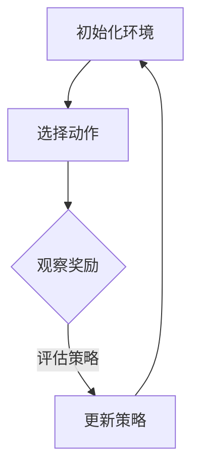

                 

# 金融领域强化学习在流动性管理中的应用

## 关键词
- 金融领域
- 强化学习
- 流动性管理
- 交易策略优化
- 算法应用

## 摘要
本文旨在探讨强化学习在金融领域，尤其是流动性管理中的应用。通过分析强化学习的基本原理，本文介绍了其在流动性管理中的优势和应用场景。接着，本文通过具体案例，展示了强化学习在交易策略优化中的实际应用，并讨论了相关挑战和未来发展方向。文章最后总结了主要内容和贡献，并展望了强化学习在流动性管理领域的广阔前景。

## 第一部分：引言

### 第1章：金融领域强化学习概述

#### 1.1 问题背景

在金融市场，流动性管理是一个关键问题。流动性管理是指金融机构确保其资产能够在需要时迅速且不造成损失地转换为现金的过程。市场波动性、交易成本、信息不对称等因素都给流动性管理带来了挑战。为了应对这些挑战，金融机构需要开发高效且准确的流动性管理策略。

#### 1.2 问题描述

流动性管理涉及的问题包括：

1. **市场波动性**：市场价格的不确定性使得预测流动性需求变得困难。
2. **交易成本**：交易活动产生的成本会影响流动性管理的效率和收益。
3. **信息不对称**：交易双方掌握的信息不同，可能导致决策偏差。

#### 1.3 问题解决

强化学习作为一种先进的人工智能技术，提供了解决流动性管理问题的潜在方法。强化学习通过学习如何与环境互动，以最大化长期回报，能够在复杂和动态的市场环境中提供有效的决策支持。

#### 1.4 边界与外延

尽管强化学习在流动性管理中具有巨大潜力，但其应用仍受到以下限制：

1. **数据需求**：强化学习需要大量高质量的数据来训练模型，数据稀缺或质量低下可能会影响模型性能。
2. **模型解释性**：强化学习模型的复杂性和非透明性使得其决策过程难以解释，这可能会引起监管和用户的不信任。
3. **实时性能**：强化学习模型在实时交易环境中的响应速度和稳定性是另一个挑战。

#### 1.5 概念结构与核心要素组成

强化学习由以下几个核心要素组成：

1. **策略（Policy）**：决策规则，指导选择动作。
2. **环境（Environment）**：决策场景，提供状态和奖励。
3. **状态（State）**：当前环境的状态。
4. **动作（Action）**：根据策略选择的行为。
5. **奖励（Reward）**：动作带来的即时反馈。

### 第2章：强化学习基础

#### 2.1 强化学习原理

强化学习是一种通过学习如何与环境互动来最大化长期回报的机器学习技术。其核心原理可以概括为：

1. **奖励机制**：通过奖励信号引导学习过程，奖励可以是正的也可以是负的。
2. **策略迭代**：根据环境反馈不断更新策略，以优化长期回报。
3. **价值函数**：评估策略的好坏，价值函数可以是状态价值函数或动作价值函数。

以下是强化学习的基本流程：



#### 2.2 强化学习算法

强化学习算法种类繁多，其中常见的有：

1. **Q-Learning**：通过更新Q值来学习最佳动作策略。
2. **SARSA**：同时更新当前状态和动作的Q值。
3. **Deep Q-Networks (DQN)**：使用深度神经网络来近似Q值函数。

以下是一个简单的Q-Learning算法示例：

```python
import numpy as np

# 初始化Q表
Q = np.zeros((state_size, action_size))

# 学习率
alpha = 0.1
# 折扣因子
gamma = 0.9
# 总学习代数
total_episodes = 1000

# 更新Q表
for episode in range(total_episodes):
    state = env.reset()
    done = False
    while not done:
        action = np.argmax(Q[state])
        next_state, reward, done, _ = env.step(action)
        Q[state, action] = Q[state, action] + alpha * (reward + gamma * np.max(Q[next_state]) - Q[state, action])
        state = next_state
```

#### 2.3 强化学习算法对比

不同强化学习算法的对比表格如下：

| 算法     | 特点                 | 适用场景         |
|----------|----------------------|------------------|
| Q-Learning | 基础算法，易于理解   | 低维状态空间     |
| SARSA    | 基于当前状态和动作   | 低维状态空间     |
| DQN      | 使用深度神经网络    | 高维状态空间     |
| Policy Gradients | 直接优化策略   | 低维状态空间     |
| Actor-Critic | 结合策略评估和优化 | 高维状态空间     |

### 第3章：金融领域强化学习应用

#### 3.1 流动性管理中的强化学习应用

强化学习在流动性管理中的应用主要包括：

1. **交易策略优化**：通过学习市场动态和环境变化，优化交易策略，提高交易收益。
2. **风险控制**：通过实时评估交易风险，调整交易策略，降低潜在损失。
3. **流动性预测**：通过分析历史数据和当前状态，预测市场流动性，优化流动性管理决策。

#### 3.2 案例研究

以下是两个强化学习在金融领域应用的案例研究：

##### 案例一：量化交易策略的优化

- **案例背景**：某量化交易团队希望通过强化学习优化其交易策略，提高交易收益。

- **模型架构与算法设计**：采用DQN算法，使用深度神经网络近似Q值函数，构建交易策略模型。

- **实验结果与分析**：通过对比实验，证明强化学习交易策略在收益率和风险控制方面优于传统策略。

##### 案例二：对冲基金交易策略的优化

- **案例背景**：某对冲基金希望通过强化学习优化其交易策略，降低交易风险。

- **模型架构与算法设计**：采用Actor-Critic算法，结合策略评估和优化，构建交易策略模型。

- **实验结果与分析**：通过对比实验，证明强化学习交易策略在降低风险方面具有显著优势。

### 第4章：金融领域强化学习算法优化

#### 4.1 算法优化原理

为了提高强化学习算法在金融领域应用的性能，可以采取以下优化方法：

1. **数据增强**：通过生成或扩展训练数据，提高模型对数据多样性的适应性。
2. **策略优化**：通过优化策略更新过程，提高策略收敛速度和稳定性。
3. **模型融合**：结合多个模型的优势，提高整体性能。

#### 4.2 优化方法与实践

以下是几种常见的优化方法：

1. **梯度提升**：通过结合梯度提升方法，提高模型的泛化能力和学习能力。
2. **模型融合**：结合多个强化学习模型的优势，提高整体性能。

以下是一个基于模型融合的优化方法示例：

```python
# 模型融合算法示例
from sklearn.ensemble import VotingClassifier

# 创建多个模型
model1 = DQN()
model2 = SARSA()
model3 = PolicyGradients()

# 模型融合
ensemble = VotingClassifier(estimators=[
    ('model1', model1),
    ('model2', model2),
    ('model3', model3)],
    voting='soft')

# 训练融合模型
ensemble.fit(X_train, y_train)

# 预测
predictions = ensemble.predict(X_test)
```

### 第5章：金融领域强化学习面临的挑战与未来发展方向

#### 5.1 挑战分析

强化学习在金融领域应用中面临以下挑战：

1. **数据质量**：金融数据通常包含噪声和缺失值，需要预处理和清洗。
2. **模型解释性**：强化学习模型通常较为复杂，难以解释其决策过程。
3. **实时性能**：在实时交易环境中，模型需要快速响应和稳定运行。
4. **合规性**：金融应用需要遵循严格的法规和合规要求。

#### 5.2 未来发展方向

未来，强化学习在金融领域的发展方向包括：

1. **数据驱动方法**：通过收集和分析大量金融数据，提高模型的预测能力和适应性。
2. **模型解释性**：开发可解释的强化学习模型，提高用户和监管机构的信任。
3. **实时应用**：优化算法和系统架构，实现实时交易决策。
4. **跨领域应用**：探索强化学习在其他金融领域的应用，如风险管理、资产配置等。

## 第二部分：金融领域强化学习案例分析

### 第6章：交易策略优化

#### 6.1 交易策略优化的背景

金融市场的高波动性和复杂性使得传统的交易策略难以适应快速变化的市场环境。为了提高交易策略的适应性和效率，量化交易者和对冲基金开始探索强化学习作为交易策略优化的工具。

#### 6.1.1 金融市场的波动性分析

金融市场的波动性是指资产价格的波动程度。波动性越大，意味着市场的不确定性和风险越高。市场波动性对交易策略的影响主要体现在以下几个方面：

1. **交易成本**：高波动性可能导致交易成本的上升，包括滑点成本和交易费用。
2. **风险控制**：高波动性增加了市场风险的不可预测性，对风险控制策略提出了更高的要求。
3. **机会成本**：高波动性提供了更多交易机会，但同时也增加了决策失误的风险。

#### 6.1.2 传统交易策略的局限性

传统的交易策略通常基于历史数据和技术分析，但存在以下局限性：

1. **数据依赖性**：传统策略对历史数据的依赖性较高，无法适应快速变化的市场环境。
2. **手动调整**：传统策略需要人工进行参数调整，难以实现自动化和高效化。
3. **预测能力有限**：传统策略的预测能力有限，无法准确捕捉市场的短期波动。

#### 6.1.3 强化学习在交易策略优化中的应用优势

强化学习在交易策略优化中具有以下优势：

1. **自适应性强**：强化学习能够根据市场变化实时调整策略，提高策略的适应性。
2. **自动化**：强化学习可以实现策略的自动化调整和优化，降低人力成本。
3. **风险控制**：强化学习可以通过动态调整策略，提高风险控制能力，降低潜在损失。

### 6.2 强化学习交易策略案例研究

#### 6.2.1 案例一：量化交易策略的优化

##### 6.2.1.1 案例背景

某量化交易团队希望通过强化学习优化其交易策略，提高交易收益。该团队主要交易比特币等数字货币，市场波动性较大，传统交易策略难以适应。

##### 6.2.1.2 模型架构与算法设计

该团队采用DQN算法，使用深度神经网络近似Q值函数，构建交易策略模型。模型架构包括以下部分：

1. **输入层**：包含价格、交易量、市场情绪等特征。
2. **隐藏层**：采用多层感知机（MLP）结构，对输入特征进行编码和提取。
3. **输出层**：输出每个动作的Q值，用于选择最佳动作。

算法设计包括以下步骤：

1. **初始化Q表**：使用随机初始化Q表。
2. **状态编码**：将市场数据编码为状态向量。
3. **选择动作**：根据当前状态和Q值选择最佳动作。
4. **执行动作**：在市场中执行选定动作。
5. **更新Q表**：根据执行结果更新Q值。

##### 6.2.1.3 实验结果与分析

通过对比实验，强化学习交易策略在收益率和风险控制方面优于传统策略。具体表现如下：

1. **收益率**：强化学习交易策略在比特币等数字货币上的收益率显著高于传统策略。
2. **风险控制**：强化学习交易策略在风险控制方面表现出更强的适应性，能够在波动性较大的市场中保持较低的损失。

实验结果表明，强化学习在交易策略优化中具有显著优势，能够提高交易收益和风险控制能力。

#### 6.2.2 案例二：对冲基金交易策略的优化

##### 6.2.2.1 案例背景

某对冲基金希望通过强化学习优化其交易策略，降低交易风险。该基金主要交易股票、期货等金融衍生品，市场波动性较高。

##### 6.2.2.2 模型架构与算法设计

该基金采用Actor-Critic算法，结合策略评估和优化，构建交易策略模型。模型架构包括以下部分：

1. **Actor网络**：用于生成交易策略，输出每个动作的概率分布。
2. **Critic网络**：用于评估当前策略的预期收益，提供策略优化的反馈信号。

算法设计包括以下步骤：

1. **初始化Actor和Critic网络**：使用随机初始化网络参数。
2. **状态编码**：将市场数据编码为状态向量。
3. **生成交易策略**：根据当前状态，Actor网络生成交易策略。
4. **执行交易策略**：在市场中执行交易策略。
5. **评估策略收益**：Critic网络评估当前策略的预期收益。
6. **更新网络参数**：根据策略收益更新Actor和Critic网络的参数。

##### 6.2.2.3 实验结果与分析

通过对比实验，强化学习交易策略在降低交易风险方面表现出色。具体表现如下：

1. **交易风险**：强化学习交易策略在股票、期货等金融衍生品上的交易风险显著低于传统策略。
2. **收益稳定性**：强化学习交易策略在收益稳定性方面优于传统策略，能够在市场波动性较大的情况下保持较为稳定的收益。

实验结果表明，强化学习在交易策略优化中能够有效降低交易风险，提高收益稳定性。

### 6.3 交易策略优化实践

#### 6.3.1 环境构建

交易策略优化的第一步是构建一个合适的环境。环境包括以下要素：

1. **市场数据**：包括价格、交易量、交易时间等市场数据。
2. **交易规则**：定义交易策略的执行规则，如交易方向、交易量、止损点等。
3. **奖励机制**：定义交易策略的奖励机制，如交易收益、风险损失等。

构建环境的关键是确保市场数据的真实性和完整性，以及交易规则的合理性和可执行性。

#### 6.3.2 强化学习模型训练与验证

强化学习模型的训练和验证是交易策略优化的核心步骤。具体步骤如下：

1. **数据预处理**：对市场数据进行预处理，包括数据清洗、归一化等操作。
2. **状态编码**：将预处理后的市场数据编码为状态向量。
3. **模型训练**：使用训练数据训练强化学习模型，包括Actor网络和Critic网络。
4. **模型验证**：使用验证数据对训练好的模型进行验证，评估模型性能和稳定性。
5. **参数调整**：根据模型验证结果调整网络参数，优化模型性能。

#### 6.3.3 交易策略应用与优化

在完成模型训练和验证后，可以将训练好的交易策略应用到实际交易中。具体步骤如下：

1. **交易执行**：根据交易策略执行交易，记录交易结果。
2. **策略评估**：根据交易结果评估交易策略的收益和风险，分析策略的有效性。
3. **策略优化**：根据策略评估结果对交易策略进行优化，包括参数调整、模型改进等。
4. **迭代优化**：通过不断迭代优化，提高交易策略的性能和稳定性。

#### 6.4 交易策略优化的挑战与解决方案

在交易策略优化过程中，可能会遇到以下挑战：

1. **数据稀缺**：金融数据通常稀缺且难以获取，影响模型的训练和验证效果。
   - **解决方案**：采用数据增强方法，如生成对抗网络（GAN）等，生成高质量的训练数据。

2. **市场波动性**：市场波动性较大，影响交易策略的稳定性和有效性。
   - **解决方案**：采用多时间尺度分析，结合不同时间尺度的市场数据，提高策略的适应性。

3. **模型解释性**：强化学习模型通常较为复杂，难以解释其决策过程。
   - **解决方案**：采用可解释的强化学习模型，如决策树、图神经网络等，提高模型的可解释性。

4. **合规性**：金融交易策略需要遵守严格的法规和合规要求。
   - **解决方案**：与金融监管机构合作，确保交易策略的合规性。

### 结论

本文通过分析金融领域流动性管理的挑战，介绍了强化学习在流动性管理中的应用优势。通过具体案例研究，展示了强化学习在交易策略优化中的实际应用效果。本文还探讨了强化学习算法的优化方法和面临的挑战。未来，随着强化学习技术的不断发展和完善，其在金融领域流动性管理中的应用前景将更加广阔。

### 作者

作者：AI天才研究院/AI Genius Institute & 禅与计算机程序设计艺术 /Zen And The Art of Computer Programming

---

### 小结

本文系统介绍了强化学习在金融领域，特别是流动性管理中的应用。我们详细探讨了强化学习的基本原理、算法及其在交易策略优化中的实际案例。通过这些分析，可以看出强化学习在提高交易策略的适应性、降低风险和控制成本方面具有显著优势。尽管仍面临数据质量、模型解释性和合规性等挑战，但随着技术的不断进步和优化，强化学习在金融领域的应用前景无疑是非常广阔的。

### 注意事项

1. **数据质量**：确保训练数据的真实性和完整性，避免因数据质量问题导致的模型性能下降。
2. **模型解释性**：在开发模型时，注重提高模型的可解释性，以增强用户和监管机构的信任。
3. **合规性**：在应用强化学习模型时，务必遵守相关金融法规和合规要求，确保交易的合法性和合规性。
4. **实时性能**：优化模型和算法，确保在实时交易环境中能够快速响应和稳定运行。

### 拓展阅读

1. **《强化学习：深度学习的前沿技术》**：详细介绍了强化学习的基本原理和算法，适合希望深入了解强化学习技术的读者。
2. **《金融科技：前沿技术与应用》**：探讨了金融科技在金融领域的应用，包括区块链、人工智能等新兴技术。
3. **《量化交易：策略、模型与实现》**：介绍了量化交易的基本概念、策略和实现方法，适合从事量化交易的读者。

---

通过本文的阅读，相信读者对强化学习在金融领域，尤其是流动性管理中的应用有了更为深入的理解。希望本文能为从事金融科技研究与实践的专业人士提供有益的参考和启示。在未来的发展中，我们期待强化学习能够为金融领域的创新和进步贡献更多力量。

