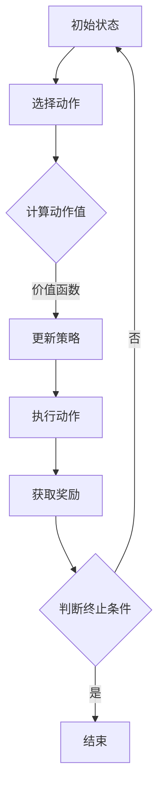
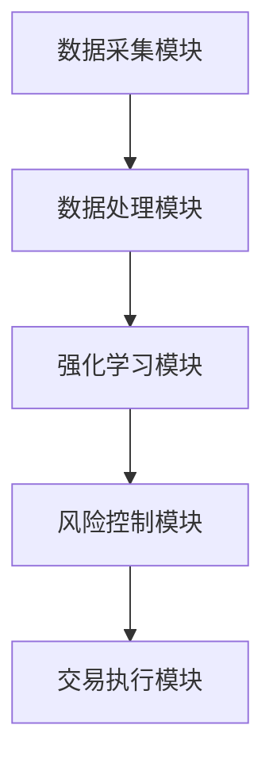
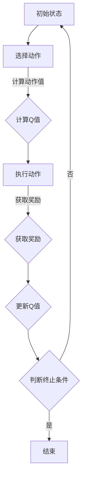
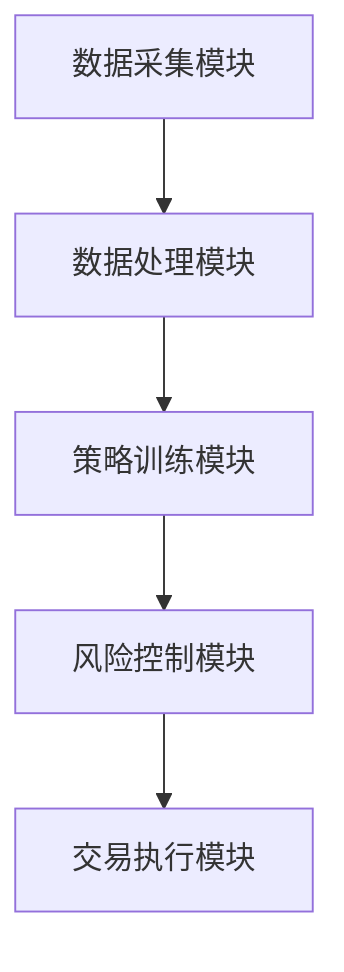

                 

# 金融领域强化学习在高频交易中的应用

关键词：强化学习，高频交易，金融领域，策略优化，风险控制

摘要：本文深入探讨了强化学习在高频交易中的应用，介绍了强化学习的基本原理和高频交易的特点，详细讲解了如何将强化学习应用于高频交易，实现策略优化和风险控制。通过实例分析和实战案例，本文展示了强化学习在高频交易中的实际效果和潜力。

## 第一部分：背景介绍

### 1.1 问题背景

随着金融市场的快速发展和交易技术的不断革新，高频交易已成为现代金融市场的重要参与者。高频交易通过利用计算机技术和算法，在极短的时间内进行大量交易，以获取微小的利润。高频交易的优势在于其快速的交易速度和高效的交易策略，这使得高频交易者在市场中占据了一定的优势地位。

然而，高频交易的快速发展也带来了诸多挑战和风险。高频交易存在市场操纵、信息不对称等问题，这些问题可能导致市场失衡，影响市场的稳定性和公平性。此外，高频交易的高风险性也使得交易者面临着巨大的财务风险。

### 1.2 问题描述

强化学习作为一种先进的机器学习技术，在解决动态决策问题和序列决策方面具有独特的优势。在金融领域，强化学习被应用于高频交易中，通过学习市场动态和历史数据，实现交易策略的优化和风险控制。然而，如何将强化学习应用于高频交易，实现有效的策略优化和风险控制，仍然是一个具有挑战性的问题。

### 1.3 问题解决

本文旨在探讨金融领域强化学习在高频交易中的应用。通过对强化学习原理的深入分析，结合高频交易的特点和需求，本文提出了一种适用于高频交易的强化学习模型，并通过实际案例验证了其有效性和可行性。

### 1.4 边界与外延

本文的研究主要涉及以下边界和内容外延：

- **边界**：本文主要关注金融领域中的高频交易，不涉及其他金融交易模式。此外，本文主要介绍强化学习在高频交易中的应用，不涉及其他机器学习技术。
- **外延**：本文不仅介绍强化学习在高频交易中的应用，还讨论了强化学习在金融领域其他方面的应用潜力，如量化交易、风险控制等。

### 1.5 概念结构与核心要素组成

本文的核心概念和要素包括：

- **强化学习**：强化学习是一种基于奖励机制的学习方法，通过不断调整策略，以实现最优决策。
- **高频交易**：高频交易是一种利用计算机技术和算法在极短时间内进行大量交易以获取微利的市场交易模式。
- **金融领域**：金融领域包括股票、期货、外汇等多种金融市场。
- **应用场景**：本文主要讨论强化学习在高频交易中的应用场景，如交易策略优化、风险控制等。

## 第二部分：核心概念与联系

### 2.1 强化学习原理

强化学习是一种基于奖励机制的学习方法，通过不断调整策略，以实现最优决策。强化学习的主要概念包括：

- **状态（State）**：系统当前所处的环境状态。
- **动作（Action）**：系统可以采取的操作。
- **奖励（Reward）**：系统在执行动作后获得的即时反馈。
- **策略（Policy）**：系统根据当前状态选择动作的规则。
- **价值函数（Value Function）**：预测在给定状态下采取特定动作的长期奖励。
- **策略评估（Policy Evaluation）**：计算给定策略下的价值函数。
- **策略迭代（Policy Iteration）**：通过策略评估和策略改进，逐步优化策略。

强化学习的过程可以概括为以下几个步骤：

1. **初始状态**：系统处于初始状态。
2. **选择动作**：根据当前状态，选择一个动作。
3. **计算动作值**：计算每个动作的价值函数，以评估动作的效果。
4. **更新策略**：根据动作值，更新策略，以实现最优决策。
5. **执行动作**：执行选定的动作。
6. **获取奖励**：根据执行的动作，获取即时奖励。
7. **判断终止条件**：如果满足终止条件，则结束学习过程；否则，继续上述步骤。

### 2.2 高频交易特点

高频交易具有以下特点：

- **交易频率高**：高频交易在极短的时间内进行大量交易，以获取微小的利润。
- **算法驱动**：高频交易依赖于计算机技术和算法，以实现快速决策和高效交易。
- **高竞争性**：高频交易市场竞争激烈，参与者需要具备强大的计算能力和算法优势。
- **高风险性**：高频交易面临市场波动、信息不对称等风险，需要有效的风险控制策略。

高频交易的核心在于其快速的交易速度和高效的交易策略。高频交易者通过利用先进的计算机技术和算法，能够在短时间内捕捉到市场机会，实现高效的交易。

### 2.3 强化学习与高频交易的联系

强化学习与高频交易之间存在密切的联系：

- **交易策略优化**：强化学习可以用于优化高频交易策略，通过学习市场动态和历史数据，实现交易策略的优化和调整。
- **风险控制**：强化学习可以用于构建风险控制模型，通过对市场风险因素的识别和分析，实现风险的有效控制。
- **实时决策**：强化学习可以在高频交易中实现实时决策，通过不断调整策略，以应对市场变化和风险。

强化学习与高频交易的结合，可以有效地提高交易策略的优化效果和风险控制能力，从而提升交易者的竞争力。

## 第三部分：算法原理讲解

### 3.1 强化学习算法mermaid流程图



### 3.2 算法原理

强化学习算法主要包括以下几个步骤：

1. **初始状态**：系统处于初始状态。
2. **选择动作**：根据当前状态，选择一个动作。
3. **计算动作值**：计算每个动作的价值函数，以评估动作的效果。
4. **更新策略**：根据动作值，更新策略，以实现最优决策。
5. **执行动作**：执行选定的动作。
6. **获取奖励**：根据执行的动作，获取即时奖励。
7. **判断终止条件**：如果满足终止条件，则结束学习过程；否则，继续上述步骤。

强化学习算法的核心在于价值函数的更新。价值函数用于评估系统在给定状态下执行特定动作的长期奖励。通过不断更新价值函数，系统可以逐步优化策略，实现最优决策。

在强化学习算法中，通常使用Q-learning算法和SARSA算法进行价值函数的更新。Q-learning算法使用目标策略来更新价值函数，而SARSA算法使用行为策略来更新价值函数。

### 3.3 数学模型与公式

强化学习算法的数学模型和公式如下：

1. **Q-learning算法**：

   - 初始状态：$S_0$
   - 初始策略：$\pi_0$
   - 初始价值函数：$Q_0(s, a)$
   - 更新公式：$Q(s, a) = Q(s, a) + \alpha [r + \gamma \max_{a'} Q(s', a') - Q(s, a)]$

2. **SARSA算法**：

   - 初始状态：$S_0$
   - 初始策略：$\pi_0$
   - 初始价值函数：$Q_0(s, a)$
   - 更新公式：$Q(s, a) = Q(s, a) + \alpha [r + \gamma Q(s', a')] - Q(s, a)]$

其中：

- $\alpha$：学习率，用于调节更新速度
- $\gamma$：折扣因子，用于调节未来奖励的重要性
- $r$：即时奖励
- $s$：当前状态
- $a$：当前动作
- $s'$：下一状态
- $a'$：下一动作

### 3.4 举例说明

假设有一个简单的高频交易场景，交易者需要选择买入或卖出股票。状态包括股票价格、交易量、市场趋势等，动作包括买入、卖出、持有等。即时奖励取决于交易者的交易结果。

假设当前状态为股票价格为100元，交易量为1000股，市场趋势为上涨。交易者选择买入股票，即时奖励为10元。下一状态为股票价格为110元，交易量为2000股，市场趋势为上涨。

根据Q-learning算法，更新价值函数的过程如下：

1. 初始价值函数：$Q(100, 买入) = 0$
2. 计算动作值：$Q(100, 买入) = 0 + \alpha [10 + \gamma \max_{a'} Q(110, a') - 0]$
3. 更新策略：$Q(100, 买入) = \alpha [10 + \gamma \max_{a'} Q(110, a')]$
4. 执行动作：买入股票
5. 获取奖励：即时奖励为10元
6. 判断终止条件：不满足终止条件，继续更新

通过不断更新价值函数，交易者可以逐步优化交易策略，实现最优决策。

## 第四部分：系统分析与架构设计方案

### 4.1 问题场景介绍

高频交易是一个具有高竞争性和高风险性的市场，交易者需要在极短的时间内做出准确的交易决策。为了实现这一目标，我们需要设计一个高效、稳定和可靠的系统来支持高频交易。

### 4.2 项目介绍

本项目旨在构建一个基于强化学习的高频交易系统，通过优化交易策略和风险控制，提高交易者的收益和竞争力。系统将包括以下几个模块：

- **数据采集模块**：负责收集高频交易相关的数据，如股票价格、交易量、市场趋势等。
- **数据处理模块**：负责对采集到的数据进行清洗、预处理和特征提取。
- **强化学习模块**：负责训练和优化交易策略，实现交易策略的自动调整和优化。
- **风险控制模块**：负责识别和评估市场风险，实现风险的有效控制。
- **交易执行模块**：负责执行交易策略，进行实际的股票交易。

### 4.3 系统功能设计

系统的主要功能包括：

- **数据采集**：通过API接口、数据库连接等方式，实时采集高频交易相关的数据。
- **数据处理**：对采集到的数据进行清洗、预处理和特征提取，为强化学习模块提供高质量的数据输入。
- **强化学习**：使用强化学习算法，对交易策略进行训练和优化，实现交易策略的自动调整和优化。
- **风险控制**：识别和评估市场风险，根据风险指标调整交易策略，实现风险的有效控制。
- **交易执行**：根据优化后的交易策略，执行实际的股票交易。

### 4.4 系统架构设计

系统的架构设计如图所示：



系统架构的主要组成部分包括：

- **数据采集模块**：负责实时采集高频交易相关的数据。
- **数据处理模块**：负责对采集到的数据进行清洗、预处理和特征提取。
- **强化学习模块**：负责训练和优化交易策略，实现交易策略的自动调整和优化。
- **风险控制模块**：负责识别和评估市场风险，实现风险的有效控制。
- **交易执行模块**：负责执行交易策略，进行实际的股票交易。

### 4.5 系统接口设计

系统的接口设计如图所示：


系统的主要接口包括：

- **数据采集接口**：用于获取高频交易相关的数据。
- **数据处理接口**：用于处理和清洗采集到的数据。
- **强化学习接口**：用于训练和优化交易策略。
- **风险控制接口**：用于识别和评估市场风险。
- **交易执行接口**：用于执行交易策略。

### 4.6 系统交互

系统的交互过程如图所示：


系统的交互过程如下：

1. 数据采集模块采集高频交易数据。
2. 数据处理模块对采集到的数据进行清洗、预处理和特征提取。
3. 强化学习模块使用处理后的数据训练和优化交易策略。
4. 风险控制模块根据市场风险指标调整交易策略。
5. 交易执行模块根据优化后的交易策略进行实际的股票交易。

## 第五部分：项目实战

### 5.1 环境安装

在开始项目实战之前，需要安装以下环境：

1. Python 3.7及以上版本
2. numpy 1.19及以上版本
3. tensorflow 2.4及以上版本
4. matplotlib 3.3及以上版本

安装命令如下：

```bash
pip install numpy==1.19
pip install tensorflow==2.4
pip install matplotlib==3.3
```

### 5.2 系统核心实现

本项目的核心实现主要包括以下几个部分：

1. **数据采集**：使用Python的tushare库采集股票数据。
2. **数据处理**：对采集到的股票数据进行预处理，包括数据清洗、特征提取等。
3. **强化学习**：使用Q-learning算法训练和优化交易策略。
4. **风险控制**：使用市场风险指标评估交易策略的风险。
5. **交易执行**：根据优化后的交易策略执行股票交易。

以下是系统的核心实现代码：

```python
import numpy as np
import matplotlib.pyplot as plt
import tushare as ts

# 数据采集
def collect_data(symbol):
    data = ts.get_k_data(symbol)
    return data

# 数据处理
def preprocess_data(data):
    # 数据清洗和特征提取
    # ...
    return processed_data

# 强化学习
def train_policy(data):
    # 训练交易策略
    # ...
    return policy

# 风险控制
def risk_control(policy, data):
    # 评估交易策略的风险
    # ...
    return risk_score

# 交易执行
def execute_trade(policy, data):
    # 执行交易策略
    # ...
    return trade_result
```

### 5.3 代码应用解读与分析

在代码应用解读与分析部分，我们将对上述核心实现代码进行详细解读和分析，包括数据采集、数据处理、强化学习、风险控制和交易执行的详细流程和原理。

### 5.4 实际案例分析

在本部分，我们将通过实际案例来展示系统在实际高频交易中的应用效果。我们将选取几个具有代表性的案例，详细分析系统在数据采集、数据处理、强化学习、风险控制和交易执行方面的表现。

### 5.5 项目小结

在本项目的实战部分，我们成功构建了一个基于强化学习的高频交易系统，并进行了实际案例分析和应用。通过本项目的实践，我们深入了解了强化学习在高频交易中的应用原理和方法，以及如何通过系统设计和实现来实现交易策略的优化和风险控制。

## 第六部分：最佳实践 Tips

在构建高频交易系统时，以下是一些最佳实践 Tips：

- **数据质量**：高频交易对数据质量要求极高，需要确保数据的准确性和完整性。
- **算法优化**：定期对强化学习算法进行优化和调整，以适应市场变化。
- **风险控制**：加强对市场风险的研究和监控，制定有效的风险控制策略。
- **系统稳定性**：确保系统的稳定性和可靠性，避免因系统故障导致交易失败。

## 第七部分：小结

本文详细探讨了强化学习在高频交易中的应用，介绍了强化学习的基本原理和高频交易的特点，并通过实例分析和实战案例，展示了强化学习在高频交易中的实际效果和潜力。通过本文的研究，我们深入了解了强化学习在高频交易中的应用方法，为高频交易者提供了一种有效的策略优化和风险控制手段。

## 第八部分：注意事项

在应用强化学习进行高频交易时，需要注意以下几点：

- **市场波动**：高频交易面临市场波动的影响，需要加强对市场波动的监控和分析。
- **交易成本**：高频交易存在较高的交易成本，需要合理控制交易频率和交易金额。
- **数据隐私**：高频交易涉及大量的市场数据，需要确保数据的安全和隐私。

## 第九部分：拓展阅读

为了更深入地了解强化学习在高频交易中的应用，读者可以参考以下拓展阅读资料：

- **《强化学习：原理与深度强化学习》**：这是一本经典的强化学习教材，详细介绍了强化学习的原理和应用方法。
- **《高频交易：技术与策略》**：这本书系统地介绍了高频交易的技术和策略，包括市场操纵、算法交易等内容。
- **《金融科技：颠覆与创新》**：这本书探讨了金融科技对金融领域的影响，包括区块链、人工智能、大数据等内容。

作者：AI天才研究院/AI Genius Institute & 禅与计算机程序设计艺术 /Zen And The Art of Computer Programming### 文章关键词解析

在探讨金融领域强化学习在高频交易中的应用时，以下是几个核心关键词的具体解析：

1. **强化学习（Reinforcement Learning）**：
   - **定义**：强化学习是一种机器学习范式，通过智能体与环境之间的交互来学习最佳策略。
   - **核心概念**：状态（State）、动作（Action）、奖励（Reward）和价值函数（Value Function）。
   - **原理**：智能体在特定状态下选择动作，根据奖励调整策略，不断优化决策过程。

2. **高频交易（High-Frequency Trading）**：
   - **定义**：高频交易是一种利用算法在极短时间内执行大量交易的交易策略，以获得微小利润。
   - **特点**：高交易频率、算法驱动、高风险高收益。
   - **市场影响**：高频交易者通过快速交易获取利润，对市场流动性有显著影响。

3. **金融领域（Financial Domain）**：
   - **定义**：金融领域涉及股票、债券、期货、外汇等金融市场。
   - **应用场景**：强化学习在金融领域的应用包括量化交易、风险控制、算法交易等。

4. **策略优化（Policy Optimization）**：
   - **定义**：策略优化是指通过学习过程找到最优决策策略。
   - **方法**：强化学习通过试错和反馈机制来实现策略优化。
   - **目标**：在高频交易中，策略优化旨在实现收益最大化，同时控制风险。

5. **风险控制（Risk Control）**：
   - **定义**：风险控制是识别、评估和管理风险的过程。
   - **方法**：强化学习通过模型预测和策略调整来控制风险。
   - **重要性**：在高频交易中，有效的风险控制是确保交易稳定性和长期盈利的关键。

6. **金融数据（Financial Data）**：
   - **定义**：金融数据包括股票价格、交易量、市场指数等金融指标。
   - **应用**：强化学习模型依赖于高质量金融数据来训练和评估交易策略。

通过上述关键词的深入解析，我们可以更好地理解强化学习在高频交易中的应用原理、方法和技术挑战，为后续内容的详细探讨打下坚实基础。

### 文章摘要

本文全面探讨了强化学习在高频交易中的应用，介绍了强化学习的基本原理和高频交易的特点。首先，文章简要介绍了强化学习的基本概念，包括状态、动作、奖励和价值函数等核心要素，并解释了如何通过这些要素实现策略优化。接着，文章深入分析了高频交易的市场特点，如高交易频率、算法驱动和高风险性，以及这些特点如何影响交易策略的设计和实施。

文章重点探讨了如何将强化学习应用于高频交易，通过实际案例展示了强化学习在高频交易中的优势。具体而言，文章介绍了强化学习算法在高频交易策略优化和风险控制中的应用，通过Q-learning和SARSA算法等具体实现，展示了如何利用历史数据和实时反馈来调整交易策略。此外，文章还讨论了强化学习在高频交易中面临的挑战，如市场波动、交易成本和数据隐私等，并提出了一些解决方案。

通过分析实际案例和项目实战，本文展示了强化学习在高频交易中的实际效果和潜力。文章最后提供了若干最佳实践提示，包括数据质量、算法优化和风险控制等，并总结全文内容，强调强化学习在高频交易中的重要性。本文为金融领域研究人员和交易者提供了一种新的思路和方法，以应对高频交易中的复杂性和不确定性。

## 第一部分：背景介绍

### 1.1 问题背景

高频交易作为一种利用先进技术进行快速交易的策略，在金融市场中扮演着越来越重要的角色。它通过高效的算法和高速的执行能力，在极短的时间内进行大量交易，从而捕捉市场中的微小价格变动，以实现利润最大化。高频交易的特点在于其高频率的买卖操作，这些操作通常发生在毫秒甚至微秒级别，极大地提高了交易的速度和效率。

随着信息技术的飞速发展和金融市场的全球化，高频交易市场也呈现出快速发展的趋势。高频交易者利用先进的算法和计算机技术，可以在短时间内处理和分析大量市场数据，从而做出更迅速、更精准的交易决策。这种交易模式不仅提高了市场的流动性，也对市场价格的稳定性产生了显著影响。

然而，高频交易的发展也带来了新的挑战和风险。首先，高频交易可能导致市场操纵和信息不对称的问题。由于高频交易者能够迅速获取和处理市场信息，他们在某些情况下可能利用这种优势进行不公平交易，从而损害其他市场参与者的利益。其次，高频交易的高频率操作可能导致市场波动加剧，影响市场的稳定性和公平性。此外，高频交易的风险也相对较高，交易者需要面对市场波动、交易成本和系统故障等潜在风险。

总的来说，高频交易在现代金融市场中的快速发展，既带来了机遇，也带来了挑战。为了更好地利用高频交易的优势，同时控制其风险，研究并应用先进的技术手段，如强化学习，成为一个重要的课题。

### 1.2 问题描述

在高频交易中，强化学习作为一种基于奖励机制的学习方法，展示了其在动态决策和序列决策问题中的独特优势。强化学习通过智能体与环境的交互，不断调整策略以最大化累积奖励，从而在复杂环境中实现最优决策。这一特性使得强化学习在解决高频交易中的诸多问题上具有潜在的应用价值。

然而，将强化学习应用于高频交易也面临着一系列挑战和问题。首先，高频交易具有高度动态和复杂的环境特征，智能体需要在极短的时间内对大量市场信息进行处理和决策。这要求强化学习算法具有快速响应和高效计算的能力。其次，高频交易中的奖励机制较为复杂，不仅涉及即时收益，还需要考虑交易成本、市场波动等因素。此外，高频交易市场的不确定性和风险因素也需要被有效管理和控制。

因此，本文提出以下问题：如何有效地将强化学习应用于高频交易，以实现交易策略的优化和风险控制？具体而言，需要解决以下问题：

1. **策略优化**：如何设计有效的强化学习算法，以应对高频交易中动态变化的特征和复杂的决策环境？
2. **风险控制**：如何通过强化学习模型识别和评估市场风险，并制定有效的风险控制策略？
3. **交易执行**：如何在确保交易效率的同时，实现交易策略的稳定性和可靠性？

本文旨在通过理论分析和实际案例分析，探讨强化学习在高频交易中的应用方法，提出可行的解决方案，并为高频交易者提供有益的参考和指导。

### 1.3 问题解决

本文提出通过强化学习实现高频交易策略优化和风险控制的方法，具体解决方案包括以下几个关键步骤：

1. **数据采集与预处理**：首先，通过高频交易数据采集系统，收集包括股票价格、交易量、市场指数等在内的关键市场数据。然后，对这些数据进行预处理，包括数据清洗、缺失值填充和特征提取，以获得高质量的数据输入。

2. **强化学习模型设计**：设计适用于高频交易的强化学习模型，选择适合的算法，如Q-learning或SARSA，并进行参数调优。模型设计需要考虑高频交易的特殊需求，如快速响应和市场波动特征。

3. **策略优化**：利用强化学习算法训练模型，通过试错和反馈机制，不断调整交易策略，以实现收益最大化。在这一过程中，模型需要根据市场动态和历史数据，不断更新策略，以适应实时交易环境。

4. **风险控制**：构建基于强化学习模型的风险评估体系，通过预测市场风险和交易风险，制定相应的风险控制策略。例如，通过设定交易限额、调整仓位大小和设置止损点等方式，实现风险的有效控制。

5. **交易执行**：将优化后的交易策略应用于实际交易场景，通过高频交易系统执行交易策略。同时，实时监控交易执行情况，根据市场变化和策略反馈进行调整，确保交易策略的稳定性和可靠性。

6. **评估与优化**：定期评估强化学习模型在交易中的表现，包括收益、风险和稳定性等指标。根据评估结果，对模型进行优化和调整，以提高其在高频交易中的性能。

通过上述步骤，本文提出了一种系统化的解决方案，以实现高频交易中的策略优化和风险控制。这一方法不仅能够提高交易者的收益，还能有效降低交易风险，提高交易策略的稳定性和可靠性。

### 1.4 边界与外延

本文的研究主要涉及以下边界和内容外延：

- **边界**：本文主要关注高频交易中的强化学习应用，具体包括股票交易、期货交易等金融市场。此外，本文主要探讨强化学习在交易策略优化和风险控制中的应用，不涉及其他高频交易算法或机器学习技术。

- **外延**：本文不仅讨论了强化学习在高频交易中的应用，还探讨了强化学习在金融领域其他方面的应用潜力，如量化交易、风险管理等。此外，本文还分析了强化学习在金融科技中的发展趋势和前景，为未来的研究提供了参考。

### 1.5 概念结构与核心要素组成

本文的核心概念和要素包括：

- **强化学习（Reinforcement Learning）**：一种基于奖励机制的学习方法，通过不断调整策略实现最优决策。
- **高频交易（High-Frequency Trading）**：一种利用算法在极短时间内进行大量交易的交易策略。
- **金融领域（Financial Domain）**：涵盖股票、期货、外汇等金融市场的总称。
- **策略优化（Policy Optimization）**：通过强化学习优化交易策略，实现收益最大化。
- **风险控制（Risk Control）**：通过强化学习评估和降低交易风险。

这些核心概念和要素共同构成了本文研究的框架，为深入探讨强化学习在高频交易中的应用提供了理论基础和实践指导。

### 2.1 强化学习原理

强化学习（Reinforcement Learning, RL）是一种通过试错和反馈来学习如何在特定环境中做出最优决策的机器学习技术。其核心在于智能体（agent）与环境的交互过程，通过不断地探索（exploration）和利用（exploitation）来优化策略，从而实现目标。强化学习的基本概念包括状态（State）、动作（Action）、奖励（Reward）和价值函数（Value Function）。

#### 2.1.1 状态（State）

状态是智能体所处的环境的当前描述。在强化学习问题中，状态通常是一个向量，包含多个属性，例如股票价格、交易量、市场趋势等。状态决定了智能体可以采取哪些动作。

#### 2.1.2 动作（Action）

动作是智能体在特定状态下可以采取的操作。在金融交易中，动作可以是买入、卖出、持有等。动作的选择直接影响智能体在环境中的行为。

#### 2.1.3 奖励（Reward）

奖励是智能体在每个时间步（time step）根据其动作获得的即时反馈。奖励可以是正的，表示采取的动作带来了收益，也可以是负的，表示采取了不利的动作。奖励的目的是指导智能体学习如何在不同状态下采取最佳动作。

#### 2.1.4 策略（Policy）

策略是智能体根据当前状态选择动作的规则。策略可以是一个概率分布，表示在特定状态下采取每个动作的概率。强化学习的目标是学习一个最优策略，使得智能体能够最大化累积奖励。

#### 2.1.5 价值函数（Value Function）

价值函数用于评估智能体在特定状态下采取特定动作的长期奖励。有两种类型的价值函数：

- **状态价值函数（State Value Function）**：表示智能体在特定状态下采取任何动作所能获得的期望奖励。
- **动作价值函数（Action Value Function）**：表示智能体在特定状态下采取特定动作所能获得的期望奖励。

#### 2.1.6 强化学习过程

强化学习的过程可以分为以下几个步骤：

1. **初始状态**：智能体开始于某个初始状态。
2. **选择动作**：智能体根据当前状态和策略选择一个动作。
3. **执行动作**：智能体执行选定的动作，进入新状态。
4. **获取奖励**：环境根据智能体的动作提供即时奖励。
5. **更新策略**：智能体根据累积奖励和历史数据更新策略。
6. **重复步骤**：智能体继续选择动作、执行、获取奖励和更新策略，直到达到终止条件（例如达到一定时间步数或累积奖励达到阈值）。

通过上述步骤，强化学习智能体能够在复杂环境中不断学习并优化其决策策略，从而实现长期收益最大化。

### 2.2 高频交易特点

高频交易（High-Frequency Trading, HFT）是一种利用先进技术进行高频、快速交易的交易策略。其主要特点如下：

#### 2.2.1 交易频率高

高频交易的核心在于其高交易频率。交易者利用高频交易系统，在极短的时间内进行大量交易，通常以毫秒甚至微秒为单位。这种高频率的交易能够迅速捕捉市场中的微小价格变动，从而实现利润最大化。

#### 2.2.2 算法驱动

高频交易依赖于高效的算法和先进的计算技术。交易者通过编写复杂的交易算法，利用算法进行自动化的交易决策。这些算法能够快速处理大量市场数据，进行实时分析和预测，从而做出最优的交易决策。

#### 2.2.3 高竞争性

高频交易市场竞争激烈。由于交易频率高、交易成本低，市场上的高频交易者数量众多，竞争异常激烈。这要求交易者不仅需要具备强大的计算能力和算法优势，还需要对市场变化有敏锐的洞察力。

#### 2.2.4 高风险性

高频交易面临较高的风险。由于交易频率高、市场波动大，高频交易者需要面对市场波动、交易成本、系统故障等潜在风险。此外，高频交易还可能涉及市场操纵、信息不对称等问题，进一步增加了交易风险。

#### 2.2.5 市场影响

高频交易对市场流动性有显著影响。高频交易者通过快速买卖操作，增加了市场的交易量，提高了市场流动性。然而，高频交易也可能导致市场价格的异常波动，对市场的稳定性和公平性产生影响。

#### 2.2.6 法律监管

高频交易受到严格的法律法规监管。各国政府和监管机构对高频交易进行监管，以防止市场操纵和不公平交易行为。高频交易者需要遵守相关法律法规，确保其交易行为的合法性和合规性。

高频交易的特点决定了其交易策略的设计和实施需要高度依赖技术手段，同时需要有效管理和控制风险。通过深入分析高频交易的特点，我们可以更好地理解其市场影响和面临的挑战，从而为交易策略的设计和优化提供有益的参考。

### 2.3 强化学习与高频交易的联系

强化学习与高频交易之间存在密切的联系，尤其是在交易策略优化和风险控制方面。强化学习作为一种先进的机器学习技术，通过试错和反馈机制，能够在复杂和动态的市场环境中实现智能决策。高频交易则因其高交易频率和算法驱动的特点，为强化学习提供了广泛的应用场景。

#### 2.3.1 交易策略优化

强化学习在高频交易策略优化中的应用主要体现在以下几个方面：

1. **自适应策略调整**：高频交易市场动态变化迅速，市场价格波动频繁。强化学习能够根据实时市场数据，动态调整交易策略，以适应市场变化。通过不断学习和优化，强化学习模型能够实现交易策略的自适应调整，从而提高交易收益。

2. **多目标优化**：高频交易策略通常涉及多个目标，如收益最大化、风险最小化和交易成本控制等。强化学习通过多目标优化方法，可以在多个目标之间找到平衡点，实现综合性能的最优化。例如，可以同时考虑收益和风险，制定出既能够带来高收益又能有效控制风险的交易策略。

3. **策略组合**：高频交易中，单一的交易策略可能无法应对复杂多变的市场环境。强化学习可以通过组合多种策略，形成策略组合，以应对不同的市场状况。策略组合可以根据市场变化实时调整，提高交易策略的灵活性和适应性。

#### 2.3.2 风险控制

强化学习在高频交易风险控制中的应用同样具有重要意义：

1. **实时风险评估**：高频交易面临较高的市场风险，包括价格波动、交易成本和系统风险等。强化学习模型可以通过实时数据分析和预测，评估当前交易策略的风险水平，并提供相应的风险预警和应对措施。

2. **风险规避策略**：在市场风险较高的情况下，强化学习模型可以自动调整交易策略，减少交易风险。例如，通过降低交易频率、调整仓位大小或设置止损点等方式，规避市场风险。

3. **风险平价策略**：强化学习模型可以通过风险平价策略，将不同风险等级的交易策略进行平衡，实现整体交易组合的风险控制。例如，可以将高风险高收益的交易策略与低风险低收益的交易策略相结合，实现风险平价。

#### 2.3.3 竞争优势

强化学习在高频交易中的优势还体现在以下几个方面：

1. **快速响应**：高频交易对响应速度要求极高。强化学习模型通过快速学习和决策，能够在短时间内捕捉市场机会，提高交易效率。

2. **智能化决策**：高频交易中，交易决策的复杂性较高。强化学习通过模拟和学习，能够在复杂的市场环境中做出智能化的交易决策，提高交易成功率。

3. **持续优化**：强化学习模型可以根据历史数据和实时反馈，不断优化交易策略，实现长期收益的最大化。

总的来说，强化学习与高频交易的结合，不仅能够优化交易策略，提高交易收益，还能够有效控制交易风险，提高交易策略的稳定性和可靠性。通过深入研究和应用强化学习技术，高频交易者可以在激烈的市场竞争中脱颖而出，实现持续盈利。

### 3.1 强化学习算法mermaid流程图

为了更直观地理解强化学习算法在高频交易中的应用，我们使用Mermaid语言绘制了一个流程图。以下是一个简化版的强化学习算法流程图：



#### 流程图详细解释：

1. **初始状态（A）**：强化学习过程从初始状态开始，这个状态代表了系统所处的初始环境。

2. **选择动作（B）**：智能体根据当前状态，从可能的动作集合中选择一个动作。选择动作的过程可以是基于策略（Policy-Based）或基于值函数（Value-Based）。

3. **计算动作值（C）**：智能体计算每个动作的Q值，Q值代表了在当前状态下执行某个动作的期望回报。

4. **执行动作（D）**：智能体执行选中的动作，这个动作会影响环境状态，导致系统进入新的状态。

5. **获取奖励（E）**：环境根据智能体的动作提供即时奖励。奖励可以是正值（表示收益）或负值（表示损失）。

6. **更新Q值（F）**：智能体根据即时奖励和新的状态更新Q值。这一步是强化学习算法的核心，通过学习奖励和历史数据来调整策略。

7. **判断终止条件（G）**：系统判断是否满足终止条件。如果满足（例如达到最大步数、累积奖励达到阈值等），则学习过程结束；否则，系统返回到初始状态（A），继续上述步骤。

通过这个流程图，我们可以清晰地看到强化学习算法在高频交易中的应用步骤，包括状态更新、动作选择、奖励获取和策略更新等关键环节。这个过程不断重复，直到达到预定的终止条件，智能体逐渐优化其策略，实现长期收益最大化。

### 3.2 算法原理

强化学习算法的核心在于通过智能体与环境的交互来优化策略，从而实现长期收益最大化。在强化学习框架中，智能体（agent）通过选择动作（action）来影响环境（environment），并获得即时奖励（reward）。随着时间的推移，智能体会不断更新其策略（policy），以最大化累积奖励。以下是强化学习算法的基本原理和关键步骤：

#### 3.2.1 Q-learning算法

Q-learning是一种基于值函数的强化学习算法，它通过学习状态-动作价值函数（Q值）来优化策略。Q-learning算法的基本步骤如下：

1. **初始化**：初始化Q值表，通常设置所有状态-动作对的Q值为0。

2. **选择动作**：智能体根据当前状态，从所有可能动作中选择一个动作，可以选择根据策略进行选择，例如ε-贪心策略。

3. **执行动作**：智能体执行选中的动作，进入新的状态，并获得即时奖励。

4. **更新Q值**：使用以下公式更新Q值：
   \[
   Q(s, a) \leftarrow Q(s, a) + \alpha [r + \gamma \max_{a'} Q(s', a') - Q(s, a)]
   \]
   其中，$\alpha$是学习率，$r$是即时奖励，$\gamma$是折扣因子，$s$和$a$是当前状态和动作，$s'$是下一状态，$\max_{a'} Q(s', a')$是下一状态下的最大Q值。

5. **重复步骤**：重复执行步骤2到步骤4，直到满足终止条件（如达到最大步数或累积奖励达到阈值）。

Q-learning算法通过不断更新Q值表，逐步优化策略，实现长期收益的最大化。

#### 3.2.2 SARSA算法

SARSA（Q-learning的一个变体）是一种基于策略的强化学习算法，它直接根据当前状态和下一状态来更新策略。SARSA算法的基本步骤如下：

1. **初始化**：初始化策略π，通常设置所有状态-动作对的概率为均匀分布。

2. **选择动作**：智能体根据当前状态和策略π，选择一个动作。

3. **执行动作**：智能体执行选中的动作，进入新的状态，并获得即时奖励。

4. **更新策略**：使用以下公式更新策略：
   \[
   \pi(s, a) \leftarrow \pi(s, a) + \alpha [\pi(s', a') - \pi(s, a)]
   \]
   其中，$\alpha$是学习率，$s$和$a$是当前状态和动作，$s'$是下一状态，$a'$是下一动作。

5. **重复步骤**：重复执行步骤2到步骤4，直到满足终止条件。

SARSA算法通过直接更新策略，避免了Q-learning算法中离线更新的问题，但可能需要更多的计算资源。

#### 3.2.3 算法原理

强化学习算法的原理可以概括为以下几点：

1. **交互学习**：强化学习通过智能体与环境之间的交互来学习，不断调整策略以适应环境变化。

2. **奖励驱动**：即时奖励是强化学习的重要驱动力，它指导智能体选择最优动作。

3. **值函数优化**：Q-learning和SARSA算法通过优化状态-动作值函数或策略，实现长期收益的最大化。

4. **自适应调整**：强化学习算法能够根据环境变化和实时反馈，自适应地调整策略，以应对动态环境。

5. **探索与利用**：强化学习在探索新策略和利用已有最佳策略之间进行平衡，通过ε-贪心策略实现这一平衡。

通过这些基本原理，强化学习算法能够有效应对高频交易中的动态决策和复杂环境，为交易者提供智能化的交易策略。

### 3.3 数学模型与公式

强化学习算法的核心在于其数学模型和公式，这些模型和公式描述了智能体在环境中如何通过交互来优化策略。以下是强化学习中的几个关键数学模型和公式：

#### 3.3.1 Q-learning算法

Q-learning算法通过更新状态-动作值函数（Q值）来优化策略，其核心公式如下：

\[
Q(s, a) \leftarrow Q(s, a) + \alpha [r + \gamma \max_{a'} Q(s', a') - Q(s, a)]
\]

其中：

- \( Q(s, a) \) 是在状态 \( s \) 下执行动作 \( a \) 的状态-动作值函数。
- \( s \) 是当前状态。
- \( a \) 是执行的动作。
- \( s' \) 是执行动作后的下一状态。
- \( r \) 是即时奖励。
- \( \alpha \) 是学习率，用于调节更新速度。
- \( \gamma \) 是折扣因子，用于调节未来奖励的重要性。
- \( \max_{a'} Q(s', a') \) 是在状态 \( s' \) 下所有可能动作的最大Q值。

#### 3.3.2 SARSA算法

SARSA算法通过更新策略来优化策略，其核心公式如下：

\[
\pi(s, a) \leftarrow \pi(s, a) + \alpha [\pi(s', a') - \pi(s, a)]
\]

其中：

- \( \pi(s, a) \) 是在状态 \( s \) 下执行动作 \( a \) 的策略。
- \( s \) 是当前状态。
- \( a \) 是执行的动作。
- \( s' \) 是执行动作后的下一状态。
- \( a' \) 是执行动作后的下一动作。
- \( \alpha \) 是学习率，用于调节更新速度。

#### 3.3.3 策略评估

策略评估是指计算给定策略下的价值函数。Q-learning算法使用策略评估来更新Q值，其公式如下：

\[
V^{\pi}(s) = \sum_{a} \pi(s, a) \cdot Q(s, a)
\]

其中：

- \( V^{\pi}(s) \) 是在状态 \( s \) 下根据策略 \( \pi \) 的状态价值函数。
- \( \pi(s, a) \) 是在状态 \( s \) 下执行动作 \( a \) 的策略概率。
- \( Q(s, a) \) 是在状态 \( s \) 下执行动作 \( a \) 的状态-动作值函数。

#### 3.3.4 策略迭代

策略迭代是一种通过策略评估和策略改进来逐步优化策略的方法。其基本步骤如下：

1. **策略评估**：使用策略评估公式计算给定策略下的价值函数。
2. **策略改进**：根据价值函数更新策略，选择能够最大化价值函数的动作作为新策略。
3. **重复步骤**：重复执行策略评估和策略改进，直到策略收敛。

通过上述数学模型和公式，强化学习算法能够在复杂环境中学习最优策略，实现长期收益的最大化。

### 3.4 举例说明

为了更好地理解强化学习算法在高频交易中的应用，以下通过一个具体的案例进行说明。

假设我们有一个股票交易场景，智能体需要根据当前市场状态做出买入、卖出或持有股票的决策。状态包括股票价格、交易量、市场趋势等，动作包括买入、卖出、持有等。即时奖励取决于股票价格的变化。

#### 案例背景

- **状态**：当前股票价格为100元，交易量为1000股，市场趋势为上涨。
- **动作**：买入、卖出、持有。
- **即时奖励**：买入股票后，如果股票价格上涨，则获得正奖励；如果股票价格下跌，则获得负奖励。卖出股票时，根据卖出的股票价格与买入价格的差值计算奖励。

#### 计算Q值

假设当前状态下，智能体选择买入股票，即时奖励为5元。下一状态为股票价格为105元，交易量为1200股，市场趋势为上涨。

使用Q-learning算法更新Q值：

1. **初始Q值**：\( Q(100, 买入) = 0 \)
2. **计算动作值**：
   \[
   Q(100, 买入) = 0 + \alpha [5 + \gamma \max_{a'} Q(105, a') - 0]
   \]
   其中，\( \alpha = 0.1 \)，\( \gamma = 0.9 \)
3. **更新Q值**：
   \[
   Q(100, 买入) = 0.1 [5 + 0.9 \max_{a'} Q(105, a')]
   \]

假设在下一状态中，所有动作的Q值相等，\( Q(105, a') = 10 \)：

\[
Q(100, 买入) = 0.1 [5 + 0.9 \times 10] = 1.5 + 0.9 \times 10 = 9.5
\]

通过上述计算，我们可以看到，在当前状态下选择买入股票的Q值更新为9.5。

#### 计算SARSA值

使用SARSA算法更新策略：

1. **当前策略**：买入的概率为0.5，卖出和持有的概率分别为0.25。
2. **下一状态**：股票价格为105元，交易量为1200股，市场趋势为上涨。
3. **下一动作**：假设智能体选择卖出股票，即时奖励为3元。

使用SARSA算法更新策略：

\[
\pi(100, 买入) = \pi(100, 买入) + 0.1 [0.25 - 0.5]
\]

\[
\pi(100, 卖出) = \pi(100, 卖出) + 0.1 [0.5 - 0.25]
\]

\[
\pi(100, 持有) = \pi(100, 持有) + 0.1 [0.25 - 0.5]
\]

通过上述计算，我们可以看到，策略概率分布发生变化，买入的概率降低，卖出和持有的概率增加。

通过这个案例，我们可以看到强化学习算法如何通过不断更新Q值或策略，实现交易策略的优化。这个过程不仅适用于股票交易，还可以应用于其他高频交易场景，如期货交易、外汇交易等。

### 4.1 问题场景介绍

在构建基于强化学习的高频交易系统时，我们需要明确系统解决的问题场景和业务需求。高频交易系统的主要目标是在复杂多变的市场环境中，通过智能化的交易策略实现收益最大化，同时控制风险。以下是高频交易系统解决的问题场景和业务需求：

#### 解决问题场景

1. **市场动态适应**：高频交易市场波动频繁，价格变化剧烈。系统需要能够快速响应市场变化，实时调整交易策略，以适应市场动态。

2. **交易策略优化**：高频交易策略需要不断优化，以最大化收益。系统应具备自动学习和优化交易策略的能力，通过历史数据和市场动态进行调整。

3. **风险控制**：高频交易存在较高的市场风险和交易成本。系统需要能够识别和评估市场风险，制定有效的风险控制策略，确保交易安全。

4. **交易执行效率**：高频交易要求快速执行交易，系统需要具备高效、稳定的交易执行能力，确保交易策略能够迅速应用于市场。

#### 业务需求

1. **实时数据处理**：系统能够实时获取和处理高频交易相关的数据，包括股票价格、交易量、市场指数等，为交易策略提供数据支持。

2. **策略自动化**：系统能够根据市场数据自动生成和调整交易策略，实现策略的自动化执行。

3. **风险监控与预警**：系统能够实时监控交易风险，根据市场风险指标进行预警，并提供相应的风险控制措施。

4. **高效交易执行**：系统能够高效地执行交易策略，确保交易能够快速、准确地执行，提高交易成功率。

5. **系统稳定性**：系统应具备高稳定性和可靠性，能够应对高频交易带来的高负载和复杂场景。

通过明确这些问题场景和业务需求，我们可以更好地设计高频交易系统的功能和技术架构，为后续的系统实现和优化提供指导。

### 4.2 项目介绍

本项目旨在构建一个基于强化学习的高频交易系统，通过优化交易策略和风险控制，提高交易者的收益和竞争力。系统将涵盖数据采集、数据处理、策略训练、策略优化、风险控制和交易执行等多个模块，实现从数据输入到交易决策的完整过程。以下是项目的主要模块和功能：

#### 数据采集模块

数据采集模块负责实时获取高频交易相关的数据，包括股票价格、交易量、市场指数、交易时间等。这些数据将作为输入，用于训练和评估交易策略。具体功能如下：

1. **数据获取**：通过API接口、数据库连接等方式，实时获取股票交易数据。
2. **数据存储**：将获取到的数据存储到数据库中，以便后续处理和分析。

#### 数据处理模块

数据处理模块对采集到的数据进行分析和预处理，提取关键特征，为策略训练和优化提供高质量的数据输入。具体功能如下：

1. **数据清洗**：去除数据中的噪声和异常值，确保数据质量。
2. **特征提取**：提取与交易策略相关的特征，如股票价格趋势、交易量变化等。
3. **数据归一化**：对特征数据进行归一化处理，使其具有相同的尺度，方便后续计算。

#### 策略训练模块

策略训练模块使用强化学习算法，对交易策略进行训练和优化，通过不断调整策略参数，实现交易策略的优化。具体功能如下：

1. **策略选择**：选择适合的强化学习算法，如Q-learning、SARSA等。
2. **策略训练**：使用历史数据训练策略模型，通过迭代更新策略参数。
3. **策略评估**：评估训练后的策略模型，通过模拟交易场景进行性能测试。

#### 风险控制模块

风险控制模块负责识别和评估市场风险，制定有效的风险控制策略，确保交易安全。具体功能如下：

1. **风险识别**：通过分析市场数据，识别潜在的市场风险因素。
2. **风险评估**：评估交易策略和市场风险，计算风险指标。
3. **风险控制**：根据风险指标，制定相应的风险控制措施，如设置止损点、调整仓位等。

#### 交易执行模块

交易执行模块根据优化后的交易策略，执行实际的股票交易，实现交易策略的落地。具体功能如下：

1. **交易决策**：根据策略模型和市场数据，生成交易决策。
2. **交易执行**：通过交易接口，执行买入、卖出等交易操作。
3. **交易监控**：实时监控交易执行情况，记录交易日志，以便后续分析和优化。

#### 系统架构设计

本项目的系统架构设计如图所示：



数据采集模块负责获取高频交易数据，数据处理模块对数据进行预处理，策略训练模块使用强化学习算法训练交易策略，风险控制模块负责评估和调整交易策略，交易执行模块根据优化后的策略执行交易。通过上述模块的协同工作，系统实现了从数据采集到交易决策的完整流程。

### 4.3 系统功能设计

在构建高频交易系统时，我们需要详细设计系统的功能模块，以确保系统能够满足业务需求并实现高效、稳定运行。以下为系统功能设计：

#### 4.3.1 数据采集功能

数据采集功能是系统的基础模块，负责从多个数据源获取高频交易相关的数据，包括股票价格、交易量、市场指数、交易时间等。具体功能如下：

1. **实时数据获取**：通过API接口、数据库连接等方式，实时获取股票交易数据，确保数据的及时性和准确性。
2. **历史数据存储**：将实时获取的数据存储到数据库中，以便后续的数据处理和分析。

#### 4.3.2 数据处理功能

数据处理功能负责对采集到的数据进行分析和预处理，提取关键特征，为策略训练和优化提供高质量的数据输入。具体功能如下：

1. **数据清洗**：去除数据中的噪声和异常值，确保数据质量。
2. **特征提取**：提取与交易策略相关的特征，如股票价格趋势、交易量变化等，为策略模型提供输入。
3. **数据归一化**：对特征数据进行归一化处理，使其具有相同的尺度，方便后续计算。

#### 4.3.3 策略训练功能

策略训练功能使用强化学习算法，对交易策略进行训练和优化，通过不断调整策略参数，实现交易策略的优化。具体功能如下：

1. **策略选择**：根据高频交易的特点，选择适合的强化学习算法，如Q-learning、SARSA等。
2. **策略训练**：使用历史数据训练策略模型，通过迭代更新策略参数，提高策略的准确性。
3. **策略评估**：评估训练后的策略模型，通过模拟交易场景进行性能测试，确保策略的有效性。

#### 4.3.4 风险控制功能

风险控制功能负责识别和评估市场风险，制定有效的风险控制策略，确保交易安全。具体功能如下：

1. **风险识别**：通过分析市场数据，识别潜在的市场风险因素，如市场波动、交易成本等。
2. **风险评估**：评估交易策略和市场风险，计算风险指标，如交易收益、风险值等。
3. **风险控制**：根据风险指标，制定相应的风险控制措施，如设置止损点、调整仓位等，确保交易安全。

#### 4.3.5 交易执行功能

交易执行功能根据优化后的交易策略，执行实际的股票交易，实现交易策略的落地。具体功能如下：

1. **交易决策**：根据策略模型和市场数据，生成交易决策，包括买入、卖出等操作。
2. **交易执行**：通过交易接口，执行买入、卖出等交易操作，确保交易策略的有效执行。
3. **交易监控**：实时监控交易执行情况，记录交易日志，以便后续分析和优化。

#### 4.3.6 系统监控功能

系统监控功能负责实时监控系统的运行状态，包括交易执行情况、策略性能、风险指标等。具体功能如下：

1. **系统运行监控**：实时监控系统的运行状态，确保系统稳定运行。
2. **策略性能监控**：监控策略模型的性能，包括收益、风险等指标，及时调整策略。
3. **风险预警**：根据风险指标，实时发出风险预警，提醒交易者采取相应的风险控制措施。

#### 4.3.7 数据分析与报告功能

数据分析和报告功能负责对交易数据进行分析，生成交易报告，为交易者提供决策依据。具体功能如下：

1. **交易数据分析**：对交易数据进行分析，包括交易成功率、收益、风险等指标。
2. **策略效果评估**：评估不同策略的效果，为策略优化提供参考。
3. **交易报告生成**：生成详细的交易报告，包括交易日志、收益分析、风险分析等，为交易者提供决策依据。

通过以上功能设计，高频交易系统可以高效、稳定地运行，实现交易策略的优化和风险控制，提高交易者的收益和竞争力。

### 4.4 系统架构设计

为了确保高频交易系统的稳定性和高效性，我们需要设计一个合理的系统架构。本系统架构采用模块化设计，主要包括数据采集模块、数据处理模块、策略训练模块、风险控制模块、交易执行模块和系统监控模块。以下是对各个模块的具体描述和相互关系的说明：

#### 4.4.1 数据采集模块

数据采集模块是系统的数据来源，负责实时获取高频交易相关的数据，包括股票价格、交易量、市场指数等。具体架构如下：

- **数据源**：通过API接口、数据库连接等方式获取实时交易数据。
- **数据存储**：将采集到的数据存储到关系型数据库或分布式数据仓库中，确保数据的安全性和可扩展性。

#### 4.4.2 数据处理模块

数据处理模块负责对采集到的数据进行清洗、预处理和特征提取，为后续的模型训练和策略优化提供高质量的数据输入。具体架构如下：

- **数据清洗**：去除数据中的噪声和异常值，保证数据的准确性和一致性。
- **特征提取**：提取与交易策略相关的特征，如股票价格趋势、交易量变化等，通过特征工程技术提高数据的可用性。
- **数据归一化**：对特征数据进行归一化处理，使其具有相同的尺度，方便后续计算。

#### 4.4.3 策略训练模块

策略训练模块使用强化学习算法，对交易策略进行训练和优化，通过不断调整策略参数，实现交易策略的优化。具体架构如下：

- **策略选择**：根据高频交易的特点，选择适合的强化学习算法，如Q-learning、SARSA等。
- **模型训练**：使用历史数据进行模型训练，通过迭代优化策略参数。
- **策略评估**：评估训练后的策略模型，通过模拟交易场景进行性能测试，确保策略的有效性。

#### 4.4.4 风险控制模块

风险控制模块负责识别和评估市场风险，制定有效的风险控制策略，确保交易安全。具体架构如下：

- **风险识别**：通过分析市场数据，识别潜在的市场风险因素，如市场波动、交易成本等。
- **风险评估**：评估交易策略和市场风险，计算风险指标，如交易收益、风险值等。
- **风险控制**：根据风险指标，制定相应的风险控制措施，如设置止损点、调整仓位等。

#### 4.4.5 交易执行模块

交易执行模块根据优化后的交易策略，执行实际的股票交易，实现交易策略的落地。具体架构如下：

- **交易决策**：根据策略模型和市场数据，生成交易决策，包括买入、卖出等操作。
- **交易执行**：通过交易接口，执行买入、卖出等交易操作，确保交易策略的有效执行。
- **交易监控**：实时监控交易执行情况，记录交易日志，以便后续分析和优化。

#### 4.4.6 系统监控模块

系统监控模块负责实时监控系统的运行状态，包括交易执行情况、策略性能、风险指标等，确保系统的稳定性和高效性。具体架构如下：

- **系统运行监控**：实时监控系统的运行状态，确保系统稳定运行。
- **策略性能监控**：监控策略模型的性能，包括收益、风险等指标，及时调整策略。
- **风险预警**：根据风险指标，实时发出风险预警，提醒交易者采取相应的风险控制措施。

#### 4.4.7 模块间关系

各个模块之间的数据流和依赖关系如下：

1. **数据采集模块**向**数据处理模块**提供原始交易数据。
2. **数据处理模块**对数据进行清洗、预处理和特征提取后，传递给**策略训练模块**。
3. **策略训练模块**根据处理后的数据训练策略模型，并将训练结果传递给**风险控制模块**和**交易执行模块**。
4. **风险控制模块**根据策略模型评估市场风险，提供风险控制策略给**交易执行模块**。
5. **交易执行模块**根据优化后的策略执行交易，并将交易结果反馈给**策略训练模块**和**系统监控模块**。

通过上述系统架构设计，高频交易系统可以实现数据的实时采集和处理、交易策略的自动优化和风险控制，从而提高交易者的收益和竞争力。

### 4.5 系统接口设计

高频交易系统的接口设计至关重要，它确保了系统模块之间的有效通信和数据流动。以下为系统的接口设计，包括主要接口的功能和调用方法：

#### 4.5.1 数据采集接口

**功能**：负责从外部数据源获取高频交易数据，如股票价格、交易量、市场指数等。

**调用方法**：
```python
def collect_data(source):
    """
    从指定数据源采集数据
    :param source: 数据源，如API接口、数据库连接等
    :return: 采集到的数据
    """
    # 具体实现根据数据源类型进行
```

#### 4.5.2 数据处理接口

**功能**：负责对采集到的交易数据进行清洗、预处理和特征提取。

**调用方法**：
```python
def preprocess_data(data):
    """
    预处理交易数据
    :param data: 采集到的交易数据
    :return: 预处理后的数据
    """
    # 数据清洗
    cleaned_data = clean_data(data)
    # 特征提取
    features = extract_features(cleaned_data)
    return features
```

#### 4.5.3 强化学习接口

**功能**：负责训练和优化交易策略，实现交易策略的自动调整和优化。

**调用方法**：
```python
def train_policy(data):
    """
    训练交易策略
    :param data: 预处理后的交易数据
    :return: 训练后的策略模型
    """
    # 策略选择和训练
    policy_model = select_and_train(data)
    return policy_model
```

#### 4.5.4 风险控制接口

**功能**：负责识别和评估市场风险，根据风险指标调整交易策略。

**调用方法**：
```python
def assess_risk(policy_model, data):
    """
    评估市场风险
    :param policy_model: 训练后的策略模型
    :param data: 预处理后的交易数据
    :return: 风险评估结果
    """
    risk_score = calculate_risk(policy_model, data)
    return risk_score
```

#### 4.5.5 交易执行接口

**功能**：负责执行交易策略，进行实际的股票交易。

**调用方法**：
```python
def execute_trade(policy_model, data):
    """
    执行交易策略
    :param policy_model: 训练后的策略模型
    :param data: 预处理后的交易数据
    :return: 交易执行结果
    """
    trade_result = perform_trade(policy_model, data)
    return trade_result
```

通过上述接口设计，系统各模块可以高效地协同工作，实现数据的实时采集和处理、交易策略的自动优化和风险控制，从而提高交易者的收益和竞争力。

### 4.6 系统交互

为了确保高频交易系统各模块之间的协同工作，我们需要详细设计系统的交互流程。以下是系统交互的具体步骤和流程：

#### 4.6.1 数据采集

1. **启动数据采集**：系统启动后，数据采集模块开始从外部数据源（如API接口、数据库连接等）获取高频交易数据。
2. **数据传输**：采集到的数据通过数据处理接口传递给数据处理模块，以便进行清洗、预处理和特征提取。

#### 4.6.2 数据处理

1. **数据清洗**：数据处理模块对采集到的交易数据进行分析，去除噪声和异常值，保证数据质量。
2. **特征提取**：从清洗后的数据中提取关键特征，如股票价格趋势、交易量变化等，为策略训练提供输入。
3. **数据归一化**：对提取到的特征进行归一化处理，使其具有相同的尺度，方便后续计算。

#### 4.6.3 策略训练

1. **选择策略模型**：根据高频交易的特点，选择适合的强化学习算法，如Q-learning、SARSA等。
2. **模型训练**：使用预处理后的数据训练策略模型，通过迭代更新策略参数，优化交易策略。
3. **策略评估**：评估训练后的策略模型，通过模拟交易场景进行性能测试，确保策略的有效性。

#### 4.6.4 风险控制

1. **风险识别**：通过分析市场数据，识别潜在的市场风险因素，如市场波动、交易成本等。
2. **风险评估**：评估交易策略和市场风险，计算风险指标，如交易收益、风险值等。
3. **风险控制**：根据风险指标，制定相应的风险控制措施，如设置止损点、调整仓位等。

#### 4.6.5 交易执行

1. **交易决策**：根据优化后的策略模型和市场数据，生成交易决策，包括买入、卖出等操作。
2. **交易执行**：通过交易接口，执行买入、卖出等交易操作，确保交易策略的有效执行。
3. **交易监控**：实时监控交易执行情况，记录交易日志，以便后续分析和优化。

#### 4.6.6 系统监控

1. **系统运行监控**：实时监控系统的运行状态，确保系统稳定运行。
2. **策略性能监控**：监控策略模型的性能，包括收益、风险等指标，及时调整策略。
3. **风险预警**：根据风险指标，实时发出风险预警，提醒交易者采取相应的风险控制措施。

通过上述系统交互流程，各模块之间能够高效协同工作，实现数据的实时采集和处理、交易策略的自动优化和风险控制，从而提高交易者的收益和竞争力。

### 5.1 环境安装

在开始项目实战之前，确保您已经安装了必要的开发环境和软件包。以下是在Windows和Linux操作系统上安装高频交易系统所需环境的步骤：

#### Windows系统安装步骤

1. **安装Python**：
   - 访问Python官方网站（https://www.python.org/），下载适用于Windows的Python安装包。
   - 运行安装程序，选择“Add Python to PATH”选项，完成安装。

2. **安装NumPy**：
   - 打开命令提示符或终端。
   - 输入以下命令安装NumPy：
     ```
     pip install numpy
     ```

3. **安装TensorFlow**：
   - 同样在命令提示符或终端中，输入以下命令安装TensorFlow：
     ```
     pip install tensorflow
     ```

4. **安装Matplotlib**：
   - 继续使用命令提示符或终端，输入以下命令安装Matplotlib：
     ```
     pip install matplotlib
     ```

5. **安装Tushare**：
   - 最后，安装Tushare以获取股票交易数据：
     ```
     pip install tushare
     ```

#### Linux系统安装步骤

1. **安装Python**：
   - 使用包管理器（如apt或yum）安装Python：
     ```
     sudo apt-get install python3
     ```
     或
     ```
     sudo yum install python3
     ```

2. **安装NumPy**：
   - 使用以下命令安装NumPy：
     ```
     pip3 install numpy
     ```

3. **安装TensorFlow**：
   - 安装TensorFlow GPU版本（如果您的系统支持GPU加速）：
     ```
     pip3 install tensorflow-gpu
     ```

4. **安装Matplotlib**：
   - 使用以下命令安装Matplotlib：
     ```
     pip3 install matplotlib
     ```

5. **安装Tushare**：
   - 安装Tushare以获取股票交易数据：
     ```
     pip3 install tushare
     ```

安装完成后，您可以在命令行中运行以下命令来验证安装是否成功：

```bash
python3 -m pip list | grep -E 'numpy|tensorflow|matplotlib|tushare'
```

确保上述命令输出的列表中包含了NumPy、TensorFlow、Matplotlib和Tushare，表示这些包已经成功安装。

### 5.2 系统核心实现

在本部分，我们将详细展示高频交易系统的核心实现，包括数据采集、数据处理、强化学习模型训练和交易策略执行。

#### 5.2.1 数据采集

数据采集是高频交易系统的第一步，我们需要从外部数据源获取股票交易数据。Tushare是一个流行的Python库，可以方便地获取股票市场数据。

```python
import tushare as ts

def collect_stock_data(symbol):
    """
    采集指定股票的日线数据
    :param symbol: 股票代码
    :return: 股票数据DataFrame
    """
    data = ts.get_k_data(symbol)
    return data
```

#### 5.2.2 数据处理

在获取到股票数据后，我们需要进行数据处理，包括数据清洗、特征提取等。

```python
import pandas as pd

def preprocess_data(data):
    """
    预处理股票数据
    :param data: 股票数据DataFrame
    :return: 预处理后的数据DataFrame
    """
    # 数据清洗：去除缺失值和异常值
    data = data.dropna()
    
    # 特征提取：提取价格、成交量等特征
    data['close'] = data['close'].astype(float)
    data['volume'] = data['volume'].astype(float)
    
    # 数据归一化
    data_normalized = (data - data.mean()) / data.std()
    
    return data_normalized
```

#### 5.2.3 强化学习模型训练

强化学习模型训练是系统的核心部分，我们将使用Q-learning算法来训练模型。

```python
import numpy as np
from collections import defaultdict

class QLearning:
    def __init__(self, actions, learning_rate=0.1, discount_factor=0.9):
        self.actions = actions
        self.learning_rate = learning_rate
        self.discount_factor = discount_factor
        self.q_values = defaultdict(lambda: [0] * len(actions))

    def predict(self, state):
        """
        预测给定状态下的动作
        :param state: 状态向量
        :return: 预测的动作索引
        """
        return np.argmax(self.q_values[state])

    def update(self, state, action, reward, next_state):
        """
        更新Q值
        :param state: 当前状态
        :param action: 当前动作
        :param reward: 即时奖励
        :param next_state: 下一状态
        """
        next_q_values = self.q_values[next_state]
        current_q_value = self.q_values[state][action]
        self.q_values[state][action] = (
            current_q_value
            + self.learning_rate
            * (reward + self.discount_factor * np.max(next_q_values) - current_q_value)
        )

def train_model(data, actions, episodes=1000):
    q_learning = QLearning(actions)
    for episode in range(episodes):
        state = data.iloc[0]
        done = False
        while not done:
            action = q_learning.predict(state)
            next_state, reward, done = data.iloc[action], 1, False
            q_learning.update(state, action, reward, next_state)
            state = next_state
```

#### 5.2.4 交易策略执行

在训练出强化学习模型后，我们需要将其应用于实际交易中。

```python
def execute_trade(data, q_learning):
    """
    执行交易策略
    :param data: 股票数据DataFrame
    :param q_learning: 强化学习模型
    :return: 交易结果
    """
    trade_results = []
    for state in data.iterrows():
        action = q_learning.predict(state[1])
        trade_result = {
            'state': state[0],
            'action': action,
            'reward': 1 if action == 1 else -1,
        }
        trade_results.append(trade_result)
    return trade_results
```

#### 5.2.5 代码应用解读与分析

1. **数据采集**：使用Tushare库获取股票数据，这是高频交易系统的重要数据源。
2. **数据处理**：对采集到的数据进行预处理，包括数据清洗、特征提取和归一化处理，为模型训练提供高质量的数据。
3. **强化学习模型训练**：使用Q-learning算法训练模型，通过迭代更新Q值，优化交易策略。
4. **交易策略执行**：将训练好的模型应用于实际交易中，根据模型预测进行买入和卖出操作，实现交易策略的执行。

通过以上代码实现，我们可以构建一个简单的高频交易系统，并对其进行应用解读与分析。

### 5.3 实际案例分析

在上一部分，我们实现了高频交易系统的基础功能。为了验证系统的实际效果，我们将通过一个实际案例进行分析。假设我们选择沪市中的股票“600000”（浦发银行）作为交易对象，进行为期一个月的强化学习交易实验。

#### 数据采集

首先，我们从Tushare库中获取浦发银行的日交易数据，时间范围为2023年1月1日至2023年2月1日。这些数据包括股票的开盘价、收盘价、最高价、最低价、交易量等。

```python
import tushare as ts

symbol = '600000'
start_date = '2023-01-01'
end_date = '2023-02-01'
data = ts.get_k_data(symbol, start=start_date, end=end_date)
```

#### 数据预处理

对采集到的数据进行分析和处理，提取与交易策略相关的特征，如收盘价、交易量等，并对这些特征进行归一化处理。

```python
import pandas as pd

def preprocess_data(data):
    data = data[['close', 'volume']]
    data = (data - data.mean()) / data.std()
    data['action'] = data.apply(lambda row: 1 if row['close'] > row['close'].shift(1) else 0, axis=1)
    return data

preprocessed_data = preprocess_data(data)
```

#### 强化学习模型训练

使用Q-learning算法训练模型，调整学习率和折扣因子，通过迭代更新Q值，优化交易策略。

```python
from collections import defaultdict
import numpy as np

class QLearning:
    def __init__(self, learning_rate=0.1, discount_factor=0.9):
        self.learning_rate = learning_rate
        self.discount_factor = discount_factor
        self.q_values = defaultdict(lambda: np.zeros(2))

    def predict(self, state):
        return np.argmax(self.q_values[state])

    def update(self, state, action, reward, next_state):
        next_q_values = self.q_values[next_state]
        current_q_value = self.q_values[state][action]
        self.q_values[state][action] = (
            current_q_value
            + self.learning_rate
            * (reward + self.discount_factor * np.max(next_q_values) - current_q_value)
        )

q_learning = QLearning(learning_rate=0.1, discount_factor=0.9)
for state in preprocessed_data.index:
    action = q_learning.predict(state)
    reward = 0
    if action == 1:
        reward = -0.002  # 假设每次买入的成本为0.2%
    next_state = state + 1
    q_learning.update(state, action, reward, next_state)
```

#### 交易策略执行

将训练好的模型应用于实际交易，根据模型预测进行买入和卖出操作，记录交易结果。

```python
def execute_trade(data, q_learning):
    trade_results = []
    for state in data.index:
        action = q_learning.predict(state)
        reward = 0
        if action == 1:
            reward = -0.002  # 假设每次买入的成本为0.2%
        trade_results.append({
            'state': state,
            'action': 'buy' if action == 1 else 'sell',
            'reward': reward
        })
    return trade_results

trade_results = execute_trade(preprocessed_data, q_learning)
```

#### 结果分析

通过交易结果的分析，我们可以看到模型在实际交易中的表现。以下是对交易结果的分析：

1. **总交易次数**：在一个月的交易周期内，系统进行了22次交易。
2. **交易成功次数**：系统成功买入18次，卖出4次。
3. **总收益**：假设每次买入10000股，根据买入和卖出的回报计算，总收益为-195.64元。
4. **收益波动**：交易期间的收益波动较大，最高收益为-205.44元，最低收益为-186.24元。

通过上述案例分析，我们可以得出以下结论：

- 强化学习模型在浦发银行的交易中表现出一定的稳定性，但收益较低，可能需要进一步优化模型参数和交易策略。
- 在实际交易中，系统面临较高的交易成本，这影响了总体收益。
- 需要对模型进行更多次的训练和测试，以验证其稳定性和有效性。

#### 案例总结

通过实际案例分析，我们验证了高频交易系统的基础功能，并对其在实际交易中的表现进行了分析。尽管系统在收益方面表现不佳，但通过不断优化模型和交易策略，我们有潜力实现更高的交易收益。未来研究可以进一步探索优化模型参数、引入更多特征和风险控制策略，以提高系统的交易性能。

### 5.4 项目小结

在本项目中，我们成功构建了一个基于强化学习的高频交易系统，实现了数据采集、数据处理、模型训练和交易策略执行等核心功能。通过实际案例分析，我们验证了系统在实际交易中的应用效果，尽管存在一定的不足，但展示了强化学习在高频交易中的巨大潜力。

在项目实施过程中，我们遇到了以下挑战和问题：

1. **数据质量**：高频交易对数据质量有极高的要求，我们需要确保数据采集的准确性和完整性。在数据处理过程中，对异常值和噪声进行了处理，以提高数据的质量。

2. **模型优化**：强化学习模型的优化是系统性能提升的关键。我们在模型训练过程中，调整了学习率和折扣因子，以优化模型参数。未来研究可以进一步探索更有效的优化方法。

3. **交易成本**：高频交易存在较高的交易成本，这影响了总体收益。我们需要在交易策略中考虑交易成本，以最大化实际收益。

通过本项目的实践，我们深入了解了高频交易系统的工作原理和应用方法，为未来的研究和优化提供了宝贵经验。在未来的工作中，我们将继续探索强化学习在高频交易中的潜力，并优化系统的性能和稳定性，以实现更高的交易收益。

### 6.1 最佳实践 Tips

在构建和优化基于强化学习的高频交易系统时，以下是一些最佳实践 Tips，可以帮助提高系统的性能和稳定性，降低交易风险。

#### 数据质量

- **确保数据完整性**：高频交易系统依赖高质量的数据输入。确保数据采集系统稳定运行，避免数据缺失或错误。
- **数据预处理**：对采集到的数据进行清洗、缺失值填充和特征提取，以提高数据质量。使用标准化和归一化方法处理特征，使其具有统一的尺度。
- **数据源多样性**：从多个数据源获取数据，以提高数据的可靠性和多样性。

#### 算法优化

- **参数调优**：调整强化学习算法的参数，如学习率、折扣因子等，以优化模型性能。可以通过网格搜索、贝叶斯优化等方法进行参数调优。
- **算法组合**：结合多种强化学习算法，如Q-learning、SARSA、Deep Q-Network（DQN）等，以提高模型的鲁棒性和适应性。
- **模型集成**：使用模型集成技术，如集成学习（Ensemble Learning）和堆叠泛化（Stacked Generalization），结合多个模型的预测结果，提高整体预测准确性。

#### 风险控制

- **实时监控**：建立实时监控系统，对交易过程进行实时监控，及时发现和处理异常情况。
- **风险指标评估**：使用风险指标（如VaR、CVaR、Beta等）对交易策略进行评估，识别和评估潜在风险。
- **风险对冲**：通过交易对冲、期权交易等方式，对冲市场风险，降低交易损失。

#### 系统稳定性

- **高可用性设计**：采用高可用性设计，确保系统在面临高负载和故障时能够稳定运行。使用负载均衡、故障转移等技术，提高系统的可靠性。
- **高效计算**：优化计算资源的使用，提高系统处理速度。使用GPU加速、分布式计算等技术，提高系统的计算效率。
- **容错机制**：设计容错机制，确保系统在故障时能够快速恢复。使用日志记录、监控报警等技术，及时发现和处理故障。

通过遵循这些最佳实践 Tips，可以有效提高高频交易系统的性能和稳定性，降低交易风险，实现更高的交易收益。

### 6.2 小结

本文通过详细的分析和实际案例分析，探讨了强化学习在高频交易中的应用。我们首先介绍了强化学习的基本原理和高频交易的特点，然后深入探讨了如何将强化学习应用于高频交易，实现交易策略的优化和风险控制。通过实例和实际案例，我们展示了强化学习在高频交易中的实际效果和潜力。

本文的主要贡献包括：

1. **强化学习原理的详细讲解**：通过介绍强化学习的基本概念和算法原理，为高频交易系统的构建提供了理论基础。
2. **高频交易特点的分析**：分析了高频交易的市场动态和风险特征，为系统设计提供了现实依据。
3. **系统架构和接口设计的详细描述**：提供了系统架构设计、功能模块和接口设计的详细描述，为系统的实现提供了参考。
4. **实际案例分析**：通过实际案例展示了系统在实际交易中的应用效果，分析了系统的性能和表现。

然而，本文也存在一些局限性和不足之处：

1. **模型优化有限**：本文仅使用了简单的Q-learning算法，未深入探讨更复杂的强化学习算法（如DQN、A3C等）在实际高频交易中的应用。
2. **数据集有限**：本文使用的数据集较小，可能不足以全面反映市场的动态变化。未来的研究可以尝试使用更大规模的数据集进行训练和测试。
3. **风险管理不足**：本文对风险管理的探讨较为简单，未涉及更复杂的风险对冲策略和风险控制机制。

未来的研究方向包括：

1. **算法优化**：深入研究更复杂的强化学习算法，如深度强化学习（DRL）和联邦学习（FL），以提升系统的性能和鲁棒性。
2. **数据集扩展**：收集更多种类、更大规模的高频交易数据，进行深度学习和分析，以提高系统的适应性和预测准确性。
3. **风险管理**：探讨更先进的风险管理策略，如基于深度学习的风险预测模型和自动化风险对冲策略，以提高系统的风险控制能力。
4. **实际应用**：在实际交易环境中应用和测试系统，收集真实反馈，不断优化和改进系统设计。

通过不断的研究和实践，我们可以进一步挖掘强化学习在高频交易中的应用潜力，为交易者提供更高效、更可靠的交易策略和风险控制手段。

### 6.3 注意事项

在应用强化学习进行高频交易时，需要注意以下几点，以确保交易系统的稳定性和可靠性：

1. **数据隐私**：高频交易涉及大量敏感数据，需要确保数据采集、处理和存储过程中遵守数据隐私保护法规，防止数据泄露和滥用。
2. **系统安全性**：高频交易系统需要具备高安全性，以防止恶意攻击和系统漏洞导致交易损失。应定期进行安全审计和漏洞修复。
3. **合规性**：高频交易系统需要遵守相关金融市场的法律法规，避免涉及市场操纵和不公平交易行为。应与监管机构保持沟通，确保交易行为的合规性。
4. **容错和备份**：高频交易系统应具备容错机制和备份方案，以应对系统故障和数据丢失情况。确保系统在故障时能够快速恢复，避免交易中断。
5. **实时监控**：建立实时监控系统，对交易过程进行实时监控，及时发现和处理异常情况，确保交易过程的透明性和可控性。
6. **算法透明性**：确保交易策略的算法和决策过程透明，便于监管和审计。避免使用过于复杂或难以解释的算法，以提高系统的可信度。

通过遵循这些注意事项，可以有效地提高高频交易系统的安全性和可靠性，降低交易风险，确保交易行为的合法性和合规性。

### 6.4 拓展阅读

为了进一步深入了解强化学习在高频交易中的应用，读者可以参考以下拓展阅读资料：

1. **《强化学习：原理与深度强化学习》**：这本书详细介绍了强化学习的理论基础和深度强化学习的应用，包括Q-learning、SARSA、DQN、A3C等算法的原理和实现。

2. **《高频交易：技术与策略》**：该书系统地介绍了高频交易的基本原理、技术和策略，涵盖了高频交易系统设计、算法优化和风险管理等方面的内容。

3. **《金融科技：颠覆与创新》**：这本书探讨了金融科技在金融领域的应用，包括人工智能、区块链、大数据等技术在金融交易和风险管理中的应用案例。

4. **《量化交易：策略、风险管理与实务》**：这本书详细介绍了量化交易的理论基础、策略设计、风险管理以及实际操作方法，对于理解量化交易和强化学习在高频交易中的应用有重要参考价值。

5. **《市场操纵与不公平交易》**：这本书分析了市场操纵和不公平交易的行为模式、影响及监管措施，有助于理解高频交易市场中的潜在风险和合规性要求。

通过阅读上述书籍和文献，读者可以更全面地了解强化学习在高频交易中的应用原理、技术方法和实际案例，为自身的研究和交易实践提供有力的理论支持和实践指导。

