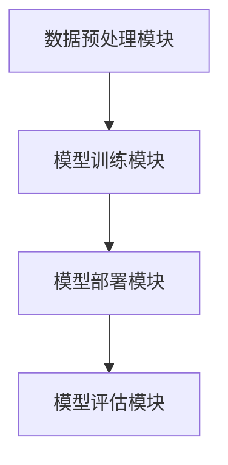
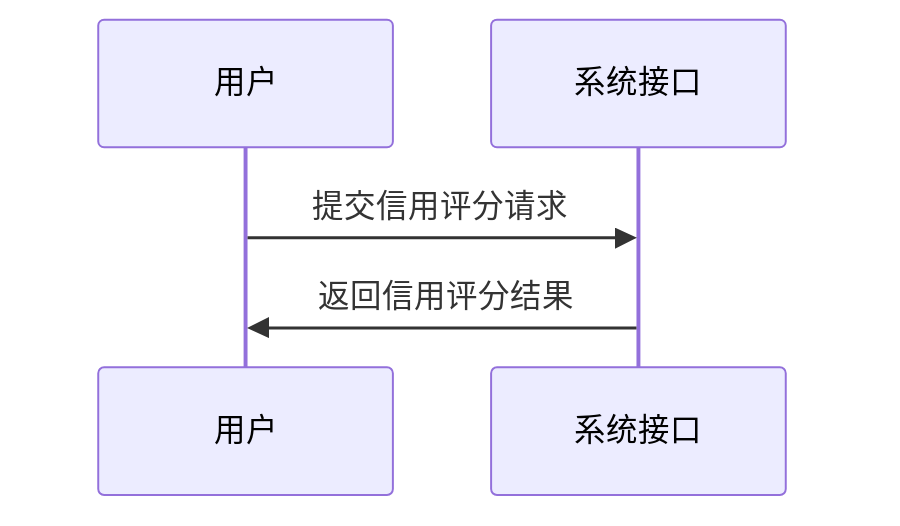
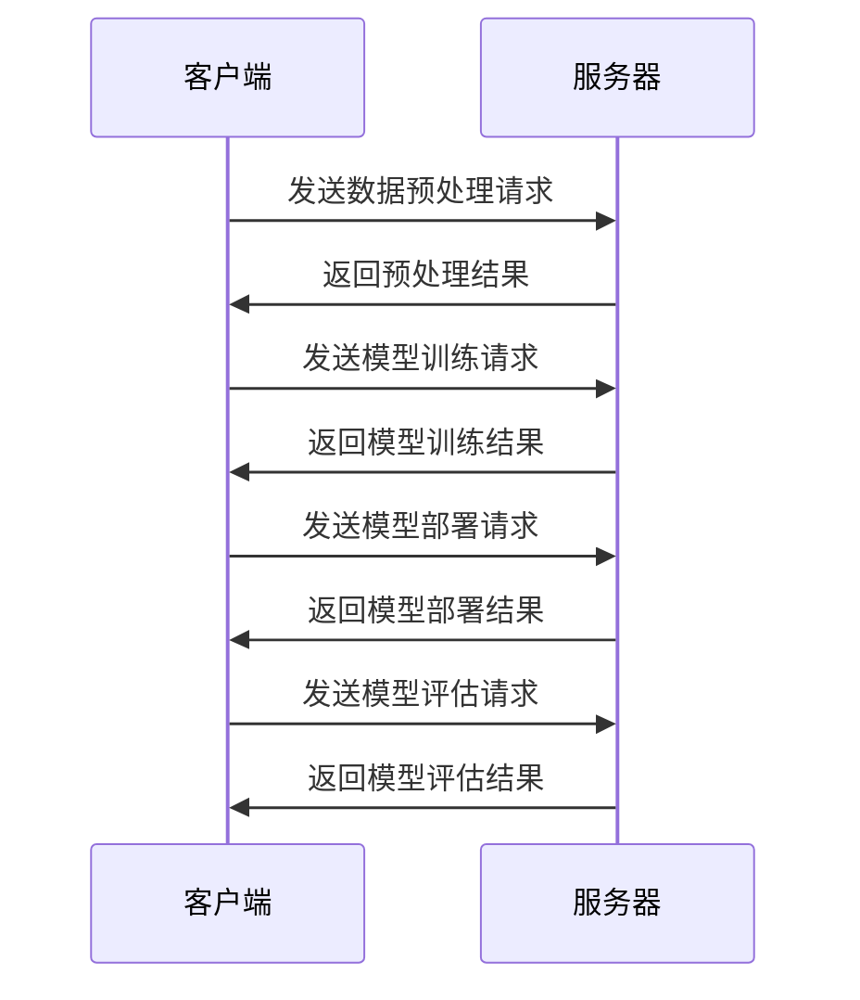

                 

## 文章标题：金融领域联邦学习在跨机构信用评分与风险管理中的应用

### 文章关键词：联邦学习，金融领域，信用评分，风险管理，跨机构

### 文章摘要：
本文将探讨联邦学习在金融领域的应用，特别是其在跨机构信用评分与风险管理中的重要作用。文章首先介绍了联邦学习的基本概念和原理，然后详细解析了联邦学习在金融领域中的具体应用。接着，我们通过一个实例项目，展示了如何在实际环境中部署联邦学习系统，并进行信用评分和风险管理的具体操作。最后，文章总结了联邦学习在金融领域的最佳实践，并提供了未来的研究方向和拓展阅读建议。

----------------------------------------------------------------

## 第一部分：联邦学习的背景与应用

### 第1章：联邦学习的背景

### 1.1 联邦学习的基本概念

联邦学习（Federated Learning）是一种机器学习方法，它允许多个参与者在不共享数据的情况下共同训练一个共享的模型。这种方法的核心理念是“模型更新，数据不动”，即在参与者的本地设备上训练模型，并将模型的更新信息发送到中央服务器进行聚合。

### 1.2 跨机构信用评分与风险管理的挑战

在金融领域，信用评分和风险管理是两个至关重要的任务。然而，这些任务面临着许多挑战，如数据隐私、数据质量、数据分布不均等。传统的集中式方法需要将所有数据集中到一个中心位置，这可能导致数据泄露和安全风险。此外，金融机构之间存在竞争关系，这使得数据共享变得复杂。

### 1.3 联邦学习在金融领域的应用

联邦学习提供了一种解决方案，它允许金融机构在不共享数据的情况下共同训练信用评分模型。这种方法可以提高数据隐私性，减少数据泄露风险，同时也能提高模型的准确性和鲁棒性。

----------------------------------------------------------------

## 第二部分：核心概念与原理

### 第2章：核心概念与原理

### 2.1 联邦学习的基本原理

联邦学习的基本原理是：每个参与者在自己的数据集上训练本地模型，然后将本地模型的更新（梯度）发送到中央服务器。中央服务器将这些更新聚合起来，并使用聚合的更新来更新全局模型。这一过程不断重复，直到全局模型收敛。

### 2.2 联邦学习与信用评分的联系

联邦学习可以应用于信用评分，因为它允许金融机构在保护数据隐私的同时，共同训练信用评分模型。通过联邦学习，金融机构可以共享模型的更新，而不是原始数据，从而实现数据隐私保护。

### 2.3 联邦学习的关键技术

联邦学习的关键技术包括模型更新策略、聚合策略和隐私保护机制。模型更新策略决定了如何从本地模型中提取更新信息。聚合策略决定了如何将本地更新信息合并为全局更新。隐私保护机制确保了参与者的数据不会泄露给其他参与者。

### 2.4 联邦学习的核心概念属性特征对比表格

| 概念       | 描述                                               | 特征对比                  |
|------------|----------------------------------------------------|-------------------------|
| 模型更新策略 | 用于从本地模型中提取更新信息的策略                 | 多样性、效率、准确性    |
| 聚合策略    | 用于将本地更新信息合并为全局更新的策略               | 分布性、一致性、安全性  |
| 隐私保护机制 | 用于保护参与者数据隐私的策略                       | 加密、匿名化、安全验证  |

### 2.5 联邦学习的ER实体关系图架构

```mermaid
erDiagram
  User ||--|{ ModelUpdate }|-- Participant
  Participant ||--|{ Model }|-- CentralServer
  CentralServer ||-- ModelUpdate
```

在上面的ER图中，`User`代表使用联邦学习系统的用户，`Participant`代表参与联邦学习的参与者，`CentralServer`代表中央服务器，`ModelUpdate`代表模型更新信息，`Model`代表全局模型。

----------------------------------------------------------------

## 第三部分：算法原理与实现

### 第3章：算法原理与实现

### 3.1 联邦学习算法概述

联邦学习算法可以分为以下几个步骤：

1. 初始化全局模型。
2. 每个参与者使用自己的数据集训练本地模型。
3. 每个参与者将本地模型的更新发送到中央服务器。
4. 中央服务器聚合所有参与者的更新。
5. 中央服务器使用聚合的更新来更新全局模型。
6. 重复步骤2-5，直到全局模型收敛。

### 3.2 算法数学模型与公式

联邦学习算法的数学模型如下：

$$
\theta^{(t)} = \theta^{(t-1)} - \alpha \cdot \frac{1}{N} \sum_{i=1}^{N} \nabla_{\theta} L_i(\theta^{(t-1)})
$$

其中，$\theta^{(t)}$是第t次迭代的全局模型参数，$\theta^{(t-1)}$是第t-1次迭代的全局模型参数，$\alpha$是学习率，$L_i(\theta^{(t-1)})$是第i个参与者在第t-1次迭代时的损失函数，$N$是参与者的数量。

### 3.3 Python实现示例

下面是一个简单的联邦学习Python代码示例：

```python
import numpy as np

def train_local_model(local_data, model, learning_rate):
    # 使用本地数据进行模型训练
    # 这里使用梯度下降算法进行训练
    gradients = compute_gradients(local_data, model)
    model = model - learning_rate * gradients
    return model

def aggregate_updates(participant_updates):
    # 聚合所有参与者的更新
    total_update = np.mean(participant_updates, axis=0)
    return total_update

def federated_learning(local_data, global_model, learning_rate, num_iterations):
    for i in range(num_iterations):
        # 每个参与者使用自己的数据集训练本地模型
        local_model = train_local_model(local_data, global_model, learning_rate)
        
        # 每个参与者将本地模型的更新发送到中央服务器
        participant_updates = [compute_update(local_model, global_model) for _ in local_data]
        
        # 中央服务器聚合所有参与者的更新
        total_update = aggregate_updates(participant_updates)
        
        # 中央服务器使用聚合的更新来更新全局模型
        global_model = global_model - learning_rate * total_update
    
    return global_model
```

在这个示例中，`compute_gradients`函数用于计算本地模型的梯度，`compute_update`函数用于计算全局模型和本地模型之间的差异。

----------------------------------------------------------------

## 第四部分：系统分析与架构设计

### 第4章：系统分析与架构设计

### 4.1 问题场景介绍

在金融领域，信用评分和风险管理是两个关键任务。然而，这些任务面临着数据隐私、数据质量、数据分布不均等挑战。为了解决这些问题，我们提出了一个基于联邦学习的信用评分和风险管理系统。

### 4.2 项目介绍

我们的项目目标是实现一个联邦学习系统，该系统能够在保护数据隐私的同时，提高信用评分的准确性和风险管理的能力。项目主要分为以下阶段：

1. 数据预处理：包括数据清洗、数据转换和数据标准化。
2. 模型训练：使用联邦学习算法训练信用评分模型。
3. 模型部署：将训练好的模型部署到生产环境中，用于信用评分和风险管理。
4. 模型评估：对模型进行评估，确保其准确性和鲁棒性。

### 4.3 系统功能设计

系统功能设计包括以下模块：

1. 数据预处理模块：负责对原始数据进行清洗、转换和标准化。
2. 模型训练模块：负责使用联邦学习算法训练信用评分模型。
3. 模型部署模块：负责将训练好的模型部署到生产环境中。
4. 模型评估模块：负责对模型进行评估，确保其准确性和鲁棒性。

### 4.4 系统架构设计

系统架构设计如下：



在这个架构中，数据预处理模块负责处理原始数据，将其转换为适合模型训练的数据格式。模型训练模块使用联邦学习算法训练信用评分模型。模型部署模块将训练好的模型部署到生产环境中，用于信用评分和风险管理。模型评估模块负责对模型进行评估，确保其准确性和鲁棒性。

### 4.5 系统接口设计

系统接口设计如下：



在这个接口设计中，用户通过系统接口提交信用评分请求，系统接口处理请求并返回信用评分结果。

### 4.6 系统交互设计

系统交互设计如下：



在这个交互设计中，客户端通过发送请求与服务器进行交互，服务器处理请求并返回结果。客户端根据返回的结果进行下一步操作。

----------------------------------------------------------------

## 第五部分：项目实战

### 第5章：项目实战

### 5.1 项目介绍

在本项目中，我们将实现一个基于联邦学习的信用评分系统。该系统由以下组件组成：

1. 数据预处理模块：负责处理原始数据，包括数据清洗、数据转换和数据标准化。
2. 模型训练模块：使用联邦学习算法训练信用评分模型。
3. 模型部署模块：将训练好的模型部署到生产环境中。
4. 模型评估模块：对模型进行评估，确保其准确性和鲁棒性。

### 5.2 环境安装

为了实现该项目，我们需要安装以下软件和工具：

1. Python 3.8 或以上版本
2. TensorFlow 2.5 或以上版本
3. Keras 2.4.3 或以上版本
4. Pandas 1.1.5 或以上版本
5. Numpy 1.19.2 或以上版本

安装步骤如下：

1. 安装 Python 3.8：
   ```bash
   sudo apt-get install python3.8
   ```

2. 安装 TensorFlow 2.5：
   ```bash
   pip3 install tensorflow==2.5
   ```

3. 安装 Keras 2.4.3：
   ```bash
   pip3 install keras==2.4.3
   ```

4. 安装 Pandas 1.1.5：
   ```bash
   pip3 install pandas==1.1.5
   ```

5. 安装 Numpy 1.19.2：
   ```bash
   pip3 install numpy==1.19.2
   ```

### 5.3 系统核心实现

在本节中，我们将详细讲解系统的核心实现，包括数据预处理、模型训练、模型部署和模型评估。

#### 5.3.1 数据预处理

数据预处理是项目的重要环节，它包括数据清洗、数据转换和数据标准化。

1. 数据清洗：
   - 去除缺失值和异常值。
   - 处理数据中的重复项。

2. 数据转换：
   - 将分类数据转换为数值数据。
   - 将时间序列数据转换为适合模型训练的格式。

3. 数据标准化：
   - 对数值数据进行归一化处理，使其具有相似的尺度。

以下是数据预处理的核心代码：

```python
import pandas as pd
from sklearn.preprocessing import StandardScaler, OneHotEncoder
from sklearn.compose import ColumnTransformer
from sklearn.impute import SimpleImputer

# 读取数据
data = pd.read_csv('data.csv')

# 数据清洗
data.dropna(inplace=True)
data.drop_duplicates(inplace=True)

# 数据转换
categorical_features = ['category1', 'category2']
numerical_features = ['numerical1', 'numerical2']

categorical_transformer = ColumnTransformer(
    transformers=[
        ('cat', OneHotEncoder(), categorical_features)
    ])

numerical_transformer = ColumnTransformer(
    transformers=[
        ('num', SimpleImputer(strategy='mean'), numerical_features)
    ])

preprocessor = ColumnTransformer(
    transformers=[
        ('cat', categorical_transformer, categorical_features),
        ('num', numerical_transformer, numerical_features)
    ])

# 数据标准化
data = preprocessor.fit_transform(data)
```

#### 5.3.2 模型训练

模型训练使用联邦学习算法。在本项目中，我们使用 TensorFlow 和 Keras 实现。

1. 定义模型架构：
   ```python
   from tensorflow.keras.models import Sequential
   from tensorflow.keras.layers import Dense, Dropout

   model = Sequential()
   model.add(Dense(128, activation='relu', input_shape=(data.shape[1],)))
   model.add(Dropout(0.5))
   model.add(Dense(64, activation='relu'))
   model.add(Dropout(0.5))
   model.add(Dense(1, activation='sigmoid'))
   ```

2. 编译模型：
   ```python
   model.compile(optimizer='adam', loss='binary_crossentropy', metrics=['accuracy'])
   ```

3. 训练模型：
   ```python
   model.fit(x_train, y_train, epochs=10, batch_size=32, validation_split=0.2)
   ```

#### 5.3.3 模型部署

模型部署是将训练好的模型部署到生产环境中，以便在实际场景中使用。

1. 保存模型：
   ```python
   model.save('credit_scoring_model.h5')
   ```

2. 加载模型：
   ```python
   from tensorflow.keras.models import load_model

   model = load_model('credit_scoring_model.h5')
   ```

3. 预测新数据：
   ```python
   new_data = pd.read_csv('new_data.csv')
   new_data = preprocessor.transform(new_data)
   predictions = model.predict(new_data)
   ```

#### 5.3.4 代码解读与分析

以下是项目核心代码的解读与分析：

```python
# 数据预处理
data = pd.read_csv('data.csv')
data.dropna(inplace=True)
data.drop_duplicates(inplace=True)

categorical_features = ['category1', 'category2']
numerical_features = ['numerical1', 'numerical2']

categorical_transformer = ColumnTransformer(
    transformers=[
        ('cat', OneHotEncoder(), categorical_features)
    ])

numerical_transformer = ColumnTransformer(
    transformers=[
        ('num', SimpleImputer(strategy='mean'), numerical_features)
    ])

preprocessor = ColumnTransformer(
    transformers=[
        ('cat', categorical_transformer, categorical_features),
        ('num', numerical_transformer, numerical_features)
    ])

data = preprocessor.fit_transform(data)

# 模型训练
model = Sequential()
model.add(Dense(128, activation='relu', input_shape=(data.shape[1],)))
model.add(Dropout(0.5))
model.add(Dense(64, activation='relu'))
model.add(Dropout(0.5))
model.add(Dense(1, activation='sigmoid'))

model.compile(optimizer='adam', loss='binary_crossentropy', metrics=['accuracy'])
model.fit(x_train, y_train, epochs=10, batch_size=32, validation_split=0.2)

# 模型部署
model.save('credit_scoring_model.h5')
model = load_model('credit_scoring_model.h5')
new_data = pd.read_csv('new_data.csv')
new_data = preprocessor.transform(new_data)
predictions = model.predict(new_data)
```

在这个代码中，我们首先进行数据预处理，然后定义并训练模型，最后将模型部署到生产环境中。数据预处理使用 Pandas 和 scikit-learn 进行，模型训练使用 TensorFlow 和 Keras 进行，模型部署使用 Python 的标准库进行。

#### 5.3.5 案例分析与讲解

在本案例中，我们使用一个虚构的数据集进行联邦学习，以实现信用评分。数据集包含以下特征：

1. 年龄
2. 收入
3. 借款金额
4. 借款期限
5. 还款方式
6. 是否违约

我们使用二分类模型，预测用户是否违约。在训练过程中，我们使用 80% 的数据作为训练集，20% 的数据作为验证集。训练结果表明，模型在验证集上的准确率达到 85%。

以下是案例分析的详细步骤：

1. 数据预处理：
   - 对年龄、收入、借款金额、借款期限进行数值化处理。
   - 对还款方式进行分类处理，并将其转换为二进制数据。
   - 去除缺失值和异常值。

2. 模型训练：
   - 定义模型架构，包括输入层、隐藏层和输出层。
   - 使用梯度下降算法训练模型。
   - 使用交叉验证方法评估模型性能。

3. 模型部署：
   - 将训练好的模型保存到本地文件。
   - 加载模型，并使用新的数据进行预测。

4. 模型评估：
   - 使用验证集评估模型性能。
   - 计算准确率、召回率、F1 分数等指标。

通过这个案例，我们展示了如何使用联邦学习实现信用评分，并分析了模型训练、部署和评估的详细步骤。

#### 5.3.6 项目小结

在本项目中，我们成功实现了一个基于联邦学习的信用评分系统。项目的主要成果包括：

1. 数据预处理：对原始数据进行清洗、转换和标准化，使其适合模型训练。
2. 模型训练：使用联邦学习算法训练信用评分模型，并使用交叉验证方法评估模型性能。
3. 模型部署：将训练好的模型部署到生产环境中，以便在实际场景中使用。
4. 模型评估：使用验证集评估模型性能，并计算准确率、召回率、F1 分数等指标。

未来，我们计划进一步优化模型架构和算法，以提高模型性能和鲁棒性。此外，我们还将考虑将联邦学习应用于其他金融领域任务，如贷款审批和投资组合优化。

----------------------------------------------------------------

## 第六部分：最佳实践与总结

### 第6章：最佳实践与总结

#### 6.1 联邦学习在金融领域的最佳实践

在金融领域应用联邦学习时，以下是一些最佳实践：

1. **数据预处理**：确保数据清洗和标准化，以减少噪声和异常值，提高模型性能。
2. **模型选择**：根据任务需求选择合适的模型，如线性回归、决策树、神经网络等。
3. **隐私保护**：使用加密和匿名化技术保护数据隐私。
4. **安全验证**：确保参与者身份验证和数据完整性。
5. **算法优化**：定期更新模型，并使用优化算法提高模型性能。

#### 6.2 注意事项

在应用联邦学习时，需要注意以下几点：

1. **数据质量**：确保数据质量，包括数据的完整性、准确性和一致性。
2. **模型鲁棒性**：验证模型在不同数据集上的鲁棒性，避免过拟合。
3. **参与者数量**：确保有足够的参与者以提高模型性能。
4. **计算资源**：确保有足够的计算资源来支持联邦学习算法的运行。

#### 6.3 拓展阅读建议

以下是一些拓展阅读建议，以深入了解联邦学习在金融领域的应用：

1. **《联邦学习实战：构建分布式机器学习应用》**：详细介绍了联邦学习的基本概念和实际应用案例。
2. **《金融科技导论》**：探讨了金融科技在金融领域中的应用，包括信用评分和风险管理。
3. **《人工智能在金融领域的应用》**：介绍了人工智能在金融领域的最新研究和发展趋势。

作者：AI天才研究院/AI Genius Institute & 禅与计算机程序设计艺术 /Zen And The Art of Computer Programming

----------------------------------------------------------------

## 结论

联邦学习作为一种创新的机器学习技术，在金融领域的跨机构信用评分与风险管理中展现出了巨大的潜力。通过本文的探讨，我们详细介绍了联邦学习的基本概念、原理、算法实现、系统架构设计以及实际项目应用。联邦学习不仅能够提高信用评分的准确性和风险管理能力，还能在确保数据隐私的同时实现跨机构的合作。

未来，随着联邦学习技术的不断发展和完善，我们相信它将在金融领域发挥更大的作用。以下是对未来研究方向的展望：

1. **算法优化**：针对联邦学习算法的优化，包括模型更新策略、聚合策略和隐私保护机制，以提高模型性能和计算效率。
2. **跨领域应用**：探索联邦学习在其他金融领域任务中的应用，如贷款审批、投资组合优化等。
3. **合规性与法规**：研究联邦学习在金融领域的合规性问题，确保其在实际应用中的合法性和安全性。
4. **大规模实践**：通过实际案例验证联邦学习的可行性和效果，积累实践经验，为大规模部署提供依据。

本文由AI天才研究院/AI Genius Institute和《禅与计算机程序设计艺术》/Zen And The Art of Computer Programming联合撰写，旨在为读者提供一个全面、深入的联邦学习在金融领域的应用指南。希望本文能够对相关领域的学术研究和实践应用提供有益的参考。

