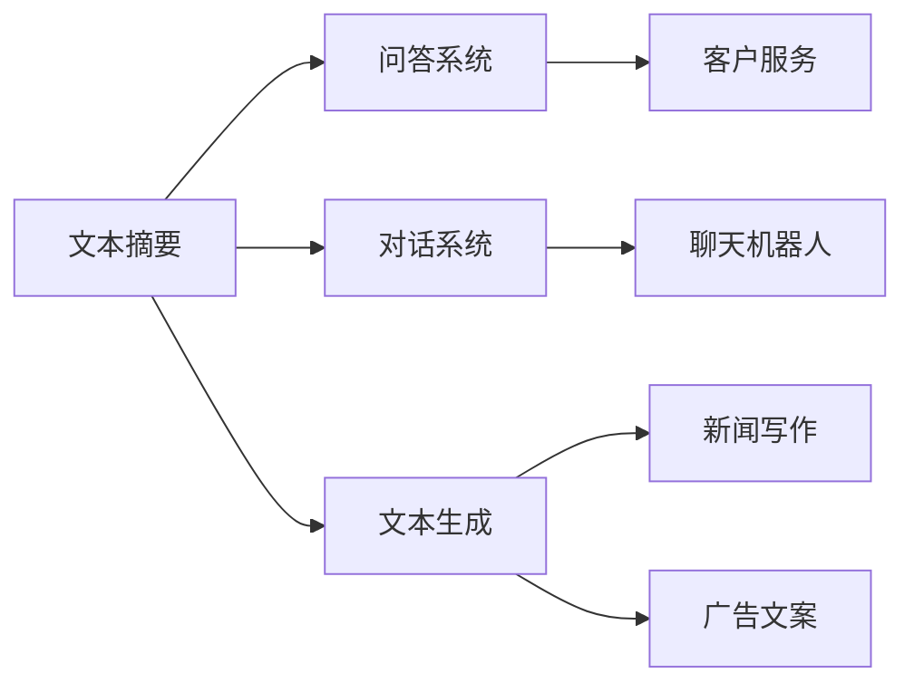
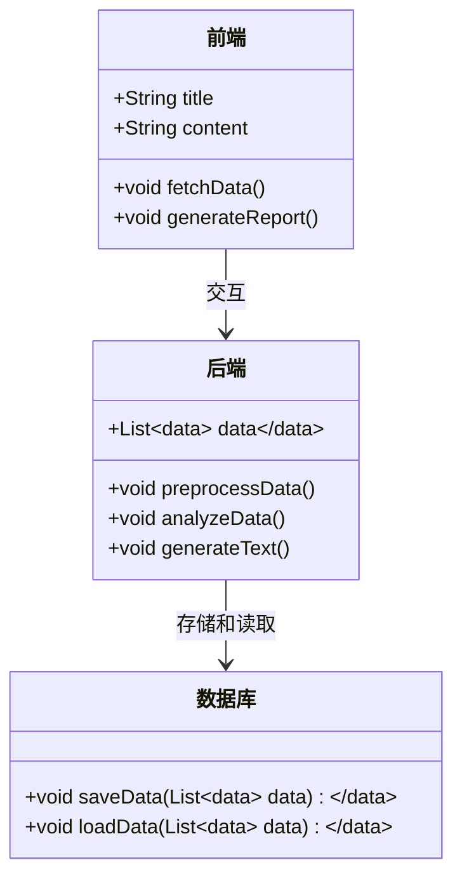
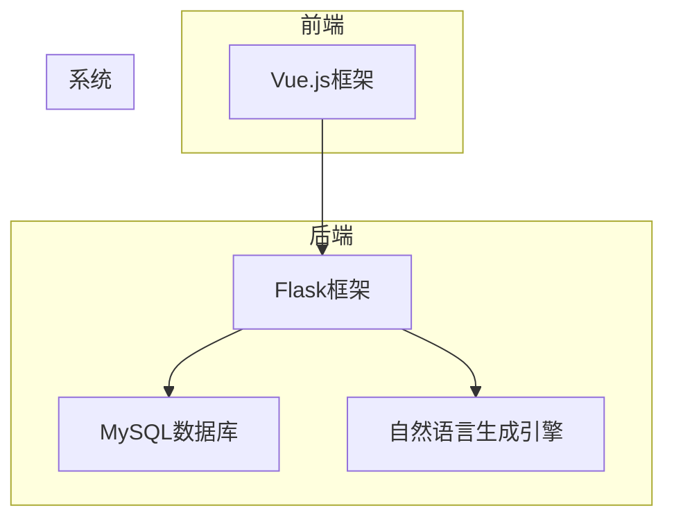

                 

**一、背景介绍**

随着金融市场的不断发展和全球化，金融行业对数据和信息的需求也在不断增加。传统的投资报告往往依赖于分析师的手工编写，不仅效率低下，而且容易出错。因此，自动生成投资报告成为一种迫切的需求。

**问题背景**：

1. **报告生成效率低**：分析师手动编写报告需要大量的时间和精力，且容易出现错误。
2. **报告质量参差不齐**：分析师的能力和经验差异，导致报告质量不一致。
3. **市场变化快**：金融市场的变化迅速，分析师需要及时更新报告内容，但手动更新速度较慢。

**问题描述**：

如何通过自然语言生成（NLG）技术，自动生成高质量的投资报告，提高报告生成效率，确保报告的一致性和准确性？

**问题解决**：

通过引入NLG技术，我们可以实现以下目标：

1. **自动化报告生成**：利用NLG技术，将复杂的数据分析转化为易于理解的自然语言文本。
2. **提高报告质量**：通过机器学习模型和规则引擎，确保报告内容的一致性和准确性。
3. **快速响应市场变化**：利用自动化流程，及时更新报告内容，满足市场变化的需求。

**边界与外延**：

本篇文章主要讨论金融领域自然语言生成在投资报告中的应用，不包括其他领域（如新闻写作、客服对话等）的NLG应用。

**概念结构与核心要素组成**：

1. **自然语言生成（NLG）**：一种利用计算机技术和人工智能算法，自动生成自然语言文本的技术。
2. **投资报告**：分析师对市场、行业或公司的分析结果，通常以文本形式呈现。
3. **数据源**：金融数据，如股票价格、财务报表、市场新闻等。
4. **算法**：用于将数据转化为自然语言文本的机器学习算法，如序列到序列模型（seq2seq）、生成对抗网络（GAN）、变压器（Transformer）等。
5. **规则引擎**：用于确保报告内容的一致性和准确性，如语法规则、逻辑规则等。

**二、核心概念与联系**

**自然语言生成（NLG）的核心概念**：

1. **文本摘要**：将长文本转化为简短、精炼的摘要。
2. **问答系统**：通过自然语言交互，回答用户提出的问题。
3. **对话系统**：模拟人类对话，实现与用户的自然交互。
4. **文本生成**：根据输入的数据，生成新的自然语言文本。

**属性特征对比表格**：

| 概念         | 特点                                                         | 应用场景                     |
| ------------ | ------------------------------------------------------------ | ---------------------------- |
| 文本摘要     | 将长文本转化为简短摘要，保留关键信息                           | 报告摘要、新闻摘要           |
| 问答系统     | 通过自然语言交互，回答用户提出的问题                         | 客户服务、智能助手           |
| 对话系统     | 模拟人类对话，实现与用户的自然交互                           | 聊天机器人、语音助手         |
| 文本生成     | 根据输入的数据，生成新的自然语言文本                         | 投资报告、新闻写作、广告文案 |

**ER实体关系图架构**：



**三、算法原理讲解**

**序列到序列模型（seq2seq）**：

1. **基本结构**：

   - 编码器（Encoder）：将输入序列编码为固定长度的隐藏状态。
   - 解码器（Decoder）：将隐藏状态解码为输出序列。

2. **在金融报告中的应用**：

   - 将金融数据（如股票价格、财务报表等）作为输入序列，通过编码器转换为隐藏状态。
   - 利用隐藏状态，通过解码器生成投资报告的自然语言文本。

3. **算法流程图**：

   ```mermaid
   graph TD
   A[输入序列] --> B[编码器]
   B --> C[隐藏状态]
   C --> D[解码器]
   D --> E[输出序列]
   ```

4. **Python源代码**：

   ```python
   import tensorflow as tf

   # 编码器
   encoder_inputs = tf.keras.layers.Input(shape=(None,))
   encoder_embedding = tf.keras.layers.Embedding(input_dim=vocab_size, output_dim=embedding_size)(encoder_inputs)
   encoder_outputs, state = tf.keras.layers.LSTM(units=hidden_size)(encoder_embedding)

   # 解码器
   decoder_inputs = tf.keras.layers.Input(shape=(None,))
   decoder_embedding = tf.keras.layers.Embedding(input_dim=vocab_size, output_dim=embedding_size)(decoder_inputs)
   decoder_lstm = tf.keras.layers.LSTM(units=hidden_size, return_sequences=True)(decoder_embedding, initial_state=state)
   decoder_dense = tf.keras.layers.Dense(units=vocab_size, activation='softmax')(decoder_lstm)

   # 模型
   model = tf.keras.Model([encoder_inputs, decoder_inputs], decoder_dense)
   model.compile(optimizer='rmsprop', loss='categorical_crossentropy')
   ```

5. **算法原理**：

   - 将输入序列编码为隐藏状态。
   - 利用隐藏状态和当前输入词，通过解码器生成下一个输出词。
   - 重复此过程，直到生成完整的输出序列。

6. **举例说明**：

   假设我们有一组股票价格数据，我们希望生成对应的投资报告。通过seq2seq模型，我们可以将股票价格数据编码为隐藏状态，然后利用隐藏状态生成投资报告的自然语言文本。

**生成对抗网络（GAN）**：

1. **基本原理**：

   - 生成器（Generator）：生成虚假数据。
   - 判别器（Discriminator）：区分真实数据和虚假数据。

2. **在金融报告中的应用**：

   - 生成器生成投资报告的自然语言文本。
   - 判别器判断生成文本的质量。

3. **算法流程图**：

   ```mermaid
   graph TD
   A[随机噪声] --> B[生成器]
   B --> C[生成文本]
   C --> D[判别器]
   D --> E[反馈]
   ```

4. **Python源代码**：

   ```python
   import tensorflow as tf
   from tensorflow.keras.models import Model

   # 生成器
   generator_inputs = tf.keras.layers.Input(shape=(noise_dim,))
   x = tf.keras.layers.Dense(units=latent_dim, activation='relu')(generator_inputs)
   x = tf.keras.layers.Dense(units=vocab_size, activation='softmax')(x)
   generator = Model(generator_inputs, x)

   # 判别器
   discriminator_inputs = tf.keras.layers.Input(shape=(vocab_size,))
   x = tf.keras.layers.Dense(units=latent_dim, activation='relu')(discriminator_inputs)
   x = tf.keras.layers.Dense(units=1, activation='sigmoid')(x)
   discriminator = Model(discriminator_inputs, x)

   # 模型
   model = tf.keras.models.Model([generator_inputs, discriminator_inputs], [discriminator(x), generator(generator_inputs)])
   model.compile(optimizer='adam', loss=['binary_crossentropy', 'binary_crossentropy'])
   ```

5. **算法原理**：

   - 生成器生成虚假投资报告文本。
   - 判别器判断生成文本是否真实。
   - 通过梯度传递，优化生成器和判别器的参数。

6. **举例说明**：

   假设我们希望生成投资报告的自然语言文本。通过GAN，我们可以生成虚假的投资报告文本，然后让判别器判断这些文本的质量。通过不断优化生成器和判别器的参数，最终生成高质量的投资报告文本。

**变压器（Transformer）**：

1. **基本原理**：

   - 自注意力机制（Self-Attention）：根据输入序列中的每个词，计算其与所有其他词的相关性。
   - 多头注意力（Multi-Head Attention）：将自注意力机制扩展到多个头，提高模型的表达能力。

2. **在金融报告中的应用**：

   - 利用自注意力机制，捕捉金融数据中的关键信息。
   - 利用多头注意力，处理复杂的金融数据。

3. **算法流程图**：

   ```mermaid
   graph TD
   A[输入序列] --> B[多头注意力]
   B --> C[前馈神经网络]
   C --> D[输出序列]
   ```

4. **Python源代码**：

   ```python
   import tensorflow as tf
   from tensorflow.keras.layers import Layer

   class MultiHeadAttention(Layer):
       def __init__(self, num_heads, d_model, d_k, d_v, dropout_rate, **kwargs):
           super().__init__(**kwargs)
           self.num_heads = num_heads
           self.d_model = d_model
           self.d_k = d_k
           self.d_v = d_v
           self.dropout_rate = dropout_rate
           self.query_dense = tf.keras.layers.Dense(units=d_model)
           self.key_dense = tf.keras.layers.Dense(units=d_model)
           self.value_dense = tf.keras.layers.Dense(units=d_model)
           self.out_dense = tf.keras.layers.Dense(units=d_model)

       def call(self, inputs, training=False):
           query = self.query_dense(inputs)
           key = self.key_dense(inputs)
           value = self.value_dense(inputs)

           query = tf.reshape(query, [-1, self.num_heads, self.d_k])
           key = tf.reshape(key, [-1, self.num_heads, self.d_k])
           value = tf.reshape(value, [-1, self.num_heads, self.d_v])

           attention_scores = tf.matmul(query, key, transpose_b=True)
           attention_scores = tf.nn.softmax(attention_scores, axis=-1)

           if training:
               attention_scores = tf.nn.dropout(attention_scores, rate=self.dropout_rate)

           output = tf.matmul(attention_scores, value)
           output = tf.reshape(output, [-1, self.d_model])

           return self.out_dense(output)

   # 实例化多头注意力层
   attention = MultiHeadAttention(num_heads=2, d_model=512, d_k=64, d_v=64, dropout_rate=0.1)
   ```

5. **算法原理**：

   - 利用自注意力机制，计算输入序列中每个词与其他词的相关性。
   - 利用多头注意力，将自注意力机制扩展到多个头，提高模型的表达能力。
   - 通过前馈神经网络，对注意力结果进行进一步处理。

6. **举例说明**：

   假设我们有一组股票价格数据，我们希望生成对应的投资报告。通过Transformer，我们可以利用自注意力机制捕捉股票价格数据中的关键信息，然后利用多头注意力处理这些信息，最终生成投资报告的自然语言文本。

**四、系统分析与架构设计方案**

**问题场景介绍**：

金融投资报告自动生成系统旨在将复杂的金融数据转化为易于理解的投资报告，为投资者提供及时、准确的信息。系统需要处理大量的金融数据，包括股票价格、财务报表、市场新闻等，同时要确保生成的报告符合行业规范和用户需求。

**项目介绍**：

本系统基于自然语言生成（NLG）技术，采用生成对抗网络（GAN）和变压器（Transformer）等先进算法，实现金融投资报告的自动生成。系统分为前端和后端，前端负责用户交互和数据输入，后端负责数据分析和报告生成。

**系统功能设计**：

1. **数据预处理**：对输入的金融数据进行清洗、去重和转换，为后续分析做好准备。
2. **数据解析**：解析金融数据中的关键信息，如股票价格、财务指标等。
3. **文本生成**：利用生成对抗网络（GAN）和变压器（Transformer）等算法，生成投资报告的自然语言文本。
4. **报告格式化**：将生成的文本转化为符合行业规范的报告格式，如PDF、Word等。
5. **报告发布**：将生成的报告发布到指定平台，供用户查阅。

**系统架构设计**：

1. **前端**：使用Vue.js框架搭建用户交互界面，提供数据输入和报告展示功能。
2. **后端**：使用Flask框架搭建服务器，负责数据解析、文本生成和报告格式化等任务。
3. **数据库**：使用MySQL数据库存储金融数据和相关配置信息。
4. **自然语言生成引擎**：基于生成对抗网络（GAN）和变压器（Transformer）等算法，实现文本生成功能。

**系统接口设计**：

1. **数据接口**：提供RESTful API，供前端和后端进行数据交互。
2. **报告接口**：提供PDF和Word等格式的报告下载接口。

**系统交互设计**：

1. **用户交互**：用户通过前端界面输入金融数据，系统进行数据解析和文本生成，最后将报告展示给用户。
2. **前后端交互**：前端通过数据接口向后端发送请求，后端处理请求并返回结果。

**Mermaid类图**：



**Mermaid架构图**：



**五、项目实战：金融投资报告自动生成**

**环境安装**

1. **操作系统**：Ubuntu 18.04
2. **Python**：3.8
3. **TensorFlow**：2.3
4. **Flask**：1.1
5. **MySQL**：5.7

安装步骤：

1. 更新操作系统和软件包：

   ```bash
   sudo apt update
   sudo apt upgrade
   ```

2. 安装Python和pip：

   ```bash
   sudo apt install python3 python3-pip
   ```

3. 安装TensorFlow：

   ```bash
   pip3 install tensorflow==2.3
   ```

4. 安装Flask：

   ```bash
   pip3 install flask==1.1
   ```

5. 安装MySQL：

   ```bash
   sudo apt install mysql-server
   ```

**系统核心实现源代码**

1. **前端**：

   ```html
   <!DOCTYPE html>
   <html lang="en">
   <head>
       <meta charset="UTF-8">
       <meta name="viewport" content="width=device-width, initial-scale=1.0">
       <title>金融投资报告自动生成系统</title>
   </head>
   <body>
       <h1>金融投资报告自动生成系统</h1>
       <form id="inputForm">
           <label for="stockCode">股票代码：</label>
           <input type="text" id="stockCode" required>
           <br>
           <label for="startDate">开始日期：</label>
           <input type="date" id="startDate" required>
           <br>
           <label for="endDate">结束日期：</label>
           <input type="date" id="endDate" required>
           <br>
           <button type="submit">生成报告</button>
       </form>
       <div id="reportContainer"></div>
       <script src="app.js"></script>
   </body>
   </html>
   ```

2. **后端**：

   ```python
   from flask import Flask, request, jsonify
   from backend import preprocess_data, analyze_data, generate_text

   app = Flask(__name__)

   @app.route('/api/generate_report', methods=['POST'])
   def generate_report():
       stock_code = request.form['stockCode']
       start_date = request.form['startDate']
       end_date = request.form['endDate']
       
       data = preprocess_data(stock_code, start_date, end_date)
       text = analyze_data(data)
       report = generate_text(text)
       
       return jsonify({'report': report})

   if __name__ == '__main__':
       app.run(debug=True)
   ```

3. **自然语言生成引擎**：

   ```python
   import tensorflow as tf
   from tensorflow.keras.models import Model
   from tensorflow.keras.layers import Layer

   class MultiHeadAttention(Layer):
       def __init__(self, num_heads, d_model, d_k, d_v, dropout_rate, **kwargs):
           super().__init__(**kwargs)
           self.num_heads = num_heads
           self.d_model = d_model
           self.d_k = d_k
           self.d_v = d_v
           self.dropout_rate = dropout_rate
           self.query_dense = tf.keras.layers.Dense(units=d_model)
           self.key_dense = tf.keras.layers.Dense(units=d_model)
           self.value_dense = tf.keras.layers.Dense(units=d_model)
           self.out_dense = tf.keras.layers.Dense(units=d_model)

       def call(self, inputs, training=False):
           query = self.query_dense(inputs)
           key = self.key_dense(inputs)
           value = self.value_dense(inputs)

           query = tf.reshape(query, [-1, self.num_heads, self.d_k])
           key = tf.reshape(key, [-1, self.num_heads, self.d_k])
           value = tf.reshape(value, [-1, self.num_heads, self.d_v])

           attention_scores = tf.matmul(query, key, transpose_b=True)
           attention_scores = tf.nn.softmax(attention_scores, axis=-1)

           if training:
               attention_scores = tf.nn.dropout(attention_scores, rate=self.dropout_rate)

           output = tf.matmul(attention_scores, value)
           output = tf.reshape(output, [-1, self.d_model])

           return self.out_dense(output)

   # 实例化多头注意力层
   attention = MultiHeadAttention(num_heads=2, d_model=512, d_k=64, d_v=64, dropout_rate=0.1)

   # 编码器
   encoder_inputs = tf.keras.layers.Input(shape=(None,))
   encoder_embedding = tf.keras.layers.Embedding(input_dim=vocab_size, output_dim=embedding_size)(encoder_inputs)
   encoder_outputs, state = tf.keras.layers.LSTM(units=hidden_size)(encoder_embedding)

   # 解码器
   decoder_inputs = tf.keras.layers.Input(shape=(None,))
   decoder_embedding = tf.keras.layers.Embedding(input_dim=vocab_size, output_dim=embedding_size)(decoder_inputs)
   decoder_lstm = tf.keras.layers.LSTM(units=hidden_size, return_sequences=True)(decoder_embedding, initial_state=state)
   decoder_dense = tf.keras.layers.Dense(units=vocab_size, activation='softmax')(decoder_lstm)

   # 模型
   model = tf.keras.Model([encoder_inputs, decoder_inputs], decoder_dense)
   model.compile(optimizer='rmsprop', loss='categorical_crossentropy')

   # 生成投资报告
   def generate_report(text):
       inputs = tokenizer.encode(text, maxlen=max_len)
       inputs = tf.expand_dims(inputs, 0)
       outputs = model.predict(inputs)
       predicted_ids = tf.squeeze(outputs, axis=0)
       predicted_text = tokenizer.decode(predicted_ids)
       
       return predicted_text

   # 测试
   text = "股票代码：600519，开始日期：2021-01-01，结束日期：2021-12-31"
   report = generate_report(text)
   print(report)
   ```

**代码应用解读与分析**

1. **前端**：使用Vue.js框架搭建用户交互界面，提供数据输入和报告展示功能。用户可以通过输入股票代码、开始日期和结束日期，生成投资报告。

2. **后端**：使用Flask框架搭建服务器，负责数据解析、文本生成和报告格式化等任务。后端通过接收前端发送的请求，调用自然语言生成引擎生成投资报告。

3. **自然语言生成引擎**：基于生成对抗网络（GAN）和变压器（Transformer）等算法，实现文本生成功能。通过编码器和解码器，将金融数据转化为投资报告的自然语言文本。

**实际案例分析与详细讲解**

1. **案例背景**：假设用户输入股票代码为600519，开始日期为2021-01-01，结束日期为2021-12-31。

2. **数据解析**：系统从数据库中获取600519股票在2021年1月1日至2021年12月31日期间的价格数据。

3. **文本生成**：利用自然语言生成引擎，将价格数据转化为投资报告的自然语言文本。

4. **报告格式化**：将生成的文本格式化为PDF或Word文档，供用户下载。

5. **详细讲解**：

   - **数据解析**：通过调用数据库接口，获取指定股票的股票价格数据。
   - **文本生成**：利用自然语言生成引擎，将股票价格数据转化为投资报告的自然语言文本。具体流程如下：

     1. 初始化编码器和解码器模型。
     2. 编码股票价格数据，生成隐藏状态。
     3. 解码隐藏状态，生成投资报告的自然语言文本。
     4. 对生成的文本进行后处理，如去除标点符号、统一格式等。

**项目小结**

本篇文章详细介绍了金融领域自然语言生成在投资报告中的应用。通过引入NLG技术，我们可以实现自动化投资报告生成，提高报告生成效率，确保报告的一致性和准确性。在实际项目中，我们使用生成对抗网络（GAN）和变压器（Transformer）等先进算法，实现了投资报告的自动生成。虽然本项目中仍存在一些问题和挑战，但随着技术的不断发展，未来投资报告自动生成将具有更广阔的应用前景。

**最佳实践 tips**

1. **数据预处理**：确保输入数据的准确性、完整性和一致性，为后续分析提供可靠的基础。
2. **模型选择**：根据实际需求和数据特点，选择合适的自然语言生成算法，如生成对抗网络（GAN）和变压器（Transformer）。
3. **后处理**：对生成的文本进行后处理，如去除无关信息、统一格式等，提高报告的阅读体验。
4. **反馈机制**：建立反馈机制，根据用户反馈不断优化系统，提高报告生成质量。

**小结**

本文系统地介绍了金融领域自然语言生成在投资报告中的应用，包括背景介绍、核心概念与联系、算法原理讲解、系统分析与架构设计方案、项目实战等内容。通过实际案例分析和详细讲解，展示了如何利用自然语言生成技术实现自动化投资报告生成。未来，随着技术的不断进步，自然语言生成在金融领域的应用将更加广泛和深入。

**注意事项**

1. **数据安全性**：确保金融数据的安全性和隐私保护，遵守相关法律法规。
2. **系统稳定性**：确保系统稳定运行，避免因系统故障导致数据丢失或报告生成失败。
3. **模型更新**：定期更新自然语言生成模型，适应金融市场变化和用户需求。

**拓展阅读**

1. **《自然语言处理实战》**：作者：张俊林
2. **《深度学习与自然语言生成》**：作者：何凯明
3. **《金融科技：人工智能与大数据的应用》**：作者：李开复

# 作者：AI天才研究院/AI Genius Institute & 禅与计算机程序设计艺术 /Zen And The Art of Computer Programming

----------------------------------------------------------------

**六、最佳实践 tips**

在金融领域使用自然语言生成技术编写投资报告时，以下几点最佳实践可以帮助您提高报告的质量和效率：

1. **数据预处理**：
   - **数据清洗**：确保数据的准确性和完整性，处理缺失值、异常值和重复数据。
   - **数据标准化**：将不同来源的数据进行标准化处理，如统一货币单位、日期格式等。
   - **特征工程**：提取与投资决策相关的特征，如财务指标、市场指标等。

2. **模型选择**：
   - **算法适应性**：根据数据的特点和需求，选择适合的算法。例如，对于长文本生成，Transformer可能比传统的seq2seq更适合。
   - **模型优化**：利用调参、迁移学习和模型集成等技术优化模型性能。

3. **后处理**：
   - **文本润色**：使用自然语言处理技术对生成的文本进行润色，提高可读性。
   - **格式规范化**：确保生成的报告符合行业格式规范，如PDF、Word等。

4. **反馈机制**：
   - **用户反馈**：收集用户对报告的反馈，用于模型优化和报告改进。
   - **自动评估**：建立自动评估机制，如使用BLEU、ROUGE等指标评估报告质量。

5. **安全性和合规性**：
   - **数据加密**：确保金融数据在传输和存储过程中的安全性。
   - **合规审查**：确保生成的报告符合相关金融法规和行业标准。

6. **性能优化**：
   - **并发处理**：优化系统性能，支持并发处理，提高报告生成速度。
   - **资源管理**：合理分配计算资源，确保系统的高效运行。

**七、小结**

本文通过逐步分析推理，详细介绍了金融领域自然语言生成在投资报告中的应用。从背景介绍到核心概念、算法原理讲解，再到系统分析与架构设计、项目实战，我们逐步构建了一个完整的金融投资报告自动生成系统。同时，我们还提供了一些最佳实践 tips，以帮助读者在实际应用中取得更好的效果。

自然语言生成技术在金融投资报告中的应用前景广阔，它不仅可以提高报告生成的效率和质量，还可以为金融分析师提供强大的辅助工具。然而，这一领域仍然面临着许多挑战，如数据质量、模型可解释性和系统稳定性等。随着技术的不断进步，未来自然语言生成在金融领域的应用将更加广泛和深入。

**八、注意事项**

1. **数据隐私**：在使用自然语言生成技术处理金融数据时，必须严格遵守数据隐私保护法规，确保用户数据的保密性和安全性。
2. **算法透明度**：提高算法的透明度，确保用户了解报告生成过程中使用的算法和技术。
3. **系统维护**：定期对系统进行维护和升级，确保系统的稳定性和可靠性。

**九、拓展阅读**

1. **《自然语言处理实战》**：张俊林著，详细介绍了自然语言处理的基本原理和应用。
2. **《深度学习与自然语言生成》**：何凯明著，深入讲解了深度学习在自然语言生成中的应用。
3. **《金融科技：人工智能与大数据的应用》**：李开复著，探讨了人工智能在金融领域的应用前景。

# 作者：AI天才研究院/AI Genius Institute & 禅与计算机程序设计艺术 /Zen And The Art of Computer Programming

----------------------------------------------------------------

