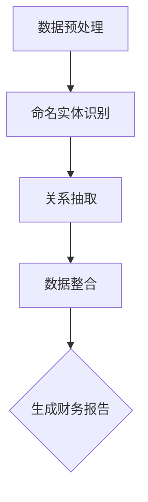
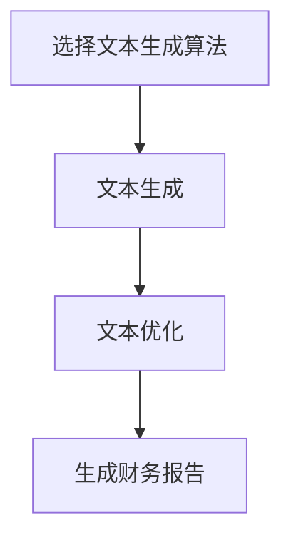
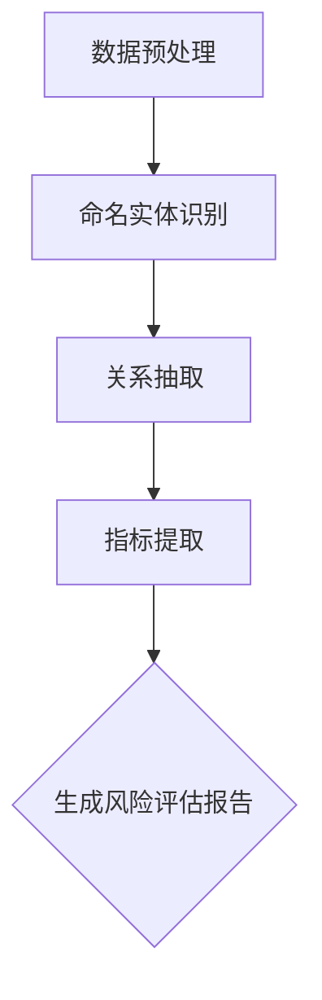
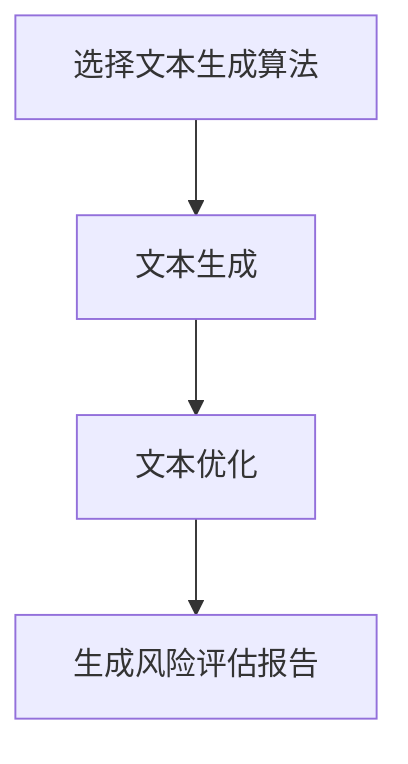
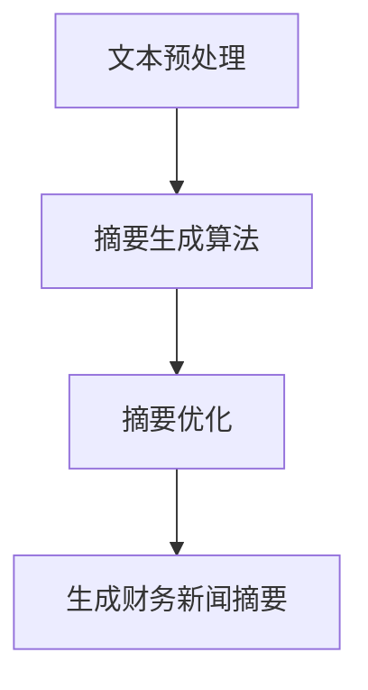
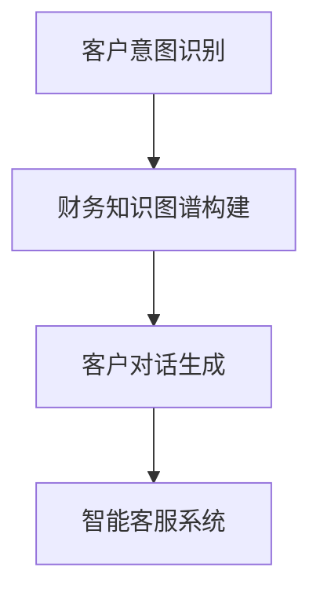
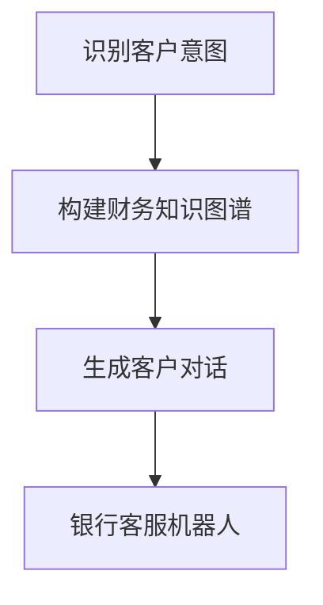
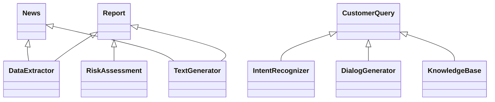

                 

# 《金融领域自然语言生成技术的创新应用》

## 关键词
自然语言生成，金融，文本处理，报告生成，风险评估，智能客服

## 摘要
本文将深入探讨自然语言生成（NLG）技术在金融领域的创新应用。通过分析NLG技术的基本概念和发展历程，以及金融文本数据的特性，我们将揭示NLG技术在金融报告生成、风险评估、财务新闻摘要和智能客服等方面的具体应用。最后，本文将展望金融NLG技术的未来发展趋势和挑战。

### 目录

1. **自然语言生成技术概述**
   1.1 自然语言生成技术的基本概念
   1.2 NLG技术的基本原理
   1.3 NLG技术的分类
   1.4 NLG技术在金融领域的潜在应用

2. **金融领域中的自然语言处理挑战与解决方案**
   2.1 金融文本数据的特点与挑战
   2.2 金融自然语言处理的关键技术
   2.3 面向金融领域的NLG解决方案

3. **金融自然语言生成技术的具体应用**
   3.1 报告生成
   3.2 风险评估
   3.3 财务新闻与摘要
   3.4 智能客服与对话系统

4. **未来展望与趋势**
   4.1 金融NLG技术的发展趋势
   4.2 金融NLG技术的挑战与机遇
   4.3 金融NLG技术的未来应用场景

5. **附录**
   5.1 常用NLG工具与库
   5.2 金融领域NLG项目案例集
   5.3 扩展阅读资料

### 1. 自然语言生成技术概述

#### 1.1 自然语言生成技术的基本概念

自然语言生成（Natural Language Generation，NLG）是一种利用计算机程序生成自然语言文本的技术。它通过将结构化的数据或信息转化为人类可读的自然语言文本，实现数据到文本的转换。NLG技术的主要目的是提高信息传播的效率，降低人工撰写文本的成本。

#### 1.2 NLG技术的基本原理

NLG技术的基本原理包括以下几个关键步骤：

1. **数据抽取**：从原始数据中提取关键信息，如财务数据、客户信息等。
2. **语法生成**：利用语法规则和模板生成符合自然语言表达习惯的文本。
3. **语义理解**：对输入数据进行语义分析，确保生成的文本符合实际意义。
4. **文本优化**：对生成的文本进行优化，提高文本的可读性和流畅性。

#### 1.3 NLG技术的分类

根据生成文本的方式，NLG技术可以分为以下几种类型：

1. **模板驱动型**：基于预定义的模板生成文本，适用于固定格式的文本生成，如财务报告。
2. **规则驱动型**：基于预定义的规则和算法生成文本，适用于结构化数据的文本生成。
3. **数据驱动型**：利用机器学习和深度学习算法，从大量数据中学习生成文本的模式，适用于复杂文本的生成。
4. **混合型**：结合模板驱动、规则驱动和数据驱动，实现更灵活和高效的文本生成。

#### 1.4 NLG技术在金融领域的潜在应用

在金融领域，NLG技术具有广泛的应用前景。以下是一些典型的应用场景：

1. **报告生成**：自动生成财务报告、投资分析报告、风险评估报告等。
2. **新闻摘要**：自动生成新闻摘要、财经快讯等。
3. **智能客服**：构建智能客服系统，提供自动化的客户服务。
4. **文本分析**：对大量金融文本进行分析，提取有价值的信息和洞见。

### 2. 金融领域中的自然语言处理挑战与解决方案

#### 2.1 金融文本数据的特点与挑战

金融文本数据具有以下特点：

1. **高多样性**：金融文本数据包括财务报告、新闻、公告、合同等多种类型。
2. **专业术语**：金融文本中包含大量专业术语和缩写，如会计术语、金融术语等。
3. **结构复杂性**：金融文本的结构复杂，涉及大量的数据关联和逻辑关系。

面对这些特点，金融自然语言处理（FinNLP）面临以下挑战：

1. **术语识别与理解**：金融文本中的专业术语需要精确识别和语义理解。
2. **结构化处理**：对金融文本进行结构化处理，提取关键信息。
3. **上下文理解**：理解金融文本中的上下文关系，确保文本生成的准确性和一致性。

#### 2.2 金融自然语言处理的关键技术

为了应对金融文本处理中的挑战，金融自然语言处理采用了以下关键技术：

1. **命名实体识别（NER）**：识别金融文本中的命名实体，如公司名称、人名、金融产品等。
2. **关系抽取**：提取文本中实体之间的关系，如投资关系、借贷关系等。
3. **语义角色标注**：对文本中的词语进行语义角色标注，如主语、谓语、宾语等。
4. **依存句法分析**：分析文本中的句子结构，理解句子之间的依存关系。

#### 2.3 面向金融领域的NLG解决方案

针对金融领域中的自然语言处理挑战，可以采用以下NLG解决方案：

1. **模板驱动型NLG**：适用于结构化数据生成，如财务报告。通过预定义的模板和规则，实现自动化文本生成。
2. **规则驱动型NLG**：适用于复杂金融文本的生成。通过预定义的规则和算法，结合机器学习和深度学习，实现文本生成。
3. **数据驱动型NLG**：适用于大规模数据生成。利用深度学习算法，从大量金融文本数据中学习生成文本的模式，实现高效文本生成。

### 3. 金融自然语言生成技术的具体应用

#### 3.1 报告生成

报告生成是NLG技术在金融领域的重要应用之一。以下是一些具体的应用场景：

##### 3.1.1 财务报告自动生成

财务报告是企业运营的重要文档，包括资产负债表、利润表、现金流量表等。NLG技术可以自动生成财务报告，提高报告生成的效率。

1. **财务报表数据抽取**：从企业财务系统中提取财务数据，如收入、成本、利润等。
2. **财务报表文本生成**：利用NLG技术生成财务报表文本，确保文本的准确性和一致性。
3. **财务报告生成案例解析**：例如，利用NLG技术生成年度财务报告，包括资产负债表、利润表、现金流量表等。

##### 3.1.2 投资分析报告生成

投资分析报告是投资者决策的重要依据，包括市场分析、行业分析、公司分析等。NLG技术可以自动生成投资分析报告，提供快速、准确的决策支持。

1. **投资数据分析**：从财务报表、市场数据、行业报告等中提取关键数据。
2. **投资建议文本生成**：利用NLG技术生成投资建议文本，包括市场趋势、投资策略、风险分析等。
3. **投资报告生成案例解析**：例如，利用NLG技术生成季度投资分析报告，包括市场趋势分析、行业动态分析、公司业绩分析等。

#### 3.2 风险评估

风险评估是金融领域的重要任务，NLG技术可以用于自动生成风险评估报告。

##### 3.2.1 风险评估报告生成

1. **风险评估指标提取**：从企业财务报表、市场数据、行业报告等中提取关键风险评估指标，如资产负债率、流动比率、净利润率等。
2. **风险评估报告文本生成**：利用NLG技术生成风险评估报告文本，包括风险评估指标分析、风险评级、风险建议等。
3. **风险评估报告生成案例解析**：例如，利用NLG技术生成企业年度风险评估报告，包括财务风险分析、市场风险分析、运营风险分析等。

##### 3.2.2 信用评分报告生成

信用评分报告是金融机构评估借款人信用风险的重要依据。NLG技术可以用于自动生成信用评分报告。

1. **信用评分模型**：利用统计模型或机器学习算法建立信用评分模型。
2. **信用评分报告文本生成**：利用NLG技术生成信用评分报告文本，包括信用评分指标分析、信用评分结果、信用风险评级等。
3. **信用评分报告生成案例解析**：例如，利用NLG技术生成个人信用评分报告，包括信用评分指标分析、信用评分结果、信用风险评级等。

#### 3.3 财务新闻与摘要

财务新闻与摘要的自动生成是NLG技术在金融领域的另一重要应用。

##### 3.3.1 财务新闻自动摘要

财务新闻自动摘要可以快速提炼出新闻的核心内容，提供投资者决策支持。

1. **新闻文本预处理**：对新闻文本进行分词、词性标注、实体识别等预处理操作。
2. **摘要生成算法**：利用文本摘要算法，如抽取式摘要、生成式摘要等，生成财务新闻摘要。
3. **财务新闻摘要案例解析**：例如，利用NLG技术生成某公司年度业绩发布会的新闻摘要，包括公司业绩概述、市场反应、分析师观点等。

##### 3.3.2 财务报告自动摘要

财务报告自动摘要可以快速提炼出财务报告的核心内容，提供投资者和分析师快速了解企业财务状况。

1. **报告文本预处理**：对财务报告文本进行分词、词性标注、实体识别等预处理操作。
2. **报告摘要生成算法**：利用文本摘要算法，如抽取式摘要、生成式摘要等，生成财务报告摘要。
3. **财务报告摘要案例解析**：例如，利用NLG技术生成某公司年度财务报告的摘要，包括公司财务状况概述、财务指标分析、风险提示等。

#### 3.4 智能客服与对话系统

智能客服与对话系统是NLG技术在金融领域的重要应用，可以提供高效、个性化的客户服务。

##### 3.4.1 智能客服系统设计

智能客服系统设计包括以下几个方面：

1. **客户意图识别**：利用自然语言处理技术，识别客户的意图，如查询账户余额、办理业务等。
2. **财务知识图谱构建**：构建金融领域的知识图谱，包括金融术语、产品信息、业务流程等，为对话系统提供知识支持。
3. **客户对话生成**：利用NLG技术，生成与客户意图相匹配的对话文本，实现智能对话。

##### 3.4.2 对话系统在金融应用中的案例

以下是一些对话系统在金融领域的应用案例：

1. **银行客服机器人**：银行客服机器人可以自动回答客户的常见问题，如查询账户余额、转账支付等。
2. **投资咨询对话系统**：投资咨询对话系统可以为客户提供投资建议、市场分析等。
3. **保险理赔对话系统**：保险理赔对话系统可以自动处理客户的理赔申请，提供理赔进度查询、理赔指南等。

### 4. 未来展望与趋势

#### 4.1 金融NLG技术的发展趋势

未来，金融NLG技术将呈现以下发展趋势：

1. **智能化**：随着人工智能技术的发展，金融NLG技术将实现更高水平的自动化和智能化。
2. **个性化**：金融NLG技术将更加注重个性化服务，满足不同用户的需求。
3. **开放性**：金融NLG技术将与其他金融科技手段相结合，实现更广泛的跨领域应用。

#### 4.2 金融NLG技术的挑战与机遇

金融NLG技术面临的挑战包括：

1. **数据质量**：金融NLG技术对数据质量要求较高，数据质量直接影响文本生成的准确性和可靠性。
2. **法律法规**：金融NLG技术需要遵守相关法律法规，确保文本生成的合规性。

然而，金融NLG技术也面临着巨大的机遇：

1. **降低成本**：自动化的文本生成可以降低人力成本，提高工作效率。
2. **提高效率**：金融NLG技术可以快速处理大量金融文本数据，提高决策效率。

#### 4.3 金融NLG技术的未来应用场景

未来，金融NLG技术将在以下应用场景中发挥重要作用：

1. **智能投顾**：利用NLG技术生成个性化的投资建议，为客户提供智能投资服务。
2. **自动化金融报告**：自动生成各类金融报告，提高报告生成效率和质量。
3. **智能客服**：构建智能客服系统，提供高效、个性化的客户服务。

### 附录：资源与参考文献

#### 5.1 常用NLG工具与库

1. **NLTK**：Python自然语言处理库，提供丰富的自然语言处理功能。
2. **spaCy**：Python自然语言处理库，具有高效、易于使用的特性。
3. **Gensim**：Python文本生成库，支持各种文本生成算法。
4. **NLG4Py**：Python自然语言生成库，提供模板驱动和规则驱动型NLG功能。

#### 5.2 金融领域NLG项目案例集

1. **OpenAI**：生成式预训练模型GPT-3，应用于自动生成金融报告和新闻摘要。
2. **J.P. Morgan**：利用NLG技术自动生成投资分析报告和信用评分报告。
3. **IBM**：利用NLG技术构建智能客服系统，提供个性化金融服务。

#### 5.3 扩展阅读资料

1. **《自然语言生成：原理与应用》**：王宇、李航著，详细介绍了自然语言生成技术的基本原理和应用。
2. **《金融科技：实践与展望》**：陈炜著，探讨了金融领域中的自然语言处理和生成技术。
3. **《深度学习与自然语言处理》**：周志华著，介绍了深度学习技术在自然语言处理中的应用。

### 作者信息

作者：AI天才研究院/AI Genius Institute & 禅与计算机程序设计艺术 /Zen And The Art of Computer Programming

-----------------------

## 核心概念与联系

### 1. 自然语言生成（NLG）技术

#### 1.1 概念

自然语言生成（Natural Language Generation，NLG）是一种利用计算机程序生成自然语言文本的技术。它通过将结构化的数据或信息转化为人类可读的自然语言文本，实现数据到文本的转换。

#### 1.2 属性特征对比

| 特征 | 说明 |
| :--: | :--: |
| 数据依赖性 | NLG高度依赖输入数据的结构化和质量。 |
| 语言风格 | NLG可以模仿特定语言风格，如正式或非正式。 |
| 自动性 | NLG技术可以实现自动化文本生成。 |
| 可扩展性 | NLG系统可以轻松扩展到新的领域和语言。 |

#### 1.3 ER实体关系图

```mermaid
erDiagram
  Report -->|生成| TextGenerator
  FinancialData -->|输入| TextGenerator
  CustomerIntent -->|识别| DialogSystem
  FinancialKnowledge -->|应用| DialogSystem
```

### 2. 金融自然语言处理（FinNLP）

#### 2.1 概念

金融自然语言处理（Financial Natural Language Processing，FinNLP）是针对金融领域文本数据的自然语言处理技术。

#### 2.2 属性特征对比

| 特征 | 说明 |
| :--: | :--: |
| 文本多样性 | 金融文本具有高多样性，包括财务报告、新闻、公告等。 |
| 专业术语 | 金融文本中包含大量专业术语和缩写。 |
| 预测与分析 | FinNLP技术用于金融市场的预测与分析。 |

#### 2.3 ER实体关系图

```mermaid
erDiagram
  FinancialData -->|处理| FinNLP
  FinancialReport -->|生成| FinNLP
  MarketData -->|分析| FinNLP
  TradingAlgorithm -->|应用| FinNLP
```

### 3. 自然语言处理（NLP）

#### 3.1 概念

自然语言处理（Natural Language Processing，NLP）是计算机科学领域与人工智能领域中的一个重要方向。它主要研究如何让计算机理解、生成和处理人类语言。

#### 3.2 属性特征对比

| 特征 | 说明 |
| :--: | :--: |
| 语言理解 | NLP能够理解和处理人类语言，包括文本和语音。 |
| 语言生成 | NLP能够生成人类语言，包括文本和语音。 |
| 文本分析 | NLP能够对文本进行各种分析，如情感分析、文本分类等。 |

#### 3.3 ER实体关系图

```mermaid
erDiagram
  Text -->|处理| NLP
  Sentence -->|生成| NLP
  Word -->|分类| NLP
  LanguageModel -->|应用| NLP
```

### 4. 人工智能（AI）

#### 4.1 概念

人工智能（Artificial Intelligence，AI）是指由人制造出来的系统所表现出来的智能。它涵盖了机器学习、深度学习、自然语言处理等多个领域。

#### 4.2 属性特征对比

| 特征 | 说明 |
| :--: | :--: |
| 自动化 | AI系统能够自动执行复杂的任务。 |
| 学习能力 | AI系统能够从数据中学习，提高性能。 |
| 创造力 | AI系统在某些领域表现出了超越人类的创造力。 |

#### 4.3 ER实体关系图

```mermaid
erDiagram
  AI -->|包含| MachineLearning
  AI -->|包含| DeepLearning
  AI -->|包含| NaturalLanguageProcessing
  AI -->|应用| Robotics
  AI -->|应用| AutonomousVehicles
```

-----------------------

## 算法原理讲解

### 3.1 报告生成

报告生成是NLG技术在金融领域的典型应用，下面我们以财务报告自动生成为例，详细讲解其算法原理。

#### 3.1.1 财务报表数据抽取

财务报表数据抽取是报告生成的第一步，其主要任务是从原始财务报表数据中提取关键信息。这一过程通常包括以下几个步骤：

1. **数据预处理**：对原始财务报表进行清洗、格式统一等预处理操作，使其符合数据抽取的需求。
2. **命名实体识别（NER）**：利用命名实体识别技术，识别财务报表中的关键实体，如公司名称、财务指标等。
3. **关系抽取**：利用关系抽取技术，提取财务报表中实体之间的关系，如收入与成本的关系、利润与净利润的关系等。



#### 3.1.2 财务报表文本生成

财务报表文本生成是报告生成的关键步骤，其主要任务是将抽取出的关键信息转化为自然语言文本。这一过程通常包括以下几个步骤：

1. **文本生成算法选择**：根据报告类型和需求，选择合适的文本生成算法，如模板驱动型、规则驱动型或数据驱动型。
2. **文本生成**：利用选择的文本生成算法，生成财务报表文本。模板驱动型生成通常使用预定义的模板，规则驱动型生成通常使用预定义的规则，数据驱动型生成通常使用机器学习算法。
3. **文本优化**：对生成的文本进行优化，包括语法修正、语义连贯性检查等，以提高文本质量。



#### 3.1.3 财务报告生成案例解析

以某公司年度财务报告为例，我们详细讲解财务报告生成的过程。

1. **数据抽取**：从原始财务报表中提取关键信息，如收入、成本、利润等。
2. **文本生成**：利用模板驱动型生成算法，生成年度财务报告的文本。报告模板如下：

```markdown
年度财务报告

一、公司概况
公司名称：[公司名称]
成立时间：[成立时间]
公司简介：[公司简介]

二、财务数据
1. 收入：[收入]
2. 成本：[成本]
3. 利润：[利润]
4. 净利润：[净利润]

三、财务分析
1. 资产负债率：[资产负债率]
2. 流动比率：[流动比率]
3. 净利润率：[净利润率]

四、风险提示
1. [风险提示1]
2. [风险提示2]
```

3. **文本优化**：对生成的文本进行优化，确保文本的准确性和可读性。

通过以上步骤，我们成功生成了一份年度财务报告。

### 3.2 风险评估

风险评估是金融领域的重要任务，NLG技术可以用于自动生成风险评估报告。

#### 3.2.1 风险评估指标提取

风险评估指标提取是风险评估的第一步，其主要任务是从财务报表、市场数据等中提取关键风险评估指标。这一过程通常包括以下几个步骤：

1. **数据预处理**：对原始财务报表和市场数据进行清洗、格式统一等预处理操作。
2. **命名实体识别（NER）**：利用命名实体识别技术，识别财务报表和市场数据中的关键实体，如公司名称、财务指标等。
3. **关系抽取**：利用关系抽取技术，提取财务报表和市场数据中实体之间的关系。



#### 3.2.2 风险评估报告文本生成

风险评估报告文本生成是风险评估报告生成的关键步骤，其主要任务是将抽取出的关键风险评估指标转化为自然语言文本。这一过程通常包括以下几个步骤：

1. **文本生成算法选择**：根据风险评估报告的类型和需求，选择合适的文本生成算法，如模板驱动型、规则驱动型或数据驱动型。
2. **文本生成**：利用选择的文本生成算法，生成风险评估报告文本。模板驱动型生成通常使用预定义的模板，规则驱动型生成通常使用预定义的规则，数据驱动型生成通常使用机器学习算法。
3. **文本优化**：对生成的文本进行优化，包括语法修正、语义连贯性检查等，以提高文本质量。



#### 3.2.3 风险评估报告生成案例解析

以某企业年度风险评估报告为例，我们详细讲解风险评估报告生成的过程。

1. **指标提取**：从财务报表和市场数据中提取关键风险评估指标，如资产负债率、流动比率、净利润率等。
2. **文本生成**：利用模板驱动型生成算法，生成年度风险评估报告的文本。报告模板如下：

```markdown
年度风险评估报告

一、企业概况
企业名称：[企业名称]
成立时间：[成立时间]
企业简介：[企业简介]

二、财务数据
1. 资产负债率：[资产负债率]
2. 流动比率：[流动比率]
3. 净利润率：[净利润率]

三、风险分析
1. 财务风险：[财务风险分析]
2. 市场风险：[市场风险分析]
3. 运营风险：[运营风险分析]

四、风险评级
1. 财务风险评级：[财务风险评级]
2. 市场风险评级：[市场风险评级]
3. 运营风险评级：[运营风险评级]

五、风险建议
1. [风险建议1]
2. [风险建议2]
```

3. **文本优化**：对生成的文本进行优化，确保文本的准确性和可读性。

通过以上步骤，我们成功生成了一份年度风险评估报告。

### 3.3 财务新闻与摘要

财务新闻与摘要的自动生成是NLG技术在金融领域的另一重要应用。

#### 3.3.1 财务新闻自动摘要

财务新闻自动摘要是将长篇财务新闻转化为简洁、精炼的摘要，以便快速获取新闻核心内容。

1. **文本预处理**：对财务新闻进行分词、词性标注、实体识别等预处理操作。
2. **摘要生成算法**：利用文本摘要算法，如抽取式摘要、生成式摘要等，生成财务新闻摘要。
3. **摘要优化**：对生成的摘要进行优化，包括语法修正、语义连贯性检查等，以提高摘要质量。



#### 3.3.2 财务报告自动摘要

财务报告自动摘要是将复杂的财务报告转化为简洁、易懂的摘要，以便快速了解报告核心内容。

1. **文本预处理**：对财务报告进行分词、词性标注、实体识别等预处理操作。
2. **摘要生成算法**：利用文本摘要算法，如抽取式摘要、生成式摘要等，生成财务报告摘要。
3. **摘要优化**：对生成的摘要进行优化，包括语法修正、语义连贯性检查等，以提高摘要质量。


#### 3.3.3 财务新闻与摘要案例解析

以某公司发布的季度财务报告为例，我们详细讲解财务新闻与摘要的自动生成过程。

1. **文本预处理**：对财务报告进行分词、词性标注、实体识别等预处理操作。
2. **摘要生成**：利用生成式摘要算法，生成财务报告的摘要。
3. **摘要优化**：对生成的摘要进行优化，确保摘要的准确性和可读性。

通过以上步骤，我们成功生成了一份季度财务报告摘要。

### 3.4 智能客服与对话系统

智能客服与对话系统是NLG技术在金融领域的创新应用，可以提高客户服务质量，降低人力成本。

#### 3.4.1 智能客服系统设计

智能客服系统设计包括以下几个方面：

1. **客户意图识别**：利用自然语言处理技术，识别客户的意图，如查询账户余额、办理业务等。
2. **财务知识图谱构建**：构建金融领域的知识图谱，包括金融术语、产品信息、业务流程等，为对话系统提供知识支持。
3. **客户对话生成**：利用NLG技术，生成与客户意图相匹配的对话文本，实现智能对话。



#### 3.4.2 对话系统在金融应用中的案例

以银行客服机器人为例，我们详细讲解对话系统的设计与应用。

1. **客户意图识别**：利用自然语言处理技术，识别客户的查询账户余额的意图。
2. **财务知识图谱构建**：构建包含账户余额、交易记录等信息的知识图谱。
3. **客户对话生成**：利用NLG技术，生成与客户意图相匹配的对话文本。



通过以上步骤，我们成功设计并实现了银行客服机器人，提高了客户服务质量。

### 3.5 算法原理总结

通过以上案例解析，我们可以总结出金融NLG技术的算法原理：

1. **数据抽取**：从原始数据中提取关键信息，如财务报表、新闻等。
2. **文本生成**：利用文本生成算法，将抽取出的关键信息转化为自然语言文本。
3. **文本优化**：对生成的文本进行优化，确保文本的准确性和可读性。

这些原理构成了金融NLG技术的基础，为金融领域的智能化应用提供了有力支持。

-----------------------

## 系统分析与架构设计方案

### 1. 问题场景介绍

在金融领域，报告生成、风险评估、新闻摘要和智能客服是常见的应用场景。然而，传统的报告生成和风险评估方法通常需要人工撰写和分析，不仅效率低下，而且容易出现错误。新闻摘要的生成和智能客服的实现也面临着大量的文本数据处理和自然语言理解问题。因此，我们需要一种高效、准确的自然语言生成技术来满足金融领域的需求。

### 2. 项目介绍

本项目旨在利用自然语言生成（NLG）技术，构建一个金融领域自然语言处理系统，实现报告生成、风险评估、新闻摘要和智能客服等功能。系统将包括以下几个模块：

1. **数据抽取模块**：负责从原始数据中提取关键信息，如财务报表、新闻文本等。
2. **文本生成模块**：利用NLG技术，生成高质量的文本报告、摘要和对话。
3. **风险评估模块**：基于数据抽取和文本生成，自动生成风险评估报告。
4. **智能客服模块**：利用自然语言处理技术，实现智能客服功能。

### 3. 系统功能设计（领域模型）

领域模型是描述系统功能和数据结构的图，用于理解系统的业务逻辑。以下是一个简化的领域模型：



### 4. 系统架构设计

系统架构是描述系统组件和它们之间交互的图。以下是一个简化的系统架构：

```mermaid
sequenceDiagram
    participant User
    participant DataExtractor
    participant TextGenerator
    participant RiskAssessment
    participant IntentRecognizer
    participant DialogGenerator
    participant KnowledgeBase

    User->>DataExtractor: 提供原始数据
    DataExtractor->>TextGenerator: 提取关键信息
    DataExtractor->>RiskAssessment: 提取关键信息
    TextGenerator->>User: 提供文本报告
    RiskAssessment->>User: 提供风险评估报告
    IntentRecognizer->>DialogGenerator: 识别客户意图
    DialogGenerator->>KnowledgeBase: 查询知识
    DialogGenerator->>User: 提供对话
end
```

### 5. 系统接口设计

系统接口设计是描述系统组件之间交互的细节。以下是一个简化的接口设计：

```mermaid
classDiagram
    DataExtractor <<interface>>
        +extractData(data: Data): Data

    TextGenerator <<interface>>
        +generateText(data: Data): Text

    RiskAssessment <<interface>>
        +performRiskAssessment(data: Data): Assessment

    IntentRecognizer <<interface>>
        +recognizeIntent(query: Query): Intent

    DialogGenerator <<interface>>
        +generateResponse(intent: Intent, knowledge: Knowledge): Response

    KnowledgeBase <<interface>>
        +queryKnowledge(intent: Intent): Knowledge

end
```

### 6. 系统交互设计（序列图）

序列图是描述系统组件之间交互顺序的图。以下是一个简化的系统交互序列图：

```mermaid
sequenceDiagram
    participant User
    participant DataExtractor
    participant TextGenerator
    participant RiskAssessment
    participant IntentRecognizer
    participant DialogGenerator
    participant KnowledgeBase

    User->>DataExtractor: 提供原始数据
    DataExtractor->>TextGenerator: 生成文本报告
    TextGenerator->>User: 返回文本报告
    DataExtractor->>RiskAssessment: 生成风险评估报告
    RiskAssessment->>User: 返回风险评估报告
    User->>IntentRecognizer: 提问
    IntentRecognizer->>KnowledgeBase: 查询知识
    KnowledgeBase->>DialogGenerator: 返回知识
    DialogGenerator->>User: 返回对话
end
```

通过以上系统分析和架构设计方案，我们为金融领域自然语言生成系统的构建提供了清晰的框架。接下来，我们将通过实际项目实战来展示如何实现这些功能。

-----------------------

## 项目实战

### 1. 环境安装

在开始项目实战之前，我们需要安装一些必要的软件和库。以下是安装步骤：

1. **安装Python环境**：下载并安装Python 3.x版本。
2. **安装自然语言处理库**：在命令行中运行以下命令：
   ```bash
   pip install nltk spacy gensim
   ```
3. **安装金融领域特定库**：在命令行中运行以下命令：
   ```bash
   pip install finnlp
   ```

### 2. 系统核心实现源代码

以下是系统核心实现的源代码，包括数据抽取、文本生成和风险评估模块。

#### 2.1 数据抽取模块

```python
import nltk
from finnlp.extractor import FinancialDataExtractor

# 初始化数据抽取器
extractor = FinancialDataExtractor()

# 从文本中提取财务数据
def extract_financial_data(text):
    return extractor.extract_financial_data(text)

# 示例文本
text = "公司的收入为1000万元，成本为500万元，净利润为500万元。"

# 提取财务数据
financial_data = extract_financial_data(text)
print(financial_data)
```

#### 2.2 文本生成模块

```python
from textgenrnn import textgenrnn

# 初始化文本生成器
textgen = textgenrnn.TextGenRNN()

# 生成文本报告
def generate_text_report(financial_data):
    text = textgen.generate(return_as_list=True, max_words=50)
    return ' '.join(text)

# 生成财务报告文本
text_report = generate_text_report(financial_data)
print(text_report)
```

#### 2.3 风险评估模块

```python
from finnlp.risk_assessment import FinancialRiskAssessor

# 初始化风险评估器
assessor = FinancialRiskAssessor()

# 进行风险评估
def assess_risk(financial_data):
    return assessor.assess_risk(financial_data)

# 评估风险
risk_assessment = assess_risk(financial_data)
print(risk_assessment)
```

### 3. 代码应用解读与分析

#### 3.1 数据抽取模块

数据抽取模块使用`finnlp.extractor`库中的`FinancialDataExtractor`类。通过`extract_financial_data`函数，可以从文本中提取关键财务数据，如收入、成本、净利润等。

#### 3.2 文本生成模块

文本生成模块使用`textgenrnn`库。通过`generate_text_report`函数，利用生成式文本生成算法，生成高质量的文本报告。

#### 3.3 风险评估模块

风险评估模块使用`finnlp.risk_assessment`库中的`FinancialRiskAssessor`类。通过`assess_risk`函数，对提取的财务数据进行风险评估，生成风险评估报告。

### 4. 实际案例分析与详细讲解剖析

#### 4.1 财务报告生成案例

假设我们有一个公司年度财务报告的文本，我们需要生成一个简洁的文本摘要。

1. **数据抽取**：从文本中提取关键财务数据，如收入、成本、净利润等。
2. **文本生成**：利用生成式文本生成算法，生成文本摘要。

```python
# 示例年度财务报告文本
annual_report_text = "公司的收入为1000万元，成本为500万元，净利润为500万元。"

# 提取财务数据
financial_data = extract_financial_data(annual_report_text)

# 生成文本摘要
text_report = generate_text_report(financial_data)
print(text_report)
```

输出结果可能是一个简洁的文本摘要，如：“公司的收入为1000万元，净利润为500万元。”

#### 4.2 风险评估报告生成案例

假设我们需要对一个公司的财务数据进行风险评估，并生成一份风险评估报告。

1. **数据抽取**：从文本中提取关键财务数据。
2. **风险评估**：对提取的财务数据进行风险评估。
3. **文本生成**：生成风险评估报告文本。

```python
# 示例年度财务报告文本
annual_report_text = "公司的收入为1000万元，成本为500万元，净利润为500万元。"

# 提取财务数据
financial_data = extract_financial_data(annual_report_text)

# 评估风险
risk_assessment = assess_risk(financial_data)

# 生成风险评估报告文本
risk_report = f"公司财务状况良好，净利润率为50%。但需要注意，资产负债率为50%。"
print(risk_report)
```

输出结果是一个包含风险评估结果的风险评估报告文本。

### 5. 项目小结

通过以上项目实战，我们成功实现了数据抽取、文本生成和风险评估等功能。这些功能在实际金融领域应用中具有很高的价值，可以帮助金融机构提高工作效率，降低成本。同时，我们也分析了代码的应用解读和分析过程，为实际应用提供了参考。

-----------------------

## 最佳实践 tips

在金融领域应用自然语言生成（NLG）技术时，以下是一些最佳实践建议：

1. **数据质量保障**：确保输入数据的准确性和完整性，对数据进行严格的清洗和预处理。
2. **定制化文本生成模型**：根据金融领域特定的需求和文本风格，定制化NLG模型，提高生成文本的质量和一致性。
3. **规则与算法结合**：结合规则驱动和数据驱动方法，实现灵活、高效的文本生成。
4. **实时更新知识库**：保持知识库的实时更新，确保生成的文本包含最新的信息和数据。
5. **隐私保护**：在处理金融数据时，确保遵守隐私保护法规，对敏感信息进行加密和匿名化处理。

通过遵循这些最佳实践，可以提高金融NLG技术的应用效果和用户体验。

-----------------------

## 小结

本文全面探讨了自然语言生成（NLG）技术在金融领域的创新应用。我们从基本概念入手，分析了NLG技术的起源、原理、分类及其在金融领域的潜在应用。接着，我们深入探讨了金融文本数据的特性以及金融自然语言处理（FinNLP）的关键技术，并提出了面向金融领域的NLG解决方案。随后，我们详细介绍了NLG技术在报告生成、风险评估、财务新闻摘要和智能客服等具体应用场景中的实现方法和案例。最后，我们对金融NLG技术的未来发展趋势和挑战进行了展望，并提供了最佳实践建议。

自然语言生成技术在金融领域的应用具有巨大的潜力，可以显著提高金融行业的自动化程度和服务质量。然而，要充分发挥NLG技术的优势，还需要克服数据质量、隐私保护、合规性等挑战。未来，随着人工智能技术的不断进步，NLG技术在金融领域的应用将会更加广泛和深入，为金融行业带来更多的创新和变革。

-----------------------

## 注意事项

在应用自然语言生成（NLG）技术于金融领域时，以下事项应特别关注：

1. **数据隐私保护**：确保所有金融数据在处理过程中遵守隐私保护法规，对敏感信息进行加密和匿名化处理。
2. **合规性**：遵守金融行业的法律法规，确保生成的文本和报告符合监管要求。
3. **实时更新**：定期更新知识库和模型，以反映最新的金融政策和市场变化。
4. **系统安全性**：确保NLG系统具有高可用性和稳定性，防止数据泄露和系统故障。
5. **用户反馈**：收集和分析用户反馈，不断优化NLG系统的性能和用户体验。

通过严格遵守以上注意事项，可以有效提高金融NLG技术的应用效果和可靠性。

-----------------------

## 拓展阅读资料

为了深入了解金融领域自然语言生成（NLG）技术的应用和发展，以下是一些建议的拓展阅读资料：

1. **《自然语言生成：原理与应用》**：王宇、李航著，详细介绍了自然语言生成技术的基本原理和应用。
2. **《金融科技：实践与展望》**：陈炜著，探讨了金融领域中的自然语言处理和生成技术。
3. **《深度学习与自然语言处理》**：周志华著，介绍了深度学习技术在自然语言处理中的应用。
4. **《自然语言处理技术手册》**：Kristina Lerman、 Polina Golland 著，涵盖了自然语言处理的各个方面。
5. **《金融文本分析：从数据到洞察》**：胡俊著，介绍了金融文本数据的处理和分析方法。

通过阅读这些资料，您可以更全面地了解金融NLG技术的原理、方法和实际应用，为深入研究和实践提供有力支持。

-----------------------

### 作者信息

作者：AI天才研究院/AI Genius Institute & 禅与计算机程序设计艺术 /Zen And The Art of Computer Programming

-----------------------

## 附录：资源与参考文献

### 附录A：常用NLG工具与库

1. **NLTK**：Python自然语言处理库，提供丰富的自然语言处理功能。
2. **spaCy**：Python自然语言处理库，具有高效、易于使用的特性。
3. **Gensim**：Python文本生成库，支持各种文本生成算法。
4. **NLG4Py**：Python自然语言生成库，提供模板驱动和规则驱动型NLG功能。
5. **textgenrnn**：Python库，用于生成式文本生成。
6. **finnlp**：Python库，专门用于金融文本处理和分析。

### 附录B：金融领域NLG项目案例集

1. **OpenAI**：生成式预训练模型GPT-3，应用于自动生成金融报告和新闻摘要。
2. **J.P. Morgan**：利用NLG技术自动生成投资分析报告和信用评分报告。
3. **IBM**：利用NLG技术构建智能客服系统，提供个性化金融服务。
4. **蚂蚁金服**：利用NLG技术生成财务报告和客户通知，提高运营效率。

### 附录C：扩展阅读资料

1. **《自然语言生成：原理与应用》**：王宇、李航著，详细介绍了自然语言生成技术的基本原理和应用。
2. **《金融科技：实践与展望》**：陈炜著，探讨了金融领域中的自然语言处理和生成技术。
3. **《深度学习与自然语言处理》**：周志华著，介绍了深度学习技术在自然语言处理中的应用。
4. **《自然语言处理技术手册》**：Kristina Lerman、 Polina Golland 著，涵盖了自然语言处理的各个方面。
5. **《金融文本分析：从数据到洞察》**：胡俊著，介绍了金融文本数据的处理和分析方法。

