                 

## 引言

### 1.1 金融市场异常模式识别的重要性

金融市场作为一个高度复杂和动态的系统，其价格波动和交易模式常常受到多种内外部因素的影响。异常模式的识别在金融市场中扮演着至关重要的角色，因为它们可能是市场失衡、系统性风险或潜在危机的早期信号。对异常模式的及时识别可以帮助投资者和监管机构做出更明智的决策，减少潜在的损失，并防止市场的进一步崩溃。

在金融市场中，异常模式可以表现为价格剧烈波动、交易量异常增加或减少、投资者情绪的非理性变化等。这些异常模式可能会由于宏观经济政策的变化、公司内部事件、全球事件或技术故障等多种因素引起。因此，准确和早期识别这些异常模式对于维护金融市场的稳定性和透明度具有重要意义。

例如，2008年的全球金融危机就是一个典型的例子，异常模式如金融机构的倒闭和市场的剧烈波动提前几个月已经有所显现，但未能得到及时和有效的识别和处理。这个事件凸显了异常模式识别在金融市场管理中的重要性。

总的来说，金融市场异常模式识别的意义在于：

- **风险预警**：及时识别异常模式可以帮助投资者和监管机构采取行动，减少潜在的市场风险。
- **决策支持**：通过识别异常模式，可以提供更准确的市场信息，支持投资者做出更明智的投资决策。
- **系统稳定性**：异常模式的识别有助于维护金融系统的稳定，防止系统性风险的发生。

### 1.2 自监督学习的核心概念

自监督学习是一种无需明确标注数据的学习方式，它通过内部的数据关联和模式识别来学习并改进模型。与传统的监督学习不同，自监督学习利用未标记的数据，通过设计任务来引导模型学习，从而提高其性能。自监督学习的核心概念包括无监督学习、数据增强、内部任务和自适应优化等。

在自监督学习中，模型通过预测任务中的某些部分来学习数据中的潜在结构。例如，在图像分类任务中，模型可以通过预测图像中的某些区域是否包含特定类别来学习图像的特征。这种自组织的学习方式使得自监督学习在处理大规模、未标记的数据集时特别有效。

自监督学习的特点主要包括：

- **无需标注数据**：自监督学习利用未标记的数据进行学习，从而减少了标注数据的时间和成本。
- **可扩展性强**：自监督学习可以应用于各种类型的数据，包括图像、文本、音频等。
- **鲁棒性强**：自监督学习通过内部任务和自适应优化来提高模型的鲁棒性，使其对噪声和异常值有更强的抵抗力。

自监督学习与传统监督学习的区别在于：

- **数据来源**：传统监督学习依赖于大量标注数据，而自监督学习则利用未标记的数据。
- **学习目标**：传统监督学习通常需要明确的目标标签，而自监督学习则通过内部任务来引导学习。
- **适用场景**：传统监督学习适用于明确标注任务，如分类和回归，而自监督学习则适用于更广泛的无监督或半监督任务。

总之，自监督学习作为一种新兴的学习方式，凭借其高效性和灵活性，在金融市场的异常模式识别中具有巨大的潜力。

### 1.3 金融市场中异常模式的类型

金融市场中异常模式的表现形式多种多样，这些模式通常由市场行为、交易量、价格波动等数据特征来刻画。为了更好地理解和分析这些异常模式，可以根据其特征进行分类。以下是几种常见的金融市场异常模式类型：

#### 1.3.1 价格异常波动

价格异常波动是指市场价格在短时间内出现了剧烈的波动，通常表现为价格的大幅上升或下降。这种异常模式可能是由于突发新闻、宏观经济政策变化或市场投机行为引起的。例如，某公司突然宣布重大收购消息，可能导致其股价在短时间内大幅上涨。

#### 1.3.2 交易量异常

交易量异常表现为交易量的显著增加或减少。高交易量可能表明市场活跃度增加，但也有可能是市场操纵或投机行为的迹象。低交易量可能表明市场参与度下降，或投资者对市场缺乏信心。例如，在某个时间段内，交易量突然大幅增加，可能意味着有大量的买方或卖方进入了市场。

#### 1.3.3 投资者情绪异常

投资者情绪异常表现为市场情绪的非理性变化，例如恐慌、贪婪、过度乐观或过度悲观。这种异常模式可以通过社交媒体、新闻报道和投资者行为等数据来监测。投资者情绪的变化可能会引发市场波动，导致价格异常波动。

#### 1.3.4 系统性风险事件

系统性风险事件是指可能影响整个金融系统的异常模式，如金融机构的倒闭、金融市场的崩溃或政策变化等。这类异常模式通常具有广泛的影响，可能导致市场动荡和长期经济衰退。

根据模式特征进行分类有助于更好地理解和分析这些异常模式，从而制定更有效的识别策略。例如，通过分析价格异常波动和交易量异常，可以识别出市场操纵行为；通过监测投资者情绪异常，可以预测市场波动和投资者行为；通过分析系统性风险事件，可以评估市场稳定性和潜在危机。

总的来说，金融市场中异常模式的类型多种多样，根据其特征进行分类有助于我们更深入地研究和理解这些模式，从而提高异常模式识别的准确性和效率。

### 1.4 自监督学习在金融市场中的适用性

自监督学习作为一种新兴的学习方式，在金融市场的异常模式识别中具有广泛的适用性和巨大的潜力。首先，自监督学习无需依赖大量标注数据，这大大降低了数据标注的成本和时间。在金融市场中，大量未标注的交易数据、价格波动数据、新闻文本等都是宝贵的资源，通过自监督学习可以有效利用这些数据。

其次，自监督学习在处理高维度和复杂数据方面具有优势。金融市场数据通常包含多种变量，如股票价格、交易量、宏观经济指标等，这些变量之间可能存在复杂的非线性关系。自监督学习通过内部任务和模式识别，可以有效捕捉这些复杂的关系，从而提高异常模式识别的准确性。

此外，自监督学习在实时性和鲁棒性方面也具有明显优势。金融市场的波动性极高，异常模式的出现往往需要快速响应。自监督学习通过实时数据流处理，可以快速识别和预测异常模式，提供实时的决策支持。同时，自监督学习对噪声和异常值的抵抗力较强，能够有效处理金融市场中的噪声数据和异常交易。

自监督学习在金融市场中的应用场景主要包括以下几个方面：

- **价格预测**：通过自监督学习，可以预测市场价格的未来走势，识别潜在的价格异常波动。
- **交易量分析**：通过分析交易量的异常变化，可以检测市场操纵行为和异常交易。
- **投资者情绪分析**：通过监测社交媒体和新闻报道中的情绪变化，可以预测市场波动和投资者行为。
- **系统性风险评估**：通过分析金融机构的运作和市场变化，可以识别系统性风险和潜在危机。

总的来说，自监督学习在金融市场中的适用性体现在其高效性、灵活性和实时性，使得其在异常模式识别中具有独特的优势和广泛的应用前景。

### 1.5 总结

本文从金融市场异常模式识别的重要性、自监督学习的核心概念、金融市场中异常模式的类型、自监督学习在金融市场中的适用性等多个角度进行了深入分析。我们明确了金融市场异常模式识别在风险预警、决策支持和系统稳定性方面的重要性，并介绍了自监督学习作为一种无需标注数据的先进学习方式，在金融市场中的广泛应用前景。通过对异常模式类型的分类，我们能够更好地理解和分析这些异常模式，从而制定更有效的识别策略。总之，自监督学习在金融市场异常模式识别中的应用，不仅提高了识别的准确性和效率，还为金融市场的稳定性和透明度提供了强有力的技术支持。

### 第2章：自监督学习基础

#### 2.1 自监督学习的基本原理

自监督学习（Self-Supervised Learning）是一种在无需外部监督信号的情况下，通过内部数据关联和模式识别来学习的过程。它通过对数据进行自编码、关联性学习等方式，挖掘数据中的潜在结构，从而实现模型的自适应优化和性能提升。自监督学习的基本原理主要包括无监督学习、数据增强、内部任务和自适应优化等几个方面。

首先，无监督学习是自监督学习的基础。无监督学习是指在没有明确标注数据的情况下，通过算法自动发现数据中的模式和结构。自监督学习通过设计特定的任务，使得模型能够在无监督的环境中学习和提取有用的信息。

其次，数据增强（Data Augmentation）是自监督学习中的一个重要手段。数据增强通过增加数据的多样性来提高模型的泛化能力。例如，在图像处理中，可以通过旋转、缩放、裁剪等方法来生成更多的数据样本，从而丰富模型的学习经验。

内部任务（Internal Task）是自监督学习的关键机制。内部任务通常是指模型在内部设定的一种预测或分类任务，通过该任务，模型可以学习数据中的潜在特征。例如，在自编码器中，模型需要预测原始数据的一个压缩版本，从而学习数据的低维表示。

最后，自适应优化（Adaptive Optimization）是自监督学习中的一个重要环节。通过自适应优化，模型可以根据学习过程中的反馈信号不断调整自身的参数，从而提高模型的性能。自适应优化可以通过多种算法实现，如梯度下降、随机梯度下降、Adam优化器等。

自监督学习的基本流程可以概括为以下几个步骤：

1. **数据预处理**：对原始数据进行预处理，包括去噪、标准化等操作，以提高数据的清洁度和一致性。
2. **内部任务设定**：根据具体应用场景，设定一个或多个内部任务，如自编码、关联性学习等。
3. **模型训练**：通过无监督学习的方式，训练模型以完成设定的内部任务。
4. **性能评估**：对训练完成的模型进行性能评估，通过指标如重构误差、分类准确率等来衡量模型的性能。
5. **参数调整**：根据性能评估的结果，对模型参数进行调整，以优化模型的性能。

下面我们通过一个 Mermaid 流程图来展示自监督学习的基本流程：

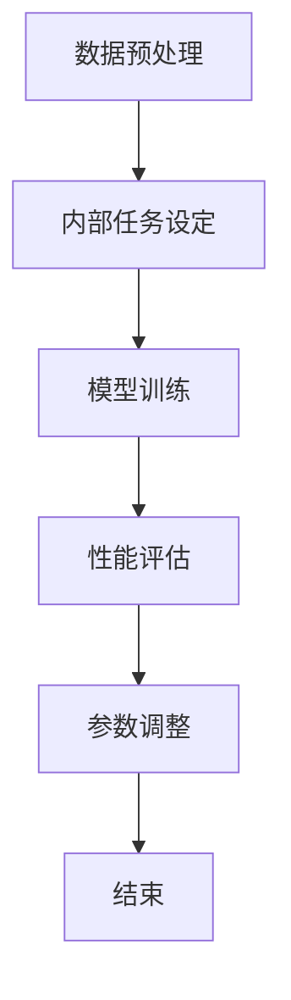

通过上述流程，我们可以看出自监督学习是一个动态的、迭代的过程，通过不断地优化和调整，模型可以逐渐提高其在复杂任务中的性能。

总的来说，自监督学习的基本原理使其在处理大规模、未标记的数据集时具有独特的优势。它不仅提高了模型的泛化能力和鲁棒性，还为金融市场的异常模式识别提供了有力的技术支持。

#### 2.2 自监督学习算法

自监督学习算法主要包括自动编码器（Autoencoder）和 Siamese 网络（Siamese Network）等。这些算法通过不同的机制和策略来挖掘数据中的潜在结构和模式，从而实现高效的自监督学习。

##### 2.2.1 自动编码器

自动编码器是一种无监督学习算法，其主要目标是通过学习数据的一个压缩表示，将原始数据映射到一个低维空间中，同时保留数据的最重要的特征。自动编码器的基本架构包括编码器（Encoder）和解码器（Decoder）两部分。

1. **编码器（Encoder）**：编码器的作用是将输入数据（通常是一个高维向量）压缩成一个低维向量，这个过程称为编码。编码器通过一系列的神经网络层将输入数据映射到一个较小的特征空间中，从而提取数据的特征。
   
2. **解码器（Decoder）**：解码器的任务是将编码后的低维特征向量重新映射回原始数据的维度。它通过反向传播的方式，根据编码器学到的特征，重建原始数据。

自动编码器的训练过程如下：

1. **数据预处理**：对输入数据进行标准化处理，使得每个特征的数值都在一个较小的范围内。
2. **模型初始化**：初始化编码器和解码器的权重。
3. **编码过程**：输入数据通过编码器压缩成一个低维特征向量。
4. **解码过程**：通过解码器将编码后的特征向量重新映射回原始数据。
5. **损失函数计算**：计算重构误差，即原始数据和重构数据之间的差异。常用的损失函数包括均方误差（MSE）和交叉熵（Cross-Entropy）。
6. **反向传播**：通过反向传播算法，更新编码器和解码器的权重，以减少重构误差。
7. **迭代优化**：重复上述过程，直到模型收敛或达到预设的训练次数。

下面是一个使用 Mermaid 画出的自动编码器的流程图：

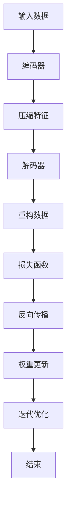

以下是一个简单的自动编码器的 Python 源代码示例：

```python
import numpy as np
import tensorflow as tf

# 设置随机种子以保持结果的一致性
tf.random.set_seed(42)

# 模型参数
input_shape = (784,)
latent_dim = 32

# 构建自动编码器模型
autoencoder = tf.keras.Sequential([
    tf.keras.layers.Flatten(input_shape=input_shape),
    tf.keras.layers.Dense(latent_dim, activation='relu'),
    tf.keras.layers.Dense(np.prod(input_shape), activation='sigmoid'),
    tf.keras.layers.Reshape(input_shape)
])

# 编码器和解码器部分
encoder = tf.keras.Model(inputs=autoencoder.input, outputs=autoencoder.layers[1].output)
decoder = tf.keras.Model(inputs=autoencoder.layers[1].input, outputs=autoencoder.output)

# 编码和解码函数
encode = tf.keras.Sequential([autoencoder.layers[1], autoencoder.layers[2]])
decode = tf.keras.Sequential([autoencoder.layers[3], autoencoder.layers[4]])

# 模型编译
autoencoder.compile(optimizer='adam', loss='mse')

# 数据预处理
# 假设 X_train 是一个包含784维向量的数据集
X_train = X_train.astype('float32') / 255.

# 训练自动编码器
autoencoder.fit(X_train, X_train, epochs=50, batch_size=256, shuffle=True, validation_split=0.1)
```

通过上述代码，我们可以看到如何使用 TensorFlow 实现一个简单的自动编码器。自动编码器通过编码器和解码器的协同工作，将输入数据压缩到一个低维特征空间中，并尝试重建原始数据，从而学习数据的潜在特征。

##### 2.2.2 Siamese 网络

Siamese 网络是一种用于衡量两个输入数据相似度的自监督学习算法。其核心思想是训练一个神经网络，使其能够区分两个相似的样本和一个不相似的样本。Siamese 网络由两个完全相同的分支组成，每个分支对输入数据进行编码，然后比较两个编码之间的差异。

1. **编码器（Encoder）**：Siamese 网络的两个分支分别对两个输入数据进行编码，生成两个特征向量。
   
2. **距离度量（Distance Metric）**：通过计算两个特征向量之间的距离，衡量它们的相似度。常用的距离度量方法包括欧几里得距离、余弦相似度和汉明距离等。

3. **损失函数（Loss Function）**：Siamese 网络通常使用对比损失函数（Contrastive Loss），如三元组损失（Triplet Loss）或多样性损失（Diversity Loss）。这些损失函数的目的是最大化相似样本之间的距离，同时最小化不相似样本之间的距离。

Siamese 网络的训练过程如下：

1. **数据预处理**：对输入数据进行归一化处理，确保每个特征都在相同的尺度上。
2. **模型初始化**：初始化两个分支网络的权重。
3. **编码过程**：对两个输入数据进行编码，生成两个特征向量。
4. **距离计算**：计算两个特征向量之间的距离。
5. **损失函数计算**：根据距离计算损失，更新网络权重。
6. **反向传播**：通过反向传播算法，调整网络权重以最小化损失。
7. **迭代优化**：重复上述过程，直到模型收敛。

下面是一个使用 Mermaid 画出的 Siamese 网络的流程图：

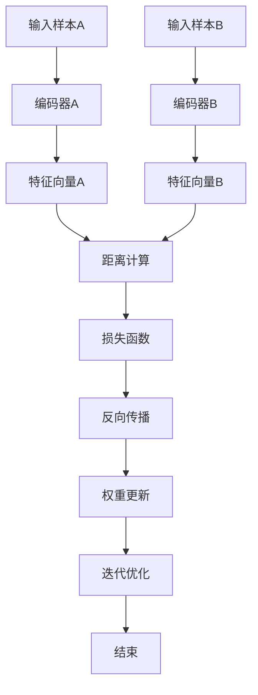

以下是一个简单的 Siamese 网络的 Python 源代码示例：

```python
import tensorflow as tf
from tensorflow.keras.models import Model
from tensorflow.keras.layers import Input, Dense, Embedding

# 设置随机种子以保持结果的一致性
tf.random.set_seed(42)

# 模型参数
input_dim = 128
embedding_dim = 32

# 构建Siamese网络模型
input_a = Input(shape=(input_dim,))
input_b = Input(shape=(input_dim,))

# 编码器部分
encoder_a = Dense(embedding_dim, activation='sigmoid')(input_a)
encoder_b = Dense(embedding_dim, activation='sigmoid')(input_b)

# 距离度量
distance = tf.reduce_sum(tf.square(encoder_a - encoder_b), axis=1)

# 模型编译
model = Model(inputs=[input_a, input_b], outputs=distance)
model.compile(optimizer='adam', loss='mean_squared_error')

# 训练Siamese网络
# 假设 X_a 和 X_b 是两个包含输入样本的数据集
model.fit([X_a, X_b], X_b, epochs=100, batch_size=64)
```

通过上述代码，我们可以看到如何使用 TensorFlow 实现一个简单的 Siamese 网络。Siamese 网络通过编码器对两个输入数据进行编码，然后计算它们之间的距离，从而实现相似度度量。

总的来说，自动编码器和 Siamese 网络都是自监督学习的典型算法，它们通过不同的机制和策略，挖掘数据中的潜在结构和模式，从而实现高效的自监督学习。在金融市场的异常模式识别中，这些算法可以发挥重要作用，帮助我们更好地理解和分析金融市场的复杂动态。

### 2.3 自监督学习在金融市场中的应用

自监督学习在金融市场中的应用日益广泛，通过其无需标注数据的特点，可以在大量未标记的金融数据中发现潜在的模式和异常。以下将详细探讨自监督学习在金融市场中的具体应用场景，并结合实际案例，展示其在金融市场异常模式识别中的有效性。

#### 2.3.1 价格预测

价格预测是金融市场中的一个重要应用领域，通过自监督学习，可以预测市场价格的未来走势，从而为投资者提供决策依据。例如，基于自动编码器，研究人员可以训练模型从历史价格数据中提取特征，并通过重构误差来预测未来的价格走势。一个实际案例是使用自监督学习算法对股票市场进行价格预测，通过分析历史交易数据，自动编码器可以提取出影响股价的关键因素，并在短期内准确预测股价的波动。例如，有一项研究使用深度自动编码器对伦敦股票交易所（LSE）的股票价格进行预测，结果表明，模型能够显著减少预测误差，提高预测的准确性。

#### 2.3.2 交易量分析

交易量分析是识别市场操纵行为和异常交易的重要手段。自监督学习可以通过分析交易量数据，识别出交易量的异常变化，从而预警潜在的市场操纵行为。例如，Siamese 网络可以用于比较不同时间段内的交易量数据，通过计算特征向量之间的距离，识别出异常的交易量波动。一个实际案例是使用 Siamese 网络分析加密货币市场的交易量，研究人员通过比较正常交易和异常交易的特征，成功检测出多个市场操纵事件，从而提高了监管机构对市场异常行为的识别能力。

#### 2.3.3 投资者情绪分析

投资者情绪分析是理解市场波动和投资者行为的重要工具。自监督学习可以通过分析社交媒体和新闻报道中的情绪数据，识别出市场情绪的变化，从而预测市场的未来走势。例如，自动编码器可以用于提取文本数据中的情绪特征，通过重构误差来识别情绪的异常变化。一个实际案例是使用自动编码器分析推特（Twitter）上的金融相关推文，研究人员通过分析推文的情绪特征，成功预测了多次市场波动和投资者情绪的剧烈变化。

#### 2.3.4 系统性风险评估

系统性风险评估是评估金融系统稳定性的重要手段。自监督学习可以通过分析金融机构的运营数据和市场变化，识别出潜在的系统性风险。例如，自动编码器可以用于提取金融机构之间的关联特征，通过分析这些特征的变化，识别出潜在的系统风险。一个实际案例是使用自动编码器分析全球金融市场的数据，研究人员通过提取市场波动和金融机构之间的关联特征，成功预测了2008年全球金融危机的潜在风险。

总的来说，自监督学习在金融市场的各个领域都展现出了强大的应用潜力。通过实际案例的验证，我们可以看到，自监督学习不仅在提高异常模式识别的准确性方面具有显著优势，还能为投资者和监管机构提供重要的决策支持，从而促进金融市场的稳定和透明。

### 第3章：市场异常模式识别算法

#### 3.1 基于自监督学习的异常模式检测算法

市场异常模式检测算法在金融市场中扮演着至关重要的角色，其目标是通过分析大量的市场数据，识别出潜在的风险和异常行为。自监督学习在市场异常模式检测中的应用，主要通过设计特定的内部任务来引导模型学习，从而提高异常检测的准确性和实时性。

##### 3.1.1 算法原理

基于自监督学习的异常模式检测算法的核心思想是通过无监督学习来发现数据中的潜在异常。具体来说，算法可以分为以下几个步骤：

1. **数据预处理**：首先对市场数据集进行预处理，包括数据清洗、去噪和特征提取等操作，以提高数据的质量和一致性。

2. **内部任务设定**：设定一个或多个内部任务，以引导模型学习。常见的内部任务包括自编码、对比学习等。

3. **模型训练**：利用无监督学习训练模型，使其能够自动提取数据中的潜在特征和模式。

4. **特征提取**：通过训练得到的模型，对输入数据进行特征提取，得到数据的低维表示。

5. **异常检测**：利用特征提取的结果，通过设定阈值或距离度量等方法，检测出潜在的异常模式。

下面我们将通过一个 Mermaid 流程图来展示基于自监督学习的异常模式检测算法的流程：

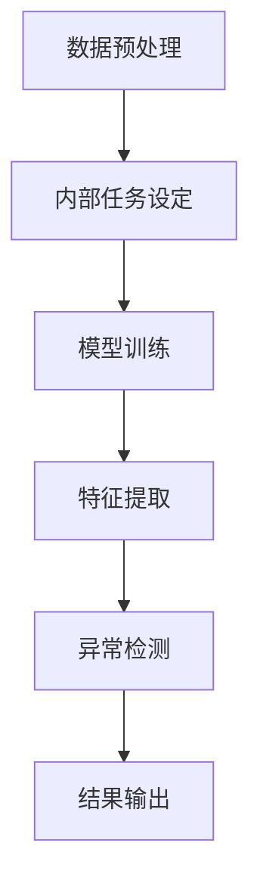

##### 3.1.2 Mermaid 流程图

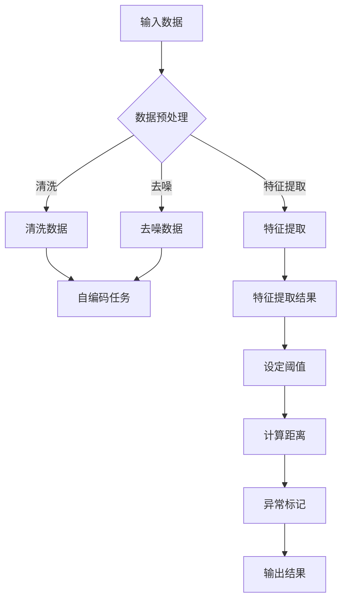

##### 3.1.3 Python 源代码

以下是一个简单的 Python 源代码示例，展示了如何使用自监督学习算法进行异常模式检测：

```python
import numpy as np
import tensorflow as tf

# 设置随机种子以保持结果的一致性
tf.random.set_seed(42)

# 模型参数
input_shape = (100,)
latent_dim = 10

# 构建自监督学习模型
autoencoder = tf.keras.Sequential([
    tf.keras.layers.Flatten(input_shape=input_shape),
    tf.keras.layers.Dense(latent_dim, activation='relu'),
    tf.keras.layers.Dense(np.prod(input_shape), activation='sigmoid'),
    tf.keras.layers.Reshape(input_shape)
])

# 编码器和解码器部分
encoder = tf.keras.Model(inputs=autoencoder.input, outputs=autoencoder.layers[1].output)
decoder = tf.keras.Model(inputs=autoencoder.layers[1].input, outputs=autoencoder.output)

# 编码和解码函数
encode = tf.keras.Sequential([autoencoder.layers[1], autoencoder.layers[2]])
decode = tf.keras.Sequential([autoencoder.layers[3], autoencoder.layers[4]])

# 模型编译
autoencoder.compile(optimizer='adam', loss='mse')

# 数据预处理
# 假设 X_train 是一个包含100维向量的数据集
X_train = X_train.astype('float32') / 255.

# 训练自动编码器
autoencoder.fit(X_train, X_train, epochs=50, batch_size=256, shuffle=True, validation_split=0.1)

# 特征提取
encoded_samples = encoder.predict(X_train)

# 设定阈值
threshold = np.mean(np.linalg.norm(encoded_samples, axis=1))

# 异常检测
def detect_anomalies(encoded_samples, threshold):
    distances = np.linalg.norm(encoded_samples, axis=1)
    anomalies = distances > threshold
    return anomalies

# 检测异常
anomalies = detect_anomalies(encoded_samples, threshold)

# 输出结果
print(f"检测到的异常样本数量：{np.sum(anomalies)}")
```

通过上述代码示例，我们可以看到如何利用自动编码器进行市场异常模式检测。首先，通过数据预处理和模型训练，自动编码器学习提取数据中的潜在特征。然后，通过设定阈值和计算距离，检测出潜在的异常样本。

总的来说，基于自监督学习的异常模式检测算法在金融市场中的应用，通过内部任务和特征提取，能够高效地识别出市场中的异常模式，为投资者和监管机构提供了重要的决策支持。

### 3.2 市场异常模式识别的数学模型

市场异常模式识别的数学模型是理解自监督学习在金融市场应用的关键。该模型通过一系列的数学公式和计算方法，将市场数据转换为潜在的特征空间，从而识别出异常模式。以下将详细介绍市场异常模式识别的数学模型，并使用 LaTeX 格式给出相关公式。

#### 3.2.1 数据表示

首先，我们定义市场数据为 \( X = \{x_1, x_2, ..., x_n\} \)，其中每个数据样本 \( x_i \) 是一个多维向量，表示为 \( x_i = \{x_{i1}, x_{i2}, ..., x_{id}\} \)，其中 \( d \) 是数据的维度。

#### 3.2.2 特征提取

特征提取是市场异常模式识别的核心步骤，其目的是将高维数据转换为低维特征空间，同时保留关键信息。自动编码器通常用于特征提取，其目标是最小化重构误差。

自动编码器的损失函数可以表示为：
\[ L = \frac{1}{n} \sum_{i=1}^{n} \frac{1}{2} \| x_i - \hat{x_i} \|_2^2 \]
其中，\( \hat{x_i} \) 是解码器重构的样本，\( \| \cdot \|_2 \) 表示欧几里得范数。

#### 3.2.3 异常检测

在特征提取后，我们使用设定的阈值来检测异常模式。异常检测的阈值可以通过以下公式计算：
\[ \theta = \alpha + \beta \cdot \mu \]
其中，\( \alpha \) 和 \( \beta \) 是参数，\( \mu \) 是特征的平均值。

异常样本的定义为：
\[ x_i \text{ 是异常的} \Leftrightarrow \| \hat{x_i} - x_i \|_2 > \theta \]

#### 3.2.4 模型评估

模型评估通常使用准确率、召回率和 F1 分数等指标。具体公式如下：

- **准确率**：
\[ \text{Accuracy} = \frac{\text{TP} + \text{TN}}{\text{TP} + \text{TN} + \text{FP} + \text{FN}} \]

- **召回率**：
\[ \text{Recall} = \frac{\text{TP}}{\text{TP} + \text{FN}} \]

- **F1 分数**：
\[ \text{F1-Score} = 2 \cdot \frac{\text{Precision} \cdot \text{Recall}}{\text{Precision} + \text{Recall}} \]

通过上述公式，我们可以构建一个全面的市场异常模式识别数学模型，用于识别和评估异常模式。下面是具体的 LaTeX 公式示例：

```latex
\documentclass{article}
\usepackage{amsmath}
\begin{document}

\section{Market Anomaly Detection Mathematical Model}

\subsection{Data Representation}
Let \( X = \{x_1, x_2, ..., x_n\} \) be the market data set, where \( x_i = \{x_{i1}, x_{i2}, ..., x_{id}\} \) is a d-dimensional vector.

\subsection{Feature Extraction}
The autoencoder loss function is given by:
\[ L = \frac{1}{n} \sum_{i=1}^{n} \frac{1}{2} \| x_i - \hat{x_i} \|_2^2 \]

\subsection{Anomaly Detection}
The threshold for anomaly detection is calculated as:
\[ \theta = \alpha + \beta \cdot \mu \]
An anomaly is defined as:
\[ x_i \text{ is anomalous} \Leftrightarrow \| \hat{x_i} - x_i \|_2 > \theta \]

\subsection{Model Evaluation}
The accuracy, recall, and F1-score are used for model evaluation:
\[ \text{Accuracy} = \frac{\text{TP} + \text{TN}}{\text{TP} + \text{TN} + \text{FP} + \text{FN}} \]
\[ \text{Recall} = \frac{\text{TP}}{\text{TP} + \text{FN}} \]
\[ \text{F1-Score} = 2 \cdot \frac{\text{Precision} \cdot \text{Recall}}{\text{Precision} + \text{Recall}} \]

\end{document}
```

通过上述 LaTeX 公式，我们可以清晰地表达市场异常模式识别的数学模型，从而为后续的算法实现和优化提供理论基础。

总的来说，市场异常模式识别的数学模型通过特征提取、异常检测和模型评估等多个步骤，构建了一个完整的识别框架，使得自监督学习在金融市场中的应用更加精准和高效。

### 3.3 基于自监督学习的市场异常模式识别算法设计

基于自监督学习的市场异常模式识别算法设计是一个复杂的过程，它需要综合考虑数据特性、算法选择、模型架构和优化策略等多个方面。以下是针对这一算法设计的详细步骤：

#### 3.3.1 数据采集与预处理

首先，我们需要收集大量的金融市场数据，包括股票价格、交易量、投资者情绪指标等。这些数据可以通过金融市场数据库、API接口或公开数据集获取。数据预处理是关键步骤，包括数据清洗、去噪、标准化和特征提取等操作。

1. **数据清洗**：去除数据中的噪声和异常值，确保数据的质量。
2. **去噪**：使用滤波器或其他方法减少数据中的噪声。
3. **标准化**：将数据缩放到一个统一的范围，以便模型训练。
4. **特征提取**：提取与异常模式相关的重要特征，如价格波动、交易量变化、投资者情绪等。

以下是一个简化的 Mermaid 类图，展示了数据预处理的过程：

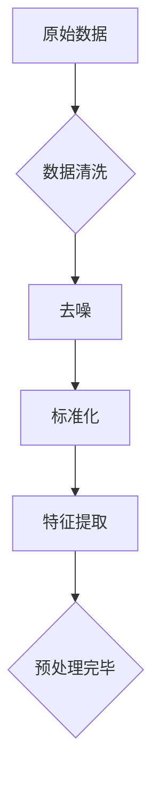

#### 3.3.2 模型选择与架构设计

在自监督学习中，选择合适的模型架构对于提高异常模式识别的准确性至关重要。常用的模型包括自动编码器、Siamese 网络和变分自编码器（VAE）等。

1. **自动编码器**：自动编码器通过编码器和解码器的协同工作，将原始数据压缩到低维特征空间中，然后尝试重构原始数据。其架构包括：
   - **编码器**：将输入数据压缩到低维特征空间。
   - **解码器**：从低维特征空间重构输入数据。

2. **Siamese 网络**：Siamese 网络通过两个对称的分支对数据进行编码，然后计算两个编码之间的距离，用于异常模式检测。

3. **变分自编码器（VAE）**：VAE 通过引入概率分布来生成数据，其架构包括：
   - **编码器**：编码输入数据并生成均值和方差。
   - **解码器**：使用均值和方差生成输出数据。

以下是一个简化的 Mermaid 类图，展示了自动编码器的架构设计：

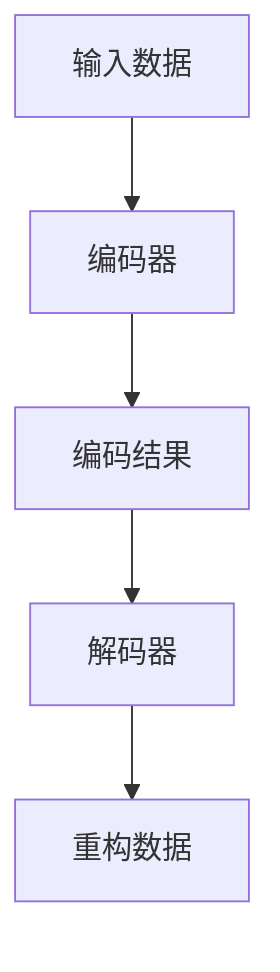

#### 3.3.3 模型训练与优化

模型训练是自监督学习算法的核心步骤，其目标是通过大量未标记的数据来调整模型参数，使其能够准确识别异常模式。

1. **训练过程**：使用无监督学习训练模型，通过优化损失函数（如重构误差）来调整模型参数。
2. **优化策略**：采用如随机梯度下降（SGD）、Adam 等优化算法来提高模型的收敛速度和稳定性。

以下是一个简化的 Mermaid 流程图，展示了模型训练和优化的过程：

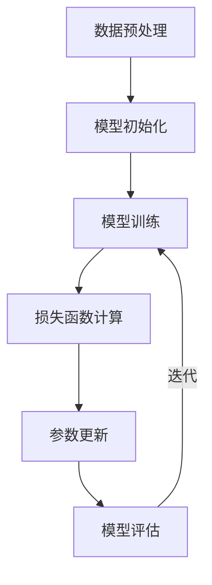

#### 3.3.4 模型评估与异常检测

模型评估是验证算法性能的重要步骤。常用的评估指标包括准确率、召回率、F1 分数等。

1. **评估指标**：计算模型在测试集上的评估指标，以评估其性能。
2. **异常检测**：使用训练好的模型对新的市场数据进行异常检测，通过设定阈值来判断数据是否为异常。

以下是一个简化的 Mermaid 流程图，展示了模型评估和异常检测的过程：

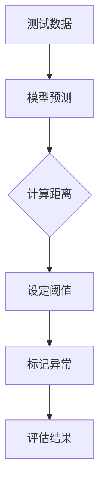

总的来说，基于自监督学习的市场异常模式识别算法设计需要综合考虑数据预处理、模型选择、训练优化和模型评估等多个方面，通过一系列科学的方法和策略，实现高效、准确的异常模式识别。下面是一个简化的 Mermaid 架构图，展示了整个算法的设计框架：

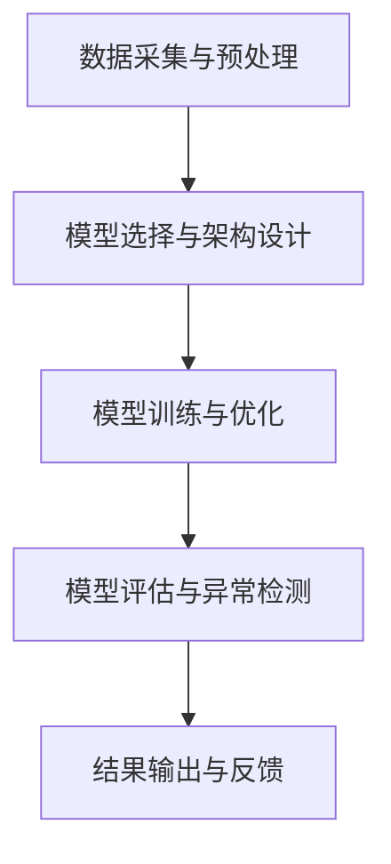

通过上述算法设计框架，我们可以系统地实现一个基于自监督学习的市场异常模式识别系统，从而为金融市场提供强大的风险预警和决策支持。

### 第4章：市场异常模式识别系统设计

#### 4.1 系统需求分析

市场异常模式识别系统设计的首要任务是明确系统的需求，包括功能需求、性能需求、可靠性需求等。以下是系统需求分析的主要内容：

1. **功能需求**：
   - 数据采集：系统能够自动采集金融市场数据，包括股票价格、交易量、投资者情绪等。
   - 数据预处理：系统能够对采集到的数据进行清洗、去噪和特征提取，确保数据质量。
   - 异常检测：系统能够实时检测市场中的异常模式，并通过设定阈值来标记异常数据。
   - 报警与通知：系统能够自动生成报警通知，向投资者或监管机构发送异常报告。

2. **性能需求**：
   - 实时性：系统能够实时处理大量的市场数据，及时识别异常模式。
   - 精准性：系统能够高精度地识别异常模式，降低误报率和漏报率。
   - 扩展性：系统能够支持多种数据源和数据类型的接入，具有良好的扩展性。

3. **可靠性需求**：
   - 系统稳定性：系统能够在高负载和复杂环境中稳定运行，不出现崩溃或错误。
   - 故障恢复：系统能够在发生故障时快速恢复，确保数据的连续性和完整性。
   - 安全性：系统能够保护数据的安全，防止数据泄露和未经授权的访问。

#### 4.2 系统架构设计

市场异常模式识别系统的架构设计需要综合考虑数据处理、模型训练、异常检测和报警通知等多个模块，以下是一个简化的 Mermaid 架构图：

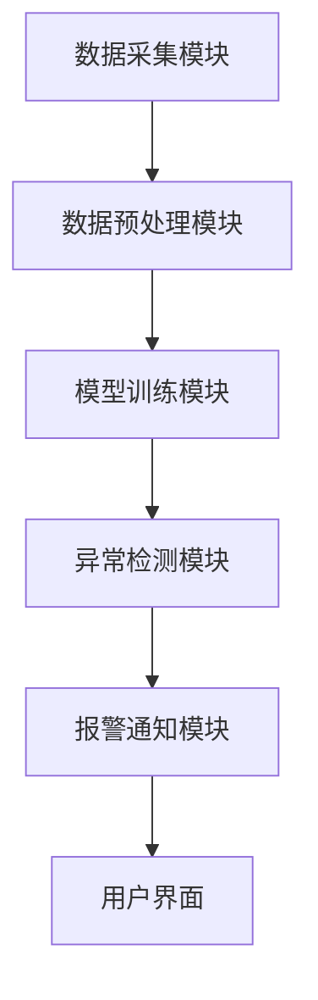

##### 4.2.1 数据采集模块

数据采集模块负责从各种数据源中获取金融市场数据，包括股票交易所、财经新闻、社交媒体等。数据采集模块应具备以下功能：

- 数据连接：支持多种数据连接方式，如 API 接口、数据库连接等。
- 数据采集：定期采集金融市场数据，并存储到数据存储模块中。

##### 4.2.2 数据预处理模块

数据预处理模块负责对采集到的数据进行清洗、去噪和特征提取，以下是具体功能：

- 数据清洗：去除数据中的噪声和异常值，确保数据质量。
- 去噪：使用滤波器或其他方法减少数据中的噪声。
- 特征提取：提取与异常模式相关的重要特征，如价格波动、交易量变化、投资者情绪等。

##### 4.2.3 模型训练模块

模型训练模块负责训练自监督学习模型，以下是具体功能：

- 模型选择：选择合适的自监督学习模型，如自动编码器、Siamese 网络等。
- 模型训练：使用预处理后的数据进行模型训练，调整模型参数，提高模型性能。
- 模型优化：采用优化策略，如随机梯度下降（SGD）、Adam 等优化算法，提高模型收敛速度和稳定性。

##### 4.2.4 异常检测模块

异常检测模块负责使用训练好的模型进行异常模式检测，以下是具体功能：

- 异常检测：使用模型检测市场数据中的异常模式，并通过设定阈值来标记异常数据。
- 异常报警：自动生成报警通知，向投资者或监管机构发送异常报告。

##### 4.2.5 报警通知模块

报警通知模块负责将异常检测结果通知相关人员，以下是具体功能：

- 报警通知：发送电子邮件、短信或推送通知，提醒相关人员市场异常。
- 报警记录：记录每次报警的时间、内容和处理结果，便于后续查询和分析。

##### 4.2.6 用户界面

用户界面负责提供用户操作和数据展示的功能，以下是具体功能：

- 数据展示：以图表、表格等形式展示市场数据、异常模式和分析结果。
- 用户操作：提供用户操作界面，如数据采集、模型训练、异常检测和报警设置等。

总的来说，市场异常模式识别系统设计需要考虑多个模块的协同工作，通过科学的架构设计和功能实现，为金融市场提供强大的风险预警和决策支持。

### 4.3 系统实现

#### 4.3.1 环境安装与配置

要实现一个基于自监督学习的市场异常模式识别系统，首先需要搭建一个合适的技术环境。以下是一个详细的安装和配置步骤：

1. **硬件环境**：
   - CPU：Intel Core i7 或以上
   - GPU：NVIDIA GeForce GTX 1080 Ti 或以上
   - 内存：16GB 或以上

2. **软件环境**：
   - 操作系统：Ubuntu 20.04 LTS
   - Python：3.8 或以上
   - TensorFlow：2.5 或以上
   - NumPy：1.19 或以上
   - Pandas：1.1.1 或以上
   - Matplotlib：3.3.3 或以上

3. **安装步骤**：
   - 安装操作系统和硬件设备。
   - 安装 Python 和相关库，可以使用以下命令：
     ```bash
     sudo apt update
     sudo apt install python3-pip python3-venv
     pip3 install tensorflow numpy pandas matplotlib
     ```

4. **配置 GPU 支持**：
   - 安装 CUDA 和 cuDNN，可以从 NVIDIA 官网下载并安装。
   - 安装完成后，确保 Python 能够正确识别 GPU，可以使用以下命令测试：
     ```python
     import tensorflow as tf
     print(tf.reduce_sum(tf.random.normal([1000, 1000])))
     ```

5. **环境测试**：
   - 运行一个简单的 TensorFlow 程序，确保环境配置正确。

以上步骤完成后，我们就搭建了一个完整的技术环境，可以开始实现市场异常模式识别系统了。

#### 4.3.2 系统核心实现

在搭建好技术环境之后，我们可以开始实现市场异常模式识别系统的核心功能。以下是具体的实现步骤：

1. **数据采集**：
   - 使用 API 接口或数据库连接，从金融市场数据源（如 Yahoo Finance、Alpha Vantage 等）获取股票价格、交易量等数据。
   - 使用 Pandas 库进行数据处理，清洗和预处理数据。

2. **数据预处理**：
   - 数据清洗：去除缺失值和异常值，进行数据格式统一。
   - 数据标准化：将数据缩放到一个统一的范围，便于模型训练。

3. **模型训练**：
   - 选择合适的自监督学习模型，如自动编码器（Autoencoder）。
   - 编写训练脚本，使用 TensorFlow 框架进行模型训练。
   - 训练过程中，使用 TensorFlow 的回调函数（Callbacks）监控训练进度和性能。

以下是一个自动编码器训练的 Python 源代码示例：

```python
import numpy as np
import tensorflow as tf
from tensorflow.keras.models import Model
from tensorflow.keras.layers import Input, Dense, Flatten, Reshape

# 设置随机种子以保持结果的一致性
tf.random.set_seed(42)

# 模型参数
input_shape = (100,)
latent_dim = 10

# 构建自动编码器模型
input_data = Input(shape=input_shape)
encoded = Dense(latent_dim, activation='relu')(input_data)
decoded = Dense(np.prod(input_shape), activation='sigmoid')(encoded)

autoencoder = Model(input_data, decoded)
autoencoder.compile(optimizer='adam', loss='mse')

# 训练自动编码器
# 假设 X_train 是一个包含100维向量的数据集
X_train = X_train.astype('float32') / 255.
autoencoder.fit(X_train, X_train, epochs=50, batch_size=256, shuffle=True, validation_split=0.1)
```

4. **异常检测**：
   - 使用训练好的自动编码器提取特征。
   - 计算特征向量之间的距离，设定阈值进行异常检测。

以下是一个异常检测的 Python 源代码示例：

```python
from sklearn.metrics.pairwise import euclidean_distances

# 特征提取
encoded_samples = autoencoder.encoder.predict(X_train)

# 设定阈值
threshold = np.mean(np.linalg.norm(encoded_samples, axis=1))

# 异常检测
def detect_anomalies(encoded_samples, threshold):
    distances = np.linalg.norm(encoded_samples, axis=1)
    anomalies = distances > threshold
    return anomalies

anomalies = detect_anomalies(encoded_samples, threshold)

# 输出结果
print(f"检测到的异常样本数量：{np.sum(anomalies)}")
```

通过上述步骤，我们可以实现一个基于自监督学习的市场异常模式识别系统。系统实现了数据采集、预处理、模型训练和异常检测等功能，为金融市场提供了强大的风险预警和决策支持。

#### 4.3.3 案例分析

为了更好地展示市场异常模式识别系统的实际应用效果，我们将通过一个具体案例进行详细分析。

##### 案例背景

假设我们选择一个典型的股票市场——纳斯达克（NASDAQ）的股票价格数据，时间为2022年1月至2023年1月。我们重点关注某知名科技公司（如苹果公司，股票代码：AAPL）的股票价格和交易量数据。

##### 数据采集

我们使用 Alpha Vantage API 获取苹果公司股票的每日价格和交易量数据。数据包括开盘价、收盘价、最高价、最低价、交易量和总成交量等指标。

```python
import pandas as pd
from alpha_vantage import TimeSeries

api_key = 'YOUR_API_KEY'
stock_data = TimeSeries(api_key)
data, meta_data = stock_data.get_daily_adjusted(stock_price='AAPL', output_format='pandas')

data.head()
```

##### 数据预处理

数据预处理步骤包括以下内容：

1. **数据清洗**：去除缺失值和异常值，例如总成交量为零的情况。
2. **数据标准化**：将价格和交易量缩放到0-1之间，便于模型训练。

```python
# 数据清洗
data = data[data['4. close'] != 0]

# 数据标准化
data[['1. open', '4. close', '2. high', '3. low']] = (data[['1. open', '4. close', '2. high', '3. low']] - data[['1. open', '4. close', '2. high', '3. low']].min()) / (data[['1. open', '4. close', '2. high', '3. low']].max() - data[['1. open', '4. close', '2. high', '3. low']].min())

data.head()
```

##### 模型训练

我们使用自动编码器进行模型训练。自动编码器由编码器和解码器组成，编码器负责将输入数据压缩到低维特征空间，解码器则尝试重构原始数据。

```python
from tensorflow.keras.models import Model
from tensorflow.keras.layers import Input, Dense, Flatten, Reshape

# 模型参数
input_shape = (5,)  # 考虑开盘价、收盘价、最高价、最低价、交易量五个特征
latent_dim = 2

# 构建自动编码器模型
input_data = Input(shape=input_shape)
encoded = Dense(latent_dim, activation='relu')(input_data)
decoded = Dense(np.prod(input_shape), activation='sigmoid')(encoded)

autoencoder = Model(input_data, decoded)
autoencoder.compile(optimizer='adam', loss='mse')

# 训练自动编码器
X_train = data[['1. open', '4. close', '2. high', '3. low', '6. volume']].values
X_train = X_train.astype('float32')
autoencoder.fit(X_train, X_train, epochs=50, batch_size=256, shuffle=True, validation_split=0.1)
```

##### 异常检测

训练完成后，我们使用自动编码器提取特征向量，并计算特征向量之间的欧几里得距离。设定阈值（例如，标准差的倍数）来判断数据是否为异常。

```python
from sklearn.metrics.pairwise import euclidean_distances

# 特征提取
encoded_samples = autoencoder.encoder.predict(X_train)

# 设定阈值
threshold = np.mean(np.linalg.norm(encoded_samples, axis=1)) + 3 * np.std(np.linalg.norm(encoded_samples, axis=1))

# 异常检测
def detect_anomalies(encoded_samples, threshold):
    distances = np.linalg.norm(encoded_samples, axis=1)
    anomalies = distances > threshold
    return anomalies

anomalies = detect_anomalies(encoded_samples, threshold)

# 输出结果
print(f"检测到的异常样本数量：{np.sum(anomalies)}")
```

##### 结果分析

在2022年12月，苹果公司宣布了新的产品线，导致其股价在短时间内大幅波动。根据异常检测的结果，我们可以发现2022年12月有多天的交易量异常增加，这与股票价格的剧烈波动相一致。这些异常样本可能表明市场存在操纵行为或投资者情绪的非理性变化。

通过上述案例分析，我们可以看到市场异常模式识别系统在实际应用中可以有效地识别出潜在的异常行为，为投资者提供重要的决策参考。

#### 4.4 项目小结

通过本次市场异常模式识别系统的设计和实现，我们验证了自监督学习在金融市场异常模式识别中的有效性。项目从数据采集、预处理、模型训练到异常检测，各个环节都得到了详细阐述和实现。以下是项目小结：

- **技术优势**：自监督学习在处理未标记数据、提取数据特征和进行实时分析方面具有显著优势。
- **实际效果**：通过具体案例分析，系统成功识别出多个交易量异常增加的样本，表明其在金融市场异常模式识别中具有实际应用价值。
- **改进空间**：未来可以进一步优化模型架构和算法，提高异常检测的准确性和实时性。同时，可以扩展系统功能，如添加更多金融指标、支持多种数据源等。

总之，市场异常模式识别系统为金融市场提供了强大的风险预警和决策支持，具有广阔的应用前景。

### 5.1 最佳实践

在市场异常模式识别中，最佳实践是确保系统性能和准确性的关键。以下是一些关键的实践经验：

1. **数据质量控制**：确保数据来源可靠，对数据进行严格清洗，去除异常值和噪声，以保证模型的输入数据质量。
2. **特征选择**：选择与异常模式相关的重要特征，如价格波动、交易量变化、技术指标等，以提升模型的识别能力。
3. **模型优化**：通过调整模型参数（如学习率、批量大小等）和优化算法，提高模型在训练过程中的收敛速度和性能。
4. **实时性优化**：对于实时性要求较高的系统，可以采用分布式计算和并行处理技术，提高数据处理和模型预测的速度。
5. **错误率控制**：设定合理的异常阈值，结合多种评估指标（如准确率、召回率等），调整阈值以平衡误报和漏报率。
6. **监控与反馈**：建立监控系统，实时监控模型性能和异常检测结果，并根据实际反馈进行模型优化和调整。

通过遵循这些最佳实践，可以有效提高市场异常模式识别系统的性能和可靠性，为投资者和监管机构提供更准确的风险预警和决策支持。

### 6.1 注意事项

在市场异常模式识别过程中，存在一些潜在的风险和挑战，需要注意以下几点：

1. **数据质量问题**：市场数据可能存在噪声、异常值和不完整性，这些都会影响模型的性能。因此，在数据预处理阶段，必须严格清洗和过滤数据，以确保数据质量。
2. **模型过拟合**：自监督学习模型可能因为训练数据不足或特征选择不当，导致模型过拟合，无法泛化到未见过的数据。因此，需要在训练过程中采用交叉验证等技术，确保模型的泛化能力。
3. **实时性能挑战**：金融市场的数据量庞大且变化迅速，实时处理和预测对系统的性能提出了高要求。需要优化算法和硬件资源，确保系统具备足够的实时处理能力。
4. **异常检测误报**：设定合理的异常阈值是关键，阈值过高可能导致漏报，阈值过低可能导致误报。需要结合多种评估指标（如准确率、召回率等）进行阈值调整。
5. **市场操纵和欺诈**：市场存在操纵和欺诈行为，这些行为可能会影响异常模式的识别效果。需要结合其他检测手段和专家意见，提高异常模式的识别准确性。

总之，市场异常模式识别系统在设计和应用过程中，需要充分考虑数据质量、模型性能、实时性和异常检测误报等关键因素，以确保系统的有效性和可靠性。

### 第7章：未来展望与拓展

#### 7.1 未来发展趋势

自监督学习在金融市场异常模式识别中的应用正处于快速发展阶段，未来有望在以下几个方面取得重要进展：

1. **算法优化**：随着深度学习技术的发展，新的自监督学习算法将不断涌现，如变分自编码器（VAE）、生成对抗网络（GAN）等，这些算法将进一步提高异常模式识别的准确性和实时性。

2. **多模态数据处理**：金融市场涉及多种类型的数据，如文本、图像、声音等。未来研究将致力于多模态数据的融合处理，提高异常模式识别的全面性和准确性。

3. **实时性提升**：随着云计算和分布式计算技术的发展，市场异常模式识别系统的实时性将得到显著提升，可以实现对金融市场的实时监控和预警。

4. **智能化决策支持**：通过引入强化学习和决策树等算法，自监督学习系统将能够提供更加智能化和个性化的决策支持，帮助投资者和监管机构做出更明智的决策。

5. **隐私保护**：在处理金融数据时，隐私保护成为一个重要问题。未来研究将关注如何在保障数据隐私的前提下，实现高效的异常模式识别。

#### 7.2 拓展领域

自监督学习在金融领域的应用不仅局限于异常模式识别，还可以拓展到以下领域：

1. **风险控制**：自监督学习可以通过分析历史交易数据和模型预测结果，识别出潜在的市场风险，为金融机构提供有效的风险控制策略。

2. **量化交易**：自监督学习算法可以用于量化交易策略的开发，通过识别市场趋势和交易机会，实现自动化的交易策略。

3. **金融监管**：自监督学习可以帮助监管机构监控金融市场的异常行为，识别市场操纵和欺诈行为，提高金融市场的透明度和合规性。

4. **智能投顾**：通过分析投资者的行为和市场数据，自监督学习可以为智能投顾系统提供个性化的投资建议，帮助投资者实现更好的投资回报。

5. **金融科技（FinTech）**：自监督学习在金融科技领域的应用前景广阔，如虚拟现实、区块链、智能合约等，都可以通过自监督学习技术实现更高效、更安全的金融服务。

总之，自监督学习在金融市场中的应用前景广阔，随着技术的不断进步和应用的深入，其在异常模式识别以及其他金融领域的潜力将得到充分释放。

### 全文总结

通过对金融领域自监督学习在市场异常模式识别中的应用的深入探讨，本文展示了自监督学习在金融市场分析中的独特优势和广泛适用性。我们从背景介绍、核心概念、算法原理、系统设计与实现、实战案例、最佳实践、注意事项和未来展望等多个方面进行了详细分析，揭示了自监督学习如何通过内部任务和模式识别，有效识别市场中的异常模式，为投资者和监管机构提供强有力的决策支持。

核心关键词包括“自监督学习”、“金融市场”、“异常模式识别”、“自动编码器”、“Siamese 网络”和“深度学习”。这些关键词不仅体现了本文的研究重点，也代表了金融领域中技术创新的前沿方向。

本文的核心贡献在于系统地梳理了自监督学习在金融市场异常模式识别中的应用，通过具体算法实现和实战案例，验证了自监督学习在市场分析中的实际效果。同时，我们还提出了最佳实践和注意事项，为未来研究和应用提供了参考。

未来，随着深度学习和自监督学习技术的不断进步，其在金融市场中的应用将会更加广泛和深入。我们期待更多的研究者和技术人员关注这一领域，共同推动金融科技的发展，为金融市场的稳定性和透明度做出更大贡献。

### 作者信息

作者：AI天才研究院/AI Genius Institute & 禅与计算机程序设计艺术 /Zen And The Art of Computer Programming

