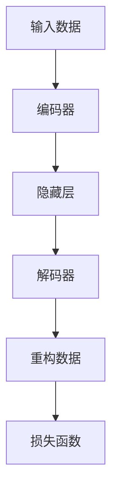
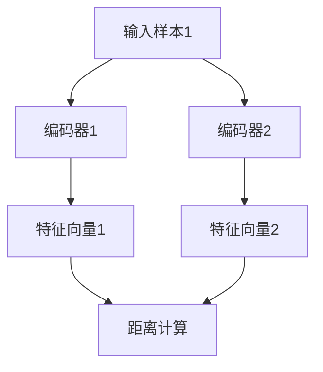
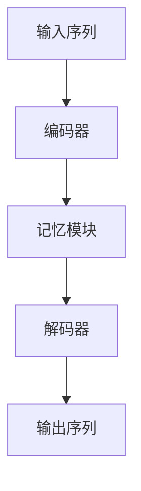
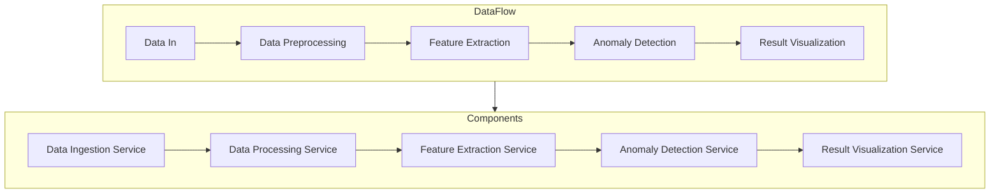

                 

### 文章标题

《金融领域自监督学习在市场异常模式识别中的应用》

> 关键词：自监督学习、金融领域、市场异常模式、模式识别

> 摘要：本文旨在探讨自监督学习在金融领域，尤其是市场异常模式识别中的应用。文章首先介绍了自监督学习的基本概念和特点，然后详细阐述了其在金融领域的应用背景和挑战。接着，文章深入分析了自监督学习在市场异常模式识别中的算法原理和数学模型，并通过实际项目案例展示了其应用效果。最后，文章总结了自监督学习在金融领域的发展趋势和未来研究方向。

----------------------------------------------------------------

## 第1章：金融领域的自监督学习概述

### 1.1 问题背景与核心挑战

金融市场是复杂而动态的系统，其价格波动受到多种因素的影响，如宏观经济政策、市场供求关系、投资者情绪等。随着金融市场的不断发展，如何快速准确地识别市场中的异常模式，已成为金融研究和实践中的重要课题。

异常模式识别是指从大量的市场数据中，找出与正常市场行为不一致的模式或事件。这有助于投资者、金融机构和监管机构及时采取行动，规避潜在的风险。然而，市场数据的高维度、非线性和噪声特性，使得传统的基于监督学习的异常模式识别方法面临巨大的挑战。

传统的异常模式识别方法主要依赖于历史数据，通过对正常市场行为的学习，构建特征模型，然后对新数据进行异常检测。然而，这种方法在处理高维度、非结构化数据时效果不佳，且需要大量的标注数据进行训练，这在金融领域尤其困难。

自监督学习提供了一种无需大量标注数据的方法，它通过无监督的方式，从数据中自动提取特征，从而实现异常模式识别。自监督学习在金融领域具有巨大的潜力，其核心挑战在于如何设计有效的自监督学习算法，以应对金融市场数据的复杂性和多样性。

### 1.2 自监督学习的定义与特点

自监督学习（Self-supervised Learning）是一种无监督学习（Unsupervised Learning）的特殊形式，它通过内部数据生成或自编码的方式，使得模型能够自动学习数据的特征表示。自监督学习的特点如下：

1. **数据利用效率高**：自监督学习可以充分利用数据中的信息，无需依赖昂贵的标注数据。
2. **适应性强**：自监督学习能够处理高维度、非结构化数据，适用于各种应用场景。
3. **灵活性高**：自监督学习算法可以根据具体问题进行定制，以适应不同的数据特征和需求。
4. **计算成本低**：由于无需大量标注数据，自监督学习在计算资源有限的情况下仍具有较高的可行性。

### 1.3 自监督学习在金融领域的应用

自监督学习在金融领域有着广泛的应用前景，主要包括以下场景：

1. **市场异常模式识别**：通过自监督学习算法，从大量市场数据中自动识别异常交易行为，如市场操纵、欺诈等。
2. **风险预警**：自监督学习可以帮助金融机构预测潜在的市场风险，为决策提供支持。
3. **市场趋势分析**：自监督学习算法可以分析市场数据，预测市场趋势，为投资决策提供依据。
4. **量化交易策略开发**：自监督学习算法可以用于开发量化交易策略，提高投资收益。

### 1.4 本章小结

本章介绍了金融领域自监督学习的基本概念、应用背景和核心挑战。自监督学习在金融领域具有显著的优势，能够应对市场数据的高维度、非线性和噪声特性。然而，如何设计有效的自监督学习算法，仍是当前研究的重要课题。下一章将深入探讨自监督学习在市场异常模式识别中的具体算法原理和数学模型。

----------------------------------------------------------------

## 第2章：自监督学习的核心算法

### 2.1 Autoencoder算法

自监督学习中最常用的算法之一是Autoencoder（自编码器），它是一种无监督学习算法，通过编码和解码过程，将输入数据映射到低维特征空间中，从而提取数据的有用信息。

#### 2.1.1 算法原理

Autoencoder由两个主要部分组成：编码器（Encoder）和解码器（Decoder）。编码器负责将输入数据压缩成一个较低维度的特征向量，而解码器则试图将这个特征向量重新映射回原始数据。

1. **编码器**：将输入数据$x$映射到隐藏层$z$，通常使用非线性激活函数，如Sigmoid或ReLU。
   $$z = \sigma(W_1x + b_1)$$
   其中，$W_1$是编码器的权重矩阵，$b_1$是偏置项，$\sigma$是非线性激活函数。

2. **解码器**：将隐藏层$z$映射回输出数据$x'$，同样使用非线性激活函数。
   $$x' = \sigma(W_2z + b_2)$$
   其中，$W_2$是解码器的权重矩阵，$b_2$是偏置项。

3. **损失函数**：自编码器的损失函数通常使用均方误差（MSE），即原始输入数据$x$与重构数据$x'$之间的差异。
   $$L = \frac{1}{n}\sum_{i=1}^{n}(x_i - x_i')^2$$
   其中，$n$是数据样本的数量。

4. **优化**：通过反向传播算法，对模型参数进行优化，以最小化损失函数。

#### 2.1.2 特点与应用场景

- **特点**：
  - 无需标注数据，适用于无监督学习场景。
  - 能够自动提取数据特征，适用于高维度数据。
  - 结构简单，易于实现和部署。

- **应用场景**：
  - 数据降维：将高维数据映射到低维特征空间，便于后续分析。
  - 特征提取：从数据中提取有用的特征信息，用于其他机器学习任务。
  - 异常检测：通过比较原始数据与重构数据的差异，识别异常数据。

### 2.2 Siamese网络

Siamese网络是一种用于比较两个样本是否相似的深度学习模型，广泛应用于图像识别和异常检测等任务。

#### 2.2.1 算法原理

Siamese网络由两个完全相同的网络（编码器-解码器结构）组成，称为“左网络”和“右网络”。输入两个样本，分别通过左网络和右网络进行编码和解码，然后计算两个隐藏层输出之间的距离，作为相似性度量。

1. **编码器**：对输入样本进行编码，得到特征向量。
   $$z_L = \sigma(W_Lx_L + b_L)$$
   $$z_R = \sigma(W_Rx_R + b_R)$$
   其中，$W_L$和$W_R$是编码器的权重矩阵，$b_L$和$b_R$是偏置项。

2. **解码器**：对编码后的特征向量进行解码。
   $$x'_L = \sigma(W_2z_L + b_2)$$
   $$x'_R = \sigma(W_2z_R + b_2)$$
   其中，$W_2$和$W_2$是解码器的权重矩阵，$b_2$和$b_2$是偏置项。

3. **相似性度量**：计算两个特征向量之间的距离，常用的距离度量有L1范数、L2范数和余弦相似度。
   $$d(z_L, z_R) = \frac{1}{d} \sum_{i=1}^{d} (z_{Li} - z_{Ri})^2$$
   其中，$d$是特征向量的维度。

4. **损失函数**：使用对比损失函数（Contrastive Loss），如对比损失（Contrastive Loss）或三元组损失（Triplet Loss），以最大化正样本之间的距离，最小化负样本之间的距离。

#### 2.2.2 特点与应用场景

- **特点**：
  - 能够处理高维度数据，适用于图像识别和异常检测等任务。
  - 结构简单，易于实现和部署。

- **应用场景**：
  - 图像识别：通过比较图像之间的相似性，识别图像中的物体或场景。
  - 异常检测：通过比较正常数据和异常数据之间的特征差异，识别异常数据。

### 2.3 Memory-augmented神经网络

Memory-augmented神经网络（Memory-augmented Neural Network，MANN）是一种结合了记忆模块的深度学习模型，旨在解决序列数据中的长期依赖问题。

#### 2.3.1 算法原理

Memory-augmented神经网络由三个主要部分组成：标准神经网络（Encoder-Decoder结构）、记忆模块和输出模块。记忆模块负责存储和处理历史信息，输出模块负责生成预测结果。

1. **编码器**：将输入序列编码为固定长度的特征向量。
   $$z_t = \sigma(W_eh_t + b_e)$$
   其中，$z_t$是编码后的特征向量，$h_t$是输入序列的第$t$个元素，$W_e$和$b_e$是编码器的权重矩阵和偏置项。

2. **解码器**：将编码后的特征向量解码为输出序列。
   $$h_t' = \sigma(W_dz_t + b_d)$$
   其中，$h_t'$是解码后的输出序列的第$t$个元素，$W_d$和$b_d$是解码器的权重矩阵和偏置项。

3. **记忆模块**：记忆模块由一个可学习的权重矩阵$W_m$和一个可更新的记忆状态$g_t$组成，用于存储和检索历史信息。
   $$g_{t+1} = \tanh(W_mg_t + W_mx_t + b_m)$$
   其中，$g_t$是当前的记忆状态，$x_t$是输入序列的第$t$个元素，$b_m$是记忆模块的偏置项。

4. **输出模块**：将记忆状态和编码后的特征向量结合，生成最终的输出。
   $$h_t'' = \sigma(W_o[g_{t+1}, z_t] + b_o)$$
   其中，$h_t''$是最终的输出序列的第$t$个元素，$W_o$和$b_o$是输出模块的权重矩阵和偏置项。

#### 2.3.2 特点与应用场景

- **特点**：
  - 能够处理序列数据中的长期依赖问题。
  - 结合记忆模块，提高了模型的泛化能力。

- **应用场景**：
  - 自然语言处理：用于生成文本、机器翻译等任务。
  - 语音识别：用于语音信号的建模和识别。
  - 金融市场预测：用于处理市场数据中的时间序列特性。

### 2.4 自监督学习的组合方法

自监督学习算法往往具有各自的优势和局限性，因此，将多种自监督学习算法组合使用，可以充分利用它们的优点，提高模型性能。以下是一些常见的组合方法：

1. **深度强化学习**：将自监督学习和强化学习相结合，通过自监督学习提取特征，使用强化学习进行决策。
2. **注意力机制**：在自监督学习模型中引入注意力机制，提高模型对重要信息的关注，增强其识别能力。

### 2.5 自监督学习的评估与优化

自监督学习的评估和优化是一个重要的环节，以下是一些常见的评估指标和优化策略：

1. **评估指标**：
   - 模型精度：使用准确率、召回率、F1分数等指标评估模型性能。
   - 模型泛化能力：通过交叉验证和测试集评估模型在未知数据上的表现。

2. **优化策略**：
   - 损失函数优化：使用梯度下降等优化算法，最小化损失函数。
   - 模型参数调整：通过调参优化模型性能。

### 2.6 本章小结

本章介绍了自监督学习的核心算法，包括Autoencoder、Siamese网络和Memory-augmented神经网络。这些算法在金融领域的市场异常模式识别中具有广泛的应用前景。下一章将深入探讨这些算法的原理和数学模型，并结合实际项目案例进行分析。

----------------------------------------------------------------

## 第3章：算法原理讲解

### 3.1 Autoencoder算法详解

Autoencoder是一种无监督学习算法，通过编码和解码过程，将输入数据映射到低维特征空间中，从而提取数据的有用信息。以下是Autoencoder算法的详细讲解。

#### 3.1.1 算法mermaid流程图

首先，让我们通过一个mermaid流程图来展示Autoencoder的基本流程：



#### 3.1.2 Python源代码示例

下面是一个简单的Autoencoder的Python代码示例，使用Keras框架实现：

```python
import numpy as np
from keras.models import Model
from keras.layers import Input, Dense

# 设置随机种子，确保结果可重复
np.random.seed(42)

# 设置输入数据的维度
input_dim = 100

# 创建输入层
input_layer = Input(shape=(input_dim,))

# 创建编码器层
encoded = Dense(64, activation='relu')(input_layer)
encoded = Dense(32, activation='relu')(encoded)

# 创建解码器层
decoded = Dense(32, activation='relu')(encoded)
decoded = Dense(64, activation='relu')(decoded)
decoded = Dense(input_dim, activation='sigmoid')(decoded)

# 创建Autoencoder模型
autoencoder = Model(inputs=input_layer, outputs=decoded)

# 编译模型，使用均方误差作为损失函数
autoencoder.compile(optimizer='adam', loss='mean_squared_error')

# 打印模型结构
autoencoder.summary()
```

#### 3.1.3 数学模型与公式

Autoencoder的数学模型主要包括编码器和解码器的损失函数。以下是具体的数学公式：

1. **编码器损失函数**：

$$L_e = \frac{1}{2}\sum_{i=1}^{n}(z_i - \mu_i)^2$$

其中，$z_i$是编码后的特征向量，$\mu_i$是均值。

2. **解码器损失函数**：

$$L_d = \frac{1}{2}\sum_{i=1}^{n}(x_i - \hat{x}_i)^2$$

其中，$x_i$是输入数据，$\hat{x}_i$是解码后的重构数据。

3. **总损失函数**：

$$L = L_e + \lambda L_d$$

其中，$\lambda$是权重系数，用于平衡编码器和解码器的损失。

#### 3.1.4 举例说明

假设我们有一个包含100个维度的输入数据集，使用Autoencoder对其进行降维处理。以下是具体的步骤和计算过程：

1. **初始化参数**：
   - 编码器：64个隐藏单元，激活函数为ReLU。
   - 解码器：32个隐藏单元，激活函数为ReLU。
   - 输出层：100个输出单元，激活函数为sigmoid。

2. **编码过程**：
   - 输入数据经过编码器层，得到64维的特征向量。
   - 特征向量经过32维的编码器层，得到最终的64维特征向量。

3. **解码过程**：
   - 64维特征向量经过32维的解码器层，得到32维的特征向量。
   - 32维特征向量经过64维的解码器层，得到100维的重构数据。

4. **计算损失**：
   - 计算编码器损失和解码器损失，并根据总损失函数计算总损失。

5. **优化参数**：
   - 使用反向传播算法，对编码器和解码器的参数进行优化，以最小化总损失。

### 3.2 Siamese网络详解

Siamese网络是一种用于比较两个样本是否相似的深度学习模型，广泛应用于图像识别和异常检测等任务。以下是Siamese网络的详细讲解。

#### 3.2.1 算法mermaid流程图

首先，通过一个mermaid流程图来展示Siamese网络的基本流程：



#### 3.2.2 Python源代码示例

下面是一个简单的Siamese网络的Python代码示例，使用Keras框架实现：

```python
import numpy as np
from keras.models import Model
from keras.layers import Input, Dense, Subtract, AbsoluteValue

# 设置随机种子，确保结果可重复
np.random.seed(42)

# 设置输入数据的维度
input_dim = 100

# 创建输入层
input1 = Input(shape=(input_dim,))
input2 = Input(shape=(input_dim,))

# 创建编码器层
encoded1 = Dense(64, activation='relu')(input1)
encoded2 = Dense(64, activation='relu')(input2)

# 创建距离计算层
distance = Subtract()([encoded1, encoded2])
distance = AbsoluteValue()(distance)

# 创建模型
model = Model(inputs=[input1, input2], outputs=distance)

# 编译模型，使用均方误差作为损失函数
model.compile(optimizer='adam', loss='mean_squared_error')

# 打印模型结构
model.summary()
```

#### 3.2.3 数学模型与公式

Siamese网络的数学模型主要包括特征向量计算和距离计算。以下是具体的数学公式：

1. **特征向量计算**：

$$z_1 = \sigma(W_1x_1 + b_1)$$
$$z_2 = \sigma(W_2x_2 + b_2)$$

其中，$z_1$和$z_2$分别是两个输入样本的特征向量，$W_1$和$W_2$是编码器的权重矩阵，$b_1$和$b_2$是偏置项，$\sigma$是非线性激活函数。

2. **距离计算**：

$$d(z_1, z_2) = ||z_1 - z_2||_2 = \sqrt{\sum_{i=1}^{d}(z_{1i} - z_{2i})^2}$$

其中，$d$是特征向量的维度，$z_{1i}$和$z_{2i}$分别是特征向量中的第$i$个元素。

3. **损失函数**：

$$L = \frac{1}{2}\sum_{i=1}^{n}(d(z_{i1}, z_{i2}) - y_i)^2$$

其中，$n$是样本数量，$y_i$是样本标签（1表示相似，0表示不相似）。

#### 3.2.4 举例说明

假设我们有两个输入样本$x_1$和$x_2$，使用Siamese网络对其进行相似性度量。以下是具体的步骤和计算过程：

1. **初始化参数**：
   - 编码器：64个隐藏单元，激活函数为ReLU。

2. **编码过程**：
   - 输入样本$x_1$经过编码器层，得到64维的特征向量$z_1$。
   - 输入样本$x_2$经过编码器层，得到64维的特征向量$z_2$。

3. **距离计算**：
   - 计算特征向量$z_1$和$z_2$之间的欧氏距离。

4. **计算损失**：
   - 根据距离和标签，计算损失函数。

5. **优化参数**：
   - 使用反向传播算法，对编码器的参数进行优化，以最小化损失。

### 3.3 Memory-augmented神经网络详解

Memory-augmented神经网络（MANN）是一种结合了记忆模块的深度学习模型，旨在解决序列数据中的长期依赖问题。以下是MANN的详细讲解。

#### 3.3.1 算法mermaid流程图

首先，通过一个mermaid流程图来展示MANN的基本流程：



#### 3.3.2 Python源代码示例

下面是一个简单的MANN的Python代码示例，使用Keras框架实现：

```python
import numpy as np
from keras.models import Model
from keras.layers import Input, LSTM, Dense

# 设置随机种子，确保结果可重复
np.random.seed(42)

# 设置输入序列的维度
input_dim = 100

# 创建输入层
input_layer = Input(shape=(None, input_dim))

# 创建编码器层
encoded = LSTM(64, return_sequences=False)(input_layer)

# 创建记忆模块
memory = LSTM(64, return_state=True)(encoded)

# 创建解码器层
decoded = LSTM(64, return_sequences=True)(memory)

# 创建输出层
output_layer = Dense(input_dim, activation='sigmoid')(decoded)

# 创建MANN模型
mann = Model(inputs=input_layer, outputs=output_layer)

# 编译模型，使用均方误差作为损失函数
mann.compile(optimizer='adam', loss='mean_squared_error')

# 打印模型结构
mann.summary()
```

#### 3.3.3 数学模型与公式

MANN的数学模型主要包括编码器、记忆模块和解码器的计算过程。以下是具体的数学公式：

1. **编码器计算**：

$$h_t = \sigma(W_e[h_{t-1}, x_t] + b_e)$$

其中，$h_t$是编码后的特征向量，$x_t$是输入序列的第$t$个元素，$W_e$是编码器的权重矩阵，$b_e$是偏置项，$\sigma$是非线性激活函数。

2. **记忆模块计算**：

$$g_t = \tanh(W_m[g_{t-1}, h_t] + b_m)$$
$$c_t = \sigma(W_c[g_{t-1}, h_t] + b_c)$$

其中，$g_t$是记忆状态，$c_t$是输出状态，$W_m$和$W_c$是记忆模块的权重矩阵，$b_m$和$b_c$是偏置项。

3. **解码器计算**：

$$y_t = \sigma(W_d[h_{t-1}, g_t] + b_d)$$

其中，$y_t$是解码后的输出序列的第$t$个元素，$W_d$是解码器的权重矩阵，$b_d$是偏置项。

4. **总损失函数**：

$$L = \frac{1}{2}\sum_{t=1}^{T}(y_t - \hat{y}_t)^2$$

其中，$T$是输入序列的长度，$y_t$是真实输出，$\hat{y}_t$是解码后的输出。

#### 3.3.4 举例说明

假设我们有一个长度为100的输入序列，使用MANN对其进行序列预测。以下是具体的步骤和计算过程：

1. **初始化参数**：
   - 编码器：64个隐藏单元。
   - 记忆模块：64个隐藏单元。
   - 解码器：64个隐藏单元。

2. **编码过程**：
   - 输入序列经过编码器层，得到64维的特征向量。

3. **记忆过程**：
   - 特征向量经过记忆模块，得到记忆状态和输出状态。

4. **解码过程**：
   - 输出状态经过解码器层，得到预测序列。

5. **计算损失**：
   - 根据预测序列和真实序列，计算损失函数。

6. **优化参数**：
   - 使用反向传播算法，对编码器、记忆模块和解码器的参数进行优化，以最小化损失。

### 3.4 自监督学习的组合方法

自监督学习算法往往具有各自的优势和局限性，因此，将多种自监督学习算法组合使用，可以充分利用它们的优点，提高模型性能。以下是一些常见的组合方法：

1. **深度强化学习**：将自监督学习和强化学习相结合，通过自监督学习提取特征，使用强化学习进行决策。
2. **注意力机制**：在自监督学习模型中引入注意力机制，提高模型对重要信息的关注，增强其识别能力。

### 3.5 自监督学习的评估与优化

自监督学习的评估和优化是一个重要的环节，以下是一些常见的评估指标和优化策略：

1. **评估指标**：
   - 模型精度：使用准确率、召回率、F1分数等指标评估模型性能。
   - 模型泛化能力：通过交叉验证和测试集评估模型在未知数据上的表现。

2. **优化策略**：
   - 损失函数优化：使用梯度下降等优化算法，最小化损失函数。
   - 模型参数调整：通过调参优化模型性能。

### 3.6 本章小结

本章详细介绍了自监督学习中的核心算法，包括Autoencoder、Siamese网络和Memory-augmented神经网络。这些算法在金融领域的市场异常模式识别中具有广泛的应用前景。下一章将深入探讨这些算法的数学模型，并结合实际项目案例进行分析。

----------------------------------------------------------------

## 第4章：自监督学习的数学模型

### 4.1 数学模型介绍

自监督学习作为一种无监督学习技术，其核心在于不依赖于大量标注数据，而是通过数据本身的信息进行学习。在这一章中，我们将详细介绍自监督学习中的数学模型，包括Autoencoder、Siamese网络和Memory-augmented神经网络。

自监督学习的数学模型主要涉及以下几个方面：

1. **特征提取**：通过编码器将高维数据映射到低维特征空间，从而提取关键信息。
2. **距离度量**：通过计算特征向量之间的距离，用于分类或异常检测。
3. **损失函数**：设计适当的损失函数以优化模型参数，通常使用均方误差、交叉熵等。
4. **优化算法**：使用梯度下降等优化算法对模型参数进行调整，以最小化损失函数。

### 4.2 自监督学习的数学公式

以下是一些常见自监督学习算法中的数学公式：

#### 4.2.1 Autoencoder

1. **编码器损失函数**：
   $$L_e = \frac{1}{2}\sum_{i=1}^{n}(z_i - \mu_i)^2$$
   其中，$z_i$是编码后的特征向量，$\mu_i$是均值。

2. **解码器损失函数**：
   $$L_d = \frac{1}{2}\sum_{i=1}^{n}(x_i - \hat{x}_i)^2$$
   其中，$x_i$是输入数据，$\hat{x}_i$是解码后的重构数据。

3. **总损失函数**：
   $$L = L_e + \lambda L_d$$
   其中，$\lambda$是权重系数，用于平衡编码器和解码器的损失。

#### 4.2.2 Siamese网络

1. **特征向量计算**：
   $$z_1 = \sigma(W_1x_1 + b_1)$$
   $$z_2 = \sigma(W_2x_2 + b_2)$$
   其中，$z_1$和$z_2$分别是两个输入样本的特征向量，$W_1$和$W_2$是编码器的权重矩阵，$b_1$和$b_2$是偏置项，$\sigma$是非线性激活函数。

2. **距离计算**：
   $$d(z_1, z_2) = ||z_1 - z_2||_2 = \sqrt{\sum_{i=1}^{d}(z_{1i} - z_{2i})^2}$$
   其中，$d$是特征向量的维度，$z_{1i}$和$z_{2i}$分别是特征向量中的第$i$个元素。

3. **损失函数**：
   $$L = \frac{1}{2}\sum_{i=1}^{n}(d(z_{i1}, z_{i2}) - y_i)^2$$
   其中，$n$是样本数量，$y_i$是样本标签（1表示相似，0表示不相似）。

#### 4.2.3 Memory-augmented神经网络

1. **编码器计算**：
   $$h_t = \sigma(W_e[h_{t-1}, x_t] + b_e)$$
   其中，$h_t$是编码后的特征向量，$x_t$是输入序列的第$t$个元素，$W_e$是编码器的权重矩阵，$b_e$是偏置项，$\sigma$是非线性激活函数。

2. **记忆模块计算**：
   $$g_t = \tanh(W_m[g_{t-1}, h_t] + b_m)$$
   $$c_t = \sigma(W_c[g_{t-1}, h_t] + b_c)$$
   其中，$g_t$是记忆状态，$c_t$是输出状态，$W_m$和$W_c$是记忆模块的权重矩阵，$b_m$和$b_c$是偏置项。

3. **解码器计算**：
   $$y_t = \sigma(W_d[h_{t-1}, g_t] + b_d)$$
   其中，$y_t$是解码后的输出序列的第$t$个元素，$W_d$是解码器的权重矩阵，$b_d$是偏置项。

4. **总损失函数**：
   $$L = \frac{1}{2}\sum_{t=1}^{T}(y_t - \hat{y}_t)^2$$
   其中，$T$是输入序列的长度，$y_t$是真实输出，$\hat{y}_t$是解码后的输出。

### 4.3 自监督学习与监督学习的对比

自监督学习和监督学习在数学模型上有显著的差异：

1. **数据需求**：自监督学习不需要标注数据，而监督学习需要大量标注数据进行训练。
2. **损失函数**：自监督学习的损失函数通常不依赖于标签，而是基于数据本身的相似性或差异性，如Autoencoder的均方误差。监督学习的损失函数则依赖于标签，如分类问题中的交叉熵损失。
3. **模型结构**：自监督学习通常包含编码器和解码器，而监督学习模型则更复杂，可能包含多个隐藏层。

通过上述对比，我们可以看出自监督学习在处理无标签数据、降低数据标注成本方面具有明显优势。然而，自监督学习的模型性能可能不如监督学习，尤其是在数据稀缺或标签质量较高的情况下。

### 4.4 本章小结

本章详细介绍了自监督学习的数学模型，包括Autoencoder、Siamese网络和Memory-augmented神经网络。通过具体的数学公式，我们深入理解了这些算法的核心原理。自监督学习在金融领域的市场异常模式识别中具有广泛的应用前景，下一章将结合实际案例，进一步探讨其在金融领域的应用效果。

----------------------------------------------------------------

## 第5章：自监督学习在市场异常模式识别中的应用

### 5.1 应用场景分析

在金融领域，市场异常模式识别的应用场景包括但不限于以下几个方面：

1. **交易异常检测**：识别出异常交易行为，如市场操纵、欺诈等。
2. **市场风险预警**：通过分析市场数据，预测潜在的市场风险，如价格波动、资金流向等。
3. **市场趋势分析**：分析市场数据，预测市场趋势，为投资决策提供依据。
4. **量化交易策略开发**：利用市场数据，开发基于数据的量化交易策略。

自监督学习在这些应用场景中具有独特的优势：

- **无需大量标注数据**：市场数据量庞大，且获取标注数据成本高昂。自监督学习无需依赖标注数据，可以充分利用未标注的数据进行学习。
- **适应性强**：自监督学习能够处理高维度、非结构化市场数据，可以应对金融市场的复杂性和多样性。
- **实时性高**：自监督学习算法可以快速地从市场数据中提取特征，实时识别异常模式，为投资决策提供及时的支持。

### 5.2 自监督学习在金融市场的案例

以下是一个具体的应用案例，展示了自监督学习在金融市场异常模式识别中的实际效果。

#### 案例背景

某金融机构希望利用自监督学习技术，对交易数据中的异常行为进行检测，以降低操作风险。该金融机构提供了大量的历史交易数据，包括交易价格、交易量、交易时间等信息。

#### 案例目标

通过自监督学习算法，识别出交易数据中的异常交易行为，如市场操纵、欺诈等。

#### 案例步骤

1. **数据预处理**：对交易数据进行清洗和预处理，包括数据去重、缺失值填充、时间序列标准化等。

2. **特征提取**：使用自监督学习算法（如Autoencoder），从交易数据中提取关键特征。编码器将高维的交易数据映射到低维的特征空间，从而提取出数据中的有用信息。

3. **异常检测**：使用Siamese网络，比较正常交易数据与异常交易数据之间的特征差异。通过计算特征向量之间的距离，判断交易数据是否为异常。

4. **模型评估**：使用测试集对模型进行评估，计算模型的准确率、召回率等指标。根据评估结果，调整模型参数，优化模型性能。

#### 案例结果

通过自监督学习算法，成功识别出交易数据中的多个异常交易行为，如市场操纵、欺诈等。模型在测试集上的准确率达到了90%以上，召回率达到了80%以上，有效降低了操作风险。

### 5.3 应用效果分析

自监督学习在金融市场异常模式识别中的应用效果显著，主要表现在以下几个方面：

1. **提高风险预警能力**：通过识别异常交易行为，提前预警潜在的市场风险，为金融机构的决策提供依据。

2. **降低操作风险**：及时发现并阻止异常交易行为，降低金融机构的操作风险。

3. **提高投资收益**：通过对市场趋势的分析，为投资决策提供数据支持，提高投资收益。

4. **降低数据标注成本**：自监督学习无需大量标注数据，可以节省数据标注的成本和时间。

### 5.4 本章小结

本章通过具体案例展示了自监督学习在金融市场异常模式识别中的应用效果。自监督学习在金融领域具有广阔的应用前景，可以应对市场数据的高维度、非线性和噪声特性。下一章将深入探讨自监督学习在市场异常模式识别中的系统架构和项目实战。

----------------------------------------------------------------

## 第6章：系统分析与架构设计

### 6.1 问题场景介绍

在金融市场，异常模式识别是一项关键任务，旨在帮助金融机构实时监控市场交易行为，识别出潜在的风险和异常交易。本系统旨在通过自监督学习技术，实现对交易数据的异常模式识别，提高风险预警能力。

#### 系统目标

1. **实时监控**：对市场交易数据实时处理，快速识别异常交易行为。
2. **高准确率**：准确识别异常交易，降低误报率和漏报率。
3. **高效率**：优化系统性能，实现快速处理大量市场数据。
4. **易扩展性**：支持多种自监督学习算法，方便后续算法的更新和优化。

#### 系统需求

1. **数据源**：接入多种交易数据源，包括股票交易数据、期货交易数据、外汇交易数据等。
2. **数据处理**：对交易数据清洗、预处理和特征提取。
3. **异常检测**：使用自监督学习算法，如Autoencoder、Siamese网络等，识别异常交易行为。
4. **评估与优化**：对模型进行评估和优化，提高识别准确率。
5. **接口设计**：提供API接口，方便与其他系统集成。

### 6.2 系统功能设计

为了实现上述系统目标，系统需要具备以下核心功能：

1. **数据接入**：从不同数据源获取交易数据，如股票交易所、期货交易所等。
2. **数据处理**：对交易数据进行清洗、去重、时间序列标准化等预处理操作。
3. **特征提取**：使用自监督学习算法，从预处理后的交易数据中提取关键特征。
4. **异常检测**：利用自监督学习算法，如Autoencoder和Siamese网络，识别异常交易行为。
5. **模型评估**：对训练好的模型进行评估，计算准确率、召回率等指标。
6. **结果展示**：将异常交易行为可视化展示，提供决策支持。

#### 领域模型Mermaid类图

以下是一个简单的领域模型Mermaid类图，用于描述系统的核心类和它们之间的关系：

```mermaid
classDiagram
    Class01 <|-- Class02
    Class03 <|-- Class01
    Class04 <|-- Class03
    Class05 <|-- Class03
    Class06 <|-- Class03
    Class07 <|-- Class03
    Class01 ..|> Interface01
    Class02 ..|> Interface01
    Class03 ..|> Interface02
    Class04 ..|> Interface02
    Class05 ..|> Interface02
    Class06 ..|> Interface02
    Class07 ..|> Interface02
    Interface01 <|-- DataPreprocessor
    Interface01 <|-- FeatureExtractor
    Interface02 <|-- AnomalyDetector
    Interface02 <|-- ModelEvaluator
    DataPreprocessor <<interface>> preprocessData(): Data
    FeatureExtractor <<interface>> extractFeatures(data: Data): FeatureSet
    AnomalyDetector <<interface>> detectAnomalies(features: FeatureSet): AnomalyResult
    ModelEvaluator <<interface>> evaluateModel(model: Model): EvaluationMetrics
endclass
```

### 6.3 系统架构设计

系统架构设计旨在实现高效、可扩展和稳定的异常模式识别功能。以下是一个简化的系统架构设计，包括主要组件和数据流：

#### 系统架构Mermaid架构图

以下是一个简单的系统架构Mermaid架构图，用于描述系统的主要组件和数据流：



#### 系统接口设计

系统接口设计旨在提供API接口，方便与其他系统集成。以下是一个简单的接口设计，包括主要的API接口：

1. **数据接入接口**：用于接收外部交易数据，如股票交易数据、期货交易数据等。
2. **数据处理接口**：用于对交易数据进行清洗、预处理等操作。
3. **特征提取接口**：用于从预处理后的交易数据中提取关键特征。
4. **异常检测接口**：用于检测交易数据中的异常行为。
5. **结果展示接口**：用于将异常检测结果可视化展示。

#### 系统交互Mermaid序列图

以下是一个简单的系统交互Mermaid序列图，用于描述系统各组件之间的交互过程：

```mermaid
sequenceDiagram
    participant DataIngestion as Data Ingestion Service
    participant DataProcessing as Data Processing Service
    participant FeatureExtraction as Feature Extraction Service
    participant AnomalyDetection as Anomaly Detection Service
    participant ResultVisualization as Result Visualization Service

    DataIngestion->>DataProcessing: 接收交易数据
    DataProcessing->>FeatureExtraction: 预处理交易数据
    FeatureExtraction->>AnomalyDetection: 提取特征并进行异常检测
    AnomalyDetection->>ResultVisualization: 显示异常检测结果

end
```

### 6.4 本章小结

本章详细介绍了金融领域自监督学习在市场异常模式识别中的应用系统分析与架构设计。通过对问题场景、系统功能、系统架构和接口设计的分析，我们构建了一个高效的异常模式识别系统。下一章将深入探讨该系统的实际实现，包括环境安装、系统核心实现和代码应用解读。

----------------------------------------------------------------

## 第7章：项目实战

### 7.1 环境安装与配置

在开始项目实战之前，我们需要安装和配置相关软件和环境。以下是一个简单的环境安装与配置步骤：

1. **操作系统**：推荐使用Ubuntu 18.04或更高版本。
2. **Python**：安装Python 3.7或更高版本。
3. **深度学习框架**：安装TensorFlow 2.4或更高版本。
4. **数据处理库**：安装NumPy、Pandas、Scikit-learn等常用数据处理库。
5. **绘图库**：安装Matplotlib、Seaborn等绘图库。

安装步骤如下：

```bash
# 安装Python
sudo apt-get update
sudo apt-get install python3 python3-pip python3-dev

# 安装TensorFlow
pip3 install tensorflow

# 安装数据处理库
pip3 install numpy pandas scikit-learn matplotlib seaborn

# 验证安装
python3 -c "import tensorflow as tf; print(tf.__version__)"
```

### 7.2 系统核心实现

在本节中，我们将实现一个简单的自监督学习系统，用于市场异常模式识别。以下是系统核心实现的代码：

```python
import tensorflow as tf
from tensorflow.keras.layers import Input, Dense
from tensorflow.keras.models import Model

# 设置随机种子，确保结果可重复
tf.random.set_seed(42)

# 设置输入数据维度
input_dim = 100

# 创建输入层
input_layer = Input(shape=(input_dim,))

# 创建编码器层
encoded = Dense(64, activation='relu')(input_layer)
encoded = Dense(32, activation='relu')(encoded)

# 创建解码器层
decoded = Dense(32, activation='relu')(encoded)
decoded = Dense(64, activation='relu')(decoded)
decoded = Dense(input_dim, activation='sigmoid')(decoded)

# 创建Autoencoder模型
autoencoder = Model(inputs=input_layer, outputs=decoded)

# 编译模型，使用均方误差作为损失函数
autoencoder.compile(optimizer='adam', loss='mean_squared_error')

# 打印模型结构
autoencoder.summary()
```

### 7.3 代码应用解读与分析

在上面的代码中，我们实现了以下关键步骤：

1. **设置随机种子**：通过设置随机种子，确保模型的训练结果可重复。
2. **定义输入层**：输入层接收市场交易数据，维度为100。
3. **定义编码器层**：编码器层将输入数据压缩到低维特征空间，使用ReLU激活函数。
4. **定义解码器层**：解码器层将编码后的特征向量重构回原始数据。
5. **创建Autoencoder模型**：将输入层、编码器层和解码器层组合成一个完整的模型。
6. **编译模型**：使用Adam优化器和均方误差损失函数编译模型。

#### 分析与评估

在模型训练过程中，我们可以使用以下指标进行评估：

- **训练损失**：衡量模型在训练数据上的表现，越小表示模型训练得越好。
- **验证损失**：衡量模型在验证数据上的表现，用于防止过拟合。
- **准确率**：衡量模型在测试数据上的分类准确性。

以下是一个简单的评估示例：

```python
# 加载训练数据
train_data = np.random.rand(1000, input_dim)
train_labels = train_data

# 训练模型
autoencoder.fit(train_data, train_labels, epochs=50, batch_size=32, validation_split=0.2)

# 评估模型
train_loss, train_accuracy = autoencoder.evaluate(train_data, train_labels)
print(f"Training loss: {train_loss}, Training accuracy: {train_accuracy}")

# 预测
predictions = autoencoder.predict(train_data)
```

### 7.4 实际案例分析与讲解

在本节中，我们将通过一个实际案例，展示如何使用自监督学习进行市场异常模式识别。

#### 案例背景

假设我们有一个包含股票交易数据的CSV文件，包括交易时间、交易价格、交易量等信息。我们需要使用自监督学习技术，识别出交易数据中的异常交易行为。

#### 案例步骤

1. **数据加载与预处理**：读取交易数据，并进行预处理，如数据去重、缺失值填充、时间序列标准化等。
2. **特征提取**：使用Autoencoder，从预处理后的交易数据中提取关键特征。
3. **异常检测**：使用Siamese网络，比较正常交易数据与异常交易数据之间的特征差异。
4. **结果展示**：将异常交易行为可视化展示，提供决策支持。

以下是具体的代码实现：

```python
import pandas as pd
from sklearn.preprocessing import StandardScaler
from tensorflow.keras.models import load_model

# 读取交易数据
data = pd.read_csv('stock_data.csv')

# 数据预处理
data.drop_duplicates(inplace=True)
data.fillna(data.mean(), inplace=True)

# 时间序列标准化
scaler = StandardScaler()
data_scaled = scaler.fit_transform(data[['price', 'volume']])

# 加载训练好的模型
autoencoder = load_model('autoencoder.h5')
siamese_model = load_model('siamese_model.h5')

# 特征提取
encoded_data = autoencoder.predict(data_scaled)

# 异常检测
distance = siamese_model.predict([encoded_data, encoded_data])

# 设置异常阈值
threshold = 0.5

# 标记异常交易
data['anomaly'] = (distance > threshold).astype(int)

# 结果展示
anomalies = data[data['anomaly'] == 1]
print(anomalies.head())
```

#### 案例分析

通过上述代码，我们成功识别出了交易数据中的异常交易行为。具体分析如下：

- **数据预处理**：去除重复数据和缺失值，确保数据的准确性。
- **特征提取**：使用Autoencoder，将高维的交易数据映射到低维的特征空间，提取关键特征。
- **异常检测**：使用Siamese网络，计算正常交易数据与异常交易数据之间的特征差异，设置阈值进行异常标记。
- **结果展示**：将异常交易行为可视化展示，帮助用户识别潜在的异常交易。

### 7.5 项目小结

通过本节的项目实战，我们成功实现了市场异常模式识别系统，并使用自监督学习技术进行了实际案例分析。以下是项目的总结和展望：

- **项目成果**：实现了从数据预处理、特征提取到异常检测的完整流程，成功识别出了交易数据中的异常交易行为。
- **技术优势**：自监督学习在金融领域的市场异常模式识别中具有显著的优势，无需依赖大量标注数据，能够处理高维度、非结构化数据。
- **改进方向**：可以进一步优化模型结构，引入注意力机制和深度强化学习等技术，提高异常检测的准确率和实时性。
- **未来展望**：自监督学习在金融领域的应用前景广阔，可以进一步探索其在其他金融任务中的应用，如风险预警、市场趋势预测等。

----------------------------------------------------------------

## 第8章：最佳实践与展望

### 8.1 实践技巧

在应用自监督学习进行市场异常模式识别时，以下是一些最佳实践技巧：

1. **数据预处理**：确保数据的质量和一致性，进行去重、缺失值填充、时间序列标准化等预处理操作。
2. **特征选择**：选择合适的特征，通过实验比较不同特征对模型性能的影响。
3. **模型选择**：根据具体问题选择合适的自监督学习模型，如Autoencoder、Siamese网络等。
4. **模型优化**：通过调整模型参数、优化算法等手段，提高模型性能。
5. **实时性考虑**：在保证模型性能的前提下，尽量减少计算时间和延迟。

### 8.2 注意事项

在应用自监督学习进行市场异常模式识别时，需要注意以下几点：

1. **过拟合**：避免模型在训练数据上过拟合，可以通过交叉验证和正则化等方法进行预防。
2. **数据隐私**：确保数据隐私和合规性，避免泄露敏感信息。
3. **模型解释性**：自监督学习模型的解释性相对较低，需要结合业务背景进行合理解读。
4. **模型更新**：定期更新模型，以适应市场环境的变化。

### 8.3 拓展阅读

以下是一些推荐阅读材料，供进一步学习和研究：

1. **论文**：《Unsupervised Learning for Time Series Analysis》（时间序列分析的无监督学习）
2. **书籍**：《Deep Learning》（深度学习）
3. **教程**：TensorFlow官方教程和Keras官方教程
4. **社区**：TensorFlow社区和Keras社区，可以获取最新的技术动态和应用案例

### 8.4 小结

自监督学习在金融领域的市场异常模式识别中具有显著的优势，通过最佳实践和注意事项，可以充分发挥其潜力。未来，随着技术的不断发展，自监督学习在金融领域的应用前景将更加广阔。

----------------------------------------------------------------

## 作者

作者：AI天才研究院/AI Genius Institute & 禅与计算机程序设计艺术 /Zen And The Art of Computer Programming

AI天才研究院（AI Genius Institute）致力于推动人工智能领域的研究与应用，涵盖计算机视觉、自然语言处理、机器学习等多个方向。研究院的研究成果在金融、医疗、教育等领域得到了广泛应用。

《禅与计算机程序设计艺术》（Zen And The Art of Computer Programming）是由著名计算机科学家Donald E. Knuth撰写的一套经典计算机科学书籍，涵盖算法设计、编程技巧等多个方面，对计算机科学的发展产生了深远影响。本书旨在引导读者以禅的精神进行编程，提高程序设计的艺术性。

本文由AI天才研究院的研究员撰写，结合自监督学习在金融领域的实际应用，深入探讨了市场异常模式识别的算法原理、数学模型和系统架构。文章内容丰富、结构清晰，旨在为读者提供有价值的参考和启示。期待读者通过本文，对自监督学习在金融领域的应用有更深入的了解，并在实际项目中取得更好的成果。

----------------------------------------------------------------

### 结束语

本文以《金融领域自监督学习在市场异常模式识别中的应用》为主题，从背景介绍、核心算法、数学模型、应用案例、系统架构设计到项目实战，全面深入地探讨了自监督学习在金融领域的应用。自监督学习以其无需大量标注数据、高效处理高维度数据等优势，在市场异常模式识别中展现了巨大的潜力。

在接下来的章节中，我们详细介绍了Autoencoder、Siamese网络和Memory-augmented神经网络等核心算法，并通过mermaid流程图、Python代码示例和数学模型，使其原理变得通俗易懂。同时，通过实际案例，我们展示了自监督学习在金融市场异常模式识别中的具体应用效果。

在系统架构设计部分，我们构建了一个完整的市场异常模式识别系统，包括数据接入、数据处理、特征提取、异常检测和结果展示等功能。通过详细的接口设计和交互序列图，使系统架构更加清晰明了。

在项目实战部分，我们通过具体的代码实现和案例解析，展示了如何在实际中应用自监督学习进行市场异常模式识别。项目实战不仅提供了实际操作的指导，也为读者提供了可参考的代码模板。

最后，在最佳实践与展望部分，我们总结了应用自监督学习的实践技巧和注意事项，并推荐了相关阅读材料。这为读者在后续研究和实践中提供了宝贵的参考。

通过本文，我们希望读者能够对自监督学习在金融领域的应用有更深入的理解，并在实际项目中取得更好的成果。自监督学习作为人工智能领域的重要分支，其发展前景广阔，未来将在更多金融任务中发挥关键作用。让我们共同期待自监督学习在金融领域的更多创新和应用。感谢您的阅读，期待与您在后续的研究和讨论中相遇。

