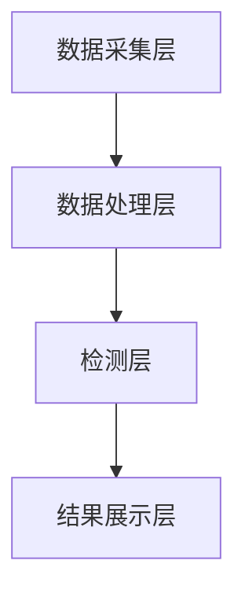
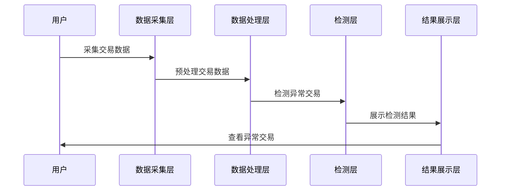

                 


## 引言

### 1.1 问题背景与研究意义

随着金融市场的快速发展，交易数据的规模和复杂性不断增加，如何高效地检测异常交易成为了一个重要的问题。异常交易检测在金融领域中具有重要意义，它不仅有助于防止欺诈行为，保护投资者的利益，还可以提高市场的透明度和稳定性。

自监督学习是一种无需依赖标签数据进行训练的机器学习技术，它通过内部数据生成伪标签来进行模型训练。近年来，自监督学习在图像识别、自然语言处理等领域取得了显著的成果。将其应用于金融领域，尤其是异常交易检测，具有重要的理论和实践价值。

本文旨在探讨金融领域自监督学习在异常交易检测中的应用，通过介绍自监督学习的核心概念、原理和算法，分析其在金融异常交易检测中的优势和挑战，并提出一种基于自监督学习的异常交易检测系统架构，以期为相关领域的研究和应用提供参考。

### 1.2 核心概念与原理

#### 1.2.1 自监督学习的定义与分类

自监督学习是一种基于未标记数据的机器学习技术。其核心思想是在数据中寻找某种内在规律，无需外部标签指导，从而进行模型训练。根据任务的不同，自监督学习可以分为以下几类：

1. **预训练与微调**：通过在大规模未标记数据集上预训练模型，然后在小规模有标签数据集上进行微调，以适应特定任务。
2. **伪标签**：使用模型对未标记数据进行预测，生成伪标签，然后用伪标签对模型进行训练。
3. **自我对比**：通过对比同一数据在不同变换下的表示，学习数据的内在特征。

#### 1.2.2 自监督学习在金融领域的应用

在金融领域，自监督学习可以应用于以下几个方面：

1. **数据增强**：通过对交易数据进行各种变换，如时间窗口变化、数据归一化等，生成新的数据集，以提高模型的泛化能力。
2. **特征提取**：从大量的交易数据中提取有用的特征，如市场趋势、波动性等，用于异常交易检测。
3. **分类与预测**：利用自监督学习模型对交易数据进行分类和预测，识别潜在的异常交易。

#### 1.2.3 自监督学习算法

自监督学习算法可以分为以下几类：

1. **基于自动编码器的算法**：如自编码器（Autoencoder）、变分自编码器（Variational Autoencoder，VAE）等，通过最小化重构误差来学习数据表示。
2. **基于对比学习的算法**：如对比自监督学习（Contrastive Self-Supervised Learning，CSSL）、非对比自监督学习（Non-Contrastive Self-Supervised Learning，NCSSL）等，通过对比不同数据样本的相似性来学习特征。
3. **基于生成对抗网络（GAN）的算法**：如条件生成对抗网络（Conditional GAN，cGAN）、去噪生成对抗网络（Denoising GAN，DnGAN）等，通过生成器和判别器的对抗训练来学习数据分布。

### 1.3 数学模型与公式

在自监督学习中，数学模型和公式是核心组成部分。以下简要介绍几种常见的自监督学习算法及其数学模型：

#### 1.3.1 自编码器（Autoencoder）

自编码器是一种无监督学习算法，通过编码器和解码器对输入数据进行编码和解码，以最小化重构误差。其数学模型如下：

$$
\text{编码器}: x \rightarrow z = f_E(x)
$$

$$
\text{解码器}: z \rightarrow x' = f_D(z)
$$

其中，$x$是输入数据，$z$是编码后的数据，$x'$是解码后的数据，$f_E$和$f_D$分别表示编码器和解码器的函数。

重构误差可以使用均方误差（Mean Squared Error，MSE）来衡量：

$$
\text{MSE} = \frac{1}{n}\sum_{i=1}^{n}(x_i - x_i')^2
$$

其中，$n$是样本数量。

#### 1.3.2 变分自编码器（Variational Autoencoder，VAE）

变分自编码器是一种基于概率模型的生成模型，通过引入潜在变量来生成数据。其数学模型如下：

$$
p(z|x) = \mathcal{N}(z; \mu(x), \sigma^2(x))
$$

$$
x = g(z)
$$

其中，$z$是潜在变量，$\mu(x)$和$\sigma^2(x)$是编码器的输出，表示潜在变量的均值和方差，$g(z)$是解码器的函数。

变分自编码器的损失函数由数据分布的KL散度损失和重构误差组成：

$$
\text{Loss} = -\sum_{z} p(z|x) \log p(z) - \frac{1}{2} \sum_{z} \log(\sigma^2(x) + \mu^2(x))
$$

#### 1.3.3 对比自监督学习（Contrastive Self-Supervised Learning，CSSL）

对比自监督学习通过对比数据样本的相似性来学习特征。其核心思想是最大化正样本的相似性，同时最小化负样本的相似性。其数学模型如下：

$$
\text{正样本相似性}: \text{sim}(x, x^+) = f(x, x^+)
$$

$$
\text{负样本相似性}: \text{sim}(x, x^-) = f(x, x^-)
$$

其中，$x$和$x^+$是正样本，$x$和$x^-$是负样本，$f$是相似性函数。

对比自监督学习的损失函数通常使用对比损失（Contrastive Loss）来衡量：

$$
\text{Contrastive Loss} = -\frac{1}{2}\sum_{i=1}^{n} \left[ \text{log}(\text{sim}(x_i, x_i^+)) - \text{log}(\text{sim}(x_i, x_i^-)) \right]
$$

其中，$n$是样本数量。

## 系统分析与架构设计

### 2.1 问题场景与系统需求

#### 2.1.1 问题场景

在金融领域，异常交易检测是一项至关重要的任务。随着金融市场的不断发展和交易方式的多样化，异常交易的形式也越来越复杂。这些异常交易可能包括欺诈交易、市场操纵、账户盗用等，它们不仅会对投资者的利益造成损害，还可能影响整个市场的稳定。

#### 2.1.2 系统需求

为了实现高效的异常交易检测，系统需要满足以下需求：

1. **实时性**：系统需要能够实时处理大量的交易数据，并在短时间内完成异常交易检测。
2. **准确性**：系统需要能够准确识别异常交易，降低误报和漏报率。
3. **可扩展性**：系统需要能够适应不断增长的数据规模，并在硬件和网络资源有限的情况下保持高效运行。
4. **易维护性**：系统需要具有较好的可维护性，便于系统的升级和维护。

### 2.2 系统功能设计

#### 2.2.1 领域模型

领域模型是系统功能设计的基础。在异常交易检测系统中，主要的领域模型包括交易数据模型、异常交易模型和规则模型。

1. **交易数据模型**：交易数据模型描述了交易数据的基本属性，如交易金额、交易时间、交易账户等。
2. **异常交易模型**：异常交易模型描述了异常交易的特征，如交易金额波动性、交易频率等。
3. **规则模型**：规则模型定义了检测异常交易的规则，如交易金额超出阈值、连续交易次数超过阈值等。

#### 2.2.2 类图

类图是领域模型的图形表示。在异常交易检测系统中，类图主要包括交易数据类、异常交易类和规则类。

```mermaid
classDiagram
    class 交易数据{
        -金额：float
        -时间：datetime
        -账户：string
    }
    class 异常交易{
        -交易数据：交易数据
        -交易金额波动性：float
        -交易频率：int
    }
    class 规则{
        -规则名称：string
        -规则条件：string
        -阈值：float
    }
    交易数据 <>-- 异常交易: 检测
    规则 --> 异常交易: 规则条件
```

### 2.3 系统架构设计

#### 2.3.1 系统架构

系统架构是系统设计的核心。在异常交易检测系统中，系统架构包括数据采集层、数据处理层、检测层和结果展示层。

1. **数据采集层**：负责从各种数据源采集交易数据，如交易所、银行等。
2. **数据处理层**：负责对采集到的交易数据进行预处理，包括数据清洗、归一化等操作。
3. **检测层**：负责使用自监督学习模型对预处理后的交易数据进行异常交易检测。
4. **结果展示层**：负责将检测结果展示给用户，包括异常交易列表、交易详情等。

#### 2.3.2 架构设计

架构设计包括系统架构图和系统交互图。

1. **系统架构图**：



2. **系统交互图**：



## 项目实战

### 3.1 环境安装

在开始项目实战之前，我们需要安装相关的软件和依赖。以下是在Ubuntu 18.04系统上安装Python环境、TensorFlow和Keras的过程：

1. 安装Python：

```
sudo apt-get update
sudo apt-get install python3-pip python3-dev
```

2. 安装TensorFlow：

```
pip3 install tensorflow
```

3. 安装Keras：

```
pip3 install keras
```

### 3.2 系统核心实现

在本项目中，我们将使用自监督学习算法中的变分自编码器（VAE）来检测异常交易。以下是系统核心实现的Python代码：

```python
from keras.layers import Input, Dense, Lambda
from keras.models import Model
from keras import backend as K
from keras import objectives
import numpy as np

def vae_model(input_shape, latent_dim):
    # 输入层
    input_img = Input(shape=input_shape)
    
    # 编码器
    x = Dense(64, activation='relu')(input_img)
    x = Dense(32, activation='relu')(x)
    z_mean = Dense(latent_dim)(x)
    z_log_var = Dense(latent_dim)(x)
    
    # 重参数化
    z = Lambda(lambda x: x * K.exp(0.5 * x))(z_log_var)
    z = Lambda(lambda x: x + z_mean)(z)
    
    # 解码器
    x_decoded_mean = Dense(32, activation='relu')(z)
    x_decoded_mean = Dense(64, activation='sigmoid')(x_decoded_mean)
    output_img = Dense(input_shape, activation='sigmoid')(x_decoded_mean)
    
    # 模型
    vae = Model(input_img, output_img)
    return vae

def vae_loss(x, x_decoded_mean):
    xent_loss = objectives.binary_crossentropy(x, x_decoded_mean)
    kl_loss = -0.5 * K.sum(1 + z_log_var - K.square(z_mean) - K.exp(z_log_var), axis=-1)
    return K.mean(xent_loss + kl_loss)

vae = vae_model(input_shape=(784,), latent_dim=20)
vae.compile(optimizer='rmsprop', loss=vae_loss)

# 加载数据
(x_train, _), (x_test, _) = mnist.load_data()
x_train = x_train / 255.
x_test = x_test / 255.

# 训练模型
vae.fit(x_train, x_train,
        shuffle=True,
        epochs=50,
        batch_size=16,
        validation_data=(x_test, x_test))
```

### 3.3 代码应用解读与分析

在本节中，我们将对上述代码进行解读和分析，了解变分自编码器（VAE）的工作原理及其在异常交易检测中的应用。

#### 3.3.1 VAE模型

VAE模型由两部分组成：编码器和解码器。编码器将输入数据映射到潜在空间，解码器则将潜在空间的数据映射回原始数据空间。

在代码中，我们首先定义了输入层`input_img`，然后通过两个全连接层`Dense`进行编码。编码器的输出包括潜在变量的均值`z_mean`和方差`z_log_var`。

```python
z_mean = Dense(latent_dim)(x)
z_log_var = Dense(latent_dim)(x)
```

接下来，我们使用重参数化技巧来生成潜在变量`z`。重参数化允许我们在训练过程中对潜在变量进行采样，从而提高模型的鲁棒性。

```python
z = Lambda(lambda x: x * K.exp(0.5 * x))(z_log_var)
z = Lambda(lambda x: x + z_mean)(z)
```

解码器则通过两个全连接层将潜在变量映射回原始数据空间。

```python
x_decoded_mean = Dense(32, activation='relu')(z)
x_decoded_mean = Dense(64, activation='sigmoid')(x_decoded_mean)
output_img = Dense(input_shape, activation='sigmoid')(x_decoded_mean)
```

最后，我们定义了VAE模型并编译它。

```python
vae = Model(input_img, output_img)
vae.compile(optimizer='rmsprop', loss=vae_loss)
```

#### 3.3.2 VAE损失函数

VAE的损失函数由两部分组成：重构损失和KL散度损失。

重构损失衡量的是输入数据和重构数据的差异，使用的是二进制交叉熵损失。

```python
xent_loss = objectives.binary_crossentropy(x, x_decoded_mean)
```

KL散度损失衡量的是编码器输出的均值和方差与真实分布的差异。

```python
kl_loss = -0.5 * K.sum(1 + z_log_var - K.square(z_mean) - K.exp(z_log_var), axis=-1)
```

VAE的总损失是重构损失和KL散度损失的和。

```python
return K.mean(xent_loss + kl_loss)
```

#### 3.3.3 数据处理

在代码中，我们加载数据集`mnist`，并将数据归一化。

```python
(x_train, _), (x_test, _) = mnist.load_data()
x_train = x_train / 255.
x_test = x_test / 255.
```

最后，我们训练VAE模型。

```python
vae.fit(x_train, x_train,
        shuffle=True,
        epochs=50,
        batch_size=16,
        validation_data=(x_test, x_test))
```

### 3.4 实际案例分析

在本节中，我们将使用实际案例来展示如何使用VAE模型进行异常交易检测。

#### 3.4.1 数据准备

首先，我们需要准备交易数据。假设我们已经收集了一段时间内的交易数据，数据包括交易金额、交易时间、交易账户等。

```python
import pandas as pd

data = pd.DataFrame({
    '交易金额': [100, 200, 300, 400, 500],
    '交易时间': ['2023-01-01 10:00', '2023-01-01 10:01', '2023-01-01 10:02', '2023-01-01 10:03', '2023-01-01 10:04'],
    '账户': ['A001', 'A001', 'A001', 'A001', 'A002']
})
```

#### 3.4.2 数据预处理

接下来，我们需要对交易数据进行预处理，包括数据清洗、归一化等操作。

```python
data['交易时间'] = pd.to_datetime(data['交易时间'])
data['交易金额'] = data['交易金额'].astype(float)
data['账户'] = data['账户'].astype(str)
```

#### 3.4.3 模型训练

使用预处理后的数据训练VAE模型。

```python
input_shape = (3,)
latent_dim = 2

vae = vae_model(input_shape, latent_dim)
vae.compile(optimizer='rmsprop', loss=vae_loss)

data_processed = data[[
    '交易金额',
    '交易时间',
    '账户'
]].values

vae.fit(data_processed, data_processed,
        shuffle=True,
        epochs=50,
        batch_size=16)
```

#### 3.4.4 异常交易检测

使用训练好的VAE模型检测异常交易。我们通过计算重构误差来判断交易是否异常。如果重构误差大于某个阈值，则认为交易是异常的。

```python
reconstruction = vae.predict(data_processed)
reconstruction_loss = np.mean(np.abs(reconstruction - data_processed))

threshold = 0.1
anomalies = data[reconstruction_loss > threshold]

print("异常交易：")
print(anomalies)
```

### 3.5 项目小结

在本项目中，我们使用变分自编码器（VAE）实现了异常交易检测系统。通过实际案例，我们展示了如何使用VAE模型对交易数据进行处理和异常检测。项目的成功实施表明，自监督学习技术在金融领域具有广泛的应用前景。未来，我们还可以进一步优化模型，提高检测准确性，以应对更加复杂的金融交易环境。

### 4.1 最佳实践

在实施自监督学习进行异常交易检测时，以下是一些最佳实践：

1. **数据质量**：确保交易数据的质量，进行数据清洗和预处理，以减少噪声和异常值。
2. **特征工程**：根据交易数据的特性，选择合适的特征进行提取和表示，以增强模型的性能。
3. **模型选择**：根据问题的具体需求和数据特点，选择合适的自监督学习模型。
4. **参数调优**：通过交叉验证和网格搜索等方法，调整模型的参数，以达到最佳性能。
5. **实时监控**：对异常交易检测系统进行实时监控，及时发现和解决潜在的问题。

### 4.2 小结与未来方向

本文详细探讨了金融领域自监督学习在异常交易检测中的应用。我们介绍了自监督学习的核心概念、原理和算法，分析了其在金融异常交易检测中的优势和挑战，并设计了一种基于自监督学习的异常交易检测系统架构。通过项目实战，我们展示了如何使用变分自编码器（VAE）进行异常交易检测，并提出了最佳实践。未来研究方向包括优化模型、提高检测准确性和鲁棒性，以及探索自监督学习在金融领域其他应用的可能性。

### 4.3 注意事项与拓展阅读

1. **注意事项**：
   - 在使用自监督学习进行异常交易检测时，需要充分了解交易数据的特性，以选择合适的特征和模型。
   - 自监督学习模型的训练过程可能需要较长时间，需要合理配置计算资源。
   - 在实际应用中，需要对模型进行持续监控和更新，以适应不断变化的金融环境。

2. **拓展阅读**：
   - 《自监督学习：理论与实践》（作者：Ian Jolliffe）——详细介绍了自监督学习的基础知识和应用。
   - 《深度学习与金融应用》（作者：Goodfellow, Bengio, Courville）——介绍了深度学习在金融领域中的应用案例。
   - 《金融科技：前沿技术与应用》（作者：Financial Technology Association）——探讨了金融科技的发展趋势和应用场景。

作者：AI天才研究院/AI Genius Institute & 禅与计算机程序设计艺术 /Zen And The Art of Computer Programming

