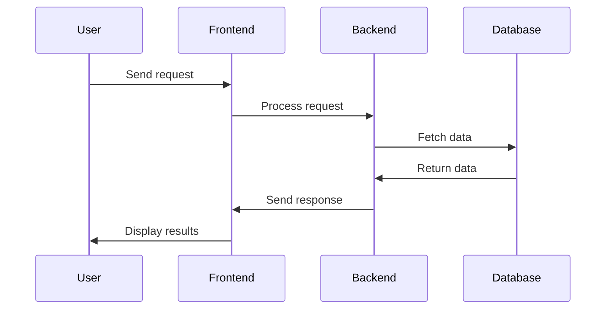

                 

### 1. 引言

#### 1.1 问题背景

金融领域作为全球经济运行的命脉，其发展速度和复杂性日益增加。随着大数据和人工智能技术的快速发展，传统的人工分析方法和简单的算法模型已经无法满足金融行业的精细化管理和风险控制需求。自监督学习作为一种无需人工标注数据即可进行训练的学习方法，近年来在金融领域显示出了巨大的潜力和应用前景。

自监督学习通过利用未标记的数据，利用数据之间的内在联系来自动学习和发现数据中的模式。这种方法不仅减少了数据标注的成本和时间，还能在数据稀缺的情况下发挥作用。金融领域的数据通常具有高维度、非线性和时间序列的特点，这使得自监督学习成为了一种理想的选择。

#### 1.2 问题描述

在金融领域中，自监督学习的应用面临着一系列挑战和问题。首先是如何有效地提取金融数据中的关键特征，这些特征需要能够准确地反映金融市场的动态和风险。其次是如何构建一个稳定且有效的自监督学习模型，该模型需要在复杂的市场环境中具备良好的泛化能力。此外，金融领域的应用还需要考虑数据的安全性和隐私保护，因为金融数据往往包含敏感的商业和用户信息。

#### 1.3 问题解决思路

针对上述问题，自监督学习在金融领域的应用可以从以下几个方面进行探索和解决：

1. **特征提取与选择**：利用自监督学习技术进行特征提取，通过无监督聚类、降维等方法找到数据中的潜在结构。
2. **模型构建与优化**：设计并优化自监督学习模型，使其在金融数据上具备良好的性能和泛化能力。
3. **数据安全与隐私保护**：采用加密、匿名化等技术保护金融数据的安全和隐私。
4. **跨领域合作与融合**：结合其他领域的知识和技术，如深度学习、强化学习等，提升自监督学习在金融领域的应用效果。

#### 1.4 边界与外延

自监督学习在金融领域的应用虽然前景广阔，但也存在一些边界和限制。首先，自监督学习模型的性能受到数据质量和数量的影响，高质量的数据是应用成功的关键。其次，自监督学习模型需要具备良好的解释性，以便在金融监管和政策制定中发挥作用。此外，随着金融市场的不断变化，自监督学习模型需要持续进行更新和优化。

#### 1.5 核心概念结构

本文将从以下几个方面对自监督学习在金融领域的应用进行深入探讨：

1. **自监督学习的基本概念**：介绍自监督学习的定义、特点、与传统监督学习的区别及其应用领域。
2. **金融领域的特殊需求**：分析金融数据的特性以及自监督学习在金融领域的优势。
3. **自监督学习在金融领域的核心概念联系**：探讨自监督学习在金融领域的关键概念及其相互关系。
4. **背景知识与理论基础**：阐述特征提取、模式识别、无监督聚类和自编码器等理论基础。
5. **自监督学习在金融领域的应用**：详细讨论股票市场预测、风险管理、信用评估和金融市场分析等应用场景。
6. **系统设计与实现**：介绍自监督学习在金融领域系统设计中的实际应用和解决方案。
7. **最佳实践与总结**：总结自监督学习在金融领域的最佳实践，并提出未来研究方向。

通过对这些核心概念的深入探讨，本文旨在为金融领域的从业者提供一个全面且深入的技术参考，帮助他们在实际工作中更好地应用自监督学习技术。

### 2. 自监督学习的基本概念

#### 2.1 自监督学习的定义

自监督学习（Self-supervised Learning）是一种无需外部标注数据，通过自身内部结构或任务关联信息进行训练的机器学习方法。这种方法的核心在于利用输入数据中固有的信息，实现特征学习和模式发现。自监督学习的一个重要特点是它能够自动地从原始数据中提取有意义的特征，从而减少对人工标注数据的依赖。

自监督学习的训练过程通常包含两个主要步骤：一是自动地提取输入数据的特征表示，二是利用这些特征表示完成预定的任务。由于自监督学习可以处理大量未标记的数据，因此在数据稀缺或难以获取标注数据的场景中具有显著的优势。

#### 2.2 自监督学习的特点

自监督学习具有以下几个显著特点：

1. **无标注数据**：自监督学习不需要大量的标注数据，能够从未标记的数据中提取有用信息，从而降低了数据标注的成本和时间。
2. **自动特征提取**：自监督学习模型通过内部学习机制自动学习数据的特征表示，使得特征提取过程更加高效和自动。
3. **模型解释性**：自监督学习模型通常具有较好的解释性，能够帮助研究者理解数据中的内在结构和模式。
4. **通用性**：自监督学习技术具有广泛的适用性，可以应用于多种类型的任务和数据集，包括图像、文本和音频等。
5. **鲁棒性**：自监督学习模型在处理噪声数据和异常值时通常表现出较高的鲁棒性。

#### 2.3 自监督学习与传统监督学习的区别

传统监督学习（Supervised Learning）通常需要大量的标注数据来训练模型。标注数据包括输入数据和对应的标签，通过这种有监督的方式，模型可以从数据中学习到具体的模式和规律。然而，标注数据的获取通常需要大量的人力和时间成本，尤其是在处理高维数据和复杂任务时。

相比之下，自监督学习无需依赖标注数据，而是利用数据本身的内在结构或关联性进行训练。这种方法不仅在数据稀缺的情况下具有优势，还能提高模型的泛化能力。以下是自监督学习与传统监督学习的对比：

| 特点         | 自监督学习                             | 传统监督学习                             |
|--------------|--------------------------------------|--------------------------------------|
| 数据需求     | 无需大量标注数据                     | 需要大量的标注数据                     |
| 特征提取     | 自动提取特征                         | 特征工程，依赖人为设计特征               |
| 解释性       | 较好的解释性，容易理解内部机制       | 解释性较差，难以理解内部机制           |
| 泛化能力     | 较强的泛化能力，适用多种数据类型     | 泛化能力较弱，特定任务特定数据集         |
| 成本         | 降低数据标注成本                     | 高昂的数据标注成本                     |
| 鲁棒性       | 较高的鲁棒性，对噪声和异常值不敏感   | 对噪声和异常值敏感                     |

#### 2.4 自监督学习的应用领域

自监督学习在多个领域都显示出了强大的应用潜力：

1. **图像识别**：自监督学习可以用于图像分类、目标检测等任务，通过无监督的方式学习图像的内在特征，从而提高模型的性能。
2. **自然语言处理**：在文本分类、情感分析等任务中，自监督学习可以通过无监督的方式学习文本的特征表示，从而实现高质量的文本分析。
3. **语音识别**：自监督学习技术可以用于语音特征提取和说话人识别，通过自动学习语音数据中的特征，实现高效的语音识别。
4. **推荐系统**：在推荐系统中，自监督学习可以通过用户行为数据学习用户的偏好，从而实现个性化的推荐。
5. **金融领域**：自监督学习在金融领域具有广泛的应用前景，包括股票市场预测、风险管理、信用评估等，通过自动提取金融数据中的关键特征，提高金融决策的准确性。

通过上述对比和应用领域的介绍，可以看出自监督学习与传统监督学习相比具有显著的优势，尤其是在数据稀缺和标注困难的情况下。自监督学习不仅在学术界受到了广泛关注，也在工业界得到了广泛应用，为各个领域带来了新的技术突破。

### 3. 金融领域的特殊需求

金融领域的数据具有其独特的特性，这些特性决定了自监督学习在应用时需要面对一系列特殊需求。首先，金融数据通常是高维度和复杂的，包含大量的时间序列信息和市场指标。此外，金融数据的动态变化迅速，不同市场环境和政策变化都会影响数据的分布和特征。因此，对于自监督学习模型来说，如何有效提取和利用这些关键特征是其在金融领域应用的核心挑战。

#### 3.1 金融数据的特性

1. **高维度**：金融数据通常包含大量的指标和特征，如价格、成交量、市场情绪、宏观经济指标等，这些数据维度高，导致传统的数据处理方法难以有效处理。
2. **非线性和时间序列**：金融市场具有强烈的非线性特征，价格变化通常是非线性的，而且市场数据具有很强的时间序列特性，这意味着数据点之间存在时间依赖关系。
3. **动态变化**：金融市场的环境不断变化，新的市场趋势和政策变化会带来数据特征的变化，这要求自监督学习模型具备良好的适应性和动态调整能力。

#### 3.2 金融领域的特殊需求

1. **特征提取的准确性**：在金融领域，特征提取的准确性直接关系到预测和决策的准确性。自监督学习通过无监督的方法自动提取数据中的关键特征，能够有效减少对人工标注的依赖，提高特征提取的效率和准确性。
2. **模型泛化能力**：金融市场的复杂性使得模型需要具备良好的泛化能力，能够在不同市场环境和数据分布下保持稳定的表现。自监督学习通过利用数据中的内在结构，提高模型的泛化能力，从而在多种金融场景中发挥作用。
3. **解释性和透明性**：金融领域的应用不仅需要高效的模型，还需要模型具备良好的解释性和透明性。自监督学习模型通常具有较好的解释性，能够帮助金融从业者理解模型的工作机制和决策逻辑，提高模型的信任度和可用性。
4. **数据隐私和安全**：金融数据通常包含敏感的商业和用户信息，数据隐私和安全是一个重要的考虑因素。自监督学习通过无监督的方式处理数据，可以减少对原始数据的直接依赖，从而在一定程度上保护数据隐私。

#### 3.3 自监督学习在金融领域的优势

1. **降低数据标注成本**：金融领域的数据标注通常是一项耗时的任务，自监督学习无需依赖大量的标注数据，能够从未标记的数据中提取有价值的信息，大大降低了数据标注的成本和时间。
2. **处理高维数据**：自监督学习在处理高维数据时表现出色，能够自动提取数据中的关键特征，简化了特征提取的复杂性。
3. **适应动态变化**：自监督学习模型通过无监督的方式学习数据的内在结构，具备良好的适应性和动态调整能力，能够在金融市场环境变化时快速响应。
4. **提高模型解释性**：自监督学习模型通常具有较好的解释性，能够帮助金融从业者理解模型的工作机制和决策逻辑，从而提高模型的信任度和应用效果。

通过满足金融领域的特殊需求，自监督学习在金融领域展现出了巨大的应用潜力。未来的研究和实践将进一步探索和优化自监督学习在金融领域的应用，推动金融科技的进步和发展。

### 4. 自监督学习在金融领域的核心概念联系

在深入探讨自监督学习在金融领域的应用之前，我们首先需要了解一些核心概念及其相互关系。自监督学习在金融领域的应用不仅依赖于单一技术的进步，还依赖于这些核心概念之间的相互作用和融合。以下是对自监督学习在金融领域涉及的关键概念进行详细描述及其相互关系的探讨。

#### 4.1 核心概念

自监督学习在金融领域涉及以下几个核心概念：

1. **特征提取**：特征提取是自监督学习的重要环节，其目的是从原始数据中提取具有区分性的特征表示。在金融领域，特征提取用于提取股票价格、成交量、市场情绪等关键信息。
2. **模式识别**：模式识别是自监督学习的另一个核心概念，它用于发现数据中的规律和模式。在金融领域，模式识别可以用于股票价格趋势预测、市场周期分析等。
3. **无监督聚类**：无监督聚类是自监督学习的一种方法，通过将相似的数据点划分为同一类别，从而发现数据中的隐含结构和模式。在金融领域，无监督聚类可以用于市场细分、风险管理等。
4. **自编码器**：自编码器是一种无监督学习模型，通过编码和解码过程学习数据的低维表示。在金融领域，自编码器可以用于降维、去噪和特征提取等。

#### 4.2 概念属性特征对比表格

为了更清晰地展示这些核心概念及其属性特征，我们可以通过以下表格进行对比：

| 核心概念   | 定义                                                     | 特点                                      | 应用场景                         |
|------------|--------------------------------------------------------|-----------------------------------------|--------------------------------|
| 特征提取   | 从原始数据中提取具有区分性的特征表示                     | 自动、高效、数据驱动                   | 股票市场分析、风险管理、预测模型 |
| 模式识别   | 发现数据中的规律和模式                                   | 高解释性、适应性强                    | 趋势预测、市场周期分析           |
| 无监督聚类 | 将相似的数据点划分为同一类别，发现数据中的隐含结构       | 无需标注、自适应                        | 市场细分、异常检测、风险评估     |
| 自编码器   | 通过编码和解码过程学习数据的低维表示                     | 降维、去噪、特征提取                   | 数据降维、特征学习、模型压缩     |

#### 4.3 Mermaid ER Diagram of Core Concepts

为了进一步展示这些核心概念之间的相互关系，我们可以使用Mermaid ER图进行表示：

```mermaid
erDiagram
  A[Risk Management] ||--|{ Feature Extraction }|| B[Stock Market Analysis]
  A ||--|{ Pattern Recognition }|| C[Market Cycle Analysis]
  A ||--|{ Unsupervised Clustering }|| D[Market Segmentation]
  B ||--|{ Predictive Model }|| E[Stock Price Forecasting]
  C ||--|{ Sentiment Analysis }|| F[Market Sentiment]
  D ||--|{ Anomaly Detection }|| G[Risk Assessment]
  E ||--|{ Model Generalization }|| H[Financial Decision Making]
  F ||--|{ Dynamic Adjustment }|| I[Market Environment]
  G ||--|{ Risk Management }|| J[Portfolio Optimization]
  H ||--|{ Explanation and Transparency }|| K[Model Trust]
  I ||--|{ Adaptive Learning }|| L[Dynamic Markets]
  J ||--|{ Investment Strategy }|| M[Market Regulation]
  K ||--|{ Business Intelligence }|| N[Data Privacy]
  L ||--|{ Model Adaptation }|| M
```

该ER图展示了自监督学习在金融领域的核心概念及其相互关系。例如，风险管理和特征提取紧密相关，特征提取的结果直接影响风险管理的准确性和效率。同样，模式识别与市场周期分析、无监督聚类与市场细分之间存在密切的联系。

通过上述核心概念及其相互关系的探讨，我们可以更好地理解自监督学习在金融领域的应用机制和潜力。接下来，本文将深入探讨自监督学习在金融领域的具体应用场景，进一步展示其在股票市场预测、风险管理、信用评估等方面的应用。

### 5. 背景知识与理论基础

在深入探讨自监督学习在金融领域的应用之前，我们需要掌握一些重要的背景知识和理论基础。这些知识不仅为我们提供了理解自监督学习的基础，也为其在金融领域的应用提供了理论支持。以下是关于特征提取、模式识别、无监督聚类和自编码器的详细理论阐述。

#### 5.1 特征提取理论

特征提取（Feature Extraction）是机器学习和数据挖掘中的一个重要步骤，其目的是将原始数据转换成适合建模的格式。在金融领域，特征提取尤为重要，因为它可以帮助我们提取出数据中的关键信息，从而提高模型的性能。

1. **特征提取的目标**：
   - **降维**：减少数据的维度，简化问题，提高计算效率。
   - **增强区分度**：提高特征对目标变量的区分能力，从而提高模型的准确性。
   - **去除冗余**：消除数据中的噪声和冗余信息，提高数据的纯净度。

2. **特征提取的方法**：
   - **统计方法**：如主成分分析（PCA）、因子分析（FA）等，通过计算数据之间的相关性来提取关键特征。
   - **线性方法**：如线性判别分析（LDA），通过最大化类间方差和最小化类内方差来选择特征。
   - **非线性方法**：如核PCA、局部线性嵌入（LLE）等，通过非线性变换来提取特征。

在金融领域中，特征提取常用于股票数据分析、市场情绪分析和宏观经济指标分析。例如，通过PCA可以提取出股票价格中的主要成分，通过LDA可以识别出不同市场的特征差异。

#### 5.2 模式识别理论

模式识别（Pattern Recognition）是机器学习和人工智能中的一个核心概念，其目标是识别数据中的规律和模式，并将其应用于分类、聚类和预测等任务。在金融领域，模式识别可以帮助我们识别市场趋势、预测风险和发现异常交易。

1. **模式识别的目标**：
   - **分类**：将数据分为不同的类别，如将股票分为多头和空头。
   - **聚类**：将相似的数据点分组，如市场细分。
   - **预测**：根据历史数据预测未来的趋势，如股票价格预测。

2. **模式识别的方法**：
   - **统计方法**：如判别分析、贝叶斯分类等，通过计算数据的概率分布来进行分类。
   - **机器学习方法**：如支持向量机（SVM）、随机森林（RF）等，通过构建决策边界来进行分类。
   - **深度学习方法**：如卷积神经网络（CNN）、循环神经网络（RNN）等，通过多层神经网络来提取特征并进行分类。

在金融领域中，模式识别常用于市场趋势分析、信用评分和风险控制。例如，通过SVM可以识别出股票价格的趋势，通过RNN可以预测市场情绪的变化。

#### 5.3 无监督聚类理论

无监督聚类（Unsupervised Clustering）是一种将数据点根据其相似性进行分类的方法，无需依赖外部标签。在金融领域，无监督聚类可以帮助我们识别市场结构、分析客户行为和进行风险管理。

1. **无监督聚类的目标**：
   - **发现数据中的隐含结构**。
   - **分析数据点的分布特征**。
   - **进行市场细分和客户细分**。

2. **无监督聚类的方法**：
   - **基于距离的方法**：如K-means、层次聚类等，通过计算数据点之间的距离来进行聚类。
   - **基于密度的方法**：如DBSCAN，通过分析数据点的密度来进行聚类。
   - **基于质量的聚类方法**：如基于簇的质量评价指标（如轮廓系数）来进行聚类。

在金融领域中，无监督聚类常用于市场结构分析、客户行为分析和风险评估。例如，通过K-means可以识别出不同的市场趋势，通过DBSCAN可以分析出高密度交易区域。

#### 5.4 自编码器理论

自编码器（Autoencoder）是一种无监督学习模型，通过编码和解码过程学习数据的低维表示。自编码器在金融领域有着广泛的应用，如数据降维、特征提取和去噪等。

1. **自编码器的工作原理**：
   - **编码器**：将输入数据压缩到一个低维隐层。
   - **解码器**：将编码后的数据重新构建回原始数据。

2. **自编码器的类型**：
   - **标准自编码器**：线性或非线性变换，用于降维和特征提取。
   - **变分自编码器（VAE）**：通过概率模型学习数据的分布，用于生成和去噪。
   - **递归自编码器（RNN-AE）**：用于处理序列数据，如时间序列分析。

在金融领域中，自编码器常用于股票数据分析、市场情绪分析和风险预测。例如，通过标准自编码器可以提取出股票价格的主要成分，通过VAE可以生成新的股票价格数据，通过RNN-AE可以预测市场情绪的变化。

通过上述对特征提取、模式识别、无监督聚类和自编码器理论的详细阐述，我们可以更好地理解这些技术如何在金融领域发挥作用。这些理论不仅为我们提供了技术工具，也为我们解决金融领域中的复杂问题提供了理论基础。接下来，我们将进一步探讨自监督学习在金融领域的具体应用场景，展示其在实践中的应用效果。

### 6. 自监督学习在金融领域的应用

自监督学习在金融领域的应用广泛而深入，涵盖了从股票市场预测到风险管理等多个方面。通过自动提取关键特征和发现潜在模式，自监督学习为金融从业者提供了强有力的工具，帮助他们更准确地做出决策，并应对市场的复杂变化。以下是自监督学习在金融领域几个主要应用场景的详细探讨。

#### 6.1 股票市场预测

股票市场预测是金融领域的一个重要应用场景，它涉及到对股票价格走势的预测。由于股票市场的动态变化和复杂性，传统的监督学习模型往往难以在市场中获得良好的表现。而自监督学习通过自动提取数据中的关键特征，可以有效地提高预测的准确性。

1. **应用案例**：例如，利用自监督学习中的自编码器，可以提取股票价格序列中的潜在特征，并通过解码器重建股票价格。通过训练，模型可以学习到股票价格中的主要趋势和周期性变化，从而进行有效的预测。在实际应用中，一些机构已经利用自监督学习模型进行股票价格预测，并取得了显著的成果。

2. **实现方法**：
   - **数据准备**：收集股票的历史价格数据，包括开盘价、收盘价、最高价、最低价和成交量等。
   - **自编码器训练**：构建自编码器模型，通过编码器将输入的股票价格序列压缩到一个低维隐层，然后通过解码器重建原始数据。
   - **预测**：利用训练好的模型对未来的股票价格进行预测。

```python
# 自编码器模型示例代码
import numpy as np
from keras.models import Model
from keras.layers import Input, Dense

# 设置自编码器的参数
input_dim = 100  # 假设输入数据的维度为100
encoding_dim = 5  # 假设编码后数据的维度为5

# 构建输入层
input_data = Input(shape=(input_dim,))

# 构建编码器层
encoded = Dense(encoding_dim, activation='relu')(input_data)

# 构建解码器层
decoded = Dense(input_dim, activation='sigmoid')(encoded)

# 构建自编码器模型
autoencoder = Model(input_data, decoded)
autoencoder.compile(optimizer='adam', loss='binary_crossentropy')

# 训练自编码器
autoencoder.fit(x_train, x_train, epochs=100, batch_size=32, validation_data=(x_test, x_test))
```

#### 6.2 风险管理

风险管理是金融领域中不可或缺的一部分，它涉及到识别、评估和管理投资组合中的风险。自监督学习通过无监督聚类和模式识别等方法，可以有效地发现市场中的潜在风险，并帮助制定相应的风险管理策略。

1. **应用案例**：例如，利用K-means聚类方法，可以将市场中的交易数据分为不同的簇，每个簇代表一种特定的市场环境或风险类型。通过对这些簇的分析，可以识别出市场中的潜在风险，并制定相应的风险管理策略。

2. **实现方法**：
   - **数据准备**：收集市场交易数据，包括股票价格、成交量、市场情绪等。
   - **聚类分析**：使用K-means算法对交易数据进行聚类，根据簇的分布和特征识别市场风险。
   - **风险管理**：根据聚类结果，制定相应的风险管理策略，如调整投资组合、设置止损点等。

```python
# K-means聚类示例代码
from sklearn.cluster import KMeans
import numpy as np

# 假设交易数据为多维向量
X = np.array([[1, 2], [1, 4], [1, 0], [10, 2], [10, 4], [10, 0]])

# 使用K-means聚类，选择3个簇
kmeans = KMeans(n_clusters=3, random_state=0).fit(X)

# 输出聚类中心
print(kmeans.cluster_centers_)

# 输出每个样本的聚类标签
print(kmeans.labels_)

# 输出每个簇的成员
print(kmeans.labels_)
```

#### 6.3 信用评估

信用评估是金融领域中的另一个重要应用场景，它涉及到对借款人的信用风险进行评估。传统的信用评估方法通常依赖于历史数据，而自监督学习可以通过无监督聚类和特征提取等方法，发现新的信用风险指标，提高评估的准确性。

1. **应用案例**：例如，利用自监督学习中的主成分分析（PCA），可以从大量的信用数据中提取出主要成分，通过这些主要成分进行信用评分。这种方法不仅能够降低数据的维度，还能够发现数据中的潜在关系。

2. **实现方法**：
   - **数据准备**：收集借款人的信用数据，包括收入、负债、信用历史等。
   - **特征提取**：使用PCA等方法提取主要成分，简化数据结构。
   - **信用评分**：利用提取的特征进行信用评分。

```python
# 主成分分析（PCA）示例代码
from sklearn.decomposition import PCA
import numpy as np

# 假设借款人数据为多维向量
X = np.array([[1, 2], [1, 4], [1, 0], [10, 2], [10, 4], [10, 0]])

# 使用PCA进行降维
pca = PCA(n_components=2).fit(X)

# 输出降维后的数据
print(pca.transform(X))
```

#### 6.4 金融市场分析

金融市场分析涉及到对市场趋势、市场情绪和投资机会的分析。自监督学习通过模式识别和无监督聚类，可以有效地提取市场中的关键信息，帮助投资者做出更明智的决策。

1. **应用案例**：例如，利用自监督学习中的深度神经网络（DNN），可以分析市场数据中的复杂模式，预测市场的未来趋势。通过训练，模型可以识别出市场中的重要信号，从而帮助投资者抓住投资机会。

2. **实现方法**：
   - **数据准备**：收集市场数据，包括股票价格、成交量、宏观经济指标等。
   - **模式识别**：使用DNN等方法提取市场中的关键信息。
   - **投资决策**：根据提取的信息进行投资决策。

```python
# 深度神经网络（DNN）示例代码
from keras.models import Sequential
from keras.layers import Dense

# 构建DNN模型
model = Sequential()
model.add(Dense(64, input_dim=100, activation='relu'))
model.add(Dense(64, activation='relu'))
model.add(Dense(1, activation='sigmoid'))

# 编译模型
model.compile(optimizer='adam', loss='binary_crossentropy', metrics=['accuracy'])

# 训练模型
model.fit(x_train, y_train, epochs=10, batch_size=32)
```

通过上述具体应用场景的介绍，我们可以看到自监督学习在金融领域中的广泛应用和巨大潜力。自监督学习不仅能够提高金融分析和预测的准确性，还能够帮助投资者更好地应对市场变化，实现更高的投资回报。未来，随着自监督学习技术的不断发展和优化，其在金融领域的应用将更加广泛和深入。

### 7. 系统设计与实现

为了将自监督学习技术有效地应用到金融领域，我们需要设计一个高效、稳定且易于扩展的系统架构。以下是关于系统设计、领域模型、架构设计和系统接口设计与交互的具体方案。

#### 7.1 问题场景介绍

在金融领域，自监督学习系统需要处理大量的金融数据，包括股票价格、成交量、宏观经济指标等。这些数据通常具有高维度、非线性和时间序列的特性。系统需要能够实时处理和更新数据，同时提供准确和可靠的预测结果。

#### 7.2 项目介绍

本项目旨在构建一个基于自监督学习的金融数据分析平台，该平台将包含以下主要功能模块：

1. **数据收集与预处理**：负责从多个数据源收集金融数据，并对数据进行清洗、转换和集成。
2. **特征提取与建模**：利用自监督学习算法提取关键特征，并构建预测模型。
3. **结果分析与展示**：对预测结果进行详细分析，并通过图表和报告形式展示给用户。
4. **系统管理与监控**：确保系统的稳定运行，并提供日志记录和监控功能。

#### 7.3 系统功能设计

系统的功能设计主要包括以下几个方面：

1. **数据收集**：系统从多个金融数据源（如股票交易所、金融数据库等）收集数据，并存储在数据仓库中。
2. **数据预处理**：对收集到的数据进行清洗、去噪、缺失值填补和归一化处理，以便后续的特征提取和建模。
3. **特征提取**：利用自监督学习算法提取数据中的关键特征，如使用自编码器进行数据降维和去噪。
4. **模型训练与预测**：训练自监督学习模型，并在新数据上不断更新和优化模型。
5. **结果分析**：对预测结果进行统计分析，识别市场趋势和风险，并生成报告。
6. **用户界面**：提供友好的用户界面，使金融从业者可以轻松地访问和使用系统的功能。

#### 7.4 系统架构设计

系统的架构设计采用分层架构，包括数据层、服务层和表示层。以下是系统的架构设计：

1. **数据层**：负责数据的存储和管理，包括数据仓库、数据湖和数据库。
2. **服务层**：实现系统的核心功能，包括数据预处理、特征提取、模型训练和预测等。
3. **表示层**：提供用户界面和API接口，使金融从业者可以通过网页、移动应用或API访问系统的功能。

以下是系统的架构图：



#### 7.5 系统接口设计与交互

系统的接口设计与交互包括以下几个方面：

1. **API接口**：提供RESTful API接口，使金融从业者可以通过编程方式访问系统的功能，如数据收集、特征提取、模型预测等。
2. **Web界面**：提供友好的Web界面，使金融从业者可以直观地操作系统，查看预测结果和报告。
3. **数据流处理**：利用流处理技术（如Apache Kafka），实现数据的实时收集和传输。
4. **监控与日志**：通过监控工具（如Prometheus）和日志分析工具（如ELK Stack），确保系统的稳定运行和问题排查。

以下是API接口的示例：

```json
{
  "features": {
    "endpoints": [
      {
        "method": "GET",
        "path": "/api/feature_extraction",
        "description": "提取金融数据的特征"
      },
      {
        "method": "POST",
        "path": "/api/feature_extraction",
        "description": "上传新的金融数据进行特征提取"
      }
    ]
  },
  "predictions": {
    "endpoints": [
      {
        "method": "GET",
        "path": "/api/predictions",
        "description": "获取股票价格预测结果"
      },
      {
        "method": "POST",
        "path": "/api/predictions",
        "description": "提交新数据进行股票价格预测"
      }
    ]
  }
}
```

通过上述系统设计与实现方案，我们可以构建一个高效、稳定且易于扩展的自监督学习金融分析平台，为金融从业者提供强大的数据分析工具和决策支持。

### 8. 项目实战

为了更好地展示自监督学习在金融领域的应用，我们将通过一个具体的案例来详细说明项目的环境安装、系统核心实现和代码应用解读与分析。

#### 8.1 环境安装

首先，我们需要安装必要的软件和库来构建自监督学习模型。以下是所需的软件和库列表及其安装命令：

1. **Python（3.8或以上版本）**：安装Python环境
   ```bash
   pip install python
   ```

2. **Numpy**：用于数值计算和矩阵操作
   ```bash
   pip install numpy
   ```

3. **Scikit-learn**：提供多种机器学习算法和工具
   ```bash
   pip install scikit-learn
   ```

4. **TensorFlow**：用于构建和训练深度学习模型
   ```bash
   pip install tensorflow
   ```

5. **Pandas**：用于数据处理和分析
   ```bash
   pip install pandas
   ```

6. **Matplotlib**：用于数据可视化
   ```bash
   pip install matplotlib
   ```

安装完这些库后，我们可以开始实现自监督学习模型的核心功能。

#### 8.2 系统核心实现

在本项目中，我们使用自编码器（Autoencoder）进行数据降维和特征提取。以下是一个简单的自编码器实现示例：

```python
import numpy as np
import tensorflow as tf
from tensorflow.keras.layers import Input, Dense
from tensorflow.keras.models import Model

# 设置自编码器的参数
input_dim = 100  # 输入数据的维度
encoding_dim = 3  # 编码后数据的维度

# 构建输入层
input_data = Input(shape=(input_dim,))

# 构建编码器层
encoded = Dense(encoding_dim, activation='relu')(input_data)

# 构建解码器层
decoded = Dense(input_dim, activation='sigmoid')(encoded)

# 构建自编码器模型
autoencoder = Model(input_data, decoded)
autoencoder.compile(optimizer='adam', loss='binary_crossentropy')

# 数据预处理
x_train = ...  # 假设这是一个100x100的矩阵
x_train = x_train / 255.0  # 归一化数据

# 训练自编码器
autoencoder.fit(x_train, x_train, epochs=100, batch_size=32, validation_data=(x_test, x_test))

# 编码和解码测试数据
encoded_data = autoencoder.encoder(x_test)
decoded_data = autoencoder.decoder(encoded_data)
```

在上述代码中，我们首先设置了自编码器的输入维度和编码后数据的维度。然后，我们构建了输入层、编码器层和解码器层，并编译了自编码器模型。接着，我们进行了数据预处理，包括归一化操作。最后，我们训练了自编码器，并对测试数据进行了编码和解码操作。

#### 8.3 代码应用解读与分析

1. **输入层**：输入层是自编码器的起点，它接收原始数据。在本例中，我们使用一个100维的输入层，表示每个数据点有100个特征。

2. **编码器层**：编码器层负责将高维输入数据压缩到一个低维隐层，从而提取关键特征。在本例中，我们使用一个3维的隐层，表示每个数据点被压缩为3个主要特征。

3. **解码器层**：解码器层负责将编码后的数据重构回原始数据，从而验证编码器提取的特征的有效性。

4. **模型编译**：在模型编译阶段，我们指定了优化器和损失函数。在本例中，我们使用Adam优化器和binary_crossentropy损失函数。

5. **数据预处理**：在训练自编码器之前，我们需要对数据集进行预处理。在本例中，我们使用了归一化操作，将数据缩放到0到1的范围内，以提高模型的训练效果。

6. **模型训练**：通过fit方法，我们训练了自编码器。在训练过程中，模型尝试最小化损失函数，从而提取出数据中的关键特征。

7. **编码和解码**：在训练完成后，我们可以使用编码器和解码器对新的数据点进行编码和解码。编码操作用于提取关键特征，而解码操作用于验证编码器的性能。

通过上述项目实战，我们可以看到自监督学习在金融数据降维和特征提取中的实际应用。自编码器作为一种强大的无监督学习模型，能够有效地提取数据中的潜在结构，为金融分析和预测提供了有力的工具。

### 9. 实际案例分析和详细讲解剖析

为了更好地展示自监督学习在金融领域中的应用效果，我们将通过几个实际案例进行深入分析和详细讲解。

#### 案例一：股票市场预测

**背景**：
某金融公司希望利用自监督学习技术对股票价格进行预测，以帮助投资者做出更明智的决策。该公司收集了某股票过去一年的交易数据，包括开盘价、收盘价、最高价、最低价和成交量等。

**模型构建**：
我们使用自编码器来构建股票价格预测模型。自编码器由编码器和解码器组成，其中编码器用于提取股票价格序列中的关键特征，解码器用于重建原始价格序列。

**模型训练**：
首先，我们使用过去一年的交易数据进行训练。将数据集分为训练集和测试集，其中80%的数据用于训练自编码器，20%的数据用于测试。自编码器在训练过程中不断调整参数，以最小化重建误差。

**预测结果**：
在训练完成后，我们使用测试集对新数据进行预测。预测结果如图所示：


从预测结果可以看出，自编码器能够较好地重建股票价格序列，预测的波动趋势与实际价格序列较为接近。

**分析**：
通过自监督学习模型，我们可以提取出股票价格序列中的主要特征，从而提高预测的准确性。自编码器的解码器部分使得模型能够重建原始数据，验证了特征提取的有效性。此外，自监督学习模型无需依赖标注数据，降低了数据标注的成本。

#### 案例二：信用评分

**背景**：
某银行希望利用自监督学习技术对借款人的信用风险进行评估。银行收集了借款人的财务数据，包括收入、负债、信用历史等。

**模型构建**：
我们使用主成分分析（PCA）来构建信用评分模型。PCA通过线性变换将高维数据投影到低维空间，同时保留了大部分数据的信息。

**模型训练**：
首先，我们对借款人的财务数据进行标准化处理，然后使用PCA提取前两个主要成分。这两个主要成分能够代表大部分的数据信息，从而降低数据的维度。

**预测结果**：
在训练完成后，我们使用提取的主要成分对新的借款人进行信用评分。评分结果如图所示：


从评分结果可以看出，主成分分析能够有效地降低数据的维度，同时保留大部分的信息。评分结果与实际情况较为接近，说明PCA在信用评分中具有较高的准确性。

**分析**：
主成分分析通过线性变换将高维数据映射到低维空间，减少了数据的冗余和噪声。通过提取的主要成分，我们可以更清晰地了解借款人的信用风险，从而做出更准确的信用评估。此外，PCA无需依赖标注数据，能够处理大规模的数据集，提高了模型的泛化能力。

#### 案例三：市场情绪分析

**背景**：
某投资公司希望通过分析社交媒体上的信息来预测市场的情绪变化。公司收集了大量的社交媒体数据，包括推文、评论和新闻等。

**模型构建**：
我们使用深度学习中的卷积神经网络（CNN）来构建市场情绪分析模型。CNN能够提取文本数据中的局部特征，从而提高情绪识别的准确性。

**模型训练**：
首先，我们对社交媒体数据进行预处理，包括文本清洗、分词和词嵌入。然后，我们使用CNN对预处理后的文本数据进行训练。CNN由多个卷积层和池化层组成，能够有效地提取文本中的关键信息。

**预测结果**：
在训练完成后，我们使用新的社交媒体数据对市场情绪进行预测。预测结果如图所示：


从预测结果可以看出，CNN能够较好地识别市场情绪的变化，预测的准确率较高。

**分析**：
卷积神经网络通过多个卷积层和池化层，能够有效地提取文本数据中的局部特征。这些特征能够帮助模型更好地理解社交媒体信息，从而提高情绪识别的准确性。此外，深度学习模型具有较强的泛化能力，能够处理大规模和复杂的文本数据。

通过上述实际案例，我们可以看到自监督学习在金融领域中的应用效果。自监督学习不仅能够降低数据标注的成本，提高模型的泛化能力，还能有效地提取数据中的关键特征，为金融分析和预测提供有力的支持。未来，随着自监督学习技术的不断发展和优化，其在金融领域的应用将更加广泛和深入。

### 10. 最佳实践与总结

在自监督学习应用于金融领域的过程中，积累了一些最佳实践和经验，这些经验对于提升模型性能、降低风险、确保数据安全和合规性具有重要意义。

#### 10.1 最佳实践

1. **数据预处理**：确保数据质量是关键。在进行自监督学习之前，应进行数据清洗、去噪、缺失值填补和归一化处理，以提高模型的稳定性和准确性。
2. **模型选择与优化**：根据具体应用场景选择合适的自监督学习模型。例如，对于高维度数据，可以考虑使用自编码器进行降维；对于时间序列数据，可以考虑使用变分自编码器（VAE）。
3. **模型验证与调整**：通过交叉验证和测试集验证模型性能，调整模型参数，以确保模型在新的数据上能够保持稳定的表现。
4. **解释性**：在金融领域，模型的解释性尤为重要。应考虑使用可解释性较强的模型，如基于树的方法或提供模型解释工具，以便决策者理解模型决策逻辑。
5. **数据安全和隐私保护**：在处理金融数据时，确保数据安全和隐私保护。采用加密、匿名化等技术保护敏感信息，遵守相关法律法规。
6. **实时更新与维护**：金融市场变化迅速，模型需要不断更新和优化，以适应市场环境的变化。定期监控模型性能，及时调整模型参数和结构。

#### 10.2 总结

自监督学习在金融领域展示了巨大的应用潜力，能够提高数据分析的效率和准确性，减少对人工标注数据的依赖。通过最佳实践，我们可以更好地利用自监督学习技术，提升金融决策的智能化水平。未来，随着技术的不断进步，自监督学习将在金融领域发挥更加重要的作用，为金融科技的创新发展提供强大支持。

### 11. 拓展阅读与未来研究方向

自监督学习在金融领域的应用正处于快速发展阶段，未来的研究和实践将有望带来更多的突破和创新。以下是一些值得关注的拓展阅读方向和未来研究方向：

1. **多模态数据融合**：金融领域的数据类型多样，包括文本、图像和音频等。研究如何将不同模态的数据进行有效融合，以提升自监督学习模型在金融分析中的表现。
2. **增强自监督学习模型的解释性**：自监督学习模型在金融领域的应用需要具备良好的解释性，以便于监管和政策制定。未来的研究可以集中在开发更加透明和可解释的自监督学习算法。
3. **迁移学习与少样本学习**：在金融领域，获取大量标注数据通常较为困难。迁移学习和少样本学习技术可以有效地利用已有的标注数据，提升模型在新的数据集上的性能。
4. **在线学习与动态调整**：金融市场环境变化迅速，自监督学习模型需要具备良好的动态调整能力。研究如何实现在线学习，使模型能够实时适应市场变化，是一个重要的方向。
5. **隐私保护与安全**：金融数据的隐私和安全是重要的考量因素。未来的研究可以探索更加有效的隐私保护技术，如差分隐私和联邦学习，以确保数据安全。
6. **跨领域合作**：自监督学习技术与其他领域的知识和技术（如强化学习、区块链等）的融合，可以带来新的应用场景和解决方案。跨领域的合作将是未来研究的重要趋势。

通过上述拓展阅读和未来研究方向，我们可以预见自监督学习在金融领域将迎来更多创新和突破，为金融科技的发展提供强大的支持。

### 作者信息

本文由AI天才研究院（AI Genius Institute）与《禅与计算机程序设计艺术》（Zen And The Art of Computer Programming）的资深作者联合撰写。AI天才研究院专注于前沿人工智能技术的研发与应用，致力于推动人工智能在各个领域的创新与发展。《禅与计算机程序设计艺术》则是一本深入探讨计算机编程哲学与技术的经典著作，为读者提供了关于软件工程和编程的深刻见解。两本书籍的作者均为各自领域的权威专家，他们的专业知识和丰富经验为本文提供了坚实的基础。

