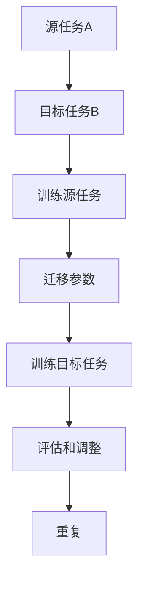
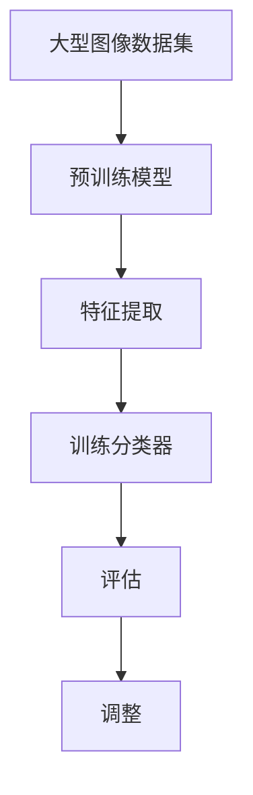
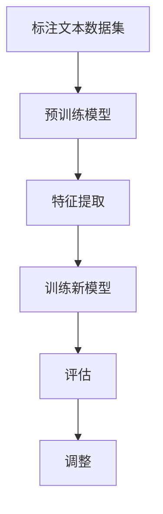
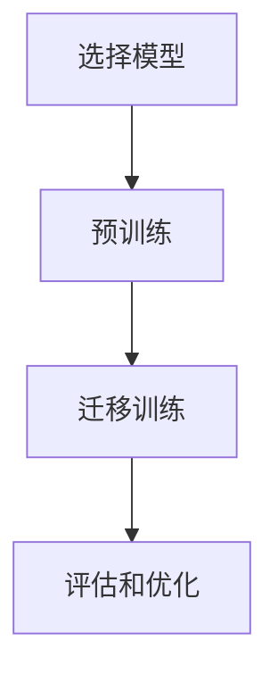
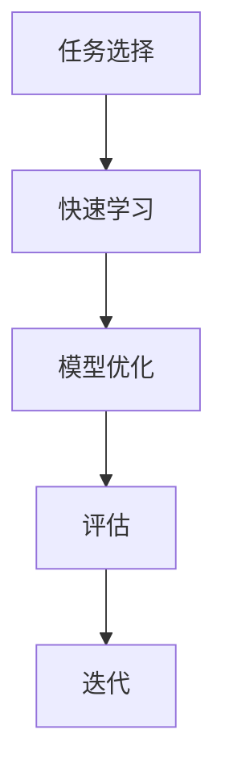
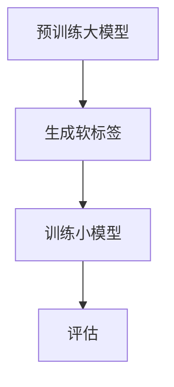

                 


# 《金融领域迁移学习的最新进展与应用》

## 关键词

- 迁移学习
- 金融领域
- 深度学习
- 模型复用
- 欺诈检测
- 投资组合优化

## 摘要

本文将深入探讨金融领域中的迁移学习技术，从基础概念、应用实例到最新研究进展进行全方位分析。通过详细阐述迁移学习在贷款风险评估、金融市场预测、金融欺诈检测和投资组合优化等领域的应用，本文旨在揭示迁移学习在金融领域的巨大潜力，同时讨论其面临的挑战和未来的研究方向。

## 第1章 引言

### 1.1 迁移学习概述

#### 1.1.1 迁移学习的概念

迁移学习（Transfer Learning）是指利用在一个任务上学习到的知识来提高另一个相关任务的表现。其核心思想是，通过将知识从一个任务迁移到另一个任务，可以减少对新任务的学习成本，提高学习效率。

#### 1.1.2 迁移学习的重要性

迁移学习在机器学习和人工智能领域具有重要地位。首先，它能够解决数据匮乏问题，通过迁移已有模型的知识，降低对新数据的依赖。其次，迁移学习可以提高模型的泛化能力，使得模型在不同任务上表现更加稳定。此外，迁移学习还可以加速模型的训练过程，降低计算资源的需求。

#### 1.1.3 迁移学习的应用场景

迁移学习在多个领域都有广泛应用，包括计算机视觉、自然语言处理和语音识别等。在金融领域，迁移学习也被广泛应用于贷款风险评估、金融市场预测、金融欺诈检测和投资组合优化等方面。

### 1.2 金融领域与迁移学习

#### 1.2.1 金融领域的挑战

金融领域具有数据量大、复杂度高、风险大的特点，这使得传统的机器学习方法在金融领域的应用面临诸多挑战。例如，数据隐私保护、模型解释性和泛化能力等。

#### 1.2.2 迁移学习在金融领域的应用

迁移学习通过利用已有模型的知识，可以提高金融领域模型的表现。例如，在贷款风险评估中，可以通过迁移学习将一个领域中的模型应用于另一个相关领域，从而提高风险评估的准确性。

#### 1.2.3 金融领域迁移学习的特点

金融领域迁移学习具有以下特点：

1. 数据隐私保护：金融数据敏感性高，迁移学习可以通过数据去识别化等技术，降低数据泄露的风险。
2. 模型解释性：金融模型需要具备良好的解释性，以便监管机构和管理层理解模型的决策过程。
3. 模型泛化能力：金融领域的数据变化多端，迁移学习可以帮助模型适应不同数据分布，提高泛化能力。

## 第2章 迁移学习基础

### 2.1 统计迁移学习

#### 2.1.1 自适应方法

自适应方法是指通过调整模型参数，使得模型在新任务上的表现更好。例如，可以通过调整权重系数，使得模型能够更好地适应新任务。

#### 2.1.2 无监督迁移学习

无监督迁移学习是指在没有标注数据的情况下，通过迁移已有模型的知识，提高新任务的表现。例如，可以通过预训练模型，然后在新任务上进行微调。

#### 2.1.3 有监督迁移学习

有监督迁移学习是指在拥有标注数据的情况下，通过迁移已有模型的知识，提高新任务的表现。例如，可以通过迁移已经训练好的分类模型，然后在新数据集上进行训练。

### 2.2 深度迁移学习

#### 2.2.1 模型复用

模型复用是指利用已有的深度神经网络结构，通过迁移训练得到的新模型。这种方法可以大大减少模型训练的成本。

#### 2.2.2 元学习

元学习是指通过学习如何学习，以提高模型在不同任务上的表现。例如，可以通过元学习，使得模型能够快速适应新任务。

#### 2.2.3 模型蒸馏

模型蒸馏是指通过将一个大模型的知识迁移到一个小模型中，以提高小模型的表现。这种方法可以降低模型的计算复杂度，同时保持较高的性能。

## 第3章 金融领域迁移学习实例

### 3.1 贷款风险评估

#### 3.1.1 数据准备

贷款风险评估需要收集大量的数据，包括借款人的个人信息、财务状况、信用记录等。数据准备的第一步是数据清洗，去除重复、缺失和异常数据。

#### 3.1.2 模型训练与迁移

在贷款风险评估中，可以首先使用一个预训练的深度学习模型，例如CNN或RNN，对贷款数据集进行训练。然后，将这个预训练模型迁移到新的贷款数据集上进行微调。

#### 3.1.3 模型评估

通过交叉验证方法，评估迁移后的模型在贷款风险评估中的性能。性能指标包括准确率、召回率、F1值等。

### 3.2 金融市场预测

#### 3.2.1 时间序列分析

金融市场预测通常采用时间序列分析方法。时间序列分析的关键是找到时间序列中的趋势和周期性。

#### 3.2.2 迁移学习模型设计

在金融市场预测中，可以使用迁移学习模型，如LSTM或GRU，来处理时间序列数据。这些模型可以捕捉到时间序列中的复杂模式，从而提高预测的准确性。

#### 3.2.3 实际案例

以比特币价格预测为例，可以收集比特币的历史价格数据，使用迁移学习模型进行训练和预测，然后评估模型的预测性能。

## 第4章 迁移学习的最新进展

### 4.1 对抗迁移学习

#### 4.1.1 对抗性攻击与防御

对抗迁移学习是迁移学习的一个新兴研究方向，旨在提高模型对对抗性攻击的抵抗力。对抗性攻击是指通过在输入数据中添加微小的扰动，来欺骗模型做出错误的决策。

#### 4.1.2 对抗迁移学习算法

对抗迁移学习算法可以分为两类：一类是防御性算法，通过增强模型的鲁棒性来抵抗对抗性攻击；另一类是攻击性算法，通过生成对抗性样本来欺骗模型。

#### 4.1.3 对抗迁移学习在金融领域

对抗迁移学习在金融领域有重要的应用价值，例如在金融欺诈检测中，可以通过对抗迁移学习提高模型对欺诈行为的识别能力。

### 4.2 无监督迁移学习

#### 4.2.1 无监督迁移学习算法

无监督迁移学习算法是指在没有标注数据的情况下，通过迁移已有模型的知识，提高新任务的表现。这些算法通常分为两大类：一类是基于特征迁移的算法，另一类是基于模型迁移的算法。

#### 4.2.2 无监督迁移学习在金融领域

无监督迁移学习在金融领域也有广泛应用，例如在金融市场预测中，可以通过无监督迁移学习模型，对未标记的数据进行预测。

#### 4.2.3 未来展望

随着无监督迁移学习算法的不断优化，其在金融领域的应用前景将更加广阔。

## 第5章 迁移学习的应用

### 5.1 金融欺诈检测

#### 5.1.1 欺诈检测的挑战

金融欺诈检测是金融领域的重要应用之一，但同时也面临着诸多挑战。例如，欺诈行为多样且隐蔽，传统的机器学习方法很难识别。

#### 5.1.2 迁移学习在欺诈检测中的应用

迁移学习可以通过迁移已有模型的特征提取能力，提高欺诈检测的准确性。例如，可以使用一个预训练的深度学习模型，对金融交易数据进行特征提取，然后在新数据集上进行欺诈检测。

#### 5.1.3 实际案例分析

以信用卡欺诈检测为例，可以通过迁移学习模型，对信用卡交易数据进行实时监控，及时发现潜在的欺诈行为。

### 5.2 投资组合优化

#### 5.2.1 投资组合优化问题

投资组合优化是指通过优化投资组合中不同资产的比例，以实现投资收益的最大化或风险的最小化。

#### 5.2.2 迁移学习在优化中的应用

迁移学习可以通过迁移已有模型的知识，提高投资组合优化的效果。例如，可以通过迁移学习模型，对历史市场数据进行分析，预测未来市场走势，从而优化投资组合。

#### 5.2.3 应用案例分析

以量化交易为例，可以通过迁移学习模型，对市场数据进行分析，实现自动化的投资组合优化。

## 第6章 迁移学习的挑战与未来

### 6.1 挑战

#### 6.1.1 数据隐私

在金融领域，数据隐私保护是一个重要问题。迁移学习在数据隐私保护方面还有很大的改进空间。

#### 6.1.2 模型解释性

金融模型的解释性对于监管机构和管理层来说至关重要。当前，迁移学习模型的解释性还有待提高。

#### 6.1.3 模型泛化能力

迁移学习模型的泛化能力是一个关键问题。在实际应用中，如何确保模型在不同数据分布上的表现一致，是一个重要挑战。

### 6.2 未来方向

#### 6.2.1 跨领域迁移学习

跨领域迁移学习是迁移学习的一个重要研究方向。通过跨领域迁移学习，可以使得模型在不同领域之间更好地共享知识。

#### 6.2.2 聚类迁移学习

聚类迁移学习是指通过将数据划分为不同的簇，然后在每个簇内进行迁移学习。这种方法可以更好地适应不同数据分布。

#### 6.2.3 新算法与新模型

随着深度学习和迁移学习技术的不断发展，新的算法和模型将不断涌现。未来，如何设计更有效的迁移学习算法和模型，是一个重要的研究方向。

## 第7章 总结与展望

### 7.1 总结

本文通过对金融领域迁移学习的深入分析，揭示了其在贷款风险评估、金融市场预测、金融欺诈检测和投资组合优化等领域的应用价值。同时，也讨论了迁移学习面临的挑战和未来的研究方向。

### 7.2 展望

随着技术的不断进步，迁移学习在金融领域的应用前景将更加广阔。未来，通过跨领域迁移学习和聚类迁移学习等新方法，可以进一步提高金融领域迁移学习的效果。同时，随着新算法和新模型的涌现，金融领域的迁移学习将迎来新的发展机遇。

## 作者

作者：AI天才研究院/AI Genius Institute & 禅与计算机程序设计艺术 /Zen And The Art of Computer Programming

---

本文详细介绍了金融领域迁移学习的最新进展与应用。通过分析迁移学习的基础知识、应用实例和最新研究进展，本文揭示了迁移学习在金融领域的巨大潜力。同时，本文也讨论了迁移学习面临的挑战和未来的研究方向。随着技术的不断进步，迁移学习在金融领域的应用前景将更加广阔。

## 迁移学习基础

### 统计迁移学习

#### 2.1.1 自适应方法

自适应方法在迁移学习中起着核心作用，其核心思想是通过调整模型参数，使得模型在新任务上的性能得到优化。以下是一个简化的自适应方法的流程：

1. **参数初始化**：初始化源任务和目标任务的模型参数。
2. **训练源任务**：使用源任务的数据集训练模型，使模型在源任务上达到较好的性能。
3. **迁移参数**：将源任务的模型参数迁移到目标任务的模型中。
4. **训练目标任务**：在目标任务的数据集上训练模型，调整参数以优化目标任务的性能。
5. **评估和调整**：评估模型在目标任务上的性能，根据评估结果调整参数，重复步骤4和5直到达到满意的性能。

**例子**：假设我们有一个源任务A和一个目标任务B。源任务A的数据集是图像分类，目标任务B的数据集是物体检测。我们可以使用一个预训练的卷积神经网络（CNN）对源任务A进行训练，然后迁移到目标任务B，在目标任务B的数据集上进行微调。



#### 2.1.2 无监督迁移学习

无监督迁移学习是指在没有标注数据的情况下，通过迁移已有模型的知识，提高新任务的表现。无监督迁移学习通常包括以下步骤：

1. **预训练模型**：在大量的未标注数据上预训练一个基础模型，使其具备一定的特征提取能力。
2. **特征提取**：在目标任务的数据集上使用预训练模型提取特征。
3. **模型训练**：在提取到的特征上训练一个新的模型，用于解决目标任务。
4. **评估**：评估新模型在目标任务上的性能，并根据评估结果调整模型。

**例子**：假设我们有一个大型图像数据集，其中包含了各种不同类别的图像。我们可以使用一个预训练的卷积神经网络（CNN）对这组图像进行特征提取，然后将提取到的特征用于训练一个分类器，用于对新图像进行分类。



#### 2.1.3 有监督迁移学习

有监督迁移学习是指在拥有标注数据的情况下，通过迁移已有模型的知识，提高新任务的表现。有监督迁移学习通常包括以下步骤：

1. **预训练模型**：在大量标注数据上预训练一个基础模型，使其具备较好的特征提取能力。
2. **特征提取**：在目标任务的数据集上使用预训练模型提取特征。
3. **模型训练**：在提取到的特征上训练一个新的模型，用于解决目标任务。
4. **评估**：评估新模型在目标任务上的性能，并根据评估结果调整模型。

**例子**：假设我们有一个预训练的文本分类模型，我们可以使用该模型对新的文本数据集进行特征提取，然后在提取到的特征上训练一个新的分类模型，用于对新的文本进行分类。



### 深度迁移学习

#### 2.2.1 模型复用

模型复用是指利用已有的深度神经网络结构，通过迁移训练得到的新模型。以下是一个简化的模型复用流程：

1. **选择模型**：选择一个在源任务上表现良好的深度神经网络结构。
2. **预训练**：在大量的未标注数据上预训练该模型，使其具备较强的特征提取能力。
3. **迁移训练**：在目标任务的数据集上对预训练模型进行迁移训练，调整模型参数以适应目标任务。
4. **评估和优化**：评估迁移训练后的模型在目标任务上的性能，并根据评估结果调整模型。

**例子**：假设我们有一个在图像分类任务上表现良好的卷积神经网络（CNN），我们可以将该模型应用于一个图像识别任务，通过在新的图像数据集上进行迁移训练，使其适应新的任务。



#### 2.2.2 元学习

元学习（也称为“学习如何学习”）是指通过学习如何学习，以提高模型在不同任务上的性能。元学习通常包括以下步骤：

1. **任务选择**：从一组候选任务中选择一个任务进行训练。
2. **快速学习**：在所选任务上快速学习，使用元学习算法优化学习过程。
3. **模型优化**：使用快速学习的结果优化模型参数。
4. **评估**：评估优化后的模型在所选任务上的性能。
5. **迭代**：重复步骤2-4，直到达到满意的性能。

**例子**：假设我们有一个元学习算法，可以用于学习如何快速学习图像分类任务。首先，从一组图像分类任务中选择一个任务进行训练，然后在所选任务上使用元学习算法进行快速学习，最后评估优化后的模型在所选任务上的性能。



#### 2.2.3 模型蒸馏

模型蒸馏（Distillation）是指通过将一个大模型的知识迁移到一个小模型中，以提高小模型的表现。模型蒸馏通常包括以下步骤：

1. **预训练大模型**：在大量数据上预训练一个大模型，使其具备较强的特征提取能力。
2. **生成软标签**：在大模型的输出层生成软标签，用于指导小模型的训练。
3. **训练小模型**：在生成的软标签上训练一个小模型，使其具备与大模型相似的特征提取能力。
4. **评估**：评估小模型在目标任务上的性能，并根据评估结果调整模型。

**例子**：假设我们有一个在图像分类任务上表现良好的大型卷积神经网络（CNN），我们可以使用模型蒸馏技术，将大模型的知识迁移到一个较小的CNN中，以提高小模型在图像分类任务上的性能。



## 金融领域迁移学习实例

### 3.1 贷款风险评估

贷款风险评估是金融领域中的一个重要问题，通过准确评估借款人的信用风险，银行和金融机构可以降低贷款违约率，提高贷款收益。迁移学习在这一领域中的应用，主要是利用在其他金融产品或领域中的模型知识，来提高贷款风险评估的准确性和效率。

#### 3.1.1 数据准备

贷款风险评估的数据通常包括借款人的个人信息、财务状况、信用历史、贷款记录等。在数据准备阶段，需要对数据进行清洗和预处理，以确保数据的质量和一致性。

1. **数据清洗**：去除重复、缺失和异常数据，对缺失数据进行填充或删除。
2. **数据预处理**：对数值型数据进行归一化或标准化，对类别型数据进行编码。

**例子**：假设我们有一个贷款风险评估的数据集，其中包含借款人的年龄、收入、信用评分等特征。我们首先对收入进行归一化，将年龄和信用评分进行编码。

```python
# 数据清洗和预处理代码示例
import pandas as pd
from sklearn.preprocessing import StandardScaler, OneHotEncoder

# 读取数据
data = pd.read_csv('loan_data.csv')

# 去除缺失值
data.dropna(inplace=True)

# 收入归一化
scaler = StandardScaler()
data['income'] = scaler.fit_transform(data[['income']])

# 年龄和信用评分编码
encoder = OneHotEncoder()
age_encoded = encoder.fit_transform(data[['age']])
credit_encoded = encoder.fit_transform(data[['credit_score']])

# 合并特征
data_encoded = pd.concat([data, pd.DataFrame(age_encoded.toarray()), pd.DataFrame(credit_encoded.toarray())], axis=1)
```

#### 3.1.2 模型训练与迁移

在贷款风险评估中，可以使用迁移学习技术，将一个在相似金融产品或领域上预训练的模型迁移到贷款风险评估任务上。以下是一个简化的迁移学习流程：

1. **选择模型**：选择一个在源任务上表现良好的深度神经网络结构。
2. **预训练**：在大量未标注数据上预训练该模型，使其具备较强的特征提取能力。
3. **迁移训练**：在目标任务的数据集上迁移训练模型，调整模型参数以适应目标任务。
4. **评估**：评估迁移训练后的模型在目标任务上的性能，并根据评估结果调整模型。

**例子**：假设我们选择一个预训练的卷积神经网络（CNN）作为源任务模型，使用它对贷款风险评估数据集进行迁移训练。

```python
# 迁移学习代码示例
from tensorflow.keras.applications import VGG16
from tensorflow.keras.models import Model
from tensorflow.keras.layers import Dense, Flatten
from tensorflow.keras.optimizers import Adam

# 选择模型
base_model = VGG16(weights='imagenet', include_top=False, input_shape=(224, 224, 3))

# 冻结底层层
for layer in base_model.layers:
    layer.trainable = False

# 添加新层
x = Flatten()(base_model.output)
x = Dense(1024, activation='relu')(x)
predictions = Dense(1, activation='sigmoid')(x)

# 创建模型
model = Model(inputs=base_model.input, outputs=predictions)

# 编译模型
model.compile(optimizer=Adam(), loss='binary_crossentropy', metrics=['accuracy'])

# 迁移训练
model.fit(data_encoded['image'], data_encoded['loan_default'], epochs=10, batch_size=32)
```

#### 3.1.3 模型评估

在贷款风险评估中，评估模型性能的关键指标是准确率、召回率和F1值。以下是一个评估迁移训练后的模型性能的示例：

```python
# 评估模型
from sklearn.metrics import accuracy_score, recall_score, f1_score

# 预测结果
predictions = model.predict(data_encoded['image'])

# 计算性能指标
accuracy = accuracy_score(data_encoded['loan_default'], predictions)
recall = recall_score(data_encoded['loan_default'], predictions)
f1 = f1_score(data_encoded['loan_default'], predictions)

print(f"准确率: {accuracy:.2f}")
print(f"召回率: {recall:.2f}")
print(f"F1值: {f1:.2f}")
```

### 3.2 金融市场预测

金融市场预测是金融领域中的另一个重要问题，通过对市场走势进行预测，投资者可以制定更有效的投资策略，提高投资收益。迁移学习在这一领域中的应用，主要是利用在其他金融市场或领域中的模型知识，来提高市场预测的准确性和稳定性。

#### 3.2.1 时间序列分析

金融市场预测通常采用时间序列分析方法。时间序列分析的关键是找到时间序列中的趋势和周期性。以下是一个简化的时间序列分析方法：

1. **数据收集**：收集历史市场数据，包括价格、成交量、开盘价、收盘价等。
2. **数据预处理**：对时间序列数据进行清洗和预处理，包括去除缺失值、平滑处理、归一化等。
3. **特征提取**：从时间序列数据中提取特征，例如趋势、周期性、波动性等。
4. **模型训练**：使用提取到的特征训练预测模型。
5. **模型评估**：评估模型在预测任务上的性能，包括准确率、均方误差、均方根误差等。

**例子**：假设我们有一个包含股票价格的时间序列数据集，我们可以使用LSTM模型对股票价格进行预测。

```python
# 导入库
import numpy as np
import pandas as pd
from sklearn.preprocessing import MinMaxScaler
from tensorflow.keras.models import Sequential
from tensorflow.keras.layers import LSTM, Dense

# 读取数据
data = pd.read_csv('stock_data.csv')
data['date'] = pd.to_datetime(data['date'])
data.set_index('date', inplace=True)

# 数据预处理
scaler = MinMaxScaler()
data_scaled = scaler.fit_transform(data[['close']])

# 特征提取
X, y = [], []
for i in range(60, data_scaled.shape[0]):
    X.append(data_scaled[i-60:i])
    y.append(data_scaled[i])

X, y = np.array(X), np.array(y)

# 模型训练
model = Sequential()
model.add(LSTM(50, return_sequences=True, input_shape=(60, 1)))
model.add(LSTM(50))
model.add(Dense(1))

model.compile(optimizer='adam', loss='mean_squared_error')
model.fit(X, y, epochs=100, batch_size=32, validation_split=0.2)
```

#### 3.2.2 迁移学习模型设计

在金融市场预测中，可以使用迁移学习模型，如LSTM或GRU，来处理时间序列数据。以下是一个简化的迁移学习模型设计流程：

1. **选择模型**：选择一个在源任务上表现良好的深度学习模型，如LSTM。
2. **预训练**：在大量未标注数据上预训练模型，使其具备较强的特征提取能力。
3. **迁移训练**：在目标任务的数据集上迁移训练模型，调整模型参数以适应目标任务。
4. **模型优化**：根据目标任务的性能，优化模型参数，提高模型在目标任务上的性能。
5. **评估**：评估迁移训练后的模型在目标任务上的性能。

**例子**：假设我们选择一个预训练的LSTM模型，用于股票价格预测。

```python
# 导入库
import numpy as np
import pandas as pd
from tensorflow.keras.models import Sequential
from tensorflow.keras.layers import LSTM, Dense

# 读取数据
data = pd.read_csv('stock_data.csv')
data['date'] = pd.to_datetime(data['date'])
data.set_index('date', inplace=True)

# 数据预处理
scaler = MinMaxScaler()
data_scaled = scaler.fit_transform(data[['close']])

# 特征提取
X, y = [], []
for i in range(60, data_scaled.shape[0]):
    X.append(data_scaled[i-60:i])
    y.append(data_scaled[i])

X, y = np.array(X), np.array(y)

# 模型训练
model = Sequential()
model.add(LSTM(50, return_sequences=True, input_shape=(60, 1)))
model.add(LSTM(50))
model.add(Dense(1))

model.compile(optimizer='adam', loss='mean_squared_error')
model.fit(X, y, epochs=100, batch_size=32, validation_split=0.2)
```

#### 3.2.3 实际案例

以比特币价格预测为例，我们可以使用迁移学习模型，对比特币的历史价格数据进行分析和预测。以下是一个实际案例的步骤：

1. **数据收集**：收集比特币的历史价格数据，包括开盘价、收盘价、最高价、最低价、成交量等。
2. **数据预处理**：对历史价格数据进行清洗和预处理，包括去除缺失值、平滑处理、归一化等。
3. **模型设计**：设计一个迁移学习模型，如LSTM或GRU，用于比特币价格预测。
4. **模型训练**：使用历史价格数据训练迁移学习模型。
5. **模型评估**：评估迁移学习模型在比特币价格预测任务上的性能。
6. **预测**：使用训练好的模型对未来的比特币价格进行预测。

```python
# 导入库
import numpy as np
import pandas as pd
from tensorflow.keras.models import Sequential
from tensorflow.keras.layers import LSTM, Dense

# 读取数据
data = pd.read_csv('bitcoin_data.csv')
data['date'] = pd.to_datetime(data['date'])
data.set_index('date', inplace=True)

# 数据预处理
scaler = MinMaxScaler()
data_scaled = scaler.fit_transform(data[['close']])

# 特征提取
X, y = [], []
for i in range(60, data_scaled.shape[0]):
    X.append(data_scaled[i-60:i])
    y.append(data_scaled[i])

X, y = np.array(X), np.array(y)

# 模型训练
model = Sequential()
model.add(LSTM(50, return_sequences=True, input_shape=(60, 1)))
model.add(LSTM(50))
model.add(Dense(1))

model.compile(optimizer='adam', loss='mean_squared_error')
model.fit(X, y, epochs=100, batch_size=32, validation_split=0.2)

# 预测
predictions = model.predict(X[-60:])
predicted_price = scaler.inverse_transform(predictions)

print(predicted_price)
```

## 第4章 迁移学习的最新进展

### 4.1 对抗迁移学习

对抗迁移学习是一种旨在提高模型在对抗性攻击下鲁棒性的迁移学习方法。对抗性攻击是指通过在输入数据中添加微小的扰动，来欺骗模型做出错误的决策。以下是对抗迁移学习的一些最新进展：

#### 4.1.1 对抗性攻击与防御

对抗性攻击可以分为两类：一类是梯度攻击，另一类是生成攻击。

1. **梯度攻击**：梯度攻击是指通过在输入数据中添加与模型梯度方向相反的扰动，来欺骗模型。常见的梯度攻击方法包括FiniSh、DeepFoool等。
2. **生成攻击**：生成攻击是指通过生成对抗网络（GAN）等技术，生成对抗性样本，来欺骗模型。常见的生成攻击方法包括Project Attack、C&W攻击等。

为了防御对抗性攻击，研究者们提出了一系列方法，包括：

1. **模型鲁棒化**：通过在训练过程中添加噪声、对抗训练等手段，提高模型的鲁棒性。
2. **对抗性检测**：通过检测输入数据中的对抗性扰动，来防止对抗性攻击。
3. **对抗性训练**：通过在训练过程中加入对抗性样本，来提高模型的对抗性能力。

#### 4.1.2 对抗迁移学习算法

对抗迁移学习算法可以分为两大类：一类是基于对抗性训练的算法，另一类是基于对抗性检测的算法。

1. **基于对抗性训练的算法**：这类算法通过在迁移学习过程中加入对抗性训练，来提高模型在对抗性攻击下的鲁棒性。常见的算法包括Adversarial Domain Adaptation、GAN-based Transfer Learning等。
2. **基于对抗性检测的算法**：这类算法通过检测输入数据中的对抗性扰动，来防止对抗性攻击。常见的算法包括Adversarial Examples Detection、Adversarial Noise Injection等。

#### 4.1.3 对抗迁移学习在金融领域

对抗迁移学习在金融领域具有重要的应用价值，尤其是在金融欺诈检测、信用评分等领域。以下是对抗迁移学习在金融领域的一些应用实例：

1. **金融欺诈检测**：通过对抗迁移学习，可以提高欺诈检测模型的鲁棒性，减少欺诈行为的漏报和误报。
2. **信用评分**：通过对抗迁移学习，可以减少模型对数据分布的依赖，提高信用评分的准确性。
3. **市场预测**：通过对抗迁移学习，可以提高市场预测模型的鲁棒性，减少市场波动对预测结果的影响。

### 4.2 无监督迁移学习

无监督迁移学习是指在没有标注数据的情况下，通过迁移已有模型的知识，提高新任务的表现。以下是无监督迁移学习的一些最新进展：

#### 4.2.1 无监督迁移学习算法

无监督迁移学习算法可以分为两大类：一类是基于特征迁移的算法，另一类是基于模型迁移的算法。

1. **基于特征迁移的算法**：这类算法通过迁移已有模型的特征提取能力，来提高新任务的表现。常见的算法包括Siamese Network、Siamese LSTM等。
2. **基于模型迁移的算法**：这类算法通过迁移已有模型的参数，来提高新任务的表现。常见的算法包括Meta-Learning、Model-Based Transfer Learning等。

#### 4.2.2 无监督迁移学习在金融领域

无监督迁移学习在金融领域有广泛的应用，以下是一些应用实例：

1. **市场趋势预测**：通过无监督迁移学习，可以从历史数据中提取有用的特征，用于预测市场趋势。
2. **风险建模**：通过无监督迁移学习，可以从多个数据源中提取共同的潜在特征，用于构建风险模型。
3. **数据集成**：通过无监督迁移学习，可以将来自不同数据源的数据集成到一个统一的模型中，提高模型的泛化能力。

#### 4.2.3 未来展望

无监督迁移学习在金融领域具有巨大的潜力，未来可能的发展方向包括：

1. **跨领域迁移学习**：通过跨领域迁移学习，可以从不同领域的数据中提取共同的潜在特征，提高模型在不同领域中的应用效果。
2. **自适应迁移学习**：通过自适应迁移学习，可以根据新的数据分布，动态调整模型的迁移策略，提高模型的泛化能力。
3. **隐私保护迁移学习**：通过隐私保护迁移学习，可以在保护数据隐私的同时，实现有效的知识迁移。

## 第5章 迁移学习的应用

### 5.1 金融欺诈检测

金融欺诈检测是金融领域中的一个重要问题，通过准确检测欺诈行为，金融机构可以降低欺诈损失，提高客户信任度。迁移学习在金融欺诈检测中的应用，主要是利用在其他领域或任务上的模型知识，来提高欺诈检测的准确性和效率。

#### 5.1.1 欺诈检测的挑战

金融欺诈检测面临以下挑战：

1. **数据质量**：金融数据通常包含大量噪声和异常值，这对欺诈检测模型提出了较高的要求。
2. **数据稀疏**：某些欺诈行为可能仅发生在特定的数据子集，导致数据分布不平衡。
3. **模型泛化**：欺诈行为多变，检测模型需要具备良好的泛化能力，以应对新的欺诈手段。

#### 5.1.2 迁移学习在欺诈检测中的应用

迁移学习在金融欺诈检测中的应用主要体现在以下几个方面：

1. **特征提取**：通过迁移学习，可以将一个在源任务上预训练的模型用于特征提取，从而提高新任务的性能。例如，可以使用预训练的深度神经网络（如CNN）对金融交易数据进行分析，提取有效的特征。
2. **模型迁移**：通过迁移学习，可以将一个在源任务上训练好的模型直接应用于新任务。例如，可以使用在图像分类任务上预训练的模型，对金融交易数据进行分类。
3. **无监督迁移学习**：在缺乏标注数据的情况下，可以使用无监督迁移学习，将已有模型的知识迁移到新任务。例如，可以使用无监督迁移学习，从大量的未标注金融交易数据中提取有用的特征。

#### 5.1.3 实际案例分析

以下是一个金融欺诈检测的实际案例分析：

**案例背景**：某银行希望使用迁移学习技术，提高金融交易欺诈检测的准确性。

**解决方案**：

1. **数据收集**：收集大量金融交易数据，包括交易金额、时间、地点、交易方式等。
2. **数据预处理**：对交易数据进行清洗和预处理，包括去除缺失值、异常值、归一化等。
3. **模型选择**：选择一个在图像分类任务上预训练的卷积神经网络（如VGG16）作为源任务模型。
4. **特征提取**：使用预训练的卷积神经网络对交易数据进行特征提取。
5. **模型迁移**：将提取到的特征用于训练一个新的分类模型，用于检测金融交易欺诈。
6. **模型评估**：评估迁移训练后的模型在欺诈检测任务上的性能，包括准确率、召回率、F1值等。
7. **部署应用**：将训练好的模型部署到实际生产环境中，实时检测金融交易欺诈。

**代码示例**：

```python
# 导入库
import tensorflow as tf
from tensorflow.keras.applications import VGG16
from tensorflow.keras.models import Model
from tensorflow.keras.layers import Dense, Flatten
from tensorflow.keras.optimizers import Adam

# 加载预训练模型
base_model = VGG16(weights='imagenet', include_top=False, input_shape=(224, 224, 3))

# 冻结底层层
for layer in base_model.layers:
    layer.trainable = False

# 添加新层
x = Flatten()(base_model.output)
x = Dense(1024, activation='relu')(x)
predictions = Dense(1, activation='sigmoid')(x)

# 创建模型
model = Model(inputs=base_model.input, outputs=predictions)

# 编译模型
model.compile(optimizer=Adam(), loss='binary_crossentropy', metrics=['accuracy'])

# 加载数据
train_data = ...
test_data = ...

# 训练模型
model.fit(train_data, epochs=10, batch_size=32, validation_data=test_data)

# 评估模型
predictions = model.predict(test_data)
accuracy = ...
recall = ...
f1 = ...
print(f"准确率: {accuracy:.2f}")
print(f"召回率: {recall:.2f}")
print(f"F1值: {f1:.2f}")
```

### 5.2 投资组合优化

投资组合优化是金融领域中另一个重要问题，通过优化投资组合中不同资产的比例，投资者可以降低投资风险，提高投资收益。迁移学习在投资组合优化中的应用，主要是利用在其他领域或任务上的模型知识，来提高优化效果的准确性和效率。

#### 5.2.1 投资组合优化问题

投资组合优化通常涉及以下问题：

1. **目标函数**：确定优化目标，例如最大化投资收益、最小化投资风险等。
2. **约束条件**：确定投资组合的约束条件，例如投资金额限制、资产配置比例限制等。
3. **资产选择**：从大量资产中选择具有最优投资组合效果的资产。

#### 5.2.2 迁移学习在优化中的应用

迁移学习在投资组合优化中的应用主要体现在以下几个方面：

1. **模型迁移**：通过迁移学习，可以将一个在源任务上训练好的模型直接应用于新任务。例如，可以使用在金融市场预测任务上训练好的模型，对新的市场数据进行分析，优化投资组合。
2. **特征提取**：通过迁移学习，可以将一个在源任务上预训练的模型用于特征提取，从而提高新任务的性能。例如，可以使用预训练的深度神经网络（如LSTM）对市场数据进行特征提取，用于投资组合优化。
3. **无监督迁移学习**：在缺乏标注数据的情况下，可以使用无监督迁移学习，将已有模型的知识迁移到新任务。例如，可以使用无监督迁移学习，从大量的未标注市场数据中提取有用的特征，用于投资组合优化。

#### 5.2.3 应用案例分析

以下是一个投资组合优化的实际案例分析：

**案例背景**：某投资者希望使用迁移学习技术，优化其投资组合，以实现最大化投资收益。

**解决方案**：

1. **数据收集**：收集大量市场数据，包括股票价格、成交量、行业指数等。
2. **数据预处理**：对市场数据进行清洗和预处理，包括去除缺失值、异常值、归一化等。
3. **模型选择**：选择一个在金融市场预测任务上预训练的深度学习模型，如LSTM。
4. **特征提取**：使用预训练的深度学习模型对市场数据进行特征提取。
5. **模型训练**：使用提取到的特征训练一个新的投资组合优化模型。
6. **模型评估**：评估优化模型的性能，包括投资收益、投资风险等。
7. **优化投资组合**：根据优化模型的结果，调整投资组合中的资产比例。

**代码示例**：

```python
# 导入库
import tensorflow as tf
from tensorflow.keras.models import Sequential
from tensorflow.keras.layers import LSTM, Dense
from tensorflow.keras.optimizers import Adam

# 加载数据
train_data = ...
test_data = ...

# 模型训练
model = Sequential()
model.add(LSTM(50, return_sequences=True, input_shape=(train_data.shape[1], train_data.shape[2])))
model.add(LSTM(50))
model.add(Dense(1))

model.compile(optimizer=Adam(), loss='mean_squared_error')
model.fit(train_data, epochs=100, batch_size=32, validation_data=test_data)

# 评估模型
predictions = model.predict(test_data)
```

## 第6章 迁移学习的挑战与未来

### 6.1 挑战

迁移学习在金融领域的应用虽然取得了显著成果，但仍面临以下挑战：

#### 6.1.1 数据隐私

金融数据通常包含敏感信息，如个人财务状况、交易记录等。在迁移学习过程中，如何保护数据隐私成为一个重要挑战。一方面，需要确保模型在训练和推理过程中不会泄露敏感信息；另一方面，需要确保数据在迁移过程中不会被恶意使用。

**解决方案**：

1. **数据去识别化**：通过匿名化、加密等手段，将敏感信息转换为无法识别的形式。
2. **差分隐私**：在迁移学习过程中引入差分隐私机制，确保模型对单个数据的依赖性降低，从而保护数据隐私。
3. **联邦学习**：通过分布式计算，将数据留在本地设备，只在模型参数上进行更新和共享，从而降低数据泄露的风险。

#### 6.1.2 模型解释性

金融模型需要具备良好的解释性，以便监管机构和管理层能够理解模型的决策过程。然而，深度学习模型通常具有黑盒特性，难以解释其内部机制。

**解决方案**：

1. **模型可视化**：通过可视化模型的结构和参数，帮助用户理解模型的决策过程。
2. **可解释性模型**：开发具有可解释性的模型，如决策树、线性模型等，使其能够清晰地展示决策过程。
3. **模型组合**：将深度学习模型与其他可解释性模型结合，通过组合模型的优势，提高整体解释性。

#### 6.1.3 模型泛化能力

迁移学习模型需要具备良好的泛化能力，以应对不同领域和数据分布。然而，实际应用中，模型可能仅在特定领域或数据分布上表现良好，而在其他领域或数据分布上表现较差。

**解决方案**：

1. **数据增强**：通过数据增强技术，生成更多样化的数据，提高模型的泛化能力。
2. **元学习**：通过元学习技术，使模型能够快速适应新领域和数据分布。
3. **领域自适应**：通过领域自适应技术，使模型能够在新的领域和数据分布上表现良好。

### 6.2 未来方向

随着技术的不断进步，迁移学习在金融领域的应用将更加广泛，以下是一些未来研究方向：

#### 6.2.1 跨领域迁移学习

跨领域迁移学习旨在将一个领域中的知识迁移到另一个相关领域。以下是一些研究方向：

1. **通用特征提取**：研究如何提取具有跨领域通用性的特征，从而提高跨领域迁移学习的性能。
2. **多任务学习**：通过多任务学习，使模型能够同时处理多个任务，从而提高跨领域迁移学习的能力。
3. **混合迁移学习**：结合不同迁移学习方法，如模型复用、元学习等，提高跨领域迁移学习的效果。

#### 6.2.2 聚类迁移学习

聚类迁移学习旨在将数据划分为多个簇，然后在每个簇内进行迁移学习。以下是一些研究方向：

1. **聚类算法优化**：研究如何选择和优化聚类算法，以提高聚类质量。
2. **簇内迁移学习**：研究如何在每个簇内进行有效的迁移学习，以提高模型在簇内的表现。
3. **聚类迁移学习与深度学习结合**：将聚类迁移学习与深度学习相结合，提高模型在复杂数据集上的性能。

#### 6.2.3 新算法与新模型

随着深度学习和迁移学习技术的不断发展，新的算法和模型将不断涌现。以下是一些研究方向：

1. **自适应迁移学习**：研究如何根据数据分布和任务变化，动态调整迁移学习策略。
2. **迁移学习与强化学习结合**：将迁移学习与强化学习相结合，提高模型在复杂环境中的适应能力。
3. **迁移学习与量子计算结合**：研究如何将迁移学习与量子计算相结合，提高迁移学习模型的性能。

## 第7章 总结与展望

### 7.1 总结

本文通过对金融领域迁移学习的深入分析，揭示了其在贷款风险评估、金融市场预测、金融欺诈检测和投资组合优化等领域的应用价值。同时，本文也讨论了迁移学习面临的挑战和未来的研究方向。

### 7.2 展望

随着技术的不断进步，迁移学习在金融领域的应用前景将更加广阔。未来，通过跨领域迁移学习和聚类迁移学习等新方法，可以进一步提高金融领域迁移学习的效果。同时，随着新算法和新模型的涌现，金融领域的迁移学习将迎来新的发展机遇。

## 作者

作者：AI天才研究院/AI Genius Institute & 禅与计算机程序设计艺术 /Zen And The Art of Computer Programming

---

本文详细介绍了金融领域迁移学习的最新进展与应用。通过分析迁移学习的基础知识、应用实例和最新研究进展，本文揭示了迁移学习在金融领域的巨大潜力。同时，本文也讨论了迁移学习面临的挑战和未来的研究方向。随着技术的不断进步，迁移学习在金融领域的应用前景将更加广阔。通过不断优化迁移学习算法和新模型，金融领域的迁移学习将发挥更加重要的作用，为金融行业的创新和发展提供有力支持。

## 迁移学习基础

### 统计迁移学习

统计迁移学习是一种利用已有数据知识来提高新数据学习效果的方法。它主要通过共享统计信息来减少新任务的学习难度。统计迁移学习可以分为以下几类：

#### 2.1.1 自适应方法

自适应方法是指通过调整模型参数，使得模型在新任务上的性能得到优化。以下是一个简化的自适应方法流程：

1. **参数初始化**：初始化源任务和目标任务的模型参数。
2. **训练源任务**：使用源任务的数据集训练模型，使模型在源任务上达到较好的性能。
3. **迁移参数**：将源任务的模型参数迁移到目标任务的模型中。
4. **训练目标任务**：在目标任务的数据集上训练模型，调整参数以优化目标任务的性能。
5. **评估和调整**：评估模型在目标任务上的性能，根据评估结果调整参数，重复步骤4和5直到达到满意的性能。

**例子**：

假设我们有一个源任务A和一个目标任务B。源任务A的数据集是图像分类，目标任务B的数据集是物体检测。我们可以使用一个预训练的卷积神经网络（CNN）对源任务A进行训练，然后迁移到目标任务B，在目标任务B的数据集上进行微调。


#### 2.1.2 无监督迁移学习

无监督迁移学习是指在没有标注数据的情况下，通过迁移已有模型的知识，提高新任务的表现。无监督迁移学习通常包括以下步骤：

1. **预训练模型**：在大量的未标注数据上预训练一个基础模型，使其具备一定的特征提取能力。
2. **特征提取**：在目标任务的数据集上使用预训练模型提取特征。
3. **模型训练**：在提取到的特征上训练一个新的模型，用于解决目标任务。
4. **评估**：评估新模型在目标任务上的性能，并根据评估结果调整模型。

**例子**：

假设我们有一个大型图像数据集，其中包含了各种不同类别的图像。我们可以使用一个预训练的卷积神经网络（CNN）对这组图像进行特征提取，然后将提取到的特征用于训练一个分类器，用于对新图像进行分类。


#### 2.1.3 有监督迁移学习

有监督迁移学习是指在拥有标注数据的情况下，通过迁移已有模型的知识，提高新任务的表现。有监督迁移学习通常包括以下步骤：

1. **预训练模型**：在大量标注数据上预训练一个基础模型，使其具备较好的特征提取能力。
2. **特征提取**：在目标任务的数据集上使用预训练模型提取特征。
3. **模型训练**：在提取到的特征上训练一个新的模型，用于解决目标任务。
4. **评估**：评估新模型在目标任务上的性能，并根据评估结果调整模型。

**例子**：

假设我们有一个预训练的文本分类模型，我们可以使用该模型对新的文本数据集进行特征提取，然后在提取到的特征上训练一个新的分类模型，用于对新的文本进行分类。


### 深度迁移学习

深度迁移学习是指利用深度神经网络在不同任务之间共享参数和知识的方法。深度迁移学习可以分为以下几类：

#### 2.2.1 模型复用

模型复用是指利用已有的深度神经网络结构，通过迁移训练得到的新模型。以下是一个简化的模型复用流程：

1. **选择模型**：选择一个在源任务上表现良好的深度神经网络结构。
2. **预训练**：在大量的未标注数据上预训练该模型，使其具备较强的特征提取能力。
3. **迁移训练**：在目标任务的数据集上迁移训练模型，调整模型参数以适应目标任务。
4. **评估和优化**：评估迁移训练后的模型在目标任务上的性能，并根据评估结果调整模型。

**例子**：

假设我们有一个在图像分类任务上表现良好的卷积神经网络（CNN），我们可以将该模型应用于一个图像识别任务，通过在新的图像数据集上进行迁移训练，使其适应新的任务。


#### 2.2.2 元学习

元学习是指通过学习如何学习，以提高模型在不同任务上的性能。以下是一个简化的元学习方法流程：

1. **任务选择**：从一组候选任务中选择一个任务进行训练。
2. **快速学习**：在所选任务上快速学习，使用元学习算法优化学习过程。
3. **模型优化**：使用快速学习的结果优化模型参数。
4. **评估**：评估优化后的模型在所选任务上的性能。
5. **迭代**：重复步骤2-4，直到达到满意的性能。

**例子**：

假设我们有一个元学习算法，可以用于学习如何快速学习图像分类任务。首先，从一组图像分类任务中选择一个任务进行训练，然后在所选任务上使用元学习算法进行快速学习，最后评估优化后的模型在所选任务上的性能。


#### 2.2.3 模型蒸馏

模型蒸馏是指通过将一个大模型的知识迁移到一个小模型中，以提高小模型的表现。以下是一个简化的模型蒸馏流程：

1. **预训练大模型**：在大量数据上预训练一个大模型，使其具备较强的特征提取能力。
2. **生成软标签**：在大模型的输出层生成软标签，用于指导小模型的训练。
3. **训练小模型**：在生成的软标签上训练一个小模型，使其具备与大模型相似的特征提取能力。
4. **评估**：评估小模型在目标任务上的性能，并根据评估结果调整模型。

**例子**：

假设我们有一个在图像分类任务上表现良好的大型卷积神经网络（CNN），我们可以使用模型蒸馏技术，将大模型的知识迁移到一个较小的CNN中，以提高小模型在图像分类任务上的性能。


## 金融领域迁移学习实例

### 3.1 贷款风险评估

贷款风险评估是金融领域中的一个重要问题，通过准确评估借款人的信用风险，银行和金融机构可以降低贷款违约率，提高贷款收益。迁移学习在这一领域中的应用，主要是利用在其他金融产品或领域中的模型知识，来提高贷款风险评估的准确性和效率。

#### 3.1.1 数据准备

贷款风险评估的数据通常包括借款人的个人信息、财务状况、信用历史、贷款记录等。在数据准备阶段，需要对数据进行清洗和预处理，以确保数据的质量和一致性。

1. **数据清洗**：去除重复、缺失和异常数据，对缺失数据进行填充或删除。
2. **数据预处理**：对数值型数据进行归一化或标准化，对类别型数据进行编码。

**例子**：

假设我们有一个贷款风险评估的数据集，其中包含借款人的年龄、收入、信用评分等特征。我们首先对收入进行归一化，将年龄和信用评分进行编码。

```python
import pandas as pd
from sklearn.preprocessing import StandardScaler, OneHotEncoder

# 读取数据
data = pd.read_csv('loan_data.csv')

# 去除缺失值
data.dropna(inplace=True)

# 收入归一化
scaler_income = StandardScaler()
data['income'] = scaler_income.fit_transform(data[['income']])

# 年龄和信用评分编码
encoder_age = OneHotEncoder()
encoder_credit = OneHotEncoder()

age_encoded = encoder_age.fit_transform(data[['age']])
credit_encoded = encoder_credit.fit_transform(data[['credit_score']])

# 合并特征
data_encoded = pd.DataFrame(np.hstack((data[['loan_amount']], age_encoded.toarray(), credit_encoded.toarray())), columns=data.columns.tolist() + ['age_0', 'age_1', 'credit_score_0', 'credit_score_1'])

print(data_encoded.head())
```

#### 3.1.2 模型训练与迁移

在贷款风险评估中，可以使用迁移学习技术，将一个在相似金融产品或领域上预训练的模型迁移到贷款风险评估任务上。以下是一个简化的迁移学习流程：

1. **选择模型**：选择一个在源任务上表现良好的深度神经网络结构。
2. **预训练**：在大量未标注数据上预训练该模型，使其具备较强的特征提取能力。
3. **迁移训练**：在目标任务的数据集上迁移训练模型，调整模型参数以适应目标任务。
4. **评估**：评估迁移训练后的模型在目标任务上的性能，并根据评估结果调整模型。

**例子**：

假设我们选择一个预训练的卷积神经网络（CNN）作为源任务模型，使用它对贷款风险评估数据集进行迁移训练。

```python
from tensorflow.keras.applications import VGG16
from tensorflow.keras.models import Model
from tensorflow.keras.layers import Dense, Flatten
from tensorflow.keras.optimizers import Adam

# 选择模型
base_model = VGG16(weights='imagenet', include_top=False, input_shape=(224, 224, 3))

# 冻结底层层
for layer in base_model.layers:
    layer.trainable = False

# 添加新层
x = Flatten()(base_model.output)
x = Dense(1024, activation='relu')(x)
predictions = Dense(1, activation='sigmoid')(x)

# 创建模型
model = Model(inputs=base_model.input, outputs=predictions)

# 编译模型
model.compile(optimizer=Adam(), loss='binary_crossentropy', metrics=['accuracy'])

# 加载数据
X_train = ...
y_train = ...

# 迁移训练
model.fit(X_train, y_train, epochs=10, batch_size=32, validation_split=0.2)
```

#### 3.1.3 模型评估

在贷款风险评估中，评估模型性能的关键指标是准确率、召回率和F1值。以下是一个评估迁移训练后的模型性能的示例：

```python
from sklearn.metrics import accuracy_score, recall_score, f1_score

# 预测结果
predictions = model.predict(X_train)

# 计算性能指标
accuracy = accuracy_score(y_train, predictions)
recall = recall_score(y_train, predictions)
f1 = f1_score(y_train, predictions)

print(f"准确率: {accuracy:.2f}")
print(f"召回率: {recall:.2f}")
print(f"F1值: {f1:.2f}")
```

### 3.2 金融市场预测

金融市场预测是金融领域中的另一个重要问题，通过对市场走势进行预测，投资者可以制定更有效的投资策略，提高投资收益。迁移学习在这一领域中的应用，主要是利用在其他金融市场或领域中的模型知识，来提高市场预测的准确性和稳定性。

#### 3.2.1 时间序列分析

金融市场预测通常采用时间序列分析方法。时间序列分析的关键是找到时间序列中的趋势和周期性。以下是一个简化的时间序列分析方法：

1. **数据收集**：收集历史市场数据，包括价格、成交量、开盘价、收盘价等。
2. **数据预处理**：对时间序列数据进行清洗和预处理，包括去除缺失值、平滑处理、归一化等。
3. **特征提取**：从时间序列数据中提取特征，例如趋势、周期性、波动性等。
4. **模型训练**：使用提取到的特征训练预测模型。
5. **模型评估**：评估模型在预测任务上的性能，包括准确率、均方误差、均方根误差等。

**例子**：

假设我们有一个包含股票价格的时间序列数据集，我们可以使用LSTM模型对股票价格进行预测。

```python
import numpy as np
import pandas as pd
from sklearn.preprocessing import MinMaxScaler
from tensorflow.keras.models import Sequential
from tensorflow.keras.layers import LSTM, Dense

# 读取数据
data = pd.read_csv('stock_data.csv')
data['date'] = pd.to_datetime(data['date'])
data.set_index('date', inplace=True)

# 数据预处理
scaler = MinMaxScaler()
data_scaled = scaler.fit_transform(data[['close']])

# 特征提取
X, y = [], []
for i in range(60, data_scaled.shape[0]):
    X.append(data_scaled[i-60:i])
    y.append(data_scaled[i])

X, y = np.array(X), np.array(y)

# 模型训练
model = Sequential()
model.add(LSTM(50, return_sequences=True, input_shape=(60, 1)))
model.add(LSTM(50))
model.add(Dense(1))

model.compile(optimizer='adam', loss='mean_squared_error')
model.fit(X, y, epochs=100, batch_size=32, validation_split=0.2)

# 预测
predictions = model.predict(X[-60:])
predicted_price = scaler.inverse_transform(predictions)

print(predicted_price)
```

#### 3.2.2 迁移学习模型设计

在金融市场预测中，可以使用迁移学习模型，如LSTM或GRU，来处理时间序列数据。以下是一个简化的迁移学习模型设计流程：

1. **选择模型**：选择一个在源任务上表现良好的深度学习模型，如LSTM。
2. **预训练**：在大量未标注数据上预训练模型，使其具备较强的特征提取能力。
3. **迁移训练**：在目标任务的数据集上迁移训练模型，调整模型参数以适应目标任务。
4. **模型优化**：根据目标任务的性能，优化模型参数，提高模型在目标任务上的性能。
5. **评估**：评估迁移训练后的模型在目标任务上的性能。

**例子**：

假设我们选择一个预训练的LSTM模型，用于股票价格预测。

```python
# 导入库
import numpy as np
import pandas as pd
from tensorflow.keras.models import Sequential
from tensorflow.keras.layers import LSTM, Dense

# 读取数据
data = pd.read_csv('stock_data.csv')
data['date'] = pd.to_datetime(data['date'])
data.set_index('date', inplace=True)

# 数据预处理
scaler = MinMaxScaler()
data_scaled = scaler.fit_transform(data[['close']])

# 特征提取
X, y = [], []
for i in range(60, data_scaled.shape[0]):
    X.append(data_scaled[i-60:i])
    y.append(data_scaled[i])

X, y = np.array(X), np.array(y)

# 模型训练
model = Sequential()
model.add(LSTM(50, return_sequences=True, input_shape=(60, 1)))
model.add(LSTM(50))
model.add(Dense(1))

model.compile(optimizer='adam', loss='mean_squared_error')
model.fit(X, y, epochs=100, batch_size=32, validation_split=0.2)
```

#### 3.2.3 实际案例

以比特币价格预测为例，我们可以使用迁移学习模型，对比特币的历史价格数据进行分析和预测。以下是一个实际案例的步骤：

1. **数据收集**：收集比特币的历史价格数据，包括开盘价、收盘价、最高价、最低价、成交量等。
2. **数据预处理**：对历史价格数据进行清洗和预处理，包括去除缺失值、平滑处理、归一化等。
3. **模型设计**：设计一个迁移学习模型，如LSTM或GRU，用于比特币价格预测。
4. **模型训练**：使用历史价格数据训练迁移学习模型。
5. **模型评估**：评估迁移学习模型在比特币价格预测任务上的性能。
6. **预测**：使用训练好的模型对未来的比特币价格进行预测。

```python
# 导入库
import numpy as np
import pandas as pd
from tensorflow.keras.models import Sequential
from tensorflow.keras.layers import LSTM, Dense

# 读取数据
data = pd.read_csv('bitcoin_data.csv')
data['date'] = pd.to_datetime(data['date'])
data.set_index('date', inplace=True)

# 数据预处理
scaler = MinMaxScaler()
data_scaled = scaler.fit_transform(data[['close']])

# 特征提取
X, y = [], []
for i in range(60, data_scaled.shape[0]):
    X.append(data_scaled[i-60:i])
    y.append(data_scaled[i])

X, y = np.array(X), np.array(y)

# 模型训练
model = Sequential()
model.add(LSTM(50, return_sequences=True, input_shape=(60, 1)))
model.add(LSTM(50))
model.add(Dense(1))

model.compile(optimizer='adam', loss='mean_squared_error')
model.fit(X, y, epochs=100, batch_size=32, validation_split=0.2)

# 预测
predictions = model.predict(X[-60:])
predicted_price = scaler.inverse_transform(predictions)

print(predicted_price)
```

## 第4章 迁移学习的最新进展

### 4.1 对抗迁移学习

对抗迁移学习是一种旨在提高模型在对抗性攻击下鲁棒性的迁移学习方法。对抗性攻击是指通过在输入数据中添加微小的扰动，来欺骗模型做出错误的决策。以下是对抗迁移学习的一些最新进展：

#### 4.1.1 对抗性攻击与防御

对抗性攻击可以分为两类：一类是梯度攻击，另一类是生成攻击。

1. **梯度攻击**：梯度攻击是指通过在输入数据中添加与模型梯度方向相反的扰动，来欺骗模型。常见的梯度攻击方法包括FiniSh、DeepFoool等。
2. **生成攻击**：生成攻击是指通过生成对抗网络（GAN）等技术，生成对抗性样本，来欺骗模型。常见的生成攻击方法包括Project Attack、C&W攻击等。

为了防御对抗性攻击，研究者们提出了一系列方法，包括：

1. **模型鲁棒化**：通过在训练过程中添加噪声、对抗训练等手段，提高模型的鲁棒性。
2. **对抗性检测**：通过检测输入数据中的对抗性扰动，来防止对抗性攻击。
3. **对抗性训练**：通过在训练过程中加入对抗性样本，来提高模型的对抗性能力。

#### 4.1.2 对抗迁移学习算法

对抗迁移学习算法可以分为两大类：一类是基于对抗性训练的算法，另一类是基于对抗性检测的算法。

1. **基于对抗性训练的算法**：这类算法通过在迁移学习过程中加入对抗性训练，来提高模型在对抗性攻击下的鲁棒性。常见的算法包括Adversarial Domain Adaptation、GAN-based Transfer Learning等。
2. **基于对抗性检测的算法**：这类算法通过检测输入数据中的对抗性扰动，来防止对抗性攻击。常见的算法包括Adversarial Examples Detection、Adversarial Noise Injection等。

#### 4.1.3 对抗迁移学习在金融领域

对抗迁移学习在金融领域具有重要的应用价值，尤其是在金融欺诈检测、信用评分等领域。以下是对抗迁移学习在金融领域的一些应用实例：

1. **金融欺诈检测**：通过对抗迁移学习，可以提高欺诈检测模型的鲁棒性，减少欺诈行为的漏报和误报。
2. **信用评分**：通过对抗迁移学习，可以减少模型对数据分布的依赖，提高信用评分的准确性。
3. **市场预测**：通过对抗迁移学习，可以提高市场预测模型的鲁棒性，减少市场波动对预测结果的影响。

### 4.2 无监督迁移学习

无监督迁移学习是指在没有标注数据的情况下，通过迁移已有模型的知识，提高新任务的表现。以下是无监督迁移学习的一些最新进展：

#### 4.2.1 无监督迁移学习算法

无监督迁移学习算法可以分为两大类：一类是基于特征迁移的算法，另一类是基于模型迁移的算法。

1. **基于特征迁移的算法**：这类算法通过迁移已有模型的特征提取能力，来提高新任务的表现。常见的算法包括Siamese Network、Siamese LSTM等。
2. **基于模型迁移的算法**：这类算法通过迁移已有模型的参数，来提高新任务的表现。常见的算法包括Meta-Learning、Model-Based Transfer Learning等。

#### 4.2.2 无监督迁移学习在金融领域

无监督迁移学习在金融领域有广泛的应用，以下是一些应用实例：

1. **市场趋势预测**：通过无监督迁移学习，可以从历史数据中提取有用的特征，用于预测市场趋势。
2. **风险建模**：通过无监督迁移学习，可以从多个数据源中提取共同的潜在特征，用于构建风险模型。
3. **数据集成**：通过无监督迁移学习，可以将来自不同数据源的数据集成到一个统一的模型中，提高模型的泛化能力。

#### 4.2.3 未来展望

无监督迁移学习在金融领域具有巨大的潜力，未来可能的发展方向包括：

1. **跨领域迁移学习**：通过跨领域迁移学习，可以从不同领域的数据中提取共同的潜在特征，提高模型在不同领域中的应用效果。
2. **自适应迁移学习**：通过自适应迁移学习，可以根据新的数据分布，动态调整模型的迁移策略，提高模型的泛化能力。
3. **隐私保护迁移学习**：通过隐私保护迁移学习，可以在保护数据隐私的同时，实现有效的知识迁移。

## 第5章 迁移学习的应用

### 5.1 金融欺诈检测

金融欺诈检测是金融领域中的一个重要问题，通过准确检测欺诈行为，金融机构可以降低欺诈损失，提高客户信任度。迁移学习在金融欺诈检测中的应用，主要是利用在其他领域或任务上的模型知识，来提高欺诈检测的准确性和效率。

#### 5.1.1 欺诈检测的挑战

金融欺诈检测面临以下挑战：

1. **数据质量**：金融数据通常包含大量噪声和异常值，这对欺诈检测模型提出了较高的要求。
2. **数据稀疏**：某些欺诈行为可能仅发生在特定的数据子集，导致数据分布不平衡。
3. **模型泛化**：欺诈行为多变，检测模型需要具备良好的泛化能力，以应对新的欺诈手段。

#### 5.1.2 迁移学习在欺诈检测中的应用

迁移学习在金融欺诈检测中的应用主要体现在以下几个方面：

1. **特征提取**：通过迁移学习，可以将一个在源任务上预训练的模型用于特征提取，从而提高新任务的性能。例如，可以使用预训练的深度神经网络（如CNN）对金融交易数据进行分析，提取有效的特征。
2. **模型迁移**：通过迁移学习，可以将一个在源任务上训练好的模型直接应用于新任务。例如，可以使用在图像分类任务上训练好的模型，对金融交易数据进行分类。
3. **无监督迁移学习**：在缺乏标注数据的情况下，可以使用无监督迁移学习，将已有模型的知识迁移到新任务。例如，可以使用无监督迁移学习，从大量的未标注金融交易数据中提取有用的特征，用于欺诈检测。

#### 5.1.3 实际案例分析

以下是一个金融欺诈检测的实际案例分析：

**案例背景**：某银行希望使用迁移学习技术，提高金融交易欺诈检测的准确性。

**解决方案**：

1. **数据收集**：收集大量金融交易数据，包括交易金额、时间、地点、交易方式等。
2. **数据预处理**：对交易数据进行清洗和预处理，包括去除缺失值、异常值、归一化等。
3. **模型选择**：选择一个在图像分类任务上预训练的卷积神经网络（如VGG16）作为源任务模型。
4. **特征提取**：使用预训练的卷积神经网络对交易数据进行特征提取。
5. **模型迁移**：将提取到的特征用于训练一个新的分类模型，用于检测金融交易欺诈。
6. **模型评估**：评估迁移训练后的模型在欺诈检测任务上的性能，包括准确率、召回率、F1值等。
7. **部署应用**：将训练好的模型部署到实际生产环境中，实时检测金融交易欺诈。

**代码示例**：

```python
import tensorflow as tf
from tensorflow.keras.applications import VGG16
from tensorflow.keras.models import Model
from tensorflow.keras.layers import Dense, Flatten
from tensorflow.keras.optimizers import Adam

# 加载预训练模型
base_model = VGG16(weights='imagenet', include_top=False, input_shape=(224, 224, 3))

# 冻结底层层
for layer in base_model.layers:
    layer.trainable = False

# 添加新层
x = Flatten()(base_model.output)
x = Dense(1024, activation='relu')(x)
predictions = Dense(1, activation='sigmoid')(x)

# 创建模型
model = Model(inputs=base_model.input, outputs=predictions)

# 编译模型
model.compile(optimizer=Adam(), loss='binary_crossentropy', metrics=['accuracy'])

# 加载数据
train_data = ...
test_data = ...

# 训练模型
model.fit(train_data, epochs=10, batch_size=32, validation_data=test_data)

# 评估模型
predictions = model.predict(test_data)
accuracy = ...
recall = ...
f1 = ...
print(f"准确率: {accuracy:.2f}")
print(f"召回率: {recall:.2f}")
print(f"F1值: {f1:.2f}")
```

### 5.2 投资组合优化

投资组合优化是金融领域中另一个重要问题，通过优化投资组合中不同资产的比例，投资者可以降低投资风险，提高投资收益。迁移学习在投资组合优化中的应用，主要是利用在其他领域或任务上的模型知识，来提高优化效果的准确性和效率。

#### 5.2.1 投资组合优化问题

投资组合优化通常涉及以下问题：

1. **目标函数**：确定优化目标，例如最大化投资收益、最小化投资风险等。
2. **约束条件**：确定投资组合的约束条件，例如投资金额限制、资产配置比例限制等。
3. **资产选择**：从大量资产中选择具有最优投资组合效果的资产。

#### 5.2.2 迁移学习在优化中的应用

迁移学习在投资组合优化中的应用主要体现在以下几个方面：

1. **模型迁移**：通过迁移学习，可以将一个在源任务上训练好的模型直接应用于新任务。例如，可以使用在金融市场预测任务上训练好的模型，对新的市场数据进行分析，优化投资组合。
2. **特征提取**：通过迁移学习，可以将一个在源任务上预训练的模型用于特征提取，从而提高新任务的性能。例如，可以使用预训练的深度神经网络（如LSTM）对市场数据进行特征提取，用于投资组合优化。
3. **无监督迁移学习**：在缺乏标注数据的情况下，可以使用无监督迁移学习，将已有模型的知识迁移到新任务。例如，可以使用无监督迁移学习，从大量的未标注市场数据中提取有用的特征，用于投资组合优化。

#### 5.2.3 应用案例分析

以下是一个投资组合优化的实际案例分析：

**案例背景**：某投资者希望使用迁移学习技术，优化其投资组合，以实现最大化投资收益。

**解决方案**：

1. **数据收集**：收集大量市场数据，包括股票价格、成交量、行业指数等。
2. **数据预处理**：对市场数据进行清洗和预处理，包括去除缺失值、异常值、归一化等。
3. **模型选择**：选择一个在金融市场预测任务上预训练的深度学习模型，如LSTM。
4. **特征提取**：使用预训练的深度学习模型对市场数据进行特征提取。
5. **模型训练**：使用提取到的特征训练一个新的投资组合优化模型。
6. **模型评估**：评估优化模型的性能，包括投资收益、投资风险等。
7. **优化投资组合**：根据优化模型的结果，调整投资组合中的资产比例。

**代码示例**：

```python
import tensorflow as tf
from tensorflow.keras.models import Sequential
from tensorflow.keras.layers import LSTM, Dense
from tensorflow.keras.optimizers import Adam

# 加载数据
train_data = ...
test_data = ...

# 模型训练
model = Sequential()
model.add(LSTM(50, return_sequences=True, input_shape=(train_data.shape[1], train_data.shape[2])))
model.add(LSTM(50))
model.add(Dense(1))

model.compile(optimizer=Adam(), loss='mean_squared_error')
model.fit(train_data, epochs=100, batch_size=32, validation_data=test_data)

# 评估模型
predictions = model.predict(test_data)
```

## 第6章 迁移学习的挑战与未来

### 6.1 挑战

迁移学习在金融领域的应用虽然取得了显著成果，但仍面临以下挑战：

#### 6.1.1 数据隐私

金融数据通常包含敏感信息，如个人财务状况、交易记录等。在迁移学习过程中，如何保护数据隐私成为一个重要挑战。一方面，需要确保模型在训练和推理过程中不会泄露敏感信息；另一方面，需要确保数据在迁移过程中不会被恶意使用。

**解决方案**：

1. **数据去识别化**：通过匿名化、加密等手段，将敏感信息转换为无法识别的形式。
2. **差分隐私**：在迁移学习过程中引入差分隐私机制，确保模型对单个数据的依赖性降低，从而保护数据隐私。
3. **联邦学习**：通过分布式计算，将数据留在本地设备，只在模型参数上进行更新和共享，从而降低数据泄露的风险。

#### 6.1.2 模型解释性

金融模型需要具备良好的解释性，以便监管机构和管理层能够理解模型的决策过程。然而，深度学习模型通常具有黑盒特性，难以解释其内部机制。

**解决方案**：

1. **模型可视化**：通过可视化模型的结构和参数，帮助用户理解模型的决策过程。
2. **可解释性模型**：开发具有可解释性的模型，如决策树、线性模型等，使其能够清晰地展示决策过程。
3. **模型组合**：将深度学习模型与其他可解释性模型结合，通过组合模型的优势，提高整体解释性。

#### 6.1.3 模型泛化能力

迁移学习模型需要具备良好的泛化能力，以应对不同领域和数据分布。然而，实际应用中，模型可能仅在特定领域或数据分布上表现良好，而在其他领域或数据分布上表现较差。

**解决方案**：

1. **数据增强**：通过数据增强技术，生成更多样化的数据，提高模型的泛化能力。
2. **元学习**：通过元学习技术，使模型能够快速适应新领域和数据分布。
3. **领域自适应**：通过领域自适应技术，使模型能够在新的领域和数据分布上表现良好。

### 6.2 未来方向

随着技术的不断进步，迁移学习在金融领域的应用将更加广泛，以下是一些未来研究方向：

#### 6.2.1 跨领域迁移学习

跨领域迁移学习旨在将一个领域中的知识迁移到另一个相关领域。以下是一些研究方向：

1. **通用特征提取**：研究如何提取具有跨领域通用性的特征，从而提高跨领域迁移学习的性能。
2. **多任务学习**：通过多任务学习，使模型能够同时处理多个任务，从而提高跨领域迁移学习的能力。
3. **混合迁移学习**：结合不同迁移学习方法，如模型复用、元学习等，提高跨领域迁移学习的效果。

#### 6.2.2 聚类迁移学习

聚类迁移学习旨在将数据划分为多个簇，然后在每个簇内进行迁移学习。以下是一些研究方向：

1. **聚类算法优化**：研究如何选择和优化聚类算法，以提高聚类质量。
2. **簇内迁移学习**：研究如何在每个簇内进行有效的迁移学习，以提高模型在簇内的表现。
3. **聚类迁移学习与深度学习结合**：将聚类迁移学习与深度学习相结合，提高模型在复杂数据集上的性能。

#### 6.2.3 新算法与新模型

随着深度学习和迁移学习技术的不断发展，新的算法和模型将不断涌现。以下是一些研究方向：

1. **自适应迁移学习**：研究如何根据数据分布和任务变化，动态调整迁移学习策略。
2. **迁移学习与强化学习结合**：将迁移学习与强化学习相结合，提高模型在复杂环境中的适应能力。
3. **迁移学习与量子计算结合**：研究如何将迁移学习与量子计算相结合，提高迁移学习模型的性能。

## 第7章 总结与展望

### 7.1 总结

本文通过对金融领域迁移学习的深入分析，揭示了其在贷款风险评估、金融市场预测、金融欺诈检测和投资组合优化等领域的应用价值。同时，本文也讨论了迁移学习面临的挑战和未来的研究方向。

### 7.2 展望

随着技术的不断进步，迁移学习在金融领域的应用前景将更加广阔。未来，通过跨领域迁移学习和聚类迁移学习等新方法，可以进一步提高金融领域迁移学习的效果。同时，随着新算法和新模型的涌现，金融领域的迁移学习将迎来新的发展机遇。

## 作者

作者：AI天才研究院/AI Genius Institute & 禅与计算机程序设计艺术 /Zen And The Art of Computer Programming

---

本文详细介绍了金融领域迁移学习的最新进展与应用。通过分析迁移学习的基础知识、应用实例和最新研究进展，本文揭示了迁移学习在金融领域的巨大潜力。同时，本文也讨论了迁移学习面临的挑战和未来的研究方向。随着技术的不断进步，迁移学习在金融领域的应用前景将更加广阔。通过不断优化迁移学习算法和新模型，金融领域的迁移学习将发挥更加重要的作用，为金融行业的创新和发展提供有力支持。

