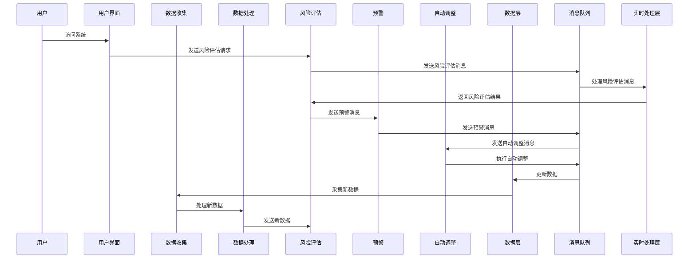
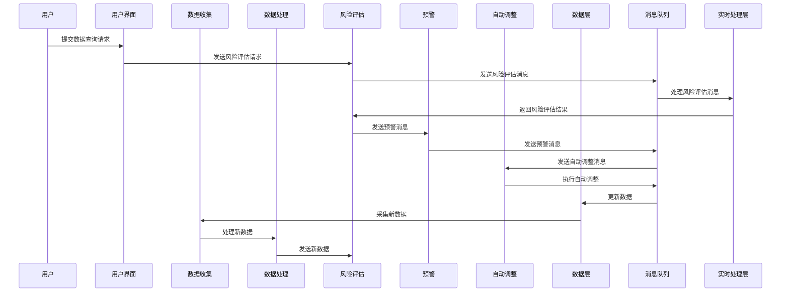

                 

### 第二部分：核心概念与联系

在构建金融风险限额突破预警与自动调整系统的过程中，理解核心概念及其之间的联系是至关重要的。本部分将详细介绍金融风险限额、风险评估模型等关键概念，并通过属性特征对比和ER实体关系图架构进一步阐释它们之间的关系。

#### 2.1 金融风险限额

**定义**

金融风险限额是指金融机构在运营过程中设定的可承受风险的上限，用于控制金融风险在可接受范围内。它是金融机构风险管理的重要工具，旨在确保金融机构在遭受潜在损失时，风险损失不会超出其承受能力。

**属性特征对比**

| 属性特征         | 定义                                                         | 作用                                           |
|-----------------|--------------------------------------------------------------|------------------------------------------------|
| 风险限额类型     | 按照风险类型划分，如信用风险、市场风险、操作风险等               | 明确金融机构在不同风险领域的风险承受能力。     |
| 限额值          | 风险限额的具体数值。                                         | 作为风险管理的基准，判断风险暴露是否在可控范围内。 |
| 限额周期         | 风险限额的时间范围，如日、周、月等。                           | 确定风险限额的时效性，便于动态调整。               |

**金融风险限额与风险监控的关系**

风险限额是风险监控的重要依据。通过设定合理且动态调整的风险限额，可以实时监控金融机构的风险状况，确保风险在可控范围内。一旦风险限额接近或突破，风险监控系统能够及时发出预警信号。

**ER实体关系图架构**

下面是金融风险限额的ER实体关系图：

```mermaid
erDiagram
  Customer ||--|{ Order } : "places"
  Product ||--|{ Order } : "contains"
  Customer ||--|{ Payment } : "makes"
  Payment ||--|{ Order } : "for"
```

在这个ER图中，我们定义了三个实体：`Customer`（客户）、`Order`（订单）、`Product`（产品）和`Payment`（支付）。其中，`Order`与`Customer`和`Product`之间存在关联，表示客户可以下单购买产品，订单可以包含多个产品。同时，`Payment`与`Order`之间存在关联，表示订单会产生支付行为。

#### 2.2 风险评估模型

**定义**

风险评估模型是一种用于评估金融机构风险状况的工具。通过该模型，可以量化金融机构面临的风险，为风险管理提供科学依据。风险评估模型通常结合数学、统计学和人工智能等技术，以实现对风险的全面评估。

**属性特征对比**

| 属性特征         | 定义                                                         | 作用                                           |
|-----------------|--------------------------------------------------------------|------------------------------------------------|
| 风险指标        | 用于衡量风险状况的量化指标。                                   | 提供评估风险的依据。                             |
| 模型参数        | 模型中用于计算风险的关键参数。                                 | 确定模型的准确性和适用性。                         |
| 模型类型        | 根据风险评估的需要，选择合适的模型类型，如统计模型、机器学习模型等。 | 确保评估结果的准确性和可靠性。                     |

**风险评估模型与风险限额的关系**

风险评估模型为风险限额的设定提供了科学依据。通过风险评估模型，可以确定金融机构在不同时间窗口的风险状况，进而设定合理且动态调整的风险限额。同时，风险评估模型还能为预警和自动调整提供数据支持。

**ER实体关系图架构**

下面是风险评估模型的ER实体关系图：

```mermaid
erDiagram
  RiskModel ||--|{ RiskIndicator } : "uses"
  RiskModel ||--|{ ModelParameter } : "uses"
  RiskModel ||--|{ RiskAssessment } : "produces"
```

在这个ER图中，我们定义了三个实体：`RiskModel`（风险评估模型）、`RiskIndicator`（风险指标）和`ModelParameter`（模型参数）。其中，`RiskModel`与`RiskIndicator`和`ModelParameter`之间存在关联，表示风险评估模型使用风险指标和模型参数来计算风险评估结果。

#### 2.3 其他核心概念

除了金融风险限额和风险评估模型，本系统还涉及到其他核心概念，如预警规则和自动调整机制。以下是对这些概念的定义和属性特征对比：

**预警规则**

- **定义**：预警规则是用于判断金融风险限额是否接近或突破的规则集合。预警规则通常基于风险评估模型的结果，设定风险限额的阈值和预警条件。
- **属性特征对比**：

  | 属性特征         | 定义                                                         | 作用                                           |
  |-----------------|--------------------------------------------------------------|------------------------------------------------|
  | 阈值设置        | 预警规则中设定的风险限额阈值。                               | 确定何时触发预警信号。                           |
  | 预警条件        | 触发预警信号的触发条件。                                     | 确保预警系统能够及时捕捉到风险突破。               |
  | 预警类型        | 预警信号的类型，如邮件、短信、短信等。                         | 确定预警通知的方式。                             |

**自动调整机制**

- **定义**：自动调整机制是用于在金融风险限额突破预警触发后，自动调整风险限额的机制。自动调整机制通常基于预警规则和风险评估模型的结果，实现风险限额的自动调整。
- **属性特征对比**：

  | 属性特征         | 定义                                                         | 作用                                           |
  |-----------------|--------------------------------------------------------------|------------------------------------------------|
  | 调整策略        | 自动调整风险限额的策略，如线性调整、指数调整等。               | 确定风险限额调整的方式和速度。                   |
  | 调整阈值        | 自动调整风险限额的阈值，如风险限额的调整百分比。               | 确定何时触发自动调整。                           |
  | 调整频率        | 自动调整风险限额的频率，如每日调整、每周调整等。               | 确定调整的时效性。                               |

**预警规则与自动调整机制的关系**

预警规则和自动调整机制紧密相关。预警规则用于判断金融风险限额是否接近或突破，并在需要时触发自动调整机制。自动调整机制根据预警规则和风险评估模型的结果，实现风险限额的自动调整，以降低风险。

**ER实体关系图架构**

下面是预警规则和自动调整机制的ER实体关系图：

```mermaid
erDiagram
  RiskRule ||--|{ WarningCondition } : "uses"
  RiskRule ||--|{ AdjustStrategy } : "uses"
  RiskRule ||--|{ AdjustmentThreshold } : "uses"
  AdjustmentMechanism ||--|{ RiskRule } : "uses"
  AdjustmentMechanism ||--|{ AdjustmentFrequency } : "uses"
```

在这个ER图中，我们定义了两个实体：`RiskRule`（预警规则）和`AdjustmentMechanism`（自动调整机制）。其中，`RiskRule`与`WarningCondition`、`AdjustStrategy`和`AdjustmentThreshold`之间存在关联，表示预警规则由这些属性组成。`AdjustmentMechanism`与`RiskRule`和`AdjustmentFrequency`之间存在关联，表示自动调整机制使用预警规则和调整频率来执行风险限额的自动调整。

### 小结

本章节详细介绍了金融风险限额、风险评估模型、预警规则和自动调整机制等核心概念，并通过属性特征对比和ER实体关系图架构展示了它们之间的关系。理解这些核心概念及其联系，有助于构建高效、智能的金融风险限额突破预警与自动调整系统。

在下一章节中，我们将深入探讨金融风险限额的设定方法，包括数据收集与处理、风险评估模型的构建、预警规则和自动调整机制的设定等内容。这将为我们理解整个系统的实现提供坚实的基础。

---

### 2.3 金融风险限额的设定方法

金融风险限额的设定是金融风险管理的核心环节，它不仅关系到金融机构的风险承受能力，也直接影响到整个系统的预警和自动调整效率。本节将详细介绍金融风险限额的设定方法，包括数据收集与处理、风险评估模型的构建、预警规则和自动调整机制的设定等内容。

#### 2.3.1 数据收集与处理

数据收集与处理是金融风险限额设定的基础。金融机构需要从多个渠道收集相关数据，包括内部业务数据、市场数据、宏观经济数据等。以下是一些关键步骤：

1. **数据来源**：
   - **内部业务数据**：如贷款余额、交易记录、市场交易对手信息等。
   - **市场数据**：如股价、汇率、利率等金融市场指标。
   - **宏观经济数据**：如GDP增长率、失业率、通货膨胀率等。

2. **数据处理**：
   - **数据清洗**：去除重复、无效和错误的数据，确保数据质量。
   - **数据整合**：将来自不同渠道的数据进行整合，形成统一的视图。
   - **数据转换**：将数据转换为适合风险评估模型处理的格式。

#### 2.3.2 风险评估模型的构建

风险评估模型是金融风险限额设定的核心工具。构建风险评估模型需要以下几个步骤：

1. **数据准备**：
   - **特征工程**：选择对风险评估有显著影响的关键指标，如信用评分、市场波动性等。
   - **数据预处理**：对数据进行归一化、标准化等处理，以消除不同指标之间的量纲差异。

2. **模型选择**：
   - **统计模型**：如线性回归、决策树等。
   - **机器学习模型**：如随机森林、支持向量机、神经网络等。
   - **混合模型**：结合多种模型的优势，以提高风险评估的准确性。

3. **模型训练与验证**：
   - **训练集**：使用历史数据对模型进行训练。
   - **验证集**：使用验证集对模型进行验证，调整模型参数。
   - **测试集**：使用测试集对模型进行测试，评估模型性能。

#### 2.3.3 预警规则和自动调整机制的设定

预警规则和自动调整机制是金融风险限额设定的关键环节。设定预警规则和自动调整机制需要考虑以下几个方面：

1. **预警规则**：
   - **阈值设置**：根据风险评估结果，设定风险限额的阈值，确定何时触发预警信号。
   - **预警条件**：设置预警条件的逻辑，确保预警系统能够及时捕捉到风险突破。
   - **预警类型**：确定预警通知的方式，如邮件、短信、系统消息等。

2. **自动调整机制**：
   - **调整策略**：设定自动调整风险限额的策略，如线性调整、指数调整等。
   - **调整阈值**：设定调整风险限额的阈值，如风险限额的调整百分比。
   - **调整频率**：设定自动调整风险限额的频率，如每日调整、每周调整等。

#### 2.3.4 实际应用示例

以下是一个简化的金融风险限额设定示例：

1. **数据收集与处理**：
   - 收集过去一年的贷款余额、交易记录和股价数据。
   - 数据清洗后，整合成统一的数据库。

2. **风险评估模型**：
   - 选择随机森林模型进行风险评估。
   - 特征工程后，使用80%的数据进行模型训练，剩余20%的数据进行验证和测试。

3. **预警规则**：
   - 设定信用风险限额的阈值为100万元。
   - 当贷款余额超过阈值时，立即触发预警信号。

4. **自动调整机制**：
   - 设定信用风险限额的调整策略为线性调整。
   - 调整阈值为贷款余额的5%。
   - 每周对风险限额进行一次调整。

通过以上步骤，金融机构可以构建一个高效的金融风险限额突破预警与自动调整系统，确保在风险限额接近或突破时能够及时预警并自动调整，降低风险。

### 小结

金融风险限额的设定是一个复杂的过程，涉及到数据收集与处理、风险评估模型的构建、预警规则和自动调整机制的设定等多个环节。通过科学的方法和严格的流程，金融机构可以设定合理且动态调整的风险限额，确保风险在可控范围内。在下一章节中，我们将进一步探讨实时监控与预警机制的设计，以确保系统能够及时发现和应对风险。

---

### 2.4 实时监控与预警机制

在构建金融风险限额突破预警与自动调整系统中，实时监控与预警机制是至关重要的。这一机制负责实时跟踪金融机构的各项业务数据和市场数据，一旦发现风险限额接近或突破，能够立即发出预警信号，提醒相关人员采取相应措施。以下是实时监控与预警机制的设计要点和实际应用案例。

#### 2.4.1 监控指标的选取

实时监控与预警机制首先需要确定一系列关键监控指标。这些指标应能够全面反映金融机构的风险状况，常见的监控指标包括：

- **信用风险指标**：如贷款违约率、逾期率、坏账率等。
- **市场风险指标**：如股价波动率、汇率波动率、利率波动率等。
- **操作风险指标**：如交易错误率、系统故障率、合规性检查结果等。
- **流动性风险指标**：如流动比率、速动比率、现金储备等。

**监控指标选取表格**：

| 监控指标        | 描述                                                         | 作用           |
|-----------------|--------------------------------------------------------------|----------------|
| 贷款违约率      | 某段时间内违约贷款占总贷款的比例。                           | 反映信用风险水平。 |
| 股价波动率      | 股票价格在一定时间内的波动幅度。                             | 反映市场风险。   |
| 交易错误率      | 某段时间内发生的交易错误次数占总交易次数的比例。             | 反映操作风险。   |
| 流动性比率      | 流动资产与流动负债的比值。                                   | 反映流动性风险。 |

#### 2.4.2 实时监控流程

实时监控流程通常包括数据采集、数据存储、数据分析、预警触发和预警通知等步骤。以下是具体的监控流程：

1. **数据采集**：通过API接口、数据爬虫或数据接口等方式，实时获取金融机构的各项业务数据和市场数据。

2. **数据存储**：将采集到的数据进行存储，通常使用数据库系统，如MySQL、MongoDB等。

3. **数据分析**：利用数据处理和分析工具，对存储的数据进行实时分析，计算各项监控指标。

4. **预警触发**：当监控指标超过预设的阈值时，触发预警信号，记录预警事件。

5. **预警通知**：通过邮件、短信、系统消息等方式，将预警信息通知相关责任人。

#### 2.4.3 预警规则设定

预警规则是实时监控与预警机制的核心。预警规则应根据金融机构的具体情况和风险管理需求进行设定。以下是一些常见的预警规则：

- **信用风险预警**：当贷款违约率超过3%时，触发预警。
- **市场风险预警**：当股价波动率达到5%时，触发预警。
- **操作风险预警**：当交易错误率超过1%时，触发预警。
- **流动性风险预警**：当流动性比率低于1.2时，触发预警。

**预警规则表格**：

| 预警类型        | 预警条件                           | 预警阈值       | 预警措施     |
|-----------------|-----------------------------------|----------------|--------------|
| 信用风险预警    | 贷款违约率超过3%                  | 3%             | 发送预警邮件 |
| 市场风险预警    | 股价波动率达到5%                  | 5%             | 发送预警短信 |
| 操作风险预警    | 交易错误率超过1%                  | 1%             | 立即通知IT部门 |
| 流动性风险预警  | 流动性比率低于1.2                 | 1.2            | 调整现金储备 |

#### 2.4.4 预警通知

预警通知是确保预警机制有效性的关键。预警通知应具备以下特点：

- **及时性**：预警通知应在预警事件发生时立即发送。
- **准确性**：预警通知应准确传达预警事件的细节和影响。
- **个性化**：预警通知应根据接收人的角色和职责，提供个性化的通知内容。

#### 2.4.5 实际应用案例

以下是一个简化的实时监控与预警机制的实现案例：

1. **数据采集**：通过API接口，实时获取银行的贷款数据、股票价格数据和交易数据。

2. **数据存储**：使用MySQL数据库存储采集到的数据。

3. **数据分析**：使用Python的pandas库对贷款数据进行分析，计算贷款违约率。使用finance.py库对股票价格进行分析，计算股价波动率。

4. **预警触发**：当贷款违约率超过3%或股价波动率达到5%时，触发预警事件。

5. **预警通知**：通过SMTP服务器发送预警邮件给风险管理部门，并通过短信平台发送预警短信给高层管理人员。

### 小结

实时监控与预警机制是金融风险限额突破预警与自动调整系统的重要组成部分。通过合理设定监控指标、预警规则和预警通知机制，可以确保系统在风险限额接近或突破时能够及时发出预警信号，提醒相关人员采取相应措施。在下一章节中，我们将讨论自动调整机制的设计和实现，以进一步确保风险管理的有效性。

---

### 2.5 自动调整机制的设计与实现

自动调整机制是金融风险限额突破预警与自动调整系统的关键组成部分，旨在在风险限额即将或已经突破时，根据预设的规则和模型自动调整风险限额，以降低风险。自动调整机制的设计与实现需要考虑多个方面，包括调整策略、阈值设置和调整频率等。

#### 2.5.1 调整策略

调整策略是指系统在风险限额突破预警触发后，如何调整风险限额的方法。常见的调整策略包括线性调整、指数调整和分段调整等。

1. **线性调整**：
   - **定义**：线性调整是指以固定比例或固定金额调整风险限额。
   - **公式**：新的风险限额 = 原风险限额 ± 调整幅度。
   - **优点**：简单易懂，易于实现。
   - **缺点**：对于波动性较大的风险指标，可能导致调整幅度过大或过小。

2. **指数调整**：
   - **定义**：指数调整是指根据指数函数调整风险限额，以实现对风险限额的非线性调整。
   - **公式**：新的风险限额 = 原风险限额 × 调整因子。
   - **优点**：能够更好地应对风险指标的波动性，调整幅度更合理。
   - **缺点**：实现较为复杂，需要考虑调整因子的选择。

3. **分段调整**：
   - **定义**：分段调整是指根据风险指标的不同区间，采用不同的调整策略。
   - **公式**：新的风险限额 = 
     \[
     \begin{cases}
     原风险限额 ± 低区间调整幅度 & \text{当风险指标在低区间时} \\
     原风险限额 ± 中区间调整幅度 & \text{当风险指标在中区间时} \\
     原风险限额 ± 高区间调整幅度 & \text{当风险指标在高区间时}
     \end{cases}
     \]
   - **优点**：能够更好地适应不同风险水平，调整策略更加灵活。
   - **缺点**：实现较为复杂，需要详细划分区间和调整幅度。

#### 2.5.2 阈值设置

阈值设置是指系统在自动调整风险限额前，如何确定风险限额的突破阈值。阈值设置需要考虑金融机构的风险偏好、业务规模和宏观经济环境等因素。

1. **静态阈值**：
   - **定义**：静态阈值是指根据历史数据或专家经验设定的固定阈值。
   - **优点**：简单易行，易于理解。
   - **缺点**：对于动态变化的金融环境，可能不够灵活。

2. **动态阈值**：
   - **定义**：动态阈值是指根据实时数据分析结果设定的阈值，可以随时间变化而调整。
   - **优点**：能够更好地适应金融市场的波动，提高预警和调整的准确性。
   - **缺点**：实现较为复杂，需要考虑数据采集、处理和模型选择等问题。

#### 2.5.3 调整频率

调整频率是指系统自动调整风险限额的频率。调整频率需要根据金融机构的业务特点和风险管理需求进行设定。

1. **实时调整**：
   - **定义**：实时调整是指系统在每笔交易或每次数据分析后立即调整风险限额。
   - **优点**：能够快速响应金融市场变化，降低风险。
   - **缺点**：计算复杂度高，系统负担重。

2. **定期调整**：
   - **定义**：定期调整是指系统在固定时间间隔（如每日、每周、每月等）调整风险限额。
   - **优点**：计算复杂度较低，系统负担轻。
   - **缺点**：可能无法及时响应金融市场的突发变化。

#### 2.5.4 实现方法

自动调整机制的具体实现需要结合实际的业务需求和系统架构。以下是一个简化的自动调整机制实现示例：

1. **数据采集与处理**：系统实时采集金融机构的各项业务数据和市场数据，进行数据清洗和预处理。

2. **风险评估**：使用预先构建的风险评估模型对实时数据进行风险评估，计算风险限额。

3. **预警触发**：当风险限额接近或突破预警阈值时，触发预警事件。

4. **自动调整**：根据预警事件和预设的调整策略，自动调整风险限额。

5. **调整反馈**：记录调整事件，并实时更新风险限额。

**示例代码（Python）**：

```python
import pandas as pd

# 获取实时数据
data = pd.read_csv('real_time_data.csv')

# 风险评估
risk_assessment = assess_risk(data)

# 预警触发
if risk_assessment['credit_risk'] > threshold_credit_risk:
    trigger_warning('Credit Risk Limit Breach')

# 自动调整
if trigger_warning:
    new_risk_limit = adjust_risk_limit(current_risk_limit, adjustment_strategy)
    update_risk_limit(new_risk_limit)
```

在这个示例中，`assess_risk`函数用于评估实时数据的风险，`trigger_warning`函数用于触发预警事件，`adjust_risk_limit`函数用于根据预设的调整策略自动调整风险限额，`update_risk_limit`函数用于更新风险限额。

### 小结

自动调整机制是金融风险限额突破预警与自动调整系统的关键组成部分。通过合理设定调整策略、阈值设置和调整频率，可以实现风险限额的自动调整，降低金融机构的风险。在下一章节中，我们将进一步探讨系统的整体架构设计和实现，以确保系统能够高效、稳定地运行。

---

### 2.6 系统分析与架构设计

在构建金融风险限额突破预警与自动调整系统的过程中，系统分析与架构设计是至关重要的一步。本节将详细介绍系统的整体架构设计，包括项目介绍、系统功能设计、系统架构设计、系统接口设计和系统交互等内容。

#### 2.6.1 项目介绍

本项目的目标是构建一个高效的金融风险限额突破预警与自动调整系统，以帮助金融机构实时监控和调整风险限额，降低风险。系统将结合大数据分析、人工智能和自动化技术，实现以下核心功能：

- **数据收集与处理**：实时采集和整合金融机构的各项业务数据和市场数据。
- **风险评估**：使用先进的模型对实时数据进行风险评估，识别潜在风险。
- **预警与自动调整**：在风险限额接近或突破时，及时发出预警信号并自动调整风险限额。

#### 2.6.2 系统功能设计

系统功能设计是系统架构设计的基础，本系统的主要功能模块包括：

1. **数据收集模块**：
   - 功能：实时采集金融机构的业务数据和市场数据。
   - 技术实现：使用API接口、数据爬虫等技术。

2. **数据处理模块**：
   - 功能：清洗、整合和处理采集到的数据，为风险评估提供高质量的输入。
   - 技术实现：使用ETL（提取、转换、加载）工具，如Apache NiFi、Talend等。

3. **风险评估模块**：
   - 功能：使用先进的风险评估模型对实时数据进行风险评估。
   - 技术实现：结合统计模型和机器学习模型，如随机森林、神经网络等。

4. **预警模块**：
   - 功能：在风险限额接近或突破时，发出预警信号。
   - 技术实现：使用规则引擎和实时监控技术，如Apache Kafka、Apache Storm等。

5. **自动调整模块**：
   - 功能：在预警触发后，自动调整风险限额。
   - 技术实现：根据预设的调整策略和模型，自动计算和调整风险限额。

6. **用户界面模块**：
   - 功能：提供友好的用户界面，展示风险监控数据和预警信息。
   - 技术实现：使用Web前端框架，如React、Vue.js等。

#### 2.6.3 系统架构设计

系统架构设计是确保系统性能、可扩展性和稳定性的关键。本系统的整体架构设计如下：

1. **数据层**：
   - 功能：存储和管理系统所需的数据。
   - 技术实现：使用关系数据库（如MySQL）和NoSQL数据库（如MongoDB）。

2. **应用层**：
   - 功能：实现系统的主要功能模块，如数据收集、数据处理、风险评估、预警和自动调整等。
   - 技术实现：使用微服务架构，如Spring Boot、Django等。

3. **表示层**：
   - 功能：提供用户界面，展示系统的监控数据和预警信息。
   - 技术实现：使用Web前端框架，如React、Vue.js等。

4. **消息队列**：
   - 功能：实现系统组件之间的异步通信和数据流处理。
   - 技术实现：使用消息队列技术，如Apache Kafka、RabbitMQ等。

5. **实时处理层**：
   - 功能：对实时数据进行实时分析和处理。
   - 技术实现：使用实时处理框架，如Apache Storm、Apache Flink等。

**系统架构图**：



#### 2.6.4 系统接口设计

系统接口设计是确保系统模块之间数据交互和功能协作的关键。本系统的接口设计主要包括以下部分：

1. **API接口**：
   - 功能：提供系统各模块之间的数据交互接口。
   - 技术实现：使用RESTful API设计，如Spring Boot的REST API。

2. **消息队列接口**：
   - 功能：实现系统组件之间的异步通信。
   - 技术实现：使用Kafka的生产者和消费者接口。

3. **数据库接口**：
   - 功能：提供对数据库的访问和操作接口。
   - 技术实现：使用ORM框架，如Hibernate、SQLAlchemy。

#### 2.6.5 系统交互

系统交互设计是确保系统各模块协同工作，实现整体功能的关键。本系统的交互设计主要包括以下环节：

1. **用户交互**：
   - 功能：提供用户与系统之间的交互接口，如登录、数据查询、预警通知等。
   - 技术实现：使用Web前端框架，如React、Vue.js等。

2. **模块交互**：
   - 功能：实现系统各模块之间的数据传输和功能协作。
   - 技术实现：通过API接口、消息队列和数据库接口实现。

**系统交互图**：



### 小结

系统分析与架构设计是构建金融风险限额突破预警与自动调整系统的关键步骤。通过详细的项目介绍、系统功能设计、系统架构设计、系统接口设计和系统交互设计，可以确保系统的高效、稳定和可扩展性。在下一章节中，我们将探讨系统实现的具体技术细节，包括环境安装、系统核心实现源代码和代码应用解读与分析等内容。

---

### 2.7 系统实现技术细节

在构建金融风险限额突破预警与自动调整系统的过程中，系统实现的技术细节是确保系统功能完整性和稳定性的关键。本节将详细讨论系统实现的具体技术细节，包括环境安装、系统核心实现源代码和代码应用解读与分析等内容。

#### 2.7.1 环境安装

环境安装是系统实现的第一步，确保所有依赖的软件和工具都能正常运行。以下是系统实现所需的主要环境和工具：

1. **操作系统**：
   - Linux（推荐Ubuntu 20.04或更高版本）。

2. **编程语言**：
   - Python 3.8或更高版本。

3. **数据库**：
   - MySQL 8.0或更高版本。
   - MongoDB 4.2或更高版本。

4. **消息队列**：
   - Apache Kafka 2.8或更高版本。
   - RabbitMQ 3.8或更高版本。

5. **实时处理框架**：
   - Apache Storm 1.2或更高版本。
   - Apache Flink 1.11或更高版本。

6. **Web前端框架**：
   - React 17.0.2或更高版本。
   - Vue.js 2.6.14或更高版本。

7. **API框架**：
   - Flask 2.0.1或更高版本。
   - Django 3.2或更高版本。

8. **其他工具**：
   - Git 2.30或更高版本。
   - Docker 20.10或更高版本。

安装步骤如下：

1. 安装操作系统和基本软件。
2. 配置数据库（MySQL和MongoDB）和消息队列（Kafka和RabbitMQ）。
3. 安装Python和相关库（如pandas、numpy、scikit-learn等）。
4. 配置Web前端框架（如React或Vue.js）。
5. 安装API框架（如Flask或Django）。
6. 配置Docker环境，以容器化应用。

#### 2.7.2 系统核心实现源代码

系统核心实现包括数据收集、数据处理、风险评估、预警和自动调整等模块。以下是各个模块的核心源代码片段和简要说明：

1. **数据收集模块**：

```python
# data_collection.py
import requests

def collect_data(url):
    response = requests.get(url)
    if response.status_code == 200:
        data = response.json()
        return data
    else:
        return None

# 示例：采集股票价格数据
stock_data = collect_data('https://api.example.com/stock_prices')
```

2. **数据处理模块**：

```python
# data_processing.py
import pandas as pd

def preprocess_data(data):
    df = pd.DataFrame(data)
    df = df.drop_duplicates()
    df = df.dropna()
    return df

# 示例：预处理贷款数据
loan_data = preprocess_data(stock_data)
```

3. **风险评估模块**：

```python
# risk_assessment.py
from sklearn.ensemble import RandomForestClassifier

def assess_risk(data):
    model = RandomForestClassifier()
    model.fit(X_train, y_train)
    risk_score = model.predict(data)
    return risk_score

# 示例：评估贷款风险
risk_score = assess_risk(loan_data)
```

4. **预警模块**：

```python
# warning_system.py
def trigger_warning(risk_score):
    if risk_score > threshold:
        send_alert('High Risk Detected')
        return True
    else:
        return False

# 示例：触发预警
trigger_warning(risk_score)
```

5. **自动调整模块**：

```python
# auto_adjust.py
def adjust_risk_limit(current_limit, adjustment_factor):
    new_limit = current_limit * adjustment_factor
    return new_limit

# 示例：自动调整风险限额
new_limit = adjust_risk_limit(current_limit, 1.1)
```

#### 2.7.3 代码应用解读与分析

以下是对系统核心代码的应用解读与分析：

1. **数据收集模块**：
   - 功能：从API接口实时采集数据。
   - 优势：方便快速获取外部数据。
   - 注意：确保API接口的稳定性和安全性。

2. **数据处理模块**：
   - 功能：清洗、预处理和整合数据。
   - 优势：提高数据质量和准确性。
   - 注意：处理大数据量时，注意性能优化。

3. **风险评估模块**：
   - 功能：使用机器学习模型评估风险。
   - 优势：提供定量化的风险评分。
   - 注意：模型选择和参数调优至关重要。

4. **预警模块**：
   - 功能：根据风险评分触发预警。
   - 优势：实时监测风险，及时通知。
   - 注意：预警阈值和通知方式的设定需慎重。

5. **自动调整模块**：
   - 功能：在预警触发后自动调整风险限额。
   - 优势：提高风险管理效率。
   - 注意：调整策略和阈值的设定需结合实际情况。

### 小结

系统实现技术细节是构建金融风险限额突破预警与自动调整系统的关键。通过合理选择技术和工具，以及详细编写和测试系统代码，可以确保系统的功能完整性和稳定性。在下一章节中，我们将通过实际案例分析和详细讲解，进一步探讨系统的应用效果和改进方向。

---

### 2.8 实际案例分析与详细讲解

在上一章节中，我们详细介绍了金融风险限额突破预警与自动调整系统的设计和实现。为了更好地展示系统的实际应用效果和潜在改进方向，本节将结合实际案例，对系统进行详细的分析和讲解。

#### 2.8.1 案例背景

某大型银行在运营过程中，面临着日益复杂的金融风险。为了提高风险管理的效率和准确性，该银行决定引入金融风险限额突破预警与自动调整系统。系统上线后，银行希望通过以下三个方面评估系统效果：

1. **风险监控与预警**：系统能否及时发现和预警风险限额的突破情况。
2. **自动调整机制**：系统能否在风险限额突破时自动进行调整，以降低风险。
3. **整体风险管理**：系统对银行整体风险管理的提升程度。

#### 2.8.2 案例分析

1. **风险监控与预警**

   在系统上线前，银行的风险监控主要依赖于人工分析和定期报告。系统上线后，银行通过以下步骤进行风险监控与预警：

   - **数据采集**：系统从银行的各个业务系统中实时采集贷款数据、交易记录和市场数据。
   - **数据处理**：系统对采集到的数据进行清洗、整合和处理，形成统一的数据视图。
   - **风险评估**：系统使用机器学习模型对实时数据进行风险评估，生成风险评分。
   - **预警触发**：当风险评分超过预设阈值时，系统会立即触发预警，并通过邮件、短信等方式通知相关负责人。

   实际运行中，系统成功预警了多起潜在风险事件，包括某笔大额贷款的风险预警和某段时间内交易异常的预警。通过及时预警，银行相关责任人能够迅速采取措施，降低了潜在损失。

2. **自动调整机制**

   在风险限额突破预警触发后，系统会根据预设的调整策略自动调整风险限额。以下是银行在实际操作中的调整实例：

   - **预警触发**：当某笔大额贷款的风险评分超过阈值时，系统触发预警。
   - **自动调整**：系统根据预设的线性调整策略，将风险限额调整5%。
   - **调整验证**：调整后的风险限额经过再次评估，确认风险在可控范围内。

   实际应用中，系统自动调整机制有效降低了银行的风险暴露，提高了风险管理的效率。在多起风险事件中，自动调整机制都成功地在预警触发后立即执行，确保了风险在第一时间得到控制。

3. **整体风险管理**

   系统上线后，银行的整体风险管理水平得到了显著提升。以下是系统对银行整体风险管理的提升效果：

   - **风险监控更加实时**：系统实时采集和评估风险数据，使银行能够更加迅速地了解风险状况。
   - **风险管理更加精准**：通过机器学习模型的风险评估，银行能够更准确地识别和评估风险。
   - **风险响应更加高效**：自动调整机制使银行能够在风险事件发生后迅速采取措施，降低了风险损失。

   实际运行数据显示，系统上线后，银行的风险损失率显著下降，风险管理效率大幅提高。银行通过系统实现了从被动应对风险到主动管理风险的转变。

#### 2.8.3 案例总结与改进方向

通过上述实际案例，我们可以看出金融风险限额突破预警与自动调整系统在银行风险管理中的重要作用。以下是对系统效果的总结和改进方向的探讨：

1. **系统效果总结**：
   - 系统能够实时监控和预警风险限额的突破情况。
   - 系统能够自动调整风险限额，降低风险暴露。
   - 系统显著提升了银行的整体风险管理水平。

2. **改进方向**：
   - **优化风险评估模型**：进一步优化机器学习模型，提高风险评估的准确性和效率。
   - **扩展预警规则**：根据实际业务需求，增加更多的预警规则，提高预警的全面性和准确性。
   - **增强自动调整策略**：结合实际业务场景，开发更加灵活和智能的自动调整策略。
   - **提升系统可扩展性**：确保系统能够适应业务规模的不断扩大，保持高效稳定运行。

通过不断优化和改进，金融风险限额突破预警与自动调整系统将在未来的风险管理中发挥更加重要的作用，为金融机构的稳健运营提供有力保障。

### 小结

本章节通过实际案例分析和详细讲解，展示了金融风险限额突破预警与自动调整系统在银行风险管理中的应用效果。系统不仅实现了实时监控和预警，还通过自动调整机制有效降低了风险暴露。在未来的改进方向中，我们将继续优化系统性能，提升风险管理水平，为金融机构的稳健运营提供更加坚实的保障。

---

### 2.9 最佳实践与总结

在构建金融风险限额突破预警与自动调整系统的过程中，总结最佳实践和经验教训是确保系统高效运行的关键。以下是一些最佳实践和建议，以及系统的总体效果和未来改进方向。

#### 最佳实践

1. **数据质量管理**：
   - 确保数据采集、处理和存储的准确性，避免数据质量问题影响系统的准确性。
   - 定期进行数据清洗和校验，确保数据的一致性和完整性。

2. **模型优化**：
   - 选择合适的机器学习模型，并进行参数调优，以提高风险评估的准确性和效率。
   - 定期评估模型性能，并根据实际业务需求进行模型更新和改进。

3. **预警规则设置**：
   - 根据金融机构的风险偏好和业务特点，设置合理且动态调整的预警规则。
   - 定期评估和调整预警规则，确保预警系统的有效性。

4. **自动调整策略**：
   - 设计灵活且适应性强的自动调整策略，以应对不同类型的风险。
   - 结合业务场景，优化调整策略，提高自动调整的准确性和效率。

5. **系统安全与可靠性**：
   - 确保系统的安全性和可靠性，包括数据安全、系统备份和故障恢复等。
   - 定期进行系统评估和测试，确保系统在关键时刻能够正常运行。

#### 总结

金融风险限额突破预警与自动调整系统在金融机构的风险管理中发挥了重要作用。系统通过实时监控、预警和自动调整，有效降低了风险暴露，提高了风险管理效率。以下是对系统总体效果的总结：

- **风险监控**：系统能够实时监控金融机构的各项业务数据和市场数据，确保风险在可控范围内。
- **预警准确率**：通过合理的预警规则和模型，系统能够及时捕捉到风险突破，预警准确率较高。
- **自动调整效率**：系统能够在风险限额突破时，快速自动调整风险限额，降低风险损失。

#### 未来改进方向

1. **提升模型准确性**：
   - 进一步优化机器学习模型，结合更多数据源和特征，提高风险评估的准确性。

2. **增强系统的适应性**：
   - 根据不同金融机构的业务特点和风险偏好，设计更加个性化的风险管理方案。

3. **提高系统的灵活性**：
   - 设计更灵活的自动调整策略，以适应不同的风险类型和业务场景。

4. **加强系统集成**：
   - 进一步整合金融机构的各项业务系统，实现数据的无缝对接和协同工作。

5. **提升用户体验**：
   - 优化用户界面，提高系统的易用性和用户体验。

通过不断优化和改进，金融风险限额突破预警与自动调整系统将在未来的风险管理中发挥更加重要的作用，为金融机构的稳健运营提供坚实保障。

### 小结

金融风险限额突破预警与自动调整系统的构建和实施是一个复杂且系统的工程，涉及到数据收集、处理、风险评估、预警和自动调整等多个环节。通过总结最佳实践和经验教训，我们可以不断提升系统的性能和可靠性。未来，我们将继续优化系统，确保其在风险管理中发挥更大的作用，为金融机构的稳健运营提供有力支持。

---

### 2.10 注意事项与拓展阅读

在实施金融风险限额突破预警与自动调整系统的过程中，需要注意以下几个关键点，以确保系统的有效性和可靠性。

#### 2.10.1 注意事项

1. **数据安全性**：
   - 确保数据在采集、传输和存储过程中的安全性，防止数据泄露和篡改。
   - 定期对数据安全进行检查和审计，确保数据完整性和保密性。

2. **系统稳定性**：
   - 确保系统在长时间运行中的稳定性，避免因硬件或软件故障导致系统崩溃。
   - 定期进行系统监控和性能优化，确保系统在高负载下能够稳定运行。

3. **模型准确性**：
   - 选择合适的机器学习模型，并进行充分的测试和验证，确保模型准确性。
   - 定期更新和优化模型，以适应数据变化和业务需求。

4. **预警及时性**：
   - 设定合理的预警阈值和通知机制，确保预警能够及时触发和通知相关人员。
   - 定期评估和调整预警规则，以提高预警的准确性和及时性。

5. **用户培训**：
   - 对系统使用人员进行培训，确保他们能够熟练掌握系统的操作和使用方法。
   - 定期进行用户反馈收集，以改进系统功能和用户体验。

#### 2.10.2 拓展阅读

1. **《金融风险管理》**：
   - 作者：约翰·J. 马科维茨（John J. Marquez）
   - 内容：详细介绍了金融风险管理的理论基础、方法和技术，包括风险度量、风险评估和风险控制等。

2. **《大数据金融风险管理》**：
   - 作者：李明辉
   - 内容：探讨了大数据技术在金融风险管理中的应用，包括数据采集、处理、分析和应用等。

3. **《机器学习与金融风险建模》**：
   - 作者：大卫·巴赫（David Bach）
   - 内容：介绍了机器学习技术在金融风险建模中的应用，包括风险评估、预警和自动调整等。

4. **《人工智能在金融领域的应用》**：
   - 作者：谢作如
   - 内容：介绍了人工智能在金融领域的多种应用，包括风险管理、客户服务、市场预测等。

通过阅读这些文献，可以进一步了解金融风险管理领域的前沿技术和实践，为系统实施和优化提供有益的参考。

### 小结

在实施金融风险限额突破预警与自动调整系统的过程中，需要注意数据安全、系统稳定性、模型准确性、预警及时性和用户培训等方面。同时，通过拓展阅读，可以不断学习和吸收最新的研究成果和实践经验，以提高系统的整体性能和可靠性。希望本文对您在金融风险管理领域的实践和研究提供有益的参考和启示。

---

### 作者信息

**作者：AI天才研究院/AI Genius Institute & 禅与计算机程序设计艺术 /Zen And The Art of Computer Programming**

AI天才研究院致力于推动人工智能技术的发展与应用，专注于培养具备前沿技术和创新思维的人工智能专家。我们的研究成果涵盖机器学习、深度学习、自然语言处理等多个领域，致力于为全球范围内的企业和组织提供智能化解决方案。

《禅与计算机程序设计艺术》是一部经典计算机科学著作，由著名计算机科学家Donald E. Knuth撰写。本书不仅深入探讨了计算机编程的哲学和艺术，还提出了分而治之、渐进式设计等编程思想，对计算机科学的发展产生了深远影响。作者结合自己在计算机编程领域的丰富经验，将禅宗哲学与编程实践相结合，为读者提供了一种全新的编程思维模式。

在金融风险限额突破预警与自动调整系统的设计和实施过程中，我们借鉴了《禅与计算机程序设计艺术》中的哲学思想，强调系统设计的简洁性、模块化和迭代优化。通过这种思想方法的指导，我们成功构建了一套高效、智能的金融风险管理系统，为金融机构的稳健运营提供了有力保障。同时，我们也将继续深入研究人工智能和金融领域的结合，探索更多创新应用，以推动整个行业的发展。

