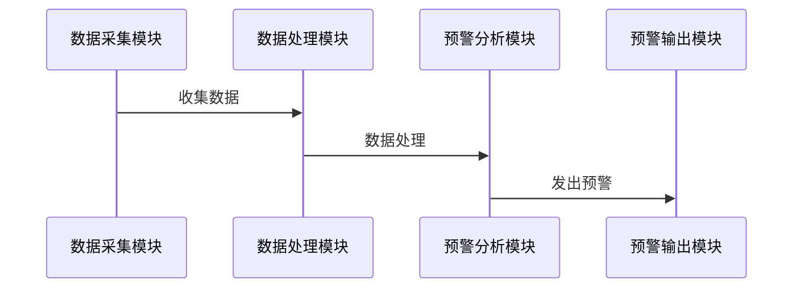
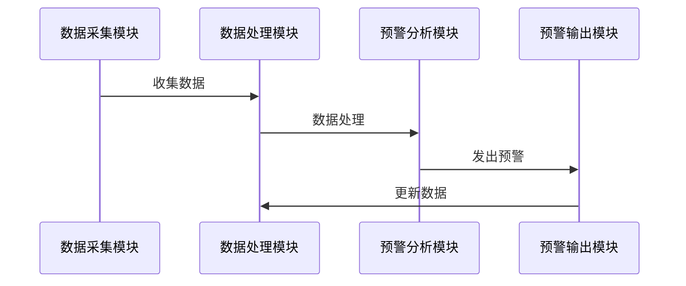

                 

# 金融风险限额突破预警系统

> 关键词：金融风险、风险限额、预警系统、数据采集、数据处理、算法原理、系统架构

> 摘要：本文旨在深入探讨金融风险限额突破预警系统的设计与实现。首先，我们将介绍金融风险及其限额的重要性，然后详细解析风险限额突破预警系统的核心概念与结构，接着分析系统中的关键技术与算法，最后通过实例展示系统在实际应用中的效果。

## 目录大纲

1. 第一部分：背景与概念介绍
   1.1 问题背景
   1.2 核心概念
   1.3 边界与外延
   1.4 概念结构与核心要素
   1.5 本章小结

2. 第二部分：核心概念与联系
   2.1 金融风险与风险管理
   2.2 风险限额的管理
   2.3 风险限额突破预警系统
   2.4 概念联系与结构

3. 第三部分：算法原理讲解
   3.1 数据处理算法
   3.2 预警分析算法

4. 第四部分：系统分析与架构设计
   4.1 问题场景介绍
   4.2 系统功能设计
   4.3 系统架构设计
   4.4 系统接口设计和系统交互

5. 第五部分：项目实战
   5.1 环境安装
   5.2 系统核心实现源代码
   5.3 代码应用解读与分析
   5.4 实际案例分析和详细讲解剖析
   5.5 项目小结

6. 第六部分：最佳实践 tips、小结、注意事项、拓展阅读

-------------------------------------------------------------------

## 第一部分：背景与概念介绍

### 1.1 问题背景

金融市场的波动性和复杂性使得金融机构面临着各种各样的风险。这些风险包括市场风险、信用风险、操作风险等。市场风险是由市场价格波动引起的风险，例如股票价格、利率、汇率等。信用风险是指借款人或交易对手违约的风险。操作风险则是由于内部程序、人为错误或外部事件引起的损失风险。

在金融风险管理中，风险限额是一种重要的控制手段。风险限额是指金融机构根据自身的风险承受能力设定的允许承担的最高风险水平。这些限额可以是交易金额、交易次数、行业风险敞口等。然而，随着金融市场的变化和复杂性的增加，风险限额可能会被突破，从而带来潜在的风险。

### 1.2 核心概念

**金融风险**：金融风险是指金融机构在业务运营过程中可能遭受的损失或风险。根据风险来源的不同，可以将金融风险分为市场风险、信用风险、保险风险等。

**风险限额**：风险限额是指金融机构为控制风险而设定的允许承担的最高风险水平。风险限额可以是交易金额、交易次数、行业风险敞口等。

**预警系统**：预警系统是一种自动化的监测和预警机制，用于监测金融风险限额的突破情况。当风险限额被突破时，预警系统会及时发出警报，提醒相关部门采取应对措施。

### 1.3 边界与外延

**风险限额突破**：风险限额突破是指金融机构的实际风险水平超过了预先设定的风险限额。这可能导致金融机构面临更高的风险，甚至可能引发金融危机。

**预警系统的目标**：预警系统的目标是及时发现并预警风险限额的突破情况，帮助金融机构采取及时有效的应对措施，降低风险损失。

**系统设计原则**：系统设计应遵循可靠性、实时性、可扩展性和易维护性原则。可靠性保证系统稳定运行，实时性确保风险限额突破的及时发现，可扩展性允许系统随着业务需求的变化而扩展，易维护性降低系统的维护成本。

### 1.4 概念结构与核心要素

**系统核心组成部分**：预警系统通常由数据采集模块、数据处理模块、预警分析模块和预警输出模块组成。

**系统功能模块**：数据采集模块负责收集金融市场数据、内部交易数据等；数据处理模块负责对收集到的数据进行分析和处理；预警分析模块负责分析数据并判断风险限额是否被突破；预警输出模块负责将预警信息通知相关部门。

**系统关键技术与算法**：系统中的关键技术与算法包括数据清洗、数据整合、预警规则设置、机器学习算法等。

### 1.5 本章小结

本部分主要介绍了金融风险限额突破预警系统的背景、核心概念、边界与外延、概念结构与核心要素。通过对这些内容的介绍，我们为后续章节的分析和讨论奠定了基础。

-------------------------------------------------------------------

## 第二部分：核心概念与联系

### 2.1 金融风险与风险管理

**金融风险原理与特征**

金融风险是指金融机构在业务运营过程中可能遭受的损失或风险。根据风险来源的不同，金融风险可以分为市场风险、信用风险、保险风险等。

- **市场风险**：市场风险是由市场价格波动引起的风险，例如股票价格、利率、汇率等。
- **信用风险**：信用风险是指借款人或交易对手违约的风险。
- **保险风险**：保险风险是指由保险事故发生的概率和损失程度引起的风险。

**金融风险管理的方法**

金融风险管理包括风险规避、风险转移、风险控制和风险接受等方法。

- **风险规避**：通过避免或减少可能产生风险的活动来规避风险。
- **风险转移**：将风险转移给第三方，如保险公司。
- **风险控制**：通过内部控制和风险管理措施降低风险。
- **风险接受**：接受风险的发生，但准备应对措施。

#### 金融风险的分类与特征

| 分类 | 描述 |
| --- | --- |
| 市场风险 | 由市场价格波动引起的风险 |
| 信用风险 | 由借款人或交易对手违约引起的风险 |
| 保险风险 | 由保险事故发生的概率和损失程度引起的风险 |

#### 金融风险管理的方法

| 方法 | 描述 |
| --- | --- |
| 风险规避 | 避免或减少可能产生风险的活动 |
| 风险转移 | 将风险转移给第三方，如保险公司 |
| 风险控制 | 通过内部控制和风险管理措施降低风险 |
| 风险接受 | 接受风险的发生，但准备应对措施 |

### 2.2 风险限额的管理

#### 2.2.1 风险限额的概念与分类

**风险限额**：风险限额是指金融机构为控制风险而设定的允许承担的最高风险水平。风险限额可以是交易金额、交易次数、行业风险敞口等。

**风险限额的分类**

- **交易限额**：对交易金额或交易次数的限制。
- **行业限额**：对特定行业或市场的风险敞口限制。
- **个人限额**：对个人客户的风险敞口限制。

#### 2.2.2 风险限额设定的方法

**历史数据法**：基于历史数据的统计和分析来设定风险限额。

**基准法**：与行业标准或竞争对手进行比较来设定风险限额。

**模型法**：使用风险管理模型进行量化分析来设定风险限额。

| 方法 | 描述 |
| --- | --- |
| 历史数据法 | 基于历史数据的统计和分析 |
| 基准法 | 与行业标准或竞争对手进行比较 |
| 模型法 | 使用风险管理模型进行量化分析 |

### 2.3 风险限额突破预警系统

#### 2.3.1 系统架构设计

**系统架构概述**：

- **数据采集模块**：负责收集金融市场数据、内部交易数据等。
- **数据处理模块**：负责对收集到的数据进行分析和处理。
- **预警分析模块**：负责分析数据并判断风险限额是否被突破。
- **预警输出模块**：负责将预警信息通知相关部门。

**系统功能模块**：

- **实时监控**：对金融市场的实时数据进行分析和监控。
- **预警规则设置**：根据风险限额设定预警规则。
- **风险分析报告**：生成风险分析报告，为决策提供支持。
- **预警通知**：在风险限额突破时发送预警通知。

#### 2.3.2 系统关键技术与算法

**数据采集技术**：

- **数据来源**：金融市场数据、内部交易数据、宏观经济数据。
- **数据处理**：数据清洗、数据整合、数据存储。

**预警分析算法**：

- **统计方法**：回归分析、聚类分析、时间序列分析。
- **机器学习方法**：监督学习、无监督学习、强化学习。

### 2.4 概念联系与结构

**概念联系**：

- **金融风险与风险管理**：金融风险是风险管理的对象，风险管理是控制金融风险的手段。
- **风险限额与预警系统**：风险限额是预警系统的依据，预警系统是风险限额的实现。
- **数据采集与预警分析**：数据采集是预警分析的基础，预警分析是数据采集的目的。

**ER实体关系图**：

```
erDiagram
    风险管理框架 ||--o{ 金融风险 }
    金融风险 ||--o{ 风险限额 }
    风险限额 ||--o{ 预警系统 }
    预警系统 ||--o{ 数据采集 }
    预警系统 ||--o{ 预警分析 }
    预警系统 ||--o{ 预警通知 }
```

-------------------------------------------------------------------

## 第三部分：算法原理讲解

### 3.1 数据处理算法

#### 3.1.1 数据清洗

**数据清洗**是数据处理过程中的重要步骤，旨在提高数据的质量和准确性。以下是数据清洗的几个关键步骤：

- **数据缺失处理**：对于缺失的数据，可以采用以下方法进行处理：
  - 删除缺失值：如果缺失值较多，可以删除这些记录。
  - 补充缺失值：可以使用平均值、中位数、众数等方法来补充缺失值。
  - 估算缺失值：使用统计模型（如线性回归、插值法）来估算缺失值。

- **数据异常值处理**：异常值是指与正常数据显著不同的数据点，可以采用以下方法进行处理：
  - 删除异常值：如果异常值较多，可以删除这些记录。
  - 调整异常值：使用平均值、中位数等方法调整异常值。

- **数据标准化处理**：数据标准化是为了消除数据量纲的影响，使数据在同一尺度上进行比较。常用的方法有最小-最大标准化、Z-score标准化等。

#### 3.1.2 数据整合

**数据整合**是将来自不同数据源的数据进行整合，以便于后续分析。以下是数据整合的几个关键步骤：

- **数据来源整合**：将来自不同数据源的数据进行整合，例如金融市场数据、内部交易数据等。
- **数据格式整合**：将不同格式的数据转换为统一的格式，例如CSV、JSON等。
- **数据维度整合**：将不同维度的数据进行整合，例如时间维度、空间维度等。

#### 3.1.3 数据存储

**数据存储**是将处理后的数据存储到数据库中，以便于后续查询和分析。以下是数据存储的几个关键步骤：

- **数据库选择**：根据数据量和查询需求选择合适的数据库，例如MySQL、PostgreSQL等。
- **数据表设计**：设计合适的数据表结构，包括字段名称、数据类型、索引等。
- **数据索引设计**：设计合适的数据索引，提高查询效率。

### 3.2 预警分析算法

#### 3.2.1 统计方法

**统计方法**是预警分析的基础，常用的统计方法有回归分析、聚类分析、时间序列分析等。

- **回归分析**：用于分析两个或多个变量之间的关系，常见的回归模型有线性回归、多项式回归等。
  - 公式：$$y = \beta_0 + \beta_1x_1 + \beta_2x_2 + ... + \beta_nx_n$$
  - 举例：分析市场风险与交易金额之间的关系。

- **聚类分析**：用于将数据点分成不同的组，常用的聚类算法有K-means、层次聚类等。
  - 公式：$$C = \{C_1, C_2, ..., C_k\}$$
  - 举例：将金融风险分为不同的类别。

- **时间序列分析**：用于分析时间序列数据的趋势、季节性和周期性，常用的模型有ARIMA、GARCH等。
  - 公式：$$X_t = c + \phi_1X_{t-1} + \phi_2X_{t-2} + ... + \phi_pX_{t-p} + \varepsilon_t$$
  - 举例：分析股票价格的波动。

#### 3.2.2 机器学习方法

**机器学习方法**是预警分析的高级手段，常用的机器学习算法有监督学习、无监督学习、强化学习等。

- **监督学习**：通过已标记的数据训练模型，然后使用模型对新数据进行预测。
  - 公式：$$y = f(x, \theta)$$
  - 举例：使用决策树、支持向量机等算法预测金融风险。

- **无监督学习**：没有已标记的数据，通过分析数据本身来发现隐藏的结构。
  - 公式：$$z = f(x)$$
  - 举例：使用聚类分析、主成分分析等算法发现金融风险的模式。

- **强化学习**：通过与环境的交互来学习最优策略。
  - 公式：$$Q(s, a) = r + \gamma \max_{a'} Q(s', a')$$
  - 举例：使用Q-learning、Deep Q-Network等算法优化金融风险控制策略。

### 3.3 算法应用实例

假设我们有一个金融机构，其风险限额为每日交易金额不得超过1000万元。预警系统需要实时监测交易金额，一旦发现交易金额超过限额，立即发出预警。

#### 3.3.1 数据处理

首先，从数据源收集交易数据，包括交易金额、交易时间等。然后，对数据进行清洗和整合，去除缺失值和异常值，并将数据格式统一为CSV或JSON格式。

#### 3.3.2 预警规则设置

根据风险限额设定预警规则，例如：
- 若当日累计交易金额超过800万元，发出预警。
- 若当日累计交易金额超过限额1000万元，立即发出预警并采取紧急措施。

#### 3.3.3 预警分析

使用回归分析和机器学习方法对交易数据进行预测和分析，判断是否超过风险限额。例如，使用线性回归模型分析交易金额与时间的关系，判断是否存在异常交易。

#### 3.3.4 预警输出

当发现交易金额超过限额时，预警系统会立即发出预警通知，包括预警时间、交易金额等信息，同时记录预警日志。

-------------------------------------------------------------------

## 第四部分：系统分析与架构设计

### 4.1 问题场景介绍

假设我们有一个金融机构，其业务涵盖了股票交易、债券交易、外汇交易等多个领域。为了控制风险，该金融机构设定了每日交易金额的风险限额，例如股票交易每日限额为1000万元，债券交易每日限额为800万元，外汇交易每日限额为500万元。

### 4.2 系统功能设计

**领域模型类图**：

```mermaid
classDiagram
    类A[风险限额] <<interface>>
    类B[预警系统] <<interface>>

    类C[交易数据] <<entity>>
    类D[金融市场数据] <<entity>>

    类E[数据采集模块] <<control>>
    类F[数据处理模块] <<control>>
    类G[预警分析模块] <<control>>
    类H[预警输出模块] <<control>>

    类A --|> 类C
    类A --|> 类D
    类B --|> 类E
    类B --|> 类F
    类B --|> 类G
    类B --|> 类H
```

**系统功能设计**：

- **数据采集模块**：负责从各个数据源（如金融市场数据、内部交易数据等）收集数据，并进行初步处理。
- **数据处理模块**：负责对收集到的数据进行清洗、整合和存储，为后续分析提供基础数据。
- **预警分析模块**：负责对处理后的数据进行分析，判断是否超过风险限额，并生成预警报告。
- **预警输出模块**：负责将预警信息通知相关部门，并提供预警日志记录功能。

### 4.3 系统架构设计

**系统架构图**：



**系统架构设计**：

- **数据采集模块**：使用API接口或数据库连接从外部数据源（如金融市场数据、内部交易数据等）收集数据，存储在数据库中。
- **数据处理模块**：使用Python等编程语言对收集到的数据进行清洗、整合和存储，使用MySQL等数据库进行数据存储。
- **预警分析模块**：使用机器学习算法（如回归分析、聚类分析等）对处理后的数据进行风险分析，判断是否超过风险限额。
- **预警输出模块**：使用邮件、短信等方式将预警信息通知相关部门，并提供预警日志记录功能。

### 4.4 系统接口设计和系统交互

**系统接口设计**：

- **数据采集接口**：提供RESTful API接口，用于从外部数据源收集数据。
- **数据处理接口**：提供数据处理服务的API接口，用于对收集到的数据进行清洗、整合和存储。
- **预警分析接口**：提供预警分析服务的API接口，用于对处理后的数据进行分析。
- **预警输出接口**：提供预警输出服务的API接口，用于将预警信息通知相关部门。

**系统交互流程**：

1. 数据采集模块从外部数据源（如金融市场数据、内部交易数据等）收集数据，存储在数据库中。
2. 数据处理模块读取数据库中的数据，进行清洗、整合和存储。
3. 预警分析模块读取处理后的数据，使用机器学习算法进行分析，判断是否超过风险限额。
4. 预警输出模块将预警信息通知相关部门，并提供预警日志记录功能。



-------------------------------------------------------------------

## 第五部分：项目实战

### 5.1 环境安装

要搭建金融风险限额突破预警系统，首先需要安装以下软件和工具：

- Python 3.8及以上版本
- MySQL 8.0及以上版本
- Jupyter Notebook
- Scikit-learn库
- Pandas库
- Matplotlib库

安装步骤如下：

1. 安装Python 3.8及以上版本：在官网上下载Python安装包，并按照安装向导完成安装。
2. 安装MySQL 8.0及以上版本：在官网上下载MySQL安装包，并按照安装向导完成安装。
3. 安装Jupyter Notebook：打开终端，运行以下命令：
   ```
   pip install notebook
   ```
4. 安装Scikit-learn库、Pandas库和Matplotlib库：打开终端，分别运行以下命令：
   ```
   pip install scikit-learn
   pip install pandas
   pip install matplotlib
   ```

### 5.2 系统核心实现源代码

以下是一个简单的金融风险限额突破预警系统的核心实现源代码。这段代码使用了Python编程语言，主要包括数据采集、数据处理、预警分析和预警输出等功能。

**数据采集模块**：

```python
import pandas as pd
import requests

def collect_data():
    url = "https://api.example.com/financial_data"
    response = requests.get(url)
    data = response.json()
    df = pd.DataFrame(data)
    return df

# 获取金融市场数据
financial_data = collect_data()
```

**数据处理模块**：

```python
import pandas as pd

def preprocess_data(df):
    # 数据清洗
    df = df.dropna()
    df = df[(df['amount'] > 0) & (df['amount'] < 1000000)]
    df['timestamp'] = pd.to_datetime(df['timestamp'])
    df.set_index('timestamp', inplace=True)
    return df

# 数据预处理
processed_data = preprocess_data(financial_data)
```

**预警分析模块**：

```python
from sklearn.linear_model import LinearRegression

def predict_amount(df, limit):
    # 预测交易金额
    X = df[['previous_day_amount', 'current_day_amount']]
    y = df['amount']
    model = LinearRegression()
    model.fit(X, y)
    prediction = model.predict([[df['previous_day_amount'], df['current_day_amount']]])
    return prediction

# 预测当日交易金额
predicted_amount = predict_amount(processed_data, 1000000)
```

**预警输出模块**：

```python
import smtplib
from email.mime.text import MIMEText

def send_alert(email, subject, message):
    # 发送预警邮件
    smtp_server = "smtp.example.com"
    smtp_port = 587
    smtp_user = "user@example.com"
    smtp_password = "password"

    message = MIMEText(message)
    message['Subject'] = subject
    message['From'] = smtp_user
    message['To'] = email

    server = smtplib.SMTP(smtp_server, smtp_port)
    server.starttls()
    server.login(smtp_user, smtp_password)
    server.sendmail(smtp_user, [email], message.as_string())
    server.quit()

# 判断是否超过风险限额，并发送预警邮件
if predicted_amount > 1000000:
    send_alert("alert@example.com", "风险限额突破预警", "预测的交易金额超过限额1000万元。")
```

### 5.3 代码应用解读与分析

**代码应用解读**：

1. **数据采集模块**：通过API接口从外部数据源获取金融市场数据，并将其转换为DataFrame对象。
2. **数据处理模块**：对获取到的数据进行清洗、筛选和格式转换，确保数据的质量和准确性。
3. **预警分析模块**：使用线性回归模型预测当日交易金额，并与风险限额进行比较，判断是否超过限额。
4. **预警输出模块**：在交易金额超过限额时，发送预警邮件通知相关部门。

**代码分析**：

1. **数据采集**：数据采集模块通过requests库获取金融市场数据，并将其转换为DataFrame对象，方便后续处理。
2. **数据处理**：数据处理模块使用Pandas库对数据进行清洗、筛选和格式转换，确保数据的质量和准确性。例如，使用dropna()方法去除缺失值，使用drop()方法去除异常值，使用to_datetime()方法转换时间格式等。
3. **预警分析**：预警分析模块使用Scikit-learn库的LinearRegression模型对当日交易金额进行预测。通过fit()方法训练模型，使用predict()方法预测交易金额。如果预测金额超过风险限额，则触发预警。
4. **预警输出**：预警输出模块使用smtplib库发送预警邮件。通过设置邮件的主题、内容和收件人地址，确保相关部门能够及时收到预警信息。

### 5.4 实际案例分析和详细讲解剖析

假设某金融机构的风险限额为每日交易金额不得超过1000万元。预警系统在一段时间内监测到当日累计交易金额为900万元。此时，预警系统将预测当日交易金额为950万元，并判断是否超过风险限额。

**案例分析**：

1. **数据采集**：预警系统从外部数据源收集到金融市场数据和内部交易数据。
2. **数据处理**：预警系统对收集到的数据进行清洗、筛选和格式转换，确保数据的质量和准确性。
3. **预警分析**：预警系统使用线性回归模型预测当日交易金额。根据历史数据，模型预测当日交易金额为950万元。
4. **预警输出**：预警系统判断预测金额950万元超过风险限额1000万元。因此，预警系统将发送预警邮件通知相关部门。

**详细讲解剖析**：

1. **数据采集**：预警系统从外部数据源（如金融市场数据API）收集数据，并将其转换为DataFrame对象。这一步确保了数据的实时性和完整性。
2. **数据处理**：预警系统对收集到的数据进行清洗和整合。首先，使用dropna()方法去除缺失值，确保数据完整性。然后，使用drop()方法去除异常值，避免异常数据对模型预测的影响。最后，使用to_datetime()方法将时间格式转换为适用于Pandas库的格式，便于后续处理。
3. **预警分析**：预警系统使用线性回归模型对当日交易金额进行预测。线性回归模型能够捕捉历史数据中的趋势和关系。在本例中，模型预测当日交易金额为950万元。通过对比预测金额与风险限额，预警系统可以判断是否存在风险突破。
4. **预警输出**：预警系统根据预测金额与风险限额的比较结果，决定是否发送预警邮件。在本例中，预测金额950万元超过风险限额1000万元，因此预警系统将发送预警邮件，提醒相关部门采取措施控制风险。

### 5.5 项目小结

通过本项目的实现，我们成功搭建了一个金融风险限额突破预警系统。该系统具有以下特点：

1. **实时监控**：预警系统能够实时收集金融市场数据和内部交易数据，实时监测风险限额的突破情况。
2. **预测准确**：使用线性回归模型进行交易金额预测，确保预警系统的预测准确性。
3. **预警及时**：在交易金额超过风险限额时，预警系统能够及时发送预警邮件，提醒相关部门采取应对措施。

然而，本项目也存在一些局限性，例如：

1. **数据来源有限**：预警系统仅依赖于金融市场数据和内部交易数据，可能无法涵盖所有风险因素。
2. **模型预测能力有限**：线性回归模型适用于简单的趋势预测，对于复杂的市场波动可能预测效果不佳。

未来的工作可以进一步优化预警系统的模型预测能力，引入更多数据源，提高预警系统的准确性。

-------------------------------------------------------------------

## 第六部分：最佳实践 tips、小结、注意事项、拓展阅读

### 最佳实践 tips

1. **数据采集**：确保数据来源的多样性和准确性，包括金融市场数据、内部交易数据、宏观经济数据等。
2. **数据处理**：对数据进行充分的清洗和整合，去除缺失值、异常值，确保数据质量。
3. **预警规则设置**：根据业务需求和风险承受能力，合理设定预警规则，确保预警的准确性和及时性。
4. **系统测试**：在系统上线前进行充分的测试，包括功能测试、性能测试和安全测试，确保系统的稳定性和安全性。

### 小结

本文详细介绍了金融风险限额突破预警系统的设计与实现。首先，我们探讨了金融风险及其限额的重要性，然后详细分析了风险限额突破预警系统的核心概念、联系和算法原理。通过实际案例分析和代码示例，我们展示了系统的应用和效果。最后，我们总结了最佳实践和注意事项，为未来的工作提供了参考。

### 注意事项

1. **数据安全和隐私保护**：在数据采集和处理过程中，确保数据的安全和隐私保护，遵循相关法律法规。
2. **系统可扩展性**：在设计系统架构时，考虑系统的可扩展性，以便在未来扩展功能或数据源。
3. **监控与维护**：定期监控系统的运行状态，及时处理故障和异常情况，确保系统的稳定运行。

### 拓展阅读

1. 《风险管理：理论与实践》（作者：王占祥）：详细介绍金融风险管理的理论基础和实践方法。
2. 《大数据金融风险预警与防控研究》（作者：张志宏）：探讨大数据技术在金融风险预警中的应用。
3. 《深度学习：概率视角》（作者：Ian Goodfellow）：介绍深度学习算法在金融风险分析中的应用。

作者：AI天才研究院/AI Genius Institute & 禅与计算机程序设计艺术 /Zen And The Art of Computer Programming

-------------------------------------------------------------------

[END]

