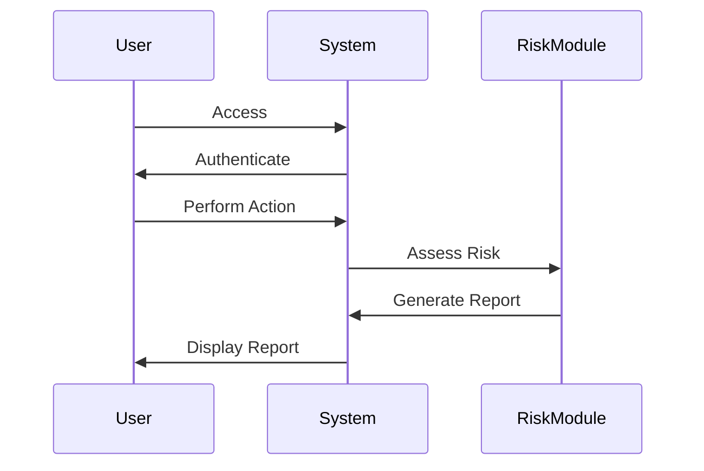

                 

# 金融风险限额管理系统设计

## 关键词

- 金融风险管理
- 风险限额管理
- 风险评估方法
- 系统设计与实现

## 摘要

本文旨在深入探讨金融风险限额管理系统的设计与实现。首先，我们将回顾金融风险管理的意义与挑战，接着解析风险限额管理的基本概念、风险评估方法和风险限额设定方法。在此基础上，通过实践案例探讨风险限额管理的成功经验与教训。最后，我们将详细介绍金融风险限额管理系统的设计、实现以及系统分析与架构设计方案。通过本文的阐述，期望为金融行业在风险管理方面提供有价值的参考和指导。

## 目录大纲

- 第一部分：引言与背景
  - 第1章：金融风险管理的意义与挑战
- 第二部分：金融风险限额管理理论基础
  - 第2章：风险限额管理的基本概念
  - 第3章：风险评估方法
  - 第4章：金融风险限额设定方法
- 第三部分：金融风险限额管理的实践
  - 第5章：金融风险限额管理的实践
- 第四部分：金融风险限额管理系统设计与实现
  - 第6章：金融风险限额管理系统设计与实现

## 第一部分：引言与背景

### 第1章：金融风险管理的意义与挑战

#### 1.1 引言

金融风险管理是金融行业中至关重要的一环。随着全球金融市场的不断变化和复杂化，金融机构面临着越来越多的风险，如市场风险、信用风险、操作风险等。金融风险管理的目的在于识别、评估、控制和监控这些风险，以保护金融机构的稳健运营和投资者的利益。

#### 1.1.1 金融风险管理的概述

金融风险管理包括以下几个关键步骤：

1. **风险识别**：识别金融机构可能面临的各种风险。
2. **风险评估**：对识别出的风险进行量化或定性评估，以确定其严重程度和可能的影响。
3. **风险控制**：采取适当的措施来降低或消除风险。
4. **风险监控**：持续监控风险，确保风险控制措施的有效性。

#### 1.1.2 金融风险管理的必要性

金融风险管理的重要性体现在以下几个方面：

1. **保护投资者利益**：通过有效管理风险，确保投资者的资金安全。
2. **维护金融机构稳健运行**：风险管理有助于金融机构在面临不确定的市场环境时保持稳健运行。
3. **提高金融系统稳定性**：通过有效的风险管理，降低金融市场的波动性和系统性风险。

#### 1.1.3 金融风险管理的目标

金融风险管理的目标主要包括：

1. **风险最小化**：通过识别和评估风险，采取适当的措施来降低风险水平。
2. **风险可接受性**：确保金融机构的风险水平在可接受范围内，避免出现重大的损失。
3. **风险透明性**：提高风险管理的透明度，确保管理层和投资者对风险有充分的了解。

#### 1.2 金融风险管理的挑战

金融风险管理面临以下挑战：

1. **风险识别与评估的困难**：金融市场复杂多变，风险识别和评估具有较大的不确定性。
2. **风险限额管理的复杂性**：不同类型的风险需要采取不同的限额管理策略，增加了管理的复杂性。
3. **监控与报告的挑战**：有效的风险监控和报告需要大量的人力、物力和时间投入。

#### 1.3 本书结构安排

本书分为四个部分，具体安排如下：

1. **第一部分：引言与背景**，介绍金融风险管理的意义与挑战。
2. **第二部分：金融风险限额管理理论基础**，探讨风险限额管理的基本概念、风险评估方法和风险限额设定方法。
3. **第三部分：金融风险限额管理的实践**，通过实践案例探讨风险限额管理的成功经验与教训。
4. **第四部分：金融风险限额管理系统设计与实现**，详细介绍金融风险限额管理系统的设计、实现以及系统分析与架构设计方案。

#### 1.4 本章小结

本章介绍了金融风险管理的意义、必要性、目标和面临的挑战，并概述了本书的结构安排。下一章将深入探讨风险限额管理的基本概念。

## 第二部分：金融风险限额管理理论基础

### 第2章：风险限额管理的基本概念

#### 2.1 风险限额的定义与作用

**2.1.1 风险限额的定义**

风险限额是指金融机构为控制风险而设定的最大风险承受度。它是风险管理的重要组成部分，有助于确保金融机构在面临不确定性时能够保持稳健运营。

**2.1.2 风险限额的作用**

风险限额在金融风险管理中具有重要作用，主要包括：

1. **风险控制**：通过设定风险限额，金融机构可以明确自己的风险承受度，避免过度承担风险。
2. **风险分配**：风险限额有助于在不同业务部门和地区之间合理分配风险。
3. **风险管理监督**：风险限额为管理层提供了监督和评估风险管理的依据。

#### 2.2 风险限额的分类

风险限额可以分为以下几类：

1. **信用风险限额**：针对借款人或交易对手的信用风险设定限额。
2. **市场风险限额**：针对市场波动引起的风险设定限额，如汇率、利率、股票价格等。
3. **操作风险限额**：针对内部操作失误或外部事件引起的风险设定限额。
4. **流动性风险限额**：针对资金流动性和流动性风险设定限额。

#### 2.3 风险限额管理的原则

风险限额管理应遵循以下原则：

1. **合理设定**：风险限额应根据金融机构的业务特点、风险承受能力和市场环境进行合理设定。
2. **动态调整**：风险限额应根据市场变化和金融机构业务发展情况动态调整。
3. **有效监督**：风险限额管理应建立有效的监督机制，确保风险限额得到严格执行。
4. **透明公开**：风险限额管理应保持透明度，确保管理层和投资者对风险限额有充分的了解。

#### 2.4 风险限额与风险管理的关系

风险限额是风险管理的重要组成部分，与风险管理密切相关：

1. **风险限额是风险管理的基础**：风险限额为风险管理提供了明确的边界，有助于确保风险管理的有效实施。
2. **风险限额是风险控制的手段**：通过设定风险限额，金融机构可以更好地控制风险，降低风险损失。
3. **风险限额是风险管理监督的依据**：风险限额为管理层提供了监督和评估风险管理的依据，有助于提高风险管理的透明度。

#### 2.5 本章小结

本章介绍了风险限额管理的基本概念、分类和原则，以及风险限额与风险管理的关系。下一章将探讨风险评估方法。

## 第3章：风险评估方法

### 3.1 风险评估的基本概念

**3.1.1 风险评估的定义与意义**

风险评估是指对金融机构面临的各种风险进行识别、分析、评估和监测的过程。风险评估在金融风险管理中具有重要意义：

1. **风险识别**：通过风险评估，可以识别出金融机构可能面临的各种风险，为风险控制提供基础。
2. **风险分析**：通过风险评估，可以分析各种风险的性质、程度和影响，为制定风险控制策略提供依据。
3. **风险监测**：通过风险评估，可以监测风险的变化和趋势，及时发现潜在风险，为风险控制提供预警。

**3.1.2 风险评估的方法论**

风险评估的方法论包括以下几个步骤：

1. **风险识别**：识别金融机构可能面临的各种风险，包括市场风险、信用风险、操作风险等。
2. **风险评估**：对识别出的风险进行评估，包括定性评估和定量评估。
3. **风险分析**：分析各种风险的性质、程度和影响，为制定风险控制策略提供依据。
4. **风险监测**：建立风险监测机制，实时监测风险的变化和趋势。

### 3.2 定量风险评估方法

**3.2.1 确定性风险评估**

确定性风险评估是指基于历史数据和市场假设，对风险进行量化评估。确定性风险评估方法包括：

1. **方差分析**：通过计算风险收益的方差，评估风险的大小。
2. **风险价值（VaR）**：通过计算特定置信水平下的最大潜在损失，评估市场风险的大小。

**3.2.2 风险矩阵评估法**

风险矩阵评估法是一种基于风险概率和损失程度的矩阵方法，用于评估风险的严重程度。具体步骤如下：

1. **确定风险因素**：识别可能影响金融机构业务的风险因素。
2. **确定风险概率**：评估每个风险因素发生的概率。
3. **确定损失程度**：评估每个风险因素发生时的损失程度。
4. **计算风险得分**：根据风险概率和损失程度计算每个风险因素的风险得分。

**3.2.3 蒙特卡洛模拟法**

蒙特卡洛模拟法是一种基于随机抽样的定量评估方法，通过模拟大量随机样本，评估风险的大小。具体步骤如下：

1. **确定随机模型**：根据风险特征选择合适的随机模型。
2. **生成随机样本**：根据随机模型生成大量随机样本。
3. **计算样本结果**：对随机样本进行计算，得到相应的风险结果。
4. **统计分析**：对样本结果进行统计分析，得到风险的估计值。

### 3.3 定性风险评估方法

**3.3.1 专家评估法**

专家评估法是一种基于专家知识和经验的定性评估方法。具体步骤如下：

1. **确定专家团队**：选择具有相关领域知识和经验的专家组成评估团队。
2. **专家评估**：专家对风险进行评估，包括风险的概率和损失程度。
3. **综合评估**：将各位专家的评估结果进行综合，得到整体评估结果。

**3.3.2 策略分析评估法**

策略分析评估法是一种基于策略选择的定性评估方法。具体步骤如下：

1. **确定策略**：根据风险评估结果，选择合适的策略。
2. **评估策略效果**：评估每种策略的优缺点和效果。
3. **选择最佳策略**：根据评估结果，选择最佳策略进行实施。

**3.3.3 故障树分析法**

故障树分析法是一种基于故障模式和故障原因的定性评估方法。具体步骤如下：

1. **建立故障树**：根据风险评估结果，建立故障树模型。
2. **分析故障原因**：分析故障树中的故障原因和故障路径。
3. **计算故障概率**：根据故障树模型，计算故障概率。

### 3.4 风险评估结果的呈现与解读

**3.4.1 风险评估报告的编制**

风险评估报告是风险评估结果的呈现形式。具体内容包括：

1. **风险评估目的**：明确风险评估的目的和范围。
2. **风险评估过程**：描述风险评估的方法、步骤和过程。
3. **风险评估结果**：呈现风险评估结果，包括风险得分、风险概率和损失程度等。
4. **风险评估建议**：提出针对风险评估结果的改进建议。

**3.4.2 风险评估结果的解读与应用**

风险评估结果的解读和应用包括以下几个方面：

1. **风险识别**：根据风险评估结果，识别出高风险领域和潜在风险。
2. **风险分析**：分析风险评估结果，了解风险的性质、程度和影响。
3. **风险控制**：根据风险评估结果，制定相应的风险控制措施。
4. **风险监测**：建立风险监测机制，实时监测风险的变化和趋势。

#### 3.5 本章小结

本章介绍了风险评估的基本概念和方法，包括定量风险评估方法和定性风险评估方法。下一章将探讨金融风险限额设定方法。

## 第4章：金融风险限额设定方法

### 4.1 风险限额设定的原则与方法

**4.1.1 风险限额设定的基本原则**

风险限额设定应遵循以下基本原则：

1. **合理设定**：风险限额应根据金融机构的业务特点、风险承受能力和市场环境进行合理设定，确保风险在可接受范围内。
2. **动态调整**：风险限额应根据市场变化和金融机构业务发展情况动态调整，以适应不同的风险环境。
3. **有效监督**：风险限额管理应建立有效的监督机制，确保风险限额得到严格执行。
4. **透明公开**：风险限额管理应保持透明度，确保管理层和投资者对风险限额有充分的了解。

**4.1.2 风险限额设定的方法**

风险限额设定方法主要包括以下几种：

1. **基于历史数据分析**：通过分析历史数据，确定金融机构的风险承受能力和风险偏好，从而设定相应的风险限额。
2. **基于基准法**：以同行业其他金融机构的风险限额为基准，结合自身业务特点和风险承受能力，设定适当的风险限额。
3. **基于模型计算**：利用风险评估模型，计算金融机构在特定市场条件下的风险限额。

### 4.2 基于风险评估的限额设定

**4.2.1 风险评估数据与限额设定**

基于风险评估的限额设定方法首先需要进行风险评估，获取风险评估数据。具体步骤如下：

1. **收集数据**：收集金融机构的历史数据、市场数据和相关风险信息。
2. **进行风险评估**：利用定量和定性评估方法，对收集的数据进行风险评估，得到风险得分、风险概率和损失程度等。
3. **设定限额**：根据风险评估结果，设定相应的风险限额。

**4.2.2 常见的限额设定模型**

常见的限额设定模型包括以下几种：

1. **风险价值（VaR）模型**：通过计算特定置信水平下的最大潜在损失，设定市场风险限额。
2. **资本充足率模型**：根据金融机构的资本水平和风险加权资产，设定信用风险和操作风险限额。
3. **损失分布模型**：通过分析金融机构的历史损失数据，设定操作风险限额。

### 4.3 风险限额的调整与优化

**4.3.1 风险限额调整的必要性**

随着市场环境和金融机构业务的变化，风险限额需要适时调整。调整的必要性包括：

1. **市场风险变化**：市场风险的变化可能导致原有的风险限额不再适应新的市场环境。
2. **业务发展**：金融机构的业务发展可能带来新的风险，需要重新设定风险限额。
3. **风险管理要求**：随着监管政策的调整，金融机构需要调整风险限额以满足监管要求。

**4.3.2 风险限额优化的方法**

风险限额优化方法主要包括以下几种：

1. **动态调整法**：根据市场风险的变化和金融机构的业务发展情况，动态调整风险限额。
2. **风险优化法**：通过优化风险限额设定模型，提高限额设定的准确性和合理性。
3. **组合优化法**：将多个风险限额设定模型进行组合，提高整体限额设定的效果。

### 4.4 风险限额设定的难点与挑战

**4.4.1 风险限额设定的难点**

风险限额设定的难点主要包括：

1. **数据质量**：风险限额设定需要高质量的数据支持，但金融市场数据往往存在缺失和不准确的情况。
2. **风险评估准确性**：风险评估方法的准确性和可靠性直接影响风险限额的设定。
3. **风险偏好差异**：不同金融机构的风险偏好可能导致风险限额设定的差异。

**4.4.2 风险限额设定的挑战**

风险限额设定面临的挑战主要包括：

1. **市场环境变化**：市场环境的变化可能导致风险限额设定的调整和优化。
2. **监管要求**：随着监管政策的调整，金融机构需要满足新的监管要求，可能导致风险限额的调整。
3. **风险管理文化**：金融机构的风险管理文化对风险限额的设定具有重要影响，需要加强风险管理文化的建设。

#### 4.5 本章小结

本章介绍了金融风险限额设定的原则和方法，以及风险限额调整和优化的必要性。下一章将探讨金融风险限额管理的实践。

## 第5章：金融风险限额管理的实践

### 5.1 实践背景

随着金融市场的不断发展和复杂化，金融机构面临的风险也越来越多样化。为了有效管理风险，金融机构纷纷引入风险限额管理。风险限额管理在金融机构的应用已经成为一种常见的风险管理手段。

#### 5.1.1 风险限额管理在金融机构的应用

风险限额管理在金融机构中的应用主要体现在以下几个方面：

1. **信用风险限额**：针对借款人或交易对手的信用风险设定限额，以控制信用风险。
2. **市场风险限额**：针对市场波动引起的风险设定限额，如汇率、利率、股票价格等。
3. **操作风险限额**：针对内部操作失误或外部事件引起的风险设定限额。
4. **流动性风险限额**：针对资金流动性和流动性风险设定限额。

#### 5.1.2 风险限额管理实践的意义

风险限额管理实践在金融机构中具有重要意义：

1. **风险控制**：通过设定风险限额，金融机构可以更好地控制风险，避免过度承担风险。
2. **风险管理监督**：风险限额管理为管理层提供了监督和评估风险管理的依据。
3. **提高透明度**：风险限额管理提高了风险管理的透明度，确保管理层和投资者对风险有充分的了解。

### 5.2 实践案例

在本节中，我们将通过两个实践案例，详细探讨风险限额管理的具体实施和效果。

#### 5.2.1 案例一：某银行的风险限额管理实践

**案例背景**：
某银行是一家大型商业银行，其业务范围涵盖零售银行业务、公司银行业务和投资银行业务。随着市场环境的变化和业务规模的扩大，该银行面临着越来越大的风险压力。为了有效管理风险，该银行决定实施风险限额管理。

**实施过程**：

1. **风险识别**：该银行首先对各种风险进行了全面的识别，包括信用风险、市场风险、操作风险和流动性风险。

2. **风险评估**：根据风险识别结果，该银行对各类风险进行了评估，包括定量评估和定性评估。

3. **设定限额**：根据风险评估结果，该银行制定了相应的风险限额，包括信用风险限额、市场风险限额、操作风险限额和流动性风险限额。

4. **限额监控**：该银行建立了限额监控机制，定期检查限额的执行情况，并根据市场变化和业务发展情况动态调整限额。

**效果评估**：

1. **风险控制效果**：通过实施风险限额管理，该银行有效地控制了各类风险，特别是在市场波动较大的时期，限额管理有效地防止了风险的过度承担。

2. **风险管理透明度**：风险限额管理的实施提高了该银行的风险管理透明度，管理层和投资者对风险有了更全面的了解。

3. **风险管理文化**：风险限额管理的实践促进了该银行风险管理文化的建设，员工的风险意识和管理能力得到了提升。

#### 5.2.2 案例二：某证券公司的风险限额管理实践

**案例背景**：
某证券公司是一家综合性证券公司，其业务涉及股票、债券、基金等多种投资产品。随着市场的波动和投资产品的多样化，该证券公司面临着复杂的风险环境。为了确保业务的稳健发展，该证券公司决定引入风险限额管理。

**实施过程**：

1. **风险识别**：该证券公司对业务中的各种风险进行了全面的识别，包括市场风险、信用风险、流动性风险和操作风险。

2. **风险评估**：根据风险识别结果，该证券公司对各类风险进行了评估，包括定量评估和定性评估。

3. **设定限额**：根据风险评估结果，该证券公司制定了相应的风险限额，包括市场风险限额、信用风险限额、流动性风险限额和操作风险限额。

4. **限额监控**：该证券公司建立了限额监控机制，定期检查限额的执行情况，并根据市场变化和业务发展情况动态调整限额。

**效果评估**：

1. **风险控制效果**：通过实施风险限额管理，该证券公司有效地控制了各类风险，特别是在市场波动较大的时期，限额管理有效地防止了风险的过度承担。

2. **风险管理透明度**：风险限额管理的实施提高了该证券公司的风险管理透明度，管理层和投资者对风险有了更全面的了解。

3. **风险管理文化**：风险限额管理的实践促进了该证券公司风险管理文化的建设，员工的风险意识和管理能力得到了提升。

### 5.3 风险限额管理的成功经验与教训

通过上述两个案例，我们可以总结出以下风险限额管理的成功经验与教训：

**成功经验**：

1. **全面的风险识别和评估**：成功实施风险限额管理的关键在于全面的风险识别和评估，确保各类风险得到充分关注和管理。

2. **合理的限额设定**：根据风险评估结果，合理设定风险限额，确保风险在可接受范围内。

3. **动态的限额监控**：建立有效的限额监控机制，实时监测风险限额的执行情况，并根据市场变化和业务发展情况动态调整限额。

**教训**：

1. **数据质量的重要性**：风险限额设定需要高质量的数据支持，数据质量直接影响风险评估和限额设定的准确性。

2. **风险管理文化的建设**：风险限额管理不仅仅是技术问题，更需要风险管理文化的建设，提高员工的风险意识和风险管理能力。

3. **与监管要求的适应性**：随着监管政策的调整，金融机构需要及时适应监管要求，调整风险限额管理策略。

#### 5.4 本章小结

本章通过两个实践案例，探讨了金融风险限额管理的具体实施和效果。通过成功经验和教训的总结，为金融机构在实施风险限额管理提供了一定的参考。下一章将详细介绍金融风险限额管理系统的设计与实现。

## 第6章：金融风险限额管理系统设计与实现

### 6.1 系统概述

#### 6.1.1 系统需求分析

金融风险限额管理系统的需求分析主要包括以下几个方面：

1. **功能需求**：
   - 风险识别与评估
   - 风险限额设定与管理
   - 风险监控与报告
   - 用户权限管理与日志记录

2. **性能需求**：
   - 系统响应时间：确保系统的高效性，用户操作能够在合理时间内完成。
   - 数据处理能力：系统能够处理大量的风险数据和评估结果。
   - 系统稳定性：确保系统在高负载和复杂环境下稳定运行。

3. **安全性需求**：
   - 数据加密：对敏感数据进行加密存储。
   - 用户认证：确保用户身份验证的安全性。
   - 访问控制：限制用户访问权限，确保数据安全。

#### 6.1.2 系统功能设计

金融风险限额管理系统的功能设计包括以下几个关键模块：

1. **用户管理模块**：
   - 用户注册与登录
   - 用户权限分配
   - 用户信息管理

2. **风险识别模块**：
   - 风险因素识别
   - 风险事件记录

3. **风险评估模块**：
   - 定量风险评估
   - 定性风险评估
   - 风险评估报告生成

4. **风险限额管理模块**：
   - 风险限额设定
   - 风险限额监控
   - 风险限额调整

5. **风险监控模块**：
   - 风险预警
   - 风险事件跟踪
   - 风险报告生成

6. **报告与统计模块**：
   - 风险限额报告
   - 风险事件报告
   - 风险统计报表

### 6.2 系统架构设计

金融风险限额管理系统采用分层架构设计，包括表示层、业务逻辑层和数据层。

#### 6.2.1 系统架构图



#### 6.2.2 系统模块划分

1. **表示层**：
   - 用户界面：使用前端技术（如HTML、CSS、JavaScript）设计用户交互界面。
   - 数据展示：使用图表和表格展示风险评估和限额管理结果。

2. **业务逻辑层**：
   - 风险评估引擎：实现风险评估算法和模型。
   - 风险限额管理：处理风险限额的设定、监控和调整。
   - 风险监控：实现风险预警和事件跟踪。

3. **数据层**：
   - 数据库：存储用户信息、风险数据、限额数据等。
   - 数据接口：提供数据访问和操作接口。

### 6.3 数据库设计

金融风险限额管理系统的数据库设计主要包括以下几个核心表：

#### 6.3.1 数据库表结构设计

1. **用户表（Users）**：
   - 用户ID（UserID，主键）
   - 用户名（Username）
   - 密码（Password）
   - 权限等级（PermissionLevel）

2. **风险因素表（RiskFactors）**：
   - 风险因素ID（RiskFactorID，主键）
   - 风险因素名称（RiskFactorName）
   - 描述（Description）

3. **风险评估结果表（AssessmentResults）**：
   - 评估ID（AssessmentID，主键）
   - 风险因素ID（RiskFactorID，外键）
   - 风险得分（RiskScore）
   - 评估时间（AssessmentTime）

4. **风险限额表（RiskLimits）**：
   - 限额ID（LimitID，主键）
   - 用户ID（UserID，外键）
   - 风险因素ID（RiskFactorID，外键）
   - 限额值（LimitValue）
   - 设定时间（SetTime）

5. **风险事件表（RiskEvents）**：
   - 事件ID（EventID，主键）
   - 风险因素ID（RiskFactorID，外键）
   - 事件描述（Description）
   - 事件时间（EventTime）
   - 影响评估（ImpactAssessment）

#### 6.3.2 数据库关系图

```mermaid
erDiagram
    User ||--|{ RiskFactors }| User : (用户-风险因素)
    User ||--|{ AssessmentResults }| User : (用户-风险评估结果)
    User ||--|{ RiskLimits }| User : (用户-风险限额)
    RiskFactors ||--|{ RiskEvents }| RiskFactors : (风险因素-风险事件)
```

### 6.4 系统实现细节

#### 6.4.1 核心模块实现

1. **用户管理模块**：
   - 用户注册：使用表单收集用户信息，验证输入的有效性，将用户信息存储到数据库。
   - 用户登录：验证用户名和密码，生成会话，实现用户身份验证。

2. **风险识别模块**：
   - 风险因素识别：根据业务需求和数据来源，自动识别风险因素，将风险因素信息存储到数据库。

3. **风险评估模块**：
   - 定量评估：使用风险评估算法和模型，对风险因素进行定量评估，生成风险评估结果。
   - 定性评估：根据专家意见和业务经验，对风险因素进行定性评估。

4. **风险限额管理模块**：
   - 风险限额设定：根据风险评估结果，设定风险限额，将限额信息存储到数据库。
   - 风险限额监控：实时监控限额执行情况，及时发现风险超限情况。

5. **风险监控模块**：
   - 风险预警：根据风险限额和风险评估结果，生成风险预警信息。
   - 风险事件跟踪：记录风险事件，跟踪事件处理过程。

6. **报告与统计模块**：
   - 风险限额报告：生成风险限额报告，包括限额设定、执行情况和调整记录。
   - 风险事件报告：生成风险事件报告，包括事件描述、影响评估和处理结果。

#### 6.4.2 代码应用解读与分析

以下是一个简单的风险评估模块的Python代码示例：

```python
import numpy as np

def calculate_risk_score(risk_factor, impact, likelihood):
    """
    计算风险得分
    :param risk_factor: 风险因素
    :param impact: 影响程度
    :param likelihood: 发生概率
    :return: 风险得分
    """
    risk_score = impact * likelihood
    return risk_score

def assess_risk_factors(risk_factors, impacts, likelihoods):
    """
    评估风险因素
    :param risk_factors: 风险因素列表
    :param impacts: 影响程度列表
    :param likelihoods: 发生概率列表
    :return: 风险评估结果
    """
    risk_scores = [calculate_risk_score(risk_factor, impact, likelihood) for risk_factor, impact, likelihood in zip(risk_factors, impacts, likelihoods)]
    return risk_scores

# 示例数据
risk_factors = ['市场风险', '信用风险', '操作风险']
impacts = [3, 2, 1]  # 影响程度（1-5，5为最高）
likelihoods = [0.6, 0.4, 0.5]  # 发生概率

# 评估风险因素
risk_scores = assess_risk_factors(risk_factors, impacts, likelihoods)
print(risk_scores)
```

**代码应用解读**：

- `calculate_risk_score`函数用于计算单个风险因素的风险得分，通过影响程度（impact）和发生概率（likelihood）的乘积得到。
- `assess_risk_factors`函数用于评估多个风险因素的风险得分，通过遍历风险因素、影响程度和发生概率列表，调用`calculate_risk_score`函数计算每个风险因素的风险得分。

**算法原理讲解**：

- 风险得分（Risk Score）的计算公式为：\[ Risk\ Score = Impact \times Likelihood \]
- 其中，影响程度（Impact）表示风险事件发生时对金融机构的潜在影响，发生概率（Likelihood）表示风险事件发生的可能性。
- 通过计算每个风险因素的风险得分，可以评估整体风险水平，为风险限额设定提供依据。

**示例说明**：

- 假设市场风险的影响程度为3，发生概率为0.6；信用风险的影响程度为2，发生概率为0.4；操作风险的影响程度为1，发生概率为0.5。
- 计算市场风险得分：3 \* 0.6 = 1.8
- 计算信用风险得分：2 \* 0.4 = 0.8
- 计算操作风险得分：1 \* 0.5 = 0.5
- 总风险得分：1.8 + 0.8 + 0.5 = 3.1
- 根据总风险得分，可以确定当前整体风险水平，并采取相应的风险管理措施。

#### 6.4.3 实际案例分析和详细讲解剖析

在本节中，我们将通过一个实际案例，详细分析金融风险限额管理系统在实际应用中的效果。

**案例背景**：

某金融机构面临市场风险、信用风险和操作风险的挑战。为了有效管理这些风险，该机构决定引入金融风险限额管理系统。

**实施过程**：

1. **风险识别**：该金融机构首先对市场风险、信用风险和操作风险进行了全面识别，明确了风险因素。
2. **风险评估**：根据识别出的风险因素，该金融机构对风险进行了定量和定性评估，得到风险得分和风险概率。
3. **设定限额**：根据风险评估结果，该金融机构设定了相应的风险限额，包括市场风险限额、信用风险限额和操作风险限额。
4. **限额监控**：该金融机构建立了限额监控机制，实时监控限额执行情况，并定期调整限额。

**案例分析**：

1. **市场风险监控**：该金融机构在市场波动较大的时期，通过金融风险限额管理系统及时监控市场风险，发现潜在风险并及时采取应对措施，避免了重大损失。
2. **信用风险控制**：通过设定信用风险限额，该金融机构有效地控制了对高风险借款人的授信额度，降低了信用风险。
3. **操作风险优化**：通过设定操作风险限额，该金融机构优化了内部操作流程，降低了操作风险。

**详细讲解剖析**：

- **市场风险监控**：通过金融风险限额管理系统，该金融机构能够实时获取市场风险数据，进行风险评估，生成风险报告。系统根据设定的市场风险限额，自动触发风险预警，提醒管理层和相关部门采取应对措施。
- **信用风险控制**：金融风险限额管理系统可以根据借款人的信用评分和信用记录，自动设定信用风险限额。当借款人的信用评分下降或信用记录恶化时，系统会自动调整其授信额度，避免信用风险。
- **操作风险优化**：金融风险限额管理系统可以帮助金融机构优化内部操作流程，识别和减少操作风险。系统可以自动记录操作日志，分析操作流程中的潜在风险点，并提出优化建议。

#### 6.4.4 项目小结

通过本项目的实施，金融风险限额管理系统在风险识别、风险评估、风险限额设定和风险监控等方面发挥了重要作用。系统提高了金融机构的风险管理效率，降低了风险损失，保障了业务的稳健发展。未来，该系统还可以继续优化和完善，以适应不断变化的市场环境和业务需求。

## 结论

本文详细探讨了金融风险限额管理系统的设计与实现。从风险管理的意义与挑战，到风险限额管理的基本概念、风险评估方法和风险限额设定方法，再到金融风险限额管理的实践，我们系统地阐述了金融风险限额管理的全流程。通过实际案例分析和详细讲解剖析，我们展示了金融风险限额管理系统在实际应用中的效果。

**最佳实践 tips**：

1. **数据质量**：确保风险评估和限额设定所依赖的数据质量，数据不准确可能导致风险管理的失效。
2. **风险管理文化**：建立良好的风险管理文化，提高员工的风险意识和风险管理能力。
3. **动态调整**：根据市场环境和业务变化，及时调整风险限额，确保风险管理的有效性。

**注意事项**：

1. **系统安全性**：确保金融风险限额管理系统的安全性，防止数据泄露和恶意攻击。
2. **监管合规**：遵守相关监管要求，确保风险限额管理策略与监管政策一致。

**拓展阅读**：

1. 《风险管理：理论、方法与实践》
2. 《金融风险管理：策略、工具与案例》
3. 《大数据与金融风险管理》

**作者信息**：

作者：AI天才研究院/AI Genius Institute & 禅与计算机程序设计艺术 /Zen And The Art of Computer Programming

