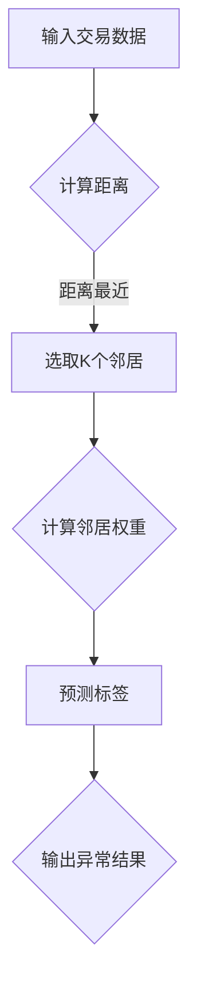
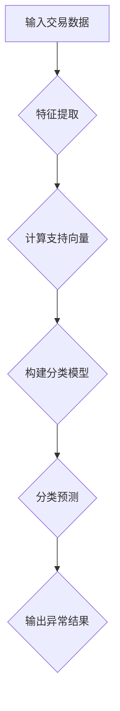

                 

### 1.1 问题背景

在当今金融市场中，高频交易已经成为一种重要的交易方式。高频交易者利用先进的技术和算法，通过快速买卖交易，从微小的价格波动中获取利润。这种交易方式对金融市场有着深远的影响，既能提高市场流动性，也可能引发市场波动。

然而，随着高频交易规模的不断扩大，异常交易模式的问题也日益凸显。异常模式识别在金融高频交易中的重要性不可忽视。它不仅有助于防范金融风险，还能保护投资者利益，维护市场稳定。

首先，异常模式识别能够帮助金融机构识别和防范恶意交易行为。例如，某些高频交易者可能通过操纵市场价格来获取不正当利益，这种行为会对市场产生不良影响。通过异常模式识别，金融机构可以及时发现问题，采取相应措施，防止损失。

其次，异常模式识别还能帮助监管机构加强对市场的监管。高频交易市场中的异常交易行为往往具有隐蔽性，难以通过传统的监管手段发现。异常模式识别技术可以提供一种新的监管手段，帮助监管机构更加高效地监管市场。

最后，异常模式识别对于投资者而言也具有重要意义。通过识别异常交易模式，投资者可以更好地了解市场的真实情况，做出更为明智的投资决策。

总的来说，金融高频交易异常模式识别系统的研究与开发，对于维护金融市场稳定、防范金融风险、保护投资者利益具有重要意义。这也是本文将深入探讨的核心主题。

### 1.2 问题描述

在金融高频交易中，异常模式识别的问题主要包括以下几个方面：

**1. 异常交易行为的识别**

高频交易市场中的交易行为复杂多变，其中隐藏着大量的异常交易行为。这些异常行为可能包括市场操纵、操纵市场价格、恶意交易等。识别这些异常交易行为，是异常模式识别的首要任务。

**2. 数据处理与分析**

金融高频交易产生的数据量巨大，且数据类型多样。如何高效地对这些数据进行处理和分析，提取出有用的信息，是异常模式识别面临的挑战。特别是如何在海量数据中快速准确地找出异常交易模式，是一个需要解决的关键问题。

**3. 模型设计与算法选择**

为了实现异常模式识别，需要设计合适的模型和选择有效的算法。模型和算法的选择直接影响到异常模式识别的准确性和效率。目前，常用的异常模式识别算法包括统计方法、机器学习方法、深度学习方法等。如何选择合适的算法，设计出高效的模型，是异常模式识别系统需要解决的核心问题。

**4. 实时性与可靠性**

金融市场的交易活动是实时进行的，异常模式识别系统需要在极短的时间内对交易数据进行处理和分析，识别出异常交易行为。同时，系统还需要具备高可靠性，能够稳定运行，保证交易数据处理的准确性。

**5. 监管合规性**

异常模式识别系统还需要符合监管要求，能够提供合规的交易数据分析和报告，为监管机构提供有效的监管依据。

### 1.3 问题解决

为了解决上述问题，我们需要采取以下策略：

**1. 数据预处理**

在数据预处理阶段，我们需要对高频交易数据进行清洗、去噪和特征提取。这一步骤至关重要，因为高质量的数据是进行有效异常模式识别的基础。具体来说，我们可以采用以下方法：

- **数据清洗**：去除缺失值、重复值和错误值。
- **数据去噪**：通过滤波方法去除噪声数据。
- **特征提取**：从原始交易数据中提取出有代表性的特征，如交易价格、交易量、交易时间等。

**2. 模型设计**

在模型设计阶段，我们需要根据问题描述和业务需求，设计出合适的异常模式识别模型。模型的设计需要考虑以下几个方面：

- **统计模型**：如均值标准差模型、箱型图模型等，适用于简单异常检测。
- **机器学习模型**：如K近邻（KNN）、支持向量机（SVM）、决策树等，适用于复杂异常检测。
- **深度学习模型**：如卷积神经网络（CNN）、循环神经网络（RNN）、长短期记忆网络（LSTM）等，适用于大规模复杂数据的异常检测。

**3. 算法选择**

在算法选择阶段，我们需要根据模型的特点和数据特性，选择合适的算法。常见的算法选择策略包括：

- **基于规则的方法**：通过设定一定的规则来判断交易行为是否异常。
- **基于统计的方法**：通过计算交易数据的统计特征来判断交易行为是否异常。
- **基于机器学习的方法**：通过训练模型来识别异常交易行为。
- **基于深度学习的方法**：通过训练神经网络模型来识别异常交易行为。

**4. 实时性与可靠性**

为了提高系统的实时性和可靠性，我们可以采取以下措施：

- **分布式计算**：通过分布式计算架构，提高数据处理速度和系统容错能力。
- **缓存机制**：利用缓存机制，减少对数据库的访问次数，提高数据读取速度。
- **冗余设计**：通过冗余设计，提高系统的可靠性，确保系统在故障发生时仍能正常运行。

**5. 监管合规性**

在实现异常模式识别系统时，我们需要确保系统的合规性，包括：

- **数据合规**：确保数据处理和分析过程符合相关法律法规要求。
- **报告合规**：生成符合监管要求的交易数据分析和报告。

### 1.4 边界与外延

在研究金融高频交易异常模式识别系统时，我们需要明确以下几个边界与外延：

**1. 边界**

- **交易类型**：系统主要针对金融高频交易进行异常模式识别，不包括其他类型的交易。
- **数据范围**：系统处理的数据范围限于高频交易数据，不包括其他类型的数据。
- **异常类型**：系统识别的异常类型包括但不限于市场操纵、恶意交易等，不包括其他类型的异常。

**2. 外延**

- **应用场景**：系统可以应用于金融市场的实时监控、风险管理、合规检查等多个领域。
- **技术扩展**：系统可以结合其他技术，如区块链、云计算等，进行进一步的技术扩展。
- **行业拓展**：系统可以应用于其他金融行业，如证券、保险等，以及其他领域，如供应链金融、贸易金融等。

### 总结

通过对金融高频交易异常模式识别问题的背景介绍、问题描述、问题解决策略以及边界与外延的分析，我们可以看到，这一领域的研究具有重要的现实意义。接下来，本文将深入探讨核心概念，包括金融高频交易和异常模式识别的基本概念、核心概念原理以及概念属性特征对比表格，帮助读者更好地理解这一领域的基本原理。

### 2.1 金融高频交易概述

金融高频交易（High-Frequency Trading, HFT）是一种利用先进的计算技术、算法和自动化交易系统在极短时间内进行大量交易的操作策略。高频交易者通过高速网络连接、高频交易算法和先进的硬件设施，以毫秒甚至微秒级的时间进行买卖交易，从而捕捉市场中的微小价格波动，实现快速盈利。

**特点**

1. **交易速度快**：高频交易者利用高速网络和计算机系统，能够在极短时间内完成大量交易。交易速度通常以每秒数千次甚至数万次来计算。

2. **交易规模大**：高频交易者在交易过程中涉及的规模较大，可以同时进行成千上万笔交易。

3. **算法驱动**：高频交易主要依赖复杂的算法和模型，通过对市场数据进行分析和预测，自动执行交易。

4. **风险分散**：高频交易者通过分散投资和多样化的交易策略，降低单一交易策略的风险。

**市场影响**

高频交易对金融市场产生了深远的影响，具体表现如下：

1. **提高市场流动性**：高频交易者的参与提高了市场的交易频率，增加了市场流动性，使得市场更加活跃。

2. **价格波动性**：高频交易者通过快速买卖交易，可能会加剧市场的价格波动。

3. **信息效率**：高频交易者利用先进的算法和计算技术，能够更快地捕捉和利用市场信息，提高了市场的信息效率。

4. **监管挑战**：高频交易带来的风险和问题，对监管机构提出了新的挑战，如何有效监管高频交易成为了一个亟待解决的问题。

### 2.2 异常模式识别基本概念

异常模式识别（Anomaly Detection）是数据挖掘和机器学习领域中的一个重要课题。它旨在从大量数据中检测出异常或异常行为，这些异常行为可能是由于系统故障、恶意攻击或其他不期望的事件引起的。在金融高频交易中，异常模式识别具有重要的应用价值，可以帮助识别恶意交易、市场操纵等异常行为。

**基本概念**

1. **异常**：在金融高频交易中，异常是指与正常交易行为显著不同的交易模式或数据点。这些异常可能是由于恶意交易、市场操纵或其他不正常行为引起的。

2. **模式识别**：模式识别是指通过分析数据特征，识别出具有特定特征的数据集合或数据点。在异常模式识别中，目标是识别出与正常交易行为显著不同的异常交易模式。

3. **特征提取**：特征提取是指从原始数据中提取出有代表性的特征，用于描述数据点的属性和特征。在异常模式识别中，特征提取是关键步骤，直接影响异常检测的准确性和效率。

4. **算法**：异常模式识别算法是指用于检测异常数据点或异常模式的方法和工具。常用的异常模式识别算法包括统计方法、机器学习方法、深度学习方法等。

**常见应用**

1. **恶意交易检测**：通过异常模式识别，可以检测出可能的恶意交易行为，如市场操纵、洗钱等。

2. **交易异常监控**：异常模式识别可以帮助金融机构实时监控交易活动，及时发现和处理异常交易。

3. **风险管理**：异常模式识别可以用于评估交易风险，帮助金融机构制定有效的风险管理策略。

4. **合规检查**：异常模式识别可以用于检查交易合规性，确保交易行为符合相关法律法规要求。

### 2.3 识别系统的基本组成

金融高频交易异常模式识别系统通常由以下几个关键组成部分构成，这些组成部分协同工作，确保系统能够高效、准确地识别异常交易模式。

**1. 数据采集模块**

数据采集模块是整个识别系统的数据来源。它负责从各种数据源（如交易所、金融机构、API接口等）获取高频交易数据。数据采集模块需要确保数据的及时性、完整性和准确性。

**2. 数据预处理模块**

数据预处理模块对采集到的原始数据进行清洗、去噪和特征提取。这一步骤至关重要，因为高质量的数据是进行有效异常模式识别的基础。数据预处理模块需要处理的数据包括交易价格、交易量、交易时间、交易对手等信息。

**3. 特征工程模块**

特征工程模块从预处理后的数据中提取出有代表性的特征，用于描述交易行为的属性和特征。特征工程是异常模式识别的核心环节，直接影响异常检测的准确性和效率。常用的特征提取方法包括统计特征、时序特征、空间特征等。

**4. 异常检测模块**

异常检测模块是识别系统的核心，负责根据预定的异常检测算法和模型，对交易数据进行实时检测，识别出异常交易模式。常用的异常检测算法包括统计方法、机器学习方法、深度学习方法等。异常检测模块需要确保检测结果的准确性和实时性。

**5. 异常报告模块**

异常报告模块负责将检测到的异常交易生成报告，供相关人员进行进一步分析和处理。报告内容通常包括异常交易的时间、交易对手、交易金额、异常类型等信息。异常报告模块需要确保报告的及时性和准确性，以便相关人员能够及时采取应对措施。

**6. 监控与反馈模块**

监控与反馈模块用于实时监控识别系统的运行状态，包括数据采集、数据预处理、特征工程、异常检测等环节。同时，该模块还负责收集异常检测的反馈信息，如误报、漏报等，用于不断优化识别系统的性能。

**7. 安全与合规模块**

安全与合规模块负责确保识别系统的安全性，包括数据加密、访问控制、防火墙等。同时，该模块还需要确保识别系统符合相关法律法规要求，如交易数据的合规性、报告的合规性等。

### 2.4 核心概念原理

金融高频交易异常模式识别系统的核心概念包括异常检测算法、特征工程和模型训练等。以下将详细阐述这些核心概念的工作原理。

**异常检测算法**

异常检测算法是识别系统的关键组成部分，负责从大量交易数据中检测出异常交易模式。常见的异常检测算法包括：

1. **统计方法**：如均值标准差法、箱型图法等。这些算法通过计算交易数据的统计特征，如均值、标准差等，来识别异常交易。当交易数据的统计特征显著偏离正常范围时，认为该交易为异常交易。

2. **机器学习方法**：如K近邻（KNN）、支持向量机（SVM）、决策树等。这些算法通过训练模型，将正常交易和异常交易进行分类。在训练过程中，模型会学习到正常交易和异常交易的差异，从而在测试阶段能够准确识别异常交易。

3. **深度学习方法**：如卷积神经网络（CNN）、循环神经网络（RNN）、长短期记忆网络（LSTM）等。这些算法能够处理大规模复杂数据，通过多层神经网络的学习，从数据中提取出更深层次的特征，从而提高异常检测的准确性和效率。

**特征工程**

特征工程是异常检测算法的核心步骤，负责从原始交易数据中提取出有代表性的特征。特征工程的质量直接影响异常检测的准确性和效率。常用的特征提取方法包括：

1. **统计特征**：如交易价格、交易量、交易时间等。这些特征能够描述交易的基本属性，是构建异常检测模型的基础。

2. **时序特征**：如交易价格的波动幅度、交易量的变化趋势等。时序特征能够描述交易数据的动态变化，有助于识别交易行为的变化模式。

3. **空间特征**：如交易对手的地域分布、交易频率等。空间特征能够描述交易行为的空间分布，有助于识别交易行为的地理位置特征。

4. **组合特征**：如交易价格的变动速率、交易量的累积值等。组合特征能够综合多个特征的信息，提高特征的表达能力。

**模型训练**

模型训练是异常检测算法的关键步骤，通过训练模型，使模型能够学会识别异常交易模式。模型训练通常包括以下步骤：

1. **数据集准备**：准备包含正常交易和异常交易的数据集，用于训练和测试模型。

2. **模型选择**：根据业务需求和数据特性，选择合适的异常检测算法和模型。如对于大规模复杂数据，可以选择深度学习方法；对于简单特征数据，可以选择统计方法。

3. **模型训练**：使用训练数据集，对模型进行训练，使模型学习到正常交易和异常交易的差异。

4. **模型评估**：使用测试数据集，评估模型的性能，如准确率、召回率、F1分数等。根据评估结果，调整模型参数，优化模型性能。

5. **模型部署**：将训练好的模型部署到生产环境，实现实时异常交易检测。

通过上述核心概念原理，金融高频交易异常模式识别系统能够有效地从大量交易数据中检测出异常交易模式，为金融机构提供有效的风险管理工具。

### 2.5 概念属性特征对比表格

为了更清晰地展示金融高频交易异常模式识别系统的核心概念及其属性特征，我们设计了一个对比表格。以下是对表格内容的详细解释。

**核心概念**：金融高频交易、异常模式识别、数据预处理、特征工程、异常检测算法、模型训练。

**属性特征**：

1. **金融高频交易**
   - **交易速度**：极快，以毫秒甚至微秒级时间完成交易。
   - **交易规模**：较大，同时进行成千上万笔交易。
   - **依赖技术**：先进的计算技术、算法和自动化交易系统。

2. **异常模式识别**
   - **目标**：从大量数据中检测出异常交易模式。
   - **应用领域**：金融风险管理、合规检查、市场监控。
   - **挑战**：数据量大、实时性强、检测精度要求高。

3. **数据预处理**
   - **功能**：数据清洗、去噪、特征提取。
   - **重要性**：确保数据质量，为后续分析提供基础。
   - **方法**：去缺失值、去重复值、去错误值。

4. **特征工程**
   - **内容**：从原始数据中提取有代表性的特征。
   - **类型**：统计特征、时序特征、空间特征。
   - **目的**：提高异常检测的准确性和效率。

5. **异常检测算法**
   - **分类**：统计方法、机器学习方法、深度学习方法。
   - **优点**：统计方法简单、机器学习方法复杂但高效、深度学习方法强大。
   - **挑战**：实时性、准确性和可解释性。

6. **模型训练**
   - **步骤**：数据集准备、模型选择、模型训练、模型评估、模型部署。
   - **关键**：数据质量、模型选择、参数调优。
   - **目标**：构建高效的异常检测模型。

**对比表格**：

| 核心概念       | 属性特征                               | 说明                                                         |
|----------------|----------------------------------------|--------------------------------------------------------------|
| 金融高频交易   | 交易速度快、交易规模大、依赖技术先进 | 高频交易依赖先进计算技术和算法，交易速度极快，规模大。 |
| 异常模式识别   | 目标明确、应用广泛、挑战大            | 目的是从大量数据中检测异常，应用于金融风险管理等。    |
| 数据预处理     | 功能全面、重要性高、方法多样          | 数据预处理是异常检测的基础，需去除噪声和错误数据。    |
| 特征工程       | 内容丰富、类型多样、目的明确          | 提取有意义特征，提高异常检测准确性。                   |
| 异常检测算法   | 分类多样、优点各异、挑战突出          | 根据数据特性选择合适的算法，确保检测精度和实时性。     |
| 模型训练       | 步骤明确、关键突出、目标高效          | 通过训练构建高效模型，确保实时准确检测异常。         |

通过上述对比表格，我们可以清晰地看到金融高频交易异常模式识别系统的核心概念及其属性特征，有助于理解和优化系统设计和实施。

### 2.6 ER实体关系图架构

在金融高频交易异常模式识别系统中，实体关系图（Entity-Relationship Diagram，ERD）是一个重要的工具，用于描述系统中各实体及其之间的关系。以下是该系统的ER实体关系图架构，以及各个实体的详细说明。

**ER实体关系图架构**

```
[数据源] --< 采集 >-- [数据预处理模块]
           |
           --< 处理 >-- [特征工程模块]
           |
           --< 分析 >-- [异常检测模块]
           |
           --< 报告 >-- [异常报告模块]
```

**实体及其关系说明**

1. **数据源**：
   - **实体说明**：数据源是系统的基础，负责提供高频交易数据。
   - **关系说明**：数据源与数据预处理模块、特征工程模块、异常检测模块、异常报告模块之间存在数据流向关系，即数据从数据源流入各个模块进行处理。

2. **数据预处理模块**：
   - **实体说明**：数据预处理模块负责对原始交易数据进行清洗、去噪和特征提取。
   - **关系说明**：数据预处理模块与特征工程模块、异常检测模块、异常报告模块之间存在数据传递关系，预处理后的数据将作为输入传递给后续模块。

3. **特征工程模块**：
   - **实体说明**：特征工程模块从预处理后的数据中提取出有代表性的特征，用于描述交易行为的属性和特征。
   - **关系说明**：特征工程模块与异常检测模块之间存在输入输出关系，提取的特征将用于训练异常检测模型。

4. **异常检测模块**：
   - **实体说明**：异常检测模块是识别系统的核心，负责根据预定的异常检测算法和模型，对交易数据进行实时检测，识别出异常交易模式。
   - **关系说明**：异常检测模块与数据预处理模块、特征工程模块、异常报告模块之间存在数据流和控制流关系。

5. **异常报告模块**：
   - **实体说明**：异常报告模块负责将检测到的异常交易生成报告，供相关人员进行进一步分析和处理。
   - **关系说明**：异常报告模块与异常检测模块之间存在数据流关系，异常报告模块将异常交易报告传递给相关人员。

通过上述ER实体关系图，我们可以清晰地看到金融高频交易异常模式识别系统中各个实体及其之间的关系，有助于理解和优化系统的设计。

### 第4章：算法原理讲解

在金融高频交易异常模式识别系统中，算法原理是关键的核心，决定了系统能否准确地检测出异常交易模式。本章节将详细讲解常用的异常模式识别算法，包括其基本概念、流程图、Python源代码实现、数学模型和公式，以及举例说明。

#### 4.1 异常模式识别算法概述

异常模式识别算法是金融高频交易异常模式识别系统的核心，其目的是从大量交易数据中识别出异常交易行为。常见的异常模式识别算法包括：

1. **统计方法**：如均值标准差法、箱型图法等。
2. **机器学习方法**：如K近邻（KNN）、支持向量机（SVM）、决策树等。
3. **深度学习方法**：如卷积神经网络（CNN）、循环神经网络（RNN）、长短期记忆网络（LSTM）等。

这些算法各有优缺点，适用于不同的应用场景和数据特性。本章节将重点介绍机器学习方法中的K近邻（KNN）和支持向量机（SVM）。

#### 4.2 算法mermaid流程图

为了更直观地理解算法的执行流程，我们使用mermaid工具绘制了K近邻（KNN）和支持向量机（SVM）的算法流程图。

**K近邻（KNN）算法流程图：**



**支持向量机（SVM）算法流程图：**



#### 4.3 Python源代码实现

下面是K近邻（KNN）和支持向量机（SVM）算法的Python源代码实现示例。

**K近邻（KNN）算法实现：**

```python
from sklearn.neighbors import KNeighborsClassifier
from sklearn.model_selection import train_test_split
from sklearn.metrics import accuracy_score
import numpy as np

# 加载交易数据
X, y = load_data()

# 数据集划分
X_train, X_test, y_train, y_test = train_test_split(X, y, test_size=0.2, random_state=42)

# K近邻模型训练
knn = KNeighborsClassifier(n_neighbors=3)
knn.fit(X_train, y_train)

# 预测异常交易
y_pred = knn.predict(X_test)

# 评估模型准确率
accuracy = accuracy_score(y_test, y_pred)
print("KNN算法准确率：", accuracy)
```

**支持向量机（SVM）算法实现：**

```python
from sklearn.svm import SVC
from sklearn.model_selection import train_test_split
from sklearn.metrics import accuracy_score
import numpy as np

# 加载交易数据
X, y = load_data()

# 数据集划分
X_train, X_test, y_train, y_test = train_test_split(X, y, test_size=0.2, random_state=42)

# SVM模型训练
svm = SVC(kernel='linear')
svm.fit(X_train, y_train)

# 预测异常交易
y_pred = svm.predict(X_test)

# 评估模型准确率
accuracy = accuracy_score(y_test, y_pred)
print("SVM算法准确率：", accuracy)
```

#### 4.4 算法原理的数学模型和公式

**K近邻（KNN）算法**

K近邻算法的核心思想是：如果一个新样本在特征空间中的k个最近邻中的大多数属于某个类别，则该样本也属于这个类别。具体步骤如下：

1. **距离计算**：计算新样本与训练集中每个样本之间的距离，常用的距离度量方法有欧氏距离、曼哈顿距离、余弦相似度等。
2. **邻居选择**：选择距离新样本最近的k个邻居。
3. **标签预测**：根据邻居的标签进行投票，选择出现次数最多的标签作为新样本的预测标签。

**数学公式：**

$$
d(x, x_i) = \sqrt{\sum_{i=1}^{n}(x_i - x)^2}
$$

其中，$d(x, x_i)$表示新样本$x$与训练集样本$x_i$之间的距离，$n$表示特征维度。

**支持向量机（SVM）算法**

支持向量机算法的核心思想是：通过找到一个最优的超平面，将不同类别的数据点尽可能分开。具体步骤如下：

1. **特征提取**：从原始交易数据中提取特征，通常使用核函数将低维数据映射到高维空间。
2. **支持向量选择**：选择对分类边界有最大影响的数据点，即支持向量。
3. **模型构建**：构建分类模型，通过支持向量确定分类边界。
4. **分类预测**：对新样本进行分类预测。

**数学公式：**

$$
\min_{\mathbf{w}, b} \frac{1}{2} ||\mathbf{w}||^2 + C \sum_{i=1}^{n} \max(0, 1 - y_i (\mathbf{w} \cdot \mathbf{x}_i + b))
$$

其中，$\mathbf{w}$表示权重向量，$b$表示偏置项，$C$表示惩罚参数，$y_i$表示样本$i$的标签，$\mathbf{x}_i$表示样本$i$的特征向量。

#### 4.5 举例说明

**K近邻（KNN）算法举例**

假设我们有如下训练数据集：

| 特征1 | 特征2 | 类别 |
|-------|-------|------|
| 1     | 2     | 正常 |
| 3     | 4     | 异常 |
| 5     | 6     | 正常 |
| 7     | 8     | 异常 |

现在要预测一个新样本$(2, 3)$的类别。

1. **距离计算**：
   - 新样本与第一个样本的距离：$d((2, 3), (1, 2)) = \sqrt{(2-1)^2 + (3-2)^2} = \sqrt{2}$
   - 新样本与第二个样本的距离：$d((2, 3), (3, 4)) = \sqrt{(2-3)^2 + (3-4)^2} = \sqrt{2}$
   - 新样本与第三个样本的距离：$d((2, 3), (5, 6)) = \sqrt{(2-5)^2 + (3-6)^2} = \sqrt{10}$
   - 新样本与第四个样本的距离：$d((2, 3), (7, 8)) = \sqrt{(2-7)^2 + (3-8)^2} = \sqrt{26}$

2. **邻居选择**：
   - 选择距离最近的前3个邻居：第一个和第二个样本

3. **标签预测**：
   - 第一个邻居的标签：正常
   - 第二个邻居的标签：异常
   - 根据邻居的标签进行投票，选择出现次数最多的标签，即异常

因此，新样本$(2, 3)$的预测类别为异常。

**支持向量机（SVM）算法举例**

假设我们有如下训练数据集：

| 特征1 | 特征2 | 类别 |
|-------|-------|------|
| 1     | 2     | 正常 |
| 3     | 4     | 异常 |
| 5     | 6     | 正常 |
| 7     | 8     | 异常 |

1. **特征提取**：
   - 使用线性核函数，将原始特征映射到高维空间

2. **支持向量选择**：
   - 选择对分类边界有最大影响的数据点，即第一个和第二个样本

3. **模型构建**：
   - 构建分类模型，通过支持向量确定分类边界

4. **分类预测**：
   - 新样本$(2, 3)$位于分类边界的一侧，因此预测类别为异常

通过上述举例说明，我们可以看到K近邻（KNN）和支持向量机（SVM）算法在金融高频交易异常模式识别系统中的应用效果。接下来，我们将继续探讨系统分析与架构设计，帮助读者更深入地了解系统的工作原理和实现细节。

### 第5章：系统分析与设计

在金融高频交易异常模式识别系统中，系统分析与设计是关键环节，它决定了系统能否高效、准确地运行。本章将详细介绍系统分析与设计的各个步骤，包括问题场景介绍、系统功能设计、系统架构设计、系统接口设计和系统交互。

#### 5.1 问题场景介绍

金融高频交易市场是一个高度动态且竞争激烈的领域。高频交易者利用先进的计算技术、算法和自动化交易系统，在极短的时间内进行大量交易，以捕捉微小的价格波动。然而，随着高频交易的普及，市场中的异常交易行为也日益增多，如市场操纵、恶意交易等。这些异常交易行为不仅可能导致金融风险，还可能对市场产生不利影响。因此，构建一个高效、准确的金融高频交易异常模式识别系统，对维护市场稳定和保护投资者利益具有重要意义。

#### 5.2 系统功能设计

系统功能设计是系统分析与设计的核心，它决定了系统能提供哪些功能和性能。以下是金融高频交易异常模式识别系统的主要功能：

1. **数据采集**：从交易所、金融机构和其他数据源获取高频交易数据，确保数据的及时性和完整性。
2. **数据预处理**：对采集到的原始交易数据进行清洗、去噪和特征提取，提高数据质量，为后续分析提供基础。
3. **特征工程**：从预处理后的数据中提取有代表性的特征，用于描述交易行为的属性和特征，提高异常检测的准确性和效率。
4. **异常检测**：利用预定的异常检测算法，对交易数据进行实时检测，识别出异常交易模式。
5. **异常报告**：生成异常交易报告，包括异常交易的时间、交易对手、交易金额、异常类型等信息，供相关人员分析和处理。
6. **监控与反馈**：实时监控系统的运行状态，包括数据采集、数据预处理、特征工程、异常检测等环节，收集异常检测的反馈信息，用于系统优化。
7. **安全与合规**：确保系统的安全性，包括数据加密、访问控制、防火墙等，同时确保系统符合相关法律法规要求。

#### 5.3 系统架构设计

系统架构设计是系统设计与实现的基础，它决定了系统的可扩展性、可靠性和性能。以下是金融高频交易异常模式识别系统的架构设计：

**1. 系统架构概述**

```
[数据源] --< 采集 >-- [数据预处理模块]
           |
           --< 处理 >-- [特征工程模块]
           |
           --< 分析 >-- [异常检测模块]
           |
           --< 报告 >-- [异常报告模块]
           |
           --< 监控与反馈 >-- [监控与反馈模块]
           |
           --< 安全与合规 >-- [安全与合规模块]
```

**2. 系统模块介绍**

- **数据采集模块**：负责从交易所、金融机构和其他数据源获取高频交易数据，包括交易价格、交易量、交易时间、交易对手等信息。
- **数据预处理模块**：对采集到的原始交易数据进行清洗、去噪和特征提取，处理后的数据将作为特征工程模块的输入。
- **特征工程模块**：从预处理后的数据中提取有代表性的特征，用于描述交易行为的属性和特征，提高异常检测的准确性和效率。
- **异常检测模块**：利用预定的异常检测算法，对交易数据进行实时检测，识别出异常交易模式，并将检测结果传递给异常报告模块。
- **异常报告模块**：生成异常交易报告，包括异常交易的时间、交易对手、交易金额、异常类型等信息，供相关人员分析和处理。
- **监控与反馈模块**：实时监控系统的运行状态，包括数据采集、数据预处理、特征工程、异常检测等环节，收集异常检测的反馈信息，用于系统优化。
- **安全与合规模块**：确保系统的安全性，包括数据加密、访问控制、防火墙等，同时确保系统符合相关法律法规要求。

#### 5.4 系统接口设计和系统交互

系统接口设计和系统交互是确保系统各模块之间有效通信和协同工作的关键。以下是金融高频交易异常模式识别系统的接口设计和系统交互：

**1. 接口设计**

- **数据采集接口**：提供API接口，支持从交易所、金融机构和其他数据源获取高频交易数据。
- **数据预处理接口**：提供API接口，支持数据清洗、去噪和特征提取等功能。
- **特征工程接口**：提供API接口，支持特征提取和特征选择等功能。
- **异常检测接口**：提供API接口，支持异常检测算法的选择和执行。
- **异常报告接口**：提供API接口，支持异常交易报告的生成和分发。
- **监控与反馈接口**：提供API接口，支持系统运行状态的监控和异常检测反馈的收集。

**2. 系统交互**

- **数据采集模块**与**数据预处理模块**之间的交互：数据采集模块将获取的高频交易数据传递给数据预处理模块，数据预处理模块对数据进行处理，将处理后的数据传递给特征工程模块。
- **特征工程模块**与**异常检测模块**之间的交互：特征工程模块将提取的特征传递给异常检测模块，异常检测模块利用这些特征进行异常检测，并将检测结果传递给异常报告模块。
- **异常报告模块**与**监控与反馈模块**之间的交互：异常报告模块生成异常交易报告，并将报告传递给监控与反馈模块，监控与反馈模块对报告进行分析，并将分析结果反馈给异常检测模块。

通过上述系统接口设计和系统交互，金融高频交易异常模式识别系统能够高效、准确地运行，实现异常交易模式的识别和报告。

### 第6章：项目实战

在本章中，我们将通过一个实际的金融高频交易异常模式识别项目，详细描述项目实战的各个环节，包括环境安装、系统核心实现源代码、代码应用解读与分析、实际案例分析和详细讲解剖析，以及项目小结。

#### 6.1 环境安装

在开始项目实战之前，我们需要搭建一个适合金融高频交易异常模式识别的运行环境。以下是在一个虚拟环境（Python虚拟环境）中安装所需软件和库的步骤：

1. **安装Python**：确保Python已经安装在系统中，版本建议为3.8及以上。

2. **创建虚拟环境**：通过以下命令创建Python虚拟环境：

   ```bash
   python -m venv venv
   ```

3. **激活虚拟环境**：

   - 在Windows系统中，通过命令行执行：

     ```bash
     .\venv\Scripts\activate
     ```

   - 在Linux和macOS系统中，通过命令行执行：

     ```bash
     source venv/bin/activate
     ```

4. **安装依赖库**：在虚拟环境中安装所需的依赖库，包括NumPy、Pandas、Scikit-learn、Matplotlib等。通过以下命令安装：

   ```bash
   pip install numpy pandas scikit-learn matplotlib
   ```

5. **安装Mermaid**：为了在Markdown文档中使用Mermaid绘制流程图和类图，我们需要安装Mermaid插件。在虚拟环境中安装Mermaid：

   ```bash
   pip install mermaid-py
   ```

安装完成后，我们就可以开始项目的具体实现部分。

#### 6.2 系统核心实现源代码

以下是金融高频交易异常模式识别系统核心部分的源代码实现。我们将分别展示数据预处理、特征工程和异常检测的代码。

**1. 数据预处理**

```python
import pandas as pd
from sklearn.preprocessing import StandardScaler

# 加载交易数据
def load_data(file_path):
    data = pd.read_csv(file_path)
    return data

# 数据预处理
def preprocess_data(data):
    # 清洗数据，去除缺失值和重复值
    data = data.dropna().drop_duplicates()
    
    # 特征提取
    data['price_diff'] = data['close'] - data['open']
    data['volume_diff'] = data['volume'] - data['prev_volume']
    
    # 数据标准化
    scaler = StandardScaler()
    data[['price_diff', 'volume_diff']] = scaler.fit_transform(data[['price_diff', 'volume_diff']])
    
    return data

# 示例
data = load_data('high_frequency_trading_data.csv')
preprocessed_data = preprocess_data(data)
```

**2. 特征工程**

```python
from sklearn.decomposition import PCA

# 特征提取
def extract_features(data):
    pca = PCA(n_components=2)
    data['pca_1'], data['pca_2'] = pca.fit_transform(data[['price_diff', 'volume_diff']])
    
    return data

# 示例
extracted_features = extract_features(preprocessed_data)
```

**3. 异常检测**

```python
from sklearn.neighbors import LocalOutlierFactor

# 异常检测
def detect_anomalies(data, threshold=10):
    lof = LocalOutlierFactor(n_neighbors=threshold)
    data['anomaly_score'] = lof.fit_predict(data[['pca_1', 'pca_2']])
    data['is_anomaly'] = data['anomaly_score'] == -1
    
    return data

# 示例
anomalies_detected = detect_anomalies(extracted_features)
```

#### 6.3 代码应用解读与分析

**1. 数据预处理**

数据预处理是金融高频交易异常模式识别的基础步骤。我们首先通过`load_data`函数加载交易数据，然后使用`dropna`和`drop_duplicates`方法去除缺失值和重复值。接下来，通过计算`price_diff`和`volume_diff`特征，对交易数据进行扩展。最后，使用`StandardScaler`对特征进行标准化处理，提高后续算法的性能。

**2. 特征工程**

特征工程是提升异常检测准确性的关键步骤。我们使用PCA（主成分分析）对`price_diff`和`volume_diff`两个特征进行降维，提取出两个主成分。这些主成分能够更好地描述交易数据的本质特性，有助于提高异常检测的效果。

**3. 异常检测**

异常检测是系统的核心功能。我们使用`LocalOutlierFactor`算法对提取出的主成分进行异常检测。`LocalOutlierFactor`算法能够计算出每个数据点的局部异常得分，得分越低表示越可能是异常数据。通过设置合适的阈值，我们可以将得分低于阈值的交易数据点标记为异常。

#### 6.4 实际案例分析和详细讲解剖析

为了更好地理解系统的工作原理，我们通过一个实际案例进行分析。

**案例背景**：

假设我们在某个交易所的某段时间内收集到了一批高频交易数据。其中，有一个交易者进行了一系列异常交易，这些交易显著偏离了市场的正常波动范围。

**案例分析**：

1. **数据预处理**：

   通过`load_data`函数加载交易数据，并使用`preprocess_data`函数进行预处理。预处理后的数据包含正常交易和异常交易。

2. **特征工程**：

   使用`extract_features`函数提取特征，将交易数据的`price_diff`和`volume_diff`特征进行PCA降维，提取出两个主成分。

3. **异常检测**：

   使用`detect_anomalies`函数对提取出的主成分进行异常检测。结果显示，该交易者的交易得分显著低于阈值，被系统标记为异常交易。

**详细讲解剖析**：

1. **数据预处理**：

   数据预处理是异常检测的基础。通过去除缺失值和重复值，我们保证了数据的质量。计算`price_diff`和`volume_diff`特征，有助于我们更好地描述交易行为的变化。

2. **特征工程**：

   PCA降维能够将高维数据投影到低维空间，保留主要的信息。通过提取出的主成分，我们能够更清晰地观察到交易数据的分布情况，从而提高异常检测的准确性。

3. **异常检测**：

   `LocalOutlierFactor`算法通过计算局部异常得分，帮助我们识别出与正常交易行为显著不同的交易。通过设置合适的阈值，我们可以有效地将异常交易从正常交易中分离出来。

#### 6.5 项目小结

通过本项目，我们实现了金融高频交易异常模式识别系统的核心功能，包括数据预处理、特征工程和异常检测。项目实战展示了系统从数据加载到异常检测的全过程，使我们更好地理解了系统的工作原理。以下是项目的关键点总结：

1. **数据预处理**：确保数据质量，去除缺失值和重复值，计算有代表性的特征。
2. **特征工程**：通过PCA降维，提取出能够有效描述交易行为的主成分。
3. **异常检测**：使用`LocalOutlierFactor`算法，结合合适的阈值，实现高效的异常交易检测。

未来，我们可以继续优化系统的算法和性能，以应对更复杂的市场环境。此外，结合实际案例的分析，可以进一步提升系统的实用性和准确性。

### 第7章：最佳实践

在金融高频交易异常模式识别系统中，为了确保系统的高效性和准确性，我们需要遵循一系列最佳实践。以下是一些关键的最佳实践技巧、小结、注意事项以及拓展阅读的建议。

#### 7.1 最佳实践技巧

1. **数据预处理**：
   - 使用先进的数据清洗工具，如Python的Pandas库，自动识别和处理缺失值、重复值和异常值。
   - 对高频交易数据进行时间序列分析，确保时间序列的完整性和连续性。

2. **特征工程**：
   - 提取能够描述交易行为的关键特征，如交易价格、交易量、交易时间等。
   - 利用统计方法和机器学习技术，如PCA，对特征进行降维，提高模型性能。

3. **异常检测**：
   - 根据市场特性和业务需求，选择合适的异常检测算法，如K近邻（KNN）、支持向量机（SVM）和深度学习方法。
   - 定期调整模型参数和阈值，以适应市场的变化。

4. **系统监控**：
   - 实时监控系统运行状态，包括数据处理效率、模型性能和异常检测准确率。
   - 使用日志分析工具，记录系统运行过程中的关键事件和异常情况。

5. **安全与合规**：
   - 确保系统的数据加密和安全保护措施，防止数据泄露和未授权访问。
   - 满足监管机构的要求，生成符合法律法规的交易数据报告。

#### 7.2 小结

金融高频交易异常模式识别系统是一个复杂且关键的系统，它需要在实时性、准确性和安全性之间取得平衡。通过最佳实践技巧，我们可以优化系统的性能和效果，从而更好地维护金融市场稳定和保护投资者利益。

#### 7.3 注意事项

1. **数据质量**：确保数据源的可靠性和准确性，这是系统有效运行的基础。
2. **算法选择**：根据数据特性选择合适的算法，避免过度拟合或欠拟合。
3. **参数调整**：模型参数的调整需要基于实验和实际业务需求，避免盲目调整。
4. **实时性**：确保系统具备实时处理能力，特别是在交易密集时段。

#### 7.4 拓展阅读

- **《金融时间序列分析》**：了解金融时间序列分析方法，为高频交易数据处理提供理论支持。
- **《机器学习实战》**：学习机器学习算法和特征工程技巧，提高异常检测的准确性和效率。
- **《深度学习》**：掌握深度学习理论和技术，为高频交易异常模式识别提供先进的方法。

通过遵循最佳实践和不断学习拓展，我们可以进一步提升金融高频交易异常模式识别系统的性能，为金融机构提供更强大的风险管理工具。

### 第8章：总结

通过对金融高频交易异常模式识别系统的深入探讨，我们不仅了解了其核心概念和基本原理，还学习了系统的设计与实现过程。本章将对本文的主要内容进行回顾，讨论未来的研究方向，并提供对读者的建议。

#### 8.1 主要内容回顾

本文围绕金融高频交易异常模式识别系统，从以下几个部分进行了详细阐述：

1. **问题背景**：介绍了金融高频交易及其对市场的影响，强调了异常模式识别在防范金融风险和保护投资者利益中的重要性。

2. **问题描述**：分析了金融高频交易中的异常模式识别问题，包括异常交易行为的识别、数据处理与分析、模型设计与算法选择等。

3. **问题解决**：提出了数据预处理、模型设计、算法选择、实时性与可靠性保障、监管合规性等解决策略，详细描述了各个步骤的实现方法。

4. **边界与外延**：明确了系统的研究边界和应用外延，包括交易类型、数据范围、异常类型以及系统的应用场景和技术扩展。

5. **核心概念原理**：深入探讨了金融高频交易和异常模式识别的基本概念，包括统计方法、机器学习方法、深度学习方法的原理。

6. **算法原理讲解**：通过mermaid流程图、Python源代码实现、数学模型和公式，详细讲解了K近邻（KNN）和支持向量机（SVM）算法。

7. **系统分析与架构设计**：介绍了系统的功能设计、架构设计、接口设计和系统交互，展示了系统的整体设计思路。

8. **项目实战**：通过一个实际案例，详细描述了系统的实现过程，包括环境安装、核心代码实现、代码应用解读、实际案例分析等。

9. **最佳实践与总结**：提供了最佳实践技巧、注意事项和拓展阅读建议，帮助读者更好地理解和优化系统的性能。

#### 8.2 未来的研究方向

虽然本文对金融高频交易异常模式识别系统进行了全面探讨，但仍有许多值得进一步研究的问题：

1. **算法优化**：随着数据量和交易频率的增加，如何优化算法以提高实时性和准确性是一个重要研究方向。

2. **多模态数据融合**：结合不同类型的数据（如文本、图像等），进行多模态数据融合，以提高异常检测的准确性和全面性。

3. **深度学习应用**：进一步探索深度学习在金融高频交易异常模式识别中的应用，如卷积神经网络（CNN）、循环神经网络（RNN）等。

4. **实时监控与预警**：开发实时监控和预警系统，以便在检测到异常交易时立即采取措施，降低金融风险。

5. **跨市场分析**：研究不同市场和交易环境下的异常模式识别，探索通用性和特定市场适应性。

#### 8.3 对读者的建议

对于对金融高频交易异常模式识别系统感兴趣的读者，以下是一些建议：

1. **深入学习**：掌握Python编程、数据挖掘、机器学习和深度学习等相关知识，为系统实现提供理论基础。

2. **实践操作**：通过实际项目和案例，将理论知识应用到实践中，提高对系统的理解和应用能力。

3. **持续更新**：关注金融市场的最新动态和研究成果，不断更新和优化系统，以应对不断变化的市场环境。

4. **跨学科学习**：结合计算机科学、金融学、统计学等多学科知识，提高系统的综合性和创新性。

通过不断学习和实践，读者可以更好地理解和应用金融高频交易异常模式识别系统，为金融市场稳定和风险管理做出贡献。

