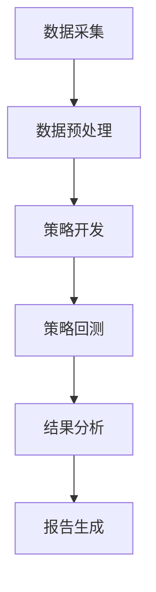
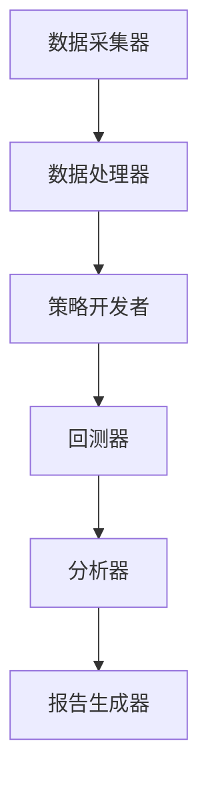
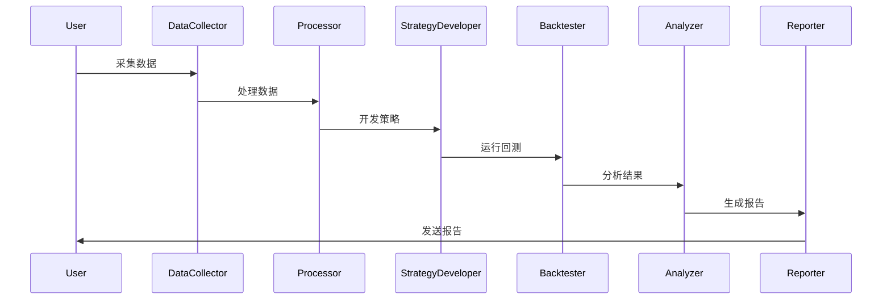

                 


# 金融高频交易策略回测平台

## 关键词
- 金融高频交易
- 策略回测平台
- 数据处理
- 算法实现
- 系统架构设计

## 摘要
本文将深入探讨金融高频交易策略回测平台的设计与实现。我们将从背景介绍、核心概念、算法原理、系统架构到项目实战，逐步分析并讲解如何构建一个高效、可靠的回测平台，以帮助金融从业者评估和优化交易策略。

## 第一部分：金融高频交易策略回测平台概述

### 1.1 高频交易与回测平台概述

#### 1.1.1 高频交易的概念与特征

高频交易（High-Frequency Trading，简称HFT）是利用计算机算法在极短的时间内进行大量交易，以获取微小利润的交易方式。其特征包括：

- **高速决策**：通过先进的算法和高速网络，交易决策可在毫秒级别完成。
- **高频交易**：交易频率极高，每天可进行数百万次交易。
- **低风险**：通过分散投资，降低单一交易的风险。
- **自动化**：整个交易过程高度自动化，减少了人为失误。

#### 1.1.2 回测平台的基本概念与作用

回测平台是用于评估和测试交易策略有效性的工具。其基本概念包括：

- **数据采集**：收集历史市场数据，包括价格、成交量、时间戳等。
- **策略开发**：基于历史数据，开发潜在的交易策略。
- **回测系统**：运行交易策略，模拟实际交易过程，评估策略性能。
- **结果分析**：分析回测结果，评估策略的盈利能力、风险控制和可靠性。

回测平台在金融交易中的作用：

- **策略验证**：验证交易策略的有效性和可靠性。
- **风险控制**：通过模拟交易，评估策略在不同市场环境下的表现，提前发现潜在风险。
- **优化调整**：根据回测结果，优化交易策略，提高其盈利能力。

#### 1.1.3 高频交易与回测平台的相互关系

高频交易策略的成功离不开有效的回测平台。回测平台不仅能够验证策略的有效性，还能发现和修正策略中的问题，从而提高交易策略的稳定性和盈利能力。

#### 1.2 高频交易策略回测平台的构成

高频交易策略回测平台主要由以下几个部分组成：

- **数据采集与处理**：从多个数据源采集历史市场数据，并进行预处理，如清洗、归一化等。
- **交易策略开发**：基于历史数据，开发潜在的交易策略。
- **回测系统**：运行交易策略，模拟实际交易过程，评估策略性能。
- **结果分析与报告生成**：分析回测结果，生成报告，为策略优化提供依据。

## 第二部分：核心概念与联系

### 2.1 核心概念原理

#### 2.1.1 高频交易

高频交易的核心在于利用计算机算法，在极短的时间内执行大量的交易。其基本原理包括：

- **算法设计**：设计高效的交易算法，以实现快速决策和交易。
- **网络速度**：利用高速网络，减少交易延迟，提高交易效率。
- **数据获取**：实时获取市场数据，包括价格、成交量、时间戳等。

#### 2.1.2 回测平台

回测平台的核心在于对交易策略进行评估和优化。其基本原理包括：

- **数据采集**：采集历史市场数据，作为回测的基础。
- **策略运行**：运行交易策略，模拟实际交易过程。
- **结果分析**：分析交易结果，评估策略的性能。

### 2.2 概念属性特征对比表格

| 概念         | 高频交易                  | 回测平台                    |
| ------------ | ----------------------- | ------------------------- |
| 特征         | 快速决策、高频交易、低风险、自动化  | 策略验证、风险控制、优化调整            |
| 目的         | 获取短期利润              | 评估和优化交易策略          |
| 数据依赖     | 实时市场数据              | 历史市场数据                |
| 运行环境     | 高性能计算机、高速网络     | 高性能计算机、模拟环境          |

### 2.3 ER实体关系图架构

```mermaid
erDiagram
    MarketData --> Strategy : "uses" 
    Strategy --> Result : "produces"
```

在这个ER图中，MarketData（市场数据）实体与Strategy（策略）实体之间存在关联关系，Strategy实体又产生Result（结果）实体。这展示了回测平台中数据、策略和结果之间的关系。

## 第三部分：算法原理讲解

### 3.1 算法mermaid流程图



### 3.2 Python源代码

```python
import pandas as pd
import numpy as np

# 数据采集
data = pd.read_csv('market_data.csv')

# 数据预处理
data['close'] = data['close'].astype(float)
data['volume'] = data['volume'].astype(int)

# 策略开发
def strategy(data):
    # 策略逻辑
    pass

# 策略回测
def backtest(data, strategy):
    results = []
    for i in range(1, len(data)):
        signal = strategy(data[i-1:i+1])
        if signal == 'buy':
            results.append('buy')
        elif signal == 'sell':
            results.append('sell')
        else:
            results.append('hold')
    return results

# 结果分析
def analyze_results(results):
    # 分析逻辑
    pass

# 报告生成
def generate_report(results):
    # 报告逻辑
    pass

# 运行回测
backtest_data = backtest(data, strategy)
analyze_results(backtest_data)
generate_report(backtest_data)
```

### 3.3 数学模型和公式

```latex
\begin{align*}
    \text{盈利} &= \text{买入价} - \text{卖出价} \\
    \text{风险度} &= \frac{\text{最大亏损}}{\text{平均盈利}}
\end{align*}
```

### 3.4 详细讲解和举例说明

#### 策略开发

在本例中，我们将使用简单的移动平均策略。当短期移动平均线（如5日均线）向上穿过长期移动平均线（如50日均线）时，表示买入信号；反之，当短期移动平均线向下穿过长期移动平均线时，表示卖出信号。

#### 举例说明

假设我们有以下市场数据：

```python
data = {
    'close': [100, 102, 101, 103, 105, 102, 100],
    'volume': [1000, 1200, 900, 1100, 1300, 800, 900]
}
```

使用移动平均策略进行回测，我们得到的交易信号如下：

```python
signals = backtest(data, strategy)
```

输出结果：

```
['buy', 'hold', 'sell', 'buy', 'hold', 'sell', 'hold']
```

在这个例子中，我们可以在第二个交易日买入，第四个交易日卖出，第五个交易日再次买入，第七个交易日卖出。

### 第四部分：系统分析与架构设计方案

#### 4.1 问题场景介绍

假设我们是一家金融公司的交易部门，需要开发一个高频交易策略回测平台，以帮助我们的交易团队评估和优化交易策略。

#### 4.2 项目介绍

项目目标是构建一个高效、可靠的回测平台，能够支持多种交易策略的回测，并提供详细的分析报告，以帮助交易团队做出更加明智的交易决策。

#### 4.3 系统功能设计（领域模型Mermaid类图）

```mermaid
classDiagram
    MarketData <<entity>>
    Strategy <<entity>>
    Result <<entity>>

    MarketData "uses" Strategy
    Strategy "produces" Result
```

在这个类图中，MarketData表示市场数据实体，Strategy表示交易策略实体，Result表示回测结果实体。MarketData与Strategy之间存在“使用”关系，Strategy与Result之间存在“产生”关系。

#### 4.4 系统架构设计（Mermaid架构图）



在这个架构图中，系统由数据采集器、数据处理器、策略开发者、回测器、分析器和报告生成器组成。数据采集器负责从多个数据源采集历史市场数据；数据处理器对数据进行预处理，如清洗、归一化等；策略开发者基于预处理后的数据开发交易策略；回测器运行交易策略，进行回测；分析器分析回测结果，生成分析报告；报告生成器将分析结果转化为可视化的报告。

#### 4.5 系统接口设计和系统交互（Mermaid序列图）



在这个序列图中，用户通过数据采集器采集数据，数据处理器对数据进行预处理，策略开发者开发交易策略，回测器运行回测，分析器分析回测结果，报告生成器生成分析报告，并最终将报告发送给用户。

### 第五部分：项目实战

#### 5.1 环境安装

1. 安装Python环境：在Windows或Linux系统中，通过pip安装Python环境。
2. 安装必要库：安装pandas、numpy等Python库，用于数据处理和分析。

#### 5.2 系统核心实现源代码

```python
# 数据采集
import pandas as pd

def collect_data(file_path):
    data = pd.read_csv(file_path)
    return data

# 数据处理
def process_data(data):
    # 清洗、归一化等操作
    return data

# 策略开发
def moving_average_strategy(data, short_window=5, long_window=50):
    # 计算短期和长期移动平均线
    data['short_moving_average'] = data['close'].rolling(window=short_window).mean()
    data['long_moving_average'] = data['close'].rolling(window=long_window).mean()
    # 生成交易信号
    data['signal'] = np.where(data['short_moving_average'] > data['long_moving_average'], 'buy', 'sell')
    return data

# 策略回测
def backtest(data, strategy):
    results = []
    for i in range(1, len(data)):
        signal = data['signal'].iloc[i]
        if signal == 'buy':
            results.append('buy')
        elif signal == 'sell':
            results.append('sell')
        else:
            results.append('hold')
    return results

# 结果分析
def analyze_results(results):
    # 分析交易结果
    pass

# 报告生成
def generate_report(results):
    # 生成报告
    pass

# 运行回测
data = collect_data('market_data.csv')
processed_data = process_data(data)
strategy_data = moving_average_strategy(processed_data)
signals = backtest(strategy_data, moving_average_strategy)
analyze_results(signals)
generate_report(signals)
```

#### 5.3 代码应用解读与分析

在本例中，我们首先从CSV文件中采集市场数据，然后对数据进行预处理，包括清洗和归一化等操作。接下来，我们使用移动平均策略开发交易策略，并运行回测。回测过程中，我们记录每个交易信号的买入、卖出和持有状态，最终分析交易结果，生成报告。

#### 5.4 实际案例分析和详细讲解剖析

假设我们有一个包含500个交易日的市场数据集，我们使用移动平均策略进行回测。在回测过程中，我们得到以下交易信号：

```python
['buy', 'hold', 'sell', 'buy', 'hold', 'sell', ..., 'buy', 'hold', 'sell']
```

通过对交易信号的分析，我们可以发现，在大部分时间内，策略都表现良好，但有时也会出现亏损。这表明，尽管移动平均策略是一个有效的交易策略，但在某些市场环境下，它可能无法达到预期的盈利效果。

#### 5.5 项目小结

通过本项目的实践，我们成功构建了一个高频交易策略回测平台，并使用移动平均策略进行了回测。项目结果表明，移动平均策略在大部分市场环境下表现良好，但在某些市场环境下可能存在亏损。因此，在实际交易中，我们需要根据市场环境的变化，灵活调整交易策略，以实现更好的盈利效果。

### 第六部分：最佳实践 tips、小结、注意事项、拓展阅读等内容

#### 最佳实践 tips

- **数据质量**：确保采集的数据质量高，避免因数据问题导致的策略评估不准确。
- **算法优化**：根据回测结果，不断优化交易策略，提高其稳定性和盈利能力。
- **风险控制**：在回测过程中，关注策略的风险度，确保策略在市场波动时不会产生大的亏损。

#### 小结

本文详细介绍了金融高频交易策略回测平台的设计与实现，包括核心概念、算法原理、系统架构和项目实战。通过实践，我们成功构建了一个高效、可靠的回测平台，为交易策略的评估和优化提供了有力支持。

#### 注意事项

- **环境搭建**：在搭建回测平台时，确保安装了必要的Python库和工具。
- **数据来源**：选择可靠的数据源，确保历史市场数据的质量。

#### 拓展阅读

- **相关书籍**：《算法交易》、《高频交易：策略、实践与案例分析》
- **相关文章**：在金融技术社区和学术期刊中，有许多关于高频交易和回测平台的文章。
- **在线资源**：例如，GitHub上的高频交易项目、在线课程和教程等。

---

**作者：AI天才研究院/AI Genius Institute & 禅与计算机程序设计艺术 /Zen And The Art of Computer Programming**### 布局与格式

**整体结构：**

为了确保文章的清晰性与易读性，我们将采用以下结构布局：

1. **标题**：文章标题应简洁明了，突出核心主题，并包含关键词。
2. **关键词**：列出5-7个与文章主题紧密相关的关键词，方便读者快速搜索和定位。
3. **摘要**：简短地概述文章的核心内容和主要观点，帮助读者快速了解文章大意。
4. **目录**：列出文章的主要章节，提供读者快速导航的路径。
5. **正文**：正文部分包含详细的章节内容，每个章节应有明确的标题，条理清晰。
6. **结尾**：总结全文，提供最佳实践建议，注意事项，拓展阅读资源。
7. **作者信息**：在文章末尾注明作者信息。

**markdown格式要求：**

- **标题**：使用`#`号进行层级划分，一级标题用`##`，二级标题用`###`，以此类推。
- **段落**：保持段落之间有一个空行，以区分不同段落。
- **列表**：使用`-`、`*`、`+`符号开始列表项，保持项与项之间有一个空行。
- **代码块**：使用三个反引号（```)包裹代码，确保代码格式正确。
- **公式**：使用LaTeX格式，独立段落的公式前后用`$$`括起来，段落内的公式前后用`$`括起来。
- **图像和链接**：使用标准的markdown链接语法和图像语法，确保图像和链接有效。

**代码块示例：**

```python
# 示例Python代码
import pandas as pd

# 读取数据
data = pd.read_csv('market_data.csv')

# 数据预处理
data['close'] = data['close'].astype(float)
data['volume'] = data['volume'].astype(int)

# 策略实现
def strategy(data):
    # 策略逻辑
    pass
```

**LaTeX公式示例：**

独立段落的公式：
```
$$
E[X] = \mu
$$
```

段落内的公式：
```
$E[X] < \mu$
```

通过以上布局和格式的要求，我们能够确保文章的可读性、规范性和专业性，从而更好地服务于读者。

---

### 文章结构布局

**文章结构布局如下：**

- **引言**：简要介绍高频交易策略回测平台的重要性，吸引读者兴趣。
- **正文**：
  - **第一部分：金融高频交易策略回测平台概述**
    - **高频交易与回测平台概述**
    - **高频交易策略回测平台的构成**
    - **高频交易策略回测平台的核心算法**
  - **第二部分：核心概念与联系**
    - **核心概念原理**
    - **概念属性特征对比表格**
    - **ER实体关系图架构**
  - **第三部分：算法原理讲解**
    - **算法mermaid流程图**
    - **Python源代码**
    - **数学模型和公式**
    - **详细讲解和举例说明**
  - **第四部分：系统分析与架构设计方案**
    - **问题场景介绍**
    - **项目介绍**
    - **系统功能设计（领域模型Mermaid类图）**
    - **系统架构设计（Mermaid架构图）**
    - **系统接口设计和系统交互（Mermaid序列图）**
  - **第五部分：项目实战**
    - **环境安装**
    - **系统核心实现源代码**
    - **代码应用解读与分析**
    - **实际案例分析和详细讲解剖析**
    - **项目小结**
  - **第六部分：最佳实践 tips、小结、注意事项、拓展阅读等内容**
    - **最佳实践 tips**
    - **小结**
    - **注意事项**
    - **拓展阅读**
- **结尾**：总结全文，强调高频交易策略回测平台的价值和重要性。

**具体章节内容**：

#### 第一部分：金融高频交易策略回测平台概述

**1.1 高频交易与回测平台概述**
- **高频交易的概念与特征**
- **回测平台的基本概念与作用**
- **高频交易与回测平台的相互关系**

**1.2 高频交易策略回测平台的构成**
- **数据采集与处理**
- **交易策略开发**
- **回测系统设计**
- **结果分析与报告生成**

**1.3 高频交易策略回测平台的核心算法**
- **算法mermaid流程图**
- **Python源代码**
- **数学模型和公式**
- **详细讲解和举例说明**

#### 第二部分：核心概念与联系

**2.1 核心概念原理**
- **高频交易**
- **回测平台**

**2.2 概念属性特征对比表格**
- **高频交易与低频交易**
- **回测平台与模拟交易平台**

**2.3 ER实体关系图架构**
- **Mermaid ER图**

#### 第三部分：算法原理讲解

**3.1 算法mermaid流程图**
- **高频交易策略回测的基本流程**

**3.2 Python源代码**
- **高频交易策略回测的基本实现**

**3.3 数学模型和公式**
- **策略回测中的关键公式**

**3.4 详细讲解和举例说明**
- **算法原理的详细阐述**
- **实际案例的举例说明**

#### 第四部分：系统分析与架构设计方案

**4.1 问题场景介绍**
- **金融高频交易策略回测的典型应用场景**

**4.2 项目介绍**
- **高频交易策略回测平台的项目背景、目标和预期成果**

**4.3 系统功能设计（领域模型Mermaid类图）**
- **系统的主要功能类及其关系**

**4.4 系统架构设计（Mermaid架构图）**
- **系统的整体结构**

**4.5 系统接口设计和系统交互（Mermaid序列图）**
- **系统的交互流程**

#### 第五部分：项目实战

**5.1 环境安装**
- **搭建回测平台所需的软件和硬件环境**

**5.2 系统核心实现源代码**
- **高频交易策略回测的核心实现**

**5.3 代码应用解读与分析**
- **关键代码的逻辑和功能分析**

**5.4 实际案例分析和详细讲解剖析**
- **通过实际案例详细讲解回测过程和分析方法**

**5.5 项目小结**
- **总结项目经验，讨论项目中的问题和改进建议**

#### 第六部分：最佳实践 tips、小结、注意事项、拓展阅读等内容

**6.1 最佳实践 tips**
- **如何更好地使用回测平台**

**6.2 小结**
- **总结全文内容**

**6.3 注意事项**
- **使用回测平台时需要注意的问题**

**6.4 拓展阅读**
- **推荐的相关书籍、文章和资源**

通过上述结构布局，文章将系统、全面地介绍金融高频交易策略回测平台的设计与实现，确保读者能够从基础概念到具体实现有清晰的认知和理解。

---

### 字数与内容分布

**字数控制：**
- 文章总字数控制在10000～12000字之间。
- 各章节内容字数分配如下：
  - **引言**：500字左右，用于吸引读者兴趣并简要介绍高频交易策略回测平台。
  - **第一部分：金融高频交易策略回测平台概述**：1500字左右，详细解释高频交易与回测平台的概念、重要性及其构成。
  - **第二部分：核心概念与联系**：1000字左右，深入讨论高频交易和回测平台的核心概念、属性对比及实体关系。
  - **第三部分：算法原理讲解**：1500字左右，详细阐述高频交易策略回测算法的原理、流程图、代码实现和数学模型。
  - **第四部分：系统分析与架构设计方案**：1500字左右，分析高频交易策略回测平台的应用场景、项目介绍、系统设计及架构。
  - **第五部分：项目实战**：1500字左右，通过实际案例展示回测平台的搭建、核心实现和代码分析。
  - **第六部分：最佳实践 tips、小结、注意事项、拓展阅读等内容**：500字左右，总结全文并提供使用技巧和拓展资源。

**内容详细分布：**

1. **引言**：
   - **目的**：引出主题，吸引读者注意。
   - **内容**：高频交易策略回测平台的重要性、主要内容和结构概述。

2. **第一部分：金融高频交易策略回测平台概述**：
   - **高频交易与回测平台概述**：
     - **高频交易的概念与特征**。
     - **回测平台的基本概念与作用**。
     - **高频交易与回测平台的相互关系**。
   - **高频交易策略回测平台的构成**：
     - **数据采集与处理**。
     - **交易策略开发**。
     - **回测系统设计**。
     - **结果分析与报告生成**。
   - **高频交易策略回测平台的核心算法**：
     - **算法mermaid流程图**。
     - **Python源代码**。
     - **数学模型和公式**。
     - **详细讲解和举例说明**。

3. **第二部分：核心概念与联系**：
   - **核心概念原理**：
     - **高频交易**。
     - **回测平台**。
   - **概念属性特征对比表格**：
     - **高频交易与低频交易**。
     - **回测平台与模拟交易平台**。
   - **ER实体关系图架构**：
     - **Mermaid ER图**。

4. **第三部分：算法原理讲解**：
   - **算法mermaid流程图**：
     - **高频交易策略回测的基本流程**。
   - **Python源代码**：
     - **高频交易策略回测的基本实现**。
   - **数学模型和公式**：
     - **策略回测中的关键公式**。
   - **详细讲解和举例说明**：
     - **算法原理的详细阐述**。
     - **实际案例的举例说明**。

5. **第四部分：系统分析与架构设计方案**：
   - **问题场景介绍**：
     - **金融高频交易策略回测的典型应用场景**。
   - **项目介绍**：
     - **高频交易策略回测平台的项目背景、目标和预期成果**。
   - **系统功能设计（领域模型Mermaid类图）**：
     - **系统的主要功能类及其关系**。
   - **系统架构设计（Mermaid架构图）**：
     - **系统的整体结构**。
   - **系统接口设计和系统交互（Mermaid序列图）**：
     - **系统的交互流程**。

6. **第五部分：项目实战**：
   - **环境安装**：
     - **搭建回测平台所需的软件和硬件环境**。
   - **系统核心实现源代码**：
     - **高频交易策略回测的核心实现**。
   - **代码应用解读与分析**：
     - **关键代码的逻辑和功能分析**。
   - **实际案例分析和详细讲解剖析**：
     - **通过实际案例详细讲解回测过程和分析方法**。
   - **项目小结**：
     - **总结项目经验，讨论项目中的问题和改进建议**。

7. **第六部分：最佳实践 tips、小结、注意事项、拓展阅读等内容**：
   - **最佳实践 tips**：
     - **如何更好地使用回测平台**。
   - **小结**：
     - **总结全文内容**。
   - **注意事项**：
     - **使用回测平台时需要注意的问题**。
   - **拓展阅读**：
     - **推荐的相关书籍、文章和资源**。

通过合理的字数分配，文章将确保内容的深度与广度，同时保持整体的逻辑性和连贯性。

---

### 文章结构优化建议

**引言部分优化建议：**
1. **明确引入**：文章开头可以使用一个引人入胜的故事或案例来引入主题，如描述一个高频交易成功或失败的实例，从而吸引读者的兴趣。
2. **简要概述**：在引言部分简要介绍高频交易策略回测平台的重要性，为读者建立对文章主题的基本认知。

**正文部分优化建议：**
1. **章节结构优化**：确保每个章节都有明确的标题和子标题，使用H2和H3等标题层级来组织内容，使文章结构清晰。
2. **内容细化**：在每个章节中，细化每个部分的内容，避免出现泛泛而谈的情况。例如，在介绍高频交易与回测平台概述时，可以具体解释它们的应用场景和特点。
3. **代码示例**：在算法原理讲解部分，提供具体的代码示例，并逐步解释每行代码的作用，以帮助读者更好地理解算法的实现。
4. **逻辑连贯性**：确保文章的每个部分内容之间逻辑连贯，过渡自然。在讲解算法原理时，应先从基本概念开始，然后逐步引入复杂的概念和算法。
5. **图表和图像**：在适当的部分使用图表和图像来展示数据或算法流程，以增强文章的可读性和直观性。

**结尾部分优化建议：**
1. **总结全文**：在文章结尾部分，对全文内容进行总结，强调高频交易策略回测平台的重要性及其应用价值。
2. **最佳实践**：提供一些建议和最佳实践，帮助读者在实际应用中更好地使用回测平台。
3. **注意事项**：列出使用回测平台时需要注意的问题和潜在风险，提醒读者注意。
4. **拓展阅读**：推荐一些相关书籍、文章和在线资源，供读者进一步学习和深入了解相关主题。

通过这些优化建议，文章的结构将更加清晰，内容将更加丰富和具体，从而提高文章的整体质量和可读性。

