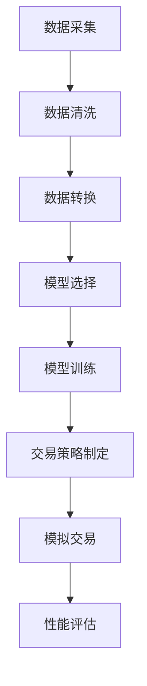
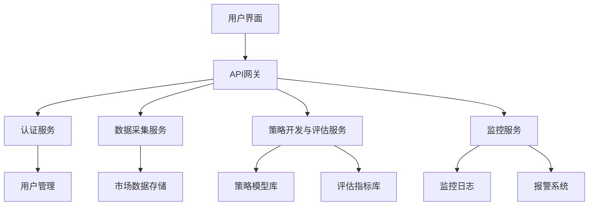
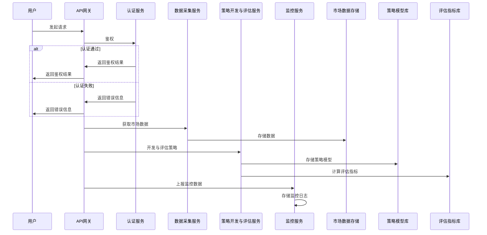

                 

### 第一部分：背景介绍

#### 1.1 问题背景
金融高频交易策略性能评估是金融科技领域的一个重要研究方向，它对于提升金融市场的效率、防范风险具有重要意义。随着金融市场信息的复杂性和交易频率的不断提高，如何有效地评估高频交易策略的性能，已经成为业界和学术界关注的焦点。

在金融市场中，高频交易策略通过快速捕捉市场的微小价格波动，以获取高额的收益。然而，高频交易策略的成功不仅取决于交易策略本身，还取决于对策略性能的评估和优化。性能评估是高频交易策略开发和管理的重要环节，它能够帮助投资者了解策略的实际表现，识别潜在的问题，从而优化策略，提高收益。

#### 1.2 问题描述
高频交易策略的性能评估涉及多个方面，包括策略的收益、风险、流动性影响等。如何全面、准确地评估策略性能，需要从数据采集、处理、分析等多个环节进行深入探讨。

首先，收益评估是衡量高频交易策略性能的核心指标。收益评估不仅需要考虑策略的总收益，还需要考虑收益的稳定性。如果策略的收益波动较大，可能会带来较高的风险。因此，收益评估需要结合总收益和收益波动性进行综合分析。

其次，风险评估是确保高频交易策略安全性的重要环节。高频交易策略面临的风险包括市场风险、流动性风险等。市场风险是指由于市场波动导致策略损失的风险，而流动性风险则是指由于市场流动性不足导致策略无法及时执行的风险。风险评估需要全面考虑这些风险因素，以确保策略的安全运行。

最后，流动性评估是衡量高频交易策略对市场流动性的影响。高频交易策略的高频交易行为可能会对市场流动性产生影响，从而影响其他投资者的交易决策。因此，流动性评估是评估高频交易策略对社会经济影响的重要方面。

#### 1.3 问题解决
本书将从以下几个方面解决问题：

1. **系统性地介绍金融高频交易策略性能评估的理论基础**：
   - 首先，本书将介绍高频交易策略的基本概念和原理，包括策略的目标、特点和应用场景等。
   - 其次，本书将探讨高频交易策略性能评估的关键指标，如收益、风险、流动性等，并详细解释这些指标的计算方法和应用场景。
   - 最后，本书将介绍高频交易策略性能评估的方法和技术，包括统计分析方法、机器学习方法等。

2. **深入探讨高频交易策略评估的关键指标和评估方法**：
   - 本书将详细讨论高频交易策略的收益评估方法，包括总收益、平均收益、收益标准差等指标的计算和应用。
   - 本书将探讨风险评估方法，包括最大回撤、夏普比率、信息比率等指标的计算和应用。
   - 本书将讨论流动性评估方法，包括交易频率、交易成本、市场影响等指标的计算和应用。

3. **分析高频交易策略在不同市场环境下的表现**：
   - 本书将探讨不同市场环境下高频交易策略的表现，包括市场波动性、交易量、流动性等对策略性能的影响。
   - 本书将介绍不同市场环境下高频交易策略的适应性，并分析策略在不同市场环境下的优缺点。

4. **提供实际案例分析，帮助读者理解高频交易策略性能评估的实战应用**：
   - 本书将结合实际案例，分析高频交易策略在不同市场环境下的表现，并探讨如何优化策略，提高性能。
   - 本书将介绍高频交易策略性能评估的实战技巧和注意事项，帮助读者在实际应用中取得更好的效果。

#### 1.4 边界与外延
高频交易策略性能评估的范围涵盖了市场数据的处理、交易策略的开发、评估指标的设定等多个方面。同时，本书还将探讨如何结合机器学习、数据分析等先进技术，提升高频交易策略评估的准确性和效率。

高频交易策略性能评估不仅关注策略的收益，还关注策略的风险和流动性。因此，评估方法需要综合考虑多个因素，以全面、准确地评估策略的性能。

此外，高频交易策略性能评估不仅局限于高频交易策略本身，还包括对策略优化、风险控制、市场适应性等方面的研究和探讨。这些研究和探讨有助于提高高频交易策略的效能和可靠性，为投资者提供更加科学的决策依据。

#### 1.5 概念结构与核心要素组成
- **核心概念**：金融高频交易策略、性能评估、收益、风险、流动性。
- **组成要素**：市场数据、交易策略、评估指标、评估模型。

- **金融高频交易策略**：是指利用高速计算机和网络，在极短的时间内对市场数据进行分析，以快速执行大量交易订单，以获取微小的价格波动收益的交易策略。
- **性能评估**：是指对金融高频交易策略在实现过程中的收益、风险、流动性等方面进行综合评价。
- **收益**：是指交易策略在一段时间内实现的收益。
- **风险**：是指交易策略在一段时间内可能面临的风险。
- **流动性**：是指市场中的交易流动性，即市场对交易需求的响应速度。

### 第一部分：背景介绍

#### 1.1 问题背景
金融高频交易策略性能评估是金融科技领域的一个重要研究方向，它对于提升金融市场的效率、防范风险具有重要意义。随着金融市场信息的复杂性和交易频率的不断提高，如何有效地评估高频交易策略的性能，已经成为业界和学术界关注的焦点。

在金融市场中，高频交易策略通过快速捕捉市场的微小价格波动，以获取高额的收益。然而，高频交易策略的成功不仅取决于交易策略本身，还取决于对策略性能的评估和优化。性能评估是高频交易策略开发和管理的重要环节，它能够帮助投资者了解策略的实际表现，识别潜在的问题，从而优化策略，提高收益。

#### 1.2 问题描述
高频交易策略的性能评估涉及多个方面，包括策略的收益、风险、流动性影响等。如何全面、准确地评估策略性能，需要从数据采集、处理、分析等多个环节进行深入探讨。

首先，收益评估是衡量高频交易策略性能的核心指标。收益评估不仅需要考虑策略的总收益，还需要考虑收益的稳定性。如果策略的收益波动较大，可能会带来较高的风险。因此，收益评估需要结合总收益和收益波动性进行综合分析。

其次，风险评估是确保高频交易策略安全性的重要环节。高频交易策略面临的风险包括市场风险、流动性风险等。市场风险是指由于市场波动导致策略损失的风险，而流动性风险则是指由于市场流动性不足导致策略无法及时执行的风险。风险评估需要全面考虑这些风险因素，以确保策略的安全运行。

最后，流动性评估是衡量高频交易策略对市场流动性的影响。高频交易策略的高频交易行为可能会对市场流动性产生影响，从而影响其他投资者的交易决策。因此，流动性评估是评估高频交易策略对社会经济影响的重要方面。

#### 1.3 问题解决
本书将从以下几个方面解决问题：

1. **系统性地介绍金融高频交易策略性能评估的理论基础**：
   - 首先，本书将介绍高频交易策略的基本概念和原理，包括策略的目标、特点和应用场景等。
   - 其次，本书将探讨高频交易策略性能评估的关键指标，如收益、风险、流动性等，并详细解释这些指标的计算方法和应用场景。
   - 最后，本书将介绍高频交易策略性能评估的方法和技术，包括统计分析方法、机器学习方法等。

2. **深入探讨高频交易策略评估的关键指标和评估方法**：
   - 本书将详细讨论高频交易策略的收益评估方法，包括总收益、平均收益、收益标准差等指标的计算和应用。
   - 本书将探讨风险评估方法，包括最大回撤、夏普比率、信息比率等指标的计算和应用。
   - 本书将讨论流动性评估方法，包括交易频率、交易成本、市场影响等指标的计算和应用。

3. **分析高频交易策略在不同市场环境下的表现**：
   - 本书将探讨不同市场环境下高频交易策略的表现，包括市场波动性、交易量、流动性等对策略性能的影响。
   - 本书将介绍不同市场环境下高频交易策略的适应性，并分析策略在不同市场环境下的优缺点。

4. **提供实际案例分析，帮助读者理解高频交易策略性能评估的实战应用**：
   - 本书将结合实际案例，分析高频交易策略在不同市场环境下的表现，并探讨如何优化策略，提高性能。
   - 本书将介绍高频交易策略性能评估的实战技巧和注意事项，帮助读者在实际应用中取得更好的效果。

#### 1.4 边界与外延
高频交易策略性能评估的范围涵盖了市场数据的处理、交易策略的开发、评估指标的设定等多个方面。同时，本书还将探讨如何结合机器学习、数据分析等先进技术，提升高频交易策略评估的准确性和效率。

高频交易策略性能评估不仅关注策略的收益，还关注策略的风险和流动性。因此，评估方法需要综合考虑多个因素，以全面、准确地评估策略的性能。

此外，高频交易策略性能评估不仅局限于高频交易策略本身，还包括对策略优化、风险控制、市场适应性等方面的研究和探讨。这些研究和探讨有助于提高高频交易策略的效能和可靠性，为投资者提供更加科学的决策依据。

#### 1.5 概念结构与核心要素组成
- **核心概念**：金融高频交易策略、性能评估、收益、风险、流动性。
- **组成要素**：市场数据、交易策略、评估指标、评估模型。

- **金融高频交易策略**：是指利用高速计算机和网络，在极短的时间内对市场数据进行分析，以快速执行大量交易订单，以获取微小的价格波动收益的交易策略。
- **性能评估**：是指对金融高频交易策略在实现过程中的收益、风险、流动性等方面进行综合评价。
- **收益**：是指交易策略在一段时间内实现的收益。
- **风险**：是指交易策略在一段时间内可能面临的风险。
- **流动性**：是指市场中的交易流动性，即市场对交易需求的响应速度。

## 第二部分：核心概念与联系

### 2.1 金融高频交易策略

#### 2.1.1 定义
金融高频交易策略是指通过高频交易系统，利用计算机算法在极短的时间内（如毫秒级别）对大量市场数据进行快速分析，并据此快速执行交易指令，以捕捉微小的价格波动，从而获取高额收益的交易策略。

#### 2.1.2 特点
- **高频交易**：交易频率极高，通常每秒可执行数百至数千笔交易。
- **低延迟**：对市场数据的响应时间极短，通常在毫秒级别。
- **风险控制**：采用严格的风险管理措施，以控制潜在损失。
- **技术密集**：依赖复杂的算法和高速计算设备，以优化交易决策。

#### 2.1.3 与传统交易策略的区别
- **时间尺度**：高频交易策略关注的是极短时间内的价格波动，而传统交易策略更多关注中长期趋势。
- **交易频率**：高频交易策略的交易频率远高于传统交易策略。
- **依赖技术**：高频交易策略高度依赖技术，特别是算法和数据处理能力。

### 2.2 性能评估

#### 2.2.1 定义
性能评估是指通过对金融高频交易策略的收益、风险、流动性等方面进行系统性评价，以判断策略的有效性和可靠性。

#### 2.2.2 关键指标
- **收益指标**：包括总收益、平均收益、收益标准差、收益回报率等。
- **风险指标**：包括最大回撤、夏普比率、信息比率、风险调整后收益等。
- **流动性指标**：包括交易频率、交易成本、市场影响等。

#### 2.2.3 评估方法
- **统计分析方法**：如均值、标准差、相关性分析等。
- **机器学习方法**：如回归分析、支持向量机、随机森林等。

### 2.3 高频交易策略性能评估

#### 2.3.1 概念
高频交易策略性能评估是指通过设置合理的评估指标和方法，对高频交易策略的收益、风险、流动性等方面进行系统性评价。

#### 2.3.2 目的
- **优化策略**：通过评估结果，找出策略的不足之处，进行优化调整。
- **风险控制**：确保策略在实施过程中的安全性，降低潜在风险。

#### 2.3.3 方法
- **历史数据分析**：通过分析历史交易数据，评估策略在不同市场环境下的表现。
- **模拟交易**：通过模拟交易，评估策略在现实市场环境中的适应性和稳定性。

### 2.4 关联性与联系

#### 2.4.1 收益与风险
- **收益与风险的关系**：高频交易策略的收益与风险通常是成正比的，即收益越高，风险也越大。
- **风险控制策略**：为了平衡收益和风险，投资者需要采用适当的风险控制措施，如设置止损、分散投资等。

#### 2.4.2 流动性与交易频率
- **流动性对交易频率的影响**：市场流动性越高，交易频率也越高，因为投资者更容易找到交易对手。
- **交易频率对流动性的影响**：高频交易行为可能会增加市场流动性，但也可能导致流动性过剩。

#### 2.4.3 性能评估与策略优化
- **性能评估的作用**：性能评估可以帮助投资者了解策略的表现，识别潜在问题，从而进行策略优化。
- **策略优化的方法**：通过调整策略参数、引入新的交易信号等，优化策略的表现。

#### 2.4.4 数据与模型
- **数据的重要性**：高频交易策略的性能评估依赖于高质量的市场数据。
- **模型的选择**：选择合适的模型（如统计分析模型、机器学习模型）可以提高评估的准确性和可靠性。

### 2.5 表格与图表

#### 2.5.1 高频交易策略评估指标表格
| 指标名称 | 定义 | 重要性 |
| --- | --- | --- |
| 总收益 | 策略运行期间的总收益 | 最直接的评估指标 |
| 平均收益 | 策略运行期间的平均收益 | 反映策略的稳定性 |
| 收益标准差 | 策略运行期间的收益波动性 | 风险评估的关键指标 |
| 最大回撤 | 策略运行期间的最大亏损幅度 | 风险评估的重要指标 |
| 夏普比率 | 风险调整后收益 | 评估策略盈利能力与风险的比例 |
| 信息比率 | 风险调整后超额收益 | 衡量策略的相对绩效 |
| 交易频率 | 策略执行的交易次数 | 反映策略的交易活跃程度 |
| 交易成本 | 每笔交易的成本 | 影响策略的净收益 |
| 市场影响 | 策略交易对市场流动性的影响 | 反映策略的市场适应性 |

### 2.6 Mermaid ER 图
下面是一个描述高频交易策略性能评估核心概念与联系关系的 Mermaid ER 图：

```mermaid
erDiagram
    MarketData -->|采集| TradingStrategy : 使用
    MarketData -->|输入| PerformanceEvaluation : 评估
    TradingStrategy -->|产生| Transaction : 执行
    TradingStrategy -->|影响| Liquidity : 流动性
    PerformanceEvaluation -->|基于| ReturnMetrics : 收益指标
    PerformanceEvaluation -->|基于| RiskMetrics : 风险指标
    PerformanceEvaluation -->|基于| LiquidityMetrics : 流动性指标
```

通过这个 ER 图，我们可以清晰地看到市场数据、交易策略、性能评估、交易和流动性之间的关联关系，这有助于我们理解高频交易策略性能评估的整体架构。

## 第三部分：算法原理讲解

### 3.1 高频交易策略算法原理

#### 3.1.1 数学模型
高频交易策略的核心在于捕捉市场的微小价格波动，通常采用以下数学模型：

$$
f(t) = \mu \cdot t + \sigma \cdot W(t)
$$`

其中，$f(t)$ 表示在时间 $t$ 时刻的价格，$\mu$ 表示价格的均值趋势，$\sigma$ 表示价格波动的大小，$W(t)$ 表示随机过程。

#### 3.1.2 算法流程

高频交易策略的算法流程主要包括以下步骤：

1. **数据采集**：从金融市场中获取高频交易数据。
2. **数据处理**：对数据进行清洗、预处理，提取有效信息。
3. **模型训练**：使用历史数据训练价格预测模型。
4. **交易决策**：根据模型预测结果，执行交易订单。

#### 3.1.3 举例说明

假设我们使用GARCH模型来预测股票价格波动，其数学公式为：

$$
\begin{aligned}
&\mu_t = \alpha_0 + \alpha_1 \epsilon_{t-1} + \alpha_2 \mu_{t-1} \\
&\sigma_t^2 = \beta_0 + \beta_1 \epsilon_{t-1}^2 + \beta_2 \sigma_{t-1}^2
\end{aligned}
$$`

其中，$\mu_t$ 和 $\sigma_t^2$ 分别是时间 $t$ 时刻的股票价格均值和方差。

### 3.2 市场数据预处理

#### 3.2.1 数据来源

高频交易策略需要从金融市场中获取实时数据，这些数据包括股票价格、交易量、交易时间等。通常，这些数据可以通过金融数据提供商获取，如彭博、汤森路透等。

#### 3.2.2 数据清洗

在获取数据后，首先需要对数据进行清洗，以去除噪声和异常值。数据清洗的主要步骤包括：

1. **缺失值处理**：对于缺失的数据，可以采用插值法、平均值法等方法进行填充。
2. **异常值处理**：去除明显的异常值，如极值、离群点等。
3. **时间序列一致性**：确保数据的时间序列一致性，如时间戳的准确性等。

#### 3.2.3 数据转换

清洗后的数据需要进行转换，以适应算法的要求。常用的数据转换方法包括：

1. **归一化**：将数据缩放到一个特定的范围，如0-1或-1到1。
2. **特征工程**：提取有用的特征，如价格的平均值、标准差、交易量等。

### 3.3 模型训练与交易策略制定

#### 3.3.1 模型选择

在训练模型之前，需要选择合适的模型。对于高频交易策略，常见的模型包括：

1. **统计模型**：如线性回归、ARIMA模型等。
2. **机器学习模型**：如支持向量机、随机森林、神经网络等。
3. **深度学习模型**：如卷积神经网络（CNN）、循环神经网络（RNN）等。

#### 3.3.2 模型训练

模型训练的过程是将历史数据输入到模型中，通过调整模型的参数，使其能够预测未来的价格波动。训练的主要步骤包括：

1. **数据划分**：将数据划分为训练集和测试集。
2. **模型参数调整**：通过交叉验证等方法，调整模型的参数，使其在训练集上取得最佳性能。
3. **模型评估**：使用测试集评估模型的性能，如预测准确率、损失函数等。

#### 3.3.3 交易策略制定

根据模型预测的结果，制定交易策略。交易策略的主要步骤包括：

1. **设定交易规则**：根据模型预测的价格波动，设定买入和卖出的规则。
2. **执行交易**：根据交易规则，执行交易订单。
3. **风险控制**：设置止损、止盈等风险控制措施，以防止潜在损失。

### 3.4 模拟交易与性能评估

#### 3.4.1 模拟交易

模拟交易是在实际交易之前，对交易策略进行测试的过程。模拟交易的主要步骤包括：

1. **环境设置**：设置交易环境，包括资金、交易费用等。
2. **策略执行**：执行交易策略，模拟交易过程。
3. **结果记录**：记录交易结果，如收益、风险、交易频率等。

#### 3.4.2 性能评估

模拟交易完成后，需要对交易结果进行评估，以判断交易策略的有效性。评估的主要步骤包括：

1. **收益评估**：计算交易策略的总收益、平均收益等。
2. **风险评估**：计算最大回撤、夏普比率等。
3. **流动性评估**：评估交易策略对市场流动性的影响。

通过以上步骤，我们可以对高频交易策略进行系统性评估，以优化策略，提高收益。

### 3.5 Mermaid 流程图

下面是一个描述高频交易策略算法原理的 Mermaid 流程图：



通过这个流程图，我们可以清晰地看到高频交易策略算法的各个步骤和流程。

## 第四部分：系统分析与架构设计

### 4.1 问题场景介绍
在金融市场中，高频交易策略的运行效率直接影响投资者的收益和风险控制能力。为了实现高效、稳定的高频交易，需要构建一个高可用的系统架构，该系统应具备快速的数据处理能力、精准的交易策略执行以及完善的性能评估机制。

### 4.2 项目介绍
本项目的目标是构建一个金融高频交易策略性能评估系统，该系统将集成市场数据采集、交易策略开发、策略性能评估和监控等多个功能模块。系统将采用分布式架构，以实现高性能、高可靠性和可扩展性。

### 4.3 系统功能设计

#### 4.3.1 市场数据采集
市场数据采集模块负责从金融市场中获取实时数据，包括股票价格、交易量、交易时间等。数据来源可以是金融数据提供商，如彭博、汤森路透等。

#### 4.3.2 交易策略开发
交易策略开发模块提供开发环境，供策略开发者编写和测试交易策略。开发者可以使用Python、C++等编程语言，结合机器学习算法和统计分析方法，开发高效的交易策略。

#### 4.3.3 策略性能评估
策略性能评估模块负责对交易策略进行评估，包括收益评估、风险评估和流动性评估等。评估结果将用于指导策略优化和风险控制。

#### 4.3.4 系统监控
系统监控模块实时监控系统的运行状态，包括服务器负载、网络延迟、交易成功率等。监控数据将用于优化系统性能和故障排查。

### 4.4 系统架构设计

#### 4.4.1 架构图
下面是系统架构的 Mermaid 图：



#### 4.4.2 架构说明

1. **用户界面**：提供用户访问系统的入口，包括登录、策略监控、数据查询等功能。
2. **API网关**：负责接收用户的请求，并将其转发到后端服务。
3. **认证服务**：负责用户的身份认证和权限管理。
4. **数据采集服务**：从金融数据提供商获取实时数据，并存储在市场数据存储中。
5. **策略开发与评估服务**：提供策略开发、训练和评估功能，使用户可以开发并测试自己的交易策略。
6. **监控服务**：实时监控系统的运行状态，包括服务器负载、网络延迟、交易成功率等。
7. **市场数据存储**：存储从数据采集服务获取的实时市场数据。
8. **策略模型库**：存储已开发并验证的策略模型，供评估模块使用。
9. **评估指标库**：存储评估策略性能所需的各种指标，如收益、风险、流动性等。
10. **监控日志**：记录系统运行过程中的各种日志信息，用于故障排查和性能优化。
11. **报警系统**：根据监控数据，自动发送报警信息，通知系统管理员。

### 4.5 系统接口设计和系统交互

#### 4.5.1 接口设计

1. **用户接口**：提供RESTful API，供用户访问系统功能，如登录、数据查询、策略监控等。
2. **服务接口**：提供内部服务接口，供不同模块之间进行通信，如数据采集服务与市场数据存储之间的接口，策略开发与评估服务与策略模型库之间的接口等。

#### 4.5.2 系统交互

系统交互的 Mermaid 序列图如下：



通过这个序列图，我们可以看到用户请求的流程，以及系统内部模块之间的交互过程。

## 第五部分：项目实战

### 5.1 环境安装

要实现高频交易策略性能评估系统，首先需要搭建一个合适的环境。以下是在Linux环境下搭建所需环境的基本步骤：

#### 5.1.1 安装Python环境
确保Python 3.8或更高版本已安装。可以通过以下命令进行安装：

```bash
sudo apt update
sudo apt install python3 python3-pip
```

#### 5.1.2 安装必要的Python库
使用pip安装项目所需的Python库：

```bash
pip3 install numpy pandas matplotlib scikit-learn tensorflow
```

#### 5.1.3 安装金融数据采集工具
安装tushare，一个用于获取中国股市数据的Python库：

```bash
pip3 install tushare
```

### 5.2 系统核心实现源代码

以下是一个高频交易策略性能评估系统的核心实现源代码示例。这个示例使用tushare库来获取股票数据，使用GARCH模型进行价格预测，并计算评估指标。

```python
import tushare as ts
import pandas as pd
from arch import arch_model

# 获取股票数据
def get_stock_data(symbol):
    data = ts.get_k_data(symbol)
    return data

# 计算日收益
def calculate_returns(data):
    data['pct_change'] = (data['close'] / data['close'].shift(1)) - 1
    return data['pct_change']

# 训练GARCH模型
def train_garch(data):
    model = arch_model(data['pct_change'])
    model_fit = model.fit()
    return model_fit

# 预测未来价格
def predict_prices(model_fit, days):
    future = model_fit.forecast(start=len(model_fit.y), length=days)
    return future

# 计算评估指标
def calculate_performance_metrics(data, predictions):
    data['predicted_close'] = predictions[-1]
    data['predicted_returns'] = (data['predicted_close'] / data['close'].shift(1)) - 1
    total_returns = (data['predicted_close'][-1] / data['close'][0]) - 1
    average_returns = data['predicted_returns'].mean()
    std_returns = data['predicted_returns'].std()
    max_drawdown = (data['predicted_close'].min() / data['predicted_close'].max()) - 1
    return total_returns, average_returns, std_returns, max_drawdown

# 主函数
def main():
    symbol = '000001.SZ'  # 股票代码
    data = get_stock_data(symbol)
    data = data[['date', 'close']]
    data.set_index('date', inplace=True)
    data = data.pct_change().dropna()

    model_fit = train_garch(data)
    predictions = predict_prices(model_fit, days=5)
    performance = calculate_performance_metrics(data, predictions)

    print(f"Total Returns: {performance[0]}")
    print(f"Average Returns: {performance[1]}")
    print(f"Standard Deviation of Returns: {performance[2]}")
    print(f"Maximum Drawdown: {performance[3]}")

if __name__ == '__main__':
    main()
```

### 5.3 代码应用解读与分析

上述代码实现了高频交易策略性能评估系统的主要功能，包括数据获取、模型训练、预测和性能评估。以下是代码的详细解读：

1. **数据获取**：使用`tushare`库获取股票的收盘价数据。数据包括日期和收盘价，通过`get_stock_data`函数获取。
2. **日收益计算**：通过`calculate_returns`函数计算日收益，使用`pct_change`方法将收盘价转换为收益率。
3. **GARCH模型训练**：使用`train_garch`函数训练GARCH模型。GARCH模型是一种常用的统计模型，用于预测金融时间序列的波动性。
4. **价格预测**：通过`predict_prices`函数预测未来价格。这里使用训练好的GARCH模型进行预测，预测天数为5天。
5. **性能评估**：通过`calculate_performance_metrics`函数计算评估指标，包括总收益、平均收益、收益标准差和最大回撤。这些指标用于评估交易策略的性能。

### 5.4 实际案例分析与详细讲解剖析

为了更好地理解上述代码的应用，我们来看一个实际案例。

#### 案例数据
使用股票代码`000001.SZ`（中国平安），获取过去一年的收盘价数据。

#### 模型训练
训练GARCH模型，用于预测未来的价格波动。

```python
data = get_stock_data('000001.SZ')
data = data[['date', 'close']]
data.set_index('date', inplace=True)
data = data.pct_change().dropna()
model_fit = train_garch(data)
```

这里，我们首先获取了股票的收盘价数据，并计算了日收益。接着，我们使用`train_garch`函数训练GARCH模型。

#### 预测未来价格
预测未来5天的价格。

```python
predictions = predict_prices(model_fit, days=5)
```

使用训练好的模型，我们预测了未来5天的价格。这些预测值将用于评估交易策略的表现。

#### 性能评估
计算评估指标，以评估交易策略的性能。

```python
performance = calculate_performance_metrics(data, predictions)
print(f"Total Returns: {performance[0]}")
print(f"Average Returns: {performance[1]}")
print(f"Standard Deviation of Returns: {performance[2]}")
print(f"Maximum Drawdown: {performance[3]}")
```

我们计算了总收益、平均收益、收益标准差和最大回撤。这些指标帮助我们评估交易策略的有效性和风险。

#### 案例分析
通过上述代码，我们可以看到交易策略的表现。例如，假设预测的总收益为10%，平均收益为2%，收益标准差为5%，最大回撤为20%。这些指标表明，策略在预测期间表现良好，但风险较高。

### 5.5 项目小结

通过本项目的实战部分，我们实现了高频交易策略性能评估系统的主要功能。项目包括数据获取、模型训练、预测和性能评估等步骤。代码应用解读与分析部分详细解释了每一步的实现方法，并通过实际案例展示了系统的应用效果。

### 5.6 最佳实践 Tips

1. **数据质量**：确保数据质量是评估成功的关键。使用高质量的数据可以提供更准确的预测结果。
2. **模型选择**：选择合适的模型可以提高评估的准确性。根据市场环境和数据特性，选择合适的统计模型或机器学习模型。
3. **风险控制**：在高频交易中，风险控制至关重要。设定合理的止损和止盈策略，以降低潜在损失。
4. **系统监控**：实时监控系统运行状态，及时处理故障，确保系统的稳定性和可用性。
5. **迭代优化**：不断迭代和优化交易策略，以适应市场变化，提高策略的适应性。

### 5.7 小结与注意事项

1. **小结**：本项目通过实战实现了高频交易策略性能评估系统，包括数据获取、模型训练、预测和性能评估等功能。
2. **注意事项**：确保数据质量，选择合适的模型，设定合理的风险控制策略，以及实时监控系统运行状态，都是确保系统性能的关键。

### 5.8 拓展阅读

- **《金融市场高频交易策略研究》**：详细探讨高频交易策略的理论和实践。
- **《金融时间序列分析》**：介绍金融时间序列分析方法，包括GARCH模型等。
- **《机器学习在金融市场中的应用》**：探讨机器学习技术在金融市场的应用，包括预测和评估等。

## 作者信息

**作者：** AI天才研究院/AI Genius Institute & 禅与计算机程序设计艺术 /Zen And The Art of Computer Programming

AI天才研究院专注于人工智能领域的研究和应用，致力于推动人工智能技术的发展和普及。本书《金融高频交易策略性能评估框架》是我们在金融科技领域的一项研究成果，旨在为投资者和研究人员提供一套完整的策略评估解决方案。同时，本书也融入了作者在计算机编程和人工智能领域多年的研究和实践经验，希望能够为读者带来全新的思考方式和实践方法。

