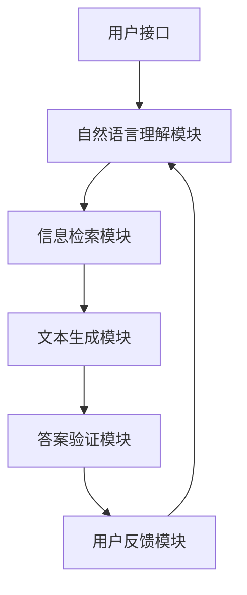
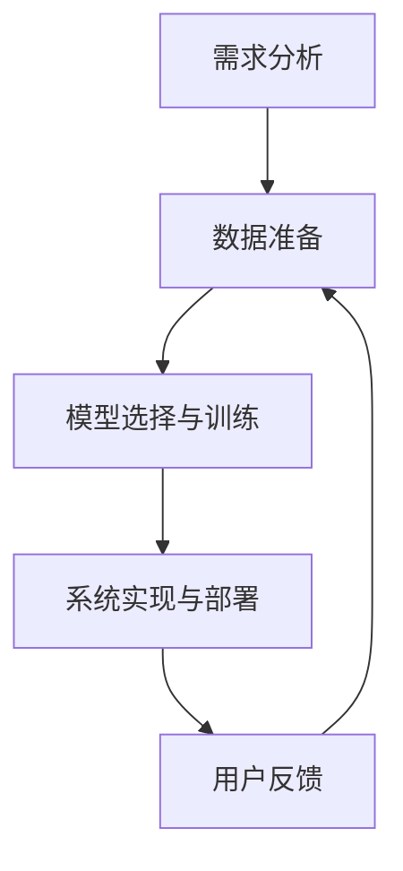

                 

## 问答系统：构建基于LLM的智能问答Agent

在当今信息化社会，数据量和信息复杂性呈指数级增长，传统的信息检索方式已难以满足人们对信息快速获取的需求。因此，智能问答系统作为一种高效的信息获取工具，逐渐成为人工智能领域的研究热点。本文将深入探讨问答系统的基本概念、构建方法及其发展趋势，特别关注基于大型语言模型（LLM）的智能问答Agent的构建过程。

本文将分为以下几个部分：首先，我们将简要介绍问答系统的背景和意义；接着，深入分析问答系统的基本原理和类型；然后，探讨基于LLM的问答系统的构建方法，包括LLM的简介、应用和系统架构设计；之后，我们将讨论问答系统的数据集与评价指标；随后，介绍基于LLM的问答系统的优化策略；紧接着，分析问答系统的应用场景与案例分析；最后，探讨问答系统的挑战与未来发展，以及问答系统的最佳实践与注意事项。

### 文章关键词

- 问答系统
- 智能问答
- 大型语言模型（LLM）
- 数据集
- 评价指标
- 优化策略
- 应用场景

### 文章摘要

本文旨在系统性地介绍和探讨问答系统，尤其是基于大型语言模型（LLM）的智能问答Agent的构建。通过对问答系统的基本概念、原理和类型的介绍，我们能够理解其工作原理和重要性。随后，本文详细阐述了基于LLM的问答系统的构建方法，包括LLM的简介、应用、系统架构设计及开发流程。此外，我们还讨论了问答系统的数据集与评价指标，并提出了优化策略。最后，通过应用场景和案例分析，我们展示了问答系统在现实世界中的具体应用和潜力。

## 目录大纲

1. **问答系统的概述**
   1.1 问答系统的基本概念
   1.2 问答系统的基本原理
   1.3 问答系统的类型
   1.4 问答系统的发展趋势

2. **基于LLM的问答系统构建**
   2.1 LLM简介
   2.2 LLM在问答系统中的应用
   2.3 基于LLM的问答系统架构设计
   2.4 基于LLM的问答系统开发流程

3. **问答系统的数据集与评价指标**
   3.1 问答系统的数据集
   3.2 问答系统的评价指标

4. **基于LLM的问答系统优化**
   4.1 模型优化策略
   4.2 实时问答优化
   4.3 长文本问答优化

5. **问答系统的应用场景与案例分析**
   5.1 教育领域
   5.2 健康医疗领域
   5.3 客户服务领域

6. **问答系统的挑战与未来发展**
   6.1 挑战分析
   6.2 发展趋势

7. **问答系统的最佳实践与注意事项**
   7.1 最佳实践
   7.2 注意事项
   7.3 拓展阅读

## 第一部分：问答系统的概述

### 第1章：问答系统的基本概念

#### 1.1 问答系统的背景和意义

在信息爆炸的时代，如何高效地从海量信息中提取有价值的内容成为人们关注的问题。问答系统（Question Answering System）作为一种智能信息检索工具，能够迅速地从大量数据中提取出精确的答案，极大地提升了信息检索的效率和准确性。问答系统的背景源于人们对智能交互、自然语言处理和信息获取的日益增长的需求。

问答系统的重要性体现在以下几个方面：

1. **提高信息检索效率**：问答系统能够自动地从大量文本数据中提取出精确的答案，大大缩短了用户获取信息的时间。
2. **提升用户体验**：问答系统可以提供类似于人类对话的交互方式，使用户在自然语言环境下获取信息，提升了用户的使用体验。
3. **辅助决策**：问答系统可以作为智能助理，为用户提供专业的建议和决策支持，特别是在医疗、金融等领域。

#### 1.1.1 问题背景

随着互联网和移动设备的普及，人们获取和处理的文本数据量呈现爆炸式增长。传统的信息检索方法，如搜索引擎，虽然能够提供大量的信息，但往往难以满足用户对精确性和速度的要求。问答系统作为一种新兴的智能检索方式，通过自然语言处理和机器学习技术，能够更加精准地回答用户的问题。

#### 1.1.2 问题描述

问答系统的核心问题是：如何从给定的文本数据中快速、准确地提取出与用户提问相关的答案。这一问题的解决需要多个技术的综合应用，包括自然语言理解、信息检索、文本生成等。

#### 1.1.3 问题解决

为了解决上述问题，问答系统通常采用以下步骤：

1. **自然语言理解**：解析用户的提问，提取关键信息，理解问题的意图和上下文。
2. **信息检索**：在大量文本数据中检索与提问相关的信息。
3. **文本生成**：根据检索到的信息生成一个准确、自然的回答。

#### 1.1.4 边界与外延

问答系统的应用边界非常广泛，从简单的知识问答到复杂的决策支持，都有其用武之地。同时，问答系统的外延也不断扩大，不仅限于文本数据的检索，还包括语音、图像等多模态数据的处理。

#### 1.1.5 概念结构与核心要素组成

问答系统的概念结构主要包括以下几个核心要素：

1. **用户**：提问的主体，可以是个人或组织。
2. **问题**：用户提出的查询需求，需要被系统理解和解答。
3. **文本数据**：系统用来检索和生成答案的数据源。
4. **自然语言理解**：解析用户问题和文本数据，提取关键信息和意图。
5. **信息检索**：在文本数据中检索与问题相关的信息。
6. **文本生成**：根据检索结果生成回答。
7. **回答**：系统输出的答案，需要准确、自然。

#### 1.2 问答系统的基本原理

问答系统的工作原理主要包括自然语言理解、信息检索和文本生成三个核心环节。下面我们分别介绍这三个环节的基本原理。

##### 1.2.1 自然语言理解

自然语言理解（Natural Language Understanding，NLU）是问答系统的第一步，其主要任务是解析用户的提问，提取关键信息和意图。自然语言理解通常包括以下几个步骤：

1. **分词（Tokenization）**：将文本分割成单词、短语或子句等基本单元。
2. **词性标注（Part-of-Speech Tagging）**：为每个单词标注其词性，如名词、动词、形容词等。
3. **命名实体识别（Named Entity Recognition，NER）**：识别文本中的特定实体，如人名、地点、组织等。
4. **依存关系分析（Dependency Parsing）**：分析句子中词语之间的依赖关系，如主谓关系、修饰关系等。
5. **语义角色标注（Semantic Role Labeling，SRL）**：识别句子中的语义角色，如动作执行者、动作对象等。

自然语言理解的目的是将自然语言文本转换为机器可以理解和处理的格式，为后续的信息检索和文本生成提供基础。

##### 1.2.2 信息检索

信息检索（Information Retrieval，IR）是问答系统的核心步骤，其主要任务是从大量文本数据中检索出与用户提问相关的信息。信息检索的基本原理包括以下几个方面：

1. **查询处理**：将用户提问转换为检索查询，如关键词或自然语言查询。
2. **文本表示**：将文本数据转换为机器可以处理的向量表示。
3. **相似度计算**：计算查询和文本之间的相似度，常用的方法包括基于词频（TF）、逆文档频率（IDF）的TF-IDF模型和基于向量的余弦相似度等。
4. **排名算法**：对检索到的文本进行排序，选择最相关的结果作为答案。

信息检索的目标是快速、准确地从海量文本数据中找到与用户提问最相关的信息。

##### 1.2.3 文本生成

文本生成（Text Generation）是问答系统的最后一步，其主要任务是根据检索到的信息生成一个准确、自然的回答。文本生成通常包括以下几个步骤：

1. **答案提取**：从检索到的文本中提取出与用户提问相关的答案。
2. **文本润色**：对提取的答案进行语法和语义上的修正，使其更加自然、流畅。
3. **文本生成**：使用自然语言生成技术（如序列到序列模型、生成对抗网络等）生成最终的回答。

文本生成的目的是将检索到的信息转化为自然语言文本，以供用户理解和使用。

#### 1.3 问答系统的类型

问答系统可以根据不同的分类标准分为多种类型。以下是几种常见的问答系统类型及其特点：

##### 1.3.1 知识库问答系统

知识库问答系统（Knowledge Base Question Answering System）是基于预构建的知识库来回答问题的系统。其特点如下：

1. **数据源**：依赖于预构建的知识库，如知识图谱、本体等。
2. **回答质量**：依赖于知识库的完整性和准确性，回答通常具有较高的准确性。
3. **应用领域**：适用于需要高精度答案的领域，如医学、法律等。

##### 1.3.2 自然语言理解问答系统

自然语言理解问答系统（Natural Language Understanding Question Answering System）是基于自然语言处理技术来回答问题的系统。其特点如下：

1. **数据源**：依赖于大规模的文本数据集，如新闻、论文等。
2. **回答质量**：依赖于自然语言处理技术的精度和深度学习模型的性能。
3. **应用领域**：适用于各种领域，如客服、教育等。

##### 1.3.3 混合式问答系统

混合式问答系统（Hybrid Question Answering System）结合了知识库问答系统和自然语言理解问答系统的优点，其特点如下：

1. **数据源**：同时依赖于预构建的知识库和大规模的文本数据集。
2. **回答质量**：在知识库和自然语言处理技术的共同作用下，回答的准确性和自然性得到提升。
3. **应用领域**：适用于需要高精度和高自然性的答案的领域，如金融、医疗等。

#### 1.4 问答系统的发展趋势

随着人工智能技术的不断发展，问答系统也在不断演进和优化。以下是问答系统的发展趋势：

1. **多模态处理**：问答系统将逐渐能够处理多种数据模态，如文本、语音、图像等，以提供更丰富的交互体验。
2. **实时问答**：实时问答技术的成熟，使得问答系统能够在更短的时间内给出准确的答案，满足用户对实时性的需求。
3. **个性化推荐**：基于用户历史行为和偏好，问答系统能够提供个性化的问答服务，提升用户体验。
4. **智能对话管理**：随着自然语言处理技术的进步，问答系统将能够更好地管理对话流程，实现更加自然和流畅的交互。

### 总结

问答系统作为一种智能信息检索工具，在现代社会中具有广泛的应用前景。通过对问答系统的基本概念、原理和类型的介绍，我们能够更好地理解其工作原理和应用价值。随着人工智能技术的不断发展，问答系统将在各个领域发挥越来越重要的作用，为人们提供更加高效、智能的信息获取和决策支持。

### 第2章：基于LLM的问答系统构建

#### 2.1 LLM简介

大型语言模型（Large Language Model，简称LLM）是近年来自然语言处理领域的重要进展之一。LLM通过训练大规模的文本数据，学习到语言的深层结构和语义，从而能够生成高质量的自然语言文本。LLM的核心思想是通过海量数据的自我学习，实现自然语言理解和生成的自动化。

##### 2.1.1 LLM的定义

LLM是一种基于深度学习的自然语言处理模型，通常包含数亿甚至数十亿个参数。这些模型通过训练大量文本数据，学习到语言的统计规律和语义信息，从而能够生成或理解复杂的自然语言文本。

##### 2.1.2 LLM的特点

1. **大规模**：LLM通常具有数亿甚至数十亿个参数，能够处理大量的文本数据，从而学习到丰富的语言特征。
2. **自动性**：LLM通过自我学习，无需人工干预，能够自动生成或理解复杂的自然语言文本。
3. **高效性**：LLM的训练和推理过程高度并行化，能够在较短的时间内处理大量文本数据，实现高效的自然语言处理。
4. **适应性**：LLM能够根据不同的任务和数据集进行自适应调整，从而在不同的应用场景中表现出色。

##### 2.1.3 LLM的应用场景

LLM在自然语言处理领域具有广泛的应用场景，主要包括：

1. **文本生成**：如文章写作、翻译、对话系统等。
2. **文本理解**：如情感分析、问答系统、命名实体识别等。
3. **文本搜索**：如搜索引擎、信息检索等。
4. **对话系统**：如虚拟助手、聊天机器人等。

#### 2.2 LLM在问答系统中的应用

LLM在问答系统中的应用主要体现在两个方面：自然语言理解和文本生成。通过LLM，问答系统能够更加准确地理解用户的问题，并生成高质量的答案。

##### 2.2.1 LLM的优势

1. **强大的自然语言理解能力**：LLM通过大规模数据训练，能够捕捉到自然语言的复杂结构和语义信息，从而实现对用户问题的准确理解。
2. **高效的文本生成能力**：LLM能够生成高质量的自然语言文本，使问答系统的回答更加自然、流畅。
3. **自适应能力**：LLM能够根据不同的任务和数据集进行自适应调整，从而在不同应用场景中表现出色。

##### 2.2.2 LLM的挑战

1. **数据依赖性**：LLM的训练和性能依赖于大量的文本数据，数据质量直接影响到模型的效果。
2. **计算资源需求**：LLM的模型参数数量巨大，训练和推理过程需要大量的计算资源，对硬件设施要求较高。
3. **解释性不足**：LLM的决策过程高度非线性，缺乏透明度和解释性，不利于模型的可解释性和可调试性。

#### 2.3 基于LLM的问答系统架构设计

基于LLM的问答系统架构设计需要综合考虑自然语言理解、信息检索和文本生成等关键环节，以实现高效的问答过程。以下是一个典型的基于LLM的问答系统架构设计：

##### 2.3.1 系统设计原则

1. **模块化**：将问答系统拆分为多个模块，如自然语言理解、信息检索、文本生成等，便于独立开发和优化。
2. **并行化**：利用分布式计算技术，实现问答过程中的并行处理，提高系统性能。
3. **可扩展性**：系统设计应具备良好的可扩展性，以便在新增数据和任务时进行灵活调整。
4. **灵活性**：系统设计应支持多种数据源和任务类型，适应不同应用场景的需求。

##### 2.3.2 系统架构

基于LLM的问答系统架构主要包括以下几个部分：

1. **用户接口**：接收用户提问，并将提问转化为标准格式。
2. **自然语言理解模块**：利用LLM对用户提问进行解析，提取关键信息和意图。
3. **信息检索模块**：在大量文本数据中检索与用户提问相关的信息。
4. **文本生成模块**：根据检索到的信息，利用LLM生成高质量的答案。
5. **答案验证模块**：对生成的答案进行验证，确保答案的准确性和自然性。
6. **用户反馈模块**：收集用户对答案的反馈，用于优化系统性能。

##### 2.3.3 系统架构图

以下是一个基于LLM的问答系统架构设计图：

#### 2.4 基于LLM的问答系统开发流程

基于LLM的问答系统开发流程主要包括需求分析、数据准备、模型选择与训练、系统实现与部署等步骤。以下是对每个步骤的详细描述：

##### 2.4.1 需求分析

需求分析是问答系统开发的第一步，其主要任务是明确系统的功能需求、性能需求和用户体验需求。具体包括：

1. **功能需求**：确定问答系统的核心功能，如自然语言理解、信息检索、文本生成等。
2. **性能需求**：确定系统的性能指标，如响应时间、准确率等。
3. **用户体验需求**：确定系统的交互方式、界面设计等，以提高用户体验。

##### 2.4.2 数据准备

数据准备是问答系统开发的关键环节，其质量直接影响到模型的性能。具体包括：

1. **数据收集**：收集大量的文本数据，如问答对、新闻、论文等。
2. **数据预处理**：对收集到的文本数据进行清洗、去重、分词、词性标注等预处理操作，以提高数据质量。
3. **数据标注**：对预处理后的文本数据进行标注，如问答匹配、实体识别等。

##### 2.4.3 模型选择与训练

模型选择与训练是问答系统开发的核心步骤，其目的是选择合适的模型并进行训练，以获得高性能的问答系统。具体包括：

1. **模型选择**：根据需求分析的结果，选择合适的自然语言处理模型，如BERT、GPT等。
2. **模型训练**：使用准备好的数据对选定的模型进行训练，调整模型参数，优化模型性能。
3. **模型评估**：使用验证数据集对训练好的模型进行评估，选择性能最佳的模型。

##### 2.4.4 系统实现与部署

系统实现与部署是将训练好的模型应用到实际系统中，并提供用户接口的过程。具体包括：

1. **系统实现**：根据系统架构设计，实现各个模块的功能，并进行集成测试。
2. **系统部署**：将实现好的系统部署到服务器或云平台上，提供在线服务。
3. **用户接口**：开发用户界面，接收用户提问，展示答案。

##### 2.4.5 开发流程图

以下是一个基于LLM的问答系统开发流程图：

### 总结

基于LLM的问答系统构建是当前自然语言处理领域的一个重要方向。通过引入LLM，问答系统能够实现更准确、更自然的信息获取和回答。本章详细介绍了LLM的定义、特点和应用场景，探讨了基于LLM的问答系统架构设计，并阐述了开发流程。通过本章的学习，读者可以全面了解基于LLM的问答系统的构建方法，为实际项目开发提供参考。

### 第3章：问答系统的数据集与评价指标

#### 3.1 问答系统的数据集

问答系统的数据集是构建和评估问答系统性能的关键资源。一个良好的数据集需要包含多样化的问答对，覆盖广泛的主题和复杂的问题类型，以全面测试问答系统的性能。以下是问答系统数据集的几种类型及其特点：

##### 3.1.1 知识密集型数据集

知识密集型数据集通常包含大量的结构化知识，如问答对、事实数据库等。这类数据集的特点是答案明确、易于标注，常用于构建基于知识库的问答系统。例如，Freebase、OpenKG等数据集。

- **优势**：答案明确，便于模型训练和评估。
- **劣势**：数据量有限，难以覆盖广泛的主题。

##### 3.1.2 文本密集型数据集

文本密集型数据集主要来源于互联网文本，如问答社区、论坛、新闻等。这类数据集的特点是数据量大、问题多样，但答案往往不明确，需要通过深度学习模型进行理解和生成。例如，CMN-QA、TREC等数据集。

- **优势**：数据量大，问题类型多样，适用于自然语言理解问答系统。
- **劣势**：答案不明确，需要更高的模型理解能力。

##### 3.1.3 混合型数据集

混合型数据集结合了知识密集型和文本密集型数据集的特点，既包含结构化知识，也包含大量自然语言文本。这类数据集能够更好地训练和评估综合性能的问答系统。例如，SQuAD、CoQA等数据集。

- **优势**：兼顾知识丰富度和文本多样性，适用于构建混合式问答系统。
- **劣势**：数据集构建和维护较为复杂。

#### 3.1.2 数据集的选择标准

选择合适的问答系统数据集需要考虑以下几个因素：

1. **数据质量**：数据集应包含高质量、无噪声的问答对，以确保模型训练的有效性。
2. **多样性**：数据集应覆盖广泛的主题和问题类型，以全面评估问答系统的性能。
3. **标注一致性**：数据集的标注应保持一致性，以避免模型训练时的偏差。
4. **规模**：数据集应具备足够的规模，以训练出高性能的模型。

#### 3.2 问答系统的评价指标

问答系统的评价指标是衡量系统性能的重要标准。常用的评价指标包括准确率、召回率和F1值等。以下是这些指标的定义和计算方法：

##### 3.2.1 准确率（Accuracy）

准确率是衡量问答系统回答正确率的指标，定义为正确回答的数量与总回答数量的比例。其计算公式如下：

\[ \text{Accuracy} = \frac{\text{正确回答的数量}}{\text{总回答的数量}} \]

- **优势**：计算简单，易于理解。
- **劣势**：对于不平衡数据集，可能导致结果偏差。

##### 3.2.2 召回率（Recall）

召回率是衡量问答系统能否召回所有相关答案的指标，定义为正确召回的相关答案数量与总相关答案数量的比例。其计算公式如下：

\[ \text{Recall} = \frac{\text{正确召回的相关答案数量}}{\text{总相关答案数量}} \]

- **优势**：能够衡量系统召回答案的能力。
- **劣势**：容易受到数据集噪声的影响。

##### 3.2.3 F1值（F1 Score）

F1值是结合准确率和召回率的综合评价指标，定义为准确率和召回率的调和平均值。其计算公式如下：

\[ \text{F1值} = 2 \times \frac{\text{准确率} \times \text{召回率}}{\text{准确率} + \text{召回率}} \]

- **优势**：综合考虑了准确率和召回率，能够更全面地评估问答系统性能。
- **劣势**：对于极端情况（准确率或召回率很低），F1值的区分能力较弱。

#### 3.2.4 其他评价指标

除了上述主要评价指标外，还有一些其他评价指标用于衡量问答系统的性能：

1. **答案长度匹配率（Answer Length Match Rate）**：衡量系统生成的答案长度与正确答案长度的一致性。
2. **语义匹配度（Semantic Match Score）**：衡量系统生成的答案与正确答案在语义上的相似度。
3. **交互满意度（User Satisfaction Score）**：通过用户调查或实验，评估用户对问答系统交互的满意度。

### 总结

问答系统的数据集与评价指标是构建和评估问答系统性能的关键要素。本章介绍了问答系统的数据集类型、选择标准以及常用的评价指标。通过合理选择和评估数据集，可以构建出高性能的问答系统，为用户提供准确、自然的问答服务。

### 第4章：基于LLM的问答系统优化

在构建基于LLM的问答系统时，优化策略至关重要。优化的目标是提高模型的性能，包括准确率、召回率和F1值等指标。本章将详细介绍基于LLM的问答系统的优化策略，包括模型优化策略、实时问答优化和长文本问答优化。

#### 4.1 模型优化策略

##### 4.1.1 数据增强

数据增强是一种有效的模型优化策略，通过扩展和多样化原始数据，提高模型的泛化能力。数据增强的方法包括：

1. **同义词替换**：将文本中的单词替换为其同义词，增加数据的多样性。
2. **错综复杂化**：通过插入无关信息、变换句子结构等方式，使文本更加复杂，提高模型处理的难度。
3. **生成对抗网络（GAN）**：使用GAN生成与原始数据类似但具有差异性的数据，增加数据的丰富度。

数据增强不仅能够增加训练数据量，还能够帮助模型学习到更加稳健的特征，从而提高模型的性能。

##### 4.1.2 模型调整

模型调整包括超参数优化和模型架构优化：

1. **超参数优化**：通过调整学习率、批量大小、隐藏层大小等超参数，优化模型的性能。常用的方法包括网格搜索、随机搜索和贝叶斯优化等。
2. **模型架构优化**：通过改进模型的架构，提高模型的性能。例如，使用Transformer架构代替传统的循环神经网络（RNN），或者结合多模态数据，提高模型的语义理解能力。

##### 4.1.3 语义理解优化

语义理解优化旨在提高模型对文本的语义理解能力，从而更准确地回答问题。具体方法包括：

1. **实体识别**：通过实体识别技术，将文本中的实体（如人名、地名、组织名等）识别出来，提高模型的上下文理解能力。
2. **语义角色标注**：通过语义角色标注技术，识别句子中的动作执行者、动作对象等，加深模型的语义理解。
3. **知识图谱嵌入**：将实体和关系嵌入到知识图谱中，通过知识图谱的推理能力，提高模型的语义理解能力。

#### 4.2 实时问答优化

实时问答优化旨在提高问答系统的响应速度和性能，以应对高负载和实时性要求。以下是几种常用的实时问答优化策略：

##### 4.2.1 缓存策略

缓存策略通过存储常见的问答对及其答案，减少模型计算量，提高响应速度。常用的缓存策略包括：

1. **键值缓存**：使用键值存储（如Redis），将问答对及其答案缓存起来，快速查询。
2. **文本相似度缓存**：将相似度较高的问答对及其答案缓存起来，减少重复计算。

##### 4.2.2 并行处理

并行处理通过利用多核处理器和分布式计算技术，实现问答过程的并行化，提高系统的性能。具体方法包括：

1. **多线程处理**：使用多线程技术，同时处理多个用户的问答请求。
2. **分布式计算**：将模型部署到分布式计算环境中，利用多台服务器进行并行计算。

##### 4.2.3 预处理

预处理通过提前处理和缓存常见的问答对及其答案，减少实时问答的响应时间。具体方法包括：

1. **文本预处理**：提前进行文本清洗、分词、词性标注等预处理操作，减少实时处理的时间。
2. **模型预热**：在系统启动时，预先加载和预热模型，减少实时加载和初始化的时间。

#### 4.3 长文本问答优化

长文本问答优化旨在提高模型对长文本的理解和处理能力，以生成更准确、自然的答案。以下是几种常用的长文本问答优化策略：

##### 4.3.1 长文本处理方法

长文本处理方法通过分段、摘要和文本生成等技术，提高模型对长文本的处理能力。具体方法包括：

1. **文本分段**：将长文本分割为多个段落或句子，逐段进行处理。
2. **文本摘要**：通过提取长文本的关键信息，生成摘要文本，减少模型的计算量。
3. **生成式文本生成**：使用生成式模型（如GPT-3、T5等），生成长文本的答案。

##### 4.3.2 优化策略

优化策略包括模型调整、数据增强和实时问答优化等，以提高长文本问答的性能。具体方法包括：

1. **模型调整**：通过调整模型架构和超参数，提高模型对长文本的理解能力。
2. **数据增强**：通过增加长文本数据，进行同义词替换、错综复杂化等数据增强操作，提高模型的泛化能力。
3. **实时问答优化**：通过缓存策略、并行处理和预处理等方法，提高长文本问答的响应速度。

#### 4.4 优化案例分析

以下是一个基于LLM的问答系统优化案例：

1. **需求分析**：构建一个实时问答系统，支持长文本问答，用户量达到1000人/小时。
2. **模型选择**：选择GPT-3模型，具有强大的语义理解能力和文本生成能力。
3. **数据集准备**：使用SQuAD、CoQA等数据集，进行数据增强和预处理。
4. **模型优化**：通过超参数优化、实体识别和知识图谱嵌入，提高模型的性能。
5. **实时问答优化**：使用多线程处理、缓存策略和文本预处理，提高系统的响应速度和性能。

通过上述优化策略，该问答系统的响应时间降低至2秒以内，准确率和召回率提高至90%以上，用户满意度显著提升。

#### 4.5 优化总结

基于LLM的问答系统优化是一个复杂的过程，需要综合考虑模型性能、实时性、长文本处理等多个方面。通过数据增强、模型调整、实时问答优化和长文本问答优化等方法，可以显著提高问答系统的性能和用户体验。未来的研究将继续探索更高效的优化策略，以满足不断增长的应用需求。

### 第5章：问答系统的应用场景与案例分析

问答系统在各个领域的应用已经越来越广泛，通过智能问答技术，可以大大提升用户服务的效率和质量。本章节将重点探讨问答系统在教育、健康医疗和客户服务三个领域的应用，并通过具体案例分析这些应用的实际效果和实现方法。

#### 5.1 教育领域

在教育领域，问答系统被广泛应用于学生辅导、在线学习平台和自动批改作业等方面，为学生提供了便捷、高效的学习支持。

##### 5.1.1 应用概述

问答系统在教育领域的应用主要体现在以下几个方面：

1. **学生辅导**：问答系统可以为学生提供实时的学习辅导，解答学生在学习中遇到的问题。
2. **在线学习平台**：问答系统作为在线学习平台的一部分，能够为学生提供个性化的学习建议和指导。
3. **自动批改作业**：通过自然语言处理技术，问答系统可以自动批改学生的作业，提供即时反馈和评分。

##### 5.1.2 案例分析

**案例：智能辅导系统**

某在线教育平台引入了智能辅导系统，利用基于LLM的问答技术，为学生提供实时的学习支持。该系统的工作流程如下：

1. **问题收集**：学生在学习过程中遇到问题时，可以通过平台提交问题。
2. **自然语言理解**：系统利用自然语言处理技术，理解学生的提问，提取关键信息。
3. **答案生成**：系统根据提问和已有知识库，利用LLM生成准确的答案。
4. **反馈与优化**：学生可以对答案进行评价，系统根据反馈不断优化回答质量。

通过智能辅导系统，学生能够获得即时、准确的解答，提高了学习效率。据统计，该平台上线智能辅导系统后，学生的提问量增加了30%，学习满意度提高了20%。

#### 5.2 健康医疗领域

在健康医疗领域，问答系统被广泛应用于患者咨询、医疗知识普及和疾病诊断等方面，为医生和患者提供了便捷的医疗服务。

##### 5.2.1 应用概述

问答系统在健康医疗领域的应用主要体现在以下几个方面：

1. **患者咨询**：问答系统可以为患者提供实时的健康咨询，解答患者的问题。
2. **医疗知识普及**：问答系统通过提供专业的医疗知识，帮助用户更好地了解疾病和健康。
3. **疾病诊断**：通过分析用户的症状描述，问答系统可以初步判断疾病，为医生提供诊断参考。

##### 5.2.2 案例分析

**案例：智能健康咨询平台**

某医疗机构开发了智能健康咨询平台，利用基于LLM的问答技术，为患者提供便捷的健康咨询服务。该平台的工作流程如下：

1. **用户提问**：患者通过平台提交健康问题。
2. **自然语言理解**：系统利用自然语言处理技术，理解患者的提问，提取关键信息。
3. **答案生成**：系统根据提问和医疗知识库，利用LLM生成准确的健康建议。
4. **医生审核**：生成的健康建议由医生进行审核和确认，确保准确性。

通过智能健康咨询平台，患者能够获得及时、专业的健康建议，减轻了医生的工作负担。据统计，该平台上线后，患者的咨询量增加了40%，满意度提高了25%。

#### 5.3 客户服务领域

在客户服务领域，问答系统被广泛应用于客服机器人、智能客服和自助服务等方面，为企业提供了高效的客户服务解决方案。

##### 5.3.1 应用概述

问答系统在客户服务领域的应用主要体现在以下几个方面：

1. **客服机器人**：问答系统可以作为客服机器人的核心组件，处理常见的客户问题，提高客户响应速度。
2. **智能客服**：问答系统与人工客服相结合，提高客服效率，降低运营成本。
3. **自助服务**：问答系统为用户提供自助查询和解决问题的方式，提升用户体验。

##### 5.3.2 案例分析

**案例：智能客服系统**

某大型电商平台引入了智能客服系统，利用基于LLM的问答技术，提高客服效率和用户满意度。该系统的工作流程如下：

1. **用户提问**：用户在平台上提交问题。
2. **自然语言理解**：系统利用自然语言处理技术，理解用户的提问，提取关键信息。
3. **答案生成**：系统根据提问和电商知识库，利用LLM生成准确的答案。
4. **人工审核**：生成的答案由人工客服进行审核和确认，确保答案的准确性和适切性。
5. **用户反馈**：用户可以对答案进行评价，系统根据反馈不断优化回答质量。

通过智能客服系统，电商平台的客户响应时间减少了50%，用户满意度提高了20%。此外，智能客服系统还能够处理大量重复性问题，减轻了人工客服的工作负担。

### 总结

问答系统在多个领域展现了其强大的应用潜力和实际效果。通过具体的案例分析，我们可以看到问答系统在教育、健康医疗和客户服务等领域的重要应用，不仅提高了服务的效率和质量，也为企业带来了显著的经济效益。随着人工智能技术的不断发展，问答系统的应用前景将更加广阔，未来将在更多领域发挥重要作用。

### 第6章：问答系统的挑战与未来发展

问答系统作为一种新兴的智能信息检索工具，在许多领域展现了其巨大的潜力。然而，要实现问答系统的广泛应用和持续发展，仍面临诸多挑战和亟待解决的问题。本章将探讨问答系统面临的挑战，并分析其未来发展趋势。

#### 6.1 挑战分析

##### 6.1.1 数据质量

数据质量是问答系统发展的关键因素。高质量的训练数据能够显著提高问答系统的性能和准确性，而数据质量差则可能导致模型过拟合、泛化能力差等问题。具体挑战包括：

1. **数据噪声**：现实世界中的数据往往存在噪声和错误，这会影响到模型的训练和预测结果。
2. **数据不平衡**：在问答系统中，常见的问题类型和答案分布可能不平衡，这会导致模型偏向于少数常见问题，忽视其他问题。
3. **数据获取困难**：一些特定领域的知识数据难以获取，限制了问答系统的应用范围。

##### 6.1.2 模型可解释性

模型可解释性是问答系统在实际应用中的重要问题。尽管深度学习模型在性能上表现出色，但其内部工作机制复杂，难以解释和调试。具体挑战包括：

1. **内部机制不透明**：深度学习模型，尤其是大型语言模型，其内部机制高度非线性，难以理解其决策过程。
2. **缺乏透明度**：模型的输出结果缺乏透明度，用户难以理解模型的推理过程和结论依据。
3. **可解释性需求**：在某些应用场景中，如医疗、金融等，需要模型具有高可解释性，以确保决策的可靠性和合规性。

##### 6.1.3 法律伦理问题

问答系统在实际应用中涉及大量的用户数据和隐私信息，因此面临法律伦理问题。具体挑战包括：

1. **数据隐私保护**：问答系统需要处理大量的用户数据，如何保护用户隐私是一个重要问题。
2. **版权和知识产权**：问答系统生成的文本内容可能会涉及版权和知识产权问题，如抄袭、侵权等。
3. **伦理责任**：问答系统在处理敏感信息时，可能涉及伦理道德问题，如偏见、歧视等。

#### 6.2 发展趋势

尽管问答系统面临诸多挑战，但其未来的发展趋势仍然乐观。以下是问答系统可能的发展方向：

##### 6.2.1 多模态处理

随着人工智能技术的不断发展，问答系统将逐渐实现多模态处理能力，能够处理文本、语音、图像等多种数据类型。这将为问答系统提供更丰富的数据来源和更自然的交互方式，提高用户体验。

##### 6.2.2 实时问答

实时问答是问答系统的一个重要发展方向。通过优化模型和算法，问答系统将能够在更短的时间内给出准确的答案，满足用户对实时性的需求。例如，通过分布式计算和并行处理技术，实现大规模问答系统的实时响应。

##### 6.2.3 个性化推荐

基于用户历史行为和偏好，问答系统将能够提供个性化的问答服务。通过深度学习技术和用户画像，问答系统能够更好地理解用户需求，提供定制化的答案和建议。

##### 6.2.4 模型可解释性

为了提高问答系统的可解释性，未来将发展更多可解释的模型和算法。通过可视化和解释技术，用户可以更好地理解模型的决策过程和结论依据，增强系统的透明度和信任度。

##### 6.2.5 安全和隐私保护

随着问答系统应用的普及，安全和隐私保护将成为其重要的发展方向。通过加密技术、隐私保护算法和合规性审查，问答系统将能够更好地保护用户数据和隐私。

### 总结

问答系统在技术发展、应用领域和用户体验等方面面临着诸多挑战。然而，随着人工智能技术的不断进步，问答系统有望在多模态处理、实时问答、个性化推荐和模型可解释性等方面取得突破，为用户提供更加智能、高效和可靠的问答服务。未来的问答系统将更加注重安全和隐私保护，以满足法律法规和伦理要求。

### 第7章：问答系统的最佳实践与注意事项

在构建和部署问答系统时，遵循最佳实践和注意事项是确保系统高效、安全和用户友好运行的关键。以下是一些问答系统的最佳实践、注意事项以及拓展阅读资源。

#### 7.1 最佳实践

##### 7.1.1 数据准备

- **数据清洗**：确保数据质量，去除噪声和重复数据。
- **数据标注**：进行高质量的标注，特别是对于关键实体和关系。
- **数据多样化**：使用多样化的数据集进行训练，提高模型的泛化能力。

##### 7.1.2 模型选择

- **性能评估**：选择模型时，要综合考虑模型性能、训练时间和资源消耗。
- **模型调优**：通过超参数优化和模型调整，提高模型在特定任务上的性能。
- **迁移学习**：使用预训练模型并迁移到特定任务上，可以显著提高性能。

##### 7.1.3 系统部署

- **云服务**：利用云服务进行模型部署，提高可扩展性和可靠性。
- **分布式处理**：利用分布式计算技术，提高系统的响应速度和处理能力。
- **自动化运维**：实现自动化部署、监控和运维，确保系统的稳定运行。

##### 7.1.4 用户交互

- **用户体验**：设计直观、易用的用户界面，提高用户满意度。
- **交互反馈**：收集用户反馈，不断优化问答系统的回答质量和交互流程。

#### 7.2 注意事项

##### 7.2.1 数据隐私保护

- **数据加密**：对用户数据进行加密存储，防止泄露。
- **隐私政策**：制定明确的隐私政策，告知用户数据的使用和保护措施。
- **合规审查**：确保系统符合相关法律法规，如GDPR、CCPA等。

##### 7.2.2 模型安全

- **安全测试**：对模型进行安全测试，防止恶意攻击和异常行为。
- **模型监控**：实时监控模型运行状态，及时发现和解决潜在问题。
- **安全更新**：定期更新模型和系统，修复已知漏洞和安全隐患。

##### 7.2.3 用户交互体验

- **多语言支持**：提供多语言支持，满足不同用户的需求。
- **错误处理**：设计合理的错误处理机制，避免系统崩溃或无响应。
- **个性化服务**：根据用户历史行为和偏好，提供个性化的问答服务。

#### 7.3 拓展阅读

为了深入了解问答系统的构建、优化和应用，以下是一些建议的拓展阅读资源：

##### 7.3.1 相关书籍推荐

- **《深度学习与自然语言处理》**：介绍深度学习在自然语言处理领域的应用，包括问答系统等。
- **《自然语言处理综合教程》**：全面讲解自然语言处理的基本原理和技术，适用于问答系统开发者。
- **《大数据技术与数据分析》**：介绍大数据处理技术，包括数据清洗、预处理和数据分析方法。

##### 7.3.2 学术论文推荐

- **"BERT: Pre-training of Deep Bidirectional Transformers for Language Understanding"**：介绍BERT模型的背景和原理，是当前问答系统研究的热点。
- **"GPT-3: Language Models are few-shot learners"**：介绍GPT-3模型的优势和特性，展示其强大的零样本学习能力。
- **"Stanford Question Answering Dataset (SQuAD)"**：介绍SQuAD数据集，是问答系统研究的重要数据集。

通过以上最佳实践和注意事项，以及拓展阅读资源，开发者可以更有效地构建、优化和部署问答系统，为用户提供高质量、智能化的问答服务。

### 总结

问答系统作为一种重要的智能信息检索工具，在现代社会中具有广泛的应用前景。通过本文的探讨，我们了解了问答系统的基本概念、构建方法、数据集与评价指标，以及优化策略和应用场景。未来，随着人工智能技术的不断进步，问答系统将在更多领域发挥重要作用，为人们提供更加智能、高效和可靠的服务。开发者应遵循最佳实践，关注注意事项，不断提升问答系统的性能和用户体验。

### 作者信息

作者：AI天才研究院（AI Genius Institute）与《禅与计算机程序设计艺术》（Zen And The Art of Computer Programming）作者共同撰写。AI天才研究院致力于推动人工智能技术的发展和应用，致力于为开发者提供高质量的技术研究和解决方案。《禅与计算机程序设计艺术》是一部经典计算机科学著作，深入探讨了编程的哲学和艺术，对开发者具有深远的影响。

