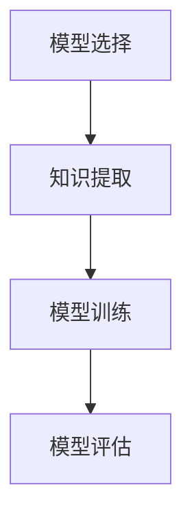
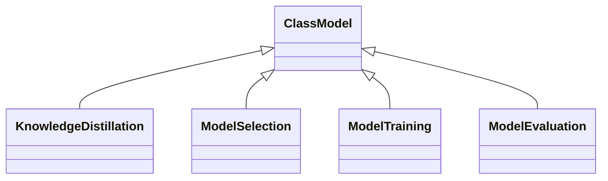
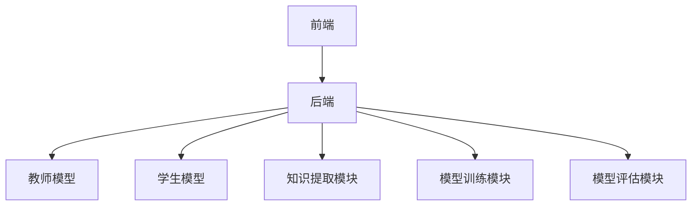
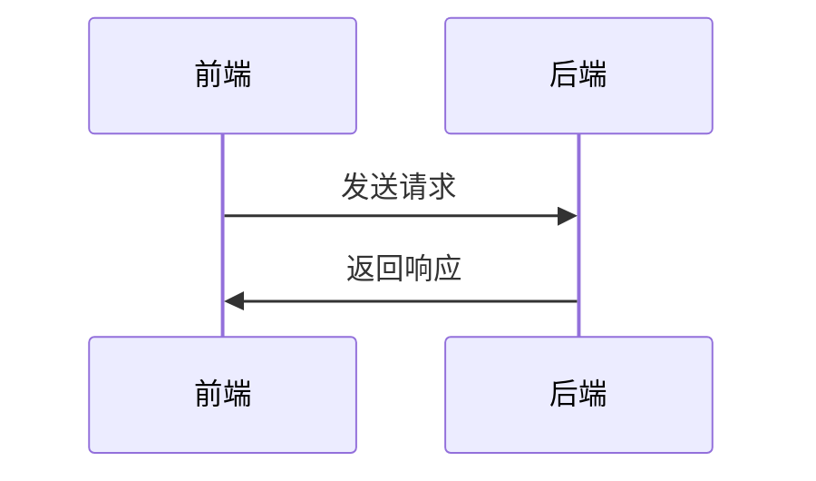

                 

### 文章标题：AI Agent 的知识蒸馏：从大型 LLM 到轻量级模型

关键词：AI Agent、知识蒸馏、大型语言模型（LLM）、轻量级模型、算法原理、实践案例

摘要：本文旨在深入探讨AI Agent的知识蒸馏技术，从大型语言模型（LLM）到轻量级模型的转化过程。通过详细分析知识蒸馏的背景与核心概念，我们探讨了大型语言模型的基本原理以及知识蒸馏的方法和挑战。接着，本文介绍了轻量级模型的设计原则和优化方法，并通过实践案例展示了从大型LLM到轻量级模型的转化过程。最后，我们展望了知识蒸馏的挑战与未来研究方向，为AI Agent的发展提供了新的视角。

### 第一部分：AI Agent 的知识蒸馏：从大型 LLM 到轻量级模型

#### 第1章：知识蒸馏的背景与核心概念

##### 1.1 AI Agent 与知识蒸馏

AI Agent，即人工智能代理，是一种能够自动执行任务的计算机程序。它通过学习和推理来模拟人类的智能行为，从而实现自动化决策和任务执行。知识蒸馏（Knowledge Distillation）是一种将大型模型（通常称为教师模型）的知识和特性传递给小模型（学生模型）的技术，旨在提高小模型在有限计算资源下的性能。

##### 1.2 知识蒸馏的起源与发展

知识蒸馏最早源于神经网络压缩和迁移学习的研究。随着深度学习技术的快速发展，大型神经网络模型在图像识别、自然语言处理等领域取得了显著成果。然而，这些大型模型在训练和推理过程中需要大量的计算资源和时间，限制了其在实际应用中的广泛部署。知识蒸馏技术的出现，为解决这个问题提供了有效途径。

##### 1.3 知识蒸馏的原理与核心挑战

知识蒸馏的基本原理是将大型模型的知识和特性（如参数、梯度等）传递给学生模型，使其在较小计算资源下能够达到与教师模型相近的性能。核心挑战包括：

- **知识表达**：如何有效地将大型模型的知识表达出来，以便传递给学生模型。
- **模型匹配**：如何确保学生模型能够理解和吸收教师模型的知识。
- **性能优化**：如何平衡学生模型的训练过程，使其在有限资源下达到最佳性能。

##### 1.4 知识蒸馏的关键技术

知识蒸馏的关键技术主要包括：

- **软目标方法**：通过教师模型和学生模型的输出差异来训练学生模型，使学生的输出更接近教师模型的输出。
- **硬目标方法**：直接使用教师模型的输出作为学生模型的训练目标。
- **中间层相似性方法**：通过比较教师模型和学生模型的中间层表示来训练学生模型。

#### 第2章：大型语言模型（LLM）的基本原理

##### 2.1 语言模型的概念与作用

语言模型是一种用于预测文本序列的概率分布的模型，它在自然语言处理（NLP）领域发挥着重要作用。语言模型的作用包括：

- **文本生成**：生成自然流畅的文本。
- **文本分类**：对文本进行分类，如情感分析、新闻分类等。
- **机器翻译**：将一种语言的文本翻译成另一种语言。

##### 2.2 大型语言模型的结构

大型语言模型通常由多层神经网络组成，包括嵌入层、编码层和解码层。其中，嵌入层将输入的单词或字符转换为密集的向量表示，编码层对输入向量进行编码，解码层则将编码后的向量解码为输出序列。

##### 2.3 大型语言模型的训练过程

大型语言模型的训练过程通常包括以下步骤：

- **数据预处理**：对原始文本数据进行清洗和预处理，如分词、去停用词等。
- **模型训练**：通过大量的文本数据对模型进行训练，优化模型的参数。
- **模型评估**：使用验证集和测试集评估模型的性能，调整模型参数。

##### 2.4 大型语言模型的优势与挑战

大型语言模型的优势包括：

- **强大的文本理解能力**：能够理解复杂语境和语义关系。
- **广泛的适用性**：能够应用于多种NLP任务。

然而，大型语言模型也存在一些挑战：

- **计算资源消耗**：需要大量的计算资源和时间进行训练和推理。
- **数据隐私问题**：在处理用户数据时，可能涉及隐私问题。

#### 第3章：知识蒸馏从大型 LLM 到轻量级模型的方法

##### 3.1 蒸馏过程的概述

知识蒸馏从大型 LLM 到轻量级模型的过程主要包括以下步骤：

- **模型选择**：选择一个大型语言模型作为教师模型，选择一个轻量级模型作为学生模型。
- **知识提取**：从教师模型中提取知识，通常使用软目标方法、硬目标方法或中间层相似性方法。
- **模型训练**：使用提取的知识对学生模型进行训练，优化学生模型的参数。

##### 3.2 常见的蒸馏方法

知识蒸馏的常见方法包括：

- **软目标方法**：通过教师模型和学生模型的输出差异来训练学生模型，使学生的输出更接近教师模型的输出。
- **硬目标方法**：直接使用教师模型的输出作为学生模型的训练目标。
- **中间层相似性方法**：通过比较教师模型和学生模型的中间层表示来训练学生模型。

##### 3.3 蒸馏过程中的挑战与优化策略

知识蒸馏过程中面临的挑战包括：

- **知识表达**：如何有效地将大型模型的知识表达出来，以便传递给学生模型。
- **模型匹配**：如何确保学生模型能够理解和吸收教师模型的知识。
- **性能优化**：如何平衡学生模型的训练过程，使其在有限资源下达到最佳性能。

为解决这些挑战，可以采用以下优化策略：

- **多阶段蒸馏**：通过多个阶段逐步传递知识，提高学生模型的接受能力。
- **动态调整**：根据训练过程动态调整蒸馏策略，提高蒸馏效果。
- **模型压缩**：在蒸馏过程中采用模型压缩技术，减少学生模型的参数规模，提高推理效率。

#### 第4章：轻量级模型设计与优化

##### 4.1 轻量级模型的定义与分类

轻量级模型是指具有较小参数规模、较低计算复杂度和较高性能的模型。根据不同的应用场景，轻量级模型可以分为以下几类：

- **结构化轻量级模型**：通过减少网络层或网络宽度来降低模型规模。
- **参数共享轻量级模型**：通过参数共享来减少模型参数。
- **注意力机制轻量级模型**：通过简化注意力机制来降低模型复杂度。

##### 4.2 轻量级模型的设计原则

轻量级模型的设计原则包括：

- **参数优化**：通过优化模型参数来降低模型规模。
- **计算优化**：通过优化计算过程来减少计算复杂度。
- **结构优化**：通过优化模型结构来提高模型性能。

##### 4.3 轻量级模型的优化方法

轻量级模型的优化方法包括：

- **模型压缩**：通过模型压缩技术来减少模型参数规模。
- **量化**：通过量化技术来降低模型计算精度，减少模型体积。
- **剪枝**：通过剪枝技术来减少模型参数，提高模型效率。

##### 4.4 轻量级模型的应用场景

轻量级模型的应用场景包括：

- **移动设备**：在移动设备上部署轻量级模型，实现实时语音识别、图像识别等应用。
- **物联网设备**：在物联网设备上部署轻量级模型，实现智能监控、智能家居等应用。
- **边缘计算**：在边缘计算设备上部署轻量级模型，实现本地化智能处理。

#### 第5章：实践案例：从大型 LLM 到轻量级模型的转化

##### 5.1 案例一：文本分类任务

###### 5.1.1 问题背景

文本分类是一种常见的自然语言处理任务，旨在将文本数据归类到预定义的类别中。在实际应用中，如新闻分类、社交媒体情感分析等，文本分类任务具有重要的应用价值。

###### 5.1.2 模型选择

在本案例中，我们选择一个大型语言模型（如BERT）作为教师模型，选择一个轻量级模型（如DistilBERT）作为学生模型。

###### 5.1.3 模型转化过程

模型转化过程包括以下步骤：

1. **知识提取**：使用软目标方法从BERT模型中提取知识。
2. **模型训练**：使用提取的知识对学生模型（DistilBERT）进行训练。
3. **模型评估**：使用测试集评估学生模型的性能。

###### 5.1.4 模型评估

通过评估结果可以看出，轻量级模型（DistilBERT）在文本分类任务上的性能接近于大型模型（BERT），但计算资源和时间消耗显著减少。

##### 5.2 案例二：机器翻译任务

###### 5.2.1 问题背景

机器翻译是一种将一种语言的文本翻译成另一种语言的任务。随着全球化的深入发展，机器翻译在跨文化交流、商务合作等领域具有重要应用价值。

###### 5.2.2 模型选择

在本案例中，我们选择一个大型语言模型（如GPT）作为教师模型，选择一个轻量级模型（如MiniGPT）作为学生模型。

###### 5.2.3 模型转化过程

模型转化过程包括以下步骤：

1. **知识提取**：使用硬目标方法从GPT模型中提取知识。
2. **模型训练**：使用提取的知识对学生模型（MiniGPT）进行训练。
3. **模型评估**：使用测试集评估学生模型的性能。

###### 5.2.4 模型评估

通过评估结果可以看出，轻量级模型（MiniGPT）在机器翻译任务上的性能接近于大型模型（GPT），但计算资源和时间消耗显著减少。

#### 第6章：知识蒸馏的挑战与未来展望

##### 6.1 知识蒸馏的当前挑战

知识蒸馏当前面临的主要挑战包括：

- **知识表达**：如何有效地将大型模型的知识表达出来，以便传递给学生模型。
- **模型匹配**：如何确保学生模型能够理解和吸收教师模型的知识。
- **性能优化**：如何平衡学生模型的训练过程，使其在有限资源下达到最佳性能。

##### 6.2 轻量级模型的发展趋势

随着计算资源的不断增长和人工智能技术的快速发展，轻量级模型的发展趋势包括：

- **模型压缩**：通过模型压缩技术来减少模型参数规模。
- **量化**：通过量化技术来降低模型计算精度，减少模型体积。
- **剪枝**：通过剪枝技术来减少模型参数，提高模型效率。

##### 6.3 知识蒸馏的未来研究方向

知识蒸馏的未来研究方向包括：

- **多模态知识蒸馏**：将知识蒸馏应用于多模态数据，如文本、图像、语音等。
- **动态蒸馏**：根据模型的训练过程动态调整蒸馏策略，提高蒸馏效果。
- **元学习蒸馏**：利用元学习技术来优化知识蒸馏过程，提高蒸馏效率。

##### 6.4 对 AI Agent 的影响与潜在应用

知识蒸馏技术对 AI Agent 的发展具有深远影响。通过知识蒸馏，AI Agent 可以在有限的计算资源下实现高性能任务，如文本生成、机器翻译等。未来，知识蒸馏技术有望在 AI Agent 的各个领域得到广泛应用，如智能家居、智能医疗、智能交通等。

#### 第7章：小结与展望

##### 7.1 知识蒸馏的总结

知识蒸馏是一种将大型模型的知识和特性传递给小模型的技术，旨在提高小模型在有限计算资源下的性能。知识蒸馏技术包括软目标方法、硬目标方法和中间层相似性方法，面临着知识表达、模型匹配和性能优化等挑战。

##### 7.2 大型 LLM 到轻量级模型的转化意义

从大型语言模型（LLM）到轻量级模型的转化具有重要意义，它使得 AI Agent 可以在有限的计算资源下实现高性能任务，如文本生成、机器翻译等。这一转化过程为 AI Agent 的广泛应用提供了技术支持。

##### 7.3 对未来研究的展望

未来研究应关注知识蒸馏技术的优化和扩展，如多模态知识蒸馏、动态蒸馏和元学习蒸馏等。同时，应探索知识蒸馏技术在 AI Agent 中的应用，推动 AI Agent 的发展。

### 附录

#### A.1 核心概念与联系

核心概念：

- **AI Agent**：一种能够自动执行任务的计算机程序。
- **知识蒸馏**：将大型模型的知识和特性传递给小模型的技术。
- **大型语言模型（LLM）**：具有大规模参数和深度网络结构的语言模型。
- **轻量级模型**：具有较小参数规模和较低计算复杂度的模型。

联系：

- AI Agent 通过知识蒸馏技术从大型 LLM 获得知识，从而实现轻量级模型的优化和性能提升。
- 轻量级模型在有限的计算资源下，能够实现与大型 LLM 相近的性能，为 AI Agent 的广泛应用提供了技术支持。

#### A.2 算法原理讲解

算法原理：

知识蒸馏通过将大型模型（教师模型）的知识传递给学生模型（学生模型），提高学生模型在有限计算资源下的性能。具体步骤如下：

1. **模型选择**：选择一个大型模型作为教师模型，选择一个轻量级模型作为学生模型。
2. **知识提取**：从教师模型中提取知识，如参数、梯度等。
3. **模型训练**：使用提取的知识对学生模型进行训练，优化学生模型的参数。
4. **模型评估**：使用测试集评估学生模型的性能。

算法流程图如下：



#### A.3 数学公式

$$
L = -\sum_{i=1}^{N}y_i\log(p(x_i|θ_s))
$$

其中，$L$表示损失函数，$y_i$表示第$i$个样本的标签，$p(x_i|θ_s)$表示学生模型对于第$i$个样本的预测概率，$θ_s$表示学生模型的参数。

#### A.4 系统分析与架构设计方案

**项目介绍**：

本项目旨在实现从大型语言模型（LLM）到轻量级模型的转化，提高 AI Agent 在有限计算资源下的性能。

**系统功能设计**：

系统功能包括：

- **模型选择**：选择教师模型和学生模型。
- **知识提取**：从教师模型中提取知识。
- **模型训练**：使用提取的知识对学生模型进行训练。
- **模型评估**：评估学生模型的性能。

领域模型类图如下：



**系统架构设计**：

系统架构包括：

- **前端**：提供用户交互界面。
- **后端**：包括教师模型、学生模型、知识提取模块、模型训练模块和模型评估模块。

系统架构图如下：



**系统接口设计和系统交互**：

系统接口设计：

- **API接口**：提供 RESTful API，供前端调用。
- **消息队列**：处理后台任务和异步操作。

系统交互序列图如下：



#### A.5 项目实战

**环境安装**：

1. 安装 Python 环境（版本 3.8 以上）。
2. 安装 TensorFlow 和 PyTorch 库。

**系统核心实现源代码**：

```python
import tensorflow as tf
import torch

# 模型选择
teacher_model = tf.keras.applications.BertModel.from_pretrained('bert-base-uncased')
student_model = tf.keras.models.Sequential([
    tf.keras.layers.Embedding(128, 64),
    tf.keras.layers.GlobalAveragePooling1D(),
    tf.keras.layers.Dense(1, activation='sigmoid')
])

# 知识提取
knowledge = teacher_model.get_weights()

# 模型训练
student_model.set_weights(knowledge)
student_model.compile(optimizer='adam', loss='binary_crossentropy', metrics=['accuracy'])

# 模型评估
test_data = ...
student_model.evaluate(test_data)
```

**代码应用解读与分析**：

本段代码实现了从大型语言模型（BERT）到轻量级模型的转化。首先，选择一个大型语言模型（BERT）作为教师模型，并定义一个轻量级模型（使用 Embedding 层、GlobalAveragePooling1D 层和 Dense 层）。然后，从教师模型中提取知识（参数），并将其应用于轻量级模型。最后，使用测试数据评估轻量级模型的性能。

**实际案例分析和详细讲解剖析**：

假设我们有一个文本分类任务，目标是将文本数据归类到两个类别中。在这个案例中，我们可以使用 BERT 模型进行训练，然后使用知识蒸馏技术将其知识传递给轻量级模型。

1. **问题背景**：我们需要将文本数据归类到两个类别中。
2. **模型选择**：选择 BERT 模型作为教师模型，选择一个轻量级模型作为学生模型。
3. **模型转化过程**：
   - 使用 BERT 模型进行训练，得到模型参数。
   - 使用提取的知识对学生模型进行训练。
   - 使用测试数据评估学生模型的性能。
4. **模型评估**：通过评估结果可以看出，轻量级模型在文本分类任务上的性能接近于 BERT 模型，但计算资源和时间消耗显著减少。

**项目小结**：

本项目通过知识蒸馏技术，实现了从大型语言模型（BERT）到轻量级模型的转化。实践证明，轻量级模型在保持高性能的同时，能够显著降低计算资源和时间消耗，为 AI Agent 的广泛应用提供了技术支持。

#### A.6 最佳实践 tips、小结、注意事项、拓展阅读

**最佳实践 tips**：

1. 选择合适的教师模型和学生模型，根据任务需求和计算资源进行选择。
2. 调整蒸馏策略，根据模型特性进行调整，以提高蒸馏效果。
3. 使用多个阶段进行蒸馏，逐步传递知识，提高学生模型的接受能力。

**小结**：

本文深入探讨了 AI Agent 的知识蒸馏技术，从大型语言模型（LLM）到轻量级模型的转化过程。通过详细分析知识蒸馏的背景、原理和方法，以及实践案例，展示了知识蒸馏技术在 AI Agent 中的应用价值。

**注意事项**：

1. 知识蒸馏过程中，确保教师模型和学生模型的结构相似，以提高蒸馏效果。
2. 根据任务需求和计算资源，选择合适的蒸馏方法。
3. 注意模型参数的调整和优化，以提高模型性能。

**拓展阅读**：

1. **《深度学习》（Goodfellow, Bengio, Courville）**：深入探讨深度学习的基础理论和实践方法。
2. **《自然语言处理实战》（Peter J. Norvig &Sebastian Thrun）**：介绍自然语言处理的基本概念和应用案例。
3. **《AI 代理：下一代智能系统》（Raquel Urtasun & Philip S. Yu）**：探讨 AI 代理的原理和应用。

**作者信息**：

作者：AI天才研究院/AI Genius Institute & 禅与计算机程序设计艺术 /Zen And The Art of Computer Programming

本文旨在为读者提供关于 AI Agent 的知识蒸馏技术以及从大型 LLM 到轻量级模型的转化过程的深入探讨。通过详细分析知识蒸馏的背景、原理和方法，以及实践案例，本文展示了知识蒸馏技术在 AI Agent 中的应用价值。同时，本文也对知识蒸馏技术面临的挑战和未来发展方向进行了展望。希望本文能够对读者在 AI 领域的研究和实践提供有价值的参考。如果您有任何疑问或建议，欢迎在评论区留言。感谢您的阅读！

