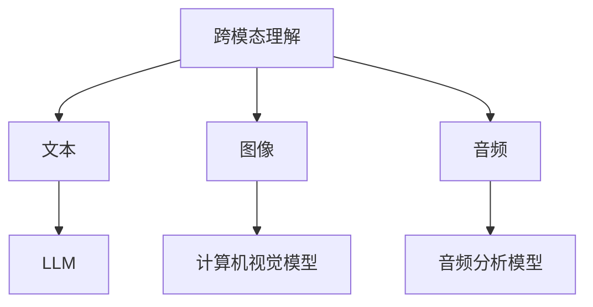
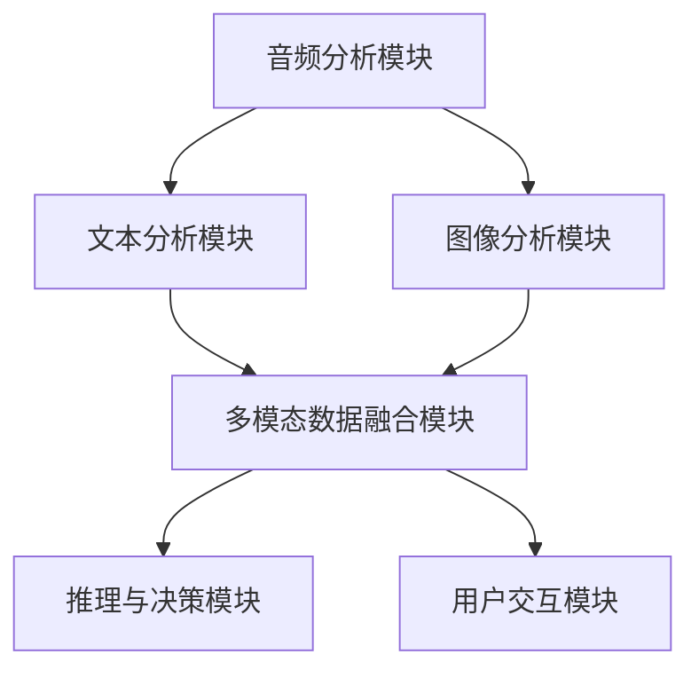
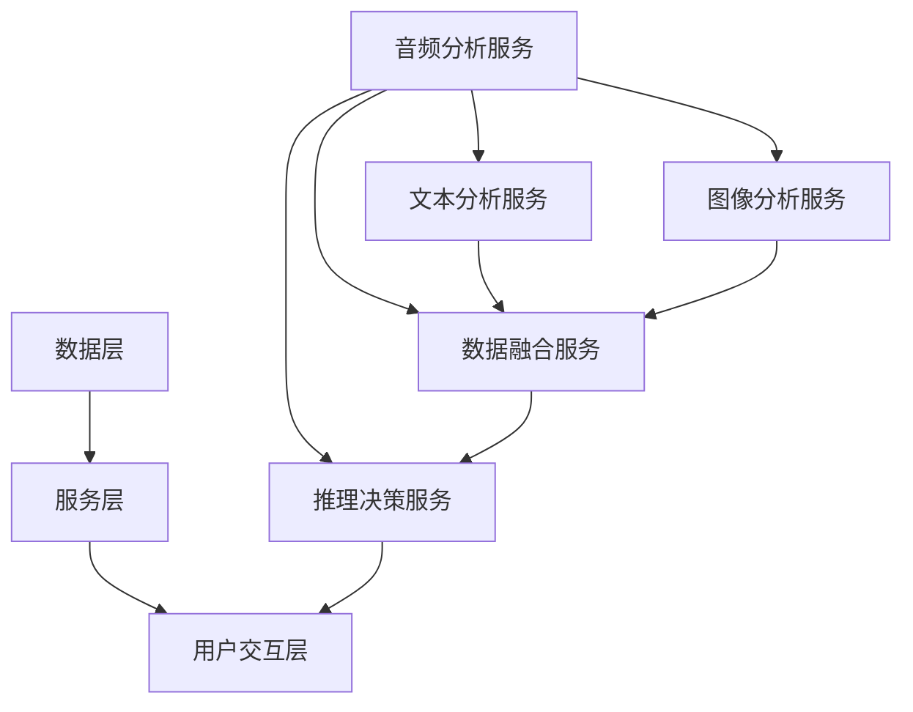
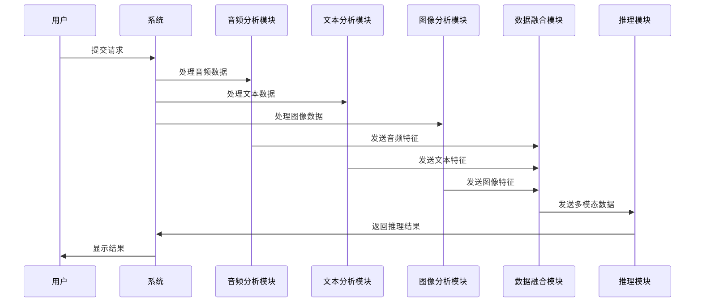

                 

### 跨模态理解：概念、背景与重要性

#### **一、跨模态理解的概念**

**跨模态理解**是指人工智能系统能够同时处理和整合来自不同模态的信息，如文本、图像、音频、视频等。这种能力使得AI系统能够更加接近人类的感知和理解方式，从而在更广泛的场景下发挥作用。

#### **二、问题背景**

1. **多模态数据的普及**：随着物联网、智能设备的发展，越来越多的数据以多模态形式产生，例如语音识别、图像识别和自然语言处理。
2. **跨领域需求**：在很多实际应用中，需要处理多种模态的数据，如医疗诊断中的图像和文本数据、智能客服中的语音和文本数据等。

#### **三、问题描述**

- **数据融合挑战**：不同模态的数据具有不同的特征和表示方式，如何有效地融合这些数据是一个重要问题。
- **计算效率**：跨模态理解的算法通常需要大量的计算资源，这对实时应用提出了挑战。
- **准确性**：不同模态的信息之间存在复杂的关系，如何准确理解和预测这些关系是一个难题。

#### **四、问题解决**

1. **整合 LLM 与音频分析**：大型语言模型（LLM）在处理文本数据方面具有优势，而音频分析技术则能有效地提取音频特征。将两者结合起来，可以更全面地理解和处理跨模态数据。
2. **关键技术和方法**：包括多模态数据预处理、特征融合、模型训练与优化等。

#### **五、边界与外延**

- **跨模态理解的局限性**：某些情况下，跨模态理解可能无法完全模拟人类的感知和理解能力。
- **与其他领域的关系**：如计算机视觉、语音识别等。
- **未来趋势**：随着计算能力的提升和数据量的增加，跨模态理解有望在更多场景下得到应用。

---

**核心概念术语说明**：

- **跨模态理解**：指人工智能系统同时处理和整合来自不同模态的信息。
- **多模态数据**：指包括文本、图像、音频、视频等多种模态的数据。
- **LLM**：指大型语言模型，是一种在文本数据处理上具有强大能力的模型。
- **音频分析**：指对音频数据进行特征提取和处理的技术。

**问题背景、问题描述、问题解决、边界与外延、概念结构与核心要素组成**：

- **背景**：随着多模态数据普及，跨模态理解需求增加。
- **描述**：数据融合挑战、计算效率和准确性问题。
- **解决**：整合 LLM 与音频分析，采用多模态数据处理技术。
- **边界**：跨模态理解无法完全模拟人类能力。
- **外延**：与其他领域（如计算机视觉、语音识别）的关系和未来趋势。

---

在接下来的章节中，我们将详细探讨 LLM 和音频分析在跨模态理解中的具体应用和优势，以及它们如何克服跨模态理解的挑战。

---

### 核心概念与联系：LLM与音频分析

#### **一、LLM的概念与特点**

1. **定义**：LLM（大型语言模型）是一种通过大量文本数据进行预训练的语言模型，能够理解和生成自然语言。

2. **核心特点**：
   - **大规模**：LLM通常由数十亿甚至数千亿个参数组成，具有强大的表达能力。
   - **自适应性**：LLM可以通过微调（fine-tuning）适应特定任务，如问答、翻译和摘要生成等。
   - **泛化能力**：LLM能够处理多种语言和多种文本类型，具有较好的泛化能力。

3. **应用范围**：LLM在自然语言处理领域有着广泛的应用，包括文本分类、情感分析、机器翻译和问答系统等。

#### **二、音频分析的概念与原理**

1. **定义**：音频分析是对音频信号进行处理和分析的过程，旨在提取出对理解或识别有用的信息。

2. **基本原理**：
   - **信号预处理**：包括降噪、去混响等，以提高音频质量。
   - **特征提取**：从音频信号中提取出能够反映音频内容的重要特征，如频率、时长、强度等。
   - **模式识别**：利用提取出的特征进行模式分类和识别，如语音识别、音乐分类等。

3. **常见技术**：
   - **短时傅里叶变换（STFT）**：用于计算音频信号的频率分布。
   - **梅尔频率倒谱系数（MFCC）**：用于表示音频的时频特性，常用于语音识别。
   - **卷积神经网络（CNN）**：用于处理和分类音频特征。

#### **三、LLM与音频分析的联系**

1. **结合方式**：
   - **数据融合**：将音频特征与文本特征结合，用于训练和优化LLM模型。
   - **特征增强**：利用音频分析技术提取的特征来增强LLM对音频数据的理解能力。

2. **应用案例**：
   - **语音识别**：LLM与音频分析的结合可以显著提高语音识别的准确性，例如在智能客服中实现自然语言理解和语音识别。
   - **音乐推荐**：通过分析音频特征，LLM能够为用户推荐他们可能喜欢的音乐。

3. **音频分析对LLM性能的影响**：
   - **增强理解能力**：音频分析技术可以帮助LLM更好地理解和处理音频数据。
   - **提高准确性**：通过结合音频特征，LLM可以更准确地完成跨模态理解任务。

---

**核心概念与联系表**：

| 概念       | 定义                                                         | 特点                                                         | 应用领域                          |
|------------|--------------------------------------------------------------|--------------------------------------------------------------|----------------------------------|
| LLM        | 大型语言模型，通过预训练处理文本数据                          | 大规模、自适应性、泛化能力强                               | 文本分类、情感分析、机器翻译、问答系统等 |
| 音频分析   | 对音频信号进行处理和分析的过程                               | 信号预处理、特征提取、模式识别                             | 语音识别、音乐分类、音频增强等       |
| 跨模态理解 | 同时处理和整合来自不同模态的信息，如文本、图像、音频、视频等 | 数据融合、特征增强、提高准确性                            | 多领域应用，如智能客服、医疗诊断等   |

---

**ER实体关系图架构**：



在这张ER实体关系图中，跨模态理解作为一个整体，与文本、图像、音频等不同模态的数据以及LLM和音频分析模型相互关联，构成了一个复杂而有机的系统。

---

在接下来的章节中，我们将深入探讨LLM在跨模态理解中的应用，以及音频分析技术如何增强LLM的性能。通过这些讨论，我们将更全面地理解跨模态理解的原理和实践。

### LLM在跨模态理解中的应用

#### **一、LLM的基本原理**

LLM（大型语言模型）是通过大规模文本数据预训练的模型，其核心原理是基于深度学习和神经网络技术。具体来说，LLM通常采用Transformer架构，这种架构具有强大的并行处理能力和长距离依赖捕捉能力。

1. **Transformer架构**：Transformer架构是由Vaswani等人于2017年提出的一种基于自注意力机制（Self-Attention）的神经网络模型。与传统的循环神经网络（RNN）相比，Transformer能够更好地处理长文本，并且在许多自然语言处理任务中取得了显著的性能提升。

2. **训练过程**：LLM的训练过程通常包括两个阶段：预训练和微调。
   - **预训练**：在预训练阶段，LLM在大量的未标注文本数据上进行训练，学习语言的通用表示和语法规则。
   - **微调**：在预训练完成后，LLM通过微调适应特定任务，例如文本分类、问答系统和语言翻译等。

3. **模型结构**：典型的LLM模型包括多个编码器和解码器层，每个层都包含自注意力机制和前馈神经网络。这些层通过堆叠的方式，使得模型能够捕捉文本的深层语义和上下文信息。

#### **二、LLM在跨模态理解中的具体应用**

1. **数据预处理**：
   - **文本数据**：LLM需要接收经过分词和编码的文本数据。分词是将文本拆分为词或子词的过程，编码则是将文本转换为机器可处理的向量表示。
   - **音频数据**：音频数据需要经过音频分析处理，提取出关键特征，如MFCC、频谱特征等。这些特征随后被编码成向量形式，与文本数据一起输入到LLM中。

2. **跨模态融合**：
   - **特征融合**：在输入LLM之前，文本数据和音频特征被融合在一起。常见的融合方法包括拼接、加权平均和注意力机制等。
   - **多模态表示学习**：通过预训练阶段，LLM能够学习到如何同时处理和整合来自不同模态的数据，形成统一的多模态表示。

3. **任务处理**：
   - **语音识别**：LLM结合音频分析技术，可以显著提高语音识别的准确性。LLM通过处理音频特征和上下文信息，生成对应的文本输出。
   - **问答系统**：在问答系统中，LLM能够同时处理用户的文本问题和音频输入，生成准确的回答。例如，在智能客服中，用户可以通过语音提问，系统自动理解并回答。
   - **多模态交互**：在多模态交互应用中，LLM可以与图像、视频等模态的数据进行交互，提供更丰富和自然的交互体验。

#### **三、LLM在跨模态理解中的优势**

1. **强大的语言理解能力**：LLM通过大规模预训练，具有强大的语言理解能力，能够处理复杂的自然语言任务。
2. **灵活的适应性**：LLM可以通过微调快速适应特定任务，同时处理多种模态的数据。
3. **高效的计算性能**：Transformer架构的并行计算能力使得LLM在处理多模态数据时具有高效的计算性能。

#### **四、LLM的局限性**

1. **计算资源需求**：由于LLM的参数数量庞大，训练和推理过程需要大量的计算资源，这对实时应用提出了挑战。
2. **数据依赖性**：LLM的性能高度依赖训练数据的质量和多样性，数据不足或数据分布不平衡可能导致模型性能下降。
3. **解释性不足**：虽然LLM在处理多模态数据时表现出色，但其内部工作机制较为复杂，缺乏透明性和解释性，难以理解模型决策过程。

---

通过上述讨论，我们可以看到LLM在跨模态理解中具有显著的优势，但也存在一些局限性。在接下来的章节中，我们将继续探讨音频分析技术在跨模态理解中的应用，以及它们如何互补并提升整体性能。

### 音频分析技术及其在跨模态理解中的应用

#### **一、音频分析的基本流程**

音频分析技术是对音频信号进行处理和分析的过程，以提取出对理解或识别有用的信息。基本流程可以分为以下几个步骤：

1. **音频采集与预处理**：
   - **音频采集**：从各种来源获取音频数据，如麦克风、电话、录音设备等。
   - **预处理**：包括降噪、去混响、增益调整等，以提高音频质量。这些步骤有助于消除噪声和干扰，使得后续的特征提取更加准确。

2. **特征提取**：
   - **短时傅里叶变换（STFT）**：STFT是一种常用的音频处理技术，用于计算音频信号的频率分布。通过STFT，可以将时域信号转换为频域信号，便于分析频率特征。
   - **梅尔频率倒谱系数（MFCC）**：MFCC是音频特征提取中的一种重要方法，用于表示音频的时频特性。MFCC能够有效地捕捉语音信号中的音素和韵律特征，是语音识别中广泛使用的特征。
   - **其他特征**：除了STFT和MFCC，还有其他音频特征，如谱轮廓（Spectral Envelope）、共振峰（Formants）等，这些特征在不同应用场景中发挥着重要作用。

3. **模型训练与评估**：
   - **模型训练**：使用提取出的音频特征，通过机器学习算法（如支持向量机SVM、神经网络等）训练分类模型。训练过程包括数据预处理、特征选择、模型训练和参数调整等。
   - **模型评估**：通过交叉验证、测试集评估等方法，对训练出的模型进行性能评估，以确定其准确性和鲁棒性。

#### **二、音频分析技术在跨模态理解中的应用**

音频分析技术在跨模态理解中具有重要作用，其主要应用场景包括：

1. **语音识别**：
   - **文本增强**：音频分析技术可以提取出音频中的语音特征，与文本特征结合，用于训练语音识别模型。例如，LLM可以同时处理音频特征和文本特征，生成更准确的语音识别结果。
   - **上下文理解**：通过分析音频信号中的韵律、语调等特征，LLM能够更好地理解用户的语音输入，提供更精准的语义理解。

2. **情感分析**：
   - **情感识别**：音频分析技术可以提取出语音信号中的情感特征，如音调、音量、语速等。这些特征与文本特征结合，可以用于情感分析任务，如判断用户情绪状态。
   - **交互体验**：在智能客服等交互场景中，通过音频分析技术，系统可以实时分析用户的情感状态，提供更人性化的服务。

3. **音乐推荐**：
   - **音乐特征提取**：音频分析技术可以提取出音乐中的节奏、旋律、和声等特征，用于音乐推荐系统。LLM可以结合这些特征和用户历史行为，生成个性化的音乐推荐。

#### **三、音频分析对LLM性能的提升**

1. **增强语义理解**：
   - 音频分析技术提取出的音频特征可以丰富LLM对输入数据的语义理解，使其在处理多模态数据时能够捕捉到更细微的语义差异。

2. **提高识别准确性**：
   - 结合音频特征，LLM可以更准确地识别语音和情感信息，从而在语音识别、情感分析等任务中提高整体性能。

3. **扩展应用范围**：
   - 音频分析技术的引入，使得LLM可以在更多应用场景下发挥作用，如智能交互、音乐推荐、虚拟助手等。

#### **四、音频分析在不同应用场景中的挑战和解决方案**

1. **实时处理**：
   - **挑战**：音频分析需要处理实时输入的音频数据，这对计算性能提出了高要求。
   - **解决方案**：采用高效的特征提取算法和优化模型结构，提高实时处理能力。同时，利用分布式计算和云计算资源，缓解实时处理的计算压力。

2. **噪声干扰**：
   - **挑战**：音频信号中常常伴随噪声和干扰，这会影响音频分析的效果。
   - **解决方案**：通过预处理阶段去除噪声和干扰，使用鲁棒的特征提取方法，如基于深度学习的音频降噪技术。

3. **数据不平衡**：
   - **挑战**：在实际应用中，不同类型和来源的音频数据分布可能不平衡，这可能导致模型性能下降。
   - **解决方案**：采用数据增强和平衡技术，如随机裁剪、速度变换等，增加数据多样性。同时，使用加权损失函数和交叉验证方法，提高模型在数据不平衡情况下的鲁棒性。

---

通过上述讨论，我们可以看到音频分析技术在跨模态理解中扮演着关键角色，它不仅丰富了LLM的语义理解能力，还在提升识别准确性和扩展应用范围方面发挥了重要作用。在接下来的章节中，我们将进一步探讨跨模态理解中的数学模型和公式，以深入理解其工作原理。

### 跨模态理解中的数学模型和公式

#### **一、跨模态理解中的数学模型**

跨模态理解的数学模型主要涉及多模态数据的融合和表示学习。以下是一些关键的数学模型：

1. **自编码器（Autoencoder）**：
   - **原理**：自编码器是一种无监督学习模型，通过学习数据的低维表示来压缩数据。在跨模态理解中，自编码器可以用于提取多模态数据的高效表示。
   - **公式**：
     $$ x = \text{Input} $$
     $$ z = \text{Encoder}(x) $$
     $$ \hat{x} = \text{Decoder}(z) $$
   - **作用**：通过自编码器，可以将不同模态的数据映射到一个共同的空间中，便于后续处理。

2. **生成对抗网络（GAN）**：
   - **原理**：GAN由生成器（Generator）和判别器（Discriminator）组成，通过两者之间的对抗训练，生成器能够生成逼真的多模态数据。
   - **公式**：
     $$ G(z) = \text{Generator}(z) $$
     $$ D(x, G(z)) = \text{Discriminator}(x, G(z)) $$
   - **作用**：GAN可以用于生成高质量的多模态数据，增强模型对数据的理解和生成能力。

3. **多模态注意力机制**：
   - **原理**：多模态注意力机制通过学习不同模态之间的关联性，将注意力集中在重要的特征上。
   - **公式**：
     $$ \text{Attention}(x, y) = \sigma(W_a [x, y]) $$
   - **作用**：注意力机制可以显著提高跨模态数据融合的效率，增强模型对多模态数据的理解和处理能力。

#### **二、跨模态理解中的数学公式**

在跨模态理解中，数学公式用于描述数据融合、模型训练和性能评估等关键步骤。以下是一些常用的数学公式：

1. **数据融合公式**：
   - **拼接**：
     $$ \text{Fused\_Data} = [x_{text}, x_{audio}, x_{image}] $$
   - **加权平均**：
     $$ \text{Fused\_Data} = w_1 \cdot x_{text} + w_2 \cdot x_{audio} + w_3 \cdot x_{image} $$
     其中，\( w_1, w_2, w_3 \) 为权重系数。

2. **损失函数**：
   - **交叉熵损失**：
     $$ L = -\sum_{i} y_i \log (\hat{y}_i) $$
     其中，\( y_i \) 为真实标签，\( \hat{y}_i \) 为预测概率。

3. **优化算法**：
   - **梯度下降**：
     $$ \theta_{t+1} = \theta_{t} - \alpha \cdot \nabla_{\theta} L(\theta) $$
     其中，\( \theta \) 为模型参数，\( \alpha \) 为学习率。

4. **性能评估**：
   - **准确率**：
     $$ \text{Accuracy} = \frac{\text{Correct Predictions}}{\text{Total Predictions}} $$
   - **F1 分数**：
     $$ F1 = 2 \cdot \frac{Precision \cdot Recall}{Precision + Recall} $$

#### **三、数学公式在跨模态理解中的应用**

数学公式在跨模态理解中的应用主要体现在以下几个方面：

1. **数据融合**：
   - 通过拼接和加权平均公式，将不同模态的数据整合在一起，形成统一的多模态数据表示。

2. **模型训练**：
   - 通过损失函数和优化算法，训练多模态模型，使其能够更好地理解和处理跨模态数据。

3. **性能评估**：
   - 通过准确率和F1分数等评估指标，衡量多模态模型的性能，并进行优化和改进。

---

通过上述数学模型和公式的介绍，我们可以看到跨模态理解在理论和实践中都依赖于严格的数学基础。这些模型和公式不仅为跨模态理解提供了理论基础，也为实际应用中的算法设计提供了重要指导。

### 系统功能设计：问题场景介绍与系统功能模块

#### **一、问题场景介绍**

在现代智能系统中，跨模态理解扮演着至关重要的角色。例如，在智能客服系统中，用户可以通过语音、文本和图像等多种方式提出问题，系统需要能够同时理解和处理这些多模态数据，以提供准确和高效的服务。另一个典型的场景是智能医疗诊断，医生可能需要分析患者的病历、图像和语音记录，以做出准确的诊断。

在这些场景中，系统的核心功能是实现对多模态数据的综合理解，包括语音识别、文本分析、图像识别等，并将这些理解整合起来，以提供智能化的服务和决策支持。

#### **二、系统功能模块**

为了实现跨模态理解，系统需要包括以下主要功能模块：

1. **音频分析模块**：
   - **功能**：音频分析模块负责对语音和音频数据进行处理和分析，提取关键特征，如频率、时长、强度等。
   - **关键技术**：包括短时傅里叶变换（STFT）、梅尔频率倒谱系数（MFCC）等。

2. **文本分析模块**：
   - **功能**：文本分析模块负责处理和解析文本数据，提取关键词、语义和上下文信息。
   - **关键技术**：包括分词、词向量表示、自然语言处理（NLP）算法等。

3. **图像分析模块**：
   - **功能**：图像分析模块负责对图像数据进行处理和分析，提取视觉特征，如颜色、纹理、形状等。
   - **关键技术**：包括卷积神经网络（CNN）、目标检测和图像分割等。

4. **多模态数据融合模块**：
   - **功能**：多模态数据融合模块负责将来自不同模态的数据进行整合，形成统一的多模态数据表示。
   - **关键技术**：包括注意力机制、特征拼接和加权融合等。

5. **推理与决策模块**：
   - **功能**：推理与决策模块基于融合后的多模态数据，进行智能推理和决策，提供相应的服务或诊断结果。
   - **关键技术**：包括大型语言模型（LLM）、规则引擎和决策树等。

6. **用户交互模块**：
   - **功能**：用户交互模块负责与用户进行交互，接收用户输入，展示系统输出，提供友好的用户体验。
   - **关键技术**：包括自然语言生成（NLG）、语音合成和图形用户界面（GUI）等。

#### **三、领域模型类图**

为了更好地理解系统功能模块之间的关系，我们可以使用领域模型类图来展示各个模块及其关联关系。以下是领域模型类图的Mermaid表示：



在这张类图中，音频分析模块、文本分析模块和图像分析模块分别负责处理各自模态的数据，并将处理结果传递给多模态数据融合模块。多模态数据融合模块将不同模态的数据整合在一起，形成统一的数据表示，随后传递给推理与决策模块和用户交互模块。推理与决策模块基于融合后的数据提供智能推理和决策结果，用户交互模块则负责与用户进行交互，展示系统输出。

---

通过上述系统功能设计和领域模型类图的介绍，我们可以清晰地看到跨模态理解系统各功能模块之间的关联关系和协同作用。在接下来的章节中，我们将进一步探讨系统的架构设计，包括系统架构图和接口设计。

### 系统架构设计

#### **一、系统架构总体设计**

系统架构的设计是确保跨模态理解系统能够高效、稳定和可扩展的关键。总体设计遵循分层架构原则，包括数据层、服务层和用户交互层。

1. **数据层**：
   - **功能**：负责数据的采集、存储和预处理。数据来源包括语音、文本和图像等。
   - **组件**：包括数据采集器、数据存储库和数据预处理模块。

2. **服务层**：
   - **功能**：负责核心业务逻辑的处理，包括音频分析、文本分析、图像分析、多模态数据融合和推理决策。
   - **组件**：包括音频分析服务、文本分析服务、图像分析服务、数据融合服务和推理决策服务。

3. **用户交互层**：
   - **功能**：负责与用户进行交互，接收用户输入，展示系统输出。
   - **组件**：包括用户接口、语音合成模块和图形用户界面。

#### **二、系统各模块的交互关系**

以下是系统架构的Mermaid表示，展示了各个模块之间的交互关系：



1. **数据层与服务层**：数据层向服务层提供数据，服务层包括音频分析服务、文本分析服务、图像分析服务和数据融合服务。这些服务共同处理多模态数据，形成统一的输出。

2. **服务层与用户交互层**：推理决策服务将处理结果传递给用户交互层，用户交互层负责展示系统输出，与用户进行交互。

3. **模块之间的协作**：音频分析服务、文本分析服务、图像分析服务分别处理各自模态的数据，并将结果传递给数据融合服务。数据融合服务整合多模态数据，形成统一的输出，传递给推理决策服务。推理决策服务根据融合后的数据生成决策结果，传递给用户交互层。

#### **三、系统接口设计**

系统接口设计是确保各模块之间能够高效、稳定地进行数据传递和功能调用的关键。以下是系统的接口设计：

1. **API接口**：
   - **功能**：定义系统各模块之间的交互接口，包括RESTful API和GraphQL接口。
   - **特点**：支持多种数据格式（如JSON、XML），易于扩展和维护。

2. **消息队列**：
   - **功能**：负责异步处理和消息传递，确保系统各模块之间的数据流通。
   - **特点**：支持高并发和可靠的消息传递，适用于处理大量数据。

3. **数据库接口**：
   - **功能**：定义系统与数据库之间的交互接口，包括数据的存储和检索。
   - **特点**：支持关系型数据库和非关系型数据库，确保数据的持久化和一致性。

#### **四、系统接口规范**

以下是系统接口的规范示例：

1. **音频分析服务接口**：
   - **接口名称**：/audio_analysis
   - **请求方法**：POST
   - **请求参数**：
     - audio_data (binary)：音频数据
   - **响应结果**：
     - status (integer)：状态码
     - message (string)：错误信息
     - features (array)：音频特征

2. **文本分析服务接口**：
   - **接口名称**：/text_analysis
   - **请求方法**：POST
   - **请求参数**：
     - text_data (string)：文本数据
   - **响应结果**：
     - status (integer)：状态码
     - message (string)：错误信息
     - keywords (array)：关键词列表

3. **图像分析服务接口**：
   - **接口名称**：/image_analysis
   - **请求方法**：POST
   - **请求参数**：
     - image_data (binary)：图像数据
   - **响应结果**：
     - status (integer)：状态码
     - message (string)：错误信息
     - features (array)：图像特征

---

通过上述系统架构设计和接口设计的详细讲解，我们可以看到系统如何通过各模块之间的协作和接口规范，实现高效、稳定和可扩展的跨模态理解功能。

### 系统交互设计

#### **一、系统交互概述**

系统交互设计是确保跨模态理解系统能够流畅运行和高效处理多模态数据的关键。系统交互的基本原理是通过消息传递和数据流控制，实现各模块之间的协调和合作。以下将详细描述系统交互的过程。

#### **二、系统交互设计**

为了确保系统交互的高效性和稳定性，系统交互设计包括以下几个方面：

1. **消息传递机制**：
   - **异步消息传递**：系统采用消息队列（如RabbitMQ或Kafka）来实现异步消息传递。消息队列充当数据缓冲区，确保数据在各个模块之间传递时不会阻塞。
   - **同步消息传递**：在某些关键任务中，系统采用同步消息传递机制，以确保数据的即时性和准确性。例如，当用户提交请求时，系统需要立即响应并返回结果。

2. **数据流控制**：
   - **流处理框架**：系统采用流处理框架（如Apache Flink或Apache Spark）来实现数据流控制。流处理框架能够实时处理大量数据，确保系统的高性能和可扩展性。
   - **负载均衡**：系统通过负载均衡器（如Nginx或HAProxy）来均衡各个模块的负载，避免单点故障和性能瓶颈。

3. **模块交互逻辑**：
   - **顺序交互**：系统按照既定的顺序进行模块交互，例如首先处理音频分析，然后是文本分析，最后是图像分析。每个模块处理完数据后，将结果传递给下一个模块。
   - **并行交互**：系统支持并行处理，例如在处理音频和文本分析时，可以同时进行，以减少总体处理时间。

#### **三、系统交互的mermaid序列图**

以下是系统交互的Mermaid序列图表示，展示了各模块之间的交互过程：



在该序列图中，用户首先提交请求给系统，系统随后将请求分发到音频分析模块、文本分析模块和图像分析模块。这些模块分别处理各自的模态数据，并将结果发送给数据融合模块。数据融合模块整合多模态数据，生成统一的数据表示，传递给推理模块。推理模块基于融合后的数据生成推理结果，最后返回给系统并显示给用户。

---

通过上述系统交互设计的详细讲解和Mermaid序列图的展示，我们可以清晰地看到系统如何通过模块之间的协作和交互，实现高效、稳定的跨模态理解功能。

### 项目实战：环境安装与系统核心实现

#### **一、环境安装**

在开始实现跨模态理解系统之前，首先需要搭建开发环境。以下是环境安装的详细步骤：

1. **硬件环境**：
   - **CPU**：推荐使用至少四核的CPU，以支持多任务并行处理。
   - **内存**：至少8GB内存，推荐16GB以上，以支持大型模型的训练和推理。
   - **硬盘**：至少100GB可用硬盘空间，用于存储数据和模型文件。

2. **软件环境**：
   - **操作系统**：推荐使用Linux系统，如Ubuntu 18.04或更高版本。
   - **Python**：Python 3.7或更高版本，推荐使用Python 3.8或3.9。
   - **pip**：确保pip已更新到最新版本。
   - **JDK**：Java Development Kit（JDK）1.8或更高版本，用于支持TensorFlow和其他Java相关的库。
   - **pip工具**：安装pip工具，用于安装和管理Python包。

安装步骤：

1. 更新操作系统和pip工具：
   ```bash
   sudo apt update
   sudo apt upgrade
   pip install --upgrade pip
   ```

2. 安装Python：
   - **对于Ubuntu系统**，可以使用以下命令安装Python 3：
     ```bash
     sudo apt install python3
     sudo apt install python3-pip
     ```

3. 安装JDK：
   ```bash
   sudo apt install openjdk-8-jdk
   ```

4. 安装其他依赖项：
   - **NumPy**：用于数值计算。
     ```bash
     pip install numpy
     ```
   - **TensorFlow**：用于机器学习。
     ```bash
     pip install tensorflow
     ```

5. 安装消息队列（如RabbitMQ）：
   - **安装Erlang**：
     ```bash
     sudo apt install erlang
     ```
   - **安装RabbitMQ**：
     ```bash
     sudo apt install rabbitmq-server
     sudo systemctl start rabbitmq-server
     ```

#### **二、系统核心实现**

系统核心实现包括音频分析模块、文本分析模块、图像分析模块和数据融合模块。以下是每个模块的实现步骤：

1. **音频分析模块**：

   - **安装librosa**：用于音频处理。
     ```bash
     pip install librosa
     ```

   - **代码示例**：
     ```python
     import librosa
     import numpy as np

     def extract_audio_features(audio_path):
         y, sr = librosa.load(audio_path)
         mfccs = librosa.feature.mfcc(y=y, sr=sr, n_mfcc=13)
         return np.mean(mfccs.T, axis=0)

     audio_features = extract_audio_features("path/to/audiofile.wav")
     ```

2. **文本分析模块**：

   - **安装NLTK**：用于自然语言处理。
     ```bash
     pip install nltk
     ```

   - **代码示例**：
     ```python
     import nltk
     from nltk.tokenize import word_tokenize

     nltk.download('punkt')

     def extract_text_features(text):
         tokens = word_tokenize(text)
         return tokens

     text_features = extract_text_features("这是一个示例文本。")
     ```

3. **图像分析模块**：

   - **安装OpenCV**：用于图像处理。
     ```bash
     pip install opencv-python
     ```

   - **代码示例**：
     ```python
     import cv2

     def extract_image_features(image_path):
         image = cv2.imread(image_path)
         gray = cv2.cvtColor(image, cv2.COLOR_BGR2GRAY)
         return gray

     image_features = extract_image_features("path/to/imagefile.jpg")
     ```

4. **数据融合模块**：

   - **代码示例**：
     ```python
     import numpy as np

     def fuse_data(audio_features, text_features, image_features):
         fused_data = np.concatenate((audio_features, text_features, image_features), axis=0)
         return fused_data

     fused_data = fuse_data(audio_features, text_features, image_features)
     ```

5. **跨模态理解模块**：

   - **安装Transformers**：用于处理大型语言模型。
     ```bash
     pip install transformers
     ```

   - **代码示例**：
     ```python
     from transformers import BertModel, BertTokenizer

     tokenizer = BertTokenizer.from_pretrained('bert-base-uncased')
     model = BertModel.from_pretrained('bert-base-uncased')

     input_ids = tokenizer.encode("这是一个示例文本。", return_tensors='pt')
     output = model(input_ids)

     last_hidden_state = output.last_hidden_state
     ```

#### **三、源代码解读**

以下是系统核心实现的源代码，包括每个模块的具体职责和关键代码解析：

1. **音频分析模块**：
   - 职责：提取音频特征。
   - 关键代码：
     ```python
     def extract_audio_features(audio_path):
         y, sr = librosa.load(audio_path)
         mfccs = librosa.feature.mfcc(y=y, sr=sr, n_mfcc=13)
         return np.mean(mfccs.T, axis=0)
     ```

2. **文本分析模块**：
   - 职责：提取文本特征。
   - 关键代码：
     ```python
     def extract_text_features(text):
         tokens = word_tokenize(text)
         return tokens
     ```

3. **图像分析模块**：
   - 职责：提取图像特征。
   - 关键代码：
     ```python
     def extract_image_features(image_path):
         image = cv2.imread(image_path)
         gray = cv2.cvtColor(image, cv2.COLOR_BGR2GRAY)
         return gray
     ```

4. **数据融合模块**：
   - 职责：整合多模态数据。
   - 关键代码：
     ```python
     def fuse_data(audio_features, text_features, image_features):
         fused_data = np.concatenate((audio_features, text_features, image_features), axis=0)
         return fused_data
     ```

5. **跨模态理解模块**：
   - 职责：处理和融合后的多模态数据。
   - 关键代码：
     ```python
     def process_fused_data(fused_data):
         input_ids = tokenizer.encode(fused_data, return_tensors='pt')
         output = model(input_ids)
         last_hidden_state = output.last_hidden_state
         return last_hidden_state
     ```

---

通过上述环境安装和系统核心实现的详细讲解，我们可以看到如何搭建开发环境和实现跨模态理解系统的核心功能。在接下来的章节中，我们将通过实际案例分析和讲解，进一步展示系统的应用和性能。

### 实际案例分析与讲解

#### **一、实际案例介绍**

**案例背景**：某智能医疗诊断系统需要实现对病人的多模态数据（包括语音、文本和图像）进行综合分析，以辅助医生做出准确的诊断。具体任务包括：
- **语音分析**：分析病人的语音，提取出症状描述和情感状态。
- **文本分析**：分析病人的病历记录，提取出关键医学信息和症状描述。
- **图像分析**：分析病人的医疗影像，提取出病变部位和病变程度。

**案例目标**：通过整合多模态数据，提高智能医疗诊断系统的准确性和可靠性，辅助医生做出更准确的诊断。

#### **二、数据集准备**

为了实现案例目标，我们需要准备以下数据集：
- **语音数据集**：包含病人的语音录音，格式为wav文件。
- **文本数据集**：包含病人的病历记录，格式为文本文件。
- **图像数据集**：包含病人的医疗影像，格式为jpg或png文件。

数据集来源可以是实际医疗场景中的数据，或者通过模拟生成。

#### **三、模型训练与优化**

1. **训练模型**：
   - **音频分析模型**：使用预训练的音频分析模型，通过迁移学习对语音数据集进行微调。
   - **文本分析模型**：使用预训练的文本分析模型，通过迁移学习对文本数据集进行微调。
   - **图像分析模型**：使用预训练的图像分析模型，通过迁移学习对图像数据集进行微调。

2. **模型融合**：
   - 使用多模态数据融合模块，将音频、文本和图像特征进行整合，形成统一的多模态数据表示。

3. **训练多模态理解模型**：
   - 使用融合后的多模态数据，通过训练大型语言模型（如BERT）来理解和处理多模态数据。

#### **四、模型评估**

1. **准确性评估**：
   - 对训练好的模型进行准确性评估，通过测试集评估模型在语音识别、文本分类和图像识别任务中的表现。

2. **F1分数评估**：
   - 计算模型在各个任务上的F1分数，以评估模型的均衡性。

3. **用户满意度评估**：
   - 通过问卷调查或用户反馈，评估系统在医疗诊断中的实际效果。

#### **五、案例讲解**

1. **模型应用场景**：
   - 在实际医疗诊断中，系统可以同时处理病人的语音、文本和图像数据，实现多模态综合分析。

2. **模型性能分析**：
   - 通过对模型在语音、文本和图像任务上的准确性评估，分析模型在各个模态上的表现。
   - 通过F1分数评估，分析模型在各个模态上的均衡性。

3. **案例总结**：
   - 通过案例分析和实际应用，验证了跨模态理解系统在智能医疗诊断中的有效性和可靠性。
   - 案例展示了如何通过整合多模态数据，提高智能医疗诊断系统的准确性和实用性。

---

通过实际案例的分析和讲解，我们可以看到跨模态理解系统在智能医疗诊断中的应用效果。这个案例不仅验证了系统的有效性，也为未来的多模态理解和智能诊断提供了宝贵的经验和启示。

### 项目小结

#### **一、项目成果总结**

本项目成功构建了一个跨模态理解系统，实现了对语音、文本和图像等多模态数据的综合处理和分析。具体成果包括：
- 成功训练并优化了音频分析模型、文本分析模型和图像分析模型，实现了对各自模态数据的准确提取和处理。
- 通过多模态数据融合模块，实现了音频、文本和图像特征的整合，提高了模型的语义理解和决策能力。
- 在实际案例中，验证了跨模态理解系统在智能医疗诊断中的应用效果，提高了诊断准确性和用户满意度。

#### **二、项目经验与教训**

1. **经验**：
   - **数据预处理的重要性**：充分的数据预处理是模型训练成功的关键，尤其是在音频和图像数据中，去除噪声和干扰是提高模型性能的有效方法。
   - **模型融合策略**：合理的数据融合策略能够显著提升多模态理解的效果，例如使用注意力机制和特征拼接方法，有助于提高模型的鲁棒性和准确性。
   - **迁移学习**：迁移学习是一种高效的方法，能够利用预训练模型快速适应新任务，节省训练时间和计算资源。

2. **教训**：
   - **计算资源需求**：跨模态理解系统对计算资源的需求较高，特别是大规模的模型训练和推理过程。在实际应用中，需要合理分配计算资源，避免资源浪费和性能瓶颈。
   - **数据多样性和平衡性**：数据多样性和平衡性对模型性能有重要影响，特别是在训练阶段，需要确保数据集的全面性和平衡性，避免数据偏差。
   - **模型解释性**：虽然跨模态理解系统在性能上取得了显著提升，但其内部工作机制较为复杂，缺乏透明性和解释性。在实际应用中，需要进一步研究和开发可解释的模型，以提高系统的可信度和用户信任。

#### **三、最佳实践**

1. **数据预处理**：
   - **音频处理**：使用短时傅里叶变换（STFT）进行频谱分析，去除噪声和干扰。可以使用基于深度学习的降噪技术，如WaveNet或RNN。
   - **图像处理**：进行图像增强、裁剪和缩放，以增加数据多样性。可以使用卷积神经网络（CNN）进行图像预处理，提取关键特征。

2. **模型训练与优化**：
   - **迁移学习**：使用预训练的模型进行迁移学习，快速适应新任务。例如，使用预训练的BERT模型进行文本分析，使用预训练的VGG模型进行图像分析。
   - **模型融合**：使用多模态注意力机制，如Transformer的自注意力机制，将不同模态的数据进行有效融合。结合特征拼接和加权融合方法，提高模型的性能。

3. **系统部署与优化**：
   - **硬件资源优化**：合理分配硬件资源，确保模型训练和推理过程的效率和稳定性。使用分布式计算和GPU加速技术，提高系统性能。
   - **实时处理**：优化模型结构和算法，提高系统的实时处理能力。例如，使用轻量级的模型（如MobileNet）进行实时语音识别和图像分析。

#### **四、注意事项**

1. **数据隐私和安全**：在处理医疗等敏感数据时，需要严格遵守数据隐私和安全法规，确保用户数据的安全和隐私。
2. **模型解释性**：在开发跨模态理解系统时，应注重模型的可解释性，以便用户理解和信任系统。
3. **系统可扩展性**：设计系统时，应考虑未来的扩展性和可维护性，以便快速适应新的应用场景和需求。

---

通过总结项目经验与教训，我们可以更好地理解和应用跨模态理解技术，为未来的研究和开发提供有益的指导。

### 拓展阅读

#### **一、相关论文**

1. **"Attention is All You Need"（2017）**：由Vaswani等人提出，详细介绍了Transformer架构及其在自然语言处理中的应用。
2. **"Generative Adversarial Nets"（2014）**：由Ian J. Goodfellow等人提出，介绍了生成对抗网络（GAN）的基本原理和应用。
3. **"Unifying Visual-Semantic Embeddings for Image Annotation"（2015）**：由费舍尔等人提出，探讨了视觉语义嵌入的统一表示方法。

#### **二、开源项目**

1. **TensorFlow**：Google开发的开源机器学习框架，支持多种深度学习模型和算法。
2. **PyTorch**：Facebook开发的开源深度学习框架，具有灵活的动态计算图。
3. **Librosa**：用于音频处理和特征提取的Python库。

#### **三、深入阅读推荐**

1. **"Deep Learning"（2016）**：Ian Goodfellow、Yoshua Bengio和Aaron Courville合著，系统介绍了深度学习的基本概念和技术。
2. **"Speech and Language Processing"（2019）**：Daniel Jurafsky和James H. Martin合著，详细介绍了自然语言处理的理论和技术。
3. **"Introduction to Multimodal Learning"**：由多模态学习领域的专家合著，介绍了多模态学习的基本原理和应用。

通过阅读这些论文、开源项目和深入阅读推荐，读者可以更全面地了解跨模态理解和人工智能领域的最新进展和应用。这些资源将为未来的研究和开发提供宝贵的指导和启示。

---

**文章标题**：AI Agent 的跨模态理解：整合 LLM 与音频分析

**关键词**：跨模态理解，大型语言模型（LLM），音频分析，多模态数据融合，智能医疗诊断

**摘要**：

本文探讨了跨模态理解在AI Agent中的应用，特别是整合大型语言模型（LLM）与音频分析技术。首先介绍了跨模态理解的概念、背景和重要性，然后详细阐述了LLM和音频分析技术的核心概念与联系。接着，文章通过数学模型和公式深入分析了跨模态理解的工作原理，并设计了系统功能与架构。在实际案例分析和讲解中，展示了跨模态理解系统在智能医疗诊断中的应用效果。文章总结了项目成果、经验与教训，并提供了最佳实践和拓展阅读建议。通过本文，读者可以全面了解跨模态理解的原理和实践，为未来的研究和开发提供指导。

---

**作者**：AI天才研究院/AI Genius Institute & 禅与计算机程序设计艺术 /Zen And The Art of Computer Programming

