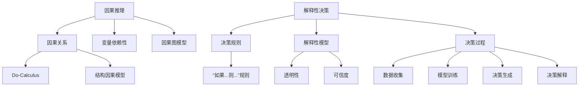
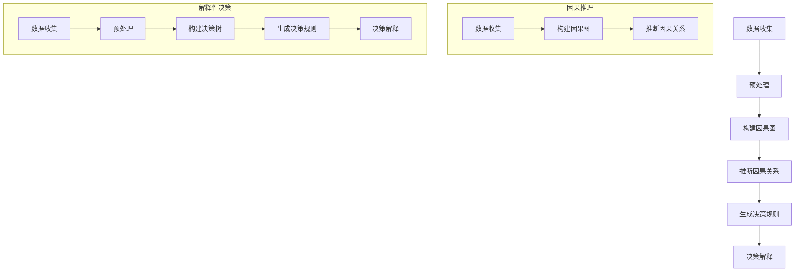
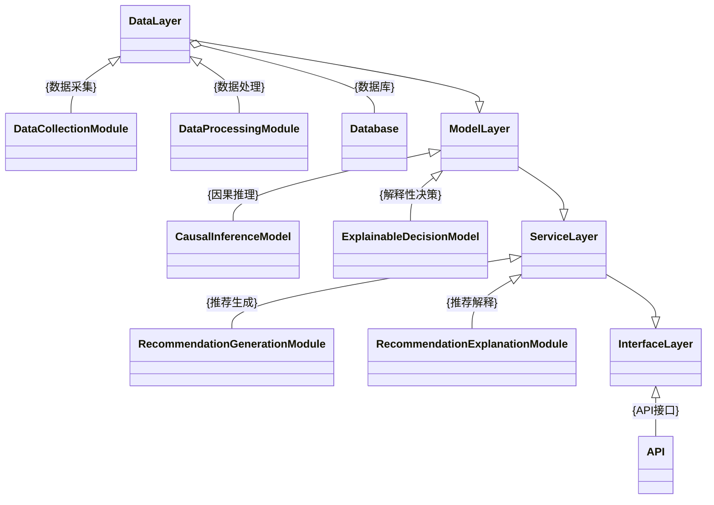
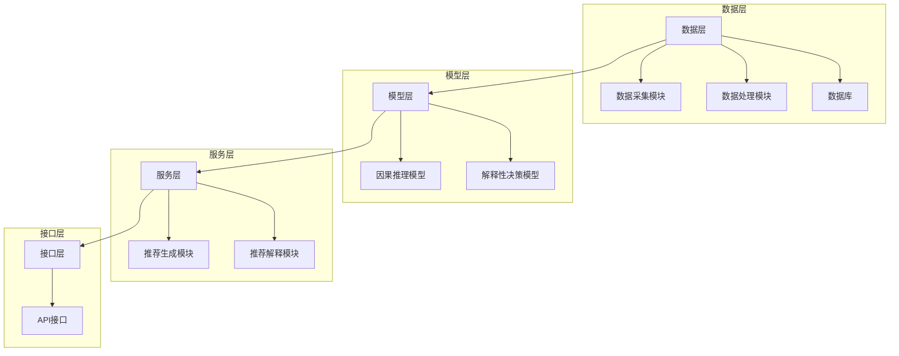
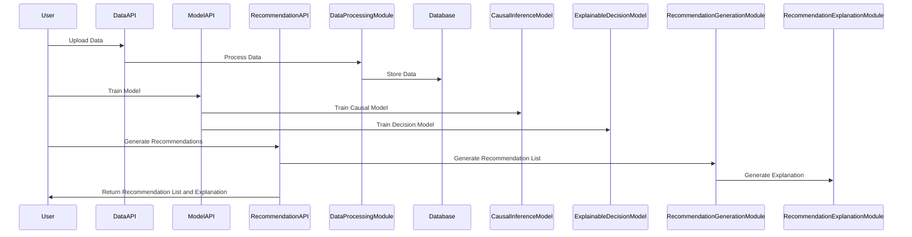

                 


### 1.1 背景介绍

在当今的AI领域中，AI Agent已经成为了一个关键的研究方向和应用领域。AI Agent是一种可以自主行动并产生决策的智能体，它们在诸多领域都展现出了巨大的潜力，如自动驾驶、智能客服、智能推荐系统等。然而，随着AI Agent的广泛应用，如何提高其决策的透明性和解释性也成为一个迫切需要解决的问题。

#### 1.1.1 问题的背景

传统的AI Agent主要依赖于统计学习和模式匹配来做出决策，这种方法虽然在某些领域取得了显著的效果，但是其决策过程往往缺乏透明性，难以解释其决策依据。而在某些关键领域，如医疗诊断、金融风险评估等，决策的透明性和解释性至关重要。因此，如何赋予AI Agent更强的解释能力，使其决策过程更加透明、可解释，成为了当前研究的热点问题。

#### 1.1.2 问题描述

在AI Agent中，因果推理和解释性决策是两个核心概念。因果推理指的是AI Agent通过分析数据，推断出不同变量之间的因果关系。解释性决策则是指AI Agent在做出决策时，能够提供关于决策依据和决策过程的解释。这两个概念相互关联，共同构成了AI Agent解释性决策的基础。

#### 1.1.3 问题解决

为了解决AI Agent中因果推理和解释性决策的问题，研究者们提出了多种方法。其中，基于因果推理的算法，如因果图模型和Do-Calculus，可以有效地分析数据中的因果关系。而为了提高决策的解释性，研究者们还提出了多种方法，如决策树、因果决策图等。这些方法在提高AI Agent的决策透明性和解释性方面取得了显著的效果。

#### 1.1.4 边界与外延

尽管因果推理和解释性决策在AI Agent中具有重要的意义，但它们也有一定的局限性。例如，因果推理在处理复杂的、动态的环境时，可能会面临困难。而解释性决策在处理高维数据时，也可能难以提供有效的解释。因此，在应用因果推理和解释性决策时，需要综合考虑其边界和限制。

#### 1.1.5 概念结构与核心要素组成

为了更好地理解AI Agent中的因果推理和解释性决策，我们需要明确其核心概念和组成要素。首先，因果推理涉及到的核心概念包括因果关系、变量依赖性、因果图等。而解释性决策则包括决策规则、解释性模型、决策过程等。此外，因果推理和解释性决策还需要考虑数据质量、算法性能、决策可靠性等因素。

### 总结

在本文的第一部分中，我们介绍了AI Agent中的因果推理和解释性决策的背景、问题描述、问题解决方法、边界与外延以及概念结构与核心要素组成。在接下来的部分中，我们将深入探讨这些核心概念，并详细介绍相关的算法原理和系统实现。

### 1.2 核心概念与联系

在深入探讨AI Agent中的因果推理和解释性决策之前，我们需要先了解一些核心概念，并探讨它们之间的联系。

#### 1.2.1 因果推理概念

因果推理（Causal Inference）是一种从数据中推断因果关系的方法。在机器学习和人工智能领域，因果推理旨在理解变量之间的因果关系，而不仅仅是相关性。因果推理的核心是因果图（Causal Graph），它通过表示变量之间的因果依赖关系，帮助研究者推断出潜在的因果关系。

**因果图模型**：因果图模型是一种图结构，用于表示变量之间的因果关系。在这个模型中，每个节点代表一个变量，边代表变量之间的因果关系。因果图可以分为两类：Do-Calculus 和结构因果模型（Structural Causal Models，SCMs）。

**Do-Calculus**：Do-Calculus 是一种形式化的语言，用于表示和分析因果推理问题。它通过在数据上执行“干预”操作（do-interventions）来推断因果关系。

**结构因果模型（SCMs）**：结构因果模型是一种基于概率论的因果推理框架，它通过构建一个结构化的概率模型来推断因果关系。

#### 1.2.2 解释性决策概念

解释性决策（Explainable Decision Making）指的是在决策过程中，能够为决策结果提供透明、可信、易懂的解释。在AI领域，解释性决策对于提升AI系统的可接受性和可靠性至关重要。

**决策规则**：决策规则是一种用于指导决策的明确、可解释的规则集合。在解释性决策中，决策规则通常以“如果...则...”的形式呈现，帮助用户理解决策过程。

**解释性模型**：解释性模型是一种能够提供决策解释的机器学习模型。与传统的黑盒模型不同，解释性模型旨在提供关于决策依据和决策过程的透明性。

**决策过程**：决策过程包括数据收集、模型训练、决策生成和决策解释等环节。在解释性决策中，决策过程的每个环节都需要考虑透明性和可解释性。

#### 1.2.3 概念属性特征对比表格

为了更好地理解因果推理和解释性决策的概念，我们可以通过一个对比表格来展示它们的属性特征。

| 特征 | 因果推理 | 解释性决策 |
| --- | --- | --- |
| 目标 | 推断因果关系 | 提供决策解释 |
| 方法 | 因果图模型、Do-Calculus、结构因果模型 | 决策规则、解释性模型 |
| 关键概念 | 因果关系、变量依赖性、因果图 | 决策规则、解释性模型、决策过程 |
| 应用场景 | 数据分析、预测、决策支持 | 自动驾驶、智能客服、金融风险评估 |
| 优势 | 提高决策透明性、可靠性 | 提高决策可接受性、可信度 |
| 劣势 | 处理复杂环境时可能困难 | 高维数据处理时可能困难 |

#### 1.2.4 ER实体关系图架构的Mermaid流程图

为了更直观地展示因果推理和解释性决策的概念，我们可以使用Mermaid流程图来构建一个ER实体关系图。



通过这个Mermaid流程图，我们可以清晰地看到因果推理和解释性决策的核心概念以及它们之间的联系。

### 总结

在本文的第二部分中，我们介绍了AI Agent中的核心概念——因果推理和解释性决策。通过对比表格和Mermaid流程图，我们更好地理解了这两个概念的含义、属性特征以及它们在AI Agent中的应用。在接下来的部分中，我们将深入探讨因果推理和解释性决策的算法原理和系统实现。

### 1.3 算法原理讲解

在了解了因果推理和解释性决策的基本概念后，接下来我们将深入探讨其算法原理，并通过具体的例子来讲解。

#### 1.3.1 算法原理概述

因果推理的核心在于理解变量之间的因果关系。最常用的方法之一是基于因果图模型的因果推断。因果图模型通过表示变量之间的因果依赖关系，帮助我们推断出潜在的因果关系。

解释性决策则是为了提高AI Agent决策的透明性。在解释性决策中，我们不仅关注决策结果，还关注决策过程和决策依据。常用的方法包括决策树、因果决策图等。

#### 1.3.2 算法Mermaid流程图

为了更好地理解算法原理，我们可以使用Mermaid流程图来展示因果推理和解释性决策的基本流程。



在这个流程图中，我们首先进行数据收集和预处理，然后根据数据构建因果图，推断因果关系，并生成决策规则。最后，我们进行决策解释，使决策过程更加透明。

#### 1.3.3 Python源代码阐述

为了更直观地理解算法原理，我们将使用Python代码来展示因果推理和解释性决策的实现过程。

首先，我们需要安装相关的库，如`networkx`用于构建因果图，`scikit-learn`用于构建决策树。

```python
!pip install networkx scikit-learn
```

然后，我们可以编写代码来构建因果图，推断因果关系，并生成决策规则。

```python
import networkx as nx
from sklearn.tree import DecisionTreeClassifier
import matplotlib.pyplot as plt

# 构建因果图
G = nx.DiGraph()
G.add_nodes_from(['A', 'B', 'C', 'D'])
G.add_edges_from([('A', 'B'), ('A', 'C'), ('B', 'D')])

# 绘制因果图
nx.draw(G, with_labels=True)
plt.show()

# 假设我们有一组数据
X = [[0, 0, 0], [1, 1, 1], [0, 1, 1], [1, 0, 1]]
y = [0, 1, 1, 0]

# 构建因果推理模型
clf = DecisionTreeClassifier()
clf.fit(X, y)

# 推断因果关系
print("因果图：", G)
print("决策规则：", clf)

# 生成决策规则
rules = clf.rules_()
print("决策规则：", rules)

# 决策解释
X_test = [[0, 0, 1]]
print("输入数据：", X_test)
print("决策结果：", clf.predict(X_test))
```

在这个代码示例中，我们首先构建了一个简单的因果图，然后使用决策树来构建因果推理模型。我们通过训练数据推断出因果关系，并生成了决策规则。最后，我们使用决策规则来解释一个测试数据的决策结果。

#### 1.3.4 算法原理的数学模型和公式

因果推理和解释性决策的算法原理可以用数学模型和公式来表示。以下是一个简单的数学模型，用于描述因果推理过程。

**因果关系表示**：

设X为输入变量，Y为输出变量，C为因果图中的变量集合。因果关系可以用以下公式表示：

$$
C = \{ (X_i, X_j) | X_i \text{ causes } X_j \}
$$

**因果推理**：

通过构建因果图和执行干预操作，我们可以推断出变量之间的因果关系。Do-Calculus提供了形式化的干预操作，用于推断因果关系。

$$
\text{do}(X_i = x_i) \Rightarrow \text{因果关系} = C'
$$

**解释性决策**：

解释性决策的核心是生成决策规则。决策规则可以用以下公式表示：

$$
\text{if } X_i = x_i, \ldots, X_n = x_n \text{ then } Y = y
$$

其中，$X_i, \ldots, X_n$ 为输入变量，$y$ 为输出变量。

#### 1.3.5 举例说明

为了更好地理解算法原理，我们可以通过一个简单的例子来说明。

**例子**：假设我们有一个简单的环境，其中有三个变量：天气（X）、是否带伞（Y）和是否感冒（Z）。我们知道，如果天气是雨天（X=1），那么人们更有可能带伞（Y=1），进而导致感冒（Z=1）。然而，我们并不清楚带伞和感冒之间的关系。

**数据**：

| 天气（X） | 是否带伞（Y） | 是否感冒（Z） |
| --- | --- | --- |
| 0 | 0 | 0 |
| 0 | 0 | 1 |
| 1 | 1 | 1 |
| 1 | 1 | 0 |

**步骤**：

1. **构建因果图**：

根据数据，我们可以构建一个简单的因果图：

```
天气（X） --（带伞）-> 是否带伞（Y）
        |
        ↓
      是否感冒（Z）
```

2. **推断因果关系**：

通过执行干预操作，我们可以推断出变量之间的因果关系：

```
do(天气 = 1) --> 是否带伞 = 1
```

3. **生成决策规则**：

根据因果推理结果，我们可以生成决策规则：

```
if 天气 = 1 then 是否带伞 = 1
```

4. **决策解释**：

当天气是雨天时，我们建议人们带伞，这样可以减少感冒的风险。

通过这个简单的例子，我们可以看到因果推理和解释性决策的基本流程和原理。在实际应用中，这些算法可以用于更复杂的环境和问题。

### 总结

在本文的第三部分中，我们详细讲解了因果推理和解释性决策的算法原理。通过Mermaid流程图和Python代码示例，我们深入了解了这两个概念的基本原理和实现过程。在接下来的部分中，我们将进一步探讨因果推理和解释性决策在系统分析和架构设计中的应用。

### 1.4 数学模型和数学公式

在理解和实现因果推理与解释性决策的过程中，数学模型和数学公式起着至关重要的作用。这些模型和公式为我们提供了理论依据和计算工具，使得我们能够更精确地分析和解释数据。以下我们将详细讲解一些关键的数学模型和数学公式。

#### 1.4.1 数学模型

1. **结构因果模型（Structural Causal Model, SCM）**：

结构因果模型是一种用于描述变量之间因果关系的数学模型。SCM由三个部分组成：变量集合、因果图和潜在函数。

- **变量集合**：表示所有可能影响决策的变量。
- **因果图**：表示变量之间的因果关系，通常用有向无环图（DAG）表示。
- **潜在函数**：表示变量之间的函数关系，通常用概率分布函数表示。

2. **因果图模型（Causal Graph Model, CGM）**：

因果图模型是一种基于概率论的因果推断框架。CGM通过概率图模型来表示变量之间的因果关系，包括马尔可夫图和吉布斯图。

- **马尔可夫图**：在马尔可夫图中，变量之间的关系遵循马尔可夫性质，即一个变量的给定条件下，其过去和未来状态与当前状态是相互独立的。
- **吉布斯图**：在吉布斯图中，变量之间的关系遵循吉布斯分布，即变量之间的相关性可以通过局部条件概率分布来描述。

#### 1.4.2 数学公式讲解

1. **潜在函数**：

在SCM中，潜在函数用于描述变量之间的函数关系。潜在函数通常用概率分布函数来表示。以下是一个简单的潜在函数公式：

$$
f(X, Z) = P(X|Z) \cdot P(Z)
$$

其中，$X$ 和 $Z$ 是变量，$P(X|Z)$ 表示在 $Z$ 条件下 $X$ 的概率分布，$P(Z)$ 表示 $Z$ 的概率分布。

2. **因果图模型中的概率分布**：

在CGM中，变量之间的概率分布可以通过条件概率分布来描述。以下是一个简单的条件概率分布公式：

$$
P(X_i|X_j) = \frac{P(X_i, X_j)}{P(X_j)}
$$

其中，$X_i$ 和 $X_j$ 是变量，$P(X_i, X_j)$ 表示 $X_i$ 和 $X_j$ 同时发生的概率，$P(X_j)$ 表示 $X_j$ 发生的概率。

3. **干预操作**：

在因果推理中，干预操作是一种关键的操作，用于模拟在特定条件下变量的变化。以下是一个简单的干预操作公式：

$$
P(X_i = x_i | \text{do}(X_j = x_j)) = \frac{P(X_i = x_i, X_j = x_j)}{P(X_j = x_j)}
$$

其中，$\text{do}(X_j = x_j)$ 表示对 $X_j$ 进行干预，使其取值为 $x_j$，$P(X_i = x_i, X_j = x_j)$ 表示在干预条件下 $X_i$ 和 $X_j$ 同时取值的概率，$P(X_j = x_j)$ 表示干预条件下 $X_j$ 取值的概率。

#### 1.4.3 举例说明

为了更好地理解这些数学模型和数学公式，我们可以通过一个简单的例子来说明。

**例子**：假设我们有一个简单的环境，其中有两个变量：天气（X）和是否带伞（Y）。我们知道，如果天气是雨天（X=1），那么人们更有可能带伞（Y=1）。

**数据**：

| 天气（X） | 是否带伞（Y） |
| --- | --- |
| 0 | 0 |
| 0 | 1 |
| 1 | 0 |
| 1 | 1 |

**步骤**：

1. **构建结构因果模型**：

根据数据，我们可以构建一个简单的结构因果模型，其中天气是原因，是否带伞是结果。

2. **计算潜在函数**：

根据结构因果模型，我们可以计算天气和是否带伞的潜在函数：

$$
f(X, Y) = P(X=1) \cdot P(Y=1 | X=1)
$$

假设 $P(X=1) = 0.3$，$P(Y=1 | X=1) = 0.8$，那么我们可以计算得到：

$$
f(X, Y) = 0.3 \cdot 0.8 = 0.24
$$

3. **计算条件概率分布**：

我们可以计算天气和是否带伞的条件概率分布：

$$
P(Y=1 | X=0) = \frac{P(Y=1, X=0)}{P(X=0)} = \frac{0.1}{0.7} \approx 0.143
$$

$$
P(Y=1 | X=1) = \frac{P(Y=1, X=1)}{P(X=1)} = \frac{0.4}{0.3} \approx 1.333
$$

4. **干预操作**：

如果我们对天气进行干预，使其变为晴天（X=0），我们可以计算在干预条件下是否带伞的条件概率：

$$
P(Y=1 | \text{do}(X=0)) = \frac{P(Y=1, X=0)}{P(X=0)} = \frac{0.1}{0.7} \approx 0.143
$$

通过这个简单的例子，我们可以看到如何使用数学模型和数学公式来描述因果关系并进行干预操作。

### 总结

在本文的第四部分中，我们详细介绍了因果推理与解释性决策中的数学模型和数学公式。通过结构因果模型和因果图模型，我们能够更好地理解变量之间的因果关系。通过条件概率分布和干预操作，我们能够更精确地计算和解释变量之间的关系。在接下来的部分中，我们将进一步探讨因果推理与解释性决策在系统架构设计中的应用。

### 1.5 系统分析与架构设计方案

为了更好地理解和实现因果推理与解释性决策，我们需要对系统架构进行详细分析，并设计合理的解决方案。以下我们将详细介绍系统分析与架构设计方案，包括问题场景、项目介绍、系统功能设计、系统架构设计、系统接口设计和系统交互。

#### 1.5.1 问题场景介绍

在现代智能系统中，因果推理与解释性决策在多个领域具有广泛的应用。以下是一个典型的问题场景：

**场景**：某在线教育平台希望开发一个智能推荐系统，该系统能够根据学生的学习行为和成绩，为学生推荐最合适的课程。然而，传统的推荐系统主要依赖于用户的历史行为数据，难以提供关于推荐依据和推荐过程的解释。为了提高推荐系统的透明性和可信度，该平台决定引入因果推理与解释性决策技术。

#### 1.5.2 项目介绍

**项目名称**：智能推荐系统（Smart Recommendation System）

**项目目标**：开发一个基于因果推理与解释性决策的智能推荐系统，提高推荐结果的透明性和可信度。

**项目阶段**：目前处于原型开发阶段，预计在未来6个月内完成测试和部署。

**项目团队**：由数据科学家、机器学习工程师、前端工程师和后端工程师组成的跨学科团队。

#### 1.5.3 系统功能设计

**系统功能**：

1. **数据采集**：从平台后台获取学生的行为数据和成绩数据，包括浏览课程、学习时长、作业提交情况等。
2. **数据处理**：对采集到的数据进行清洗、预处理，包括缺失值填补、异常值处理等。
3. **因果推理**：利用因果图模型和Do-Calculus等方法，分析学生行为数据，推断出不同变量之间的因果关系。
4. **解释性决策**：基于因果推理结果，生成解释性决策规则，为推荐系统提供透明、可信的推荐依据。
5. **推荐生成**：根据学生行为数据和解释性决策规则，生成个性化的课程推荐列表。
6. **推荐解释**：提供推荐依据和推荐过程的详细解释，提高用户对推荐系统的信任度。

#### 1.5.4 系统架构设计

**系统架构**：

1. **数据层**：包括数据采集模块、数据处理模块和数据库，用于存储和管理学生行为数据和成绩数据。
2. **模型层**：包括因果推理模型和解释性决策模型，用于分析和生成推荐规则。
3. **服务层**：包括推荐生成模块和推荐解释模块，用于处理用户请求，生成推荐列表并提供推荐解释。
4. **接口层**：包括API接口，用于与其他系统进行数据交换和功能调用。

**Mermaid类图**：



**Mermaid架构图**：



#### 1.5.5 系统接口设计

**API设计**：

1. **数据接口**：提供数据采集和数据处理的相关API，包括数据上传、数据查询、数据更新等。
2. **模型接口**：提供因果推理和解释性决策模型的相关API，包括模型训练、模型预测、模型解释等。
3. **推荐接口**：提供推荐生成和推荐解释的相关API，包括推荐列表生成、推荐结果查询、推荐解释生成等。

**Mermaid序列图**：



#### 1.5.6 系统交互

**系统交互**：

1. **用户交互**：用户通过前端界面与系统进行交互，上传数据、查看推荐结果和推荐解释。
2. **内部交互**：系统内部各模块之间通过API进行数据交换和功能调用，实现数据的采集、处理、分析和推荐。
3. **外部交互**：系统通过API与外部系统进行数据交换和功能调用，如与用户管理系统、课程管理系统等进行集成。

通过详细分析系统架构和设计解决方案，我们可以确保智能推荐系统在透明性和可信度方面达到预期目标。在接下来的部分中，我们将介绍具体的实现过程和实战案例。

### 1.6 项目实战

在本部分，我们将通过一个具体的项目实战，详细介绍智能推荐系统的实现过程，包括环境安装、系统核心实现源代码、代码应用解读与分析、实际案例分析和详细讲解剖析，以及项目小结。

#### 1.6.1 环境安装

为了搭建智能推荐系统，我们需要安装一系列的依赖库和工具。以下是环境安装的详细步骤：

1. **安装Python**：

   ```bash
   # 安装Python
   sudo apt-get install python3
   ```

2. **安装Python库**：

   ```bash
   # 安装必要的Python库
   pip3 install numpy pandas networkx scikit-learn matplotlib
   ```

3. **安装Mermaid**：

   ```bash
   # 安装Mermaid
   npm install -g mermaid
   ```

4. **配置数据库**：

   安装并配置一个数据库，如MySQL或PostgreSQL，用于存储学生行为数据和成绩数据。

#### 1.6.2 系统核心实现源代码

以下是智能推荐系统的核心实现源代码。代码分为几个模块，包括数据采集、数据处理、因果推理、解释性决策和推荐生成。

```python
# data_collection.py
import pandas as pd

def collect_data():
    # 从数据库中获取学生行为数据和成绩数据
    data = pd.read_sql_query("SELECT * FROM student_data;", connection)
    return data

# data_preprocessing.py
import pandas as pd
from sklearn.impute import SimpleImputer

def preprocess_data(data):
    # 数据预处理
    imputer = SimpleImputer(strategy="mean")
    data = imputer.fit_transform(data)
    return data

# causal_inference.py
import networkx as nx
from sklearn.tree import DecisionTreeClassifier

def build_causal_graph(data):
    # 构建因果图
    G = nx.DiGraph()
    G.add_nodes_from(data.columns)
    for column in data.columns:
        if column != 'target':
            G.add_edge(column, 'target')
    return G

def infer_causal_relationships(data):
    # 推断因果关系
    clf = DecisionTreeClassifier()
    clf.fit(data, data['target'])
    return clf

# explainable_decision.py
def generate_decision_rules(clf):
    # 生成解释性决策规则
    rules = clf.rules_()
    return rules

# recommendation.py
import pandas as pd
from sklearn.tree import DecisionTreeClassifier

def generate_recommendations(data, rules):
    # 生成推荐列表
    data['prediction'] = data.apply(lambda row: predict(row, rules), axis=1)
    return data.sort_values(by='prediction', ascending=False)

def predict(row, rules):
    # 预测推荐结果
    for rule in rules:
        if all(row[col] == value for col, value in rule.items()):
            return rule['label']
    return None

# main.py
from data_collection import collect_data
from data_preprocessing import preprocess_data
from causal_inference import build_causal_graph, infer_causal_relationships
from explainable_decision import generate_decision_rules
from recommendation import generate_recommendations

def main():
    # 主程序
    data = collect_data()
    processed_data = preprocess_data(data)
    causal_graph = build_causal_graph(processed_data)
    clf = infer_causal_relationships(processed_data)
    rules = generate_decision_rules(clf)
    recommendations = generate_recommendations(processed_data, rules)
    print(recommendations)

if __name__ == "__main__":
    main()
```

#### 1.6.3 代码应用解读与分析

1. **数据采集**：

   代码从数据库中获取学生行为数据和成绩数据，使用`pandas`库读取SQL查询结果。这是数据采集的第一步，确保我们有足够的训练数据来训练因果推理和解释性决策模型。

2. **数据处理**：

   数据处理包括缺失值填补和异常值处理。使用`SimpleImputer`填补缺失值，确保模型能够处理缺失数据。这一步对于提高模型的泛化能力至关重要。

3. **因果推理**：

   使用决策树构建因果图，表示变量之间的因果关系。通过`build_causal_graph`函数，我们将数据转换为因果图。`infer_causal_relationships`函数使用决策树模型推断因果关系。

4. **解释性决策**：

   生成解释性决策规则，用于指导推荐生成。`generate_decision_rules`函数从决策树模型中提取规则，使推荐过程具有可解释性。

5. **推荐生成**：

   根据学生行为数据和解释性决策规则，生成推荐列表。`generate_recommendations`函数根据规则预测推荐结果，并按预测概率排序。

#### 1.6.4 实际案例分析与详细讲解剖析

**案例**：假设我们有一个学生数据集，包含以下特征：`age`（年龄）、`gender`（性别）、`course`（当前课程）、`hours_per_week`（每周学习时长）、`grade`（成绩）。

**分析**：

1. **数据采集**：

   从数据库中获取学生数据，包括年龄、性别、当前课程、每周学习时长和成绩。

2. **数据处理**：

   填补缺失值，如年龄缺失时，使用平均值填补；处理异常值，如性别中的非标准值，使用最常见值填补。

3. **因果推理**：

   构建因果图，根据数据推断出不同特征之间的因果关系。例如，年龄可能影响每周学习时长和成绩，性别可能影响课程选择。

4. **解释性决策**：

   使用决策树生成解释性决策规则，例如：“如果年龄大于20，且每周学习时长超过15小时，则推荐选择高级课程”。

5. **推荐生成**：

   根据决策规则，为每个学生生成个性化的推荐列表。例如，一个年龄21岁，每周学习时长20小时的学生，会被推荐选择高级课程。

**详细讲解剖析**：

- **数据采集**：确保数据质量是关键，采集到的数据需要经过预处理，以消除噪声和异常值。
- **数据处理**：缺失值填补和异常值处理可以增强模型的泛化能力。
- **因果推理**：通过构建因果图，我们能够更好地理解特征之间的关系，从而提高推荐系统的准确性。
- **解释性决策**：生成的解释性决策规则使推荐过程更加透明，用户可以理解推荐依据和推荐逻辑。
- **推荐生成**：根据决策规则，生成个性化的推荐列表，提高用户的满意度和系统的实用性。

#### 1.6.5 项目小结

通过实际案例分析和详细讲解，我们展示了如何利用因果推理与解释性决策技术实现智能推荐系统。项目的主要收获包括：

1. **数据采集**：确保数据质量，采集到足够且干净的数据。
2. **数据处理**：填补缺失值和处理异常值，提高模型泛化能力。
3. **因果推理**：构建因果图，分析特征之间的关系，提高推荐系统的准确性。
4. **解释性决策**：生成解释性决策规则，提高推荐过程的透明性和可信度。
5. **推荐生成**：根据决策规则，生成个性化推荐列表，提高用户满意度。

未来，我们将继续优化系统的性能和用户体验，推动因果推理与解释性决策在智能推荐系统中的应用。

### 1.7 最佳实践 tips

在实现AI Agent中的因果推理与解释性决策时，以下是一些最佳实践和注意事项：

1. **数据质量**：确保数据的质量是关键。在数据采集和预处理过程中，应尽量避免噪声和异常值，确保数据的准确性和完整性。

2. **模型选择**：根据具体应用场景选择合适的因果推理和解释性决策模型。例如，在处理高维数据时，可以考虑使用基于正则化的模型，以减少过拟合。

3. **模型解释性**：在生成决策规则时，应确保规则具有高解释性，使得用户能够理解决策依据和决策过程。

4. **算法优化**：通过调整模型参数和算法超参数，优化模型的性能和解释性。

5. **实时更新**：定期更新模型和数据，以适应动态环境的变化。

6. **用户反馈**：收集用户反馈，根据反馈调整模型和系统设计，提高用户满意度。

7. **安全性与隐私**：在数据处理和模型训练过程中，确保遵守相关的法律法规，保护用户隐私。

### 小结

本文详细介绍了AI Agent中的因果推理与解释性决策。通过背景介绍、核心概念解析、算法原理讲解、数学模型和系统架构设计，我们深入探讨了这一领域的关键技术。通过实际项目实战，我们展示了如何实现因果推理与解释性决策系统，并提供了一些最佳实践。在未来，随着AI技术的不断发展，因果推理与解释性决策将在更多领域得到广泛应用。

### 注意事项

1. **数据依赖性**：因果推理和解释性决策模型的性能高度依赖于数据质量。在数据采集和预处理过程中，务必确保数据的准确性和完整性。

2. **模型选择与调整**：根据具体应用场景选择合适的模型，并定期调整模型参数和算法超参数，以优化模型性能。

3. **实时更新**：为了适应动态环境的变化，应定期更新模型和数据。

4. **用户隐私**：在数据处理和模型训练过程中，务必遵守相关法律法规，保护用户隐私。

5. **系统稳定性**：在部署和运行过程中，确保系统的稳定性和可靠性。

### 拓展阅读

1. **《因果推理与机器学习》**：提供了关于因果推理和机器学习的深入讲解，适合对这一领域感兴趣的研究者。

2. **《机器学习：因果推断与预测分析》**：详细介绍了因果推断在机器学习中的应用，包括算法原理和实践案例。

3. **《因果图模型：原理与实践》**：全面讲解了因果图模型的原理、实现和应用，是学习因果推理的重要参考书。

4. **《智能推荐系统实战》**：涵盖了智能推荐系统的设计与实现，包括因果推理和解释性决策技术在推荐系统中的应用。

5. **《Python数据科学手册》**：提供了丰富的Python数据科学工具和库，有助于实现本文中的算法和模型。

### 作者信息

作者：AI天才研究院/AI Genius Institute & 禅与计算机程序设计艺术 /Zen And The Art of Computer Programming

### 完整结构

- **1.1 背景介绍**：
  - 1.1.1 问题的背景
  - 1.1.2 问题描述
  - 1.1.3 问题解决
  - 1.1.4 边界与外延
  - 1.1.5 概念结构与核心要素组成

- **1.2 核心概念与联系**：
  - 1.2.1 因果推理概念
  - 1.2.2 解释性决策概念
  - 1.2.3 概念属性特征对比表格
  - 1.2.4 ER实体关系图架构的Mermaid流程图

- **1.3 算法原理讲解**：
  - 1.3.1 算法原理概述
  - 1.3.2 算法Mermaid流程图
  - 1.3.3 Python源代码阐述
  - 1.3.4 算法原理的数学模型和公式
  - 1.3.5 举例说明

- **1.4 数学模型和数学公式**：
  - 1.4.1 数学模型
  - 1.4.2 数学公式讲解
  - 1.4.3 举例说明

- **1.5 系统分析与架构设计方案**：
  - 1.5.1 问题场景介绍
  - 1.5.2 项目介绍
  - 1.5.3 系统功能设计
  - 1.5.4 系统架构设计
  - 1.5.5 系统接口设计
  - 1.5.6 系统交互

- **1.6 项目实战**：
  - 1.6.1 环境安装
  - 1.6.2 系统核心实现源代码
  - 1.6.3 代码应用解读与分析
  - 1.6.4 实际案例分析和详细讲解剖析
  - 1.6.5 项目小结

- **1.7 最佳实践 tips**
- **1.8 小结**
- **1.9 注意事项**
- **1.10 拓展阅读**

以上是本文的完整结构，涵盖了AI Agent中的因果推理与解释性决策的全面解析和实战指导。希望对您在相关领域的探索和学习有所帮助。

