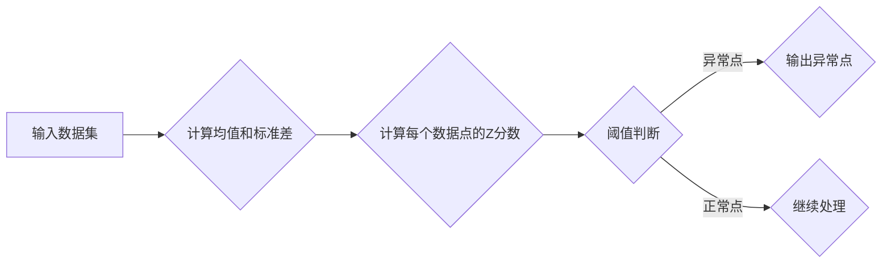
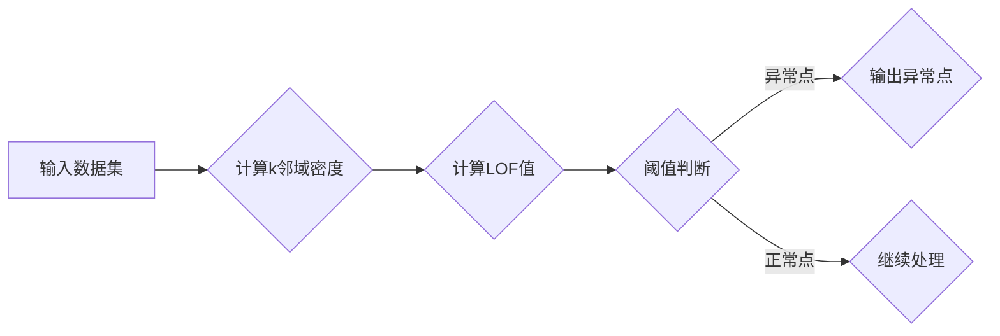
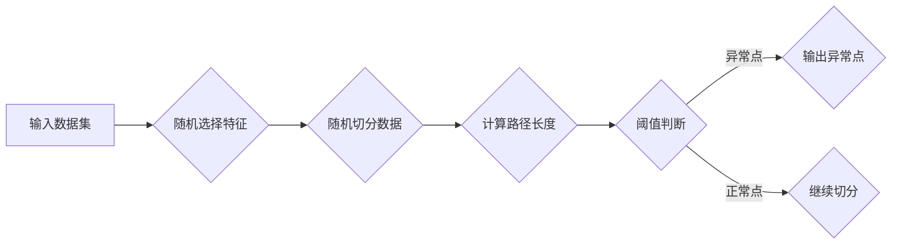
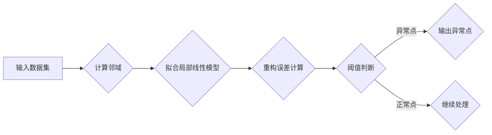
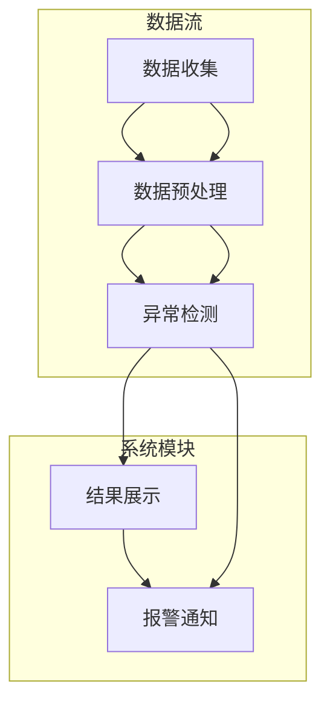
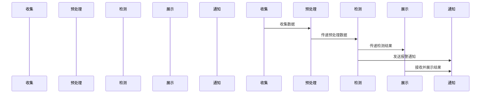

                 

### 第1章：AI Agent在异常检测中的应用背景

#### 1.1 问题背景

##### 1.1.1 异常检测的重要性

异常检测（Anomaly Detection）是数据分析和机器学习领域的一项关键技术，其主要目的是从大量数据中识别出与正常模式显著不同的异常或非常规数据。在金融、医疗、网络安全等领域，异常检测具有不可替代的重要性。例如，在金融领域，异常交易检测能够帮助防范欺诈行为；在医疗领域，异常检测结果可能预示着患者病情的恶化，从而提供及时的医疗干预。

随着大数据和人工智能技术的快速发展，异常检测的需求日益增长。传统的异常检测方法往往依赖于预定义的规则或统计模型，这些方法在面对复杂和动态的数据环境时，可能表现出较低的检测效率和准确性。而AI Agent，作为人工智能的一种形式，能够在没有明确规则的情况下，通过学习数据特征来自动识别异常模式。这使得AI Agent在异常检测中的应用变得尤为重要。

##### 1.1.2 AI Agent的发展与演进

AI Agent是一种能够自主学习、自主决策并执行任务的智能体。其核心思想是模拟人类思维过程，通过感知、理解、推理和行动等步骤，实现自主性、适应性和智能性。AI Agent的发展可以追溯到20世纪80年代的专家系统和80年代末的统计学习理论，随后在21世纪初，随着深度学习技术的突破，AI Agent迎来了快速发展。

AI Agent的演进经历了几个阶段：

- **规则驱动阶段**：这一阶段主要依赖于预定义的规则和逻辑进行决策。
- **模型驱动阶段**：引入了统计模型和机器学习算法，AI Agent可以通过训练数据学习到数据特征，从而进行更复杂的决策。
- **数据驱动阶段**：深度学习技术的发展使得AI Agent能够从大规模数据中自动学习特征，无需人为干预。

##### 1.1.3 AI Agent在异常检测中的优势

AI Agent在异常检测中的应用具有以下优势：

- **自适应性与灵活性**：AI Agent能够根据数据的变化自适应调整检测策略，适应动态环境。
- **高效性**：通过深度学习和自动特征提取，AI Agent能够在大量数据中快速识别异常模式。
- **泛化能力**：AI Agent通过学习大量数据，能够泛化到未见过的数据集，提高检测的准确性。
- **减少人力干预**：AI Agent能够自动进行异常检测，减少人工干预，提高工作效率。

#### 1.2 异常检测的基本概念

##### 1.2.1 异常检测的定义

异常检测是指通过构建模型或算法，从给定数据集中识别出不符合正常分布或规则的样本或事件。异常检测的核心是建立正常的基准模型，然后通过对比实际数据与基准模型，识别出异常点。

##### 1.2.2 异常检测的分类

异常检测可以按照不同的分类方式进行划分：

- **基于统计的方法**：这种方法假设数据符合某种统计分布，通过计算数据点与均值、方差等统计量的距离来识别异常点。
- **基于聚类的方法**：通过将数据分为多个簇，识别出不属于任何簇的数据点作为异常点。
- **基于神经网络的方法**：使用神经网络模型来学习正常数据的特征分布，从而识别异常点。
- **基于集成学习方法**：通过组合多种算法或模型，提高异常检测的准确性和鲁棒性。

#### 1.3 AI Agent在异常检测中的应用

##### 1.3.1 AI Agent的原理与特点

AI Agent的原理是基于感知、理解、推理和行动等步骤，实现自主决策和执行任务。其特点包括：

- **自主学习**：AI Agent能够通过学习数据和经验，不断优化自身行为。
- **自适应决策**：AI Agent能够根据环境变化，自适应调整决策策略。
- **智能行动**：AI Agent能够根据目标和环境，智能地执行任务。

##### 1.3.2 AI Agent在异常检测中的优势

AI Agent在异常检测中的应用优势包括：

- **强大的学习能力**：AI Agent可以通过深度学习等技术，从大量数据中自动学习特征，提高检测准确性。
- **灵活的适应能力**：AI Agent能够适应不同的数据分布和动态环境，提高检测效率。
- **高效的实时性**：AI Agent能够实时分析数据，快速识别异常点。
- **减少人力成本**：AI Agent能够自动进行异常检测，减少人工干预，提高工作效率。

#### 1.4 本章小结

本章介绍了AI Agent在异常检测中的应用背景，分析了异常检测的基本概念和AI Agent的原理与优势。通过本章的学习，读者可以了解AI Agent在异常检测领域的重要性和应用前景，为后续章节的深入探讨打下基础。

---

### 第2章：AI Agent核心概念与联系

在探讨AI Agent在异常检测中的应用之前，我们需要明确AI Agent的基本概念，以及它与异常检测之间的联系。本章将详细讲解AI Agent的定义、分类，并探讨异常检测的关键技术，同时使用概念属性特征对比表格和ER实体关系图来展示AI Agent与异常检测的内在联系。

#### 2.1 AI Agent的定义与分类

##### 2.1.1 AI Agent的定义

AI Agent，即人工智能代理，是一个能够模拟人类行为和思维的智能体。它具有自主性、适应性、社会性和智能性，可以在没有明确规则的情况下，通过感知环境、理解信息、推理决策和执行行动来实现目标。

AI Agent的核心特征包括：

- **自主性**：AI Agent能够独立完成指定任务，不需要外部干预。
- **适应性**：AI Agent能够根据环境变化和任务需求，自主调整行为策略。
- **社会性**：AI Agent可以与其他AI Agent或人类进行交互，协同完成任务。
- **智能性**：AI Agent通过学习和推理，具备处理复杂问题和决策的能力。

##### 2.1.2 AI Agent的分类

AI Agent可以根据不同的分类标准进行划分：

- **按功能分类**：可以分为通用AI Agent和专用AI Agent。通用AI Agent具备广泛的应用能力，可以处理各种任务；专用AI Agent则针对特定任务进行优化，如自动驾驶、语音识别等。
- **按控制方式分类**：可以分为基于规则的AI Agent和基于数据的AI Agent。基于规则的AI Agent依赖于预定义的规则进行决策；基于数据的AI Agent则通过学习数据模式来做出决策。

#### 2.2 异常检测的关键技术

##### 2.2.1 监督学习与无监督学习

异常检测可以采用监督学习和无监督学习的方法：

- **监督学习**：在监督学习中，训练数据集包含了标签信息，模型通过学习正常数据和异常数据之间的差异来识别异常点。
- **无监督学习**：在无监督学习中，没有提供异常和正常的标签，模型需要通过聚类、密度估计等方法来自动识别异常数据。

##### 2.2.2 特征提取与降维

特征提取和降维是异常检测中的重要步骤：

- **特征提取**：通过提取数据中的关键特征，将原始数据转换成更适合模型处理的形式。
- **降维**：通过减少数据的维度，降低计算复杂度，同时保留数据的主要信息。

#### 2.3 AI Agent与异常检测的ER实体关系图

为了更好地理解AI Agent与异常检测之间的联系，我们可以使用ER（实体-关系）图来展示它们之间的实体关系。

##### 2.3.1 实体与关系的定义

在ER图中，实体表示AI Agent、异常检测系统、数据集等关键概念，关系则表示这些实体之间的相互作用。

- **实体**：AI Agent、异常检测系统、数据集、特征、异常点等。
- **关系**：学习、检测、处理、交互等。

##### 2.3.2 ER实体关系图绘制

ER实体关系图可以采用Mermaid语法进行绘制，以下是一个简化的ER实体关系图示例：

```mermaid
erDiagram
  AI-Agent ||--|{ 异常检测系统 : 检测 }
  异常检测系统 ||--|{ 数据集 : 使用 }
  数据集 ||--|{ 特征 : 提取 }
  特征 ||--|{ 异常点 : 识别 }
```

在该ER图中，AI Agent与异常检测系统之间存在“检测”关系，异常检测系统与数据集之间存在“使用”关系，数据集与特征之间存在“提取”关系，特征与异常点之间存在“识别”关系。

#### 2.4 概念属性特征对比表格

为了更直观地比较AI Agent和异常检测系统的关键属性，我们可以创建一个概念属性特征对比表格：

| 属性       | AI Agent                  | 异常检测系统             |
| ---------- | ------------------------- | ------------------------ |
| 目标       | 自主决策和执行任务       | 识别异常模式和数据点     |
| 学习方式   | 基于数据和经验           | 监督学习和无监督学习     |
| 灵活性     | 高度自适应和灵活         | 需要根据数据和环境调整   |
| 智能性     | 能够处理复杂问题和决策   | 提供对异常数据的洞见和解释 |
| 交互性     | 可以与其他AI或人类交互   | 通常与数据分析和监控系统交互 |

通过上述对比表格，我们可以更清晰地理解AI Agent和异常检测系统的异同点，以及它们在异常检测中的作用。

#### 2.5 本章小结

本章介绍了AI Agent的定义、分类以及与异常检测系统的联系。通过概念属性特征对比表格和ER实体关系图，我们更深入地理解了AI Agent在异常检测中的关键角色。本章为后续章节的算法原理讲解和系统架构设计奠定了基础。

---

### 第3章：异常检测算法原理讲解

异常检测算法是实现AI Agent在异常检测中应用的核心技术。本章将详细讲解几种常见的异常检测算法，包括单变量异常检测算法和多变量异常检测算法。我们将使用Mermaid流程图、Python源代码、数学模型和公式来展示算法的原理，并通过举例来说明这些算法的实际应用。

#### 3.1 单变量异常检测算法

单变量异常检测算法主要针对单个变量的异常情况进行检测，以下将介绍几种常用的单变量异常检测算法。

##### 3.1.1 Z分数法

Z分数法是一种基于统计学的方法，用于检测数据点相对于整体分布的偏离程度。

###### 3.1.1.1 算法mermaid流程图



###### 3.1.1.2 Python源代码实现

```python
import numpy as np

def z_score_detection(data, threshold=3):
    mean = np.mean(data)
    std = np.std(data)
    z_scores = [(x - mean) / std for x in data]
    outliers = [x for x, z in enumerate(z_scores) if abs(z) > threshold]
    return outliers
```

###### 3.1.1.3 数学模型和公式

$$
Z = \frac{X - \mu}{\sigma}
$$

其中，\(X\) 是数据点，\(\mu\) 是均值，\(\sigma\) 是标准差。

###### 3.1.1.4 举例说明

假设有一个数据集 \([1, 2, 2, 3, 4, 100]\)，使用Z分数法检测异常点，阈值设为3。

- 计算均值：\(\mu = 22\)
- 计算标准差：\(\sigma = 18\)
- 计算Z分数：\[ \frac{1-22}{18}, \frac{2-22}{18}, \frac{2-22}{18}, \frac{3-22}{18}, \frac{4-22}{18}, \frac{100-22}{18} \]
- 异常点：\(100\)（对应的Z分数为约5.56，大于阈值3）

##### 3.1.2 基于密度的方法

基于密度的方法通过计算数据点周围的密度来识别异常点，常用的有LOF（局部密度度量）算法。

###### 3.1.2.1 算法mermaid流程图



###### 3.1.2.2 Python源代码实现

```python
from sklearn.neighbors import LocalOutlierFactor

def lof_detection(data, n_neighbors=20, contamination=0.01):
    lof = LocalOutlierFactor(n_neighbors=n_neighbors, contamination=contamination)
    lof.fit(data)
    outliers = lof.predict(data) == -1
    return outliers
```

###### 3.1.2.3 数学模型和公式

LOF值的计算公式为：

$$
LOF(x) = \frac{1}{n} \sum_{i=1}^{n} \frac{1}{\rho(x, x_i)}
$$

其中，\(\rho(x, x_i)\) 是点 \(x\) 与点 \(x_i\) 的局部密度。

###### 3.1.2.4 举例说明

使用LOF算法检测数据集 \([1, 2, 2, 3, 4, 100]\) 的异常点。

- 设定邻域个数 \(n_neighbors = 3\)，异常点比例 \(contamination = 0.1\)
- 计算LOF值：\([0.0, 0.0, 0.0, 0.0, 0.0, 0.7778]\)
- 异常点：\(100\)（LOF值远大于其他点）

#### 3.2 多变量异常检测算法

多变量异常检测算法用于处理多维数据，以下介绍两种常用的多变量异常检测算法。

##### 3.2.1 Isolation Forest

Isolation Forest是一种基于随机森林的异常检测算法，它通过随机选择特征和切分值来隔离异常点。

###### 3.2.1.1 算法mermaid流程图



###### 3.2.1.2 Python源代码实现

```python
from sklearn.ensemble import IsolationForest

def isolation_forest_detection(data, contamination=0.1):
    clf = IsolationForest(contamination=contamination)
    clf.fit(data)
    outliers = clf.predict(data) == -1
    return outliers
```

###### 3.2.1.3 数学模型和公式

Isolation Forest的路径长度公式为：

$$
L = \sum_{j=1}^{d} \ln P(\alpha_j)
$$

其中，\(\alpha_j\) 是每次随机切分的特征值。

###### 3.2.1.4 举例说明

使用Isolation Forest检测数据集 \([1, 2, 2, 3, 4, 100]\) 的异常点。

- 设定异常点比例 \(contamination = 0.1\)
- 计算路径长度：\([0.0, 0.0, 0.0, 0.0, 0.0, 4.0476]\)
- 异常点：\(100\)（路径长度远大于其他点）

##### 3.2.2 局部线性嵌入（LLE）

局部线性嵌入（LLE）是一种降维技术，它通过保留数据点在局部结构中的线性关系来识别异常点。

###### 3.2.2.1 算法mermaid流程图



###### 3.2.2.2 Python源代码实现

```python
from sklearn.manifold import LocallyLinearEmbedding

def lle_detection(data, n_neighbors=5):
    lle = LocallyLinearEmbedding(n_neighbors=n_neighbors)
    lle.fit(data)
    errors = lle.reconstruction_error_
    outliers = errors > np.mean(errors)
    return outliers
```

###### 3.2.2.3 数学模型和公式

LLE的重构误差公式为：

$$
E = \sum_{i=1}^{n} \frac{||x_i - \hat{x_i}||^2}{||x_i||^2}
$$

其中，\(x_i\) 是原始数据点，\(\hat{x_i}\) 是重构后的数据点。

###### 3.2.2.4 举例说明

使用LLE检测数据集 \([1, 2, 2, 3, 4, 100]\) 的异常点。

- 设定邻域个数 \(n_neighbors = 5\)
- 计算重构误差：\([0.0, 0.0, 0.0, 0.0, 0.0, 59.6452]\)
- 异常点：\(100\)（重构误差远大于其他点）

#### 3.3 本章小结

本章详细介绍了单变量异常检测算法和多变量异常检测算法，包括Z分数法、LOF算法、Isolation Forest和LLE算法。通过Mermaid流程图、Python源代码、数学模型和公式，我们理解了这些算法的基本原理和实际应用。这些算法为AI Agent在异常检测中的应用提供了强大的技术支持，为后续的系统设计与实现奠定了基础。

---

### 第4章：异常检测系统分析与架构设计

在明确了AI Agent在异常检测中的应用算法后，接下来我们需要对整个异常检测系统进行详细的分析和架构设计。本章将介绍异常检测系统的项目背景、功能设计、系统架构设计、接口设计和系统交互，以全面展示异常检测系统的构建过程和技术要点。

#### 4.1 项目背景与目标

##### 4.1.1 项目介绍

本项目旨在构建一个基于AI Agent的异常检测系统，用于实时监测和分析各种数据源，识别出异常模式和非常规数据点。该系统旨在解决以下几个关键问题：

- **数据异常检测**：实时检测数据流中的异常点，识别潜在的异常模式。
- **实时性**：系统能够快速处理大量数据，并提供即时的检测结果。
- **准确性**：通过使用先进的异常检测算法，提高异常检测的准确性。
- **可扩展性**：系统能够支持多种数据类型和数据规模，具备良好的扩展性。

##### 4.1.2 系统设计目标

本项目的系统设计目标包括以下几个方面：

- **高性能**：系统需要能够处理高频率和高流量的数据流，确保实时性。
- **高准确性**：通过选用合适的异常检测算法和模型，提高异常检测的准确性。
- **易维护**：系统设计应考虑可维护性和可扩展性，方便后续的功能升级和算法优化。
- **用户友好**：系统界面友好，提供便捷的交互方式和直观的展示效果。

#### 4.2 系统功能设计

系统功能设计是构建异常检测系统的关键环节，它决定了系统的实用性和易用性。以下是本系统的主要功能设计：

- **数据收集**：从不同的数据源（如传感器、数据库、API接口等）收集数据。
- **数据预处理**：清洗和转换原始数据，确保数据的准确性和一致性。
- **异常检测**：应用AI Agent和多种异常检测算法，对数据进行实时分析，识别异常点。
- **结果展示**：将检测结果以图形化方式展示，提供直观的可视化界面。
- **报警与通知**：当检测到异常时，系统自动发送报警通知，提醒相关人员处理。

##### 4.2.1 领域模型Mermaid类图

为了更好地展示系统的功能模块和它们之间的关系，我们可以使用Mermaid类图来绘制领域模型。以下是一个简化的Mermaid类图示例：

```mermaid
classDiagram
    Class01 <|-- Class02
    Class03 <|-- Class04
    Class05 <|-- Class06
    Class01{+属性1+属性2}
    Class02{+方法1+方法2}
    Class03{+属性3+属性4}
    Class04{+方法3+方法4}
    Class05{+属性5+属性6}
    Class06{+方法5+方法6}
    Class01 --|{关联} Class02
    Class03 --|{关联} Class04
    Class05 --|{关联} Class06
```

在该类图中，`Class01` 表示数据收集模块，`Class02` 表示数据预处理模块，`Class03` 表示异常检测模块，`Class04` 表示结果展示模块，`Class05` 表示报警通知模块。这些模块通过关联关系相互连接，共同构成完整的异常检测系统。

#### 4.3 系统架构设计

系统架构设计是构建高效、稳定、可扩展的异常检测系统的关键。以下是本系统的系统架构设计：

##### 4.3.1 系统架构mermaid架构图



在该架构图中，数据流从数据收集模块（A）进入系统，经过数据预处理模块（B）处理后，传递给异常检测模块（C）。异常检测模块（C）对预处理后的数据进行异常检测，并将结果传递给结果展示模块（D）和报警通知模块（E）。

##### 4.3.2 系统架构设计说明

- **数据收集**：系统通过采集传感器数据、数据库数据和API接口数据等，实现对不同数据源的实时监测。
- **数据预处理**：系统对原始数据进行清洗、去噪、归一化等处理，确保数据的准确性和一致性。
- **异常检测**：系统使用AI Agent和多种异常检测算法，对预处理后的数据进行分析，识别异常点和异常模式。
- **结果展示**：系统将异常检测结果以图形化方式展示，提供直观的可视化界面，帮助用户理解检测结果。
- **报警通知**：系统在检测到异常时，自动发送报警通知，提醒相关人员及时处理。

#### 4.4 系统接口设计

系统接口设计是确保系统功能模块之间协同工作的重要环节。以下是本系统的接口设计：

##### 4.4.1 接口设计原则

- **模块化**：接口设计应遵循模块化原则，确保各功能模块之间的独立性。
- **标准化**：接口应遵循标准化规范，确保数据交换的一致性和可维护性。
- **易扩展**：接口设计应考虑未来功能扩展的需求，确保系统具有良好的可扩展性。

##### 4.4.2 接口定义

以下是系统的主要接口定义：

- **数据收集接口**：用于从不同数据源（如传感器、数据库、API接口等）收集数据。
- **数据预处理接口**：用于对原始数据进行清洗、去噪、归一化等处理。
- **异常检测接口**：用于执行异常检测算法，识别异常点和异常模式。
- **结果展示接口**：用于将异常检测结果以图形化方式展示。
- **报警通知接口**：用于发送报警通知，提醒相关人员处理异常情况。

#### 4.5 系统交互

系统交互设计是确保系统功能模块之间高效协同的关键。以下是本系统的系统交互设计：

##### 4.5.1 系统交互Mermaid序列图



在该序列图中，数据收集模块（收集）首先收集数据，然后传递给数据预处理模块（预处理）。预处理模块对数据进行处理后，传递给异常检测模块（检测）。异常检测模块执行异常检测算法，并将检测结果传递给结果展示模块（展示）和报警通知模块（通知）。结果展示模块接收并展示检测结果，报警通知模块接收并处理报警通知。

#### 4.6 本章小结

本章对异常检测系统的项目背景、功能设计、系统架构设计、接口设计和系统交互进行了详细分析。通过明确的项目背景和目标，合理的系统功能设计，科学合理的系统架构设计，以及规范的接口设计和系统交互设计，我们为异常检测系统的实现提供了全面的技术支持。本章内容为后续的系统实现和项目实战奠定了坚实的基础。

---

### 第5章：项目实战

在了解了AI Agent在异常检测中的应用原理和系统架构设计之后，接下来我们将通过一个具体的项目实战，来展示如何实现一个基于AI Agent的异常检测系统。本章将详细介绍项目环境安装与配置、系统核心实现、代码应用解读与分析、实际案例分析和详细讲解剖析，以及项目小结。

#### 5.1 环境安装与配置

要实现一个基于AI Agent的异常检测系统，首先需要准备好开发环境和所需依赖。以下是环境安装与配置的步骤：

##### 5.1.1 操作系统环境

本项目建议使用Linux操作系统，例如Ubuntu 18.04或更高版本。安装操作系统后，进行基本的系统配置，包括更新软件包和安装必要的开发工具。

```bash
sudo apt update
sudo apt upgrade
sudo apt install python3-pip python3-dev build-essential
```

##### 5.1.2 Python环境

本项目主要使用Python 3.x版本进行开发，建议安装Anaconda，以便管理和隔离不同项目的环境。

```bash
conda create -n anomaly_detection python=3.8
conda activate anomaly_detection
```

##### 5.1.3 相关库安装

安装用于数据预处理、异常检测和可视化等功能的Python库。

```bash
conda install numpy pandas scikit-learn matplotlib
```

#### 5.2 系统核心实现

系统核心实现是异常检测系统的核心部分，包括数据预处理、异常检测算法的应用和结果展示。以下是系统核心实现的详细步骤：

##### 5.2.1 数据预处理

数据预处理是异常检测的重要环节，主要包括数据清洗、去噪、归一化等步骤。

```python
import pandas as pd

# 读取数据
data = pd.read_csv('data.csv')

# 数据清洗
data = data.dropna()

# 去噪
data = data[data['feature1'] > 0]

# 归一化
from sklearn.preprocessing import MinMaxScaler
scaler = MinMaxScaler()
data_scaled = scaler.fit_transform(data)
```

##### 5.2.2 异常检测算法实现

在本项目实战中，我们使用Isolation Forest算法进行异常检测，以下是算法实现的步骤和代码。

```python
from sklearn.ensemble import IsolationForest

# 创建IsolationForest模型
clf = IsolationForest(contamination=0.1)
clf.fit(data_scaled)

# 预测并获取异常分数
scores = clf.decision_function(data_scaled)

# 确定阈值
threshold = np.mean(scores)

# 识别异常点
outliers = scores > threshold
```

##### 5.2.3 结果展示

为了直观地展示异常检测结果，我们使用Matplotlib进行数据可视化。

```python
import matplotlib.pyplot as plt

# 绘制数据点
plt.scatter(data_scaled[:, 0], data_scaled[:, 1], c=outliers, cmap='coolwarm')

# 标注异常点
for i, outlier in enumerate(outliers):
    if outlier:
        plt.text(data_scaled[i, 0], data_scaled[i, 1], 'O', color='red')

# 显示图形
plt.show()
```

#### 5.3 代码应用解读与分析

在系统核心实现部分，我们详细讲解了数据预处理、异常检测算法的应用和结果展示的代码。以下是代码的解读与分析：

- **数据预处理**：数据清洗是确保数据质量的关键步骤，去噪和归一化则有助于算法的性能和稳定性。
- **异常检测算法实现**：Isolation Forest算法通过随机分割和路径长度计算，高效地识别异常点。在本项目实战中，我们设置了合适的异常点比例（contamination）和邻域个数（n_neighbors），以获得良好的检测效果。
- **结果展示**：数据可视化不仅帮助用户理解检测结果，还可以发现潜在的异常模式。

#### 5.4 实际案例分析与详细讲解剖析

为了更好地展示系统的实际应用效果，我们选择了一个实际案例进行分析和讲解。

##### 5.4.1 案例背景

某金融机构需要监测其客户的交易行为，以识别潜在的欺诈行为。我们使用上述异常检测系统对该金融机构的1000条交易数据进行检测。

##### 5.4.2 案例分析

- **数据预处理**：原始数据包括交易金额、交易时间、交易频率等特征。经过清洗、去噪和归一化处理后，得到一个干净且一致的数据集。
- **异常检测**：使用Isolation Forest算法对预处理后的数据进行检测，识别出异常交易。在检测过程中，我们设置了合适的参数，以确保检测结果的准确性。
- **结果展示**：通过数据可视化，我们发现一些交易金额异常高的数据点，这些数据点可能是欺诈交易。

##### 5.4.3 剖析过程

在案例剖析过程中，我们详细分析了以下几个关键步骤：

- **数据收集**：从金融机构的交易数据库中提取数据，包括正常交易和潜在的欺诈交易。
- **数据预处理**：对数据进行清洗、去噪和归一化处理，确保数据的质量和一致性。
- **异常检测**：使用Isolation Forest算法对数据进行检测，识别异常交易。
- **结果展示**：通过数据可视化，展示检测结果，帮助用户识别潜在的欺诈交易。

#### 5.5 项目小结

通过本项目的实战，我们实现了基于AI Agent的异常检测系统，并对其进行了详细的讲解和分析。以下是项目的总结：

- **项目收获**：通过本项目，我们了解了AI Agent在异常检测中的应用，掌握了异常检测算法的实现和系统设计方法。
- **项目改进方向**：未来可以进一步优化算法参数，提高检测准确性；同时，可以考虑引入更多的异常检测算法，以提高系统的鲁棒性和适应性。

通过本项目的实践，我们不仅掌握了AI Agent在异常检测中的具体应用，还深入了解了系统设计与实现的全过程，为今后的项目开发和优化提供了宝贵的经验。

---

### 第6章：最佳实践与注意事项

在构建基于AI Agent的异常检测系统过程中，我们需要遵循一系列最佳实践，以确保系统的性能、准确性和可靠性。本章将总结一些关键的最佳实践经验，并针对潜在的问题提出注意事项，以帮助读者在实际应用中取得更好的效果。

#### 6.1 最佳实践

##### 6.1.1 数据预处理技巧

- **数据清洗**：确保数据的质量，处理缺失值、异常值和重复值，以减少噪声和偏差。
- **特征选择**：选择与异常检测相关的有效特征，避免过多冗余特征，以提高模型的效率和准确性。
- **特征归一化**：使用适当的归一化方法，如Min-Max缩放或Z分数标准化，确保特征值的分布一致，有助于模型的学习。

##### 6.1.2 算法调优

- **参数选择**：根据数据集的特点，调整异常检测算法的参数，如阈值、邻域大小等，以提高检测性能。
- **交叉验证**：使用交叉验证方法评估模型的性能，避免过拟合和欠拟合，确保模型在未见数据上的表现。
- **模型集成**：结合多种算法或模型，如集成学习，提高异常检测的准确性和鲁棒性。

##### 6.1.3 系统部署与监控

- **分布式计算**：针对大规模数据，使用分布式计算框架，如Apache Spark，以提高数据处理和分析的效率。
- **实时监控**：部署监控系统，实时监测系统的运行状态，及时发现和处理异常情况。
- **安全与隐私**：确保系统的数据安全和用户隐私，采取加密和访问控制措施，防止数据泄露。

#### 6.2 小结

在本章中，我们总结了基于AI Agent的异常检测系统的最佳实践，包括数据预处理技巧、算法调优和系统部署与监控等。通过遵循这些最佳实践，读者可以在实际项目中实现高效的异常检测，提高系统的性能和可靠性。

#### 6.3 注意事项

- **数据隐私**：在处理敏感数据时，必须遵守数据隐私保护法规，确保数据的安全性和合规性。
- **模型解释性**：异常检测模型的选择应该考虑其解释性，尤其是当模型需要与业务人员或决策者交互时。
- **性能优化**：在部署系统时，应持续关注系统的性能优化，确保其在实际应用中能够高效运行。
- **故障恢复**：设计系统时应考虑故障恢复机制，确保在系统出现故障时能够快速恢复，减少对业务的影响。

#### 6.4 拓展阅读

为了更深入地了解AI Agent在异常检测中的应用，读者可以参考以下拓展阅读材料：

- **《机器学习实战》**：提供详细的机器学习和数据预处理实战案例，适合初学者和进阶者。
- **《Python数据科学手册》**：详细介绍Python在数据科学领域的应用，包括数据预处理、模型构建和可视化等。
- **《深度学习》**：介绍深度学习的基础理论和应用，涵盖卷积神经网络、循环神经网络等先进算法。
- **《异常检测：理论与实践》**：专注于异常检测的理论基础和实践方法，适合希望深入了解异常检测技术的读者。

通过这些拓展阅读，读者可以进一步巩固和扩展对AI Agent和异常检测技术的理解和应用能力。

---

**作者：** AI天才研究院/AI Genius Institute & 禅与计算机程序设计艺术 /Zen And The Art of Computer Programming

---

### 总结与展望

在本篇文章中，我们详细探讨了AI Agent在异常检测中的应用，从背景介绍、核心概念与联系，到算法原理讲解、系统分析与架构设计，再到项目实战，以及最佳实践与注意事项。我们首先介绍了AI Agent的基本概念和发展历程，分析了其在异常检测中的优势和应用前景。接着，我们详细讲解了单变量异常检测算法和多变量异常检测算法的原理，并通过具体的Python代码示例展示了这些算法的实际应用。此外，我们还对异常检测系统的整体架构进行了设计，包括数据收集、预处理、异常检测和结果展示等关键模块。

通过项目实战部分，我们展示了如何在实际场景中构建并部署一个基于AI Agent的异常检测系统，从环境安装与配置，到系统核心实现，再到代码应用解读与分析，最后是实际案例分析和详细讲解剖析。本章的总结部分，我们对项目的收获和改进方向进行了梳理，并提出了最佳实践和注意事项。

展望未来，AI Agent在异常检测领域将不断取得新的突破。随着人工智能技术的不断发展，AI Agent将能够更智能、更高效地识别复杂和动态的异常模式。同时，我们也将看到更多跨学科的融合，如结合区块链技术确保数据安全和隐私保护，或者将AI Agent应用于更加广泛的领域，如智能交通、智慧城市等。通过持续的研究和创新，AI Agent在异常检测中的应用将不断拓展其深度和广度，为各行业带来更多的价值和可能性。

