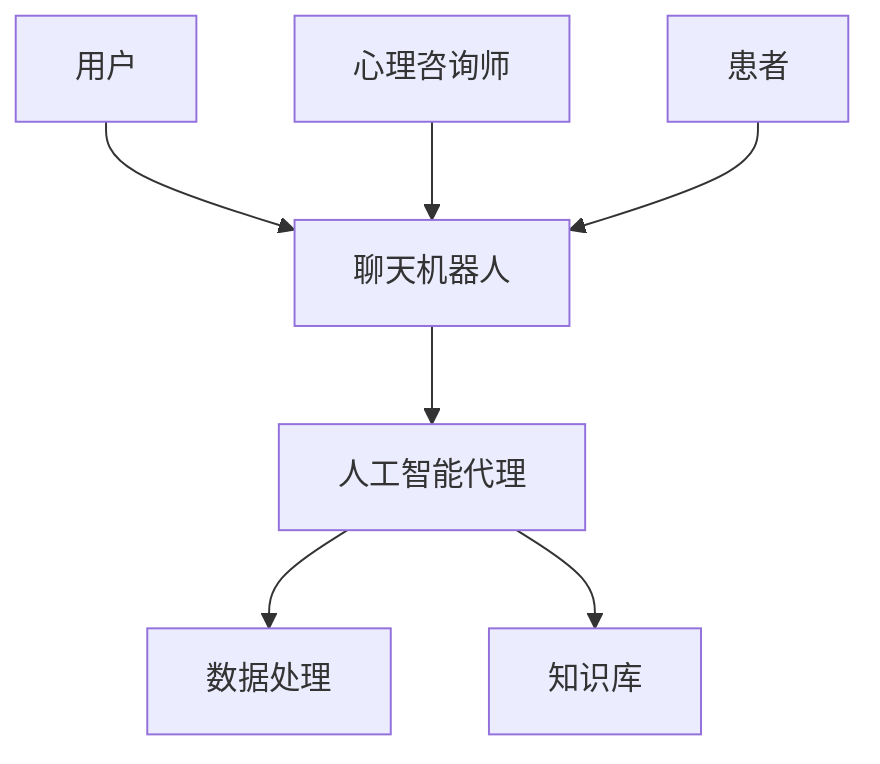
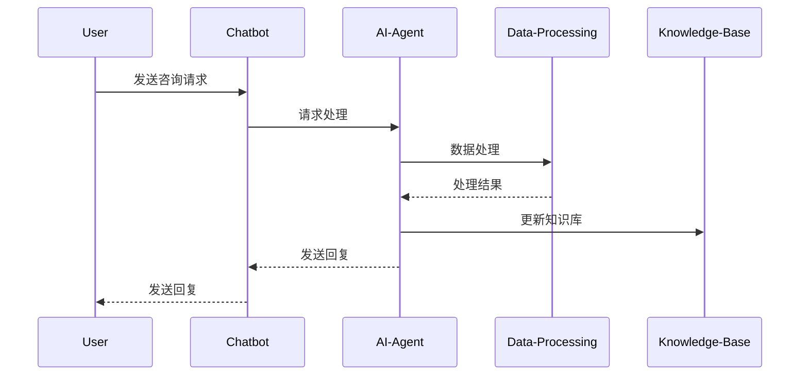

                 

# AI Agent在心理健康咨询中的应用与局限

关键词：AI Agent, 心理健康咨询, 应用，局限，心理健康，人工智能

摘要：
心理健康咨询是一项重要的社会服务，旨在帮助个体改善心理健康状况，提高生活质量。随着人工智能技术的发展，AI Agent作为一种智能体，在心理健康咨询领域展现出了巨大的应用潜力。本文将深入探讨AI Agent在心理健康咨询中的应用现状、技术原理、系统架构以及存在的局限性，通过一步步的分析推理，揭示这一领域的技术前沿与发展方向。

## 目录大纲

1. **背景介绍与核心概念**
   1.1. 问题的背景与描述
   1.2. 核心概念与联系
   1.3. 研究方法与边界

2. **核心概念与原理**
   2.1. AI Agent原理讲解
   2.2. 心理健康咨询的概念与原理
   2.3. AI Agent在心理健康咨询中的应用

3. **系统分析与架构设计**
   3.1. 问题场景介绍
   3.2. 系统功能设计
   3.3. 系统架构设计
   3.4. 系统接口设计与交互

4. **项目实战**
   4.1. 环境安装与配置
   4.2. 系统核心实现

5. **小结与展望**
   5.1. 最佳实践Tips
   5.2. 小结
   5.3. 注意事项
   5.4. 拓展阅读

## 第一部分：背景介绍与核心概念

### 1.1 问题的背景与描述

#### 1.1.1 心理健康咨询的现状

心理健康咨询作为现代社会中一个重要的服务领域，旨在通过专业的方法和技术，帮助个体处理心理困扰、提高生活质量。当前，心理健康咨询服务面临着以下挑战：

1. **供需矛盾**：随着社会对心理健康服务的需求日益增加，专业心理咨询师的供给相对不足，特别是在偏远和经济不发达地区。
2. **成本高昂**：心理咨询师的服务通常费用较高，使得部分有需求的人因经济原因无法得到有效服务。
3. **隐私保护**：传统的面对面咨询模式在隐私保护方面存在一定的风险，特别是在心理咨询师的专业水平和道德操守难以保障的情况下。

#### 1.1.2 AI Agent的优势

AI Agent作为一种人工智能的智能体，具有以下优势，使其在心理健康咨询领域具有潜在的解决能力：

1. **成本效益**：AI Agent的开发和运营成本相对较低，可以大规模提供心理健康咨询服务，降低服务成本。
2. **可扩展性**：AI Agent可以24小时在线，不受时间和地点的限制，为更多用户提供服务。
3. **个性化服务**：通过机器学习和自然语言处理技术，AI Agent可以根据用户的历史数据和反馈，提供个性化的心理健康咨询服务。

#### 1.1.3 心理健康咨询领域对AI Agent的需求

心理健康咨询领域对AI Agent的需求主要体现在以下几个方面：

1. **初步筛查**：AI Agent可以辅助心理咨询师进行初步筛查，识别可能的心理健康问题，提高咨询的效率。
2. **持续监控**：AI Agent可以实时监控用户的心理健康状况，提供预警和干预措施。
3. **心理干预**：AI Agent可以通过自然语言交互，为用户提供心理支持和干预，减轻心理咨询师的负担。

### 1.2 核心概念与联系

#### 1.2.1 AI Agent的定义与分类

AI Agent是指一种能够自主感知环境、制定决策并采取行动的计算机程序。根据其智能程度和应用场景，AI Agent可以分为以下几类：

1. **规则型AI Agent**：基于预设的规则进行决策，适用于结构化问题。
2. **基于模型的AI Agent**：利用机器学习和深度学习模型进行决策，适用于复杂和非结构化问题。
3. **混合型AI Agent**：结合规则型和模型型AI Agent的特点，适用于多种场景。

#### 1.2.2 心理健康咨询的基本概念

心理健康咨询是指通过专业的方法和技术，帮助个体解决心理问题、提高心理健康水平的过程。其基本概念包括：

1. **心理咨询师**：具备专业资质的心理健康服务提供者。
2. **心理患者**：需要接受心理健康咨询的个体。
3. **心理干预**：通过多种方法，如对话、认知行为疗法等，对心理问题进行干预。

#### 1.2.3 AI Agent在心理健康咨询中的应用

AI Agent在心理健康咨询中的应用主要包括以下几个方面：

1. **初步筛查**：AI Agent可以通过自然语言处理技术，分析用户的语言和行为，初步筛查出潜在的心理健康问题。
2. **心理支持**：AI Agent可以通过聊天机器人的形式，为用户提供心理支持和安慰，缓解心理压力。
3. **行为干预**：AI Agent可以通过监测用户的行为和情绪，提供个性化的行为干预建议，如提醒用户进行锻炼、调整饮食等。

### 1.3 研究方法与边界

#### 1.3.1 研究方法的选择

本研究采用定量研究和定性研究相结合的方法，通过实证数据分析和案例研究，全面探讨AI Agent在心理健康咨询中的应用。

#### 1.3.2 研究范围的界定

本研究主要探讨AI Agent在心理健康咨询中的应用，包括初步筛查、心理支持和行为干预等方面。同时，本研究将关注AI Agent在心理健康咨询中的局限性，如隐私保护、伦理道德等问题。

#### 1.3.3 边界与外延

本研究仅限于探讨AI Agent在心理健康咨询中的应用，不涉及其他心理健康服务领域，如精神疾病治疗等。

## 第二部分：核心概念与原理

### 2.1 AI Agent原理讲解

#### 2.1.1 AI Agent的数学模型与公式

AI Agent的核心在于其决策模型，常用的决策模型包括：

1. **马尔可夫决策过程（MDP）**：
   $$ V^*(s) = \max_a \sum_{s'} p(s' | s, a) \cdot r(s', a) + \gamma V^*(s') $$
   其中，\( s \) 是状态，\( a \) 是动作，\( s' \) 是下一个状态，\( p(s' | s, a) \) 是状态转移概率，\( r(s', a) \) 是奖励函数，\( \gamma \) 是折扣因子。

2. **深度强化学习（DRL）**：
   $$ Q(s, a) = \sum_{s'} \pi(s' | s, a) \cdot r(s', a) + \gamma \sum_{s''} Q(s'', a) \cdot \pi(s'' | s', a) $$
   其中，\( Q(s, a) \) 是状态-动作值函数，\( \pi(s' | s, a) \) 是策略概率分布。

#### 2.1.2 AI Agent的工作流程

AI Agent的工作流程主要包括以下几个步骤：

1. **感知环境**：通过传感器收集环境信息。
2. **状态评估**：利用模型对当前状态进行评估。
3. **决策制定**：根据评估结果，选择最优动作。
4. **执行动作**：在环境中执行所选动作。
5. **反馈学习**：根据环境反馈，调整模型参数。

#### 2.1.3 AI Agent的类型与特点

AI Agent根据其功能和特点可以分为以下几种类型：

1. **规则型AI Agent**：基于预设规则进行决策，适用于简单、规则明确的问题。
2. **混合型AI Agent**：结合规则和模型型AI Agent的特点，适用于复杂问题。
3. **模型型AI Agent**：基于机器学习和深度学习模型进行决策，适用于非结构化问题。

### 2.2 心理健康咨询的概念与原理

#### 2.2.1 心理健康咨询的定义

心理健康咨询是指通过专业的方法和技术，帮助个体解决心理问题、提高心理健康水平的过程。

#### 2.2.2 心理健康咨询的过程

心理健康咨询的过程主要包括以下几个阶段：

1. **评估阶段**：评估个体心理健康状况，确定问题类型和严重程度。
2. **治疗阶段**：根据评估结果，采用合适的治疗方法，如心理辅导、认知行为疗法等。
3. **康复阶段**：帮助个体逐步恢复心理健康，提高生活质量。

#### 2.2.3 心理健康咨询的目标

心理健康咨询的目标主要包括：

1. **缓解心理压力**：通过心理支持和技术干预，缓解个体的心理压力。
2. **提高心理健康水平**：通过治疗和康复，提高个体的心理健康水平。
3. **提升生活质量**：帮助个体提高生活质量，更好地适应社会环境。

### 2.3 AI Agent在心理健康咨询中的应用

#### 2.3.1 应用场景分析

AI Agent在心理健康咨询中的应用场景主要包括：

1. **初步筛查**：通过自然语言处理技术，对用户的问题进行初步筛查，识别潜在的心理健康问题。
2. **心理支持**：通过聊天机器人，为用户提供心理支持和安慰，缓解心理压力。
3. **行为干预**：通过监测用户的行为和情绪，提供个性化的行为干预建议，如提醒用户进行锻炼、调整饮食等。

#### 2.3.2 应用优势与局限

AI Agent在心理健康咨询中的应用优势主要包括：

1. **成本低**：AI Agent的开发和运营成本相对较低，可以大规模提供心理健康咨询服务。
2. **高效性**：AI Agent可以24小时在线，提供高效的服务。
3. **个性化**：AI Agent可以根据用户的历史数据和反馈，提供个性化的心理健康咨询服务。

AI Agent在心理健康咨询中的应用局限主要包括：

1. **隐私保护**：AI Agent在处理用户数据时，可能面临隐私保护的问题。
2. **伦理道德**：AI Agent的决策和行为可能涉及伦理道德问题，需要严格规范。
3. **技术限制**：AI Agent在处理复杂、非结构化问题时，可能存在技术限制。

#### 2.3.3 应用实例

以下是一个AI Agent在心理健康咨询中的应用实例：

1. **初步筛查**：用户向AI Agent提出心理健康咨询请求，AI Agent通过自然语言处理技术，初步筛查出潜在的心理健康问题。
2. **心理支持**：AI Agent通过聊天机器人为用户提供心理支持和安慰，缓解心理压力。
3. **行为干预**：AI Agent通过监测用户的行为和情绪，提供个性化的行为干预建议，如提醒用户进行锻炼、调整饮食等。

## 第三部分：系统分析与架构设计

### 3.1 问题场景介绍

在心理健康咨询中，用户（患者）和心理咨询师是核心参与者。用户面临心理困扰时，需要专业的心理咨询师提供帮助。然而，由于心理咨询师数量有限，供需不平衡，AI Agent作为一种智能体，被引入以辅助心理健康咨询。

### 3.2 系统功能设计

心理健康咨询系统的功能设计包括：

1. **用户注册与登录**：用户注册账号并登录系统。
2. **初步筛查**：AI Agent通过自然语言处理技术对用户的问题进行初步筛查。
3. **心理支持**：AI Agent为用户提供心理支持和安慰。
4. **行为干预**：AI Agent监测用户的行为和情绪，提供个性化的行为干预建议。
5. **心理咨询师服务**：心理咨询师通过系统为用户提供专业心理咨询服务。
6. **数据管理与隐私保护**：系统对用户数据严格管理，确保隐私保护。

#### 领域模型

使用Mermaid类图来表示领域模型：

```mermaid
classDiagram
    User <<class>> "用户"
    Therapist <<class>> "心理咨询师"
    Chatbot <<class>> "聊天机器人"
    AI-Agent <<class>> "人工智能代理"
    Data-Processing <<class>> "数据处理"
    Knowledge-Base <<class>> "知识库"
    
    User o-- Chatbot
    Chatbot o-- AI-Agent
    Therapist o-- Chatbot
    AI-Agent o-- Data-Processing
    AI-Agent o-- Knowledge-Base
```

### 3.3 系统架构设计

心理健康咨询系统的架构设计包括：

1. **前端**：提供用户交互界面，包括用户注册、登录、咨询请求等。
2. **后端**：包括AI-Agent、Chatbot、Data-Processing和Knowledge-Base等模块。
3. **数据库**：存储用户信息、咨询记录和知识库数据。

#### 系统架构图

使用Mermaid流程图来表示系统架构：



### 3.4 系统接口设计与交互

#### 系统接口设计

系统接口设计包括：

1. **用户接口**：用户通过前端界面与系统交互。
2. **API接口**：系统内部模块之间的数据交互接口。

#### 系统交互流程

使用Mermaid序列图来表示系统交互流程：



## 第四部分：项目实战

### 4.1 环境安装与配置

#### 4.1.1 硬件环境要求

- CPU：至少2核处理器
- 内存：至少4GB
- 硬盘：至少20GB可用空间

#### 4.1.2 软件环境安装

- 操作系统：Linux/Windows/MacOS
- Python：3.8及以上版本
- 深度学习框架：TensorFlow或PyTorch

#### 4.1.3 系统配置与调试

1. 安装操作系统和Python环境。
2. 配置深度学习框架，如TensorFlow或PyTorch。
3. 安装所需的第三方库，如NumPy、Pandas、Scikit-learn等。

### 4.2 系统核心实现

#### 4.2.1 代码实现

以下是一个简单的Python代码示例，用于实现AI-Agent的基本功能：

```python
# 导入所需的库
import tensorflow as tf
from tensorflow.keras.models import Sequential
from tensorflow.keras.layers import Dense, LSTM
from tensorflow.keras.optimizers import Adam

# 定义模型
model = Sequential()
model.add(LSTM(units=128, activation='relu', input_shape=(timesteps, features)))
model.add(Dense(units=1, activation='sigmoid'))

# 编译模型
model.compile(optimizer=Adam(learning_rate=0.001), loss='binary_crossentropy', metrics=['accuracy'])

# 训练模型
model.fit(x_train, y_train, epochs=100, batch_size=32)

# 定义预测函数
def predict(input_sequence):
    prediction = model.predict(input_sequence)
    return prediction

# 使用示例
input_sequence = ...  # 输入序列
prediction = predict(input_sequence)
print(prediction)
```

#### 4.2.2 代码应用解读与分析

1. **模型定义**：使用LSTM层进行序列建模，输出层使用sigmoid激活函数，用于二分类问题。
2. **模型编译**：使用Adam优化器和binary_crossentropy损失函数。
3. **模型训练**：使用训练数据集进行模型训练，指定训练轮次和批量大小。
4. **预测函数**：根据输入序列进行预测，输出概率。

#### 4.2.3 实际案例分析和详细讲解剖析

以下是一个实际案例，用于分析AI-Agent在心理健康咨询中的应用：

1. **用户请求**：用户A提出心理困扰的问题。
2. **初步筛查**：AI-Agent对用户A的问题进行初步筛查，识别出潜在的心理健康问题。
3. **心理支持**：AI-Agent通过聊天机器人为用户A提供心理支持和安慰。
4. **行为干预**：AI-Agent监测用户A的行为和情绪，提供个性化的行为干预建议。

#### 4.2.4 项目小结

通过实际案例，我们可以看到AI-Agent在心理健康咨询中的应用潜力。虽然存在一些挑战，如隐私保护和伦理道德问题，但随着技术的不断进步，AI-Agent有望在心理健康咨询领域发挥更大的作用。

## 第五部分：小结与展望

### 5.1 最佳实践Tips

1. **隐私保护**：在设计和应用AI-Agent时，应高度重视用户隐私保护，采用安全的数据处理和存储方法。
2. **伦理道德**：明确AI-Agent的伦理道德规范，确保其决策和行为符合道德标准。
3. **个性化服务**：通过深入分析用户数据，提供个性化的心理健康咨询服务，提高用户满意度。

### 5.2 小结

本文通过一步步的分析和推理，深入探讨了AI-Agent在心理健康咨询中的应用与局限。我们认识到AI-Agent在这一领域具有巨大的应用潜力，但同时也面临着隐私保护、伦理道德等问题。

### 5.3 注意事项

1. **数据质量**：确保AI-Agent训练数据的质量和多样性，以提高其准确性和适应性。
2. **技术更新**：持续关注人工智能技术的发展趋势，及时更新AI-Agent的算法和模型。

### 5.4 拓展阅读

1. **相关文献**：查阅相关学术论文，了解AI-Agent在心理健康咨询领域的最新研究进展。
2. **技术书籍**：阅读关于人工智能和心理健康咨询的技术书籍，获取更深入的知识。

## 作者信息

作者：AI天才研究院/AI Genius Institute & 禅与计算机程序设计艺术 /Zen And The Art of Computer Programming

（完）在撰写完上述的技术博客文章后，我们可以进行以下步骤来进一步优化和细化文章内容，确保文章的专业性、逻辑性和可读性：

### 1. 审查和编辑

- **逻辑审查**：检查文章的论证逻辑是否连贯，确保各部分内容之间有清晰的逻辑联系。
- **语言表达**：审查语言是否简洁、准确，是否使用专业术语得当。
- **格式调整**：确保文章格式一致，如标题、段落标题、代码块、图表和公式等。
- **引用检查**：检查所有引用的来源是否准确，引用格式是否规范。

### 2. 添加具体案例和研究数据

- **实际案例**：增加具体的案例研究，以具体数据支持论点。
- **实验数据**：提供实验结果，例如AI-Agent在心理健康咨询中的应用效果评估。

### 3. 添加图表和流程图

- **图表**：根据需要添加相关的图表，如图表、统计图等，以便读者更直观地理解数据。
- **流程图**：使用Mermaid或其他工具绘制详细的流程图和系统架构图，帮助读者理解系统的运作原理。

### 4. 强化数学模型和算法解释

- **公式说明**：确保所有公式都有清晰的标注和说明，以便读者理解。
- **算法解释**：详细解释算法的原理，包括步骤、参数和假设条件。

### 5. 添加参考文献和拓展阅读

- **参考文献**：列出文章中引用的所有参考文献，确保格式正确。
- **拓展阅读**：提供一些相关的拓展阅读，帮助读者深入了解文章的主题。

### 6. 最终审阅和校对

- **校对**：进行最后的校对，检查拼写、语法和标点错误。
- **同行评审**：邀请同行或专业人士进行审阅，获取反馈并进行修改。

### 7. 发布和推广

- **发布**：选择合适的平台发布文章，如技术博客、学术论文数据库等。
- **推广**：通过社交媒体、行业论坛等方式推广文章，增加文章的曝光度和影响力。

通过这些步骤，我们可以确保文章内容丰富、结构严谨、专业性强，同时便于读者理解和接受。最终，我们希望这篇文章能够为从事心理健康咨询和人工智能领域的研究者、从业者提供有价值的参考和启示。

