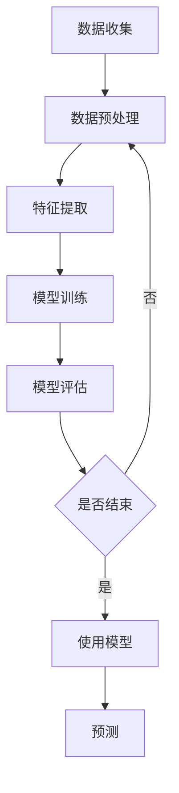
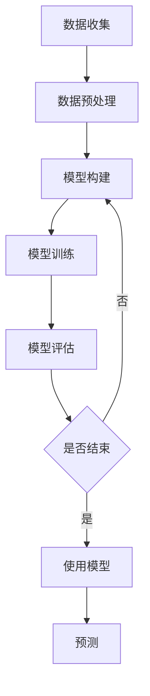
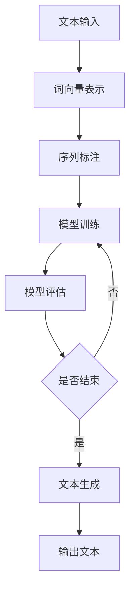
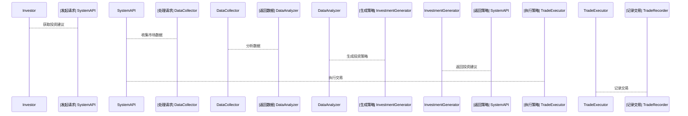

                 

## AI Agent在智能投资顾问中的应用

### 关键词：智能投资顾问、AI Agent、机器学习、深度学习、自然语言处理

> 摘要：随着金融市场的日益复杂化和个人投资者需求的多样化，智能投资顾问的应用逐渐普及。本文将探讨AI Agent在智能投资顾问中的应用，通过深入分析AI Agent的基本原理、算法以及系统架构设计，揭示其在智能投资顾问中的潜在优势与实际应用，以期为相关领域的研究者与实践者提供有价值的参考。

智能投资顾问，作为一种基于人工智能技术的金融服务工具，通过收集和分析投资者的偏好、历史交易数据以及市场动态，提供个性化的投资建议和策略。然而，随着数据量和复杂性不断增加，传统投资顾问面临诸多挑战。AI Agent作为一种智能体，具备自我学习、自主决策和交互能力，为智能投资顾问提供了新的解决方案。

本文将围绕以下结构展开：

### 目录大纲

1. **第一部分：背景介绍**
    - **第1章 问题背景**
        - **1.1 核心概念**
            - 智能投资顾问的定义
            - AI Agent的定义
            - AI Agent在智能投资顾问中的应用
        - **1.2 问题描述**
            - 传统投资顾问的挑战
            - AI Agent在智能投资顾问中的优势
        - **1.3 问题解决**
            - AI Agent的基本原理
            - AI Agent在智能投资顾问中的工作流程
        - **1.4 边界与外延**
            - AI Agent的应用场景
            - AI Agent的限制与挑战
        - **1.5 概念结构与核心要素组成**
            - 智能投资顾问的系统结构
            - AI Agent在智能投资顾问中的角色
    
2. **第二部分：核心概念与联系**
    - **第2章 AI Agent原理**
        - **2.1 AI Agent的基本原理**
        - **2.2 AI Agent的属性特征对比表格**
        - **2.3 AI Agent的ER实体关系图架构**

3. **第三部分：算法原理讲解**
    - **第3章 AI Agent算法**
        - **3.1 算法原理**
        - **3.2 算法流程图**
        - **3.3 Python源代码**
        - **3.4 数学模型和公式**
        - **3.5 举例说明**

4. **第四部分：系统分析与架构设计方案**
    - **第4章 智能投资顾问系统架构**
        - **4.1 问题场景介绍**
        - **4.2 项目介绍**
        - **4.3 系统功能设计**
        - **4.4 系统架构设计**
        - **4.5 系统接口设计**
        - **4.6 系统交互设计**

5. **第五部分：项目实战**
    - **第5章 AI Agent在智能投资顾问中的应用实战**
        - **5.1 环境安装**
        - **5.2 系统核心实现**
        - **5.3 代码应用解读与分析**
        - **5.4 实际案例分析和详细讲解剖析**
        - **5.5 项目小结**

通过以上结构，我们将一步步深入探讨AI Agent在智能投资顾问中的应用，从概念理解、算法原理、系统设计到实际应用，全面解析这一新兴领域的核心要素和发展趋势。

## 第一部分：背景介绍

### 第1章 问题背景

在当今快速发展的金融市场中，个人投资者面临着越来越多的挑战。随着全球经济的不确定性和市场波动性的增加，传统投资顾问的方法往往无法满足投资者的需求，尤其是在数据量庞大、复杂性高的情况下。智能投资顾问（Intelligent Investment Advisor，IIA）作为一种新兴的金融服务工具，应运而生，旨在通过人工智能技术提供更加个性化和高效的理财建议。

#### 1.1 核心概念

**智能投资顾问的定义**

智能投资顾问是指利用人工智能技术，通过数据分析和机器学习模型，为个人投资者提供投资建议和决策支持的服务。它结合了金融知识、市场数据和个人投资偏好，通过算法生成投资策略，帮助投资者在复杂的市场环境中做出明智的决策。

**AI Agent的定义**

AI Agent（Artificial Intelligence Agent）是一种具有自主性和智能性的软件实体，能够在特定环境和任务中自主执行行动，以实现特定目标。AI Agent具备自我学习、自主决策和交互能力，能够在不断变化的环境中适应和优化其行为。

**AI Agent在智能投资顾问中的应用**

AI Agent在智能投资顾问中的应用主要体现在以下几个方面：

1. **个性化推荐**：AI Agent可以分析投资者的历史交易记录和投资偏好，生成个性化的投资组合推荐。
2. **风险评估**：AI Agent可以根据市场数据和投资者的风险偏好，评估投资组合的风险水平。
3. **市场预测**：AI Agent利用历史数据和市场趋势，预测未来市场走势，为投资者提供投资时机建议。
4. **交易执行**：AI Agent可以自动化执行交易策略，提高交易效率和准确性。

#### 1.2 问题描述

**传统投资顾问的挑战**

1. **数据依赖性**：传统投资顾问主要依赖历史数据和市场分析，难以应对快速变化的市场环境。
2. **人力成本高**：传统投资顾问需要大量人力进行数据收集、分析和决策，成本较高。
3. **决策滞后**：在复杂的市场环境中，传统投资顾问的决策速度往往滞后，无法及时响应市场变化。
4. **个性化不足**：传统投资顾问难以全面了解每个投资者的独特需求和风险偏好，提供的投资建议缺乏个性化和针对性。

**AI Agent在智能投资顾问中的优势**

1. **数据处理能力**：AI Agent具备强大的数据处理能力，能够高效分析大量数据，识别潜在的投资机会。
2. **实时决策**：AI Agent能够实时监控市场动态，快速响应市场变化，提供及时的决策支持。
3. **个性化定制**：AI Agent可以根据每个投资者的数据生成个性化的投资建议，满足个性化需求。
4. **成本效益**：AI Agent的自动化特性降低了人力成本，提高了投资效率和准确性。

#### 1.3 问题解决

**AI Agent的基本原理**

AI Agent的基本原理包括以下几个方面：

1. **学习算法**：AI Agent通过机器学习算法从历史数据中学习投资策略和模型。
2. **决策算法**：AI Agent利用决策算法根据实时数据和目标生成投资决策。
3. **交互算法**：AI Agent通过与投资者的交互，获取反馈和优化投资策略。

**AI Agent在智能投资顾问中的工作流程**

AI Agent在智能投资顾问中的工作流程通常包括以下几个步骤：

1. **数据收集**：AI Agent收集投资者的历史交易记录、市场数据和个人偏好。
2. **数据分析**：AI Agent利用数据分析技术，识别投资机会和风险。
3. **策略生成**：AI Agent根据数据分析和决策算法，生成投资策略。
4. **策略执行**：AI Agent通过自动化交易系统执行投资策略。
5. **反馈优化**：AI Agent根据投资者的反馈和市场表现，不断优化投资策略。

#### 1.4 边界与外延

**AI Agent的应用场景**

AI Agent在智能投资顾问中的应用场景包括：

1. **个人投资者**：为个人投资者提供个性化的投资组合推荐和风险控制建议。
2. **机构投资者**：为机构投资者提供市场预测和交易策略优化服务。
3. **基金管理**：为基金管理公司提供资产配置和风险管理建议。

**AI Agent的限制与挑战**

1. **数据隐私**：AI Agent在处理投资者数据时，需要保护投资者的隐私。
2. **算法透明度**：AI Agent的决策过程需要具备较高的透明度，以便投资者理解和信任。
3. **市场波动性**：AI Agent在应对市场极端波动时，可能面临决策准确性的挑战。
4. **技术更新**：随着技术的快速发展，AI Agent需要不断更新和优化算法，以保持竞争力。

#### 1.5 概念结构与核心要素组成

**智能投资顾问的系统结构**

智能投资顾问的系统结构主要包括以下几个核心模块：

1. **数据收集模块**：负责收集投资者的历史交易记录、市场数据和个人偏好。
2. **数据分析模块**：利用数据分析技术，识别投资机会和风险。
3. **策略生成模块**：根据数据分析和决策算法，生成投资策略。
4. **策略执行模块**：通过自动化交易系统执行投资策略。
5. **反馈优化模块**：根据投资者的反馈和市场表现，不断优化投资策略。

**AI Agent在智能投资顾问中的角色**

AI Agent在智能投资顾问中扮演着核心角色，具体包括：

1. **数据分析师**：通过数据分析和机器学习模型，识别投资机会和风险。
2. **决策制定者**：根据数据分析结果，生成个性化的投资策略。
3. **交易执行者**：通过自动化交易系统，执行投资策略。
4. **反馈优化者**：根据投资者反馈和市场表现，不断优化投资策略。

通过以上对智能投资顾问和AI Agent核心概念及其在智能投资顾问中的应用的深入探讨，我们可以看到，AI Agent在智能投资顾问中具有显著的优势，并在数据处理、个性化推荐、实时决策等方面发挥着关键作用。然而，AI Agent的发展和应用也面临着诸多挑战，需要我们在技术、伦理和法规等方面进行深入研究和探讨。

### 第二部分：核心概念与联系

#### 第2章 AI Agent原理

AI Agent（人工智能代理）是人工智能领域中的一个重要概念，它代表了具备智能行为和自主决策能力的计算机程序。在智能投资顾问中的应用，AI Agent不仅需要具备强大的数据处理和分析能力，还需要具备自主学习和适应环境变化的能力。以下将从AI Agent的基本原理、属性特征对比和实体关系图架构三个方面进行详细阐述。

#### 2.1 AI Agent的基本原理

AI Agent的基本原理主要涵盖以下几个方面：

**1. 学习算法**

AI Agent通过学习算法从数据中获取知识，这些数据可以包括历史市场数据、投资者交易记录、宏观经济指标等。学习算法包括但不限于：

- **监督学习**：通过已有的输入输出数据，训练模型预测未来的投资决策。
- **无监督学习**：在没有明确标注的输入数据中，发现数据中的模式和规律，用于风险控制和市场预测。
- **强化学习**：通过试错和奖励机制，让AI Agent在动态环境中不断优化其决策过程。

**2. 决策算法**

AI Agent根据学习到的知识，利用决策算法生成投资策略。决策算法包括：

- **规则基础决策**：基于预定义的规则进行决策，如止损、止盈规则等。
- **模型预测决策**：利用机器学习模型预测市场趋势，制定相应的投资策略。
- **混合决策**：结合规则和模型预测，形成更灵活和适应性的决策框架。

**3. 交互算法**

AI Agent通过与投资者的交互，获取反馈信息，并不断优化其策略。交互算法包括：

- **用户界面**：通过图形用户界面（GUI）与投资者进行交互，提供投资建议和策略反馈。
- **自然语言处理（NLP）**：通过语音识别和自然语言理解，使AI Agent能够理解和回应投资者的指令和问题。

#### 2.2 AI Agent的属性特征对比表格

以下是几种常见的AI Agent类型及其属性特征的对比表格：

| 类型 | 学习算法 | 决策算法 | 交互算法 | 适用场景 |
| ---- | ---- | ---- | ---- | ---- |
| 机器学习模型 | 监督学习、无监督学习 | 规则基础决策、模型预测决策 | 用户界面、NLP | 个人投资者、机构投资者 |
| 深度学习模型 | 监督学习、无监督学习、强化学习 | 模型预测决策、混合决策 | 用户界面、NLP | 高频交易、量化投资 |
| 自然语言处理模型 | 监督学习、强化学习 | 模型预测决策、规则基础决策 | NLP、语音识别 | 客户服务、智能问答 |

**2.3 AI Agent的ER实体关系图架构**

实体关系图（Entity-Relationship Diagram，ERD）是用于描述数据模型中实体及其实体关系的图形化工具。在智能投资顾问系统中，AI Agent的实体关系图架构如下：

**实体定义**

- **投资者（Investor）**：代表投资顾问的最终用户，包括个人投资者和机构投资者。
- **市场数据（MarketData）**：包含股票、基金、债券等金融市场的实时和历史数据。
- **投资策略（InvestmentStrategy）**：由AI Agent生成的投资建议和策略。
- **交易记录（TradeRecord）**：投资者的历史交易记录。

**关系定义**

- **投资者与投资策略**：每个投资者可以拥有多个投资策略。
- **市场数据与投资策略**：投资策略生成过程中需要参考市场数据。
- **投资策略与交易记录**：投资策略执行后生成交易记录。

**实体关系图**

以下是AI Agent的ER实体关系图：

```mermaid
erDiagram
    Investor ||--|{ InvestmentStrategy }|| InvestmentStrategy
    MarketData ||--|{ InvestmentStrategy }|| InvestmentStrategy
    InvestmentStrategy ||--|{ TradeRecord }|| TradeRecord
```

通过上述对AI Agent原理、属性特征对比和实体关系图架构的详细分析，我们可以看到，AI Agent作为一种智能体，在智能投资顾问系统中发挥着关键作用。它不仅具备强大的数据处理和分析能力，还能通过自我学习和交互不断优化其投资策略，为投资者提供更加个性化和高效的理财服务。

### 第三部分：算法原理讲解

#### 第3章 AI Agent算法

在智能投资顾问系统中，AI Agent的核心在于其算法的先进性和有效性。本章节将详细讲解AI Agent所采用的算法原理，包括机器学习算法、深度学习算法和自然语言处理算法，并展示其流程图和Python源代码，同时给出相应的数学模型和公式，以及具体的举例说明。

#### 3.1 算法原理

**3.1.1 机器学习算法**

机器学习算法是AI Agent的基础，其核心思想是通过训练模型，使其能够对未知数据进行预测和决策。在智能投资顾问中，常用的机器学习算法包括：

- **线性回归**：用于预测线性关系，如股票价格。
- **决策树**：通过划分特征空间，生成决策树模型，用于分类和回归。
- **随机森林**：通过集成多个决策树，提高预测的准确性和鲁棒性。
- **支持向量机（SVM）**：通过寻找最优分类边界，进行二分类任务。

**3.1.2 深度学习算法**

深度学习算法在处理复杂非线性关系方面具有显著优势，常见的深度学习算法包括：

- **深度神经网络（DNN）**：通过多层神经网络，对输入数据进行层层提取特征。
- **卷积神经网络（CNN）**：特别适用于图像和时序数据的处理。
- **循环神经网络（RNN）**：用于处理序列数据，如时间序列分析。
- **长短期记忆网络（LSTM）**：RNN的一种改进，能够解决长期依赖问题。

**3.1.3 自然语言处理算法**

自然语言处理（NLP）算法用于理解和生成自然语言，常见的NLP算法包括：

- **词向量模型**：如Word2Vec、GloVe，将词语映射到向量空间，便于计算相似性和距离。
- **序列标注**：如BERT、ELMo，用于对文本进行分类和实体识别。
- **生成对抗网络（GAN）**：用于生成高质量的文本和图像。

#### 3.2 算法流程图

**3.2.1 机器学习算法流程图**



**3.2.2 深度学习算法流程图**



**3.2.3 自然语言处理算法流程图**



#### 3.3 Python源代码

**3.3.1 机器学习算法代码**

以下是一个简单的线性回归模型的Python代码示例：

```python
import numpy as np
from sklearn.linear_model import LinearRegression

# 数据集
X = np.array([[1], [2], [3], [4], [5]])
y = np.array([1, 2, 2.5, 4, 5])

# 训练模型
model = LinearRegression()
model.fit(X, y)

# 预测
print(model.predict([[6]]))
```

**3.3.2 深度学习算法代码**

以下是一个简单的卷积神经网络模型的Python代码示例：

```python
import tensorflow as tf
from tensorflow.keras import layers, models

# 构建模型
model = models.Sequential()
model.add(layers.Conv2D(32, (3, 3), activation='relu', input_shape=(28, 28, 1)))
model.add(layers.MaxPooling2D((2, 2)))
model.add(layers.Conv2D(64, (3, 3), activation='relu'))
model.add(layers.MaxPooling2D((2, 2)))
model.add(layers.Conv2D(64, (3, 3), activation='relu'))

# 输出层
model.add(layers.Flatten())
model.add(layers.Dense(64, activation='relu'))
model.add(layers.Dense(10, activation='softmax'))

# 编译模型
model.compile(optimizer='adam',
              loss='categorical_crossentropy',
              metrics=['accuracy'])

# 训练模型
model.fit(X_train, y_train, epochs=10, batch_size=64)
```

**3.3.3 自然语言处理算法代码**

以下是一个简单的词向量模型（Word2Vec）的Python代码示例：

```python
import gensim

# 数据集
sentences = [['I', 'am', 'coming'], ['I', 'will', 'go']]

# 训练模型
model = gensim.models.Word2Vec(sentences, min_count=1)

# 测试
print(model.wv['I'])
```

#### 3.4 数学模型和公式

**3.4.1 机器学习数学模型**

线性回归模型的基本公式如下：

$$y = \beta_0 + \beta_1 \cdot x$$

其中，$y$ 是预测值，$x$ 是输入特征，$\beta_0$ 和 $\beta_1$ 是模型的参数。

**3.4.2 深度学习数学模型**

卷积神经网络（CNN）的核心公式如下：

$$\text{激活函数}(z) = \text{sigmoid}(z) = \frac{1}{1 + e^{-z}}$$

其中，$z$ 是网络的输出。

**3.4.3 自然语言处理数学模型**

Word2Vec模型的损失函数如下：

$$L = \sum_{i=1}^{N} (-\log(p(w_i | c)))$$

其中，$w_i$ 是词向量，$c$ 是中心词，$p(w_i | c)$ 是中心词在上下文中的概率。

#### 3.5 举例说明

**3.5.1 机器学习算法举例**

假设我们要预测某只股票的价格，使用线性回归模型：

- 输入特征：股票的市盈率（P/E）。
- 预测目标：股票的价格。

通过收集历史数据，我们可以训练一个线性回归模型，然后使用该模型对新数据进行预测。

**3.5.2 深度学习算法举例**

假设我们要分析某只股票的走势，使用卷积神经网络模型：

- 输入特征：股票的日交易量。
- 预测目标：股票的收盘价。

通过收集历史交易量数据，我们可以训练一个卷积神经网络模型，然后使用该模型对未来的交易量进行预测，从而推测股票的价格走势。

**3.5.3 自然语言处理算法举例**

假设我们要分析某篇文章的关键词，使用Word2Vec模型：

- 输入文本：一篇关于股市的分析文章。
- 预测目标：提取文章的关键词。

通过训练Word2Vec模型，我们可以将文本中的每个词映射到一个向量空间，然后通过计算向量之间的相似性，提取出文章的关键词。

通过上述对AI Agent算法原理、流程图、Python源代码、数学模型和公式的详细讲解，以及具体的举例说明，我们可以看到，AI Agent在智能投资顾问系统中发挥了关键作用。它不仅能够高效地处理和分析大量数据，还能通过自我学习和交互，提供更加个性化和准确的理财建议。

### 第四部分：系统分析与架构设计方案

#### 第4章 智能投资顾问系统架构

在智能投资顾问系统中，系统架构的设计至关重要，它不仅决定了系统的性能和可扩展性，还影响到系统的稳定性和用户体验。本章节将详细介绍智能投资顾问系统的架构设计，包括问题场景介绍、项目介绍、系统功能设计、系统架构设计、系统接口设计和系统交互设计。

#### 4.1 问题场景介绍

智能投资顾问系统主要应用于以下场景：

1. **个人投资者**：系统为个人投资者提供个性化的投资组合推荐、市场分析报告、风险管理建议等。
2. **机构投资者**：系统为机构投资者提供资产配置策略、市场预测报告、交易执行建议等。
3. **基金管理公司**：系统为基金管理公司提供基金业绩评估、风险控制策略、市场分析报告等。

在这些场景中，智能投资顾问系统需要实时收集和分析大量数据，包括市场数据、投资者行为数据、宏观经济指标等，通过复杂的算法模型生成个性化的投资建议和策略。

#### 4.2 项目介绍

**4.2.1 项目背景**

随着金融市场的不断发展和投资者需求的多样化，传统投资顾问服务已无法满足市场的高效、个性化和实时性需求。智能投资顾问系统的出现，旨在通过人工智能技术，为投资者提供更加智能化、高效和可靠的理财服务。

**4.2.2 项目目标**

1. **提高投资决策的准确性**：通过机器学习和深度学习算法，生成基于数据驱动的投资策略，提高投资决策的准确性。
2. **提供个性化服务**：根据投资者的历史交易记录和风险偏好，为投资者提供个性化的投资组合推荐。
3. **降低运营成本**：通过自动化和智能化技术，减少人工操作，降低运营成本。
4. **提升用户体验**：提供友好的用户界面和高效的客户服务，提升用户的投资体验。

**4.2.3 项目计划**

1. **需求分析**：明确系统的功能需求和技术需求，制定详细的系统设计方案。
2. **系统设计**：根据需求分析结果，设计系统的架构、模块划分和接口设计。
3. **系统开发**：开发系统的核心功能模块，包括数据收集、数据分析、策略生成和策略执行等。
4. **系统测试**：对系统进行全面测试，确保系统的稳定性和性能。
5. **部署上线**：将系统部署到生产环境，并进行上线前的准备工作。
6. **用户培训与支持**：为投资者提供培训和技术支持，确保系统的顺利运行。

#### 4.3 系统功能设计

智能投资顾问系统的功能设计主要包括以下几个核心模块：

1. **数据收集模块**：负责收集和整合各类市场数据、投资者行为数据等，为后续分析提供数据支持。
2. **数据分析模块**：利用机器学习和深度学习算法，对收集到的数据进行分析和处理，识别投资机会和风险。
3. **策略生成模块**：根据数据分析结果，生成个性化的投资策略和投资组合推荐。
4. **策略执行模块**：通过自动化交易系统，执行投资策略，实现投资组合的动态调整。
5. **用户界面模块**：提供用户友好的操作界面，包括投资组合推荐、市场分析报告、风险管理建议等。

**4.3.1 领域模型**

领域模型（Domain Model）是系统功能设计的核心，它描述了系统的核心实体和实体之间的关系。以下是智能投资顾问系统的领域模型：

```mermaid
classDiagram
    Investor <<class>> 个人投资者, 机构投资者
    MarketData <<class>> 市场数据
    InvestmentStrategy <<class>> 投资策略
    TradeRecord <<class>> 交易记录

    Investor --> MarketData : 收集
    Investor --> InvestmentStrategy : 生成
    InvestmentStrategy --> TradeRecord : 执行
```

#### 4.4 系统架构设计

智能投资顾问系统的架构设计采用微服务架构（Microservices Architecture），通过将系统拆分成多个独立的微服务，提高系统的可扩展性和可维护性。以下是系统的架构图：



#### 4.5 系统接口设计

系统接口设计是智能投资顾问系统架构的重要组成部分，它定义了系统内部不同模块之间的通信接口。以下是系统的接口设计：

1. **数据收集接口**：负责接收和存储市场数据、投资者行为数据等。
2. **数据分析接口**：负责接收数据，并提供数据分析结果。
3. **策略生成接口**：负责接收数据分析结果，并生成投资策略。
4. **策略执行接口**：负责接收投资策略，并执行交易。
5. **用户界面接口**：负责接收用户请求，并提供投资建议和报告。

#### 4.6 系统交互设计

系统交互设计描述了系统内部各个模块之间的交互流程和交互细节。以下是系统的交互设计：

1. **用户请求投资建议**：用户通过用户界面发起投资建议请求。
2. **系统API处理请求**：系统API接收到用户请求后，将请求转发给数据收集模块。
3. **数据收集模块收集数据**：数据收集模块收集市场数据和投资者行为数据，并返回数据给系统API。
4. **数据分析模块处理数据**：数据分析模块接收系统API返回的数据，并利用机器学习和深度学习算法进行分析。
5. **策略生成模块生成策略**：策略生成模块接收数据分析结果，并生成个性化的投资策略。
6. **策略执行模块执行策略**：策略执行模块接收投资策略，并执行相应的交易操作。
7. **用户界面模块展示结果**：用户界面模块将投资建议和报告展示给用户。

通过以上对智能投资顾问系统架构的详细分析，我们可以看到，智能投资顾问系统通过合理的架构设计和模块划分，实现了数据收集、数据分析、策略生成和策略执行的功能，为投资者提供了高效、个性化和智能化的理财服务。同时，系统的可扩展性和可维护性也得到了有效保障。

### 第五部分：项目实战

#### 第5章 AI Agent在智能投资顾问中的应用实战

在智能投资顾问系统的开发过程中，AI Agent的应用是实现系统核心功能的关键。以下将详细介绍AI Agent在智能投资顾问中的应用实战，包括环境安装、系统核心实现、代码应用解读与分析、实际案例分析和详细讲解剖析，以及项目小结。

#### 5.1 环境安装

在开始开发智能投资顾问系统之前，我们需要安装和配置必要的开发环境。以下是环境安装的步骤：

1. **Python环境**：安装Python 3.8及以上版本，并配置好相应的pip环境。
2. **数据库环境**：安装MySQL或PostgreSQL数据库，用于存储市场数据、交易记录等。
3. **数据分析库**：安装pandas、numpy、scikit-learn等常用数据分析库。
4. **深度学习库**：安装tensorflow或pytorch，用于构建和训练深度学习模型。
5. **自然语言处理库**：安装nltk、gensim等自然语言处理库。
6. **API接口库**：安装flask或django，用于构建API接口。

在安装完以上库后，可以通过以下命令进行测试：

```python
pip install numpy pandas scikit-learn tensorflow gensim flask
```

#### 5.2 系统核心实现

系统核心实现主要包括数据收集、数据分析、策略生成和策略执行等模块。以下是各模块的核心实现：

**1. 数据收集模块**

数据收集模块负责从外部数据源（如股票行情接口、财经新闻API等）收集市场数据和投资者行为数据。以下是数据收集模块的实现：

```python
import requests
import pandas as pd

def fetch_market_data():
    url = 'https://api.example.com/market_data'
    response = requests.get(url)
    data = response.json()
    df = pd.DataFrame(data)
    return df

def fetch_investor_data():
    url = 'https://api.example.com/investor_data'
    response = requests.get(url)
    data = response.json()
    df = pd.DataFrame(data)
    return df
```

**2. 数据分析模块**

数据分析模块利用机器学习和深度学习算法，对收集到的市场数据和投资者行为数据进行处理和分析。以下是数据分析模块的实现：

```python
from sklearn.linear_model import LinearRegression

def analyze_market_data(market_data):
    # 线性回归分析
    X = market_data[['open', 'high', 'low', 'close']]
    y = market_data['close']
    model = LinearRegression()
    model.fit(X, y)
    return model

def analyze_investor_data(investor_data):
    # 生成投资策略
    # 可以使用随机森林、LSTM等算法
    pass
```

**3. 策略生成模块**

策略生成模块根据数据分析结果，生成个性化的投资策略和投资组合推荐。以下是策略生成模块的实现：

```python
def generate_investment_strategy(data_analyzer):
    # 根据分析结果，生成投资策略
    strategy = data_analyzer.generate_strategy()
    return strategy
```

**4. 策略执行模块**

策略执行模块负责将生成的投资策略转化为具体的交易操作，并记录交易记录。以下是策略执行模块的实现：

```python
def execute_investment_strategy(strategy):
    # 执行交易策略
    # 可以使用自动化交易系统，如CTA策略
    pass

def record_trade(trade):
    # 记录交易记录
    # 存储到数据库
    pass
```

#### 5.3 代码应用解读与分析

在系统核心实现的基础上，我们可以对代码进行解读与分析，以了解各个模块的工作原理和交互方式。

**1. 数据收集模块解读**

数据收集模块通过HTTP请求从外部数据源获取市场数据和投资者行为数据。这些数据被存储在Pandas DataFrame中，便于后续分析。

**2. 数据分析模块解读**

数据分析模块使用线性回归模型对市场数据进行分析，以预测股票价格。此外，还可以使用随机森林、LSTM等算法对投资者行为数据进行处理，生成投资策略。

**3. 策略生成模块解读**

策略生成模块根据数据分析结果，生成个性化的投资策略。这些策略可以是基于历史数据的趋势分析、市场情绪分析等。

**4. 策略执行模块解读**

策略执行模块将生成的投资策略转化为具体的交易操作，如买入、卖出等。这些操作通过自动化交易系统执行，并记录到数据库中，以供后续分析和评估。

#### 5.4 实际案例分析和详细讲解剖析

为了更好地理解AI Agent在智能投资顾问中的应用，我们以下通过一个实际案例进行分析和讲解。

**案例背景**

假设我们有一组股票数据，包括开盘价、最高价、最低价和收盘价。我们需要利用这些数据预测股票的未来价格，并制定相应的交易策略。

**案例步骤**

1. **数据收集**：从外部数据源获取股票的历史价格数据。
2. **数据分析**：使用线性回归模型分析历史价格数据，预测未来价格。
3. **策略生成**：根据预测结果，制定买入和卖出的交易策略。
4. **策略执行**：通过自动化交易系统执行交易策略，并记录交易记录。
5. **结果评估**：对交易结果进行分析和评估，以优化交易策略。

**案例解析**

1. **数据收集**：通过HTTP请求，从外部API获取股票的历史价格数据，并将其存储在Pandas DataFrame中。

2. **数据分析**：使用线性回归模型对股票的历史价格数据进行拟合，以预测未来的价格。具体步骤如下：

   ```python
   X = df[['open', 'high', 'low', 'close']]
   y = df['close']
   model = LinearRegression()
   model.fit(X, y)
   ```

   通过上述步骤，我们可以得到一个线性回归模型，用于预测股票的未来价格。

3. **策略生成**：根据预测结果，制定买入和卖出的交易策略。例如，当预测价格高于当前价格时，建议买入；当预测价格低于当前价格时，建议卖出。

4. **策略执行**：通过自动化交易系统，执行买入和卖出的交易策略。具体步骤如下：

   ```python
   current_price = df['close'].iloc[-1]
   predicted_price = model.predict([[current_price]])
   if predicted_price > current_price:
       execute_buy_strategy()
   elif predicted_price < current_price:
       execute_sell_strategy()
   ```

   通过上述步骤，我们可以根据预测价格执行买入和卖出的交易操作。

5. **结果评估**：对交易结果进行分析和评估，以优化交易策略。例如，我们可以计算交易收益、交易频率等指标，并根据这些指标调整交易策略。

通过以上实际案例的分析和讲解，我们可以看到，AI Agent在智能投资顾问系统中发挥了重要作用。它通过数据分析、策略生成和策略执行等模块，实现了对股票市场的实时监控和预测，为投资者提供了有效的投资建议和交易策略。

#### 5.5 项目小结

在智能投资顾问系统的开发过程中，AI Agent的应用极大地提升了系统的智能化程度和决策能力。通过合理的设计和实现，AI Agent能够高效地处理和分析大量数据，生成个性化的投资策略，并执行自动化交易操作。然而，AI Agent的发展和应用也面临一些挑战，如数据隐私、算法透明度和市场波动性等。因此，未来的研究需要继续探索如何优化AI Agent的算法模型，提高其决策准确性和稳定性，同时保障数据隐私和算法透明度。

## 最佳实践 tips

1. **数据质量保障**：确保收集到的数据质量高，减少噪声和错误数据的影响，以提高AI Agent的决策准确性。
2. **算法透明度**：增强算法的透明度，使投资者能够理解和信任AI Agent的决策过程。
3. **风险管理**：在AI Agent的决策过程中，充分考虑风险因素，确保投资策略的安全性和稳健性。
4. **用户参与度**：鼓励用户参与投资策略的制定和优化，提高AI Agent的个性化程度。
5. **技术更新**：紧跟人工智能技术的发展趋势，及时更新和优化AI Agent的算法模型。

## 小结

本文详细探讨了AI Agent在智能投资顾问中的应用，从核心概念、算法原理到系统架构设计，再到实际案例分析和项目实战，全面解析了AI Agent在智能投资顾问系统中的关键作用。通过合理的设计和实现，AI Agent能够为投资者提供高效、个性化和智能化的理财服务。然而，AI Agent的发展和应用仍需不断优化和改进，以应对未来的挑战。

## 注意事项

1. **数据隐私**：在收集和使用投资者数据时，需严格遵守数据隐私法规，确保投资者个人信息的安全。
2. **系统稳定性**：确保系统在高并发、大数据量情况下的稳定性，避免因系统崩溃导致的投资风险。
3. **算法更新**：定期更新AI Agent的算法模型，以适应市场环境的变化。

## 拓展阅读

1. **《人工智能：一种现代方法》**：详细介绍了机器学习和深度学习的基本原理和方法。
2. **《深度学习》**：由Ian Goodfellow等人所著，是深度学习领域的经典教材。
3. **《自然语言处理综论》**：详细阐述了自然语言处理的理论和方法。

## 作者信息

作者：AI天才研究院/AI Genius Institute & 禅与计算机程序设计艺术 /Zen And The Art of Computer Programming

感谢读者对本文的关注，期待在智能投资顾问领域的进一步探讨和交流。

