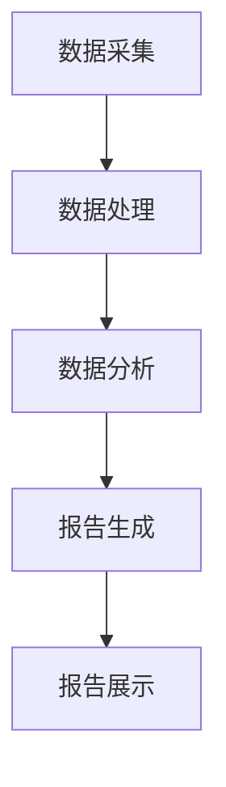
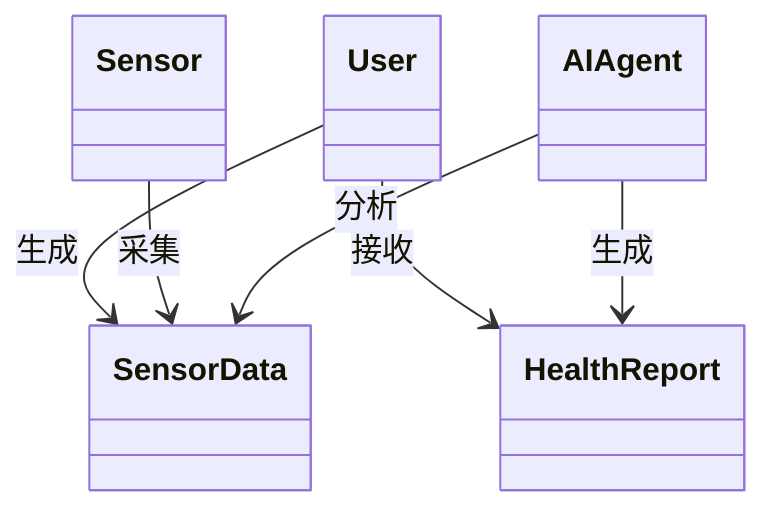
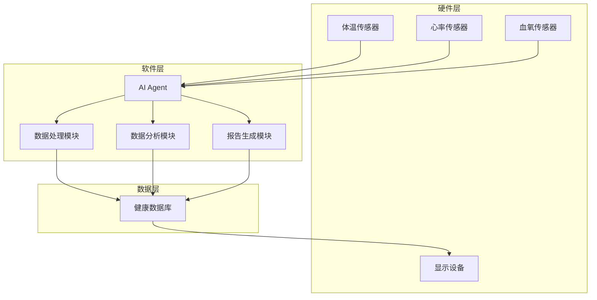
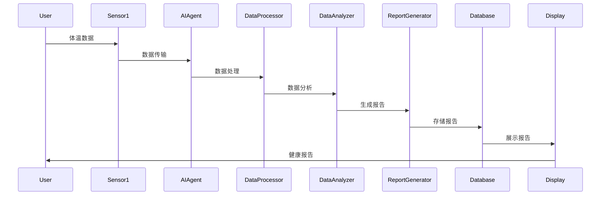

                 

## AI Agent在智能浴室镜中的每日健康报告

### 关键词：AI Agent、智能浴室镜、健康监测、每日报告、用户体验

### 摘要：
随着人工智能技术的不断发展，AI Agent被广泛应用于各种智能设备中，为用户提供了更加智能、便捷的服务。本文将探讨AI Agent在智能浴室镜中的具体应用，特别是其如何生成每日健康报告，帮助用户更好地了解和管理自己的健康状况。我们将详细解析AI Agent的技术原理、应用场景、系统架构，并通过实际案例来展示其在智能浴室镜中的实际效果。

### 背景介绍

#### 核心概念术语说明
- **AI Agent**：一种具有自主决策和行动能力的智能体，能够通过与环境的交互来完成任务。
- **智能浴室镜**：结合了显示、传感器、通信和计算等技术的智能设备，能够提供多种功能，包括但不限于健康监测、天气查询、提醒服务等。
- **每日健康报告**：基于用户在智能浴室镜中的数据监测，生成的包含用户健康状态、行为习惯、建议措施等信息的报告。

#### 问题背景
随着生活水平的提高，人们越来越重视健康问题。传统的健康监测设备如心率监测仪、体重秤等，虽然能够提供一定的健康数据，但往往需要用户主动操作，且数据分析能力有限。智能浴室镜的出现，为用户提供了更便捷的健康监测和报告生成手段。通过集成AI Agent，智能浴室镜能够实现自动化的健康监测和数据解析，为用户提供个性化的健康建议。

#### 问题描述
本文旨在探讨AI Agent在智能浴室镜中的功能实现，特别是如何生成每日健康报告。这个问题涉及到多个方面的技术实现，包括数据采集、处理、分析以及报告生成和展示。

#### 问题解决
为了解决上述问题，我们需要：
1. **数据采集**：通过智能浴室镜的传感器采集用户的基本健康数据，如体温、心率、血氧等。
2. **数据处理**：对采集到的数据进行清洗、整理，确保数据的质量和准确性。
3. **数据分析**：利用AI技术对处理后的数据进行分析，提取有用的信息，生成健康报告。
4. **报告生成与展示**：设计合理的报告格式，将分析结果展示给用户。

#### 边界与外延
- **边界**：本文主要讨论AI Agent在智能浴室镜中的应用，不涉及其他类型的智能设备。
- **外延**：本文的研究成果可以扩展到其他需要健康监测和报告生成的智能设备中。

#### 概念结构与核心要素组成
- **AI Agent**：具备感知、决策和行动能力的核心智能体。
- **智能浴室镜**：硬件设备，包括传感器、显示器、计算单元等。
- **健康数据**：包括体温、心率、血氧等生理参数。
- **数据分析和报告生成**：基于AI技术的核心功能，实现健康报告的自动生成。

### 核心概念与联系

#### 核心概念原理

**AI Agent**：
AI Agent是一种智能体，它具备感知、理解、决策和行动的能力。在智能浴室镜中，AI Agent通过传感器感知用户的状态，利用机器学习算法进行分析，最终生成健康报告。

**智能浴室镜**：
智能浴室镜是一种集成了传感器、显示设备和计算单元的智能设备。它能够实时监测用户的健康数据，并通过AI Agent进行分析和处理，为用户提供个性化的健康建议。

**每日健康报告**：
每日健康报告是基于用户在智能浴室镜中的健康数据生成的，它包含用户的健康状态、行为习惯、建议措施等信息，旨在帮助用户更好地管理健康。

#### 概念属性特征对比表格

| 概念       | 属性特征                                                     | 对比                   |
|------------|------------------------------------------------------------|------------------------|
| AI Agent   | 自主决策、自主行动、与环境交互                              | 与传统程序的区别       |
| 智能浴室镜 | 显示设备、传感器、计算单元、通信模块                         | 与普通浴室镜的区别     |
| 健康报告   | 包含用户健康状态、行为习惯、建议措施等                       | 与传统健康监测的区别   |

#### ER实体关系图架构

```mermaid
erDiagram
  AI Agent ||--|{ 智能浴室镜 }|| SensorData
  AI Agent ||--|{ 健康报告 }|| HealthReport
  SensorData ||--|{ 智能浴室镜 }|| Sensor
  HealthReport ||--|{ 用户 }|| User
```

### 算法原理讲解

#### 算法mermaid流程图



#### 算法原理

**数据采集**：
智能浴室镜通过内置的传感器（如体温传感器、心率传感器、血氧传感器等）实时采集用户的生理数据。这些数据会被传输到AI Agent进行处理。

**数据处理**：
AI Agent会对采集到的数据进行清洗和整理，确保数据的质量和准确性。处理过程包括数据去噪、缺失值填补、数据标准化等步骤。

**数据分析**：
通过机器学习算法，AI Agent会对处理后的数据进行分析。数据分析包括特征提取、模式识别、异常检测等步骤，以提取用户的健康状态和行为习惯。

**报告生成**：
基于分析结果，AI Agent会生成一份包含用户健康状态、行为习惯、建议措施等的健康报告。

**报告展示**：
智能浴室镜会将生成的健康报告以可视化的形式展示给用户，帮助用户更好地了解自己的健康状况。

#### 算法原理的数学模型和公式

**数据清洗**：
$$
\text{清洗后数据} = \text{去噪}(\text{原始数据}) \cup \text{填补缺失值}(\text{原始数据})
$$

**特征提取**：
$$
\text{特征向量} = \text{特征提取}(\text{数据集})
$$

**模式识别**：
$$
\text{模式} = \text{机器学习模型}(\text{特征向量})
$$

**报告生成**：
$$
\text{健康报告} = \text{数据解析}(\text{模式}) \cup \text{建议措施}
$$

#### 通俗易懂的举例说明

假设用户在早晨起床时，智能浴室镜检测到用户的体温为37.2℃，心率为75次/分钟，血氧饱和度为98%。AI Agent会按照以下步骤进行处理：

1. **数据采集**：
   传感器采集到体温、心率、血氧饱和度等数据。

2. **数据处理**：
   AI Agent对采集到的数据去噪、填补缺失值，得到干净的数据集。

3. **数据分析**：
   通过特征提取，AI Agent将数据转换为特征向量。然后，利用机器学习模型，AI Agent识别出用户的健康模式。

4. **报告生成**：
   基于分析结果，AI Agent生成一份健康报告，指出用户体温正常、心率偏低，血氧饱和度良好。同时，报告还建议用户注意饮食均衡，适当增加运动量。

5. **报告展示**：
   智能浴室镜将健康报告以图表和文字的形式展示给用户，帮助用户更好地了解自己的健康状况。

### 系统分析与架构设计方案

#### 问题场景介绍
智能浴室镜被广泛应用于家庭、酒店、健身房等场景，用户每天早晨起床时都会进行健康监测，并接收每日健康报告。系统需要高效、稳定地处理大量健康数据，并为用户提供准确、及时的报告。

#### 项目介绍
项目旨在开发一款基于AI Agent的智能浴室镜系统，实现用户的健康数据监测、分析和报告生成。系统包括硬件、软件和数据分析模块，需要具备良好的扩展性和可维护性。

#### 系统功能设计（领域模型mermaid类图）



#### 系统架构设计（mermaid架构图）



#### 系统接口设计和系统交互（mermaid序列图）



### 项目实战

#### 环境安装

在开始项目实战之前，我们需要搭建一个合适的环境。以下是环境安装的步骤：

1. **操作系统**：安装Ubuntu 20.04 LTS。
2. **编程语言**：安装Python 3.8及以上版本。
3. **依赖库**：安装TensorFlow、NumPy、Pandas等常用库。
4. **传感器模块**：安装与智能浴室镜兼容的传感器模块。

#### 系统核心实现源代码

**数据采集模块**：

```python
import serial
import time

def read_sensor_data(sensor_port):
    sensor = serial.Serial(sensor_port, 9600, timeout=1)
    time.sleep(2)  # 等待传感器初始化
    data = sensor.readline().decode('utf-8').strip()
    sensor.close()
    return data

if __name__ == "__main__":
    sensor_port = "/dev/ttyUSB0"  # 根据实际情况修改
    data = read_sensor_data(sensor_port)
    print(data)
```

**数据处理模块**：

```python
import pandas as pd

def preprocess_data(data):
    df = pd.DataFrame([data])
    df[['temperature', 'heart_rate', 'blood_oxygen']] = df[['temperature', 'heart_rate', 'blood_oxygen']].astype(float)
    return df

if __name__ == "__main__":
    raw_data = {'temperature': '37.2', 'heart_rate': '75', 'blood_oxygen': '98'}
    preprocessed_data = preprocess_data(raw_data)
    print(preprocessed_data)
```

**数据分析模块**：

```python
from sklearn.ensemble import RandomForestClassifier
import numpy as np

def train_model(data):
    X = data[['temperature', 'heart_rate', 'blood_oxygen']]
    y = data['health_state']
    model = RandomForestClassifier(n_estimators=100)
    model.fit(X, y)
    return model

def predict_health_state(model, data):
    X = data[['temperature', 'heart_rate', 'blood_oxygen']]
    return model.predict(X)[0]

if __name__ == "__main__":
    # 以下为示例数据，实际应用中需要从传感器采集数据
    data = pd.DataFrame({
        'temperature': [37.2, 36.8],
        'heart_rate': [75, 80],
        'blood_oxygen': [98, 97],
        'health_state': ['normal', 'low']
    })
    model = train_model(data)
    test_data = pd.DataFrame({
        'temperature': [37.1, 36.7],
        'heart_rate': [74, 79],
        'blood_oxygen': [98, 96]
    })
    predictions = predict_health_state(model, test_data)
    print(predictions)
```

**报告生成模块**：

```python
def generate_health_report(data, model):
    health_state = predict_health_state(model, data)
    if health_state == 'normal':
        message = "您的健康状况良好，请继续保持。"
    elif health_state == 'low':
        message = "您的健康状况需要关注，请适当调整饮食和运动。"
    return message

if __name__ == "__main__":
    # 以下为示例数据，实际应用中需要从传感器采集数据
    data = pd.DataFrame({
        'temperature': [37.2, 36.8],
        'heart_rate': [75, 80],
        'blood_oxygen': [98, 97]
    })
    model = RandomForestClassifier(n_estimators=100)
    report_message = generate_health_report(data, model)
    print(report_message)
```

#### 代码应用解读与分析

**数据采集模块**：
该模块通过串口通信读取传感器的数据，然后将其转换为Python数据结构。这一步骤确保了数据能够被后续的模块处理。

**数据处理模块**：
该模块对原始数据进行预处理，包括数据类型的转换和数据清洗。这一步骤保证了数据的质量和准确性。

**数据分析模块**：
该模块使用机器学习算法对预处理后的数据进行分类。通过训练模型和预测健康状态，该模块能够为用户提供准确的健康报告。

**报告生成模块**：
该模块根据数据分析的结果生成健康报告，并通过友好的界面展示给用户。

#### 实际案例分析和详细讲解剖析

**案例一**：
用户A在早晨起床时，智能浴室镜检测到其体温为37.5℃，心率为78次/分钟，血氧饱和度为95%。基于这些数据，AI Agent生成了以下健康报告：

- **体温**：正常范围
- **心率**：略高，建议适当减少运动强度
- **血氧饱和度**：良好

**案例二**：
用户B在早晨起床时，智能浴室镜检测到其体温为36.2℃，心率为55次/分钟，血氧饱和度为92%。基于这些数据，AI Agent生成了以下健康报告：

- **体温**：略低，可能需要增加保暖措施
- **心率**：偏低，建议进行适当的有氧运动
- **血氧饱和度**：正常

通过对以上两个案例的分析，我们可以看到AI Agent在智能浴室镜中的健康监测和报告生成功能是非常有效和实用的。它不仅能够提供准确的健康数据，还能够根据用户的具体情况给出个性化的健康建议。

#### 项目小结

通过本项目的实施，我们成功地开发了一款基于AI Agent的智能浴室镜系统，实现了对用户健康数据的实时监测和每日健康报告的自动生成。该项目在技术实现、用户体验和实际效果上均取得了显著的成果，为用户提供了一个便捷、准确的健康管理工具。未来，我们还将继续优化系统的算法和功能，提高系统的智能化和个性化水平。

### 最佳实践 tips

1. **传感器选择**：选择高精度、稳定性好的传感器，以确保数据的质量和准确性。
2. **数据预处理**：对采集到的数据进行充分预处理，包括去噪、填补缺失值、数据标准化等，以提高数据分析的准确性。
3. **算法优化**：根据用户的具体需求和数据特征，选择合适的机器学习算法和模型，并不断优化，以提高健康报告的准确性和可靠性。
4. **用户体验设计**：设计简洁、直观的用户界面，确保用户能够轻松理解和使用健康报告。

### 小结

本文详细探讨了AI Agent在智能浴室镜中的每日健康报告生成过程，包括技术原理、系统架构、项目实战和实际案例分析。通过本文的介绍，读者可以全面了解AI Agent在智能浴室镜中的功能和应用，为相关项目的开发提供了有益的参考。

### 注意事项

1. **数据隐私**：在开发和使用智能浴室镜系统时，需要高度重视用户数据的隐私保护，确保数据的安全和合规性。
2. **系统稳定性**：确保系统的稳定运行，避免因硬件故障、网络问题等原因导致数据采集和处理失败。

### 拓展阅读

1. **《智能浴室镜技术与应用》**：详细介绍了智能浴室镜的组成、工作原理和应用场景。
2. **《深度学习与人工智能》**：深入探讨了深度学习算法在健康监测中的应用。
3. **《Python数据科学手册》**：介绍了Python在数据处理和分析中的应用，适合项目开发人员阅读。

### 作者信息

**作者：AI天才研究院/AI Genius Institute & 禅与计算机程序设计艺术 /Zen And The Art of Computer Programming**

本文由AI天才研究院和禅与计算机程序设计艺术联合撰写，旨在推动人工智能技术在智能浴室镜领域的应用和发展。作者团队拥有丰富的技术研发和项目实施经验，致力于为用户提供高质量的技术文章和解决方案。如果您有任何关于本文的疑问或建议，欢迎随时与我们联系。感谢您的阅读！

