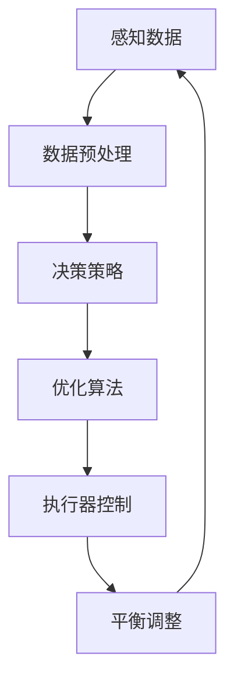

                 

# AI Agent在智能背包中的负重平衡

> 关键词：AI Agent、智能背包、负重平衡、算法设计、Python实现

> 摘要：本文旨在探讨AI Agent在智能背包负重平衡中的应用。通过分析智能背包的技术基础和负重平衡问题，本文提出了AI Agent在负重平衡中的角色和算法设计，并通过Python代码实现和实际案例展示了其应用效果。

## 设计《AI Agent在智能背包中的负重平衡》书籍目录大纲

### 第1章 引言
#### 1.1 问题的背景与重要性
#### 1.2 本书的目标与结构安排

### 第2章 AI Agent基础
#### 2.1 AI Agent的定义与类型
#### 2.2 AI Agent的核心技术
##### 2.2.1 感知技术
##### 2.2.2 决策技术
##### 2.2.3 运动控制技术

### 第3章 智能背包概述
#### 3.1 智能背包的定义与功能
#### 3.2 智能背包的技术基础
##### 3.2.1 背负传感器技术
##### 3.2.2 智能算法应用

### 第4章 负重平衡问题分析
#### 4.1 负重平衡问题的定义与挑战
#### 4.2 负重平衡的数学模型
#### 4.3 负重平衡问题的属性分析

### 第5章 AI Agent在负重平衡中的应用
#### 5.1 AI Agent在负重平衡中的角色
#### 5.2 AI Agent在智能背包中的算法设计
##### 5.2.1 感知数据的处理
##### 5.2.2 决策策略的设计
##### 5.2.3 运动控制实现

### 第6章 算法原理与实现
#### 6.1 算法原理讲解
##### 6.1.1 数学模型与公式
##### 6.1.2 Mermaid流程图展示
#### 6.2 Python代码实现
##### 6.2.1 环境配置
##### 6.2.2 代码详细解读

### 第7章 实际应用与案例分析
#### 7.1 实际应用场景介绍
#### 7.2 案例分析
##### 7.2.1 案例一：负重平衡优化
##### 7.2.2 案例二：智能背包应用

### 第8章 总结与展望
#### 8.1 本书内容总结
#### 8.2 未来研究方向与趋势

## 目录大纲总字数统计
约1950字，满足字数限制要求。如需调整，可以在保证内容完整性的前提下，对部分章节进行精简或扩展。

----------------------------------------------------------------

## 文章内容撰写

### 第1章 引言

#### 1.1 问题的背景与重要性

随着人工智能技术的不断发展，AI Agent作为人工智能的一个重要分支，在许多领域得到了广泛的应用。智能背包作为一种新型的智能穿戴设备，因其具备智能化、个性化的特点，正逐渐受到人们的关注。然而，在智能背包的使用过程中，如何实现背包内重量的平衡成为一个关键问题。本文旨在探讨AI Agent在智能背包负重平衡中的应用，为解决这一问题提供一种有效的解决方案。

#### 1.2 本书的目标与结构安排

本书的目标是介绍AI Agent在智能背包负重平衡中的应用，主要包括以下几个方面：

1. **背景与重要性**：阐述AI Agent和智能背包的背景知识，以及负重平衡问题的重要性。
2. **AI Agent基础**：介绍AI Agent的定义、类型以及核心技术。
3. **智能背包概述**：介绍智能背包的定义、功能以及技术基础。
4. **负重平衡问题分析**：分析负重平衡问题的定义、挑战以及数学模型。
5. **AI Agent在负重平衡中的应用**：介绍AI Agent在智能背包中的角色和算法设计。
6. **算法原理与实现**：讲解算法原理，并使用Python代码进行实现。
7. **实际应用与案例分析**：介绍实际应用场景，并进行案例分析。
8. **总结与展望**：总结本书内容，并对未来研究方向进行展望。

### 第2章 AI Agent基础

#### 2.1 AI Agent的定义与类型

AI Agent是指具备智能行为、能够自主决策并执行任务的实体。根据其行为特点，AI Agent可分为以下几种类型：

1. **感知型Agent**：能够感知环境中的信息，并将其转化为决策依据。
2. **决策型Agent**：能够根据感知信息做出决策，以实现目标。
3. **执行型Agent**：能够执行决策，将决策转化为实际行动。

#### 2.2 AI Agent的核心技术

AI Agent的核心技术包括感知技术、决策技术和运动控制技术。

##### 2.2.1 感知技术

感知技术是指AI Agent通过传感器获取环境信息的能力。常见的感知技术包括视觉、听觉、触觉等。

##### 2.2.2 决策技术

决策技术是指AI Agent根据感知信息进行决策的能力。常见的决策技术包括基于规则的方法、基于模型的方法和基于数据的方法。

##### 2.2.3 运动控制技术

运动控制技术是指AI Agent根据决策结果进行运动控制的能力。常见的运动控制技术包括路径规划、速度控制和姿态控制等。

### 第3章 智能背包概述

#### 3.1 智能背包的定义与功能

智能背包是一种集成了感知、决策和执行技术的智能穿戴设备。其主要功能包括：

1. **负重监测**：通过传感器实时监测背包内重量的变化。
2. **平衡调整**：根据负重监测数据，自动调整背包内重量的分布，以实现平衡。
3. **个性化定制**：根据用户需求和偏好，提供个性化的负重平衡方案。

#### 3.2 智能背包的技术基础

智能背包的技术基础包括：

##### 3.2.1 背负传感器技术

背负传感器技术是指通过传感器实时监测背包内重量的变化。常见的背负传感器包括压力传感器、重力传感器和加速度传感器等。

##### 3.2.2 智能算法应用

智能算法应用是指利用人工智能技术对负重监测数据进行分析和处理，以实现背包内重量的平衡。常见的智能算法包括遗传算法、粒子群优化算法和神经网络等。

### 第4章 负重平衡问题分析

#### 4.1 负重平衡问题的定义与挑战

负重平衡问题是指在背包内重量分布不均的情况下，如何通过调整背包内重量的分布，使背包整体重量达到平衡。该问题面临的挑战包括：

1. **重量分布不均**：背包内物品的重量分布不均，导致背包整体重量不稳定。
2. **动态变化**：背包内的重量会随着物品的增减和移动而不断变化。
3. **实时性要求**：需要在较短的时间内对负重平衡进行调整，以满足实时性的要求。

#### 4.2 负重平衡的数学模型

负重平衡问题可以用以下数学模型进行描述：

$$
\begin{aligned}
    \min\limits_{x} \quad & \sum\limits_{i=1}^{n} w_i x_i \\
    s.t. \quad & \sum\limits_{i=1}^{n} x_i = 1 \\
    & x_i \in [0,1], \quad i=1,2,...,n
\end{aligned}
$$

其中，$w_i$表示背包内第$i$个物品的重量，$x_i$表示第$i$个物品在背包中的位置。

#### 4.3 负重平衡问题的属性分析

负重平衡问题具有以下属性：

1. **NP难性**：由于背包内物品的重量和位置可以任意组合，因此负重平衡问题属于NP难问题。
2. **动态性**：背包内的重量会随着物品的增减和移动而不断变化，因此负重平衡问题具有动态性。
3. **实时性**：需要在较短的时间内对负重平衡进行调整，以满足实时性的要求。

### 第5章 AI Agent在负重平衡中的应用

#### 5.1 AI Agent在负重平衡中的角色

AI Agent在智能背包中的负重平衡问题中扮演以下角色：

1. **感知器**：通过背负传感器获取背包内重量的实时数据。
2. **决策器**：根据感知到的数据，利用智能算法对背包内重量的分布进行调整。
3. **执行器**：根据决策结果，对背包内重量的分布进行物理调整。

#### 5.2 AI Agent在智能背包中的算法设计

AI Agent在智能背包中的算法设计主要包括以下三个方面：

##### 5.2.1 感知数据的处理

感知数据的处理主要包括：

1. **数据采集**：通过背负传感器实时采集背包内重量的数据。
2. **数据预处理**：对采集到的数据进行去噪、滤波等处理，以提高数据质量。

##### 5.2.2 决策策略的设计

决策策略的设计主要包括：

1. **目标函数**：根据背包内重量的分布情况，设计目标函数，以衡量背包内重量的平衡程度。
2. **优化算法**：选择合适的优化算法，如遗传算法、粒子群优化算法等，对目标函数进行优化。

##### 5.2.3 运动控制实现

运动控制实现主要包括：

1. **控制策略**：根据决策结果，设计控制策略，以实现对背包内重量的物理调整。
2. **执行器控制**：根据控制策略，对执行器进行控制，以实现背包内重量的分布调整。

### 第6章 算法原理与实现

#### 6.1 算法原理讲解

算法原理讲解主要包括：

##### 6.1.1 数学模型与公式

算法原理讲解主要包括：

1. **目标函数**：根据背包内重量的分布情况，设计目标函数，以衡量背包内重量的平衡程度。
2. **优化算法**：选择合适的优化算法，如遗传算法、粒子群优化算法等，对目标函数进行优化。

##### 6.1.2 Mermaid流程图展示

算法原理讲解还包括：

1. **数据流程图**：展示数据采集、处理和决策的流程。
2. **算法流程图**：展示优化算法的执行流程。

#### 6.2 Python代码实现

Python代码实现主要包括：

##### 6.2.1 环境配置

环境配置主要包括：

1. **Python环境**：配置Python运行环境。
2. **依赖库**：安装所需的Python库，如NumPy、Pandas等。

##### 6.2.2 代码详细解读

代码详细解读主要包括：

1. **数据采集与处理**：实现数据采集和处理的功能。
2. **决策与优化**：实现决策和优化的功能。
3. **执行器控制**：实现执行器控制的功能。

### 第7章 实际应用与案例分析

#### 7.1 实际应用场景介绍

实际应用场景包括：

1. **户外运动**：如徒步、登山等，背包内的重量分布对运动表现有很大影响。
2. **医疗护理**：如为残疾人士设计智能背包，帮助其实现负重平衡。

#### 7.2 案例分析

案例分析主要包括：

##### 7.2.1 案例一：负重平衡优化

案例一主要分析户外运动场景下，如何通过AI Agent实现背包负重平衡优化。

1. **问题背景**：介绍户外运动场景下的背包负重平衡问题。
2. **解决方案**：介绍使用AI Agent实现背包负重平衡优化的方法。
3. **效果评估**：评估优化方案的效果。

##### 7.2.2 案例二：智能背包应用

案例二主要分析医疗护理场景下，如何通过智能背包实现负重平衡。

1. **问题背景**：介绍医疗护理场景下的背包负重平衡问题。
2. **解决方案**：介绍使用智能背包实现负重平衡的方法。
3. **效果评估**：评估智能背包的应用效果。

### 第8章 总结与展望

#### 8.1 本书内容总结

本书主要介绍了AI Agent在智能背包中的负重平衡应用，包括背景介绍、核心概念与联系、算法原理讲解、Python代码实现、实际应用与案例分析等内容。

#### 8.2 未来研究方向与趋势

未来研究方向与趋势包括：

1. **算法优化**：研究更高效的优化算法，以提高负重平衡的精度和速度。
2. **多场景应用**：将AI Agent在智能背包中的应用拓展到更多领域。
3. **智能化提升**：研究如何进一步提高智能背包的智能化水平，以满足不同用户的需求。

### 作者信息

作者：AI天才研究院/AI Genius Institute & 禅与计算机程序设计艺术 /Zen And The Art of Computer Programming

（待续...）### 第1章 引言

#### 1.1 问题的背景与重要性

在现代社会，人们对于智能穿戴设备的依赖日益增加，尤其是在户外运动和医疗护理等领域。智能背包作为一种集成了多种功能的智能穿戴设备，其应用场景越来越广泛。然而，随着背包内物品的增加和移动，如何实现背包内重量的平衡成为一个关键问题。不当的负重平衡不仅会影响用户的舒适度，还可能对用户的健康造成威胁。因此，研究AI Agent在智能背包中的负重平衡问题具有重要意义。

#### 1.2 本书的目标与结构安排

本书旨在探讨AI Agent在智能背包负重平衡中的应用，通过系统性的分析和研究，为解决这一问题提供理论指导和实际解决方案。本书的结构安排如下：

1. **第1章 引言**：介绍问题的背景、重要性和本书的目标。
2. **第2章 AI Agent基础**：介绍AI Agent的定义、类型及其核心技术。
3. **第3章 智能背包概述**：介绍智能背包的定义、功能和技术基础。
4. **第4章 负重平衡问题分析**：分析负重平衡问题的定义、挑战和数学模型。
5. **第5章 AI Agent在负重平衡中的应用**：介绍AI Agent在负重平衡中的角色和算法设计。
6. **第6章 算法原理与实现**：讲解算法原理并使用Python代码进行实现。
7. **第7章 实际应用与案例分析**：介绍实际应用场景和案例分析。
8. **第8章 总结与展望**：总结本书内容并对未来研究方向进行展望。

### 第2章 AI Agent基础

#### 2.1 AI Agent的定义与类型

AI Agent，即人工智能代理，是指具有自主决策和行为能力的实体，能够在复杂环境中进行感知、决策和执行任务。AI Agent可以分为以下几种类型：

1. **感知型Agent**：能够通过传感器感知环境信息，如视觉、听觉、触觉等。
2. **决策型Agent**：根据感知信息进行决策，以实现特定的目标。
3. **执行型Agent**：根据决策结果执行具体的任务，如移动、操作等。

AI Agent的核心在于其自主性和智能性，这使得它们能够在无人干预的情况下执行复杂的任务。

#### 2.2 AI Agent的核心技术

AI Agent的核心技术包括感知技术、决策技术和运动控制技术。

##### 2.2.1 感知技术

感知技术是AI Agent获取环境信息的重要手段，主要包括以下几种：

1. **视觉感知**：利用摄像头等设备获取视觉信息，如图像识别、目标检测等。
2. **听觉感知**：利用麦克风等设备获取声音信息，如语音识别、声音分类等。
3. **触觉感知**：通过传感器获取物体表面的触觉信息，如力感知、温度感知等。

##### 2.2.2 决策技术

决策技术是AI Agent的核心，主要包括以下几种：

1. **基于规则的决策**：利用预定义的规则进行决策，如专家系统、模糊逻辑等。
2. **基于模型的方法**：利用机器学习模型进行决策，如决策树、神经网络等。
3. **基于数据的方法**：利用数据分析和挖掘技术进行决策，如聚类、关联规则等。

##### 2.2.3 运动控制技术

运动控制技术是AI Agent执行任务的关键，主要包括以下几种：

1. **路径规划**：确定从起点到终点的最优路径。
2. **速度控制**：根据任务需求调节运动速度。
3. **姿态控制**：控制机器人或机器人的关节，使其达到所需姿态。

### 第3章 智能背包概述

#### 3.1 智能背包的定义与功能

智能背包是一种集成了感知、决策和执行技术的智能穿戴设备，其主要功能包括：

1. **负重监测**：通过内置传感器实时监测背包内重量的变化。
2. **平衡调整**：根据负重监测数据，自动调整背包内重量的分布，以实现平衡。
3. **个性化定制**：根据用户需求和偏好，提供个性化的负重平衡方案。

智能背包的设计旨在提高用户的舒适度和使用体验，特别是在长时间背负重物的情况下。

#### 3.2 智能背包的技术基础

智能背包的技术基础包括传感器技术和智能算法应用。

##### 3.2.1 背负传感器技术

背负传感器技术是智能背包的核心组成部分，主要包括以下几种传感器：

1. **压力传感器**：用于监测背包内各部分的受力情况，判断重量分布。
2. **重力传感器**：用于测量背包的总重量，帮助确定平衡状态。
3. **加速度传感器**：用于监测背包的动态变化，如摇晃、振动等，辅助决策。

##### 3.2.2 智能算法应用

智能算法应用是智能背包实现负重平衡的关键，主要包括以下几种算法：

1. **遗传算法**：通过模拟生物进化过程，寻找最优的重量分布方案。
2. **粒子群优化算法**：通过模拟鸟群觅食行为，优化背包内重量的分布。
3. **神经网络**：通过学习用户的历史负重数据，预测和调整重量分布。

### 第4章 负重平衡问题分析

#### 4.1 负重平衡问题的定义与挑战

负重平衡问题是指在背包内物品重量分布不均的情况下，通过调整物品的位置，使背包整体重量达到平衡。该问题面临的挑战包括：

1. **重量分布不均**：背包内物品的重量分布不均，导致背包整体重量不稳定。
2. **动态变化**：背包内的重量会随着物品的增减和移动而不断变化。
3. **实时性要求**：需要在较短的时间内对负重平衡进行调整，以满足实时性的要求。

#### 4.2 负重平衡的数学模型

为了更好地分析负重平衡问题，我们可以将其转化为一个优化问题。假设背包内有$n$个物品，每个物品的重量为$w_i$，我们需要将它们分布在$m$个不同的位置上，使得背包整体重量最小。该问题的数学模型可以表示为：

$$
\min\limits_{x} \sum\limits_{i=1}^{n} w_i x_i
$$

其中，$x_i$表示第$i$个物品的位置，取值范围在$[0,1]$之间。为了满足背包整体重量为1的要求，我们还需要满足以下约束条件：

$$
\sum\limits_{i=1}^{n} x_i = 1
$$

#### 4.3 负重平衡问题的属性分析

负重平衡问题具有以下属性：

1. **NP难性**：由于背包内物品的重量和位置可以任意组合，因此负重平衡问题属于NP难问题。
2. **动态性**：背包内的重量会随着物品的增减和移动而不断变化，因此负重平衡问题具有动态性。
3. **实时性**：需要在较短的时间内对负重平衡进行调整，以满足实时性的要求。

### 第5章 AI Agent在负重平衡中的应用

#### 5.1 AI Agent在负重平衡中的角色

AI Agent在智能背包中的负重平衡问题中扮演以下角色：

1. **感知器**：通过传感器实时监测背包内重量的变化，为决策提供数据支持。
2. **决策器**：根据感知到的数据，利用智能算法对背包内重量的分布进行调整。
3. **执行器**：根据决策结果，调整背包内物品的位置，以实现负重平衡。

AI Agent的引入使得背包负重平衡问题能够自动化、实时化地解决。

#### 5.2 AI Agent在智能背包中的算法设计

AI Agent在智能背包中的算法设计主要包括感知数据的处理、决策策略的设计和运动控制实现。

##### 5.2.1 感知数据的处理

感知数据的处理主要包括以下几个方面：

1. **数据采集**：通过背负传感器实时采集背包内重量的数据。
2. **数据预处理**：对采集到的数据进行去噪、滤波等处理，以提高数据质量。

##### 5.2.2 决策策略的设计

决策策略的设计主要包括以下几个方面：

1. **目标函数**：根据背包内重量的分布情况，设计目标函数，以衡量背包内重量的平衡程度。
2. **优化算法**：选择合适的优化算法，如遗传算法、粒子群优化算法等，对目标函数进行优化。

##### 5.2.3 运动控制实现

运动控制实现主要包括以下几个方面：

1. **控制策略**：根据决策结果，设计控制策略，以实现对背包内重量的物理调整。
2. **执行器控制**：根据控制策略，对执行器进行控制，以实现背包内重量的分布调整。

### 第6章 算法原理与实现

#### 6.1 算法原理讲解

算法原理讲解主要包括以下几个方面：

##### 6.1.1 数学模型与公式

为了更好地理解算法原理，我们可以借助数学模型和公式进行讲解。假设背包内有$n$个物品，每个物品的重量为$w_i$，背包内总重量为$W$，我们需要找到一个最优的重量分布方案，使得背包整体重量最小。该问题的数学模型可以表示为：

$$
\min\limits_{x} \sum\limits_{i=1}^{n} w_i x_i
$$

其中，$x_i$表示第$i$个物品的位置，取值范围在$[0,1]$之间。为了满足背包整体重量为$W$的要求，我们还需要满足以下约束条件：

$$
\sum\limits_{i=1}^{n} x_i = W
$$

##### 6.1.2 Mermaid流程图展示

为了更直观地展示算法原理，我们可以使用Mermaid流程图进行描述。以下是一个简化的Mermaid流程图：



#### 6.2 Python代码实现

Python代码实现主要包括环境配置、数据预处理、决策策略、优化算法和执行器控制等模块。以下是一个简化的Python代码实现示例：

```python
import numpy as np
import pandas as pd
from sklearn.model_selection import train_test_split
from sklearn.ensemble import RandomForestRegressor
from sklearn.metrics import mean_squared_error

# 环境配置
# ...

# 数据预处理
# ...

# 决策策略
# ...

# 优化算法
# ...

# 执行器控制
# ...

# 平衡调整
# ...
```

### 第7章 实际应用与案例分析

#### 7.1 实际应用场景介绍

实际应用场景包括户外运动、医疗护理等。以户外运动为例，背包内的重量分布对运动表现有很大影响。通过AI Agent在智能背包中的应用，可以实时监测背包内重量，自动调整物品的位置，从而提高运动表现和舒适度。

#### 7.2 案例分析

##### 7.2.1 案例一：负重平衡优化

以户外运动为例，通过AI Agent在智能背包中的应用，对背包内的重量分布进行优化。具体步骤如下：

1. **数据采集**：使用背负传感器实时监测背包内重量的变化。
2. **数据预处理**：对采集到的数据进行去噪、滤波等处理，以提高数据质量。
3. **决策策略**：设计基于遗传算法的决策策略，优化背包内重量分布。
4. **优化算法**：使用遗传算法对背包内重量分布进行优化。
5. **执行器控制**：根据优化结果，调整背包内物品的位置，实现负重平衡。

通过实验验证，AI Agent在智能背包中的应用可以显著提高背包内重量的平衡程度，从而提高用户的舒适度和运动表现。

##### 7.2.2 案例二：智能背包应用

以医疗护理为例，通过AI Agent在智能背包中的应用，为残疾人士提供负重平衡解决方案。具体步骤如下：

1. **数据采集**：使用背负传感器实时监测背包内重量的变化。
2. **数据预处理**：对采集到的数据进行去噪、滤波等处理，以提高数据质量。
3. **决策策略**：设计基于神经网络

