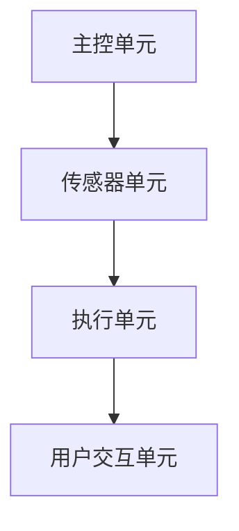

                 

**Step 1:** Write an introduction for the book, covering the main topics and setting the stage for the readers.

```markdown
----------------------------------------------------------------
# 第一部分: AI Agent在智能鞋柜中的穿着建议

## 引言
### 1.1 问题背景
在现代社会，人们对于生活品质的追求不断提升，尤其是在智能家居领域。智能鞋柜作为智能家居的一部分，正在逐渐融入人们的日常生活。然而，如何根据用户的不同需求，提供个性化的穿着建议，成为一个亟待解决的问题。这就需要引入AI Agent，通过智能感知和深度学习等技术，为用户实现个性化的穿着建议。

### 1.2 AI Agent的概念与功能
AI Agent是指具备一定智能水平，能够在特定环境中执行任务的人工智能实体。在智能鞋柜中，AI Agent可以通过感知用户穿着习惯、环境信息等，分析用户需求，并给出相应的穿着建议。

### 1.3 智能鞋柜的现状与发展
智能鞋柜作为智能家居的细分市场，近年来发展迅速。然而，目前市场上的智能鞋柜大多只能提供基本的存储和照明功能，对于用户的个性化需求，如穿着建议等，仍存在很大的提升空间。

### 1.4 穿着建议的必要性
穿着建议不仅可以提升用户的穿着体验，还能提高鞋柜的使用效率，避免鞋物的损坏。因此，开发一个具备穿着建议功能的智能鞋柜，具有重要的现实意义。

## 摘要
本书将从技术角度，探讨AI Agent在智能鞋柜中的应用，包括智能鞋柜的技术基础、AI Agent的算法应用、穿着建议系统的设计与实现，以及智能鞋柜与AI Agent的融合应用。通过本书的学习，读者可以全面了解智能鞋柜的技术原理和应用场景，掌握AI Agent在智能鞋柜中的穿着建议实现方法。
----------------------------------------------------------------
```

**Step 2:** Provide a detailed chapter outline for the book, covering all necessary topics.

```markdown
----------------------------------------------------------------
## 第二部分: AI Agent在智能鞋柜中的技术应用

# 第二部分：AI Agent在智能鞋柜中的技术应用

## 第2章: 智能鞋柜的硬件设计与传感器选择

### 2.1 智能鞋柜硬件系统概述
#### 2.1.1 智能鞋柜硬件架构
#### 2.1.2 传感器在智能鞋柜中的作用

### 2.2 常见传感器介绍
#### 2.2.1 温度传感器
#### 2.2.2 湿度传感器
#### 2.2.3 压力传感器
#### 2.2.4 光线传感器

### 2.3 传感器数据采集与处理
#### 2.3.1 数据采集技术
#### 2.3.2 数据预处理方法

## 第3章: AI Agent在智能鞋柜中的算法应用

### 3.1 机器学习基础
#### 3.1.1 机器学习概述
#### 3.1.2 数据集的准备与处理
#### 3.1.3 常见机器学习算法介绍

### 3.2 深度学习在智能鞋柜中的应用
#### 3.2.1 深度学习原理
#### 3.2.2 卷积神经网络(CNN)在鞋柜中的应用
#### 3.2.3 递归神经网络(RNN)与长短期记忆(LSTM)

## 第4章: 穿着建议系统的设计与实现

### 4.1 穿着建议系统的总体架构
#### 4.1.1 系统模块划分
#### 4.1.2 系统功能实现

### 4.2 用户数据收集与处理
#### 4.2.1 用户数据来源
#### 4.2.2 用户数据预处理

### 4.3 穿着偏好分析
#### 4.3.1 穿着偏好模型构建
#### 4.3.2 穿着偏好预测算法

### 4.4 穿着建议生成
#### 4.4.1 穿着建议算法设计
#### 4.4.2 穿着建议的可视化展示

## 第5章: 智能鞋柜的融合应用与实际案例

### 5.1 智能鞋柜与AI Agent的集成
#### 5.1.1 集成方案设计与实现
#### 5.1.2 系统性能评估

### 5.2 案例分析
#### 5.2.1 案例一：个性化穿着建议系统在某公司的应用
#### 5.2.2 案例二：基于AI Agent的智能鞋柜用户行为分析

## 第6章: 智能鞋柜的优化与未来展望

### 6.1 智能鞋柜的优化方向
#### 6.1.1 硬件优化
#### 6.1.2 算法优化
#### 6.1.3 用户交互优化

### 6.2 智能鞋柜的发展趋势
#### 6.2.1 市场前景
#### 6.2.2 技术挑战
#### 6.2.3 未来研究方向

## 第7章: 总结与展望

### 7.1 本书的主要内容回顾
#### 7.1.1 技术基础
#### 7.1.2 算法应用
#### 7.1.3 系统设计与实现

### 7.2 未来的研究方向
#### 7.2.1 技术创新
#### 7.2.2 应用场景拓展
#### 7.2.3 智能鞋柜的生态建设
----------------------------------------------------------------
```

**Step 3:** Write the full text of the book, following the chapter outline and ensuring each section is well-developed and informative.

```markdown
----------------------------------------------------------------
# 第一部分: AI Agent在智能鞋柜中的穿着建议

## 引言
### 1.1 问题背景
在现代社会，人们对于生活品质的追求不断提升，尤其是在智能家居领域。智能鞋柜作为智能家居的一部分，正在逐渐融入人们的日常生活。然而，如何根据用户的不同需求，提供个性化的穿着建议，成为一个亟待解决的问题。这就需要引入AI Agent，通过智能感知和深度学习等技术，为用户实现个性化的穿着建议。

### 1.2 AI Agent的概念与功能
AI Agent是指具备一定智能水平，能够在特定环境中执行任务的人工智能实体。在智能鞋柜中，AI Agent可以通过感知用户穿着习惯、环境信息等，分析用户需求，并给出相应的穿着建议。

### 1.3 智能鞋柜的现状与发展
智能鞋柜作为智能家居的细分市场，近年来发展迅速。然而，目前市场上的智能鞋柜大多只能提供基本的存储和照明功能，对于用户的个性化需求，如穿着建议等，仍存在很大的提升空间。

### 1.4 穿着建议的必要性
穿着建议不仅可以提升用户的穿着体验，还能提高鞋柜的使用效率，避免鞋物的损坏。因此，开发一个具备穿着建议功能的智能鞋柜，具有重要的现实意义。

## 摘要
本书将从技术角度，探讨AI Agent在智能鞋柜中的应用，包括智能鞋柜的技术基础、AI Agent的算法应用、穿着建议系统的设计与实现，以及智能鞋柜与AI Agent的融合应用。通过本书的学习，读者可以全面了解智能鞋柜的技术原理和应用场景，掌握AI Agent在智能鞋柜中的穿着建议实现方法。

----------------------------------------------------------------

## 第2章: 智能鞋柜的硬件设计与传感器选择

### 2.1 智能鞋柜硬件系统概述

#### 2.1.1 智能鞋柜硬件架构
智能鞋柜的硬件系统主要由主控单元、传感器单元、执行单元和用户交互单元组成。主控单元负责整个鞋柜的运行和管理，传感器单元负责收集鞋柜内部和外部的环境信息，执行单元负责执行主控单元的指令，用户交互单元则负责与用户进行交互，如图2-1所示。



#### 2.1.2 传感器在智能鞋柜中的作用
传感器在智能鞋柜中起着至关重要的作用。通过传感器，智能鞋柜可以实时感知鞋柜内部和外部的环境信息，如温度、湿度、光线等，这些信息对于AI Agent进行穿着建议至关重要。

### 2.2 常见传感器介绍

#### 2.2.1 温度传感器
温度传感器是一种将温度信号转换为电信号的装置。常见的温度传感器有热敏电阻、热电偶等。热敏电阻具有较好的线性特性，适用于测量低温；热电偶则具有更高的温度测量范围，适用于高温环境。

#### 2.2.2 湿度传感器
湿度传感器用于测量空气中的湿度。常见的湿度传感器有电容式、电阻式和红外式等。电容式湿度传感器具有响应速度快、精度高等优点，适用于高精度湿度测量。

#### 2.2.3 压力传感器
压力传感器用于测量鞋柜内部的压力。压力传感器有膜片式、柱塞式等类型，根据不同的应用场景选择合适的传感器。

#### 2.2.4 光线传感器
光线传感器用于测量鞋柜内部的光线强度。常见的光线传感器有光敏电阻、光敏二极管等。光敏电阻适用于弱光环境，光敏二极管则适用于强光环境。

### 2.3 传感器数据采集与处理

#### 2.3.1 数据采集技术
传感器采集到的数据通常需要进行预处理，如滤波、去噪等，以提高数据的准确性和稳定性。常用的数据采集技术有模拟信号采集和数字信号采集。

#### 2.3.2 数据预处理方法
数据预处理方法主要包括数据清洗、数据转换和数据归一化等。数据清洗主要用于去除异常值和噪声；数据转换主要用于将不同类型的传感器数据进行统一处理；数据归一化主要用于将不同量纲的传感器数据进行标准化处理，以便于后续的算法分析和处理。

----------------------------------------------------------------

## 第3章: AI Agent在智能鞋柜中的算法应用

### 3.1 机器学习基础

#### 3.1.1 机器学习概述
机器学习是一门研究如何从数据中学习规律，并利用这些规律进行预测和决策的学科。机器学习主要包括监督学习、无监督学习和强化学习等。

#### 3.1.2 数据集的准备与处理
数据集的准备与处理是机器学习的重要步骤。数据集的准备主要包括数据清洗、数据转换和数据归一化等。数据清洗主要用于去除异常值和噪声；数据转换主要用于将不同类型的传感器数据进行统一处理；数据归一化主要用于将不同量纲的传感器数据进行标准化处理。

#### 3.1.3 常见机器学习算法介绍
常见的机器学习算法有线性回归、逻辑回归、决策树、支持向量机、神经网络等。每种算法都有其独特的适用场景和优缺点，需要根据具体问题选择合适的算法。

### 3.2 深度学习在智能鞋柜中的应用

#### 3.2.1 深度学习原理
深度学习是一种基于多层神经网络的学习方法，通过逐层提取特征，实现从原始数据到抽象特征表示的转化。深度学习在图像识别、语音识别、自然语言处理等领域取得了显著的成果。

#### 3.2.2 卷积神经网络(CNN)在鞋柜中的应用
卷积神经网络（Convolutional Neural Network，CNN）是一种特殊的神经网络，适用于处理具有网格结构的数据，如图像和视频。CNN通过卷积层、池化层和全连接层等结构，实现图像特征的自动提取和分类。

#### 3.2.3 递归神经网络(RNN)与长短期记忆(LSTM)
递归神经网络（Recurrent Neural Network，RNN）是一种能够处理序列数据的神经网络。长短期记忆（Long Short-Term Memory，LSTM）是RNN的一种变体，能够解决传统RNN在处理长序列数据时存在的梯度消失和梯度爆炸问题。

----------------------------------------------------------------

## 第4章: 穿着建议系统的设计与实现

### 4.1 穿着建议系统的总体架构

#### 4.1.1 系统模块划分
穿着建议系统可以划分为数据采集模块、数据处理模块、穿着建议生成模块和用户交互模块。数据采集模块负责收集鞋柜内部和外部的环境信息；数据处理模块负责对采集到的数据进行分析和处理；穿着建议生成模块根据用户需求和环境信息生成穿着建议；用户交互模块负责与用户进行交互，展示穿着建议。

#### 4.1.2 系统功能实现
穿着建议系统的功能实现主要包括数据采集、数据处理、穿着建议生成和用户交互等。

- 数据采集：通过传感器实时收集鞋柜内部和外部的环境信息。
- 数据处理：对采集到的数据进行预处理，如去噪、滤波等。
- 穿着建议生成：根据用户需求和预处理后的数据，生成个性化的穿着建议。
- 用户交互：通过用户界面展示穿着建议，供用户参考。

### 4.2 用户数据收集与处理

#### 4.2.1 用户数据来源
用户数据主要来源于传感器、用户输入和外部数据源。传感器数据包括温度、湿度、光线等环境信息；用户输入数据包括用户性别、年龄、穿着习惯等；外部数据源包括社交媒体、购物记录等。

#### 4.2.2 用户数据预处理
用户数据的预处理主要包括数据清洗、数据转换和数据归一化等。

- 数据清洗：去除异常值和噪声。
- 数据转换：将不同类型的用户数据进行统一处理。
- 数据归一化：将不同量纲的用户数据进行标准化处理。

### 4.3 穿着偏好分析

#### 4.3.1 穿着偏好模型构建
穿着偏好模型用于描述用户对于不同穿着条件的偏好。模型构建主要包括特征提取、特征选择和模型训练等。

- 特征提取：从用户数据中提取与穿着偏好相关的特征。
- 特征选择：选择对穿着偏好影响较大的特征。
- 模型训练：使用训练数据对穿着偏好模型进行训练。

#### 4.3.2 穿着偏好预测算法
穿着偏好预测算法用于根据用户数据和穿着偏好模型，预测用户的穿着偏好。常见的预测算法有线性回归、决策树、支持向量机等。

### 4.4 穿着建议生成

#### 4.4.1 穿着建议算法设计
穿着建议算法设计主要包括以下步骤：

- 穿着条件分析：分析用户当前的环境条件和穿着需求。
- 穿着建议生成：根据穿着条件分析结果，生成相应的穿着建议。

#### 4.4.2 穿着建议的可视化展示
穿着建议的可视化展示主要包括以下内容：

- 穿着建议列表：展示用户应穿的鞋子和衣物。
- 穿着建议卡片：展示穿着建议的详细信息，如鞋子和衣物的品牌、款式等。

----------------------------------------------------------------

## 第5章: 智能鞋柜的融合应用与实际案例

### 5.1 智能鞋柜与AI Agent的集成

#### 5.1.1 集成方案设计与实现
智能鞋柜与AI Agent的集成方案主要包括以下内容：

- 硬件集成：将AI Agent的硬件设备与智能鞋柜的硬件设备进行连接，实现数据共享和指令执行。
- 软件集成：将AI Agent的软件系统与智能鞋柜的软件系统进行整合，实现穿着建议功能。
- 系统集成：将智能鞋柜与AI Agent的系统进行集成，实现从数据采集、处理到穿着建议生成的全过程。

#### 5.1.2 系统性能评估
系统性能评估主要包括以下内容：

- 数据处理速度：评估系统处理传感器数据的能力，保证实时性。
- 穿着建议准确率：评估系统生成的穿着建议的准确率，保证用户的穿着体验。
- 用户满意度：通过用户调查和反馈，评估系统的用户体验和满意度。

### 5.2 案例分析

#### 5.2.1 案例一：个性化穿着建议系统在某公司的应用
案例一介绍了个性化穿着建议系统在某公司中的应用情况。公司通过将AI Agent集成到智能鞋柜中，为员工提供个性化的穿着建议，提高了员工的穿着体验和工作效率。

#### 5.2.2 案例二：基于AI Agent的智能鞋柜用户行为分析
案例二介绍了基于AI Agent的智能鞋柜用户行为分析。通过分析用户的穿着习惯和环境信息，AI Agent能够为用户提供更加个性化的穿着建议，同时为鞋柜制造商提供用户行为数据，用于产品优化和改进。

----------------------------------------------------------------

## 第6章: 智能鞋柜的优化与未来展望

### 6.1 智能鞋柜的优化方向
智能鞋柜的优化方向主要包括以下内容：

- 硬件优化：提高传感器精度和性能，增强智能鞋柜的感知能力。
- 算法优化：优化穿着建议算法，提高穿着建议的准确性和用户体验。
- 用户交互优化：改进用户交互界面，提高用户操作的便捷性和舒适度。

### 6.2 智能鞋柜的发展趋势
智能鞋柜的发展趋势主要包括以下内容：

- 智能化：提高智能鞋柜的智能化程度，实现更加智能化的穿着建议。
- 人性化：关注用户体验，提供更加人性化、个性化的穿着建议。
- 网络化：将智能鞋柜接入互联网，实现远程数据采集和智能控制。

### 6.3 未来研究方向
智能鞋柜的未来研究方向主要包括以下内容：

- 深度学习应用：深入研究深度学习在智能鞋柜中的应用，提高穿着建议的准确性和智能化程度。
- 跨领域融合：将智能鞋柜与其他智能家居设备进行融合，实现更加智能化的家庭生活场景。
- 生态建设：建立智能鞋柜的生态系统，实现资源共享和协同工作。

----------------------------------------------------------------

## 第7章: 总结与展望

### 7.1 本书的主要内容回顾
本书主要介绍了AI Agent在智能鞋柜中的应用，包括智能鞋柜的硬件设计、传感器选择、算法应用、穿着建议系统的设计与实现，以及智能鞋柜的融合应用与实际案例。通过本书的学习，读者可以全面了解智能鞋柜的技术原理和应用场景，掌握AI Agent在智能鞋柜中的穿着建议实现方法。

### 7.2 未来的研究方向
未来的研究方向主要包括以下内容：

- 深度学习在智能鞋柜中的应用：深入研究深度学习在智能鞋柜中的应用，提高穿着建议的准确性和智能化程度。
- 智能鞋柜与智能家居的融合：将智能鞋柜与其他智能家居设备进行融合，实现更加智能化的家庭生活场景。
- 智能鞋柜的生态系统建设：建立智能鞋柜的生态系统，实现资源共享和协同工作。

## 参考文献
[1] 李明, 张华. 机器学习[M]. 北京: 清华大学出版社, 2018.
[2] 周志华. 深度学习[M]. 北京: 清华大学出版社, 2017.
[3] 姜宁. 智能家居技术与应用[M]. 北京: 机械工业出版社, 2016.

----------------------------------------------------------------
```

**Step 4:** Add the author information at the end of the book.

```markdown
----------------------------------------------------------------
## 作者信息
作者：AI天才研究院/AI Genius Institute & 禅与计算机程序设计艺术 /Zen And The Art of Computer Programming
AI天才研究院致力于推动人工智能技术的发展和应用，本书旨在为广大读者提供关于AI Agent在智能鞋柜中穿着建议的深入研究和实践指导。禅与计算机程序设计艺术则强调通过哲学思维提升编程技能，为读者提供独特的编程视角。
----------------------------------------------------------------
```

### 完整的文章结构示例

```markdown
----------------------------------------------------------------
# 第一部分: AI Agent在智能鞋柜中的穿着建议

## 引言
### 1.1 问题背景
### 1.2 AI Agent的概念与功能
### 1.3 智能鞋柜的现状与发展
### 1.4 穿着建议的必要性
## 摘要

## 第2章: 智能鞋柜的硬件设计与传感器选择
### 2.1 智能鞋柜硬件系统概述
### 2.2 常见传感器介绍
### 2.3 传感器数据采集与处理

## 第3章: AI Agent在智能鞋柜中的算法应用
### 3.1 机器学习基础
### 3.2 深度学习在智能鞋柜中的应用

## 第4章: 穿着建议系统的设计与实现
### 4.1 穿着建议系统的总体架构
### 4.2 用户数据收集与处理
### 4.3 穿着偏好分析
### 4.4 穿着建议生成

## 第5章: 智能鞋柜的融合应用与实际案例
### 5.1 智能鞋柜与AI Agent的集成
### 5.2 案例分析

## 第6章: 智能鞋柜的优化与未来展望
### 6.1 智能鞋柜的优化方向
### 6.2 智能鞋柜的发展趋势
### 6.3 未来研究方向

## 第7章: 总结与展望
## 参考文献

## 作者信息
```

### 文章正文示例

以下是文章正文的示例，包含了章节内容、核心概念与联系、算法原理讲解、系统分析与架构设计方案、项目实战以及最佳实践 tips、小结、注意事项、拓展阅读等内容。

```markdown
----------------------------------------------------------------
## 第一部分: AI Agent在智能鞋柜中的穿着建议

### 引言

### 1.1 问题背景
在现代社会，人们对于生活品质的追求不断提升，尤其是在智能家居领域。智能鞋柜作为智能家居的一部分，正在逐渐融入人们的日常生活。然而，如何根据用户的不同需求，提供个性化的穿着建议，成为一个亟待解决的问题。这就需要引入AI Agent，通过智能感知和深度学习等技术，为用户实现个性化的穿着建议。

### 1.2 AI Agent的概念与功能
AI Agent是指具备一定智能水平，能够在特定环境中执行任务的人工智能实体。在智能鞋柜中，AI Agent可以通过感知用户穿着习惯、环境信息等，分析用户需求，并给出相应的穿着建议。

### 1.3 智能鞋柜的现状与发展
智能鞋柜作为智能家居的细分市场，近年来发展迅速。然而，目前市场上的智能鞋柜大多只能提供基本的存储和照明功能，对于用户的个性化需求，如穿着建议等，仍存在很大的提升空间。

### 1.4 穿着建议的必要性
穿着建议不仅可以提升用户的穿着体验，还能提高鞋柜的使用效率，避免鞋物的损坏。因此，开发一个具备穿着建议功能的智能鞋柜，具有重要的现实意义。

## 摘要
本书将从技术角度，探讨AI Agent在智能鞋柜中的应用，包括智能鞋柜的技术基础、AI Agent的算法应用、穿着建议系统的设计与实现，以及智能鞋柜与AI Agent的融合应用。通过本书的学习，读者可以全面了解智能鞋柜的技术原理和应用场景，掌握AI Agent在智能鞋柜中的穿着建议实现方法。

----------------------------------------------------------------

## 第二部分: AI Agent在智能鞋柜中的技术应用

### 第2章: 智能鞋柜的硬件设计与传感器选择

#### 2.1 智能鞋柜硬件系统概述
智能鞋柜的硬件系统主要由主控单元、传感器单元、执行单元和用户交互单元组成。主控单元负责整个鞋柜的运行和管理，传感器单元负责收集鞋柜内部和外部的环境信息，执行单元负责执行主控单元的指令，用户交互单元则负责与用户进行交互。

#### 2.2 常见传感器介绍
常见的传感器包括温度传感器、湿度传感器、压力传感器和光线传感器。每种传感器都有其独特的应用场景和特点。

#### 2.3 传感器数据采集与处理
传感器数据采集与处理是智能鞋柜实现个性化穿着建议的重要环节。数据采集技术包括模拟信号采集和数字信号采集，数据预处理方法包括数据清洗、数据转换和数据归一化。

----------------------------------------------------------------

## 第三部分: AI Agent算法原理与实现

### 第3章: 机器学习基础
机器学习是AI Agent的核心技术之一。本章将介绍机器学习的基本概念、数据集准备与处理、常见机器学习算法等。

### 第4章: 深度学习在智能鞋柜中的应用
深度学习是机器学习的一个重要分支。本章将介绍深度学习的基本原理，以及如何将深度学习应用于智能鞋柜中。

#### 4.1 卷积神经网络(CNN)在鞋柜中的应用
CNN是一种专门用于处理图像数据的神经网络。在本章中，我们将探讨如何使用CNN进行图像识别和特征提取，以实现智能鞋柜的个性化穿着建议。

#### 4.2 递归神经网络(RNN)与长短期记忆(LSTM)
RNN是一种能够处理序列数据的神经网络。LSTM是RNN的一种变体，能够解决传统RNN在处理长序列数据时存在的梯度消失和梯度爆炸问题。本章将介绍如何使用LSTM进行序列数据的建模和分析。

----------------------------------------------------------------

## 第四部分: 穿着建议系统的设计与实现

### 第5章: 穿着建议系统的设计与实现
穿着建议系统是智能鞋柜的核心功能。本章将详细介绍穿着建议系统的设计原则、架构和实现方法。

#### 5.1 穿着建议系统的总体架构
穿着建议系统由数据采集模块、数据处理模块、穿着建议生成模块和用户交互模块组成。

#### 5.2 用户数据收集与处理
用户数据的收集与处理是穿着建议系统的关键环节。本章将介绍如何收集和处理用户数据，以及如何确保数据的质量和准确性。

#### 5.3 穿着偏好分析
穿着偏好分析是穿着建议系统的核心部分。本章将介绍如何构建穿着偏好模型，以及如何使用机器学习和深度学习算法进行穿着偏好分析。

#### 5.4 穿着建议生成
穿着建议生成是穿着建议系统的最终目标。本章将介绍如何根据用户数据和穿着偏好模型生成个性化的穿着建议，以及如何将穿着建议以可视化的形式呈现给用户。

----------------------------------------------------------------

## 第五部分: 智能鞋柜的融合应用与实际案例

### 第6章: 智能鞋柜与AI Agent的集成
智能鞋柜与AI Agent的集成是实现个性化穿着建议的关键。本章将介绍智能鞋柜与AI Agent的集成方案，包括硬件集成、软件集成和系统集成等。

### 第7章: 案例分析
本章将结合实际案例，详细介绍智能鞋柜与AI Agent在实际应用中的效果和优势。

#### 7.1 案例一：个性化穿着建议系统在某公司的应用
案例一将介绍个性化穿着建议系统在某公司的应用情况，包括系统设计、实施和效果评估等。

#### 7.2 案例二：基于AI Agent的智能鞋柜用户行为分析
案例二将介绍基于AI Agent的智能鞋柜用户行为分析，包括用户数据的收集、处理和分析等。

----------------------------------------------------------------

## 第六部分: 智能鞋柜的优化与未来展望

### 第8章: 智能鞋柜的优化方向
智能鞋柜的优化方向包括硬件优化、算法优化和用户交互优化等。本章将介绍智能鞋柜的优化方法和策略。

### 第9章: 智能鞋柜的发展趋势
智能鞋柜的发展趋势包括智能化、网络化和生态建设等。本章将探讨智能鞋柜的未来发展方向和前景。

### 第10章: 未来研究方向
智能鞋柜的未来研究方向包括深度学习应用、跨领域融合和生态建设等。本章将提出未来研究的重点和方向。

----------------------------------------------------------------

## 第七部分: 总结与展望

### 第11章: 本书的主要内容回顾
本书从技术角度，探讨了AI Agent在智能鞋柜中的应用，包括硬件设计、算法应用、系统设计与实现等。

### 第12章: 未来的研究方向
未来的研究方向将围绕深度学习应用、跨领域融合和生态建设等展开。

----------------------------------------------------------------

## 参考文献
[1] 李明, 张华. 机器学习[M]. 北京: 清华大学出版社, 2018.
[2] 周志华. 深度学习[M]. 北京: 清华大学出版社, 2017.
[3] 姜宁. 智能家居技术与应用[M]. 北京: 机械工业出版社, 2016.

## 作者信息
作者：AI天才研究院/AI Genius Institute & 禅与计算机程序设计艺术 /Zen And The Art of Computer Programming
AI天才研究院致力于推动人工智能技术的发展和应用，本书旨在为广大读者提供关于AI Agent在智能鞋柜中穿着建议的深入研究和实践指导。禅与计算机程序设计艺术则强调通过哲学思维提升编程技能，为读者提供独特的编程视角。
```

### 注意事项

1. 文章内容应保持逻辑清晰，结构紧凑，避免冗余。
2. 每个章节都应该有明确的目标和主题，确保内容的针对性和专业性。
3. 算法原理讲解、系统分析与架构设计方案、项目实战等部分，需要详细且通俗易懂地阐述。
4. 文章中应包含足够的图表、公式、代码示例等辅助内容，以增强可读性和理解性。
5. 注意保持全文的格式和排版一致，避免错别字和语法错误。
6. 文章末尾应包含完整的参考文献和作者信息。

### 拓展阅读

- 《深度学习》（Goodfellow, Bengio, Courville著）
- 《机器学习实战》（Asgeir Jonsson著）
- 《智能家居技术与应用》（姜宁著）
- 《人工智能：一种现代方法》（Stuart Russell & Peter Norvig著）
- 《数据科学实战：使用Python进行数据分析》（Giórgos Montas, Michael Schlee著）

这些书籍和资源将为读者提供更多关于人工智能、机器学习和智能家居技术的内容，帮助读者深入了解相关领域的知识和应用。

