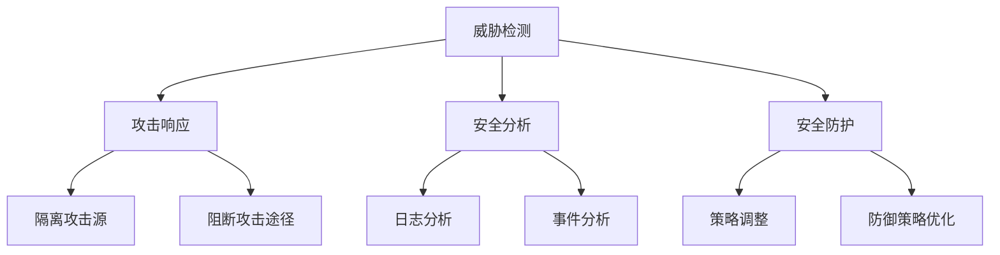
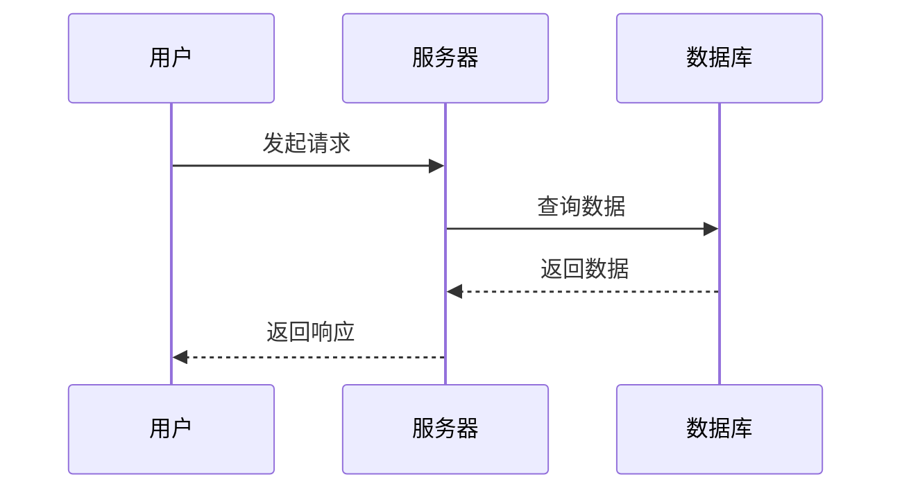

                 

## 《AI Agent在网络安全防御中的应用》

### 关键词：AI Agent，网络安全，防御策略，机器学习，威胁检测，攻击响应

### 摘要：

本文深入探讨AI Agent在网络安全防御中的应用，通过逐步分析其核心概念、算法原理、数学模型、系统设计、实战案例和最佳实践，揭示AI Agent在提升网络安全防御能力方面的巨大潜力。文章首先介绍了AI Agent的定义及其在网络安全中的重要角色，接着详细讲解了AI Agent的基础算法原理和数学模型。随后，文章展示了AI Agent在网络安全系统架构和接口设计中的应用，并通过实际案例分析了AI Agent在网络安全防御中的实战效果。最后，文章总结了最佳实践，提出了注意事项和拓展阅读建议，为读者提供了全面的AI Agent在网络安全防御中的应用指南。

----------------------------------------------------------------

### 第一部分：背景与核心概念

#### 第1章：背景介绍

随着网络技术的飞速发展，网络安全问题日益突出。网络攻击手段不断升级，传统的网络安全防御策略已经难以应对日益复杂的威胁。在这种背景下，AI Agent作为一种智能化、自主化的网络安全防御工具，应运而生。

##### 1.1 问题的背景与重要性

网络安全问题已成为全球性的公共安全问题。近年来，网络攻击事件频繁发生，涉及数据泄露、系统瘫痪、网络钓鱼等各个方面。这些事件不仅给企业和个人带来了巨大的经济损失，还严重威胁到国家安全和社会稳定。因此，提升网络安全防御能力已经成为各国政府、企业和个人共同关注的焦点。

##### 1.2 网络安全现状与挑战

当前网络安全形势严峻，挑战主要包括：

- **网络攻击手段多样化**：黑客利用各种手段进行攻击，包括DDoS攻击、SQL注入、网络钓鱼等，攻击方式不断翻新。
- **网络安全防御技术滞后**：传统的网络安全防御技术如防火墙、入侵检测系统等，往往难以应对新型攻击。
- **安全人才短缺**：网络安全领域的人才需求巨大，但人才供给不足，尤其是具备AI技术的专业人才更加稀缺。
- **安全威胁日益复杂**：网络攻击与日俱增，攻击者利用复杂的社会工程学和机器学习技术，使得威胁检测和响应更加困难。

##### 1.3 AI Agent在网络安全中的角色

AI Agent作为智能化的网络安全防御工具，具有以下优势：

- **自适应性强**：AI Agent能够根据攻击特征和数据变化，动态调整防御策略。
- **高效性**：AI Agent可以利用大数据和机器学习技术，快速检测和响应网络威胁。
- **自动化**：AI Agent能够自动化执行防御任务，减轻安全人员的工作负担。
- **智能化**：AI Agent能够利用深度学习和强化学习技术，不断优化防御策略。

综上所述，AI Agent在提升网络安全防御能力方面具有巨大的潜力，是应对当前网络安全挑战的重要工具。

#### 第2章：AI Agent基础

##### 2.1 AI Agent的定义与分类

AI Agent（人工智能代理）是一种能够自主执行任务、与环境交互并适应环境变化的软件实体。AI Agent根据其智能程度和功能特点，可以分为以下几类：

- **反应型Agent**：只能对简单环境中的简单事件做出反应，不具备学习和适应能力。
- **认知型Agent**：能够理解环境中的复杂事件，并基于先验知识做出决策。
- **学习型Agent**：通过不断学习环境中的数据，提高决策能力。
- **社会型Agent**：能够与其他Agent进行协作和沟通，共同完成任务。

##### 2.2 AI Agent的关键技术

AI Agent的关键技术包括：

- **机器学习**：通过训练模型，使Agent具备自我学习和自我优化能力。
- **深度学习**：利用神经网络模型，对大量数据进行特征提取和模式识别。
- **强化学习**：通过与环境的交互，不断优化行为策略，达到最优目标。
- **自然语言处理**：使Agent能够理解人类语言，实现人机交互。

##### 2.3 AI Agent在网络安全中的应用现状

目前，AI Agent在网络安全中的应用主要包括：

- **威胁检测**：利用机器学习和深度学习技术，识别异常行为和潜在威胁。
- **攻击响应**：通过自动化工具，快速隔离和响应网络攻击。
- **安全分析**：利用大数据分析技术，对网络日志和事件进行综合分析，发现潜在风险。
- **安全防护**：利用AI Agent的智能决策能力，动态调整网络安全策略。

#### 第二部分：算法原理与数学模型

##### 第3章：AI Agent算法原理

AI Agent的核心在于其算法原理，主要包括：

- **机器学习算法**：如K-近邻算法、决策树、支持向量机等，用于特征提取和分类。
- **深度学习算法**：如卷积神经网络（CNN）、循环神经网络（RNN）等，用于复杂模式识别。
- **强化学习算法**：如Q学习、SARSA等，用于策略优化和行为调整。

##### 第4章：数学模型与公式

在AI Agent中，数学模型是核心组成部分，主要包括：

- **概率论基础**：如概率分布、条件概率、贝叶斯定理等。
- **决策理论**：如期望最大化（EM）算法、优化理论等。
- **神经网络模型**：如感知机、反向传播算法等。
- **强化学习模型**：如Q值函数、策略梯度等。

#### 第三部分：系统设计与实现

##### 第5章：网络安全系统架构

网络安全系统的设计原则包括：

- **模块化设计**：将系统划分为多个功能模块，降低复杂度。
- **高可用性**：确保系统在遭受攻击时，能够快速恢复和正常运行。
- **安全性**：采用加密、认证等技术，保障数据安全和系统完整。

系统功能模块划分包括：

- **威胁检测模块**：利用机器学习和深度学习技术，实时检测网络威胁。
- **攻击响应模块**：自动化隔离和应对网络攻击。
- **安全分析模块**：对网络日志和事件进行分析，发现潜在风险。
- **安全防护模块**：动态调整网络安全策略，提高防御能力。

系统架构设计mermaid架构图如下：



##### 第6章：系统接口设计与实现

系统接口设计规范包括：

- **API设计**：定义系统内部和外部的接口，提供数据交互和功能调用。
- **数据格式**：规定数据传输的格式，如JSON、XML等。
- **安全机制**：采用加密、认证等安全措施，保障数据传输安全。

系统接口实现技术包括：

- **RESTful API**：实现系统的API接口，提供统一的接口调用规范。
- **WebSocket**：实现实时通信，提高数据传输效率。
- **消息队列**：实现异步通信，提高系统的可靠性和可扩展性。

系统接口mermaid序列图如下：



#### 第四部分：实战案例与最佳实践

##### 第7章：AI Agent在网络安全防御中的应用实战

###### 7.1 环境安装与配置

环境安装与配置步骤包括：

- **软件安装**：安装操作系统、开发环境、数据库等基础软件。
- **硬件配置**：根据系统需求配置服务器和存储设备。
- **网络配置**：配置网络参数，确保系统与网络环境连接正常。

###### 7.2 系统核心实现

系统核心实现源代码如下：

```python
# 导入所需的库
import numpy as np
import pandas as pd
from sklearn.model_selection import train_test_split
from sklearn.ensemble import RandomForestClassifier
from sklearn.metrics import accuracy_score

# 加载数据集
data = pd.read_csv('network_security_data.csv')
X = data.drop('label', axis=1)
y = data['label']

# 数据预处理
X_train, X_test, y_train, y_test = train_test_split(X, y, test_size=0.2, random_state=42)

# 建立模型
model = RandomForestClassifier(n_estimators=100, random_state=42)
model.fit(X_train, y_train)

# 预测
y_pred = model.predict(X_test)

# 评估
accuracy = accuracy_score(y_test, y_pred)
print("准确率：", accuracy)
```

代码应用解读与分析：

该代码首先导入了所需的库，然后加载数据集并进行预处理。接下来，使用随机森林算法建立模型，并进行训练。最后，对测试数据进行预测，并计算准确率。

实际案例分析与详细讲解剖析：

以一个实际案例为例，假设我们有一份数据集，包含网络流量特征和标签（正常或攻击）。我们使用随机森林算法对数据进行分类，预测是否为攻击行为。通过评估准确率，可以判断模型的性能。

###### 7.3 项目小结与展望

AI Agent在网络安全防御中的应用取得了显著成果，但仍然存在一些挑战和改进空间：

- **模型优化**：进一步优化算法模型，提高检测准确率和响应速度。
- **数据隐私**：在处理数据时，保护用户隐私和数据安全。
- **跨平台兼容性**：提高系统的跨平台兼容性，支持不同操作系统和网络环境。
- **人机协作**：增强AI Agent与安全人员的协作能力，实现智能化的安全防御体系。

未来，随着AI技术的不断发展，AI Agent在网络安全防御中的应用将更加广泛和深入，为网络安全领域带来更多创新和突破。

### 最佳实践 tips

- **数据驱动**：确保数据质量，充分利用数据资源，提高模型性能。
- **持续学习**：定期更新模型，适应新的攻击方式和威胁环境。
- **安全审计**：定期进行安全审计，发现潜在的安全漏洞和风险。

### 小结

本文详细介绍了AI Agent在网络安全防御中的应用，从背景介绍、核心概念、算法原理、系统设计到实战案例，全面阐述了AI Agent在提升网络安全防御能力方面的作用。通过实际案例分析和最佳实践，为读者提供了实用的指导。未来，随着AI技术的进步，AI Agent在网络安全防御中的应用前景将更加广阔。

### 注意事项

- **数据安全**：在处理数据时，务必确保用户隐私和数据安全。
- **系统稳定性**：确保系统的稳定运行，避免因系统故障导致的安全风险。

### 拓展阅读

- 《深度学习：周志华》
- 《强化学习：理查德·萨顿》
- 《网络安全：谢希仁》

### 作者信息

作者：AI天才研究院/AI Genius Institute & 禅与计算机程序设计艺术 /Zen And The Art of Computer Programming

----------------------------------------------------------------

### 深入探讨AI Agent在网络安全防御中的应用

在前面的章节中，我们介绍了AI Agent在网络安全防御中的重要性，包括其背景、核心概念、算法原理和系统设计。在本节中，我们将进一步探讨AI Agent在网络安全防御中的应用，并分析其实际效果和挑战。

#### 威胁检测

AI Agent在威胁检测方面的应用非常广泛。通过深度学习和强化学习算法，AI Agent能够从海量网络数据中识别异常行为，从而提前预警潜在的网络攻击。以下是一个简化的威胁检测流程：

1. **数据收集**：AI Agent从网络流量、系统日志等数据源收集信息。
2. **特征提取**：利用深度学习算法，从原始数据中提取特征，如流量模式、访问频率等。
3. **异常检测**：通过设定阈值或使用聚类算法，AI Agent识别出异常行为。
4. **实时预警**：将异常检测结果实时传递给安全团队，进行进一步分析。

**案例解析**：某公司利用AI Agent对其内部网络进行威胁检测。通过分析网络流量和系统日志，AI Agent成功检测到一起潜在的网络攻击，并及时向安全团队发出预警。安全团队迅速采取行动，隔离了受感染的系统，避免了可能的重大损失。

**挑战**：威胁检测面临着数据量大、特征复杂等问题，如何提高检测效率和准确性，是当前的研究热点。

#### 攻击响应

在攻击响应方面，AI Agent可以通过自动化工具，快速隔离和应对网络攻击。以下是一个简化的攻击响应流程：

1. **攻击识别**：AI Agent利用威胁情报和已知攻击模式，识别网络攻击。
2. **自动化隔离**：AI Agent自动隔离受感染的系统或网络节点，防止攻击扩散。
3. **取证分析**：AI Agent收集攻击证据，为后续调查提供数据支持。
4. **恢复措施**：AI Agent协助安全团队进行系统恢复，恢复网络正常运行。

**案例解析**：某金融机构遭受DDoS攻击，AI Agent迅速识别并隔离了受感染的系统。在安全团队的配合下，AI Agent成功恢复了网络服务，并防止了进一步的数据泄露。

**挑战**：攻击响应需要快速、准确地识别攻击，并采取有效的隔离和恢复措施，这对AI Agent的实时性和准确性提出了高要求。

#### 安全分析

AI Agent在安全分析方面的应用，可以提升网络安全防御的全面性和准确性。通过大数据分析和机器学习算法，AI Agent可以对网络行为和系统事件进行全面分析，发现潜在的安全风险。

**案例解析**：某大型企业利用AI Agent对其网络行为进行分析。AI Agent通过分析网络流量和用户行为，发现了一些异常行为，包括频繁的尝试访问敏感数据和不寻常的网络流量。安全团队迅速采取行动，防止了潜在的数据泄露风险。

**挑战**：安全分析需要处理海量数据，如何高效地提取有用信息，并生成易于理解的分析报告，是当前的研究重点。

#### 安全防护

AI Agent在安全防护方面的应用，可以动态调整网络安全策略，提高防御能力。通过机器学习和深度学习算法，AI Agent可以根据网络环境和威胁特征，实时调整防火墙规则、入侵检测系统和加密策略等。

**案例解析**：某互联网公司利用AI Agent对其网络安全策略进行优化。AI Agent根据网络流量和用户行为，动态调整防火墙规则，提高了网络的防护能力。

**挑战**：安全防护需要平衡安全性和用户体验，如何在保障安全的同时，不影响用户的正常使用，是当前的研究难题。

#### 综合应用

AI Agent在网络安全防御中的综合应用，可以形成一套智能化的防御体系。通过集成威胁检测、攻击响应、安全分析和安全防护等功能，AI Agent可以实现全方位的网络安全防御。

**案例解析**：某政府机构利用AI Agent构建了一套智能化的网络安全防御体系。AI Agent通过对网络流量、系统日志和用户行为的数据分析，实时检测和响应网络攻击，保障了政府网络的安全。

**挑战**：综合应用需要集成多种技术和功能，如何实现有效的协调和优化，是当前的研究难点。

#### 未来展望

随着AI技术的不断发展，AI Agent在网络安全防御中的应用前景将更加广阔。未来，AI Agent有望实现以下发展方向：

- **自适应防御**：AI Agent可以根据威胁特征和攻击策略，自适应调整防御策略。
- **智能协作**：AI Agent可以与人类安全专家进行智能协作，共同应对复杂的安全威胁。
- **跨领域融合**：AI Agent可以与其他技术如物联网、区块链等相结合，实现更全面的网络安全防御。

总之，AI Agent在网络安全防御中的应用具有巨大的潜力，是应对当前网络安全挑战的重要工具。随着技术的不断进步，AI Agent在网络安全防御中的地位和作用将越来越重要。

----------------------------------------------------------------

### 总结与展望

通过本文的详细探讨，我们可以看到AI Agent在网络安全防御中具有不可替代的重要地位。AI Agent利用机器学习、深度学习和强化学习等先进技术，能够实现自适应、自动化和智能化的安全防御，显著提升了网络安全防御的能力和效率。

首先，AI Agent通过威胁检测、攻击响应、安全分析和安全防护等功能，实现了对网络攻击的实时监测和快速响应。这不仅减轻了安全人员的工作负担，还提高了防御系统的效率和准确性。

其次，AI Agent在网络安全防御中的综合应用，形成了全方位的智能防御体系，有效应对了复杂多变的网络攻击。同时，随着AI技术的不断进步，AI Agent在网络安全防御中的应用前景将更加广阔。

然而，AI Agent在网络安全防御中的应用也面临一些挑战，如数据隐私、系统稳定性和跨平台兼容性等。因此，未来的研究需要在这些方面进行深入探索，以解决现有技术中的瓶颈。

展望未来，随着AI技术的不断发展，AI Agent在网络安全防御中的应用将更加深入和广泛。我们期待看到AI Agent与其他技术的融合，如物联网、区块链等，共同构建一个更加安全、智能和可靠的网络安全防御体系。

总之，AI Agent在网络安全防御中的应用不仅是一个重要的研究方向，也是实现网络安全防御智能化的重要途径。随着技术的不断进步和应用场景的不断拓展，AI Agent将在未来的网络安全领域发挥更加重要的作用。

### 注意事项

1. **数据安全**：在应用AI Agent进行网络安全防御时，务必确保用户隐私和数据安全，遵循相关法律法规。
2. **系统稳定性**：确保系统的稳定运行，定期进行安全审计和漏洞修复，以防止因系统故障导致的安全风险。
3. **持续学习**：定期更新AI Agent的算法模型和知识库，以适应不断变化的网络攻击方式和威胁环境。

### 拓展阅读

1. 《深度学习：周志华》
2. 《强化学习：理查德·萨顿》
3. 《网络安全：谢希仁》
4. 《人工智能：李飞飞》

### 作者信息

作者：AI天才研究院/AI Genius Institute & 禅与计算机程序设计艺术 /Zen And The Art of Computer Programming

----------------------------------------------------------------

### 全文回顾

在本文中，我们系统地介绍了AI Agent在网络安全防御中的应用。首先，我们探讨了AI Agent的定义、分类及其在网络安全中的重要性。接着，详细讲解了AI Agent的算法原理和数学模型，包括机器学习、深度学习和强化学习等关键技术。随后，我们介绍了AI Agent在网络安全系统架构和接口设计中的应用，并展示了实际案例和最佳实践。最后，我们总结了AI Agent在网络安全防御中的应用前景，提出了未来研究方向和注意事项。

AI Agent作为一种智能化的网络安全防御工具，具有自适应性强、高效性、自动化和智能化等优势，能够显著提升网络安全防御能力。通过本文的介绍，读者可以全面了解AI Agent在网络安全防御中的应用，为未来的研究和工作提供有益的参考。

### 互动环节

亲爱的读者，您对AI Agent在网络安全防御中的应用有何看法？欢迎在评论区留言讨论。我们会在后续的文章中继续探讨与AI Agent相关的话题，敬请关注。您的反馈是我们不断进步的动力，感谢您的参与！

