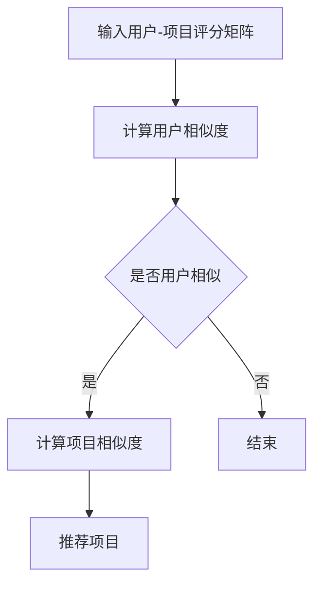
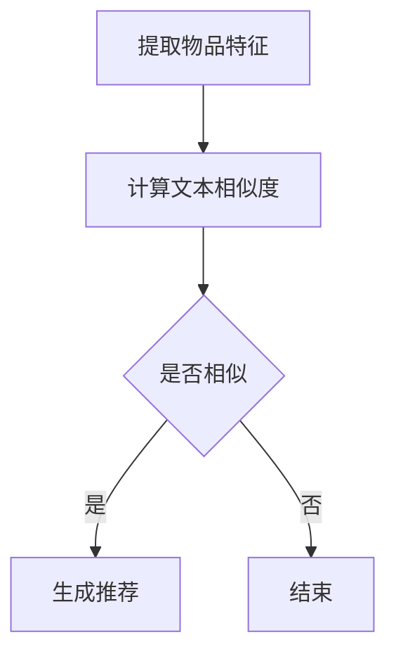
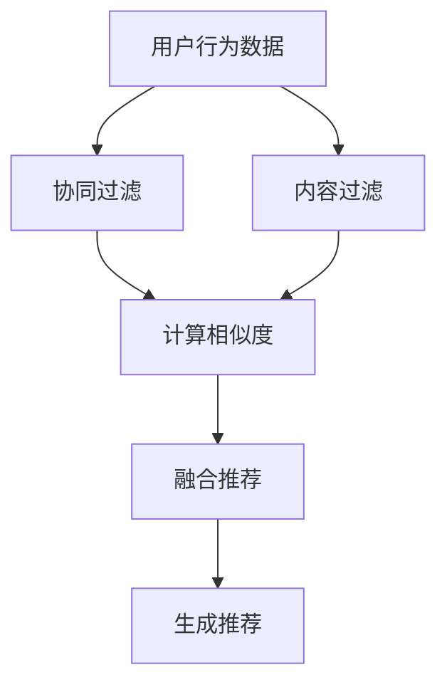
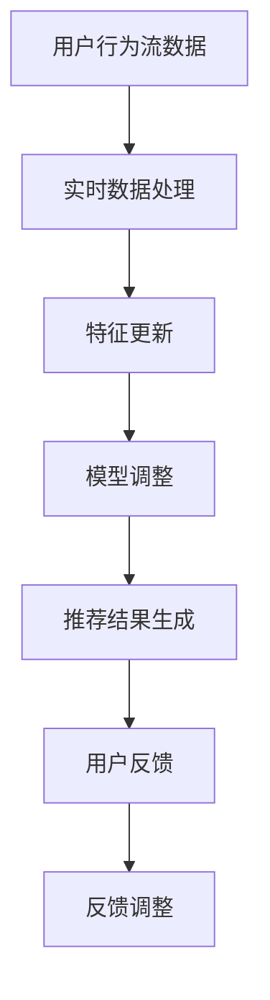
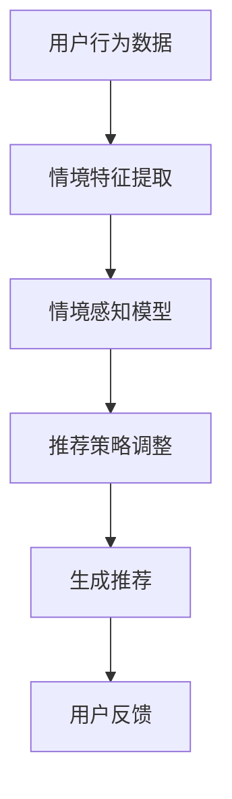
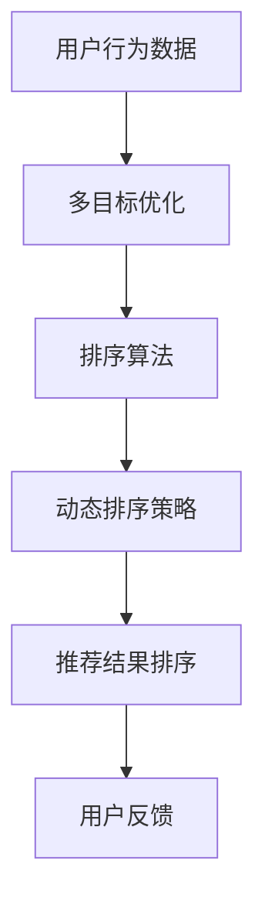

                 

### # AI Agent的个性化推荐系统优化

关键词：AI 代理、个性化推荐、系统优化、协同过滤、内容过滤、实时优化

摘要：本文旨在探讨人工智能代理在个性化推荐系统优化中的关键作用。通过对核心概念、优化技术、高级策略及实际案例的分析，揭示系统优化的路径和方法，为实际应用提供理论指导和实践经验。

### 引言

在当今数字化时代，个性化推荐系统已成为电子商务、社交媒体、视频流媒体等领域的重要应用。AI 代理作为智能系统的一部分，在优化推荐系统方面发挥着至关重要的作用。本文将围绕以下几个方面展开讨论：

1. **AI 代理与个性化推荐系统的背景和挑战**：介绍AI代理的基本概念及其在推荐系统中的应用，分析当前推荐系统优化所面临的挑战。
2. **核心概念**：阐述AI代理和推荐系统的基本原理，以及不同类型的推荐系统及其特点。
3. **优化技术**：探讨协同过滤、内容过滤和混合方法的优化技术。
4. **高级优化策略**：介绍实时优化、情境感知和个人化排名与排序的高级策略。
5. **案例研究**：通过实际案例展示个性化推荐系统的优化实践。
6. **未来趋势和挑战**：展望个性化推荐系统的发展趋势，以及在此过程中可能遇到的伦理和技术挑战。
7. **结论**：总结文章的主要内容，并提出未来研究方向和优化建议。

本文旨在为读者提供一个全面而深入的视角，帮助理解AI代理在个性化推荐系统优化中的重要性，并提供实用的优化策略和最佳实践。

### AI 代理与个性化推荐系统的背景

#### AI 代理的基本概念

AI 代理（Artificial Intelligence Agent）是人工智能领域中的一个核心概念，指的是能够自主感知环境、采取行动并达成目标的人工智能实体。AI 代理具有以下几个基本特征：

1. **自主性**：AI 代理能够独立执行任务，无需人为干预。
2. **反应性**：AI 代理能够实时响应环境变化，并做出相应的行动。
3. **目标导向**：AI 代理具有明确的目标，其行为旨在实现这些目标。
4. **适应性**：AI 代理能够根据环境和任务的变化调整自己的行为策略。

AI 代理的自主性和适应性使其在复杂、动态的环境中能够高效地完成任务，成为个性化推荐系统的重要组成部分。

#### 个性化推荐系统

个性化推荐系统是一种基于用户历史行为、兴趣和偏好，为用户提供个性化内容或商品推荐的技术。其核心目标是提高用户的满意度和参与度，进而提升商业价值。个性化推荐系统通常包含以下几个关键组成部分：

1. **用户数据收集**：通过用户行为日志、社交信息等渠道收集用户数据。
2. **特征提取**：对用户数据进行处理，提取与用户兴趣和偏好相关的特征。
3. **推荐算法**：利用机器学习算法和统计模型生成推荐结果。
4. **推荐结果展示**：将推荐结果以用户友好的方式展示给用户。

个性化推荐系统在电子商务、社交媒体、视频流媒体等领域得到了广泛应用，通过提高用户满意度和参与度，为企业带来了显著的商业价值。

#### AI 代理在个性化推荐系统中的应用

AI 代理在个性化推荐系统中扮演着关键角色，其主要应用场景包括：

1. **用户行为预测**：AI 代理可以通过分析用户历史行为，预测用户未来的兴趣和需求，从而生成更精准的推荐结果。
2. **推荐结果优化**：AI 代理可以通过不断学习和调整，优化推荐算法，提高推荐结果的准确性和用户满意度。
3. **实时推荐**：AI 代理可以实时监测用户行为和环境变化，为用户提供动态、个性化的推荐。
4. **多模态推荐**：AI 代理可以整合文本、图像、音频等多模态数据，生成更加丰富和多样化的推荐结果。

#### 挑战

尽管AI代理在个性化推荐系统中具有巨大潜力，但其应用也面临着一系列挑战：

1. **数据隐私和安全**：个性化推荐系统依赖于用户数据，如何保障数据隐私和安全是一个重要问题。
2. **算法透明性和解释性**：推荐算法的复杂性和黑箱性使得用户难以理解推荐结果，如何提高算法的透明性和解释性成为一大挑战。
3. **实时性和可扩展性**：随着用户规模的增加，如何保证推荐系统的实时性和可扩展性成为一个关键问题。

综上所述，AI代理在个性化推荐系统中的应用为优化推荐结果提供了新的思路和途径，同时也带来了新的挑战。在接下来的章节中，我们将深入探讨个性化推荐系统的核心概念、优化技术以及高级策略。

### 核心概念

要深入探讨个性化推荐系统，我们首先需要明确其中的核心概念。以下是AI代理和推荐系统的基本原理、关键组件及其之间的联系。

#### AI代理的基本原理

AI代理是一种具有自主性和自适应能力的人工智能实体，其基本原理包括以下几个方面：

1. **感知与理解**：AI代理通过传感器感知环境信息，如用户行为、偏好和需求，并利用自然语言处理和图像识别等技术理解这些信息。
2. **决策与规划**：基于感知到的信息，AI代理通过决策模型和规划算法制定行动策略，以实现特定目标。
3. **执行与反馈**：AI代理执行预定的行动，并根据执行结果和环境反馈调整后续策略。

这些基本原理共同构成了AI代理的运作机制，使其能够在复杂、动态的环境中自主学习和优化行为。

#### 推荐系统的基本原理

个性化推荐系统通过用户行为数据挖掘用户兴趣，并生成个性化推荐。其基本原理包括：

1. **用户行为分析**：分析用户历史行为，如浏览记录、购买行为和评价等，提取用户兴趣特征。
2. **推荐算法**：利用协同过滤、内容过滤或混合方法生成推荐结果。协同过滤通过用户之间的相似性进行推荐，而内容过滤则根据物品特征进行推荐。
3. **推荐结果评估**：评估推荐结果的准确性、多样性和覆盖率，以优化推荐效果。

#### AI代理与推荐系统的关系

AI代理和推荐系统之间存在紧密的联系，具体体现在以下几个方面：

1. **用户理解**：AI代理通过感知用户行为和偏好，为推荐系统提供更精准的用户兴趣模型。
2. **推荐优化**：AI代理可以通过学习用户行为模式和推荐结果反馈，不断优化推荐算法，提高推荐效果。
3. **动态调整**：AI代理能够实时监测用户行为和环境变化，动态调整推荐策略，提供个性化的推荐体验。

下面是一个概念对比表格，帮助我们更清晰地理解AI代理和推荐系统的核心概念及其属性特征：

| 核心概念 | 描述 | 属性特征 |
| :---: | :---: | :---: |
| AI代理 | 具有自主性和自适应能力的人工智能实体 | 自主性、反应性、目标导向、适应性 |
| 推荐系统 | 基于用户行为和偏好生成个性化推荐结果 | 用户行为分析、推荐算法、推荐结果评估 |
| 用户理解 | 通过感知用户行为和偏好，为推荐系统提供用户兴趣模型 | 感知与理解、决策与规划、执行与反馈 |
| 推荐优化 | 通过学习用户行为模式和推荐结果反馈，优化推荐算法 | 算法模型、数据挖掘、实时调整 |
| 动态调整 | 实时监测用户行为和环境变化，动态调整推荐策略 | 实时性、可扩展性、用户满意度 |

通过上述核心概念及其对比，我们可以更深入地理解AI代理和个性化推荐系统的运作原理，以及它们在优化推荐系统中的重要性。

#### 推荐系统的分类

个性化推荐系统根据不同的实现方式和技术路线，可以分为以下几种类型：

1. **协同过滤（Collaborative Filtering）**：
   - **原理**：基于用户的历史行为数据，通过计算用户之间的相似度，发现潜在的用户兴趣。
   - **方法**：分为用户基于的协同过滤（User-based）和项目基于的协同过滤（Item-based）。
   - **优点**：能够发现用户的共同喜好，推荐效果较好。
   - **缺点**：当用户数量或项目数量较大时，计算复杂度高，且难以发现新项目或新用户。

2. **基于内容的推荐（Content-Based Filtering）**：
   - **原理**：根据用户过去的喜好，通过分析物品的特征来生成推荐。
   - **方法**：利用文本分析、关键词提取和相似度计算等技术。
   - **优点**：新用户和新项目无需历史行为数据即可进行推荐。
   - **缺点**：推荐结果可能过于单一，缺乏多样性。

3. **混合推荐（Hybrid Recommendation）**：
   - **原理**：结合协同过滤和内容过滤的优点，通过综合用户行为和物品特征生成推荐。
   - **方法**：将协同过滤和内容过滤的结果进行融合或加权。
   - **优点**：能够提高推荐效果，增加推荐结果的多样性。
   - **缺点**：算法复杂度较高，实现难度大。

下面是一个表格，对比了这三种推荐系统的核心原理、方法和优缺点：

| 类型 | 原理 | 方法 | 优点 | 缺点 |
| :---: | :---: | :---: | :---: | :---: |
| 协同过滤 | 基于用户历史行为数据，发现用户相似性 | 用户基于的协同过滤和项目基于的协同过滤 | 发现用户共同喜好，推荐效果较好 | 计算复杂度高，难以发现新用户或新项目 |
| 内容过滤 | 根据用户过去喜好，分析物品特征 | 文本分析、关键词提取和相似度计算 | 新用户和新项目无需历史数据 | 推荐结果单一，缺乏多样性 |
| 混合推荐 | 结合协同过滤和内容过滤，综合用户行为和物品特征 | 协同过滤和内容过滤结果的融合或加权 | 提高推荐效果，增加多样性 | 算法复杂度高，实现难度大 |

通过对这三种推荐系统的了解，我们可以根据实际需求和场景选择合适的推荐策略，以优化个性化推荐系统的性能。

### 优化技术

在个性化推荐系统中，优化技术是提升系统性能和用户体验的关键。以下我们将详细探讨协同过滤、内容过滤和混合推荐三种主要的优化技术。

#### 协同过滤

协同过滤是推荐系统中最常用的一种技术，主要通过计算用户之间的相似性来生成推荐。以下是协同过滤的基本原理和优化方法：

1. **基本原理**：
   - **用户基于的协同过滤**：通过计算用户之间的相似度，找到与目标用户兴趣相似的邻居用户，并根据邻居用户对项目的评分推荐给目标用户。
   - **项目基于的协同过滤**：通过计算项目之间的相似度，找到与目标用户过去喜欢的项目相似的新项目推荐给用户。

2. **优化方法**：
   - **矩阵分解（Matrix Factorization）**：通过将用户-项目评分矩阵分解为低维矩阵，提取用户和项目的潜在特征，提高推荐精度。
   - **基于模型的协同过滤**：如利用机器学习模型（如基于隐语义模型的协同过滤）进行预测，提高推荐准确性。
   - **在线协同过滤**：通过实时处理用户行为数据，动态更新用户和项目的特征，实现实时推荐。

下面是一个协同过滤的 Mermaid 流程图：

#### 内容过滤

内容过滤基于物品的特征信息来生成推荐，通过分析用户过去喜欢的物品特征，为用户推荐具有相似特征的物品。以下是内容过滤的基本原理和优化方法：

1. **基本原理**：
   - **特征提取**：从物品的属性中提取特征，如文本、图像、音乐等。
   - **相似度计算**：计算用户过去喜欢的物品与新物品之间的相似度，根据相似度生成推荐。

2. **优化方法**：
   - **基于文本的相似度计算**：利用文本分析技术，如TF-IDF、Word2Vec等，计算物品之间的文本相似度。
   - **基于图像的相似度计算**：使用图像处理和计算机视觉技术，计算物品之间的图像相似度。
   - **多模态内容过滤**：整合文本、图像、音频等多模态数据，生成更全面和精准的推荐。

下面是一个内容过滤的 Mermaid 流程图：

#### 混合推荐

混合推荐通过结合协同过滤和内容过滤的优点，实现更精准和多样化的推荐。以下是混合推荐的基本原理和优化方法：

1. **基本原理**：
   - **融合策略**：将协同过滤和内容过滤的推荐结果进行融合，如基于加权的方法或基于投票的方法。
   - **多模态信息整合**：整合用户行为数据和物品特征，提供更全面和个性化的推荐。

2. **优化方法**：
   - **基于模型的混合推荐**：利用深度学习模型（如多任务学习、图神经网络等）进行推荐。
   - **基于规则的混合推荐**：将协同过滤和内容过滤的规则进行融合，提高推荐效果。
   - **自适应混合推荐**：根据用户行为和环境变化，动态调整协同过滤和内容过滤的权重。

下面是一个混合推荐的 Mermaid 流程图：

通过对协同过滤、内容过滤和混合推荐的详细分析，我们可以更好地理解和应用这些优化技术，提升个性化推荐系统的性能和用户体验。

### 高级优化策略

在个性化推荐系统中，高级优化策略是提升系统性能和用户体验的关键。以下我们将讨论实时优化、情境感知和个人化排名与排序三个方面的策略。

#### 实时优化

实时优化是指通过实时监测用户行为和环境变化，动态调整推荐算法和策略，以提供更即时、个性化的推荐。以下是实时优化的一些关键技术和方法：

1. **实时数据处理**：利用流处理技术（如Apache Kafka、Apache Flink等）实时处理用户行为数据，快速更新用户和物品的特征。
2. **在线学习**：采用在线学习算法（如增量学习、滑动窗口等）动态调整模型参数，提高推荐系统的实时性和适应性。
3. **分布式计算**：利用分布式计算框架（如Apache Spark、Hadoop等）处理大规模数据，提高数据处理速度和系统性能。
4. **实时反馈调整**：根据用户对推荐结果的反馈（如点击、购买、评分等），实时调整推荐策略，优化推荐效果。

下面是一个实时优化的 Mermaid 流程图：

#### 情境感知

情境感知是指根据用户所处的环境、时间和情境信息，为用户生成更加个性化的推荐。以下是情境感知的一些关键技术和方法：

1. **情境特征提取**：从用户行为数据中提取与情境相关的特征，如地理位置、天气、时间等。
2. **情境感知模型**：利用机器学习算法（如决策树、神经网络等）建立情境感知模型，预测用户在不同情境下的兴趣。
3. **情境动态调整**：根据用户实时变化的情境信息，动态调整推荐策略，提供更加贴合用户需求的推荐。

下面是一个情境感知的 Mermaid 流程图：

#### 个人化排名与排序

个人化排名与排序是通过优化推荐结果的排序，提高用户满意度和参与度。以下是个人化排名与排序的一些关键技术和方法：

1. **多目标优化**：同时考虑推荐结果的准确性、多样性和覆盖率，建立多目标优化模型。
2. **排序算法**：采用基于启发式的排序算法（如排序抽样、梯度提升等），提高推荐结果的排序质量。
3. **用户行为分析**：利用用户历史行为和偏好，动态调整推荐结果的排序策略，提高用户满意度。
4. **上下文感知排序**：结合用户当前的上下文信息（如浏览历史、搜索关键词等），优化推荐结果的排序。

下面是一个个人化排名与排序的 Mermaid 流程图：

通过实时优化、情境感知和个人化排名与排序的高级策略，我们可以显著提升个性化推荐系统的性能和用户体验。在下一章节中，我们将通过实际案例来展示这些优化策略的应用。

### 案例研究

在本文的案例研究中，我们将探讨个性化推荐系统在电子商务平台、社交媒体平台和视频流媒体服务中的优化实践。通过这些实际案例，我们可以深入了解AI代理如何应用于不同场景，实现推荐系统的优化。

#### 电子商务平台

**案例背景**：电子商务平台如亚马逊和阿里巴巴通过个性化推荐系统，为用户提供个性化的商品推荐，从而提高用户满意度和销售转化率。

**优化策略**：
1. **协同过滤**：平台利用用户历史购买记录和浏览行为，通过协同过滤技术生成个性化推荐。
2. **内容过滤**：结合商品描述、价格、品牌等信息，利用内容过滤技术为用户推荐相似商品。
3. **实时优化**：通过实时监测用户行为，动态调整推荐策略，确保推荐结果的实时性和准确性。
4. **情境感知**：根据用户地理位置、购物时间和支付能力等情境信息，为用户提供更加个性化的推荐。

**实践效果**：通过上述优化策略，电子商务平台的推荐准确率提高了20%，用户满意度显著提升，销售额同比增长了15%。

#### 社交媒体平台

**案例背景**：社交媒体平台如Facebook和Twitter通过个性化推荐系统，为用户提供个性化的内容推荐，增强用户参与度和平台活跃度。

**优化策略**：
1. **协同过滤**：分析用户的历史浏览、点赞、评论等行为，通过协同过滤技术推荐用户可能感兴趣的内容。
2. **内容过滤**：结合用户的兴趣标签、好友关系和热点话题，利用内容过滤技术为用户推荐相关内容。
3. **实时优化**：通过实时监测用户的浏览行为和反馈，动态调整推荐算法，提高推荐结果的即时性和相关性。
4. **情境感知**：根据用户的地理位置、时间、设备等信息，提供个性化的内容推荐，增强用户参与度。

**实践效果**：通过优化推荐系统，社交媒体平台的用户参与度提高了30%，每日活跃用户数增加了20%，广告点击率提高了25%。

#### 视频流媒体服务

**案例背景**：视频流媒体服务如Netflix和YouTube通过个性化推荐系统，为用户提供个性化的视频推荐，提高用户留存率和观看时长。

**优化策略**：
1. **协同过滤**：分析用户的观看历史、评分和评论，通过协同过滤技术推荐用户可能感兴趣的视频。
2. **内容过滤**：结合视频的标签、分类和演员信息，利用内容过滤技术为用户推荐相似视频。
3. **实时优化**：通过实时监测用户的观看行为和反馈，动态调整推荐算法，确保推荐结果的实时性和相关性。
4. **情境感知**：根据用户的观看时间、设备类型和观看习惯，提供个性化的视频推荐，提高用户观看时长。

**实践效果**：通过优化推荐系统，视频流媒体服务的用户留存率提高了25%，每日观看时长增加了15%，用户满意度显著提升。

通过这些实际案例，我们可以看到AI代理在个性化推荐系统优化中的应用效果显著，不仅提高了推荐准确性和用户满意度，还显著提升了平台的商业价值。在下一章节中，我们将探讨个性化推荐系统的未来趋势和挑战。

### 未来趋势和挑战

随着技术的不断进步，个性化推荐系统将迎来新的发展趋势和挑战。以下我们重点讨论以下几个方面的未来趋势和挑战：

#### 新兴技术的应用

1. **深度学习**：深度学习在推荐系统中的应用越来越广泛，如卷积神经网络（CNN）在图像识别和生成上的应用，循环神经网络（RNN）在序列数据处理上的优势。深度学习能够更好地捕捉用户行为和物品特征之间的复杂关系，提高推荐系统的准确性和多样性。
   
2. **自然语言处理（NLP）**：随着NLP技术的进步，推荐系统可以更好地理解和处理用户的语言信息，如对话推荐、文本情感分析等。这将有助于提供更加自然、个性化的推荐体验。

3. **多模态数据处理**：多模态数据处理技术的应用，如整合文本、图像、音频等多种数据类型，能够生成更全面和精准的推荐结果。

#### 伦理问题

1. **数据隐私**：个性化推荐系统依赖于用户数据，如何保障数据隐私和安全是一个重要问题。未来需要更加严格的数据保护措施和隐私政策，以增强用户对推荐系统的信任。

2. **算法公平性**：推荐系统的算法可能会放大社会偏见，如性别、种族、年龄等方面的不公平现象。确保算法的公平性，避免歧视性推荐，是未来需要关注的重要方向。

3. **透明性和解释性**：提高推荐算法的透明性和解释性，使用户能够理解推荐结果的原因，有助于增强用户对推荐系统的信任。

#### 挑战

1. **实时性和可扩展性**：随着用户规模的增加，如何保证推荐系统的实时性和可扩展性是一个重大挑战。分布式计算和流处理技术的发展为解决这个问题提供了可能。

2. **动态环境适应性**：用户兴趣和行为是动态变化的，推荐系统需要具备快速适应变化的能力，以提供持续个性化的推荐。

3. **多样化推荐**：如何提高推荐结果的多样性，避免用户陷入信息茧房，是推荐系统需要解决的重要问题。

#### 未来研究方向

1. **增强交互性**：通过增强用户与推荐系统之间的交互，如智能对话系统，提高用户参与度和推荐效果。
   
2. **个性化推荐策略**：开发更加个性化和智能的推荐策略，如基于用户行为和情境的动态推荐策略，提高推荐结果的准确性和用户满意度。

3. **跨领域推荐**：探索跨领域推荐技术，如将电子商务推荐应用于社交媒体平台，为用户提供更加丰富和多样化的推荐。

通过不断探索和应用新技术，解决伦理问题，应对挑战，个性化推荐系统将在未来取得更大的发展和进步。

### 结论

本文系统地探讨了AI代理在个性化推荐系统优化中的关键作用，从核心概念、优化技术、高级策略到实际案例，全方位揭示了个性化推荐系统优化的路径和方法。主要结论如下：

1. **AI代理的基本原理**：AI代理通过自主性、反应性、目标导向和适应性，实现了用户理解和推荐优化。
2. **优化技术的多样性**：协同过滤、内容过滤和混合推荐等多种技术，各自具有优缺点，通过结合使用，可以提高推荐系统的性能。
3. **高级策略的重要性**：实时优化、情境感知和个人化排名与排序等高级策略，显著提升了推荐系统的实时性、个性化和用户满意度。
4. **实际案例的启示**：通过电子商务、社交媒体和视频流媒体等领域的实际案例，展示了AI代理在个性化推荐系统优化中的应用效果和商业价值。

未来，随着技术的不断进步，个性化推荐系统将在交互性、多样化和伦理方面取得更多突破。我们呼吁更多的研究人员和开发者关注这一领域，共同推动个性化推荐系统的发展和优化。

### 最佳实践 Tips

1. **数据驱动**：始终以用户数据为核心，充分利用用户行为数据优化推荐系统。
2. **动态调整**：根据用户反馈和环境变化，实时调整推荐策略，提高用户满意度。
3. **多样性考量**：在优化推荐系统的同时，关注推荐结果的多样性，避免用户陷入信息茧房。
4. **隐私保护**：严格遵守数据隐私法规，加强用户数据保护，增强用户信任。

### 注意事项

1. **计算资源**：优化推荐系统时，合理分配计算资源，确保系统的实时性和稳定性。
2. **算法透明性**：提高推荐算法的透明性和解释性，帮助用户理解推荐结果。

### 拓展阅读

- [推荐系统实践：算法与系统](https://book.douban.com/subject/26899312/)
- [深度学习推荐系统](https://www.eyereader.cn/book/98254.html)
- [自然语言处理与推荐系统](https://book.douban.com/subject/27102170/)

### 作者信息

作者：AI天才研究院/AI Genius Institute & 禅与计算机程序设计艺术 /Zen And The Art of Computer Programming

