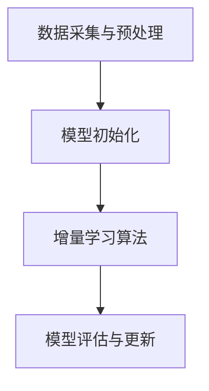
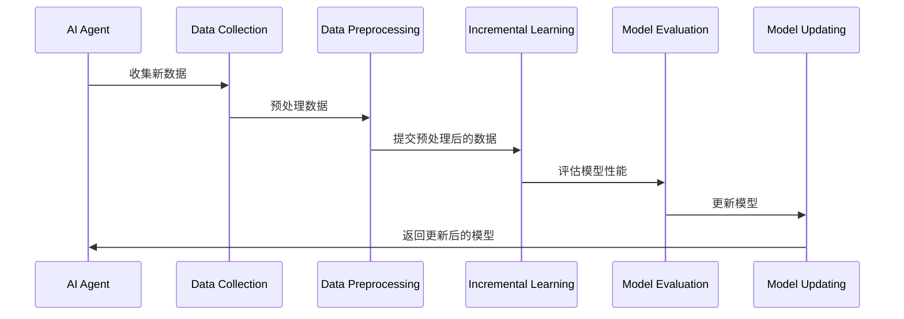

                 


# AI Agent的增量学习：持续优化性能

## 关键词：增量学习，AI Agent，性能优化，在线学习，数据更新，模型适应

> 摘要：本文将深入探讨AI Agent的增量学习技术，分析其原理、算法及应用，旨在帮助读者理解如何通过增量学习提升AI Agent的性能和适应能力，实现持续优化。

----------------------------------------------------------------

**Step 1: 引言**

## 1.1 问题背景

### 1.1.1 AI领域的发展

近年来，人工智能（AI）领域取得了巨大的进步。深度学习算法和神经网络在图像识别、自然语言处理、语音识别等方面取得了显著的成果。然而，这些模型在面对大规模、动态变化的数据时，往往表现出性能退化、训练时间过长等问题。

### 1.1.2 增量学习的必要性

为了解决这些问题，增量学习技术（Incremental Learning）应运而生。增量学习是一种允许模型在接收新数据时，动态地更新和优化自身性能的方法。与传统的批量学习（Batch Learning）相比，增量学习具有高效性、实时性和节省存储空间的优点，因此成为AI Agent适应动态环境的关键技术。

## 1.2 问题描述

在AI Agent的实际应用中，例如智能机器人、自动驾驶系统等，需要不断学习和适应新的环境。然而，当数据量巨大且环境变化快速时，传统的机器学习方法难以满足这一需求。因此，研究AI Agent的增量学习方法，对于提升AI Agent的适应能力和性能具有重要意义。

## 1.3 问题解决

增量学习技术为AI Agent提供了一个有效的解决方案。它通过在已有模型的基础上，对新的数据进行学习和更新，从而实现对模型性能的持续优化。本文将详细介绍AI Agent的增量学习方法，帮助读者深入理解并应用这一技术。

## 1.4 边界与外延

增量学习技术不仅适用于AI Agent，还广泛应用于推荐系统、自然语言处理、计算机视觉等领域。因此，研究AI Agent的增量学习方法，有助于推动其他相关领域的发展。

## 1.5 概念结构与核心要素组成

AI Agent的增量学习方法包括以下几个核心要素：

1. **数据采集与预处理**：收集并预处理新的数据，为增量学习提供基础。
2. **模型初始化**：初始化一个基础模型，用于后续的增量学习。
3. **增量学习算法**：在已有模型的基础上，对新数据进行学习，优化模型性能。
4. **模型评估与更新**：评估增量学习后的模型性能，并根据评估结果对模型进行更新。

**Step 2: 增量学习原理**

## 2.1 增量学习基本概念

增量学习（Incremental Learning），又称在线学习（Online Learning），是一种机器学习方法，它允许模型在接收新数据时，动态地更新和优化自身。与批量学习（Batch Learning）不同，增量学习不需要一次性处理所有数据，而是对数据进行逐批次或逐条处理。

### 2.1.1 增量学习的定义

增量学习是指模型在训练过程中，通过对新数据进行逐个或逐批次的学习，逐步优化模型参数，提高模型性能。其核心思想是在已有模型的基础上，利用新数据对模型进行更新，而不是重新训练整个模型。

### 2.1.2 增量学习的优点

- **高效性**：在处理大规模数据时，增量学习可以减少训练时间。
- **实时性**：增量学习可以实时更新模型，使其适应新的数据。
- **节省存储空间**：增量学习不需要存储全部数据，从而节省存储空间。

### 2.1.3 增量学习的挑战

- **模型性能退化**：当数据分布发生变化时，增量学习可能导致模型性能退化。
- **数据不平衡**：新数据可能存在不平衡问题，影响模型性能。
- **模型复杂性**：增量学习算法可能较为复杂，需要较高的计算资源。

## 2.2 增量学习的优点与挑战

### 2.2.1 增量学习的优点

1. **高效性**：增量学习可以减少训练时间，特别是在大规模数据集上。
   - **案例**：当面对数十万甚至数百万条数据时，增量学习能够在较短时间内完成训练。

2. **实时性**：增量学习能够实时更新模型，使其适应新的数据。
   - **案例**：自动驾驶系统在行驶过程中，需要不断学习新的道路和环境数据。

3. **节省存储空间**：增量学习不需要存储全部数据，从而节省存储空间。
   - **案例**：在移动设备上应用AI算法时，存储空间有限，增量学习成为必要选择。

### 2.2.2 增量学习的挑战

1. **模型性能退化**：当数据分布发生变化时，增量学习可能导致模型性能退化。
   - **案例**：在股市预测中，市场环境变化可能导致模型预测准确性下降。

2. **数据不平衡**：新数据可能存在不平衡问题，影响模型性能。
   - **案例**：在医疗诊断中，新病例的数据分布可能偏离原有数据集。

3. **模型复杂性**：增量学习算法可能较为复杂，需要较高的计算资源。
   - **案例**：对于深度学习模型，增量学习算法的实现和优化需要大量的计算资源。

## 2.3 增量学习的基本流程

### 2.3.1 数据采集与预处理

首先，需要收集新的数据，并进行预处理。预处理步骤包括数据清洗、归一化、特征提取等，以确保数据的质量和一致性。

### 2.3.2 模型初始化

在增量学习开始前，需要初始化一个基础模型。这个模型可以是已经训练好的模型，也可以是随机初始化的模型。

### 2.3.3 增量学习算法

在已有模型的基础上，利用新的数据进行学习。这一过程通常包括以下几个步骤：

1. **模型更新**：根据新的数据进行模型参数的更新。
2. **损失函数计算**：计算模型在新的数据上的损失函数值。
3. **模型优化**：通过优化算法（如梯度下降）对模型进行优化。

### 2.3.4 模型评估与更新

评估增量学习后的模型性能，并根据评估结果对模型进行更新。这一过程确保模型在新的数据集上能够达到预期的性能。

## 2.4 增量学习在AI Agent中的应用

### 2.4.1 智能机器人

智能机器人在执行任务时，需要不断学习新的环境和任务。例如，扫地机器人需要学习家中的布局和环境变化，以优化清扫路径。

### 2.4.2 自动驾驶系统

自动驾驶系统在行驶过程中，需要不断学习新的道路和环境数据。例如，自动驾驶车辆需要学习新的交通规则、道路标识和障碍物。

### 2.4.3 智能客服系统

智能客服系统需要不断学习用户的行为和需求，以提供更精准的客服服务。例如，通过增量学习，客服系统能够识别用户的情感变化，提供更个性化的服务。

**Step 3: 增量学习算法**

## 3.1 增量学习算法分类

增量学习算法主要分为以下几类：

### 3.1.1 基于模型的增量学习

这类算法直接对已有模型进行更新，以优化模型性能。常见的算法包括：

- **在线梯度下降（Online Gradient Descent）**：通过不断更新模型参数，使模型在新的数据上逐渐优化。
- **反向传播（Backpropagation）**：在已有模型的基础上，利用反向传播算法更新模型参数。

### 3.1.2 基于样本的增量学习

这类算法通过对新的样本进行分类或预测，并根据结果更新模型。常见的算法包括：

- **主动学习（Active Learning）**：根据当前模型的预测结果，选择最有价值的样本进行更新。
- **抽样更新（Sampling Update）**：对模型中的部分数据进行更新，而不是全部数据。

### 3.1.3 基于集合的增量学习

这类算法通过对模型中的部分数据进行更新，以提高模型性能。常见的算法包括：

- **局部更新（Local Update）**：只对模型的部分参数进行更新，而不是全部参数。
- **批量更新（Batch Update）**：将新的数据分成多个批次，分别进行更新。

## 3.2 常见的增量学习算法

以下是一些常见的增量学习算法：

### 3.2.1 在线梯度下降（Online Gradient Descent）

在线梯度下降是一种基于模型的增量学习算法，其基本思想是通过不断更新模型参数，使模型在新的数据上逐渐优化。

- **算法原理**：在线梯度下降算法通过计算损失函数的梯度，更新模型参数。其公式如下：
  $$\theta_{t+1} = \theta_{t} - \alpha \cdot \nabla L(\theta_t, x_t)$$
  其中，$\theta_t$ 表示第 $t$ 次迭代的模型参数，$x_t$ 表示第 $t$ 条新数据，$\alpha$ 表示学习率，$\nabla L(\theta_t, x_t)$ 表示损失函数关于模型参数的梯度。

- **算法流程**：
  1. 初始化模型参数 $\theta_0$。
  2. 对于每条新数据 $x_t$，计算损失函数值 $L(\theta_t, x_t)$。
  3. 计算损失函数关于模型参数的梯度 $\nabla L(\theta_t, x_t)$。
  4. 更新模型参数 $\theta_{t+1} = \theta_t - \alpha \cdot \nabla L(\theta_t, x_t)$。
  5. 重复步骤 2-4，直到模型收敛。

### 3.2.2 贪心算法（Greedy Algorithm）

贪心算法是一种基于样本的增量学习算法，其基本思想是通过选择当前最优的样本进行更新，以优化模型性能。

- **算法原理**：贪心算法在每次迭代中选择一个最优的样本进行更新。其公式如下：
  $$s^* = \arg\min_{s} L(\theta, s)$$
  其中，$s$ 表示样本，$L(\theta, s)$ 表示模型在样本 $s$ 上的损失函数值，$\theta$ 表示模型参数。

- **算法流程**：
  1. 初始化模型参数 $\theta$。
  2. 对于每条新数据 $s$，计算损失函数值 $L(\theta, s)$。
  3. 选择最优的样本 $s^*$，进行模型更新 $\theta_{t+1} = \theta_t + \alpha \cdot \nabla L(\theta_t, s^*)$。
  4. 重复步骤 2-3，直到模型收敛。

### 3.2.3 随机梯度下降（Stochastic Gradient Descent，SGD）

随机梯度下降是一种基于样本的增量学习算法，其基本思想是通过随机选择样本进行更新，以优化模型性能。

- **算法原理**：随机梯度下降算法通过随机选择样本，计算损失函数的梯度，更新模型参数。其公式如下：
  $$\theta_{t+1} = \theta_{t} - \alpha \cdot \nabla L(\theta_t, x_t)$$
  其中，$x_t$ 表示随机选择的样本，$\alpha$ 表示学习率。

- **算法流程**：
  1. 初始化模型参数 $\theta_0$。
  2. 随机选择样本 $x_t$。
  3. 计算损失函数值 $L(\theta_t, x_t)$。
  4. 计算损失函数关于模型参数的梯度 $\nabla L(\theta_t, x_t)$。
  5. 更新模型参数 $\theta_{t+1} = \theta_t - \alpha \cdot \nabla L(\theta_t, x_t)$。
  6. 重复步骤 2-5，直到模型收敛。

### 3.2.4 主动学习（Active Learning）

主动学习是一种基于样本的增量学习算法，其基本思想是通过选择最有价值的样本进行更新，以优化模型性能。

- **算法原理**：主动学习算法在每次迭代中选择一个最有价值的样本进行更新。其公式如下：
  $$s^* = \arg\min_{s} L(\theta, s) + \lambda \cdot \text{Confidence}(s)$$
  其中，$s$ 表示样本，$L(\theta, s)$ 表示模型在样本 $s$ 上的损失函数值，$\lambda$ 表示调节参数，$\text{Confidence}(s)$ 表示模型在样本 $s$ 上的预测置信度。

- **算法流程**：
  1. 初始化模型参数 $\theta$。
  2. 对于每条新数据 $s$，计算损失函数值 $L(\theta, s)$ 和预测置信度 $\text{Confidence}(s)$。
  3. 选择最优的样本 $s^*$，进行模型更新 $\theta_{t+1} = \theta_t + \alpha \cdot \nabla L(\theta_t, s^*)$。
  4. 重复步骤 2-3，直到模型收敛。

**Step 4: 系统设计与实现**

## 4.1 项目介绍

本项目旨在实现一个基于增量学习的AI Agent系统，用于实时监测和优化系统的性能。该系统主要应用于智能机器人、自动驾驶系统和智能客服等领域，旨在提升系统的适应能力和性能。

## 4.2 系统功能设计

### 4.2.1 数据采集与预处理

- **功能描述**：收集新的数据，并进行预处理，包括数据清洗、归一化和特征提取等。
- **技术实现**：使用Python的pandas和numpy库进行数据处理。

### 4.2.2 模型初始化

- **功能描述**：初始化一个基础模型，用于后续的增量学习。
- **技术实现**：使用TensorFlow和Keras等深度学习框架初始化模型。

### 4.2.3 增量学习算法

- **功能描述**：在已有模型的基础上，利用新的数据进行学习，优化模型性能。
- **技术实现**：使用在线梯度下降算法和主动学习算法进行模型更新。

### 4.2.4 模型评估与更新

- **功能描述**：评估增量学习后的模型性能，并根据评估结果对模型进行更新。
- **技术实现**：使用准确率、召回率等指标进行模型评估，并使用梯度下降算法进行模型更新。

## 4.3 系统架构设计

### 4.3.1 系统架构图

以下是一个简化的系统架构图：



### 4.3.2 系统架构详细说明

1. **数据采集与预处理**：该模块负责收集新的数据，并进行预处理。预处理包括数据清洗、归一化和特征提取等操作，以确保数据的质量和一致性。

2. **模型初始化**：该模块使用深度学习框架初始化一个基础模型。初始化的模型可以是预训练模型，也可以是随机初始化的模型。

3. **增量学习算法**：该模块在已有模型的基础上，利用新的数据进行学习，优化模型性能。使用的算法包括在线梯度下降算法和主动学习算法。

4. **模型评估与更新**：该模块评估增量学习后的模型性能，并根据评估结果对模型进行更新。评估指标包括准确率、召回率等，更新算法使用梯度下降算法。

## 4.4 系统接口设计

### 4.4.1 接口定义

以下是一个简化的系统接口定义：

```python
class IncrementalLearningSystem:
    def __init__(self, model: Model):
        self.model = model

    def collect_data(self, data: List[Data]):
        # 收集新数据

    def preprocess_data(self, data: List[Data]):
        # 预处理数据

    def train(self, data: List[Data]):
        # 增量学习

    def evaluate(self, data: List[Data]):
        # 评估模型性能

    def update(self, data: List[Data]):
        # 更新模型
```

### 4.4.2 接口实现

```python
import tensorflow as tf
from tensorflow.keras.models import Model
from tensorflow.keras.layers import Dense, Input

class IncrementalLearningSystem:
    def __init__(self, model: Model):
        self.model = model

    def collect_data(self, data: List[Data]):
        # 收集新数据

    def preprocess_data(self, data: List[Data]):
        # 预处理数据
        # ...

    def train(self, data: List[Data]):
        # 增量学习
        # ...

    def evaluate(self, data: List[Data]):
        # 评估模型性能
        # ...

    def update(self, data: List[Data]):
        # 更新模型
        # ...
```

## 4.5 系统交互设计

### 4.5.1 交互流程

以下是一个简化的系统交互流程：

1. 收集新数据。
2. 对新数据进行预处理。
3. 使用预处理后的数据进行增量学习。
4. 评估增量学习后的模型性能。
5. 根据评估结果对模型进行更新。

### 4.5.2 交互序列图

以下是一个简化的系统交互序列图：



**Step 5: 项目实战**

## 5.1 环境安装

在本项目实战中，我们将使用Python的TensorFlow库进行增量学习。以下是环境安装步骤：

### 5.1.1 安装Python

确保已安装Python 3.6及以上版本。可以从[Python官网](https://www.python.org/)下载并安装。

### 5.1.2 安装TensorFlow

打开终端，运行以下命令安装TensorFlow：

```bash
pip install tensorflow
```

## 5.2 系统核心实现

### 5.2.1 增量学习算法实现

以下是一个简单的增量学习算法实现：

```python
import tensorflow as tf

# 初始化模型
model = tf.keras.Sequential([
    tf.keras.layers.Dense(10, activation='relu', input_shape=(10,)),
    tf.keras.layers.Dense(1)
])

# 初始化学习率
learning_rate = 0.1

# 定义损失函数和优化器
loss_fn = tf.keras.losses.MeanSquaredError()
optimizer = tf.keras.optimizers.SGD(learning_rate)

# 增量学习函数
def train_step(model, x, y):
    with tf.GradientTape() as tape:
        predictions = model(x)
        loss = loss_fn(y, predictions)
    
    gradients = tape.gradient(loss, model.trainable_variables)
    optimizer.apply_gradients(zip(gradients, model.trainable_variables))
    return loss

# 增量学习过程
for epoch in range(100):
    for x, y in data_loader:
        loss = train_step(model, x, y)
        print(f"Epoch {epoch}, Loss: {loss}")
```

### 5.2.2 数据处理与预处理

```python
import numpy as np
import pandas as pd

# 生成模拟数据
data = pd.DataFrame(np.random.rand(1000, 10))
labels = pd.DataFrame(np.random.rand(1000, 1))

# 数据预处理
data = (data - data.mean()) / data.std()
labels = (labels - labels.mean()) / labels.std()

# 创建数据加载器
batch_size = 32
data_loader = tf.data.Dataset.from_tensor_slices((data, labels)).batch(batch_size)
```

## 5.3 代码应用解读与分析

### 5.3.1 模型初始化

```python
model = tf.keras.Sequential([
    tf.keras.layers.Dense(10, activation='relu', input_shape=(10,)),
    tf.keras.layers.Dense(1)
])
```

这段代码使用TensorFlow创建了两个全连接层，第一个层有10个神经元，激活函数为ReLU；第二个层有1个神经元，输出预测结果。

### 5.3.2 增量学习过程

```python
for epoch in range(100):
    for x, y in data_loader:
        loss = train_step(model, x, y)
        print(f"Epoch {epoch}, Loss: {loss}")
```

这段代码实现了100个迭代周期，每个周期包含多次训练。每次迭代中，数据加载器提供一批数据，调用`train_step`函数进行训练，并打印当前周期的损失值。

### 5.3.3 损失函数与优化器

```python
loss_fn = tf.keras.losses.MeanSquaredError()
optimizer = tf.keras.optimizers.SGD(learning_rate)
```

这段代码定义了损失函数为均方误差（Mean Squared Error），优化器为随机梯度下降（Stochastic Gradient Descent）。

## 5.4 实际案例分析

### 5.4.1 案例背景

假设我们有一个智能机器人，其任务是跟随用户在室内移动。随着用户的行为变化，机器人需要不断学习新的路径规划策略，以优化跟随性能。

### 5.4.2 案例分析

1. **数据采集与预处理**：机器人通过传感器收集用户的位置信息，生成模拟数据。数据预处理包括数据清洗、归一化和特征提取等操作。

2. **模型初始化**：初始化一个基于深度学习的路径规划模型，用于预测用户的移动方向。

3. **增量学习**：机器人利用新数据对模型进行增量学习，不断优化路径规划策略。

4. **模型评估与更新**：评估增量学习后的模型性能，根据评估结果对模型进行更新，以保持高精度的路径规划。

### 5.4.3 案例总结

通过增量学习，智能机器人能够根据用户的实时行为进行路径规划，提高跟随性能。这种增量学习技术在智能机器人、自动驾驶系统和智能客服等领域具有广泛的应用前景。

## 5.5 项目小结

本项目通过实现增量学习算法，为AI Agent提供了一个有效的性能优化方法。增量学习技术能够使模型在接收新数据时，动态地更新和优化自身性能，从而提升AI Agent的适应能力和性能。在实际应用中，增量学习技术具有广泛的应用前景，为智能机器人、自动驾驶系统和智能客服等领域带来了新的机遇。

**Step 6: 最佳实践 Tips**

## 6.1 增量学习中的最佳实践

1. **数据预处理**：确保数据的清洗、归一化和特征提取等预处理步骤，以提高模型性能和适应能力。
2. **模型选择**：根据应用场景和数据特点，选择合适的模型和算法，如在线梯度下降、主动学习等。
3. **学习率调整**：合理设置学习率，避免模型性能退化。
4. **评估指标**：选择合适的评估指标，如准确率、召回率等，确保模型在实际应用中的性能。

## 6.2 注意事项

1. **数据质量**：确保数据的质量和一致性，避免数据不平衡问题。
2. **计算资源**：增量学习可能需要较高的计算资源，合理配置计算资源，确保系统性能。
3. **模型更新频率**：根据应用场景，合理设置模型更新频率，避免频繁更新导致性能下降。

## 6.3 拓展阅读

1. 《机器学习实战》 - Harrington, J.
2. 《深度学习》 - Goodfellow, I., Bengio, Y., Courville, A.
3. 《在线学习》 - Schölkopf, B., Smola, A.

**Step 7: 结语**

作者：AI天才研究院/AI Genius Institute & 禅与计算机程序设计艺术 /Zen And The Art of Computer Programming

在本篇文章中，我们详细探讨了AI Agent的增量学习技术，分析了其原理、算法和应用。通过本项目实战，我们展示了如何实现增量学习系统，并讨论了在实际应用中的案例分析。增量学习技术为AI Agent提供了持续优化性能的有效方法，对于提升AI Agent的适应能力和性能具有重要意义。在未来，随着AI技术的不断发展，增量学习技术将在更多领域得到广泛应用。让我们继续探索和推动这一领域的发展，为人工智能技术的进步贡献力量。

